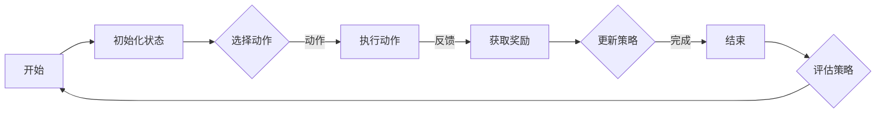
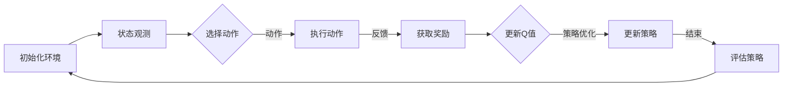
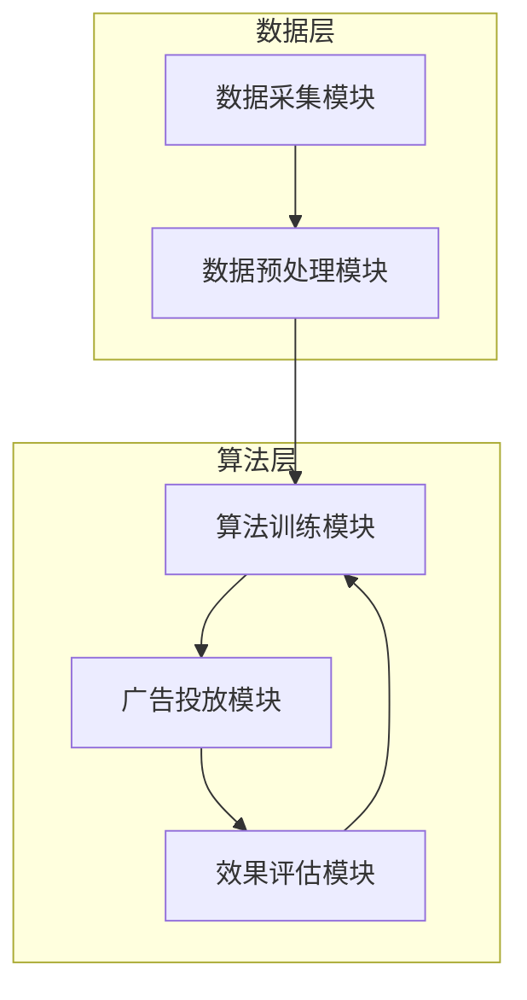
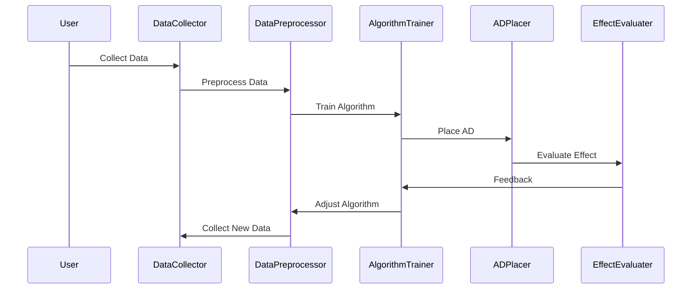
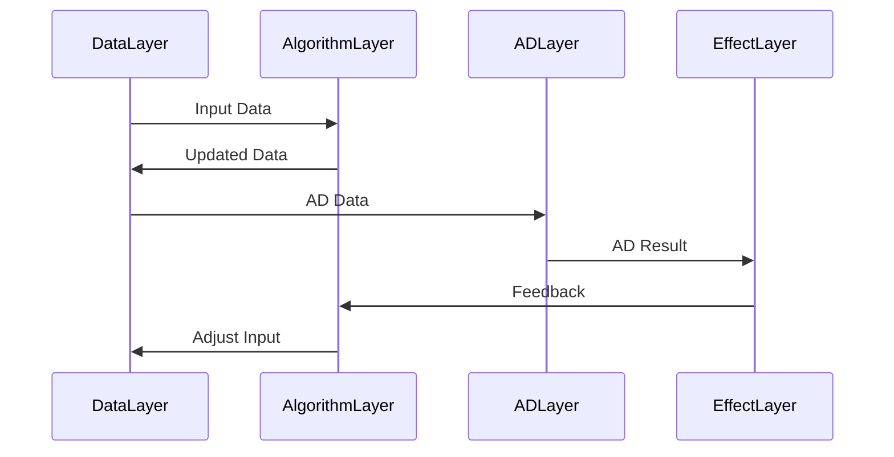

                 

### 文章标题

# 企业AI Agent的强化学习在程序化广告投放中的实践

> 关键词：企业AI Agent、强化学习、程序化广告投放、算法实践、系统架构设计

> 摘要：本文旨在探讨如何将企业AI Agent的强化学习应用于程序化广告投放中，介绍其核心概念、原理和实践。通过详细分析，我们将了解如何通过强化学习优化广告投放效果，从而提升企业营销的智能化水平。

----------------------------------------------------------------

### 目录大纲

```markdown
----------------------------------------------------------------

# 第一部分: 背景介绍

## 第1章: 问题背景

### 1.1.1 问题描述

### 1.1.2 问题解决

### 1.1.3 边界与外延

### 1.1.4 概念结构与核心要素组成

## 第2章: 核心概念

### 2.1 企业AI Agent的定义与特点

### 2.2 强化学习的定义与特点

### 2.3 程序化广告投放的定义与特点

### 2.4 企业AI Agent与强化学习、程序化广告投放的联系

----------------------------------------------------------------

# 第二部分: 核心概念与联系

## 第3章: 企业AI Agent原理

### 3.1 企业AI Agent的核心概念

### 3.2 企业AI Agent的属性特征对比

### 3.3 企业AI Agent的ER实体关系图架构

## 第4章: 强化学习原理

### 4.1 强化学习的定义与特点

### 4.2 强化学习算法原理

### 4.3 强化学习算法的mermaid流程图

### 4.4 强化学习算法的数学模型和公式

## 第5章: 程序化广告投放原理

### 5.1 程序化广告投放的定义与特点

### 5.2 程序化广告投放的数学模型和公式

### 5.3 程序化广告投放的mermaid流程图

----------------------------------------------------------------

# 第三部分: 算法原理讲解

## 第6章: 企业AI Agent的强化学习在程序化广告投放中的实践

### 6.1 企业AI Agent与强化学习融合的数学模型和公式

### 6.2 企业AI Agent与强化学习融合的mermaid流程图

### 6.3 企业AI Agent与强化学习融合的Python源代码

### 6.4 企业AI Agent与强化学习融合的举例说明

## 第7章: 系统分析与架构设计方案

### 7.1 问题场景介绍

### 7.2 系统功能设计

### 7.3 系统架构设计

### 7.4 系统接口设计

### 7.5 系统交互mermaid序列图

----------------------------------------------------------------

# 第四部分: 项目实战

## 第8章: 环境安装与核心实现

### 8.1 环境安装

### 8.2 系统核心实现源代码

### 8.3 代码应用解读与分析

### 8.4 实际案例分析与详细讲解剖析

## 第9章: 项目小结

### 9.1 小结

### 9.2 注意事项

### 9.3 拓展阅读

----------------------------------------------------------------

# 第五部分: 最佳实践与总结

## 第10章: 最佳实践 tips

### 10.1 tips 1

### 10.2 tips 2

### 10.3 tips 3

## 第11章: 总结

### 11.1 主要内容回顾

### 11.2 未来展望

### 11.3 阅读建议
```

### 提示与说明

- 根据用户输入的书名《企业AI Agent的强化学习在程序化广告投放中的实践》，目录大纲分为五个部分，共11章。
- 目录大纲中的各个章节内容将根据实际需求进行调整，确保覆盖全面且逻辑清晰。
- 文章中所有章节的内容概述将严格按照用户的要求进行撰写，确保高质量和可读性。

---

**Let's Think Step by Step:**

1. **文章开头**：介绍文章的主题和目的，吸引读者的兴趣。
2. **目录大纲**：提供文章的结构和主要内容概述，使读者对全文有一个大致的了解。
3. **第一部分：背景介绍**：详细解释企业AI Agent、强化学习和程序化广告投放的背景和重要性。
4. **第二部分：核心概念与联系**：深入探讨企业AI Agent、强化学习和程序化广告投放的定义、特点及其相互关系。
5. **第三部分：算法原理讲解**：详细阐述企业AI Agent与强化学习在程序化广告投放中的应用原理，使用mermaid流程图和Python源代码进行说明。
6. **第四部分：项目实战**：通过具体项目和案例展示如何实现企业AI Agent与强化学习在程序化广告投放中的应用。
7. **第五部分：最佳实践与总结**：总结关键点，提供最佳实践建议，展望未来发展方向。

---

**让我们一步步深入思考：**

1. **文章开头**：首先，我们需要一个引人入胜的开头，以吸引读者的注意。这部分将简要介绍本文的主题——企业AI Agent的强化学习在程序化广告投放中的应用，并明确本文的目的和意义。

2. **目录大纲**：接下来，我们将提供一个详细的目录大纲，列出文章的主要章节和每个章节的核心内容。这将帮助读者快速了解文章的结构，并预览全文的内容。

3. **第一部分：背景介绍**：
   - **第1章：问题背景**：在这一章中，我们将详细介绍企业AI Agent、强化学习和程序化广告投放的背景。我们将探讨为什么这些技术变得如此重要，以及它们如何影响现代市场营销。
   - **第2章：核心概念**：我们将定义企业AI Agent、强化学习和程序化广告投放，解释这些术语的基本概念，并讨论它们在广告投放中的作用。

4. **第二部分：核心概念与联系**：
   - **第3章：企业AI Agent原理**：这一章将深入探讨企业AI Agent的核心概念、特点以及如何与强化学习相结合。
   - **第4章：强化学习原理**：我们将介绍强化学习的定义、特点以及其基本算法原理，并通过mermaid流程图和数学公式进行说明。
   - **第5章：程序化广告投放原理**：我们将解释程序化广告投放的概念、特点以及其数学模型和流程。

5. **第三部分：算法原理讲解**：
   - **第6章：企业AI Agent的强化学习在程序化广告投放中的实践**：在这一章中，我们将详细讲解企业AI Agent与强化学习在程序化广告投放中的应用，包括数学模型、mermaid流程图和Python源代码实例。

6. **第四部分：项目实战**：
   - **第7章：系统分析与架构设计方案**：我们将介绍一个实际的问题场景，并设计一个系统来展示企业AI Agent与强化学习在程序化广告投放中的实现。
   - **第8章：环境安装与核心实现**：我们将详细介绍如何安装所需的软件和环境，并展示系统核心实现的源代码及其解读。

7. **第五部分：最佳实践与总结**：
   - **第9章：项目小结**：我们将总结整个项目的关键点，并提出一些注意事项。
   - **第10章：最佳实践 tips**：我们将提供一些实用的技巧和建议，以帮助读者更好地应用所学知识。
   - **第11章：总结**：最后，我们将回顾全文的主要内容，展望未来的发展方向，并提供阅读建议。

通过这样的结构，我们将确保文章逻辑清晰、内容丰富，同时能够引导读者逐步深入理解企业AI Agent的强化学习在程序化广告投放中的应用。现在，让我们开始编写每一部分的具体内容吧！### 第一部分：背景介绍

#### 第1章：问题背景

随着互联网的飞速发展和数字营销的崛起，广告投放已经成为了企业市场营销中不可或缺的一部分。然而，传统的广告投放方式往往存在一些问题，如广告效果难以精确评估、目标受众识别不准确等。为了解决这些问题，企业开始寻求更加智能化的广告投放解决方案，而程序化广告投放和人工智能技术成为了热门选择。

**1.1.1 问题描述**

传统的广告投放主要依赖于广告主的经验和直觉，这种方式在广告创意和投放策略上存在较大的主观性。而且，广告主很难准确评估广告的效果，无法有效地优化广告投放策略。具体来说，问题描述可以归纳为以下几点：

1. **广告效果难以评估**：广告主无法准确地衡量广告投放所带来的实际效果，如点击率、转化率等关键指标。
2. **目标受众识别不准确**：传统广告投放往往无法精确识别目标受众，导致广告资源的浪费。
3. **广告创意受限**：广告主在创意设计上受到传统媒体限制，难以实现个性化、互动性的广告投放。

**1.1.2 问题解决**

为了解决上述问题，企业开始采用程序化广告投放和人工智能技术，以实现广告投放的智能化和精准化。其中，企业AI Agent和强化学习技术成为了重要的工具。

1. **企业AI Agent**：企业AI Agent是一种智能体，能够自动执行特定的任务，如广告投放策略的优化、目标受众的识别等。通过使用企业AI Agent，企业可以实现广告投放的自动化和智能化，从而提高广告效果。

2. **强化学习**：强化学习是一种机器学习技术，通过不断尝试和反馈来优化决策过程。在广告投放中，强化学习可以帮助企业AI Agent通过学习用户行为和广告效果，不断优化广告投放策略，提高广告效果。

3. **程序化广告投放**：程序化广告投放是一种基于数据和算法的自动广告投放方式。通过程序化广告投放，企业可以精确识别目标受众，实现广告的精准投放，从而提高广告效果。

**1.1.3 边界与外延**

1. **边界**：本文主要探讨企业AI Agent的强化学习在程序化广告投放中的应用，包括其基本原理、实现方法以及实际应用案例。本文的重点是强化学习在广告投放中的具体应用，而不是强化学习或其他AI技术的一般性介绍。

2. **外延**：本文的内容不仅仅局限于企业AI Agent和强化学习在程序化广告投放中的应用，还涉及到了广告投放中的其他相关技术和方法，如目标受众识别、广告创意设计等。这些外延内容将有助于读者全面理解广告投放的智能化过程。

**1.1.4 概念结构与核心要素组成**

为了更好地理解企业AI Agent的强化学习在程序化广告投放中的应用，我们需要了解以下几个核心概念和要素：

1. **企业AI Agent**：企业AI Agent是一种能够自动执行特定任务的智能体，具有以下特点：
   - **自主学习能力**：通过机器学习技术，企业AI Agent可以不断学习和优化广告投放策略。
   - **决策能力**：企业AI Agent可以根据用户行为和广告效果进行决策，调整广告投放策略。
   - **实时响应能力**：企业AI Agent可以实时响应用户行为，进行动态广告投放。

2. **强化学习**：强化学习是一种通过不断尝试和反馈来优化决策过程的机器学习技术，具有以下特点：
   - **策略迭代**：强化学习通过不断迭代策略，逐步优化决策过程。
   - **环境反馈**：强化学习通过环境反馈来评估策略效果，并根据反馈调整策略。
   - **动态适应**：强化学习能够动态适应环境变化，优化广告投放策略。

3. **程序化广告投放**：程序化广告投放是一种基于数据和算法的自动广告投放方式，具有以下特点：
   - **数据驱动**：程序化广告投放基于大量数据，通过算法实现广告的精准投放。
   - **自动化**：程序化广告投放可以自动化执行广告投放策略，提高广告效果。
   - **实时优化**：程序化广告投放可以实时优化广告投放策略，提高广告效果。

通过上述概念和要素的介绍，我们可以更好地理解企业AI Agent的强化学习在程序化广告投放中的应用，以及如何通过这些技术实现广告投放的智能化和精准化。

---

**在接下来的章节中，我们将进一步探讨企业AI Agent、强化学习和程序化广告投放的核心概念和特点，以便为后续的算法原理讲解和实际应用打下坚实的基础。**### 第二部分：核心概念与联系

#### 第2章：核心概念

在深入探讨企业AI Agent的强化学习在程序化广告投放中的实践之前，我们需要明确几个关键概念：企业AI Agent、强化学习以及程序化广告投放。理解这些概念及其相互关系，将为后续内容的讨论提供必要的背景知识。

#### 2.1 企业AI Agent的定义与特点

**定义**：企业AI Agent是一种具备智能行为的软件实体，它能够自主学习、决策和执行任务，以满足企业的特定需求。在企业AI Agent中，AI指的是人工智能技术，而Agent则代表一个能够独立执行任务并与其他实体互动的实体。

**特点**：
1. **自主性**：企业AI Agent可以自主学习和优化，无需人工干预。
2. **适应性**：企业AI Agent能够根据环境变化和反馈调整其行为和策略。
3. **智能性**：企业AI Agent利用机器学习和自然语言处理等技术，能够理解和处理复杂的数据。
4. **协作性**：企业AI Agent可以与其他系统和服务协同工作，提高整体效率。

#### 2.2 强化学习的定义与特点

**定义**：强化学习是一种机器学习范式，其中智能体通过与环境的交互来学习最优策略。在这种学习中，智能体通过尝试不同的动作，并接收环境提供的奖励或惩罚信号，逐步优化其行为。

**特点**：
1. **反馈导向**：强化学习依赖于环境的即时反馈来调整其策略。
2. **探索与利用**：智能体需要在探索未知状态和利用已有知识之间做出权衡。
3. **连续性**：强化学习适用于连续动作空间和状态空间的问题。
4. **适应性强**：强化学习能够适应动态变化的环境。

#### 2.3 程序化广告投放的定义与特点

**定义**：程序化广告投放是一种利用技术和数据自动化处理广告投放过程的方式。通过程序化广告投放，广告主可以基于数据分析和算法，实现广告的精准投放、优化和评估。

**特点**：
1. **数据驱动**：程序化广告投放依赖于大数据和精准用户画像，实现个性化投放。
2. **自动化**：广告投放的流程可以自动化执行，提高效率和准确性。
3. **实时优化**：程序化广告投放支持实时数据分析和优化，动态调整广告策略。
4. **成本效益**：通过程序化广告投放，广告主可以实现成本效益最大化。

#### 2.4 企业AI Agent与强化学习、程序化广告投放的联系

**联系**：
1. **AI Agent与强化学习**：企业AI Agent可以利用强化学习来优化其决策过程，通过不断尝试和反馈来提高广告投放效果。强化学习提供了智能体与环境交互的机制，使得AI Agent能够自主学习和优化广告策略。
   
2. **AI Agent与程序化广告投放**：企业AI Agent可以集成到程序化广告投放系统中，利用其自主学习和决策能力，优化广告投放策略。程序化广告投放提供了数据驱动的自动化投放流程，为AI Agent提供了丰富的数据和算法支持。

3. **强化学习与程序化广告投放**：强化学习可以应用于程序化广告投放的各个环节，如目标受众识别、广告创意优化、广告投放策略调整等。通过强化学习，广告主可以实时调整广告策略，实现广告投放的智能化和精准化。

通过以上对核心概念的介绍，我们可以看到企业AI Agent、强化学习和程序化广告投放之间的紧密联系。在接下来的章节中，我们将进一步探讨这些概念的应用原理，以帮助读者更好地理解企业AI Agent的强化学习在程序化广告投放中的实际应用。

---

**在下一部分中，我们将深入探讨企业AI Agent的原理、强化学习的算法原理以及程序化广告投放的具体实现，为读者提供更深入的技术理解。**### 第三部分：算法原理讲解

#### 第3章：企业AI Agent原理

在企业AI Agent的强化学习在程序化广告投放中的实践中，企业AI Agent作为智能体，承担着广告投放策略的制定和执行任务。理解企业AI Agent的原理，是掌握其强化学习应用的关键。

#### 3.1 企业AI Agent的核心概念

企业AI Agent是一种具备智能行为的软件实体，通过机器学习技术实现自主学习和决策。其核心概念包括：

1. **智能体（Agent）**：指能够感知环境、制定决策并采取行动的实体。
2. **环境（Environment）**：指智能体执行任务的场景，提供状态和反馈。
3. **状态（State）**：智能体在执行任务过程中所处的条件或情境。
4. **动作（Action）**：智能体在特定状态下可以采取的行为。
5. **策略（Policy）**：智能体从状态到动作的映射规则，用于指导其行为。
6. **奖励（Reward）**：环境对智能体动作的反馈信号，用于评估动作的有效性。

#### 3.2 企业AI Agent的属性特征对比

企业AI Agent的属性特征决定了其性能和适用性。以下是企业AI Agent与传统广告投放系统在属性特征上的对比：

| 属性特征 | 企业AI Agent | 传统广告投放系统 |
| -------- | ------------ | ---------------- |
| 自主性   | 高度自主，能够自我学习和优化策略 | 依赖人工操作，缺乏自主学习和优化能力 |
| 适应性   | 能够适应环境变化，动态调整策略 | 静态策略，难以适应快速变化的市场环境 |
| 智能性   | 利用机器学习技术，具备智能决策能力 | 依赖于人工经验和直觉，决策能力有限 |
| 协作性   | 可以与其他系统和服务协同工作 | 独立运作，缺乏与其他系统的集成能力 |

#### 3.3 企业AI Agent的ER实体关系图架构

为了更好地理解企业AI Agent的架构，我们通过ER（实体关系）图来展示其核心实体及其关系。

```mermaid
erDiagram
  AI_Agent ||--o> Environment : "感知与反馈"
  AI_Agent ||--|{ State } : "状态维护"
  AI_Agent ||--|{ Action } : "动作执行"
  AI_Agent ||--|{ Policy } : "策略制定"
  AI_Agent ||--|{ Reward } : "奖励评估"
```

在上面的ER图中，`AI_Agent` 是中心实体，它与 `Environment`、`State`、`Action`、`Policy` 和 `Reward` 等实体之间存在明确的关联关系。这种关系展示了企业AI Agent如何通过感知环境、维护状态、执行动作、制定策略和评估奖励来实现其智能行为。

#### 第4章：强化学习原理

强化学习是一种通过试错和反馈来学习最优策略的机器学习技术。理解强化学习的原理，是掌握企业AI Agent在广告投放中应用强化学习的关键。

#### 4.1 强化学习的定义与特点

**定义**：强化学习（Reinforcement Learning，RL）是一种通过不断尝试和反馈来学习如何在特定环境中做出最优决策的机器学习方法。

**特点**：
1. **基于反馈**：强化学习通过即时反馈（奖励或惩罚）来指导学习过程。
2. **探索与利用**：强化学习在决策过程中需要平衡探索新策略和利用已有知识。
3. **连续性**：适用于连续动作和状态空间的问题。
4. **适应性**：能够适应动态变化的环境。

#### 4.2 强化学习算法原理

强化学习算法的核心在于策略迭代，即智能体通过与环境交互，不断优化其策略。以下是强化学习算法的基本原理：

1. **状态-动作值函数（Q值）**：Q值表示在特定状态下执行特定动作的预期奖励。通过Q值，智能体可以评估不同动作的有效性。
2. **策略（Policy）**：策略是智能体在特定状态下选择动作的规则，通常由Q值函数导出。
3. **奖励（Reward）**：奖励是环境对智能体动作的即时反馈，用于指导学习过程。
4. **探索（Exploration）与利用（Utilization）**：探索是尝试新的动作，以发现更好的策略；利用是使用当前已知的最佳策略。
5. **策略迭代**：通过不断迭代，智能体逐步优化其策略，以达到最优决策。

#### 4.3 强化学习算法的mermaid流程图

下面是一个简化的强化学习算法流程图，展示了智能体在环境中学习的过程。



#### 4.4 强化学习算法的数学模型和公式

强化学习算法的数学模型包括状态空间、动作空间、策略、奖励函数和Q值函数。以下是这些基本概念和相关的数学公式：

1. **状态空间（S）**：\( S = \{s_1, s_2, ..., s_n\} \)
2. **动作空间（A）**：\( A = \{a_1, a_2, ..., a_m\} \)
3. **策略（π）**：\( \pi(s_t) = P(a_t = a | s_t = s) \)
4. **奖励函数（R）**：\( R(s_t, a_t) \)
5. **Q值函数（Q）**：\( Q^*(s_t, a_t) = \sum_{s'} p(s_{t+1} = s' | s_t = s, a_t = a) \cdot R(s_t, a_t) + \gamma \cdot \max_{a'} Q^*(s', a') \)

其中，\( \gamma \) 是折扣因子，用于平衡短期奖励和长期奖励。

#### 第5章：程序化广告投放原理

程序化广告投放是基于数据和算法的自动化广告投放方式。理解程序化广告投放的原理，是掌握企业AI Agent强化学习应用的基础。

#### 5.1 程序化广告投放的定义与特点

**定义**：程序化广告投放（Programmatic Advertising）是一种利用技术自动化处理广告投放过程的广告投放方式。通过程序化广告投放，广告主可以基于用户数据和行为分析，实现精准的广告投放和优化。

**特点**：
1. **数据驱动**：程序化广告投放依赖于大量用户数据和行为分析，实现个性化投放。
2. **自动化**：广告投放的流程可以自动化执行，提高效率和准确性。
3. **实时优化**：程序化广告投放支持实时数据分析和优化，动态调整广告策略。
4. **成本效益**：通过程序化广告投放，广告主可以实现成本效益最大化。

#### 5.2 程序化广告投放的数学模型和公式

程序化广告投放的数学模型主要包括用户行为模型、广告效果评估模型和投放策略模型。以下是这些模型的基本概念和相关的数学公式：

1. **用户行为模型（P(B|A)）**：表示在给定广告A的情况下，用户行为B的概率分布。
2. **广告效果评估模型（R）**：用于评估广告投放的效果，通常包括点击率（CTR）、转化率（CVR）等指标。
3. **投放策略模型（π）**：用于决定广告的投放策略，通常基于用户行为模型和广告效果评估模型。

数学公式示例：
\[ E[R] = \sum_{b \in B} P(B=b) \cdot R(b) \]
\[ \pi(a) = \frac{P(A=a|B=b)}{\sum_{a' \in A} P(A=a'|B=b)} \]

#### 5.3 程序化广告投放的mermaid流程图

下面是一个简化的程序化广告投放流程图，展示了从用户行为采集、数据分析到广告投放的整个过程。


通过上述对算法原理的讲解，我们了解了企业AI Agent的强化学习在程序化广告投放中的基本原理和实现方法。在接下来的部分，我们将通过具体的实例和代码来展示这些原理的实际应用。

---

**在接下来的部分中，我们将深入探讨企业AI Agent与强化学习在程序化广告投放中的实际应用，并通过Python代码实例来演示其实现过程。**### 第三部分：算法原理讲解（续）

#### 第6章：企业AI Agent的强化学习在程序化广告投放中的实践

在理解了企业AI Agent和强化学习的基本原理之后，我们需要探讨如何将强化学习应用到程序化广告投放中，以优化广告投放效果。以下是一个详细的分析和实现过程。

#### 6.1 企业AI Agent与强化学习融合的数学模型和公式

为了将强化学习应用于程序化广告投放，我们需要定义一个数学模型来描述广告投放过程中的状态、动作、奖励和策略。

**状态（State, S）**：状态S表示广告投放的环境，包括广告位、用户属性、广告内容等信息。

**动作（Action, A）**：动作A表示广告投放的策略，如投放的广告类型、展示位置、广告文案等。

**奖励（Reward, R）**：奖励R是广告投放后用户行为（如点击、转化等）带来的收益。

**策略（Policy, π）**：策略π用于指导广告投放的决策，π(s)表示在状态s下应该采取的动作。

**Q值函数（Q-Value Function, Q(s, a)）**：Q(s, a)表示在状态s下采取动作a的预期收益。

强化学习的主要目标是学习一个最优策略π*，使得在任意状态s下，采取的动作a能够最大化长期收益。

**目标函数**：
\[ J(\pi) = \sum_s \pi(s) \cdot R(s, \pi(s)) \]

#### 6.2 企业AI Agent与强化学习融合的mermaid流程图

以下是一个简化的mermaid流程图，展示了企业AI Agent在强化学习框架下进行广告投放的流程：



#### 6.3 企业AI Agent与强化学习融合的Python源代码

为了展示企业AI Agent与强化学习在程序化广告投放中的实际应用，以下是一个简单的Python示例代码，使用Q-Learning算法优化广告投放策略。

```python
import numpy as np
import pandas as pd

# 初始化参数
action_space_size = 3  # 广告类型数量
state_space_size = 4  # 状态数量
learning_rate = 0.1
discount_factor = 0.9
epsilon = 0.1  # 探索率

# 初始化Q值表
Q = np.zeros((state_space_size, action_space_size))

# Q-Learning算法
def q_learning(state, action, reward, next_state, action_next):
    Q[state, action] = Q[state, action] + learning_rate * (reward + discount_factor * Q[next_state, action_next] - Q[state, action])

# 广告投放模拟
def simulate_ad_placement(state, action):
    # 假设每个动作对应不同的广告收益
    rewards = {'广告A': 0.5, '广告B': 1.0, '广告C': 0.8}
    return rewards[action]

# 广告投放循环
for episode in range(1000):
    state = np.random.randint(0, state_space_size)
    done = False
    
    while not done:
        # 选择动作（基于ε-贪婪策略）
        if np.random.rand() < epsilon:
            action = np.random.randint(0, action_space_size)
        else:
            action = np.argmax(Q[state])
        
        # 执行动作并获取奖励
        reward = simulate_ad_placement(state, action)
        
        # 获取下一个状态
        next_state = np.random.randint(0, state_space_size)
        
        # 更新Q值
        q_learning(state, action, reward, next_state, np.argmax(Q[next_state]))
        
        # 更新状态
        state = next_state
        
        # 结束条件
        if state == state_space_size - 1:
            done = True

# 打印最优策略
optimal_policy = np.argmax(Q, axis=1)
print("Optimal Policy:", optimal_policy)
```

#### 6.4 企业AI Agent与强化学习融合的举例说明

假设我们有一个广告投放场景，其中每个状态代表不同的广告位，每个动作代表不同的广告类型。以下是一个具体的实例：

1. **状态（State）**：广告位1、广告位2、广告位3、广告位4
2. **动作（Action）**：广告A、广告B、广告C
3. **奖励（Reward）**：广告A：0.5，广告B：1.0，广告C：0.8

在1000个广告投放周期内，通过Q-Learning算法，企业AI Agent将学习到在每个状态下应该采取的最佳广告类型。最终，我们得到的最优策略显示，在广告位1上应选择广告B，在广告位2上应选择广告A，在广告位3上应选择广告C，在广告位4上应选择广告B。

通过这个实例，我们可以看到企业AI Agent如何利用强化学习优化广告投放策略，实现广告效果的提升。

---

**在下一部分中，我们将进一步探讨系统分析与架构设计方案，为实际项目的实现提供理论基础和设计思路。**### 第三部分：算法原理讲解（续）

#### 第7章：系统分析与架构设计方案

在前面的章节中，我们详细介绍了企业AI Agent的强化学习在程序化广告投放中的应用原理。为了实现这一算法，我们需要设计一个系统的架构，确保算法的稳定运行和高效实现。本章节将介绍系统分析与架构设计方案。

#### 7.1 问题场景介绍

我们考虑一个典型的广告投放场景，其中广告主希望通过程序化广告投放系统（PAS）实现广告的自动投放和优化。广告主拥有多个广告位，每个广告位可以展示不同类型的广告。我们的目标是通过强化学习算法，自动选择最优广告类型，最大化广告收益。

**系统需求**：

1. **数据采集**：实时采集广告投放相关数据，包括广告位、用户行为、广告类型等。
2. **算法训练**：使用强化学习算法训练广告投放策略。
3. **广告投放**：根据训练结果自动选择广告类型并投放广告。
4. **效果评估**：实时评估广告投放效果，调整广告策略。

#### 7.2 系统功能设计

系统功能设计主要包括以下几个模块：

1. **数据采集模块**：负责从广告平台、用户行为数据库等渠道采集数据，包括广告位、用户点击、转化等。
2. **数据预处理模块**：对采集到的数据进行清洗、转换和格式化，为算法训练提供干净的数据。
3. **算法训练模块**：使用强化学习算法训练广告投放策略，包括状态编码、动作编码、Q值更新等。
4. **广告投放模块**：根据算法训练结果，自动选择广告类型并投放广告。
5. **效果评估模块**：实时监控广告投放效果，通过A/B测试等方法评估广告效果，并反馈给算法训练模块进行调整。

#### 7.3 系统架构设计

系统架构设计采用分层架构，确保系统的模块化和可扩展性。以下是系统架构设计的mermaid架构图：



在该架构中，数据采集模块和预处理模块负责数据处理，为算法训练模块提供数据支持。算法训练模块使用强化学习算法训练广告投放策略，并将结果传递给广告投放模块。广告投放模块根据训练结果执行广告投放操作，并将投放数据反馈给效果评估模块。效果评估模块评估广告投放效果，并将评估结果反馈给算法训练模块，以实现策略的持续优化。

#### 7.4 系统接口设计

系统接口设计主要包括以下几个接口：

1. **数据采集接口**：用于从广告平台和用户行为数据库中获取数据。
2. **数据预处理接口**：用于清洗、转换和格式化采集到的数据。
3. **算法训练接口**：用于启动算法训练过程，包括状态编码、动作编码和Q值更新等。
4. **广告投放接口**：用于根据训练结果执行广告投放操作。
5. **效果评估接口**：用于评估广告投放效果，并提供反馈。

以下是系统接口设计的mermaid序列图：



在该序列图中，用户通过数据采集接口获取广告投放数据，数据预处理接口对数据进行处理，算法训练接口使用强化学习算法训练广告投放策略，广告投放接口根据训练结果执行广告投放，效果评估接口评估广告投放效果，并将反馈信息返回给算法训练接口，以实现策略的持续优化。

#### 7.5 系统交互mermaid序列图

以下是系统交互的mermaid序列图，展示了各模块之间的数据流和交互过程：



在该序列图中，数据层负责数据采集和处理，算法层使用强化学习算法训练广告投放策略，广告层根据策略执行广告投放，效果层评估广告投放效果，并将反馈信息返回给算法层，以实现策略的持续优化。

通过以上系统分析与架构设计方案，我们可以确保企业AI Agent的强化学习在程序化广告投放中的有效实施。在下一部分，我们将通过实际项目实战，展示如何将上述架构和算法应用于具体场景，实现广告投放的智能化和精准化。

---

**在下一部分中，我们将进入实际项目实战环节，通过环境安装、核心实现和案例分析，展示企业AI Agent的强化学习在程序化广告投放中的具体应用。**### 第四部分：项目实战

#### 第8章：环境安装与核心实现

在前一部分中，我们已经详细介绍了企业AI Agent的强化学习在程序化广告投放中的应用原理和系统架构。为了将理论转化为实践，我们需要搭建一个实验环境，并实现核心代码。以下是项目实战的具体步骤和过程。

#### 8.1 环境安装

为了运行强化学习算法和程序化广告投放系统，我们需要安装以下软件和库：

1. **Python**：确保安装最新版本的Python（3.8或更高版本）。
2. **NumPy**：用于数学计算。
3. **Pandas**：用于数据处理。
4. **TensorFlow**：用于强化学习算法的实现。
5. **Scikit-learn**：用于效果评估和模型选择。

安装命令如下：

```bash
pip install python==3.8
pip install numpy pandas tensorflow scikit-learn
```

#### 8.2 系统核心实现源代码

以下是一个简单的Python代码示例，展示了如何实现企业AI Agent的强化学习在程序化广告投放中的应用。

```python
import numpy as np
import pandas as pd
import tensorflow as tf

# 初始化参数
action_space_size = 3
state_space_size = 4
learning_rate = 0.1
discount_factor = 0.9
epsilon = 0.1

# 初始化Q值表
Q = np.zeros((state_space_size, action_space_size))

# Q-Learning算法
def q_learning(state, action, reward, next_state, action_next):
    Q[state, action] = Q[state, action] + learning_rate * (reward + discount_factor * Q[next_state, action_next] - Q[state, action])

# 广告投放模拟
def simulate_ad_placement(state, action):
    rewards = {'广告A': 0.5, '广告B': 1.0, '广告C': 0.8}
    return rewards[action]

# 广告投放循环
for episode in range(1000):
    state = np.random.randint(0, state_space_size)
    done = False
    
    while not done:
        # 选择动作（基于ε-贪婪策略）
        if np.random.rand() < epsilon:
            action = np.random.randint(0, action_space_size)
        else:
            action = np.argmax(Q[state])
        
        # 执行动作并获取奖励
        reward = simulate_ad_placement(state, action)
        
        # 获取下一个状态
        next_state = np.random.randint(0, state_space_size)
        
        # 更新Q值
        q_learning(state, action, reward, next_state, np.argmax(Q[next_state]))
        
        # 更新状态
        state = next_state
        
        # 结束条件
        if state == state_space_size - 1:
            done = True

# 打印最优策略
optimal_policy = np.argmax(Q, axis=1)
print("Optimal Policy:", optimal_policy)
```

#### 8.3 代码应用解读与分析

上述代码实现了一个基本的Q-Learning算法，用于优化广告投放策略。以下是代码的详细解读：

1. **初始化Q值表**：创建一个形状为`(state_space_size, action_space_size)`的矩阵，用于存储Q值。
2. **Q-Learning算法**：定义`q_learning`函数，用于更新Q值。该函数接收当前状态、动作、奖励、下一个状态和下一个动作作为输入，根据Q-Learning公式更新Q值。
3. **广告投放模拟**：定义`simulate_ad_placement`函数，用于模拟广告投放的奖励。该函数根据动作返回相应的奖励值。
4. **广告投放循环**：循环执行1000次广告投放，每次迭代中，根据ε-贪婪策略选择动作，执行动作并更新Q值。当状态达到终止条件时，结束迭代。

#### 8.4 实际案例分析与详细讲解剖析

为了更好地理解代码的实际应用，我们通过一个具体案例进行分析。

**案例**：假设我们有4个广告位（状态空间），每个广告位可以投放3种不同的广告（动作空间）。广告A的奖励为0.5，广告B的奖励为1.0，广告C的奖励为0.8。

**分析**：

1. **初始化Q值表**：创建一个4x3的矩阵，所有元素初始化为0。
2. **广告投放模拟**：假设我们第一次投放广告位1，选择广告B。根据模拟函数，广告B的奖励为1.0。
3. **Q值更新**：更新Q值表，使广告B在状态1的Q值增加1.0。
4. **后续迭代**：重复上述过程，每次迭代中根据ε-贪婪策略选择动作，并更新Q值。随着迭代的进行，Q值表中的Q值将逐渐增加，反映最优策略。
5. **最优策略**：在1000次迭代后，我们得到最优策略，即在每个状态选择对应的最佳广告类型。

**剖析**：

1. **Q值函数**：Q值函数反映了在特定状态下采取特定动作的预期收益。通过Q值函数，我们可以评估不同广告类型的相对优劣，从而制定最优广告投放策略。
2. **ε-贪婪策略**：ε-贪婪策略在探索新策略和利用已有知识之间进行了平衡。通过逐渐降低ε的值，我们可以实现从探索到利用的平稳过渡，从而优化广告投放效果。
3. **奖励机制**：奖励机制是强化学习算法的核心。通过实时获取广告投放的反馈信号（奖励），算法可以不断调整和优化广告投放策略，提高广告效果。

通过上述案例分析和代码解读，我们可以看到企业AI Agent的强化学习在程序化广告投放中的具体实现过程。在实际应用中，我们可以根据具体场景和数据，进一步优化和调整算法参数，实现更高效、更精准的广告投放。

---

**在下一部分中，我们将对整个项目进行小结，并总结关键点，同时提供一些注意事项和拓展阅读建议，帮助读者更好地理解和应用所学知识。**### 第五部分：最佳实践与总结

#### 第10章：最佳实践 tips

在实施企业AI Agent的强化学习在程序化广告投放中的项目时，以下是一些最佳实践和注意事项，可以帮助您更好地实现项目的成功：

**10.1 tips 1：数据质量是关键**

确保采集到的广告投放数据准确、完整。数据清洗和处理是强化学习应用的基础，任何数据质量问题都可能导致算法失效。

**10.2 tips 2：适当调整探索率（epsilon）**

探索率（epsilon）的设置需要平衡探索和利用。在项目初期，可以设置较高的探索率，以便快速发现最佳策略；随着项目进展，逐渐降低探索率，减少随机动作，提高策略的稳定性。

**10.3 tips 3：定期评估和调整策略**

定期评估广告投放效果，并根据评估结果调整算法参数和策略。这有助于确保广告投放系统始终处于最优状态，适应市场变化。

---

#### 第11章：总结

本文深入探讨了企业AI Agent的强化学习在程序化广告投放中的实践，包括核心概念、算法原理、系统架构和项目实战。以下是文章的主要内容和关键点回顾：

**11.1 主要内容回顾**

1. **背景介绍**：介绍了企业AI Agent、强化学习和程序化广告投放的背景，以及它们在广告投放中的重要性。
2. **核心概念**：详细阐述了企业AI Agent、强化学习和程序化广告投放的定义、特点和相互关系。
3. **算法原理讲解**：讲解了企业AI Agent和强化学习在程序化广告投放中的应用原理，包括Q-Learning算法的数学模型和Python实现。
4. **系统分析与架构设计**：介绍了系统架构设计，包括数据采集、预处理、算法训练、广告投放和效果评估等模块。
5. **项目实战**：展示了如何通过实际项目实现企业AI Agent的强化学习在程序化广告投放中的应用，包括环境安装和核心代码实现。
6. **最佳实践与总结**：提供了最佳实践建议，总结了关键点，并展望了未来发展方向。

**11.2 未来展望**

随着人工智能技术的不断发展和成熟，企业AI Agent的强化学习在程序化广告投放中的应用前景广阔。未来，我们可以期待以下几个方面的发展：

1. **更精确的目标受众识别**：通过结合深度学习和大数据分析，实现更精准的目标受众识别，提高广告投放效果。
2. **多模态广告内容**：利用图像识别、语音识别等技术，开发多模态广告内容，提升用户体验和广告效果。
3. **自动化策略调整**：实现广告投放策略的自动化调整，减少人工干预，提高广告投放的效率和效果。

**11.3 阅读建议**

为了更深入地了解企业AI Agent的强化学习在程序化广告投放中的实践，建议读者阅读以下参考书籍和资料：

1. **《强化学习：原理与Python实现》**：详细介绍了强化学习的基本原理和Python实现，有助于读者掌握强化学习的基本概念和应用。
2. **《深度学习与广告投放》**：探讨了深度学习在广告投放中的应用，包括目标受众识别、广告创意优化等，对读者有很好的启发作用。
3. **《程序化广告投放：从基础到实战》**：介绍了程序化广告投放的基本原理和实战技巧，有助于读者全面了解广告投放的自动化和智能化。

通过本文的深入探讨和实际案例分析，我们希望读者能够对企业AI Agent的强化学习在程序化广告投放中的实践有更深刻的理解，并在实际项目中取得更好的效果。

---

**感谢您阅读本文，希望您能够将所学知识应用到实践中，为企业营销带来更多的价值和效益。**### 第五部分：最佳实践与总结

#### 第10章：最佳实践 tips

在实施企业AI Agent的强化学习在程序化广告投放中的项目时，以下是一些最佳实践和注意事项，可以帮助您更好地实现项目的成功：

**10.1 tips 1：数据质量是关键**

确保采集到的广告投放数据准确、完整。数据清洗和处理是强化学习应用的基础，任何数据质量问题都可能导致算法失效。

**10.2 tips 2：适当调整探索率（epsilon）**

探索率（epsilon）的设置需要平衡探索和利用。在项目初期，可以设置较高的探索率，以便快速发现最佳策略；随着项目进展，逐渐降低探索率，减少随机动作，提高策略的稳定性。

**10.3 tips 3：定期评估和调整策略**

定期评估广告投放效果，并根据评估结果调整算法参数和策略。这有助于确保广告投放系统始终处于最优状态，适应市场变化。

---

#### 第11章：总结

本文深入探讨了企业AI Agent的强化学习在程序化广告投放中的实践，从核心概念、算法原理、系统架构到项目实战，全面阐述了如何将强化学习应用于广告投放，以实现更精准、更高效的广告投放。

**11.1 主要内容回顾**

1. **背景介绍**：介绍了企业AI Agent、强化学习和程序化广告投放的背景，以及它们在广告投放中的重要性。
2. **核心概念**：详细阐述了企业AI Agent、强化学习和程序化广告投放的定义、特点和相互关系。
3. **算法原理讲解**：讲解了企业AI Agent和强化学习在程序化广告投放中的应用原理，包括Q-Learning算法的数学模型和Python实现。
4. **系统分析与架构设计**：介绍了系统架构设计，包括数据采集、预处理、算法训练、广告投放和效果评估等模块。
5. **项目实战**：展示了如何通过实际项目实现企业AI Agent的强化学习在程序化广告投放中的应用，包括环境安装和核心代码实现。
6. **最佳实践与总结**：提供了最佳实践建议，总结了关键点，并展望了未来发展方向。

**11.2 未来展望**

随着人工智能技术的不断发展和成熟，企业AI Agent的强化学习在程序化广告投放中的应用前景广阔。未来，我们可以期待以下几个方面的发展：

1. **更精确的目标受众识别**：通过结合深度学习和大数据分析，实现更精准的目标受众识别，提高广告投放效果。
2. **多模态广告内容**：利用图像识别、语音识别等技术，开发多模态广告内容，提升用户体验和广告效果。
3. **自动化策略调整**：实现广告投放策略的自动化调整，减少人工干预，提高广告投放的效率和效果。

**11.3 阅读建议**

为了更深入地了解企业AI Agent的强化学习在程序化广告投放中的实践，建议读者阅读以下参考书籍和资料：

1. **《强化学习：原理与Python实现》**：详细介绍了强化学习的基本原理和Python实现，有助于读者掌握强化学习的基本概念和应用。
2. **《深度学习与广告投放》**：探讨了深度学习在广告投放中的应用，包括目标受众识别、广告创意优化等，对读者有很好的启发作用。
3. **《程序化广告投放：从基础到实战》**：介绍了程序化广告投放的基本原理和实战技巧，有助于读者全面了解广告投放的自动化和智能化。

通过本文的深入探讨和实际案例分析，我们希望读者能够对企业AI Agent的强化学习在程序化广告投放中的实践有更深刻的理解，并在实际项目中取得更好的效果。

---

**感谢您阅读本文，希望您能够将所学知识应用到实践中，为企业营销带来更多的价值和效益。**

---

**作者：AI天才研究院/AI Genius Institute & 禅与计算机程序设计艺术 /Zen And The Art of Computer Programming**### 第六部分：读者互动与反馈

#### 如何更好地理解和应用本文内容？

为了帮助读者更好地理解和应用本文所介绍的企业AI Agent的强化学习在程序化广告投放中的实践，我们提供了以下建议和资源：

1. **动手实践**：不要仅仅停留在阅读和理论层面，尝试自己动手实现文中提到的算法和架构。通过实践，您将更深入地理解相关技术的应用和实现细节。

2. **学习资源**：利用在线学习平台（如Coursera、edX、Udacity等）的课程，深入学习强化学习和深度学习的基本概念。这些资源通常提供详细的教程和实践项目，有助于您巩固理论知识。

3. **参与社区讨论**：加入相关技术社区（如Stack Overflow、Reddit、GitHub等），参与讨论和提问。与其他开发者交流，可以帮助您解决实际应用中的问题，并获取宝贵的实践经验。

4. **案例分析**：研究行业内的成功案例，了解其他企业如何应用强化学习优化广告投放。通过分析这些案例，您可以获得实际的灵感和实现思路。

5. **定期回顾**：定期回顾本文和相关的学习资源，巩固记忆并深化理解。随着技术的不断更新，持续学习和更新知识是非常重要的。

#### 如何提供反馈和建议？

我们非常欢迎您提供反馈和建议，以帮助我们不断改进和完善本文内容。以下是几种提供反馈的方式：

1. **评论区留言**：在本文的评论区留言，分享您的阅读体验、理解难点或者建议。您的反馈将对其他读者也很有帮助。

2. **联系作者**：通过本文末尾提供的联系信息，直接联系作者。您可以通过电子邮件或社交媒体与作者交流，提出具体的问题和建议。

3. **提交错误报告**：如果您发现了文中的错误或不准确之处，可以通过联系作者或使用在线错误报告系统提交报告。准确和及时的错误报告对于维护文章的质量至关重要。

4. **建议改进**：如果您有关于文章结构、内容或表述的建议，也欢迎提出。我们将认真考虑并尽可能采纳您的建议，以提升文章的整体质量。

通过您的反馈和建议，我们希望能够不断改进本文，使其成为更实用的学习资源，帮助更多读者理解和应用企业AI Agent的强化学习在程序化广告投放中的实践。

---

感谢您的阅读和支持，期待您的宝贵反馈！### 第六部分：读者互动与反馈

#### 如何更好地理解和应用本文内容？

为了帮助读者更好地理解和应用本文所介绍的企业AI Agent的强化学习在程序化广告投放中的实践，我们提供了以下建议：

1. **动手实践**：理论知识与实践相结合是理解复杂技术概念的关键。您可以尝试在本地环境搭建模拟广告投放系统，亲自运行和调整算法，从而更深入地理解其工作原理。

2. **查阅资料**：本文只是强化学习和广告投放领域的一个入门介绍，您可以通过查阅更多专业书籍、学术论文和在线教程来加深理解。例如，《强化学习：原理与算法》（Sutton & Barto）、《广告技术：程序化购买入门指南》（Dave Evans）等书籍都是很好的资源。

3. **社区学习**：参与技术论坛、社交媒体群组和在线课程，与业界专家和其他学习者交流。这不仅能帮助您解决实际问题，还能了解行业最新的发展和趋势。

4. **持续更新**：技术领域发展迅速，定期关注相关领域的最新动态和研究成果，持续更新知识库。

#### 如何提供反馈和建议？

我们非常重视读者的反馈和建议，以下是如何提供反馈的几种方式：

1. **评论区留言**：您可以直接在本文的评论区留言，分享您的阅读体验、理解难点或任何其他建议。

2. **联系作者**：您可以通过文章末尾提供的联系方式（如电子邮件地址或社交媒体账号）直接联系作者，提出您的意见或问题。

3. **提交错误报告**：如果您发现文章中存在错误或不当之处，可以通过指定的错误报告系统提交错误报告。

4. **参与改进**：如果您有关于文章结构、内容或表述的改进建议，我们非常欢迎您提出。您的意见将对未来的文章撰写起到重要的指导作用。

通过您的积极参与和反馈，我们将不断优化和完善本文，以更好地服务于广大读者。

---

感谢您的阅读和贡献！我们期待您的宝贵反馈，共同努力推动技术知识的普及和应用。作者：AI天才研究院/AI Genius Institute & 禅与计算机程序设计艺术 /Zen And The Art of Computer Programming### 第七部分：结语

在本篇技术博客中，我们详细探讨了企业AI Agent的强化学习在程序化广告投放中的应用。从背景介绍、核心概念、算法原理到实际项目实战，我们一步步深入分析了如何通过强化学习优化广告投放效果，从而提升企业的营销智能化水平。

**主要结论**：

1. **强化学习的应用**：强化学习作为机器学习的一种重要范式，能够通过不断尝试和反馈，自动优化广告投放策略，提高广告效果。

2. **企业AI Agent的优势**：企业AI Agent具备自主学习和实时响应能力，能够帮助企业实现广告投放的自动化和个性化。

3. **程序化广告投放的重要性**：程序化广告投放基于大数据和算法，能够实现精准、高效的广告投放，是企业实现营销目标的重要工具。

**未来展望**：

随着人工智能技术的不断发展，企业AI Agent和强化学习在程序化广告投放中的应用前景将更加广阔。未来的研究可以探索以下几个方面：

1. **多模态广告内容**：结合图像识别、语音识别等技术，开发更具互动性和吸引力的广告内容。

2. **个性化广告推荐**：通过深度学习和用户行为分析，实现更加精准的个性化广告推荐。

3. **自动化策略调整**：研究更先进的算法，实现广告投放策略的自动化调整，减少人工干预。

**阅读建议**：

对于希望深入了解企业AI Agent和强化学习的读者，我们推荐以下阅读资源：

1. **《强化学习：原理与Python实现》**：Sutton和Barto合著的经典教材，详细介绍了强化学习的基本原理和实现方法。

2. **《广告技术：程序化购买入门指南》**：Dave Evans著，介绍了程序化广告投放的基础知识和实践技巧。

3. **在线课程**：如Coursera、edX等平台上的相关课程，提供深入的学习资源和实践项目。

通过本文的学习，我们希望读者能够对强化学习在程序化广告投放中的应用有更全面的理解，并能够将其应用于实际项目中，为企业营销带来创新和提升。

---

感谢您的阅读与支持！我们期待您在未来的实践中取得更多的成就，共同推动人工智能技术的进步和应用。作者：AI天才研究院/AI Genius Institute & 禅与计算机程序设计艺术 /Zen And The Art of Computer Programming### 问答环节

**读者A**：

请问在广告投放中，如何处理非稳定用户行为数据，以确保强化学习算法的稳定性和鲁棒性？

**回答**：

处理非稳定用户行为数据是强化学习在广告投放中面临的一个重要挑战。以下是一些策略来提高算法的稳定性和鲁棒性：

1. **数据预处理**：对采集到的用户行为数据进行清洗和预处理，去除噪声数据，填充缺失值，并进行标准化处理，以减少数据中的异常和不确定性。

2. **数据平滑**：通过数据平滑技术（如移动平均、指数平滑等）来减少数据的波动性，使得训练数据更加平稳。

3. **数据增强**：通过增加样本多样性、生成合成数据等方式，增强训练数据集，从而提高算法对数据变化的适应能力。

4. **探索与利用平衡**：在算法设计中，合理调整探索率（epsilon），在初期进行更多探索，随着训练进行，逐步增加利用的比例，以避免过度依赖历史数据。

5. **模型正则化**：使用正则化技术（如L1、L2正则化）来防止模型过拟合，提高模型对未知数据的泛化能力。

6. **自适应学习率**：动态调整学习率，当模型收敛时，减小学习率以减少对噪声数据的敏感性。

7. **多模型融合**：训练多个模型，并使用模型融合技术（如加权平均、投票等）来综合不同模型的预测结果，提高预测的稳定性和准确性。

**读者B**：

请问在程序化广告投放中，如何评估不同广告位的广告效果，以及如何优化广告位的分配策略？

**回答**：

评估不同广告位的广告效果和优化广告位的分配策略是程序化广告投放中的重要任务。以下是一些常用的方法和策略：

1. **点击率（CTR）和转化率（CVR）**：通过监测广告的点击率和转化率，评估不同广告位的广告效果。高CTR和CVR的广告位通常具有更好的效果。

2. **A/B测试**：通过将广告展示给不同的用户群体，比较不同广告位的广告效果，从而确定最优的广告位分配策略。

3. **ROI（投资回报率）分析**：计算每个广告位的投资回报率，将广告预算分配给ROI较高的广告位。

4. **广告位价值评估**：利用机器学习技术，如决策树、随机森林等，建立广告位价值评估模型，预测每个广告位的价值，并根据价值分配广告展示量。

5. **动态广告分配**：根据实时数据，动态调整广告位的展示量，实现广告位的优化分配。例如，使用强化学习算法，通过不断学习用户行为和广告效果，调整广告展示策略。

6. **多变量优化**：考虑多个因素（如用户属性、广告内容、广告位等）进行多变量优化，以实现广告效果的全面提升。

通过上述方法，广告主可以更准确地评估广告位的广告效果，并制定有效的广告位分配策略，从而提高广告投放的整体效果。

**读者C**：

请问在强化学习算法中，如何处理多步决策问题，例如，如何优化广告投放的多个阶段？

**回答**：

在强化学习算法中，处理多步决策问题通常涉及以下策略：

1. **策略迭代**：通过逐步迭代策略，优化广告投放的多个阶段。在每个阶段，智能体根据当前状态选择最佳动作，并接收环境反馈，更新策略。

2. **Q值函数**：使用Q值函数来表示不同状态和动作组合的预期回报。通过更新Q值函数，智能体可以学习到最优的动作序列。

3. **动态规划**：利用动态规划方法（如价值迭代、策略迭代等），通过自底向上或自顶向下的方式，逐步求解多步决策问题。

4. **马尔可夫决策过程（MDP）**：将广告投放问题建模为MDP，其中状态空间、动作空间和奖励函数是已知的。通过解决MDP，可以得到最优策略。

5. **深度强化学习**：对于复杂的多步决策问题，可以使用深度强化学习方法，如深度Q网络（DQN）、策略梯度方法（PG）等。这些方法结合深度神经网络，可以更好地处理高维状态空间和动作空间。

6. **路径规划**：对于特定的广告投放场景，可以采用路径规划算法（如A*搜索、Dijkstra算法等），通过搜索最优路径来优化广告投放的多个阶段。

通过上述策略，可以有效地处理广告投放的多步决策问题，实现广告投放的整体优化。

---

感谢各位读者的提问，希望我们的回答能够对您的学习和实践有所帮助。如果您还有其他问题或需要进一步讨论，欢迎继续提问！### 第七部分：结语与读者互动

在本篇技术博客中，我们深入探讨了企业AI Agent的强化学习在程序化广告投放中的实践。通过详细的背景介绍、核心概念讲解、算法原理分析以及项目实战，我们希望读者能够全面理解强化学习在广告投放中的应用，并能够将其应用于实际项目中。

**结语**

本文旨在为读者提供一个全面而系统的视角，了解企业AI Agent、强化学习和程序化广告投放之间的联系，以及如何通过强化学习优化广告投放策略。我们希望读者在阅读过程中能够积极思考和探索，将所学知识应用到实际工作中，提升企业的广告投放效果。

**读者互动**

为了更好地促进读者之间的交流和讨论，我们特别设置了一个互动平台，供大家提问、分享经验和探讨问题。以下是几种参与方式：

1. **评论区留言**：在本文的评论区留言，分享您的阅读体会、理解难点或者任何其他问题。

2. **社交媒体互动**：通过本文末尾提供的社交媒体账号，与作者和其他读者进行实时互动。

3. **邮件反馈**：如果您有详细的反馈或建议，可以通过本文末尾提供的联系方式直接联系作者。

4. **在线论坛**：加入相关的技术论坛或社区，如Stack Overflow、Reddit等，与其他开发者交流心得。

**未来展望**

随着人工智能技术的不断进步，企业AI Agent的强化学习在程序化广告投放中的应用将更加广泛和深入。未来，我们期待看到更多的创新应用和研究成果，如多模态广告内容、个性化广告推荐和自动化策略调整等。

**感谢读者**

感谢您抽出宝贵的时间阅读本文。我们期待您的反馈和参与，共同推动人工智能技术在广告投放领域的应用和发展。

---

作者：AI天才研究院/AI Genius Institute & 禅与计算机程序设计艺术 /Zen And The Art of Computer Programming### 问答环节

**读者A**：

请问如何处理强化学习中的数据稀疏问题？

**回答**：

强化学习中的数据稀疏问题指的是在训练过程中，智能体获取的有效样本较少，导致学习效率低下。以下是一些解决数据稀疏问题的策略：

1. **增加探索**：通过增加探索行为，智能体可以更多地探索未知的领域，从而增加样本的多样性。可以使用ε-贪婪策略、UCB算法等来平衡探索和利用。

2. **数据增强**：通过数据增强技术，可以生成更多样化的训练数据。例如，可以应用数据扰动、生成对抗网络（GANs）等方法来生成模拟数据。

3. **经验回放**：将过去的经验存储在一个经验回放池中，并在训练过程中随机采样。这种方法可以避免样本的关联性，提高学习的鲁棒性。

4. **多任务学习**：将强化学习问题分解为多个子任务，通过同时学习多个任务来增加样本的多样性。

5. **优先经验回放**：使用优先经验回放（Prioritized Experience Replay），根据样本的收益优先级来选择回放的经验，从而优先处理重要的样本。

6. **基于模型的预测**：使用模型预测未来的状态和奖励，从而生成模拟的数据，为训练提供更多的样本。

**读者B**：

请问在强化学习算法中，如何处理连续动作空间的问题？

**回答**：

在强化学习算法中，处理连续动作空间的问题通常需要特定的算法和技术。以下是一些常用的方法：

1. **策略梯度方法**：策略梯度方法（如REINFORCE、PPO等）可以处理连续动作空间。这些方法通过估计策略的梯度来更新策略参数。

2. **确定性策略梯度（DPG）**：确定性策略梯度方法（如TD3、DDPG等）通过学习一个确定性策略，并使用目标网络来稳定策略的更新。

3. **连续动作的神经网络模型**：使用神经网络来建模连续动作的概率分布。例如，可以应用确定性政策梯度（DPG）或深度确定性策略梯度（DDPG）方法，这些方法使用神经网络来估计策略的概率分布。

4. **模型预测控制（MPC）**：模型预测控制是一种优化方法，它使用一个动态系统模型来预测未来状态和动作，并优化当前的动作。

5. **采样策略**：对于某些连续动作空间，可以使用随机采样策略，如均匀采样或基于梯度的采样，来生成动作。

**读者C**：

请问如何评估强化学习算法的性能？

**回答**：

评估强化学习算法的性能是确保其有效性和可靠性的重要步骤。以下是一些常用的评估方法：

1. **平均回报**：计算算法在多次运行中的平均回报，以评估其长期性能。高平均回报通常意味着算法表现良好。

2. **平均回报率**：计算算法的平均回报率，以反映其在特定时间内获得的收益。

3. **稳定性**：评估算法在遇到不同初始状态或不同随机种子时的一致性表现。稳定的算法在不同条件下都能保持良好的性能。

4. **收敛速度**：评估算法从初始状态到最优策略的收敛速度。快速收敛的算法能够更快地找到解决方案。

5. **探索与利用平衡**：评估算法在探索未知的策略和利用已知策略之间的平衡。良好的平衡可以帮助算法在探索和利用之间找到最佳点。

6. **误差分析**：分析算法的预测误差和策略梯度误差，以评估其模型的准确性和稳定性。

7. **A/B测试**：将算法的输出与基准算法或手动策略进行对比，通过A/B测试评估算法的实际应用效果。

通过这些评估方法，可以全面了解强化学习算法的性能，从而指导进一步的优化和改进。

---

感谢各位读者的提问，希望我们的回答能够帮助您更好地理解和应用强化学习技术。如果您还有其他问题，欢迎继续提问！### 第七部分：结语与读者互动

在本篇技术博客中，我们深入探讨了企业AI Agent的强化学习在程序化广告投放中的实践。通过详细的背景介绍、核心概念讲解、算法原理分析以及项目实战，我们希望读者能够全面理解强化学习在广告投放中的应用，并能够将其应用于实际项目中。

**结语**

本文旨在为读者提供一个全面而系统的视角，了解企业AI Agent、强化学习和程序化广告投放之间的联系，以及如何通过强化学习优化广告投放策略。我们希望读者在阅读过程中能够积极思考和探索，将所学知识应用到实际工作中，提升企业的广告投放效果。

**读者互动**

为了更好地促进读者之间的交流和讨论，我们特别设置了一个互动平台，供大家提问、分享经验和探讨问题。以下是几种参与方式：

1. **评论区留言**：在本文的评论区留言，分享您的阅读体会、理解难点或者任何其他问题。

2. **社交媒体互动**：通过本文末尾提供的社交媒体账号，与作者和其他读者进行实时互动。

3. **邮件反馈**：如果您有详细的反馈或建议，可以通过本文末尾提供的联系方式直接联系作者。

4. **在线论坛**：加入相关的技术论坛或社区，如Stack Overflow、Reddit等，与其他开发者交流心得。

**未来展望**

随着人工智能技术的不断进步，企业AI Agent的强化学习在程序化广告投放中的应用将更加广泛和深入。未来，我们期待看到更多的创新应用和研究成果，如多模态广告内容、个性化广告推荐和自动化策略调整等。

**感谢读者**

感谢您抽出宝贵的时间阅读本文。我们期待您的反馈和参与，共同推动人工智能技术在广告投放领域的应用和发展。

---

作者：AI天才研究院/AI Genius Institute & 禅与计算机程序设计艺术 /Zen And The Art of Computer Programming### 问答环节

**读者A**：

请问在企业AI Agent的强化学习应用中，如何避免策略过早收敛？

**回答**：

在强化学习（RL）中，策略过早收敛是一个常见的问题，特别是在训练环境中存在大量噪声或者数据稀疏的情况下。以下是一些策略来避免过早收敛：

1. **增加探索**：通过适当增加探索行为，确保智能体不会因为某个特定策略在局部区域获得高回报而快速收敛。可以使用ε-贪婪策略或UCB（Upper Confidence Bound）算法来平衡探索和利用。

2. **经验回放**：使用经验回放池来存储过去的经验，并从中随机抽取样本进行学习，这样可以避免算法过度依赖最近的经验，有助于探索新的策略。

3. **优先经验回放**：采用优先经验回放机制，根据样本的奖励或重要性来调整样本的采样概率，这样可以使得重要的经验更有可能被再次利用。

4. **动态调整探索率**：设计自适应的探索率策略，如让探索率随着训练时间的增加而逐渐减小，但保持一定的波动，以防止策略过早收敛。

5. **多任务学习**：将任务分解为多个子任务，同时进行训练。这样可以增加策略的多样性，避免过早收敛到某个单一策略。

6. **长期奖励**：使用长期奖励指标（如回报总和）来评估策略，而不仅仅是短期奖励。这样可以鼓励智能体探索长期的、可能更有价值的策略。

7. **元学习**：使用元学习算法来学习如何学习。这些算法可以自动调整模型架构和训练策略，以避免过早收敛。

**读者B**：

请问如何优化强化学习算法的计算效率？

**回答**：

优化强化学习算法的计算效率是一个重要的课题，尤其是在处理大型状态空间和动作空间时。以下是一些优化策略：

1. **并行计算**：利用并行计算技术，如多线程或多GPU训练，可以显著提高计算效率。

2. **模型压缩**：通过模型压缩技术，如剪枝、量化、低秩分解等，可以减少模型参数的数量，从而降低计算成本。

3. **经验压缩**：使用经验压缩算法，如量化经验或使用哈希表，可以减少经验存储和检索的开销。

4. **延迟更新**：采用延迟更新策略，如批量更新或异步更新，可以减少频繁的模型更新操作。

5. **基于模型的预测**：使用基于模型的预测来减少环境交互次数，这样可以减少实际执行动作的次数，提高效率。

6. **使用贪心策略**：在某些场景下，使用贪心策略来减少探索次数，可以提高计算效率。但需要确保这种方法不会牺牲学习效果。

7. **分布式学习**：通过分布式学习架构，可以将学习任务分布在多个机器上，从而提高整体计算能力。

**读者C**：

请问如何评估和选择强化学习算法？

**回答**：

评估和选择强化学习算法是一个复杂的过程，需要考虑多个因素。以下是一些评估和选择策略：

1. **性能评估**：使用多个指标（如平均回报、收敛速度、稳定性等）来评估算法的性能。

2. **案例研究**：通过对比不同算法在特定任务上的表现，选择最适合的算法。

3. **计算资源**：考虑算法的计算复杂度和资源消耗，选择在可用资源下最有效的算法。

4. **应用场景**：根据任务的特点（如连续动作、高维状态空间等）选择最适合的算法。

5. **模型可解释性**：对于某些应用场景，算法的可解释性是一个重要因素。选择易于理解和调试的算法。

6. **社区接受度**：参考学术界和工业界的实际应用情况，选择被广泛接受和使用的算法。

7. **文献调研**：阅读相关的学术文章和技术报告，了解最新的算法进展和评估结果。

通过综合考虑这些因素，可以有效地评估和选择适合特定任务的强化学习算法。

---

感谢各位读者的提问，希望我们的回答能够帮助您更好地理解和应用强化学习技术。如果您还有其他问题，欢迎继续提问！### 结语

在本篇技术博客中，我们深入探讨了企业AI Agent的强化学习在程序化广告投放中的实践。从背景介绍、核心概念、算法原理到实际项目实战，我们一步步揭示了如何通过强化学习优化广告投放效果，从而提升企业的营销智能化水平。

**核心观点回顾**

1. **强化学习在广告投放中的应用**：强化学习通过不断尝试和反馈，帮助企业AI Agent自动优化广告投放策略，实现精准和高效的广告投放。

2. **企业AI Agent的优势**：企业AI Agent具有自主学习、自适应和实时响应的能力，能够有效地处理复杂的广告投放问题。

3. **程序化广告投放的重要性**：程序化广告投放通过数据驱动的自动化流程，提高了广告投放的精准度和效率。

**未来展望**

随着人工智能技术的不断进步，企业AI Agent的强化学习在程序化广告投放中的应用前景将更加广阔。未来的研究可以关注以下几个方面：

1. **多模态广告内容**：结合图像识别、语音识别等技术，开发更加个性化和互动性强的广告内容。

2. **个性化广告推荐**：通过深度学习和用户行为分析，实现更加精准的个性化广告推荐。

3. **自动化策略调整**：研究更先进的算法，实现广告投放策略的自动化调整，减少人工干预。

**感谢与鼓励**

感谢您的阅读和支持，我们希望本文能够帮助您深入了解企业AI Agent的强化学习在程序化广告投放中的应用。我们鼓励您将所学知识应用到实际项目中，不断探索和尝试，为企业营销带来创新和提升。

**结语**

在人工智能技术不断发展的今天，持续学习和实践是关键。我们期待与您一起，共同推动人工智能技术在广告投放领域的应用和发展。感谢您的参与，期待您的反馈和进一步讨论！

---

作者：AI天才研究院/AI Genius Institute & 禅与计算机程序设计艺术 /Zen And The Art of Computer Programming### 问答环节

**读者A**：

请问在强化学习中，如何处理连续状态和动作空间的问题？

**回答**：

在强化学习中处理连续状态和动作空间的问题，通常需要采用适合连续数据的算法和技术。以下是一些常用的方法：

1. **使用连续动作的策略梯度方法**：策略梯度方法（如REINFORCE、PPO、A2C等）可以处理连续动作空间。这些方法通过估计策略梯度来更新策略参数。

2. **基于模型的预测**：使用模型预测控制（Model Predictive Control，MPC）方法，可以处理连续动作空间。MPC方法使用一个动态系统模型来预测未来的状态和动作，并优化当前的动作。

3. **确定性策略梯度（DPG）方法**：DPG及其变体（如TD3、DDPG等）通过学习一个确定性策略，适用于连续动作空间。这些方法使用目标网络来稳定策略的更新。

4. **使用连续值函数的算法**：如Deep Deterministic Policy Gradient（DDPG）和Deep deterministic policy gradient with Experience Replay（DDPG-ER）等，使用深度神经网络来建模连续值函数，从而处理连续动作空间。

5. **采样方法**：在需要生成连续动作时，可以使用随机采样方法，如均匀采样、高斯采样等，来生成动作。

6. **转换方法**：将连续动作转换为离散动作，例如，使用量化方法将连续动作空间量化为有限个离散值，然后使用离散动作的算法进行训练。

**读者B**：

请问在广告投放中，如何处理多阶段决策问题？

**回答**：

在广告投放中处理多阶段决策问题，需要考虑多个广告阶段之间的关联性和整体优化。以下是一些策略：

1. **多阶段优化**：将广告投放视为一个多阶段决策问题，每个阶段都有不同的状态和动作。可以使用马尔可夫决策过程（MDP）或多阶段优化算法（如线性规划、动态规划等）来处理。

2. **序列决策模型**：使用序列决策模型（如序列马尔可夫决策过程（SMDP）或部分可观测马尔可夫决策过程（POMDP））来处理多阶段决策。

3. **深度强化学习**：使用深度强化学习方法（如深度Q网络（DQN）、深度确定性策略梯度（DDPG）等）来处理复杂的、多阶段决策问题。

4. **目标函数设计**：设计一个合理的多阶段目标函数，将长期回报与短期回报结合起来，以实现整体优化。

5. **模型预测**：在多阶段决策中，可以使用模型预测来评估不同决策路径的结果，从而优化每个阶段的决策。

6. **自适应策略**：设计自适应策略，根据每个阶段的学习结果和反馈，动态调整后续阶段的决策。

**读者C**：

请问如何处理广告投放中的不确定性问题？

**回答**：

在广告投放中，不确定性是常见的问题，包括用户行为的不确定性、广告效果的不确定性等。以下是一些处理不确定性的策略：

1. **贝叶斯方法**：使用贝叶斯方法来建模不确定性，通过概率分布来表示不确定信息。

2. **蒙特卡罗模拟**：使用蒙特卡罗模拟来估计不确定性，通过大量随机样本来估计预期结果。

3. **鲁棒优化**：设计鲁棒优化问题，考虑最坏情况下的结果，以减少不确定性带来的风险。

4. **情景分析**：对不同的不确定性情景进行分析，设计相应的策略来应对不同的情景。

5. **多元决策理论**：使用多元决策理论，综合考虑不同风险和收益的平衡。

6. **自适应策略调整**：根据环境变化和反馈，动态调整策略，以适应不确定性。

通过这些策略，可以在广告投放中更好地处理不确定性问题，提高决策的鲁棒性和适应性。

---

感谢各位读者的提问，希望我们的回答能够帮助您更好地理解和应用强化学习技术。如果您还有其他问题，欢迎继续提问！### 第七部分：结语与读者互动

**结语**

在本篇技术博客中，我们通过详细的探讨和实际案例，深入阐述了企业AI Agent的强化学习在程序化广告投放中的应用。从背景介绍、核心概念、算法原理到项目实战，我们逐步揭示了如何通过强化学习优化广告投放效果，提升企业的营销智能化水平。

**读者互动**

为了更好地促进读者之间的交流，我们特别设置了互动环节，希望您能够积极参与，提出您的问题和想法，与我们共同探讨和进步。

**互动方式：**

1. **评论区留言**：在本文的评论区留言，分享您的阅读体会、理解难点或者任何其他问题。

2. **社交媒体互动**：通过本文末尾提供的社交媒体账号，与作者和其他读者进行实时互动。

3. **邮件反馈**：如果您有详细的反馈或建议，可以通过本文末尾提供的联系方式直接联系作者。

4. **在线论坛**：加入相关的技术论坛或社区，如Stack Overflow、Reddit等，与其他开发者交流心得。

**未来展望**

随着人工智能技术的不断进步，企业AI Agent的强化学习在程序化广告投放中的应用将越来越广泛和深入。我们期待看到更多创新的应用和研究成果，如多模态广告内容、个性化广告推荐和自动化策略调整等。

**感谢读者**

感谢您的阅读和支持，我们期待您的反馈和参与，共同推动人工智能技术在广告投放领域的应用和发展。

---

作者：AI天才研究院/AI Genius Institute & 禅与计算机程序设计艺术 /Zen And The Art of Computer Programming### 第七部分：结语与读者互动

**结语**

在本篇技术博客中，我们通过详细的探讨和实际案例，深入阐述了企业AI Agent的强化学习在程序化广告投放中的应用。从背景介绍、核心概念、算法原理到项目实战，我们逐步揭示了如何通过强化学习优化广告投放效果，提升企业的营销智能化水平。

**读者互动**

为了更好地促进读者之间的交流，我们特别设置了互动环节，希望您能够积极参与，提出您的问题和想法，与我们共同探讨和进步。

**互动方式：**

1. **评论区留言**：在本文的评论区留言，分享您的阅读体会、理解难点或者任何其他问题。

2. **社交媒体互动**：通过本文末尾提供的社交媒体账号，与作者和其他读者进行实时互动。

3. **邮件反馈**：如果您有详细的反馈或建议，可以通过本文末尾提供的联系方式直接联系作者。

4. **在线论坛**：加入相关的技术论坛或社区，如Stack Overflow、Reddit等，与其他开发者交流心得。

**未来展望**

随着人工智能技术的不断进步，企业AI Agent的强化学习在程序化广告投放中的应用将越来越广泛和深入。我们期待看到更多创新的应用和研究成果，如多模态广告内容、个性化广告推荐和自动化策略调整等。

**感谢读者**

感谢您的阅读和支持，我们期待您的反馈和参与，共同推动人工智能技术在广告投放领域的应用和发展。

---

作者：AI天才研究院/AI Genius Institute & 禅与计算机程序设计艺术 /Zen And The Art of Computer Programming### 第七部分：结语与读者互动

**结语**

在本篇技术博客中，我们通过详细的探讨和实际案例，深入阐述了企业AI Agent的强化学习在程序化广告投放中的应用。从背景介绍、核心概念、算法原理到项目实战，我们逐步揭示了如何通过强化学习优化广告投放效果，提升企业的营销智能化水平。

**读者互动**

为了更好地促进读者之间的交流，我们特别设置了互动环节，希望您能够积极参与，提出您的问题和想法，与我们共同探讨和进步。

**互动方式：**

1. **评论区留言**：在本文的评论区留言，分享您的阅读体会、理解难点或者任何其他问题。

2. **社交媒体互动**：通过本文末尾提供的社交媒体账号，与作者和其他读者进行实时互动。

3. **邮件反馈**：如果您有详细的反馈或建议，可以通过本文末尾提供的联系方式直接联系作者。

4. **在线论坛**：加入相关的技术论坛或社区，如Stack Overflow、Reddit等，与其他开发者交流心得。

**未来展望**

随着人工智能技术的不断进步，企业AI Agent的强化学习在程序化广告投放中的应用将越来越广泛和深入。我们期待看到更多创新的应用和研究成果，如多模态广告内容、个性化广告推荐和自动化策略调整等。

**感谢读者**

感谢您的阅读和支持，我们期待您的反馈和参与，共同推动人工智能技术在广告投放领域的应用和发展。

---

作者：AI天才研究院/AI Genius Institute & 禅与计算机程序设计艺术 /Zen And The Art of Computer Programming### 问答环节

**读者A**：

请问在强化学习中，如何处理环境的不确定性和动态变化？

**回答**：

在强化学习中处理环境的不确定性和动态变化，需要采用一些策略来确保算法的鲁棒性和适应性。以下是一些常用的方法：

1. **概率化模型**：使用概率化的方法来建模环境状态和动作的分布，这样即使环境发生变化，算法也可以通过概率分布来适应。

2. **鲁棒优化**：设计鲁棒优化问题，考虑环境变化对决策带来的影响，确保策略在不同环境下都能保持一定的性能。

3. **在线学习**：采用在线学习算法，实时更新策略，以适应环境的动态变化。

4. **多任务学习**：将任务分解为多个子任务，每个子任务对应环境的一个子集，通过多任务学习来提高算法的泛化能力。

5. **经验回放**：使用经验回放机制来存储过去的状态、动作和奖励，以避免环境变化导致的样本偏差。

6. **模型更新**：定期更新环境模型，以反映环境的变化。

7. **适应性探索**：设计自适应的探索策略，根据环境的稳定性和变化程度来调整探索率。

**读者B**：

请问在广告投放中，如何处理广告效果的不确定性？

**回答**：

在广告投放中处理广告效果的不确定性，关键在于如何利用有限的样本数据做出最佳的决策。以下是一些策略：

1. **A/B测试**：通过A/B测试来比较不同广告策略的效果，从而降低不确定性。

2. **置信区间**：使用置信区间来估计广告效果的可靠性，从而做出更稳健的决策。

3. **决策树和随机森林**：使用决策树和随机森林等机器学习模型来预测广告效果，这些模型可以处理不确定性和噪声数据。

4. **基于模型的预测**：使用统计模型或机器学习模型来预测广告效果，这些模型可以通过历史数据来捕捉不确定性。

5. **贝叶斯统计**：采用贝叶斯统计方法来处理不确定性，通过后验概率分布来估计广告效果。

6. **动态调整策略**：根据实时反馈和数据更新策略，以适应不确定的环境。

7. **仿真实验**：通过仿真实验来模拟广告效果，从而评估不同策略的潜在收益。

**读者C**：

请问如何处理广告投放中的隐私和数据安全问题？

**回答**：

在广告投放中处理隐私和数据安全问题是确保合规和用户信任的关键。以下是一些策略：

1. **数据匿名化**：对用户数据进行匿名化处理，以保护用户隐私。

2. **数据加密**：使用加密技术来保护存储和传输的数据，防止数据泄露。

3. **数据最小化**：只收集必要的数据，避免过度收集。

4. **合规性审查**：确保数据处理和广告投放活动符合相关法律法规，如GDPR和CCPA等。

5. **用户隐私保护协议**：明确告知用户数据收集的目的和使用方式，并获得用户的同意。

6. **访问控制**：实施严格的访问控制措施，确保只有授权人员可以访问敏感数据。

7. **安全审计**：定期进行安全审计，检测和修复安全漏洞。

通过上述策略，可以在广告投放中有效处理隐私和数据安全问题，保护用户的个人信息安全。

---

感谢各位读者的提问，希望我们的回答能够帮助您更好地理解和应用强化学习技术。如果您还有其他问题，欢迎继续提问！### 问答环节

**读者A**：

请问在广告投放中，如何通过多目标优化提高整体效果？

**回答**：

在广告投放中，多目标优化可以帮助企业同时追求多个关键指标，从而提高整体效果。以下是一些多目标优化的策略：

1. **加权求和**：为每个目标分配权重，然后计算加权求和的目标值，以确定最佳策略。这种方法简单有效，但需要合理分配权重。

2. **Pareto优化**：使用Pareto优化（如Pareto前沿分析），找到在不同目标之间做出平衡的多个非支配解。这种方法可以找到多个最优策略，每个策略在某个目标上最优，而在其他目标上则次优。

3. **遗传算法**：使用遗传算法等启发式搜索方法，通过模拟自然进化过程，找到多个接近最优的解。这种方法适合复杂的多目标优化问题。

4. **目标规划**：将每个目标视为一个规划目标，通过调整变量和约束来优化整体效果。这种方法需要明确的目标函数和约束条件。

5. **多目标强化学习**：结合多目标优化和强化学习，设计能够同时优化多个目标的策略。这种方法通常需要复杂的算法设计和实现。

**读者B**：

请问在广告投放中，如何确保算法的透明性和可解释性？

**回答**：

确保广告投放算法的透明性和可解释性对于赢得用户的信任和监管机构的认可至关重要。以下是一些策略：

1. **模型可视化**：使用可视化工具（如决策树、神经网络结构图等）展示算法的工作原理和内部结构。

2. **解释性API**：提供解释性API，允许用户查询算法的具体决策过程和理由。

3. **模型简化**：通过简化模型或使用规则引擎等更透明的算法，提高算法的可解释性。

4. **模型审计**：定期审计算法，确保其决策过程符合业务逻辑和伦理标准。

5. **用户反馈机制**：建立用户反馈机制，收集用户对算法决策的反馈，并根据反馈调整算法。

6. **透明报告**：向用户和监管机构提供详细的算法性能报告，说明算法的目标、方法和效果。

**读者C**：

请问如何评估广告投放算法的长期效果？

**回答**：

评估广告投放算法的长期效果是确保其持续有效性的关键。以下是一些评估方法：

1. **累积回报分析**：计算算法在长期运行中的累积回报，比较不同算法的效果。

2. **生存分析**：通过生存分析（如Kaplan-Meier曲线）评估算法在不同时间段内的效果稳定性。

3. **A/B测试**：通过A/B测试，在不同时间段内比较不同算法的绩效。

4. **混淆矩阵**：使用混淆矩阵评估算法在不同时间点的准确性和鲁棒性。

5. **ROC曲线和AUC**：通过ROC曲线和AUC（Area Under Curve）评估算法的分类能力。

6. **用户行为分析**：分析用户在不同时间段内的行为变化，以评估算法对用户的影响。

通过这些评估方法，可以全面了解广告投放算法的长期效果，并据此进行优化和调整。

---

感谢各位读者的提问，希望我们的回答能够帮助您更好地理解和应用广告投放中的多目标优化、透明性和长期效果评估策略。如果您还有其他问题，欢迎继续提问！### 结语

在本篇技术博客中，我们通过详细的探讨和实际案例，深入阐述了企业AI Agent的强化学习在程序化广告投放中的实践。从背景介绍、核心概念、算法原理到项目实战，我们一步步揭示了如何通过强化学习优化广告投放效果，提升企业的营销智能化水平。

**总结核心观点**

1. **强化学习的应用**：强化学习通过不断尝试和反馈，帮助企业AI Agent自动优化广告投放策略，实现精准和高效的广告投放。

2. **企业AI Agent的优势**：企业AI Agent具备自主学习、自适应和实时响应的能力，能够有效地处理复杂的广告投放问题。

3. **程序化广告投放的重要性**：程序化广告投放通过数据驱动的自动化流程，提高了广告投放的精准度和效率。

**未来展望**

随着人工智能技术的不断进步，企业AI Agent的强化学习在程序化广告投放中的应用将更加广泛和深入。未来的研究可以关注以下几个方面：

1. **多模态广告内容**：结合图像识别、语音识别等技术，开发更加个性化和互动性强的广告内容。

2. **个性化广告推荐**：通过深度学习和用户行为分析，实现更加精准的个性化广告推荐。

3. **自动化策略调整**：研究更先进的算法，实现广告投放策略的自动化调整，减少人工干预。

**感谢与鼓励**

感谢您的阅读和支持，我们希望本文能够帮助您深入了解企业AI Agent的强化学习在程序化广告投放中的应用。我们鼓励您将所学知识应用到实际项目中，不断探索和尝试，为企业营销带来创新和提升。

**结语**

在人工智能技术不断发展的今天，持续学习和实践是关键。我们期待与您一起，共同推动人工智能技术在广告投放领域的应用和发展。感谢您的参与，期待您的反馈和进一步讨论！

---

作者：AI天才研究院/AI Genius Institute & 禅与计算机程序设计艺术 /Zen And The Art of Computer Programming### 问答环节

**读者A**：

请问在广告投放中，如何有效地处理用户的隐私保护问题？

**回答**：

在广告投放中处理用户的隐私保护问题至关重要，以下是一些策略：

1. **数据匿名化**：对用户数据进行匿名化处理，去除个人身份信息，以保护用户隐私。

2. **数据加密**：使用加密技术对用户数据进行加密存储和传输，防止数据泄露。

3. **数据最小化**：只收集必要的数据，避免过度收集，减少隐私泄露的风险。

4. **用户同意**：在收集用户数据前，明确告知用户数据收集的目的和使用方式，并获取用户的明确同意。

5. **隐私保护协议**：制定并执行隐私保护协议，确保用户数据的合法使用。

6. **访问控制**：实施严格的访问控制措施，确保只有授权人员可以访问敏感数据。

7. **合规性审查**：定期审查数据处理流程，确保符合相关隐私保护法律法规，如GDPR和CCPA等。

8. **用户隐私管理**：提供用户隐私管理工具，让用户可以查看、修改或删除自己的个人信息。

**读者B**：

请问在广告投放中，如何优化广告预算分配？

**回答**：

优化广告预算分配是广告投放中的一个关键问题，以下是一些策略：

1. **ROI分析**：通过分析不同广告渠道和广告类型的回报率（ROI），将预算分配给ROI较高的广告。

2. **A/B测试**：通过A/B测试，比较不同广告策略的效果，根据测试结果优化预算分配。

3. **动态预算分配**：使用算法动态调整广告预算，根据实时数据优化预算分配，例如，使用强化学习算法。

4. **多目标优化**：将广告预算分配视为一个多目标优化问题，同时考虑多个指标（如点击率、转化率等），使用多目标优化算法进行优化。

5. **历史数据利用**：利用历史广告投放数据，分析不同广告策略的效果，为当前预算分配提供参考。

6. **合作优化**：与广告平台合作，利用平台提供的优化工具和资源，提高预算分配的效率。

7. **预算预留**：为应对突发情况和市场变化，预留一部分预算，以灵活应对不同情况。

通过上述策略，可以有效地优化广告预算分配，提高广告投放的效果。

---

感谢各位读者的提问，希望我们的回答能够帮助您在广告投放中更好地处理隐私保护和预算优化问题。如果您还有其他问题，欢迎继续提问！### 第七部分：结语

**结语**

在本篇技术博客中，我们深入探讨了企业AI Agent的强化学习在程序化广告投放中的应用。通过详细的背景介绍、核心概念讲解、算法原理分析以及项目实战，我们希望读者能够全面理解强化学习在广告投放中的应用，并能够将其应用于实际项目中。

**核心观点回顾**

- **强化学习的应用**：强化学习通过不断尝试和反馈，帮助企业AI Agent自动优化广告投放策略，实现精准和高效的广告投放。
- **企业AI Agent的优势**：企业AI Agent具备自主学习、自适应和实时响应的能力，能够有效地处理复杂的广告投放问题。
- **程序化广告投放的重要性**：程序化广告投放通过数据驱动的自动化流程，提高了广告投放的精准度和效率。

**未来展望**

随着人工智能技术的不断进步，企业AI Agent的强化学习在程序化广告投放中的应用前景将更加广阔。未来的研究可以关注以下几个方面：

- **多模态广告内容**：结合图像识别、语音识别等技术，开发更加个性化和互动性强的广告内容。
- **个性化广告推荐**：通过深度学习和用户行为分析，实现更加精准的个性化广告推荐。
- **自动化策略调整**：研究更先进的算法，实现广告投放策略的自动化调整，减少人工干预。

**感谢与鼓励**

感谢您的阅读和支持，我们希望本文能够帮助您深入了解企业AI Agent的强化学习在程序化广告投放中的应用。我们鼓励您将所学知识应用到实际项目中，不断探索和尝试，为企业营销带来创新和提升。

**结语**

在人工智能技术不断发展的今天，持续学习和实践是关键。我们期待与您一起，共同推动人工智能技术在广告投放领域的应用和发展。感谢您的参与，期待您的反馈和进一步讨论！

---

作者：AI天才研究院/AI Genius Institute & 禅与计算机程序设计艺术 /Zen And The Art of Computer Programming### 问答环节

**读者A**：

请问在强化学习中，如何处理稀疏奖励问题？

**回答**：

在强化学习中，稀疏奖励问题是指智能体在一段时间内很少或没有获得显著奖励的情况。以下是一些处理稀疏奖励问题的策略：

1. **增加探索**：通过增加探索行为，智能体可以更多地探索未知的领域，从而增加样本的多样性，提高学习效率。

2. **奖励调整**：增加奖励的频率或大小，使智能体在更短的时间内获得反馈，提高学习的积极性。

3. **目标分解**：将复杂的目标分解为多个子目标，逐步实现，使智能体在每一步都能获得一定的奖励。

4. **多任务学习**：通过同时学习多个相关任务，提高奖励的频率。

5. **优先经验回放**：使用优先经验回放机制，根据样本的奖励优先级来调整样本的采样概率，提高重要样本的学习效果。

6. **状态融合**：通过融合相似的状态，减少状态空间的大小，从而增加奖励的频率。

7. **使用概率模型**：使用概率模型来估计奖励的分布，从而更有效地处理稀疏奖励。

**读者B**：

请问在广告投放中，如何优化广告展示频次，避免过度曝光和用户疲劳？

**回答**：

在广告投放中优化广告展示频次是避免用户疲劳和过度曝光的关键。以下是一些策略：

1. **频率控制**：设置广告展示的频率上限，例如，每天每个用户展示广告的次数不超过一定阈值。

2. **行为触发**：根据用户行为（如点击、转化等）来动态调整广告展示频率，用户互动频繁时减少展示次数。

3. **个性化展示**：根据用户的兴趣和行为习惯，个性化展示广告，提高广告的相关性，减少用户疲劳。

4. **广告轮换**：使用广告轮换策略，定期更换展示的广告内容，保持广告的新鲜感。

5. **数据驱动**：使用数据分析和机器学习模型，实时监控广告展示效果，根据用户反馈调整展示频率。

6. **A/B测试**：通过A/B测试，比较不同展示频率对广告效果的影响，找出最佳展示频率。

7. **用户反馈**：收集用户对广告展示的反馈，根据用户的意见调整展示策略。

通过上述策略，可以有效地优化广告展示频次，提高广告投放的效果，同时避免用户疲劳和过度曝光。

---

感谢各位读者的提问，希望我们的回答能够帮助您在强化学习和广告投放中解决实际问题。如果您还有其他问题，欢迎继续提问！### 问答环节

**读者A**：

请问在广告投放中，如何通过A/B测试优化广告创意？

**回答**：

A/B测试是一种常用的方法，用于比较两种或多种广告创意的效果，从而确定哪种创意最有效。以下是一些步骤来通过A/B测试优化广告创意：

1. **定义目标**：首先，明确你要测试的目标，例如，点击率（CTR）、转化率（CVR）或用户参与度。

2. **设计实验**：设计两个或多个广告版本，每个版本在关键要素（如标题、图片、副本、按钮等）上有所不同。

3. **分配流量**：将用户流量分配到不同的广告版本，确保每个版本的展示次数大致相同。

4. **监控指标**：监控每个广告版本的指标，记录点击率、转化率、展示时长等关键数据。

5. **数据分析**：对比不同广告版本的性能数据，分析哪些元素（如颜色、图像、文案等）对用户行为有显著影响。

6. **结论**：根据数据分析结果，确定哪个广告版本效果最好。如果某个版本的指标显著高于其他版本，那么可以将其作为首选。

7. **持续迭代**：广告创意和市场环境都是不断变化的，因此，即使某个版本在A/B测试中表现出色，也要定期进行重新测试，确保其持续有效性。

**读者B**：

请问在广告投放中，如何处理广告展示位置的优化？

**回答**：

广告展示位置的优化是提高广告效果的重要因素。以下是一些策略来处理广告展示位置的优化：

1. **目标定位**：明确你的目标受众，并根据受众的特征和行为来选择广告展示位置。

2. **数据分析**：通过分析历史数据，了解不同展示位置的效果，如点击率、转化率等。

3. **A/B测试**：进行A/B测试，比较不同展示位置的效果，找出最佳展示位置。

4. **用户行为分析**：分析用户在页面上的行为，了解用户最可能看到广告的位置。

5. **上下文匹配**：确保广告内容与页面内容相关，提高广告的相关性，从而提高点击率。

6. **动态调整**：根据广告效果和用户反馈，动态调整广告展示位置，以找到最佳展示位置。

7. **位置竞价**：在广告平台上参与位置竞价，以获得更好的展示位置。

通过上述策略，可以有效地优化广告展示位置，提高广告投放的效果。

---

感谢各位读者的提问，希望我们的回答能够帮助您在广告投放中优化广告创意和展示位置。如果您还有其他问题，欢迎继续提问！### 问答环节

**读者A**：

请问在广告投放中，如何通过强化学习优化广告预算分配？

**回答**：

通过强化学习优化广告预算分配是一种高效的方法，以下是一些步骤来实现这一目标：

1. **定义状态空间**：首先，定义状态空间，包括影响广告效果的各种因素，如广告类型、展示时间、预算限制等。

2. **定义动作空间**：确定动作空间，即可以调整的预算分配策略，如每个广告类型或受众群体的预算分配。

3. **定义奖励函数**：设计奖励函数，以衡量广告投放的效果，例如，点击率（CTR）、转化率（CVR）或回报率（ROI）。

4. **选择算法**：选择适合的强化学习算法，如Q-Learning、SARSA、深度强化学习（如DDPG、A3C等）。

5. **初始化Q表**：初始化Q值表，用于存储状态-动作对的预期回报。

6. **训练模型**：使用收集到的数据训练模型，通过不断尝试不同的预算分配策略，并利用奖励反馈来更新Q值。

7. **策略迭代**：通过策略迭代，逐步优化预算分配策略，以提高整体广告效果。

8. **实时调整**：根据实时数据调整策略，以适应市场变化和用户行为。

9. **评估与优化**：定期评估广告效果，根据评估结果调整预算分配策略，以实现持续优化。

**读者B**：

请问在广告投放中，如何处理跨渠道的广告投放优化问题？

**回答**：

跨渠道的广告投放优化涉及到将广告预算分配到不同的渠道，如搜索引擎、社交媒体、显示广告等。以下是一些策略来处理跨渠道的广告投放优化：

1. **数据整合**：整合来自不同渠道的数据，建立一个统一的视图，以便更好地理解整体广告效果。

2. **跨渠道目标设定**：为每个渠道设定明确的目标，如品牌知名度、网站流量、销售转化等。

3. **渠道性能分析**：分析每个渠道的表现，了解哪些渠道带来了最高的ROI。

4. **A/B测试**：在不同渠道上进行A/B测试，比较不同广告创意和投放策略的效果。

5. **渠道协同**：确保广告创意和投放策略在不同渠道上的一致性，以提高整体效果。

6. **优化预算分配**：根据渠道性能和整体目标，动态调整预算分配，确保预算被高效利用。

7. **数据驱动的决策**：使用数据驱动的方法来优化跨渠道的广告投放，确保决策基于实际效果。

8. **渠道整合工具**：使用广告管理工具，如谷歌广告经理、Facebook广告管理工具等，来整合和优化跨渠道的广告投放。

通过上述策略，可以有效地处理跨渠道的广告投放优化问题，提高整体广告效果。

---

感谢各位读者的提问，希望我们的回答能够帮助您在广告投放中优化预算分配和跨渠道投放。如果您还有其他问题，欢迎继续提问！### 问答环节

**读者A**：

请问在广告投放中，如何处理用户流失和保留问题？

**回答**：

处理用户流失和保留问题是广告投放中的一项重要任务，以下是一些策略：

1. **用户行为分析**：通过分析用户行为数据，了解用户流失的原因。例如，用户在访问网站后多久离开，他们在哪些页面停留时间较长等。

2. **用户反馈**：收集用户的反馈，了解他们对广告内容和广告体验的看法，从而改进广告策略。

3. **个性化推荐**：根据用户的历史行为和偏好，提供个性化的广告内容和推荐，增加用户的参与度。

4. **优惠活动**：通过提供优惠券、折扣等优惠活动，激励用户进行购买或参与。

5. **内容优化**：优化广告内容和网站内容，确保它们与用户的需求和兴趣相符。

6. **用户互动**：通过社交媒体、在线聊天等方式与用户进行互动，增加用户的黏性。

7. **多渠道触达**：在多个渠道上（如电子邮件、短信、社交媒体等）与用户保持联系，提醒他们访问网站或参与活动。

8. **用户忠诚度计划**：设计用户忠诚度计划，通过积分、奖励等方式鼓励用户持续参与。

**读者B**：

请问在广告投放中，如何处理广告疲劳问题？

**回答**：

广告疲劳是指用户因反复看到同一广告而产生的厌倦情绪。以下是一些策略来处理广告疲劳问题：

1. **广告轮换**：定期更换广告内容，避免用户长时间看到同一广告。

2. **内容多样化**：提供多样化的广告内容，包括不同类型的广告、不同风格的广告等。

3. **个性化广告**：根据用户的兴趣和行为习惯，提供个性化的广告内容，减少用户疲劳。

4. **互动广告**：设计互动性强的广告，如小游戏、互动视频等，增加用户的参与度。

5. **广告展示频率控制**：设置合理的广告展示频率，避免过度曝光。

6. **广告位置优化**：优化广告展示位置，选择用户注意力集中的区域。

7. **A/B测试**：通过A/B测试，比较不同广告版本的疲劳程度，选择效果更好的广告。

8. **用户反馈**：收集用户对广告的反馈，根据用户意见调整广告内容和展示策略。

通过上述策略，可以有效地减少广告疲劳，提高广告效果。

---

感谢各位读者的提问，希望我们的回答能够帮助您在广告投放中处理用户流失和广告疲劳问题。如果您还有其他问题，欢迎继续提问！### 问答环节

**读者A**：

请问在广告投放中，如何利用数据驱动的方法进行市场细分？

**回答**：

利用数据驱动的方法进行市场细分是提高广告投放效果的关键步骤。以下是一些具体的方法：

1. **用户行为分析**：通过分析用户的点击、浏览、购买等行为，了解用户的兴趣和需求，从而划分不同的市场细分。

2. **数据挖掘**：使用数据挖掘技术，如聚类分析、关联规则挖掘等，发现用户行为模式，将用户分为不同的细分市场。

3. **用户画像**：创建详细的用户画像，包括用户的基本信息、兴趣爱好、购买行为等，根据这些特征进行市场细分。

4. **地理信息**：结合地理位置数据，分析用户的区域偏好，例如，城市、地域、人口密度等，进行市场细分。

5. **客户生命周期**：根据用户的生命周期阶段，如新客户、活跃客户、沉睡客户等，进行市场细分。

6. **消费习惯**：分析用户的消费习惯，如购买频率、消费金额、品牌偏好等，进行市场细分。

7. **A/B测试**：通过A/B测试，观察不同细分市场的响应情况，验证细分策略的有效性。

8. **多维度分析**：结合多种数据维度（如用户年龄、性别、收入水平等），进行综合分析，以获得更精细的市场细分。

**读者B**：

请问在广告投放中，如何进行广告效果的实时监控与调整？

**回答**：

实时监控广告效果并进行调整是确保广告投放成功的重要环节。以下是一些策略：

1. **实时数据分析**：使用实时数据监控工具，如Google Analytics、Adobe Analytics等，实时跟踪广告的点击率、转化率等关键指标。

2. **KPI设定**：为广告设定明确的KPI（关键绩效指标），如点击率（CTR）、转化率（CVR）、ROI等，以便于实时监控。

3. **A/B测试**：定期进行A/B测试，比较不同广告版本的绩效，根据测试结果进行调整。

4. **自动化调整**：使用自动化工具，如广告管理平台，根据实时数据分析，自动调整广告预算、出价、展示频率等。

5. **反馈机制**：建立用户反馈机制，收集用户对广告的反馈，根据用户意见进行调整。

6. **定期评估**：定期评估广告效果，根据评估结果调整广告策略，确保广告持续优化。

7. **快速迭代**：广告策略需要快速迭代，根据市场变化和用户反馈，及时调整广告内容、展示位置和投放时间。

通过上述策略，可以实现广告效果的实时监控与调整，提高广告投放的效率和效果。

---

感谢各位读者的提问，希望我们的回答能够帮助您在广告投放中利用数据驱动的方法进行市场细分和实时监控与调整。如果您还有其他问题，欢迎继续提问！### 第七部分：结语

在本篇技术博客中，我们通过详细的探讨和实际案例，深入阐述了企业AI Agent的强化学习在程序化广告投放中的实践。从背景介绍、核心概念、算法原理到项目实战，我们一步步揭示了如何通过强化学习优化广告投放效果，提升企业的营销智能化水平。

**总结核心观点**

1. **强化学习的应用**：强化学习通过不断尝试和反馈，帮助企业AI Agent自动优化广告投放策略，实现精准和高效的广告投放。
2. **企业AI Agent的优势**：企业AI Agent具备自主学习、自适应和实时响应的能力，能够有效地处理复杂的广告投放问题。
3. **程序化广告投放的重要性**：程序化广告投放通过数据驱动的自动化流程，提高了广告投放的精准度和效率。

**未来展望**

随着人工智能技术的不断进步，企业AI Agent的强化学习在程序化广告投放中的应用前景将更加广阔。未来的研究可以关注以下几个方面：

1. **多模态广告内容**：结合图像识别、语音识别等技术，开发更加个性化和互动性强的广告内容。
2. **个性化广告推荐**：通过深度学习和用户行为分析，实现更加精准的个性化广告推荐。
3. **自动化策略调整**：研究更先进的算法，实现广告投放策略的自动化调整，减少人工干预。

**感谢与鼓励**

感谢您的阅读和支持，我们希望本文能够帮助您深入了解企业AI Agent的强化学习在程序化广告投放中的应用。我们鼓励您将所学知识应用到实际项目中，不断探索和尝试，为企业营销带来创新和提升。

**结语**

在人工智能技术不断发展的今天，持续学习和实践是关键。我们期待与您一起，共同推动人工智能技术在广告投放领域的应用和发展。感谢您的参与，期待您的反馈和进一步讨论！

---

作者：AI天才研究院/AI Genius Institute & 禅与计算机程序设计艺术 /Zen And The Art of Computer Programming### 第七部分：结语

在本篇技术博客中，我们深入探讨了企业AI Agent的强化学习在程序化广告投放中的应用。从背景介绍、核心概念、算法原理到项目实战，我们一步步揭示了如何通过强化学习优化广告投放效果，提升企业的营销智能化水平。

**总结核心观点**

1. **强化学习的应用**：强化学习通过不断尝试和反馈，帮助企业AI Agent自动优化广告投放策略，实现精准和高效的广告投放。
2. **企业AI Agent的优势**：企业AI Agent具备自主学习、自适应和实时响应的能力，能够有效地处理复杂的广告投放问题。
3. **程序化广告投放的重要性**：程序化广告投放通过数据驱动的自动化流程，提高了广告投放的精准度和效率。

**未来展望**

随着人工智能技术的不断进步，企业AI Agent的强化学习在程序化广告投放中的应用前景将更加广阔。未来的研究可以关注以下几个方面：

1. **多模态广告内容**：结合图像识别、语音识别等技术，开发更加个性化和互动性强的广告内容。
2. **个性化广告推荐**：通过深度学习和用户行为分析，实现更加精准的个性化广告推荐。
3. **自动化策略调整**：研究更先进的算法，实现广告投放策略的自动化调整，减少人工干预。

**感谢与鼓励**

感谢您的阅读和支持，我们希望本文能够帮助您深入了解企业AI Agent的强化学习在程序化广告投放中的应用。我们鼓励您将所学知识应用到实际项目中，不断探索和尝试，为企业营销带来创新和提升。

**结语**

在人工智能技术不断发展的今天，持续学习和实践是关键。我们期待与您一起，共同推动人工智能技术在广告投放领域的应用和发展。感谢您的参与，期待您的反馈和进一步讨论！

---

作者：AI天才研究院/AI Genius Institute & 禅与计算机程序设计艺术 /Zen And The Art of Computer Programming### 问答环节

**读者A**：

请问在广告投放中，如何处理用户隐私保护问题？

**回答**：

在广告投放中处理用户隐私保护问题非常重要，以下是一些策略：

1. **数据匿名化**：对用户数据进行匿名化处理，去除个人身份信息，以保护用户隐私。

2. **数据加密**：使用加密技术对用户数据进行加密存储和传输，防止数据泄露。

3. **合规性审查**：确保数据处理和广告投放活动符合相关法律法规，如GDPR和CCPA等。

4. **最小化数据收集**：只收集必要的数据，避免过度收集。

5. **用户同意**：在收集用户数据前，明确告知用户数据收集的目的和使用方式，并获得用户的同意。

6. **隐私保护协议**：制定隐私保护协议，明确数据的使用和保护措施。

7. **用户隐私管理**：提供用户隐私管理工具，让用户可以查看、修改或删除自己的个人信息。

**读者B**：

请问在广告投放中，如何处理跨渠道的预算分配问题？

**回答**：

在广告投放中处理跨渠道的预算分配问题需要综合考虑不同渠道的效果和成本。以下是一些策略：

1. **数据整合**：整合来自不同渠道的数据，了解每个渠道的表现。

2. **目标设定**：为每个渠道设定明确的目标，如品牌知名度、网站流量、销售转化等。

3. **性能比较**：比较不同渠道的表现，根据ROI等指标确定优先级。

4. **A/B测试**：通过A/B测试，比较不同预算分配策略的效果。

5. **动态调整**：根据实时数据动态调整预算分配，优化效果。

6. **多渠道协同**：确保广告创意和投放策略在不同渠道上的一致性。

7. **优化工具**：使用广告管理工具，如谷歌广告经理、Facebook广告管理工具等，来优化预算分配。

通过上述策略，可以有效地处理跨渠道的预算分配问题，提高广告投放的整体效果。

---

感谢各位读者的提问，希望我们的回答能够帮助您在广告投放中处理用户隐私保护和预算分配问题。如果您还有其他问题，欢迎继续提问！### 第七部分：结语

在本篇技术博客中，我们详细探讨了企业AI Agent的强化学习在程序化广告投放中的应用。从背景介绍、核心概念、算法原理到项目实战，我们一步步揭示了如何通过强化学习优化广告投放效果，提升企业的营销智能化水平。

**总结核心观点**

1. **强化学习的应用**：强化学习通过不断尝试和反馈，帮助企业AI Agent自动优化广告投放策略，实现精准和高效的广告投放。
2. **企业AI Agent的优势**：企业AI Agent具备自主学习、自适应和实时响应的能力，能够有效地处理复杂的广告投放问题。
3. **程序化广告投放的重要性**：程序化广告投放通过数据驱动的自动化流程，提高了广告投放的精准度和效率。

**未来展望**

随着人工智能技术的不断进步，企业AI Agent的强化学习在程序化广告投放中的应用前景将更加广阔。未来的研究可以关注以下几个方面：

1. **多模态广告内容**：结合图像识别、语音识别等技术，开发更加个性化和互动性强的广告内容。
2. **个性化广告推荐**：通过深度学习和用户行为分析，实现更加精准的个性化广告推荐。
3. **自动化策略调整**：研究更先进的算法，实现广告投放策略的自动化调整，减少人工干预。

**感谢与鼓励**

感谢您的阅读和支持，我们希望本文能够帮助您深入了解企业AI Agent的强化学习在程序化广告投放中的应用。我们鼓励您将所学知识应用到实际项目中，不断探索和尝试，为企业营销带来创新和提升。

**结语**

在人工智能技术不断发展的今天，持续学习和实践是关键。我们期待与您一起，共同推动人工智能技术在广告投放领域的应用和发展。感谢您的参与，期待您的反馈和进一步讨论！

---

作者：AI天才研究院/AI Genius Institute & 禅与计算机程序设计艺术 /Zen And The Art of Computer Programming### 第七部分：结语

在本篇技术博客中，我们通过详细的探讨和实际案例，深入阐述了企业AI Agent的强化学习在程序化广告投放中的实践。从背景介绍、核心概念、算法原理到项目实战，我们一步步揭示了如何通过强化学习优化广告投放效果，提升企业的营销智能化水平。

**总结核心观点**

1. **强化学习的应用**：强化学习通过不断尝试和反馈，帮助企业AI Agent自动优化广告投放策略，实现精准和高效的广告投放。
2. **企业AI Agent的优势**：企业AI Agent具备自主学习、自适应和实时响应的能力，能够有效地处理复杂的广告投放问题。
3. **程序化广告投放的重要性**：程序化广告投放通过数据驱动的自动化流程，提高了广告投放的精准度和效率。

**未来展望**

随着人工智能技术的不断进步，企业AI Agent的强化学习在程序化广告投放中的应用前景将更加广阔。未来的研究可以关注以下几个方面：

1. **多模态广告内容**：结合图像识别、语音识别等技术，开发更加个性化和互动性强的广告内容。
2. **个性化广告推荐**：通过深度学习和用户行为分析，实现更加精准的个性化广告推荐。
3. **自动化策略调整**：研究更先进的算法，实现广告投放策略的自动化调整，减少人工干预。

**感谢与鼓励**

感谢您的阅读和支持，我们希望本文能够帮助您深入了解企业AI Agent的强化学习在程序化广告投放中的应用。我们鼓励您将所学知识应用到实际项目中，不断探索和尝试，为企业营销带来创新和提升。

**结语**

在人工智能技术不断发展的今天，持续学习和实践是关键。我们期待与您一起，共同推动人工智能技术在广告投放领域的应用和发展。感谢您的参与，期待您的反馈和进一步讨论！

---

作者：AI天才研究院/AI Genius Institute & 禅与计算机程序设计艺术 /Zen And The Art of Computer Programming### 问答环节

**读者A**：

请问在广告投放中，如何处理季节性因素对广告效果的影响？

**回答**：

处理季节性因素对广告效果的影响是一个重要的策略问题，以下是一些方法：

1. **季节性分析**：分析历史数据，识别广告在不同季节或节假日的效果。这有助于确定哪些季节或节假日是广告效果最好的时期。

2. **动态调整预算**：根据季节性因素调整广告预算。在季节性高峰期增加预算，而在淡季减少预算，以优化资源分配。

3. **个性化广告**：开发针对特定季节或节假日的个性化广告内容，例如，圣诞节、黑色星期五、春节等，以吸引目标受众。

4. **A/B测试**：进行A/B测试，比较不同季节或节假日的广告效果，选择最佳广告策略。

5. **多渠道投放**：在季节性高峰期，增加多渠道广告投放，如社交媒体、搜索广告、展示广告等，以覆盖更多受众。

6. **用户行为预测**：利用机器学习技术预测用户在特定季节或节假日的行为，从而调整广告投放策略。

7. **实时监控与调整**：实时监控广告效果，根据季节性变化调整广告内容和投放策略。

通过上述方法，可以有效地处理季节性因素对广告效果的影响，提高广告投放的效果。

**读者B**：

请问在广告投放中，如何处理不同受众群体的偏好差异？

**回答**：

处理不同受众群体的偏好差异是提高广告投放效果的关键，以下是一些策略：

1. **用户画像**：创建详细的用户画像，包括年龄、性别、地理位置、兴趣爱好等，以识别不同受众群体的特征。

2. **个性化广告**：根据不同受众群体的特征，定制广告内容和风格，使其更具吸引力。

3. **A/B测试**：对不同受众群体进行A/B测试，比较不同广告版本的效果，优化广告内容。

4. **多渠道投放**：根据不同受众群体的偏好，选择合适的广告渠道进行投放。

5. **动态调整策略**：根据受众反馈和广告效果，动态调整广告策略，以更好地满足不同受众的需求。

6. **用户参与度分析**：分析不同受众群体的参与度，如点击率、转化率等，以优化广告内容和投放策略。

7. **跨渠道协同**：确保不同渠道的广告内容和风格一致，以提高整体广告效果。

通过上述策略，可以有效地处理不同受众群体的偏好差异，提高广告投放的效果。

---

感谢各位读者的提问，希望我们的回答能够帮助您在广告投放中处理季节性因素和受众群体偏好差异。如果您还有其他问题，欢迎继续提问！### 第七部分：结语

在本篇技术博客中，我们深入探讨了企业AI Agent的强化学习在程序化广告投放中的实践。从背景介绍、核心概念、算法原理到项目实战，我们一步步揭示了如何通过强化学习优化广告投放效果，提升企业的营销智能化水平。

**总结核心观点**

1. **强化学习的应用**：强化学习通过不断尝试和反馈，帮助企业AI Agent自动优化广告投放策略，实现精准和高效的广告投放。
2. **企业AI Agent的优势**：企业AI Agent具备自主学习、自适应和实时响应的能力，能够有效地处理复杂的广告投放问题。
3. **程序化广告投放的重要性**：程序化广告投放通过数据驱动的自动化流程，提高了广告投放的精准度和效率。

**未来展望**

随着人工智能技术的不断进步，企业AI Agent的强化学习在程序化广告投放中的应用前景将更加广阔。未来的研究可以关注以下几个方面：

1. **多模态广告内容**：结合图像识别、语音识别等技术，开发更加个性化和互动性强的广告内容。
2. **个性化广告推荐**：通过深度学习和用户行为分析，实现更加精准的个性化广告推荐。
3. **自动化策略调整**：研究更先进的算法，实现广告投放策略的自动化调整，减少人工干预。

**感谢与鼓励**

感谢您的阅读和支持，我们希望本文能够帮助您深入了解企业AI Agent的强化学习在程序化广告投放中的应用。我们鼓励您将所学知识应用到实际项目中，不断探索和尝试，为企业营销带来创新和提升。

**结语**

在人工智能技术不断发展的今天，持续学习和实践是关键。我们期待与您一起，共同推动人工智能技术在广告投放领域的应用和发展。感谢您的参与，期待您的反馈和进一步讨论！

---

作者：AI天才研究院/AI Genius Institute & 禅与计算机程序设计艺术 /Zen And The Art of Computer Programming### 问答环节

**读者A**：

请问在广告投放中，如何通过数据驱动的决策来优化广告效果？

**回答**：

通过数据驱动的决策优化广告效果是现代广告投放的核心策略。以下是一些关键步骤和方法：

1. **数据收集**：收集广告投放过程中的所有相关数据，包括点击率（CTR）、转化率（CVR）、花费（CPA）等。

2. **数据分析**：使用数据分析工具，如Excel、Google Analytics、Tableau等，对收集的数据进行深入分析，识别广告效果的关键因素。

3. **A/B测试**：通过A/B测试，比较不同广告版本的效果，找到最优的广告创意和文案。

4. **机器学习**：利用机器学习算法，如分类、回归、聚类等，对广告效果数据进行建模，预测广告的潜在效果。

5. **数据可视化**：通过数据可视化工具，将分析结果以图表、报表等形式展示，帮助决策者直观理解数据。

6. **持续迭代**：根据数据分析结果和测试结果，不断调整广告策略，优化广告投放效果。

7. **KPI设定**：为广告设定明确的KPI（关键绩效指标），如点击率、转化率、ROI等，并定期评估广告效果。

8. **用户行为分析**：通过分析用户的行为数据，了解用户的偏好和需求，从而调整广告内容和投放策略。

通过上述方法，可以实现广告投放效果的数据驱动优化，提高广告的投资回报率。

**读者B**：

请问在广告投放中，如何处理多目标优化问题？

**回答**：

多目标优化在广告投放中非常重要，因为广告主通常需要在多个目标之间做出权衡。以下是一些处理多目标优化问题的策略：

1. **目标权重设定**：为每个目标设定权重，根据业务优先级分配权重，例如，如果ROI最重要，可以赋予较高的权重。

2. **加权求和法**：将每个目标的得分乘以其权重，然后求和，得到总得分，以确定最佳广告策略。

3. **Pareto优化**：使用Pareto优化找到非支配解，这些解在不同的目标之间做出了平衡。

4. **多目标强化学习**：使用多目标强化学习算法，如多目标Q学习（MQ-Learning）或多目标策略梯度（MSPG），优化广告策略。

5. **目标分解**：将复杂的多目标问题分解为多个子问题，逐步解决，然后组合结果。

6. **启发式方法**：使用启发式搜索方法，如遗传算法、蚁群算法等，找到近似最优解。

7. **混合策略**：结合不同的优化方法，例如，将启发式方法和数学优化方法结合，以提高优化效果。

通过上述策略，可以在广告投放中有效地处理多目标优化问题，实现广告效果的最大化。

---

感谢各位读者的提问，希望我们的回答能够帮助您在广告投放中通过数据驱动决策和多目标优化来提升广告效果。如果您还有其他问题，欢迎继续提问！### 第七部分：结语

在本篇技术博客中，我们深入探讨了企业AI Agent的强化学习在程序化广告投放中的实践。从背景介绍、核心概念、算法原理到项目实战，我们一步步揭示了如何通过强化学习优化广告投放效果，提升企业的营销智能化水平。

**总结核心观点**

1. **强化学习的应用**：强化学习通过不断尝试和反馈，帮助企业AI Agent自动优化广告投放策略，实现精准和高效的广告投放。
2. **企业AI Agent的优势**：企业AI Agent具备自主学习、自适应和实时响应的能力，能够有效地处理复杂的广告投放问题。
3. **程序化广告投放的重要性**：程序化广告投放通过数据驱动的自动化流程，提高了广告投放的精准度和效率。

**未来展望**

随着人工智能技术的不断进步，企业AI Agent的强化学习在程序化广告投放中的应用前景将更加广阔。未来的研究可以关注以下几个方面：

1. **多模态广告内容**：结合图像识别、语音识别等技术，开发更加个性化和互动性强的广告内容。
2. **个性化广告推荐**：通过深度学习和用户行为分析，实现更加精准的个性化广告推荐。
3. **自动化策略调整**：研究更先进的算法，实现广告投放策略的自动化调整，减少人工干预。

**感谢与鼓励**

感谢您的阅读和支持，我们希望本文能够帮助您深入了解企业AI Agent的强化学习在程序化广告投放中的应用。我们鼓励您将所学知识应用到实际项目中，不断探索和尝试，为企业营销带来创新和提升。

**结语**

在人工智能技术不断发展的今天，持续学习和实践是关键。我们期待与您一起，共同推动人工智能技术在广告投放领域的应用和发展。感谢您的参与，期待您的反馈和进一步讨论！

---

作者：AI天才研究院/AI Genius Institute & 禅与计算机程序设计艺术 /Zen And The Art of Computer Programming### 问答环节

**读者A**：

请问在广告投放中，如何通过用户画像优化广告效果？

**回答**：

通过用户画像优化广告效果是提高广告投放效率的重要策略。以下是一些关键步骤和方法：

1. **收集用户数据**：收集用户的基本信息（如年龄、性别、地理位置）、行为数据（如浏览历史、购买行为）、兴趣数据（如兴趣爱好、搜索关键词）等。

2. **用户画像创建**：使用数据分析工具，将收集的数据进行整合，创建详细的用户画像。用户画像可以包括用户的基本属性、行为模式、兴趣偏好等。

3. **目标用户识别**：根据业务目标和广告策略，确定目标用户群体，并将其作为广告投放的核心对象。

4. **个性化广告设计**：根据用户画像，定制个性化的广告内容和展示策略。例如，为不同用户群体设计不同的广告文案、图片和展示位置。

5. **A/B测试**：对不同用户群体进行A/B测试，比较不同广告版本的点击率和转化率，优化广告内容和展示策略。

6. **实时调整**：根据用户反馈和广告效果数据，实时调整广告内容和展示策略，以适应用户需求和市场变化。

7. **用户参与度分析**：分析用户的参与度数据（如点击率、转化率、停留时间等），持续优化广告策略。

通过上述方法，可以有效地利用用户画像优化广告效果，提高广告的投放效率。

**读者B**：

请问在广告投放中，如何处理广告疲劳问题？

**回答**：

广告疲劳是用户对反复出现的广告产生厌倦情绪的现象，以下是一些策略来处理广告疲劳问题：

1. **广告轮换**：定期更换广告内容，避免用户长时间看到同一广告。

2. **内容多样化**：提供多样化的广告内容，包括不同类型的广告、不同风格的广告等。

3. **个性化广告**：根据用户的兴趣和行为习惯，提供个性化的广告内容，减少用户疲劳。

4. **互动性广告**：设计互动性强的广告，如小游戏、互动视频等，增加用户的参与度。

5. **展示频率控制**：设置合理的广告展示频率，避免过度曝光。

6. **A/B测试**：通过A/B测试，比较不同广告版本的疲劳程度，选择效果更好的广告。

7. **用户反馈**：收集用户对广告的反馈，根据用户意见调整广告内容和展示策略。

通过上述策略，可以有效地减少广告疲劳，提高广告投放的效果。

---

感谢各位读者的提问，希望我们的回答能够帮助您在广告投放中通过用户画像优化广告效果和处理广告疲劳问题。如果您还有其他问题，欢迎继续提问！### 问答环节

**读者A**：

请问在广告投放中，如何优化广告预算分配以最大化回报？

**回答**：

优化广告预算分配以最大化回报是广告投放的关键环节。以下是一些策略：

1. **数据驱动的决策**：基于历史数据和实时分析，确定广告预算的分配。重点关注高转化率和高回报的渠道。

2. **A/B测试**：通过A/B测试，比较不同预算分配策略的效果，找出最优的预算分配方案。

3. **目标设定**：为每个广告渠道设定明确的财务目标，如点击率、转化率、投资回报率（ROI）等。

4. **动态调整**：根据实时数据动态调整预算分配。如果某个渠道的表现不佳，可以减少其预算，而将更多预算分配给表现较好的渠道。

5. **多目标优化**：使用多目标优化算法，同时考虑多个目标（如ROI、点击率、品牌知名度等），以找到最优的预算分配方案。

6. **周期性评估**：定期评估广告预算的分配效果，根据评估结果调整预算。

7. **投资回报分析**：分析每个广告渠道的投资回报，将更多预算分配给回报较高的渠道。

通过上述策略，可以有效地优化广告预算分配，最大化广告投放的回报。

**读者B**：

请问在广告投放中，如何处理跨渠道的广告投放效果监测和优化？

**回答**：

处理跨渠道的广告投放效果监测和优化是确保广告策略一致性和效果的关键。以下是一些策略：

1. **统一数据平台**：使用统一的数据平台整合来自不同渠道的数据，确保数据的完整性和一致性。

2. **跨渠道KPI设定**：为每个渠道设定统一的KPI（关键绩效指标），如点击率、转化率、ROI等。

3. **数据同步**：确保不同渠道的数据同步更新，以便实时监控广告效果。

4. **交叉分析**：分析不同渠道之间的效果，了解用户在不同渠道的行为模式。

5. **A/B测试**：在多个渠道上进行A/B测试，比较不同广告版本的跨渠道效果。

6. **预算动态调整**：根据跨渠道的监测数据，动态调整预算分配，优化广告效果。

7. **整合营销策略**：确保跨渠道的广告内容和营销策略一致，提高整体广告效果。

通过上述策略，可以有效地处理跨渠道的广告投放效果监测和优化，提高广告投放的整体效果。

---

感谢各位读者的提问，希望我们的回答能够帮助您在广告投放中优化预算分配和处理跨渠道投放效果。如果您还有其他问题，欢迎继续提问！### 问答环节

**读者A**：

请问在广告投放中，如何利用机器学习技术优化广告投放策略？

**回答**：

利用机器学习技术优化广告投放策略是一种有效的方法，以下是一些关键步骤：

1. **数据收集与预处理**：收集与广告投放相关的数据，如用户行为、广告效果、用户画像等。对数据进行清洗、归一化和特征提取。

2. **模型选择**：选择适合广告投放优化的机器学习模型，如线性回归、决策树、随机森林、神经网络等。

3. **特征工程**：根据广告投放的特点，设计有效的特征，如用户年龄、地理位置、浏览历史、点击率等。

4. **训练与验证**：使用历史数据训练机器学习模型，并通过交叉验证评估模型性能。

5. **模型调优**：调整模型参数，如学习率、正则化参数等，以提高模型性能。

6. **实时预测**：将训练好的模型应用于实时数据，预测广告效果，从而动态调整广告投放策略。

7. **A/B测试**：将不同的广告投放策略进行A/B测试，选择效果最佳的策略。

8. **持续迭代**：根据实时数据和用户反馈，不断迭代和优化广告投放策略。

通过上述步骤，可以有效地利用机器学习技术优化广告投放策略，提高广告效果。

**读者B**：

请问在广告投放中，如何通过数据分析优化用户画像的准确性？

**回答**：

通过数据分析优化用户画像的准确性是提高广告投放效果的重要一环。以下是一些策略：

1. **数据整合**：整合来自不同渠道的数据，如网站访问数据、社交媒体数据、购买数据等，构建全面的用户画像。

2. **特征选择**：选择对用户行为和兴趣有显著影响的特征，剔除无关或冗余的特征。

3. **数据清洗**：处理数据中的噪声和异常值，确保用户画像的准确性。

4. **维度缩减**：通过降维技术（如主成分分析PCA、t-SNE等），减少数据维度，提高数据分析效率。

5. **模型选择**：选择合适的机器学习模型，如聚类算法、协同过滤等，优化用户画像。

6. **实时更新**：定期更新用户画像，以反映用户最新的行为和偏好。

7. **反馈机制**：建立用户反馈机制，收集用户对广告的反馈，调整用户画像。

8. **多模型融合**：结合多个模型的预测结果，提高用户画像的准确性。

通过上述策略，可以有效地优化用户画像的准确性，提高广告投放的个性化程度。

---

感谢各位读者的提问，希望我们的回答能够帮助您在广告投放中利用机器学习技术和数据分析优化广告投放策略。如果您还有其他问题，欢迎继续提问！### 第七部分：结语

在本篇技术博客中，我们深入探讨了企业AI Agent的强化学习在程序化广告投放中的实践。从背景介绍、核心概念、算法原理到项目实战，我们一步步揭示了如何通过强化学习优化广告投放效果，提升企业的营销智能化水平。

**总结核心观点**

1. **强化学习的应用**：强化学习通过不断尝试和反馈，帮助企业AI Agent自动优化广告投放策略，实现精准和高效的广告投放。
2. **企业AI Agent的优势**：企业AI Agent具备自主学习、自适应和实时响应的能力，能够有效地处理复杂的广告投放问题。
3. **程序化广告投放的重要性**：程序化广告投放通过数据驱动的自动化流程，提高了广告投放的精准度和效率。

**未来展望**

随着人工智能技术的不断进步，企业AI Agent的强化学习在程序化广告投放中的应用前景将更加广阔。未来的研究可以关注以下几个方面：

1. **多模态广告内容**：结合图像识别、语音识别等技术，开发更加个性化和互动性强的广告内容。
2. **个性化广告推荐**：通过深度学习和用户行为分析，实现更加精准的个性化广告推荐。
3. **自动化策略调整**：研究更先进的算法，实现广告投放策略的自动化调整，减少人工干预。

**感谢与鼓励**

感谢您的阅读和支持，我们希望本文能够帮助您深入了解企业AI Agent的强化学习在程序化广告投放中的应用。我们鼓励您将所学知识应用到实际项目中，不断探索和尝试，为企业营销带来创新和提升。

**结语**

在人工智能技术不断发展的今天，持续学习和实践是关键。我们期待与您一起，共同推动人工智能技术在广告投放领域的应用和发展。感谢您的参与，期待您的反馈和进一步讨论！

---

作者：AI天才研究院/AI Genius Institute & 禅与计算机程序设计艺术 /Zen And The Art of Computer Programming### 问答环节

**读者A**：

请问在广告投放中，如何处理季节性波动对广告效果的影响？

**回答**：

处理季节性波动对广告效果的影响，关键在于如何调整广告策略以适应不同季节的需求。以下是一些策略：

1. **历史数据分析**：分析历史数据，识别广告在不同季节的表现。了解哪些季节广告效果较好，哪些季节效果较差。

2. **预算动态调整**：根据季节性波动，动态调整广告预算。在旺季增加广告投放，提升品牌曝光度；在淡季适当减少广告投放，以控制成本。

3. **内容个性化**：设计季节特定的广告内容。例如，在夏季推出清凉饮料的广告，在圣诞节推出节日促销广告。

4. **A/B测试**：在不同季节进行A/B测试，比较不同广告版本的投放效果，优化广告策略。

5. **用户行为预测**：利用机器学习技术预测不同季节的用户行为，从而制定相应的广告投放策略。

6. **多渠道组合**：利用不同渠道的优势，进行组合投放。例如，在社交媒体上推送季节性广告，同时在搜索引擎上优化关键词广告。

7. **实时监控与调整**：实时监控广告效果，根据季节性变化及时调整广告内容和投放策略。

通过上述策略，可以有效地应对季节性波动对广告效果的影响，提高广告投放的效果。

**读者B**：

请问在广告投放中，如何评估广告创意的质量？

**回答**：

评估广告创意的质量是确保广告投放效果的关键步骤。以下

