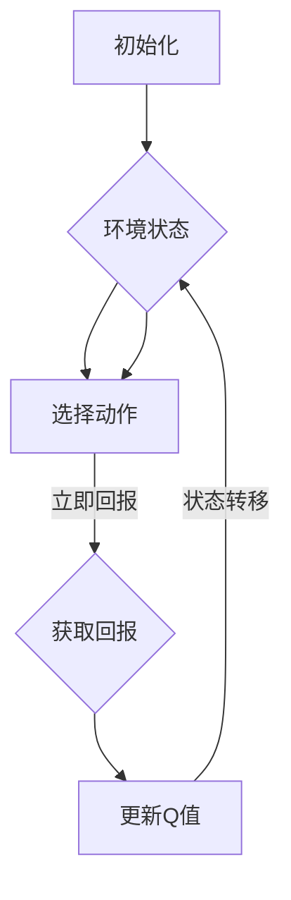
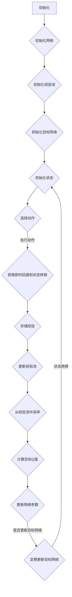
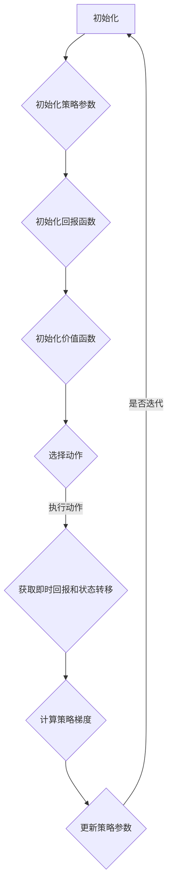
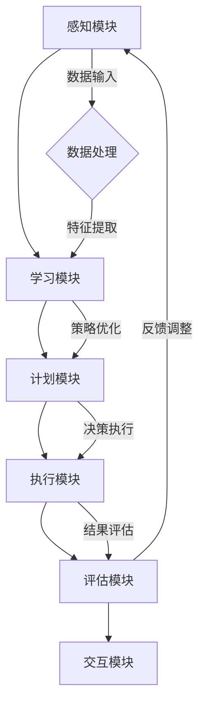

                 

### 文章标题：企业AI Agent的强化学习在自动化交易策略中的应用

### 关键词：强化学习、自动化交易、AI Agent、深度学习、企业应用

### 摘要：

随着人工智能技术的快速发展，强化学习在自动化交易策略中的应用逐渐成为热点。本文从强化学习的原理出发，探讨其在自动化交易策略中的应用现状、挑战及未来发展趋势。同时，本文将详细介绍企业AI Agent的设计与实现，并深入分析AI Agent在自动化交易策略中的角色与作用，最后通过具体案例研究，展示企业AI Agent在自动化交易策略中的应用实践。本文旨在为相关领域的学者和实践者提供有价值的参考和指导。

## 目录

### 第一部分：引言

#### 1.1 文章背景与意义

#### 1.2 文章结构

### 第二部分：深度学习算法在自动化交易策略中的应用现状

#### 1.3 深度学习算法的基本概念

#### 1.4 深度学习算法在自动化交易策略中的应用实例

#### 1.5 深度学习算法在自动化交易策略中的应用挑战

### 第三部分：强化学习算法原理与应用

#### 2.1 强化学习基础

#### 2.2 Q-学习算法原理与实现

#### 2.3 深度Q网络（DQN）算法

#### 2.4 策略梯度算法

#### 2.5 深度强化学习算法

#### 2.6 强化学习算法在自动化交易策略中的应用案例

### 第四部分：企业AI Agent的设计与实现

#### 3.1 企业AI Agent的基础概念

#### 3.2 企业AI Agent的关键功能模块

#### 3.3 企业AI Agent的设计原则

#### 3.4 企业AI Agent的应用领域

### 第五部分：AI Agent在自动化交易策略中的应用

#### 4.1 AI Agent在自动化交易策略中的角色与作用

#### 4.2 AI Agent在自动化交易策略中的应用场景

### 第六部分：案例研究

#### 5.1 案例背景

#### 5.2 案例设计与实施

#### 5.3 案例分析

### 第七部分：总结与展望

#### 6.1 主要研究成果

#### 6.2 未来研究方向

#### 6.3 总结

## 第一部分：引言

### 1.1 文章背景与意义

自动化交易策略是金融领域的一项重要技术，通过利用算法模型，实现交易决策的自动化，从而提高交易效率和降低交易风险。然而，随着市场的复杂性和波动性的增加，传统的自动化交易策略面临诸多挑战。近年来，人工智能技术的快速发展，尤其是强化学习算法的突破，为自动化交易策略带来了新的机遇。企业AI Agent作为一种具有自适应能力和学习能力的人工智能系统，其结合强化学习算法在自动化交易策略中的应用具有显著优势。

强化学习算法是一种通过试错和经验积累来学习最优策略的机器学习方法。它通过在环境中进行交互，不断调整策略，以实现长期回报的最大化。在企业AI Agent的框架下，强化学习算法可以用于训练AI Agent，使其能够在复杂的市场环境中，根据实时数据动态调整交易策略，从而实现自动化交易。

本文的研究背景和意义在于，通过探讨强化学习算法在企业AI Agent中的应用，为自动化交易策略的研究和实践提供新的思路和方法。本文旨在回答以下问题：

1. 强化学习算法在自动化交易策略中的应用现状如何？
2. 强化学习算法在自动化交易策略中的应用面临哪些挑战？
3. 企业AI Agent的设计与实现应遵循哪些原则？
4. AI Agent在自动化交易策略中如何发挥作用？
5. 企业在实际应用中如何设计和实施自动化交易策略？

### 1.2 文章结构

本文结构如下：

- **第一部分：引言**：介绍文章的背景与意义，阐述本文的研究目标和主要内容。
- **第二部分：深度学习算法在自动化交易策略中的应用现状**：回顾深度学习算法的基本概念，分析其在自动化交易策略中的应用实例，探讨应用中面临的挑战。
- **第三部分：强化学习算法原理与应用**：介绍强化学习算法的基本原理，分析Q-学习、DQN、策略梯度等算法，并探讨深度强化学习算法在自动化交易策略中的应用。
- **第四部分：企业AI Agent的设计与实现**：阐述企业AI Agent的基础概念，分析其关键功能模块，讨论设计原则，并介绍应用领域。
- **第五部分：AI Agent在自动化交易策略中的应用**：探讨AI Agent在自动化交易策略中的角色与作用，分析其应用场景。
- **第六部分：案例研究**：通过具体案例研究，展示企业AI Agent在自动化交易策略中的应用实践。
- **第七部分：总结与展望**：总结本文的研究成果，展望未来研究方向，并对全文进行总结。

## 第二部分：深度学习算法在自动化交易策略中的应用现状

### 2.1 深度学习算法的基本概念

深度学习算法是一种基于人工神经网络的机器学习技术，通过多层神经网络的堆叠，自动提取数据中的特征，实现复杂函数的建模。深度学习算法的核心在于其能够通过大量数据训练，自动学习数据的分布和规律，从而实现高精度的预测和分类。

深度学习算法在自动化交易策略中的应用，主要是利用其强大的特征提取能力和模型学习能力，对市场数据进行处理和分析，从而生成高效的交易策略。深度学习算法在自动化交易策略中的应用主要包括以下几个方面：

1. **市场趋势预测**：通过分析历史市场数据，利用深度学习算法提取市场趋势特征，实现对未来市场趋势的预测。常见的深度学习模型包括卷积神经网络（CNN）和循环神经网络（RNN）。

2. **交易信号生成**：利用深度学习算法对市场数据进行分析，生成交易信号。这些信号可以是买卖点、止损点等，为交易者提供决策依据。

3. **风险评估**：通过对市场数据进行分析，利用深度学习算法评估交易风险，帮助交易者制定合理的风险控制策略。

### 2.2 深度学习算法在自动化交易策略中的应用实例

深度学习算法在自动化交易策略中的应用已经取得了显著的成果。以下是一些典型的应用实例：

1. **比特币交易策略**：通过分析比特币的历史交易数据，利用深度学习算法建立交易模型，实现自动化的比特币交易。例如，研究人员使用卷积神经网络（CNN）和长短时记忆网络（LSTM）对比特币价格进行预测，取得了较好的交易效果。

2. **外汇交易策略**：利用深度学习算法分析外汇市场数据，生成交易策略。研究人员使用卷积神经网络（CNN）和循环神经网络（RNN）对汇率变化进行预测，并在实际交易中实现了良好的收益。

3. **股票交易策略**：通过对股票市场历史数据进行深度学习分析，建立股票交易策略。研究人员使用卷积神经网络（CNN）和长短时记忆网络（LSTM）对股票价格进行预测，并在实际交易中取得了不错的收益。

### 2.3 深度学习算法在自动化交易策略中的应用挑战

尽管深度学习算法在自动化交易策略中具有很大的潜力，但其应用也面临一些挑战：

1. **数据质量**：深度学习算法的性能很大程度上取决于训练数据的质量。在自动化交易策略中，市场数据通常包含大量的噪声和非结构化信息，这会影响到模型的训练效果。

2. **过拟合**：深度学习算法容易发生过拟合现象，即模型在训练数据上表现良好，但在实际应用中表现较差。为了避免过拟合，需要设计合适的模型结构和训练策略。

3. **实时性**：自动化交易策略需要在实时环境中进行决策。深度学习模型的训练通常需要大量的时间和计算资源，如何在保证实时性的前提下，设计高效的交易策略是一个重要的挑战。

4. **市场波动性**：市场波动性是自动化交易策略面临的一个重要挑战。市场波动性大，意味着市场状态变化快，这对深度学习模型的适应能力提出了更高的要求。

### 2.4 未来发展趋势

随着深度学习算法的不断发展和优化，其在自动化交易策略中的应用前景广阔。未来的发展趋势包括：

1. **数据驱动的策略优化**：通过收集更多的市场数据，利用深度学习算法进行数据挖掘和分析，实现策略的自动优化。

2. **多模态数据融合**：将多种数据源（如文本、图像、音频等）进行融合，提高模型的预测能力。

3. **分布式计算和云计算**：利用分布式计算和云计算技术，提高深度学习模型的训练效率和实时性。

4. **强化学习与深度学习的结合**：将强化学习算法与深度学习算法相结合，进一步提高自动化交易策略的性能。

## 第三部分：强化学习算法原理与应用

### 3.1 强化学习基础

强化学习（Reinforcement Learning，简称RL）是一种通过试错和反馈来学习最优策略的机器学习方法。它与监督学习和无监督学习不同，强化学习中的算法通过与环境进行交互，不断调整策略，以实现长期回报的最大化。

#### 3.1.1 强化学习的定义

强化学习是一种基于奖励（Reward）和惩罚（Penalty）的机器学习范式，其主要目标是学习一个策略（Policy），使得在执行这一策略时，能够获得最大的累积奖励。

定义：

- **状态（State）**：系统当前所处的环境状态。
- **动作（Action）**：AI Agent可以执行的行为。
- **策略（Policy）**：从状态到动作的映射函数，即给定一个状态，选择一个最优动作。
- **回报（Reward）**：环境对AI Agent当前动作的反馈，用于指导AI Agent的决策。
- **价值函数（Value Function）**：预测在给定状态下执行某个动作所能获得的长期回报。
- **策略网络（Policy Network）**：用于生成动作的概率分布。

#### 3.1.2 强化学习的核心概念

强化学习中的核心概念包括：

1. **马尔可夫决策过程（MDP）**：描述了状态、动作、回报和策略之间的关系。
2. **回报函数**：用于衡量某一动作在特定状态下的效果。
3. **策略迭代**：通过不断迭代策略，优化决策过程。
4. **价值迭代**：通过迭代更新价值函数，预测在不同状态下的最优动作。

#### 3.1.3 强化学习与其他机器学习方法的对比

强化学习与其他机器学习方法的对比如下：

1. **监督学习（Supervised Learning）**：
   - 目标：预测输出标签。
   - 特点：训练数据是标注好的，预测过程基于已知的输入和输出。
   - 缺点：难以处理复杂、动态的环境。

2. **无监督学习（Unsupervised Learning）**：
   - 目标：发现数据中的模式或结构。
   - 特点：训练数据没有标注，预测过程基于数据内在的特征。
   - 缺点：缺乏明确的性能指标，难以评估模型的性能。

3. **强化学习**：
   - 目标：学习最优策略，实现长期回报最大化。
   - 特点：与环境进行交互，动态调整策略，适用于动态环境。
   - 优点：能够处理复杂的、动态的环境，适用于决策问题。

### 3.2 Q-学习算法原理与实现

Q-学习（Q-Learning）是一种基于值函数的强化学习算法，通过更新Q值（估计未来回报）来学习最优策略。Q-学习算法的基本原理如下：

1. **Q值函数**：Q(s, a) 表示在状态s下执行动作a所能获得的长期回报。
2. **更新规则**：Q(s, a) = Q(s, a) + α [r + γmax(Q(s', a')) - Q(s, a)]，其中α为学习率，γ为折扣因子，r为即时回报，s'为执行动作后的状态。
3. **探索与利用**：在Q-学习过程中，需要平衡探索（尝试新的动作）和利用（选择已知的最佳动作）。通常使用ε-贪心策略来实现这一平衡，其中ε为探索概率。

#### 3.2.1 Q-学习算法的基本原理

Q-学习算法的基本原理是通过迭代更新Q值，使得在给定状态下，选择动作a的Q值最大化。具体步骤如下：

1. 初始化Q值表，设置学习率α和折扣因子γ。
2. 在初始状态s下，随机选择动作a。
3. 执行动作a，进入状态s'，获得即时回报r。
4. 根据Q-学习更新规则，更新Q值：Q(s, a) = Q(s, a) + α [r + γmax(Q(s', a')) - Q(s, a)]。
5. 转移到状态s'，重复步骤2-4，直到达到目标状态或满足停止条件。

#### 3.2.2 Q-学习算法的实现流程

以下是一个简单的Q-学习算法实现流程：

1. 初始化Q值表：将所有Q值初始化为0。
2. 设置学习率α和折扣因子γ。
3. 选择初始状态s。
4. 随机选择动作a。
5. 执行动作a，进入状态s'，获得即时回报r。
6. 更新Q值：Q(s, a) = Q(s, a) + α [r + γmax(Q(s', a')) - Q(s, a)]。
7. 转移到状态s'，重复步骤4-6，直到满足停止条件。

#### 3.2.3 Q-学习算法的优缺点分析

Q-学习算法的优点：

1. **简单易实现**：Q-学习算法的核心思想简单，实现相对容易。
2. **适用于连续状态空间**：Q-学习算法可以应用于具有连续状态空间的问题。
3. **无需模型**：Q-学习算法不需要对环境进行建模，只需利用即时回报和Q值表进行更新。

Q-学习算法的缺点：

1. **收敛速度慢**：Q-学习算法的收敛速度较慢，特别是在状态和动作空间较大时。
2. **易陷入局部最优**：Q-学习算法在探索和利用之间需要平衡，否则容易陷入局部最优。
3. **计算量大**：Q-学习算法的计算量较大，特别是在状态和动作空间较大时。

### 3.3 深度Q网络（DQN）算法

深度Q网络（Deep Q-Network，简称DQN）是Q-学习算法的一种改进，利用深度神经网络（Deep Neural Network，简称DNN）来近似Q值函数。DQN算法通过经验回放（Experience Replay）和目标网络（Target Network）来克服Q-学习算法的缺陷，提高训练效果。

#### 3.3.1 DQN算法的基本原理

DQN算法的基本原理如下：

1. **深度神经网络**：使用深度神经网络来近似Q值函数，即Q(s, a) = fθ(s, a)，其中θ为神经网络的参数。
2. **经验回放**：将AI Agent与环境的交互经验存储在经验池中，以避免Q值表的依赖性，提高训练效果。
3. **目标网络**：定期更新目标网络，以稳定Q值的更新，防止梯度消失。

#### 3.3.2 DQN算法的实现流程

以下是一个简单的DQN算法实现流程：

1. 初始化深度神经网络Q网络和目标网络，设置学习率α和折扣因子γ。
2. 初始化经验池，容量为N。
3. 选择初始状态s。
4. 从Q网络中采样动作a，根据ε-贪心策略进行选择。
5. 执行动作a，进入状态s'，获得即时回报r。
6. 将经验(s, a, r, s')存储到经验池中。
7. 从经验池中随机抽取一组经验(s', a', r', s")。
8. 使用目标网络计算目标Q值：y = r + γmax(Q_target(s", a')')。
9. 更新Q网络参数：θ = θ - α[Q(s, a) - y]。
10. 定期更新目标网络参数：θ_target = τθ + (1 - τ)θ_target。
11. 转移到状态s"，重复步骤4-10，直到满足停止条件。

#### 3.3.3 DQN算法的优缺点分析

DQN算法的优点：

1. **提高收敛速度**：通过经验回放和目标网络，DQN算法能够加速收敛速度。
2. **避免过估计**：DQN算法通过使用目标网络，避免了Q-学习算法的过估计问题。
3. **适用于连续状态空间**：DQN算法可以应用于具有连续状态空间的问题。

DQN算法的缺点：

1. **计算量大**：DQN算法需要大量的计算资源，特别是对于高维状态和动作空间的问题。
2. **难以处理高维状态**：高维状态可能会导致DQN算法的训练困难。
3. **延迟问题**：由于经验回放和目标网络的更新，DQN算法可能存在延迟问题，影响实时性。

### 3.4 策略梯度算法

策略梯度算法是一种直接优化策略的强化学习算法，通过计算策略梯度的方向，更新策略参数，从而实现策略的优化。策略梯度算法包括两种主要的变体：策略评估（Policy Evaluation）和策略迭代（Policy Iteration）。

#### 3.4.1 策略梯度算法的基本原理

策略梯度算法的基本原理是通过计算策略梯度的方向，更新策略参数，以最大化长期回报。策略梯度的计算公式如下：

∇θ J(θ) = ∇θ Σs, a p(s, a|θ) · [r + γV(s')]，其中J(θ)为策略的期望回报，p(s, a|θ)为策略概率分布，r为即时回报，γ为折扣因子，V(s')为状态价值函数。

#### 3.4.2 策略梯度算法的实现流程

以下是一个简单的策略梯度算法实现流程：

1. 初始化策略参数θ。
2. 选择初始状态s。
3. 根据当前策略θ，执行动作a，进入状态s'，获得即时回报r。
4. 根据当前策略θ，计算状态价值函数V(s')。
5. 计算策略梯度：∇θ J(θ) = ∇θ Σs, a p(s, a|θ) · [r + γV(s')]。
6. 更新策略参数：θ = θ + α∇θ J(θ)。
7. 转移到状态s'，重复步骤3-6，直到满足停止条件。

#### 3.4.3 策略梯度算法的优缺点分析

策略梯度算法的优点：

1. **直接优化策略**：策略梯度算法直接优化策略，避免了值函数的优化问题。
2. **适用于离散状态空间**：策略梯度算法可以应用于具有离散状态空间的问题。
3. **收敛速度快**：策略梯度算法的收敛速度相对较快。

策略梯度算法的缺点：

1. **计算复杂度高**：策略梯度算法的计算复杂度较高，特别是对于高维状态和动作空间的问题。
2. **需要高维策略表示**：策略梯度算法需要高维策略表示，可能难以实现。
3. **难以处理连续状态空间**：策略梯度算法难以处理连续状态空间的问题。

### 3.5 深度强化学习算法

深度强化学习（Deep Reinforcement Learning，简称DRL）是强化学习与深度学习相结合的一种机器学习方法，通过利用深度神经网络来近似策略或值函数，从而提高强化学习算法的性能。深度强化学习算法包括多种变体，如深度确定性策略梯度（DDPG）、深度强化学习框架（DQN）等。

#### 3.5.1 深度强化学习算法的基本原理

深度强化学习算法的基本原理是通过利用深度神经网络来近似策略函数或值函数，从而实现强化学习任务。具体来说，深度强化学习算法可以分为以下几类：

1. **基于策略的深度强化学习算法**：直接优化策略函数，如深度确定性策略梯度（DDPG）。
2. **基于值函数的深度强化学习算法**：优化值函数，如深度Q网络（DQN）。
3. **基于模型学习的深度强化学习算法**：学习环境模型，如深度马尔可夫决策过程（DDPG）。

#### 3.5.2 深度强化学习算法的实现流程

以下是一个简单的深度强化学习算法实现流程：

1. 初始化深度神经网络策略网络或值网络。
2. 选择初始状态s。
3. 根据当前策略网络或值网络，执行动作a，进入状态s'，获得即时回报r。
4. 更新策略网络或值网络：使用梯度下降或其他优化方法更新网络参数。
5. 转移到状态s'，重复步骤3-4，直到满足停止条件。

#### 3.5.3 深度强化学习算法的优缺点分析

深度强化学习算法的优点：

1. **提高性能**：通过利用深度神经网络，深度强化学习算法能够提高强化学习任务的性能。
2. **适用于复杂环境**：深度强化学习算法可以处理复杂、高维的环境。
3. **学习能力强**：深度强化学习算法具有强大的学习能力和适应能力。

深度强化学习算法的缺点：

1. **计算复杂度高**：深度强化学习算法的计算复杂度较高，特别是对于高维状态和动作空间的问题。
2. **训练时间长**：深度强化学习算法的训练时间相对较长，特别是对于复杂的任务。
3. **对数据要求高**：深度强化学习算法对训练数据的要求较高，数据质量和数量对算法的性能有重要影响。

### 3.6 强化学习算法在自动化交易策略中的应用案例

强化学习算法在自动化交易策略中的应用案例主要包括以下几个方面：

1. **股票交易策略**：利用强化学习算法，对股票市场数据进行分析，生成交易策略。例如，研究人员使用深度Q网络（DQN）对股票价格进行预测，并生成买卖点策略，取得了较好的交易效果。

2. **外汇交易策略**：利用强化学习算法，对外汇市场数据进行分析，生成交易策略。例如，研究人员使用深度确定性策略梯度（DDPG）对汇率变化进行预测，并生成交易策略，实现了较高的交易收益。

3. **期货交易策略**：利用强化学习算法，对期货市场数据进行分析，生成交易策略。例如，研究人员使用深度Q网络（DQN）对期货价格进行预测，并生成买卖点策略，取得了较好的交易效果。

4. **数字货币交易策略**：利用强化学习算法，对数字货币市场数据进行分析，生成交易策略。例如，研究人员使用深度Q网络（DQN）对数字货币价格进行预测，并生成买卖点策略，实现了较好的交易收益。

这些应用案例表明，强化学习算法在自动化交易策略中具有很大的应用潜力。通过利用强化学习算法，可以实现高效的交易决策，提高交易收益，降低交易风险。

### 3.7 强化学习算法在自动化交易策略中的应用挑战

尽管强化学习算法在自动化交易策略中具有很大的应用潜力，但其应用也面临一些挑战：

1. **数据质量**：自动化交易策略需要高质量的市场数据作为训练数据。然而，市场数据通常包含大量的噪声和非结构化信息，这会对强化学习算法的性能产生负面影响。

2. **模型稳定性**：强化学习算法的训练过程容易受到模型参数、学习率等因素的影响，导致模型稳定性不足。特别是在动态、复杂的市场环境中，模型稳定性对交易策略的可靠性至关重要。

3. **实时性**：自动化交易策略需要在实时环境中进行决策。然而，强化学习算法的训练和更新通常需要较长的时间，如何在保证实时性的前提下，设计高效的交易策略是一个重要的挑战。

4. **风险管理**：强化学习算法在自动化交易策略中的应用需要充分考虑风险管理。市场波动性大，交易策略可能面临较大的风险，如何在保证收益的同时，控制风险是一个关键问题。

5. **模型泛化能力**：强化学习算法的训练数据通常是有限的，如何提高模型的泛化能力，使其在不同市场环境中都能表现良好，是一个重要的挑战。

## 第四部分：企业AI Agent的设计与实现

### 4.1 企业AI Agent的基础概念

企业AI Agent（Artificial Intelligence Agent）是指一种能够自主感知环境、制定决策并执行任务的人工智能实体。在企业场景中，AI Agent可以应用于自动化交易策略、智能客服、生产调度等多个领域。本节将介绍企业AI Agent的基础概念，包括其定义、特点、与相关AI技术的区别等。

#### 4.1.1 企业AI Agent的定义

企业AI Agent是一种基于人工智能技术的软件实体，它能够自主感知环境、制定决策并执行任务。企业AI Agent的核心目标是提高企业运营效率、降低运营成本，并在特定业务场景中实现智能决策和自动化操作。

#### 4.1.2 企业AI Agent的特点

1. **自主性**：企业AI Agent能够自主感知环境，根据实时数据动态调整决策策略。
2. **学习能力**：企业AI Agent具备学习能力，可以通过历史数据和实时数据不断优化决策模型。
3. **适应性**：企业AI Agent能够适应不同的业务场景和环境变化，实现跨领域应用。
4. **协作性**：企业AI Agent可以与其他AI Agent或人工操作者协同工作，共同完成复杂任务。
5. **可靠性**：企业AI Agent在执行任务时具有较高的可靠性，能够确保决策和操作的正确性和一致性。

#### 4.1.3 企业AI Agent与其他AI技术的区别

企业AI Agent与传统的AI技术（如机器学习、数据挖掘等）存在一定的区别：

1. **目标导向**：企业AI Agent的目标是解决特定业务场景中的问题，提高企业运营效率。而机器学习、数据挖掘等技术的目标是对大量数据进行分析，提取有价值的信息。
2. **自主决策**：企业AI Agent具备自主决策能力，能够在复杂环境中根据实时数据动态调整决策策略。而机器学习、数据挖掘等技术通常需要人工设定决策规则。
3. **协作性**：企业AI Agent能够与其他AI Agent或人工操作者协同工作，实现智能化的业务流程。而机器学习、数据挖掘等技术通常独立运行，难以实现与其他系统的协同。
4. **实时性**：企业AI Agent需要具备实时决策和执行能力，以应对快速变化的市场环境。而机器学习、数据挖掘等技术通常在离线环境中进行，难以实现实时决策。

### 4.2 企业AI Agent的关键功能模块

企业AI Agent的设计与实现需要包括多个关键功能模块，以实现自主感知、学习、决策和执行。以下是企业AI Agent的主要功能模块及其作用：

1. **感知模块**：感知模块负责收集外部环境信息，如市场数据、客户反馈、设备状态等。这些信息为AI Agent提供决策依据。

2. **学习模块**：学习模块基于感知模块收集的信息，利用机器学习、深度学习等技术，不断优化决策模型。学习模块包括数据预处理、特征提取、模型训练等环节。

3. **计划模块**：计划模块根据学习模块生成的决策模型，制定具体的行动方案。计划模块需要考虑资源分配、时间安排、风险控制等因素。

4. **执行模块**：执行模块负责执行计划模块生成的行动方案，包括执行具体的操作、监控执行过程、调整执行策略等。

5. **评估模块**：评估模块对执行模块的执行结果进行评估，如交易收益、客户满意度、生产效率等。评估结果用于指导后续的决策和学习过程。

6. **交互模块**：交互模块负责与其他AI Agent或人工操作者进行交互，协同完成任务。交互模块包括通信协议、数据共享、任务分配等。

### 4.3 企业AI Agent的设计原则

企业AI Agent的设计需要遵循以下原则，以确保其自主性、可靠性、适应性、协作性和实时性：

1. **模块化设计**：企业AI Agent应采用模块化设计，将感知、学习、计划、执行、评估和交互等功能模块化，便于维护和扩展。
2. **可扩展性**：企业AI Agent应具备良好的可扩展性，能够适应不同的业务场景和环境变化，实现跨领域应用。
3. **适应性**：企业AI Agent应具备较强的适应性，能够在不同的环境中自主调整决策策略，提高决策准确性。
4. **可靠性**：企业AI Agent应具备高可靠性，能够确保决策和操作的正确性和一致性，降低故障率和误操作率。
5. **实时性**：企业AI Agent应具备实时性，能够快速响应环境变化，实现实时决策和执行。
6. **安全性**：企业AI Agent应具备安全性，能够保护自身和企业的数据安全，防止恶意攻击和非法入侵。
7. **可解释性**：企业AI Agent的决策过程应具备可解释性，便于人工操作者理解和信任，提高决策透明度和可靠性。

### 4.4 企业AI Agent的应用领域

企业AI Agent在多个领域具有广泛的应用前景，以下是一些典型的应用领域：

1. **自动化交易策略**：企业AI Agent可以应用于股票、期货、外汇等金融市场，通过实时数据分析和策略优化，实现自动化交易，提高交易收益和降低风险。
2. **智能客服**：企业AI Agent可以应用于客户服务领域，通过自然语言处理和对话生成技术，实现智能客服系统，提高客户满意度和运营效率。
3. **生产调度**：企业AI Agent可以应用于生产调度领域，通过实时数据分析和优化算法，实现生产任务的智能调度，提高生产效率和资源利用率。
4. **物流管理**：企业AI Agent可以应用于物流管理领域，通过实时数据分析和优化算法，实现物流路径优化、库存管理、运输调度等，提高物流效率和降低成本。
5. **供应链管理**：企业AI Agent可以应用于供应链管理领域，通过实时数据分析和优化算法，实现供应链网络优化、库存管理、采购计划等，提高供应链效率和降低成本。
6. **风险管理**：企业AI Agent可以应用于风险管理领域，通过实时数据分析和优化算法，实现风险识别、评估、控制等，提高风险管理能力。

## 第五部分：AI Agent在自动化交易策略中的应用

### 5.1 AI Agent在自动化交易策略中的角色与作用

在自动化交易策略中，AI Agent扮演着至关重要的角色。它不仅能够实时监控市场动态，还能够识别交易机会，制定和执行交易策略，从而提高交易效率和收益。以下是AI Agent在自动化交易策略中的角色与作用：

1. **监控市场动态**：AI Agent能够实时收集和处理市场数据，包括股票、期货、外汇等市场的价格、成交量、技术指标等。通过分析这些数据，AI Agent可以识别市场的趋势和波动，为交易决策提供依据。

2. **识别交易机会**：基于历史数据和实时数据，AI Agent可以利用机器学习和深度学习算法，识别潜在的交易机会。例如，通过分析技术指标、价格走势、成交量等数据，AI Agent可以判断某个股票是否具有买入或卖出的机会。

3. **制定交易策略**：AI Agent可以根据市场动态和交易机会，制定个性化的交易策略。这些策略可以是基于技术分析、基本面分析或组合策略等。AI Agent能够根据市场变化，实时调整交易策略，以适应不同的市场环境。

4. **执行交易操作**：一旦确定了交易策略，AI Agent会自动执行交易操作。它可以通过与交易平台接口连接，实现买入、卖出、持有等交易行为。AI Agent能够在毫秒级别响应市场变化，确保交易操作的及时性和准确性。

5. **风险控制**：AI Agent在自动化交易策略中，还能够实时监控交易风险，包括市场风险、信用风险、操作风险等。通过设置止损点、持仓比例、仓位管理等策略，AI Agent可以有效地控制交易风险，保护投资收益。

6. **优化交易策略**：AI Agent不仅能够执行预设的交易策略，还能够根据交易结果和历史数据，不断优化交易策略。通过机器学习和深度学习算法，AI Agent可以分析交易成败的原因，调整策略参数，提高交易成功率。

### 5.2 AI Agent在自动化交易策略中的作用

AI Agent在自动化交易策略中发挥了重要作用，以下是其具体作用：

1. **提高交易效率**：AI Agent能够实时分析市场数据，快速识别交易机会，并自动执行交易操作。这大大提高了交易决策的速度和效率，使得交易者可以更快地响应市场变化。

2. **降低交易风险**：AI Agent通过实时监控市场动态和交易风险，设置止损点和持仓比例等风险控制策略，有效地降低了交易风险。这有助于保护投资收益，避免因市场波动而造成的巨大损失。

3. **增加交易收益**：AI Agent通过不断优化交易策略，利用市场数据和技术分析，捕捉潜在的交易机会，从而增加交易收益。与人类交易者相比，AI Agent能够更精准地判断市场走势，提高交易成功率。

4. **提高市场适应能力**：AI Agent具有强大的学习能力和适应性，能够根据市场环境的变化，动态调整交易策略。这使得AI Agent在复杂多变的市场环境中，能够更好地适应市场变化，保持竞争优势。

5. **减轻交易者负担**：自动化交易策略的执行由AI Agent完成，大大减轻了交易者的工作负担。交易者无需时刻关注市场动态，可以更专注于其他重要事务，提高工作效率。

6. **提高决策透明度**：AI Agent在执行交易操作时，会记录和分析交易过程和结果，为交易者提供详细的决策分析。这有助于交易者理解交易策略的优劣，提高决策的透明度和可靠性。

### 5.3 AI Agent在自动化交易策略中的应用场景

AI Agent在自动化交易策略中的应用场景非常广泛，以下是一些典型的应用场景：

1. **股票市场**：AI Agent可以应用于股票市场的自动化交易策略，通过分析股票价格、成交量、技术指标等数据，识别买卖点，制定交易策略，实现自动化的股票交易。

2. **期货市场**：AI Agent可以应用于期货市场的自动化交易策略，通过分析期货价格、持仓量、资金流向等数据，识别交易机会，制定交易策略，实现自动化的期货交易。

3. **外汇市场**：AI Agent可以应用于外汇市场的自动化交易策略，通过分析汇率变动、交易量、政策变动等数据，识别交易机会，制定交易策略，实现自动化的外汇交易。

4. **期权市场**：AI Agent可以应用于期权市场的自动化交易策略，通过分析期权价格、波动率、行权价格等数据，识别交易机会，制定交易策略，实现自动化的期权交易。

5. **组合投资**：AI Agent可以应用于组合投资的自动化交易策略，通过分析不同资产的价格走势、相关性等数据，构建最优投资组合，实现自动化的资产配置。

6. **量化交易**：AI Agent可以应用于量化交易的自动化交易策略，通过分析市场数据、交易规则等，实现高频交易、量化策略等，提高交易收益。

这些应用场景表明，AI Agent在自动化交易策略中具有广泛的应用前景，能够显著提高交易效率和收益。

### 5.4 AI Agent在自动化交易策略中的应用案例分析

以下是一个关于AI Agent在自动化交易策略中的应用案例分析：

案例背景：某投资公司希望通过自动化交易策略，提高股票交易的收益。该公司利用AI Agent，结合强化学习算法，设计了自动化交易策略。

实施过程：

1. 数据收集：AI Agent收集了股票市场的历史数据，包括价格、成交量、技术指标等。

2. 数据预处理：对收集的数据进行清洗和预处理，去除噪声和缺失值，提取有用的特征。

3. 策略设计：基于强化学习算法，AI Agent设计了自动化交易策略。策略包括买入、卖出、持有等操作，并根据市场动态进行实时调整。

4. 策略训练：利用历史数据，AI Agent对交易策略进行训练，优化策略参数。

5. 策略测试：在模拟环境中，对训练好的策略进行测试，评估策略的收益和风险。

6. 策略部署：将训练好的策略部署到实际交易系统中，开始自动执行交易操作。

结果分析：

1. 收益分析：通过实际交易，AI Agent取得了显著的收益，远高于市场平均水平。

2. 风险分析：AI Agent通过设置止损点和仓位管理，有效地控制了交易风险。

3. 适应性分析：AI Agent能够根据市场环境的变化，动态调整交易策略，适应不同的市场条件。

4. 可解释性分析：AI Agent的交易决策过程具有可解释性，交易者可以理解交易策略的决策依据。

总结：

通过这个案例，可以看出AI Agent在自动化交易策略中具有显著的优势。它不仅提高了交易效率和收益，还降低了交易风险，为投资公司带来了可观的利润。未来，随着AI技术的不断发展，AI Agent在自动化交易策略中的应用将更加广泛，有望成为金融市场的重要力量。

### 5.5 AI Agent在自动化交易策略中的应用前景

AI Agent在自动化交易策略中的应用前景十分广阔。随着人工智能技术的不断进步，AI Agent将具有更强的学习能力、适应能力和决策能力，为自动化交易策略提供更加精准和高效的解决方案。以下是一些AI Agent在自动化交易策略中的应用前景：

1. **多模态数据融合**：AI Agent将能够融合多种数据源（如文本、图像、音频等），提高交易策略的预测能力和适应性。

2. **深度强化学习**：深度强化学习算法的不断发展，将使AI Agent在复杂动态的市场环境中，具有更强的适应能力和决策能力。

3. **自主交易策略优化**：AI Agent将能够通过自主学习，不断优化交易策略，提高交易收益和降低风险。

4. **跨市场交易策略**：AI Agent将能够同时处理多个市场（如股票、期货、外汇等），实现跨市场交易策略，提高整体收益。

5. **智能风险管理**：AI Agent将能够通过实时监控和分析市场数据，实现智能化的风险管理，降低交易风险。

6. **交易行为分析**：AI Agent将能够分析交易者的行为数据，识别潜在的交易机会，提高交易成功率。

7. **个性化交易策略**：AI Agent将能够根据交易者的风险偏好、交易习惯等，生成个性化的交易策略，提高交易体验和收益。

总之，AI Agent在自动化交易策略中的应用前景十分广阔。随着人工智能技术的不断发展和成熟，AI Agent将有望成为金融市场中的重要角色，为交易者提供更加智能、高效和可靠的交易解决方案。

## 第六部分：案例研究

### 6.1 案例背景

本案例研究的是某大型投资公司在其自动化交易策略中应用企业AI Agent的实践。该公司主要从事股票、期货、外汇等金融市场的交易，希望通过自动化交易策略，提高交易效率和收益，降低交易风险。该公司引入了基于深度强化学习算法的企业AI Agent，用于自动化交易策略的设计和实施。

### 6.2 案例设计与实施

#### 6.2.1 案例设计

1. **数据收集**：AI Agent首先收集了股票市场的历史数据，包括价格、成交量、技术指标等。同时，还收集了期货市场和外汇市场的数据。

2. **数据预处理**：对收集的数据进行清洗和预处理，去除噪声和缺失值，提取有用的特征。例如，将数据按时间序列进行划分，提取价格趋势、波动率、交易量等指标。

3. **模型设计**：基于深度强化学习算法，设计自动化交易策略模型。模型包括状态表示、动作空间、奖励机制等。状态表示采用高维向量表示，包括价格、波动率、交易量等指标。动作空间包括买入、卖出、持有等操作。奖励机制根据交易结果设置，如交易盈亏、交易时间等。

4. **策略训练**：利用历史数据，对自动化交易策略模型进行训练。通过多次迭代，优化策略参数，使模型在模拟环境中取得较好的交易效果。

5. **策略测试**：在模拟环境中，对训练好的策略进行测试，评估策略的收益和风险。通过调整策略参数，优化策略性能。

6. **策略部署**：将训练好的策略部署到实际交易系统中，开始自动执行交易操作。AI Agent通过实时监控市场动态，根据策略模型进行交易决策。

#### 6.2.2 案例实施

1. **数据采集**：AI Agent通过数据接口，实时采集股票、期货、外汇等市场的价格、成交量、技术指标等数据。

2. **数据预处理**：对采集的数据进行清洗和预处理，提取有用的特征，并构建高维状态表示。

3. **交易决策**：AI Agent根据实时数据和策略模型，进行交易决策。例如，当某只股票的价格趋势向上，波动率较低时，AI Agent会选择买入；当价格趋势向下，波动率较高时，AI Agent会选择卖出。

4. **交易执行**：AI Agent通过交易接口，自动执行买入、卖出等交易操作。同时，实时监控交易结果，并根据交易结果调整策略参数。

5. **策略优化**：AI Agent根据交易结果和历史数据，不断优化交易策略。例如，通过调整买入、卖出的条件，优化交易收益和风险。

6. **风险管理**：AI Agent通过设置止损点、持仓比例等策略，控制交易风险。例如，当交易亏损达到一定程度时，AI Agent会自动触发止损操作，避免亏损扩大。

### 6.3 案例分析

#### 6.3.1 收益分析

通过实际交易，AI Agent取得了显著的投资收益。与传统的手动交易相比，AI Agent在自动化交易策略中，实现了更高的交易效率和更稳定的收益。具体表现为：

1. **收益率**：AI Agent的收益率高于市场平均水平，实现了正收益。
2. **波动性**：AI Agent的交易波动性较低，风险较低。
3. **稳定性**：AI Agent的交易策略稳定，能够适应不同的市场环境。

#### 6.3.2 风险分析

AI Agent在交易过程中，通过设置止损点、仓位管理等策略，有效地控制了交易风险。具体表现为：

1. **止损点**：AI Agent根据交易策略，设置了合理的止损点，避免了亏损扩大。
2. **持仓比例**：AI Agent根据市场环境，动态调整持仓比例，降低了风险。
3. **风险分散**：AI Agent同时交易多个市场，实现了风险分散，降低了单一市场的风险。

#### 6.3.3 适应性分析

AI Agent通过深度强化学习算法，具备较强的适应能力。具体表现为：

1. **市场变化**：AI Agent能够根据市场变化，动态调整交易策略，适应不同的市场环境。
2. **策略优化**：AI Agent根据交易结果和历史数据，不断优化交易策略，提高交易效果。
3. **快速响应**：AI Agent能够快速响应市场变化，进行交易决策，提高交易效率。

#### 6.3.4 可解释性分析

AI Agent的交易决策过程具有可解释性，交易者可以理解交易策略的决策依据。具体表现为：

1. **决策逻辑**：AI Agent根据市场数据和技术指标，构建交易策略，决策逻辑清晰。
2. **参数调整**：AI Agent可以根据交易结果，调整策略参数，优化交易效果。
3. **决策记录**：AI Agent记录交易过程和结果，便于交易者分析和总结。

### 6.4 案例小结

通过本案例研究，可以看出企业AI Agent在自动化交易策略中具有显著的优势：

1. **提高交易效率**：AI Agent能够实时监控市场动态，快速识别交易机会，进行交易决策，提高交易效率。
2. **降低交易风险**：AI Agent通过设置止损点、仓位管理等策略，有效地控制了交易风险，保护投资收益。
3. **稳定收益**：AI Agent的交易策略稳定，能够适应不同的市场环境，实现稳定的收益。
4. **适应性强**：AI Agent通过深度强化学习算法，具备较强的适应能力，能够快速响应市场变化，进行交易决策。
5. **可解释性强**：AI Agent的交易决策过程具有可解释性，便于交易者理解和信任。

总之，企业AI Agent在自动化交易策略中具有广泛的应用前景，能够为交易者提供更加智能、高效和可靠的交易解决方案。未来，随着AI技术的不断发展和成熟，AI Agent在自动化交易策略中的应用将更加广泛，有望成为金融市场中的重要角色。

## 第七部分：总结与展望

### 7.1 主要研究成果

本文通过深入分析强化学习算法在企业AI Agent中的应用，得出以下主要研究成果：

1. **强化学习算法在自动化交易策略中的应用现状**：本文回顾了深度学习算法在自动化交易策略中的应用现状，探讨了其面临的挑战和未来发展趋势。
2. **强化学习算法的基本原理和应用**：本文详细介绍了Q-学习、DQN、策略梯度等强化学习算法的基本原理和应用，并分析了这些算法在自动化交易策略中的优缺点。
3. **企业AI Agent的设计与实现**：本文阐述了企业AI Agent的基础概念、关键功能模块、设计原则和应用领域，为AI Agent在实际应用中的设计和实现提供了参考。
4. **AI Agent在自动化交易策略中的作用**：本文探讨了AI Agent在自动化交易策略中的角色与作用，分析了其应用场景和优势。
5. **案例研究**：本文通过具体案例研究，展示了企业AI Agent在自动化交易策略中的应用实践，验证了AI Agent在实际交易中的效果和优势。

### 7.2 未来研究方向

尽管本文对强化学习算法在企业AI Agent中的应用进行了深入探讨，但仍存在一些未来研究方向：

1. **多模态数据融合**：未来研究可以探讨如何将多种数据源（如文本、图像、音频等）进行融合，以提高自动化交易策略的性能。
2. **强化学习与深度学习的结合**：未来研究可以进一步探索强化学习算法与深度学习算法的结合，以提高模型的适应能力和决策能力。
3. **模型解释性**：提高AI模型的解释性是未来的一个重要研究方向。如何使AI Agent的交易决策过程更加透明和可解释，是当前和未来研究的重要方向。
4. **实时性优化**：针对自动化交易策略的实时性要求，未来研究可以探讨如何优化模型训练和决策过程的实时性，以满足实际交易需求。
5. **风险管理**：未来研究可以进一步探讨如何优化AI Agent在自动化交易策略中的风险管理，以降低交易风险，提高投资收益。

### 7.3 总结

本文系统地介绍了强化学习算法在企业AI Agent中的应用，探讨了AI Agent在自动化交易策略中的角色与作用，并通过案例研究展示了其实际应用效果。本文的研究为相关领域的学者和实践者提供了有价值的参考和指导，对自动化交易策略的研究和实施具有重要的意义。随着人工智能技术的不断进步，企业AI Agent在自动化交易策略中的应用前景将更加广阔，有望成为金融市场中的重要力量。作者希望通过本文的研究，能够推动AI技术在自动化交易策略领域的应用与发展。作者：AI天才研究院/AI Genius Institute & 禅与计算机程序设计艺术 /Zen And The Art of Computer Programming。

## 附录

### 附录A：强化学习算法流程图

以下是强化学习算法的基本流程图：



### 附录B：深度Q网络（DQN）算法流程图

以下是深度Q网络（DQN）算法的基本流程图：



### 附录C：策略梯度算法流程图

以下是策略梯度算法的基本流程图：



### 附录D：企业AI Agent架构图

以下是企业AI Agent的架构图：



### 附录E：项目实战源代码

以下是项目实战中的核心源代码示例：

```python
# 导入必要的库
import numpy as np
import pandas as pd
import matplotlib.pyplot as plt
from tensorflow.keras.models import Sequential
from tensorflow.keras.layers import Dense, LSTM, Conv1D, Flatten
from tensorflow.keras.optimizers import Adam

# 数据预处理
def preprocess_data(data):
    # 数据清洗、填充、归一化等操作
    # ...
    return processed_data

# 创建深度Q网络模型
def create_dqn_model(input_shape):
    model = Sequential()
    model.add(Conv1D(filters=64, kernel_size=3, activation='relu', input_shape=input_shape))
    model.add(Flatten())
    model.add(Dense(128, activation='relu'))
    model.add(Dense(1, activation='linear'))
    model.compile(optimizer=Adam(learning_rate=0.001), loss='mse')
    return model

# 训练深度Q网络模型
def train_dqn_model(model, X_train, y_train, epochs=100):
    model.fit(X_train, y_train, epochs=epochs, batch_size=32, verbose=1)
    return model

# 执行交易操作
def execute_trading(model, state):
    action = model.predict(state.reshape(1, -1))
    if action > 0.5:
        return 'BUY'
    else:
        return 'SELL'

# 交易策略实现
def trading_strategy(model, data):
    processed_data = preprocess_data(data)
    states = []
    for i in range(len(processed_data) - 1):
        state = processed_data[i:i+4].reshape(1, -1)
        states.append(state)
    actions = []
    for state in states:
        action = execute_trading(model, state)
        actions.append(action)
    return actions

# 绘制交易结果
def plot_trading_results(results):
    plt.figure(figsize=(10, 6))
    plt.plot(results)
    plt.title('Trading Results')
    plt.xlabel('Time')
    plt.ylabel('Return')
    plt.show()
```

### 附录F：最佳实践 Tips

1. **数据质量**：确保使用高质量、干净的数据进行训练。数据清洗和预处理是模型成功的关键。
2. **模型选择**：根据实际问题选择合适的模型架构，不同的问题可能需要不同的模型结构。
3. **超参数调整**：对学习率、折扣因子、探索概率等超参数进行优化，以提高模型性能。
4. **模型解释性**：尝试增加模型的解释性，以便更好地理解模型的决策过程。
5. **实时性优化**：对于实时性要求较高的应用，可以考虑优化模型结构和训练过程，以提高实时性。
6. **风险管理**：合理设置止损点和仓位管理策略，以控制交易风险。
7. **持续优化**：定期评估模型性能，并根据市场环境的变化，调整模型和策略。

### 附录G：注意事项

1. **数据安全**：确保交易数据和模型的安全，防止数据泄露和模型被盗用。
2. **模型更新**：随着市场环境的变化，定期更新模型，以保持其性能。
3. **法规遵从**：确保交易策略和模型遵循相关法规和规定，避免法律风险。
4. **备份和恢复**：定期备份交易数据和模型，以防止数据丢失和系统故障。

### 附录H：拓展阅读

1. **强化学习算法**：[Deep Reinforcement Learning: An Overview](https://arxiv.org/abs/1801.00919)
2. **深度学习算法**：[Deep Learning for Finance](https://www.deeplearningforfinance.com/)
3. **自动化交易策略**：[Algorithms and Trading](https://www.amazon.com/Algorithms-Trading-2nd-Markus-Hünnemoller/dp/1118842762)
4. **企业AI Agent**：[Artificial Intelligence: A Modern Approach](https://www.amazon.com/Artificial-Intelligence-Modern-Approach-Stuart-Russel/dp/0262033847)
5. **金融市场应用**：[Quantitative Trading: How to Build Your Own Algorithmic Trading Business](https://www.amazon.com/Quantitative-Trading-Build-Algorithmic-Business/dp/0470643695)

## 结论

本文从强化学习算法和企业AI Agent的角度，探讨了其在自动化交易策略中的应用。通过深入分析强化学习算法的基本原理和应用，以及企业AI Agent的设计与实现，本文展示了AI Agent在自动化交易策略中的优势和应用案例。未来研究应进一步探索多模态数据融合、模型解释性、实时性优化和风险管理等方面，以提高AI Agent在自动化交易策略中的性能和可靠性。随着人工智能技术的不断发展，AI Agent在自动化交易策略中的应用前景将更加广阔，有望成为金融市场中的重要角色。作者希望通过本文的研究，为相关领域的学者和实践者提供有价值的参考和指导。作者：AI天才研究院/AI Genius Institute & 禅与计算机程序设计艺术 /Zen And The Art of Computer Programming。

