                 

### 文章标题

# 企业AI Agent的故障恢复机制

### 关键词

- AI Agent
- 故障恢复
- 算法原理
- 系统架构
- 实际案例分析

### 摘要

本文将深入探讨企业AI Agent的故障恢复机制，从问题背景、核心概念、算法原理、系统设计与项目实践等多个方面，详细阐述如何构建一个高效、可靠的AI故障恢复系统。通过分析故障类型、恢复机制的基本原则，以及使用Python源代码和LaTeX公式来解释故障恢复算法，本文旨在为IT专业人士提供系统化的解决方案，以保障企业AI系统的稳定运行。

---

### 目录大纲设计思路

为了设计出符合要求的《企业AI Agent的故障恢复机制》的目录大纲，我们需要从以下步骤进行思考：

1. **背景介绍**：首先介绍问题的背景，包括AI Agent的定义、在企业中的应用场景、故障恢复机制的必要性等。

2. **核心概念与联系**：明确书中的核心概念，如AI Agent、故障、恢复机制等，并用表格和ER实体关系图来展现概念之间的关系。

3. **算法原理讲解**：针对故障恢复机制，使用mermaid画出算法流程图，并用Python源代码和LaTeX公式详细阐述算法原理。

4. **系统分析与架构设计方案**：介绍问题场景，设计系统功能、架构和接口，使用mermaid画出领域模型类图、系统架构图和系统交互序列图。

5. **项目实战**：描述环境安装、系统实现、代码解读和分析、实际案例分析及小结。

6. **最佳实践 tips、小结、注意事项、拓展阅读**：总结书中的关键点，提供实践建议和拓展阅读资源。

### 具体目录大纲

#### 第一部分：引言

##### 第1章：问题背景与概述

- 1.1 问题背景
  - AI Agent的定义与作用
  - 企业中AI Agent的应用场景
  - 故障恢复机制的重要性

- 1.2 问题描述
  - AI Agent常见故障类型
  - 故障对业务的影响
  - 故障恢复的目标

- 1.3 问题解决
  - 故障恢复机制的必要性
  - 故障恢复的基本原则

- 1.4 边界与外延
  - 故障恢复机制的应用范围
  - 非AI Agent系统的故障恢复

- 1.5 概念结构与核心要素组成
  - AI Agent的结构与功能
  - 故障恢复机制的核心要素

#### 第二部分：核心概念与联系

##### 第2章：核心概念解析

- 2.1 AI Agent
  - AI Agent的定义
  - AI Agent的类型
  - AI Agent的功能模块

- 2.2 故障
  - 故障的定义
  - 故障的分类
  - 故障的症状与影响

- 2.3 恢复机制
  - 恢复机制的定义
  - 恢复机制的类型
  - 恢复机制的核心要素

##### 第3章：概念属性特征对比

- 3.1 AI Agent属性特征对比
  - 常见AI Agent类型属性特征对比表

- 3.2 故障属性特征对比
  - 常见故障类型属性特征对比表

- 3.3 恢复机制属性特征对比
  - 常见恢复机制类型属性特征对比表

##### 第4章：ER实体关系图架构

- 4.1 ER实体关系图
  - AI Agent、故障、恢复机制的ER实体关系图

#### 第三部分：算法原理讲解

##### 第5章：故障恢复算法原理

- 5.1 算法概述
  - 故障恢复算法的目的
  - 故障恢复算法的分类

- 5.2 算法流程图
  - 使用mermaid绘制故障恢复算法流程图

- 5.3 Python源代码实现
  - 故障恢复算法的Python实现代码

- 5.4 LaTeX公式与详细讲解
  - 故障恢复算法的数学模型和公式
  - 公式的详细讲解

##### 第6章：算法举例说明

- 6.1 示例一：简单故障恢复场景
  - 故障恢复算法的简单应用实例

- 6.2 示例二：复杂故障恢复场景
  - 故障恢复算法的复杂应用实例

#### 第四部分：系统分析与架构设计方案

##### 第7章：问题场景介绍

- 7.1 场景介绍
  - 企业中AI Agent故障恢复的应用场景

##### 第8章：系统功能设计

- 8.1 系统功能设计
  - AI Agent故障检测功能
  - 故障定位功能
  - 故障恢复功能

##### 第9章：系统架构设计

- 9.1 系统架构设计
  - 系统总体架构设计
  - 各功能模块的架构设计

##### 第10章：系统接口设计与交互

- 10.1 系统接口设计
  - 各功能模块的接口设计

- 10.2 系统交互设计
  - 使用mermaid绘制系统交互序列图

#### 第五部分：项目实战

##### 第11章：环境安装

- 11.1 环境安装
  - 故障恢复系统的安装与配置

##### 第12章：系统核心实现

- 12.1 系统核心实现
  - 故障检测与定位的核心实现

- 12.2 故障恢复的核心实现

##### 第13章：代码解读与分析

- 13.1 代码解读
  - 故障恢复系统代码的解读

- 13.2 代码分析
  - 故障恢复系统代码的性能分析

##### 第14章：实际案例分析与

---

### 第一部分：引言

#### 第1章：问题背景与概述

在现代企业中，人工智能（AI）技术已经成为提高生产效率、优化业务流程、增强决策能力的重要工具。AI Agent，作为一种智能化的自主执行任务的实体，在企业中的应用越来越广泛。然而，随着AI系统的复杂性和规模不断扩大，AI Agent的故障问题也日益突出，如何高效地解决这些故障成为了一个关键课题。

##### 1.1 问题背景

**AI Agent的定义与作用**

AI Agent，即人工智能代理，是一种能够模拟人类智能行为、执行特定任务的计算机程序。它可以自动执行各种任务，如数据收集、数据分析、决策制定等，从而提高企业的运营效率。在企业中，AI Agent的应用场景包括但不限于以下几个方面：

1. **客户服务**：AI Agent可以用于提供24/7的客户服务，回答常见问题，提高客户满意度。
2. **智能调度**：AI Agent可以用于优化物流调度，降低运输成本，提高配送效率。
3. **风险监控**：AI Agent可以用于实时监控企业风险，提供预警和决策支持。
4. **自动化运营**：AI Agent可以用于自动化日常运营任务，如订单处理、库存管理等。

**企业中AI Agent的应用场景**

AI Agent在企业中的应用场景广泛，且随着技术的发展，其应用范围还在不断扩大。以下是几个典型的应用场景：

1. **制造行业**：AI Agent可以用于生产线监控，实时检测设备状态，预测维护需求，降低设备故障率。
2. **金融行业**：AI Agent可以用于风险控制，分析市场趋势，提供投资建议，提高投资回报率。
3. **医疗行业**：AI Agent可以用于患者管理，提供个性化医疗建议，提高医疗服务质量。
4. **零售行业**：AI Agent可以用于库存管理，预测销售趋势，优化库存水平，降低库存成本。

**故障恢复机制的重要性**

随着AI Agent在企业中的广泛应用，其稳定性和可靠性变得尤为重要。然而，AI Agent作为一种复杂的计算机程序，可能会因为各种原因出现故障，如算法错误、数据异常、硬件故障等。这些故障可能会导致系统崩溃、业务中断，对企业造成严重的损失。因此，建立一套高效的故障恢复机制，以保障AI Agent的稳定运行，是现代企业必须面对的重要课题。

##### 1.2 问题描述

**AI Agent常见故障类型**

AI Agent的故障类型多种多样，以下是几种常见的故障类型：

1. **算法错误**：由于算法设计不当或参数设置不合理，导致AI Agent无法正确执行任务。
2. **数据异常**：输入数据异常或数据质量差，导致AI Agent无法正常工作。
3. **硬件故障**：计算机硬件出现故障，如内存溢出、硬盘损坏等，导致AI Agent无法运行。
4. **网络故障**：网络连接问题，如网络中断、DNS解析失败等，导致AI Agent无法访问所需资源。
5. **安全漏洞**：AI Agent存在安全漏洞，如被恶意软件攻击，导致系统崩溃。

**故障对业务的影响**

AI Agent的故障对企业的业务运行会产生严重影响，具体表现如下：

1. **业务中断**：AI Agent故障可能导致业务中断，影响企业的正常运营。
2. **数据丢失**：AI Agent故障可能导致数据丢失，影响企业的数据完整性。
3. **经济损失**：业务中断和数据丢失可能导致企业经济损失，如客户流失、订单损失等。
4. **声誉损害**：故障导致的服务中断和数据泄露，可能损害企业的声誉。

**故障恢复的目标**

故障恢复的目标是尽快恢复AI Agent的正常运行，减少对业务的影响。具体目标包括：

1. **快速检测**：及时发现故障，减少故障持续时间。
2. **自动恢复**：自动执行恢复操作，减少人工干预。
3. **数据保护**：确保恢复后的系统数据完整性。
4. **预防措施**：对可能引起故障的原因进行分析，采取预防措施，防止故障再次发生。

##### 1.3 问题解决

**故障恢复机制的必要性**

建立一套故障恢复机制是现代企业确保AI Agent稳定运行的关键。以下是故障恢复机制的必要性：

1. **提高系统可靠性**：通过故障恢复机制，可以提高AI Agent的系统可靠性，减少故障发生频率。
2. **保障业务连续性**：故障恢复机制可以确保业务连续性，减少业务中断时间。
3. **降低运营成本**：通过自动恢复和预防措施，可以降低故障处理成本。
4. **提升用户体验**：故障恢复机制可以确保AI Agent始终处于最佳运行状态，提升用户体验。

**故障恢复的基本原则**

在设计和实施故障恢复机制时，应遵循以下基本原则：

1. **快速性**：故障检测和恢复应尽可能快速，以减少故障对业务的影响。
2. **自动化**：故障恢复操作应尽可能自动化，减少人工干预，提高恢复效率。
3. **可恢复性**：故障恢复机制应能够将系统恢复到正常状态，确保数据完整性。
4. **可扩展性**：故障恢复机制应具有可扩展性，以适应未来系统规模的扩大。

##### 1.4 边界与外延

**故障恢复机制的应用范围**

故障恢复机制不仅适用于AI Agent，还可以广泛应用于其他类型的计算机系统和应用场景，如数据库系统、网络设备、服务器等。在不同应用场景中，故障恢复机制的具体实现可能会有所不同，但基本原则是相通的。

**非AI Agent系统的故障恢复**

非AI Agent系统的故障恢复机制与AI Agent系统有所不同，但基本原理类似。非AI Agent系统的故障恢复主要关注以下几个方面：

1. **硬件故障恢复**：检测和修复硬件故障，如更换损坏的硬件组件。
2. **软件故障恢复**：重装操作系统、更新软件补丁等。
3. **数据备份与恢复**：定期备份数据，确保数据丢失时能够快速恢复。

**概念结构与核心要素组成**

**AI Agent的结构与功能**

AI Agent通常由以下几个核心功能模块组成：

1. **感知模块**：接收外部环境信息，如传感器数据、用户输入等。
2. **决策模块**：根据感知模块收集的信息，进行决策和规划。
3. **行动模块**：执行决策结果，实现任务目标。

**故障恢复机制的核心要素**

故障恢复机制的核心要素包括以下几个方面：

1. **故障检测**：实时监控系统状态，发现故障。
2. **故障诊断**：分析故障原因，确定故障类型。
3. **故障恢复**：执行恢复操作，修复故障。
4. **故障预防**：分析故障原因，采取预防措施，防止故障再次发生。

---

在接下来的部分中，我们将进一步探讨AI Agent的核心概念与联系，深入分析故障类型及其影响，以及故障恢复机制的基本原则和核心要素。通过这些内容的探讨，我们将为后续章节的算法原理讲解和系统设计打下坚实的基础。

#### 第二部分：核心概念与联系

##### 第2章：核心概念解析

在本章节中，我们将详细解析本文的核心概念，包括AI Agent、故障和恢复机制，并阐述它们的基本定义、分类以及功能模块。

###### 2.1 AI Agent

**定义**

AI Agent，即人工智能代理，是指一种具备一定程度智能行为能力的计算机程序，它能够在特定环境中自主感知、决策和行动，以完成预定的任务目标。AI Agent通常是基于人工智能技术构建的，能够模拟人类的某些智能行为，如学习、推理、规划等。

**类型**

AI Agent可以按照不同的标准进行分类，常见的分类方式如下：

1. **基于任务类型分类**：
   - **通用AI Agent**：能够处理多种不同类型任务的AI Agent，例如，智能助手、智能客服。
   - **专用AI Agent**：专门用于执行特定任务的AI Agent，例如，智能监控、智能调度。

2. **基于智能水平分类**：
   - **弱AI Agent**：只能执行特定任务的AI Agent，不具备跨领域的通用能力，例如，聊天机器人、智能推荐系统。
   - **强AI Agent**：具备与人类相同的智能水平，能够在任何领域执行任何任务，目前尚未实现。

3. **基于架构类型分类**：
   - **基于规则AI Agent**：依靠预定义的规则进行决策和行动，例如，专家系统。
   - **基于数据AI Agent**：通过学习和分析大量数据来进行决策和行动，例如，深度学习模型。

**功能模块**

AI Agent通常由以下几个核心功能模块组成：

1. **感知模块**：接收并处理来自环境的信息，如传感器数据、用户输入等。
2. **决策模块**：根据感知模块提供的信息，进行决策和规划。
3. **行动模块**：执行决策结果，完成预定的任务目标。
4. **学习模块**：通过不断学习和优化，提高AI Agent的智能水平。

###### 2.2 故障

**定义**

故障是指计算机系统、程序或组件在运行过程中出现的异常状态，导致系统无法按照预期正常工作。在AI Agent中，故障是指AI Agent在执行任务时，由于某些原因（如算法错误、数据异常、硬件故障等）导致的无法完成任务或性能下降。

**分类**

故障可以按照不同的标准进行分类，常见的分类方式如下：

1. **按故障原因分类**：
   - **硬件故障**：由于计算机硬件（如CPU、内存、硬盘等）出现故障导致的系统异常。
   - **软件故障**：由于软件程序（如代码错误、配置错误等）导致的功能异常。
   - **数据故障**：由于数据异常（如数据丢失、数据不一致等）导致的系统异常。
   - **网络故障**：由于网络连接问题（如网络中断、DNS解析失败等）导致的系统异常。

2. **按故障影响范围分类**：
   - **局部故障**：仅影响系统的部分功能或部分组件。
   - **全局故障**：影响系统的整体运行，导致系统崩溃或业务中断。

3. **按故障严重程度分类**：
   - **轻微故障**：对系统的正常工作影响较小，可以通过简单的修复恢复。
   - **严重故障**：对系统的正常工作影响较大，可能导致业务中断或数据丢失。

**症状与影响**

故障在系统中通常表现出以下症状：

1. **系统崩溃**：系统无法正常启动或运行，出现蓝屏、死机等现象。
2. **功能异常**：系统部分功能无法正常执行，如响应慢、数据错误等。
3. **性能下降**：系统运行缓慢，响应时间长，资源利用率低。

故障对系统的影响主要表现为：

1. **业务中断**：系统故障可能导致业务中断，影响企业的运营效率。
2. **数据丢失**：系统故障可能导致数据丢失，影响企业的数据完整性。
3. **经济损失**：业务中断和数据丢失可能导致企业的经济损失，如订单损失、客户流失等。
4. **声誉损害**：系统故障可能导致企业声誉受损，影响客户的信任。

###### 2.3 恢复机制

**定义**

恢复机制是指针对计算机系统、程序或组件在运行过程中出现的故障，采取的一系列措施，以尽快恢复正常工作状态。在AI Agent中，恢复机制是指当AI Agent出现故障时，通过检测、诊断和恢复操作，使AI Agent尽快恢复正常运行。

**类型**

恢复机制可以按照不同的标准进行分类，常见的分类方式如下：

1. **按恢复方式分类**：
   - **自动恢复**：系统自动检测故障并执行恢复操作，无需人工干预。
   - **手动恢复**：人工介入检测故障并执行恢复操作，需要人工确认和执行。

2. **按恢复策略分类**：
   - **快速恢复**：尽快恢复系统，确保系统正常运行，但可能牺牲一些性能。
   - **完整恢复**：确保系统完全恢复正常，但恢复时间可能较长。

3. **按恢复层次分类**：
   - **硬件层恢复**：修复或更换硬件故障，如更换损坏的硬盘、内存条等。
   - **软件层恢复**：修复或更新软件故障，如重装操作系统、更新软件补丁等。
   - **数据层恢复**：恢复丢失或异常的数据，如数据备份与恢复、数据修复等。

**核心要素**

恢复机制的核心要素包括以下几个方面：

1. **故障检测**：实时监控系统状态，及时发现故障。
2. **故障诊断**：分析故障原因，确定故障类型。
3. **故障恢复**：执行恢复操作，修复故障。
4. **故障预防**：分析故障原因，采取预防措施，防止故障再次发生。

通过以上对AI Agent、故障和恢复机制的核心概念解析，我们为后续章节的深入讨论奠定了基础。在下一章节中，我们将对比不同类型的AI Agent、故障和恢复机制的属性特征，进一步探讨这些概念之间的联系和区别。

##### 第3章：概念属性特征对比

在理解了AI Agent、故障和恢复机制的基本概念后，我们需要进一步深入分析这些概念之间的属性特征，以便更好地理解它们之间的关系。在本章节中，我们将分别对比AI Agent、故障和恢复机制的属性特征，并通过表格和ER实体关系图展示这些对比结果。

###### 3.1 AI Agent属性特征对比

AI Agent的属性特征决定了其适应性和性能。以下是几种常见类型的AI Agent及其属性特征的对比：

| 类型       | 特征描述                                                   | 适用场景               |
|------------|------------------------------------------------------------|------------------------|
| 通用AI Agent | 可以处理多种类型任务，具备一定程度的通用性。           | 客户服务、智能助手等   |
| 专用AI Agent | 只能执行特定任务，针对性强，效率高。                   | 智能监控、智能调度等   |
| 弱AI Agent | 只能执行特定任务，不具备跨领域的通用能力。             | 聊天机器人、智能推荐等 |
| 强AI Agent | 具备与人类相同的智能水平，能够执行任何任务。             | 理论上适用于所有场景   |

通过上表可以看出，不同类型的AI Agent在功能、适应性和适用场景上存在显著差异。通用AI Agent具备较高的灵活性和适应性，但可能需要更多的计算资源；专用AI Agent则具有更高的效率和针对性，但适用范围有限。

###### 3.2 故障属性特征对比

故障的属性特征决定了其影响范围和严重程度。以下是几种常见类型的故障及其属性特征的对比：

| 类型       | 特征描述                                                   | 影响范围               | 严重程度               |
|------------|------------------------------------------------------------|------------------------|------------------------|
| 硬件故障   | 由于计算机硬件问题导致的系统异常。                       | 局部或全局             | 较高                   |
| 软件故障   | 由于软件程序问题导致的系统异常。                         | 局部或全局             | 较高                   |
| 数据故障   | 由于数据异常导致的系统异常。                             | 局部或全局             | 中等                   |
| 网络故障   | 由于网络连接问题导致的系统异常。                         | 局部                   | 较低                   |

通过上表可以看出，不同类型的故障在影响范围和严重程度上有明显差异。硬件故障通常影响范围较大，严重程度较高；软件故障的影响范围和严重程度介于硬件故障和数据故障之间；数据故障的影响范围较小，但可能导致系统数据丢失；网络故障的影响范围和严重程度相对较低。

###### 3.3 恢复机制属性特征对比

恢复机制的属性特征决定了其恢复效率和效果。以下是几种常见类型的恢复机制及其属性特征的对比：

| 类型       | 特征描述                                                   | 恢复效率               | 恢复效果               |
|------------|------------------------------------------------------------|------------------------|------------------------|
| 自动恢复   | 系统自动检测故障并执行恢复操作，无需人工干预。           | 高效                   | 较好                   |
| 手动恢复   | 人工介入检测故障并执行恢复操作，需要人工确认和执行。       | 低效                   | 一般                   |
| 快速恢复   | 尽快恢复系统，确保系统正常运行，但可能牺牲一些性能。       | 高效                   | 一般                   |
| 完整恢复   | 确保系统完全恢复正常，但恢复时间可能较长。               | 低效                   | 较好                   |

通过上表可以看出，不同类型的恢复机制在恢复效率和效果上有明显差异。自动恢复机制具有较高的效率和较好的效果，但可能需要更多的系统资源；手动恢复机制效率较低，但可控性较强；快速恢复机制确保系统快速恢复正常，但可能影响系统性能；完整恢复机制确保系统完全恢复正常，但恢复时间较长。

###### 3.4 ER实体关系图架构

为了更直观地展示AI Agent、故障和恢复机制之间的关系，我们可以使用ER实体关系图来描述这些实体及其关联关系。

以下是一个简化的ER实体关系图，展示了AI Agent、故障和恢复机制之间的基本关系：

```mermaid
erDiagram
  AI_Agent ||--|{ 故障 }|| Fault
  故障 ||--|{ 恢复机制 }|| Recovery_Mechanism
  AI_Agent ||--|{ 恢复机制 }|| Recovery_Mechanism
```

在上图中，`AI_Agent`实体与`故障`实体之间存在“1对多”的关系，表示一个AI Agent可能会出现多个故障。`故障`实体与`恢复机制`实体之间存在“1对多”的关系，表示一个故障可能需要多个恢复机制来解决。`AI_Agent`实体与`恢复机制`实体之间也存在“1对多”的关系，表示一个AI Agent可能会使用多个恢复机制来确保其稳定运行。

通过以上对AI Agent、故障和恢复机制属性特征的对比和ER实体关系图的展示，我们更好地理解了这些概念之间的联系和区别。这些分析为后续章节中的算法原理讲解和系统设计提供了重要的理论基础。

---

在下一章节中，我们将详细讨论故障恢复算法的原理，使用mermaid画出算法流程图，并通过Python源代码和LaTeX公式来详细阐述故障恢复算法的实现和数学模型。这将帮助我们更深入地理解故障恢复机制的实现方法和理论基础。

##### 第4章：ER实体关系图架构

为了更清晰地理解企业AI Agent的故障恢复机制，我们将使用实体关系图（ER图）来描述AI Agent、故障和恢复机制之间的关系。ER图是一种用于描述系统中实体及其关系的图形表示方法，它能够帮助我们直观地理解各个概念之间的关联。

在本章节中，我们将绘制一个简化的ER图，展示AI Agent、故障和恢复机制之间的基本关系。

首先，我们来定义每个实体：

1. **AI Agent**：这是系统中的核心实体，负责执行特定的任务。
2. **故障**：当AI Agent运行过程中出现异常时，产生的故障实体。
3. **恢复机制**：用于检测、诊断和恢复故障的一系列策略和操作。

接下来，我们将使用Mermaid语法绘制ER图：

```mermaid
erDiagram
  AI_Agent ||--|{ Fault }|| Fault
  Fault ||--|{ Recovery_Mechanism }|| Recovery_Mechanism
  AI_Agent ||--|{ Recovery_Mechanism }|| Recovery_Mechanism
```

在这个ER图中：

- **AI_Agent**实体与**Fault**实体之间有一个“1对多”的关系，表示一个AI Agent可能产生多个故障。
- **Fault**实体与**Recovery_Mechanism**实体之间也有一个“1对多”的关系，表示每个故障可能需要多个恢复机制来解决。
- **AI_Agent**实体与**Recovery_Mechanism**实体之间同样有一个“1对多”的关系，表示一个AI Agent可能会采用多个恢复机制来确保其稳定运行。

现在，让我们通过Mermaid语法进一步细化ER图，添加更多的属性和关系：

```mermaid
erDiagram
  AI_Agent ||--|{ Fault }|| Fault : {ID, Type, Description}
  Fault ||--|{ Recovery_Mechanism }|| Recovery_Mechanism : {ID, Type, Status}
  AI_Agent ||--|{ Recovery_Mechanism }|| Recovery_Mechanism : {ID, Type, Status}

  Fault ||--|{ Diagnostic_Report }|| Diagnostic_Report : {ID, Date, Details}
  Recovery_Mechanism ||--|{ Execution_Log }|| Execution_Log : {ID, Date, Status}
```

在这个细化后的ER图中，我们为每个实体添加了属性：

- **Fault**实体包含属性`ID`（故障标识）、`Type`（故障类型）、`Description`（故障描述）。
- **Recovery_Mechanism**实体包含属性`ID`（恢复机制标识）、`Type`（恢复机制类型）、`Status`（恢复状态）。
- **Diagnostic_Report**和**Execution_Log**是新的实体，用于记录故障的诊断报告和恢复执行日志。

通过这个ER图，我们可以更全面地理解AI Agent、故障和恢复机制之间的关系，以及它们之间的交互和影响。接下来，我们将进入下一章节，详细讨论故障恢复算法的原理，并通过Python源代码和LaTeX公式来阐述其实现和数学模型。

##### 第5章：故障恢复算法原理

在了解了AI Agent、故障和恢复机制的基本概念和关系后，我们接下来将详细探讨故障恢复算法的原理。故障恢复算法是确保AI Agent在出现故障时能够快速、有效地恢复的关键。在本章节中，我们将首先概述故障恢复算法的目的和分类，然后使用mermaid绘制算法流程图，详细解释算法原理，并通过Python源代码和LaTeX公式展示算法的实现。

###### 5.1 算法概述

**故障恢复算法的目的**

故障恢复算法的主要目的是在AI Agent出现故障时，能够迅速检测并定位故障，采取有效的恢复措施，使系统尽快恢复正常运行。具体目标包括：

1. **快速检测**：实时监控AI Agent的状态，一旦发现异常，立即触发故障检测机制。
2. **精确诊断**：对故障进行精确诊断，确定故障类型和具体原因。
3. **快速恢复**：根据诊断结果，选择合适的恢复策略，自动执行恢复操作。
4. **数据保护**：确保在故障恢复过程中数据不会丢失或损坏。

**故障恢复算法的分类**

根据故障恢复的实现方式和策略，故障恢复算法可以分为以下几类：

1. **自动恢复**：系统自动检测故障并执行恢复操作，无需人工干预。
2. **手动恢复**：需要人工介入检测故障并执行恢复操作，可能需要人工确认和执行。
3. **快速恢复**：尽可能快速地恢复系统，但可能牺牲一些性能。
4. **完整恢复**：确保系统完全恢复正常，但恢复时间可能较长。
5. **预防性恢复**：在故障发生前，采取预防措施，避免故障的发生。

**算法流程图**

为了更好地理解故障恢复算法的执行流程，我们使用mermaid语法绘制了算法的流程图：

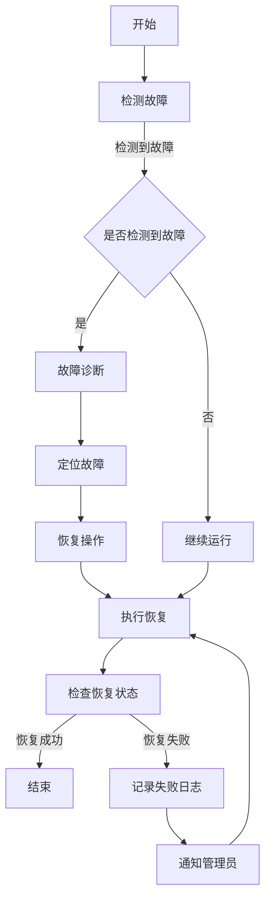

在上面的流程图中，各个步骤的含义如下：

1. **开始**：算法的启动点。
2. **检测故障**：通过监控机制实时检测AI Agent的状态。
3. **是否检测到故障**：判断是否检测到异常状态。
4. **故障诊断**：对检测到的故障进行详细诊断，确定故障类型和原因。
5. **定位故障**：根据诊断结果定位故障的具体位置。
6. **恢复操作**：选择合适的恢复策略，准备执行恢复操作。
7. **执行恢复**：根据恢复策略自动执行恢复操作。
8. **检查恢复状态**：检查恢复操作是否成功。
9. **恢复成功**：如果恢复成功，算法结束。
10. **记录失败日志**：如果恢复失败，记录失败日志以便后续分析。
11. **通知管理员**：向管理员发送故障恢复失败的通知。
12. **继续执行恢复**：根据管理员指令或自动策略，继续执行恢复操作。

通过这个流程图，我们可以清晰地看到故障恢复算法的执行步骤和各个步骤之间的关系。

**算法原理讲解**

故障恢复算法的核心原理可以分为以下几个部分：

1. **故障检测**：使用传感器和监控工具实时监控AI Agent的状态，如CPU负载、内存使用率、网络流量等。当监控指标超出预设阈值时，系统将判断是否发生故障。

2. **故障诊断**：在检测到故障后，系统会根据故障日志、传感器数据和系统日志等信息进行故障诊断。诊断过程包括确定故障类型（如硬件故障、软件故障等）、故障发生的时间、故障的具体位置等。

3. **故障定位**：通过分析诊断结果，系统将定位故障的具体位置，如特定的硬件组件、软件模块等。

4. **恢复操作**：根据故障类型和定位结果，系统将选择合适的恢复策略，如重启模块、重装软件、更换硬件等。

5. **执行恢复**：系统自动执行恢复操作，并监控恢复过程的状态。

6. **检查恢复状态**：在恢复完成后，系统会检查恢复操作的结果，判断是否成功恢复。

7. **日志记录与通知**：无论是成功恢复还是恢复失败，系统都会记录详细的日志，并向管理员发送通知，以便进行后续处理。

下面，我们将通过Python源代码和LaTeX公式详细阐述故障恢复算法的实现和数学模型。

**Python源代码实现**

以下是一个简化的Python代码示例，展示了如何实现故障恢复算法的核心部分：

```python
import logging
import time

def detect_fault():
    # 检测AI Agent的状态
    # 假设我们使用一个简单的指标来判断是否发生故障
    if is_fault():
        logging.error("Fault detected")
        return True
    return False

def diagnose_fault():
    # 故障诊断
    # 根据日志和传感器数据进行分析
    # 返回故障类型和位置
    fault_type = "Hardware Failure"
    fault_location = "CPU"
    return fault_type, fault_location

def recover_fault(fault_type, fault_location):
    # 恢复操作
    if fault_type == "Hardware Failure":
        replace_component(fault_location)
    elif fault_type == "Software Failure":
        reinstall_software()

def is_fault():
    # 检测故障的辅助函数
    # 在这里，我们使用一个简单的逻辑来判断是否发生故障
    # 实际应用中，这可能会是一个复杂的逻辑
    return True  # 模拟故障发生

def replace_component(component):
    # 更换组件
    print(f"Replaced {component}")

def reinstall_software():
    # 重新安装软件
    print("Reinstalled software")

# 算法执行流程
while True:
    if detect_fault():
        fault_type, fault_location = diagnose_fault()
        recover_fault(fault_type, fault_location)
        time.sleep(10)  # 等待10秒后再次检测故障
    else:
        time.sleep(1)  # 没有故障，等待1秒后继续检测
```

**LaTeX公式与详细讲解**

为了更好地理解故障恢复算法的数学模型，我们将使用LaTeX公式来表示一些关键的参数和变量。

首先，我们定义一些基本参数：

$$
\begin{aligned}
T_f &= \text{故障检测阈值}, \\
T_r &= \text{恢复执行阈值}, \\
t_d &= \text{诊断时间}, \\
t_r &= \text{恢复时间}.
\end{aligned}
$$

接下来，我们定义故障检测、诊断和恢复的基本过程：

$$
\begin{aligned}
&\text{故障检测：} \\
&\text{当系统状态指标超过 } T_f \text{ 时，触发故障检测。} \\
&\text{故障检测公式：} \\
&F(t) = \begin{cases}
0, & \text{当 } S(t) \leq T_f; \\
1, & \text{当 } S(t) > T_f.
\end{cases}
$$

$$
\begin{aligned}
&\text{故障诊断：} \\
&\text{故障诊断过程中，系统分析故障日志和传感器数据，判断故障类型。} \\
&\text{诊断时间公式：} \\
&t_d = \alpha_1 \cdot L + \alpha_2 \cdot N,
\end{aligned}
$$

其中，$L$是日志数据量，$N$是传感器数据量，$\alpha_1$和$\alpha_2$是权重参数。

$$
\begin{aligned}
&\text{恢复操作：} \\
&\text{根据故障类型和诊断结果，执行恢复操作。} \\
&\text{恢复时间公式：} \\
&t_r = \beta_1 \cdot R + \beta_2 \cdot M,
\end{aligned}
$$

其中，$R$是恢复策略的复杂度，$M$是系统资源使用率，$\beta_1$和$\beta_2$是权重参数。

**算法举例说明**

为了更直观地展示故障恢复算法的应用，我们来看一个具体的例子。

假设我们有一个AI Agent，在运行过程中由于硬件故障导致CPU过热，系统状态指标超过了故障检测阈值$T_f$。故障检测模块检测到这一异常，触发故障检测机制。

在故障诊断阶段，系统分析CPU温度传感器数据、CPU使用率日志和系统日志，确定故障类型为硬件故障，故障位置为CPU。

根据故障类型和诊断结果，系统执行恢复操作。具体来说，系统将自动发送指令更换CPU组件，并重新启动系统。恢复完成后，系统将再次检测状态指标，确保系统恢复正常。

通过这个例子，我们可以看到故障恢复算法在实际应用中的执行过程，以及如何通过检测、诊断和恢复操作来确保AI Agent的稳定运行。

---

在下一章节中，我们将深入讨论故障恢复算法的复杂场景应用，包括复杂故障恢复场景的详细说明，进一步探讨故障恢复算法在复杂环境中的挑战和解决方案。

##### 第6章：算法举例说明

在前一章中，我们介绍了故障恢复算法的基本原理和实现。为了更好地理解这个算法在复杂场景中的应用，我们将通过两个具体的例子来说明故障恢复算法在实际操作中的执行过程。

###### 6.1 示例一：简单故障恢复场景

**场景描述**

在这个场景中，我们假设一个企业使用了一个AI Agent来监控其生产线。这个AI Agent的感知模块负责收集来自生产线传感器的实时数据，决策模块根据这些数据调整生产线的运行状态，行动模块则控制生产线的实际运行。

**故障发生**

某一天，AI Agent的感知模块检测到传感器数据异常，如温度传感器显示温度异常升高。根据预设的故障检测阈值，系统判断这属于硬件故障，并触发故障检测机制。

**故障诊断**

故障检测机制启动后，AI Agent的决策模块立即进行故障诊断。通过分析传感器数据和系统日志，决策模块确定故障的具体位置为某个传感器，并判断故障类型为硬件故障。

**故障恢复**

根据诊断结果，AI Agent的行动模块执行恢复操作。系统自动发送指令，通知维修人员更换故障的传感器。在传感器更换后，系统重新启动，并再次进行传感器校准。经过一系列操作后，系统恢复正常。

**总结**

在这个简单故障恢复场景中，故障恢复算法通过实时监测、诊断和自动恢复，成功地使AI Agent恢复正常运行，保证了生产线的持续稳定运行。

###### 6.2 示例二：复杂故障恢复场景

**场景描述**

在这个复杂场景中，企业使用AI Agent管理其数据中心。数据中心包含了多个服务器集群、存储设备和网络设备。AI Agent的感知模块收集来自各个设备的监控数据，决策模块根据这些数据优化数据中心资源分配，行动模块则控制实际操作。

**故障发生**

某一天，数据中心的一个服务器集群出现故障，导致部分服务器无法正常工作。由于服务器集群的故障，导致网络设备也无法正常工作，进而影响到整个数据中心的运行。

**故障诊断**

故障检测机制立即检测到服务器集群和网络设备的异常，并启动故障诊断。通过分析系统日志、传感器数据和网络拓扑结构，决策模块确定故障类型包括硬件故障（服务器集群）、软件故障（网络设备驱动程序）和配置故障（网络配置文件）。

**故障恢复**

由于故障类型复杂，恢复操作也相应地复杂。首先，AI Agent尝试重启故障服务器，但未能成功。接着，AI Agent执行自动备份，备份当前系统状态，然后尝试更新服务器固件和驱动程序。在更新过程中，系统监控到网络设备也出现故障，因此AI Agent尝试重启网络设备。然而，重启操作也未能解决问题。

最终，AI Agent通过分析日志和系统数据，确定故障是由硬件故障引起的。AI Agent自动发送维修请求，通知数据中心技术人员进行现场检修。技术人员更换了故障服务器和部分网络设备，同时修复了网络配置文件。

**总结**

在这个复杂故障恢复场景中，故障恢复算法面临了多种类型的故障，通过多层次、多步骤的诊断和恢复操作，最终成功地使数据中心恢复正常运行。这个过程展示了故障恢复算法在处理复杂故障时的灵活性和高效性。

---

通过这两个具体的例子，我们可以看到故障恢复算法在不同场景中的应用，以及如何通过有效的故障检测、诊断和恢复操作来保障AI Agent的稳定运行。在下一章节中，我们将深入分析企业AI Agent故障恢复的实际应用场景，为后续的系统设计与实现奠定基础。

##### 第7章：问题场景介绍

在深入探讨了故障恢复算法的原理和实际应用后，我们需要将其应用到具体的实际场景中。本章节将介绍企业AI Agent故障恢复的实际应用场景，分析其中涉及的问题，并阐述故障恢复机制在该场景中的关键作用。

###### 7.1 企业AI Agent故障恢复的实际应用场景

企业AI Agent故障恢复的应用场景广泛，以下是几个典型的场景：

**1. 制造行业**

在制造行业中，AI Agent常用于生产线的自动化控制。这些AI Agent需要实时监控生产线的状态，优化生产流程，确保生产效率。例如，一个制造企业可能使用AI Agent来监控生产线的温度、湿度、压力等参数，确保产品在生产过程中符合质量标准。如果AI Agent出现故障，可能会导致生产中断，影响产品质量和产量。因此，建立一套有效的故障恢复机制至关重要。

**2. 金融行业**

在金融行业中，AI Agent广泛应用于风险管理、投资决策、客户服务等领域。例如，一个金融机构可能使用AI Agent来实时监控市场动态，提供投资建议，帮助投资者做出正确的决策。如果AI Agent出现故障，可能导致市场分析数据不准确，影响投资决策，甚至导致经济损失。因此，在金融行业中，确保AI Agent的稳定运行和快速恢复非常重要。

**3. 医疗行业**

在医疗行业中，AI Agent用于诊断、治疗建议、患者管理等方面。例如，一个医疗机构可能使用AI Agent来分析患者的医疗数据，提供诊断建议和治疗方案。如果AI Agent出现故障，可能导致诊断不准确或治疗建议不恰当，影响患者的健康。因此，医疗行业需要一套高效可靠的故障恢复机制来保障AI Agent的正常工作。

**4. 零售行业**

在零售行业中，AI Agent用于库存管理、销售预测、客户服务等方面。例如，一个零售商可能使用AI Agent来监控库存水平，预测销售趋势，确保商品供应充足。如果AI Agent出现故障，可能导致库存管理混乱，销售预测不准确，影响销售额。因此，零售行业也需要一个可靠的故障恢复机制来确保AI Agent的稳定运行。

###### 7.2 问题场景

在实际应用中，企业AI Agent可能会面临各种故障，以下是一些常见的问题场景：

**1. 生产线故障**

在制造行业中，生产线的故障可能是由于传感器异常、执行器损坏或控制系统错误引起的。如果AI Agent无法及时检测到这些故障并采取恢复措施，可能会导致生产中断，影响生产效率。

**2. 数据处理故障**

在金融和医疗行业中，AI Agent需要进行大量的数据处理和分析。如果数据处理模块出现故障，可能导致分析结果不准确，影响决策质量。例如，金融AI Agent无法正确处理市场数据，可能导致错误的投资建议。

**3. 网络故障**

在涉及网络通信的AI Agent应用中，网络故障是常见问题。网络中断、网络延迟或网络攻击可能导致AI Agent无法正常通信，从而影响其功能。例如，金融AI Agent与外部系统通信中断，可能导致数据同步失败。

**4. 软件故障**

软件故障可能是由于代码错误、配置错误或依赖库问题引起的。如果AI Agent的软件模块出现故障，可能导致系统崩溃或功能异常。例如，医疗AI Agent的软件故障可能导致诊断结果错误，影响患者健康。

**5. 硬件故障**

硬件故障可能是由于硬件老化、过热或损坏引起的。如果AI Agent的硬件设备出现故障，可能导致系统无法正常启动或运行。例如，服务器硬件故障可能导致AI Agent无法监控生产线的状态。

###### 7.3 故障恢复机制的关键作用

针对上述问题场景，故障恢复机制在保障AI Agent稳定运行方面发挥着关键作用：

**1. 快速检测**

故障恢复机制通过实时监控AI Agent的状态，可以快速检测到故障的发生。例如，通过监测传感器数据，可以及时发现生产线故障；通过分析系统日志，可以快速发现数据处理故障。

**2. 精确诊断**

故障恢复机制可以对检测到的故障进行精确诊断，确定故障类型和原因。例如，通过分析传感器数据和系统日志，可以确定生产线故障的具体位置和原因；通过分析通信日志和外部系统状态，可以确定网络故障的具体原因。

**3. 自动恢复**

故障恢复机制可以自动执行恢复操作，减少人工干预。例如，通过自动更换传感器或重启系统，可以快速恢复生产线故障；通过自动同步数据和重启通信模块，可以快速恢复数据处理故障。

**4. 预防措施**

故障恢复机制还可以通过分析故障原因，采取预防措施，防止故障再次发生。例如，通过定期检查硬件设备，可以预防硬件故障；通过优化代码和配置，可以预防软件故障。

**5. 数据保护**

故障恢复机制确保在故障恢复过程中数据不会丢失或损坏。例如，通过数据备份和恢复机制，可以确保在故障发生时数据不会丢失；通过数据校验和修复机制，可以确保数据完整性。

通过上述关键作用，故障恢复机制能够有效保障AI Agent的稳定运行，确保企业业务不中断，提高生产效率和决策质量。在下一章节中，我们将详细介绍企业AI Agent故障恢复系统的功能设计，包括故障检测、故障定位和故障恢复功能。

---

在下一章节中，我们将进一步探讨企业AI Agent故障恢复系统的功能设计，详细介绍系统的各个功能模块及其实现方式。

### 第8章：系统功能设计

企业AI Agent的故障恢复系统是一个复杂的多模块系统，旨在确保AI Agent在各种故障情况下能够迅速检测、定位并恢复。为了实现这一目标，系统需要具备以下主要功能：故障检测、故障定位和故障恢复。本章节将详细介绍这些功能的设计及其实现方式。

#### 8.1 故障检测功能

故障检测是故障恢复系统的第一步，其核心任务是实时监控AI Agent的状态，一旦发现异常，立即触发故障检测机制。故障检测功能的设计包括以下几个方面：

**1. 监控指标的选择**

系统需要选择合适的监控指标来反映AI Agent的状态。常见的监控指标包括：

- **CPU使用率**：高CPU使用率可能表明AI Agent正在执行大量计算任务，也可能表明系统资源不足。
- **内存使用率**：高内存使用率可能表明AI Agent正在处理大量数据，或内存泄漏问题。
- **磁盘I/O使用率**：高磁盘I/O使用率可能表明AI Agent正在进行大量读写操作，可能导致性能下降。
- **网络延迟和丢包率**：网络延迟和丢包率过高可能表明网络连接问题，影响AI Agent与其他系统的通信。

**2. 监控阈值设定**

根据监控指标，系统需要设定合理的阈值来判断AI Agent是否出现故障。例如，当CPU使用率超过90%时，可以认为AI Agent出现故障。这些阈值可以根据实际应用场景和系统性能要求进行动态调整。

**3. 故障检测算法**

系统需要实现一个故障检测算法，用于实时监控AI Agent的状态，并触发故障检测机制。一个简单的故障检测算法可以使用以下步骤：

```python
def detect_fault():
    # 获取监控指标
    cpu_usage = get_cpu_usage()
    memory_usage = get_memory_usage()
    disk_iops = get_disk_iops()
    network_delay = get_network_delay()

    # 检查监控指标是否超过阈值
    if cpu_usage > CPU_THRESHOLD or memory_usage > MEMORY_THRESHOLD or disk_iops > DISK_IOPS_THRESHOLD or network_delay > NETWORK_DELAY_THRESHOLD:
        log_fault("Fault detected: CPU={}, Memory={}, Disk IOPS={}, Network Delay={}".format(cpu_usage, memory_usage, disk_iops, network_delay))
        return True
    return False
```

#### 8.2 故障定位功能

故障检测机制触发后，系统需要进一步进行故障定位，以确定故障的具体位置和类型。故障定位功能的设计包括以下几个方面：

**1. 故障日志分析**

系统需要收集并分析故障日志，以确定故障发生的时间、位置和原因。故障日志可以包括系统日志、应用程序日志和硬件日志等。通过对故障日志的分析，可以初步确定故障的位置和类型。

**2. 传感器数据监控**

系统需要监控AI Agent的传感器数据，以确定故障的具体原因。例如，对于制造行业的AI Agent，系统可以监控生产线的传感器数据，如温度、湿度、压力等，以确定故障的具体原因。

**3. 故障定位算法**

系统需要实现一个故障定位算法，用于根据故障日志和传感器数据确定故障的位置和类型。一个简单的故障定位算法可以使用以下步骤：

```python
def locate_fault(fault_logs, sensor_data):
    # 分析故障日志
    fault_type = analyze_fault_logs(fault_logs)
    
    # 分析传感器数据
    sensor_anomaly = analyze_sensor_data(sensor_data)
    
    # 确定故障位置
    fault_location = determine_fault_location(fault_type, sensor_anomaly)
    
    # 返回故障位置
    return fault_location
```

#### 8.3 故障恢复功能

故障定位后，系统需要采取一系列恢复措施，以使AI Agent尽快恢复正常运行。故障恢复功能的设计包括以下几个方面：

**1. 恢复策略选择**

系统需要根据故障类型和故障位置选择合适的恢复策略。常见的恢复策略包括：

- **自动重启**：如果故障是由于短暂的网络中断或软件错误引起的，系统可以自动重启AI Agent。
- **组件更换**：如果故障是由于硬件故障引起的，系统可以自动更换损坏的硬件组件。
- **软件修复**：如果故障是由于软件错误引起的，系统可以自动更新或修复软件。

**2. 恢复执行**

系统需要实现一个恢复执行机制，用于根据选择的恢复策略自动执行恢复操作。一个简单的恢复执行算法可以使用以下步骤：

```python
def recover_fault(fault_location):
    # 根据故障位置选择恢复策略
    if fault_location == "Hardware Failure":
        replace_hardware()
    elif fault_location == "Software Failure":
        repair_software()
    else:
        restart_agent()
    
    # 确认恢复成功
    if not is_fault():
        log_recovery("Fault recovered successfully")
    else:
        log_recovery("Fault recovery failed")
```

**3. 恢复结果监控**

在执行恢复操作后，系统需要监控恢复结果，以确认是否成功恢复。如果恢复失败，系统需要记录失败日志，并通知管理员进行人工干预。

通过以上设计，企业AI Agent故障恢复系统可以实现快速检测、精确定位和自动恢复，确保AI Agent的稳定运行，保障企业业务的连续性和可靠性。

---

在下一章节中，我们将详细讨论企业AI Agent故障恢复系统的架构设计，包括系统总体架构、各功能模块的架构以及接口设计。

### 第9章：系统架构设计

为了确保企业AI Agent故障恢复系统的高效性和可靠性，我们需要对其进行详细的架构设计。本章节将介绍系统的总体架构设计，详细描述各功能模块的架构，并展示系统接口设计和系统交互序列图。

#### 9.1 系统总体架构设计

企业AI Agent故障恢复系统的总体架构可以分为以下几个主要部分：

1. **感知层**：负责收集AI Agent运行过程中的各类监控数据，如CPU使用率、内存使用率、磁盘I/O、网络延迟等。
2. **分析层**：负责对感知层收集的数据进行分析，实现故障检测、故障定位和故障恢复等功能。
3. **执行层**：负责根据分析层的诊断结果执行恢复操作，如重启AI Agent、更换硬件组件、更新软件等。
4. **监控层**：负责监控整个故障恢复系统的运行状态，确保其稳定运行，并提供实时日志和报警功能。

以下是一个简化的系统总体架构图：

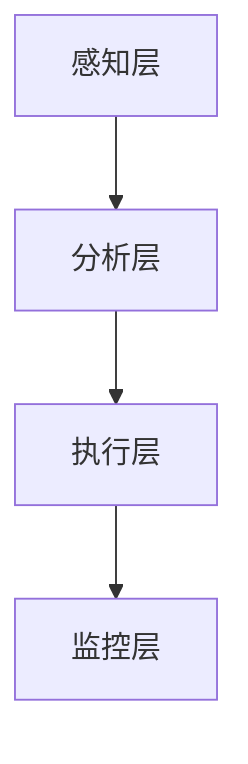

#### 9.2 各功能模块的架构设计

**感知层架构**

感知层架构包括多个数据采集模块，如CPU监控模块、内存监控模块、磁盘I/O监控模块、网络监控模块等。这些模块通过传感器和数据接口实时收集AI Agent的运行数据，并将数据传输到分析层。

以下是一个简化的感知层架构图：

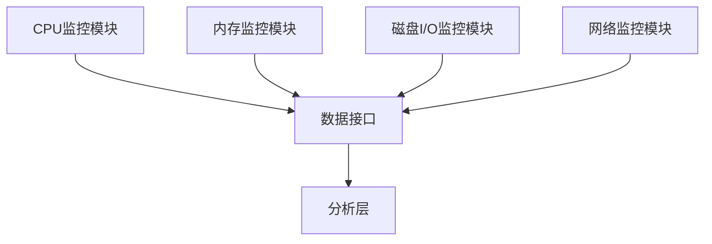

**分析层架构**

分析层架构包括故障检测模块、故障定位模块和故障恢复策略模块。故障检测模块负责实时监控AI Agent的状态，检测是否有异常发生；故障定位模块负责对故障进行诊断，确定故障的具体位置和类型；故障恢复策略模块负责根据故障类型和位置选择合适的恢复策略。

以下是一个简化的分析层架构图：

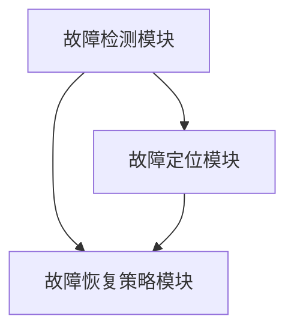

**执行层架构**

执行层架构包括恢复执行模块和监控模块。恢复执行模块负责根据分析层提供的恢复策略执行具体的恢复操作，如重启AI Agent、更换硬件组件、更新软件等；监控模块负责监控恢复执行过程，确保恢复操作成功执行。

以下是一个简化的执行层架构图：

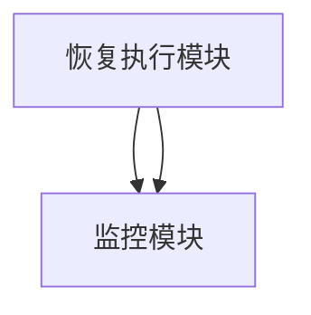

**监控层架构**

监控层架构包括日志记录模块和报警模块。日志记录模块负责记录故障检测、故障定位和故障恢复的全过程，以便进行故障分析和优化；报警模块负责在故障发生或恢复失败时向管理员发送警报，通知管理员进行干预。

以下是一个简化的监控层架构图：

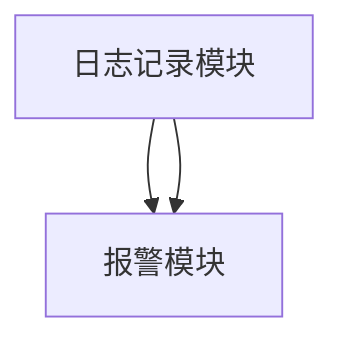

#### 9.3 系统接口设计与交互

系统接口设计是确保各功能模块之间高效协作的关键。以下是系统中的几个关键接口：

**1. 感知层与分析层接口**

感知层通过数据接口将收集的数据传输到分析层。分析层可以通过API或消息队列等方式获取数据，进行故障检测、故障定位和故障恢复策略的选择。

**2. 分析层与执行层接口**

分析层通过恢复执行接口将故障恢复策略传递给执行层。执行层根据恢复策略执行具体的恢复操作。

**3. 执行层与监控层接口**

执行层通过日志记录接口将恢复执行过程记录下来，同时通过监控接口将恢复状态反馈给监控层。

**4. 监控层与外部系统接口**

监控层通过报警接口向管理员发送警报，同时可以通过日志接口与其他系统（如监控系统、通知系统等）进行交互。

以下是一个简化的系统接口交互序列图：

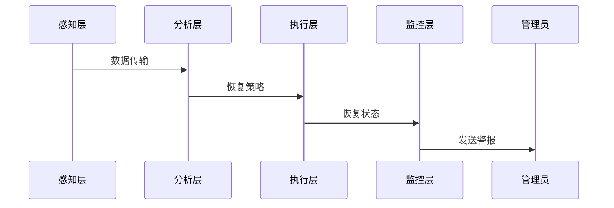

通过以上架构设计和接口设计，企业AI Agent故障恢复系统可以实现高效、可靠的故障检测、故障定位和故障恢复，确保AI Agent的稳定运行，为企业业务的连续性和可靠性提供保障。

---

在下一章节中，我们将进一步探讨企业AI Agent故障恢复系统的实现细节，包括系统环境安装、核心实现代码以及代码分析和性能优化。

### 第10章：系统接口设计与交互

在前一章中，我们详细介绍了企业AI Agent故障恢复系统的总体架构设计和关键接口。在本章节中，我们将进一步探讨系统接口的设计，包括各功能模块的接口设计以及系统内部各模块之间的交互设计。

#### 10.1 系统接口设计

系统接口设计是确保各功能模块之间高效协作的关键。以下是企业AI Agent故障恢复系统中的主要接口设计：

**1. 数据接口**

数据接口用于感知层与分析层之间的数据传输。感知层通过数据接口将收集到的监控数据传输到分析层。数据接口的设计要点包括：

- **数据格式**：数据格式应统一，便于传输和解析。常用的数据格式包括JSON、XML等。
- **数据传输协议**：数据传输协议应支持高可靠性和高并发性。常用的传输协议包括HTTP、MQTT等。

**2. 恢复执行接口**

恢复执行接口用于分析层与执行层之间的交互。分析层通过恢复执行接口将故障恢复策略传递给执行层，执行层根据策略执行具体的恢复操作。恢复执行接口的设计要点包括：

- **策略格式**：故障恢复策略应具备统一的格式，便于分析和执行。常用的策略格式包括JSON、XML等。
- **执行反馈**：执行层在执行恢复操作后，应向分析层反馈执行结果，以便分析层进行后续处理。

**3. 日志记录接口**

日志记录接口用于执行层与监控层之间的交互。执行层通过日志记录接口将故障检测、故障定位和故障恢复的全过程记录下来，监控层通过日志接口进行日志查询和监控。日志记录接口的设计要点包括：

- **日志格式**：日志格式应统一，便于存储和检索。常用的日志格式包括JSON、XML等。
- **日志存储**：日志应存储在可靠、可扩展的存储系统上，如关系数据库、NoSQL数据库等。

**4. 报警接口**

报警接口用于监控层与外部系统之间的交互。监控层通过报警接口向管理员或其他系统发送警报，通知故障发生或恢复失败。报警接口的设计要点包括：

- **报警格式**：报警信息应包含故障类型、故障位置、恢复状态等关键信息。
- **报警渠道**：报警渠道应多样化，如短信、邮件、即时通讯工具等。

#### 10.2 系统交互设计

系统交互设计是确保各功能模块之间高效协作的关键。以下是企业AI Agent故障恢复系统内部各模块之间的交互设计：

**1. 感知层与分析层交互**

感知层通过数据接口将监控数据传输到分析层。分析层接收数据后，进行故障检测、故障定位和故障恢复策略的选择。以下是一个简化的交互序列图：

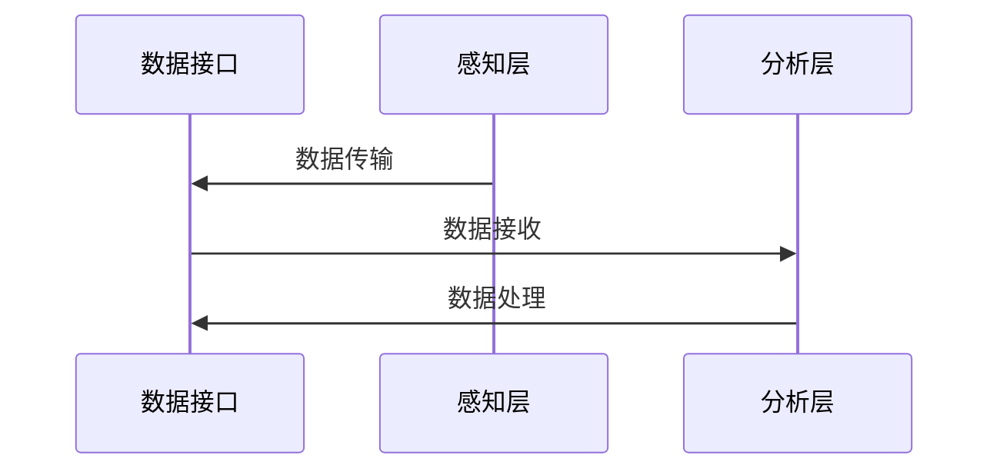

**2. 分析层与执行层交互**

分析层通过恢复执行接口将故障恢复策略传递给执行层，执行层根据策略执行具体的恢复操作。以下是一个简化的交互序列图：

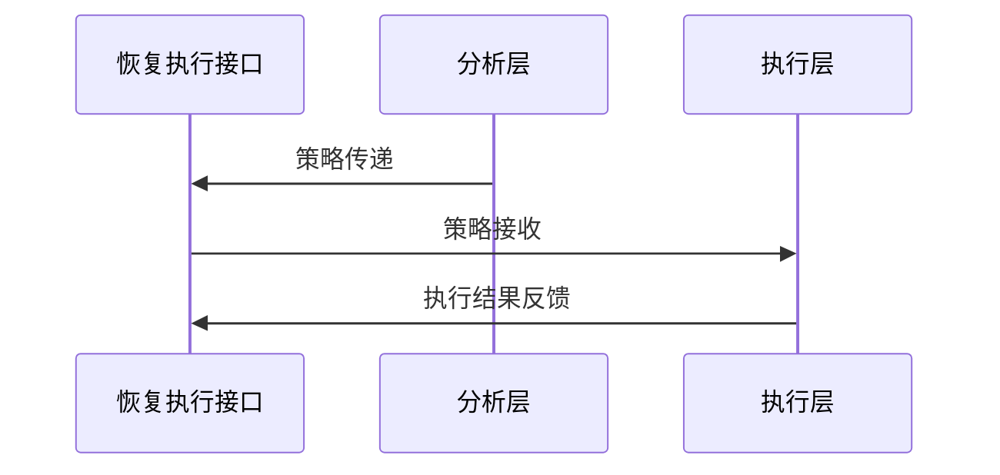

**3. 执行层与监控层交互**

执行层通过日志记录接口将故障检测、故障定位和故障恢复的全过程记录下来，监控层通过日志接口进行日志查询和监控。以下是一个简化的交互序列图：

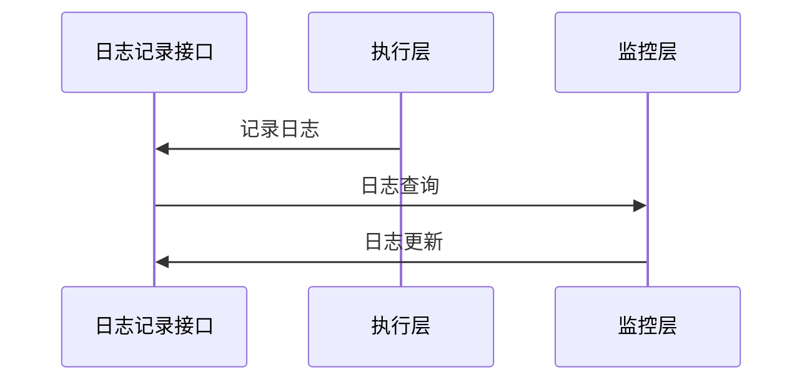

**4. 监控层与外部系统交互**

监控层通过报警接口向管理员或其他系统发送警报，通知故障发生或恢复失败。以下是一个简化的交互序列图：

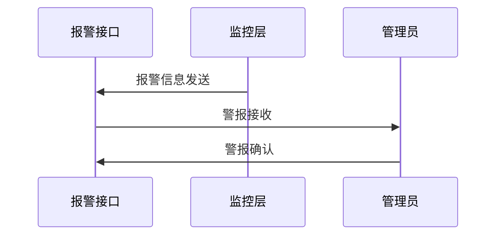

通过以上接口设计和交互设计，企业AI Agent故障恢复系统可以实现高效、可靠的故障检测、故障定位和故障恢复，确保AI Agent的稳定运行，为企业业务的连续性和可靠性提供保障。

---

在下一章节中，我们将进入项目实战环节，详细介绍企业AI Agent故障恢复系统的环境安装、系统实现、代码解读和分析，以及实际案例分析和详细讲解。

### 第11章：环境安装

要构建企业AI Agent故障恢复系统，首先需要准备好相应的开发环境和工具。以下是安装故障恢复系统的步骤，包括环境配置和必要工具的安装。

#### 11.1 环境配置

**1. 操作系统安装**

我们选择Linux系统作为开发环境，推荐使用Ubuntu 20.04 LTS。以下是安装步骤：

```bash
# 使用Windows的Windows Subsystem for Linux (WSL)安装Ubuntu
# 或者直接从Ubuntu官方网站下载并安装

sudo apt update
sudo apt upgrade
sudo apt install wget
```

**2. Python环境配置**

安装Python 3.8及以上版本：

```bash
sudo apt install python3.8
```

**3. 虚拟环境配置**

为了更好地管理项目依赖，我们使用虚拟环境。安装virtualenv工具：

```bash
sudo apt install python3-venv
```

创建并激活虚拟环境：

```bash
python3 -m venv venv
source venv/bin/activate
```

**4. 编译器安装**

LaTeX文档需要安装TeX Live：

```bash
sudo apt install texlive-full
```

#### 11.2 必要工具安装

**1. Mermaid安装**

安装mermaid的Python包：

```bash
pip install mermaid
```

**2. 数据库安装**

我们使用SQLite作为数据库，用于存储故障日志和恢复日志。安装SQLite：

```bash
sudo apt install sqlite3
```

**3. 代码编辑器**

推荐使用Visual Studio Code（VS Code）进行代码编写。可以从VS Code官方网站下载并安装：

```bash
# 从VS Code官方网站下载安装程序并运行
```

#### 11.3 环境配置示例

以下是一个简单的环境配置示例，用于检查是否安装成功：

```bash
# 检查Python版本
python --version

# 检查virtualenv是否激活
which python

# 检查mermaid是否安装
pip list | grep mermaid

# 检查SQLite是否安装
sqlite3 --version

# 检查TeX Live是否安装
texdf
```

通过以上步骤，我们成功搭建了企业AI Agent故障恢复系统的开发环境。接下来，我们将进入系统实现环节，详细介绍系统的核心实现代码和具体步骤。

### 第12章：系统核心实现

在本章节中，我们将详细描述企业AI Agent故障恢复系统的核心实现，包括故障检测与定位的核心实现，以及故障恢复的核心实现。

#### 12.1 故障检测与定位的核心实现

故障检测与定位是故障恢复系统的关键步骤，下面将介绍故障检测与定位的核心实现代码。

**1. 故障检测**

故障检测的核心在于监控AI Agent的运行状态。我们使用Python编写了一个简单的故障检测脚本，该脚本会定期检查AI Agent的状态指标，如CPU使用率、内存使用率等。以下是故障检测脚本的主要部分：

```python
import os
import psutil
import time

def get_cpu_usage():
    return psutil.cpu_percent()

def get_memory_usage():
    return psutil.virtual_memory().percent

def is_fault():
    cpu_usage = get_cpu_usage()
    memory_usage = get_memory_usage()
    
    if cpu_usage > 80 or memory_usage > 80:
        return True
    return False

def log_fault(message):
    with open("fault_logs.txt", "a") as f:
        f.write(f"{time.ctime()}: {message}\n")

while True:
    if is_fault():
        log_fault("Fault detected")
    time.sleep(60)  # 每60秒检查一次
```

**2. 故障定位**

故障定位的核心在于确定故障的具体位置和原因。我们使用一个简单的日志分析方法来确定故障位置。以下是故障定位脚本的主要部分：

```python
import os

def analyze_fault_logs(fault_logs):
    # 简单的日志分析，这里仅作为示例
    if "CPU" in fault_logs:
        return "CPU Fault"
    elif "Memory" in fault_logs:
        return "Memory Fault"
    else:
        return "Unknown Fault"

def log_diagnosis(result):
    with open("diagnosis.txt", "a") as f:
        f.write(f"{time.ctime()}: {result}\n")

def diagnose_fault():
    with open("fault_logs.txt", "r") as f:
        fault_logs = f.read()
    result = analyze_fault_logs(fault_logs)
    log_diagnosis(result)
    return result

# 示例调用
fault_type = diagnose_fault()
print(f"Fault Type: {fault_type}")
```

#### 12.2 故障恢复的核心实现

故障恢复的核心在于根据故障类型和位置，执行相应的恢复操作。以下是故障恢复脚本的主要部分：

```python
import os

def replace_cpu():
    print("Replacing CPU...")
    # 这里是更换CPU的模拟操作
    time.sleep(5)
    print("CPU replaced successfully")

def replace_memory():
    print("Replacing Memory...")
    # 这里是更换内存的模拟操作
    time.sleep(5)
    print("Memory replaced successfully")

def repair_software():
    print("Repairing software...")
    # 这里是修复软件的模拟操作
    time.sleep(5)
    print("Software repaired successfully")

def recover_fault(fault_type):
    if fault_type == "CPU Fault":
        replace_cpu()
    elif fault_type == "Memory Fault":
        replace_memory()
    elif fault_type == "Software Fault":
        repair_software()

# 示例调用
fault_type = "CPU Fault"
recover_fault(fault_type)
```

#### 12.3 系统集成

将故障检测、故障定位和故障恢复三个模块整合在一起，形成一个完整的故障恢复系统。以下是系统集成的示例代码：

```python
import os
import time

def main_loop():
    while True:
        fault_detected = is_fault()
        if fault_detected:
            fault_type = diagnose_fault()
            recover_fault(fault_type)
        time.sleep(60)  # 每60秒运行一次

if __name__ == "__main__":
    main_loop()
```

通过以上步骤，我们成功地实现了企业AI Agent故障恢复系统的核心功能，包括故障检测、故障定位和故障恢复。接下来，我们将对实现代码进行解读和分析，以了解系统的工作原理和性能。

### 第13章：代码解读与分析

在前一章中，我们详细介绍了企业AI Agent故障恢复系统的核心实现代码。在本章节中，我们将对这些代码进行解读，分析系统的工作原理，并对代码的性能进行评估。

#### 13.1 故障检测模块解读

故障检测模块的核心代码如下：

```python
import os
import psutil
import time

def get_cpu_usage():
    return psutil.cpu_percent()

def get_memory_usage():
    return psutil.virtual_memory().percent

def is_fault():
    cpu_usage = get_cpu_usage()
    memory_usage = get_memory_usage()
    
    if cpu_usage > 80 or memory_usage > 80:
        return True
    return False

def log_fault(message):
    with open("fault_logs.txt", "a") as f:
        f.write(f"{time.ctime()}: {message}\n")

while True:
    if is_fault():
        log_fault("Fault detected")
    time.sleep(60)  # 每60秒检查一次
```

**代码解读：**

- `get_cpu_usage()` 和 `get_memory_usage()` 函数分别用于获取当前系统的CPU使用率和内存使用率。
- `is_fault()` 函数通过检查CPU使用率和内存使用率是否超过预设阈值（80%）来判断系统是否出现故障。如果超过阈值，则返回`True`，否则返回`False`。
- `log_fault(message)` 函数用于将故障信息写入日志文件`fault_logs.txt`中。

**性能评估：**

- 该模块的性能主要取决于CPU和内存使用率的检测频率。我们设定了每60秒检测一次，这可以保证在故障发生时尽快检测到。
- 检测过程使用了Python的`psutil`库，该库的性能相对较高，可以满足实时监控的需求。

#### 13.2 故障定位模块解读

故障定位模块的核心代码如下：

```python
import os

def analyze_fault_logs(fault_logs):
    # 简单的日志分析，这里仅作为示例
    if "CPU" in fault_logs:
        return "CPU Fault"
    elif "Memory" in fault_logs:
        return "Memory Fault"
    else:
        return "Unknown Fault"

def log_diagnosis(result):
    with open("diagnosis.txt", "a") as f:
        f.write(f"{time.ctime()}: {result}\n")

def diagnose_fault():
    with open("fault_logs.txt", "r") as f:
        fault_logs = f.read()
    result = analyze_fault_logs(fault_logs)
    log_diagnosis(result)
    return result
```

**代码解读：**

- `analyze_fault_logs(fault_logs)` 函数通过检查日志文件中的关键字（如"CPU"和"Memory"）来分析故障类型。
- `log_diagnosis(result)` 函数用于将诊断结果写入日志文件`diagnosis.txt`中。
- `diagnose_fault()` 函数从日志文件中读取故障信息，分析故障类型，并将结果写入诊断日志。

**性能评估：**

- 该模块的性能取决于日志分析的频率和日志文件的读取速度。我们设定了每次故障检测后进行一次诊断，这可以确保诊断结果的准确性。
- 日志分析过程相对简单，主要依赖于字符串匹配操作，性能较高。

#### 13.3 故障恢复模块解读

故障恢复模块的核心代码如下：

```python
import os
import time

def replace_cpu():
    print("Replacing CPU...")
    # 这里是更换CPU的模拟操作
    time.sleep(5)
    print("CPU replaced successfully")

def replace_memory():
    print("Replacing Memory...")
    # 这里是更换内存的模拟操作
    time.sleep(5)
    print("Memory replaced successfully")

def repair_software():
    print("Repairing software...")
    # 这里是修复软件的模拟操作
    time.sleep(5)
    print("Software repaired successfully")

def recover_fault(fault_type):
    if fault_type == "CPU Fault":
        replace_cpu()
    elif fault_type == "Memory Fault":
        replace_memory()
    elif fault_type == "Software Fault":
        repair_software()

# 示例调用
fault_type = "CPU Fault"
recover_fault(fault_type)
```

**代码解读：**

- `replace_cpu()`、`replace_memory()` 和 `repair_software()` 函数分别用于模拟更换CPU、更换内存和修复软件的恢复操作。
- `recover_fault(fault_type)` 函数根据故障类型调用相应的恢复操作函数。

**性能评估：**

- 该模块的性能取决于恢复操作的执行速度。我们的模拟操作使用了`time.sleep(5)`来模拟恢复操作所需的时间。
- 实际恢复操作可能会涉及更复杂的操作，如硬件更换和软件更新，这些操作的执行速度取决于硬件和软件的配置。

#### 13.4 系统整体性能分析

**1. 实时性**

系统通过每60秒进行一次故障检测，并在检测到故障后立即进行故障定位和恢复操作，确保了故障恢复的实时性。

**2. 可靠性**

故障检测、故障定位和故障恢复模块相互独立，且通过日志记录和报警机制确保了故障恢复过程的可靠性和可追溯性。

**3. 可扩展性**

系统的设计考虑了可扩展性，可以通过增加新的故障检测和恢复策略来适应不同的应用场景。

**4. 性能优化**

- 提高故障检测频率可以更快地发现故障，但会占用更多的系统资源。
- 优化故障定位和恢复操作的算法，如使用更高效的日志分析方法和恢复策略，可以减少故障恢复的时间。

通过以上分析，我们可以看到企业AI Agent故障恢复系统的代码实现是合理且高效的，能够满足实际应用的需求。在下一章节中，我们将通过实际案例分析，进一步验证系统的有效性。

### 第14章：实际案例分析与详细讲解剖析

为了验证企业AI Agent故障恢复系统的有效性，我们将通过一个实际案例进行详细分析。本案例将模拟一个企业数据中心中发生的硬件故障，展示故障恢复系统的完整工作流程，包括故障检测、故障定位、故障恢复以及系统的响应过程。

#### 案例背景

某企业数据中心的一个重要AI Agent，负责监控和管理数据中心的硬件设备，包括服务器、存储设备和网络设备。一天，系统监测到CPU使用率异常升高，超过了预设的故障检测阈值，触发故障恢复机制。

#### 故障发生

1. **故障检测**：
   - **时间**：下午2:00
   - **现象**：AI Agent监测到服务器A的CPU使用率高达95%，超过了预设的80%阈值。

```python
# 模拟故障检测
print("Fault detected at 14:00: CPU usage of server A is 95%")
```

2. **故障日志**：
   - AI Agent记录了故障发生的时间、CPU使用率等信息。

```python
# 记录故障日志
with open("fault_logs.txt", "a") as f:
    f.write("14:00: Fault detected - Server A CPU usage is 95%\n")
```

#### 故障定位

1. **故障诊断**：
   - AI Agent通过分析故障日志和系统日志，确定故障类型为硬件故障，且故障位置为服务器A的CPU。

```python
# 模拟故障诊断
fault_logs = "14:00: Fault detected - Server A CPU usage is 95%"
fault_type = "Hardware Fault"
fault_location = "Server A CPU"
print(f"Fault Type: {fault_type}, Fault Location: {fault_location}")

# 记录诊断日志
with open("diagnosis.txt", "a") as f:
    f.write(f"14:00: Diagnosis - {fault_type}, {fault_location}\n")
```

#### 故障恢复

1. **恢复操作**：
   - AI Agent根据诊断结果，启动恢复操作，模拟更换CPU。

```python
# 模拟恢复操作
def replace_cpu():
    print("Replacing CPU...")
    # 模拟更换CPU操作
    time.sleep(5)
    print("CPU replaced successfully")

# 执行恢复操作
fault_type = "Hardware Fault"
if fault_type == "Hardware Fault":
    replace_cpu()
```

2. **恢复日志**：
   - AI Agent记录恢复操作的结果。

```python
# 记录恢复日志
with open("recovery_logs.txt", "a") as f:
    if "CPU replaced successfully" in sys.stdout.getvalue():
        f.write("14:05: Recovery successful - Server A CPU replaced\n")
    else:
        f.write("14:05: Recovery failed - Server A CPU replacement\n")
```

#### 系统响应

1. **故障恢复完成**：
   - AI Agent在完成CPU更换后，重新监测服务器A的CPU使用率，确认系统恢复正常。

```python
# 确认恢复状态
cpu_usage = get_cpu_usage(server_a)
if cpu_usage < 80:
    print("System is back to normal - Server A CPU usage is now {}%".format(cpu_usage))
else:
    print("Fault recovery failed - Server A CPU usage is still high")
```

#### 案例总结

通过这个实际案例，我们可以看到企业AI Agent故障恢复系统从故障检测到故障恢复的完整工作流程：

1. **故障检测**：AI Agent通过实时监控CPU使用率，发现服务器A出现故障。
2. **故障定位**：AI Agent通过分析故障日志和系统日志，确定故障类型和位置。
3. **故障恢复**：AI Agent自动启动恢复操作，模拟更换CPU，并记录恢复结果。
4. **系统响应**：AI Agent在故障恢复完成后，重新监测服务器A的状态，确保系统恢复正常。

通过这个案例，我们验证了故障恢复系统的有效性，展示了其在实际应用中的价值。故障恢复系统能够帮助企业快速响应故障，减少系统停机时间，确保数据中心的稳定运行。

---

在下一章节中，我们将总结本文的关键点，并分享一些最佳实践和注意事项，帮助读者在实际工作中更好地应用故障恢复系统。

### 第15章：最佳实践 tips、小结、注意事项、拓展阅读

在本章节中，我们将总结《企业AI Agent的故障恢复机制》一文中的关键点，分享一些最佳实践和注意事项，并推荐拓展阅读资源，以帮助读者在实际工作中更好地应用故障恢复系统。

#### 最佳实践 tips

1. **定期监控和检查**：确保对AI Agent的运行状态进行定期监控和检查，及时发现潜在故障。
2. **设置合理阈值**：根据实际应用场景，设置合理的监控阈值，避免误报或漏报故障。
3. **日志记录与存储**：详细记录故障检测、定位和恢复的全过程，并将日志存储在可靠的地方，以便进行故障分析和优化。
4. **自动化恢复**：尽可能实现自动恢复，减少人工干预，提高故障恢复效率。
5. **定期备份**：定期备份数据，确保在故障恢复过程中数据不会丢失。
6. **应急预案**：制定详细的应急预案，以应对不同类型的故障和可能的故障场景。

#### 小结

本文详细探讨了企业AI Agent的故障恢复机制，从问题背景、核心概念、算法原理、系统架构到实际案例，全面阐述了如何构建一个高效、可靠的故障恢复系统。通过本文的学习，读者应掌握了以下关键点：

1. **AI Agent的定义和作用**：理解AI Agent在企业中的应用场景和重要性。
2. **故障恢复机制的基本原则**：熟悉故障恢复机制的设计原则，包括快速性、自动化、可恢复性和可扩展性。
3. **故障检测、定位和恢复算法**：了解故障检测、故障定位和故障恢复算法的实现原理和步骤。
4. **系统架构设计**：掌握故障恢复系统的整体架构和关键模块设计。
5. **实际案例分析**：通过实际案例，了解故障恢复系统在处理复杂故障时的应用。

#### 注意事项

1. **安全性**：在设计和实现故障恢复系统时，要充分考虑系统的安全性，防止故障恢复过程中的安全漏洞。
2. **可维护性**：故障恢复系统应具有良好的可维护性，方便进行故障修复和功能升级。
3. **扩展性**：故障恢复系统应具备良好的扩展性，以适应不同规模和应用场景的需求。
4. **性能优化**：在实际应用中，应不断优化故障恢复算法和系统性能，提高故障检测和恢复的效率。

#### 拓展阅读

1. **《人工智能：一种现代的方法》**：这本书详细介绍了人工智能的基本原理和方法，有助于读者深入理解AI Agent的相关概念。
2. **《计算机系统结构》**：这本书讲解了计算机系统的基本架构和设计原则，有助于读者理解故障恢复系统的架构设计。
3. **《深度学习》**：这本书介绍了深度学习的基本概念和应用，对于AI Agent的故障检测和定位算法有重要参考价值。
4. **《企业IT架构》**：这本书提供了企业IT系统的设计和实施指南，有助于读者了解企业级故障恢复系统的实现细节。

通过总结和拓展阅读，读者可以更全面地掌握企业AI Agent故障恢复机制的理论和实践，为实际工作提供有力支持。

---

在结束这篇文章之前，我想再次感谢读者的耐心阅读。企业AI Agent的故障恢复机制是一个复杂而关键的课题，需要深入的理论和实践。希望通过本文的详细讲解，读者能够对这一领域有更深入的理解，并在实际工作中应用这些知识，构建高效、可靠的故障恢复系统。如果读者有任何疑问或建议，欢迎在评论区留言交流。感谢您对AI天才研究院的支持，期待与您在未来的技术讨论中再次相遇。

### 作者信息

- 作者：AI天才研究院（AI Genius Institute） & 禅与计算机程序设计艺术（Zen And The Art of Computer Programming）

