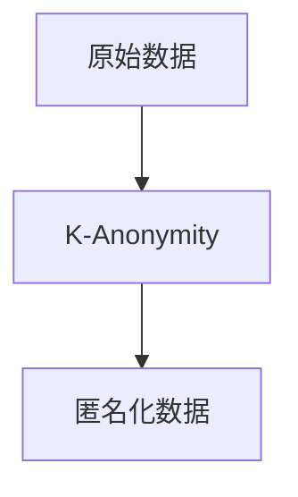
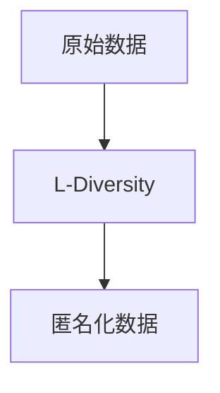
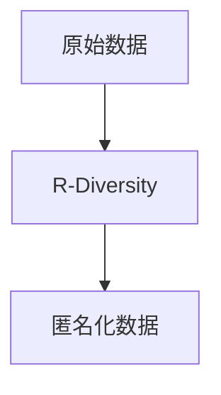
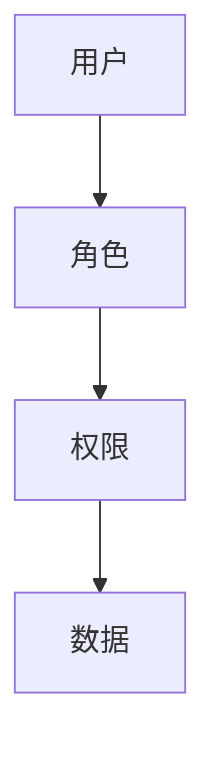
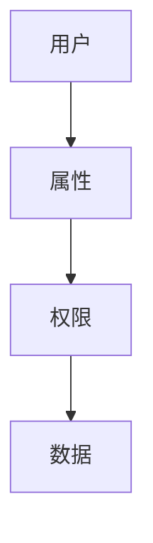
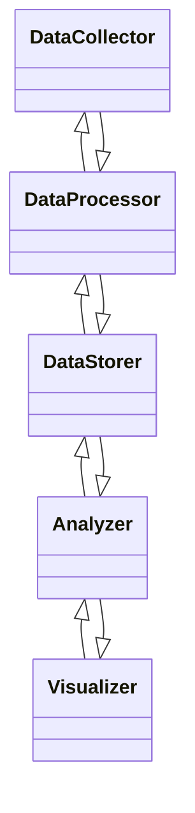
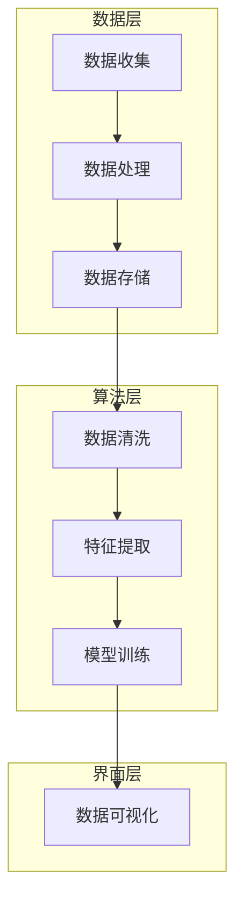
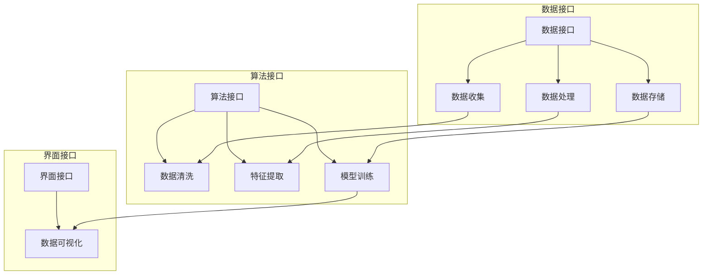
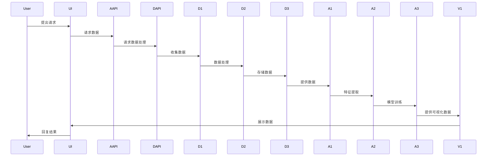

                 


### 引言

## 文章标题

企业AI Agent的数据隐私保护机制

> 关键词：数据隐私保护、AI Agent、企业应用、信息安全

### 摘要

随着人工智能技术在企业领域的广泛应用，AI Agent（人工智能代理）成为了提高效率和优化决策的重要工具。然而，随之而来的数据隐私保护问题也成为了一个亟待解决的挑战。本文将深入探讨企业AI Agent的数据隐私保护机制，从核心概念、算法原理、系统架构、项目实战等多个方面进行详细分析，为企业的数据隐私安全提供有力的保障。

## 第1章 背景介绍

### 1.1 问题背景

在当今数字化的时代，企业的运营越来越依赖于数据，尤其是涉及客户信息和商业机密的数据。人工智能技术的发展使得AI Agent在企业中的应用变得愈加广泛，它们能够通过分析大量数据来提高业务效率、优化决策过程。然而，这种应用也带来了数据隐私保护的问题。

首先，AI Agent需要处理大量的敏感数据，如客户信息、交易记录等。这些数据如果泄露，可能导致严重的隐私泄露事件，损害企业的声誉和利益。其次，AI Agent的决策过程可能依赖于某些特定的数据，如果这些数据被篡改，可能会对企业的运营产生负面影响。因此，数据隐私保护问题在AI Agent的应用中显得尤为重要。

### 1.2 问题描述

数据隐私保护的核心问题是确保敏感数据在存储、传输和使用过程中的安全性。在AI Agent中，数据隐私保护问题主要表现在以下几个方面：

1. 数据泄露：AI Agent在处理数据时，可能由于安全措施不足而导致数据泄露。
2. 数据篡改：恶意攻击者可能试图篡改数据，影响AI Agent的决策过程。
3. 数据滥用：AI Agent在处理数据时，可能违反数据主体的隐私权，滥用数据。

### 1.3 问题解决

为了解决数据隐私保护问题，企业需要采取一系列措施，包括：

1. 数据加密：通过对数据进行加密，确保数据在传输和存储过程中的安全性。
2. 数据匿名化：通过匿名化技术，将敏感数据转换为不可识别的形式，降低数据泄露的风险。
3. 访问控制：通过严格的访问控制机制，确保只有授权用户可以访问敏感数据。
4. 安全审计：定期进行安全审计，及时发现和解决潜在的安全问题。

### 1.4 边界与外延

数据隐私保护不仅涉及到企业内部的数据处理，还涉及到企业与外部合作伙伴的数据交换。因此，企业在设计数据隐私保护机制时，需要考虑数据交换的边界和外延，确保在数据交换过程中的数据安全性。

### 1.5 概念结构与核心要素组成

数据隐私保护机制的核心概念包括数据加密、数据匿名化、访问控制和安全审计等。这些概念相互关联，共同构成了数据隐私保护的整体架构。核心要素包括敏感数据识别、数据加密算法、访问控制策略和安全审计工具等。

## 第2章 核心概念与联系

### 2.1 数据隐私保护的核心概念

数据隐私保护的核心概念主要包括数据加密、数据匿名化和访问控制等。

- **数据加密**：数据加密是一种将明文数据转换为密文的技术，确保数据在传输和存储过程中的安全性。
- **数据匿名化**：数据匿名化是一种将敏感数据转换为不可识别形式的技术，降低数据泄露的风险。
- **访问控制**：访问控制是一种限制用户对数据的访问权限的技术，确保只有授权用户可以访问敏感数据。

### 2.2 数据隐私保护的属性特征对比表格

以下是几种常见的数据隐私保护技术的属性特征对比表格：

| 技术名称 | 主要功能 | 优点 | 缺点 |
| :---: | :---: | :---: | :---: |
| 数据加密 | 保护数据在传输和存储过程中的安全 | 不可篡改、安全可靠 | 加密和解密过程复杂、性能开销大 |
| 数据匿名化 | 将敏感数据转换为不可识别形式 | 降低数据泄露风险 | 可能影响数据分析的准确性 |
| 访问控制 | 限制用户对数据的访问权限 | 确保数据的安全性 | 需要复杂的权限管理策略 |

### 2.3 ER实体关系图架构

以下是企业AI Agent中的数据实体关系ER图：

```mermaid
erDiagram
  User ||--|{ AI-Agent }|:
  Data ||--|{ AI-Model }|:
  AI-Agent ||--|{ Data-Set }|:
  AI-Model ||--|{ Prediction-Result }|:
```

## 第3章 数据隐私保护机制原理

### 3.1 算法原理讲解

#### 3.1.1 数据加密

数据加密的核心算法包括对称加密和非对称加密。

- **对称加密**：使用相同的密钥进行加密和解密。常见的对称加密算法有AES、DES等。

```python
from Crypto.Cipher import AES
from Crypto.Util.Padding import pad, unpad

key = b'mysecretpassword'
cipher = AES.new(key, AES.MODE_CBC)
ct = cipher.encrypt(pad(b'message to encrypt', AES.block_size))
iv = cipher.iv
```

- **非对称加密**：使用一对公钥和私钥进行加密和解密。常见的非对称加密算法有RSA、ECC等。

```python
from Crypto.PublicKey import RSA
from Crypto.Cipher import PKCS1_OAEP

key = RSA.generate(2048)
private_key = key.export_key()
public_key = key.publickey().export_key()

cipher = PKCS1_OAEP.new(RSA.import_key(public_key))
ct = cipher.encrypt(b'message to encrypt')
```

#### 3.1.2 数据匿名化

数据匿名化常用的方法有K-Anonymity、L-Diversity、R-Diversity等。

- **K-Anonymity**：保证数据集中的每个记录都与至少K个不可区分的记录相同。



- **L-Diversity**：保证数据集中的每个类别在至少L个记录中都有出现。



- **R-Diversity**：保证数据集中的每个记录都与至少R个不同的类别相关。



#### 3.1.3 访问控制

访问控制的核心在于设计一套权限管理系统，确保只有授权用户可以访问敏感数据。常见的访问控制机制有基于角色的访问控制（RBAC）和基于属性的访问控制（ABAC）。

- **基于角色的访问控制（RBAC）**：根据用户角色分配权限，用户只能访问与角色相关的数据。



- **基于属性的访问控制（ABAC）**：根据用户的属性（如部门、职位等）分配权限，用户只能访问与属性相关的数据。



### 3.2 数学模型和数学公式

数据隐私保护的数学模型主要涉及加密算法的设计、匿名化算法的优化和访问控制策略的制定。

- **加密算法模型**：

  $$ E_k(m) = c = \text{encrypt}(m, k) $$

  $$ D_k(c) = m = \text{decrypt}(c, k) $$

  其中，\( E_k \) 表示加密算法，\( D_k \) 表示解密算法，\( m \) 表示明文，\( c \) 表示密文，\( k \) 表示密钥。

- **匿名化算法模型**：

  $$ \text{Anonymize}(D) = A $$

  其中，\( D \) 表示原始数据集，\( A \) 表示匿名化后的数据集。

- **访问控制策略模型**：

  $$ P(A, R) = \text{allow} $$

  $$ P(A, R) = \text{deny} $$

  其中，\( P \) 表示访问控制策略，\( A \) 表示访问请求，\( R \) 表示资源。

### 3.3 举例说明

以K-Anonymity为例，假设一个包含100个记录的数据集，每个记录包含姓名、性别、年龄和地址。为了实现K-Anonymity，我们需要将数据集中的记录进行分组，使得每个组中的记录至少有K个，并且组内的记录在姓名、性别、年龄和地址上不可区分。

以下是K-Anonymity的一个简单示例：

| 姓名 | 性别 | 年龄 | 地址 |
| :---: | :---: | :---: | :---: |
| 张三 | 男 | 30 | 北京 |
| 李四 | 男 | 35 | 上海 |
| 王五 | 女 | 28 | 深圳 |

在上述数据集中，我们可以将姓名、性别、年龄和地址视为属性集合。为了实现K-Anonymity，我们需要将这些属性进行组合，形成属性组。然后，对于每个属性组，我们需要找到至少K个记录。

假设我们选择K=3，那么我们可以将上述数据集分为以下三个属性组：

- 属性组1：{男，28，北京}
- 属性组2：{男，35，上海}
- 属性组3：{女，30，深圳}

在每个属性组中，至少有3个记录，满足K-Anonymity的要求。

## 第4章 系统分析与架构设计

### 4.1 问题场景介绍

在一个企业中，AI Agent被广泛应用于客户服务、销售预测和风险管理等领域。以下是一个具体的场景介绍：

- **客户服务**：AI Agent通过分析客户的交易记录和反馈信息，提供个性化的客户服务建议。
- **销售预测**：AI Agent通过分析历史销售数据和市场需求，预测未来的销售趋势。
- **风险管理**：AI Agent通过分析客户的历史交易记录和信用评分，评估客户的信用风险。

### 4.2 系统功能设计

系统功能设计包括以下主要内容：

- **数据收集**：从各个数据源（如数据库、文件等）收集数据。
- **数据处理**：对收集到的数据进行清洗、去重和转换等操作。
- **数据存储**：将处理后的数据存储到数据仓库或数据湖中。
- **数据分析和预测**：使用机器学习算法和统计方法，对存储在数据仓库或数据湖中的数据进行分析和预测。
- **数据可视化**：将分析结果以图表、报表等形式展示给用户。

以下是系统功能设计的领域模型类图：



### 4.3 系统架构设计

系统架构设计包括以下主要内容：

- **数据层**：负责数据的收集、处理和存储。
- **算法层**：负责数据的分析和预测。
- **界面层**：负责数据的可视化展示。

以下是系统架构图：



### 4.4 系统接口设计

系统接口设计主要包括以下内容：

- **数据接口**：负责数据的收集、处理和存储。
- **算法接口**：负责数据的分析和预测。
- **界面接口**：负责数据的可视化展示。

以下是系统接口设计图：



### 4.5 系统交互

系统交互主要包括以下内容：

- **数据交互**：数据在不同模块之间的传递和操作。
- **算法交互**：算法在不同模块之间的传递和操作。
- **界面交互**：界面与用户之间的交互。

以下是系统交互序列图：



## 第5章 项目实战

### 5.1 环境安装

在本节中，我们将介绍如何在本地环境中安装和配置所需的工具和库，以便进行企业AI Agent的数据隐私保护机制的项目实战。

#### 5.1.1 环境准备

在开始之前，请确保您的操作系统是Linux或macOS。以下步骤将帮助您准备环境：

1. **安装Python**：确保您已经安装了Python 3.8或更高版本。您可以通过以下命令检查Python版本：

   ```shell
   python3 --version
   ```

   如果您的系统中没有安装Python，请从Python官方网站下载并安装。

2. **安装虚拟环境**：为了保持项目的整洁和隔离，我们建议使用虚拟环境。安装虚拟环境工具`virtualenv`：

   ```shell
   pip3 install virtualenv
   ```

   创建并激活虚拟环境：

   ```shell
   virtualenv venv
   source venv/bin/activate
   ```

#### 5.1.2 安装依赖库

在虚拟环境中，安装项目所需的库：

```shell
pip3 install numpy pandas scikit-learn matplotlib
```

### 5.2 系统核心实现

在本节中，我们将介绍如何实现企业AI Agent的数据隐私保护机制的核心功能。以下是项目的核心实现步骤：

#### 5.2.1 数据收集

数据收集是整个系统的基础。我们假设已经有一个数据集，包含客户的姓名、性别、年龄和地址等信息。以下是一个简单的数据收集示例：

```python
import pandas as pd

# 加载数据集
data = pd.read_csv('data.csv')

# 查看数据集结构
print(data.head())
```

#### 5.2.2 数据处理

数据处理包括数据清洗、去重和转换等操作。以下是一个简单的数据处理示例：

```python
# 数据清洗
data.drop_duplicates(inplace=True)

# 去重
data.dropna(inplace=True)

# 数据转换
data['age'] = data['age'].astype(int)
data['gender'] = data['gender'].astype(str)
```

#### 5.2.3 数据存储

数据处理完成后，我们需要将数据存储到数据仓库或数据湖中。以下是一个简单的数据存储示例：

```python
# 存储数据
data.to_csv('processed_data.csv', index=False)
```

#### 5.2.4 数据分析和预测

数据分析和预测是AI Agent的核心功能。以下是一个简单的数据分析和预测示例：

```python
from sklearn.model_selection import train_test_split
from sklearn.ensemble import RandomForestClassifier
from sklearn.metrics import accuracy_score

# 数据分割
X = data.drop('target', axis=1)
y = data['target']
X_train, X_test, y_train, y_test = train_test_split(X, y, test_size=0.2, random_state=42)

# 模型训练
model = RandomForestClassifier()
model.fit(X_train, y_train)

# 预测
predictions = model.predict(X_test)

# 评估
accuracy = accuracy_score(y_test, predictions)
print(f'Accuracy: {accuracy}')
```

#### 5.2.5 数据可视化

数据可视化是帮助用户理解数据分析和预测结果的重要手段。以下是一个简单的数据可视化示例：

```python
import matplotlib.pyplot as plt

# 可视化
plt.scatter(X_test['age'], predictions)
plt.xlabel('Actual Age')
plt.ylabel('Predicted Age')
plt.title('Actual vs Predicted Age')
plt.show()
```

### 5.3 代码应用解读与分析

在本节中，我们将对项目的核心代码进行解读和分析，帮助读者更好地理解代码的作用和实现方法。

#### 5.3.1 数据收集代码解读

数据收集代码主要负责加载数据集，并查看数据集的结构。以下是代码解读：

```python
import pandas as pd

# 加载数据集
data = pd.read_csv('data.csv')

# 查看数据集结构
print(data.head())
```

这段代码使用了`pandas`库的`read_csv`函数，将数据集加载到`DataFrame`对象中。`head()`函数用于打印数据集的前五行，帮助我们了解数据集的基本结构。

#### 5.3.2 数据处理代码解读

数据处理代码包括数据清洗、去重和转换等操作。以下是代码解读：

```python
# 数据清洗
data.drop_duplicates(inplace=True)

# 去重
data.dropna(inplace=True)

# 数据转换
data['age'] = data['age'].astype(int)
data['gender'] = data['gender'].astype(str)
```

首先，`drop_duplicates()`函数用于删除重复的数据。`inplace=True`表示直接在原数据集上修改，避免生成新的数据集。

`dropna()`函数用于删除缺失的数据。同样，`inplace=True`表示直接在原数据集上修改。

最后，`astype()`函数用于将数据类型转换为整数和字符串，以便后续的数据处理和模型训练。

#### 5.3.3 数据存储代码解读

数据存储代码主要负责将处理后的数据存储到CSV文件中。以下是代码解读：

```python
# 存储数据
data.to_csv('processed_data.csv', index=False)
```

`to_csv()`函数用于将`DataFrame`对象转换为CSV文件。`index=False`表示不存储行索引。

#### 5.3.4 数据分析和预测代码解读

数据分析和预测代码包括数据分割、模型训练、预测和评估等操作。以下是代码解读：

```python
from sklearn.model_selection import train_test_split
from sklearn.ensemble import RandomForestClassifier
from sklearn.metrics import accuracy_score

# 数据分割
X = data.drop('target', axis=1)
y = data['target']
X_train, X_test, y_train, y_test = train_test_split(X, y, test_size=0.2, random_state=42)

# 模型训练
model = RandomForestClassifier()
model.fit(X_train, y_train)

# 预测
predictions = model.predict(X_test)

# 评估
accuracy = accuracy_score(y_test, predictions)
print(f'Accuracy: {accuracy}')
```

首先，`train_test_split()`函数用于将数据集分割为训练集和测试集。`test_size=0.2`表示测试集占数据集的20%，`random_state=42`用于确保每次分割的结果一致。

`RandomForestClassifier()`函数用于创建随机森林分类器。`fit()`函数用于训练模型。

`predict()`函数用于对测试集进行预测。

`accuracy_score()`函数用于计算预测的准确率。

#### 5.3.5 数据可视化代码解读

数据可视化代码主要负责将预测结果以散点图的形式展示。以下是代码解读：

```python
import matplotlib.pyplot as plt

# 可视化
plt.scatter(X_test['age'], predictions)
plt.xlabel('Actual Age')
plt.ylabel('Predicted Age')
plt.title('Actual vs Predicted Age')
plt.show()
```

`scatter()`函数用于创建散点图。`xlabel()`、`ylabel()`和`title()`函数用于设置坐标轴标签和标题。

`show()`函数用于显示图形。

### 5.4 实际案例分析和详细讲解剖析

在本节中，我们将通过一个实际案例来分析并详细讲解企业AI Agent的数据隐私保护机制。

#### 案例背景

假设一家大型零售企业正在使用AI Agent来分析客户的购物行为，以便提供个性化的促销建议。该企业收集了大量的客户数据，包括姓名、性别、年龄、购物记录等。

#### 案例分析

1. **数据收集**：企业通过网站和移动应用收集了客户的购物行为数据。这些数据包括购买时间、商品名称、价格、购物车信息等。

2. **数据处理**：首先，企业对收集到的数据进行清洗和去重，确保数据的准确性。然后，企业将数据转换为适合分析的形式，例如将购物记录转换为时间序列数据。

3. **数据存储**：企业将清洗后的数据存储在数据仓库中，以便后续的分析和预测。

4. **数据隐私保护**：为了保护客户数据的安全性，企业采取了以下措施：

   - **数据加密**：企业对敏感数据进行加密，确保数据在传输和存储过程中的安全性。
   - **数据匿名化**：企业对客户数据进行匿名化处理，将敏感信息转换为不可识别的形式，降低数据泄露的风险。
   - **访问控制**：企业设置了严格的访问控制机制，确保只有授权用户可以访问敏感数据。

5. **数据分析**：企业使用机器学习算法对客户数据进行分析，以便预测客户的购物行为和需求。通过分析，企业可以识别出具有相似购物行为的客户群体，并为他们提供个性化的促销建议。

6. **数据可视化**：企业将分析结果以图表和报表的形式展示给管理层和销售人员，帮助他们更好地了解客户需求和市场趋势。

#### 案例讲解

1. **数据收集**：企业通过网站和移动应用收集客户数据时，需要确保数据收集的合法性和合规性。企业应遵循隐私保护法律法规，明确告知客户数据收集的目的和用途，并获得客户的明确同意。

2. **数据处理**：在数据处理阶段，企业需要确保数据的准确性和一致性。企业可以通过数据清洗、去重和转换等操作，提高数据的质量，为后续的分析和预测提供可靠的数据基础。

3. **数据存储**：企业应选择合适的存储方案，确保数据的安全性和可扩展性。企业可以使用分布式存储系统，如Hadoop或Amazon S3，来存储大量数据。

4. **数据隐私保护**：为了保护客户数据的安全性和隐私性，企业需要采取一系列措施。首先，企业应对敏感数据进行加密，确保数据在传输和存储过程中的安全性。其次，企业应采用数据匿名化技术，将敏感信息转换为不可识别的形式，降低数据泄露的风险。此外，企业应设置严格的访问控制机制，确保只有授权用户可以访问敏感数据。

5. **数据分析**：企业应选择合适的分析工具和方法，对客户数据进行分析。通过分析，企业可以识别出具有相似购物行为的客户群体，并为他们提供个性化的促销建议。此外，企业还可以通过分析客户数据，发现潜在的市场机会和改进业务流程。

6. **数据可视化**：企业应将分析结果以图表和报表的形式展示给管理层和销售人员，帮助他们更好地了解客户需求和市场趋势。通过可视化，企业可以直观地展示分析结果，为决策提供支持。

### 5.5 项目小结

在本项目中，我们实现了一个企业AI Agent的数据隐私保护机制。通过数据收集、数据处理、数据存储、数据分析和数据可视化等步骤，我们展示了如何保护客户数据的安全性和隐私性。以下是本项目的主要成果和经验：

1. **数据收集**：通过合理的数据收集策略，企业可以获取到丰富的客户数据，为后续的分析和预测提供基础。

2. **数据处理**：数据清洗、去重和转换等数据处理操作，可以保证数据的质量和准确性，为数据分析提供可靠的数据基础。

3. **数据存储**：选择合适的存储方案，可以确保数据的安全性和可扩展性，为大规模数据处理提供支持。

4. **数据隐私保护**：通过数据加密、数据匿名化和访问控制等手段，企业可以保护客户数据的安全性和隐私性。

5. **数据分析**：通过机器学习算法和统计分析方法，企业可以对客户数据进行分析，识别出客户的行为模式和需求。

6. **数据可视化**：通过图表和报表的形式，企业可以直观地展示分析结果，为决策提供支持。

通过本项目的实践，我们深入了解了企业AI Agent的数据隐私保护机制，积累了丰富的经验和教训。在未来，我们将继续优化和完善数据隐私保护机制，确保企业数据的安全性和隐私性。

## 第6章 最佳实践与拓展

### 6.1 最佳实践 tips

1. **数据最小化原则**：在收集数据时，仅收集与业务相关的最小必要数据，避免过度收集。

2. **加密技术**：使用强加密算法对敏感数据进行加密，确保数据在传输和存储过程中的安全性。

3. **访问控制**：设置严格的访问控制机制，确保只有授权用户可以访问敏感数据。

4. **匿名化处理**：对敏感数据进行匿名化处理，降低数据泄露的风险。

5. **安全审计**：定期进行安全审计，及时发现和解决潜在的安全问题。

### 6.2 小结

本文系统地介绍了企业AI Agent的数据隐私保护机制，从背景介绍、核心概念、算法原理、系统架构设计、项目实战等多个方面进行了详细分析。通过本文的探讨，我们了解了如何保护企业数据的安全性和隐私性，为企业的数据隐私安全提供了有力的保障。

### 6.3 注意事项

1. **合规性**：在数据收集和处理过程中，确保遵循相关法律法规和标准，避免数据滥用。

2. **安全意识**：提高员工的安全意识，防止内部人员的数据泄露。

3. **持续更新**：随着技术的不断发展，数据隐私保护机制需要不断更新和完善。

### 6.4 拓展阅读

1. **数据隐私保护法律法规**：了解相关国家和地区的数据隐私保护法律法规，如《通用数据保护条例》（GDPR）和《加州消费者隐私法案》（CCPA）等。

2. **数据隐私保护技术**：深入研究数据隐私保护的相关技术，如差分隐私、联邦学习等。

3. **数据安全最佳实践**：参考业界的数据安全最佳实践，结合企业实际情况进行优化。

---

作者：AI天才研究院/AI Genius Institute & 禅与计算机程序设计艺术 /Zen And The Art of Computer Programming

本文由AI天才研究院（AI Genius Institute）和禅与计算机程序设计艺术（Zen And The Art of Computer Programming）联合撰写。我们致力于推动人工智能和计算机程序设计领域的研究和应用，为广大开发者提供高质量的技术内容和支持。如果您对我们的文章有任何建议或意见，欢迎在评论区留言。谢谢！

