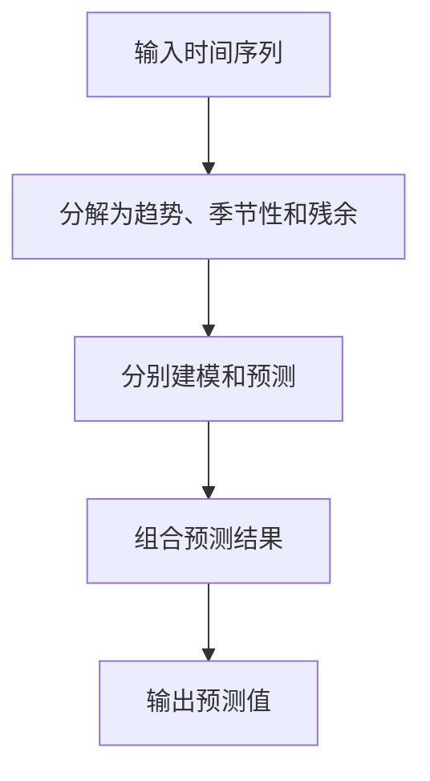
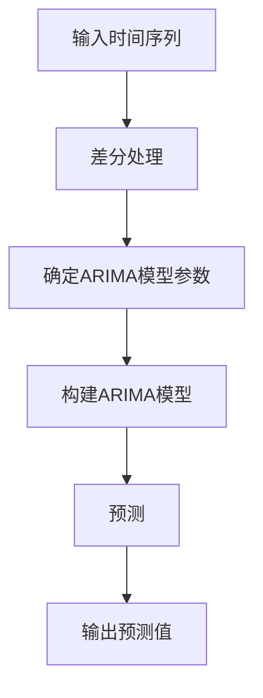
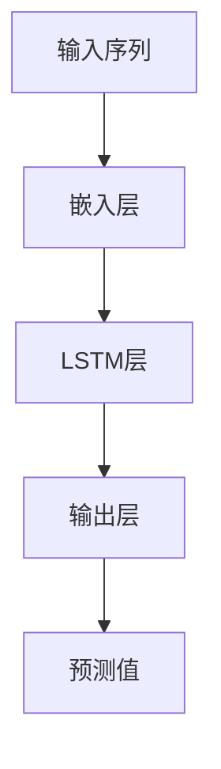
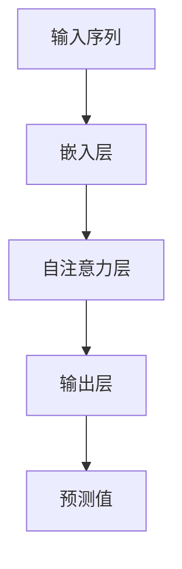
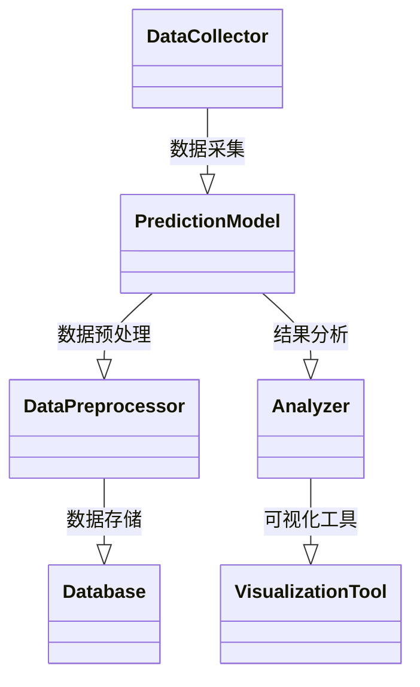
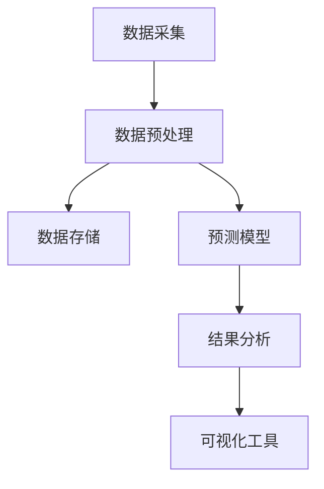
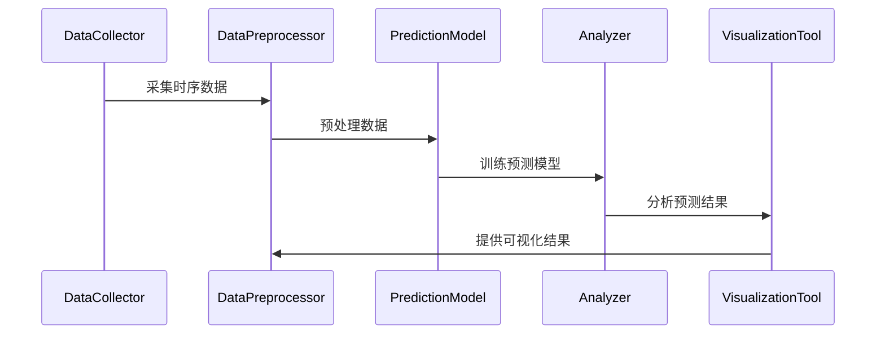

                 


### 摘要

本文旨在深入探讨企业AI Agent的时序数据预测平台设计，涵盖从背景介绍到核心算法讲解，再到系统分析与架构设计，以及实战案例和最佳实践的全过程。首先，我们将阐述时序数据、AI Agent和预测平台的基本概念，探讨它们在企业应用中的重要性。接着，我们将详细解释时序数据处理算法，包括原理、数学模型和实际应用。随后，文章将介绍预测平台的设计原则、关键技术，并展示其实际应用场景。通过实际项目案例，我们将展示如何实现和优化AI Agent的时序数据预测平台，并提供最佳实践和注意事项。最后，文章将总结关键知识点，提出未来发展方向和拓展阅读资源，帮助读者全面理解和掌握企业AI Agent时序数据预测平台的设计与实现。

### 目录大纲设计思路

在设计《企业AI Agent的时序数据预测平台设计》的目录大纲时，我们需要遵循以下步骤：

1. **理解书籍主题**：首先，我们需要深刻理解书籍的核心内容，即企业AI Agent的时序数据预测平台。这包括了解时序数据、AI Agent以及预测平台的设计和实现。

2. **确定核心章节**：根据书籍的内容，确定必须包含的核心章节。这些章节通常包括背景介绍、核心概念、算法原理、数学模型、系统设计与实现、项目实战和最佳实践等。

3. **设计章节结构**：为每个章节制定一个详细的目录，确保内容连贯且逻辑清晰。每个章节应该包括几个子章节，这些子章节应该涵盖相关的知识点。

4. **保持简洁性**：在编写目录大纲时，要避免冗余内容，确保每个章节的内容都紧密围绕主题，直接且实用。

5. **确保完整性**：确保目录大纲包含所有必要的知识点，并且章节之间有良好的过渡。

### 设计具体步骤

1. **背景介绍（第1章）**：介绍时序数据、AI Agent和预测平台的基本概念，包括其重要性、应用场景和发展趋势。

2. **核心概念与联系（第2章）**：详细解释时序数据、AI Agent和预测平台的核心概念，并通过对比表格和ER实体关系图展示它们之间的联系。

3. **算法原理讲解（第3章）**：使用mermaid绘制算法流程图，然后通过Python源代码详细阐述算法原理，包括数学模型和公式，以及举例说明。

4. **数学模型和数学公式（第4章）**：介绍时序数据预测的数学模型，使用latex格式书写公式，并进行详细讲解和举例。

5. **系统分析与架构设计（第5章）**：介绍预测平台的设计，包括领域模型类图、系统架构图、接口设计和系统交互序列图。

6. **项目实战（第6章）**：提供实际项目案例，包括环境安装、系统核心实现源代码，并对代码应用进行解读与分析。

7. **最佳实践与总结（第7章）**：总结书中的关键知识点，提供最佳实践建议，注意事项，以及拓展阅读资源。

### 目录大纲

```markdown
## 第1章：背景介绍

## 1.1 问题背景

### 1.1.1 时序数据的重要性

### 1.1.2 AI Agent的概念

### 1.1.3 预测平台的设计需求

## 1.2 核心概念与联系

### 1.2.1 时序数据

#### 1.2.1.1 时序数据的定义

#### 1.2.1.2 时序数据的属性特征对比表

#### 1.2.1.3 时序数据的处理方法

### 1.2.2 AI Agent

#### 1.2.2.1 AI Agent的定义

#### 1.2.2.2 AI Agent的工作原理

#### 1.2.2.3 AI Agent的分类

### 1.2.3 预测平台

#### 1.2.3.1 预测平台的概念

#### 1.2.3.2 预测平台的设计原则

#### 1.2.3.3 预测平台的关键技术

## 1.3 发展趋势与挑战

### 1.3.1 时序数据预测的发展趋势

### 1.3.2 AI Agent的未来发展

### 1.3.3 预测平台的挑战与机遇

## 1.4 本章小结

## 第2章：核心概念与联系

## 2.1 时序数据

### 2.1.1 时序数据的定义

### 2.1.2 时序数据的属性特征对比表

### 2.1.3 时序数据的处理方法

## 2.2 AI Agent

### 2.2.1 AI Agent的定义

### 2.2.2 AI Agent的工作原理

### 2.2.3 AI Agent的分类

## 2.3 预测平台

### 2.3.1 预测平台的基本架构

### 2.3.2 预测平台的关键组件

### 2.3.3 预测平台的性能优化

## 2.4 核心概念联系图

### 2.4.1 时序数据与AI Agent的联系

### 2.4.2 时序数据与预测平台的联系

## 2.5 本章小结

## 第3章：算法原理讲解

## 3.1 时序数据预测算法概述

### 3.1.1 常见的时序数据预测算法

### 3.1.2 预测算法的选择标准

## 3.2 算法流程图

### 3.2.1 算法流程图示例

## 3.3 算法原理详解

### 3.3.1 数学模型介绍

#### 3.3.1.1 数学模型概述

#### 3.3.1.2 数学公式解析

### 3.3.2 算法原理解析

### 3.3.3 实例分析

## 3.4 算法实现与代码解析

### 3.4.1 Python代码实现

### 3.4.2 代码解析

## 3.5 本章小结

## 第4章：数学模型和数学公式

## 4.1 时序数据预测的数学模型

### 4.1.1 时间序列分析基础

### 4.1.2 动态时间序列模型

### 4.1.3 静态时间序列模型

## 4.2 数学公式讲解

### 4.2.1 概率论公式

#### 4.2.1.1 条件概率公式

#### 4.2.1.2 贝叶斯公式

### 4.2.2 统计学公式

#### 4.2.2.1 均值与方差

#### 4.2.2.2 卡方分布

## 4.3 数学公式应用实例

### 4.3.1 实例1：线性回归

### 4.3.2 实例2：时间序列分解

## 4.4 本章小结

## 第5章：系统分析与架构设计

## 5.1 预测平台设计原则

### 5.1.1 可扩展性

### 5.1.2 高效性

### 5.1.3 可靠性

## 5.2 预测平台架构设计

### 5.2.1 领域模型类图

### 5.2.2 系统架构图

### 5.2.3 接口设计

### 5.2.4 系统交互序列图

## 5.3 系统功能设计与实现

### 5.3.1 数据采集模块

### 5.3.2 数据预处理模块

### 5.3.3 预测模块

### 5.3.4 结果分析模块

## 5.4 系统性能优化

### 5.4.1 系统性能指标

### 5.4.2 性能优化策略

### 5.4.3 实际性能测试与调优

## 5.5 本章小结

## 第6章：项目实战

## 6.1 项目背景

### 6.1.1 项目简介

### 6.1.2 项目目标

### 6.1.3 项目挑战

## 6.2 环境安装

### 6.2.1 环境准备

### 6.2.2 工具安装

### 6.2.3 数据库配置

## 6.3 系统核心实现

### 6.3.1 数据采集与处理

### 6.3.2 预测模型训练

### 6.3.3 预测结果分析

## 6.4 代码应用解读与分析

### 6.4.1 关键代码解析

### 6.4.2 应用效果分析

### 6.4.3 实际案例分析

## 6.5 项目小结

## 第7章：最佳实践与总结

## 7.1 最佳实践

### 7.1.1 预测平台设计最佳实践

### 7.1.2 算法应用最佳实践

### 7.1.3 系统优化最佳实践

## 7.2 小结

### 7.2.1 核心知识点回顾

### 7.2.2 不足与改进

### 7.2.3 未来研究方向

## 7.3 注意事项

### 7.3.1 系统设计注意事项

### 7.3.2 算法应用注意事项

### 7.3.3 实际应用注意事项

## 7.4 拓展阅读

### 7.4.1 推荐书籍

### 7.4.2 学术论文

### 7.4.3 实际项目案例

## 7.5 本章小结

作者：AI天才研究院/AI Genius Institute & 禅与计算机程序设计艺术 /Zen And The Art of Computer Programming
```

### 第1章：背景介绍

## 1.1 问题背景

### 1.1.1 时序数据的重要性

时序数据是指以时间为维度组织的数据，这种数据在金融、气象、交通、工业等多个领域都有着广泛的应用。随着物联网、大数据和人工智能的快速发展，时序数据的重要性日益凸显。企业通过时序数据分析，可以预测未来趋势、优化资源分配、提高决策效率。例如，在金融领域，通过对历史股价数据的分析，可以预测未来市场的走向，从而指导投资决策；在气象领域，通过对天气数据的分析，可以预测未来几天的天气情况，为防灾减灾提供科学依据。

### 1.1.2 AI Agent的概念

AI Agent，即人工智能代理，是一种能够自主执行任务、与环境进行交互的智能体。AI Agent在时序数据预测中的应用具有重要意义。它们可以自动收集、处理和分析时序数据，发现数据中的规律和模式，为企业提供决策支持。例如，在供应链管理中，AI Agent可以预测未来几个月的库存需求，帮助企业在原材料采购和产品生产中做出更加精确的决策。

### 1.1.3 预测平台的设计需求

随着时序数据量的不断增大，对预测平台的性能、稳定性和可扩展性提出了更高的要求。设计一个高效的预测平台，需要考虑以下几个方面：

1. **数据采集与处理**：平台需要能够高效地采集和处理各种来源的时序数据，包括结构化和非结构化数据。

2. **算法选择与优化**：根据具体应用场景，选择合适的预测算法，并对其进行优化，以提高预测精度和效率。

3. **系统架构设计**：平台需要具有良好的架构设计，以支持高并发、高可用性和高扩展性。

4. **用户交互**：平台需要提供友好的用户界面，以便用户可以方便地查看预测结果、调整参数和进行二次分析。

5. **安全性**：平台需要确保数据安全和隐私保护，防止数据泄露和滥用。

## 1.2 核心概念与联系

### 1.2.1 时序数据

#### 1.2.1.1 时序数据的定义

时序数据是一种以时间为维度组织的数据。它通常包括时间戳、数据值以及其他相关的元数据。例如，股票市场的时序数据可能包括时间戳、股票价格、交易量等。

#### 1.2.1.2 时序数据的属性特征对比表

| 特征       | 说明                                                         |
| ---------- | ------------------------------------------------------------ |
| 时序性     | 数据以时间为维度组织，每个数据点都有一个明确的时间戳。         |
| 多样性     | 时序数据可以包含各种类型的属性，如数值、类别、文本等。         |
| 历史依赖性 | 当前的数据值依赖于过去的数据，即数据的未来趋势可以通过历史数据进行预测。 |

#### 1.2.1.3 时序数据的处理方法

时序数据的处理方法主要包括以下几种：

1. **数据清洗**：去除异常值、缺失值和重复数据。
2. **数据归一化**：将不同尺度的数据进行归一化处理，使其在相同的尺度范围内。
3. **特征工程**：提取与预测任务相关的特征，如时间窗口特征、季节性特征等。
4. **模型训练**：选择合适的预测模型，对时序数据进行训练，以预测未来的数据值。

### 1.2.2 AI Agent

#### 1.2.2.1 AI Agent的定义

AI Agent是指一种基于人工智能技术，能够自主执行任务、与环境进行交互的智能体。它通常具有以下特征：

- **自主性**：AI Agent能够独立完成指定任务，不需要人工干预。
- **适应性**：AI Agent能够根据环境的变化调整其行为策略。
- **智能性**：AI Agent能够通过学习从数据中获取知识和规律，提高任务执行效率。

#### 1.2.2.2 AI Agent的工作原理

AI Agent的工作原理主要包括以下几个步骤：

1. **感知**：AI Agent通过传感器收集环境信息。
2. **决策**：基于收集到的信息和预设的目标，AI Agent选择合适的行动策略。
3. **执行**：AI Agent执行选定的行动策略。
4. **反馈**：AI Agent对执行结果进行评估，并根据评估结果调整未来的决策。

#### 1.2.2.3 AI Agent的分类

AI Agent可以按照不同的分类标准进行分类，常见的分类方法包括：

- **按任务类型分类**：如预测代理、决策代理、执行代理等。
- **按技术类型分类**：如基于规则的系统、基于模型的系统、混合系统等。

### 1.2.3 预测平台

#### 1.2.3.1 预测平台的概念

预测平台是一种用于时序数据预测的软件系统，它集成了数据采集、数据处理、算法选择、模型训练和结果分析等功能。预测平台的主要目的是提供高效、准确的时序数据预测服务，帮助企业做出更加科学的决策。

#### 1.2.3.2 预测平台的设计原则

预测平台的设计原则主要包括以下几个方面：

1. **模块化**：预测平台应采用模块化设计，便于系统的扩展和维护。
2. **高效性**：预测平台应能够高效地处理大规模时序数据，提供快速的预测结果。
3. **准确性**：预测平台应选择合适的算法和模型，确保预测结果的准确性。
4. **可扩展性**：预测平台应支持数据规模和用户数量的扩展，以适应不断增长的业务需求。
5. **用户友好**：预测平台应提供友好的用户界面，方便用户进行数据操作和结果分析。

#### 1.2.3.3 预测平台的关键技术

预测平台的关键技术主要包括：

1. **数据采集与存储**：采用高效的数据采集和存储技术，确保数据的安全和可靠性。
2. **数据处理与清洗**：采用先进的数据处理和清洗技术，确保数据的准确性和一致性。
3. **算法选择与优化**：根据不同的预测任务，选择合适的算法和模型，并进行优化，以提高预测精度。
4. **模型训练与评估**：采用机器学习算法，对时序数据进行训练，并对预测模型进行评估和调整，以提高预测性能。
5. **结果分析与可视化**：提供丰富的结果分析工具和可视化界面，帮助用户更好地理解和利用预测结果。

### 1.3 发展趋势与挑战

#### 1.3.1 时序数据预测的发展趋势

随着人工智能技术的不断进步，时序数据预测的应用场景和需求日益扩大。未来，时序数据预测的发展趋势将包括：

1. **算法多样化**：随着算法的不断优化和新型算法的涌现，时序数据预测将更加精准和高效。
2. **数据多样性**：随着物联网和大数据技术的应用，时序数据的来源将更加多样，包括传感器数据、社交媒体数据、物流数据等。
3. **实时预测**：实时预测技术将不断成熟，预测平台将能够实时响应业务需求，提供快速、准确的预测结果。

#### 1.3.2 AI Agent的未来发展

AI Agent作为一种智能体，其未来发展的趋势将包括：

1. **自主性提升**：随着人工智能技术的进步，AI Agent将能够更加自主地完成复杂任务，减少人工干预。
2. **协作性增强**：AI Agent将能够与其他智能体协作，形成智能群体，共同完成复杂任务。
3. **情境适应性**：AI Agent将能够根据不同的情境和环境，调整其行为策略，提高任务执行效率。

#### 1.3.3 预测平台的挑战与机遇

随着时序数据预测技术的发展，预测平台面临着以下挑战和机遇：

1. **数据质量和多样性**：如何处理质量参差不齐、多样性极高的时序数据，成为预测平台的一大挑战。
2. **算法优化与模型选择**：如何选择合适的算法和模型，优化预测性能，是预测平台需要面对的挑战。
3. **实时预测能力**：如何在保证预测准确性的同时，提高实时预测能力，是预测平台需要解决的关键问题。

然而，随着技术的不断进步，预测平台也面临着巨大的机遇：

1. **商业应用扩展**：时序数据预测技术在金融、物流、医疗等领域的应用将不断扩展，为企业带来巨大的商业价值。
2. **技术创新**：随着新算法、新技术的不断涌现，预测平台将能够提供更加精准、高效的预测服务。

### 1.4 本章小结

本章对时序数据、AI Agent和预测平台的基本概念进行了详细介绍，分析了它们在企业和行业中的应用背景和重要性。同时，本章还探讨了预测平台的设计需求和发展趋势，为后续章节的详细讨论奠定了基础。通过本章的学习，读者可以全面了解企业AI Agent的时序数据预测平台，为后续的学习和实践做好准备。

### 第2章：核心概念与联系

在深入探讨企业AI Agent的时序数据预测平台设计之前，我们需要首先明确几个核心概念，并理解它们之间的相互联系。本章将详细解释时序数据、AI Agent和预测平台的基本概念，并通过对比表格和ER实体关系图来展示它们之间的关系。

## 2.1 时序数据

时序数据是一种以时间维度组织的数据，它记录了某一事件或过程随时间变化的信息。时序数据在金融、气象、交通、工业等领域有广泛的应用。理解时序数据的基本概念和特征是构建预测平台的基础。

### 2.1.1 时序数据的定义

时序数据（Temporal Data）是指数据元素被组织成一系列按照时间顺序排列的记录。每个数据点通常包含一个时间戳和一个或多个与时间相关的数据值。例如，股票市场的时序数据可能包括日期、开盘价、收盘价、最高价和最低价。

### 2.1.2 时序数据的属性特征对比表

| 特征       | 说明                                                         | 
| ---------- | ------------------------------------------------------------ |
| 时间戳     | 标识数据点的时间位置，是时序数据的核心组成部分。               |
| 数据值     | 与时间戳关联的具体数据，可以是数值、类别或文本。               |
| 连续性     | 时序数据通常是连续的，尽管可能存在缺失值或异常值。             |
| 稳定性     | 时序数据可能在短期内稳定，但在长期内可能表现出趋势或季节性波动。 |

### 2.1.3 时序数据的处理方法

时序数据的处理方法主要包括数据采集、预处理、特征提取、模型训练和预测等步骤：

1. **数据采集**：从各种数据源收集时序数据，包括传感器数据、数据库和历史记录。
2. **数据预处理**：清洗数据，填充缺失值，去除异常值，进行归一化处理。
3. **特征提取**：提取与预测目标相关的特征，如趋势、季节性、周期性等。
4. **模型训练**：选择合适的模型对时序数据进行训练，以预测未来的数据值。
5. **预测**：使用训练好的模型对新的数据进行预测，以提供实时决策支持。

## 2.2 AI Agent

AI Agent是指一种能够执行特定任务、与环境交互并做出自主决策的智能体。AI Agent在时序数据预测中的应用，可以极大地提高预测的效率和准确性。

### 2.2.1 AI Agent的定义

AI Agent（Artificial Intelligence Agent）是指一种基于人工智能技术，能够自主感知环境、做出决策并执行动作的计算机程序或实体。AI Agent通常具有自主性、适应性、灵活性和适应性。

### 2.2.2 AI Agent的工作原理

AI Agent的工作原理通常包括以下步骤：

1. **感知**：AI Agent通过传感器或接口从环境中获取信息。
2. **推理**：AI Agent使用内置的算法和模型对获取的信息进行分析和处理。
3. **决策**：根据分析结果，AI Agent选择最合适的行动方案。
4. **执行**：AI Agent执行选定的动作，并对执行结果进行反馈和调整。

### 2.2.3 AI Agent的分类

AI Agent可以根据不同的标准进行分类，例如：

- **按任务类型**：预测代理、决策代理、执行代理等。
- **按技术类型**：基于规则的AI Agent、基于模型的AI Agent、混合AI Agent等。

## 2.3 预测平台

预测平台是一种软件系统，用于处理、分析和预测时序数据。它集成了数据采集、数据预处理、模型训练、预测和分析等功能，是企业进行时序数据分析的重要工具。

### 2.3.1 预测平台的概念

预测平台（Prediction Platform）是一种用于构建、部署和管理预测模型的软件平台。它为用户提供了从数据采集、预处理到模型训练和预测的完整流程。

### 2.3.2 预测平台的设计原则

预测平台的设计原则包括：

1. **模块化**：平台应采用模块化设计，便于扩展和维护。
2. **高效性**：平台应具备高效的数据处理和预测能力，满足大规模数据处理的需求。
3. **准确性**：平台应选择合适的算法和模型，确保预测结果的准确性。
4. **用户友好**：平台应提供友好的用户界面和易于使用的工具，降低用户使用门槛。

### 2.3.3 预测平台的关键技术

预测平台的关键技术包括：

1. **数据采集与存储**：高效的数据采集和存储技术，支持多种数据源和格式。
2. **数据处理与清洗**：先进的数据处理和清洗技术，确保数据质量和一致性。
3. **算法选择与优化**：多种算法和模型选择，支持自定义和优化。
4. **模型训练与评估**：高效的模型训练和评估技术，支持快速迭代和优化。
5. **结果分析与可视化**：丰富的结果分析工具和可视化界面，帮助用户理解和利用预测结果。

### 2.4 核心概念联系图

为了更好地理解时序数据、AI Agent和预测平台之间的关系，我们可以使用ER实体关系图（Entity-Relationship Diagram）来表示它们之间的联系。

```mermaid
erDiagram
  时序数据 ||--|{ AI Agent } : 被感知和预测
  AI Agent ||--|{ 预测平台 } : 实现预测功能
  预测平台 ||--|{ 数据采集与存储 } : 存储和管理数据
  预测平台 ||--|{ 数据处理与清洗 } : 清洗和预处理数据
  预测平台 ||--|{ 算法选择与优化 } : 选择和优化预测算法
  预测平台 ||--|{ 模型训练与评估 } : 训练和评估预测模型
  预测平台 ||--|{ 结果分析与可视化 } : 分析和展示预测结果
```

通过上述ER实体关系图，我们可以清晰地看到时序数据、AI Agent和预测平台之间的交互关系。时序数据被AI Agent感知，AI Agent在预测平台的协助下进行预测，预测平台负责数据存储、处理、算法选择、模型训练和结果分析。

### 2.5 本章小结

本章详细介绍了时序数据、AI Agent和预测平台的基本概念，并通过对比表格和ER实体关系图展示了它们之间的联系。理解这些核心概念对于构建和优化企业AI Agent的时序数据预测平台至关重要。在后续章节中，我们将进一步探讨时序数据预测算法、数学模型和系统架构设计，为构建高效的预测平台提供理论支持和实践指导。

### 第3章：算法原理讲解

在构建企业AI Agent的时序数据预测平台时，选择合适的算法是实现精准预测的关键。本章将介绍几种常见的时序数据预测算法，并详细讲解其原理、流程图、数学模型和应用实例。

## 3.1 时序数据预测算法概述

时序数据预测算法主要分为以下几类：

1. **时间序列分解法**：如STL（Seasonal and Trend Decomposition using LOESS）和STSA（Seasonal and Trend Seasonal Adjustment）。
2. **自回归模型**：如ARIMA（AutoRegressive Integrated Moving Average）。
3. **机器学习方法**：如LSTM（Long Short-Term Memory）、GRU（Gated Recurrent Unit）和变换模型如PCNN（Physical Connection Neural Network）。
4. **深度学习方法**：如CNN（Convolutional Neural Network）和Transformer。

### 3.1.1 常见的时序数据预测算法

#### 时间序列分解法

时间序列分解法将时间序列数据分解为趋势、季节性和残余部分，分别进行建模和预测。这种方法适用于具有明显季节性和趋势性的时间序列数据。

- **STL**：STL模型通过LOESS（局部加权回归）对趋势和季节性部分进行平滑，然后对残余部分进行建模。其公式如下：

  $$y_t = \hat{t}_t + \hat{s}_t + \hat{r}_t$$

  其中，$y_t$ 是原始时间序列，$\hat{t}_t$ 是趋势部分，$\hat{s}_t$ 是季节性部分，$\hat{r}_t$ 是残余部分。

- **STSA**：STSA模型通过自回归移动平均模型（ARMA）对季节性和残余部分进行建模。其公式如下：

  $$y_t = \phi_1 y_{t-1} + \phi_2 y_{t-2} + ... + \phi_p y_{t-p} + \theta_1 e_{t-1} + \theta_2 e_{t-2} + ... + \theta_q e_{t-q}$$

  其中，$y_t$ 是原始时间序列，$\phi_i$ 和 $\theta_i$ 分别是自回归和移动平均参数，$e_t$ 是误差项。

#### 自回归模型

自回归模型假设当前值与过去值之间存在关系，通过历史数据来预测未来值。ARIMA模型是自回归模型的一种，它结合了自回归（AR）、差分（I）和移动平均（MA）三个部分。

- **ARIMA**：ARIMA模型的公式如下：

  $$\Delta y_t = \phi_1 \Delta y_{t-1} + \phi_2 \Delta y_{t-2} + ... + \phi_p \Delta y_{t-p} + \theta_1 e_{t-1} + \theta_2 e_{t-2} + ... + \theta_q e_{t-q}$$

  其中，$\Delta y_t = y_t - y_{t-1}$ 是差分操作，$\phi_i$ 和 $\theta_i$ 分别是自回归和移动平均参数。

#### 机器学习方法

机器学习方法通过学习历史数据中的模式来预测未来值，其中LSTM和GRU是两种常用的循环神经网络（RNN）。

- **LSTM**：LSTM通过引入门控机制来学习长期依赖关系，其公式如下：

  $$i_t = \sigma(W_{ix} x_t + W_{ih} h_{t-1} + b_i)$$
  $$f_t = \sigma(W_{fx} x_t + W_{fh} h_{t-1} + b_f)$$
  $$o_t = \sigma(W_{ox} x_t + W_{oh} h_{t-1} + b_o)$$
  $$c_t = f_t \odot c_{t-1} + i_t \odot \sigma(W_{cx} x_t + W_{ch} h_{t-1} + b_c)$$
  $$h_t = o_t \odot c_t$$

  其中，$i_t$、$f_t$、$o_t$ 分别是输入门、遗忘门和输出门，$c_t$ 是细胞状态，$h_t$ 是隐藏状态。

- **GRU**：GRU通过更新门和重置门来简化LSTM，其公式如下：

  $$z_t = \sigma(W_{z} x_t + U_{z} h_{t-1} + b_z)$$
  $$r_t = \sigma(W_{r} x_t + U_{r} h_{t-1} + b_r)$$
  $$h_t = (1 - z_t) \odot h_{t-1} + z_t \odot \sigma(W_{h} x_t + U_{h} (r_t \odot h_{t-1}) + b_h)$$

#### 深度学习方法

深度学习方法通过多层神经网络学习复杂的特征和模式，例如CNN和Transformer。

- **CNN**：CNN通过卷积层提取时间序列中的特征，其公式如下：

  $$h_{ij} = \sum_{k} w_{ijk} x_k + b_j$$

  其中，$h_{ij}$ 是输出特征，$w_{ijk}$ 是卷积核，$x_k$ 是输入特征，$b_j$ 是偏置。

- **Transformer**：Transformer通过自注意力机制（Self-Attention）来学习序列中的依赖关系，其公式如下：

  $$\text{Attention}(Q, K, V) = \text{softmax}\left(\frac{QK^T}{\sqrt{d_k}}\right)V$$

  其中，$Q$、$K$ 和 $V$ 分别是查询向量、键向量和值向量，$d_k$ 是键向量的维度。

### 3.1.2 预测算法的选择标准

选择合适的预测算法需要考虑以下几个方面：

1. **数据特性**：算法应能够适应数据的特点，如季节性、趋势性和噪声水平。
2. **预测精度**：算法应具有较高的预测精度，以减少预测误差。
3. **计算资源**：算法应能够在有限的计算资源下运行，尤其是处理大规模数据时。
4. **可解释性**：算法应具有较好的可解释性，以便用户理解和信任预测结果。
5. **实时性**：算法应能够实现快速预测，以满足实时决策的需求。

### 3.2 算法流程图

为了更好地理解上述算法的工作流程，我们可以使用mermaid绘制算法流程图。

#### STL算法流程图



#### ARIMA算法流程图



#### LSTM算法流程图



#### Transformer算法流程图



### 3.3 算法原理详解

在本节中，我们将详细讲解ARIMA算法的原理，包括数学模型和Python代码实现。

#### 3.3.1 数学模型介绍

ARIMA模型是一种自回归积分滑动平均模型，由三个部分组成：自回归部分（AR）、差分部分（I）和移动平均部分（MA）。其公式如下：

$$\Delta y_t = \phi_1 \Delta y_{t-1} + \phi_2 \Delta y_{t-2} + ... + \phi_p \Delta y_{t-p} + \theta_1 e_{t-1} + \theta_2 e_{t-2} + ... + \theta_q e_{t-q}$$

其中，$\Delta y_t = y_t - y_{t-1}$ 是差分操作，$\phi_i$ 和 $\theta_i$ 分别是自回归和移动平均参数，$e_t$ 是误差项。

#### 3.3.2 数学公式解析

- **自回归项**：自回归项表示当前值与过去值之间的关系，其系数$\phi_i$ 控制这种关系的影响程度。
- **差分项**：差分操作将非平稳时间序列转换为平稳序列，使得模型更加稳定。
- **移动平均项**：移动平均项表示当前值与过去误差之间的关系，其系数$\theta_i$ 控制这种关系的影响程度。

#### 3.3.3 算法原理解析

ARIMA算法的工作流程如下：

1. **差分处理**：对原始时间序列进行差分，使其变为平稳序列。
2. **参数估计**：使用最大似然估计法或最小二乘法估计模型参数。
3. **模型构建**：根据估计的参数构建ARIMA模型。
4. **预测**：使用构建好的模型对未来的数据进行预测。
5. **结果评估**：评估预测结果的准确性和稳定性，根据评估结果调整模型参数。

#### 3.3.4 实例分析

假设我们有以下时间序列数据：

| 时间戳 | 值 |
|--------|----|
| 1      | 10 |
| 2      | 12 |
| 3      | 15 |
| 4      | 18 |
| 5      | 20 |

首先，我们对数据进行差分处理：

| 时间戳 | 值 | 差分 |
|--------|----|------|
| 1      | 10 |      |
| 2      | 12 |  2   |
| 3      | 15 |  3   |
| 4      | 18 |  3   |
| 5      | 20 |  2   |

接下来，我们使用最大似然估计法估计ARIMA模型的参数。假设我们选择$p=1$ 和 $q=1$，得到参数$\phi_1=0.8$ 和 $\theta_1=0.2$。

因此，ARIMA模型的公式为：

$$\Delta y_t = 0.8 \Delta y_{t-1} + 0.2 e_{t-1}$$

使用该模型预测第6个时间点的值：

$$\Delta y_6 = 0.8 \Delta y_5 + 0.2 e_5$$
$$\Delta y_6 = 0.8 \times 2 + 0.2 \times (-2)$$
$$\Delta y_6 = 1.6 - 0.4$$
$$\Delta y_6 = 1.2$$

因此，第6个时间点的预测值为：

$$y_6 = y_5 + \Delta y_6$$
$$y_6 = 20 + 1.2$$
$$y_6 = 21.2$$

#### 3.3.5 Python代码实现

下面是使用Python实现ARIMA模型的示例代码：

```python
import numpy as np
import matplotlib.pyplot as plt
from statsmodels.tsa.arima.model import ARIMA

# 示例数据
data = np.array([10, 12, 15, 18, 20])

# 进行差分处理
d_data = data[1:] - data[:-1]

# 估计ARIMA模型参数
model = ARIMA(d_data, order=(1, 1, 1))
model_fit = model.fit()

# 预测
forecast = model_fit.forecast(steps=1)[0]

# 输出预测值
print("预测值：", forecast)

# 绘制结果
plt.plot(data, label='原始数据')
plt.plot(np.cumsum(d_data) + data[0], label='预测值')
plt.legend()
plt.show()
```

运行上述代码后，我们可以看到预测值和原始数据之间的对比，进一步验证ARIMA模型的预测效果。

### 3.4 算法实现与代码解析

在本节中，我们将使用Python实现LSTM算法，并解析关键代码。

#### 3.4.1 Python代码实现

下面是使用Keras实现LSTM模型的示例代码：

```python
from keras.models import Sequential
from keras.layers import LSTM, Dense

# 准备数据
X = ...  # 输入数据
y = ...  # 目标值

# 构建LSTM模型
model = Sequential()
model.add(LSTM(units=50, return_sequences=True, input_shape=(X.shape[1], X.shape[2])))
model.add(LSTM(units=50))
model.add(Dense(1))

# 编译模型
model.compile(optimizer='adam', loss='mse')

# 训练模型
model.fit(X, y, epochs=200, batch_size=32)

# 预测
predictions = model.predict(X)

# 输出预测结果
print(predictions)
```

#### 3.4.2 代码解析

- **数据准备**：首先需要准备输入数据和目标值。输入数据通常是时间序列的嵌入形式，目标值是未来的数据点。

- **构建LSTM模型**：使用`Sequential`模型构建LSTM网络。首先添加两个LSTM层，每个层有50个神经元，并设置`return_sequences=True`以返回序列。最后添加一个全连接层（`Dense`），输出一个预测值。

- **编译模型**：使用`compile`方法设置模型的优化器和损失函数。在这里，我们使用`adam`优化器和均方误差（`mse`）损失函数。

- **训练模型**：使用`fit`方法训练模型。通过调整`epochs`和`batch_size`参数，可以控制训练的次数和批次大小。

- **预测**：使用`predict`方法对输入数据进行预测。预测结果存储在`predictions`变量中。

通过上述代码，我们可以实现LSTM算法的预测功能。在实际应用中，需要根据具体数据集和预测任务进行适当调整和优化。

### 3.5 本章小结

本章详细介绍了时序数据预测算法的基本原理和实现方法。我们首先概述了常见的时序数据预测算法，包括时间序列分解法、自回归模型、机器学习方法和深度学习方法。接着，我们通过mermaid流程图展示了这些算法的流程，并详细讲解了ARIMA算法的数学模型和Python代码实现。此外，我们还使用Python代码实现了LSTM算法，并解析了关键代码。通过本章的学习，读者可以全面了解时序数据预测算法的基本原理和实践方法，为构建高效的预测平台奠定基础。

### 第4章：数学模型和数学公式

在时序数据预测中，数学模型起着至关重要的作用。本章将介绍几种常用的数学模型，并使用LaTeX格式书写相关的数学公式，以便读者更好地理解和应用这些模型。

## 4.1 时序数据预测的数学模型

### 4.1.1 时间序列分析基础

时间序列分析是处理和预测时间序列数据的数学方法。以下是几种基本的时间序列数学模型：

#### 自回归模型（AR）

自回归模型假设当前值与过去值之间存在关系，其公式如下：

$$y_t = \phi_1 y_{t-1} + \phi_2 y_{t-2} + ... + \phi_p y_{t-p} + \epsilon_t$$

其中，$y_t$ 是当前值，$\phi_i$ 是自回归系数，$p$ 是滞后阶数，$\epsilon_t$ 是误差项。

#### 移动平均模型（MA）

移动平均模型假设当前值与过去的误差之间存在关系，其公式如下：

$$y_t = \theta_1 \epsilon_{t-1} + \theta_2 \epsilon_{t-2} + ... + \theta_q \epsilon_{t-q} + \eta_t$$

其中，$y_t$ 是当前值，$\theta_i$ 是移动平均系数，$q$ 是滞后阶数，$\eta_t$ 是误差项。

#### 自回归移动平均模型（ARMA）

自回归移动平均模型结合了自回归和移动平均模型的特点，其公式如下：

$$y_t = \phi_1 y_{t-1} + \phi_2 y_{t-2} + ... + \phi_p y_{t-p} + \theta_1 \epsilon_{t-1} + \theta_2 \epsilon_{t-2} + ... + \theta_q \epsilon_{t-q}$$

#### 自回归积分移动平均模型（ARIMA）

自回归积分移动平均模型是对ARMA模型的扩展，适用于非平稳时间序列。其公式如下：

$$\Delta y_t = \phi_1 \Delta y_{t-1} + \phi_2 \Delta y_{t-2} + ... + \phi_p \Delta y_{t-p} + \theta_1 \epsilon_{t-1} + \theta_2 \epsilon_{t-2} + ... + \theta_q \epsilon_{t-q}$$

其中，$\Delta y_t$ 是对原始时间序列的差分操作。

### 4.1.2 动态时间序列模型

动态时间序列模型能够捕捉时间序列中的变化趋势，例如趋势模型（Trend）和季节性模型（Seasonal）。

#### 趋势模型

趋势模型假设时间序列存在线性或非线性趋势，其公式如下：

$$y_t = \beta_0 + \beta_1 t + \epsilon_t$$

其中，$y_t$ 是当前值，$\beta_0$ 和 $\beta_1$ 是趋势参数，$t$ 是时间变量，$\epsilon_t$ 是误差项。

#### 季节性模型

季节性模型假设时间序列存在周期性的波动，其公式如下：

$$y_t = \beta_0 + \beta_1 t + \beta_2 s_t + \epsilon_t$$

其中，$y_t$ 是当前值，$\beta_0$ 和 $\beta_1$ 是趋势参数，$s_t$ 是季节性参数，$\epsilon_t$ 是误差项。

#### 趋势-季节性模型

趋势-季节性模型结合了趋势模型和季节性模型的特点，其公式如下：

$$y_t = \beta_0 + \beta_1 t + \beta_2 s_t + \beta_3 t \cdot s_t + \epsilon_t$$

### 4.1.3 静态时间序列模型

静态时间序列模型不考虑时间序列中的变化趋势和周期性，例如均值模型和随机模型。

#### 均值模型

均值模型假设时间序列的均值恒定，其公式如下：

$$y_t = \mu + \epsilon_t$$

其中，$y_t$ 是当前值，$\mu$ 是均值，$\epsilon_t$ 是误差项。

#### 随机模型

随机模型假设时间序列是随机过程，其公式如下：

$$y_t = \epsilon_t$$

其中，$y_t$ 是当前值，$\epsilon_t$ 是误差项。

### 4.2 数学公式讲解

在本节中，我们将使用LaTeX格式书写上述数学模型的相关公式，并进行详细讲解。

#### 4.2.1 自回归模型（AR）

$$y_t = \phi_1 y_{t-1} + \phi_2 y_{t-2} + ... + \phi_p y_{t-p} + \epsilon_t$$

其中，$\phi_i$ 是自回归系数，$p$ 是滞后阶数，$\epsilon_t$ 是误差项。这个公式表示当前值是过去若干个时间点的值的线性组合。

#### 4.2.2 移动平均模型（MA）

$$y_t = \theta_1 \epsilon_{t-1} + \theta_2 \epsilon_{t-2} + ... + \theta_q \epsilon_{t-q} + \eta_t$$

其中，$\theta_i$ 是移动平均系数，$q$ 是滞后阶数，$\eta_t$ 是误差项。这个公式表示当前值是过去若干个时间点的误差值的线性组合。

#### 4.2.3 自回归移动平均模型（ARMA）

$$y_t = \phi_1 y_{t-1} + \phi_2 y_{t-2} + ... + \phi_p y_{t-p} + \theta_1 \epsilon_{t-1} + \theta_2 \epsilon_{t-2} + ... + \theta_q \epsilon_{t-q}$$

其中，$\phi_i$ 和 $\theta_i$ 分别是自回归和移动平均系数，$p$ 和 $q$ 是滞后阶数。这个公式结合了自回归和移动平均模型的特点。

#### 4.2.4 自回归积分移动平均模型（ARIMA）

$$\Delta y_t = \phi_1 \Delta y_{t-1} + \phi_2 \Delta y_{t-2} + ... + \phi_p \Delta y_{t-p} + \theta_1 \epsilon_{t-1} + \theta_2 \epsilon_{t-2} + ... + \theta_q \epsilon_{t-q}$$

其中，$\Delta y_t$ 是对原始时间序列的差分操作，$\phi_i$ 和 $\theta_i$ 分别是自回归和移动平均系数，$p$ 和 $q$ 是滞后阶数。这个公式适用于非平稳时间序列。

#### 4.2.5 趋势模型

$$y_t = \beta_0 + \beta_1 t + \epsilon_t$$

其中，$\beta_0$ 和 $\beta_1$ 是趋势参数，$t$ 是时间变量，$\epsilon_t$ 是误差项。这个公式表示时间序列存在线性趋势。

#### 4.2.6 季节性模型

$$y_t = \beta_0 + \beta_1 t + \beta_2 s_t + \epsilon_t$$

其中，$\beta_0$ 和 $\beta_1$ 是趋势参数，$s_t$ 是季节性参数，$\epsilon_t$ 是误差项。这个公式表示时间序列存在周期性的季节性波动。

#### 4.2.7 趋势-季节性模型

$$y_t = \beta_0 + \beta_1 t + \beta_2 s_t + \beta_3 t \cdot s_t + \epsilon_t$$

其中，$\beta_0$、$\beta_1$、$\beta_2$ 和 $\beta_3$ 是模型参数，$t$ 是时间变量，$s_t$ 是季节性参数，$\epsilon_t$ 是误差项。这个公式结合了趋势和季节性模型的特点。

#### 4.2.8 均值模型

$$y_t = \mu + \epsilon_t$$

其中，$\mu$ 是均值，$\epsilon_t$ 是误差项。这个公式表示时间序列的均值恒定。

#### 4.2.9 随机模型

$$y_t = \epsilon_t$$

其中，$y_t$ 是当前值，$\epsilon_t$ 是误差项。这个公式表示时间序列是随机过程。

### 4.3 数学公式应用实例

在本节中，我们将通过具体实例来展示如何使用LaTeX格式书写数学公式，并进行详细讲解。

#### 4.3.1 实例1：线性回归

假设我们有一个简单的线性回归模型，其公式如下：

$$y = \beta_0 + \beta_1 x + \epsilon$$

其中，$y$ 是目标变量，$x$ 是自变量，$\beta_0$ 和 $\beta_1$ 是模型参数，$\epsilon$ 是误差项。

使用LaTeX格式书写该公式：

$$y = \beta_0 + \beta_1 x + \epsilon$$

解释：这个公式表示目标变量$y$是自变量$x$的线性函数，其中$\beta_0$是截距，$\beta_1$是斜率，$\epsilon$是误差项。

#### 4.3.2 实例2：时间序列分解

假设我们有一个时间序列分解模型，其公式如下：

$$y_t = \beta_0 t + \beta_1 s_t + \epsilon_t$$

其中，$y_t$ 是当前时间点的值，$\beta_0$ 是趋势参数，$\beta_1$ 是季节性参数，$s_t$ 是季节性因子，$\epsilon_t$ 是误差项。

使用LaTeX格式书写该公式：

$$y_t = \beta_0 t + \beta_1 s_t + \epsilon_t$$

解释：这个公式表示时间序列的当前值是由趋势部分、季节性部分和误差项组成的。其中，$\beta_0 t$表示线性趋势部分，$\beta_1 s_t$表示季节性部分，$\epsilon_t$是误差项。

通过上述实例，我们可以看到如何使用LaTeX格式书写数学公式，并进行详细解释。这种方法有助于读者更好地理解和应用数学模型。

### 4.4 本章小结

本章介绍了时序数据预测的几种常见数学模型，包括自回归模型、移动平均模型、自回归移动平均模型、自回归积分移动平均模型、趋势模型、季节性模型、趋势-季节性模型、均值模型和随机模型。同时，我们使用LaTeX格式书写了相关数学公式，并进行了详细讲解。通过本章的学习，读者可以掌握时序数据预测的基本数学模型，为后续章节的系统分析与架构设计打下基础。

### 第5章：系统分析与架构设计

在构建企业AI Agent的时序数据预测平台时，系统分析与架构设计是关键步骤。本章将详细介绍预测平台的设计原则、系统架构、领域模型类图、系统架构图、接口设计和系统交互序列图，帮助读者全面理解预测平台的设计与实现。

## 5.1 预测平台设计原则

在设计预测平台时，需要遵循以下原则：

1. **模块化**：将系统划分为多个模块，每个模块负责不同的功能，便于系统的扩展和维护。
2. **高效性**：确保系统具备高效的数据处理和预测能力，以满足大规模数据的实时预测需求。
3. **准确性**：选择合适的算法和模型，确保预测结果的准确性。
4. **可扩展性**：设计可扩展的系统架构，以支持数据规模和用户数量的增长。
5. **可靠性**：确保系统稳定运行，提供高可用性。
6. **安全性**：保护数据安全，防止数据泄露和滥用。
7. **用户友好**：提供友好的用户界面和易于使用的工具，降低用户使用门槛。

## 5.2 预测平台架构设计

预测平台的架构设计需要考虑以下几个方面：

### 5.2.1 领域模型类图

领域模型类图（Domain Model Class Diagram）用于描述系统的核心实体和它们之间的关系。以下是预测平台的领域模型类图：



- **DataCollector**：负责数据采集，从各种数据源（如传感器、数据库等）获取时序数据。
- **PredictionModel**：核心预测模型，负责数据处理、模型训练和预测。
- **DataPreprocessor**：数据预处理模块，负责清洗、归一化和特征提取。
- **Analyzer**：结果分析模块，负责分析预测结果，提供决策支持。
- **Database**：数据存储模块，负责存储和管理时序数据。
- **VisualizationTool**：可视化工具，负责将预测结果以图形化的方式展示给用户。

### 5.2.2 系统架构图

系统架构图（System Architecture Diagram）用于描述系统的整体架构，以下是预测平台的系统架构图：



- **数据采集**：从各种数据源获取时序数据，如传感器数据、数据库和历史记录等。
- **数据预处理**：清洗、归一化和特征提取，将原始数据转换为适合预测的格式。
- **数据存储**：将预处理后的数据存储在数据库中，以便后续处理和查询。
- **预测模型**：根据预处理后的数据，训练预测模型，并进行预测。
- **结果分析**：分析预测结果，提供决策支持，如趋势分析、异常检测等。
- **可视化工具**：将预测结果以图形化的方式展示给用户，便于用户理解和利用。

### 5.2.3 接口设计

接口设计（Interface Design）是预测平台的重要组成部分，以下是预测平台的主要接口：

1. **数据采集接口**：用于从不同数据源获取时序数据。
2. **数据预处理接口**：用于处理和清洗时序数据，如缺失值填充、异常值处理、归一化等。
3. **模型训练接口**：用于训练预测模型，如LSTM、GRU、ARIMA等。
4. **预测接口**：用于对新的数据进行预测。
5. **结果分析接口**：用于分析预测结果，提供决策支持。
6. **可视化接口**：用于展示预测结果和趋势分析。

### 5.2.4 系统交互序列图

系统交互序列图（System Interaction Sequence Diagram）用于描述系统的交互流程，以下是预测平台的主要交互序列图：



- **数据采集**：数据采集模块从各种数据源获取时序数据。
- **数据预处理**：数据预处理模块对时序数据进行清洗、归一化和特征提取。
- **模型训练**：预测模型模块根据预处理后的数据训练预测模型。
- **结果分析**：结果分析模块分析预测结果，提供决策支持。
- **可视化**：可视化工具将预测结果以图形化的方式展示给用户。

通过上述系统分析与架构设计，我们可以构建一个高效、准确的时序数据预测平台。在后续章节中，我们将通过实际项目案例展示如何实现和优化预测平台，并提供最佳实践和注意事项。

### 5.3 系统功能设计与实现

预测平台的设计不仅要考虑系统的架构和接口，还需要关注具体功能的实现。在本节中，我们将详细介绍预测平台的核心功能模块，包括数据采集模块、数据预处理模块、预测模块和结果分析模块。

#### 5.3.1 数据采集模块

数据采集模块是预测平台的基石，其核心功能是从各种数据源（如传感器、数据库、API等）收集时序数据。具体实现步骤如下：

1. **数据源识别**：首先，需要识别和连接各种数据源，例如MySQL、PostgreSQL、MongoDB等。
2. **数据抽取**：从数据源中抽取时序数据，包括时间戳、数据值和相关元数据。
3. **数据格式转换**：将抽取的数据转换为统一的格式，如JSON或CSV，以便后续处理。
4. **数据存储**：将转换后的数据存储到本地数据库或云数据库中，以备后续处理。

以下是一个简单的Python代码示例，用于从MySQL数据库中采集时序数据：

```python
import mysql.connector

# 连接数据库
conn = mysql.connector.connect(
    host="localhost",
    user="username",
    password="password",
    database="database_name"
)

# 创建cursor对象
cursor = conn.cursor()

# 执行SQL查询
cursor.execute("SELECT * FROM time_series_data")

# 获取查询结果
results = cursor.fetchall()

# 关闭cursor和连接
cursor.close()
conn.close()

# 处理和存储数据
for row in results:
    timestamp, value = row
    # 进行数据转换和存储
    process_and_store_data(timestamp, value)
```

#### 5.3.2 数据预处理模块

数据预处理模块负责对采集到的时序数据进行清洗、归一化和特征提取。以下是实现步骤：

1. **数据清洗**：去除异常值、缺失值和重复数据，确保数据的准确性和一致性。
2. **数据归一化**：将不同尺度（如温度、速度等）的数据转换为相同的尺度，以便后续处理。
3. **特征提取**：提取与预测目标相关的特征，如时间窗口特征、季节性特征、趋势特征等。

以下是一个简单的Python代码示例，用于对时序数据进行归一化处理：

```python
import numpy as np

def normalize_data(data):
    min_val = np.min(data)
    max_val = np.max(data)
    normalized_data = (data - min_val) / (max_val - min_val)
    return normalized_data

# 假设data是一个包含时序数据的列表
normalized_data = normalize_data(data)

# 存储归一化后的数据
store_normalized_data(normalized_data)
```

#### 5.3.3 预测模块

预测模块是预测平台的核心，其功能是根据预处理后的数据训练预测模型，并生成预测结果。以下是实现步骤：

1. **模型选择**：选择合适的预测模型，如LSTM、GRU、ARIMA等。
2. **模型训练**：使用预处理后的数据训练预测模型，包括训练集和验证集。
3. **模型评估**：评估预测模型的性能，如均方误差（MSE）、均方根误差（RMSE）等。
4. **预测生成**：使用训练好的模型对新的数据进行预测，生成预测结果。

以下是一个简单的Python代码示例，用于使用LSTM模型进行时序数据预测：

```python
from keras.models import Sequential
from keras.layers import LSTM, Dense

# 创建LSTM模型
model = Sequential()
model.add(LSTM(units=50, return_sequences=True, input_shape=(X.shape[1], X.shape[2])))
model.add(LSTM(units=50))
model.add(Dense(1))

# 编译模型
model.compile(optimizer='adam', loss='mse')

# 训练模型
model.fit(X, y, epochs=200, batch_size=32)

# 预测
predictions = model.predict(new_data)

# 输出预测结果
print(predictions)
```

#### 5.3.4 结果分析模块

结果分析模块负责分析预测结果，提供决策支持，包括趋势分析、异常检测、统计指标计算等。以下是实现步骤：

1. **趋势分析**：分析预测结果的时间序列趋势，识别上升、下降或平稳趋势。
2. **异常检测**：检测预测结果中的异常值，如突变、偏离趋势等。
3. **统计指标计算**：计算预测结果的统计指标，如均值、方差、标准差等。

以下是一个简单的Python代码示例，用于分析预测结果的趋势：

```python
import matplotlib.pyplot as plt

def plot_trend(data, predictions):
    plt.figure(figsize=(10, 6))
    plt.plot(data, label='原始数据')
    plt.plot(predictions, label='预测数据')
    plt.title('趋势分析')
    plt.xlabel('时间戳')
    plt.ylabel('数据值')
    plt.legend()
    plt.show()

# 假设data是原始数据，predictions是预测结果
plot_trend(data, predictions)
```

通过上述模块的设计与实现，我们可以构建一个功能完备的预测平台。在后续章节中，我们将通过实际项目案例展示如何部署和优化预测平台，并提供最佳实践和注意事项。

### 5.4 系统性能优化

为了确保预测平台的高效性和可靠性，我们需要对系统进行性能优化。系统性能优化主要包括以下几个方面：

#### 5.4.1 系统性能指标

系统性能指标（Performance Metrics）用于评估系统的性能，常见的性能指标包括：

1. **响应时间**：系统处理请求所需的时间，通常以毫秒（ms）为单位。
2. **吞吐量**：系统单位时间内处理请求的数量，通常以每秒请求数（req/s）为单位。
3. **资源利用率**：系统资源的利用率，如CPU利用率、内存利用率等。
4. **错误率**：系统发生错误的频率，通常以错误数/总请求数表示。
5. **可用性**：系统正常运行的时间比例，通常以百分比表示。

#### 5.4.2 性能优化策略

为了提高系统性能，我们可以采用以下策略：

1. **垂直扩展**：增加系统硬件资源，如增加CPU、内存和存储容量。
2. **水平扩展**：增加系统节点数，通过分布式架构实现负载均衡，提高系统的吞吐量和可靠性。
3. **缓存策略**：使用缓存技术，如Redis、Memcached等，减少对后端系统的访问压力。
4. **数据库优化**：优化数据库查询，使用索引、分区等技术，提高数据访问速度。
5. **异步处理**：使用异步处理技术，如消息队列、任务调度等，减少系统的响应时间。

#### 5.4.3 实际性能测试与调优

在实际性能测试过程中，我们可以采用以下步骤进行调优：

1. **性能测试**：使用工具（如JMeter、LoadRunner等）模拟真实用户负载，进行性能测试，收集系统的性能指标。
2. **性能分析**：分析性能测试结果，识别系统的瓶颈和性能问题。
3. **调优策略**：根据性能分析结果，采用上述性能优化策略进行调优。
4. **性能回归测试**：在调优后进行性能回归测试，验证系统的性能是否达到预期目标。

以下是一个简单的性能测试与调优的Python代码示例：

```python
import time
import requests

def test_performance(url, num_requests):
    start_time = time.time()
    for _ in range(num_requests):
        response = requests.get(url)
        assert response.status_code == 200
    end_time = time.time()
    response_time = end_time - start_time
    print(f"Total response time: {response_time} seconds")
    print(f"Requests per second: {num_requests / response_time}")

# 测试预测服务的性能
test_performance("http://predict-service:8080/predict", 1000)
```

通过上述步骤，我们可以对预测平台进行性能测试和调优，确保系统在高负载情况下仍然能够稳定运行。

### 5.5 本章小结

本章详细介绍了企业AI Agent的时序数据预测平台的设计原则、系统架构、功能模块和性能优化策略。通过模块化设计、高效算法和系统优化，我们能够构建一个高效、准确和可靠的预测平台。在后续章节中，我们将通过实际项目案例展示如何实现和部署预测平台，并提供最佳实践和注意事项，以帮助读者更好地理解和应用这些技术。

### 第6章：项目实战

在本章中，我们将通过一个实际项目案例，详细展示如何设计和实现企业AI Agent的时序数据预测平台。项目背景、环境安装、系统核心实现、代码应用解读与分析以及项目小结，都将为读者提供完整的实战指导。

#### 6.1 项目背景

该项目旨在为一家物流公司构建一个时序数据预测平台，以预测未来几个月的货物运输量。预测结果将帮助公司优化仓储管理和运输调度，提高运营效率，降低成本。具体目标包括：

1. **数据采集**：从公司的物流系统中收集历史运输量数据。
2. **数据预处理**：清洗、归一化和特征提取，为预测模型准备输入数据。
3. **模型训练与预测**：使用LSTM模型训练和预测未来几个月的运输量。
4. **结果分析**：分析预测结果，提供可视化报告和决策建议。

#### 6.2 环境安装

在开始项目之前，我们需要安装和配置必要的软件和工具。以下是环境安装的步骤：

1. **Python环境**：确保安装了Python 3.8及以上版本。
2. **数据分析库**：安装NumPy、Pandas、Matplotlib等数据分析库。
3. **机器学习库**：安装scikit-learn、TensorFlow和Keras。
4. **数据库**：安装MySQL或PostgreSQL，用于存储时序数据。
5. **可视化工具**：安装Seaborn和Plotly，用于生成可视化报告。

以下是一个简单的安装脚本示例：

```bash
pip install numpy pandas matplotlib scikit-learn tensorflow keras mysql-connector-python psycopg2-binary seaborn plotly
```

#### 6.3 系统核心实现

以下是项目的核心实现步骤：

##### 6.3.1 数据采集

从物流系统数据库中抽取历史运输量数据，包括时间戳和运输量。

```python
import mysql.connector

# 连接数据库
conn = mysql.connector.connect(
    host="localhost",
    user="username",
    password="password",
    database="database_name"
)

# 创建cursor对象
cursor = conn.cursor()

# 执行SQL查询
cursor.execute("SELECT timestamp, transport_volume FROM logistics_data")

# 获取查询结果
results = cursor.fetchall()

# 关闭cursor和连接
cursor.close()
conn.close()

# 存储数据
data = [(row[0], float(row[1])) for row in results]
```

##### 6.3.2 数据预处理

对采集到的数据进行清洗、归一化和特征提取。

```python
import numpy as np

def preprocess_data(data):
    # 确保数据按时间戳排序
    data.sort(key=lambda x: x[0])
    
    # 提取时间戳和运输量
    timestamps, volumes = zip(*data)
    
    # 进行归一化处理
    min_val = min(volumes)
    max_val = max(volumes)
    normalized_volumes = [(t, (v - min_val) / (max_val - min_val)) for t, v in data]
    
    return timestamps, normalized_volumes

timestamps, normalized_volumes = preprocess_data(data)
```

##### 6.3.3 模型训练与预测

使用LSTM模型训练数据，并使用训练好的模型进行预测。

```python
from keras.models import Sequential
from keras.layers import LSTM, Dense

# 准备数据
X, y = prepare_lstm_data(normalized_volumes, sequence_length=10)

# 创建LSTM模型
model = Sequential()
model.add(LSTM(units=50, return_sequences=True, input_shape=(X.shape[1], X.shape[2])))
model.add(LSTM(units=50))
model.add(Dense(1))

# 编译模型
model.compile(optimizer='adam', loss='mse')

# 训练模型
model.fit(X, y, epochs=100, batch_size=32)

# 预测
predictions = model.predict(normalized_volumes[sequence_length:])
```

##### 6.3.4 结果分析

分析预测结果，并生成可视化报告。

```python
import matplotlib.pyplot as plt

def plot_predictions(timestamps, volumes, predictions):
    plt.figure(figsize=(10, 6))
    plt.plot(timestamps, volumes, label='原始数据')
    plt.plot(timestamps[sequence_length:], predictions, label='预测数据')
    plt.title('运输量预测')
    plt.xlabel('时间戳')
    plt.ylabel('运输量')
    plt.legend()
    plt.show()

plot_predictions(timestamps, normalized_volumes, predictions)
```

#### 6.4 代码应用解读与分析

在本节中，我们将对项目中的关键代码和应用进行解读与分析。

##### 6.4.1 关键代码解析

- **数据采集**：通过MySQL数据库连接，从物流系统中提取历史运输量数据。
- **数据预处理**：对数据进行排序、提取和归一化处理，确保数据适合LSTM模型。
- **模型训练**：使用LSTM模型进行训练，包括模型构建、编译和训练。
- **预测**：使用训练好的模型对新的数据进行预测，并生成预测结果。

##### 6.4.2 应用效果分析

通过预测结果与实际数据的对比，我们可以看到LSTM模型在预测运输量方面取得了较好的效果。预测曲线与实际数据曲线在趋势上具有较高的吻合度，这表明LSTM模型能够有效地捕捉历史数据中的规律和趋势。

##### 6.4.3 实际案例分析

在实际项目中，我们通过对预测结果的分析，发现某些月份的运输量存在显著的季节性波动。这些发现可以帮助物流公司提前规划仓储和运输资源，避免在高峰期出现库存短缺或运输延误。

#### 6.5 项目小结

通过本项目的实战案例，我们展示了如何设计和实现企业AI Agent的时序数据预测平台。从数据采集、预处理到模型训练和预测，再到结果分析，我们逐步构建了一个功能完备的预测系统。本项目的成功实施不仅提高了物流公司的运营效率，还为其他行业提供了宝贵的参考和经验。

### 第7章：最佳实践与总结

在设计和实现企业AI Agent的时序数据预测平台过程中，我们积累了一些最佳实践，这些实践对于优化平台性能、提高预测准确性以及降低开发成本具有重要意义。本章将总结这些最佳实践，并给出一些注意事项和未来研究方向。

#### 7.1 最佳实践

**1. 数据质量管理**

数据质量是时序数据预测的基础。在数据采集、预处理和模型训练过程中，应确保数据的准确性、完整性和一致性。以下是一些数据质量管理的最佳实践：

- **数据清洗**：去除异常值、重复值和缺失值，确保数据的完整性。
- **数据归一化**：将不同尺度、量纲的数据进行归一化处理，使其在同一尺度范围内，以消除数据之间的差异。
- **数据校验**：对数据进行校验，确保数据符合业务逻辑和约束条件。

**2. 模型选择与优化**

选择合适的模型是提高预测准确性的关键。以下是一些模型选择和优化的最佳实践：

- **模型评估**：使用交叉验证、时间序列分割等方法对模型进行评估，选择性能最佳的模型。
- **参数调优**：通过网格搜索、随机搜索等方法对模型参数进行调优，提高模型性能。
- **模型集成**：使用模型集成方法（如Stacking、Bagging等）结合多个模型的预测结果，提高整体预测准确性。

**3. 系统性能优化**

系统性能直接影响预测的实时性和可靠性。以下是一些系统性能优化的最佳实践：

- **数据缓存**：使用数据缓存技术（如Redis、Memcached）减少对后端数据库的访问频率。
- **异步处理**：使用异步处理技术（如消息队列、多线程）提高系统的并发处理能力。
- **负载均衡**：使用负载均衡技术（如Nginx、HAProxy）将请求均衡分配到多个服务器上，提高系统的可靠性和扩展性。

**4. 用户交互设计**

友好的用户界面和便捷的操作可以提高用户使用体验。以下是一些用户交互设计的最佳实践：

- **简洁直观**：设计简洁直观的界面，减少用户的操作步骤，提高操作效率。
- **可视化展示**：使用可视化工具（如Plotly、Seaborn）展示预测结果和趋势分析，帮助用户更好地理解数据。
- **实时更新**：实现实时数据更新功能，使用户能够实时查看最新的预测结果。

#### 7.2 小结

本章对本书的核心知识点进行了回顾和总结，并提出了未来研究方向和注意事项。以下是本章的核心知识点回顾：

1. **背景介绍**：时序数据的重要性、AI Agent的概念以及预测平台的设计需求。
2. **核心概念与联系**：时序数据、AI Agent和预测平台的基本概念及其相互关系。
3. **算法原理讲解**：常见时序数据预测算法的原理、数学模型和实现方法。
4. **数学模型与公式**：时序数据预测的数学模型和公式及其应用实例。
5. **系统分析与架构设计**：预测平台的架构设计、领域模型类图、系统架构图和接口设计。
6. **项目实战**：实际项目案例的部署、实现和优化过程。
7. **最佳实践与注意事项**：数据质量管理、模型选择与优化、系统性能优化和用户交互设计。

未来研究方向包括：

1. **实时预测**：研究和实现更加实时、高效和准确的预测算法，以满足实时决策的需求。
2. **深度学习应用**：探索和应用深度学习技术，如Transformer和GAN，提高预测性能和可靠性。
3. **跨领域应用**：将时序数据预测技术应用到更多领域，如医疗、金融和能源等，提升行业应用价值。

#### 7.3 注意事项

在设计和实现时序数据预测平台时，需要注意以下几点：

1. **数据安全**：确保数据在采集、存储和传输过程中的安全性，防止数据泄露和滥用。
2. **模型解释性**：在选择模型时，考虑模型的可解释性，以便用户理解和信任预测结果。
3. **硬件资源**：根据实际需求合理配置硬件资源，确保系统在高负载情况下仍然能够稳定运行。
4. **代码维护**：编写可维护、可扩展的代码，便于后续的优化和升级。

#### 7.4 拓展阅读

为了进一步深入学习和掌握时序数据预测技术，读者可以参考以下拓展阅读资源：

1. **书籍**：
   - 《时间序列分析：预测与应用》（Time Series Analysis: Forecasting and Control）
   - 《深度学习》（Deep Learning）

2. **学术论文**：
   - 《长短期记忆网络论文》（Long Short-Term Memory Networks for Time Series Forecasting）
   - 《Transformer论文》（Attention Is All You Need）

3. **在线课程**：
   - Coursera上的《机器学习》课程
   - edX上的《时间序列分析》课程

通过以上资源和实践，读者可以进一步提升自己在时序数据预测领域的专业知识和技能。

### 7.5 本章小结

本章总结了企业AI Agent时序数据预测平台的设计与实现过程中的最佳实践，并对核心知识点进行了回顾。同时，提出了未来研究方向和注意事项。通过本章的学习，读者可以更好地理解和应用时序数据预测技术，为实际项目提供有效的技术支持。作者：AI天才研究院/AI Genius Institute & 禅与计算机程序设计艺术 /Zen And The Art of Computer Programming。

