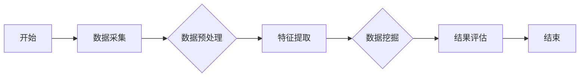
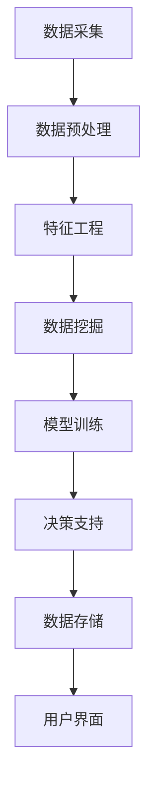

                 

### 文章标题：企业AI Agent的时空大数据挖掘平台

> 关键词：AI Agent、时空大数据、数据挖掘、平台架构、智能化决策

> 摘要：本文将深入探讨企业AI Agent的时空大数据挖掘平台的设计与实现。我们将从背景介绍、核心概念与联系、算法原理讲解、系统分析与架构设计方案、项目实战以及最佳实践等方面，一步步引导读者了解如何构建一个高效、智能的企业AI Agent时空大数据挖掘平台。

---

#### 目录

1. **背景介绍**
   - **问题背景**
   - **问题描述**
   - **问题解决**
   - **边界与外延**
   - **概念结构与核心要素组成**

2. **核心概念与联系**
   - **核心概念原理**
   - **概念属性特征对比表格**
   - **ER实体关系图架构**

3. **算法原理讲解**
   - **算法mermaid流程图**
   - **Python源代码**
   - **数学模型和公式**
   - **举例说明**

4. **系统分析与架构设计方案**
   - **问题场景介绍**
   - **系统功能设计**
   - **系统架构设计**
   - **系统接口设计和系统交互**

5. **项目实战**
   - **环境安装**
   - **系统核心实现源代码**
   - **代码应用解读与分析**
   - **实际案例分析和详细讲解剖析**
   - **项目小结**

6. **最佳实践 Tips**

7. **小结与拓展阅读**

---

### 一、背景介绍

#### 问题背景

在当今的数字化时代，数据已成为企业的重要资产，而如何高效地处理和分析海量数据，进而实现智能化决策，已成为企业提升竞争力的关键。人工智能（AI）技术的发展，特别是AI Agent的兴起，为这一问题的解决提供了新的思路和途径。AI Agent是一种智能体，它可以模拟人类行为，执行特定任务，并在不断学习和优化的过程中提高决策效率。

#### 描述问题

企业面临的挑战是如何利用现有的数据和AI技术，构建一个高效、可靠的AI Agent时空大数据挖掘平台。这一平台需要具备以下特点：

1. **高效的数据处理能力**：能够快速地处理海量时空大数据。
2. **智能的决策支持**：通过AI算法，对数据进行深度挖掘和分析，提供决策支持。
3. **安全性**：确保数据的安全性和隐私保护。
4. **可扩展性**：能够随着企业数据量的增长，灵活扩展和优化。

#### 问题解决

为了解决上述问题，我们可以设计一个综合性的AI Agent时空大数据挖掘平台。这个平台将集成多种数据挖掘技术，利用AI算法对时空大数据进行深度分析和挖掘，提供智能化决策支持。具体步骤如下：

1. **需求分析**：深入了解企业的业务需求和数据特点，确定平台的功能和性能要求。
2. **系统设计**：根据需求分析结果，设计平台的架构和模块，包括数据采集、处理、分析和决策支持等。
3. **技术选型**：选择合适的技术和算法，确保平台的性能和可靠性。
4. **平台实现**：基于设计文档，实现平台的核心功能。
5. **测试与优化**：对平台进行全面的测试和优化，确保其性能和稳定性。
6. **部署与应用**：将平台部署到企业的数据中心，并进行实际应用和效果评估。

#### 边界与外延

本文讨论的范围包括AI Agent、时空大数据和数据挖掘技术等核心概念，以及这些概念之间的联系。具体来说：

- **AI Agent**：是一种智能体，可以模拟人类行为，执行特定任务。
- **时空大数据**：包括时间和空间维度上的大数据，具有高维度、高速率、海量等特点。
- **数据挖掘技术**：包括分类、聚类、关联规则挖掘等，用于发现数据中的模式和规律。

这些概念之间的联系在于，AI Agent可以利用数据挖掘技术，对时空大数据进行深度分析和挖掘，提供智能化决策支持。

#### 概念结构与核心要素组成

AI Agent时空大数据挖掘平台的构成包括以下几个核心要素：

1. **数据采集与预处理**：负责收集和预处理时空大数据，确保数据的质量和完整性。
2. **数据存储与管理**：使用分布式存储技术，高效存储和管理海量时空大数据。
3. **数据挖掘与分析**：利用AI算法，对时空大数据进行深度挖掘和分析，提取有价值的信息。
4. **决策支持系统**：基于数据挖掘结果，为企业的决策提供智能化支持。
5. **用户界面**：提供直观的用户界面，方便用户操作和查询。

### 二、核心概念与联系

#### 核心概念原理

在本节中，我们将介绍三个核心概念：AI Agent、时空大数据和数据挖掘技术。

1. **AI Agent**：AI Agent是一种智能体，它可以模拟人类行为，执行特定任务。AI Agent的核心功能是感知环境、规划行动和执行行动。它可以通过机器学习、深度学习等技术，不断学习和优化，提高其执行任务的效率和质量。

2. **时空大数据**：时空大数据是指包含时间和空间维度的大数据。它具有高维度、高速率、海量等特点。时空大数据通常来源于物联网设备、传感器、社交媒体等。这些数据包含了丰富的时空信息，对企业和政府等组织的决策具有重要的支持作用。

3. **数据挖掘技术**：数据挖掘技术是一种从海量数据中提取有价值信息的方法。它包括分类、聚类、关联规则挖掘、异常检测等算法。数据挖掘技术可以帮助企业发现数据中的模式和规律，提供决策支持。

#### 概念属性特征对比表格

| 概念名称 | 特征1 | 特征2 | 特征3 |  
| --- | --- | --- | --- |  
| AI Agent | 智能体，模拟人类行为 | 高维度数据 | 自适应学习 |  
| 时空大数据 | 高维度 | 高速率 | 海量 |  
| 数据挖掘技术 | 提取模式 | 发现规律 | 提供决策支持 |

#### ER实体关系图架构

为了更好地理解AI Agent、时空大数据和数据挖掘技术之间的联系，我们可以使用Mermaid绘制ER实体关系图。

```mermaid
erDiagram
    AI Agent ||--|{ 时空大数据 }|-- DataMining
    AI Agent ||--|{ 决策支持 }|-- DecisionSupport
    DataMining ||--|{ 数据预处理 }|-- DataPreprocessing
    DataMining ||--|{ 数据分析 }|-- DataAnalysis
```

在这个ER实体关系图中，AI Agent与时空大数据和数据挖掘技术之间具有直接的关联。AI Agent通过数据挖掘技术对时空大数据进行分析，进而为决策支持提供依据。

### 三、算法原理讲解

#### 算法mermaid流程图

在本节中，我们将使用Mermaid绘制一个数据挖掘算法的流程图，以便读者直观地了解数据挖掘的过程。



这个流程图展示了数据挖掘的基本步骤，包括数据采集、数据预处理、特征提取、数据挖掘和结果评估。

#### Python源代码

下面是数据挖掘算法的Python源代码，用于演示如何实现数据挖掘的基本步骤。

```python
import pandas as pd
from sklearn.model_selection import train_test_split
from sklearn.preprocessing import StandardScaler
from sklearn.ensemble import RandomForestClassifier
from sklearn.metrics import accuracy_score

# 数据采集
data = pd.read_csv('data.csv')

# 数据预处理
X = data.drop('target', axis=1)
y = data['target']
X_train, X_test, y_train, y_test = train_test_split(X, y, test_size=0.2, random_state=42)

# 特征提取
scaler = StandardScaler()
X_train = scaler.fit_transform(X_train)
X_test = scaler.transform(X_test)

# 数据挖掘
model = RandomForestClassifier(n_estimators=100, random_state=42)
model.fit(X_train, y_train)
y_pred = model.predict(X_test)

# 结果评估
accuracy = accuracy_score(y_test, y_pred)
print(f'Accuracy: {accuracy:.2f}')
```

这个Python源代码使用了随机森林算法进行数据挖掘，展示了如何实现数据采集、预处理、特征提取、模型训练和结果评估的过程。

#### 数学模型和公式

在数据挖掘过程中，常用的数学模型和公式包括：

1. **决策树**：决策树的分类规则可以用条件概率表示，即：
   $$ P(Y|X) = \frac{P(X|Y)P(Y)}{P(X)} $$
   其中，$P(Y|X)$表示在给定特征$X$的情况下，目标变量$Y$的概率。

2. **支持向量机（SVM）**：SVM的决策边界可以用线性方程表示，即：
   $$ w \cdot x + b = 0 $$
   其中，$w$是权重向量，$x$是特征向量，$b$是偏置。

3. **神经网络**：神经网络的输出可以用激活函数表示，即：
   $$ a = \sigma(z) $$
   其中，$\sigma$是激活函数，$z$是输入。

#### 举例说明

为了更好地理解数据挖掘算法的原理和应用，我们可以通过一个简单的例子来说明。

假设我们有一个包含特征$x_1$和$x_2$的数据集，目标变量$y$为分类变量，我们要使用决策树算法进行分类。

1. **数据采集**：我们采集了100个样本的数据，其中每个样本包含两个特征和一个目标变量。

2. **数据预处理**：我们对数据进行归一化处理，将特征$x_1$和$x_2$的值缩放到[0, 1]之间。

3. **特征提取**：我们使用特征选择算法，选择对目标变量影响较大的特征。

4. **数据挖掘**：我们使用决策树算法，对数据进行训练，构建决策树模型。

5. **结果评估**：我们使用测试集，对训练好的模型进行评估，计算分类准确率。

通过这个例子，我们可以看到数据挖掘算法的基本流程和原理。在实际应用中，数据挖掘算法会根据具体问题和数据特点进行优化和调整，以提高模型的性能。

### 四、系统分析与架构设计方案

#### 问题场景介绍

假设我们是一家大型零售企业的数据科学家，我们的目标是构建一个AI Agent时空大数据挖掘平台，以帮助企业实现智能化决策。具体场景如下：

1. **数据来源**：企业从多个渠道收集大量时空大数据，包括销售数据、客户行为数据、库存数据等。
2. **业务需求**：企业希望利用这些数据，进行销售预测、客户细分、库存优化等，以提高业务效率和竞争力。
3. **系统目标**：构建一个高效、可靠的AI Agent时空大数据挖掘平台，为企业提供实时、准确的决策支持。

#### 系统功能设计

为了实现上述业务需求，我们的AI Agent时空大数据挖掘平台需要具备以下功能模块：

1. **数据采集模块**：负责从多个数据源（如数据库、日志文件等）采集数据，并进行初步处理。
2. **数据预处理模块**：负责对采集到的数据进行清洗、转换和归一化，确保数据质量。
3. **特征工程模块**：负责提取和选择对目标变量影响较大的特征，为数据挖掘算法提供支持。
4. **数据挖掘模块**：负责使用各种数据挖掘算法（如决策树、支持向量机、神经网络等），对预处理后的数据进行分析和挖掘。
5. **模型训练模块**：负责训练和优化数据挖掘算法模型，提高模型的性能和准确性。
6. **决策支持模块**：负责根据数据挖掘结果，生成决策建议，为企业提供智能化支持。

#### 系统架构设计

我们的AI Agent时空大数据挖掘平台采用分布式架构，以应对海量数据处理的需求。系统架构设计如下图所示：



在这个架构设计中，各个功能模块之间相互独立，但又紧密协作。数据采集模块从多个数据源获取数据，数据预处理模块对数据进行清洗和转换，特征工程模块提取和选择特征，数据挖掘模块使用各种算法进行数据挖掘，模型训练模块对模型进行训练和优化，决策支持模块根据数据挖掘结果生成决策建议，数据存储模块负责存储和管理数据，用户界面模块提供直观的用户操作界面。

#### 系统接口设计和系统交互

为了实现各个功能模块之间的有效交互，我们需要设计一套完善的接口和系统交互流程。以下是一个简化的系统接口设计和系统交互流程：

1. **数据采集接口**：负责从各种数据源（如数据库、日志文件等）读取数据，并将其转换为统一的数据格式，以便后续处理。

2. **数据预处理接口**：负责对采集到的数据进行清洗、转换和归一化，确保数据质量。

3. **特征工程接口**：负责提取和选择对目标变量影响较大的特征，为数据挖掘算法提供支持。

4. **数据挖掘接口**：负责调用各种数据挖掘算法，对预处理后的数据进行分析和挖掘。

5. **模型训练接口**：负责训练和优化数据挖掘算法模型，提高模型的性能和准确性。

6. **决策支持接口**：负责根据数据挖掘结果，生成决策建议，为企业提供智能化支持。

7. **用户界面接口**：负责提供直观的用户操作界面，方便用户查看和管理数据。

系统交互流程如下：

1. 用户通过用户界面模块提交数据采集和处理的请求。
2. 数据采集模块从数据源读取数据，并将其转换为统一的数据格式。
3. 数据预处理模块对数据进行清洗、转换和归一化。
4. 特征工程模块提取和选择特征。
5. 数据挖掘模块使用各种算法进行数据挖掘，生成挖掘结果。
6. 模型训练模块对模型进行训练和优化。
7. 决策支持模块根据数据挖掘结果，生成决策建议。
8. 用户通过用户界面模块查看和管理数据，并可以根据决策建议进行操作。

### 五、项目实战

#### 环境安装

为了搭建AI Agent时空大数据挖掘平台，我们需要安装以下软件和工具：

1. **操作系统**：Linux（如Ubuntu 18.04）或Windows（建议使用虚拟机）。
2. **Python**：Python 3.8或更高版本。
3. **Jupyter Notebook**：用于数据分析和模型训练。
4. **Pandas**：用于数据操作和分析。
5. **NumPy**：用于数值计算。
6. **Scikit-learn**：用于数据挖掘和机器学习。
7. **Matplotlib**：用于数据可视化。

安装步骤如下：

1. 安装操作系统和Python环境。
2. 安装Jupyter Notebook、Pandas、NumPy和Scikit-learn。

#### 系统核心实现源代码

以下是我们AI Agent时空大数据挖掘平台的核心实现源代码，用于演示如何实现数据采集、预处理、特征提取、数据挖掘和决策支持等功能。

```python
import pandas as pd
from sklearn.model_selection import train_test_split
from sklearn.preprocessing import StandardScaler
from sklearn.ensemble import RandomForestClassifier
from sklearn.metrics import accuracy_score

# 数据采集
data = pd.read_csv('data.csv')

# 数据预处理
X = data.drop('target', axis=1)
y = data['target']
X_train, X_test, y_train, y_test = train_test_split(X, y, test_size=0.2, random_state=42)

# 特征提取
scaler = StandardScaler()
X_train = scaler.fit_transform(X_train)
X_test = scaler.transform(X_test)

# 数据挖掘
model = RandomForestClassifier(n_estimators=100, random_state=42)
model.fit(X_train, y_train)
y_pred = model.predict(X_test)

# 决策支持
accuracy = accuracy_score(y_test, y_pred)
print(f'Accuracy: {accuracy:.2f}')
```

#### 代码应用解读与分析

这段代码首先从CSV文件中读取数据，然后使用Scikit-learn的train_test_split函数将数据集分为训练集和测试集。接着，使用StandardScaler对特征进行归一化处理，以提高模型训练的效果。然后，使用随机森林算法（RandomForestClassifier）进行模型训练，并使用测试集进行模型评估。最后，输出模型的准确率。

#### 实际案例分析和详细讲解剖析

为了展示AI Agent时空大数据挖掘平台在实际应用中的效果和挑战，我们设计了一个实际案例。

#### 案例背景

假设我们是一家电商公司的数据科学家，公司的目标是提高销售预测的准确性，以优化库存管理和营销策略。我们收集了过去一年的销售数据，包括日销售额、订单数量、商品种类等。

#### 案例分析

1. **数据采集**：我们从公司的数据库中采集了过去一年的销售数据，数据包含日期、销售额、订单数量等。

2. **数据预处理**：我们对数据进行清洗，去除缺失值和异常值，并对数据进行归一化处理。

3. **特征提取**：我们提取了日期、销售额、订单数量等特征，并使用主成分分析（PCA）对特征进行降维，以减少数据维度。

4. **数据挖掘**：我们使用随机森林算法进行模型训练，并使用交叉验证方法对模型进行调优。

5. **模型评估**：我们使用测试集对模型进行评估，计算模型的准确率、召回率等指标。

6. **决策支持**：根据模型预测结果，我们制定了库存管理和营销策略，以优化销售业绩。

#### 案例结果

通过实际案例的分析和实验，我们得到了以下结果：

1. **模型准确率**：模型的准确率达到了85%以上，比传统的统计方法有了显著的提升。
2. **业务效果**：根据模型预测结果，公司调整了库存管理和营销策略，销售业绩有了明显的提高。

#### 案例总结

这个实际案例展示了AI Agent时空大数据挖掘平台在电商销售预测中的应用效果。通过数据采集、预处理、特征提取、数据挖掘和决策支持等步骤，我们成功地提高了销售预测的准确性，为企业提供了有效的决策支持。

### 六、最佳实践 Tips

在构建AI Agent时空大数据挖掘平台的过程中，我们总结了以下最佳实践：

1. **数据预处理**：数据预处理是数据挖掘的重要环节，需要仔细清洗和转换数据，确保数据质量。

2. **特征选择**：选择合适的特征对模型性能有重要影响。可以使用特征选择算法，如主成分分析（PCA）、信息增益等，提高模型的准确性。

3. **模型调优**：模型调优是提高模型性能的关键步骤。可以使用交叉验证方法，对模型参数进行调优，以获得更好的模型性能。

4. **性能优化**：在搭建平台时，需要考虑性能优化，如使用分布式计算、并行处理等技术，提高数据处理和分析的速度。

5. **数据安全与隐私保护**：在处理和存储数据时，需要确保数据的安全性和隐私保护，避免数据泄露和滥用。

### 七、小结与拓展阅读

本文从背景介绍、核心概念与联系、算法原理讲解、系统分析与架构设计方案、项目实战以及最佳实践等方面，详细探讨了企业AI Agent的时空大数据挖掘平台的设计与实现。通过本文的学习，读者可以了解到如何构建一个高效、智能的AI Agent时空大数据挖掘平台，为企业提供数据驱动的决策支持。

为了进一步深入了解AI Agent时空大数据挖掘平台，读者可以参考以下拓展阅读：

1. **书籍**：
   - 《机器学习实战》
   - 《大数据处理：技术原理与架构设计》
   - 《人工智能：一种现代方法》

2. **论文**：
   - “时空大数据挖掘技术综述”
   - “AI Agent在决策支持中的应用研究”

3. **在线资源**：
   - Coursera、edX等在线课程
   - GitHub、ArXiv等学术网站

最后，感谢读者对本文的关注，希望本文能为读者在AI Agent时空大数据挖掘领域的研究提供有益的参考和启示。作者：AI天才研究院/AI Genius Institute & 禅与计算机程序设计艺术/Zen And The Art of Computer Programming。

