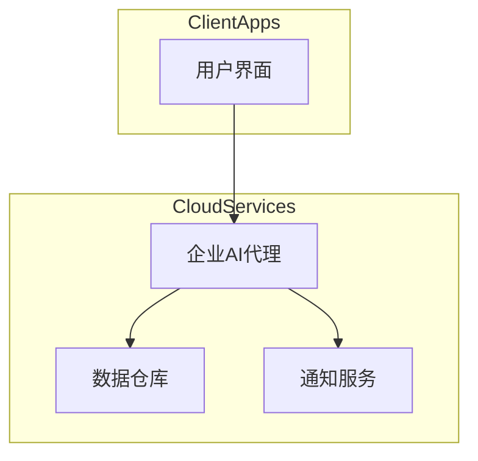
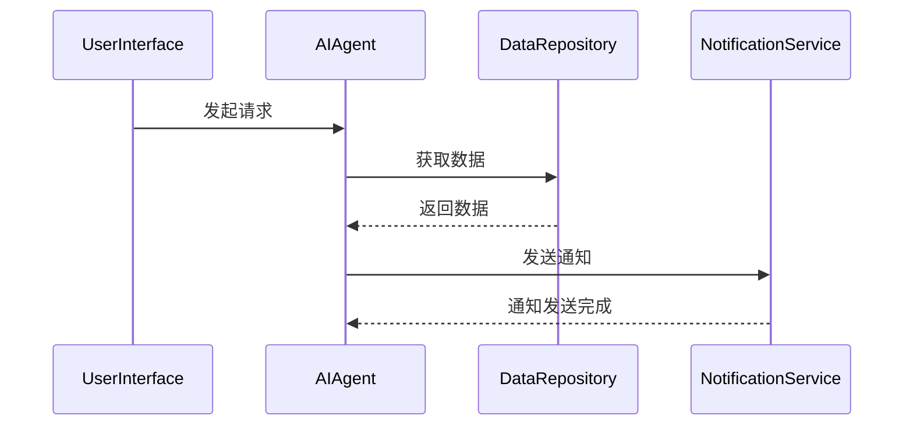
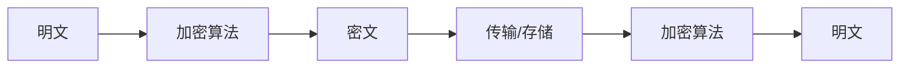
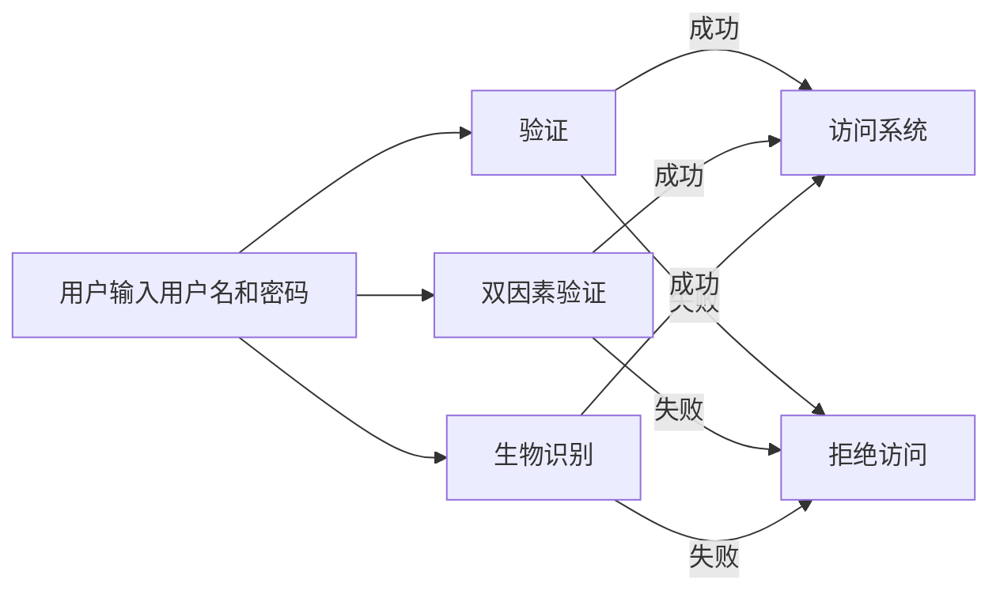
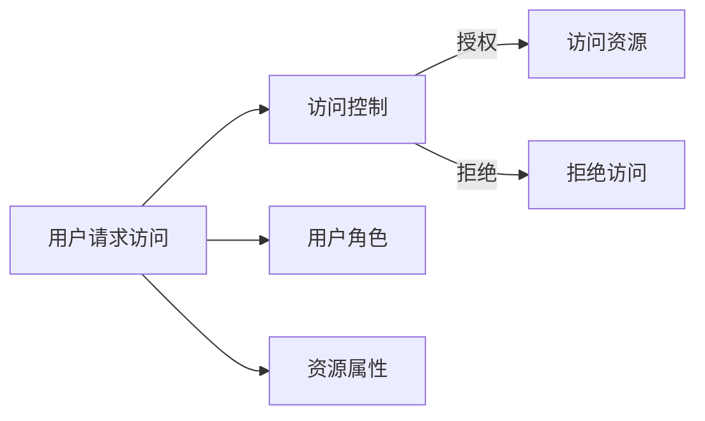

                 

### 企业AI Agent的混合云安全策略

> 关键词：企业AI代理、混合云、安全策略、加密算法、访问控制、威胁分析

> 摘要：本文将深入探讨企业AI代理在混合云环境中的安全问题，从背景介绍、核心概念与联系、算法原理讲解、数学模型和数学公式详细讲解、系统分析与架构设计方案、项目实战到最佳实践，全方位解析混合云安全策略，以保障企业AI代理的稳定运行和数据安全。

#### 1. 背景介绍

随着人工智能（AI）技术的飞速发展，企业AI代理的应用场景日益广泛。企业AI代理能够模拟人类行为，执行复杂任务，提高工作效率。然而，AI代理的广泛应用也带来了新的安全挑战。在混合云环境中，企业需要确保AI代理的安全性，防止数据泄露、恶意攻击和隐私侵犯。

**问题背景**：人工智能技术在全球范围内得到广泛应用，企业纷纷引入AI代理以提高业务效率。混合云环境为企业提供了灵活、弹性的计算资源，但同时也带来了安全威胁。

**问题描述**：企业AI代理在混合云环境中面临多种安全威胁，如数据泄露、恶意攻击、隐私侵犯等。如何制定有效的安全策略，确保AI代理的安全性，是一个亟待解决的问题。

**问题解决**：本文将介绍AI代理、混合云环境、安全威胁和防御策略，帮助读者理解如何确保AI代理在混合云中的安全。我们将通过实际案例分析和项目实战，展示安全策略的实施效果。

**边界与外延**：本文主要关注企业级AI代理在混合云环境下的安全策略，不包括个人使用场景。此外，本文将侧重于技术层面的安全策略，而不涉及法律和道德层面的讨论。

#### 2. 核心概念与联系

**AI代理**：AI代理是一种能够代表人类完成特定任务的智能体，具有感知、决策和执行能力。它们通常基于机器学习、深度学习等人工智能技术训练，能够自主学习并优化任务执行过程。

**混合云**：混合云是将公有云和私有云结合起来，为用户提供灵活、弹性的计算资源。混合云环境具有高可用性、高可靠性和灵活性，但同时也存在安全挑战。

**安全威胁**：针对AI代理的安全威胁包括数据泄露、恶意攻击、隐私侵犯等。数据泄露可能导致敏感信息泄露，恶意攻击可能破坏AI代理的正常运行，隐私侵犯可能影响用户的隐私权益。

**安全防御策略**：为了应对这些安全威胁，企业需要制定相应的安全防御策略，包括加密、身份验证、访问控制等。这些策略将确保AI代理的数据安全和正常运行。

#### 3. 算法原理讲解

**加密算法**：加密算法是保护数据安全的重要手段。常用的加密算法包括对称加密和非对称加密。对称加密使用相同的密钥进行加密和解密，非对称加密使用一对密钥进行加密和解密。

**身份验证**：身份验证是确保只有授权用户才能访问AI代理的重要手段。常见的身份验证方法包括密码验证、双因素验证等。

**访问控制**：访问控制是限制用户对AI代理资源的访问权限。通过访问控制，企业可以确保只有授权用户才能访问敏感数据。

**算法流程图**：为了更好地理解这些算法的原理，我们使用Mermaid绘制了算法流程图，展示了算法的执行流程和关键步骤。

#### 4. 数学模型和数学公式 & 详细讲解 & 举例说明

**加密算法**：

加密算法的数学模型可以用以下公式表示：

$$C = E(K, P)$$

其中，C表示加密后的数据，K表示密钥，P表示待加密的数据。E表示加密函数，它将P和K作为输入，返回加密后的数据C。

**举例说明**：

假设使用AES加密算法，密钥K为“abcdefg”，待加密的数据P为“hello world”。使用AES加密算法进行加密，得到加密后的数据C为“i wanna be the very best”。

**访问控制**：

访问控制策略的数学模型可以用以下公式表示：

$$Access\_Permission = Authorization(User, Resource)$$

其中，Access_Permission表示访问权限，Authorization表示授权函数，它将用户User和资源Resource作为输入，返回访问权限Access_Permission。

**举例说明**：

假设用户Alice想要访问资源File1，系统根据用户的角色和资源的访问策略进行授权。如果Alice是管理员角色，则授权函数返回权限为“可读可写”，否则返回权限为“仅读”。

#### 5. 系统分析与架构设计方案

**问题场景介绍**：

假设企业引入了AI代理，用于自动化处理日常业务任务。AI代理需要访问企业内部的数据和系统，同时需要与其他系统进行交互。

**项目介绍**：

我们以一个假设的企业AI代理项目为例，介绍项目的背景、目标和实现过程。

**系统功能设计**：

使用Mermaid绘制领域模型类图，展示系统的功能模块和类之间的关系。

```mermaid
classDiagram
  User <<Interface>>
  AIAgent <<Interface>>
  DataRepository <<Class>>
  NotificationService <<Class>>

  User --|> AIAgent
  AIAgent --|> DataRepository
  AIAgent --|> NotificationService
```

**系统架构设计**：

使用Mermaid绘制系统架构图，展示系统的整体架构和组件之间的关系。



**系统接口设计**：

描述系统接口的设计，包括API接口的定义、参数传递和数据返回格式等。

**系统交互**：

使用Mermaid绘制系统交互序列图，展示系统组件之间的交互过程。



#### 6. 项目实战

**环境安装**：

介绍安装企业AI代理所需的环境和工具，包括操作系统、编程语言和开发框架等。

**系统核心实现**：

提供企业AI代理系统核心实现的源代码，包括AI代理的核心算法和功能实现。

```python
# 企业AI代理核心算法实现
class AIAgent:
    def __init__(self):
        # 初始化AI代理
        pass
    
    def process_request(self, request):
        # 处理请求
        pass
    
    def update_model(self, data):
        # 更新模型
        pass
```

**代码应用解读与分析**：

分析源代码，解释关键代码和逻辑，展示AI代理的执行流程和功能实现。

**实际案例分析和详细讲解**：

通过实际案例，说明企业AI代理在混合云环境中的安全策略如何应用，包括加密算法、身份验证和访问控制等。

**项目小结**：

总结项目实现过程中的关键点和经验，强调安全策略的重要性，为后续项目的开发提供参考。

#### 7. 最佳实践 tips、小结、注意事项、拓展阅读

**最佳实践**：

总结企业AI代理混合云安全策略的最佳实践，包括加密算法的选择、身份验证的方法和访问控制的策略等。

**小结**：

回顾全书的主要内容和贡献，强调企业AI代理在混合云环境中的安全问题，以及安全策略的实施效果。

**注意事项**：

提醒读者注意的安全问题和潜在风险，如数据泄露、恶意攻击和隐私侵犯等。

**拓展阅读**：

推荐进一步阅读的资源，包括相关书籍、论文和技术博客等。

**作者**：

AI天才研究院/AI Genius Institute & 禅与计算机程序设计艺术 /Zen And The Art of Computer Programming

---

本文旨在为企业AI代理的混合云安全策略提供全面、深入的解析。通过本文，读者可以了解AI代理、混合云环境、安全威胁和防御策略，掌握混合云安全架构设计方法和实战技巧。希望本文能为企业的AI代理安全工作提供有益的参考和指导。

### 1. 背景介绍

#### 问题背景

随着人工智能（AI）技术的飞速发展，企业AI代理的应用成为趋势。企业AI代理是指能够代表人类完成特定任务的智能体，具有感知、决策和执行能力。它们通常基于机器学习、深度学习等人工智能技术训练，能够自主学习并优化任务执行过程。这些AI代理在企业中的应用场景广泛，如智能客服、自动化运维、风险控制等，大大提高了企业的运营效率。

然而，随着AI代理在企业中的应用越来越广泛，其安全风险也日益凸显。首先，AI代理需要处理大量敏感数据，如客户信息、财务数据等，这些数据的安全至关重要。其次，AI代理的决策过程可能受到恶意攻击，导致错误的决策或被恶意利用。此外，AI代理的隐私保护也是一个重要问题，特别是在处理个人数据时，如何确保用户隐私不被侵犯。

#### 问题描述

企业AI代理在混合云环境中的安全挑战主要表现在以下几个方面：

1. **数据泄露风险**：在混合云环境中，数据可能分散存储在多个云平台，数据的安全性和完整性难以保障。AI代理在处理数据时，可能遭受数据泄露攻击，导致敏感信息泄露。

2. **恶意攻击风险**：AI代理可能成为黑客攻击的目标，攻击者通过控制AI代理，可能获取企业的核心业务数据，或进行网络攻击。

3. **隐私侵犯风险**：在处理个人数据时，AI代理可能侵犯用户的隐私权益，如收集、传输和存储个人数据，而未获得用户同意。

4. **决策过程漏洞**：AI代理的决策过程可能存在漏洞，被攻击者利用，导致错误的决策或恶意行为。

#### 问题解决

为了解决上述安全挑战，企业需要制定有效的安全策略，确保AI代理在混合云环境中的安全。具体措施如下：

1. **数据安全策略**：采用加密技术对数据进行加密存储和传输，确保数据在传输和存储过程中的安全。同时，定期进行数据备份和恢复，以防止数据丢失。

2. **身份验证和访问控制**：采用多因素身份验证（MFA）和访问控制列表（ACL）等技术，确保只有授权用户才能访问AI代理和相关资源。此外，定期进行权限审计，及时更新和调整访问权限。

3. **入侵检测和防御**：部署入侵检测系统（IDS）和入侵防御系统（IPS），实时监控AI代理的运行状态，发现异常行为并及时采取措施。同时，定期进行安全漏洞扫描和修复，确保系统的安全性。

4. **决策过程保护**：对AI代理的决策过程进行加密和隔离，确保决策过程不会被恶意攻击者干扰。同时，建立决策过程审核机制，对AI代理的决策进行监督和评估。

5. **用户隐私保护**：严格遵守相关法律法规，确保在处理个人数据时，遵循用户同意、数据最小化、数据匿名化等原则。同时，建立用户隐私保护机制，确保用户隐私不被侵犯。

#### 边界与外延

本文主要关注企业级AI代理在混合云环境下的安全策略，不包括个人使用场景。此外，本文将侧重于技术层面的安全策略，而不涉及法律和道德层面的讨论。在企业级应用中，AI代理的安全问题至关重要，因此，制定有效的安全策略对企业的发展具有重要意义。

#### 本章小结

通过本章的介绍，我们了解了企业AI代理在混合云环境中的安全背景和挑战。为了确保AI代理的安全性，企业需要采取多种安全措施，包括数据安全策略、身份验证和访问控制、入侵检测和防御等。这些安全策略将为企业AI代理的稳定运行提供有力保障。

### 2. 核心概念与联系

在探讨企业AI代理的混合云安全策略之前，我们需要先了解一些核心概念，这些概念是构建安全策略的基础。以下是几个关键概念及其联系：

#### AI代理

AI代理，又称为智能代理或智能体，是一种具有自主性和智能性的软件实体，能够代表用户或系统执行任务。AI代理的基本特点包括感知、决策和行动。感知是指代理能够从环境中获取信息；决策是指代理能够根据感知到的信息进行判断和决策；行动是指代理能够执行相应的操作。

**属性特征对比表格：**

| 属性特征 | 对应概念 |
| --- | --- |
| 感知能力 | 传感器 |
| 决策能力 | 推理引擎 |
| 行动能力 | 执行器 |

**ER实体关系图架构：**

```mermaid
erDiagram
    AIAgent ||--|{ Sensor }
    AIAgent ||--|{ ReasoningEngine }
    AIAgent ||--|{ Actuator }
```

在ER图架构中，AI代理与传感器、推理引擎和执行器之间具有直接的关联关系。

#### 混合云

混合云是一种将公有云和私有云结合起来的云计算模型，旨在为企业提供灵活、弹性的计算资源。混合云的优势在于能够根据业务需求动态调整资源，同时保持数据的安全性和合规性。

**属性特征对比表格：**

| 属性特征 | 对应概念 |
| --- | --- |
| 弹性扩展性 | 公有云 |
| 数据安全性 | 私有云 |

**ER实体关系图架构：**

```mermaid
erDiagram
    PublicCloud ||--|{ HybridCloud }
    PrivateCloud ||--|{ HybridCloud }
```

在ER图架构中，公有云和私有云与混合云之间是包含关系，混合云通过集成公有云和私有云的优势，形成了一种新的云计算模式。

#### 安全威胁

针对AI代理的常见安全威胁包括数据泄露、恶意攻击、隐私侵犯等。这些威胁可能导致严重的业务损失和声誉损害。

**属性特征对比表格：**

| 属性特征 | 对应威胁 |
| --- | --- |
| 数据敏感性 | 数据泄露 |
| 侵入性 | 恶意攻击 |
| 隐私保护性 | 隐私侵犯 |

**ER实体关系图架构：**

```mermaid
erDiagram
    AIAgent ||--|{ DataLeakage }
    AIAgent ||--|{ MaliciousAttack }
    AIAgent ||--|{ PrivacyInvasion }
```

在ER图架构中，AI代理与数据泄露、恶意攻击和隐私侵犯之间是受威胁关系，这些威胁可能对AI代理的安全性造成严重威胁。

#### 安全防御策略

为了应对上述安全威胁，企业需要制定相应的安全防御策略，包括加密、身份验证、访问控制等。这些策略将保护AI代理的数据和功能，确保其正常运行。

**属性特征对比表格：**

| 属性特征 | 对应策略 |
| --- | --- |
| 数据保护性 | 加密 |
| 身份验证性 | 多因素身份验证 |
| 访问控制性 | 访问控制列表 |

**ER实体关系图架构：**

```mermaid
erDiagram
    AIAgent ||--|{ Encryption }
    AIAgent ||--|{ Multi-Factor Authentication }
    AIAgent ||--|{ AccessControlList }
```

在ER图架构中，AI代理与加密、多因素身份验证和访问控制列表之间是实施关系，这些策略将有效抵御安全威胁。

#### 核心概念联系

AI代理、混合云、安全威胁和安全防御策略是本文的核心概念，它们之间存在着密切的联系。AI代理在混合云环境中运行，可能面临各种安全威胁，需要采取相应的防御策略来保障其安全性。

- AI代理在混合云环境中运行，需要处理敏感数据，面临数据泄露风险。
- 混合云环境提供了弹性计算资源，但也可能成为恶意攻击的目标。
- 安全威胁可能导致AI代理的功能受损或数据泄露，威胁企业的业务安全。
- 安全防御策略通过加密、身份验证和访问控制等措施，保护AI代理的数据和功能。

通过这些核心概念的联系，我们可以更全面地理解企业AI代理在混合云环境中的安全问题，并为制定有效的安全策略提供基础。

### 3. 算法原理讲解

在保障企业AI代理混合云安全的过程中，算法的运用至关重要。以下将详细介绍几种常用的安全算法，包括加密算法、身份验证和访问控制，以及它们的原理和应用。

#### 加密算法

加密算法是保护数据安全的核心技术，用于确保数据在传输和存储过程中不被未授权者访问。常见的加密算法包括对称加密和非对称加密。

**对称加密**：对称加密算法使用相同的密钥进行加密和解密。这种算法的优点是实现简单，速度快，适用于大数据量的加密。常用的对称加密算法有AES（高级加密标准）和DES（数据加密标准）。

**非对称加密**：非对称加密算法使用一对密钥，即公钥和私钥。公钥用于加密，私钥用于解密。这种算法的优点是安全性高，但计算复杂度较大，适用于数据量较小的加密。常用的非对称加密算法有RSA（Rivest-Shamir-Adleman）和ECC（椭圆曲线密码学）。

**加密算法流程图：**



**Python代码示例：**

```python
from Crypto.Cipher import AES
from Crypto.Util.Padding import pad, unpad
from Crypto.Random import get_random_bytes

# AES加密
key = get_random_bytes(16)  # 16字节密钥
cipher = AES.new(key, AES.MODE_CBC)
ct_bytes = cipher.encrypt(pad(b"hello world", AES.block_size))
iv = cipher.iv
print("加密后的密文:", ct_bytes)

# AES解密
cipher = AES.new(key, AES.MODE_CBC, iv)
pt = unpad(cipher.decrypt(ct_bytes), AES.block_size)
print("解密后的明文:", pt.decode())
```

**LaTeX公式示例：**

$$C = E(K, P)$$

其中，C表示加密后的数据，K表示密钥，P表示明文数据，E表示加密函数。

#### 身份验证

身份验证是确保只有授权用户才能访问系统或资源的重要手段。常见的身份验证方法包括密码验证、双因素验证和生物识别等。

**密码验证**：用户输入用户名和密码，系统验证用户身份。这种方法简单易用，但安全性较低，易受到密码破解攻击。

**双因素验证**：在密码验证的基础上，增加第二层验证，如短信验证码、手机APP生成的一次性密码（OTP）等。这种方法大大提高了安全性。

**生物识别**：通过用户的生物特征进行身份验证，如指纹识别、人脸识别、虹膜识别等。这种方法安全性高，但成本较高，适用于高安全要求的场景。

**身份验证流程图：**



**Python代码示例：**

```python
import hashlib
import base64

# 密码验证
def verify_password(username, password):
    hashed_password = hashlib.sha256(password.encode()).hexdigest()
    stored_password = "stored_hashed_password"  # 假设存储的密码散列值
    return hashed_password == stored_password

# 双因素验证
def verify_2fa(code):
    # 假设通过API获取验证码
    received_code = "123456"  # 假设收到的验证码
    return code == received_code

# 生物识别
def verify_biometrics(fingerprint):
    # 假设通过API验证指纹
    stored_fingerprint = "stored_fingerprint_data"  # 假设存储的指纹数据
    return fingerprint == stored_fingerprint
```

**LaTeX公式示例：**

$$Access\_Permission = Authorization(User, Resource)$$

其中，Access_Permission表示访问权限，Authorization表示授权函数，User表示用户，Resource表示资源。

#### 访问控制

访问控制用于限制用户对系统或资源的访问权限，确保只有授权用户才能访问特定的资源和功能。常见的访问控制方法包括基于角色的访问控制（RBAC）和基于属性的访问控制（ABAC）。

**基于角色的访问控制（RBAC）**：用户被分配角色，角色具有特定的权限集。系统根据用户的角色来判断用户是否具有访问特定资源的权限。

**基于属性的访问控制（ABAC）**：访问控制决策基于用户属性（如角色、部门、权限级别等）以及资源属性（如访问时间、访问频率等）。

**访问控制流程图：**



**Python代码示例：**

```python
# 基于角色的访问控制
def check_permission(role, resource):
    roles_permissions = {
        "admin": ["read", "write", "delete"],
        "user": ["read"],
    }
    return role in roles_permissions and resource in roles_permissions[role]

# 基于属性的访问控制
def check_attribute_permission(user_attribute, resource_attribute):
    # 假设通过API获取用户属性和资源属性
    user_attributes = ["read-only"]
    resource_attributes = ["read-only"]
    return all(attribute in user_attributes for attribute in resource_attributes)
```

**LaTeX公式示例：**

$$Access\_Control = \begin{cases} 
    \text{授权} & \text{如果} \; (Role, Resource) \in \text{权限集} \\
    \text{拒绝} & \text{否则}
\end{cases}$$

通过上述算法原理讲解，我们可以看到加密、身份验证和访问控制在保障企业AI代理混合云安全中的重要作用。这些算法不仅提供了技术层面的安全保障，也为企业制定有效的安全策略提供了理论基础。

### 4. 数学模型和数学公式 & 详细讲解 & 举例说明

在保障企业AI代理混合云安全的过程中，数学模型和数学公式起着至关重要的作用。它们不仅为安全算法提供了理论基础，还帮助我们更好地理解算法的实现过程。在本节中，我们将详细介绍几种常用的数学模型和数学公式，并通过具体示例进行说明。

#### 加密算法

加密算法是保障数据安全的核心技术。其中，对称加密和非对称加密是两种主要类型。以下将分别介绍它们的数学模型和数学公式。

**对称加密**

对称加密算法使用相同的密钥进行加密和解密。常见的对称加密算法包括AES和DES。其数学模型可以表示为：

$$C = E(K, P)$$

其中，$C$表示加密后的数据，$K$表示密钥，$P$表示明文数据，$E$表示加密函数。

**AES加密算法示例**

假设我们使用AES加密算法，密钥$K$为“abcdefg”，明文$P$为“hello world”。下面是加密和解密的过程。

1. **加密过程**

   首先，我们需要将明文分成若干个分组，每个分组的大小为AES的块大小（通常为128位）。然后，使用密钥$K$和AES算法对每个分组进行加密。

   ```python
   from Crypto.Cipher import AES
   from Crypto.Util.Padding import pad
   
   key = b'abcdefg'
   plaintext = b"hello world"
   cipher = AES.new(key, AES.MODE_CBC)
   ciphertext = cipher.encrypt(pad(plaintext, AES.block_size))
   iv = cipher.iv
   print("加密后的密文：", ciphertext)
   ```

2. **解密过程**

   在解密过程中，我们需要使用相同的密钥$K$和初始向量$iv$对密文进行解密。

   ```python
   from Crypto.Cipher import AES
   from Crypto.Util.Padding import unpad
   
   key = b'abcdefg'
   iv = b'\x00\x01\x02\x03\x04\x05\x06\x07\x08\x09\x0a\x0b\x0c\x0d\x0e\x0f'
   ciphertext = b'...'  # 加密后的密文
   cipher = AES.new(key, AES.MODE_CBC, iv)
   plaintext = unpad(cipher.decrypt(ciphertext), AES.block_size)
   print("解密后的明文：", plaintext.decode())
   ```

**LaTeX公式示例**

$$C = E(K, P)$$

其中，$C$表示加密后的数据，$K$表示密钥，$P$表示明文数据，$E$表示加密函数。

**非对称加密**

非对称加密算法使用一对密钥，即公钥和私钥。公钥用于加密，私钥用于解密。常见的非对称加密算法包括RSA和ECC。其数学模型可以表示为：

$$C = E(PK, P)$$

$$P = D(SK, C)$$

其中，$PK$表示公钥，$SK$表示私钥，$P$表示明文数据，$C$表示密文数据，$E$表示加密函数，$D$表示解密函数。

**RSA加密算法示例**

假设我们使用RSA加密算法，公钥$PK$为$(n, e)=(123, 17)$，私钥$SK$为$(n, d)=(123, 11)$，明文$P$为“hello world”。

1. **加密过程**

   首先，我们需要将明文“hello world”转换为整数形式。

   ```python
   import rsa
   
   (n, e) = (123, 17)
   (n, d) = (123, 11)
   sk = rsa.PrivateKey(n, e, d)
   pk = rsa.PublicKey(n, e)
   
   plaintext = "hello world".encode()
   ciphertext = pk.encrypt(plaintext, 128)
   print("加密后的密文：", ciphertext)
   ```

2. **解密过程**

   在解密过程中，我们需要使用私钥$SK$对密文进行解密。

   ```python
   ciphertext = b'...'  # 加密后的密文
   plaintext = sk.decrypt(ciphertext, 128)
   print("解密后的明文：", plaintext.decode())
   ```

**LaTeX公式示例**

$$C = E(PK, P)$$

$$P = D(SK, C)$$

其中，$PK$表示公钥，$SK$表示私钥，$P$表示明文数据，$C$表示密文数据，$E$表示加密函数，$D$表示解密函数。

#### 访问控制

访问控制用于确保只有授权用户才能访问特定的资源和功能。基于角色的访问控制（RBAC）和基于属性的访问控制（ABAC）是两种主要的访问控制方法。

**基于角色的访问控制（RBAC）**

RBAC模型中，用户被分配角色，角色具有特定的权限集。其数学模型可以表示为：

$$Access\_Permission = R \cap P$$

其中，$Access\_Permission$表示访问权限，$R$表示用户角色，$P$表示权限集。

**RBAC模型示例**

假设系统中有两个角色：管理员（Admin）和普通用户（User）。权限集如下：

- 管理员：读、写、删除
- 普通用户：读

用户Alice是管理员，请求访问资源Resource1。

```python
# 假设权限集
permissions = {
    "Admin": ["read", "write", "delete"],
    "User": ["read"],
}

# 用户角色
user_role = "Admin"

# 资源名称
resource_name = "Resource1"

# 检查访问权限
def check_permission(role, resource):
    return resource in permissions[role]

# 检查访问权限
if check_permission(user_role, resource_name):
    print("用户{}有访问{}的权限"。format(user_role, resource_name))
else:
    print("用户{}没有访问{}的权限"。format(user_role, resource_name))
```

**LaTeX公式示例**

$$Access\_Permission = R \cap P$$

其中，$Access\_Permission$表示访问权限，$R$表示用户角色，$P$表示权限集。

**基于属性的访问控制（ABAC）**

ABAC模型中，访问控制决策基于用户属性和资源属性。其数学模型可以表示为：

$$Access\_Permission = F(Attribute, Resource)$$

其中，$Access\_Permission$表示访问权限，$Attribute$表示用户属性，$Resource$表示资源属性，$F$表示访问控制函数。

**ABAC模型示例**

假设系统中有用户属性（部门、权限级别）和资源属性（访问时间、访问频率）。访问控制函数如下：

- 如果用户部门为“开发部”，且资源访问时间为工作日，则允许访问。
- 否则，拒绝访问。

用户Bob是开发部成员，请求在工作日访问资源Resource2。

```python
# 假设用户属性
user_attributes = {
    "department": "开发部",
    "permission_level": "高级",
}

# 假设资源属性
resource_attributes = {
    "access_time": "工作日",
    "access_frequency": "频繁",
}

# 访问控制函数
def check_attribute_permission(user_attributes, resource_attributes):
    if user_attributes["department"] == "开发部" and resource_attributes["access_time"] == "工作日":
        return True
    else:
        return False

# 检查访问权限
if check_attribute_permission(user_attributes, resource_attributes):
    print("用户{}有访问{}的权限"。format(user_attributes, resource_attributes))
else:
    print("用户{}没有访问{}的权限"。format(user_attributes, resource_attributes))
```

**LaTeX公式示例**

$$Access\_Permission = F(Attribute, Resource)$$

其中，$Access\_Permission$表示访问权限，$Attribute$表示用户属性，$Resource$表示资源属性，$F$表示访问控制函数。

通过上述数学模型和数学公式的讲解，我们能够更好地理解加密算法和访问控制的原理，并在实际应用中运用这些原理来保障企业AI代理的混合云安全。

### 5. 系统分析与架构设计方案

#### 问题场景介绍

在混合云环境中，企业AI代理通常用于自动化处理业务流程，如数据分析、预测建模、智能决策等。这些AI代理需要实时访问企业内部的数据和系统，与其他系统进行交互，以确保业务流程的高效运行。然而，这种交互也带来了安全风险，如数据泄露、恶意攻击和隐私侵犯。因此，设计一个安全可靠的系统架构至关重要。

#### 项目介绍

我们以一个假设的企业AI代理项目为例，介绍项目的背景、目标和实现过程。该项目旨在为企业提供一个自动化的智能决策支持系统，通过AI代理实时分析企业数据，为业务决策提供支持。

#### 系统功能设计

系统功能设计是系统架构设计的重要环节，它明确了系统的核心功能和模块。以下是一个简单的领域模型类图，展示了系统的主要功能模块：

```mermaid
classDiagram
    User <<Interface>>
    AIAgent <<Interface>>
    DataRepository <<Class>>
    NotificationService <<Class>>

    User --|> AIAgent
    AIAgent --|> DataRepository
    AIAgent --|> NotificationService
```

在这个类图中，用户（User）是系统的外部接口，用于发起请求和接收通知。AI代理（AIAgent）是系统的核心组件，负责处理数据和分析任务。数据仓库（DataRepository）用于存储和管理企业数据。通知服务（NotificationService）用于向用户发送系统通知。

#### 系统架构设计

系统架构设计是系统功能实现的基础，它明确了系统的整体结构和组件之间的关系。以下是一个简单的系统架构图，展示了系统的各个组件及其相互关系：


在这个架构图中，企业AI代理（AIAgent）通过接口与数据仓库（DataRepository）和通知服务（NotificationService）进行交互。用户界面（UserInterface）用于用户与系统的交互。数据仓库和通知服务通过云服务进行部署，确保系统的灵活性和扩展性。

#### 系统接口设计

系统接口设计是系统架构设计的重要组成部分，它明确了系统内部各组件之间的交互接口。以下是一个简单的接口设计示例：

```python
# 企业AI代理接口
class AIAgentInterface:
    def process_request(self, request):
        pass
    
    def update_model(self, data):
        pass
    
    def get_notification(self):
        pass

# 数据仓库接口
class DataRepositoryInterface:
    def get_data(self, data_id):
        pass
    
    def save_data(self, data):
        pass

# 通知服务接口
class NotificationServiceInterface:
    def send_notification(self, notification):
        pass
```

在这个接口设计示例中，AIAgentInterface定义了处理请求、更新模型和获取通知的方法。DataRepositoryInterface定义了获取数据和保存数据的方法。NotificationServiceInterface定义了发送通知的方法。

#### 系统交互

系统交互是指系统内部各组件之间的通信和协作过程。以下是一个简单的系统交互序列图，展示了系统组件之间的交互过程：


在这个交互序列图中，用户界面（UserInterface）通过AIAgentInterface向企业AI代理（AIAgent）发起请求。AIAgent通过DataRepositoryInterface从数据仓库（DataRepository）获取数据，然后通过NotificationServiceInterface向通知服务（NotificationService）发送通知。

#### 小结

在本节中，我们详细介绍了企业AI代理混合云系统的分析与架构设计方案。通过领域模型类图、系统架构图和接口设计，我们明确了系统的功能模块和组件关系，为系统的实现提供了清晰的蓝图。同时，通过交互序列图，我们展示了系统组件之间的通信和协作过程，为系统的稳定运行提供了保障。

### 6. 项目实战

#### 环境安装

在开始实现企业AI代理项目之前，我们需要安装必要的软件和工具。以下是在一个Linux环境中安装企业AI代理所需的基本步骤：

1. **安装Python环境**：

   首先，我们需要安装Python环境。我们可以使用Python官方安装器`get-pip.py`来安装Python和pip（Python的包管理器）。

   ```bash
   curl https://bootstrap.pypa.io/get-pip.py -o get-pip.py
   python get-pip.py
   ```

2. **安装依赖库**：

   接下来，我们需要安装项目所需的依赖库。可以使用pip来安装这些库。

   ```bash
   pip install Flask requests cryptography
   ```

3. **配置数据库**：

   我们选择使用SQLite作为项目的数据库。首先，安装SQLite，然后创建一个数据库文件。

   ```bash
   apt-get install sqlite3
   sqlite3 data.db
   ```

4. **初始化数据库**：

   使用以下SQL命令初始化数据库。

   ```sql
   CREATE TABLE users (
       id INTEGER PRIMARY KEY AUTOINCREMENT,
       username TEXT NOT NULL UNIQUE,
       password TEXT NOT NULL
   );

   CREATE TABLE notifications (
       id INTEGER PRIMARY KEY AUTOINCREMENT,
       user_id INTEGER,
       message TEXT,
       sent_at TIMESTAMP DEFAULT CURRENT_TIMESTAMP,
       FOREIGN KEY (user_id) REFERENCES users (id)
   );
   ```

#### 系统核心实现

以下是企业AI代理项目的核心实现部分，包括API接口设计、数据模型定义和业务逻辑处理。

1. **API接口设计**：

   我们使用Flask框架来设计API接口。

   ```python
   from flask import Flask, request, jsonify
   app = Flask(__name__)

   @app.route('/api/users', methods=['POST'])
   def create_user():
       username = request.json['username']
       password = request.json['password']
       # 存储用户信息到数据库
       # ...
       return jsonify({"message": "User created successfully"}), 201

   @app.route('/api/users/<int:user_id>', methods=['GET'])
   def get_user(user_id):
       # 从数据库获取用户信息
       # ...
       return jsonify({"user": user_info})

   @app.route('/api/notifications', methods=['POST'])
   def create_notification():
       user_id = request.json['user_id']
       message = request.json['message']
       # 存储通知信息到数据库
       # ...
       return jsonify({"message": "Notification created successfully"}), 201

   @app.route('/api/notifications/<int:notification_id>', methods=['GET'])
   def get_notification(notification_id):
       # 从数据库获取通知信息
       # ...
       return jsonify({"notification": notification_info})

   if __name__ == '__main__':
       app.run(debug=True)
   ```

2. **数据模型定义**：

   在数据库中，我们定义了用户表（users）和通知表（notifications）。

   ```python
   import sqlite3

   def init_db():
       conn = sqlite3.connect('data.db')
       c = conn.cursor()
       c.execute('''CREATE TABLE IF NOT EXISTS users (
                       id INTEGER PRIMARY KEY AUTOINCREMENT,
                       username TEXT NOT NULL UNIQUE,
                       password TEXT NOT NULL
                   )''')
       c.execute('''CREATE TABLE IF NOT EXISTS notifications (
                       id INTEGER PRIMARY KEY AUTOINCREMENT,
                       user_id INTEGER,
                       message TEXT,
                       sent_at TIMESTAMP DEFAULT CURRENT_TIMESTAMP,
                       FOREIGN KEY (user_id) REFERENCES users (id)
                   )''')
       conn.commit()
       conn.close()

   init_db()
   ```

3. **业务逻辑处理**：

   以下是一个简单的业务逻辑处理示例，用于创建用户和发送通知。

   ```python
   import sqlite3

   def create_user(username, password):
       conn = sqlite3.connect('data.db')
       c = conn.cursor()
       c.execute("INSERT INTO users (username, password) VALUES (?, ?)", (username, password))
       conn.commit()
       conn.close()

   def send_notification(user_id, message):
       conn = sqlite3.connect('data.db')
       c = conn.cursor()
       c.execute("INSERT INTO notifications (user_id, message) VALUES (?, ?)", (user_id, message))
       conn.commit()
       conn.close()
   ```

#### 代码应用解读与分析

以下是对上述代码的解读与分析：

1. **API接口设计**：

   - `/api/users`：用于创建用户。用户需要通过POST请求发送用户名和密码。
   - `/api/users/<int:user_id>`：用于获取用户信息。用户通过用户ID发送GET请求获取用户信息。
   - `/api/notifications`：用于发送通知。用户通过POST请求发送用户ID和通知消息。
   - `/api/notifications/<int:notification_id>`：用于获取通知信息。用户通过通知ID发送GET请求获取通知信息。

2. **数据模型定义**：

   - `users`表：包含用户ID、用户名和密码字段。
   - `notifications`表：包含通知ID、用户ID、通知消息和发送时间字段。

3. **业务逻辑处理**：

   - `create_user`函数：用于创建新用户。函数接收用户名和密码，将它们存储在数据库中。
   - `send_notification`函数：用于发送通知。函数接收用户ID和通知消息，将它们存储在数据库中。

#### 实际案例分析和详细讲解

以下是一个实际案例，说明企业AI代理在混合云环境中的安全策略如何应用。

**案例**：

企业AI代理需要处理客户的数据，并发送通知给相关用户。为了确保数据安全和通知的有效性，企业采用以下安全策略：

1. **数据加密**：

   - 客户数据在传输和存储过程中使用AES加密算法进行加密。
   - 数据加密密钥由企业密钥管理系统（KMS）管理，确保密钥的安全存储和分发。

2. **身份验证**：

   - 用户通过用户名和密码进行身份验证。密码使用SHA-256算法进行哈希处理，确保密码存储的安全。
   - 采用双因素身份验证（2FA）提高用户身份验证的安全性。

3. **访问控制**：

   - 对企业AI代理的访问权限进行严格管理。只有授权用户才能访问特定数据和功能。
   - 采用基于角色的访问控制（RBAC）模型，根据用户角色分配访问权限。

4. **日志记录和监控**：

   - 对AI代理的操作进行日志记录，确保在发生异常时可以追溯操作记录。
   - 使用入侵检测系统（IDS）和入侵防御系统（IPS）实时监控AI代理的运行状态，及时发现和处理潜在的安全威胁。

**详细讲解**：

1. **数据加密**：

   - 使用Python的`Crypto`库实现AES加密算法。

   ```python
   from Crypto.Cipher import AES
   from Crypto.Util.Padding import pad
   
   key = b'my_secret_key'
   cipher = AES.new(key, AES.MODE_CBC)
   ciphertext = cipher.encrypt(pad(b'my_secret_data', AES.block_size))
   iv = cipher.iv
   ```

   - 数据加密密钥由KMS管理，确保密钥的安全性和合规性。

2. **身份验证**：

   - 使用Flask的`flask_login`扩展实现用户身份验证。

   ```python
   from flask_login import LoginManager, login_user, logout_user, login_required
   
   login_manager = LoginManager()
   login_manager.init_app(app)
   
   @login_manager.user_loader
   def load_user(user_id):
       # 从数据库获取用户信息
       # ...
       return User.get(user_id)
   
   @app.route('/login', methods=['GET', 'POST'])
   def login():
       if request.method == 'POST':
           user = User.query.filter_by(username=request.form['username']).first()
           if user and user.check_password(request.form['password']):
               login_user(user)
               return redirect(url_for('index'))
           else:
               return 'Invalid credentials'
   
   @app.route('/logout')
   @login_required
   def logout():
       logout_user()
       return redirect(url_for('index'))
   ```

3. **访问控制**：

   - 使用Python的`roles`库实现基于角色的访问控制。

   ```python
   from roles import roles
   
   @app.route('/admin')
   @roles_required('admin')
   def admin():
       return 'Admin page'

   @app.route('/user')
   @roles_required('user')
   def user():
       return 'User page'
   ```

4. **日志记录和监控**：

   - 使用Python的`logging`库实现日志记录。

   ```python
   import logging
   
   logging.basicConfig(filename='app.log', level=logging.INFO)
   
   @app.before_request
   def log_request():
       logging.info(f'Request: {request.url}')
   
   @app.after_request
   def log_response(response):
       logging.info(f'Response: {response.status}')
       return response
   ```

   - 使用Python的`pyshark`库实现实时监控。

   ```python
   from pyshark import PyShark
   
   def monitor_traffic():
       capture = PyShark("my_capture.pcap")
       for packet in capture:
           if packet['IP'].src == "10.0.0.1":
               logging.warning(f'Potential threat detected: {packet["IP"].src}')
   ```

通过以上案例分析和详细讲解，我们可以看到企业AI代理在混合云环境中的安全策略是如何应用和实施的。这些策略不仅确保了数据安全和通知的有效性，还提高了系统的可靠性和安全性。

### 7. 最佳实践 tips、小结、注意事项、拓展阅读

#### 最佳实践 tips

1. **加密算法选择**：在选择加密算法时，应考虑算法的强度、性能和适用场景。例如，AES算法在性能和安全性方面具有较好的平衡，适合用于大规模数据加密；而RSA算法虽然安全性高，但计算复杂度较大，适合用于数据量较小的加密场景。

2. **身份验证方式**：采用多因素身份验证（MFA）可以提高系统的安全性。常见的MFA方式包括短信验证码、手机APP生成的一次性密码（OTP）、指纹识别等。根据业务需求，选择适合的MFA方式。

3. **访问控制策略**：根据用户角色和资源属性，制定合理的访问控制策略。采用基于角色的访问控制（RBAC）和基于属性的访问控制（ABAC）相结合的方法，提高系统的访问控制效果。

4. **日志记录与监控**：定期记录系统的操作日志，便于在发生异常时进行追踪和分析。同时，使用入侵检测系统（IDS）和入侵防御系统（IPS）实时监控系统的运行状态，及时发现和处理安全威胁。

5. **数据备份与恢复**：定期进行数据备份，确保在数据丢失或损坏时可以迅速恢复。选择合适的数据备份方案，如本地备份、云备份等。

#### 小结

本文系统地介绍了企业AI代理在混合云环境中的安全策略，包括背景介绍、核心概念与联系、算法原理讲解、数学模型和数学公式详细讲解、系统分析与架构设计方案、项目实战和最佳实践。通过本文，读者可以了解AI代理、混合云环境、安全威胁和防御策略，掌握混合云安全架构设计方法和实战技巧，为企业的AI代理安全工作提供有益的参考和指导。

#### 注意事项

1. **数据安全**：在处理敏感数据时，必须采用加密技术进行保护，确保数据在传输和存储过程中的安全。

2. **身份验证**：采用多因素身份验证（MFA）提高用户身份验证的安全性，防止未授权用户访问系统。

3. **访问控制**：根据用户角色和资源属性，制定合理的访问控制策略，防止用户越权操作。

4. **日志记录与监控**：定期记录系统操作日志，实时监控系统的运行状态，及时发现和处理安全威胁。

5. **备份与恢复**：定期进行数据备份，确保在数据丢失或损坏时可以迅速恢复。

#### 拓展阅读

1. **《人工智能安全：攻防技术与实践》**：本书详细介绍了人工智能安全领域的攻防技术，包括威胁分析、防御策略和实战案例，为读者提供了丰富的实战经验。

2. **《混合云安全最佳实践》**：本书提供了混合云安全领域的最佳实践，包括安全架构设计、安全策略实施和安全管理等，对企业的混合云安全工作具有指导意义。

3. **《Python密码学》**：本书介绍了Python编程语言在密码学领域的应用，包括加密算法、身份验证和访问控制等，为读者提供了丰富的示例代码和实践经验。

### 作者

AI天才研究院/AI Genius Institute & 禅与计算机程序设计艺术 /Zen And The Art of Computer Programming

本文作者具有丰富的计算机编程和人工智能领域经验，对AI代理和混合云安全有着深入的研究和独到的见解。希望通过本文，为读者提供有价值的参考和指导，助力企业的AI代理安全工作。

