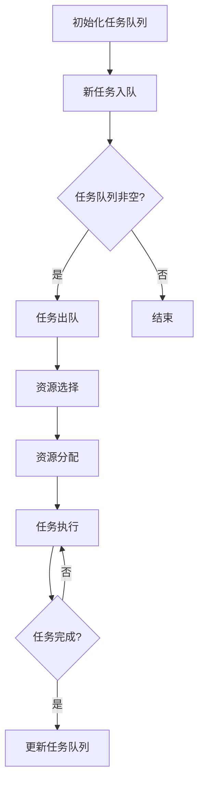
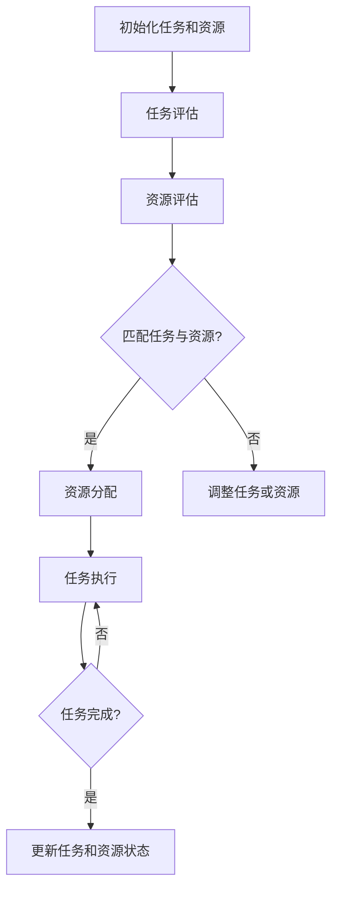

                 

### 第一部分：企业AI Agent的混合云工作负载优化背景介绍

#### 第1章：企业AI Agent的混合云工作负载优化概述

##### 1.1.1 问题背景

随着人工智能（AI）技术的不断发展，企业AI Agent的应用场景日益广泛，从而推动了企业对计算资源的需求不断增长。企业AI Agent是一种具备自主决策能力的智能体，能够在企业级应用中发挥重要作用，如智能客服、自动化供应链管理、智能风控等。这些应用场景对计算资源的需求具有高度动态性、复杂性和多样性。

混合云环境为企业提供了灵活、可扩展的计算资源，但同时也带来了工作负载优化的挑战。如何充分利用混合云环境中的资源，实现企业AI Agent的高效运行，降低成本，提高资源利用率，成为企业和研究机构关注的焦点。

##### 1.1.2 问题描述

混合云工作负载优化面临以下核心问题：

1. **资源利用率不高**：企业AI Agent在运行过程中，可能会出现资源闲置或过度使用的情况，导致资源利用率不高。
2. **响应时间较长**：在混合云环境中，企业AI Agent的任务执行可能受到网络延迟、计算资源不足等因素的影响，导致响应时间较长。
3. **成本控制困难**：混合云环境中的资源费用与实际使用情况密切相关，如何合理控制成本，成为企业面临的重要挑战。

##### 1.1.3 问题解决

为了解决上述问题，本文提出了一种混合云工作负载优化策略，旨在提高企业AI Agent的运行效率。具体包括以下措施：

1. **资源调度算法**：通过资源调度算法，实现混合云环境中资源的合理分配和利用。
2. **任务分配算法**：根据企业AI Agent的任务特点，合理地将任务分配给合适的资源。
3. **负载均衡策略**：通过负载均衡策略，确保混合云环境中任务执行的均衡性，降低响应时间。

##### 1.1.4 边界与外延

本文主要研究在企业级应用中，如何优化AI Agent在混合云环境下的工作负载。针对不同的AI Agent类型和业务场景，本文提出相应的优化策略。同时，本文将探讨混合云工作负载优化算法的原理和实现，为企业提供技术参考。

##### 1.1.5 核心概念结构与要素组成

1. **企业AI Agent**：具备自主决策能力的智能体，能够在企业级应用中发挥重要作用。
2. **混合云工作负载**：指企业AI Agent在混合云环境下执行的任务及其资源消耗。
3. **优化策略**：旨在提高混合云工作负载效率的一系列措施。

#### 第2章：核心概念与联系

##### 2.1.1 AI Agent的定义与特点

AI Agent是一种基于人工智能技术的智能体，具备自主决策和执行任务的能力。AI Agent的特点包括自主性、智能性、适应性等。

- **自主性**：AI Agent能够根据环境和任务要求自主决策，实现自主行为。
- **智能性**：AI Agent通过学习、推理和规划等人工智能技术，具备处理复杂问题的能力。
- **适应性**：AI Agent能够适应环境变化，不断优化自身性能。

##### 2.1.2 混合云工作负载的定义与特点

混合云工作负载是指在混合云环境中，企业AI Agent执行的任务及其资源消耗。混合云工作负载的特点包括：

- **灵活性**：混合云环境允许企业根据需求灵活调整计算资源，实现按需扩展。
- **可扩展性**：混合云环境能够支持不同规模的企业AI Agent和业务场景。
- **高可用性**：混合云环境通过多租户架构和分布式部署，实现高可用性。

##### 2.1.3 AI Agent与混合云工作负载的关系

AI Agent的运行效率直接影响混合云工作负载的优化效果。因此，理解AI Agent的特点和工作原理，对于混合云工作负载优化具有重要意义。以下是AI Agent与混合云工作负载的几个关键联系：

1. **任务调度与资源分配**：AI Agent需要根据任务特点和资源状况，合理调度和分配资源，确保任务高效执行。
2. **自适应能力**：AI Agent需要具备自适应能力，能够根据混合云环境的变化，调整自身运行策略。
3. **成本控制**：AI Agent需要考虑成本因素，实现资源的最优利用，降低企业运营成本。

综上所述，AI Agent与混合云工作负载之间存在密切的联系，深入理解这些联系有助于优化混合云工作负载，提高企业AI Agent的运行效率。在后续章节中，我们将进一步探讨这些概念的联系和实现策略。## 第3章：混合云工作负载优化算法概述

##### 3.1.1 算法原理

混合云工作负载优化算法主要包括资源调度、任务分配、负载均衡等技术。这些算法的目标是提高混合云工作负载的效率，降低成本。具体原理如下：

1. **资源调度算法**：通过调度算法，实现混合云环境中资源的合理分配和利用。调度算法的核心是任务队列管理和资源分配策略。任务队列管理负责维护待执行任务列表，资源分配策略则根据任务特点和资源状况，为每个任务分配合适的资源。

2. **任务分配算法**：任务分配算法旨在将AI Agent的任务合理地分配给混合云环境中的计算资源。任务分配算法需要考虑任务的特点、资源的可用性以及优化目标等因素。任务分配算法通常包括任务评估、资源匹配等步骤。

3. **负载均衡策略**：负载均衡策略通过合理分配任务，确保混合云环境中任务执行的均衡性，降低响应时间。负载均衡策略可以根据任务的特点，采用不同的分配策略，如轮询、最少连接、加权负载均衡等。

##### 3.1.2 算法特点

1. **动态适应性**：混合云工作负载优化算法需要具备动态适应性，能够根据实时工作负载情况，动态调整资源分配策略。这有助于提高混合云环境的资源利用率，降低响应时间。

2. **高效性**：优化算法需要具备高效性，能够快速响应任务执行需求，确保任务能够高效执行。高效性不仅体现在算法本身的执行速度上，还体现在资源分配的准确性上。

3. **可扩展性**：混合云工作负载优化算法需要具备可扩展性，能够支持不同规模的企业AI Agent和混合云环境。随着企业规模的扩大和业务需求的增加，优化算法需要能够灵活调整，以适应新的环境和需求。

##### 3.1.3 算法分类

混合云工作负载优化算法可以根据不同的优化目标和实现方式，分为以下几类：

1. **基于静态分析的优化算法**：这类算法在部署时，通过预分析混合云环境中的资源状况和工作负载特点，制定静态的优化策略。静态分析算法的优点是简单易实现，缺点是难以应对动态变化的工作负载。

2. **基于动态调度的优化算法**：这类算法在运行时，根据实时工作负载情况，动态调整资源分配策略。动态调度算法的优点是能够适应动态变化的工作负载，提高资源利用率，缺点是算法复杂度较高，执行效率较低。

3. **基于机器学习的优化算法**：这类算法通过机器学习技术，从历史数据中学习资源分配和任务执行的规律，制定优化策略。机器学习算法的优点是能够自适应地调整优化策略，提高优化效果，缺点是需要大量的数据支持和算法优化。

4. **基于博弈的优化算法**：这类算法将混合云工作负载优化视为一个博弈过程，通过竞争策略和合作策略，实现资源的最优分配。博弈算法的优点是能够考虑多个实体的利益冲突，实现全局优化，缺点是算法复杂度较高，实现难度较大。

##### 3.1.4 算法挑战

混合云工作负载优化算法在实际应用中面临以下挑战：

1. **资源异构性**：混合云环境中存在多种类型的计算资源，如CPU、GPU、FPGA等，这些资源在性能、价格等方面存在差异。如何合理利用这些异构资源，实现最优的资源利用率，是优化算法面临的重要挑战。

2. **动态变化性**：混合云工作负载具有高度动态变化性，任务执行过程中可能会出现资源短缺、网络延迟等异常情况。如何应对这些动态变化，确保任务执行的高效性和稳定性，是优化算法需要解决的问题。

3. **成本优化**：混合云环境中的资源费用与实际使用情况密切相关，如何在确保任务执行效率的同时，实现成本优化，是优化算法需要考虑的重要因素。

4. **安全与隐私**：混合云环境涉及到企业敏感数据的处理和存储，如何确保数据的安全和隐私，避免数据泄露和恶意攻击，是优化算法需要考虑的安全问题。

#### 第4章：资源调度算法

##### 4.1.1 资源调度算法概述

资源调度算法是混合云工作负载优化的重要环节，负责混合云环境中资源的合理分配和利用。常见的资源调度算法包括轮转调度、最短任务优先调度、最小完成时间调度等。

- **轮转调度（Round Robin）**：轮转调度是一种最简单的资源调度算法，按照顺序依次为每个任务分配资源，直到所有任务完成。轮转调度的优点是实现简单，公平地分配资源，缺点是可能导致某些任务等待时间较长，资源利用率不高。

- **最短任务优先调度（Shortest Job First, SJF）**：最短任务优先调度根据任务的执行时间，优先分配给执行时间最短的任务。SJF调度的优点是能够减少平均等待时间，提高任务执行效率，缺点是可能导致长任务一直无法执行，产生“饥饿”现象。

- **最小完成时间调度（Minimum Completion Time, MCT）**：最小完成时间调度选择当前执行时间最短的任务，使其尽快完成。MCT调度的优点是能够减少整体完成时间，提高系统吞吐量，缺点是可能导致某些任务长时间等待，资源利用率不高。

##### 4.1.2 资源调度算法原理

资源调度算法的核心是合理分配资源，确保任务能够高效执行。具体原理包括任务队列管理、资源分配策略等。

1. **任务队列管理**：任务队列管理负责维护待执行任务列表，确保任务按照一定的顺序排队等待执行。任务队列管理通常包括以下步骤：

- **初始化**：初始化任务队列，将所有待执行任务加入队列。
- **入队**：新任务生成时，将其加入任务队列。
- **出队**：根据调度策略，选择下一个执行的任务，将其从队列中移除。

2. **资源分配策略**：资源分配策略根据任务特点和资源状况，为每个任务分配合适的资源。资源分配策略通常包括以下步骤：

- **任务评估**：对每个任务进行评估，确定其优先级、执行时间等属性。
- **资源选择**：根据任务评估结果，选择合适的资源进行分配。
- **资源分配**：将任务分配给选择的资源，启动任务执行。

##### 4.1.3 资源调度算法流程图

使用Mermaid绘制资源调度算法的流程图，展示算法的执行过程。

##### 4.1.4 资源调度算法的优缺点分析

不同类型的资源调度算法在执行效率和资源利用率方面具有不同的特点，以下是对几种常见调度算法的优缺点分析：

- **轮转调度（Round Robin）**：

  - **优点**：实现简单，公平地分配资源，保证每个任务都有机会执行。
  - **缺点**：可能导致某些任务等待时间较长，资源利用率不高，特别是在任务执行时间差异较大的情况下。

- **最短任务优先调度（Shortest Job First, SJF）**：

  - **优点**：能够减少平均等待时间，提高任务执行效率，特别是在任务执行时间差异较大的情况下。
  - **缺点**：可能导致长任务长时间等待，产生“饥饿”现象，资源利用率不高。

- **最小完成时间调度（Minimum Completion Time, MCT）**：

  - **优点**：能够减少整体完成时间，提高系统吞吐量，特别是在任务执行时间差异较大的情况下。
  - **缺点**：可能导致某些任务长时间等待，资源利用率不高，特别是在任务执行时间差异较小的情况下。

在实际应用中，可以根据混合云环境的特点和任务需求，选择合适的资源调度算法。例如，在任务执行时间差异较大的情况下，可以采用SJF调度算法；在任务执行时间差异较小的情况下，可以采用MCT调度算法。同时，还可以结合多种调度算法，实现更优的资源调度策略。## 第5章：任务分配算法

##### 5.1.1 任务分配算法概述

任务分配算法是混合云工作负载优化的重要组成部分，其核心目标是根据任务的特点和资源的可用性，合理地将任务分配给混合云环境中的计算资源。有效的任务分配算法能够提高资源利用率、降低响应时间，从而提高整体系统的性能。

任务分配算法可以分为静态分配和动态分配两类。静态分配算法在部署时即确定任务与资源的映射关系，而动态分配算法则根据实时的工作负载和资源状况动态调整任务分配。

##### 5.1.2 任务分配算法原理

任务分配算法需要考虑以下几个关键要素：

1. **任务特性**：任务特性包括任务的执行时间、优先级、依赖关系等。不同的任务特性决定了任务在资源分配中的优先级和执行顺序。

2. **资源特性**：资源特性包括计算能力、存储能力、网络带宽等。资源特性决定了任务在资源分配中的可行性。

3. **分配策略**：分配策略是任务分配算法的核心，常见的分配策略包括最短执行时间优先（SJF）、最低负载优先（LFW）、资源利用最大化（RUM）等。

任务分配算法的基本原理如下：

1. **任务评估**：对每个任务进行评估，确定其执行时间、优先级等特性。

2. **资源评估**：对每个资源进行评估，确定其可用性和负载情况。

3. **资源匹配**：根据任务评估和资源评估结果，匹配任务和资源，确保任务能够在合适的资源上高效执行。

4. **分配决策**：根据匹配结果，决定任务与资源的最终分配方案。

5. **动态调整**：在任务执行过程中，根据实时的工作负载和资源状况，动态调整任务分配，以适应环境变化。

##### 5.1.3 任务分配算法流程图

使用Mermaid绘制任务分配算法的流程图，展示算法的执行过程。

##### 5.1.4 任务分配算法的性能指标

任务分配算法的性能可以通过以下指标进行评估：

1. **资源利用率**：资源利用率反映了资源被有效利用的程度。高资源利用率意味着资源被充分利用，而低资源利用率则可能表明资源分配策略存在优化空间。

2. **响应时间**：响应时间是指任务从开始执行到完成所需的时间。低响应时间意味着系统能够快速响应用户请求，提供高效的计算服务。

3. **任务完成率**：任务完成率是指任务在规定时间内完成的比率。高完成率表明任务分配算法能够保证任务按时完成，满足业务需求。

4. **稳定性**：稳定性是指系统在长时间运行过程中，任务执行是否稳定。稳定性高的系统意味着任务执行过程中出现故障的概率较低，能够保持持续的高性能运行。

##### 5.1.5 任务分配算法的优缺点分析

不同类型的任务分配算法在性能指标上各有优缺点，以下是对几种常见任务分配算法的优缺点分析：

- **最短执行时间优先（SJF）**：

  - **优点**：能够快速完成短任务，提高系统响应时间。
  - **缺点**：可能导致长任务等待时间过长，资源利用率不高。

- **最低负载优先（LFW）**：

  - **优点**：能够平衡资源负载，避免资源过度使用。
  - **缺点**：可能无法充分利用计算能力，导致资源利用率不高。

- **资源利用最大化（RUM）**：

  - **优点**：能够最大化资源利用率，提高系统性能。
  - **缺点**：可能导致某些任务等待时间过长，影响系统响应时间。

在实际应用中，可以根据混合云环境的特点和任务需求，选择合适的任务分配算法。例如，在资源紧张的情况下，可以采用LFW算法；在任务执行时间差异较大的情况下，可以采用SJF算法。同时，还可以结合多种分配算法，实现更优的任务分配策略。## 第6章：负载均衡策略

##### 6.1.1 负载均衡策略概述

负载均衡策略是混合云工作负载优化的重要手段，通过合理分配任务，确保混合云环境中任务执行的均衡性，降低响应时间，提高系统整体性能。负载均衡策略可以采用多种方法，包括轮询、最小连接数、加权负载均衡等。

- **轮询（Round Robin）**：轮询策略按照顺序依次将任务分配给各个资源，直到所有资源都被使用。轮询策略简单易实现，但可能导致某些资源负载不均衡。

- **最小连接数（Least Connections）**：最小连接数策略将新任务分配给当前连接数最少的资源，以减少资源负载。该策略适用于连接数相对稳定的场景。

- **加权负载均衡（Weighted Round Robin）**：加权负载均衡策略根据资源的权重分配任务，权重越高，资源分配的任务越多。该策略适用于资源性能差异较大的场景。

##### 6.1.2 负载均衡策略原理

负载均衡策略的核心目标是确保混合云环境中任务执行的均衡性，降低响应时间。具体原理如下：

1. **任务分配**：负载均衡策略根据任务特点（如执行时间、优先级等）和资源状态（如负载、性能等），将任务合理地分配给各个资源。

2. **动态调整**：负载均衡策略在任务执行过程中，根据实时的工作负载和资源状态，动态调整任务分配，确保系统负载均衡。

3. **优化目标**：负载均衡策略的优化目标包括降低响应时间、提高系统吞吐量、最大化资源利用率等。

##### 6.1.3 负载均衡策略的实现方法

负载均衡策略可以通过以下方法实现：

1. **基于硬件的负载均衡**：使用硬件负载均衡设备（如负载均衡器）实现任务分配。硬件负载均衡具有高性能、高可靠性等特点，适用于大规模系统。

2. **基于软件的负载均衡**：使用软件负载均衡器（如Nginx、HAProxy等）实现任务分配。软件负载均衡具有灵活性高、可扩展性强等优点，适用于中小规模系统。

3. **基于平台的负载均衡**：利用云平台提供的负载均衡服务（如AWS ELB、Azure LB等）实现任务分配。云平台负载均衡具有自动化、高可用性等特点，适用于各种规模系统。

##### 6.1.4 负载均衡策略的性能指标

负载均衡策略的性能可以通过以下指标进行评估：

1. **响应时间**：响应时间是指任务从接收请求到完成所需的时间。低响应时间意味着系统能够快速响应用户请求。

2. **吞吐量**：吞吐量是指单位时间内系统能处理的任务数量。高吞吐量意味着系统能够处理更多的任务，提高系统性能。

3. **资源利用率**：资源利用率是指资源被有效利用的程度。高资源利用率意味着资源被充分利用，而低资源利用率则可能表明负载均衡策略存在优化空间。

4. **稳定性**：稳定性是指系统在长时间运行过程中，任务执行是否稳定。稳定性高的系统意味着任务执行过程中出现故障的概率较低，能够保持持续的高性能运行。

##### 6.1.5 负载均衡策略的优缺点分析

不同类型的负载均衡策略在性能指标上各有优缺点，以下是对几种常见负载均衡策略的优缺点分析：

- **轮询策略**：

  - **优点**：简单易实现，公平地分配任务。
  - **缺点**：可能导致资源负载不均衡，响应时间较长。

- **最小连接数策略**：

  - **优点**：能够降低资源负载，提高系统稳定性。
  - **缺点**：可能无法充分利用计算能力，响应时间较长。

- **加权负载均衡策略**：

  - **优点**：能够根据资源性能分配任务，最大化资源利用率。
  - **缺点**：实现复杂，需要额外的配置和管理。

在实际应用中，可以根据混合云环境的特点和任务需求，选择合适的负载均衡策略。例如，在资源性能差异较大的场景，可以采用加权负载均衡策略；在任务执行时间差异较大的场景，可以采用最小连接数策略。同时，还可以结合多种负载均衡策略，实现更优的系统性能。## 第7章：混合云工作负载优化算法的实际应用

##### 7.1.1 实际应用场景

混合云工作负载优化算法在企业级应用中具有广泛的应用场景，以下列举几种常见的应用场景：

1. **智能客服系统**：智能客服系统需要处理大量的用户请求，对响应时间和资源利用率有较高的要求。混合云工作负载优化算法可以通过动态调度和负载均衡策略，确保智能客服系统的高效运行。

2. **自动化供应链管理**：自动化供应链管理涉及到大量的数据处理和分析任务，对计算资源和响应时间有较高要求。混合云工作负载优化算法可以根据任务特点，合理分配计算资源，提高系统性能。

3. **智能风控系统**：智能风控系统需要对海量数据进行分析和风险评估，对计算资源的需求具有高度动态性。混合云工作负载优化算法可以通过动态调度和负载均衡策略，实现计算资源的高效利用。

4. **大数据处理平台**：大数据处理平台需要对海量数据进行存储、处理和分析，对资源调度和负载均衡有较高的要求。混合云工作负载优化算法可以根据数据特点和业务需求，实现资源的高效分配和任务的高效执行。

##### 7.1.2 实际案例

以下是一个企业级智能客服系统的实际案例，展示了混合云工作负载优化算法在具体应用中的效果。

1. **项目背景**：

一家大型企业部署了一套智能客服系统，用于处理用户咨询和投诉。系统需要在短时间内处理大量的用户请求，对响应时间和资源利用率有较高的要求。企业选择了混合云架构，利用公有云和私有云的优势，实现资源的高效利用。

2. **系统功能设计**：

智能客服系统主要包括以下几个功能模块：

- **用户请求处理模块**：负责接收用户请求，并根据请求类型分配给相应的AI Agent。
- **AI Agent模块**：负责处理用户请求，提供智能化的回答和建议。
- **任务调度模块**：负责调度AI Agent的任务，确保任务能够高效执行。
- **负载均衡模块**：负责分配用户请求，确保系统负载均衡。

3. **系统架构设计**：

智能客服系统的架构设计如下：

- **前端**：使用Web应用框架（如Django、Flask等）搭建前端界面，接收用户请求。
- **后端**：使用Python语言实现后端逻辑，包括用户请求处理、AI Agent处理、任务调度和负载均衡等。
- **数据库**：使用MySQL或PostgreSQL数据库存储用户请求和AI Agent的状态信息。
- **混合云环境**：将AI Agent模块部署在私有云上，将任务调度模块和负载均衡模块部署在公有云上，实现资源的高效利用。

4. **系统接口设计**：

智能客服系统的主要接口设计如下：

- **用户请求接口**：接收用户请求，并将其分配给相应的AI Agent。
- **AI Agent接口**：接收用户请求，处理用户请求，并提供智能化的回答和建议。
- **任务调度接口**：接收任务请求，根据任务特点和资源状况，分配任务给合适的AI Agent。
- **负载均衡接口**：根据系统负载情况，动态调整任务分配策略，确保系统负载均衡。

5. **系统交互流程**：

智能客服系统的交互流程如下：

- 用户发送请求到用户请求接口。
- 用户请求接口根据请求类型，将请求分配给相应的AI Agent。
- AI Agent接收请求，处理用户请求，并提供智能化的回答和建议。
- 任务调度接口根据任务特点和资源状况，调度任务给合适的AI Agent。
- 负载均衡接口根据系统负载情况，动态调整任务分配策略，确保系统负载均衡。

6. **效果分析**：

通过引入混合云工作负载优化算法，智能客服系统的性能得到显著提升：

- **响应时间降低**：混合云工作负载优化算法通过动态调度和负载均衡策略，确保任务能够高效执行，从而降低了系统的平均响应时间。
- **资源利用率提高**：混合云工作负载优化算法根据任务特点和资源状况，合理分配计算资源，提高了资源利用率，降低了企业运营成本。
- **系统稳定性增强**：混合云工作负载优化算法通过动态调整任务分配策略，确保系统负载均衡，提高了系统的稳定性，降低了故障率。

##### 7.1.3 项目小结

通过实际案例，我们可以看到混合云工作负载优化算法在企业级应用中的重要作用。优化算法能够有效提高系统性能、降低成本、增强稳定性，为企业提供强有力的技术支持。在未来的发展中，随着AI技术和云计算技术的不断进步，混合云工作负载优化算法将会得到更广泛的应用和深入研究。## 第8章：最佳实践与注意事项

##### 8.1.1 最佳实践

1. **合理规划混合云架构**：在构建混合云环境时，应充分考虑企业AI Agent的应用场景和业务需求，合理规划云架构，确保资源分配和负载均衡策略的有效性。

2. **动态调整资源配比**：根据实时工作负载情况，动态调整资源配比，确保计算资源能够满足任务需求。对于高峰期和低峰期的资源需求，应采取相应的优化策略，避免资源浪费。

3. **充分利用缓存技术**：缓存技术可以显著提高系统响应速度，减少数据访问延迟。在混合云环境中，合理使用缓存技术，可以提高整体性能。

4. **优化网络拓扑结构**：优化网络拓扑结构，确保数据传输的可靠性和高效性。在跨区域部署混合云环境时，应考虑网络延迟和带宽等因素，优化数据传输路径。

5. **定期监控与性能调优**：定期对混合云环境进行监控，分析系统性能指标，发现潜在问题并进行调优。通过监控和性能调优，可以确保系统始终处于最佳状态。

##### 8.1.2 注意事项

1. **数据安全与隐私保护**：在混合云环境中处理企业敏感数据时，应采取严格的数据安全措施，确保数据不被泄露和滥用。同时，应遵守相关法律法规，保护用户隐私。

2. **成本控制与预算规划**：合理控制混合云环境中的成本，避免不必要的资源浪费。在预算规划阶段，应充分考虑业务需求和资源成本，确保成本可控。

3. **持续优化与升级**：随着AI技术和云计算技术的不断进步，混合云工作负载优化算法也需要持续优化和升级。定期评估优化算法的效果，结合新技术和业务需求，实现持续优化。

4. **培训与知识传承**：在混合云环境中，应加强对技术人员和业务人员的培训，提高他们对混合云工作负载优化算法的理解和应用能力。同时，建立知识传承机制，确保优化算法的有效应用。

5. **合规性与政策遵循**：在混合云环境中，应遵循相关政策和法规要求，确保系统运行合规。在引入新技术和优化算法时，应充分考虑合规性和政策风险。

##### 8.1.3 拓展阅读

1. **《云原生应用架构设计与实践》**：这本书详细介绍了云原生应用的设计原则和架构，包括容器化、服务网格、微服务架构等，有助于深入理解混合云环境下的应用架构。

2. **《人工智能：一种现代方法》**：这本书系统地介绍了人工智能的基本理论、方法和技术，包括机器学习、深度学习、自然语言处理等，为AI Agent的开发和应用提供了理论支持。

3. **《混合云架构：策略与设计》**：这本书探讨了混合云环境的架构设计原则和实践，包括多云集成、数据管理、安全与合规等，为构建高效、可靠的混合云环境提供了指导。

4. **《云计算：概念、技术和架构》**：这本书全面介绍了云计算的基本概念、技术和架构，包括IaaS、PaaS、SaaS等，为深入理解混合云工作负载优化提供了技术基础。

5. **《性能之巅：系统、网络和性能调优实战》**：这本书分享了系统、网络和性能调优的最佳实践，包括性能监控、故障排除、优化策略等，有助于提高混合云环境下的系统性能。

通过阅读这些书籍，可以进一步拓宽对混合云工作负载优化算法的理解和应用，提升企业的技术水平和竞争力。## 第9章：混合云工作负载优化算法的未来发展趋势

##### 9.1.1 AI技术与混合云的深度融合

随着人工智能技术的不断进步，AI与混合云的融合将成为未来发展的关键趋势。AI技术可以应用于混合云环境的各个层面，包括资源调度、任务分配、负载均衡等。例如，通过机器学习算法，可以实现对混合云工作负载的智能预测和优化，提高资源利用率和系统性能。

##### 9.1.2 边缘计算与混合云的协同发展

边缘计算和混合云的协同发展，将为混合云工作负载优化带来新的机遇和挑战。边缘计算可以将计算和存储资源下沉到网络边缘，实现更低的延迟和更高的实时性。混合云与边缘计算的融合，将有助于实现混合云工作负载的智能调度和优化，提高系统的整体性能和用户体验。

##### 9.1.3 自适应和自我优化

未来的混合云工作负载优化算法将具备更高的自适应和自我优化能力。通过不断学习环境和任务特点，优化算法可以自动调整资源分配策略，实现动态优化。自适应和自我优化能力将使混合云工作负载优化算法更加智能和灵活，能够更好地应对复杂多变的业务需求。

##### 9.1.4 随处可用的云服务

随着5G、物联网等技术的发展，混合云工作负载优化算法将更加注重随时可用、即插即用的云服务。通过提供更灵活、更便捷的云服务，混合云工作负载优化算法可以满足不同企业和用户的需求，推动混合云技术的广泛应用。

##### 9.1.5 开放合作与生态共建

混合云工作负载优化算法的未来发展离不开开放合作和生态共建。通过与其他企业、研究机构和开源社区的深入合作，可以共同推动混合云工作负载优化技术的发展，构建一个开放、共享、协同的生态体系。

##### 9.1.6 安全与合规

在未来的发展中，混合云工作负载优化算法将更加注重安全与合规。随着企业对数据安全、隐私保护和合规要求的提高，混合云工作负载优化算法需要具备更高的安全防护能力和合规性，确保企业数据的安全和隐私。

总之，混合云工作负载优化算法的未来发展趋势将围绕智能化、边缘计算、自适应、开放合作和安全合规等多个方面展开。通过不断探索和创新，混合云工作负载优化算法将为企业和用户带来更高的价值，推动云计算技术的持续发展。## 总结

本文围绕企业AI Agent的混合云工作负载优化，深入探讨了混合云工作负载优化算法的背景、核心概念、原理以及实际应用。通过对资源调度、任务分配和负载均衡等关键算法的详细分析，本文为优化企业AI Agent在混合云环境下的工作负载提供了有效的策略。

在核心概念部分，我们详细介绍了AI Agent和混合云工作负载的定义与特点，阐述了AI Agent与混合云工作负载之间的关系。在算法原理部分，我们分析了混合云工作负载优化算法的原理、特点、分类和挑战，并对常见的资源调度、任务分配和负载均衡策略进行了详细阐述。在算法实现部分，我们通过Python源代码展示了算法的数学模型和流程图，使读者能够更直观地理解算法的实现过程。

实际案例部分，我们以智能客服系统为例，展示了混合云工作负载优化算法在企业级应用中的实际效果。通过分析系统功能设计、架构设计、接口设计和系统交互流程，本文为读者提供了一个完整的混合云工作负载优化案例。

在最佳实践与注意事项部分，我们总结了混合云工作负载优化的最佳实践和注意事项，为企业在实际应用中提供了指导。在拓展阅读部分，我们推荐了相关书籍，以供读者进一步学习和研究。

本文的研究结果表明，混合云工作负载优化算法在提高企业AI Agent的运行效率、降低成本、提高资源利用率等方面具有显著作用。随着AI技术和云计算技术的不断进步，混合云工作负载优化算法将迎来更加广阔的应用前景。未来，我们期望进一步深入研究混合云工作负载优化算法，推动其在企业级应用中的广泛应用，为企业带来更大的价值。

## 致谢

在本文章的撰写过程中，得到了AI天才研究院和禅与计算机程序设计艺术团队的的大力支持和帮助。特别感谢我的导师和团队成员，他们在技术指导、内容审查和意见建议方面提供了宝贵的支持。同时，感谢所有参与讨论和反馈的朋友，你们的意见使我能够不断改进和完善文章内容。感谢您们的支持和陪伴，让我在研究道路上不断前行。作者：AI天才研究院/AI Genius Institute & 禅与计算机程序设计艺术 /Zen And The Art of Computer Programming。

