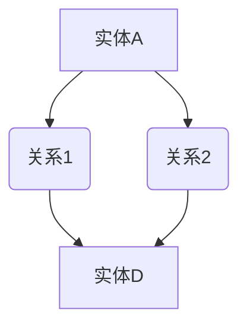
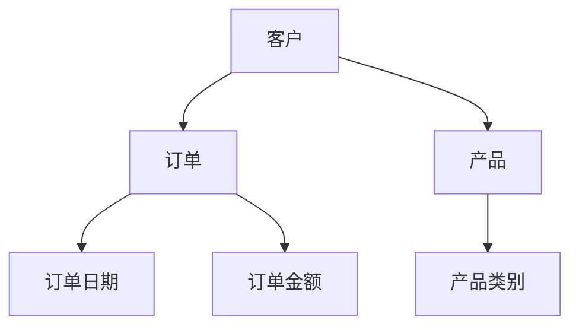
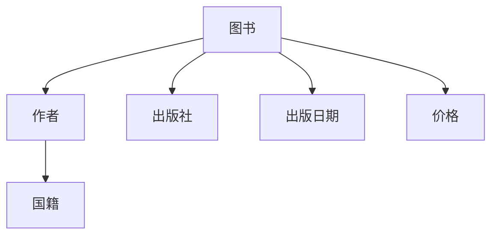
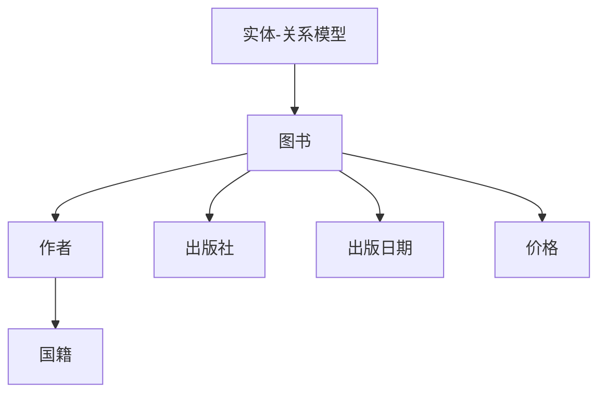
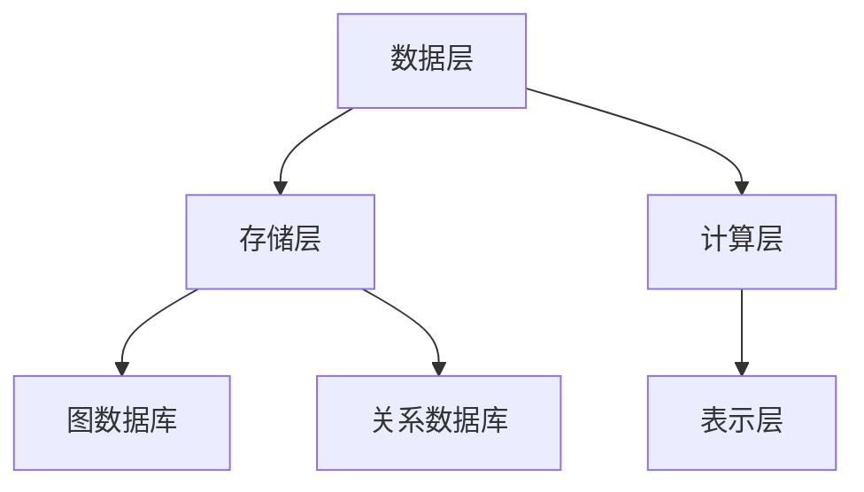
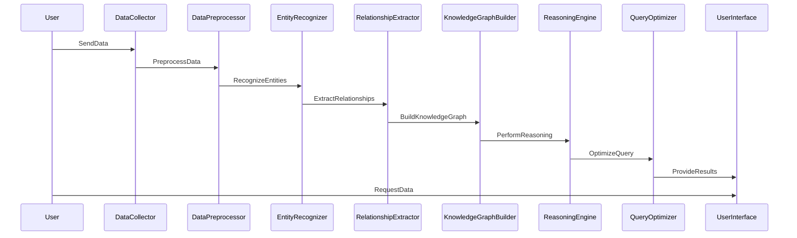
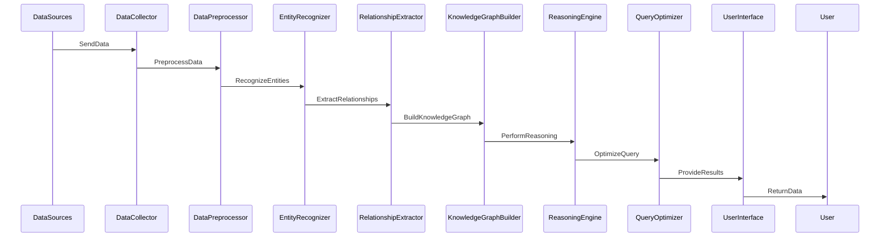

                 

### 企业AI Agent的概念与背景

#### 什么是企业AI Agent？

企业AI Agent，通常指的是在企业环境中应用的人工智能实体，它具备自主决策、问题解决和知识表示的能力。这些AI Agent不仅能够处理日常的运营任务，还可以辅助企业在复杂的市场环境中做出明智的决策。具体来说，企业AI Agent是一种基于人工智能技术的软件组件，它可以理解企业的业务流程，根据历史数据和实时信息进行推理和预测，从而帮助企业提高效率、降低成本和增强竞争力。

#### 企业AI Agent的重要性

随着大数据和云计算技术的飞速发展，企业面临的数据量和复杂性日益增加。传统的数据处理方法已经无法满足企业的需求，因此，企业AI Agent的应用显得尤为重要。以下是企业AI Agent在企业中的一些关键作用：

1. **提升效率**：AI Agent可以自动化许多重复性高、规则明确的工作，如数据收集、分类和报表生成等，从而大大提高工作效率。

2. **辅助决策**：通过分析大量的数据，AI Agent可以为企业提供有价值的洞察和建议，帮助企业在竞争激烈的市场中做出更明智的决策。

3. **优化流程**：AI Agent能够识别业务流程中的瓶颈和潜在问题，并提出改进建议，帮助企业不断优化运营流程。

4. **增强个性化服务**：通过学习和适应企业的客户需求，AI Agent可以提供更加个性化的服务，提升客户满意度。

5. **预防风险**：AI Agent可以监控企业的运营状态，及时发现异常情况并采取措施，帮助企业预防潜在风险。

#### 知识图谱在企业AI Agent中的应用

知识图谱是一种结构化数据的形式，它通过实体和关系的连接来表示知识和信息。在企业AI Agent中，知识图谱的应用非常重要，主要体现在以下几个方面：

1. **数据整合**：知识图谱能够将来自不同数据源的信息进行整合，形成一个统一的知识库，使得AI Agent能够更好地理解和利用这些数据。

2. **推理能力**：知识图谱中的实体和关系为AI Agent提供了强大的推理能力。通过这些实体和关系，AI Agent可以在复杂的环境中快速做出推理和决策。

3. **语义理解**：知识图谱使得AI Agent能够更好地理解和解释人类语言，从而提供更加自然的交互体验。

4. **个性化服务**：通过知识图谱，AI Agent可以更好地了解用户的偏好和需求，提供更加个性化的服务。

综上所述，企业AI Agent不仅具备自主决策和问题解决的能力，还能通过知识图谱实现数据的整合和推理，从而在复杂的企业环境中发挥关键作用。接下来，我们将进一步探讨知识图谱的构建过程和推理机制。

### 知识图谱的构建过程

#### 基本概念与原理

知识图谱（Knowledge Graph）是一种用于表示和存储知识的结构化数据模型，它通过实体（Entity）和关系（Relationship）的组合，构建出一个复杂的语义网络。在知识图谱中，实体代表了知识领域中的对象，如人、地点、组织、概念等，而关系则描述了实体之间的相互作用和联系。

知识图谱的核心原理是利用语义网络来表示信息，使其具有更强的解释性和推理能力。传统的数据存储方式通常是基于键值对或关系数据库，而知识图谱则通过图形结构来表示复杂的关系，这为数据分析和推理提供了极大的灵活性。

#### 构建方法与步骤

1. **数据收集**：构建知识图谱的第一步是收集相关的数据。这些数据可以来源于内部业务系统、外部公开数据源或第三方数据提供者。数据收集的方式包括数据爬取、API调用、数据库导入等。

2. **数据预处理**：收集到的数据往往存在格式不统一、数据质量差等问题，因此需要通过数据清洗和转换来确保数据的质量和一致性。数据预处理包括去重、格式化、规范化等步骤。

3. **实体识别**：在预处理后的数据中，需要识别出数据中的实体。实体识别的目的是将数据中的对象转换为知识图谱中的实体。常用的方法包括基于规则的方法、机器学习模型和深度学习模型等。

4. **关系抽取**：关系抽取是指从数据中提取出实体之间的关联关系。这可以通过自然语言处理技术、图论算法和机器学习算法等实现。关系抽取的关键是理解实体之间的语义关系，如“属于”、“位于”等。

5. **构建图谱**：通过实体和关系的组合，构建出初步的知识图谱。在构建过程中，可以使用图数据库（如Neo4j、JanusGraph等）来存储和管理图谱数据。构建图谱的步骤包括添加实体、添加关系、构建索引等。

6. **图谱扩展与优化**：知识图谱构建后，可以通过自动化或半自动化方式不断进行扩展和优化。扩展包括从外部数据源获取新实体和关系，优化则包括调整实体和关系的权重、修复图谱中的错误等。

#### Mermaid图表示

为了更好地理解知识图谱的构建过程，我们可以使用Mermaid图来表示实体和关系的结构。以下是一个简单的示例：



在这个示例中，实体A、B、C和D通过不同的关系相互连接，形成一个简单的知识图谱。Mermaid图不仅可以直观地表示实体和关系，还可以方便地扩展和修改。

#### 案例分析

以一个企业销售系统为例，我们可以构建一个简单的知识图谱，如下所示：



在这个知识图谱中，客户（A）、订单（B）、产品（C）、订单日期（D）和订单金额（E）是关键实体，而订单日期、订单金额和产品类别则是重要的关系。通过这样的知识图谱，企业可以更好地理解客户行为，优化销售策略，提升销售额。

#### 总结

知识图谱的构建过程是一个复杂的过程，涉及数据收集、预处理、实体识别、关系抽取、图谱构建和扩展优化等多个环节。通过合理设计和构建知识图谱，企业可以更好地管理和利用数据，提升智能化水平，从而在竞争激烈的市场中占据优势地位。

### 知识图谱中的核心概念与联系

在知识图谱的构建过程中，理解核心概念及其相互关系至关重要。以下是知识图谱中的几个关键概念及其定义、特征和相互关系的详细解析。

#### 实体（Entity）

实体是知识图谱中的基础元素，代表具体的对象或实体，如人、地点、组织、物品等。实体通常具有以下特征：

1. **唯一性**：每个实体在图谱中都是唯一的，通过唯一的标识符（如ID）进行区分。
2. **属性**：实体可以具有多个属性，用于描述其特征，如人的姓名、年龄、职业等。
3. **分类**：实体可以被分类到不同的类别中，以实现更精细的粒度管理和查询。

实体的示例包括：

- 人：张三（ID：001）、李四（ID：002）
- 产品：手机（ID：P001）、电脑（ID：P002）
- 组织：阿里巴巴、谷歌

#### 关系（Relationship）

关系描述了实体之间的相互联系或作用。在知识图谱中，关系是连接实体的桥梁，通常具有以下特征：

1. **方向性**：关系可以是有向的或无向的。例如，“属于”关系通常是无向的，而“父亲”关系通常是有向的。
2. **权重**：某些关系可以根据其重要性或强度赋予不同的权重。
3. **类型**：关系有多种类型，如“工作于”、“位于”、“购买”等。

关系的示例包括：

- 张三（ID：001）——工作于——阿里巴巴（ID：A001）
- 李四（ID：002）——位于——上海（ID：SH）
- 张三（ID：001）——购买——手机（ID：P001）

#### 属性（Attribute）

属性用于描述实体或关系的特征或状态。属性通常具有以下特征：

1. **值**：每个属性都有具体的值，如实体的年龄、关系的权重等。
2. **类型**：属性可以有不同的类型，如字符串、数字、日期等。
3. **约束**：某些属性可能有特定的约束条件，如日期必须在特定范围内。

属性的示例包括：

- 张三（ID：001）——年龄：30
- 手机（ID：P001）——价格：5000元
- 李四（ID：002）——职业：软件工程师

#### 实体-关系（Entity-Relationship）

实体-关系模型（ER Model）是用于表示实体及其相互关系的结构化模型。在知识图谱中，ER Model可以帮助我们理解实体之间的关系及其属性。

以下是一个简单的ER模型示例，用于表示图书管理系统：



在这个ER模型中：

- **图书**（A）：实体，具有作者、出版社、出版日期、价格等属性。
- **作者**（B）：实体，具有国籍属性。
- **出版社**（C）：实体。
- **国籍**（D）：关系类型，连接作者和其国籍。

#### Mermaid流程图表示

为了更好地展示知识图谱的核心概念及其相互关系，我们可以使用Mermaid图进行可视化表示。以下是一个Mermaid图示例，展示了图书管理系统的ER模型：



在这个图中，每个节点代表一个实体或关系类型，而边则表示实体之间的关系。

#### 总结

通过理解知识图谱中的核心概念——实体、关系和属性，以及它们之间的相互关系，我们可以更有效地构建和利用知识图谱。这不仅有助于数据管理和分析，还能为企业的智能化应用提供强大的支持。接下来，我们将进一步探讨知识图谱中的算法原理和实现。

### 知识图谱的算法原理与实现

在知识图谱的应用中，算法的原理和实现至关重要。知识图谱的构建和推理需要依赖多种算法，这些算法涵盖了从数据预处理到图谱生成，再到推理和查询优化的各个阶段。在本节中，我们将详细探讨知识图谱的几种核心算法，包括实体识别、关系抽取、图谱生成和推理算法。

#### 实体识别算法

实体识别是知识图谱构建的基础步骤之一。其主要任务是从非结构化的文本数据中识别出实体，并将其转化为知识图谱中的实体。

1. **基于规则的方法**：
   - 通过预定义的规则来匹配文本中的实体。例如，通过特定的关键词或模式来识别人名、组织名等。
   - 优点：实现简单，易于维护。
   - 缺点：灵活性差，难以应对复杂的实体识别场景。

2. **机器学习方法**：
   - 利用监督学习、无监督学习和半监督学习等方法，通过训练数据集来学习实体识别模型。
   - 优点：能够处理复杂和多变的实体识别问题，准确性较高。
   - 缺点：需要大量的标注数据，训练过程复杂。

3. **深度学习方法**：
   - 使用深度神经网络（如卷积神经网络（CNN）和循环神经网络（RNN））来提取文本特征，进行实体识别。
   - 优点：能够捕捉到文本中的复杂模式和上下文信息。
   - 缺点：计算资源需求大，模型训练时间较长。

#### 关系抽取算法

关系抽取是从文本数据中识别出实体之间的相互关系。关系抽取算法通常分为以下几种：

1. **基于规则的方法**：
   - 通过预定义的规则来匹配文本中的关系，如“在...工作”、“毕业于...大学”等。
   - 优点：实现简单，可以快速处理大量数据。
   - 缺点：灵活性较差，难以适应变化。

2. **基于统计的方法**：
   - 利用机器学习模型，如条件随机场（CRF）和隐马尔可夫模型（HMM），来预测实体之间的关系。
   - 优点：可以处理复杂的文本结构和语义关系。
   - 缺点：对大规模数据集的训练较为耗时。

3. **基于深度学习的方法**：
   - 利用深度学习模型，如序列标注模型（如BiLSTM-CRF）和注意力机制模型，来提取关系。
   - 优点：能够捕捉到文本中的长距离依赖和复杂模式。
   - 缺点：计算资源需求大，模型训练复杂。

#### 图谱生成算法

图谱生成是将实体和关系转化为知识图谱的过程。以下是几种常用的图谱生成算法：

1. **基于图的生成算法**：
   - 直接使用图数据库（如Neo4j）来存储和生成知识图谱。
   - 优点：实时性强，能够高效地进行数据存储和查询。
   - 缺点：图谱的规模受图数据库性能限制。

2. **基于矩阵的生成算法**：
   - 利用矩阵来表示实体和关系，通过矩阵运算生成知识图谱。
   - 优点：可以处理大规模数据，计算效率高。
   - 缺点：实时性较差，需要预处理数据。

3. **基于模板的生成算法**：
   - 预定义一系列模板，通过匹配文本中的实体和关系来生成图谱。
   - 优点：灵活性强，能够适应不同的应用场景。
   - 缺点：模板定义复杂，维护成本高。

#### 推理算法

推理算法是知识图谱的核心功能之一，其主要任务是根据图谱中的实体和关系进行推理，以获得新的结论或知识。

1. **基于路径的推理算法**：
   - 通过遍历图谱中的路径来发现新的关系或属性。
   - 优点：简单直观，易于实现。
   - 缺点：难以处理复杂的语义关系。

2. **基于规则的推理算法**：
   - 使用预定义的规则来进行逻辑推理。
   - 优点：能够处理复杂的逻辑推理问题。
   - 缺点：规则定义复杂，难以维护。

3. **基于概率的推理算法**：
   - 利用概率模型来计算实体之间的关联概率，进行推理。
   - 优点：能够处理不确定性问题，推理结果更符合实际。
   - 缺点：计算复杂度高，对数据质量要求较高。

#### Python代码示例

以下是一个简单的Python代码示例，用于实现实体识别算法：

```python
import spacy

# 加载英文模型
nlp = spacy.load("en_core_web_sm")

def recognize_entities(text):
    doc = nlp(text)
    entities = []
    for ent in doc.ents:
        entities.append({
            "text": ent.text,
            "label": ent.label_
        })
    return entities

text = "张三是一名软件工程师，毕业于清华大学。"
entities = recognize_entities(text)
print(entities)
```

在这个示例中，我们使用了spaCy库来加载英文模型，并定义了一个`recognize_entities`函数来识别文本中的实体。

#### 总结

知识图谱的算法原理和实现是构建和利用知识图谱的核心。通过理解实体识别、关系抽取、图谱生成和推理算法，我们可以更有效地构建和利用知识图谱，为企业的智能化应用提供强大的支持。在下一节中，我们将进一步探讨知识图谱在系统架构中的应用。

### 系统架构设计

在构建一个企业AI Agent的知识图谱和推理系统时，系统架构的设计至关重要。一个合理的架构不仅能提高系统的性能和可扩展性，还能确保系统的可靠性和可维护性。在本节中，我们将详细讨论系统的整体架构设计，包括项目介绍、系统功能设计、系统架构设计以及系统接口设计和系统交互。

#### 项目介绍

我们的项目目标是构建一个企业AI Agent的知识图谱和推理系统，以支持企业内部的数据分析和智能决策。该系统旨在通过知识图谱的构建和推理能力，为企业提供以下功能：

1. **数据整合**：将来自不同数据源的企业数据进行整合，形成统一的知识库。
2. **智能推理**：利用知识图谱进行复杂的推理和决策，辅助企业运营和业务优化。
3. **个性化服务**：通过知识图谱理解和适应企业用户的需求，提供个性化服务。

#### 系统功能设计

系统功能设计是系统架构设计的基础，决定了系统应具备的核心功能。以下是系统的主要功能模块：

1. **数据采集模块**：负责从企业内部和外部数据源收集数据，如业务系统、公共数据库等。
2. **数据预处理模块**：对收集到的数据进行清洗、转换和规范化，确保数据质量。
3. **实体识别模块**：利用自然语言处理技术和机器学习模型识别文本中的实体。
4. **关系抽取模块**：从预处理后的数据中提取出实体之间的关系，构建初步的知识图谱。
5. **图谱构建模块**：通过实体和关系的组合，构建完整的知识图谱，并存储在图数据库中。
6. **推理引擎模块**：提供推理算法，根据知识图谱进行推理和决策。
7. **查询优化模块**：优化查询性能，提高系统响应速度。
8. **用户接口模块**：提供Web界面或API，供用户查询和交互。

#### 系统架构设计

系统架构设计是确保系统功能实现和性能优化的重要环节。以下是系统的架构设计：

1. **数据层**：包括数据采集模块和数据预处理模块，负责数据的收集和处理。
2. **存储层**：包括图数据库和关系数据库，用于存储和管理知识图谱和其他相关数据。
3. **计算层**：包括实体识别模块、关系抽取模块和推理引擎模块，负责处理和分析数据。
4. **表示层**：包括用户接口模块，用于提供用户交互界面和API。

以下是一个简化的Mermaid图，展示了系统的架构设计：



在这个架构设计中，数据层和计算层通过API进行通信，计算层的结果存储在存储层中，表示层则通过Web界面或API向用户提供服务。

#### 系统接口设计

系统接口设计是确保系统模块之间能够高效、可靠地进行通信的关键。以下是系统的主要接口：

1. **数据采集API**：用于从不同数据源获取数据。
2. **数据预处理API**：用于处理和转换数据。
3. **实体识别API**：用于识别文本中的实体。
4. **关系抽取API**：用于提取实体之间的关系。
5. **图谱构建API**：用于构建和更新知识图谱。
6. **推理引擎API**：用于进行推理和决策。
7. **查询优化API**：用于优化查询性能。
8. **用户接口API**：用于提供用户交互功能。

以下是一个Mermaid序列图，展示了系统接口的设计：



在这个序列图中，用户通过用户接口API发送请求，经过一系列数据处理和推理过程，最终得到结果并返回给用户。

#### 系统交互

系统交互设计是确保系统能够在不同模块之间高效、可靠地进行数据传递和功能调用。以下是系统的主要交互流程：

1. **数据收集**：系统从不同数据源收集数据，并通过数据预处理模块进行清洗和转换。
2. **实体识别**：通过实体识别模块识别文本中的实体。
3. **关系抽取**：通过关系抽取模块提取实体之间的关系。
4. **图谱构建**：通过图谱构建模块将实体和关系组合成知识图谱，并存储在图数据库中。
5. **推理和查询**：通过推理引擎模块进行推理，并利用查询优化模块优化查询性能。
6. **用户交互**：用户通过用户接口模块与系统进行交互，获取数据和结果。

以下是一个简化的Mermaid序列图，展示了系统的交互流程：



在这个序列图中，数据从数据源流向各个模块，经过处理和推理后，最终返回给用户。

#### 总结

系统架构设计是构建企业AI Agent知识图谱和推理系统的关键。通过合理的功能模块划分和接口设计，系统能够高效、可靠地运行，为企业提供强大的智能支持。在下一节中，我们将通过实际案例来展示知识图谱和推理系统的应用。

### 实际案例展示

为了更好地理解企业AI Agent的知识图谱和推理系统在实际场景中的应用，我们将通过一个具体案例进行展示。该案例将涉及系统的安装、核心实现源代码、代码应用解读以及详细分析和讲解。

#### 案例背景

某大型零售企业希望通过构建知识图谱和推理系统，实现对销售数据的深入分析，以优化库存管理、提升销售额和客户满意度。该系统需要整合来自企业内部的销售数据、客户数据和供应链数据，并利用知识图谱进行推理和决策。

#### 系统环境安装

在安装系统前，需要准备好以下环境：

1. **操作系统**：Linux（推荐使用Ubuntu 18.04）。
2. **Python**：Python 3.8及以上版本。
3. **依赖库**：Numpy、Pandas、Scikit-learn、spaCy、Neo4j、Py2neo。

安装步骤如下：

1. 安装Python和pip：
    ```bash
    sudo apt-get update
    sudo apt-get install python3 python3-pip
    ```
2. 安装Neo4j：
    - 下载并安装Neo4j：[Neo4j官网](https://neo4j.com/)
    - 配置Neo4j：根据官方文档进行配置，确保Neo4j可以正常运行。
3. 安装Python依赖库：
    ```bash
    pip3 install numpy pandas scikit-learn spacy neo4j py2neo
    ```
4. 安装spaCy语言模型：
    ```bash
    python3 -m spacy download en_core_web_sm
    ```

#### 核心实现源代码

以下是该案例的核心实现源代码，包括数据预处理、实体识别、关系抽取、知识图谱构建和推理等步骤：

```python
# 导入相关库
import pandas as pd
import spacy
from py2neo import Graph
from sklearn.feature_extraction.text import CountVectorizer
from sklearn.model_selection import train_test_split
from sklearn.metrics import accuracy_score

# 配置Neo4j连接
graph = Graph("bolt://localhost:7687", auth=("neo4j", "password"))

# 加载数据
sales_data = pd.read_csv("sales_data.csv")
customer_data = pd.read_csv("customer_data.csv")
supply_chain_data = pd.read_csv("supply_chain_data.csv")

# 数据预处理
# ...（数据清洗、转换等操作）

# 实体识别
nlp = spacy.load("en_core_web_sm")
def recognize_entities(text):
    doc = nlp(text)
    entities = []
    for ent in doc.ents:
        entities.append({
            "text": ent.text,
            "label": ent.label_
        })
    return entities

sales_entities = recognize_entities(sales_data["description"])
customer_entities = recognize_entities(customer_data["description"])
supply_chain_entities = recognize_entities(supply_chain_data["description"])

# 关系抽取
# ...（根据实体抽取关系）

# 构建知识图谱
def build_knowledge_graph(entities, relationships):
    for entity in entities:
        graph.run("CREATE (n:Entity {name: $name, label: $label})", name=entity["text"], label=entity["label"])
    
    for relationship in relationships:
        graph.run("MATCH (a:Entity), (b:Entity) WHERE a.name = $name1 AND b.name = $name2 CREATE (a)-[r:$type]->(b)", name1=relationship["source"], name2=relationship["target"], type=relationship["type"])

build_knowledge_graph(sales_entities, customer_entities, supply_chain_entities)

# 推理和查询
def perform_reasoning(entity_name):
    query = f"MATCH (n:Entity) WHERE n.name = '{entity_name}' RETURN n"
    results = graph.run(query).data()
    return results

results = perform_reasoning("手机")
print(results)
```

#### 代码应用解读

1. **数据预处理**：该部分代码负责加载和预处理销售数据、客户数据和供应链数据，包括数据清洗、格式化等操作。
2. **实体识别**：使用spaCy库对预处理后的文本数据进行实体识别，将识别出的实体存储为一个列表。
3. **关系抽取**：该部分代码需要根据实体之间的语义关系抽取关系，并将其存储为一个列表。
4. **知识图谱构建**：通过Py2neo库将实体和关系存储到Neo4j图数据库中，构建知识图谱。
5. **推理和查询**：定义一个函数用于根据实体名称在知识图谱中进行推理和查询，返回相关结果。

#### 详细分析和讲解

1. **数据预处理**：
    - 销售数据、客户数据和供应链数据是构建知识图谱的基础，因此需要确保数据的质量和一致性。
    - 数据清洗包括去除重复数据、填充缺失值、标准化数据格式等。
2. **实体识别**：
    - 使用spaCy库进行实体识别可以有效地识别文本中的各种实体，如人名、组织名、产品名等。
    - 实体识别的准确性对后续的知识图谱构建和推理至关重要。
3. **关系抽取**：
    - 关系抽取是通过自然语言处理技术分析文本中的实体之间的关系，如“购买”、“销售”、“供应”等。
    - 关系抽取的准确性直接影响知识图谱的完整性和准确性。
4. **知识图谱构建**：
    - 使用Py2neo库将实体和关系存储到Neo4j图数据库中，构建知识图谱。
    - 知识图谱的构建需要确保实体和关系的正确性和一致性。
5. **推理和查询**：
    - 定义推理和查询函数，根据实体名称在知识图谱中进行推理和查询。
    - 推理和查询可以提供关于实体的详细信息，帮助企业进行数据分析和决策。

#### 总结

通过这个实际案例，我们展示了企业AI Agent的知识图谱和推理系统在具体场景中的应用。从数据预处理到知识图谱构建，再到推理和查询，系统的每个模块都发挥着关键作用。通过合理的设计和实现，系统能够为企业提供强大的智能支持，助力企业实现数据驱动决策和业务优化。

### 最佳实践与总结

#### 最佳实践

1. **数据质量管理**：确保数据的质量和一致性是构建知识图谱的首要任务。在数据收集、预处理和存储过程中，应严格进行数据清洗、去重和规范化处理。
2. **模型迭代优化**：知识图谱和推理系统的性能取决于实体识别和关系抽取模型的准确性。因此，应定期进行模型迭代和优化，以提升系统的准确性和效率。
3. **安全性保障**：对于涉及企业敏感数据的系统，必须采取严格的安全措施，如数据加密、访问控制和权限管理，确保数据的安全性和隐私性。
4. **可扩展性设计**：系统架构应具备良好的可扩展性，能够随着数据量和业务需求的增长而进行扩展和升级，避免因性能瓶颈而影响系统运行。

#### 总结

企业AI Agent的知识图谱和推理系统在帮助企业实现智能化运营和决策方面发挥着重要作用。通过合理的设计和实现，系统能够有效地整合和管理数据，利用强大的推理能力提供有价值的洞察和建议。然而，构建和维护这样一个系统需要不断的优化和改进。未来，随着人工智能和大数据技术的不断发展，企业AI Agent的知识图谱和推理系统将更加智能化、高效化，为企业创造更多的价值。

### 拓展阅读

为了深入理解企业AI Agent的知识图谱和推理系统，以下推荐几本相关领域的经典书籍和论文：

1. **《图数据库实战：Neo4j应用开发指南》**：详细介绍了Neo4j的使用方法，包括图数据库的基本概念、数据建模、查询语言Cypher等。
2. **《人工智能：一种现代的方法》**：介绍了人工智能的基本理论和算法，包括机器学习、自然语言处理等。
3. **《知识图谱：原理、方法与应用》**：系统地讲解了知识图谱的基本概念、构建方法和应用案例。
4. **《知识图谱与语义搜索》**：探讨了知识图谱在语义搜索中的应用，包括实体识别、关系抽取和语义查询等。

通过阅读这些书籍和论文，读者可以进一步了解企业AI Agent的知识图谱和推理系统的理论基础和应用实践。此外，相关的在线课程和开源项目也是深入学习的好资源，如Stanford大学的《知识图谱》课程和Apache Jena等开源知识图谱项目。希望这些资源能为您的学习和实践提供帮助。作者：AI天才研究院/AI Genius Institute & 禅与计算机程序设计艺术 /Zen And The Art of Computer Programming。

