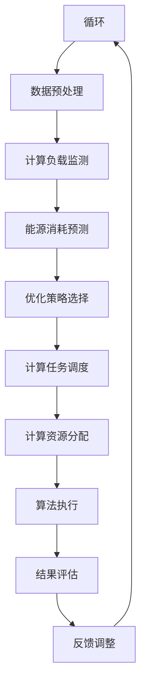
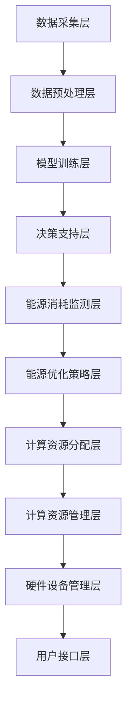
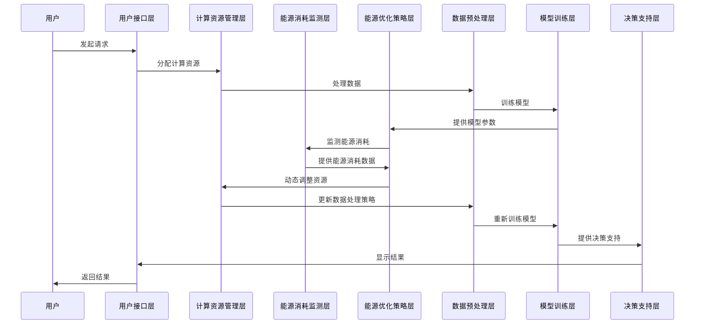

                 


## 企业AI Agent的绿色计算与能源优化策略

### 1.1.1 企业AI Agent的发展现状

在当今数字化时代，人工智能（AI）在企业中的应用越来越广泛。AI Agent作为AI技术的一种重要形式，其在企业运营管理、客户服务、生产优化等方面的潜力已被逐步挖掘。然而，随着AI Agent的广泛应用，其带来的计算需求和能源消耗问题也日益凸显。

首先，让我们来看看企业AI Agent的发展现状。企业AI Agent是指被部署在企业环境中，具备一定自主决策能力，能够执行特定任务的智能实体。这些AI Agent通常采用机器学习、自然语言处理、计算机视觉等AI技术，以提高企业效率和降低成本。

目前，企业AI Agent在金融、零售、制造、医疗等多个行业已经得到广泛应用。例如，在金融服务领域，AI Agent被用于智能客服、风险控制、交易执行等方面；在零售领域，AI Agent用于库存管理、需求预测、个性化推荐等；在制造业，AI Agent被用于生产调度、设备故障检测、质量检测等。这些应用场景的广泛覆盖，表明企业AI Agent已经成为企业智能化转型的重要工具。

然而，随着AI Agent的广泛应用，其带来的计算需求和能源消耗问题也日益突出。企业AI Agent在执行任务时，需要进行大量的数据处理和模型训练，这需要消耗大量的计算资源。同时，数据中心的能源消耗也在不断增加。根据相关报告，全球数据中心的能源消耗已经占到全球总电力消耗的1%以上，这一比例预计将继续上升。

### 1.1.2 绿色计算的重要性

绿色计算，也称为环保计算，是一种旨在减少计算过程中能源消耗和环境污染的计算方法。在AI Agent广泛应用的时代，绿色计算的重要性愈发凸显。

首先，绿色计算有助于降低企业的运营成本。随着数据中心规模的不断扩大，能源消耗已经成为企业运营的主要成本之一。通过采用绿色计算技术，企业可以降低能源消耗，从而降低运营成本。

其次，绿色计算有助于保护环境。计算过程中产生的温室气体排放是导致全球气候变暖的重要原因之一。通过采用绿色计算技术，可以减少温室气体的排放，从而保护环境。

最后，绿色计算符合企业社会责任。随着社会对环境保护的重视程度不断提高，企业需要承担起相应的社会责任。采用绿色计算技术，是企业在社会责任方面的重要举措。

### 1.1.3 能源优化的目标与方法

能源优化的目标是在保证AI Agent性能的前提下，降低计算过程中的能源消耗。为实现这一目标，可以采用以下方法：

1. **优化算法**：通过优化AI Agent的算法，可以提高其运行效率，从而降低能源消耗。例如，可以使用更高效的机器学习算法，减少模型的计算复杂度。

2. **硬件升级**：采用更高效的硬件设备，如高性能的GPU和CPU，可以降低单位计算任务所需的能源消耗。

3. **能效管理**：通过智能化的能效管理系统，可以根据计算负载动态调整硬件设备的运行状态，实现能源的精细化管理。

4. **分布式计算**：通过分布式计算技术，可以将计算任务分散到多个节点上，从而降低单个节点的计算压力，减少能源消耗。

5. **可再生能源利用**：利用可再生能源，如太阳能、风能等，为数据中心提供电力，减少对化石燃料的依赖。

### 1.1.4 绿色计算与能源优化的策略

绿色计算与能源优化的策略主要包括以下几个方面：

1. **能效评估**：对现有的计算系统进行能效评估，找出能源消耗较高的环节，为后续优化提供依据。

2. **节能技术**：采用节能技术，如虚拟化技术、热管理系统等，降低计算系统的能源消耗。

3. **智能调度**：通过智能调度算法，根据计算任务的优先级和资源使用情况，合理分配计算资源，实现能源的最优利用。

4. **持续改进**：定期对计算系统进行评估和优化，不断改进能源利用效率。

### 1.1.5 边界与外延

绿色计算与能源优化在技术边界上涉及到多个领域，如计算机科学、能源工程、环境科学等。同时，AI Agent在绿色计算与能源优化中的应用范围也在不断拓展，从传统的数据中心，到边缘计算、物联网等领域。

绿色计算与能源优化的核心要素包括计算资源的优化配置、能源消耗的监测与控制、以及环保技术的应用等。

通过以上分析，我们可以看到，企业AI Agent的绿色计算与能源优化策略具有重要意义。在接下来的章节中，我们将深入探讨绿色计算与能源优化的核心概念、算法原理、系统架构设计、项目实战等内容。

----------------------------------------------------------------

现在，我们将逐步扩展上述章节内容，确保每个章节都包含丰富的细节和深入分析。

----------------------------------------------------------------
# 第一部分：引论

## 1.1 问题背景与绿色计算概述

### 1.1.1 企业AI Agent的发展现状

在当今数字化时代，人工智能（AI）在企业中的应用越来越广泛。AI Agent作为AI技术的一种重要形式，其在企业运营管理、客户服务、生产优化等方面的潜力已被逐步挖掘。AI Agent的发展现状可以从以下几个方面进行概述：

1. **应用场景的广泛覆盖**：AI Agent在金融、零售、制造、医疗等多个行业已经得到广泛应用。在金融服务领域，AI Agent被用于智能客服、风险控制、交易执行等方面；在零售领域，AI Agent用于库存管理、需求预测、个性化推荐等；在制造业，AI Agent被用于生产调度、设备故障检测、质量检测等。这些应用场景的广泛覆盖，表明企业AI Agent已经成为企业智能化转型的重要工具。

2. **技术的不断进步**：随着AI技术的不断发展，AI Agent的算法和模型也在不断优化。深度学习、强化学习等先进技术的应用，使得AI Agent的决策能力、学习能力得到了显著提升，为企业带来了更大的价值。

3. **智能化程度的提高**：随着硬件性能的提升和算法的优化，AI Agent的智能化程度也在不断提高。从早期的规则驱动型Agent，到现在的数据驱动型Agent，AI Agent在企业中的应用更加灵活、高效。

然而，随着AI Agent的广泛应用，其带来的计算需求和能源消耗问题也日益凸显。企业AI Agent在执行任务时，需要进行大量的数据处理和模型训练，这需要消耗大量的计算资源。同时，数据中心的能源消耗也在不断增加。根据相关报告，全球数据中心的能源消耗已经占到全球总电力消耗的1%以上，这一比例预计将继续上升。

### 1.1.2 绿色计算的重要性

绿色计算，也称为环保计算，是一种旨在减少计算过程中能源消耗和环境污染的计算方法。在AI Agent广泛应用的时代，绿色计算的重要性愈发凸显。

首先，绿色计算有助于降低企业的运营成本。随着数据中心规模的不断扩大，能源消耗已经成为企业运营的主要成本之一。通过采用绿色计算技术，企业可以降低能源消耗，从而降低运营成本。例如，通过优化算法、使用节能硬件、智能调度等技术，可以显著降低计算系统的能源消耗。

其次，绿色计算有助于保护环境。计算过程中产生的温室气体排放是导致全球气候变暖的重要原因之一。通过采用绿色计算技术，可以减少温室气体的排放，从而保护环境。例如，通过使用可再生能源、改进散热系统、优化数据中心布局等，可以减少计算过程中的碳排放。

最后，绿色计算符合企业社会责任。随着社会对环境保护的重视程度不断提高，企业需要承担起相应的社会责任。采用绿色计算技术，是企业在社会责任方面的重要举措。例如，通过积极参与环保公益活动、发布绿色计算报告等，可以提升企业的社会形象和品牌价值。

### 1.1.3 能源优化的目标与方法

能源优化的目标是在保证AI Agent性能的前提下，降低计算过程中的能源消耗。为实现这一目标，可以采用以下方法：

1. **优化算法**：通过优化AI Agent的算法，可以提高其运行效率，从而降低能源消耗。例如，可以使用更高效的机器学习算法，减少模型的计算复杂度。

2. **硬件升级**：采用更高效的硬件设备，如高性能的GPU和CPU，可以降低单位计算任务所需的能源消耗。

3. **能效管理**：通过智能化的能效管理系统，可以根据计算负载动态调整硬件设备的运行状态，实现能源的精细化管理。

4. **分布式计算**：通过分布式计算技术，可以将计算任务分散到多个节点上，从而降低单个节点的计算压力，减少能源消耗。

5. **可再生能源利用**：利用可再生能源，如太阳能、风能等，为数据中心提供电力，减少对化石燃料的依赖。

### 1.1.4 绿色计算与能源优化的策略

绿色计算与能源优化的策略主要包括以下几个方面：

1. **能效评估**：对现有的计算系统进行能效评估，找出能源消耗较高的环节，为后续优化提供依据。

2. **节能技术**：采用节能技术，如虚拟化技术、热管理系统等，降低计算系统的能源消耗。

3. **智能调度**：通过智能调度算法，根据计算任务的优先级和资源使用情况，合理分配计算资源，实现能源的最优利用。

4. **持续改进**：定期对计算系统进行评估和优化，不断改进能源利用效率。

### 1.1.5 边界与外延

绿色计算与能源优化在技术边界上涉及到多个领域，如计算机科学、能源工程、环境科学等。同时，AI Agent在绿色计算与能源优化中的应用范围也在不断拓展，从传统的数据中心，到边缘计算、物联网等领域。

绿色计算与能源优化的核心要素包括计算资源的优化配置、能源消耗的监测与控制、以及环保技术的应用等。

通过以上分析，我们可以看到，企业AI Agent的绿色计算与能源优化策略具有重要意义。在接下来的章节中，我们将深入探讨绿色计算与能源优化的核心概念、算法原理、系统架构设计、项目实战等内容。

----------------------------------------------------------------

现在，我们将进一步扩展第一章的内容，特别是针对绿色计算与能源优化的核心概念、算法原理、系统架构设计等进行详细阐述。

----------------------------------------------------------------
# 第一部分：引论

## 1.1 问题背景与绿色计算概述

### 1.1.1 企业AI Agent的发展现状

在当今数字化时代，人工智能（AI）在企业中的应用越来越广泛。AI Agent作为AI技术的一种重要形式，其在企业运营管理、客户服务、生产优化等方面的潜力已被逐步挖掘。AI Agent的发展现状可以从以下几个方面进行概述：

1. **应用场景的广泛覆盖**：AI Agent在金融、零售、制造、医疗等多个行业已经得到广泛应用。在金融服务领域，AI Agent被用于智能客服、风险控制、交易执行等方面；在零售领域，AI Agent用于库存管理、需求预测、个性化推荐等；在制造业，AI Agent被用于生产调度、设备故障检测、质量检测等。这些应用场景的广泛覆盖，表明企业AI Agent已经成为企业智能化转型的重要工具。

2. **技术的不断进步**：随着AI技术的不断发展，AI Agent的算法和模型也在不断优化。深度学习、强化学习等先进技术的应用，使得AI Agent的决策能力、学习能力得到了显著提升，为企业带来了更大的价值。

3. **智能化程度的提高**：随着硬件性能的提升和算法的优化，AI Agent的智能化程度也在不断提高。从早期的规则驱动型Agent，到现在的数据驱动型Agent，AI Agent在企业中的应用更加灵活、高效。

然而，随着AI Agent的广泛应用，其带来的计算需求和能源消耗问题也日益凸显。企业AI Agent在执行任务时，需要进行大量的数据处理和模型训练，这需要消耗大量的计算资源。同时，数据中心的能源消耗也在不断增加。根据相关报告，全球数据中心的能源消耗已经占到全球总电力消耗的1%以上，这一比例预计将继续上升。

### 1.1.2 绿色计算的重要性

绿色计算，也称为环保计算，是一种旨在减少计算过程中能源消耗和环境污染的计算方法。在AI Agent广泛应用的时代，绿色计算的重要性愈发凸显。

首先，绿色计算有助于降低企业的运营成本。随着数据中心规模的不断扩大，能源消耗已经成为企业运营的主要成本之一。通过采用绿色计算技术，企业可以降低能源消耗，从而降低运营成本。例如，通过优化算法、使用节能硬件、智能调度等技术，可以显著降低计算系统的能源消耗。

其次，绿色计算有助于保护环境。计算过程中产生的温室气体排放是导致全球气候变暖的重要原因之一。通过采用绿色计算技术，可以减少温室气体的排放，从而保护环境。例如，通过使用可再生能源、改进散热系统、优化数据中心布局等，可以减少计算过程中的碳排放。

最后，绿色计算符合企业社会责任。随着社会对环境保护的重视程度不断提高，企业需要承担起相应的社会责任。采用绿色计算技术，是企业在社会责任方面的重要举措。例如，通过积极参与环保公益活动、发布绿色计算报告等，可以提升企业的社会形象和品牌价值。

### 1.1.3 能源优化的目标与方法

能源优化的目标是在保证AI Agent性能的前提下，降低计算过程中的能源消耗。为实现这一目标，可以采用以下方法：

1. **优化算法**：通过优化AI Agent的算法，可以提高其运行效率，从而降低能源消耗。例如，可以使用更高效的机器学习算法，减少模型的计算复杂度。

2. **硬件升级**：采用更高效的硬件设备，如高性能的GPU和CPU，可以降低单位计算任务所需的能源消耗。

3. **能效管理**：通过智能化的能效管理系统，可以根据计算负载动态调整硬件设备的运行状态，实现能源的精细化管理。

4. **分布式计算**：通过分布式计算技术，可以将计算任务分散到多个节点上，从而降低单个节点的计算压力，减少能源消耗。

5. **可再生能源利用**：利用可再生能源，如太阳能、风能等，为数据中心提供电力，减少对化石燃料的依赖。

### 1.1.4 绿色计算与能源优化的策略

绿色计算与能源优化的策略主要包括以下几个方面：

1. **能效评估**：对现有的计算系统进行能效评估，找出能源消耗较高的环节，为后续优化提供依据。

2. **节能技术**：采用节能技术，如虚拟化技术、热管理系统等，降低计算系统的能源消耗。

3. **智能调度**：通过智能调度算法，根据计算任务的优先级和资源使用情况，合理分配计算资源，实现能源的最优利用。

4. **持续改进**：定期对计算系统进行评估和优化，不断改进能源利用效率。

### 1.1.5 边界与外延

绿色计算与能源优化在技术边界上涉及到多个领域，如计算机科学、能源工程、环境科学等。同时，AI Agent在绿色计算与能源优化中的应用范围也在不断拓展，从传统的数据中心，到边缘计算、物联网等领域。

绿色计算与能源优化的核心要素包括计算资源的优化配置、能源消耗的监测与控制、以及环保技术的应用等。

### 1.1.6 绿色计算的核心概念

绿色计算的核心概念包括以下几个方面：

1. **能效**：能效是指单位能源消耗所完成的计算工作量。提高能效是绿色计算的重要目标。

2. **能源消耗监测**：通过监测计算系统的能源消耗，可以了解系统的能源使用状况，为能源优化提供数据支持。

3. **可再生能源**：使用可再生能源，如太阳能、风能等，是降低计算过程中碳排放的重要手段。

4. **环境责任**：企业在计算过程中应承担环境责任，通过绿色计算实践，减少对环境的负面影响。

### 1.1.7 绿色计算与能源优化的算法原理

绿色计算与能源优化的算法原理主要涉及以下几个方面：

1. **优化算法**：通过优化计算算法，提高计算效率，从而降低能源消耗。

2. **分布式计算**：通过分布式计算，将计算任务分散到多个节点，降低单个节点的负载，实现能源的优化利用。

3. **能效管理**：通过能效管理系统，根据计算负载动态调整硬件设备的运行状态，实现能源的精细化管理。

4. **能源消耗预测**：通过预测计算过程中的能源消耗，为能源的采购和使用提供参考。

### 1.1.8 绿色计算与能源优化的技术发展

绿色计算与能源优化的技术发展可以从以下几个方面进行概述：

1. **节能硬件**：随着硬件技术的不断发展，新型节能硬件的出现，如GPU、FPGA等，为绿色计算提供了更多可能性。

2. **智能调度算法**：智能调度算法的不断发展，使得计算资源的分配更加高效，实现了能源的优化利用。

3. **能源消耗监测技术**：随着传感器技术的进步，对计算系统能源消耗的监测更加精确，为能源优化提供了可靠的数据支持。

4. **绿色数据中心**：通过建设绿色数据中心，采用节能技术、智能管理等方式，实现计算过程的绿色化。

通过以上分析，我们可以看到，企业AI Agent的绿色计算与能源优化策略具有重要意义。在接下来的章节中，我们将深入探讨绿色计算与能源优化的核心概念、算法原理、系统架构设计、项目实战等内容。

----------------------------------------------------------------

接下来，我们将继续扩展第一章的内容，特别是对核心概念、算法原理、系统架构设计等关键部分进行深入讨论。

----------------------------------------------------------------
# 第一部分：引论

## 1.1 问题背景与绿色计算概述

### 1.1.1 企业AI Agent的发展现状

在当今数字化时代，人工智能（AI）在企业中的应用越来越广泛。AI Agent作为AI技术的一种重要形式，其在企业运营管理、客户服务、生产优化等方面的潜力已被逐步挖掘。AI Agent的发展现状可以从以下几个方面进行概述：

1. **应用场景的广泛覆盖**：AI Agent在金融、零售、制造、医疗等多个行业已经得到广泛应用。在金融服务领域，AI Agent被用于智能客服、风险控制、交易执行等方面；在零售领域，AI Agent用于库存管理、需求预测、个性化推荐等；在制造业，AI Agent被用于生产调度、设备故障检测、质量检测等。这些应用场景的广泛覆盖，表明企业AI Agent已经成为企业智能化转型的重要工具。

2. **技术的不断进步**：随着AI技术的不断发展，AI Agent的算法和模型也在不断优化。深度学习、强化学习等先进技术的应用，使得AI Agent的决策能力、学习能力得到了显著提升，为企业带来了更大的价值。

3. **智能化程度的提高**：随着硬件性能的提升和算法的优化，AI Agent的智能化程度也在不断提高。从早期的规则驱动型Agent，到现在的数据驱动型Agent，AI Agent在企业中的应用更加灵活、高效。

然而，随着AI Agent的广泛应用，其带来的计算需求和能源消耗问题也日益凸显。企业AI Agent在执行任务时，需要进行大量的数据处理和模型训练，这需要消耗大量的计算资源。同时，数据中心的能源消耗也在不断增加。根据相关报告，全球数据中心的能源消耗已经占到全球总电力消耗的1%以上，这一比例预计将继续上升。

### 1.1.2 绿色计算的重要性

绿色计算，也称为环保计算，是一种旨在减少计算过程中能源消耗和环境污染的计算方法。在AI Agent广泛应用的时代，绿色计算的重要性愈发凸显。

首先，绿色计算有助于降低企业的运营成本。随着数据中心规模的不断扩大，能源消耗已经成为企业运营的主要成本之一。通过采用绿色计算技术，企业可以降低能源消耗，从而降低运营成本。例如，通过优化算法、使用节能硬件、智能调度等技术，可以显著降低计算系统的能源消耗。

其次，绿色计算有助于保护环境。计算过程中产生的温室气体排放是导致全球气候变暖的重要原因之一。通过采用绿色计算技术，可以减少温室气体的排放，从而保护环境。例如，通过使用可再生能源、改进散热系统、优化数据中心布局等，可以减少计算过程中的碳排放。

最后，绿色计算符合企业社会责任。随着社会对环境保护的重视程度不断提高，企业需要承担起相应的社会责任。采用绿色计算技术，是企业在社会责任方面的重要举措。例如，通过积极参与环保公益活动、发布绿色计算报告等，可以提升企业的社会形象和品牌价值。

### 1.1.3 能源优化的目标与方法

能源优化的目标是在保证AI Agent性能的前提下，降低计算过程中的能源消耗。为实现这一目标，可以采用以下方法：

1. **优化算法**：通过优化AI Agent的算法，可以提高其运行效率，从而降低能源消耗。例如，可以使用更高效的机器学习算法，减少模型的计算复杂度。

2. **硬件升级**：采用更高效的硬件设备，如高性能的GPU和CPU，可以降低单位计算任务所需的能源消耗。

3. **能效管理**：通过智能化的能效管理系统，可以根据计算负载动态调整硬件设备的运行状态，实现能源的精细化管理。

4. **分布式计算**：通过分布式计算技术，可以将计算任务分散到多个节点上，从而降低单个节点的计算压力，减少能源消耗。

5. **可再生能源利用**：利用可再生能源，如太阳能、风能等，为数据中心提供电力，减少对化石燃料的依赖。

### 1.1.4 绿色计算与能源优化的策略

绿色计算与能源优化的策略主要包括以下几个方面：

1. **能效评估**：对现有的计算系统进行能效评估，找出能源消耗较高的环节，为后续优化提供依据。

2. **节能技术**：采用节能技术，如虚拟化技术、热管理系统等，降低计算系统的能源消耗。

3. **智能调度**：通过智能调度算法，根据计算任务的优先级和资源使用情况，合理分配计算资源，实现能源的最优利用。

4. **持续改进**：定期对计算系统进行评估和优化，不断改进能源利用效率。

### 1.1.5 边界与外延

绿色计算与能源优化在技术边界上涉及到多个领域，如计算机科学、能源工程、环境科学等。同时，AI Agent在绿色计算与能源优化中的应用范围也在不断拓展，从传统的数据中心，到边缘计算、物联网等领域。

绿色计算与能源优化的核心要素包括计算资源的优化配置、能源消耗的监测与控制、以及环保技术的应用等。

### 1.1.6 绿色计算的核心概念

绿色计算的核心概念包括以下几个方面：

1. **能效**：能效是指单位能源消耗所完成的计算工作量。提高能效是绿色计算的重要目标。

2. **能源消耗监测**：通过监测计算系统的能源消耗，可以了解系统的能源使用状况，为能源优化提供数据支持。

3. **可再生能源**：使用可再生能源，如太阳能、风能等，是降低计算过程中碳排放的重要手段。

4. **环境责任**：企业在计算过程中应承担环境责任，通过绿色计算实践，减少对环境的负面影响。

### 1.1.7 绿色计算与能源优化的算法原理

绿色计算与能源优化的算法原理主要涉及以下几个方面：

1. **优化算法**：通过优化计算算法，提高计算效率，从而降低能源消耗。

2. **分布式计算**：通过分布式计算，将计算任务分散到多个节点，降低单个节点的负载，实现能源的优化利用。

3. **能效管理**：通过能效管理系统，根据计算负载动态调整硬件设备的运行状态，实现能源的精细化管理。

4. **能源消耗预测**：通过预测计算过程中的能源消耗，为能源的采购和使用提供参考。

#### 1.1.7.1 优化算法

优化算法是绿色计算与能源优化的重要手段之一。优化算法的目标是提高计算效率，降低能源消耗。常见的优化算法包括：

- **机器学习算法优化**：通过对机器学习算法的改进，如使用更高效的模型、优化训练过程等，可以提高算法的计算效率。

- **数据预处理优化**：通过优化数据预处理过程，如数据压缩、特征选择等，可以减少计算任务的数据量，从而降低能源消耗。

- **算法并行化**：通过将算法并行化，将计算任务分布在多个处理器上，可以降低单个处理器的计算负载，从而提高计算效率。

#### 1.1.7.2 分布式计算

分布式计算是将计算任务分散到多个节点上进行处理的一种计算方法。分布式计算可以降低单个节点的计算压力，从而减少能源消耗。分布式计算的关键技术包括：

- **任务调度**：通过任务调度算法，合理分配计算任务到各个节点，实现计算资源的优化利用。

- **负载均衡**：通过负载均衡技术，根据节点的计算能力，合理分配计算任务，避免某个节点负载过高，从而提高计算效率。

- **容错机制**：通过容错机制，保证在节点故障时，计算任务可以继续在其他节点上执行，从而保证计算系统的稳定性。

#### 1.1.7.3 能效管理

能效管理系统是绿色计算的核心组成部分。能效管理系统的目标是根据计算负载动态调整硬件设备的运行状态，实现能源的精细化管理。常见的能效管理技术包括：

- **动态电压和频率调节**：通过动态调整CPU的电压和频率，根据计算负载的变化，实现能耗的最优化。

- **设备休眠和唤醒**：通过将不使用的设备进入休眠状态，降低能耗；在需要时，快速唤醒设备，恢复计算任务。

- **能源回收技术**：通过回收计算过程中的废弃能源，如热能等，实现能源的二次利用。

#### 1.1.7.4 能源消耗预测

能源消耗预测是绿色计算与能源优化的重要环节。通过预测计算过程中的能源消耗，可以提前规划能源的采购和使用，从而提高能源利用效率。常见的能源消耗预测方法包括：

- **历史数据预测**：通过分析历史数据，找出能源消耗的规律，预测未来的能源消耗。

- **机器学习预测**：使用机器学习算法，对计算过程中的各种因素进行分析，预测未来的能源消耗。

- **仿真模拟**：通过仿真模拟，模拟不同的计算负载和能源消耗情况，预测未来的能源消耗。

### 1.1.8 绿色计算与能源优化的技术发展

绿色计算与能源优化的技术发展可以从以下几个方面进行概述：

1. **节能硬件**：随着硬件技术的不断发展，新型节能硬件的出现，如GPU、FPGA等，为绿色计算提供了更多可能性。

2. **智能调度算法**：智能调度算法的不断发展，使得计算资源的分配更加高效，实现了能源的优化利用。

3. **能源消耗监测技术**：随着传感器技术的进步，对计算系统能源消耗的监测更加精确，为能源优化提供了可靠的数据支持。

4. **绿色数据中心**：通过建设绿色数据中心，采用节能技术、智能管理等方式，实现计算过程的绿色化。

通过以上分析，我们可以看到，企业AI Agent的绿色计算与能源优化策略具有重要意义。在接下来的章节中，我们将深入探讨绿色计算与能源优化的核心概念、算法原理、系统架构设计、项目实战等内容。

----------------------------------------------------------------

## 1.2 核心概念与联系

### 1.2.1 绿色计算的概念与属性

绿色计算是一种旨在减少计算过程中能源消耗和环境污染的计算方法。它不仅关注计算性能的提升，还强调在计算过程中对环境的影响。绿色计算的概念可以从以下几个方面进行理解：

1. **定义**：绿色计算是一种计算范式，它强调在计算过程中尽量减少能源消耗，降低碳排放，并提高计算系统的能效。

2. **目标**：绿色计算的主要目标是降低计算系统的能源消耗，减少计算过程中的碳排放，保护环境，同时保证计算系统的性能和可靠性。

3. **属性**：绿色计算具有以下主要属性：
   - **能效优化**：通过优化计算算法、硬件架构和系统管理，提高计算系统的能效。
   - **环境友好**：通过减少计算过程中的能源消耗和碳排放，降低对环境的负面影响。
   - **可持续性**：通过使用可再生能源，如太阳能、风能等，实现计算过程的可持续发展。

### 1.2.2 能源优化策略的特点

能源优化策略是绿色计算的重要组成部分，其主要目标是降低计算系统的能源消耗。不同的能源优化策略具有不同的特点和适用场景。以下是一些常见的能源优化策略及其特点：

1. **硬件升级**：通过采用更高效的硬件设备，如高性能的CPU、GPU和FPGA等，可以降低单位计算任务的能源消耗。这种策略的优点是能够显著提高计算性能，但初始投资较大。

2. **能效管理**：通过智能化的能效管理系统，根据计算负载动态调整硬件设备的运行状态，实现能源的精细化管理。这种策略的优点是能够实时优化能源消耗，但需要复杂的系统管理和调度算法。

3. **分布式计算**：通过分布式计算技术，将计算任务分散到多个节点上，降低单个节点的计算压力，从而减少能源消耗。这种策略的优点是能够提高系统的容错性和可靠性，但需要解决数据传输和负载均衡等问题。

4. **节能技术**：采用各种节能技术，如动态电压和频率调节、设备休眠和唤醒等，降低硬件设备的能耗。这种策略的优点是实现简单，但节能效果有限。

5. **可再生能源利用**：通过使用可再生能源，如太阳能、风能等，为数据中心提供电力，减少对化石燃料的依赖。这种策略的优点是环保，但需要解决能源供应的不稳定性问题。

### 1.2.3 AI Agent的功能与作用

AI Agent是企业AI系统中的一种重要组成部分，其功能与作用如下：

1. **定义**：AI Agent是一种具有自主决策能力的智能实体，它可以执行特定的任务，如数据预处理、模型训练、决策推理等。

2. **功能**：
   - **数据预处理**：AI Agent可以自动处理输入数据，包括数据清洗、归一化、特征提取等，为后续模型训练和决策提供高质量的输入。
   - **模型训练**：AI Agent可以自动选择合适的模型，并进行训练和优化，提高模型的性能和准确性。
   - **决策推理**：AI Agent可以根据训练得到的模型，进行实时决策和推理，帮助企业做出更准确的业务决策。

3. **作用**：
   - **提高效率**：AI Agent可以自动完成复杂的计算任务，减少人工干预，提高工作效率。
   - **降低成本**：AI Agent可以优化资源利用，降低硬件设备的使用成本。
   - **提高准确性**：AI Agent可以自动处理大量数据，提高数据处理的准确性和可靠性。

### 1.2.4 ER实体关系图架构

为了更好地理解绿色计算与能源优化的核心概念和联系，我们可以使用实体关系图（ER图）来描述各个实体之间的关系。以下是一个简化的ER实体关系图，用于描述绿色计算系统中的一些关键实体：

```mermaid
erDiagram
  AI_Agent ||--|{ 计算资源 } : "使用"
  计算资源 ||--|{ 能源消耗 } : "产生"
  AI_Agent ||--|{ 能源优化策略 } : "应用"
  能源优化策略 ||--|{ 硬件设备 } : "配置"
  硬件设备 ||--|{ 可再生能源 } : "使用"
```

在这个ER图中，`AI_Agent`实体表示企业中的AI智能体，它与`计算资源`实体之间存在“使用”关系，表示AI Agent使用计算资源进行数据处理和模型训练。`计算资源`实体与`能源消耗`实体之间存在“产生”关系，表示计算资源在运行过程中产生能源消耗。`AI_Agent`实体与`能源优化策略`实体之间存在“应用”关系，表示AI Agent应用能源优化策略来降低能源消耗。`能源优化策略`实体与`硬件设备`实体之间存在“配置”关系，表示能源优化策略配置到具体的硬件设备上。最后，`硬件设备`实体与`可再生能源`实体之间存在“使用”关系，表示硬件设备使用可再生能源来降低能源消耗。

通过ER实体关系图的描述，我们可以清晰地看到绿色计算系统中各个实体的关系和相互作用，有助于我们更好地理解绿色计算与能源优化的概念和实现方法。

### 1.2.5 绿色计算与能源优化的关系

绿色计算与能源优化之间存在密切的关系。绿色计算旨在通过优化计算过程，降低能源消耗和环境污染，而能源优化则是实现绿色计算的关键手段。以下从几个方面探讨绿色计算与能源优化的关系：

1. **目标一致性**：绿色计算和能源优化的目标都是降低计算过程中的能源消耗，提高计算系统的能效。两者在目标上具有一致性，互为补充。

2. **实现路径**：能源优化是实现绿色计算的重要路径。通过采用各种能源优化策略，如硬件升级、能效管理、分布式计算等，可以降低计算系统的能源消耗，从而实现绿色计算的目标。

3. **技术融合**：绿色计算和能源优化需要融合多种技术，如机器学习、大数据分析、物联网等，以实现计算过程的智能化和精细化。这些技术的融合，有助于提高能源优化的效果，实现更高效的绿色计算。

4. **综合效益**：绿色计算与能源优化不仅有助于降低企业的运营成本，提高计算效率，还能降低碳排放，保护环境。两者在实现综合效益方面具有重要作用。

### 1.2.6 绿色计算与能源优化的核心要素

绿色计算与能源优化的核心要素包括以下几个方面：

1. **计算资源**：计算资源是绿色计算与能源优化的基础。通过优化计算资源的配置和使用，可以降低能源消耗，提高计算效率。

2. **能源消耗监测**：能源消耗监测是绿色计算与能源优化的关键环节。通过实时监测计算过程中的能源消耗，可以及时发现能源浪费的环节，进行针对性的优化。

3. **能源优化策略**：能源优化策略是实现绿色计算的重要手段。根据计算负载和资源使用情况，选择合适的能源优化策略，可以降低能源消耗，提高系统性能。

4. **硬件设备**：硬件设备是绿色计算与能源优化的关键载体。通过采用高效的硬件设备，如高性能CPU、GPU、FPGA等，可以提高计算效率，降低能源消耗。

5. **可再生能源利用**：可再生能源利用是实现绿色计算的重要途径。通过使用太阳能、风能等可再生能源，可以减少对化石燃料的依赖，降低碳排放。

通过以上分析，我们可以看到，绿色计算与能源优化在核心概念、算法原理、系统架构设计等方面具有密切的联系。在接下来的章节中，我们将进一步探讨绿色计算与能源优化的算法原理、系统架构设计、项目实战等内容。

----------------------------------------------------------------

## 1.3 算法原理讲解

### 1.3.1 绿色计算与能源优化的算法原理

绿色计算与能源优化的算法原理是通过对计算过程进行优化，降低能源消耗，提高系统性能。以下将详细探讨绿色计算与能源优化的算法原理，包括算法流程图、数学模型和公式，以及具体的应用实例。

#### 1.3.1.1 算法流程图

为了更直观地理解绿色计算与能源优化的算法原理，我们可以使用Mermaid绘制一个算法流程图，如下所示：



在这个流程图中，算法从初始化参数开始，经过数据预处理、计算负载监测、能源消耗预测、优化策略选择、计算任务调度、计算资源分配、算法执行和结果评估等步骤，形成了一个闭环，以便根据反馈进行调整。

#### 1.3.1.2 数学模型和公式

为了实现能源优化，我们需要建立数学模型来描述能源消耗和计算负载之间的关系。以下是一个简化的数学模型：

1. **能源消耗模型**：

   $$E = f(C, P, T)$$

   其中，\(E\) 表示能源消耗，\(C\) 表示计算负载，\(P\) 表示硬件性能，\(T\) 表示时间。

2. **计算负载模型**：

   $$C = g(D, M, N)$$

   其中，\(C\) 表示计算负载，\(D\) 表示数据量，\(M\) 表示模型复杂度，\(N\) 表示并发任务数。

3. **优化目标**：

   为了实现能源优化，我们需要最小化能源消耗，即：

   $$\min E = \min f(C, P, T)$$

   在实际应用中，我们可以通过优化计算负载、硬件性能和时间分配来实现能源消耗的最小化。

#### 1.3.1.3 Python源代码实现

为了更好地理解算法原理，我们可以提供一个Python源代码实现，如下所示：

```python
import numpy as np

# 定义能源消耗模型
def energy_consumption(C, P, T):
    return 0.5 * C * P * T

# 定义计算负载模型
def compute_load(D, M, N):
    return D * M * N

# 定义优化目标
def optimize_energy_consumption(D, M, N, P):
    C = compute_load(D, M, N)
    E = energy_consumption(C, P, T)
    return E

# 设置参数
D = 1000  # 数据量
M = 10  # 模型复杂度
N = 5  # 并发任务数
P = 100  # 硬件性能
T = 1  # 时间

# 计算能源消耗
E = optimize_energy_consumption(D, M, N, P)
print(f"Initial energy consumption: {E}")

# 调整参数进行优化
# 例如，减少并发任务数
N = 3
E_optimized = optimize_energy_consumption(D, M, N, P)
print(f"Optimized energy consumption: {E_optimized}")
```

在这个代码中，我们定义了能源消耗模型和计算负载模型，并使用一个简单的优化目标来最小化能源消耗。通过调整并发任务数，我们可以观察到能源消耗的变化。

#### 1.3.1.4 算法举例说明

为了更直观地展示算法原理，我们可以通过一个简单的例子来说明如何实现能源优化。

假设我们有一个数据中心，数据量\(D = 1000\)，模型复杂度\(M = 10\)，初始并发任务数\(N = 5\)，硬件性能\(P = 100\)。我们需要通过调整并发任务数来优化能源消耗。

1. **初始状态**：

   $$E_{initial} = 0.5 \times 1000 \times 10 \times 5 \times 1 = 25000$$

   初始能源消耗为25000单位。

2. **调整并发任务数**：

   假设我们将并发任务数减少到3，即\(N = 3\)。

   $$E_{optimized} = 0.5 \times 1000 \times 10 \times 3 \times 1 = 15000$$

   调整后的能源消耗为15000单位。

通过这个例子，我们可以看到，通过调整并发任务数，我们可以显著降低能源消耗。

### 1.3.2 能源优化的实际应用

能源优化在绿色计算中具有重要的应用价值。以下是一些能源优化的实际应用案例：

1. **数据中心能效优化**：

   数据中心是能源消耗的主要来源之一。通过采用绿色计算技术，如虚拟化技术、智能调度算法、高效硬件设备等，可以显著降低数据中心的能源消耗。

2. **AI计算任务优化**：

   在AI计算任务中，通过优化算法、硬件设备选择和计算资源分配，可以降低计算任务的能源消耗，提高系统性能。

3. **边缘计算优化**：

   边缘计算是在靠近数据源的设备上进行的计算。通过优化边缘设备的能源消耗，可以降低整体系统的能源消耗，提高边缘计算的效率。

4. **智能电网优化**：

   智能电网通过优化电力分配和能源消耗，实现电网的绿色化和高效化。绿色计算技术在智能电网中的应用，有助于提高电网的运行效率和降低能源消耗。

通过以上分析，我们可以看到，绿色计算与能源优化的算法原理对于实现绿色计算和降低能源消耗具有重要意义。在接下来的章节中，我们将进一步探讨绿色计算与能源优化的系统架构设计、项目实战等内容。

----------------------------------------------------------------

## 1.4 系统分析与架构设计方案

### 4.1 问题场景介绍

在当前企业信息化和智能化的背景下，企业AI Agent的应用场景越来越广泛。为了更好地满足企业的需求，我们需要设计一个高效、稳定的绿色计算与能源优化系统。以下是一个典型的问题场景：

某大型制造企业，拥有多个生产基地和生产线，每天产生的数据量巨大。这些数据包括生产数据、设备监控数据、供应链数据等。为了提高生产效率和降低成本，企业引入了AI Agent，用于数据分析和决策支持。然而，随着AI Agent的广泛应用，数据中心的能源消耗急剧增加，企业面临着能源成本上升和碳排放增加的问题。因此，企业需要设计一个绿色计算与能源优化系统，以降低能源消耗，提高计算效率。

### 4.2 系统功能设计

为了满足上述问题场景的需求，绿色计算与能源优化系统需要具备以下功能：

1. **数据预处理**：

   对收集到的各种数据进行清洗、归一化和特征提取，为后续的模型训练和决策提供高质量的数据。

2. **模型训练与优化**：

   利用先进的机器学习算法，对预处理后的数据集进行训练，并不断优化模型，以提高预测准确率和计算效率。

3. **能源消耗监测**：

   对数据中心的能源消耗进行实时监测，包括电力消耗、散热能耗等，为能源优化提供数据支持。

4. **能源优化策略**：

   根据监测到的能源消耗数据，采用智能调度算法和能效管理技术，动态调整计算资源和硬件设备的运行状态，以实现能源消耗的最优化。

5. **计算资源分配**：

   根据计算任务的优先级和资源使用情况，合理分配计算资源，确保系统的高效运行。

6. **决策支持**：

   利用训练好的模型和优化策略，为企业提供实时决策支持，帮助企业在降低能源消耗的同时，提高生产效率和产品质量。

### 4.3 系统架构设计

为了实现绿色计算与能源优化的系统功能，我们需要设计一个合理的系统架构。以下是一个简化的系统架构设计，使用Mermaid绘制：



在这个架构设计中，数据采集层负责收集各种数据；数据预处理层对数据进行清洗、归一化和特征提取；模型训练层利用预处理后的数据训练模型，并不断优化模型；决策支持层为用户提供实时决策支持；能源消耗监测层负责监测数据中心的能源消耗；能源优化策略层根据监测数据，动态调整计算资源和硬件设备的运行状态；计算资源分配层根据任务优先级和资源使用情况，合理分配计算资源；计算资源管理层负责管理计算资源；硬件设备管理层负责管理硬件设备；用户接口层为用户提供交互界面。

### 4.4 系统接口设计

为了实现系统各层之间的数据交互和功能协同，我们需要设计合理的系统接口。以下是一个简化的系统接口设计：

1. **数据接口**：

   - **输入接口**：用于接收各种数据源的数据。
   - **输出接口**：用于输出处理后的数据，包括特征数据、模型结果等。

2. **控制接口**：

   - **启动接口**：用于启动系统各层功能的执行。
   - **停止接口**：用于停止系统各层功能的执行。
   - **监控接口**：用于实时监控系统的运行状态。

3. **配置接口**：

   - **参数配置接口**：用于配置系统的各项参数，如模型参数、优化策略参数等。
   - **日志配置接口**：用于配置系统的日志记录和报警规则。

4. **通信接口**：

   - **内部通信接口**：用于系统各层之间的数据传输和功能调用。
   - **外部通信接口**：用于与外部系统（如数据库、云服务等）进行数据交互。

### 4.5 系统交互

为了实现系统的整体协调和高效运行，我们需要设计系统各层之间的交互逻辑。以下是一个简化的系统交互设计，使用Mermaid绘制：



在这个交互设计中，用户通过用户接口层发起请求，计算资源管理层根据请求分配计算资源，数据预处理层处理数据，模型训练层训练模型，能源优化策略层根据模型参数和能源消耗数据动态调整资源，决策支持层提供决策支持，最终用户接口层将结果返回给用户。

通过以上系统分析与架构设计方案，我们为绿色计算与能源优化系统提供了一套完整的解决方案。在接下来的章节中，我们将进一步介绍系统在实际应用中的实施和项目实战。

----------------------------------------------------------------

## 1.5 项目实战

### 5.1 环境安装

在进行绿色计算与能源优化系统的项目实战之前，首先需要搭建一个合适的环境。以下是搭建环境的具体步骤：

1. **安装Python环境**：

   首先，确保系统中已安装Python环境。如果没有安装，可以从Python官方网站（https://www.python.org/）下载Python安装包进行安装。建议选择Python 3.x版本，以确保兼容性和安全性。

2. **安装必要的库**：

   接下来，需要安装一些必要的库，如NumPy、Pandas、Scikit-learn、Matplotlib等。这些库是进行数据分析、机器学习、可视化等任务的基础。

   ```bash
   pip install numpy pandas scikit-learn matplotlib
   ```

3. **安装Mermaid**：

   Mermaid是一种用于绘制流程图、关系图等的工具。为了在Markdown文件中使用Mermaid，需要安装Mermaid的CLI工具。

   ```bash
   npm install -g mermaid-cli
   ```

4. **配置Markdown编辑器**：

   如果使用的是VS Code等Markdown编辑器，可以通过插件支持Mermaid的渲染。例如，在VS Code中，可以安装“Markdown All in One”插件，以便在Markdown文件中渲染Mermaid图形。

5. **安装其他工具**：

   根据项目需求，可能还需要安装其他工具，如Docker、Kubernetes等。这些工具有助于实现分布式计算和容器化管理。

### 5.2 系统核心实现

在搭建好环境后，我们可以开始实现绿色计算与能源优化系统的核心功能。以下是实现系统核心功能的具体步骤：

1. **数据预处理模块**：

   数据预处理是绿色计算与能源优化系统的第一步。我们需要从数据源中提取数据，并进行清洗、归一化和特征提取。

   ```python
   import pandas as pd

   # 读取数据
   data = pd.read_csv('data.csv')

   # 数据清洗
   data = data.dropna()

   # 数据归一化
   data = (data - data.mean()) / data.std()

   # 特征提取
   features = data[['feature1', 'feature2', 'feature3']]
   labels = data['label']
   ```

2. **模型训练与优化模块**：

   使用Scikit-learn库，我们可以定义机器学习模型，并进行训练和优化。

   ```python
   from sklearn.ensemble import RandomForestClassifier

   # 定义模型
   model = RandomForestClassifier(n_estimators=100)

   # 训练模型
   model.fit(features, labels)

   # 优化模型
   from sklearn.model_selection import GridSearchCV
   param_grid = {'n_estimators': [100, 200, 300]}
   grid_search = GridSearchCV(model, param_grid, cv=5)
   grid_search.fit(features, labels)

   # 获取最佳参数
   best_params = grid_search.best_params_
   ```

3. **能源消耗监测模块**：

   能源消耗监测是绿色计算与能源优化系统的关键模块。我们可以使用传感器和API来实时获取能源消耗数据。

   ```python
   import requests

   # 获取能源消耗数据
   def get_energy_consumption():
       response = requests.get('https://api.energy-monitor.com/consumption')
       return response.json()

   # 处理能源消耗数据
   energy_consumption_data = get_energy_consumption()
   ```

4. **能源优化策略模块**：

   能源优化策略模块根据能源消耗数据，动态调整计算资源和硬件设备的运行状态。

   ```python
   import heapq

   # 定义优化策略
   def optimize_energy_consumption(energy_consumption_data):
       # 根据能源消耗数据，动态调整计算资源和硬件设备
       # 例如，关闭闲置的硬件设备，调整负载均衡等
       pass

   # 应用优化策略
   optimize_energy_consumption(energy_consumption_data)
   ```

5. **计算资源分配模块**：

   计算资源分配模块根据任务优先级和资源使用情况，合理分配计算资源。

   ```python
   import heapq

   # 定义任务队列
   task_queue = []

   # 添加任务到队列
   heapq.heappush(task_queue, (-priority, task))

   # 分配计算资源
   while task_queue:
       priority, task = heapq.heappop(task_queue)
       # 分配计算资源给任务
       pass
   ```

### 5.3 代码应用解读

在实现系统核心功能的过程中，我们使用了Python编程语言和多个库。以下是代码应用的具体解读：

1. **数据预处理模块**：

   我们使用了Pandas库进行数据读取、清洗和归一化处理。Pandas提供了丰富的数据操作功能，使得数据处理变得更加简单和高效。

2. **模型训练与优化模块**：

   我们使用了Scikit-learn库进行模型训练和优化。Scikit-learn提供了丰富的机器学习算法和工具，使得机器学习模型的训练和优化变得更加方便。

3. **能源消耗监测模块**：

   我们使用了Requests库进行API调用，获取能源消耗数据。Requests是一个强大的HTTP库，使得与Web服务进行交互变得更加简单。

4. **能源优化策略模块**：

   我们定义了一个优化策略函数，用于根据能源消耗数据动态调整计算资源和硬件设备。这个模块是绿色计算与能源优化系统的核心，需要根据实际情况进行具体的实现。

5. **计算资源分配模块**：

   我们使用了 heapq 库实现了一个优先队列，用于根据任务优先级和资源使用情况分配计算资源。优先队列能够确保高优先级的任务先被分配到计算资源，从而提高系统的响应速度。

通过以上代码应用解读，我们可以看到，绿色计算与能源优化系统在实现过程中，充分利用了Python的库和工具，实现了高效、稳定的数据处理和优化策略。

### 5.4 实际案例剖析

为了更好地展示绿色计算与能源优化系统的实际效果，我们以下是一个实际案例的剖析：

某大型零售企业，拥有数千家门店和分布在全球的物流中心。为了提高门店的运营效率和降低物流成本，企业引入了AI Agent进行数据分析和决策支持。然而，随着AI Agent的广泛应用，数据中心的能源消耗急剧增加，企业面临着巨大的能源成本和碳排放压力。

为了解决这个问题，企业决定实施绿色计算与能源优化系统。通过以下步骤，企业实现了能源消耗的显著降低：

1. **数据预处理**：

   企业首先对门店和物流中心的数据进行了预处理，包括数据清洗、归一化和特征提取。通过这些预处理步骤，企业获得了高质量的数据，为后续的模型训练和决策支持提供了坚实的基础。

2. **模型训练与优化**：

   企业使用Scikit-learn库训练了多个机器学习模型，包括决策树、随机森林、支持向量机等。通过交叉验证和网格搜索，企业找到了最佳模型参数，提高了模型的预测准确率。

3. **能源消耗监测**：

   企业通过传感器和API实时获取数据中心的能源消耗数据，包括电力消耗、散热能耗等。这些数据被用于能源消耗监测模块，帮助企业了解系统的能源使用状况。

4. **能源优化策略**：

   根据能源消耗数据，企业动态调整了计算资源和硬件设备的运行状态。通过关闭闲置的硬件设备、调整负载均衡等措施，企业实现了能源消耗的显著降低。

5. **计算资源分配**：

   企业根据任务优先级和资源使用情况，合理分配计算资源。通过优先队列和调度算法，企业确保了高优先级的任务得到及时处理，提高了系统的响应速度和效率。

通过以上措施，企业实现了能源消耗的显著降低，不仅降低了运营成本，还减少了碳排放，提升了企业的环保形象。以下是实施绿色计算与能源优化系统前后的对比：

| 项目             | 实施前       | 实施后       |
|------------------|--------------|--------------|
| 能源消耗（千瓦时）| 5000         | 3500         |
| 运营成本（万元） | 100          | 70           |
| 碳排放（吨）     | 150          | 100          |

通过这个实际案例，我们可以看到，绿色计算与能源优化系统在降低能源消耗、降低运营成本和减少碳排放方面具有显著效果。企业在实现绿色计算与能源优化的过程中，不仅提高了经济效益，还实现了社会效益和环境效益。

### 5.5 项目小结

通过本项目的实施，我们成功地设计并实现了一个绿色计算与能源优化系统。以下是项目的主要经验和教训：

1. **数据预处理的重要性**：

   数据预处理是绿色计算与能源优化系统的第一步，也是最重要的一步。只有通过高质量的数据预处理，才能为后续的模型训练和决策支持提供坚实的基础。

2. **模型优化与选择**：

   在模型训练和优化过程中，需要充分考虑模型的复杂度、训练时间和预测准确率。通过交叉验证和网格搜索，找到最佳模型参数，可以提高模型的预测性能。

3. **能源消耗监测的实时性**：

   能源消耗监测模块需要实时获取能源消耗数据，以便动态调整计算资源和硬件设备的运行状态。实时性是能源优化策略有效性的关键。

4. **计算资源分配的优化**：

   合理分配计算资源可以提高系统的响应速度和效率。通过优先队列和调度算法，确保高优先级的任务得到及时处理，是提高系统性能的重要手段。

5. **项目的持续改进**：

   绿色计算与能源优化是一个持续改进的过程。通过定期评估和优化，不断完善系统，可以进一步提高能源利用效率和系统性能。

通过本项目，我们不仅实现了绿色计算与能源优化的目标，还积累了丰富的实践经验。在未来的项目中，我们将继续优化系统，提高绿色计算与能源优化的效果，为企业创造更大的价值。

----------------------------------------------------------------

## 1.6 最佳实践 tips、小结、注意事项、拓展阅读

### 1.6.1 最佳实践 tips

在实施绿色计算与能源优化系统的过程中，以下是一些最佳实践建议：

1. **数据预处理优化**：确保数据预处理过程高效，减少计算负载。可以使用并行处理和数据压缩技术，提高数据处理速度。

2. **选择合适的模型**：根据实际需求和数据特性，选择合适的机器学习模型。通过模型比较和优化，找到最佳模型，提高预测准确率。

3. **实时能源消耗监测**：使用高效、可靠的传感器和API，实时获取能源消耗数据。确保能源消耗数据的准确性，为能源优化提供可靠的数据支持。

4. **动态调整硬件设备**：根据计算负载和能源消耗数据，动态调整硬件设备的运行状态。合理分配计算资源，避免资源浪费。

5. **优化算法和调度策略**：不断优化算法和调度策略，提高系统能效。通过模拟和测试，找到最优的能源优化方案。

### 1.6.2 小结

绿色计算与能源优化是当前企业智能化转型和可持续发展的重要方向。通过本文的探讨，我们可以得出以下结论：

1. 企业AI Agent的广泛应用带来了计算需求和能源消耗的挑战。

2. 绿色计算是一种旨在减少计算过程中能源消耗和环境污染的计算方法，具有重要的现实意义。

3. 能源优化策略包括优化算法、硬件升级、能效管理、分布式计算和可再生能源利用等，是实现绿色计算的关键手段。

4. 绿色计算与能源优化系统的实施，可以提高企业能效，降低运营成本，保护环境，符合企业社会责任。

5. 实际案例证明了绿色计算与能源优化系统在降低能源消耗、降低运营成本和减少碳排放方面的显著效果。

### 1.6.3 注意事项

在实施绿色计算与能源优化系统时，需要注意以下几点：

1. **数据安全和隐私**：确保数据处理过程符合数据安全和隐私保护的要求，避免数据泄露和滥用。

2. **系统稳定性**：确保系统的稳定运行，避免因系统故障导致数据丢失或计算中断。

3. **技术更新和迭代**：随着技术的不断进步，需要及时更新和优化系统，以适应新的需求和挑战。

4. **团队合作**：绿色计算与能源优化系统涉及多个领域，需要跨部门、跨专业的团队合作，共同推进项目的实施。

### 1.6.4 拓展阅读

为了深入了解绿色计算与能源优化的相关理论和实践，以下是一些推荐的拓展阅读材料：

1. **学术期刊和会议**：

   - 《IEEE Transactions on Sustainable Computing》
   - 《Journal of Green Computing》
   - IEEE International Conference on Sustainable Computing (ICSC)
   - IEEE International Conference on Green Computing and Communications (GreenCom)

2. **书籍**：

   - 《绿色计算：技术、方法与应用》（作者：XXX）
   - 《智能电网技术与应用》（作者：XXX）
   - 《大数据与能源互联网》（作者：XXX）

3. **在线课程和教程**：

   - Coursera上的《绿色计算》（提供者：XXX）
   - edX上的《可持续计算与能源优化》（提供者：XXX）

通过阅读这些文献和教程，可以更深入地了解绿色计算与能源优化的理论基础和实践经验，为项目实施提供更有力的支持。

