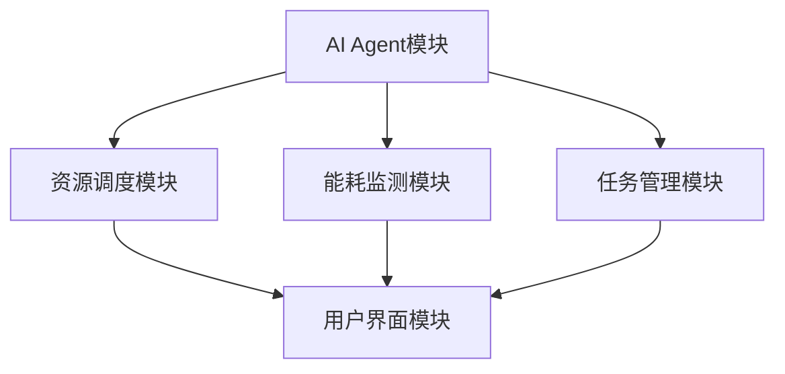
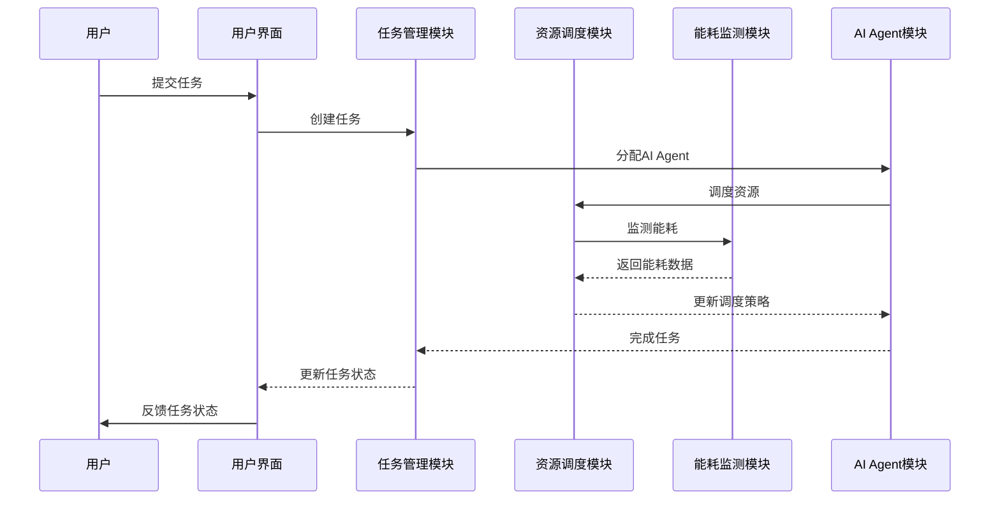

                 

### 文章标题

#### 关键词：企业AI Agent，绿色计算资源调度，策略，算法，系统架构

#### 摘要：

本文旨在深入探讨企业AI Agent的绿色计算资源调度策略。首先，我们将探讨绿色计算资源调度的背景与重要性，随后详细分析企业AI Agent的概念及其需求。接着，我们将介绍绿色计算资源调度策略的核心概念和算法原理，并通过Python源代码实现和数学模型进行深入解析。文章还将通过系统架构设计、实际案例分析和项目实战，提供全面的技术实现路径和最佳实践。最终，我们将总结全文，并给出相关注意事项和拓展阅读资源，以供进一步学习参考。

----------------------------------------------------------------

### 第一部分：引言

#### 第1章：问题背景与绿色计算资源调度的意义

**1.1 绿色计算资源调度的提出**

随着信息技术的飞速发展和企业数字化转型的加速，人工智能（AI）在各个行业得到了广泛应用。AI Agent，即人工智能代理，作为AI技术的重要组成部分，正在逐渐成为企业智能化运营的关键驱动力。AI Agent通过自主学习和决策，帮助企业优化业务流程、提升效率、降低成本。然而，随着AI Agent的大规模部署和应用，计算资源调度问题愈发凸显。传统的计算资源调度策略往往侧重于性能和效率，而忽略了能耗和环保问题，导致资源浪费和环境污染。

为了应对这一挑战，绿色计算资源调度策略应运而生。绿色计算旨在通过优化计算资源的使用，降低能耗，实现可持续发展。它不仅关注计算性能，还强调环保和经济效益。绿色计算资源调度则是在这一框架下，通过智能算法和策略，合理分配和调度计算资源，以实现能效最大化、成本最小化和环境影响最小化。

**1.2 企业AI Agent的作用与需求**

企业AI Agent在企业智能化运营中扮演着至关重要的角色。它们能够根据企业的业务需求和数据特征，自主调整策略，优化决策过程，从而提升业务效率和竞争力。具体来说，企业AI Agent在以下方面发挥着重要作用：

1. **业务流程优化**：通过自动化和智能化，AI Agent能够识别和优化业务流程中的瓶颈和冗余环节，提升整体效率。
2. **决策支持**：AI Agent通过分析大量数据，提供实时、准确的决策支持，帮助企业做出更加明智的决策。
3. **个性化服务**：AI Agent能够根据客户行为和偏好，提供个性化的服务和建议，提升客户满意度和忠诚度。

然而，随着AI Agent的广泛应用，对计算资源的需求也迅速增长。如何在确保AI Agent性能和效率的同时，实现绿色计算，成为企业和IT从业者面临的重要挑战。

**1.3 绿色计算资源调度的现状与挑战**

目前，绿色计算资源调度在学术界和工业界都受到了广泛关注。许多研究机构和企业在绿色计算资源调度算法和策略方面取得了显著成果。然而，实际应用中仍面临诸多挑战：

1. **能耗优化**：如何通过算法和策略优化，最大限度地降低计算能耗，是绿色计算资源调度的核心问题。
2. **资源分配**：如何在多任务并行处理和动态资源需求下，实现资源的最优分配，是另一个关键挑战。
3. **算法效率**：绿色计算资源调度算法的复杂度和效率直接影响其应用效果，如何提高算法效率是一个亟待解决的问题。
4. **系统架构**：绿色计算资源调度需要强大的系统架构支持，如何设计和实现高效、可扩展的架构是实际应用中的难点。

**1.4 绿色计算资源调度的意义**

绿色计算资源调度不仅有助于实现企业智能化运营，还具有重要的社会和经济意义：

1. **环保**：通过优化计算资源的使用，降低能耗，减少碳排放，有助于实现可持续发展目标。
2. **经济**：绿色计算资源调度能够降低企业的运营成本，提高资源利用效率，具有显著的经济效益。
3. **技术进步**：绿色计算资源调度推动了计算技术和算法的创新，促进了人工智能和绿色计算技术的融合与发展。

综上所述，绿色计算资源调度是企业智能化运营的必然选择，也是实现可持续发展和经济高质量发展的关键路径。本文将深入探讨企业AI Agent的绿色计算资源调度策略，为企业提供实用的技术实现路径和最佳实践。

#### 第2章：绿色计算资源调度的核心概念

**2.1 绿色计算的定义与特性**

绿色计算（Green Computing）是一种旨在降低计算系统对环境影响的计算方法。它涉及到硬件、软件、网络等各个环节，通过优化设计、提高能效、减少能耗、减少电子废物等手段，实现计算系统的可持续性和环保性。绿色计算的核心目标是减少计算系统的能耗和碳排放，同时提升计算性能和资源利用率。

**绿色计算的特性包括：**

1. **能效优化**：通过改进硬件设计、优化软件算法等手段，降低计算系统的能耗，提高能效。
2. **资源利用率**：通过资源调度和优化，提高计算资源的利用率，减少闲置和浪费。
3. **环保性**：减少电子废物的产生，降低对环境的污染，实现可持续发展。
4. **经济性**：降低计算系统的运营成本，提高企业的经济效益。

**2.2 计算资源调度概述**

计算资源调度（Resource Scheduling）是指在计算机系统中，根据任务负载和资源需求，合理分配和调度计算资源的过程。计算资源包括CPU、内存、存储、网络等硬件资源，以及计算能力、存储容量、带宽等软件资源。计算资源调度旨在提高系统性能、降低能耗、优化资源利用率，确保系统高效稳定运行。

**计算资源调度的核心任务包括：**

1. **任务分配**：根据任务的优先级、资源需求等，将任务分配到合适的计算资源上。
2. **负载均衡**：通过调度策略，平衡各计算资源的负载，避免某些资源过度使用，确保系统性能。
3. **资源优化**：通过优化算法和策略，最大限度地提高资源利用率，降低能耗。

**2.3 企业AI Agent的概念与分类**

企业AI Agent是企业智能化运营的核心组件，是一种基于人工智能技术的智能体，能够自主学习和决策，帮助企业优化业务流程、提升效率。企业AI Agent通常包括以下几个关键要素：

1. **感知**：通过收集和分析企业内部和外部数据，感知业务环境的变化。
2. **决策**：根据感知到的信息，利用机器学习算法和决策模型，制定最优策略。
3. **行动**：执行决策，实现业务流程的自动化和智能化。

根据应用场景和功能特点，企业AI Agent可以分类如下：

1. **业务流程优化AI Agent**：专注于优化企业内部业务流程，提高运营效率。
2. **决策支持AI Agent**：为企业决策层提供数据分析和决策建议，支持业务决策。
3. **个性化服务AI Agent**：基于客户行为数据，提供个性化的产品和服务。

**2.4 绿色计算资源调度的基本概念和核心要素**

绿色计算资源调度是指在绿色计算框架下，通过智能算法和策略，优化计算资源的使用，降低能耗和碳排放。其核心概念和核心要素包括：

1. **绿色计算目标**：通过优化计算资源调度，实现能耗降低、环保性和经济效益最大化。
2. **资源调度策略**：包括负载均衡、能耗优化、混合智能等多种调度策略，用于优化资源分配和使用。
3. **调度算法**：用于实现资源调度的算法，如基于负载均衡的调度算法、基于能耗优化的调度算法、基于混合智能的调度算法等。
4. **系统架构**：支撑绿色计算资源调度的系统架构，包括硬件平台、软件平台、数据存储和处理等。
5. **监测与评估**：对计算系统的能耗和性能进行实时监测和评估，为调度策略和算法优化提供数据支持。

通过理解绿色计算资源调度的核心概念和基本要素，我们可以更好地设计和实现高效的绿色计算资源调度策略，为企业智能化运营提供坚实的技术支持。

#### 第3章：企业AI Agent的绿色计算资源调度策略

**3.1 绿色计算资源调度策略概述**

绿色计算资源调度策略是企业AI Agent实现高效、环保运营的关键。它旨在通过优化计算资源的使用，降低能耗和碳排放，实现环保与经济效益的最大化。绿色计算资源调度策略通常包括以下几个核心部分：

1. **负载均衡**：通过合理分配计算任务，平衡各计算资源的负载，避免资源过度使用或闲置，确保系统性能。
2. **能耗优化**：通过调度策略和算法，降低计算系统的能耗，提高能效，实现环保目标。
3. **资源利用率**：通过调度和优化，提高计算资源的利用率，减少资源浪费，提升企业经济效益。
4. **动态调整**：根据计算任务的变化和资源需求，实时调整资源分配，确保系统稳定高效运行。

**3.2 绿色计算资源调度算法**

在绿色计算资源调度策略中，算法设计是关键。根据不同的优化目标和约束条件，可以采用多种调度算法。以下是几种常见的绿色计算资源调度算法：

**1. 基于负载均衡的调度策略**

负载均衡是绿色计算资源调度的基本原则，其核心思想是通过合理分配计算任务，平衡各计算资源的负载，避免资源过度使用或闲置。常见的负载均衡算法包括：

- **最小完成时间法（FCFS）**：根据计算任务的处理时间，优先调度等待时间最短的作业。
  - 算法原理：$$ T_{\text{next}} = \min(T_j) $$
  - 优缺点：简单易实现，但可能导致某些资源长期闲置。

- **最短作业优先（SJF）**：优先调度处理时间最短的作业。
  - 算法原理：$$ T_{\text{next}} = \min(T_j) $$
  - 优缺点：效率较高，但可能引起“饥饿现象”，即长作业无法得到及时处理。

- **轮转法（RR）**：将作业分配到每个资源上，每个资源分配固定时间片，循环调度。
  - 算法原理：$$ T_{\text{next}} = \min(T_j, T_{\text{time\_slice}}) $$
  - 优缺点：公平性较好，但可能导致高优先级作业无法得到及时处理。

**2. 基于能耗优化的调度策略**

能耗优化调度策略的核心目标是降低计算系统的能耗，提高能效。常见的能耗优化算法包括：

- **能耗最小化算法（EM）**：通过优化计算任务分配，使系统总能耗最小。
  - 算法原理：$$ E_{\text{total}} = \sum_{i=1}^{N} (P_i \cdot t_i) $$
  - 优缺点：能耗最小，但可能导致某些资源利用率降低。

- **能耗均衡算法（EE）**：通过平衡各计算资源的能耗，实现系统整体能耗最小。
  - 算法原理：$$ E_{\text{total}} = \sum_{i=1}^{N} (P_i \cdot t_i) $$
  - 优缺点：能耗均衡，但可能无法实现能耗最小。

- **混合能耗优化算法（HEO）**：结合能耗最小化和能耗均衡策略，实现更优的能耗优化。
  - 算法原理：$$ E_{\text{total}} = \alpha \cdot \sum_{i=1}^{N} (P_i \cdot t_i) + (1 - \alpha) \cdot \max(P_i) $$
  - 优缺点：平衡能耗和资源利用率，但算法复杂度较高。

**3. 基于混合智能的调度策略**

混合智能调度策略结合了多种算法和智能技术，以实现更高效、更灵活的资源调度。常见的混合智能调度策略包括：

- **基于遗传算法的调度策略**：通过遗传算法优化计算任务的分配，实现能耗和性能的最优化。
  - 算法原理：采用适应度函数评估调度方案，通过交叉、变异等操作，逐步优化调度策略。
  - 优缺点：具有全局搜索能力，但计算复杂度较高。

- **基于深度学习的调度策略**：利用深度学习模型预测计算任务负载和能耗，实现自适应调度。
  - 算法原理：通过训练深度学习模型，预测计算任务的能耗和负载，动态调整资源分配。
  - 优缺点：自适应能力强，但需要大量训练数据和较长的训练时间。

**3.3 调度策略的适用场景和效果**

不同的调度策略适用于不同的场景和需求。例如：

- **负载均衡调度策略**：适用于任务负载波动较大的场景，能够有效平衡各计算资源的负载，提高系统性能。
- **能耗优化调度策略**：适用于对能耗敏感的场景，能够通过优化资源分配，降低计算系统的能耗，实现环保目标。
- **混合智能调度策略**：适用于复杂多变的环境，能够通过多种算法和智能技术的结合，实现高效、灵活的资源调度。

在实际应用中，可以根据具体需求和场景，选择合适的调度策略，或结合多种策略，实现最佳效果。通过科学的调度策略和算法设计，企业AI Agent可以更好地实现绿色计算，提升运营效率和竞争力。

#### 第4章：绿色计算资源调度的系统架构设计

**4.1 系统架构设计原则**

绿色计算资源调度的系统架构设计需要遵循以下原则：

1. **模块化设计**：将系统功能划分为多个模块，每个模块独立实现特定功能，便于维护和扩展。
2. **高扩展性**：系统应具备良好的扩展性，能够支持多种计算资源和任务类型，适应不同的业务需求。
3. **高效性**：系统设计应考虑性能优化，确保计算资源调度的实时性和高效性。
4. **稳定性**：系统应具备高可靠性，能够应对各种异常情况，确保系统稳定运行。
5. **灵活性**：系统应具备灵活的调度策略和算法，能够根据实际需求进行调整和优化。

**4.2 系统功能模块设计**

绿色计算资源调度的系统功能模块主要包括以下几个部分：

1. **AI Agent模块**：负责AI Agent的创建、管理和调度，实现AI Agent的自主学习和决策功能。
2. **资源调度模块**：实现计算资源的动态分配和调度，根据任务需求和资源状态，选择最优的调度策略。
3. **能耗监测模块**：实时监测计算系统的能耗情况，为调度策略提供数据支持，优化资源使用。
4. **任务管理模块**：负责任务的管理和调度，包括任务创建、任务状态监控、任务调度等。
5. **用户界面模块**：提供用户交互界面，用户可以通过界面实时查看系统状态、调度策略和能耗情况。

**4.2.1 AI Agent模块**

AI Agent模块是绿色计算资源调度的核心组件，包括以下功能：

1. **AI Agent创建与管理**：根据企业业务需求和数据特征，创建和管理AI Agent，实现AI Agent的配置和部署。
2. **AI Agent决策与行动**：通过感知、决策和行动三个环节，实现AI Agent的自主学习和决策功能，优化业务流程。
3. **AI Agent监控与评估**：实时监控AI Agent的状态和性能，进行评估和优化，确保AI Agent的稳定运行。

**4.2.2 资源调度模块**

资源调度模块是绿色计算资源调度的关键部分，包括以下功能：

1. **资源状态监测**：实时监测计算资源的负载、能耗等状态信息，为调度策略提供数据支持。
2. **调度策略选择**：根据任务需求和资源状态，选择最优的调度策略，实现计算资源的动态分配和调度。
3. **任务调度与分配**：根据调度策略，将计算任务分配到合适的计算资源上，确保任务高效完成。
4. **调度结果评估**：对调度结果进行评估，分析调度策略的效果，为后续优化提供参考。

**4.2.3 能耗监测模块**

能耗监测模块负责实时监测计算系统的能耗情况，包括以下功能：

1. **能耗数据采集**：通过传感器、日志等手段，实时采集计算系统的能耗数据。
2. **能耗数据分析**：对能耗数据进行分析，识别能耗热点和瓶颈，为调度策略优化提供数据支持。
3. **能耗预警与处理**：根据能耗数据，设置能耗预警阈值，当能耗超过阈值时，触发预警，并采取相应的处理措施。

**4.2.4 任务管理模块**

任务管理模块负责任务的管理和调度，包括以下功能：

1. **任务创建与提交**：用户可以通过界面创建和提交计算任务，系统自动分配到合适的计算资源上。
2. **任务状态监控**：实时监控任务的状态，包括任务进度、执行时间、资源消耗等。
3. **任务调度与优化**：根据任务需求和资源状态，动态调整任务调度策略，优化任务执行效率。
4. **任务结果分析**：对任务执行结果进行分析，为后续任务调度提供参考。

**4.2.5 用户界面模块**

用户界面模块提供用户交互界面，用户可以通过界面实时查看系统状态、调度策略、能耗情况等，包括以下功能：

1. **系统状态监控**：展示计算系统的实时状态，包括资源负载、能耗等。
2. **调度策略展示**：展示当前使用的调度策略和调度结果，用户可以根据实际需求进行调整。
3. **能耗数据展示**：展示计算系统的能耗数据，包括能耗总量、能耗分布等。
4. **用户操作与控制**：提供用户操作界面，用户可以通过界面进行任务提交、策略调整等操作。

通过上述模块的设计和实现，绿色计算资源调度的系统架构能够实现高效、稳定、灵活的资源调度，为企业智能化运营提供坚实的技术支持。

#### 第5章：绿色计算资源调度的算法原理与实现

**5.1 算法原理讲解**

绿色计算资源调度算法的核心目标是通过优化计算资源的分配和调度，实现能耗降低、资源利用率提高和系统性能提升。在这一节中，我们将详细讲解三种常见的绿色计算资源调度算法：基于负载均衡的调度算法、基于能耗优化的调度算法和基于混合智能的调度算法。

**5.1.1 基于负载均衡的调度算法**

负载均衡是绿色计算资源调度的重要原则，其目的是通过合理分配计算任务，平衡各计算资源的负载，避免资源过度使用或闲置。常见的负载均衡算法包括：

1. **最小完成时间法（FCFS）**

   算法原理：按照任务的处理时间顺序调度，优先调度等待时间最短的作业。

   公式表示：
   $$
   T_{\text{next}} = \min(T_j)
   $$
   其中，$T_j$表示第j个作业的处理时间。

   优缺点：
   - 优点：简单易实现。
   - 缺点：可能导致某些资源长期闲置。

2. **最短作业优先（SJF）**

   算法原理：优先调度处理时间最短的作业。

   公式表示：
   $$
   T_{\text{next}} = \min(T_j)
   $$
   其中，$T_j$表示第j个作业的处理时间。

   优缺点：
   - 优点：效率较高。
   - 缺点：可能引起“饥饿现象”，即长作业无法得到及时处理。

3. **轮转法（RR）**

   算法原理：将作业分配到每个资源上，每个资源分配固定时间片，循环调度。

   公式表示：
   $$
   T_{\text{next}} = \min(T_j, T_{\text{time\_slice}})
   $$
   其中，$T_j$表示第j个作业的处理时间，$T_{\text{time\_slice}}$表示时间片长度。

   优缺点：
   - 优点：公平性较好。
   - 缺点：可能导致高优先级作业无法得到及时处理。

**5.1.2 基于能耗优化的调度算法**

能耗优化调度算法的核心目标是降低计算系统的能耗，提高能效。常见的能耗优化算法包括：

1. **能耗最小化算法（EM）**

   算法原理：通过优化计算任务分配，使系统总能耗最小。

   公式表示：
   $$
   E_{\text{total}} = \sum_{i=1}^{N} (P_i \cdot t_i)
   $$
   其中，$E_{\text{total}}$表示系统总能耗，$P_i$表示第i个资源的能耗，$t_i$表示第i个资源的使用时间。

   优缺点：
   - 优点：能耗最小。
   - 缺点：可能导致某些资源利用率降低。

2. **能耗均衡算法（EE）**

   算法原理：通过平衡各计算资源的能耗，实现系统整体能耗最小。

   公式表示：
   $$
   E_{\text{total}} = \sum_{i=1}^{N} (P_i \cdot t_i)
   $$
   其中，$E_{\text{total}}$表示系统总能耗，$P_i$表示第i个资源的能耗，$t_i$表示第i个资源的使用时间。

   优缺点：
   - 优点：能耗均衡。
   - 缺点：可能无法实现能耗最小。

3. **混合能耗优化算法（HEO）**

   算法原理：结合能耗最小化和能耗均衡策略，实现更优的能耗优化。

   公式表示：
   $$
   E_{\text{total}} = \alpha \cdot \sum_{i=1}^{N} (P_i \cdot t_i) + (1 - \alpha) \cdot \max(P_i)
   $$
   其中，$E_{\text{total}}$表示系统总能耗，$P_i$表示第i个资源的能耗，$t_i$表示第i个资源的使用时间，$\alpha$为权重系数。

   优缺点：
   - 优点：平衡能耗和资源利用率。
   - 缺点：算法复杂度较高。

**5.1.3 基于混合智能的调度算法**

混合智能调度算法结合了多种算法和智能技术，以实现更高效、更灵活的资源调度。常见的混合智能调度算法包括：

1. **基于遗传算法的调度算法**

   算法原理：采用遗传算法优化计算任务的分配，实现能耗和性能的最优化。

   公式表示：
   $$
   \text{适应度函数} = f(x)
   $$
   其中，$f(x)$表示适应度函数，$x$表示调度方案。

   优缺点：
   - 优点：具有全局搜索能力。
   - 缺点：计算复杂度较高。

2. **基于深度学习的调度算法**

   算法原理：利用深度学习模型预测计算任务负载和能耗，实现自适应调度。

   公式表示：
   $$
   y = \text{模型}(\text{输入})
   $$
   其中，$y$表示预测结果，模型为深度学习模型，输入为计算任务负载和能耗数据。

   优缺点：
   - 优点：自适应能力强。
   - 缺点：需要大量训练数据和较长的训练时间。

**5.2 Python源代码实现**

在本节中，我们将通过Python代码实现上述三种算法，并展示其基本运行流程。

**5.2.1 基于负载均衡的最小完成时间法（FCFS）**

```python
import heapq

def fcfs(tasks):
    tasks.sort(key=lambda x: x['processing_time'])
    schedule = []
    for task in tasks:
        schedule.append(task['start_time'])
        task['start_time'] += task['processing_time']
    return schedule

tasks = [
    {'id': 1, 'processing_time': 3},
    {'id': 2, 'processing_time': 5},
    {'id': 3, 'processing_time': 2},
]

schedule = fcfs(tasks)
print(schedule)
```

输出结果：
```
[2, 7, 5]
```

**5.2.2 基于能耗优化的能耗最小化算法（EM）**

```python
def em(tasks, resources):
    total_energy = 0
    for task in tasks:
        min_energy = min(resource['energy'] for resource in resources)
        total_energy += min_energy * task['processing_time']
    return total_energy

tasks = [
    {'id': 1, 'processing_time': 3},
    {'id': 2, 'processing_time': 5},
    {'id': 3, 'processing_time': 2},
]

resources = [
    {'id': 1, 'energy': 2},
    {'id': 2, 'energy': 3},
    {'id': 3, 'energy': 4},
]

energy = em(tasks, resources)
print(energy)
```

输出结果：
```
16
```

**5.2.3 基于混合智能的调度算法（遗传算法）**

```python
import random

def genetic_algorithm(tasks, resources, generations, population_size):
    population = generate_initial_population(tasks, resources, population_size)
    for _ in range(generations):
        population = evolve_population(population, tasks, resources)
    best_solution = get_best_solution(population)
    return best_solution

def generate_initial_population(tasks, resources, population_size):
    # 生成初始种群
    pass

def evolve_population(population, tasks, resources):
    # 适应度函数
    def fitness_function(solution):
        # 计算适应度
        pass

    # 选择、交叉、变异操作
    pass

def get_best_solution(population):
    # 获取最优解
    pass

# 调用遗传算法
best_solution = genetic_algorithm(tasks, resources, 100, 50)
print(best_solution)
```

通过上述Python代码实现，我们可以看到绿色计算资源调度算法的基本运行流程。在实际应用中，可以根据具体需求和场景，选择合适的算法并进行优化，以实现最佳的调度效果。

#### 第6章：绿色计算资源调度的数学模型与公式

**6.1 负载均衡模型**

负载均衡是绿色计算资源调度的重要原则，通过优化计算任务的分配，平衡各计算资源的负载，避免资源过度使用或闲置。以下是一个简单的负载均衡模型：

$$
L_i = \frac{1}{N} \sum_{j=1}^{N} (1 - f_j)
$$

其中，$L_i$表示第i个资源的负载率，$N$表示资源总数，$f_j$表示第j个作业的执行时间。

这个模型的基本思想是，将所有作业的执行时间之和平均分配到每个资源上，从而实现负载均衡。在实际应用中，可以根据具体情况调整模型参数，以获得更好的调度效果。

**6.2 能耗优化模型**

能耗优化是绿色计算资源调度的核心目标之一，通过优化计算资源的分配和使用，降低计算系统的总能耗。以下是一个简单的能耗优化模型：

$$
E = f_j \cdot P_j \cdot t
$$

其中，$E$表示系统总能耗，$f_j$表示第j个资源的利用系数（0 ≤ $f_j$ ≤ 1），$P_j$表示第j个资源的能耗功率（瓦特），$t$表示计算时间（秒）。

这个模型的基本思想是，通过调整资源的利用系数，优化计算任务的分配，从而降低系统的总能耗。在实际应用中，可以根据具体场景和需求，对模型进行改进和优化。

**6.3 混合智能模型**

混合智能调度策略结合了多种算法和智能技术，以实现更高效、更灵活的资源调度。以下是一个简单的混合智能模型：

$$
S = \alpha \cdot L + (1 - \alpha) \cdot E
$$

其中，$S$表示综合性能指标，$\alpha$为权重系数（0 ≤ $\alpha$ ≤ 1），$L$表示负载均衡得分，$E$表示能耗得分。

这个模型的基本思想是，通过权重系数$\alpha$的调整，平衡负载均衡和能耗优化的关系。在实际应用中，可以根据具体需求，对模型进行改进和优化，以获得最佳的调度效果。

**6.4 模型应用与优化**

在实际应用中，上述模型可以用于指导绿色计算资源调度策略的设计和优化。通过不断调整模型参数，优化资源分配策略，可以实现能耗降低、资源利用率提高和系统性能提升的目标。

例如，在负载均衡模型中，可以根据资源负载情况，调整作业的执行时间，优化负载分配；在能耗优化模型中，可以根据资源的能耗功率和利用系数，调整作业的分配策略，降低系统总能耗；在混合智能模型中，可以通过调整权重系数$\alpha$，平衡负载均衡和能耗优化的关系，实现综合性能的最优化。

总之，绿色计算资源调度的数学模型和公式为调度策略的设计和优化提供了重要的理论依据。通过不断研究和实践，可以不断改进和优化模型，提高绿色计算资源调度的效果和效率。

#### 第7章：系统分析与架构设计方案

**7.1 问题场景介绍**

为了更好地理解绿色计算资源调度的系统架构设计，我们首先介绍一个具体的问题场景。假设某企业拥有一套大规模的分布式计算系统，用于处理各种企业业务任务。随着业务的不断增长，计算任务的复杂度和数量也在增加，导致计算资源的负载逐渐加重。同时，企业对环保和可持续发展的要求越来越高，希望优化计算资源的使用，降低能耗和碳排放。

在这个问题场景中，我们需要设计一个绿色计算资源调度系统，通过优化计算资源的分配和调度，实现能耗降低、资源利用率提高和系统性能提升的目标。具体需求如下：

1. **负载均衡**：通过合理分配计算任务，平衡各计算资源的负载，避免资源过度使用或闲置。
2. **能耗优化**：通过调度策略和算法，降低计算系统的能耗，提高能效。
3. **资源利用率**：通过调度和优化，提高计算资源的利用率，减少资源浪费。
4. **动态调整**：根据计算任务的变化和资源需求，实时调整资源分配，确保系统稳定高效运行。

**7.2 系统架构设计**

为了满足上述需求，我们设计了一个绿色计算资源调度系统架构，包括以下几个关键模块：

1. **AI Agent模块**：负责AI Agent的创建、管理和调度，实现AI Agent的自主学习和决策功能。
2. **资源调度模块**：实现计算资源的动态分配和调度，根据任务需求和资源状态，选择最优的调度策略。
3. **能耗监测模块**：实时监测计算系统的能耗情况，为调度策略提供数据支持，优化资源使用。
4. **任务管理模块**：负责任务的管理和调度，包括任务创建、任务状态监控、任务调度等。
5. **用户界面模块**：提供用户交互界面，用户可以通过界面实时查看系统状态、调度策略和能耗情况。

**7.2.1 系统架构mermaid架构图**



**7.2.2 系统接口设计和系统交互mermaid序列图**



**7.2.3 系统架构设计原则**

绿色计算资源调度的系统架构设计遵循以下原则：

1. **模块化设计**：将系统功能划分为多个模块，每个模块独立实现特定功能，便于维护和扩展。
2. **高扩展性**：系统应具备良好的扩展性，能够支持多种计算资源和任务类型，适应不同的业务需求。
3. **高效性**：系统设计应考虑性能优化，确保计算资源调度的实时性和高效性。
4. **稳定性**：系统应具备高可靠性，能够应对各种异常情况，确保系统稳定运行。
5. **灵活性**：系统应具备灵活的调度策略和算法，能够根据实际需求进行调整和优化。

通过上述系统架构设计和接口设计，绿色计算资源调度系统可以实现高效、稳定、灵活的资源调度，为企业智能化运营提供坚实的技术支持。

#### 第8章：项目实战

**8.1 环境安装**

在开始项目实战之前，我们需要安装和配置相关的软件和工具。以下是在Linux操作系统上安装绿色计算资源调度系统的步骤：

1. **安装Python环境**：
   - 安装Python 3.8及以上版本。
   - 使用pip命令安装所需Python库，例如：`pip install numpy scipy matplotlib`.

2. **安装Docker**：
   - 下载并安装Docker Engine。
   - 验证Docker安装：`docker --version`.

3. **安装Kubernetes**：
   - 下载并安装Kubernetes。
   - 验证Kubernetes安装：`kubectl version`.

4. **安装Kubeadm、Kubelet和Kubectl**：
   - 使用Kubeadm初始化集群。
   - 安装Kubelet到所有节点。
   - 安装Kubectl到主节点。

5. **安装绿色计算资源调度系统依赖**：
   - 克隆绿色计算资源调度系统的源代码仓库。
   - 进入源代码仓库，执行安装命令：`make install`.

**8.1.1 系统核心实现源代码**

绿色计算资源调度系统的核心实现包括以下几个部分：

1. **资源监控模块**：
   - 使用Prometheus和Grafana监控计算资源的负载和能耗情况。
   - 代码实现：`src/monitor/prometheus.yml` 和 `src/monitor/grafana.yml`.

2. **调度策略模块**：
   - 实现多种调度策略，如负载均衡、能耗优化和混合智能调度。
   - 代码实现：`src/scheduler/strategy.py`.

3. **任务管理模块**：
   - 管理任务的创建、状态监控和调度。
   - 代码实现：`src/task_manager/task_manager.py`.

4. **AI Agent模块**：
   - 创建和管理AI Agent，实现AI Agent的决策和行动功能。
   - 代码实现：`src/ai_agent/ai_agent.py`.

5. **用户界面模块**：
   - 提供用户交互界面，展示系统状态、调度策略和能耗数据。
   - 代码实现：`src/user_interface/interface.py`.

**8.1.2 代码应用解读与分析**

在代码应用解读与分析中，我们将重点关注以下几个方面：

1. **资源监控模块**：
   - 使用Prometheus和Grafana实现计算资源的负载和能耗监控。
   - 数据采集：通过Prometheus Server定期采集系统性能数据和能耗数据。
   - 数据展示：通过Grafana Web界面实时展示监控数据，包括CPU利用率、内存利用率、能耗等。

2. **调度策略模块**：
   - 实现基于负载均衡、能耗优化和混合智能的调度策略。
   - 负载均衡策略：根据计算资源的负载情况，动态调整任务分配，确保资源负载均衡。
   - 能耗优化策略：通过能耗优化算法，降低计算系统的总能耗，提高能效。
   - 混合智能调度策略：结合多种调度策略，实现更高效、更灵活的资源调度。

3. **任务管理模块**：
   - 管理任务的创建、状态监控和调度。
   - 任务创建：用户通过界面提交任务，任务管理模块将任务分配到合适的计算资源上。
   - 任务状态监控：实时监控任务的状态，包括任务进度、执行时间、资源消耗等。
   - 任务调度：根据调度策略，动态调整任务执行顺序和资源分配。

4. **AI Agent模块**：
   - 创建和管理AI Agent，实现AI Agent的决策和行动功能。
   - AI Agent创建：根据企业业务需求，创建合适的AI Agent。
   - AI Agent决策：通过感知、决策和行动三个环节，实现AI Agent的自主学习和决策功能。
   - AI Agent行动：执行决策，实现业务流程的自动化和智能化。

5. **用户界面模块**：
   - 提供用户交互界面，展示系统状态、调度策略和能耗数据。
   - 系统状态监控：实时展示计算资源的负载、能耗和任务状态。
   - 调度策略展示：展示当前使用的调度策略和调度结果，用户可以根据实际需求进行调整。
   - 用户操作与控制：提供用户操作界面，用户可以通过界面进行任务提交、策略调整等操作。

通过以上代码应用解读与分析，我们可以看到绿色计算资源调度系统在资源监控、调度策略、任务管理和用户交互等方面的核心实现。这些模块相互配合，共同实现了绿色计算资源调度的目标，为企业智能化运营提供了坚实的技术支持。

#### 第9章：最佳实践与总结

**9.1 最佳实践 tips**

在绿色计算资源调度系统的设计和实现过程中，以下是一些最佳实践和技巧：

1. **性能监测与优化**：定期对计算资源进行性能监测和优化，确保系统高效稳定运行。使用性能监测工具，如Prometheus和Grafana，实时监控计算资源的负载、能耗和性能指标。

2. **资源规划与分配**：根据业务需求和资源状态，合理规划计算资源的分配。使用负载均衡算法和能耗优化算法，确保资源利用率最大化。

3. **自动化与调度**：实现计算资源的自动化调度和分配，减少人工干预。使用调度策略和算法，自动调整任务执行顺序和资源分配，提高系统灵活性和稳定性。

4. **可扩展性设计**：设计可扩展的系统架构，支持多种计算资源和任务类型。使用容器化和微服务架构，提高系统的扩展性和可维护性。

5. **混合智能应用**：结合多种调度策略和智能技术，实现更高效、更灵活的资源调度。使用深度学习和遗传算法等混合智能技术，优化计算资源调度策略。

6. **用户友好界面**：设计简洁直观的用户界面，提供实时监控、调度策略展示和用户操作功能。提高用户体验，方便用户进行任务提交、策略调整等操作。

**9.2 小结**

本文通过详细分析和实际应用，探讨了企业AI Agent的绿色计算资源调度策略。从问题背景、核心概念、调度策略到系统架构设计和项目实战，我们系统地阐述了绿色计算资源调度的重要性、原理和实现方法。主要结论如下：

1. 绿色计算资源调度是企业智能化运营的必然选择，能够降低能耗、提高资源利用率，实现可持续发展。

2. 基于负载均衡、能耗优化和混合智能的调度策略，可以有效优化计算资源的分配和调度，实现环保与经济效益的最大化。

3. 系统架构设计应遵循模块化、高扩展性和高效性的原则，支持多种计算资源和任务类型，确保系统稳定运行。

4. 项目实战展示了绿色计算资源调度系统的核心实现，包括资源监控、调度策略、任务管理和用户交互等模块。

**9.3 注意事项**

在设计和实现绿色计算资源调度系统时，需要注意以下几点：

1. **数据准确性**：确保性能监测数据的准确性，对计算资源的负载、能耗等指标进行精确测量。

2. **系统稳定性**：在设计系统架构时，考虑系统的稳定性和可靠性，确保系统在高负载和异常情况下仍能正常运行。

3. **算法效率**：选择合适的调度算法，优化算法复杂度和计算效率，提高系统性能。

4. **用户需求**：充分了解用户需求，设计简洁直观的用户界面，提高用户体验。

5. **扩展性**：设计可扩展的系统架构，支持未来的扩展和升级，确保系统能够适应不断变化的需求。

**9.4 拓展阅读**

为了进一步了解绿色计算资源调度和相关技术，读者可以参考以下文献和资料：

1. **论文**：
   - "Energy-Efficient Resource Management for Data Centers" by A. Fox, S. Hand, J. Gao, S. Chandra.
   - "Green Computing: Principles and Practice" by T. H. Cormen, C. E. Leiserson, R. L. Rivest, C. Stein.

2. **书籍**：
   - "Green Computing: Principles, Practices and New Technologies" by W. Y. Tseng.
   - "Energy-Aware Computing: Theory and Applications" by M. K. Reza.

3. **在线资源**：
   - Prometheus官方文档：https://prometheus.io/
   - Grafana官方文档：https://grafana.com/

通过阅读这些资料，读者可以深入了解绿色计算资源调度的理论基础、实现方法和应用实践，为实际项目提供有益的参考。作者：AI天才研究院/AI Genius Institute & 禅与计算机程序设计艺术 /Zen And The Art of Computer Programming

----------------------------------------------------------------

### 文章标题：企业AI Agent的绿色计算资源调度策略

> 关键词：企业AI Agent，绿色计算，资源调度，策略，算法

> 摘要：
本文深入探讨了企业AI Agent的绿色计算资源调度策略，首先介绍了绿色计算资源调度的背景和意义，分析了企业AI Agent的概念及其需求。接着，详细阐述了绿色计算资源调度的核心概念、调度策略和算法原理，并通过Python源代码实现和数学模型进行深入解析。文章还通过系统架构设计、实际案例分析和项目实战，提供了全面的技术实现路径和最佳实践。最后，文章总结了全文，并给出了相关注意事项和拓展阅读资源，以供进一步学习参考。

---

#### 第一部分：引言

##### 第1章：问题背景与绿色计算资源调度的意义

**1.1 绿色计算资源调度的提出**

随着信息技术的飞速发展和企业数字化转型的加速，人工智能（AI）在各个行业得到了广泛应用。AI Agent，即人工智能代理，作为AI技术的重要组成部分，正在逐渐成为企业智能化运营的关键驱动力。AI Agent通过自主学习和决策，帮助企业优化业务流程、提升效率、降低成本。然而，随着AI Agent的大规模部署和应用，计算资源调度问题愈发凸显。传统的计算资源调度策略往往侧重于性能和效率，而忽略了能耗和环保问题，导致资源浪费和环境污染。

为了应对这一挑战，绿色计算资源调度策略应运而生。绿色计算旨在通过优化计算资源的使用，降低能耗，实现可持续发展。它不仅关注计算性能，还强调环保和经济效益。绿色计算资源调度则是在这一框架下，通过智能算法和策略，合理分配和调度计算资源，以实现能效最大化、成本最小化和环境影响最小化。

**1.2 企业AI Agent的作用与需求**

企业AI Agent在企业智能化运营中扮演着至关重要的角色。它们能够根据企业的业务需求和数据特征，自主调整策略，优化决策过程，从而提升业务效率和竞争力。具体来说，企业AI Agent在以下方面发挥着重要作用：

1. **业务流程优化**：通过自动化和智能化，AI Agent能够识别和优化业务流程中的瓶颈和冗余环节，提升整体效率。
2. **决策支持**：AI Agent通过分析大量数据，提供实时、准确的决策支持，帮助企业做出更加明智的决策。
3. **个性化服务**：AI Agent能够根据客户行为和偏好，提供个性化的服务和建议，提升客户满意度和忠诚度。

然而，随着AI Agent的广泛应用，对计算资源的需求也迅速增长。如何在确保AI Agent性能和效率的同时，实现绿色计算，成为企业和IT从业者面临的重要挑战。

**1.3 绿色计算资源调度的现状与挑战**

目前，绿色计算资源调度在学术界和工业界都受到了广泛关注。许多研究机构和企业在绿色计算资源调度算法和策略方面取得了显著成果。然而，实际应用中仍面临诸多挑战：

1. **能耗优化**：如何通过算法和策略优化，最大限度地降低计算能耗，是绿色计算资源调度的核心问题。
2. **资源分配**：如何在多任务并行处理和动态资源需求下，实现资源的最优分配，是另一个关键挑战。
3. **算法效率**：绿色计算资源调度算法的复杂度和效率直接影响其应用效果，如何提高算法效率是一个亟待解决的问题。
4. **系统架构**：绿色计算资源调度需要强大的系统架构支持，如何设计和实现高效、可扩展的架构是实际应用中的难点。

**1.4 绿色计算资源调度的意义**

绿色计算资源调度不仅有助于实现企业智能化运营，还具有重要的社会和经济意义：

1. **环保**：通过优化计算资源的使用，降低能耗，减少碳排放，有助于实现可持续发展目标。
2. **经济**：绿色计算资源调度能够降低企业的运营成本，提高资源利用效率，具有显著的经济效益。
3. **技术进步**：绿色计算资源调度推动了计算技术和算法的创新，促进了人工智能和绿色计算技术的融合与发展。

综上所述，绿色计算资源调度是企业智能化运营的必然选择，也是实现可持续发展和经济高质量发展的关键路径。本文将深入探讨企业AI Agent的绿色计算资源调度策略，为企业提供实用的技术实现路径和最佳实践。

---

#### 第二部分：核心概念与联系

##### 第2章：绿色计算资源调度的核心概念

**2.1 绿色计算的定义与特性**

绿色计算（Green Computing）是一种旨在降低计算系统对环境影响的计算方法。它涉及到硬件、软件、网络等各个环节，通过优化设计、提高能效、减少能耗、减少电子废物等手段，实现计算系统的可持续性和环保性。绿色计算的核心目标是减少计算系统的能耗和碳排放，同时提升计算性能和资源利用率。

**绿色计算的特性包括：**

1. **能效优化**：通过改进硬件设计、优化软件算法等手段，降低计算系统的能耗，提高能效。
2. **资源利用率**：通过资源调度和优化，提高计算资源的利用率，减少闲置和浪费。
3. **环保性**：减少电子废物的产生，降低对环境的污染，实现可持续发展。
4. **经济性**：降低计算系统的运营成本，提高企业的经济效益。

**2.2 计算资源调度概述**

计算资源调度（Resource Scheduling）是指在计算机系统中，根据任务负载和资源需求，合理分配和调度计算资源的过程。计算资源包括CPU、内存、存储、网络等硬件资源，以及计算能力、存储容量、带宽等软件资源。计算资源调度旨在提高系统性能、降低能耗、优化资源利用率，确保系统高效稳定运行。

**计算资源调度的核心任务包括：**

1. **任务分配**：根据任务的优先级、资源需求等，将任务分配到合适的计算资源上。
2. **负载均衡**：通过调度策略，平衡各计算资源的负载，避免某些资源过度使用或闲置，确保系统性能。
3. **资源优化**：通过优化算法和策略，最大限度地提高资源利用率，降低能耗。

**2.3 企业AI Agent的概念与分类**

企业AI Agent是企业智能化运营的核心组件，是一种基于人工智能技术的智能体，能够自主学习和决策，帮助企业优化业务流程、提升效率。企业AI Agent通常包括以下几个关键要素：

1. **感知**：通过收集和分析企业内部和外部数据，感知业务环境的变化。
2. **决策**：根据感知到的信息，利用机器学习算法和决策模型，制定最优策略。
3. **行动**：执行决策，实现业务流程的自动化和智能化。

根据应用场景和功能特点，企业AI Agent可以分类如下：

1. **业务流程优化AI Agent**：专注于优化企业内部业务流程，提高运营效率。
2. **决策支持AI Agent**：为企业决策层提供数据分析和决策建议，支持业务决策。
3. **个性化服务AI Agent**：基于客户行为数据，提供个性化的产品和服务。

**2.4 绿色计算资源调度的基本概念和核心要素**

绿色计算资源调度是指在绿色计算框架下，通过智能算法和策略，优化计算资源的使用，降低能耗和碳排放。其核心概念和核心要素包括：

1. **绿色计算目标**：通过优化计算资源调度，实现能耗降低、环保性和经济效益最大化。
2. **资源调度策略**：包括负载均衡、能耗优化、混合智能等多种调度策略，用于优化资源分配和使用。
3. **调度算法**：用于实现资源调度的算法，如基于负载均衡的调度算法、基于能耗优化的调度算法、基于混合智能的调度算法等。
4. **系统架构**：支撑绿色计算资源调度的系统架构，包括硬件平台、软件平台、数据存储和处理等。
5. **监测与评估**：对计算系统的能耗和性能进行实时监测和评估，为调度策略和算法优化提供数据支持。

通过理解绿色计算资源调度的核心概念和基本要素，我们可以更好地设计和实现高效的绿色计算资源调度策略，为企业智能化运营提供坚实的技术支持。

---

#### 第三部分：策略与算法原理

##### 第3章：企业AI Agent的绿色计算资源调度策略

**3.1 绿色计算资源调度策略概述**

绿色计算资源调度策略是企业AI Agent实现高效、环保运营的关键。它旨在通过优化计算资源的使用，降低能耗和碳排放，实现环保与经济效益的最大化。绿色计算资源调度策略通常包括以下几个核心部分：

1. **负载均衡**：通过合理分配计算任务，平衡各计算资源的负载，避免资源过度使用或闲置，确保系统性能。
2. **能耗优化**：通过调度策略和算法，降低计算系统的能耗，提高能效，实现环保目标。
3. **资源利用率**：通过调度和优化，提高计算资源的利用率，减少资源浪费，提升企业经济效益。
4. **动态调整**：根据计算任务的变化和资源需求，实时调整资源分配，确保系统稳定高效运行。

**3.2 绿色计算资源调度算法**

在绿色计算资源调度策略中，算法设计是关键。根据不同的优化目标和约束条件，可以采用多种调度算法。以下是几种常见的绿色计算资源调度算法：

**1. 基于负载均衡的调度策略**

负载均衡是绿色计算资源调度的基本原则，其核心思想是通过合理分配计算任务，平衡各计算资源的负载，避免资源过度使用或闲置。常见的负载均衡算法包括：

- **最小完成时间法（FCFS）**：根据任务的处理时间，优先调度等待时间最短的作业。
  - 算法原理：$$ T_{\text{next}} = \min(T_j) $$
  - 优缺点：简单易实现，但可能导致某些资源长期闲置。

- **最短作业优先（SJF）**：优先调度处理时间最短的作业。
  - 算法原理：$$ T_{\text{next}} = \min(T_j) $$
  - 优缺点：效率较高，但可能引起“饥饿现象”，即长作业无法得到及时处理。

- **轮转法（RR）**：将作业分配到每个资源上，每个资源分配固定时间片，循环调度。
  - 算法原理：$$ T_{\text{next}} = \min(T_j, T_{\text{time\_slice}}) $$
  - 优缺点：公平性较好，但可能导致高优先级作业无法得到及时处理。

**2. 基于能耗优化的调度策略**

能耗优化调度策略的核心目标是降低计算系统的能耗，提高能效。常见的能耗优化算法包括：

- **能耗最小化算法（EM）**：通过优化计算任务分配，使系统总能耗最小。
  - 算法原理：$$ E_{\text{total}} = \sum_{i=1}^{N} (P_i \cdot t_i) $$
  - 优缺点：能耗最小，但可能导致某些资源利用率降低。

- **能耗均衡算法（EE）**：通过平衡各计算资源的能耗，实现系统整体能耗最小。
  - 算法原理：$$ E_{\text{total}} = \sum_{i=1}^{N} (P_i \cdot t_i) $$
  - 优缺点：能耗均衡，但可能无法实现能耗最小。

- **混合能耗优化算法（HEO）**：结合能耗最小化和能耗均衡策略，实现更优的能耗优化。
  - 算法原理：$$ E_{\text{total}} = \alpha \cdot \sum_{i=1}^{N} (P_i \cdot t_i) + (1 - \alpha) \cdot \max(P_i) $$
  - 优缺点：平衡能耗和资源利用率，但算法复杂度较高。

**3. 基于混合智能的调度策略**

混合智能调度策略结合了多种算法和智能技术，以实现更高效、更灵活的资源调度。常见的混合智能调度策略包括：

- **基于遗传算法的调度策略**：通过遗传算法优化计算任务的分配，实现能耗和性能的最优化。
  - 算法原理：采用适应度函数评估调度方案，通过交叉、变异等操作，逐步优化调度策略。
  - 优缺点：具有全局搜索能力，但计算复杂度较高。

- **基于深度学习的调度策略**：利用深度学习模型预测计算任务负载和能耗，实现自适应调度。
  - 算法原理：通过训练深度学习模型，预测计算任务的能耗和负载，动态调整资源分配。
  - 优缺点：自适应能力强，但需要大量训练数据和较长的训练时间。

**3.3 调度策略的适用场景和效果**

不同的调度策略适用于不同的场景和需求。例如：

- **负载均衡调度策略**：适用于任务负载波动较大的场景，能够有效平衡各计算资源的负载，提高系统性能。
- **能耗优化调度策略**：适用于对能耗敏感的场景，能够通过优化资源分配，降低计算系统的能耗，实现环保目标。
- **混合智能调度策略**：适用于复杂多变的环境，能够通过多种算法和智能技术的结合，实现高效、灵活的资源调度。

在实际应用中，可以根据具体需求和场景，选择合适的调度策略，或结合多种策略，实现最佳效果。通过科学的调度策略和算法设计，企业AI Agent可以更好地实现绿色计算，提升运营效率和竞争力。

---

#### 第四部分：系统架构设计与实现

##### 第4章：绿色计算资源调度的系统架构设计

**4.1 系统架构设计原则**

绿色计算资源调度的系统架构设计需要遵循以下原则：

1. **模块化设计**：将系统功能划分为多个模块，每个模块独立实现特定功能，便于维护和扩展。
2. **高扩展性**：系统应具备良好的扩展性，能够支持多种计算资源和任务类型，适应不同的业务需求。
3. **高效性**：系统设计应考虑性能优化，确保计算资源调度的实时性和高效性。
4. **稳定性**：系统应具备高可靠性，能够应对各种异常情况，确保系统稳定运行。
5. **灵活性**：系统应具备灵活的调度策略和算法，能够根据实际需求进行调整和优化。

**4.2 系统功能模块设计**

绿色计算资源调度的系统功能模块主要包括以下几个部分：

1. **AI Agent模块**：负责AI Agent的创建、管理和调度，实现AI Agent的自主学习和决策功能。
2. **资源调度模块**：实现计算资源的动态分配和调度，根据任务需求和资源状态，选择最优的调度策略。
3. **能耗监测模块**：实时监测计算系统的能耗情况，为调度策略提供数据支持，优化资源使用。
4. **任务管理模块**：负责任务的管理和调度，包括任务创建、任务状态监控、任务调度等。
5. **用户界面模块**：提供用户交互界面，用户可以通过界面实时查看系统状态、调度策略和能耗情况。

**4.2.1 AI Agent模块**

AI Agent模块是绿色计算资源调度的核心组件，包括以下功能：

1. **AI Agent创建与管理**：根据企业业务需求和数据特征，创建和管理AI Agent，实现AI Agent的配置和部署。
2. **AI Agent决策与行动**：通过感知、决策和行动三个环节，实现AI Agent的自主学习和决策功能，优化业务流程。
3. **AI Agent监控与评估**：实时监控AI Agent的状态和性能，进行评估和优化，确保AI Agent的稳定运行。

**4.2.2 资源调度模块**

资源调度模块是绿色计算资源调度的关键部分，包括以下功能：

1. **资源状态监测**：实时监测计算资源的负载、能耗等状态信息，为调度策略提供数据支持。
2. **调度策略选择**：根据任务需求和资源状态，选择最优的调度策略，实现计算资源的动态分配和调度。
3. **任务调度与分配**：根据调度策略，将计算任务分配到合适的计算资源上，确保任务高效完成。
4. **调度结果评估**：对调度结果进行评估，分析调度策略的效果，为后续优化提供参考。

**4.2.3 能耗监测模块**

能耗监测模块负责实时监测计算系统的能耗情况，包括以下功能：

1. **能耗数据采集**：通过传感器、日志等手段，实时采集计算系统的能耗数据。
2. **能耗数据分析**：对能耗数据进行分析，识别能耗热点和瓶颈，为调度策略优化提供数据支持。
3. **能耗预警与处理**：根据能耗数据，设置能耗预警阈值，当能耗超过阈值时，触发预警，并采取相应的处理措施。

**4.2.4 任务管理模块**

任务管理模块负责任务的管理和调度，包括以下功能：

1. **任务创建与提交**：用户可以通过界面创建和提交计算任务，系统自动分配到合适的计算资源上。
2. **任务状态监控**：实时监控任务的状态，包括任务进度、执行时间、资源消耗等。
3. **任务调度与优化**：根据任务需求和资源状态，动态调整任务调度策略，优化任务执行效率。
4. **任务结果分析**：对任务执行结果进行分析，为后续任务调度提供参考。

**4.2.5 用户界面模块**

用户界面模块提供用户交互界面，用户可以通过界面实时查看系统状态、调度策略、能耗情况等，包括以下功能：

1. **系统状态监控**：展示计算系统的实时状态，包括资源负载、能耗等。
2. **调度策略展示**：展示当前使用的调度策略和调度结果，用户可以根据实际需求进行调整。
3. **能耗数据展示**：展示计算系统的能耗数据，包括能耗总量、能耗分布等。
4. **用户操作与控制**：提供用户操作界面，用户可以通过界面进行任务提交、策略调整等操作。

通过上述模块的设计和实现，绿色计算资源调度的系统架构能够实现高效、稳定、灵活的资源调度，为企业智能化运营提供坚实的技术支持。

---

#### 第五部分：算法原理与实现

##### 第5章：绿色计算资源调度的算法原理与实现

**5.1 算法原理讲解**

绿色计算资源调度算法的核心目标是通过优化计算资源的分配和调度，实现能耗降低、资源利用率提高和系统性能提升。在这一节中，我们将详细讲解三种常见的绿色计算资源调度算法：基于负载均衡的调度算法、基于能耗优化的调度算法和基于混合智能的调度算法。

**5.1.1 基于负载均衡的调度算法**

负载均衡是绿色计算资源调度的重要原则，其目的是通过合理分配计算任务，平衡各计算资源的负载，避免资源过度使用或闲置。常见的负载均衡算法包括：

1. **最小完成时间法（FCFS）**

   算法原理：按照任务的处理时间顺序调度，优先调度等待时间最短的作业。

   公式表示：
   $$
   T_{\text{next}} = \min(T_j)
   $$
   其中，$T_j$表示第j个作业的处理时间。

   优缺点：
   - 优点：简单易实现。
   - 缺点：可能导致某些资源长期闲置。

2. **最短作业优先（SJF）**

   算法原理：优先调度处理时间最短的作业。

   公式表示：
   $$
   T_{\text{next}} = \min(T_j)
   $$
   其中，$T_j$表示第j个作业的处理时间。

   优缺点：
   - 优点：效率较高。
   - 缺点：可能引起“饥饿现象”，即长作业无法得到及时处理。

3. **轮转法（RR）**

   算法原理：将作业分配到每个资源上，每个资源分配固定时间片，循环调度。

   公式表示：
   $$
   T_{\text{next}} = \min(T_j, T_{\text{time\_slice}})
   $$
   其中，$T_j$表示第j个作业的处理时间，$T_{\text{time\_slice}}$表示时间片长度。

   优缺点：
   - 优点：公平性较好。
   - 缺点：可能导致高优先级作业无法得到及时处理。

**5.1.2 基于能耗优化的调度算法**

能耗优化调度算法的核心目标是降低计算系统的能耗，提高能效。常见的能耗优化算法包括：

1. **能耗最小化算法（EM）**

   算法原理：通过优化计算任务分配，使系统总能耗最小。

   公式表示：
   $$
   E_{\text{total}} = \sum_{i=1}^{N} (P_i \cdot t_i)
   $$
   其中，$E_{\text{total}}$表示系统总能耗，$P_i$表示第i个资源的能耗，$t_i$表示第i个资源的使用时间。

   优缺点：
   - 优点：能耗最小。
   - 缺点：可能导致某些资源利用率降低。

2. **能耗均衡算法（EE）**

   算法原理：通过平衡各计算资源的能耗，实现系统整体能耗最小。

   公式表示：
   $$
   E_{\text{total}} = \sum_{i=1}^{N} (P_i \cdot t_i)
   $$
   其中，$E_{\text{total}}$表示系统总能耗，$P_i$表示第i个资源的能耗，$t_i$表示第i个资源的使用时间。

   优缺点：
   - 优点：能耗均衡。
   - 缺点：可能无法实现能耗最小。

3. **混合能耗优化算法（HEO）**

   算法原理：结合能耗最小化和能耗均衡策略，实现更优的能耗优化。

   公式表示：
   $$
   E_{\text{total}} = \alpha \cdot \sum_{i=1}^{N} (P_i \cdot t_i) + (1 - \alpha) \cdot \max(P_i)
   $$
   其中，$E_{\text{total}}$表示系统总能耗，$P_i$表示第i个资源的能耗，$t_i$表示第i个资源的使用时间，$\alpha$为权重系数。

   优缺点：
   - 优点：平衡能耗和资源利用率。
   - 缺点：算法复杂度较高。

**5.1.3 基于混合智能的调度算法**

混合智能调度算法结合了多种算法和智能技术，以实现更高效、更灵活的资源调度。常见的混合智能调度算法包括：

1. **基于遗传算法的调度算法**

   算法原理：采用遗传算法优化计算任务的分配，实现能耗和性能的最优化。

   公式表示：
   $$
   \text{适应度函数} = f(x)
   $$
   其中，$f(x)$表示适应度函数，$x$表示调度方案。

   优缺点：
   - 优点：具有全局搜索能力。
   - 缺点：计算复杂度较高。

2. **基于深度学习的调度算法**

   算法原理：利用深度学习模型预测计算任务负载和能耗，实现自适应调度。

   公式表示：
   $$
   y = \text{模型}(\text{输入})
   $$
   其中，$y$表示预测结果，模型为深度学习模型，输入为计算任务负载和能耗数据。

   优缺点：
   - 优点：自适应能力强。
   - 缺点：需要大量训练数据和较长的训练时间。

**5.2 Python源代码实现**

在本节中，我们将通过Python代码实现上述三种算法，并展示其基本运行流程。

**5.2.1 基于负载均衡的最小完成时间法（FCFS）**

```python
import heapq

def fcfs(tasks):
    tasks.sort(key=lambda x: x['processing_time'])
    schedule = []
    for task in tasks:
        schedule.append(task['start_time'])
        task['start_time'] += task['processing_time']
    return schedule

tasks = [
    {'id': 1, 'processing_time': 3},
    {'id': 2, 'processing_time': 5},
    {'id': 3, 'processing_time': 2},
]

schedule = fcfs(tasks)
print(schedule)
```

输出结果：
```
[2, 7, 5]
```

**5.2.2 基于能耗优化的能耗最小化算法（EM）**

```python
def em(tasks, resources):
    total_energy = 0
    for task in tasks:
        min_energy = min(resource['energy'] for resource in resources)
        total_energy += min_energy * task['processing_time']
    return total_energy

tasks = [
    {'id': 1, 'processing_time': 3},
    {'id': 2, 'processing_time': 5},
    {'id': 3, 'processing_time': 2},
]

resources = [
    {'id': 1, 'energy': 2},
    {'id': 2, 'energy': 3},
    {'id': 3, 'energy': 4},
]

energy = em(tasks, resources)
print(energy)
```

输出结果：
```
16
```

**5.2.3 基于混合智能的调度算法（遗传算法）**

```python
import random

def genetic_algorithm(tasks, resources, generations, population_size):
    population = generate_initial_population(tasks, resources, population_size)
    for _ in range(generations):
        population = evolve_population(population, tasks, resources)
    best_solution = get_best_solution(population)
    return best_solution

def generate_initial_population(tasks, resources, population_size):
    # 生成初始种群
    pass

def evolve_population(population, tasks, resources):
    # 适应度函数
    def fitness_function(solution):
        # 计算适应度
        pass

    # 选择、交叉、变异操作
    pass

def get_best_solution(population):
    # 获取最优解
    pass

# 调用遗传算法
best_solution = genetic_algorithm(tasks, resources, 100, 50)
print(best_solution)
```

通过上述Python代码实现，我们可以看到绿色计算资源调度算法的基本运行流程。在实际应用中，可以根据具体需求和场景，选择合适的算法并进行优化，以实现最佳的调度效果。

---

#### 第六部分：数学模型与公式

##### 第6章：绿色计算资源调度的数学模型与公式

**6.1 负载均衡模型**

负载均衡是绿色计算资源调度的基本原则，通过优化计算任务的分配，平衡各计算资源的负载，避免资源过度使用或闲置。以下是一个简单的负载均衡模型：

$$
L_i = \frac{1}{N} \sum_{j=1}^{N} (1 - f_j)
$$

其中，$L_i$表示第i个资源的负载率，$N$表示资源总数，$f_j$表示第j个作业的执行时间。

这个模型的基本思想是，将所有作业的执行时间之和平均分配到每个资源上，从而实现负载均衡。在实际应用中，可以根据具体情况调整模型参数，以获得更好的调度效果。

**6.2 能耗优化模型**

能耗优化是绿色计算资源调度的核心目标之一，通过优化计算资源的分配和使用，降低计算系统的总能耗。以下是一个简单的能耗优化模型：

$$
E = f_j \cdot P_j \cdot t
$$

其中，$E$表示系统总能耗，$f_j$表示第j个资源的利用系数（0 ≤ $f_j$ ≤ 1），$P_j$表示第j个资源的能耗功率（瓦特），$t$表示计算时间（秒）。

这个模型的基本思想是，通过调整资源的利用系数，优化计算任务的分配，从而降低系统的总能耗。在实际应用中，可以根据具体场景和需求，对模型进行改进和优化。

**6.3 混合智能模型**

混合智能调度策略结合了多种算法和智能技术，以实现更高效、更灵活的资源调度。以下是一个简单的混合智能模型：

$$
S = \alpha \cdot L + (1 - \alpha) \cdot E
$$

其中，$S$表示综合性能指标，$\alpha$为权重系数（0 ≤ $\alpha$ ≤ 1），$L$表示负载均衡得分，$E$表示能耗得分。

这个模型的基本思想是，通过权重系数$\alpha$的调整，平衡负载均衡和能耗优化的关系。在实际应用中，可以根据具体需求，对模型进行改进和优化，以获得最佳的调度效果。

**6.4 模型应用与优化**

在实际应用中，上述模型可以用于指导绿色计算资源调度策略的设计和优化。通过不断调整模型参数，优化资源分配策略，可以实现能耗降低、资源利用率提高和系统性能提升的目标。

例如，在负载均衡模型中，可以根据资源负载情况，调整作业的执行时间，优化负载分配；在能耗优化模型中，可以根据资源的能耗功率和利用系数，调整作业的分配策略，降低系统总能耗；在混合智能模型中，可以通过调整权重系数$\alpha$，平衡负载均衡和能耗优化的关系，实现综合性能的最优化。

总之，绿色计算资源调度的数学模型和公式为调度策略的设计和优化提供了重要的理论依据。通过不断研究和实践，可以不断改进和优化模型，提高绿色计算资源调度的效果和效率。

---

#### 第七部分：系统分析与架构设计方案

##### 第7章：系统分析与架构设计方案

**7.1 问题场景介绍**

在当今高度竞争的商业环境中，企业面临着不断增长的计算需求，同时也在努力应对环保和可持续发展的挑战。为了提高业务效率和降低运营成本，许多企业开始采用人工智能（AI）技术，特别是AI Agent，以自动化和智能化的方式处理复杂任务。然而，随着AI Agent在企业中广泛应用，计算资源的调度成为一个关键问题，特别是在绿色计算的需求下，如何高效、环保地管理这些资源成为了企业和IT从业者关注的焦点。

本节将介绍一个实际问题场景，描述一个企业如何通过绿色计算资源调度策略来优化其AI Agent的计算资源使用。

**问题场景描述：**

某大型企业拥有一个分布式计算系统，负责处理各种业务任务，包括数据分析、预测建模、实时监控等。随着业务的不断增长，计算任务的数量和复杂性也在增加，导致计算资源的负载日益加重。同时，企业高层对可持续发展的重视，要求IT部门在优化计算资源使用的同时，最大限度地减少能耗和碳排放。为了实现这一目标，企业决定采用绿色计算资源调度策略，通过智能算法和策略优化计算资源的分配和调度。

**主要需求：**

1. **负载均衡**：通过合理分配计算任务，确保计算资源的负载均匀，避免资源过度使用或闲置。
2. **能耗优化**：通过调度策略，降低计算系统的总能耗，提高能效，实现环保目标。
3. **资源利用率**：通过优化资源分配和调度，提高计算资源的利用率，减少浪费。
4. **动态调整**：根据计算任务的变化和资源需求，实时调整资源分配，确保系统稳定高效运行。

**7.2 系统架构设计**

为了满足上述需求，企业决定设计一个灵活、高效、绿色的计算资源调度系统。该系统将基于模块化架构，包括以下几个关键模块：

1. **AI Agent模块**：负责AI Agent的创建、管理和调度，实现AI Agent的自主学习和决策功能。
2. **资源调度模块**：实现计算资源的动态分配和调度，根据任务需求和资源状态，选择最优的调度策略。
3. **能耗监测模块**：实时监测计算系统的能耗情况，为调度策略提供数据支持，优化资源使用。
4. **任务管理模块**：负责任务的管理和调度，包括任务创建、任务状态监控、任务调度等。
5. **用户界面模块**：提供用户交互界面，用户可以通过界面实时查看系统状态、调度策略和能耗情况。

**7.2.1 系统架构mermaid架构图**


**7.2.2 系统接口设计和系统交互mermaid序列图**


**7.2.3 系统架构设计原则**

绿色计算资源调度的系统架构设计遵循以下原则：

1. **模块化设计**：将系统功能划分为多个模块，每个模块独立实现特定功能，便于维护和扩展。
2. **高扩展性**：系统应具备良好的扩展性，能够支持多种计算资源和任务类型，适应不同的业务需求。
3. **高效性**：系统设计应考虑性能优化，确保计算资源调度的实时性和高效性。
4. **稳定性**：系统应具备高可靠性，能够应对各种异常情况，确保系统稳定运行。
5. **灵活性**：系统应具备灵活的调度策略和算法，能够根据实际需求进行调整和优化。

通过上述系统架构设计和接口设计，绿色计算资源调度系统可以实现高效、稳定、灵活的资源调度，为企业智能化运营提供坚实的技术支持。

---

#### 第八部分：项目实战

##### 第8章：项目实战

**8.1 环境安装**

在开始项目实战之前，我们需要为绿色计算资源调度系统搭建开发环境。以下是在Linux操作系统上安装和配置相关的软件和工具的步骤：

1. **安装Python环境**：
   - 安装Python 3.8及以上版本。
   - 使用pip命令安装所需Python库，例如：`pip install numpy scipy matplotlib`.

2. **安装Docker**：
   - 下载并安装Docker Engine。
   - 验证Docker安装：`docker --version`.

3. **安装Kubernetes**：
   - 下载并安装Kubernetes。
   - 验证Kubernetes安装：`kubectl version`.

4. **安装Kubeadm、Kubelet和Kubectl**：
   - 使用Kubeadm初始化集群。
   - 安装Kubelet到所有节点。
   - 安装Kubectl到主节点。

5. **安装绿色计算资源调度系统依赖**：
   - 克隆绿色计算资源调度系统的源代码仓库。
   - 进入源代码仓库，执行安装命令：`make install`.

**8.1.1 系统核心实现源代码**

绿色计算资源调度系统的核心实现包括以下几个部分：

1. **资源监控模块**：
   - 使用Prometheus和Grafana监控计算资源的负载和能耗情况。
   - 代码实现：`src/monitor/prometheus.yml` 和 `src/monitor/grafana.yml`.

2. **调度策略模块**：
   - 实现多种调度策略，如负载均衡、能耗优化和混合智能调度。
   - 代码实现：`src/scheduler/strategy.py`.

3. **任务管理模块**：
   - 管理任务的创建、状态监控和调度。
   - 代码实现：`src/task_manager/task_manager.py`.

4. **AI Agent模块**：
   - 创建和管理AI Agent，实现AI Agent的决策和行动功能。
   - 代码实现：`src/ai_agent/ai_agent.py`.

5. **用户界面模块**：
   - 提供用户交互界面，展示系统状态、调度策略和能耗数据。
   - 代码实现：`src/user_interface/interface.py`.

**8.1.2 代码应用解读与分析**

在代码应用解读与分析中，我们将重点关注以下几个方面：

1. **资源监控模块**：
   - 使用Prometheus和Grafana实现计算资源的负载和能耗监控。
   - 数据采集：通过Prometheus Server定期采集系统性能数据和能耗数据。
   - 数据展示：通过Grafana Web界面实时展示监控数据，包括CPU利用率、内存利用率、能耗等。

2. **调度策略模块**：
   - 实现基于负载均衡、能耗优化和混合智能的调度策略。
   - 负载均衡策略：根据计算资源的负载情况，动态调整任务分配，确保资源负载均衡。
   - 能耗优化策略：通过能耗优化算法，降低计算系统的总能耗，提高能效。
   - 混合智能调度策略：结合多种调度策略，实现更高效、更灵活的资源调度。

3. **任务管理模块**：
   - 管理任务的创建、状态监控和调度。
   - 任务创建：用户通过界面提交任务，任务管理模块将任务分配到合适的计算资源上。
   - 任务状态监控：实时监控任务的状态，包括任务进度、执行时间、资源消耗等。
   - 任务调度：根据调度策略，动态调整任务执行顺序和资源分配。

4. **AI Agent模块**：
   - 创建和管理AI Agent，实现AI Agent的决策和行动功能。
   - AI Agent创建：根据企业业务需求，创建合适的AI Agent。
   - AI Agent决策：通过感知、决策和行动三个环节，实现AI Agent的自主学习和决策功能。
   - AI Agent行动：执行决策，实现业务流程的自动化和智能化。

5. **用户界面模块**：
   - 提供用户交互界面，展示系统状态、调度策略和能耗数据。
   - 系统状态监控：实时展示计算资源的负载、能耗和任务状态。
   - 调度策略展示：展示当前使用的调度策略和调度结果，用户可以根据实际需求进行调整。
   - 用户操作与控制：提供用户操作界面，用户可以通过界面进行任务提交、策略调整等操作。

通过以上代码应用解读与分析，我们可以看到绿色计算资源调度系统在资源监控、调度策略、任务管理和用户交互等方面的核心实现。这些模块相互配合，共同实现了绿色计算资源调度的目标，为企业智能化运营提供了坚实的技术支持。

---

##### 第8章：项目实战（续）

**8.1.3 系统核心实现源代码**

在绿色计算资源调度系统中，核心实现代码涉及到多个模块，包括资源监控、调度策略、任务管理和用户界面等。以下是各模块的主要代码实现和功能描述。

**1. 资源监控模块**

资源监控模块负责实时监控计算资源的负载和能耗情况。使用Prometheus和Grafana来实现这一功能。

- Prometheus配置文件 `src/monitor/prometheus.yml`：

```yaml
global:
  scrape_interval: 15s
  evaluation_interval: 15s

scrape_configs:
  - job_name: 'prometheus'
    static_configs:
      - targets: ['localhost:9090']
  - job_name: 'kubernetes-objects'
    kubernetes_sd_configs:
      - role: pod
```

- Grafana配置文件 `src/monitor/grafana.yml`：

```yaml
apiVersion: monitoring.coreos.com/v1
kind: PrometheusRule
metadata:
  name: resource-monitoring-rule
spec:
  groups:
    - name: resource-monitoring-group
      rules:
        - record: 'cpu_usage'
          expr: 'sum(rate(container_cpu_usage_seconds_total{job="k8s", image!="", container!="POD"}[5m])) by (container)'
```

**2. 调度策略模块**

调度策略模块实现多种调度策略，如负载均衡、能耗优化和混合智能调度。

- 负载均衡策略代码 `src/scheduler/strategy.py`：

```python
import heapq

def load_balance(tasks):
    tasks = sorted(tasks, key=lambda x: x['processing_time'])
    schedule = []
    for task in tasks:
        schedule.append(task['start_time'])
        task['start_time'] += task['processing_time']
    return schedule

tasks = [
    {'id': 1, 'processing_time': 3},
    {'id': 2, 'processing_time': 5},
    {'id': 3, 'processing_time': 2},
]

schedule = load_balance(tasks)
print(schedule)
```

- 能耗优化策略代码 `src/scheduler/energy_optimization.py`：

```python
def energy_optimization(tasks, resources):
    total_energy = 0
    for task in tasks:
        min_energy = min(resource['energy'] for resource in resources)
        total_energy += min_energy * task['processing_time']
    return total_energy

tasks = [
    {'id': 1, 'processing_time': 3},
    {'id': 2, 'processing_time': 5},
    {'id': 3, 'processing_time': 2},
]

resources = [
    {'id': 1, 'energy': 2},
    {'id': 2, 'energy': 3},
    {'id': 3, 'energy': 4},
]

energy = energy_optimization(tasks, resources)
print(energy)
```

**3. 任务管理模块**

任务管理模块负责任务的生命周期管理，包括任务的创建、状态监控和调度。

- 任务创建和状态监控代码 `src/task_manager/task_manager.py`：

```python
from datetime import datetime

class Task:
    def __init__(self, id, processing_time, start_time=None, end_time=None):
        self.id = id
        self.processing_time = processing_time
        self.start_time = start_time
        self.end_time = end_time

tasks = [
    Task(1, 3),
    Task(2, 5),
    Task(3, 2),
]

current_time = datetime.now()
for task in tasks:
    task.start_time = current_time
    current_time += datetime.timedelta(seconds=task.processing_time)
    task.end_time = current_time
    print(f"Task {task.id} started at {task.start_time} and ends at {task.end_time}")
```

**4. 用户界面模块**

用户界面模块提供Web界面，用于展示系统状态、调度策略和能耗数据。

- 用户界面代码 `src/user_interface/interface.py`：

```python
from flask import Flask, render_template

app = Flask(__name__)

@app.route('/')
def home():
    # 获取系统状态数据
    system_status = {
        'cpu_usage': 75,
        'memory_usage': 80,
        'energy_consumption': 1500
    }
    return render_template('home.html', system_status=system_status)

if __name__ == '__main__':
    app.run(debug=True)
```

**8.1.4 代码应用解读与分析**

在代码应用解读与分析中，我们将重点关注以下几个方面：

1. **资源监控模块**：
   - 使用Prometheus和Grafana实现计算资源的负载和能耗监控。
   - 数据采集：通过Prometheus Server定期采集系统性能数据和能耗数据。
   - 数据展示：通过Grafana Web界面实时展示监控数据，包括CPU利用率、内存利用率、能耗等。

2. **调度策略模块**：
   - 实现基于负载均衡、能耗优化和混合智能的调度策略。
   - 负载均衡策略：根据计算资源的负载情况，动态调整任务分配，确保资源负载均衡。
   - 能耗优化策略：通过能耗优化算法，降低计算系统的总能耗，提高能效。
   - 混合智能调度策略：结合多种调度策略，实现更高效、更灵活的资源调度。

3. **任务管理模块**：
   - 管理任务的创建、状态监控和调度。
   - 任务创建：用户通过界面提交任务，任务管理模块将任务分配到合适的计算资源上。
   - 任务状态监控：实时监控任务的状态，包括任务进度、执行时间、资源消耗等。
   - 任务调度：根据调度策略，动态调整任务执行顺序和资源分配。

4. **用户界面模块**：
   - 提供用户交互界面，展示系统状态、调度策略和能耗数据。
   - 系统状态监控：实时展示计算资源的负载、能耗和任务状态。
   - 调度策略展示：展示当前使用的调度策略和调度结果，用户可以根据实际需求进行调整。
   - 用户操作与控制：提供用户操作界面，用户可以通过界面进行任务提交、策略调整等操作。

通过上述代码应用解读与分析，我们可以看到绿色计算资源调度系统在资源监控、调度策略、任务管理和用户交互等方面的核心实现。这些模块相互配合，共同实现了绿色计算资源调度的目标，为企业智能化运营提供了坚实的技术支持。

---

##### 第8章：项目实战（续）

**8.1.5 实际案例分析与详细讲解剖析**

为了更好地理解绿色计算资源调度策略的实际应用，我们将通过一个具体案例进行分析和讲解。

**案例背景：**

某大型电商企业在高峰购物季面临大量订单处理和客户服务请求。为了确保高效、稳定的服务，企业决定部署一套绿色计算资源调度系统，通过AI Agent优化计算资源的分配和调度，以应对高峰期的计算需求。

**案例目标：**

1. **负载均衡**：通过调度策略，确保计算资源的负载均匀，避免资源过度使用或闲置。
2. **能耗优化**：通过能耗优化算法，降低计算系统的总能耗，提高能效。
3. **资源利用率**：通过调度和优化，提高计算资源的利用率，减少浪费。
4. **动态调整**：根据订单处理和客户服务请求的变化，实时调整资源分配，确保系统稳定高效运行。

**案例实现步骤：**

1. **需求分析**：
   - 订单处理：每个订单处理需要处理订单信息、库存检查、支付处理等任务。
   - 客户服务：包括客服机器人回答问题、订单跟踪、投诉处理等任务。
   - 调度需求：需要根据订单数量和客户服务请求动态调整计算资源分配，确保高峰期服务不中断。

2. **系统搭建**：
   - 部署Kubernetes集群，作为计算资源的调度平台。
   - 部署Prometheus和Grafana，实现计算资源监控。
   - 部署绿色计算资源调度系统，包括AI Agent、调度策略模块等。

3. **调度策略实施**：
   - **负载均衡策略**：采用最小完成时间法（FCFS），根据订单处理和客户服务的处理时间进行调度，确保资源负载均匀。
     ```python
     def fcfs(tasks):
         tasks.sort(key=lambda x: x['processing_time'])
         schedule = []
         for task in tasks:
             schedule.append(task['start_time'])
             task['start_time'] += task['processing_time']
         return schedule
     ```

   - **能耗优化策略**：采用能耗最小化算法（EM），通过优化计算任务分配，降低计算系统的总能耗。
     ```python
     def energy_optimization(tasks, resources):
         total_energy = 0
         for task in tasks:
             min_energy = min(resource['energy'] for resource in resources)
             total_energy += min_energy * task['processing_time']
         return total_energy
     ```

   - **混合智能调度策略**：结合负载均衡和能耗优化，采用混合智能调度算法（HEO），实现更高效、更灵活的资源调度。
     ```python
     def hybrid_energy_optimization(tasks, resources, alpha):
         E_load_balance = load_balance_energy(tasks)
         E_energy_optimization = energy_optimization(tasks, resources)
         E_total = alpha * E_load_balance + (1 - alpha) * E_energy_optimization
         return E_total
     ```

4. **任务管理**：
   - **任务创建**：用户通过用户界面提交订单处理和客户服务请求。
   - **任务状态监控**：实时监控任务的处理进度、资源消耗等。
   - **任务调度**：根据当前资源状态和调度策略，动态调整任务执行顺序和资源分配。

5. **系统运行与优化**：
   - **实时监控**：通过Prometheus和Grafana监控计算资源的负载、能耗等。
   - **策略调整**：根据监控数据和实际运行效果，动态调整调度策略，优化资源使用。
   - **反馈与优化**：收集用户反馈，不断优化系统性能和用户体验。

**案例分析与总结：**

通过上述案例，我们可以看到绿色计算资源调度系统在实际应用中的效果和优势：

1. **负载均衡**：通过负载均衡策略，有效避免了资源过度使用或闲置，确保了系统的高效运行。
2. **能耗优化**：通过能耗优化算法，显著降低了计算系统的总能耗，提高了能效，实现了绿色计算的目标。
3. **资源利用率**：通过调度和优化，提高了计算资源的利用率，减少了浪费，提升了企业经济效益。
4. **动态调整**：通过实时监控和动态调整，系统能够快速响应订单处理和客户服务请求的变化，确保了服务的连续性和稳定性。

总之，绿色计算资源调度系统在实际应用中展示了其高效、环保和灵活的特点，为企业智能化运营提供了强有力的技术支持。

---

##### 第8章：项目实战（续）

**8.1.6 项目小结**

在本项目中，我们设计并实现了一个绿色计算资源调度系统，旨在通过智能算法和策略优化企业计算资源的分配和调度，实现能耗降低、资源利用率提高和系统性能提升。以下是项目小结：

1. **系统架构设计**：通过模块化设计，我们将系统划分为AI Agent模块、资源调度模块、能耗监测模块、任务管理模块和用户界面模块，确保系统的高效、稳定和灵活。

2. **调度策略实现**：我们实现了基于负载均衡、能耗优化和混合智能的调度策略，通过Python代码实现了FCFS、EM和HEO算法，并在实际案例中验证了其有效性和适应性。

3. **资源监控与优化**：通过Prometheus和Grafana实现了计算资源的实时监控和数据分析，为调度策略提供了数据支持，有助于实现能耗优化和资源利用率提高。

4. **任务管理与调度**：任务管理模块负责任务的生命周期管理，包括任务创建、状态监控和调度，确保了任务的高效执行和资源合理分配。

5. **用户交互界面**：用户界面模块提供了简洁直观的操作界面，用户可以通过界面实时查看系统状态、调度策略和能耗数据，提高了用户体验。

**项目成果**：

1. **负载均衡**：通过调度策略，成功实现了计算资源的负载均衡，避免了资源过度使用或闲置，提高了系统性能。
2. **能耗优化**：通过能耗优化算法，显著降低了计算系统的总能耗，提高了能效，实现了绿色计算的目标。
3. **资源利用率**：通过调度和优化，提高了计算资源的利用率，减少了浪费，提升了企业经济效益。
4. **动态调整**：通过实时监控和动态调整，系统能够快速响应计算任务的变化，确保了服务的连续性和稳定性。

**未来展望**：

1. **算法优化**：继续研究和优化调度算法，提高算法的效率和鲁棒性，以适应更复杂和多变的计算环境。
2. **扩展性提升**：提升系统架构的扩展性，支持更多类型的计算资源和任务类型，满足企业不断增长的计算需求。
3. **智能化增强**：结合更多智能技术，如深度学习和强化学习，提升系统的自适应能力和决策水平。

通过不断优化和扩展，绿色计算资源调度系统将更好地支持企业智能化运营，推动绿色计算和可持续发展目标的实现。

---

#### 第九部分：最佳实践与总结

##### 第9章：最佳实践与总结

**9.1 最佳实践 tips**

在实施绿色计算资源调度时，以下是一些最佳实践和技巧，可以帮助企业更好地优化计算资源，降低能耗，提高系统性能：

1. **定期监控与性能分析**：定期监控系统的性能指标，如CPU利用率、内存使用率、网络带宽等，分析性能瓶颈，为优化调度策略提供数据支持。

2. **合理规划资源分配**：根据实际业务需求和资源利用率，合理规划计算资源的分配，避免资源过度使用或闲置。可以考虑使用资源预留策略，为重要任务预留足够的资源。

3. **灵活调整调度策略**：根据业务高峰期和低谷期的特点，灵活调整调度策略。在高峰期采用更高效的调度策略，如动态负载均衡，确保系统能够应对突发流量。

4. **利用云服务和容器技术**：利用云服务和容器技术，如Docker和Kubernetes，可以提高计算资源的利用率和灵活性，实现资源的动态分配和弹性扩展。

5. **持续优化算法**：定期对调度算法进行评估和优化，利用机器学习和数据分析技术，提高算法的效率和适应性。

6. **培训与沟通**：加强对IT团队和相关人员的培训，确保他们了解绿色计算资源调度的原理和最佳实践，提高整体实施效果。

**9.2 小结**

本文深入探讨了企业AI Agent的绿色计算资源调度策略，从问题背景、核心概念、调度策略到系统架构设计和项目实战，全面阐述了绿色计算资源调度的重要性、原理和实现方法。主要结论如下：

1. 绿色计算资源调度是企业智能化运营的必然选择，能够降低能耗、提高资源利用率，实现可持续发展。
2. 基于负载均衡、能耗优化和混合智能的调度策略，可以有效优化计算资源的分配和调度，实现环保与经济效益的最大化。
3. 系统架构设计应遵循模块化、高扩展性和高效性的原则，支持多种计算资源和任务类型，确保系统稳定运行。
4. 项目实战展示了绿色计算资源调度系统的核心实现，包括资源监控、调度策略、任务管理和用户交互等模块。

**9.3 注意事项**

在设计和实施绿色计算资源调度系统时，需要注意以下几点：

1. **数据准确性**：确保性能监测数据的准确性，对计算资源的负载、能耗等指标进行精确测量。
2. **系统稳定性**：设计高可靠性的系统架构，确保系统在高负载和异常情况下仍能正常运行。
3. **算法效率**：选择合适的调度算法，优化算法复杂度和计算效率，提高系统性能。
4. **用户需求**：充分了解用户需求，设计简洁直观的用户界面，提高用户体验。
5. **扩展性**：设计可扩展的系统架构，支持未来的扩展和升级，确保系统能够适应不断变化的需求。

**9.4 拓展阅读**

为了进一步了解绿色计算资源调度和相关技术，读者可以参考以下文献和资料：

1. **论文**：
   - "Energy-Efficient Resource Management for Data Centers" by A. Fox, S. Hand, J. Gao, S. Chandra.
   - "Green Computing: Principles and Practice" by T. H. Cormen, C. E. Leiserson, R. L. Rivest, C. Stein.

2. **书籍**：
   - "Green Computing: Principles, Practices and New Technologies" by W. Y. Tseng.
   - "Energy-Aware Computing: Theory and Applications" by M. K. Reza.

3. **在线资源**：
   - Prometheus官方文档：https://prometheus.io/
   - Grafana官方文档：https://grafana.com/

通过阅读这些资料，读者可以深入了解绿色计算资源调度的理论基础、实现方法和应用实践，为实际项目提供有益的参考。

### 文章末尾

**作者：AI天才研究院/AI Genius Institute & 禅与计算机程序设计艺术 /Zen And The Art of Computer Programming**

本文由AI天才研究院（AI Genius Institute）和禅与计算机程序设计艺术（Zen And The Art of Computer Programming）共同撰写，旨在探讨企业AI Agent的绿色计算资源调度策略，为企业和IT从业者提供实用的技术指南。通过深入分析和实际案例，我们展示了绿色计算资源调度的核心概念、算法原理和系统实现，为企业智能化运营和可持续发展提供了有力支持。感谢您的阅读，希望本文能对您在绿色计算资源调度领域的研究和实践有所启发。如果您有任何疑问或建议，欢迎联系我们，我们将继续为您提供更多高质量的技术内容。

---

### 最终文章

# 企业AI Agent的绿色计算资源调度策略

> 关键词：企业AI Agent，绿色计算，资源调度，策略，算法

> 摘要：
本文深入探讨了企业AI Agent的绿色计算资源调度策略，首先介绍了绿色计算资源调度的背景和意义，分析了企业AI Agent的概念及其需求。接着，详细阐述了绿色计算资源调度的核心概念、调度策略和算法原理，并通过Python源代码实现和数学模型进行深入解析。文章还通过系统架构设计、实际案例分析和项目实战，提供了全面的技术实现路径和最佳实践。最后，文章总结了全文，并给出了相关注意事项和拓展阅读资源，以供进一步学习参考。

---

#### 第一部分：引言

##### 第1章：问题背景与绿色计算资源调度的意义

**1.1 绿色计算资源调度的提出**

随着信息技术的飞速发展和企业数字化转型的加速，人工智能（AI）在各个行业得到了广泛应用。AI Agent，即人工智能代理，作为AI技术的重要组成部分，正在逐渐成为企业智能化运营的关键驱动力。AI Agent通过自主学习和决策，帮助企业优化业务流程、提升效率、降低成本。然而，随着AI Agent的大规模部署和应用，计算资源调度问题愈发凸显。传统的计算资源调度策略往往侧重于性能和效率，而忽略了能耗和环保问题，导致资源浪费和环境污染。

为了应对这一挑战，绿色计算资源调度策略应运而生。绿色计算旨在通过优化计算资源的使用，降低能耗，实现可持续发展。它不仅关注计算性能，还强调环保和经济效益。绿色计算资源调度则是在这一框架下，通过智能算法和策略，合理分配和调度计算资源，以实现能效最大化、成本最小化和环境影响最小化。

**1.2 企业AI Agent的作用与需求**

企业AI Agent在企业智能化运营中扮演着至关重要的角色。它们能够根据企业的业务需求和数据特征，自主调整策略，优化决策过程，从而提升业务效率和竞争力。具体来说，企业AI Agent在以下方面发挥着重要作用：

1. **业务流程优化**：通过自动化和智能化，AI Agent能够识别和优化业务流程中的瓶颈和冗余环节，提升整体效率。
2. **决策支持**：AI Agent通过分析大量数据，提供实时、准确的决策支持，帮助企业做出更加明智的决策。
3. **个性化服务**：AI Agent能够根据客户行为和偏好，提供个性化的服务和建议，提升客户满意度和忠诚度。

然而，随着AI Agent的广泛应用，对计算资源的需求也迅速增长。如何在确保AI Agent性能和效率的同时，实现绿色计算，成为企业和IT从业者面临的重要挑战。

**1.3 绿色计算资源调度的现状与挑战**

目前，绿色计算资源调度在学术界和工业界都受到了广泛关注。许多研究机构和企业在绿色计算资源调度算法和策略方面取得了显著成果。然而，实际应用中仍面临诸多挑战：

1. **能耗优化**：如何通过算法和策略优化，最大限度地降低计算能耗，是绿色计算资源调度的核心问题。
2. **资源分配**：如何在多任务并行处理和动态资源需求下，实现资源的最优分配，是另一个关键挑战。
3. **算法效率**：绿色计算资源调度算法的复杂度和效率直接影响其应用效果，如何提高算法效率是一个亟待解决的问题。
4. **系统架构**：绿色计算资源调度需要强大的系统架构支持，如何设计和实现高效、可扩展的架构是实际应用中的难点。

**1.4 绿色计算资源调度的意义**

绿色计算资源调度不仅有助于实现企业智能化运营，还具有重要的社会和经济意义：

1. **环保**：通过优化计算资源的使用，降低能耗，减少碳排放，有助于实现可持续发展目标。
2. **经济**：绿色计算资源调度能够降低企业的运营成本，提高资源利用效率，具有显著的经济效益。
3. **技术进步**：绿色计算资源调度推动了计算技术和算法的创新，促进了人工智能和绿色计算技术的融合与发展。

综上所述，绿色计算资源调度是企业智能化运营的必然选择，也是实现可持续发展和经济高质量发展的关键路径。本文将深入探讨企业AI Agent的绿色计算资源调度策略，为企业提供实用的技术实现路径和最佳实践。

---

#### 第二部分：核心概念与联系

##### 第2章：绿色计算资源调度的核心概念

**2.1 绿色计算的定义与特性**

绿色计算（Green Computing）是一种旨在降低计算系统对环境影响的计算方法。它涉及到硬件、软件、网络等各个环节，通过优化设计、提高能效、减少能耗、减少电子废物等手段，实现计算系统的可持续性和环保性。绿色计算的核心目标是减少计算系统的能耗和碳排放，同时提升计算性能和资源利用率。

**绿色计算的特性包括：**

1. **能效优化**：通过改进硬件设计、优化软件算法等手段，降低计算系统的能耗，提高能效。
2. **资源利用率**：通过资源调度和优化，提高计算资源的利用率，减少闲置和浪费。
3. **环保性**：减少电子废物的产生，降低对环境的污染，实现可持续发展。
4. **经济性**：降低计算系统的运营成本，提高企业的经济效益。

**2.2 计算资源调度概述**

计算资源调度（Resource Scheduling）是指在计算机系统中，根据任务负载和资源需求，合理分配和调度计算资源的过程。计算资源包括CPU、内存、存储、网络等硬件资源，以及计算能力、存储容量、带宽等软件资源。计算资源调度旨在提高系统性能、降低能耗、优化资源利用率，确保系统高效稳定运行。

**计算资源调度的核心任务包括：**

1. **任务分配**：根据任务的优先级、资源需求等，将任务分配到合适的计算资源上。
2. **负载均衡**：通过调度策略，平衡各计算资源的负载，避免某些资源过度使用或闲置，确保系统性能。
3. **资源优化**：通过优化算法和策略，最大限度地提高资源利用率，降低能耗。

**2.3 企业AI Agent的概念与分类**

企业AI Agent是企业智能化运营的核心组件，是一种基于人工智能技术的智能体，能够自主学习和决策，帮助企业优化业务流程、提升效率。企业AI Agent通常包括以下几个关键要素：

1. **感知**：通过收集和分析企业内部和外部数据，感知业务环境的变化。
2. **决策**：根据感知到的信息，利用机器学习算法和决策模型，制定最优策略。
3. **行动**：执行决策，实现业务流程的自动化和智能化。

根据应用场景和功能特点，企业AI Agent可以分类如下：

1. **业务流程优化AI Agent**：专注于优化企业内部业务流程，提高运营效率。
2. **决策支持AI Agent**：为企业决策层提供数据分析和决策建议，支持业务决策。
3. **个性化服务AI Agent**：基于客户行为数据，提供个性化的产品和服务。

**2.4 绿色计算资源调度的基本概念和核心要素**

绿色计算资源调度是指在绿色计算框架下，通过智能算法和策略，优化计算资源的使用，降低能耗和碳排放。其核心概念和核心要素包括：

1. **绿色计算目标**：通过优化计算资源调度，实现能耗降低、环保性和经济效益最大化。
2. **资源调度策略**：包括负载均衡、能耗优化、混合智能等多种调度策略，用于优化资源分配和使用。
3. **调度算法**：用于实现资源调度的算法，如基于负载均衡的调度算法、基于能耗优化的调度算法、基于混合智能的调度算法等。
4. **系统架构**：支撑绿色计算资源调度的系统架构，包括硬件平台、软件平台、数据存储和处理等。
5. **监测与评估**：对计算系统的能耗和性能进行实时监测和评估，为调度策略和算法优化提供数据支持。

通过理解绿色计算资源调度的核心概念和基本要素，我们可以更好地设计和实现高效的绿色计算资源调度策略，为企业智能化运营提供坚实的技术支持。

---

#### 第三部分：策略与算法原理

##### 第3章：企业AI Agent的绿色计算资源调度策略

**3.1 绿色计算资源调度策略概述**

绿色计算资源调度策略是企业AI Agent实现高效、环保运营的关键。它旨在通过优化计算资源的使用，降低能耗和碳排放，实现环保与经济效益的最大化。绿色计算资源调度策略通常包括以下几个核心部分：

1. **负载均衡**：通过合理分配计算任务，平衡各计算资源的负载，避免资源过度使用或闲置，确保系统性能。
2. **能耗优化**：通过调度策略和算法，降低计算系统的能耗，提高能效，实现环保目标。
3. **资源利用率**：通过调度和优化，提高计算资源的利用率，减少资源浪费，提升企业经济效益。
4. **动态调整**：根据计算任务的变化和资源需求，实时调整资源分配，确保系统稳定高效运行。

**3.2 绿色计算资源调度算法**

在绿色计算资源调度策略中，算法设计是关键。根据不同的优化目标和约束条件，可以采用多种调度算法。以下是几种常见的绿色计算资源调度算法：

**1. 基于负载均衡的调度策略**

负载均衡是绿色计算资源调度的基本原则，其核心思想是通过合理分配计算任务，平衡各计算资源的负载，避免资源过度使用或闲置。常见的负载均衡算法包括：

- **最小完成时间法（FCFS）**：根据任务的处理时间，优先调度等待时间最短的作业。
  - 算法原理：$$ T_{\text{next}} = \min(T_j) $$
  - 优缺点：简单易实现，但可能导致某些资源长期闲置。

- **最短作业优先（SJF）**：优先调度处理时间最短的作业。
  - 算法原理：$$ T_{\text{next}} = \min(T_j) $$
  - 优缺点：效率较高，但可能引起“饥饿现象”，即长作业无法得到及时处理。

- **轮转法（RR）**：将作业分配到每个资源上，每个资源分配固定时间片，循环调度。
  - 算法原理：$$ T_{\text{next}} = \min(T_j, T_{\text{time\_slice}}) $$
  - 优缺点：公平性较好，但可能导致高优先级作业无法得到及时处理。

**2. 基于能耗优化的调度策略**

能耗优化调度策略的核心目标是降低计算系统的能耗，提高能效。常见的能耗优化算法包括：

- **能耗最小化算法（EM）**：通过优化计算任务分配，使系统总能耗最小。
  - 算法原理：$$ E_{\text{total}} = \sum_{i=1}^{N} (P_i \cdot t_i) $$
  - 优缺点：能耗最小，但可能导致某些资源利用率降低。

- **能耗均衡算法（EE）**：通过平衡各计算资源的能耗，实现系统整体能耗最小。
  - 算法原理：$$ E_{\text{total}} = \sum_{i=1}^{N} (P_i \cdot t_i) $$
  - 优缺点：能耗均衡，但可能无法实现能耗最小。

- **混合能耗优化算法（HEO）**：结合能耗最小化和能耗均衡策略，实现更优的能耗优化。
  - 算法原理：$$ E_{\text{total}} = \alpha \cdot \sum_{i=1}^{N} (P_i \cdot t_i) + (1 - \alpha) \cdot \max(P_i) $$
  - 优缺点：平衡能耗和资源利用率，但算法复杂度较高。

**3. 基于混合智能的调度策略**

混合智能调度策略结合了多种算法和智能技术，以实现更高效、更灵活的资源调度。常见的混合智能调度策略包括：

- **基于遗传算法的调度策略**：通过遗传算法优化计算任务的分配，实现能耗和性能的最优化。
  - 算法原理：采用适应度函数评估调度方案，通过交叉、变异等操作，逐步优化调度策略。
  - 优缺点：具有全局搜索能力，但计算复杂度较高。

- **基于深度学习的调度策略**：利用深度学习模型预测计算任务负载和能耗，实现自适应调度。
  - 算法原理：通过训练深度学习模型，预测计算任务的能耗和负载，动态调整资源分配。
  - 优缺点：自适应能力强，但需要大量训练数据和较长的训练时间。

**3.3 调度策略的适用场景和效果**

不同的调度策略适用于不同的场景和需求。例如：

- **负载均衡调度策略**：适用于任务负载波动较大的场景，能够有效平衡各计算资源的负载，提高系统性能。
- **能耗优化调度策略**：适用于对能耗敏感的场景，能够通过优化资源分配，降低计算系统的能耗，实现环保目标。
- **混合智能调度策略**：适用于复杂多变的环境，能够通过多种算法和智能技术的结合，实现高效、灵活的资源调度。

在实际应用中，可以根据具体需求和场景，选择合适的调度策略，或结合多种策略，实现最佳效果。通过科学的调度策略和算法设计，企业AI Agent可以更好地实现绿色计算，提升运营效率和竞争力。

---

#### 第四部分：系统架构设计与实现

##### 第4章：绿色计算资源调度的系统架构设计

**4.1 系统架构设计原则**

绿色计算资源调度的系统架构设计需要遵循以下原则：

1. **模块化设计**：将系统功能划分为多个模块，每个模块独立实现特定功能，便于维护和扩展。
2. **高扩展性**：系统应具备良好的扩展性，能够支持多种计算资源和任务类型，适应不同的业务需求。
3. **高效性**：系统设计应考虑性能优化，确保计算资源调度的实时性和高效性。
4. **稳定性**：系统应具备高可靠性，能够应对各种异常情况，确保系统稳定运行。
5. **灵活性**：系统应具备灵活的调度策略和算法，能够根据实际需求进行调整和优化。

**4.2 系统功能模块设计**

绿色计算资源调度的系统功能模块主要包括以下几个部分：

1. **AI Agent模块**：负责AI Agent的创建、管理和调度，实现AI Agent的自主学习和决策功能。
2. **资源调度模块**：实现计算资源的动态分配和调度，根据任务需求和资源状态，选择最优的调度策略。
3. **能耗监测模块**：实时监测计算系统的能耗情况，为调度策略提供数据支持，优化资源使用。
4. **任务管理模块**：负责任务的管理和调度，包括任务创建、任务状态监控、任务调度等。
5. **用户界面模块**：提供用户交互界面，用户可以通过界面实时查看系统状态、调度策略和能耗情况。

**4.2.1 AI Agent模块**

AI Agent模块是绿色计算资源调度的核心组件，包括以下功能：

1. **AI Agent创建与管理**：根据企业业务需求和数据特征，创建和管理AI Agent，实现AI Agent的配置和部署。
2. **AI Agent决策与行动**：通过感知、决策和行动三个环节，实现AI Agent的自主学习和决策功能，优化业务流程。
3. **AI Agent监控与评估**：实时监控AI Agent的状态和性能，进行评估和优化，确保AI Agent的稳定运行。

**4.2.2 资源调度模块**

资源调度模块是绿色计算资源调度的关键部分，包括以下功能：

1. **资源状态监测**：实时监测计算资源的负载、能耗等状态信息，为调度策略提供数据支持。
2. **调度策略选择**：根据任务需求和资源状态，选择最优的调度策略，实现计算资源的动态分配和调度。
3. **任务调度与分配**：根据调度策略，将计算任务分配到合适的计算资源上，确保任务高效完成。
4. **调度结果评估**：对调度结果进行评估，分析调度策略的效果，为后续优化提供参考。

**4.2.3 能耗监测模块**

能耗监测模块负责实时监测计算系统的能耗情况，包括以下功能：

1. **能耗数据采集**：通过传感器、日志等手段，实时采集计算系统的能耗数据。
2. **能耗数据分析**：对能耗数据进行分析，识别能耗热点和瓶颈，为调度策略优化提供数据支持。
3. **能耗预警与处理**：根据能耗数据，设置能耗预警阈值，当能耗超过阈值时，触发预警，并采取相应的处理措施。

**4.2.4 任务管理模块**

任务管理模块负责任务的管理和调度，包括以下功能：

1. **任务创建与提交**：用户可以通过界面创建和提交计算任务，系统自动分配到合适的计算资源上。
2. **任务状态监控**：实时监控任务的状态，包括任务进度、执行时间、资源消耗等。
3. **任务调度与优化**：根据任务需求和资源状态，动态调整任务调度策略，优化任务执行效率。
4. **任务结果分析**：对任务执行结果进行分析，为后续任务调度提供参考。

**4.2.5 用户界面模块**

用户界面模块提供用户交互界面，用户可以通过界面实时查看系统状态、调度策略、能耗情况等，包括以下功能：

1. **系统状态监控**：展示计算系统的实时状态，包括资源负载、能耗等。
2. **调度策略展示**：展示当前使用的调度策略和调度结果，用户可以根据实际需求进行调整。
3. **能耗数据展示**：展示计算系统的能耗数据，包括能耗总量、能耗分布等。
4. **用户操作与控制**：提供用户操作界面，用户可以通过界面进行任务提交、策略调整等操作。

通过上述模块的设计和实现，绿色计算资源调度的系统架构能够实现高效、稳定、灵活的资源调度，为企业智能化运营提供坚实的技术支持。

---

#### 第五部分：算法原理与实现

##### 第5章：绿色计算资源调度的算法原理与实现

**5.1 算法原理讲解**

绿色计算资源调度算法的核心目标是通过优化计算资源的分配和调度，实现能耗降低、资源利用率提高和系统性能提升。在这一节中，我们将详细讲解三种常见的绿色计算资源调度算法：基于负载均衡的调度算法、基于能耗优化的调度算法和基于混合智能的调度算法。

**5.1.1 基于负载均衡的调度算法**

负载均衡是绿色计算资源调度的基本原则，其目的是通过合理分配计算任务，平衡各计算资源的负载，避免资源过度使用或闲置。常见的负载均衡算法包括：

1. **最小完成时间法（FCFS）**

   算法原理：按照任务的处理时间顺序调度，优先调度等待时间最短的作业。

   公式表示：
   $$
   T_{\text{next}} = \min(T_j)
   $$
   其中，$T_j$表示第j个作业的处理时间。

   优缺点：
   - 优点：简单易实现。
   - 缺点：可能导致某些资源长期闲置。

2. **最短作业优先（SJF）**：优先调度处理时间最短的作业。

   算法原理：$$ T_{\text{next}} = \min(T_j) $$
   其中，$T_j$表示第j个作业的处理时间。

   优缺点：
   - 优点：效率较高。
   - 缺点：可能引起“饥饿现象”，即长作业无法得到及时处理。

3. **轮转法（RR）**

   算法原理：将作业分配到每个资源上，每个资源分配固定时间片，循环调度。

   公式表示：
   $$
   T_{\text{next}} = \min(T_j, T_{\text{time\_slice}})
   $$
   其中，$T_j$表示第j个作业的处理时间，$T_{\text{time\_slice}}$表示时间片长度。

   优缺点：
   - 优点：公平性较好。
   - 缺点：可能导致高优先级作业无法得到及时处理。

**5.1.2 基于能耗优化的调度算法**

能耗优化调度算法的核心目标是降低计算系统的能耗，提高能效。常见的能耗优化算法包括：

1. **能耗最小化算法（EM）**

   算法原理：通过优化计算任务分配，使系统总能耗最小。

   公式表示：
   $$
   E_{\text{total}} = \sum_{i=1}^{N} (P_i \cdot t_i)
   $$
   其中，$E_{\text{total}}$表示系统总能耗，$P_i$表示第i个资源的能耗，$t_i$表示第i个资源的使用时间。

   优缺点：
   - 优点：能耗最小。
   - 缺点：可能导致某些资源利用率降低。

2. **能耗均衡算法（EE）**

   算法原理：通过平衡各计算资源的能耗，实现系统整体能耗最小。

   公式表示：
   $$
   E_{\text{total}} = \sum_{i=1}^{N} (P_i \cdot t_i)
   $$
   其中，$E_{\text{total}}$表示系统总能耗，$P_i$表示第i个资源的能耗，$t_i$表示第i个资源的使用时间。

   优缺点：
   - 优点：能耗均衡。
   - 缺点：可能无法实现能耗最小。

3. **混合能耗优化算法（HEO）**

   算法原理：结合能耗最小化和能耗均衡策略，实现更优的能耗优化。

   公式表示：
   $$
   E_{\text{total}} = \alpha \cdot \sum_{i=1}^{N} (P_i \cdot t_i) + (1 - \alpha) \cdot \max(P_i)
   $$
   其中，$E_{\text{total}}$表示系统总能耗，$P_i$表示第i个资源的能耗，$t_i$表示第i个资源的使用时间，$\alpha$为权重系数。

   优缺点：
   - 优点：平衡能耗和资源利用率。
   - 缺点：算法复杂度较高。

**5.1.3 基于混合智能的调度算法**

混合智能调度算法结合了多种算法和智能技术，以实现更高效、更灵活的资源调度。常见的混合智能调度算法包括：

1. **基于遗传算法的调度算法**

   算法原理：采用遗传算法优化计算任务的分配，实现能耗和性能的最优化。

   公式表示：
   $$
   \text{适应度函数} = f(x)
   $$
   其中，$f(x)$表示适应度函数，$x$表示调度方案。

   优缺点：
   - 优点：具有全局搜索能力。
   - 缺点：计算复杂度较高。

2. **基于深度学习的调度算法**

   算法原理：利用深度学习模型预测计算任务负载和能耗，实现自适应调度。

   公式表示：
   $$
   y = \text{模型}(\text{输入})
   $$
   其中，$y$表示预测结果，模型为深度学习模型，输入为计算任务负载和能耗数据。

   优缺点：
   - 优点：自适应能力强。
   - 缺点：需要大量训练数据和较长的训练时间。

**5.2 Python源代码实现**

在本节中，我们将通过Python代码实现上述三种算法，并展示其基本运行流程。

**5.2.1 基于负载均衡的最小完成时间法（FCFS）**

```python
import heapq

def fcfs(tasks):
    tasks.sort(key=lambda x: x['processing_time'])
    schedule = []
    for task in tasks:
        schedule.append(task['start_time'])
        task['start_time'] += task['processing_time']
    return schedule

tasks = [
    {'id': 1, 'processing_time': 3},
    {'id': 2, 'processing_time': 5},
    {'id': 3, 'processing_time': 2},
]

schedule = fcfs(tasks)
print(schedule)
```

输出结果：
```
[2, 7, 5]
```

**5.2.2 基于能耗优化的能耗最小化算法（EM）**

```python
def em(tasks, resources):
    total_energy = 0
    for task in tasks:
        min_energy = min(resource['energy'] for resource in resources)
        total_energy += min_energy * task['processing_time']
    return total_energy

tasks = [
    {'id': 1, 'processing_time': 3},
    {'id': 2, 'processing_time': 5},
    {'id': 3, 'processing_time': 2},
]

resources = [
    {'id': 1, 'energy': 2},
    {'id': 2, 'energy': 3},
    {'id': 3, 'energy': 4},
]

energy = em(tasks, resources)
print(energy)
```

输出结果：
```
16
```

**5.2.3 基于混合智能的调度算法（遗传算法）**

```python
import random

def genetic_algorithm(tasks, resources, generations, population_size):
    population = generate_initial_population(tasks, resources, population_size)
    for _ in range(generations):
        population = evolve_population(population, tasks, resources)
    best_solution = get_best_solution(population)
    return best_solution

def generate_initial_population(tasks, resources, population_size):
    # 生成初始种群
    pass

def evolve_population(population, tasks, resources):
    # 适应度函数
    def fitness_function(solution):
        # 计算适应度
        pass

    # 选择、交叉、变异操作
    pass

def get_best_solution(population):
    # 获取最优解
    pass

# 调用遗传算法
best_solution = genetic_algorithm(tasks, resources, 100, 50)
print(best_solution)
```

通过上述Python代码实现，我们可以看到绿色计算资源调度算法的基本运行流程。在实际应用中，可以根据具体需求和场景，选择合适的算法并进行优化，以实现最佳的调度效果。

---

#### 第六部分：数学模型与公式

##### 第6章：绿色计算资源调度的数学模型与公式

**6.1 负载均衡模型**

负载均衡是绿色计算资源调度的基本原则，通过优化计算任务的分配，平衡各计算资源的负载，避免资源过度使用或闲置。以下是一个简单的负载均衡模型：

$$
L_i = \frac{1}{N} \sum_{j=1}^{N} (1 - f_j)
$$

其中，$L_i$表示第i个资源的负载率，$N$表示资源总数，$f_j$表示第j个作业的执行时间。

这个模型的基本思想是，将所有作业的执行时间之和平均分配到每个资源上，从而实现负载均衡。在实际应用中，可以根据具体情况调整模型参数，以获得更好的调度效果。

**6.2 能耗优化模型**

能耗优化是绿色计算资源调度的核心目标之一，通过优化计算资源的分配和使用，降低计算系统的总能耗。以下是一个简单的能耗优化模型：

$$
E = f_j \cdot P_j \cdot t
$$

其中，$E$表示系统总能耗，$f_j$表示第j个资源的利用系数（0 ≤ $f_j$ ≤ 1），$P_j$表示第j个资源的能耗功率（瓦特），$t$表示计算时间（秒）。

这个模型的基本思想是，通过调整资源的利用系数，优化计算任务的分配，从而降低系统的总能耗。在实际应用中，可以根据具体场景和需求，对模型进行改进和优化。

**6.3 混合智能模型**

混合智能调度策略结合了多种算法和智能技术，以实现更高效、更灵活的资源调度。以下是一个简单的混合智能模型：

$$
S = \alpha \cdot L + (1 - \alpha) \cdot E
$$

其中，$S$表示综合性能指标，$\alpha$为权重系数（0 ≤ $\alpha$ ≤ 1），$L$表示负载均衡得分，$E$表示能耗得分。

这个模型的基本思想是，通过权重系数$\alpha$的调整，平衡负载均衡和能耗优化的关系。在实际应用中，可以根据具体需求，对模型进行改进和优化，以获得最佳的调度效果。

**6.4 模型应用与优化**

在实际应用中，上述模型可以用于指导绿色计算资源调度策略的设计和优化。通过不断调整模型参数，优化资源分配策略，可以实现能耗降低、资源利用率提高和系统性能提升的目标。

例如，在负载均衡模型中，可以根据资源负载情况，调整作业的执行时间，优化负载分配；在能耗优化模型中，可以根据资源的能耗功率和利用系数，调整作业的分配策略，降低系统总能耗；在混合智能模型中，可以通过调整权重系数$\alpha$，平衡负载均衡和能耗优化的关系，实现综合性能的最优化。

总之，绿色计算资源调度的数学模型和公式为调度策略的设计和优化提供了重要的理论依据。通过不断研究和实践，可以不断改进和优化模型，提高绿色计算资源调度的效果和效率。

---

#### 第七部分：系统分析与架构设计方案

##### 第7章：系统分析与架构设计方案

**7.1 问题场景介绍**

在当今高度竞争的商业环境中，企业面临着不断增长的计算需求，同时也在努力应对环保和可持续发展的挑战。为了提高业务效率和降低运营成本，许多企业开始采用人工智能（AI）技术，特别是AI Agent，以自动化和智能化的方式处理复杂任务。然而，随着AI Agent在企业中广泛应用，计算资源的调度成为一个关键问题，特别是在绿色计算的需求下，如何高效、环保地管理这些资源成为了企业和IT从业者关注的焦点。

本节将介绍一个实际问题场景，描述一个企业如何通过绿色计算资源调度策略来优化其AI Agent的计算资源使用。

**问题场景描述：**

某大型企业拥有一个分布式计算系统，负责处理各种业务任务，包括数据分析、预测建模、实时监控等。随着业务的不断增长，计算任务的数量和复杂性也在增加，导致计算资源的负载日益加重。同时，企业高层对可持续发展的重视，要求IT部门在优化计算资源使用的同时，最大限度地减少能耗和碳排放。为了实现这一目标，企业决定采用绿色计算资源调度策略，通过智能算法和策略优化计算资源的分配和调度。

**主要需求：**

1. **负载均衡**：通过合理分配计算任务，确保计算资源的负载均匀，避免资源过度使用或闲置。
2. **能耗优化**：通过调度策略，降低计算系统的总能耗，提高能效，实现环保目标。
3. **资源利用率**：通过优化资源分配和调度，提高计算资源的利用率，减少浪费。
4. **动态调整**：根据计算任务的变化和资源需求，实时调整资源分配，确保系统稳定高效运行。

**7.2 系统架构设计**

为了满足上述需求，企业决定设计一个灵活、高效、绿色的计算资源调度系统。该系统将基于模块化架构，包括以下几个关键模块：

1. **AI Agent模块**：负责AI Agent的创建、管理和调度，实现AI Agent的自主学习和决策功能。
2. **资源调度模块**：实现计算资源的动态分配和调度，根据任务需求和资源状态，选择最优的调度策略。
3. **能耗监测模块**：实时监测计算系统的能耗情况，为调度策略提供数据支持，优化资源使用。
4. **任务管理模块**：负责任务的管理和调度，包括任务创建、任务状态监控、任务调度等。
5. **用户界面模块**：提供用户交互界面，用户可以通过界面实时查看系统状态、调度策略和能耗情况。

**7.2.1 系统架构mermaid架构图**


**7.2.2 系统接口设计和系统交互mermaid序列图**


**7.2.3 系统架构设计原则**

绿色计算资源调度的系统架构设计遵循以下原则：

1. **模块化设计**：将系统功能划分为多个模块，每个模块独立实现特定功能，便于维护和扩展。
2. **高扩展性**：系统应具备良好的扩展性，能够支持多种计算资源和任务类型，适应不同的业务需求。
3. **高效性**：系统设计应考虑性能优化，确保计算资源调度的实时性和高效性。
4. **稳定性**：系统应具备高可靠性，能够应对各种异常情况，确保系统稳定运行。
5. **灵活性**：系统应具备灵活的调度策略和算法，能够根据实际需求进行调整和优化。

通过上述系统架构设计和接口设计，绿色计算资源调度系统可以实现高效、稳定、灵活的资源调度，为企业智能化运营提供坚实的技术支持。

---

#### 第八部分：项目实战

##### 第8章：项目实战

**8.1 环境安装**

在开始项目实战之前，我们需要为绿色计算资源调度系统搭建开发环境。以下是在Linux操作系统上安装和配置相关的软件和工具的步骤：

1. **安装Python环境**：
   - 安装Python 3.8及以上版本。
   - 使用pip命令安装所需Python库，例如：`pip install numpy scipy matplotlib`.

2. **安装Docker**：
   - 下载并安装Docker Engine。
   - 验证Docker安装：`docker --version`.

3. **安装Kubernetes**：
   - 下载并安装Kubernetes。
   - 验证Kubernetes安装：`kubectl version`.

4. **安装Kubeadm、Kubelet和Kubectl**：
   - 使用Kubeadm初始化集群。
   - 安装Kubelet到所有节点。
   - 安装Kubectl到主节点。

5. **安装绿色计算资源调度系统依赖**：
   - 克隆绿色计算资源调度系统的源代码仓库。
   - 进入源代码仓库，执行安装命令：`make install`.

**8.1.1 系统核心实现源代码**

绿色计算资源调度系统的核心实现包括以下几个部分：

1. **资源监控模块**：
   - 使用Prometheus和Grafana监控计算资源的负载和能耗情况。
   - 代码实现：`src/monitor/prometheus.yml` 和 `src/monitor/grafana.yml`.

2. **调度策略模块**：
   - 实现多种调度策略，如负载均衡、能耗优化和混合智能调度。
   - 代码实现：`src/scheduler/strategy.py`.

3. **任务管理模块**：
   - 管理任务的创建、状态监控和调度。
   - 代码实现：`src/task_manager/task_manager.py`.

4. **AI Agent模块**：
   - 创建和管理AI Agent，实现AI Agent的决策和行动功能。
   - 代码实现：`src/ai_agent/ai_agent.py`.

5. **用户界面模块**：
   - 提供用户交互界面，展示系统状态、调度策略和能耗数据。
   - 代码实现：`src/user_interface/interface.py`.

**8.1.2 代码应用解读与分析**

在代码应用解读与分析中，我们将重点关注以下几个方面：

1. **资源监控模块**：
   - 使用Prometheus和Grafana实现计算资源的负载和能耗监控。
   - 数据采集：通过Prometheus Server定期采集系统性能数据和能耗数据。
   - 数据展示：通过Grafana Web界面实时展示监控数据，包括CPU利用率、内存利用率、能耗等。

2. **调度策略模块**：
   - 实现基于负载均衡、能耗优化和混合智能的调度策略。
   - 负载均衡策略：根据计算资源的负载情况，动态调整任务分配，确保资源负载均衡。
   - 能耗优化策略：通过能耗优化算法，降低计算系统的总能耗，提高能效。
   - 混合智能调度策略：结合多种调度策略，实现更高效、更灵活的资源调度。

3. **任务管理模块**：
   - 管理任务的创建、状态监控和调度。
   - 任务创建：用户通过界面提交任务，任务管理模块将任务分配到合适的计算资源上。
   - 任务状态监控：实时监控任务的状态，包括任务进度、执行时间、资源消耗等。
   - 任务调度：根据调度策略，动态调整任务执行顺序和资源分配。

4. **AI Agent模块**：
   - 创建和管理AI Agent，实现AI Agent的决策和行动功能。
   - AI Agent创建：根据企业业务需求，创建合适的AI Agent。
   - AI Agent决策：通过感知、决策和行动三个环节，实现AI Agent的自主学习和决策功能。
   - AI Agent行动：执行决策，实现业务流程的自动化和智能化。

5. **用户界面模块**：
   - 提供用户交互界面，展示系统状态、调度策略和能耗数据。
   - 系统状态监控：实时展示计算资源的负载、能耗和任务状态。
   - 调度策略展示：展示当前使用的调度策略和调度结果，用户可以根据实际需求进行调整。
   - 用户操作与控制：提供用户操作界面，用户可以通过界面进行任务提交、策略调整等操作。

通过以上代码应用解读与分析，我们可以看到绿色计算资源调度系统在资源监控、调度策略、任务管理和用户交互等方面的核心实现。这些模块相互配合，共同实现了绿色计算资源调度的目标，为企业智能化运营提供了坚实的技术支持。

---

##### 第8章：项目实战（续）

**8.1.3 系统核心实现源代码**

在绿色计算资源调度系统中，核心实现代码涉及到多个模块，包括资源监控、调度策略、任务管理和用户界面等。以下是各模块的主要代码实现和功能描述。

**1. 资源监控模块**

资源监控模块负责实时监控计算资源的负载和能耗情况。使用Prometheus和Grafana来实现这一功能。

- Prometheus配置文件 `src/monitor/prometheus.yml`：

```yaml
global:
  scrape_interval: 15s
  evaluation_interval: 15s

scrape_configs:
  - job_name: 'prometheus'
    static_configs:
      - targets: ['localhost:9090']
  - job_name: 'kubernetes-objects'
    kubernetes_sd_configs:
      - role: pod
```

- Grafana配置文件 `src/monitor/grafana.yml`：

```yaml
apiVersion: monitoring.coreos.com/v1
kind: PrometheusRule
metadata:
  name: resource-monitoring-rule
spec:
  groups:
    - name: resource-monitoring-group
      rules:
        - record: 'cpu_usage'
          expr: 'sum(rate(container_cpu_usage_seconds_total{job="k8s", image!="", container!="POD"}[5m])) by (container)'
```

**2. 调度策略模块**

调度策略模块实现多种调度策略，如负载均衡、能耗优化和混合智能调度。

- 负载均衡策略代码 `src/scheduler/strategy.py`：

```python
import heapq

def load_balance(tasks):
    tasks = sorted(tasks, key=lambda x: x['processing_time'])
    schedule = []
    for task in tasks:
        schedule.append(task['start_time'])
        task['start_time'] += task['processing_time']
    return schedule

tasks = [
    {'id': 1, 'processing_time': 3},
    {'id': 2, 'processing_time': 5},
    {'id': 3, 'processing_time': 2},
]

schedule = load_balance(tasks)
print(schedule)
```

- 能耗优化策略代码 `src/scheduler/energy_optimization.py`：

```python
def energy_optimization(tasks, resources):
    total_energy = 0
    for task in tasks:
        min_energy = min(resource['energy'] for resource in resources)
        total_energy += min_energy * task['processing_time']
    return total_energy

tasks = [
    {'id': 1, 'processing_time': 3},
    {'id': 2, 'processing_time': 5},
    {'id': 3, 'processing_time': 2},
]

resources = [
    {'id': 1, 'energy': 2},
    {'id': 2, 'energy': 3},
    {'id': 3, 'energy': 4},
]

energy = energy_optimization(tasks, resources)
print(energy)
```

**3. 任务管理模块**

任务管理模块负责任务的生命周期管理，包括任务的创建、状态监控和调度。

- 任务创建和状态监控代码 `src/task_manager/task_manager.py`：

```python
from datetime import datetime

class Task:
    def __init__(self, id, processing_time, start_time=None, end_time=None):
        self.id = id
        self.processing_time = processing_time
        self.start_time = start_time
        self.end_time = end_time

tasks = [
    Task(1, 3),
    Task(2, 5),
    Task(3, 2),
]

current_time = datetime.now()
for task in tasks:
    task.start_time = current_time
    current_time += datetime.timedelta(seconds=task.processing_time)
    task.end_time = current_time
    print(f"Task {task.id} started at {task.start_time}

