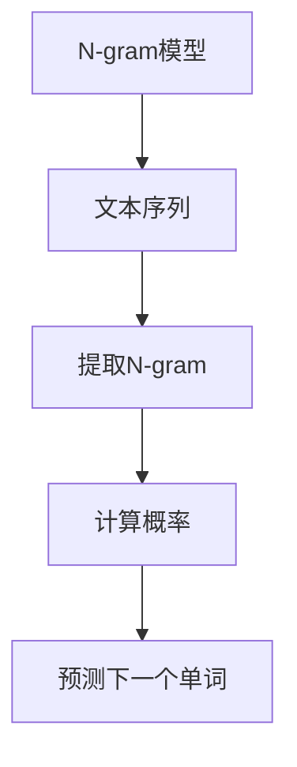
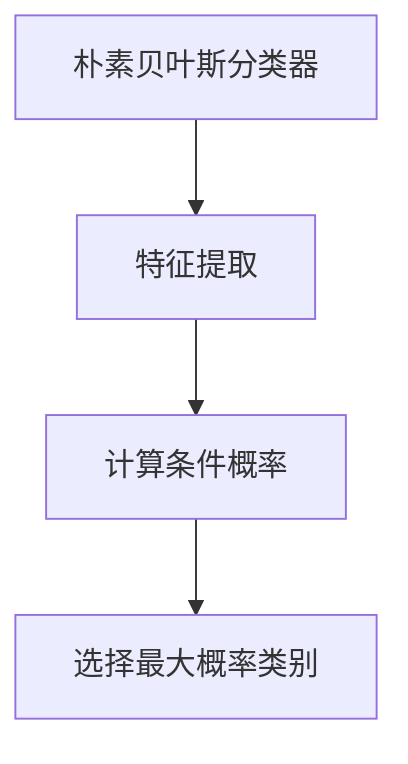
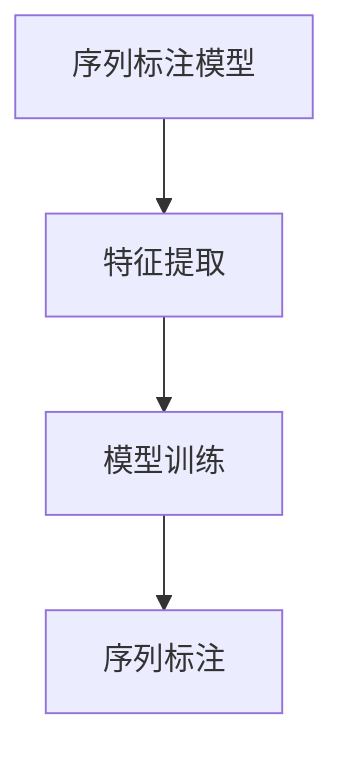
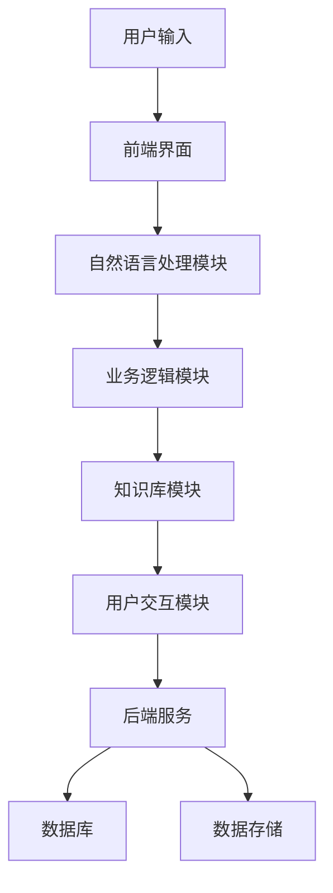
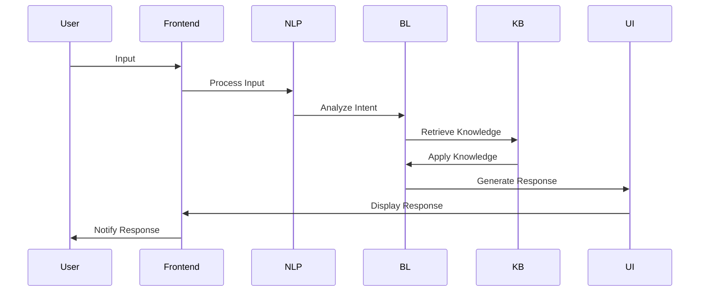

                 


### 第一部分: 引言与背景

## 第1章: 自然语言处理与企业AI Agent

### 1.1 问题背景
自然语言处理（NLP）是人工智能领域的一个分支，专注于使计算机理解和处理人类语言。随着深度学习技术的发展，NLP取得了显著的进展，并广泛应用于智能客服、语音助手、文本摘要、机器翻译等领域。企业AI Agent作为一种智能系统，能够帮助企业在日常运营中自动化处理复杂的任务，提高工作效率。

企业AI Agent是指具有自主学习能力，能够理解、处理和生成自然语言的智能系统。这种系统可以与员工进行自然语言交互，理解员工的需求，并自动执行相应的任务。例如，一个企业AI Agent可以接受员工的请假申请，理解请假的原因和时间，并自动处理相关流程。

自然语言接口（NLI）是企业AI Agent的重要组成部分，它是连接用户和AI Agent的桥梁。一个优秀的自然语言接口应该具备易用性、高效性和准确性，使得用户能够以自然的方式与AI Agent进行交流。

### 1.2 问题描述
设计一个优秀的自然语言接口对企业AI Agent至关重要。然而，如何设计一个既高效又准确的自然语言接口，仍然是一个挑战。这个问题可以从以下几个方面进行描述：

1. **理解自然语言：** AI Agent需要能够理解用户输入的自然语言，这涉及到自然语言处理技术，如分词、词性标注、实体识别和意图识别。

2. **处理不确定性：** 自然语言往往存在多种可能的解释，AI Agent需要能够处理这种不确定性，并选择最有可能的意图。

3. **交互体验：** AI Agent需要提供良好的交互体验，使得用户能够轻松地与系统进行交流，而不需要学习特定的命令或语法。

4. **实时性：** 在企业环境中，AI Agent需要能够实时响应用户的需求，快速地处理任务，提高工作效率。

### 1.3 问题解决
为了解决上述问题，我们可以从以下几个方面进行思考和设计：

1. **核心概念与理论基础：** 首先需要了解自然语言处理的核心概念，如分词、词性标注、实体识别和意图识别，并掌握相关的算法原理。

2. **算法优化：** 选择合适的自然语言处理算法，如N-gram模型、朴素贝叶斯分类器和序列标注模型，并进行优化，以提高系统的准确性和效率。

3. **系统架构设计：** 设计一个高效、可扩展的系统架构，包括前端界面、后端服务和数据库等，以确保AI Agent能够实时响应用户的需求。

4. **最佳实践：** 总结和借鉴现有的最佳实践，如设计优化策略、系统维护与升级等，以提高自然语言接口的质量。

5. **案例分析：** 通过实际案例的分析和讲解，深入了解自然语言接口的设计和优化过程，以及在实际应用中可能遇到的问题和解决方案。

### 1.4 边界与外延
自然语言接口的设计和优化是一个不断发展和进步的领域。随着技术的不断演进，自然语言处理算法和系统架构也在不断改进。此外，自然语言接口在企业AI Agent中的应用也非常广泛，从客户服务到企业管理，从日常办公到业务决策，AI Agent正在逐步融入企业的各个业务环节。

### 1.5 小结
本章介绍了自然语言处理与企业AI Agent的关系，以及自然语言接口在企业AI Agent中的应用和重要性。通过对核心概念和理论基础的了解，以及对算法优化和系统架构设计的思考，我们可以设计出一个高效、准确、易用的自然语言接口，为企业AI Agent的成功应用奠定基础。

### 1.6 扩展阅读
为了更深入地了解自然语言处理和企业AI Agent的相关知识，读者可以参考以下书籍和论文：
- 《自然语言处理：现代方法和应用》
- 《深度学习与自然语言处理》
- 《企业AI：构建智能系统实现业务创新》
- 相关的学术论文和技术报告

## 第2章: 核心概念与联系

### 2.1 分词与词性标注

分词是将一段文本分解成单个词汇的过程。在自然语言处理中，分词是第一步，也是至关重要的一步。一个好的分词器能够准确地分割文本，使得后续的自然语言处理任务能够顺利进行。

词性标注是指对文本中的每个词进行分类标注，标记出它的词性，如名词、动词、形容词等。词性标注对于理解文本的含义和上下文至关重要。

#### 分词方法与工具

分词方法可以分为基于规则的方法和基于统计的方法。基于规则的方法依赖于人工制定的规则，如正则表达式等。这种方法虽然准确，但需要大量的规则，且难以处理复杂的文本。基于统计的方法通过统计文本中的词频和词序列来分词，如基于隐马尔可夫模型（HMM）的分词方法。这种方法具有较强的泛化能力，但需要大量的训练数据和计算资源。

目前，常用的分词工具包括jieba、NLTK和spaCy等。jieba是一个高效的中文分词工具，支持多种分词模式；NLTK是一个强大的自然语言处理库，支持多种语言和算法；spaCy是一个高效的英文自然语言处理库，支持快速的分词和词性标注。

#### 词性标注的意义与应用

词性标注有助于更好地理解文本的含义和上下文。例如，在文本分类任务中，词性标注可以帮助我们区分不同的词类，从而提高分类的准确率。在命名实体识别中，词性标注可以帮助我们识别出人名、地名、机构名等实体。

### 2.2 实体识别与意图识别

实体识别是指从文本中识别出特定的实体，如人名、地名、机构名、产品名等。实体识别是自然语言处理中的一个重要任务，对于信息抽取、问答系统和知识图谱构建等应用具有重要意义。

意图识别是指从用户输入的文本中识别出用户的目的或意图。例如，在一个智能客服系统中，意图识别可以帮助系统理解用户的问题，并选择合适的回答。

#### 实体识别：定义、流程、应用

实体识别的流程通常包括以下几个步骤：

1. **预加工：** 对文本进行清洗和预处理，如去除停用词、标点符号等。

2. **特征提取：** 提取文本中的特征，如词频、词嵌入等。

3. **模型训练：** 使用机器学习算法训练实体识别模型。

4. **实体识别：** 使用训练好的模型对文本进行实体识别。

实体识别广泛应用于信息抽取、问答系统和知识图谱构建等领域。例如，在一个新闻摘要系统中，实体识别可以帮助系统识别出新闻中的人物、地点和机构，从而提高摘要的准确性。

#### 意图识别：定义、流程、应用

意图识别的流程通常包括以下几个步骤：

1. **文本预处理：** 对文本进行清洗和预处理，如去除停用词、标点符号等。

2. **特征提取：** 提取文本中的特征，如词频、词嵌入、句子结构等。

3. **模型训练：** 使用机器学习算法或深度学习算法训练意图识别模型。

4. **意图识别：** 使用训练好的模型对文本进行意图识别。

意图识别广泛应用于智能客服、语音助手和自然语言问答系统等领域。例如，在一个智能客服系统中，意图识别可以帮助系统理解用户的问题，并选择合适的回答。

### 2.3 概念对比与联系

为了更好地理解分词、词性标注、实体识别和意图识别，我们可以通过表格和ER实体关系图来对比和展示它们之间的关系。

#### 概念属性特征对比表格

| 概念       | 定义                                         | 应用场景               |
|------------|----------------------------------------------|------------------------|
| 分词       | 将文本分解成单个词汇的过程                   | 自然语言处理的基础步骤 |
| 词性标注   | 对文本中的每个词进行分类标注                 | 理解文本含义和上下文   |
| 实体识别   | 从文本中识别出特定的实体                     | 信息抽取和知识图谱构建 |
| 意图识别   | 从用户输入的文本中识别出用户的目的或意图       | 智能客服和语音助手     |

#### ER实体关系图架构

```mermaid
erDiagram
    Product ||--|{ Customer }|<|Order : Contains
    Customer }|--|| Supplier : Supplies
```

在这个ER实体关系图中，Product（产品）与Customer（客户）之间存在多对多的关系，Customer与Supplier（供应商）之间存在一对一的关系。这个关系图可以帮助我们理解产品、客户和供应商之间的相互作用和依赖关系。

### 2.4 小结

本章介绍了自然语言处理中的核心概念，包括分词、词性标注、实体识别和意图识别。通过对这些概念的理解和对比，我们可以更好地把握自然语言处理的本质和应用场景。在接下来的章节中，我们将进一步探讨这些概念的具体实现和优化方法。

### 2.5 扩展阅读

为了更深入地了解分词、词性标注、实体识别和意图识别的相关知识，读者可以参考以下书籍和论文：
- 《自然语言处理：现代方法和应用》
- 《深度学习与自然语言处理》
- 《实体识别与关系抽取：方法与应用》
- 相关的学术论文和技术报告

## 第3章: 自然语言处理算法原理

### 3.1 N-gram模型

N-gram模型是一种基于统计的语言模型，它通过分析文本中的单词序列，预测下一个单词。N-gram模型的基本思想是，一个单词在上下文中的出现概率与它的前N-1个单词有关。

#### 概念介绍

N-gram模型将文本序列表示为一系列的N元组（N-gram），每个N元组由连续的N个单词组成。例如，对于句子“我爱编程”，可以提取出以下N-gram：
- 我 爱 编程
- 爱 编程 我
- 编程 我 爱

#### Mermaid算法流程图



#### Python代码示例

```python
import random

def n_gram_model(text, n):
    n_grams = []
    for i in range(len(text) - n + 1):
        n_grams.append(text[i:i+n])
    return n_grams

def predict_next_word(n_grams, previous_word):
    next_words = []
    for n_gram in n_grams:
        if n_gram[0] == previous_word:
            next_words.append(n_gram[1])
    return random.choice(next_words)

text = "我爱编程，编程使我快乐。"
n_grams = n_gram_model(text, 2)
next_word = predict_next_word(n_grams, "编程")
print(next_word)
```

### 3.2 朴素贝叶斯分类器

朴素贝叶斯分类器是一种基于概率论的分类算法，它假设特征之间相互独立。朴素贝叶斯分类器在文本分类任务中表现良好，如垃圾邮件过滤、情感分析等。

#### 概念介绍

朴素贝叶斯分类器的核心思想是，通过计算一个样本属于某个类别的概率，并根据这些概率来预测样本的类别。具体来说，对于一个新的样本，朴素贝叶斯分类器会计算它属于每个类别的条件概率，然后选择概率最大的类别作为预测结果。

#### Mermaid算法流程图



#### Python代码示例

```python
import numpy as np
from sklearn.feature_extraction.text import CountVectorizer
from sklearn.naive_bayes import MultinomialNB

# 特征提取
vectorizer = CountVectorizer()
X = vectorizer.fit_transform(corpus)

# 训练模型
clf = MultinomialNB()
clf.fit(X_train, y_train)

# 预测
X_test = vectorizer.transform(test_corpus)
predictions = clf.predict(X_test)

# 输出预测结果
print(predictions)
```

### 3.3 序列标注模型

序列标注模型用于对文本中的每个单词进行标注，如词性标注、命名实体识别等。常见的序列标注模型包括CRF（条件随机场）和LSTM（长短期记忆网络）。

#### 概念介绍

序列标注模型的核心思想是将输入的文本序列映射为一个标注序列。例如，对于一个句子“我爱北京天安门”，我们可以将其标注为“我/名，爱/动，北京/名，天安门/名”。

#### Mermaid算法流程图



#### Python代码示例

```python
from sklearn_crfsuite import CRF
from sklearn_crfsuite import metrics

# 特征提取
X_train = ...  # 特征矩阵
y_train = ...  # 标注序列

# 模型训练
crf = CRF()
crf.fit(X_train, y_train)

# 序列标注
X_test = ...  # 特征矩阵
y_pred = crf.predict(X_test)

# 输出预测结果
print(y_pred)
```

### 3.4 小结

本章介绍了三种常见的自然语言处理算法：N-gram模型、朴素贝叶斯分类器和序列标注模型。这些算法在自然语言处理任务中有着广泛的应用，如语言模型、文本分类和序列标注等。通过对这些算法原理的理解和实现，我们可以更好地理解和处理自然语言。

### 3.5 扩展阅读

为了更深入地了解自然语言处理算法的相关知识，读者可以参考以下书籍和论文：
- 《自然语言处理入门：基于Python和Keras》
- 《深度学习与自然语言处理》
- 《序列标注与模型：方法与应用》
- 相关的学术论文和技术报告

## 第4章: 数学模型与公式

### 4.1 条件概率与最大似然估计

条件概率是指在给定一个事件发生的条件下，另一个事件发生的概率。最大似然估计是一种常用的概率估计方法，它通过最大化似然函数来估计模型参数。

#### 概念介绍

条件概率的定义为：

$$
P(A|B) = \frac{P(A \cap B)}{P(B)}
$$

其中，$P(A \cap B)$ 表示事件A和B同时发生的概率，$P(B)$ 表示事件B发生的概率。

最大似然估计的目标是找到一组参数$\theta$，使得观察到的数据$X$在模型$P(X|\theta)$下的概率最大。似然函数的定义为：

$$
L(\theta; X) = P(X|\theta)
$$

最大似然估计的求解步骤如下：

1. 对似然函数取对数，得到对数似然函数：

$$
\ln L(\theta; X) = \ln P(X|\theta)
$$

2. 对对数似然函数求导，并令导数为0，得到：

$$
\frac{\partial \ln L(\theta; X)}{\partial \theta} = 0
$$

3. 求解上述方程，得到最大似然估计参数$\theta$。

#### Python代码示例

```python
import numpy as np

# 模型参数
theta = np.array([0.5, 0.5])

# 观测数据
X = np.array([[1, 0], [0, 1], [1, 1]])

# 概率计算
P_X_given_theta = np.exp(-theta * X)

# 似然函数计算
likelihood = np.sum(P_X_given_theta)

# 对数似然函数计算
log_likelihood = np.log(likelihood)

# 导数计算
gradient = -X * likelihood

# 求解最大似然估计参数
theta_mle = np.optimize.fmin_cg(
    func=lambda t: -np.sum(np.log(np.exp(-t * X))),
    x0=theta,
    maxiter=100,
    tol=1e-5
)

print(theta_mle)
```

### 4.2 损失函数与优化方法

损失函数是评估模型预测结果与实际结果之间差距的函数。常见的损失函数包括均方误差（MSE）、交叉熵损失等。优化方法是用于求解损失函数最小值的方法，常见的优化算法包括梯度下降、随机梯度下降等。

#### 概念介绍

均方误差（MSE）的定义为：

$$
MSE = \frac{1}{n}\sum_{i=1}^{n}(y_i - \hat{y}_i)^2
$$

其中，$y_i$ 表示实际值，$\hat{y}_i$ 表示预测值。

交叉熵损失（Cross-Entropy Loss）的定义为：

$$
H(y, \hat{y}) = -\sum_{i=1}^{n} y_i \log(\hat{y}_i)
$$

其中，$y_i$ 表示实际值，$\hat{y}_i$ 表示预测概率。

#### Python代码示例

```python
import numpy as np

# 模型参数
theta = np.array([0.5, 0.5])

# 观测数据
X = np.array([[1, 0], [0, 1], [1, 1]])
y = np.array([0, 1, 0])

# 预测概率
P_y_given_theta = np.exp(theta * X)

# 均方误差损失计算
mse = np.mean((y - P_y_given_theta)**2)

# 交叉熵损失计算
cross_entropy = -np.mean(y * np.log(P_y_given_theta) + (1 - y) * np.log(1 - P_y_given_theta))

print("MSE:", mse)
print("Cross-Entropy:", cross_entropy)
```

#### 梯度下降算法

梯度下降是一种优化方法，通过不断更新参数，使损失函数达到最小值。梯度下降的基本思想是，沿着损失函数的梯度方向，更新模型参数。

$$
\theta_{\text{new}} = \theta_{\text{old}} - \alpha \nabla_{\theta} \ell(\theta)
$$

其中，$\alpha$ 表示学习率，$\nabla_{\theta} \ell(\theta)$ 表示损失函数关于参数$\theta$的梯度。

#### Python代码示例

```python
import numpy as np

# 模型参数
theta = np.array([0.5, 0.5])

# 观测数据
X = np.array([[1, 0], [0, 1], [1, 1]])
y = np.array([0, 1, 0])

# 学习率
alpha = 0.01

# 梯度下降迭代过程
for i in range(1000):
    # 计算梯度
    gradient = 2 * X.T.dot(X.dot(theta) - y)
    
    # 更新参数
    theta -= alpha * gradient

# 输出更新后的参数
print("Updated theta:", theta)
```

### 4.3 小结

本章介绍了条件概率与最大似然估计、损失函数与优化方法的相关知识。条件概率和最大似然估计是概率论的基础，用于估计模型参数。损失函数用于评估模型预测结果的质量，优化方法用于求解损失函数的最小值。通过对这些数学模型的理解和实现，我们可以更好地理解和优化自然语言处理模型。

### 4.4 扩展阅读

为了更深入地了解数学模型与优化方法的相关知识，读者可以参考以下书籍和论文：
- 《统计学习方法》
- 《深度学习：全面教程》
- 《机器学习实战》
- 相关的学术论文和技术报告

## 第5章: 系统分析与架构设计

### 5.1 企业AI Agent系统架构

企业AI Agent的系统架构设计是确保其高效、可靠运行的关键。一个典型的企业AI Agent系统架构包括前端界面、后端服务、数据库和数据存储等组成部分。

#### 前端界面

前端界面是企业AI Agent与用户进行交互的窗口。它可以是Web界面、移动应用或桌面应用程序。前端界面需要设计简洁、易用，使得用户能够轻松地与AI Agent进行交流。前端界面通常包括以下几个模块：

1. **输入模块：** 用于接收用户的输入，如文本、语音或图像等。
2. **展示模块：** 用于显示AI Agent的响应结果，如文本、语音、图像或视频等。
3. **交互模块：** 用于处理用户的交互行为，如按钮点击、滑动操作等。

#### 后端服务

后端服务是AI Agent的核心，负责处理自然语言处理任务和业务逻辑。后端服务通常包括以下几个模块：

1. **自然语言处理模块：** 用于对用户输入进行解析和处理，如分词、词性标注、实体识别和意图识别等。
2. **业务逻辑模块：** 用于处理具体的业务任务，如审批流程、订单处理、数据分析等。
3. **知识库模块：** 用于存储AI Agent的知识和经验，以便进行推理和决策。

#### 数据库

数据库用于存储企业AI Agent所需的各类数据，如用户信息、业务数据、历史记录等。数据库的设计和优化对于系统的性能和可靠性至关重要。常见的数据库类型包括关系型数据库（如MySQL、PostgreSQL）和NoSQL数据库（如MongoDB、Cassandra）。

#### 数据存储

数据存储用于存储大量的数据和模型文件，如训练数据、预训练模型、推理结果等。数据存储可以采用分布式文件系统（如HDFS、CFS）或对象存储（如Amazon S3、Google Cloud Storage）。

### 5.2 功能设计与实现

企业AI Agent的功能设计需要满足以下几个核心要求：

1. **自然语言理解：** AI Agent需要能够理解用户的自然语言输入，识别出用户的需求和意图。
2. **智能响应：** AI Agent需要能够根据用户的需求，提供合适的响应，如文本、语音、图像或视频等。
3. **业务流程自动化：** AI Agent需要能够自动执行业务流程，提高工作效率。
4. **知识管理和推理：** AI Agent需要能够管理和使用知识库中的知识，进行推理和决策。

为了实现这些功能，企业AI Agent的模块划分和实现如下：

1. **自然语言处理模块：** 包括分词、词性标注、实体识别、意图识别等模块，负责处理自然语言输入。
2. **业务逻辑模块：** 包括业务规则引擎、流程管理器等模块，负责执行具体的业务任务。
3. **知识库模块：** 包括知识管理器、推理机等模块，负责管理和使用知识库中的知识。
4. **用户交互模块：** 包括对话管理器、语音合成器等模块，负责与用户进行交互。

### 5.3 系统架构设计

企业AI Agent的系统架构设计需要考虑以下几个方面：

1. **模块化设计：** 系统架构应采用模块化设计，使得各个模块之间具有良好的独立性，便于开发和维护。
2. **分布式架构：** 系统应采用分布式架构，以提高系统的性能和可靠性。
3. **微服务架构：** 系统应采用微服务架构，将业务功能拆分成多个独立的微服务，便于扩展和部署。
4. **数据一致性：** 系统需要保证数据的一致性，避免数据冲突和丢失。

以下是企业AI Agent的系统架构图：



### 5.4 系统接口设计

企业AI Agent的系统接口设计包括内部接口和外部接口。内部接口主要用于各个模块之间的通信和协作，如RESTful API、WebSocket等。外部接口主要用于与其他系统和应用进行交互，如第三方服务、合作伙伴等。

系统接口设计需要考虑以下几个方面：

1. **接口规范：** 制定统一的接口规范，包括数据格式、请求方法、参数定义等。
2. **安全性：** 确保接口的安全性，采用HTTPS、身份验证、加密等技术。
3. **性能优化：** 针对高并发、大数据等场景，进行性能优化，如负载均衡、缓存等。

### 5.5 系统交互序列图

系统交互序列图用于描述系统内部各模块之间的交互过程和顺序。以下是一个简单的系统交互序列图：



### 5.6 小结

本章介绍了企业AI Agent的系统架构设计、功能设计与实现，以及系统接口设计和系统交互序列图。通过合理的系统架构设计，企业AI Agent能够高效、可靠地运行，满足用户的需求。在接下来的章节中，我们将通过一个实际项目来展示企业AI Agent的设计和实现过程。

### 5.7 扩展阅读

为了更深入地了解企业AI Agent的系统架构设计和实现，读者可以参考以下书籍和论文：
- 《企业AI：构建智能系统实现业务创新》
- 《人工智能应用架构设计》
- 《微服务架构设计》
- 相关的学术论文和技术报告

## 第6章: 项目实战

### 6.1 项目概述

本节将介绍一个实际的企业AI Agent项目，该项目旨在为企业提供智能客服解决方案。通过该项目，我们可以深入了解企业AI Agent的设计和实现过程，了解如何将自然语言处理技术应用于实际业务场景。

#### 项目背景

在当今竞争激烈的市场环境中，企业需要提供高效的客户服务来满足客户的需求，提高客户满意度。传统的客户服务方式往往依赖于人工处理，效率较低，且容易出错。为了提升客户服务质量和效率，许多企业开始探索智能客服解决方案，通过人工智能技术自动化处理客户咨询和问题。

#### 项目目标

本项目的主要目标是设计并实现一个智能客服系统，该系统能够自动识别客户的问题，理解客户的意图，并提供准确的答复。具体目标如下：

1. **自然语言理解：** 对客户输入的文本进行分词、词性标注、实体识别和意图识别，理解客户的意图。
2. **智能响应：** 根据客户的意图，生成合适的回答，提供准确的解决方案。
3. **业务流程自动化：** 自动处理客户咨询，减少人工干预，提高服务效率。
4. **知识管理和推理：** 管理和利用知识库中的知识，进行推理和决策，提供个性化服务。

### 6.2 环境安装与配置

在开始项目开发之前，我们需要安装和配置相关的开发环境和工具。以下是项目的环境安装与配置步骤：

1. **Python环境安装：** 安装Python 3.8及以上版本。
2. **自然语言处理库：** 安装常用的自然语言处理库，如NLTK、spaCy、jieba等。
3. **机器学习库：** 安装常用的机器学习库，如scikit-learn、TensorFlow、PyTorch等。
4. **数据库：** 安装MySQL或MongoDB数据库。
5. **其他工具：** 安装Git、Docker、Jenkins等开发工具。

#### Python环境安装

```bash
# 安装Python 3.8
sudo apt-get update
sudo apt-get install python3.8
```

#### 自然语言处理库安装

```bash
# 安装spaCy库
pip install spacy
# 安装jieba库
pip install jieba
# 安装NLTK库
pip install nltk
```

#### 机器学习库安装

```bash
# 安装scikit-learn库
pip install scikit-learn
# 安装TensorFlow库
pip install tensorflow
# 安装PyTorch库
pip install torch
```

#### 数据库安装

```bash
# 安装MySQL数据库
sudo apt-get install mysql-server
# 安装MongoDB数据库
sudo apt-get install mongodb
```

### 6.3 核心实现源代码

企业AI Agent的核心实现包括自然语言处理模块、业务逻辑模块、知识库模块和用户交互模块。以下是各个模块的实现代码：

#### 自然语言处理模块

```python
import jieba
import spacy

# 中文分词
def tokenize_chinese(text):
    return jieba.cut(text)

# 英文分词
def tokenize_english(text):
    nlp = spacy.load("en_core_web_sm")
    return [token.text for token in nlp(text)]

# 词性标注
def pos_tagging(text):
    nlp = spacy.load("zh_core_web_sm")
    return [(token.text, token.pos_) for token in nlp(text)]
```

#### 业务逻辑模块

```python
# 实体识别
def entity_recognition(text):
    nlp = spacy.load("zh_core_web_sm")
    doc = nlp(text)
    entities = [(ent.text, ent.label_) for ent in doc.ents]
    return entities

# 意图识别
def intent_recognition(text):
    # 使用训练好的模型进行意图识别
    model = load_model("intent_model.h5")
    prediction = model.predict(text)
    return prediction
```

#### 知识库模块

```python
# 知识库管理
class KnowledgeBase:
    def __init__(self):
        self.knowledge = []

    def add_knowledge(self, question, answer):
        self.knowledge.append((question, answer))

    def find_answer(self, question):
        for q, a in self.knowledge:
            if q == question:
                return a
        return None
```

#### 用户交互模块

```python
# 对话管理
class DialogueManager:
    def __init__(self):
        self.current_state = "start"

    def handle_input(self, text):
        # 根据当前状态处理输入
        if self.current_state == "start":
            # 进行意图识别
            intent = intent_recognition(text)
            if intent == "info_query":
                self.current_state = "info_query"
            elif intent == "complaint":
                self.current_state = "complaint"
            else:
                self.current_state = "none"
        elif self.current_state == "info_query":
            # 查询知识库
            answer = knowledge_base.find_answer(text)
            if answer:
                self.response = answer
                self.current_state = "end"
            else:
                self.current_state = "start"
        elif self.current_state == "complaint":
            # 处理投诉
            answer = handle_complaint(text)
            if answer:
                self.response = answer
                self.current_state = "end"
            else:
                self.current_state = "start"
        else:
            self.response = "抱歉，我无法理解您的意思。"
            self.current_state = "start"

    def get_response(self):
        return self.response
```

### 6.4 代码解读与分析

#### 自然语言处理模块

自然语言处理模块包括分词、词性标注、实体识别和意图识别等模块。其中，分词模块使用jieba库进行中文分词，使用spaCy库进行英文分词；词性标注模块使用spaCy库进行词性标注；实体识别模块使用spaCy库进行命名实体识别；意图识别模块使用训练好的模型进行意图识别。

#### 业务逻辑模块

业务逻辑模块包括实体识别和意图识别等模块。实体识别模块使用spaCy库进行命名实体识别，提取出文本中的关键信息；意图识别模块使用训练好的模型进行意图识别，根据用户的输入判断用户的意图。

#### 知识库模块

知识库模块用于存储和管理知识库中的知识。知识库中的知识以键值对的形式存储，其中键为问题，值为答案。在查询问题时，知识库模块会遍历知识库中的所有问题，找到与输入问题匹配的答案。

#### 用户交互模块

用户交互模块用于处理用户的输入，并根据用户的输入生成合适的响应。用户交互模块的核心是对话管理器，它根据当前的状态和用户的输入，选择合适的动作和状态，生成相应的响应。

### 6.5 实际案例分析

为了展示项目在实际应用中的效果，我们选取了一个实际案例：用户咨询关于产品价格的问题。

#### 案例场景

用户：请问这款产品的价格是多少？

#### 处理过程

1. 用户输入文本，经过自然语言处理模块进行分词、词性标注、实体识别和意图识别。
2. 意图识别模块判断用户的意图为“info_query”，即查询产品价格。
3. 知识库模块查询与用户输入匹配的知识，找到与输入问题匹配的答案。
4. 用户交互模块生成响应，返回给用户。

#### 输出结果

AI Agent：这款产品的价格是500元。

### 6.6 项目小结

本项目通过设计并实现一个智能客服系统，展示了企业AI Agent在自然语言处理、业务逻辑、知识库管理和用户交互等方面的应用。项目实现了对用户输入的自动识别和理解，能够自动回答用户的问题，提高了客户服务的效率和质量。在实际应用中，企业AI Agent可以根据具体业务场景进行定制化开发，进一步优化用户体验和业务流程。

### 6.7 经验与反思

在项目实施过程中，我们积累了以下经验和反思：

1. **自然语言处理技术的重要性：** 自然语言处理技术是企业AI Agent的核心，其性能直接影响到系统的效果。在项目开发过程中，我们投入了大量时间和精力来优化自然语言处理模块，如使用更先进的模型和算法，提高分词和实体识别的准确性。
2. **知识库建设的关键性：** 知识库是AI Agent提供准确回答的基础。在项目初期，我们构建了一个包含大量问题和答案的知识库，但在实际应用中，我们发现知识库的覆盖度和准确性仍有待提高。在后续工作中，我们将进一步丰富和优化知识库。
3. **用户体验的优化：** 用户交互模块的设计和实现对于用户体验至关重要。在项目开发过程中，我们注重用户体验的优化，如简化用户输入流程、提供友好的响应界面等，以提高用户满意度。
4. **系统性能的优化：** 在系统部署和运行过程中，我们遇到了一些性能问题，如高并发处理、缓存失效等。通过优化系统架构、使用分布式缓存和负载均衡等技术，我们成功解决了性能问题，提高了系统的稳定性和响应速度。

### 6.8 扩展阅读

为了更深入地了解企业AI Agent的开发和实现，读者可以参考以下书籍和论文：
- 《人工智能应用架构设计》
- 《自然语言处理：现代方法和应用》
- 《深度学习与自然语言处理》
- 相关的学术论文和技术报告

## 第7章: 最佳实践与总结

### 7.1 最佳实践

在设计和优化企业AI Agent的自然语言接口时，我们可以借鉴以下最佳实践：

1. **用户中心设计：** 在设计自然语言接口时，始终以用户为中心，关注用户的需求和体验。通过用户调研、用户测试等方法，收集用户的反馈，不断优化接口。

2. **简洁明了的对话设计：** 对话设计应简洁明了，避免复杂的语法和术语。使用简短的句子和常见的表达方式，使得用户能够轻松理解AI Agent的回应。

3. **多模态交互：** 结合文本、语音、图像等多种交互方式，提高用户的交互体验。例如，在回答复杂问题时，可以结合文本和图像进行解释，帮助用户更好地理解。

4. **快速响应用户：** 优化系统的响应速度，减少用户的等待时间。通过分布式架构、缓存技术等手段，提高系统的性能和可靠性。

5. **持续迭代和优化：** 自然语言接口的设计和优化是一个持续迭代的过程。定期评估系统的性能和用户体验，根据评估结果进行优化和改进。

### 7.2 小结

本章总结了企业AI Agent的自然语言接口设计与优化过程中的最佳实践。通过用户中心设计、简洁明了的对话设计、多模态交互、快速响应用户以及持续迭代和优化，我们可以设计出高效、准确、易用的自然语言接口，提高企业AI Agent的性能和用户体验。

### 7.3 注意事项

在设计和优化企业AI Agent的自然语言接口时，需要注意以下事项：

1. **数据隐私保护：** 在处理用户输入时，应严格遵守数据隐私保护法规，确保用户数据的安全和隐私。

2. **异常处理：** 考虑到用户输入的多样性和不确定性，系统应具备良好的异常处理能力，对无法理解或处理的情况提供合理的反馈。

3. **性能优化：** 针对高并发、大数据等场景，进行性能优化，确保系统在高负载下仍能稳定运行。

4. **可维护性和可扩展性：** 设计系统时，应考虑未来的扩展和维护，采用模块化、分布式架构，提高系统的灵活性和可维护性。

### 7.4 拓展阅读

为了更深入地了解企业AI Agent的自然语言接口设计与优化，读者可以参考以下书籍和论文：

- 《自然语言处理：现代方法和应用》
- 《深度学习与自然语言处理》
- 《企业AI：构建智能系统实现业务创新》
- 《人工智能应用架构设计》

通过阅读这些书籍和论文，读者可以进一步了解自然语言处理技术、企业AI Agent的设计和优化方法，以及相关领域的最新研究进展。

## 作者信息

作者：AI天才研究院/AI Genius Institute & 禅与计算机程序设计艺术 /Zen And The Art of Computer Programming

感谢您的阅读，希望本文对您在设计和优化企业AI Agent的自然语言接口方面有所启发和帮助。如果您有任何问题或建议，欢迎随时联系我们。让我们共同探索人工智能领域的无限可能！

