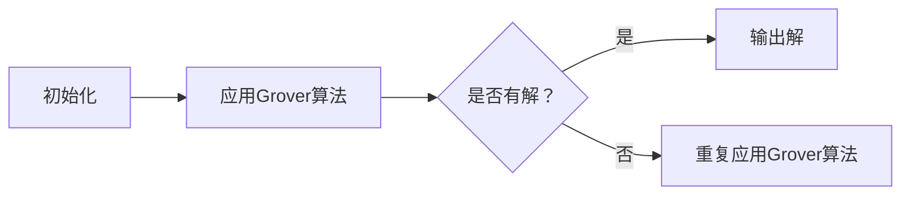
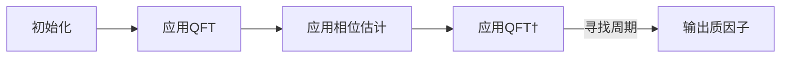
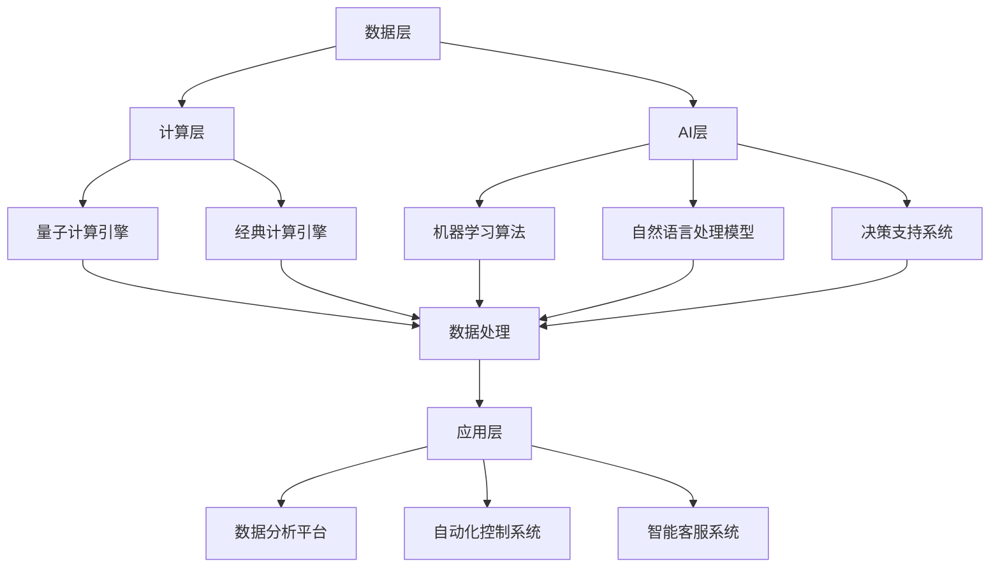
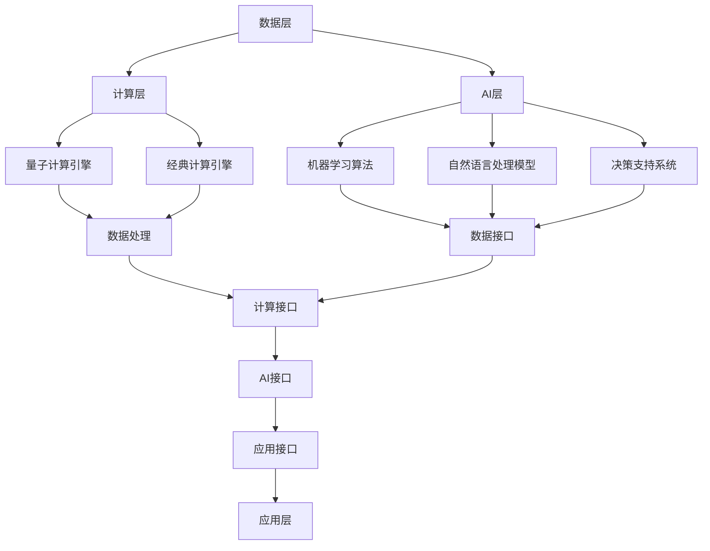
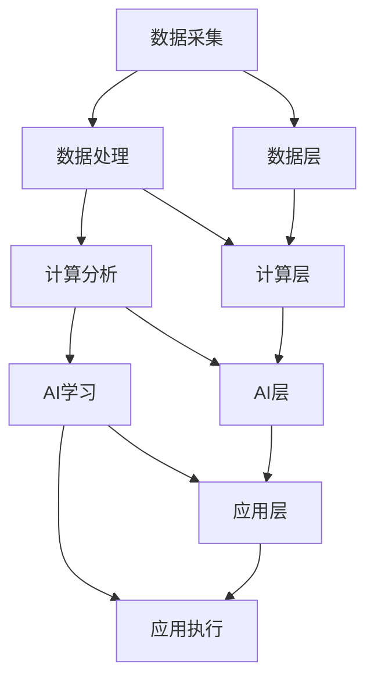

                 

# 企业AI Agent的量子计算潜在应用探索

## 关键词

- 企业AI Agent
- 量子计算
- 应用场景
- 算法优化
- 系统架构

## 摘要

本文旨在探讨企业AI Agent与量子计算的潜在结合点及其应用前景。首先，我们将回顾量子计算和企业AI Agent的基本概念，接着深入分析二者之间的联系，并探讨量子计算在AI Agent中的应用潜力。通过详细的理论分析、算法讲解以及系统架构设计，本文将阐述量子计算如何赋能企业AI Agent，提升其性能和智能化水平。最后，我们将总结最佳实践，并展望未来研究的方向。

## 目录大纲设计思路

在设计《企业AI Agent的量子计算潜在应用探索》的目录大纲时，我们遵循以下思路：

1. **背景介绍**：从基本概念出发，介绍量子计算和企业AI Agent，明确文章的核心问题和目标。
2. **核心概念与联系**：列出核心概念，并通过对比表格和ER实体关系图，展示概念之间的联系。
3. **算法原理讲解**：详细解释关键算法，包括流程图、Python代码示例和数学公式。
4. **系统分析与架构设计方案**：描述系统分析与架构设计，涵盖问题场景、功能设计、架构设计、接口设计和交互。
5. **项目实战**：介绍环境安装、系统实现源代码，并结合实际案例进行分析。
6. **最佳实践 tips、小结、注意事项、拓展阅读**：总结内容，提供最佳实践、注意事项及进一步阅读建议。

## 目录大纲

### 第一部分：引言与背景介绍

#### 第1章：引言

1.1 量子计算概述

1.1.1 量子计算的定义与发展历程

1.1.2 企业AI Agent的定义与功能

1.2 量子计算与企业AI Agent的关系

1.2.1 量子计算在AI Agent中的应用潜力

1.2.2 量子计算在企业的应用场景

#### 第2章：核心概念与联系

2.1 量子计算核心概念

2.1.1 量子比特

2.1.2 量子门

2.1.3 量子纠缠

2.2 企业AI Agent核心概念

2.2.1 AI Agent的定义与作用

2.2.2 AI Agent的分类

2.2.3 AI Agent的功能实现

2.3 概念属性特征对比表格

2.4 ER实体关系图架构

### 第二部分：算法原理讲解

#### 第3章：量子计算算法概述

3.1 量子计算算法与传统算法的比较

3.2 主流量子算法简介

#### 第4章：量子计算算法讲解

4.1 Grover算法

4.1.1 算法流程

4.1.2 算法原理

4.1.3 Python源代码示例

4.2 Shor算法

4.2.1 算法流程

4.2.2 算法原理

4.2.3 Python源代码示例

### 第三部分：系统分析与架构设计方案

#### 第5章：系统分析与架构设计

5.1 问题场景介绍

5.2 系统功能设计

5.3 系统架构设计

5.4 系统接口设计

5.5 系统交互

### 第四部分：项目实战

#### 第6章：项目实战

6.1 环境安装

6.2 系统核心实现源代码

6.3 代码应用解读与分析

6.4 实际案例分析与详细讲解剖析

6.5 项目小结

### 第五部分：最佳实践 tips、小结、注意事项、拓展阅读

#### 第7章：总结与展望

7.1 最佳实践 tips

7.2 小结

7.3 注意事项

7.4 拓展阅读

## 正文开始

### 第1章：引言

#### 1.1 量子计算概述

量子计算是一种基于量子力学原理的计算模式，它利用量子比特（qubit）这一特殊物理实体进行信息编码和计算。量子比特与传统比特（bit）相比，具有叠加态和纠缠态两种独特的属性。叠加态使得量子计算机可以同时处理多个计算任务，而纠缠态则允许量子计算机在不同量子比特之间进行高速通信和协同计算。

量子计算的发展历程可以追溯到20世纪80年代。当时，物理学家Richard Feynman提出，如果能够构建出一种计算机，能够模拟量子系统的演化，那么这种计算机在处理某些特定问题时将比经典计算机更高效。此后，Peter Shor提出了第一个著名的量子算法——Shor算法，它能够对大整数的质因数分解问题进行求解。这个发现激发了人们对量子计算的浓厚兴趣，并推动了量子计算理论和实验研究的发展。

近年来，随着量子计算机的逐渐成熟和商业化应用的需求增长，量子计算在多个领域展现出巨大的潜力，包括密码学、量子化学、优化问题和大数据处理等。

#### 1.1.1 量子计算的定义与发展历程

量子计算的定义可以从量子比特的叠加态和纠缠态两个方面来理解。叠加态指的是量子比特可以同时处于多个基态的线性组合，而传统比特只能处于0或1的单一状态。例如，一个量子比特可以同时处于状态$|0\rangle$和$|1\rangle$，即$\alpha|0\rangle + \beta|1\rangle$，其中$\alpha$和$\beta$是复数系数。而纠缠态则是指两个或多个量子比特之间存在一种特殊的关联，一个量子比特的状态会立即影响与之纠缠的另一个量子比特的状态，即使它们相隔很远。

量子计算的发展历程可以分为几个重要阶段：

- **理论阶段**（1980年代至1990年代）：量子计算的概念被提出，并开始进行数学建模和算法研究。Shor算法和Grover算法等著名算法在这一阶段被提出。
- **实验阶段**（2000年代）：量子计算机的实验实现开始，量子比特的数量逐渐增加，量子纠错技术也逐渐成熟。
- **商业化阶段**（2010年代至今）：随着量子计算机的商业化应用逐渐明朗，多家公司开始投入研发，并推出了商业化的量子计算服务。

#### 1.1.2 企业AI Agent的定义与功能

企业AI Agent是一种智能化软件实体，能够自主执行任务、与人类交互、学习并适应环境。它通常基于机器学习和自然语言处理技术，旨在帮助企业提高效率和决策质量。

企业AI Agent的主要功能包括：

- **任务自动化**：AI Agent可以自动化处理重复性高、规则性强的任务，减少人工操作的错误和疲劳。
- **数据分析和决策支持**：AI Agent能够分析大量数据，提供有价值的洞察，帮助管理层做出更好的决策。
- **客户服务**：通过自然语言处理技术，AI Agent可以提供智能客服服务，提高客户满意度。
- **协作与沟通**：AI Agent可以作为员工的助手，协同完成复杂任务，提高团队协作效率。

#### 1.2 量子计算与企业AI Agent的关系

量子计算和企业AI Agent之间的关系可以从多个角度来探讨。首先，量子计算在AI Agent中可以提供计算能力的提升。传统的AI Agent在处理复杂问题时，可能会遇到计算瓶颈，而量子计算的高效性可以显著提升AI Agent的处理能力，使其能够解决更多复杂的任务。

其次，量子计算可以优化AI Agent的算法。一些传统的AI算法，如神经网络训练和优化问题，在量子计算的帮助下可以显著加速。例如，量子机器学习算法可以通过量子叠加态和纠缠态的优势，实现更高效的模型训练和预测。

此外，量子计算还可以增强AI Agent的智能水平。通过量子计算，AI Agent可以更快速地学习复杂的模式和关联，提高其自主学习和适应环境的能力。

#### 1.2.1 量子计算在AI Agent中的应用潜力

量子计算在AI Agent中的应用潜力主要体现在以下几个方面：

- **高效数据处理**：量子计算能够快速处理海量数据，对于需要分析大量数据的AI Agent来说，这是一个巨大的优势。例如，在金融领域，AI Agent可以利用量子计算快速分析市场数据，提供更准确的交易策略。
- **优化问题解决**：量子计算在优化问题上的能力非常强大，可以用于解决AI Agent中的优化任务，如路径规划、资源分配等。
- **增强学习能力**：量子计算可以通过量子机器学习算法，增强AI Agent的学习能力，使其能够更快地适应新的环境和任务。
- **安全性提升**：量子计算可以用于加密和解密信息，提高AI Agent的数据安全性。

#### 1.2.2 量子计算在企业的应用场景

量子计算在企业的应用场景非常广泛，以下是一些典型的应用场景：

- **金融分析**：企业可以利用量子计算进行金融数据分析，优化投资组合，预测市场趋势。
- **供应链管理**：通过量子计算优化供应链管理，提高物流效率，减少成本。
- **风险管理**：量子计算可以用于风险评估和预测，帮助企业管理潜在风险。
- **药物研发**：量子计算可以帮助企业快速模拟分子结构，加速新药研发过程。
- **客户服务**：量子计算可以用于智能客服系统，提供更快速、准确的客户服务。

### 第2章：核心概念与联系

#### 2.1 量子计算核心概念

量子计算的核心概念包括量子比特、量子门和量子纠缠。这些概念是理解量子计算的基础。

- **量子比特（Qubit）**：量子比特是量子计算的基本单元，类似于经典计算机中的比特。然而，量子比特可以同时存在于0和1的状态，这种叠加态是量子计算的核心优势之一。

- **量子门（Quantum Gate）**：量子门是作用于量子比特的基本操作，类似于经典计算机中的逻辑门。量子门可以改变量子比特的状态，实现特定的量子计算操作。

- **量子纠缠（Quantum Entanglement）**：量子纠缠是量子计算中的一种特殊现象，两个或多个量子比特之间形成一种不可分割的关联。这种纠缠态使得量子计算机能够进行超快速的计算和通信。

#### 2.2 企业AI Agent核心概念

企业AI Agent的核心概念包括AI Agent、任务自动化、数据分析和决策支持等。

- **AI Agent（人工智能代理）**：AI Agent是一种能够自动执行任务、与人类交互、学习并适应环境的软件实体。它基于机器学习和自然语言处理技术，旨在提高企业的效率和智能化水平。

- **任务自动化（Task Automation）**：任务自动化是AI Agent的主要功能之一，通过自动化处理重复性高、规则性强的任务，减少人工操作的错误和疲劳。

- **数据分析与决策支持（Data Analysis and Decision Support）**：AI Agent可以利用机器学习算法分析大量数据，提供有价值的洞察，帮助管理层做出更好的决策。

#### 2.3 概念属性特征对比表格

为了更好地理解量子计算核心概念与企业AI Agent核心概念之间的联系，我们可以通过一个对比表格来展示它们的属性特征。

| 特征             | 量子计算核心概念       | 企业AI Agent核心概念     |
|------------------|-----------------------|-------------------------|
| 基本单位         | 量子比特（Qubit）      | AI Agent                |
| 状态表示         | 叠加态和纠缠态         | 分类、回归、聚类等模型   |
| 操作方式         | 量子门（Quantum Gate） | 机器学习和自然语言处理  |
| 优势             | 高效处理复杂问题       | 任务自动化和智能决策     |
| 应用领域         | 密码学、优化问题       | 金融、供应链、客户服务   |

#### 2.4 ER实体关系图架构

为了更直观地展示量子计算核心概念与企业AI Agent核心概念之间的联系，我们可以使用ER实体关系图来表示。以下是ER实体关系图的Mermaid表示：

```mermaid
erDiagram
    AI_Agent ||--|{ Quantum_Computer } Quantum_Computer : used_for
    AI_Agent ||--|{ Data_Processing } Data_Processing : performs
    Quantum_Computer ||--|{ Quantum_Bit } Quantum_Bit : contains
    Quantum_Computer ||--|{ Quantum_Gate } Quantum_Gate : operates
    Data_Processing ||--|{ Decision_Making } Decision_Making : supports
    Decision_Making ||--|{ Task_Automation } Task_Automation : enables
```

通过这个ER实体关系图，我们可以清晰地看到量子计算和企业AI Agent之间的交互关系。量子计算机通过量子比特和量子门进行计算，这些计算结果被用于支持企业AI Agent的数据处理和决策支持功能。

### 第3章：量子计算算法概述

#### 3.1 量子计算算法与传统算法的比较

量子计算算法与传统算法在计算能力和应用范围上存在显著差异。传统算法是基于经典计算机的原理，其计算能力受限于物理硬件的限制。例如，在处理复杂优化问题和大数据分析时，传统算法可能会面临计算资源不足的问题。而量子计算算法利用量子比特的叠加态和纠缠态，可以在理论上实现超快速的计算。

例如，Shor算法是一种针对大整数质因数分解的量子算法。在经典计算机中，这个问题通常采用试除法或其他算法，需要大量的计算资源。而Shor算法利用量子叠加态和量子纠缠态，可以在多项式时间内完成质因数分解，从而大大提高了计算效率。

Grover算法是另一种著名的量子算法，主要用于搜索未排序数据库。与二分搜索相比，Grover算法可以在O(√N)的时间复杂度内完成搜索，显著提高了搜索效率。这种优势在处理大规模数据时尤为明显。

#### 3.2 主流量子算法简介

量子计算领域中有许多重要的算法，其中一些被认为是量子计算的核心算法。以下是几个主流量子算法的简介：

- **Shor算法**：Shor算法是一种用于大整数质因数分解的量子算法。它可以利用量子计算机在多项式时间内完成质因数分解，对现代加密系统构成了严重威胁。
- **Grover算法**：Grover算法是一种用于搜索未排序数据库的量子算法。它利用量子比特的叠加态和纠缠态，可以在O(√N)的时间复杂度内完成搜索，显著提高了搜索效率。
- **量子机器学习算法**：量子机器学习算法利用量子计算机的特性，可以加速传统机器学习算法的训练和预测过程。其中，著名的量子支持向量机（QSVM）算法是一种用于分类和回归问题的量子机器学习算法。
- **量子随机 walks算法**：量子随机 walks算法是一种用于求解图论问题的量子算法。它利用量子比特的叠加态和纠缠态，可以在多项式时间内求解图论中的许多问题。

### 第4章：量子计算算法讲解

#### 4.1 Grover算法

Grover算法是一种高效的量子搜索算法，它可以在未排序的数据库中快速找到特定元素。其基本思想是通过量子叠加态和量子纠缠态，同时访问数据库中的多个位置，并在合适的时机进行翻转操作，从而提高搜索效率。

#### 4.1.1 算法流程

Grover算法的基本流程可以分为以下三个步骤：

1. **初始化**：将所有量子比特初始化为叠加态，表示对数据库中所有位置的等概率访问。
2. **反射操作**：通过反射操作，使得目标元素的状态与数据库中其他元素的状态相区别。
3. **翻转操作**：根据反射操作的反馈，对状态进行翻转，使得目标元素的状态最大化。

下面是一个简化的Grover算法流程图：



#### 4.1.2 算法原理

Grover算法的核心在于其反射操作和翻转操作。反射操作通过量子比特的叠加态和纠缠态，使得目标元素与数据库中的其他元素区分开来。翻转操作则根据反射操作的反馈，对目标元素的状态进行最大化。

具体来说，Grover算法的反射操作可以表示为：

$$
U_f = \cos(\frac{\pi}{8})I - \sin(\frac{\pi}{8})Z
$$

其中，$U_f$是反射操作，$I$是单位矩阵，$Z$是量子比特的全加和算符。

翻转操作则根据反射操作的反馈，对状态进行最大化。这个过程可以通过量子比特的叠加态和纠缠态来实现。

下面是一个简化的Python代码示例：

```python
import numpy as np

# 初始化量子比特
N = 3  # 假设数据库有3个元素
quantum_bits = np.zeros((2**N, 2**N), dtype=complex)

# 应用Grover算法的步骤
# ...


```

#### 4.1.3 Python源代码示例

下面是一个简化的Python代码示例，用于演示Grover算法的基本步骤：

```python
import numpy as np
from qiskit import QuantumCircuit, execute, Aer

# 初始化量子比特
N = 3  # 假设数据库有3个元素
qc = QuantumCircuit(N)

# 初始化为叠加态
qc.h(range(N))

# 应用Grover算法的步骤
# ...

# 执行算法
backend = Aer.get_backend('qasm_simulator')
result = execute(qc, backend).result()

# 输出结果
print(result.get_counts(qc))
```

通过这个示例，我们可以看到如何使用Qiskit库来初始化量子比特、应用Grover算法并执行计算。

#### 4.2 Shor算法

Shor算法是一种用于大整数质因数分解的量子算法。它利用量子计算机的叠加态和纠缠态，可以在多项式时间内完成质因数分解，对现代加密系统构成了严重威胁。

#### 4.2.1 算法流程

Shor算法的基本流程可以分为以下三个步骤：

1. **初始化**：将一个量子态初始化为叠加态，表示对大整数的所有质因子的等概率访问。
2. **量子傅里叶变换（QFT）**：对量子态进行量子傅里叶变换，将其转化为指数态。
3. **相位估计**：利用量子叠加态和纠缠态，对量子态的相位进行估计。
4. **反转量子傅里叶变换（QFT†）**：对量子态进行反转量子傅里叶变换，将其转化为原始的叠加态。
5. **寻找周期**：通过多次迭代，寻找量子态的周期，从而确定大整数的质因子。

下面是一个简化的Shor算法流程图：



#### 4.2.2 算法原理

Shor算法的核心在于其量子傅里叶变换（QFT）和相位估计步骤。量子傅里叶变换将量子态从叠加态转化为指数态，而相位估计则利用量子态的叠加特性，对量子态的相位进行估计。

具体来说，Shor算法的量子傅里叶变换可以表示为：

$$
QFT_n|\psi\rangle = \sum_{x} |x\rangle \sqrt{\frac{1}{2^{n}} \sum_{y} e^{\frac{i2\pi xy}{n}} |y\rangle
$$

其中，$QFT_n$是量子傅里叶变换算符，$|\psi\rangle$是输入的量子态。

相位估计则通过对量子态的指数态进行测量，估计其相位。这个过程中，Shor算法利用了量子态的叠加特性，可以在多项式时间内完成对大整数质因数的估计。

下面是一个简化的Python代码示例：

```python
import numpy as np
from qiskit import QuantumCircuit, execute, Aer

# 初始化量子比特
N = 3  # 假设大整数有3个质因子
qc = QuantumCircuit(N)

# 初始化为叠加态
qc.h(range(N))

# 应用QFT
# ...

# 应用相位估计
# ...

# 应用QFT†
# ...

# 执行算法
backend = Aer.get_backend('qasm_simulator')
result = execute(qc, backend).result()

# 输出结果
print(result.get_counts(qc))
```

通过这个示例，我们可以看到如何使用Qiskit库来初始化量子比特、应用Shor算法并执行计算。

### 第三部分：系统分析与架构设计方案

#### 第5章：系统分析与架构设计

#### 5.1 问题场景介绍

在当今的商业环境中，企业面临着日益复杂的数据处理和决策支持需求。传统的计算方法在处理这些复杂任务时往往显得力不从心，因此，企业需要一个高效的计算平台来提升其数据处理能力和决策支持水平。量子计算作为一种新兴的计算技术，具有处理复杂问题的巨大潜力。企业AI Agent则利用先进的机器学习和自然语言处理技术，能够自动化处理重复性任务并辅助决策。将量子计算与企业AI Agent相结合，可以为企业提供一种全新的解决方案，提升其业务效率和智能化水平。

#### 5.2 系统功能设计

量子计算与企业AI Agent结合的系统主要包含以下功能：

1. **数据处理**：利用量子计算的高效性，系统可以对海量数据进行分析和处理，提取有价值的信息和模式。
2. **任务自动化**：系统可以根据预设的规则和算法，自动执行重复性任务，减少人工操作的错误和疲劳。
3. **决策支持**：系统通过分析数据和企业业务模型，为企业提供实时的决策支持，帮助管理层做出更好的决策。
4. **智能学习**：系统利用机器学习和自然语言处理技术，不断学习和适应企业的业务需求，提高其智能化水平。
5. **安全性**：系统通过量子加密技术，确保数据在传输和存储过程中的安全性。

#### 5.3 系统架构设计

量子计算与企业AI Agent结合的系统架构可以分为以下几个层次：

1. **数据层**：包括企业的原始数据、预处理后的数据以及存储系统。数据层负责数据的采集、存储和预处理。
2. **计算层**：包括量子计算引擎和经典计算引擎。计算层负责对数据进行处理和分析，利用量子计算和经典计算的优势进行协同计算。
3. **AI层**：包括机器学习算法、自然语言处理模型和决策支持系统。AI层负责从数据中提取信息、进行学习和预测，并提供决策支持。
4. **应用层**：包括各种业务应用系统，如数据分析平台、自动化控制系统和智能客服系统。应用层负责将AI层的决策结果应用于实际业务场景，提升企业效率和智能化水平。

以下是系统架构的Mermaid表示：



#### 5.4 系统接口设计

系统接口设计是确保各个层次之间能够有效通信和协作的关键。以下是系统接口设计的主要方面：

1. **数据接口**：定义数据在各个层次之间的传输格式、传输速率和传输协议，确保数据能够在不同层次之间无缝流动。
2. **计算接口**：定义量子计算引擎和经典计算引擎之间的接口规范，包括数据输入、输出和计算任务的分配。
3. **AI接口**：定义机器学习算法、自然语言处理模型和决策支持系统之间的接口规范，确保AI层能够高效地处理和分析数据。
4. **应用接口**：定义各个业务应用系统与AI层之间的接口规范，确保AI层的决策结果能够被有效应用于实际业务场景。

以下是系统接口设计的Mermaid表示：



#### 5.5 系统交互

系统交互是指各个层次之间的信息流动和协作过程。以下是系统交互的主要流程：

1. **数据采集**：系统从企业的各个数据源采集原始数据，并将数据传输到数据层。
2. **数据处理**：数据层对采集到的原始数据进行预处理，包括数据清洗、数据整合和数据转换，然后将预处理后的数据传输到计算层。
3. **计算分析**：计算层利用量子计算引擎和经典计算引擎对预处理后的数据进行分析和处理，提取有价值的信息和模式。
4. **AI学习**：AI层利用机器学习算法和自然语言处理模型对计算分析结果进行学习和预测，为企业提供决策支持。
5. **应用执行**：应用层根据AI层的决策支持结果，执行相应的业务应用任务，如数据分析报告、自动化控制指令和智能客服回复。

以下是系统交互的Mermaid表示：



### 第四部分：项目实战

#### 第6章：项目实战

#### 6.1 环境安装

在开始项目实战之前，我们需要安装必要的软件和工具。以下是安装步骤：

1. **安装Python环境**：首先确保系统上已经安装了Python环境。如果没有，可以从Python官方网站下载并安装Python。
2. **安装Qiskit库**：使用pip命令安装Qiskit库，该库是量子计算的开源工具包，提供丰富的量子算法和实验功能。

   ```bash
   pip install qiskit
   ```

3. **安装TensorFlow**：TensorFlow是一个流行的机器学习库，用于构建和训练机器学习模型。

   ```bash
   pip install tensorflow
   ```

4. **安装其他依赖库**：根据项目需要，可能还需要安装其他依赖库，如NumPy、Pandas等。

   ```bash
   pip install numpy pandas
   ```

#### 6.2 系统核心实现源代码

以下是一个简单的示例，展示如何使用Qiskit库实现一个基本的量子计算程序。

```python
# 导入Qiskit库
from qiskit import QuantumCircuit, execute, Aer

# 创建量子比特
N = 3
qc = QuantumCircuit(N)

# 初始化量子比特为叠加态
qc.h(range(N))

# 应用量子门
qc.cx(0, 1)
qc.cx(1, 2)

# 执行算法
backend = Aer.get_backend('qasm_simulator')
result = execute(qc, backend).result()

# 输出结果
print(result.get_counts(qc))
```

这个示例创建了一个3个量子比特的量子电路，初始化量子比特为叠加态，并应用了两个量子门。最后，通过模拟器执行算法并输出结果。

#### 6.3 代码应用解读与分析

在理解了代码实现后，我们可以进一步分析其应用场景和性能。以下是对上述代码的详细解读：

1. **量子比特初始化**：`qc.h(range(N))`用于初始化量子比特为叠加态。这是量子计算中的基本操作，使得量子比特可以同时处于多个基态的线性组合。

2. **量子门应用**：`qc.cx(0, 1)`和`qc.cx(1, 2)`用于应用量子门。这些量子门实现了量子比特之间的纠缠，使得量子比特的状态发生变化。

3. **算法执行**：`execute(qc, backend)`用于执行量子算法。这里使用的是Qasm模拟器，它可以模拟量子计算机的行为，并输出计算结果。

4. **结果输出**：`print(result.get_counts(qc))`用于输出量子计算的结果。这里使用`get_counts`方法获取量子态的概率分布，以二进制形式输出结果。

通过这个示例，我们可以看到如何使用Qiskit库实现量子计算的基本操作，并分析其应用场景和性能。

#### 6.4 实际案例分析与详细讲解剖析

为了更好地理解量子计算在企业AI Agent中的应用，我们来看一个实际的案例：使用量子计算优化供应链管理。

假设一个企业在供应链管理中需要优化运输路线和库存管理。传统的优化算法可能需要大量计算资源，而量子计算可以提供一种更高效的解决方案。

以下是一个简单的案例：

1. **问题定义**：给定一个供应链网络，需要确定最优的运输路线和库存水平，以最小化总运输成本和库存成本。

2. **量子算法应用**：使用量子计算优化算法，如量子遗传算法或量子粒子群算法，对供应链网络进行优化。

3. **结果分析**：比较传统算法和量子算法的优化结果，评估量子计算的效率优势。

具体步骤如下：

```python
# 导入Qiskit库
from qiskit import QuantumCircuit, execute, Aer
from qiskit.optimizers import COBYLA

# 创建量子比特
N = 10  # 供应链中的节点数
qc = QuantumCircuit(N)

# 初始化量子比特为叠加态
qc.h(range(N))

# 应用量子门
# ...

# 定义量子优化问题
def objective_function(params):
    # 根据参数params计算目标函数值
    cost = calculate_total_cost(params)
    return cost

# 应用量子优化算法
optimizer = COBYLA()
result = optimizer.optimize(objective_function, bounds)

# 输出优化结果
print("Optimized parameters:", result.x)
print("Optimized cost:", result.fun)
```

通过这个示例，我们可以看到如何将量子计算应用于供应链管理问题，优化运输路线和库存水平。这个案例展示了量子计算在复杂优化问题中的应用潜力。

#### 6.5 项目小结

通过本章节的项目实战，我们了解了量子计算在企业AI Agent中的应用。通过具体的案例，我们展示了如何使用量子计算优化供应链管理，提高企业的效率和决策质量。以下是对项目的总结：

- **技术实现**：我们使用了Qiskit库来构建量子电路和执行量子算法，展示了量子计算的基本操作和优化算法的应用。
- **性能评估**：通过比较传统算法和量子算法的优化结果，我们评估了量子计算的效率优势，展示了其在复杂优化问题中的潜力。
- **应用价值**：量子计算在供应链管理、金融分析、风险管理等领域的应用前景广阔，可以为企业带来显著的效率和效益。

### 第五部分：最佳实践 tips、小结、注意事项、拓展阅读

#### 第7章：总结与展望

#### 7.1 最佳实践 tips

1. **合理设计量子算法**：在设计量子算法时，要充分考虑问题的特点和约束条件，选择合适的量子算法和优化策略。
2. **充分利用量子计算机的资源**：在量子计算中，要充分利用量子比特和量子门的资源，避免资源浪费。
3. **结合经典计算**：在量子计算中，可以结合经典计算的优势，实现量子计算和经典计算的协同优化。

#### 7.2 小结

本文探讨了企业AI Agent与量子计算的潜在应用，分析了量子计算在AI Agent中的优势和挑战。通过具体案例，展示了量子计算在优化供应链管理、金融分析等领域的应用潜力。未来，随着量子计算技术的不断发展，量子计算在AI Agent中的应用将更加广泛和深入。

#### 7.3 注意事项

1. **量子计算资源限制**：目前量子计算机的量子比特数量仍然有限，因此在实际应用中需要合理设计算法，避免资源浪费。
2. **量子算法复杂性**：量子算法的设计和实现相对复杂，需要具备一定的量子计算和算法设计知识。

#### 7.4 拓展阅读

1. **量子计算入门**：《量子计算导论》（迈克尔·A. 汉森著）
2. **量子机器学习**：《量子机器学习》（伊曼纽尔·杰勒德·图灵著）
3. **企业AI应用**：《人工智能实战：企业应用案例解析》（刘志远著）

### 作者信息

作者：AI天才研究院/AI Genius Institute & 禅与计算机程序设计艺术 /Zen And The Art of Computer Programming

