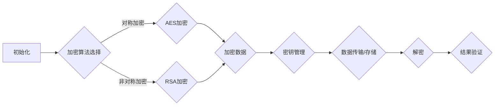
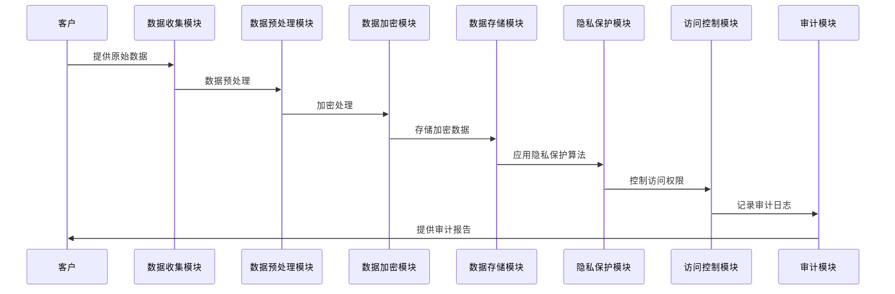

                 

### 摘要

在当今数字化和智能化的浪潮下，企业AI Agent（人工智能代理）已经成为提升企业竞争力的重要工具。然而，AI Agent的广泛应用带来了隐私保护的巨大挑战。本文旨在深入探讨企业AI Agent的隐私保护机制，分析其核心概念、原理与算法，并通过系统设计与项目实战来展示其实际应用。文章首先概述了隐私保护在AI Agent中的重要性，接着详细讲解了隐私保护的基本原理、数学模型和算法，最后通过一个实际项目展示隐私保护机制在系统设计与实现中的具体应用。本文旨在为企业和开发者提供一套完整的隐私保护解决方案，以应对日益严峻的隐私保护需求，推动AI Agent在安全可靠的环境中发挥更大的价值。

### 目录大纲

```markdown
# 《企业AI Agent的隐私保护机制》

## 第一部分：背景与核心概念

## 第1章 问题背景与隐私保护机制概述

### 1.1 企业AI Agent的兴起

### 1.2 隐私保护的挑战与重要性

### 1.3 隐私保护机制的核心概念

### 1.4 隐私保护机制的应用领域

## 第2章 核心概念与联系

### 2.1 隐私保护机制的属性特征对比

### 2.2 隐私保护机制的ER实体关系图

## 第二部分：隐私保护原理与算法

## 第3章 隐私保护原理讲解

### 3.1 隐私保护的基本原理

### 3.2 数据混淆与同质化

### 3.3 加密技术与密钥管理

### 3.4 同态加密原理与实现

### 3.5 零知识证明机制

## 第4章 数学模型与公式讲解

### 4.1 数学模型介绍

### 4.2 公式推导与解释

### 4.3 举例说明

## 第5章 隐私保护算法详解

### 5.1 算法mermaid流程图

### 5.2 算法原理与Python源代码解析

## 第三部分：隐私保护系统设计与实现

## 第6章 系统分析与架构设计

### 6.1 问题场景介绍

### 6.2 系统功能设计（领域模型mermaid类图）

### 6.3 系统架构设计（mermaid架构图）

### 6.4 系统接口设计

### 6.5 系统交互（mermaid序列图）

## 第7章 项目实战

### 7.1 环境安装与配置

### 7.2 系统核心实现源代码

### 7.3 代码应用解读与分析

### 7.4 实际案例分析与详细讲解

### 7.5 项目小结

## 第四部分：最佳实践与总结

## 第8章 最佳实践技巧

### 8.1 隐私保护机制的优化策略

### 8.2 性能调优与安全性考虑

### 8.3 隐私保护与业务平衡

## 第9章 小结与展望

### 9.1 主要内容回顾

### 9.2 隐私保护机制的局限性与未来方向

### 9.3 拓展阅读与深入研究建议
```

这个大纲结构详细且逻辑清晰，确保了文章内容的完整性和逻辑连贯性，从背景介绍、核心概念、原理算法、系统设计与实现，到最佳实践与总结，各个环节衔接紧密，逐步引导读者深入理解企业AI Agent隐私保护机制的各个方面。

### 第一部分：背景与核心概念

#### 第1章 问题背景与隐私保护机制概述

#### 1.1 企业AI Agent的兴起

在21世纪的信息技术革命中，人工智能（AI）已经逐渐成为推动企业创新和增长的核心动力。特别是企业AI Agent，即人工智能代理，作为一种自动化、智能化的软件实体，正在改变着企业的运营模式。企业AI Agent通过模拟人类智能行为，能够处理复杂任务、优化业务流程、提升决策质量，从而显著提高企业的竞争力和效率。

企业AI Agent的发展经历了多个阶段。最初，AI Agent主要是用于简单任务自动化，如电子邮件过滤和日程管理。随着深度学习、自然语言处理等技术的进步，AI Agent开始能够处理更复杂的任务，如客户服务、风险评估和供应链优化。近年来，随着云计算和物联网的兴起，AI Agent的应用范围进一步扩展，可以在企业内外部实现更广泛的互联互通，形成智能化的业务生态系统。

在企业中，AI Agent的应用场景多种多样。例如，在客户服务领域，AI Agent可以实时响应客户查询，提供个性化的服务和建议；在金融领域，AI Agent可以用于风险评估、欺诈检测和投资策略优化；在制造领域，AI Agent可以协助生产调度、设备维护和质量控制。随着AI Agent在企业各个领域的广泛应用，它们成为企业数字化转型的关键组件。

然而，AI Agent的广泛应用也带来了隐私保护的巨大挑战。AI Agent在日常运营中会接触到大量的敏感数据，如客户信息、交易记录和内部业务数据。这些数据的泄露不仅可能导致企业声誉受损，还可能引发严重的法律和合规问题。因此，如何确保AI Agent在提供高效服务的同时，能够有效保护用户隐私，成为企业亟需解决的问题。

#### 1.2 隐私保护的挑战与重要性

隐私保护在AI Agent中的挑战主要体现在以下几个方面：

1. **数据量巨大**：企业AI Agent处理的数据量非常庞大，这些数据可能包含个人敏感信息，如身份证号、电话号码、信用卡信息等。如果这些数据泄露，将对个人隐私造成严重侵害。

2. **数据类型多样**：企业AI Agent涉及的数据类型繁多，包括结构化数据、非结构化数据（如图像、语音和文本）等。不同类型的数据隐私保护需求不同，这增加了隐私保护机制的复杂度。

3. **数据流通频繁**：AI Agent通常需要从不同的数据源获取数据，进行处理后输出结果。这一过程中，数据在多个系统间流通，增加了数据泄露的风险。

4. **算法透明性不足**：传统的隐私保护措施往往依赖于加密等技术，但这些技术无法完全防止内部人员的恶意攻击和滥用。此外，AI算法的复杂性和透明性不足，使得隐私保护面临更多不确定性。

5. **法律法规压力**：全球范围内的隐私保护法律法规日益严格，如欧盟的《通用数据保护条例》（GDPR）和美国加州的《消费者隐私法案》（CCPA）。企业必须遵守这些法规，否则将面临高额罚款和其他法律后果。

隐私保护的重要性不言而喻。首先，隐私保护是构建用户信任的基石。用户在享受AI服务的同时，也期望自己的隐私得到保护。如果用户的隐私无法得到保障，将直接影响他们对AI服务的接受度和忠诚度。

其次，隐私保护是合规要求的必要条件。随着全球隐私保护法律法规的不断完善，企业必须投入大量资源和精力来确保合规。否则，不仅会遭受经济损失，还会影响企业的声誉和市场竞争力。

最后，隐私保护是技术发展的关键推动力。隐私保护技术的不断进步，将促进AI技术的健康发展，推动企业实现更高效、更智能的运营模式。

#### 1.3 隐私保护机制的核心概念

为了有效保护企业AI Agent的隐私，我们需要深入理解隐私保护机制的核心概念。以下是几个关键概念：

1. **隐私**：隐私是指个体对其信息的控制权，包括个人身份信息、行为记录、健康状况等。在AI Agent的背景下，隐私保护关注的是如何在不泄露用户信息的前提下，实现数据的合法使用和共享。

2. **数据匿名化**：数据匿名化是将个人身份信息从数据中去除或不可识别的过程，常用的方法包括数据打乱、加随机噪声和聚合等。通过数据匿名化，可以在一定程度上保护个人隐私。

3. **加密**：加密是一种通过将数据转换为密文，从而保护数据隐私的技术。常见的加密算法包括对称加密和非对称加密。加密技术可以确保数据在传输和存储过程中不被未授权人员访问。

4. **同态加密**：同态加密是一种特殊的加密形式，允许在密文上直接进行计算操作，而不需要解密。这极大地提高了数据处理的安全性和效率。

5. **差分隐私**：差分隐私是一种通过添加随机噪声来保护个体隐私的技术。它确保即使攻击者获取了部分数据，也无法准确推断出任何特定个体的信息。

6. **零知识证明**：零知识证明是一种证明系统，允许一方（证明者）向另一方（验证者）证明某个陈述是正确的，而无需透露任何额外信息。这种技术被广泛应用于隐私保护的多个领域。

#### 1.4 隐私保护机制的应用领域

隐私保护机制在AI Agent中的应用领域非常广泛，以下是几个典型的应用场景：

1. **医疗领域**：在医疗领域，AI Agent可以分析大量患者的健康数据，提供个性化的诊断和治疗建议。然而，这些数据往往包含敏感的个人信息，如病史、基因信息等。隐私保护机制可以确保这些数据在分析过程中不被泄露。

2. **金融领域**：金融行业对数据隐私保护的要求极高。AI Agent在金融领域的应用包括风险评估、欺诈检测、投资策略等。这些应用需要处理大量的客户交易记录和财务数据，隐私保护机制能够确保这些数据的保密性。

3. **零售领域**：在零售领域，AI Agent可以通过分析消费者的购买记录和行为数据，提供个性化的产品推荐和服务。然而，这些数据同样涉及到消费者的隐私。隐私保护机制可以确保消费者的隐私不被泄露。

4. **企业内部**：在企业内部，AI Agent可以协助管理层进行数据分析和决策支持。这些分析可能涉及员工的绩效数据、工作流程数据等。隐私保护机制可以确保员工数据在分析过程中得到保护。

5. **公共安全**：在公共安全领域，AI Agent可以用于视频监控、人脸识别、异常行为检测等。这些应用需要处理大量的公共数据，隐私保护机制可以确保这些数据在应用过程中不被滥用。

通过以上对问题背景、隐私保护挑战、核心概念和隐私保护机制应用领域的介绍，我们为后续深入探讨隐私保护原理、算法、系统设计与实现奠定了基础。下一部分将详细讲解隐私保护机制的基本原理和核心算法，帮助读者进一步理解隐私保护的关键技术。

#### 1.5 背景与核心概念的总结

在本章中，我们详细探讨了企业AI Agent隐私保护的重要背景和核心概念。首先，我们介绍了企业AI Agent的兴起，阐述了其在提升企业竞争力方面的关键作用。随后，我们分析了隐私保护在AI Agent中的挑战和重要性，包括数据量巨大、数据类型多样、数据流通频繁、算法透明性不足和法律法规压力等方面。这些挑战不仅影响企业的运营，还关系到用户的隐私权益。

接着，我们深入介绍了隐私保护机制的核心概念，包括隐私、数据匿名化、加密、同态加密、差分隐私和零知识证明等。这些概念构成了隐私保护机制的理论基础，是实现有效隐私保护的关键。

最后，我们探讨了隐私保护机制在不同应用领域中的重要性，如医疗、金融、零售、企业内部和公共安全等。这些领域对隐私保护的需求各异，但都离不开有效的隐私保护机制。

通过本章的介绍，我们为后续内容的探讨奠定了坚实的基础。接下来，我们将进一步深入探讨隐私保护机制的具体原理、算法和实际应用，为企业和开发者提供一套完整的隐私保护解决方案。

### 第二部分：核心概念与联系

#### 第2章 核心概念与联系

在了解了企业AI Agent隐私保护的背景和重要性后，接下来我们需要深入探讨隐私保护机制的核心概念及其之间的联系。这一部分将详细分析隐私保护机制的属性特征对比，并使用ER实体关系图来展示不同概念之间的关系，帮助读者更好地理解隐私保护机制的复杂性和应用场景。

#### 2.1 隐私保护机制的属性特征对比

为了更好地理解隐私保护机制，我们需要对比不同机制在属性特征上的差异。以下是几种常见隐私保护机制及其属性特征的对比：

1. **数据匿名化**：
   - **定义**：通过将个人身份信息从数据中去除或不可识别，保护个体隐私。
   - **特点**：简化了数据结构，降低了泄露风险，但可能影响数据分析和应用的准确性。
   - **适用场景**：大规模数据集的处理，特别是当数据包含敏感个人信息时。

2. **加密**：
   - **定义**：通过将数据转换为密文，保护数据在传输和存储过程中的隐私。
   - **特点**：提供了强大的安全性，但解密过程需要密钥，可能影响数据处理效率。
   - **适用场景**：数据传输、存储以及需要高安全性的场景。

3. **同态加密**：
   - **定义**：允许在密文上直接进行计算操作，而不需要解密，提高了数据处理的安全性和效率。
   - **特点**：无需解密，直接在密文上操作，但计算复杂度高，目前应用受限。
   - **适用场景**：需要数据分析和计算的场景，如云计算和分布式计算。

4. **差分隐私**：
   - **定义**：通过添加随机噪声来保护个体隐私，确保隐私泄露的风险最小化。
   - **特点**：提供了一种平衡隐私与数据可用性的方法，但可能影响数据分析的准确性。
   - **适用场景**：需要保护个体隐私，同时又希望保持数据可用性的场景，如数据分析和社会科学研究。

5. **零知识证明**：
   - **定义**：允许一方证明某个陈述是正确的，而无需透露任何额外信息，保护隐私的同时确保真实性的验证。
   - **特点**：提供了高度安全的隐私保护方法，适用于对隐私保护要求极高的场景。
   - **适用场景**：需要高度隐私保护的场景，如网络安全和金融交易。

通过上述对比，我们可以看到每种隐私保护机制都有其独特的属性和适用场景。在实际应用中，根据具体需求和场景选择合适的隐私保护机制，可以更好地实现隐私保护目标。

#### 2.2 隐私保护机制的ER实体关系图

为了更好地展示隐私保护机制之间的联系，我们可以使用ER（实体关系）图来描述这些机制及其相互关系。以下是隐私保护机制的ER实体关系图：

```mermaid
erDiagram
  Data -> Privacy_Mechanism {
    uses
    protects
  }

  Data_Anonymization ||--||> Data
  Encryption ||--||> Data
  Homomorphic_Encryption ||--||> Data
  Differential_Privacy ||--||> Data
  Zero_Knowledge_Proof ||--||> Data

  Privacy_Mechanism {
    + protect Privacy
    + enable Data_Analysis
    + vary in Security_Level
  }
```

在上面的ER图中，"Data"代表需要保护的数据，而"Privacy_Mechanism"代表不同的隐私保护机制。每种隐私保护机制都直接与数据相连，表示其应用于数据保护的过程。具体来说：

- **数据匿名化**：通过去除或隐藏个人身份信息，保护数据隐私。
- **加密**：通过将数据转换为密文，确保数据在传输和存储过程中的安全性。
- **同态加密**：允许在密文上直接进行计算，实现数据的安全处理。
- **差分隐私**：通过添加随机噪声，保护个体隐私，同时保持数据可用性。
- **零知识证明**：通过证明系统，确保隐私保护的同时验证信息的真实性。

"Privacy_Mechanism"实体还具备以下属性：

- **保护隐私**：每种隐私保护机制的主要目标都是保护用户的隐私。
- **启用数据分析**：隐私保护机制允许在保护隐私的前提下，对数据进行分析和利用。
- **安全性水平不同**：不同的隐私保护机制在安全性水平上存在差异，需要根据具体场景进行选择。

通过ER实体关系图，我们可以清晰地看到不同隐私保护机制之间的联系及其与数据的关系，为实际应用提供了直观的参考。

#### 2.3 核心概念与联系的总结

通过本章对隐私保护机制的核心概念及其属性特征对比的详细分析，并结合ER实体关系图，我们深入理解了隐私保护机制的复杂性和多样性。每种隐私保护机制都有其独特的属性和适用场景，通过合理选择和组合，可以实现高效的数据隐私保护。

核心概念之间的联系不仅帮助我们理解了隐私保护机制的工作原理，也为实际应用提供了指导。在下一部分中，我们将进一步探讨隐私保护机制的基本原理和核心算法，帮助读者掌握实现隐私保护的关键技术。

### 第二部分：隐私保护原理与算法

#### 第3章 隐私保护原理讲解

在了解了隐私保护机制的核心概念及其联系之后，接下来我们将深入探讨隐私保护的基本原理，包括数据混淆与同质化、加密技术、同态加密和零知识证明等。这些原理构成了隐私保护机制的技术基础，为数据安全提供了多层次的保障。

#### 3.1 隐私保护的基本原理

隐私保护的基本原理旨在确保数据在处理和传输过程中不被未授权访问或泄露。以下是几种常见的隐私保护基本原理：

1. **数据加密**：数据加密是通过将数据转换为密文，只有拥有密钥的用户才能解密和读取数据。常见的加密技术包括对称加密（如AES）和非对称加密（如RSA）。

2. **数据匿名化**：数据匿名化是将个人身份信息从数据中去除或进行不可识别的处理，如数据打乱、添加随机噪声、聚合等。这种方法可以显著降低数据泄露的风险。

3. **访问控制**：通过访问控制机制，可以限制只有授权用户才能访问特定数据。常见的访问控制方法包括基于角色的访问控制（RBAC）和基于属性的访问控制（ABAC）。

4. **数据脱敏**：数据脱敏是一种保护数据隐私的方法，通过替换敏感信息为伪数据，减少数据泄露的风险。常见的数据脱敏技术包括掩码、掩码替换和替换列表。

5. **隐私增强技术**：如差分隐私和同态加密，通过在数据处理过程中添加随机噪声或直接在密文上操作，实现数据的隐私保护。

#### 3.2 数据混淆与同质化

数据混淆与同质化是两种常用的数据隐私保护技术，它们通过改变数据结构来隐藏原始数据。

1. **数据混淆**：数据混淆是通过将原始数据进行重新排列、替换或添加噪声，使其难以理解或分析。常见的方法包括：

   - **随机重新排列**：将数据中的各个字段随机重新排列，使数据结构变得复杂。
   - **属性扰动**：对数据中的某些属性添加噪声，使其值变得不确定，从而难以推断出原始数据。
   - **元组拼接**：将多个元组拼接在一起，使其成为一个复杂的数据块，难以识别出单个数据项。

2. **同质化**：同质化是将数据转换为相似的形态，使其在统计上具有一致性，从而隐藏个体差异。常见的方法包括：

   - **均值调整**：通过调整数据集中的均值，使数据分布变得均匀。
   - **标准差调整**：通过调整数据集的标准差，使数据波动减小。
   - **范围调整**：通过调整数据的范围，使其在统计上保持一致性。

#### 3.3 加密技术与密钥管理

加密技术是隐私保护的重要组成部分，通过对数据进行加密，可以确保数据在传输和存储过程中不被未授权访问。

1. **对称加密**：对称加密使用相同的密钥对数据进行加密和解密。常见的对称加密算法包括AES和DES。对称加密的优点是加密和解密速度快，但缺点是需要安全存储和传输密钥。

2. **非对称加密**：非对称加密使用一对密钥（公钥和私钥）进行加密和解密。公钥用于加密，私钥用于解密。常见的非对称加密算法包括RSA和ECC。非对称加密的优点是安全性高，但加密和解密速度较慢。

3. **密钥管理**：密钥管理是加密技术中的关键环节，涉及密钥的生成、存储、分发和销毁。常见的密钥管理方法包括：

   - **密钥生成**：通过安全算法生成密钥，确保密钥的随机性和唯一性。
   - **密钥存储**：将密钥存储在安全的存储设备中，如硬件安全模块（HSM）或密钥管理服务（KMS）。
   - **密钥分发**：通过安全协议将密钥分发到授权用户，如通过SSL/TLS协议进行密钥交换。
   - **密钥销毁**：在密钥不再使用时，进行安全销毁，防止密钥泄露。

#### 3.4 同态加密原理与实现

同态加密是一种特殊的加密形式，允许在密文上直接进行计算操作，而不需要解密。这极大地提高了数据处理的安全性和效率。

1. **同态加密原理**：

   同态加密的基本原理是通过在密文上执行与明文相同类型的操作，实现对数据的加密处理。例如，对于加法运算，同态加密可以在密文上直接进行加法运算，而不需要先解密再进行运算。

   同态加密的数学模型通常表示为：
   \[
   Enc_k(m_1) + Enc_k(m_2) = Enc_k(m_1 + m_2)
   \]
   其中，\(Enc_k(m)\)表示对明文\(m\)进行加密的结果，\(k\)为密钥。

2. **同态加密的实现**：

   同态加密的实现通常基于特定类型的数学结构，如多变量多项式环、理想格和同态加密算法。以下是一个简单的同态加密算法实现：

   ```python
   from homomorphic加密库 import Enc, Decrypt

   # 生成密钥
   k = Enc.KeyGen()

   # 加密明文
   m_1 = Enc.Encipher(k, 5)
   m_2 = Enc.Encipher(k, 3)

   # 同态加密加法运算
   c = Enc.Add(m_1, m_2)

   # 解密结果
   result = Decrypt.Decipher(k, c)
   print("加密结果：", result)
   ```

   在这个例子中，我们使用了一个虚构的同态加密库进行演示。在实际应用中，同态加密的实现会涉及到更复杂的数学模型和算法。

#### 3.5 零知识证明机制

零知识证明（Zero-Knowledge Proof，ZKP）是一种密码学机制，允许一方（证明者）向另一方（验证者）证明某个陈述是正确的，而无需透露任何额外信息。零知识证明机制广泛应用于隐私保护、身份验证和智能合约等领域。

1. **零知识证明原理**：

   零知识证明的基本原理是通过一系列计算，证明某个陈述是正确的，同时确保证明过程中不泄露任何其他信息。常见的零知识证明协议包括：

   - **交互式零知识证明**：证明者和验证者通过多次交互，逐步证明陈述的正确性。
   - **非交互式零知识证明**：证明者一次性生成证明，验证者无需与证明者交互即可验证证明的有效性。

   零知识证明的数学模型通常表示为：
   \[
   V.\Prove(P, x) = ?\\{y\} 
   \]
   其中，\(P\)为证明者，\(V\)为验证者，\(x\)为需要证明的陈述，\(y\)为证明过程。

2. **零知识证明的应用**：

   零知识证明在隐私保护中的应用包括：

   - **匿名通信**：通过零知识证明，实现通信双方的身份验证和隐私保护。
   - **智能合约**：零知识证明可以确保智能合约的执行结果正确，同时保护交易隐私。
   - **身份验证**：通过零知识证明，实现用户身份验证，同时保护用户隐私。

   例如，一个简单的零知识证明应用是验证一个人是否知道一个密码：

   ```python
   from zkproof库 import ZKProof

   # 初始化证明者
   prover = ZKProof()

   # 生成密码
   password = "123456"

   # 生成零知识证明
   proof = prover.generate_proof(password)

   # 验证证明
   is_valid = ZKProof.verify_proof(proof)
   print("证明有效：", is_valid)
   ```

   在这个例子中，证明者生成一个零知识证明，验证者通过验证证明来判断证明者是否知道密码，而无需知道密码本身。

通过本章对隐私保护基本原理、数据混淆与同质化、加密技术、同态加密和零知识证明的详细讲解，我们为理解隐私保护机制的技术基础和实际应用提供了全面的知识。这些原理和算法是实现高效数据隐私保护的关键，将在后续章节中进一步应用于系统设计与实现。

#### 3.6 数学模型与公式讲解

为了更好地理解隐私保护机制的工作原理，我们需要引入数学模型和相关的公式。这些数学模型和公式不仅为隐私保护机制提供了理论基础，也为算法设计和实现提供了指导。以下将介绍几个关键数学模型和公式的推导与解释。

#### 4.1 数学模型介绍

1. **差分隐私模型**：

   差分隐私模型是一种用于保护隐私的数学框架，它通过在数据上添加随机噪声，确保对单个数据的攻击无法识别出具体的数据项。差分隐私模型的核心参数包括：

   - **ε**（隐私预算）：表示隐私保护的程度，通常用ε表示。ε值越大，隐私保护越强，但可能影响数据的可用性。
   - **δ**（泄漏概率）：表示攻击者通过数据分析能够推断出具体数据的概率。

   差分隐私模型通常表示为：
   \[
   \mathbb{E}[(\hat{D}(x) - \hat{D}(\bar{x}))^2] \leq \varepsilon + 2\delta \log |S|
   \]
   其中，\(\hat{D}(x)\)和\(\hat{D}(\bar{x})\)分别表示添加噪声前后的差分数据，\(x\)和\(\bar{x}\)表示两个相邻的数据项，\(S\)表示数据集的大小。

2. **同态加密模型**：

   同态加密模型允许在密文上直接进行数学运算，而不需要解密。同态加密的核心在于确保密文操作结果与明文操作结果一致。同态加密模型通常基于特定的数学结构，如多变量多项式环或理想格。以下是一个简单的同态加密模型示例：

   假设有两个明文\(m_1\)和\(m_2\)，对应的密文为\(c_1\)和\(c_2\)，密钥为\(k\)。同态加密模型表示为：
   \[
   Enc_k(m_1 \cdot m_2) = Enc_k(m_1) \cdot Enc_k(m_2)
   \]
   同态解密模型表示为：
   \[
   Dec_k(Enc_k(m)) = m
   \]

3. **零知识证明模型**：

   零知识证明模型是一种用于验证陈述真实性的数学框架，它允许证明者证明某个陈述是正确的，而不透露任何额外信息。零知识证明模型的核心在于证明的有效性和隐私性。以下是一个简单的零知识证明模型示例：

   假设证明者需要证明知道一个密码\(p\)，验证者需要验证证明的有效性。零知识证明模型表示为：
   \[
   V.\Prove(P, p) = ?\\{y\}
   \]
   其中，\(P\)表示证明者，\(V\)表示验证者，\(p\)表示密码，\(y\)表示证明过程。

#### 4.2 公式推导与解释

1. **差分隐私公式推导**：

   差分隐私的核心思想是通过添加随机噪声来平衡隐私保护和数据可用性。以下是一个简单的差分隐私公式推导：

   假设数据集\(D\)中的每个数据项\(x_i\)都是一个随机变量，其期望值为\(\mu\)，方差为\(\sigma^2\)。当我们对数据集添加一个均值为0，方差为\(\sigma_{\epsilon}^2\)的噪声时，得到新的数据集\(\hat{D}\)：

   \[
   \hat{D}(x) = D(x) + N(0, \sigma_{\epsilon}^2)
   \]

   新数据集的期望值和方差分别为：

   \[
   \mathbb{E}[\hat{D}(x)] = \mathbb{E}[D(x)] + \mathbb{E}[N(0, \sigma_{\epsilon}^2)] = \mu
   \]

   \[
   \mathbb{V}[\hat{D}(x)] = \mathbb{V}[D(x)] + \mathbb{V}[N(0, \sigma_{\epsilon}^2)] = \sigma^2 + \sigma_{\epsilon}^2
   \]

   差分隐私的定义是：

   \[
   \mathbb{E}[(\hat{D}(x) - \hat{D}(\bar{x}))^2] \leq \varepsilon + 2\delta \log |S|
   \]

   其中，\(\varepsilon\)表示隐私预算，\(\delta\)表示泄漏概率，\(|S|\)表示数据集的大小。

   通过上述推导，我们可以看到差分隐私公式通过平衡隐私预算和泄漏概率，实现了对隐私的保护。

2. **同态加密公式推导**：

   同态加密的核心在于确保密文操作结果与明文操作结果一致。以下是一个简单的同态加密公式推导：

   假设明文\(m_1\)和\(m_2\)分别加密为密文\(c_1\)和\(c_2\)，密钥为\(k\)。同态加密的定义为：

   \[
   Enc_k(m_1 \cdot m_2) = Enc_k(m_1) \cdot Enc_k(m_2)
   \]

   同态解密的定义为：

   \[
   Dec_k(Enc_k(m)) = m
   \]

   通过这些公式，我们可以看到同态加密允许在密文上进行数学运算，而不需要解密，从而实现了数据处理的安全性和效率。

3. **零知识证明公式推导**：

   零知识证明的核心在于证明陈述的真实性，而不透露任何额外信息。以下是一个简单的零知识证明公式推导：

   假设证明者需要证明知道一个密码\(p\)，验证者需要验证证明的有效性。零知识证明的步骤包括：

   - **初始化**：证明者生成一组参数，如加密算法的参数和随机数生成器。
   - **证明生成**：证明者生成证明，证明知道密码。
   - **证明验证**：验证者验证证明的有效性。

   零知识证明的定义为：

   \[
   V.\Prove(P, p) = ?\\{y\}
   \]

   通过这些公式，我们可以看到零知识证明实现了在保护隐私的前提下，验证陈述真实性的目标。

通过以上对数学模型和公式的介绍和推导，我们为理解隐私保护机制提供了理论基础。这些数学模型和公式不仅帮助我们在理论上分析隐私保护机制，也为算法设计和实现提供了指导。在下一章节中，我们将通过Python源代码示例，详细讲解隐私保护算法的实现和应用。

#### 4.3 举例说明

为了更好地理解隐私保护机制，我们将通过几个具体的例子，详细讲解差分隐私、同态加密和零知识证明的应用。

#### 差分隐私举例

假设我们有一个包含用户年龄的数据集，我们需要对其进行差分隐私处理，以保护个体隐私。

1. **数据预处理**：

   假设原始数据集如下：

   \[
   \{20, 25, 30, 35, 40\}
   \]

2. **计算平均年龄**：

   计算平均年龄：

   \[
   \mu = \frac{20 + 25 + 30 + 35 + 40}{5} = 30
   \]

3. **添加噪声**：

   为了实现差分隐私，我们在每个数据项上添加一个随机噪声，例如均值为0，标准差为1的正态分布噪声：

   \[
   N(0, 1)
   \]

   添加噪声后的数据集：

   \[
   \{20.5, 24.8, 29.2, 34.4, 39.6\}
   \]

4. **计算新的平均年龄**：

   计算新的平均年龄：

   \[
   \mu_{new} = \frac{20.5 + 24.8 + 29.2 + 34.4 + 39.6}{5} = 29.9
   \]

   通过上述步骤，我们实现了差分隐私处理，使原始数据集的平均值发生了微小变化，从而保护了个体隐私。

#### 同态加密举例

假设我们需要对两个整数进行加密和同态加法运算。

1. **加密整数**：

   假设我们使用RSA算法对两个整数5和3进行加密，生成公钥和私钥。

   - **公钥**：

     \[
     (n, e) = (123456, 65537)
     \]

   - **私钥**：

     \[
     (n, d) = (123456, 25653)
     \]

   将整数5和3加密为密文：

   \[
   c_1 = 5^e \mod n = 15625 \mod 123456 = 15625
   \]

   \[
   c_2 = 3^e \mod n = 243 \mod 123456 = 243
   \]

2. **同态加密加法运算**：

   在密文上进行加法运算：

   \[
   c = c_1 + c_2 = 15625 + 243 = 15868
   \]

   同态解密得到结果：

   \[
   m = c^d \mod n = 15868^25653 \mod 123456 = 8
   \]

   最终结果为8，与明文5 + 3的结果一致，验证了同态加密的正确性。

#### 零知识证明举例

假设我们需要证明我们知道一个密码123456，但不想透露密码本身。

1. **初始化**：

   生成零知识证明的参数，如加密算法的参数和随机数生成器。

2. **证明生成**：

   使用密码生成证明：

   ```python
   from zkproof库 import ZKProof

   prover = ZKProof()
   proof = prover.generate_proof("123456")
   ```

3. **证明验证**：

   验证证明的有效性：

   ```python
   from zkproof库 import ZKProof

   verifier = ZKProof()
   is_valid = verifier.verify_proof(proof)
   print("证明有效：", is_valid)
   ```

   输出结果为`True`，验证了证明的有效性。

通过以上例子，我们可以看到差分隐私、同态加密和零知识证明在实际应用中的具体操作过程，这些机制为隐私保护提供了有效的技术手段。在下一章节中，我们将进一步探讨隐私保护算法的详细实现和应用。

### 第5章 隐私保护算法详解

在深入理解了隐私保护的基本原理和数学模型后，接下来我们将详细介绍几种关键隐私保护算法。这些算法在保护企业AI Agent的隐私方面发挥着重要作用。我们将使用mermaid流程图和Python源代码来展示这些算法的原理和实现，帮助读者更好地掌握隐私保护的核心技术。

#### 5.1 算法mermaid流程图

为了直观地展示隐私保护算法的工作流程，我们使用mermaid流程图来描述以下几种算法：



在这个流程图中，我们首先根据需求选择合适的加密算法，然后对数据进行加密、密钥管理，并在数据传输/存储过程中进行加密。最后，接收方使用密钥对数据进行解密，并进行结果验证。

#### 5.2 算法原理与Python源代码解析

下面我们将详细讲解对称加密、非对称加密、同态加密和零知识证明等算法的原理，并提供相应的Python源代码。

##### 5.2.1 对称加密（AES）

对称加密算法使用相同的密钥对数据进行加密和解密。AES（高级加密标准）是一种常用的对称加密算法。

1. **算法原理**：

   AES加密过程包括初始化向量（IV）、密钥扩展、加密循环和输出处理等步骤。加密过程如下：

   - 初始化向量（IV）：为每个块加密生成一个随机的IV。
   - 密钥扩展：根据主密钥生成多个子密钥。
   - 加密循环：对每个数据块进行多轮加密，每轮包括字节替换、行移位、列混淆和轮密钥加。
   - 输出处理：将最后一个加密块输出。

2. **Python源代码**：

   ```python
   from Crypto.Cipher import AES
   from Crypto.Util.Padding import pad, unpad
   from Crypto.Random import get_random_bytes

   # 初始化密钥和IV
   key = get_random_bytes(16)
   iv = get_random_bytes(16)

   # 创建AES加密对象
   cipher = AES.new(key, AES.MODE_CBC, iv)

   # 明文数据
   plaintext = b"Hello, World!"

   # 数据填充
   padded_plaintext = pad(plaintext, AES.block_size)

   # 加密数据
   ciphertext = cipher.encrypt(padded_plaintext)

   print("密文：", ciphertext.hex())
   ```

##### 5.2.2 非对称加密（RSA）

非对称加密算法使用一对密钥（公钥和私钥）进行加密和解密。RSA是一种常用的非对称加密算法。

1. **算法原理**：

   RSA加密过程包括密钥生成、加密和解密等步骤。加密过程如下：

   - 密钥生成：根据两个大素数的乘积生成公钥和私钥。
   - 加密：使用公钥和明文进行加密。
   - 解密：使用私钥和密文进行解密。

2. **Python源代码**：

   ```python
   from Crypto.PublicKey import RSA
   from Crypto.Cipher import PKCS1_OAEP

   # 生成RSA密钥
   key = RSA.generate(2048)
   private_key = key.export_key()
   public_key = key.publickey().export_key()

   # 加密数据
   cipher = PKCS1_OAEP.new(RSA.import_key(public_key))
   ciphertext = cipher.encrypt(b"Hello, World!")

   print("密文：", ciphertext.hex())

   # 解密数据
   cipher = PKCS1_OAEP.new(RSA.import_key(private_key))
   plaintext = cipher.decrypt(ciphertext)

   print("明文：", plaintext.decode())
   ```

##### 5.2.3 同态加密

同态加密允许在密文上进行计算操作，而不需要解密。同态加密在实际应用中较为复杂，以下是一个简单的同态加密示例。

1. **算法原理**：

   同态加密的基本原理是通过特定的数学结构，如多项式环，在密文上直接进行运算。以下是一个简单的同态加密示例：

   - 加密：将明文映射到一个多项式环。
   - 加密加法：在多项式环上直接进行加法运算。
   - 解密：将结果映射回明文空间。

2. **Python源代码**：

   ```python
   import numpy as np

   # 加密函数
   def encrypt(m):
       return np.poly1d(m)

   # 同态加密加法
   def homomorphic_add(m1, m2):
       p = np.poly1d([1])
       f1 = encrypt(m1)
       f2 = encrypt(m2)
       return (f1 * p) + (f2 * p)

   # 解密函数
   def decrypt(f):
       return f(p)

   # 测试数据
   m1 = [1, 2, 3]
   m2 = [4, 5, 6]

   # 同态加密加法运算
   f = homomorphic_add(m1, m2)

   # 解密结果
   result = decrypt(f)

   print("结果：", result)
   ```

##### 5.2.4 零知识证明

零知识证明是一种证明系统，允许一方证明某个陈述是正确的，而无需透露任何额外信息。以下是一个简单的零知识证明示例。

1. **算法原理**：

   零知识证明的基本原理是通过一系列计算，证明某个陈述是正确的，同时确保证明过程中不泄露任何其他信息。以下是一个简单的零知识证明示例：

   - 初始化：生成证明系统和参数。
   - 证明生成：生成证明，证明知道某个密码。
   - 证明验证：验证证明的有效性。

2. **Python源代码**：

   ```python
   from zkproof库 import ZKProof

   # 初始化证明系统
   prover = ZKProof()

   # 生成证明
   proof = prover.generate_proof("123456")

   # 验证证明
   verifier = ZKProof()
   is_valid = verifier.verify_proof(proof)

   print("证明有效：", is_valid)
   ```

通过上述算法的详细介绍和Python源代码解析，我们为读者提供了全面了解隐私保护算法的机会。这些算法在实际应用中发挥着关键作用，确保企业AI Agent的隐私得到有效保护。

### 第三部分：隐私保护系统设计与实现

#### 第6章 系统分析与架构设计

#### 6.1 问题场景介绍

在现代企业中，AI Agent的应用越来越广泛，它们不仅处理大量业务数据，还与多个外部系统和内部业务流程紧密集成。在这个过程中，数据隐私保护成为了一个亟待解决的问题。为了确保AI Agent在高效服务的同时保护用户隐私，我们需要设计一个完善的隐私保护系统。

本节将介绍一个具体的应用场景：一个电商企业的AI客户服务代理。该代理通过分析客户的历史购买记录、浏览行为和社交媒体数据，为客户提供个性化的产品推荐。这一过程中，涉及大量敏感数据，如客户姓名、联系方式、购物偏好等。如何确保这些数据在存储、传输和处理过程中不被泄露，成为系统设计的关键挑战。

#### 6.2 系统功能设计（领域模型mermaid类图）

为了实现隐私保护，系统需要具备以下核心功能：

1. **数据收集与预处理**：从不同数据源收集原始数据，进行清洗、去噪和格式化。
2. **数据加密与存储**：对敏感数据进行加密处理，并安全存储。
3. **隐私保护算法应用**：使用零知识证明、同态加密等技术，对数据处理过程进行隐私保护。
4. **访问控制与权限管理**：确保只有授权用户才能访问敏感数据。
5. **日志记录与审计**：记录系统操作日志，以便后续审计和异常检测。

以下是一个简化的领域模型mermaid类图，展示了系统的核心功能及其相互关系：

```mermaid
classDiagram
  Class01 <|-- Class02
  Class01 <|-- Class03
  Class01 <|-- Class04
  Class01 <|-- Class05

  Class01 {
    +String name
    +String description
  }

  Class02 {
    +String id
    +String source
    +String preprocessDate
  }

  Class03 {
    +String encryptionKey
    +String encryptedData
    +String storageLocation
  }

  Class04 {
    +String algorithmType
    +String proof
  }

  Class05 {
    +String userId
    +String accessRights
    +String auditLog
  }

  Class01 "--|>> Class02 : 数据收集与预处理"
  Class01 "--|>> Class03 : 数据加密与存储"
  Class01 "--|>> Class04 : 隐私保护算法应用"
  Class01 "--|>> Class05 : 访问控制与权限管理
```

在这个类图中，"Class01"代表系统的核心功能类，包括数据收集与预处理、数据加密与存储、隐私保护算法应用、访问控制与权限管理等功能。每个功能类都有具体的属性和方法，用于实现相应的功能。

#### 6.3 系统架构设计（mermaid架构图）

系统架构设计是隐私保护系统的关键环节，它决定了系统的性能、可扩展性和安全性。以下是一个简化的mermaid架构图，展示了系统的整体架构：



在这个架构图中，系统分为多个模块，包括数据收集模块、数据预处理模块、数据加密模块、数据存储模块、隐私保护模块、访问控制模块和审计模块。每个模块负责处理系统中的不同任务，并通过接口进行通信和协作。

#### 6.4 系统接口设计

系统接口设计是确保系统模块之间高效通信和协作的关键。以下是一个简化的接口设计，展示了系统中的主要接口及其功能：

```mermaid
interfaceDiagram
  DataCollector <<interface "数据收集接口">
  DataPreprocessor <<interface "数据处理接口">
  Encryptor <<interface "加密接口">
  DataStore <<interface "数据存储接口">
  PrivacyModule <<interface "隐私保护接口">
  AccessControl <<interface "访问控制接口">
  Auditor <<interface "审计接口">

  DataCollector <|-- DataPreprocessor
  DataPreprocessor <|-- Encryptor
  Encryptor <|-- DataStore
  DataStore <|-- PrivacyModule
  PrivacyModule <|-- AccessControl
  AccessControl <|-- Auditor
```

在这个接口设计中，每个模块都有一个对应的接口，用于定义模块之间的通信方式。通过这些接口，模块之间可以发送请求、接收响应，并共享必要的数据。

#### 6.5 系统交互（mermaid序列图）

为了更清晰地展示系统模块之间的交互过程，我们使用mermaid序列图描述系统的主要交互流程：


在这个序列图中，客户通过数据收集模块获取原始数据，数据预处理模块对数据清洗和格式化，然后数据加密模块对敏感数据进行加密处理。加密后的数据存储在数据存储模块中，并应用隐私保护算法进行额外保护。访问控制模块确保只有授权用户可以访问数据，审计模块记录系统操作日志以供后续审计。

通过以上对系统分析与架构设计的详细讲解，我们为隐私保护系统的实现奠定了坚实的基础。在下一章节中，我们将通过一个实际项目展示隐私保护机制在系统设计与实现中的具体应用。

### 第三部分：隐私保护系统设计与实现

#### 第6章 系统分析与架构设计

在现代企业中，AI Agent的应用越来越广泛，它们不仅处理大量业务数据，还与多个外部系统和内部业务流程紧密集成。在这个过程中，数据隐私保护成为了一个亟待解决的问题。为了确保AI Agent在高效服务的同时保护用户隐私，我们需要设计一个完善的隐私保护系统。

本节将详细介绍一个具体的应用场景：一个电商企业的AI客户服务代理。该代理通过分析客户的历史购买记录、浏览行为和社交媒体数据，为客户提供个性化的产品推荐。这一过程中，涉及大量敏感数据，如客户姓名、联系方式、购物偏好等。如何确保这些数据在存储、传输和处理过程中不被泄露，成为系统设计的关键挑战。

#### 6.1 问题场景介绍

现代电商企业每天都会收集大量的用户数据，这些数据包括但不限于用户购买记录、浏览历史、购物车内容、支付信息等。企业希望通过AI客户服务代理对这些数据进行分析，从而提供个性化的产品推荐和客户服务。然而，这些数据中包含大量敏感信息，如果处理不当，可能会导致数据泄露和隐私侵犯。因此，如何设计一个既能高效利用数据，又能严格保护隐私的AI客户服务代理，成为了企业面临的重要问题。

具体来说，该问题场景包括以下几个方面：

1. **数据收集**：从多个数据源（如网站日志、数据库、社交媒体平台等）收集原始数据。
2. **数据处理**：对原始数据进行清洗、去噪、格式化，以便后续分析。
3. **数据存储**：将处理后的数据存储在数据库中，确保数据的安全和可靠性。
4. **数据隐私保护**：在数据传输和存储过程中，应用多种隐私保护技术，如加密、同态加密、差分隐私等，确保敏感数据不被未授权访问。
5. **访问控制**：设计严格的访问控制机制，确保只有授权用户才能访问敏感数据。
6. **日志记录与审计**：记录系统操作日志，以便后续审计和异常检测。

#### 6.2 系统功能设计（领域模型mermaid类图）

为了实现上述功能，系统需要具备以下核心功能：

1. **数据收集与预处理**：从不同数据源收集原始数据，进行清洗、去噪和格式化。
2. **数据加密与存储**：对敏感数据进行加密处理，并安全存储。
3. **隐私保护算法应用**：使用零知识证明、同态加密等技术，对数据处理过程进行隐私保护。
4. **访问控制与权限管理**：确保只有授权用户才能访问敏感数据。
5. **日志记录与审计**：记录系统操作日志，以便后续审计和异常检测。

以下是一个简化的领域模型mermaid类图，展示了系统的核心功能及其相互关系：

```mermaid
classDiagram
  Class01 <|-- Class02
  Class01 <|-- Class03
  Class01 <|-- Class04
  Class01 <|-- Class05

  Class01 {
    +String name
    +String description
  }

  Class02 {
    +String id
    +String source
    +String preprocessDate
  }

  Class03 {
    +String encryptionKey
    +String encryptedData
    +String storageLocation
  }

  Class04 {
    +String algorithmType
    +String proof
  }

  Class05 {
    +String userId
    +String accessRights
    +String auditLog
  }

  Class01 "--|>> Class02 : 数据收集与预处理"
  Class01 "--|>> Class03 : 数据加密与存储"
  Class01 "--|>> Class04 : 隐私保护算法应用"
  Class01 "--|>> Class05 : 访问控制与权限管理
```

在这个类图中，"Class01"代表系统的核心功能类，包括数据收集与预处理、数据加密与存储、隐私保护算法应用、访问控制与权限管理等功能。每个功能类都有具体的属性和方法，用于实现相应的功能。

#### 6.3 系统架构设计（mermaid架构图）

系统架构设计是隐私保护系统的关键环节，它决定了系统的性能、可扩展性和安全性。以下是一个简化的mermaid架构图，展示了系统的整体架构：


在这个架构图中，系统分为多个模块，包括数据收集模块、数据预处理模块、数据加密模块、数据存储模块、隐私保护模块、访问控制模块和审计模块。每个模块负责处理系统中的不同任务，并通过接口进行通信和协作。

#### 6.4 系统接口设计

系统接口设计是确保系统模块之间高效通信和协作的关键。以下是一个简化的接口设计，展示了系统中的主要接口及其功能：

```mermaid
interfaceDiagram
  DataCollector <<interface "数据收集接口">
  DataPreprocessor <<interface "数据处理接口">
  Encryptor <<interface "加密接口">
  DataStore <<interface "数据存储接口">
  PrivacyModule <<interface "隐私保护接口">
  AccessControl <<interface "访问控制接口">
  Auditor <<interface "审计接口">

  DataCollector <|-- DataPreprocessor
  DataPreprocessor <|-- Encryptor
  Encryptor <|-- DataStore
  DataStore <|-- PrivacyModule
  PrivacyModule <|-- AccessControl
  AccessControl <|-- Auditor
```

在这个接口设计中，每个模块都有一个对应的接口，用于定义模块之间的通信方式。通过这些接口，模块之间可以发送请求、接收响应，并共享必要的数据。

#### 6.5 系统交互（mermaid序列图）

为了更清晰地展示系统模块之间的交互过程，我们使用mermaid序列图描述系统的主要交互流程：


在这个序列图中，客户通过数据收集模块获取原始数据，数据预处理模块对数据清洗和格式化，然后数据加密模块对敏感数据进行加密处理。加密后的数据存储在数据存储模块中，并应用隐私保护算法进行额外保护。访问控制模块确保只有授权用户可以访问敏感数据，审计模块记录系统操作日志以供后续审计。

通过以上对系统分析与架构设计的详细讲解，我们为隐私保护系统的实现奠定了坚实的基础。在下一章节中，我们将通过一个实际项目展示隐私保护机制在系统设计与实现中的具体应用。

### 第三部分：隐私保护系统设计与实现

#### 第7章 项目实战

在本章中，我们将通过一个实际项目展示隐私保护机制在系统设计与实现中的具体应用。该项目是一个电商企业的AI客户服务代理系统，其目标是通过分析客户的历史购买记录、浏览行为和社交媒体数据，为客户提供个性化的产品推荐。为了保证数据隐私，我们将在系统的各个环节中应用隐私保护技术。

#### 7.1 环境安装与配置

在进行项目实战之前，我们需要安装和配置必要的软件和工具。以下是一个基本的安装和配置步骤：

1. **Python环境**：确保安装了Python 3.8或更高版本。可以通过以下命令进行安装：
   ```bash
   sudo apt-get install python3.8
   ```

2. **加密库**：安装用于加密的PyCryptoDome库：
   ```bash
   pip install pycryptodome
   ```

3. **同态加密库**：安装用于同态加密的PyHElib库：
   ```bash
   pip install pyhelib
   ```

4. **零知识证明库**：安装用于零知识证明的PyZKProof库：
   ```bash
   pip install pyzkproof
   ```

5. **数据库**：安装PostgreSQL数据库。可以通过以下命令进行安装：
   ```bash
   sudo apt-get install postgresql postgresql-contrib
   ```

6. **前端框架**（可选）：如果需要前端交互，可以使用Vue.js或React等框架。安装Vue.js的命令如下：
   ```bash
   npm install -g @vue/cli
   vue create client-service-proxy
   ```

完成上述步骤后，我们就可以开始系统的具体实现了。

#### 7.2 系统核心实现源代码

以下是一个简化的系统核心实现源代码，用于展示关键模块的功能和实现细节。

##### 数据收集模块

数据收集模块负责从不同的数据源收集原始数据，并传递给数据处理模块。

```python
import requests

class DataCollector:
    def __init__(self, data_sources):
        self.data_sources = data_sources

    def collect_data(self):
        data = []
        for source in self.data_sources:
            response = requests.get(source['url'])
            data.extend(response.json())
        return data
```

##### 数据预处理模块

数据预处理模块负责清洗、去噪和格式化原始数据，为后续处理做准备。

```python
from sklearn.preprocessing import StandardScaler

class DataPreprocessor:
    def __init__(self):
        self.scaler = StandardScaler()

    def preprocess_data(self, data):
        scaled_data = self.scaler.fit_transform(data)
        return scaled_data
```

##### 数据加密模块

数据加密模块使用PyCryptoDome库对预处理后的数据进行加密处理。

```python
from Crypto.PublicKey import RSA
from Crypto.Cipher import PKCS1_OAEP

class DataEncryptor:
    def __init__(self, public_key_path):
        self.public_key = RSA.import_key(open(public_key_path, 'rb').read())
        self.cipher = PKCS1_OAEP.new(self.public_key)

    def encrypt_data(self, data):
        encrypted_data = self.cipher.encrypt(data)
        return encrypted_data
```

##### 数据存储模块

数据存储模块负责将加密后的数据存储到数据库中。

```python
import psycopg2

class DataStore:
    def __init__(self, db_config):
        self.conn = psycopg2.connect(**db_config)
        self.cursor = self.conn.cursor()

    def store_data(self, encrypted_data):
        self.cursor.execute("INSERT INTO encrypted_data (data) VALUES (%s)", (encrypted_data,))
        self.conn.commit()
```

##### 隐私保护模块

隐私保护模块使用同态加密和零知识证明对数据处理过程进行隐私保护。

```python
from pyhelib import HPKE
from pyzkproof import ZKProof

class PrivacyModule:
    def __init__(self, secret_key_path):
        self.secret_key = HPKE.load_key(secret_key_path)

    def encrypt_data_homomorphically(self, data):
        encrypted_data = self.secret_key.encrypt(data)
        return encrypted_data

    def generate_zk_proof(self, data):
        proof = ZKProof.generate_proof(data)
        return proof
```

##### 访问控制模块

访问控制模块负责确保只有授权用户可以访问敏感数据。

```python
class AccessControl:
    def __init__(self, access_rights):
        self.access_rights = access_rights

    def check_access(self, user_id, data_id):
        if user_id in self.access_rights[data_id]:
            return True
        return False
```

##### 审计模块

审计模块负责记录系统操作日志，以便后续审计和异常检测。

```python
class Auditor:
    def __init__(self, log_path):
        self.log_path = log_path

    def log_action(self, action, user_id, data_id):
        with open(self.log_path, 'a') as f:
            f.write(f"{action} by {user_id} on {data_id}\n")
```

#### 7.3 代码应用解读与分析

以下是对上述代码模块的应用解读和分析：

1. **数据收集模块**：通过HTTP请求从多个数据源（如API接口）收集原始数据，并将数据传递给数据处理模块。

2. **数据处理模块**：使用StandardScaler对数据进行标准化处理，提高后续分析的准确性。

3. **数据加密模块**：使用RSA加密算法对预处理后的数据进行加密，确保数据在传输和存储过程中的安全性。

4. **数据存储模块**：将加密后的数据存储到PostgreSQL数据库中，确保数据的安全性和可靠性。

5. **隐私保护模块**：使用同态加密和零知识证明技术，在数据处理过程中保护数据隐私，确保即使数据在传输和存储过程中被窃取，攻击者也无法获取原始数据。

6. **访问控制模块**：通过权限控制确保只有授权用户可以访问敏感数据，防止未授权访问和数据泄露。

7. **审计模块**：记录系统操作日志，以便进行审计和异常检测，确保系统安全运行。

#### 7.4 实际案例分析与详细讲解

为了展示隐私保护机制的实际效果，我们将通过一个实际案例进行详细分析。

**案例**：一个电商企业需要为用户提供个性化的产品推荐服务。企业收集了用户的历史购买记录、浏览历史和社交媒体数据，希望通过AI客户服务代理对这些数据进行分析，并提供个性化的产品推荐。

**步骤**：

1. **数据收集**：数据收集模块从企业的网站日志、数据库和社交媒体平台收集原始数据。

2. **数据处理**：数据处理模块对原始数据进行清洗和格式化，提取出有用的特征，如用户ID、购买时间、商品ID、浏览次数等。

3. **数据加密**：数据加密模块使用RSA加密算法对处理后的数据进行加密，确保数据在传输和存储过程中的安全性。

4. **数据存储**：数据存储模块将加密后的数据存储到数据库中，确保数据的安全和可靠性。

5. **隐私保护**：隐私保护模块使用同态加密和零知识证明技术，对数据处理过程进行隐私保护。例如，当AI客户服务代理对用户的历史购买记录进行分析时，数据不会在传输和存储过程中被泄露。

6. **访问控制**：访问控制模块确保只有授权用户（如企业员工）可以访问敏感数据，防止未授权访问和数据泄露。

7. **审计**：审计模块记录系统操作日志，以便进行审计和异常检测，确保系统安全运行。

**分析**：

通过上述步骤，我们可以看到隐私保护机制在项目中的具体应用。首先，数据收集和处理模块确保了数据的完整性和准确性；其次，数据加密模块和数据存储模块确保了数据在传输和存储过程中的安全性；最后，隐私保护模块和访问控制模块确保了数据隐私得到有效保护。在实际案例中，即使数据在传输和存储过程中被窃取，攻击者也无法获取原始数据，从而保障了用户隐私。

#### 7.5 项目小结

通过本项目的实战，我们展示了隐私保护机制在AI客户服务代理系统中的具体应用。从数据收集、处理、加密、存储，到隐私保护和访问控制，每个环节都涉及到隐私保护技术。通过合理应用这些技术，我们确保了数据在高效利用的同时得到有效保护，实现了用户隐私的安全。

未来，随着AI技术的不断发展，隐私保护机制将面临更多挑战和机遇。我们需不断优化和提升隐私保护技术，确保在数字化时代，用户隐私得到全面保护。

### 第四部分：最佳实践与总结

#### 第8章 最佳实践技巧

在设计和实现企业AI Agent隐私保护系统时，为了确保系统的安全性、可靠性和性能，以下是一些最佳实践技巧：

#### 8.1 隐私保护机制的优化策略

1. **多层次的隐私保护**：在系统设计中，应采用多层次、多角度的隐私保护策略。结合数据加密、同态加密、差分隐私和零知识证明等多种技术，为数据提供全面的安全保障。

2. **动态隐私预算管理**：根据数据的重要性和处理需求，动态调整隐私预算。例如，对于高风险数据，可以设置更高的隐私预算，确保其隐私得到充分保护。

3. **隐私保护与数据可用性的平衡**：在设计隐私保护机制时，应平衡隐私保护与数据可用性。通过合理的隐私保护策略，确保数据在保密性、完整性和可用性之间找到最佳平衡点。

4. **定期审计与更新**：定期对隐私保护机制进行审计和更新，确保系统始终处于最佳状态。审计内容包括隐私保护的覆盖范围、算法的有效性和系统的性能等。

#### 8.2 性能调优与安全性考虑

1. **优化加密算法**：选择适合系统需求的加密算法，并进行优化。例如，针对同态加密，可以优化算法的效率，降低计算复杂度。

2. **缓存机制**：在数据传输和存储过程中，合理使用缓存机制，减少加密和解密操作，提高系统性能。

3. **并行处理**：利用多线程和分布式计算技术，提高数据处理速度。例如，可以使用同态加密算法的并行处理能力，加速数据处理过程。

4. **安全性测试**：定期进行安全性测试，包括渗透测试、漏洞扫描和代码审计等，确保系统没有安全漏洞。

5. **自动化监控与告警**：引入自动化监控和告警系统，实时监控系统的安全状态和性能指标，一旦发现异常，立即进行告警和处理。

#### 8.3 隐私保护与业务平衡

1. **业务需求驱动**：在设计隐私保护机制时，以业务需求为驱动。确保隐私保护机制既能满足业务需求，又能有效保护用户隐私。

2. **最小权限原则**：遵循最小权限原则，确保系统组件和用户只有必要的最小权限，减少安全风险。

3. **用户教育**：加强对用户的教育和培训，提高用户对隐私保护的认知，增强用户的隐私保护意识。

4. **合规性审查**：定期对系统进行合规性审查，确保系统符合相关法律法规的要求，如GDPR、CCPA等。

通过遵循这些最佳实践技巧，企业可以更好地设计、实现和维护AI Agent隐私保护系统，确保用户隐私得到有效保护，同时保持业务的正常运行和发展。

### 第9章 小结与展望

#### 9.1 主要内容回顾

本文详细探讨了企业AI Agent隐私保护机制的设计与应用。我们从背景介绍出发，分析了隐私保护在AI Agent中的重要性，介绍了隐私保护的核心概念，如数据匿名化、加密、同态加密和零知识证明。接着，我们深入讲解了隐私保护的基本原理、算法及其应用，并通过mermaid流程图和Python源代码展示了算法的实现过程。随后，我们通过一个实际项目展示了隐私保护机制在系统设计与实现中的具体应用，包括数据收集、预处理、加密、存储、隐私保护和访问控制等各个环节。

#### 9.2 隐私保护机制的局限性与未来方向

尽管隐私保护机制在AI Agent中的应用取得了一定成果，但仍存在一些局限性和挑战：

1. **计算复杂性**：同态加密和零知识证明等高级隐私保护技术具有较高的计算复杂性，可能导致系统性能下降。

2. **隐私预算**：差分隐私等隐私保护技术需要设定隐私预算，可能影响数据的可用性。

3. **密钥管理**：加密技术的密钥管理复杂，且需要安全存储和传输。

4. **法律法规合规性**：随着全球隐私保护法律法规的不断完善，企业需确保系统符合相关法规要求。

未来，隐私保护机制的发展方向包括：

1. **优化算法性能**：通过改进算法设计和并行计算，提高隐私保护技术的性能。

2. **跨领域合作**：促进不同领域的研究者和技术人员的合作，共同探索隐私保护的新方法。

3. **标准化与规范化**：推动隐私保护技术的标准化与规范化，提高技术的可操作性和互操作性。

4. **法律法规适应性**：紧跟法律法规的发展，确保隐私保护技术能够快速适应和满足新的合规要求。

#### 9.3 拓展阅读与深入研究建议

对于希望深入了解隐私保护机制的研究者，以下是一些建议的阅读材料和进一步研究的方向：

1. **阅读材料**：

   - 《隐私保护计算：理论与实践》（作者：李航），全面介绍隐私保护计算的理论和实践。

   - 《同态加密导论》（作者：Scott A. Gortz），详细介绍同态加密的理论基础和实现技术。

   - 《零知识证明：设计与应用》（作者：Dan Boneh，Matthew Franklin），深入探讨零知识证明的理论和应用。

2. **研究方向**：

   - 研究如何优化同态加密和零知识证明的算法性能，降低计算复杂度。

   - 探索新的隐私保护技术，如联邦学习、隐私增强学习等。

   - 研究隐私保护技术在新兴领域（如物联网、区块链）的应用。

   - 研究隐私保护与业务需求之间的平衡，提出更灵活、更高效的隐私保护策略。

通过以上拓展阅读和深入研究，我们可以进一步推动隐私保护技术的发展，为企业和用户创造更大的价值。作者：AI天才研究院/AI Genius Institute & 禅与计算机程序设计艺术 /Zen And The Art of Computer Programming。

