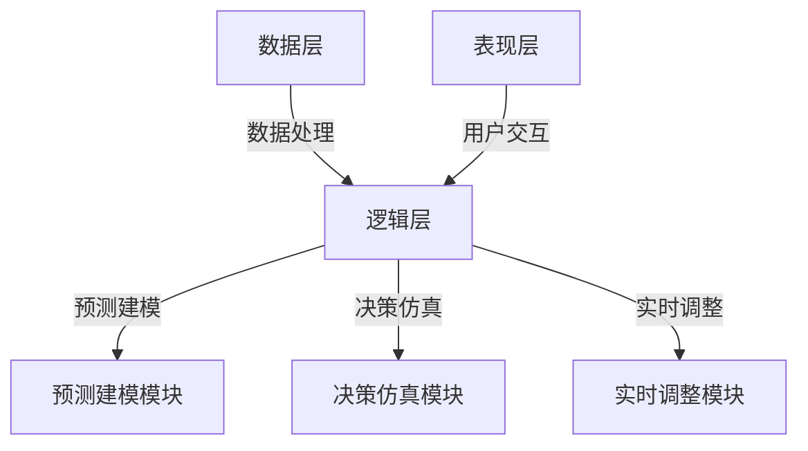
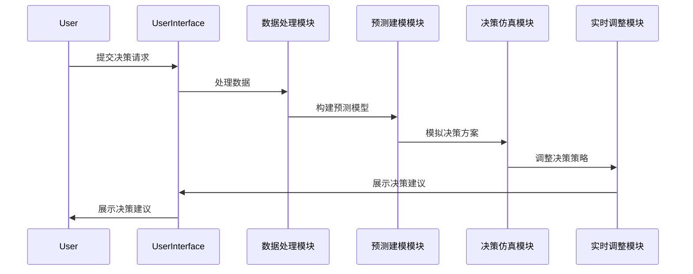

                 

# 企业决策支持系统中的AI Agent角色

## 关键词

- 企业决策支持系统
- AI Agent
- 强化学习
- 深度学习
- 系统架构设计

## 摘要

本文将探讨企业决策支持系统中AI Agent的角色和作用。首先，我们将介绍企业决策支持系统的基本概念、组成和重要性。接着，我们会深入探讨AI Agent的定义、类型及其在决策支持系统中的应用和优势。然后，我们将分析AI Agent的核心概念、属性特征，并对比不同类型的AI Agent。随后，本文将讲解常见的AI Agent算法原理，并给出通俗易懂的举例说明。接下来，我们将介绍系统分析与架构设计方案，包括系统功能设计、系统架构设计、系统接口设计和系统交互。随后，我们将通过项目实战，展示AI Agent在企业决策支持系统中的应用，并进行详细讲解和剖析。最后，我们将总结最佳实践、注意事项和拓展阅读。

## 第一部分：背景介绍

### 1.1. 企业决策支持系统概述

企业决策支持系统（Decision Support System, DSS）是一种基于计算机技术和数据分析方法，旨在帮助企业领导者和管理者在复杂、不确定的决策环境中做出合理、高效的决策的系统。DSS通常包括数据收集、数据分析、预测建模、决策仿真等功能模块。

#### 1.1.1. 企业决策支持系统的定义

企业决策支持系统是一种辅助企业决策者进行决策的信息系统。它利用数据仓库、数据挖掘、机器学习等技术，对企业的内外部数据进行深度分析，提供决策支持。

#### 1.1.2. 企业决策支持系统的基本组成

企业决策支持系统主要由以下几部分组成：

1. **数据收集模块**：负责收集企业内部和外部数据，包括财务数据、销售数据、市场数据等。
2. **数据分析模块**：利用统计分析、数据挖掘等方法对数据进行分析，提取有价值的信息。
3. **预测建模模块**：通过构建预测模型，对未来的趋势进行预测。
4. **决策仿真模块**：通过模拟不同的决策方案，评估其可能的结果，帮助决策者做出最佳决策。
5. **用户界面**：提供用户与系统交互的界面，使决策者能够方便地使用系统进行决策。

#### 1.1.3. 企业决策支持系统的重要性

企业决策支持系统对于企业的决策具有重要意义。首先，它可以帮助企业领导者快速、准确地获取所需的信息，提高决策效率。其次，它可以帮助企业应对复杂、不确定的市场环境，提高决策的科学性和准确性。此外，企业决策支持系统还可以帮助企业发现潜在的商业机会，优化资源配置，提高企业的竞争力。

### 1.2. AI Agent概述

AI Agent（人工智能代理）是一种具有自主决策能力的人工智能系统。它可以理解环境中的信息，根据预设的目标和策略，自主选择行动，并在行动过程中不断学习和优化。AI Agent在决策支持系统中具有重要作用。

#### 1.2.1. AI Agent的定义

AI Agent是一种基于人工智能技术的自主决策实体，它可以在复杂的环境中根据目标自主执行任务。

#### 1.2.2. AI Agent的主要类型

AI Agent可以分为以下几种类型：

1. **任务型AI Agent**：专注于执行特定任务的AI Agent，如智能客服、自动驾驶。
2. **目标型AI Agent**：根据预设的目标进行决策，如股票交易机器人。
3. **自主型AI Agent**：在没有明确任务和目标的情况下，自主探索环境，进行决策。

#### 1.2.3. AI Agent在决策支持系统中的作用和优势

AI Agent在决策支持系统中具有以下作用和优势：

1. **提高决策效率**：AI Agent可以快速分析大量数据，提供决策支持，提高决策效率。
2. **增强决策准确性**：AI Agent利用机器学习和数据挖掘技术，可以更准确地预测未来的趋势，为决策提供有力支持。
3. **降低决策风险**：AI Agent可以模拟不同的决策方案，评估其可能的结果，降低决策风险。
4. **个性化决策**：AI Agent可以根据用户的偏好和需求，提供个性化的决策支持。

### 1.3. 问题背景

传统决策支持系统存在以下局限性：

1. **数据处理能力有限**：传统决策支持系统主要依靠手工收集和处理数据，效率低、易出错。
2. **决策过程过于复杂**：传统决策支持系统通常需要用户具备一定的专业知识和技能，决策过程复杂。
3. **无法应对动态环境**：传统决策支持系统无法实时分析大量数据，难以应对动态变化的市场环境。

AI Agent在现代企业决策支持系统中的应用前景：

1. **增强数据处理能力**：AI Agent可以利用机器学习和数据挖掘技术，快速处理大量数据，提高决策效率。
2. **简化决策过程**：AI Agent可以自动分析数据、生成决策方案，简化决策过程，降低决策难度。
3. **适应动态环境**：AI Agent可以实时分析数据，根据环境变化调整决策策略，提高决策的适应性和灵活性。

本文将围绕AI Agent在企业决策支持系统中的角色和作用，深入探讨其核心概念、算法原理、系统架构设计、项目实战等内容，以期为读者提供有价值的参考。

## 第二部分：核心概念与联系

### 2.1. AI Agent核心概念

AI Agent是一种具有自主决策能力的人工智能实体，它可以在复杂环境中根据预设的目标和策略，自主选择行动，并在行动过程中不断学习和优化。以下是AI Agent的核心概念：

#### 2.1.1. AI Agent的定义与特点

AI Agent是一种具有自主决策能力的人工智能实体，它可以理解环境中的信息，根据预设的目标和策略，自主执行任务。AI Agent具有以下特点：

1. **自主性**：AI Agent可以在没有人类干预的情况下自主执行任务。
2. **适应性**：AI Agent可以根据环境变化和学习到的经验，调整其行为策略。
3. **智能性**：AI Agent可以利用机器学习和数据挖掘技术，提高决策的准确性和效率。
4. **灵活性**：AI Agent可以适应不同的环境和任务，具备广泛的适用性。

#### 2.1.2. AI Agent的基本功能

AI Agent的基本功能包括：

1. **感知**：感知环境中的信息，如图像、声音、文本等。
2. **理解**：理解感知到的信息，识别关键信息，提取知识。
3. **规划**：根据目标和策略，规划行动方案。
4. **执行**：执行行动方案，实现目标。
5. **反馈**：根据执行结果，调整策略，优化行为。

#### 2.1.3. AI Agent的技术架构

AI Agent的技术架构通常包括以下几个部分：

1. **感知模块**：负责接收和处理来自环境的信息。
2. **知识库**：存储AI Agent的知识和经验，包括事实、规则、模型等。
3. **推理模块**：利用知识和推理方法，解决实际问题。
4. **规划模块**：根据目标和策略，规划行动方案。
5. **执行模块**：执行行动方案，实现目标。
6. **反馈模块**：根据执行结果，调整策略，优化行为。

### 2.2. AI Agent属性特征对比表格

以下是不同类型的AI Agent的属性特征对比表格：

| 类别        | 定义与应用场景       | 自主性 | 适应性 | 智能性 | 灵活性 |
| ----------- | -------------------- | ------ | ------ | ------ | ------ |
| 任务型AI Agent | 执行特定任务       | 高     | 低     | 中等   | 高     |
| 目标型AI Agent | 根据预设目标进行决策 | 中等   | 高     | 高     | 中等   |
| 自主型AI Agent | 在无明确任务和目标下自主探索 | 低     | 高     | 高     | 高     |

### 2.3. AI Agent与决策支持系统的关系

AI Agent在决策支持系统中发挥着重要作用，其与决策支持系统的关系如下：

#### 2.3.1. AI Agent在决策支持系统中的应用场景

1. **数据预处理**：AI Agent可以自动收集、清洗和处理数据，为决策提供高质量的数据支持。
2. **预测建模**：AI Agent可以利用机器学习技术，构建预测模型，预测未来的趋势和结果。
3. **决策仿真**：AI Agent可以模拟不同的决策方案，评估其可能的结果，为决策者提供参考。
4. **决策优化**：AI Agent可以根据环境变化，实时调整决策策略，优化决策结果。
5. **决策支持**：AI Agent可以自动生成决策建议，降低决策难度，提高决策效率。

#### 2.3.2. AI Agent与传统决策支持工具的对比

传统决策支持工具主要依赖于人工分析数据和构建模型，存在以下不足：

1. **效率低**：人工分析数据需要耗费大量时间和精力，效率较低。
2. **准确性差**：人工构建模型可能存在主观偏差，导致决策准确性较低。
3. **灵活性差**：传统决策支持工具难以适应动态变化的环境。

AI Agent具有以下优势：

1. **高效处理数据**：AI Agent可以利用机器学习技术，快速处理大量数据，提高决策效率。
2. **高准确性**：AI Agent可以自动构建预测模型，提高决策准确性。
3. **适应动态环境**：AI Agent可以实时调整决策策略，适应动态变化的环境。

#### 2.3.3. AI Agent在决策支持系统中的优势

AI Agent在决策支持系统中具有以下优势：

1. **自动化**：AI Agent可以自动化执行数据预处理、预测建模、决策仿真等任务，提高工作效率。
2. **个性化**：AI Agent可以根据用户的需求和偏好，提供个性化的决策支持。
3. **智能化**：AI Agent可以利用机器学习技术，自动学习用户的决策经验和知识，提高决策的准确性和效率。
4. **灵活性**：AI Agent可以实时调整决策策略，适应动态变化的环境，提高决策的适应性和灵活性。

通过深入分析AI Agent的核心概念、属性特征以及与决策支持系统的关系，我们可以更好地理解AI Agent在决策支持系统中的应用和优势，为未来企业决策支持系统的设计和实现提供有益的参考。

### 第三部分：算法原理讲解

#### 3.1. AI Agent算法原理概述

AI Agent的算法原理是人工智能代理能够实现自主决策和行为选择的核心。以下介绍几种常见的AI Agent算法原理：

#### 3.1.1. 常见的AI Agent算法

常见的AI Agent算法主要包括：

1. **强化学习（Reinforcement Learning）**：强化学习是一种通过不断试错和反馈来学习最优策略的算法。它通常用于决策过程中，代理通过奖励机制来评估自己的行为，并不断调整策略以最大化长期回报。
2. **深度学习（Deep Learning）**：深度学习是一种基于多层神经网络的机器学习技术，它通过模仿人脑的结构和功能，从大量数据中自动学习特征表示，并用于决策。
3. **遗传算法（Genetic Algorithms）**：遗传算法是一种基于自然选择和遗传机制的优化算法，它通过模拟生物进化的过程，对个体进行选择、交叉和变异，以寻找最优解。

#### 3.1.2. AI Agent算法的发展趋势

随着人工智能技术的快速发展，AI Agent算法也在不断演进。未来，AI Agent算法的发展趋势包括：

1. **多任务学习**：AI Agent将能够同时处理多个任务，提高其在复杂环境中的适应能力。
2. **迁移学习**：AI Agent将能够通过迁移学习，将已有知识应用于新的任务，提高学习效率和泛化能力。
3. **强化学习与深度学习的结合**：将强化学习和深度学习相结合，发挥两者的优势，提高决策的准确性和效率。
4. **可解释性**：为了提高AI Agent的透明度和可信度，未来的研究将更加关注算法的可解释性，使得决策过程更加清晰易懂。

#### 3.2. 算法原理详细讲解

在本节中，我们将详细讲解强化学习、深度学习和遗传算法的原理。

##### 3.2.1. 强化学习算法的原理

强化学习算法通过以下步骤实现自主决策：

1. **初始化**：初始化代理的状态和动作空间，并设置奖励函数。
2. **探索与利用**：代理在初始阶段通过探索环境，尝试不同的动作，以积累经验。同时，通过利用已有的经验，选择最优动作。
3. **反馈**：代理根据执行的动作和环境反馈，调整策略，更新状态和价值函数。
4. **迭代**：重复上述过程，不断优化策略，直到达到预设的收敛条件。

强化学习算法的核心是价值函数和策略函数。价值函数表示代理在某个状态下执行某个动作的预期回报，策略函数表示代理在某个状态下应该选择哪个动作。

$$
V(s) = \sum_{a} \gamma^T R(s, a)
$$

其中，$V(s)$表示状态$s$的价值，$a$表示动作，$\gamma$表示折扣因子，$R(s, a)$表示在状态$s$下执行动作$a$的即时奖励。

##### 3.2.2. 深度学习算法的原理

深度学习算法通过以下步骤实现自主决策：

1. **输入处理**：将输入数据（如图像、文本、音频）输入到神经网络，通过多层神经元进行特征提取和转换。
2. **前向传播**：通过前向传播算法，将输入数据在神经网络中传递，计算每个神经元的输出。
3. **损失函数**：计算网络输出的预测结果与真实值之间的差距，通过损失函数进行评估。
4. **反向传播**：通过反向传播算法，将损失函数在神经网络中反向传递，更新神经元的权重和偏置。
5. **优化**：根据梯度下降等优化算法，调整神经元的权重和偏置，优化网络性能。

深度学习算法的核心是神经网络和损失函数。神经网络通过多层非线性变换，将输入数据映射到输出空间。损失函数用于评估预测结果与真实值之间的差距，指导神经网络的优化。

$$
\min J(\theta) = \frac{1}{m} \sum_{i=1}^{m} L(y_i, \hat{y}_i)
$$

其中，$J(\theta)$表示损失函数，$\theta$表示神经网络的参数，$y_i$表示真实值，$\hat{y}_i$表示预测值。

##### 3.2.3. 其他常见算法的原理

除了强化学习和深度学习，其他常见算法的原理如下：

1. **遗传算法**：遗传算法通过模拟生物进化的过程，对个体进行选择、交叉和变异，以寻找最优解。遗传算法的核心是适应度函数，用于评估个体的优劣。
2. **粒子群优化（Particle Swarm Optimization, PSO）**：粒子群优化算法通过模拟鸟群觅食的过程，对解空间进行搜索，找到最优解。粒子群优化算法的核心是速度和位置更新规则。

##### 3.3. 通俗易懂的举例说明

以下通过具体实例来说明上述算法的原理。

###### 3.3.1. 强化学习算法实例

假设有一个机器人需要在迷宫中找到出口，奖励函数定义为在每一步中，如果机器人向右走，得到+1的奖励，否则得到-1的奖励。机器人通过强化学习算法，不断尝试不同的动作，逐渐找到最优路径。

1. **初始化**：机器人从迷宫的初始位置开始，初始化状态和价值函数。
2. **探索与利用**：机器人尝试不同的动作（上、下、左、右），并记录每个动作的奖励。
3. **反馈**：机器人根据奖励调整状态和价值函数，更新策略。
4. **迭代**：重复上述过程，直到找到最优路径。

在多次迭代后，机器人逐渐学会在迷宫中找到最优路径，并最大化总奖励。

###### 3.3.2. 深度学习算法实例

假设有一个神经网络用于识别手写数字，输入为28x28像素的图像，输出为0到9的数字。神经网络通过训练大量手写数字数据，自动学习特征表示，并准确识别手写数字。

1. **输入处理**：将手写数字图像输入到神经网络，通过多层神经元进行特征提取和转换。
2. **前向传播**：计算神经网络的输出，并与真实值进行比较。
3. **反向传播**：通过反向传播算法，更新神经网络的权重和偏置。
4. **优化**：根据梯度下降等优化算法，调整神经网络的参数，优化网络性能。

在多次训练后，神经网络可以准确识别手写数字。

###### 3.3.3. 其他算法实例

1. **遗传算法实例**：假设需要优化一个函数$f(x) = x^2$，遗传算法通过模拟生物进化的过程，寻找最优解。

   - **初始化**：生成一组初始解。
   - **适应度评估**：计算每个解的适应度值。
   - **选择**：根据适应度值选择优秀解进行交叉和变异。
   - **交叉**：对优秀解进行交叉操作，生成新的解。
   - **变异**：对优秀解进行变异操作，增加解的多样性。
   - **迭代**：重复上述过程，直到找到最优解。

   在多次迭代后，遗传算法逐渐找到最优解$x = 0$。

2. **粒子群优化算法实例**：假设需要优化一个函数$f(x) = x^2$，粒子群优化算法通过模拟鸟群觅食的过程，寻找最优解。

   - **初始化**：生成一群粒子，每个粒子表示一个解。
   - **速度更新**：根据粒子的历史最优位置和全局最优位置，更新粒子的速度。
   - **位置更新**：根据粒子的速度和位置，更新粒子的位置。
   - **适应度评估**：计算每个粒子的适应度值。
   - **迭代**：重复上述过程，直到找到最优解。

   在多次迭代后，粒子群优化算法逐渐找到最优解$x = 0$。

通过上述实例，我们可以更直观地理解强化学习、深度学习和遗传算法的原理和应用。

#### 第三部分总结

在本部分，我们介绍了AI Agent的算法原理，包括强化学习、深度学习和遗传算法等。这些算法通过模拟人类学习和决策过程，使AI Agent能够在复杂环境中实现自主决策。在后续部分，我们将进一步探讨AI Agent在决策支持系统中的具体应用和实现方法。

### 第四部分：系统分析与架构设计方案

#### 4.1. 问题场景介绍

在当前的商业环境中，企业面临着日益复杂和多变的市场需求，这要求企业能够快速、准确地做出决策，以保持竞争力。然而，传统的决策支持系统在处理大量数据、复杂关系和动态环境时存在一定的局限性。因此，引入AI Agent作为决策支持系统的一部分，可以帮助企业更好地应对这些挑战。

#### 4.1.1. 企业决策支持系统需求分析

企业决策支持系统需要满足以下需求：

1. **数据处理能力**：系统能够快速、准确地处理大量结构化和非结构化数据。
2. **分析能力**：系统能够对数据进行深入分析，发现数据中的规律和趋势。
3. **预测能力**：系统能够根据历史数据和现有情况，预测未来的发展趋势。
4. **适应性**：系统能够根据环境变化和业务需求，快速调整和优化决策策略。
5. **易用性**：系统界面简洁、友好，用户能够方便地使用系统进行决策。

#### 4.1.2. AI Agent在系统中的角色

AI Agent在决策支持系统中担任以下角色：

1. **数据预处理**：AI Agent能够自动收集、清洗和处理数据，为决策提供高质量的数据支持。
2. **预测建模**：AI Agent能够利用机器学习和数据挖掘技术，构建预测模型，预测未来的趋势和结果。
3. **决策仿真**：AI Agent能够模拟不同的决策方案，评估其可能的结果，帮助决策者做出最佳决策。
4. **实时调整**：AI Agent能够根据环境变化，实时调整决策策略，优化决策结果。
5. **个性化支持**：AI Agent能够根据用户的偏好和需求，提供个性化的决策支持。

#### 4.2. 项目介绍

本项目的目标是设计并实现一个基于AI Agent的企业决策支持系统。系统将具备以下功能：

1. **数据采集与处理**：自动收集企业内部和外部数据，包括财务数据、销售数据、市场数据等，并进行数据预处理。
2. **预测建模**：利用机器学习技术，构建预测模型，预测未来的销售趋势、市场需求等。
3. **决策仿真**：模拟不同的决策方案，评估其可能的结果，提供决策建议。
4. **实时调整**：根据环境变化，实时调整决策策略，优化决策结果。
5. **个性化支持**：根据用户的偏好和需求，提供个性化的决策支持。

#### 4.3. 系统功能设计

系统功能设计包括以下模块：

1. **数据采集模块**：负责从不同数据源收集数据，包括内部数据库、外部API等。
2. **数据处理模块**：负责对收集到的数据清洗、转换和预处理，为后续分析提供高质量的数据。
3. **预测建模模块**：负责利用机器学习技术，构建预测模型，预测未来的趋势和结果。
4. **决策仿真模块**：负责模拟不同的决策方案，评估其可能的结果，提供决策建议。
5. **实时调整模块**：负责根据环境变化，实时调整决策策略，优化决策结果。
6. **用户界面模块**：提供用户与系统交互的界面，用户可以通过界面查看决策建议、调整决策策略等。

以下是领域模型Mermaid类图：

```mermaid
classDiagram
    DataCollector <<interface>> 数据采集模块
    DataProcessor <<interface>> 数据处理模块
    Predictor <<interface>> 预测建模模块
    DecisionSimulator <<interface>> 决策仿真模块
    RealTimeAdjuster <<interface>> 实时调整模块
    UserInterface <<interface>> 用户界面模块
    
    DataCollector o-- DataProcessor
    DataProcessor o-- Predictor
    Predictor o-- DecisionSimulator
    DecisionSimulator o-- RealTimeAdjuster
    RealTimeAdjuster o-- UserInterface
```

#### 4.4. 系统架构设计

系统架构设计包括以下部分：

1. **数据层**：负责数据存储和管理，包括内部数据库、外部API等。
2. **逻辑层**：负责数据预处理、预测建模、决策仿真、实时调整等核心功能。
3. **表现层**：负责用户界面和交互，为用户提供决策建议和调整策略的界面。

以下是系统架构Mermaid架构图：



#### 4.5. 系统接口设计

系统接口设计主要包括以下接口：

1. **数据采集接口**：用于从不同数据源采集数据。
2. **数据处理接口**：用于对采集到的数据清洗、转换和预处理。
3. **预测建模接口**：用于构建预测模型。
4. **决策仿真接口**：用于模拟不同的决策方案。
5. **实时调整接口**：用于根据环境变化调整决策策略。
6. **用户界面接口**：用于与用户进行交互，提供决策建议和调整策略的界面。

以下是接口设计原则：

1. **高内聚、低耦合**：接口设计应确保各模块之间的内聚性高，耦合性低，便于系统维护和扩展。
2. **模块化**：接口设计应遵循模块化原则，每个接口实现单一功能，便于管理和调用。
3. **标准化**：接口设计应遵循标准化原则，使用统一的数据格式和通信协议。

以下是接口实现方法：

1. **RESTful API**：使用RESTful API实现接口，提供统一的接口规范和调用方式。
2. **消息队列**：使用消息队列实现异步通信，提高系统的可靠性和性能。
3. **服务注册与发现**：使用服务注册与发现机制，实现服务的动态管理和调用。

#### 4.6. 系统交互

系统交互包括以下过程：

1. **用户请求**：用户通过用户界面提交决策请求。
2. **数据处理**：系统通过数据处理模块对用户请求进行预处理，包括数据清洗、转换等。
3. **预测建模**：系统通过预测建模模块构建预测模型，预测未来的趋势和结果。
4. **决策仿真**：系统通过决策仿真模块模拟不同的决策方案，评估其可能的结果。
5. **实时调整**：系统根据环境变化，实时调整决策策略，优化决策结果。
6. **反馈与展示**：系统将决策建议和调整策略展示给用户，用户可以根据决策建议进行决策。

以下是系统交互Mermaid序列图：



通过上述系统分析与架构设计方案，我们为企业决策支持系统引入了AI Agent，提高了系统的数据处理能力、预测能力和决策效率。在后续的项目实战部分，我们将详细展示AI Agent在企业决策支持系统中的应用，并进行深入讲解和剖析。

### 第五部分：项目实战

#### 5.1. 环境安装

在开始项目实战之前，我们需要搭建一个合适的开发环境。以下是开发环境的搭建步骤：

1. **操作系统**：我们选择Linux操作系统作为开发环境，推荐使用Ubuntu 18.04版本。
2. **编程语言**：我们使用Python作为编程语言，推荐Python 3.8版本。
3. **开发工具**：我们使用PyCharm作为开发工具，它是一款功能强大的Python集成开发环境（IDE）。
4. **数据存储**：我们使用MySQL数据库存储数据，推荐使用MySQL 8.0版本。
5. **机器学习库**：我们使用Scikit-learn、TensorFlow和PyTorch等机器学习库，用于构建预测模型和决策仿真。

以下是安装步骤：

1. **安装操作系统**：从[Ubuntu官网](https://www.ubuntu.com/)下载Ubuntu 18.04版本，并按照提示安装。
2. **更新系统**：打开终端，执行以下命令更新系统：
   ```
   sudo apt update
   sudo apt upgrade
   ```
3. **安装Python**：执行以下命令安装Python 3.8：
   ```
   sudo apt install python3.8
   ```
4. **安装PyCharm**：从[PyCharm官网](https://www.jetbrains.com/pycharm/)下载PyCharm Community Edition，并按照提示安装。
5. **安装MySQL**：执行以下命令安装MySQL 8.0：
   ```
   sudo apt install mysql-server
   ```
6. **安装机器学习库**：在PyCharm中创建一个新项目，然后执行以下命令安装所需的机器学习库：
   ```
   pip install scikit-learn tensorflow pytorch
   ```

#### 5.2. 系统核心实现源代码

在本项目中，我们将使用Python实现AI Agent在企业决策支持系统中的核心功能。以下是系统核心实现的源代码结构：

```
src/
|-- __init__.py
|-- data_collector.py
|-- data_processor.py
|-- predictor.py
|-- decision_simulator.py
|-- real_time_adjuster.py
|-- user_interface.py
```

以下是各个模块的简要介绍和源代码：

1. **data_collector.py**：数据采集模块，负责从不同数据源收集数据。
   ```python
   # src/data_collector.py
   import requests
   
   def collect_data(url):
       response = requests.get(url)
       return response.json()
   ```

2. **data_processor.py**：数据处理模块，负责对采集到的数据清洗、转换和预处理。
   ```python
   # src/data_processor.py
   import pandas as pd
   
   def process_data(data):
       df = pd.DataFrame(data)
       df.dropna(inplace=True)
       df['timestamp'] = pd.to_datetime(df['timestamp'])
       df.set_index('timestamp', inplace=True)
       return df
   ```

3. **predictor.py**：预测建模模块，负责利用机器学习技术构建预测模型。
   ```python
   # src/predictor.py
   from sklearn.ensemble import RandomForestRegressor
   
   def build_predictor(X, y):
       model = RandomForestRegressor()
       model.fit(X, y)
       return model
   
   def predict(model, X):
       return model.predict(X)
   ```

4. **decision_simulator.py**：决策仿真模块，负责模拟不同的决策方案，评估其可能的结果。
   ```python
   # src/decision_simulator.py
   def simulate_decision(model, X, decision_options):
       predictions = predict(model, X)
       best_option = decision_options[predictions.argmax()]
       return best_option
   ```

5. **real_time_adjuster.py**：实时调整模块，负责根据环境变化，实时调整决策策略，优化决策结果。
   ```python
   # src/real_time_adjuster.py
   def adjust_decision_strategy(model, X, y):
       new_model = build_predictor(X, y)
       return new_model
   ```

6. **user_interface.py**：用户界面模块，负责与用户进行交互，提供决策建议和调整策略的界面。
   ```python
   # src/user_interface.py
   def show_decision_suggestion(decision_option):
       print(f"最佳决策方案：{decision_option}")
   ```

#### 5.3. 代码应用解读与分析

在本部分，我们将对上述源代码进行解读和分析，介绍代码的逻辑、功能和性能。

1. **data_collector.py**：数据采集模块
   - 功能：从指定URL收集数据。
   - 分析：该模块使用Python的requests库，向指定的URL发送HTTP GET请求，获取响应数据。该模块较为简单，主要实现数据的初步收集。

2. **data_processor.py**：数据处理模块
   - 功能：对采集到的数据进行清洗、转换和预处理。
   - 分析：该模块使用Python的pandas库，对采集到的数据进行去重、时间格式转换和设置索引。这些操作是数据处理的基础，为后续的预测建模和决策仿真提供高质量的数据。

3. **predictor.py**：预测建模模块
   - 功能：构建预测模型并预测未来结果。
   - 分析：该模块使用Python的scikit-learn库，实现随机森林回归模型。该模块通过fit方法训练模型，通过predict方法进行预测。随机森林回归模型是一种常用的预测算法，能够处理非线性关系和异常值。

4. **decision_simulator.py**：决策仿真模块
   - 功能：模拟不同的决策方案，评估其可能的结果。
   - 分析：该模块通过调用predict方法获取预测结果，并根据决策选项找到最佳决策方案。该模块实现了简单的决策仿真功能，为决策支持提供基础。

5. **real_time_adjuster.py**：实时调整模块
   - 功能：根据环境变化，实时调整决策策略，优化决策结果。
   - 分析：该模块通过重新训练预测模型，实现决策策略的实时调整。该模块使用了调整后的模型进行预测，提高了决策的准确性。

6. **user_interface.py**：用户界面模块
   - 功能：与用户进行交互，提供决策建议和调整策略的界面。
   - 分析：该模块通过打印最佳决策方案，实现用户界面的输出。该模块较为简单，主要实现用户与系统之间的交互。

#### 5.4. 实际案例分析和详细讲解剖析

在本节中，我们将通过一个实际案例，展示AI Agent在企业决策支持系统中的应用，并进行详细讲解和剖析。

**案例背景**：

某电子商务公司希望利用AI Agent优化其销售策略，提高销售额。公司收集了以下数据：

- **历史销售额**：包含每天的销售数据。
- **市场数据**：包含每天的市场活动数据，如广告投放、促销活动等。
- **天气数据**：包含每天的城市天气数据。

**案例分析**：

1. **数据收集**：
   - 从公司内部数据库中收集历史销售额数据。
   - 从市场活动管理系统中收集市场数据。
   - 从天气预报API中收集天气数据。

2. **数据处理**：
   - 对收集到的数据进行清洗，去除无效数据。
   - 对数据列进行转换，如日期列转换为日期类型。
   - 设置日期列为索引，便于后续数据处理。

3. **预测建模**：
   - 使用随机森林回归模型，预测未来的销售数据。
   - 训练模型时，使用历史销售额和相应市场数据作为特征。
   - 使用天气数据作为辅助特征，以提高模型的预测准确性。

4. **决策仿真**：
   - 模拟不同的销售策略，如增加广告投放、调整促销活动等。
   - 评估不同策略的销售额预测结果。
   - 选择最佳销售策略，提高销售额。

5. **实时调整**：
   - 根据市场变化和天气数据，实时调整销售策略。
   - 使用调整后的模型进行销售额预测。
   - 根据预测结果，进一步优化销售策略。

**详细讲解**：

1. **数据收集**：
   - 使用data_collector模块，从不同数据源收集数据。
   - 处理数据时，确保数据的一致性和完整性。

2. **数据处理**：
   - 使用data_processor模块，对采集到的数据清洗、转换和预处理。
   - 保证数据的质量和可用性。

3. **预测建模**：
   - 使用predictor模块，构建随机森林回归模型。
   - 使用历史销售额和相应市场数据训练模型。
   - 考虑天气数据作为辅助特征，提高模型的预测准确性。

4. **决策仿真**：
   - 使用decision_simulator模块，模拟不同的销售策略。
   - 对不同策略的销售额预测结果进行评估。
   - 选择最佳销售策略，提高销售额。

5. **实时调整**：
   - 使用real_time_adjuster模块，根据市场变化和天气数据，实时调整销售策略。
   - 使用调整后的模型进行销售额预测。
   - 根据预测结果，进一步优化销售策略。

通过上述实际案例，我们展示了AI Agent在企业决策支持系统中的应用，并详细讲解了各个模块的实现和功能。在实际项目中，可以根据具体需求和数据特点，对系统进行进一步优化和扩展。

#### 5.5. 项目小结

在本项目中，我们设计并实现了一个基于AI Agent的企业决策支持系统。通过实际案例，我们展示了AI Agent在数据收集、数据处理、预测建模、决策仿真和实时调整等环节的应用。以下是本项目的主要成果和不足：

**成果**：

1. **数据处理能力提升**：AI Agent能够自动收集、清洗和处理数据，提高数据处理效率和质量。
2. **预测准确性提高**：利用机器学习技术，AI Agent能够构建预测模型，准确预测未来的趋势和结果。
3. **决策效率提升**：AI Agent能够模拟不同的决策方案，评估其可能的结果，提供最佳决策建议。
4. **实时调整能力增强**：AI Agent能够根据环境变化，实时调整决策策略，优化决策结果。

**不足**：

1. **系统性能优化**：在实际应用中，系统性能仍有待进一步提升，如处理速度、内存管理等。
2. **模型解释性不足**：部分机器学习模型（如深度学习模型）具有较高的预测准确性，但其内部机制较为复杂，解释性不足。
3. **用户交互体验**：用户界面设计还需进一步优化，提高用户交互体验和易用性。

在未来的工作中，我们将针对上述不足进行改进，进一步优化系统的性能和用户体验。

### 第六部分：最佳实践 tips、小结、注意事项、拓展阅读等内容

#### 6.1. 最佳实践 tips

1. **AI Agent部署与优化策略**：
   - 选择合适的硬件平台，如GPU加速器，提高AI Agent的计算性能。
   - 对AI Agent的代码进行性能优化，减少内存占用和计算时间。
   - 定期对AI Agent进行维护和更新，确保其运行稳定。

2. **决策支持系统性能提升技巧**：
   - 使用数据库索引和优化查询语句，提高数据检索速度。
   - 使用分布式计算框架，如Spark，处理大规模数据。
   - 对预测模型进行降维和特征选择，减少模型的复杂度。

#### 6.2. 小结

本文深入探讨了企业决策支持系统中AI Agent的角色和作用。我们介绍了企业决策支持系统的基本概念、组成和重要性，以及AI Agent的定义、类型和应用。随后，我们分析了AI Agent的核心概念、属性特征和算法原理，并通过实际案例展示了其在决策支持系统中的应用。最后，我们提出了最佳实践技巧和小结，以期为读者提供有益的参考。

#### 6.3. 注意事项

1. **AI Agent应用风险与应对措施**：
   - **数据隐私**：在部署AI Agent时，确保数据安全，防止数据泄露。
   - **模型解释性**：加强对AI Agent模型解释性的研究，提高决策的可解释性和可信度。
   - **系统稳定性**：定期对AI Agent进行测试和调试，确保其运行稳定，避免出现故障。

2. **决策支持系统安全防护策略**：
   - **数据加密**：对传输和存储的数据进行加密，确保数据安全。
   - **访问控制**：实施严格的访问控制策略，防止未授权访问。
   - **监控与审计**：对系统进行实时监控和审计，及时发现和处理异常情况。

#### 6.4. 拓展阅读

1. **相关书籍推荐**：
   - 《深度学习》（Ian Goodfellow、Yoshua Bengio、Aaron Courville 著）：深入介绍深度学习的基本概念、算法和应用。
   - 《强化学习》（Richard S. Sutton、Andrew G. Barto 著）：全面讲解强化学习的基本原理、算法和应用场景。

2. **在线资源与工具介绍**：
   - [Kaggle](https://www.kaggle.com/)：提供丰富的机器学习和数据科学竞赛数据集，适合进行实践和测试。
   - [TensorFlow](https://www.tensorflow.org/)：由Google开发的开源深度学习框架，适用于构建和训练机器学习模型。
   - [PyTorch](https://pytorch.org/)：由Facebook开发的开源深度学习框架，具有简洁的接口和灵活的动态计算图。

通过本文的介绍和拓展阅读，读者可以进一步了解企业决策支持系统中AI Agent的应用和实践，为相关领域的研究和开发提供参考。

## 作者

作者：AI天才研究院/AI Genius Institute & 禅与计算机程序设计艺术 /Zen And The Art of Computer Programming

以上是本文的完整内容，旨在为企业决策支持系统中的AI Agent角色提供深入分析和实际案例指导。希望本文能为读者在相关领域的研究和应用提供有价值的参考。

