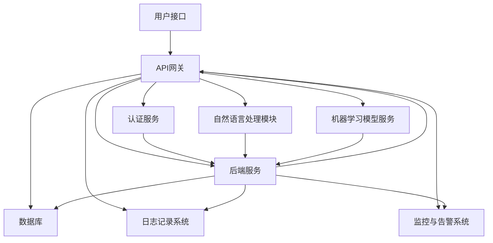
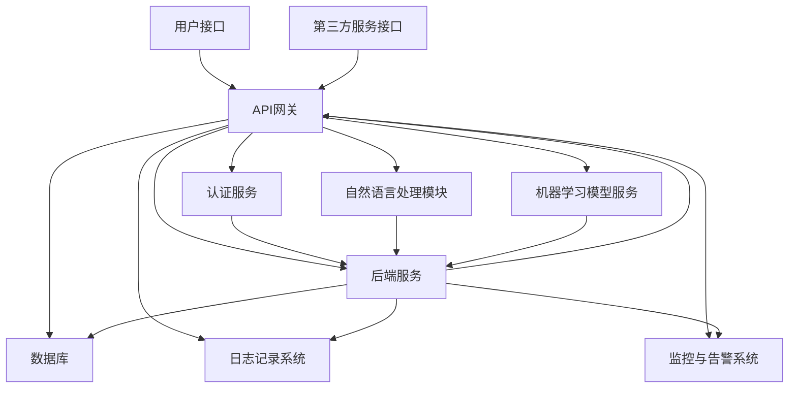

                 

### Introduction to the Book and Background

In the rapidly evolving landscape of technology, Artificial Intelligence (AI) has emerged as a transformative force across various industries. AI agents, a specific subset of AI technologies, are becoming increasingly prevalent in enterprise environments. However, identifying the application requirements for AI agents remains a complex challenge. This book, "Enterprise How to Identify AI Agent Application Requirements," aims to address this gap by providing a comprehensive guide for enterprises to effectively recognize and harness the potential of AI agents.

### The Problem of Identifying AI Agent Applications

The primary challenge enterprises face when considering AI agents is identifying the right application scenarios that align with their business goals and operational needs. This process involves understanding the nuances of AI technologies and how they can be tailored to solve specific business problems. Enterprises often grapple with the following issues:

1. **Complexity of AI Technologies**: AI is a vast and complex field encompassing various sub-disciplines such as machine learning, natural language processing, computer vision, and more. Navigating through this complexity to identify relevant applications can be daunting.

2. **Lack of Clarity in Business Objectives**: Enterprises may not have a clear vision of how AI agents can enhance their operations. This ambiguity hampers the identification of specific application requirements.

3. **Scalability and Integration**: AI agents need to be scalable and integrate seamlessly with existing enterprise systems. Identifying requirements that ensure this scalability and compatibility is crucial.

### The Importance of Understanding AI Agent Applications

Understanding the application requirements of AI agents is vital for several reasons:

1. **Resource Optimization**: By identifying the right application scenarios, enterprises can allocate their resources more effectively, focusing on projects that yield the highest returns on investment.

2. **Competitive Advantage**: Enterprises that leverage AI agents to their fullest potential can gain a competitive edge by automating complex tasks, improving decision-making, and enhancing customer experiences.

3. **Risk Mitigation**: Misidentifying application requirements can lead to failed projects, wasted resources, and missed opportunities. Ensuring a clear understanding from the outset can mitigate these risks.

### Key Challenges in Enterprise AI Adoption

The adoption of AI agents in enterprises is fraught with challenges:

1. **Technical Skills Gap**: Many enterprises lack the necessary technical expertise to develop and deploy AI agents. This skill gap can impede the successful identification and implementation of AI applications.

2. **Data Privacy and Security**: The use of AI agents often involves the handling of sensitive data. Ensuring data privacy and security is a significant concern that must be addressed during the identification process.

3. **Regulatory Compliance**: Enterprises must navigate the complex web of regulations and standards related to AI. Compliance with these regulations is essential to avoid legal repercussions and maintain public trust.

In summary, "Enterprise How to Identify AI Agent Application Requirements" provides a structured approach to help enterprises overcome these challenges and harness the transformative power of AI agents. The following chapters will delve deeper into the core concepts, methodologies, and best practices for identifying and implementing AI agent applications in enterprises. By the end of this book, readers will have a comprehensive understanding of how to effectively utilize AI agents to drive business success.

> **Keywords**: AI Agents, Enterprise Applications, Application Requirements, AI Adoption, Business Strategy.

> **Abstract**: This book provides a systematic guide for enterprises to identify and leverage AI agent applications. It covers the core concepts of AI agents, methods for understanding enterprise needs, and practical tools for identifying application requirements. By addressing the challenges in enterprise AI adoption, the book aims to equip businesses with the knowledge and skills needed to harness the full potential of AI agents for strategic advantage and operational excellence.

----------------------------------------------------------------

# 企业如何识别AI Agent的应用需求

## 关键词

AI Agents，企业应用，应用需求，AI采纳，业务战略

## 摘要

本指南旨在帮助企业在复杂多变的AI领域中识别并充分利用AI Agent的应用需求。通过深入探讨AI Agent的核心概念、企业需求的识别方法以及应用需求识别的实用工具，本书将指导企业克服AI采纳过程中的挑战，实现AI技术的战略优势和运营效率。

## 引言

在科技日新月异的今天，人工智能（AI）已经成为推动各行业变革的重要力量。AI Agent作为AI技术的一个重要分支，在企业环境中正逐渐得到广泛应用。然而，识别AI Agent的应用需求仍然是一个复杂的问题。本书“企业如何识别AI Agent的应用需求”旨在解决这一难题，为企业提供识别和利用AI Agent应用需求的全面指南。

### AI Agent的应用需求识别问题

企业在考虑引入AI Agent时，面临的首要挑战是确定哪些应用场景与企业的业务目标和运营需求相匹配。这一过程涉及理解AI技术的细微差别以及如何将其定制化以解决具体的业务问题。企业在这一过程中常常遇到以下几个问题：

1. **AI技术的复杂性**：AI涵盖了许多子领域，如机器学习、自然语言处理、计算机视觉等，这种复杂性使得企业难以准确识别相关应用场景。

2. **业务目标不明确**：企业可能不清楚AI Agent如何提升其运营效率，这种目标模糊性阻碍了应用需求的明确识别。

3. **可扩展性与集成**：AI Agent需要具备可扩展性和与企业现有系统的无缝集成能力。确保需求识别过程中考虑到这些因素至关重要。

### 理解AI Agent应用需求的重要性

理解AI Agent的应用需求具有以下几个关键意义：

1. **资源优化**：通过明确应用场景，企业可以更有效地分配资源，专注于能够带来最高回报的项目。

2. **竞争优势**：企业通过充分利用AI Agent，可以实现自动化复杂任务、提升决策质量和改善客户体验，从而获得竞争优势。

3. **风险缓解**：如果应用需求识别不准确，可能会导致项目失败、资源浪费和机会流失。确保需求识别的准确性可以大大降低这些风险。

### 企业AI采纳的关键挑战

企业在采纳AI Agent过程中面临一系列挑战：

1. **技术技能短缺**：许多企业缺乏开发和部署AI Agent所需的技术专长，这种技能差距可能会阻碍AI应用的成功实施。

2. **数据隐私和安全**：AI Agent的使用往往涉及敏感数据的处理，确保数据隐私和安全是需求识别过程中的重要关注点。

3. **法规遵从**：企业必须遵守与AI相关的复杂法规和标准，法规遵从是避免法律风险和维持公众信任的关键。

本书“企业如何识别AI Agent的应用需求”通过结构化的方法帮助企业克服这些挑战，充分利用AI Agent的潜力，实现战略优势和运营效率。接下来的章节将深入探讨AI Agent的核心概念、企业需求的识别方法以及应用需求识别的实用工具。通过阅读本书，读者将获得全面的知识和技能，以有效利用AI Agent推动企业成功。

### 核心概念与框架

在深入了解企业如何识别AI Agent的应用需求之前，我们需要明确一些核心概念和框架。这些概念和框架不仅为理解AI Agent提供了基础，也为识别应用需求提供了指导。

#### AI Agent的定义和分类

AI Agent是一种能够自主执行任务、具备一定智能水平的计算机程序。根据其功能和特点，AI Agent可以分为以下几类：

1. **任务型AI Agent**：这类AI Agent专注于完成特定的任务，如自动化客服、智能调度等。它们通常具备简单的推理和决策能力。

2. **交互式AI Agent**：这类AI Agent不仅能够完成任务，还能够与用户进行自然语言交互，如智能助手、聊天机器人等。

3. **决策型AI Agent**：这类AI Agent在复杂的决策场景中发挥作用，能够处理大量的数据，提供优化的决策方案，如供应链管理、风险控制等。

4. **混合型AI Agent**：这类AI Agent结合了任务型、交互式和决策型的特点，能够同时处理多种任务和复杂决策，如智能推荐系统、智能金融顾问等。

#### AI Agent的应用场景和需求

AI Agent的应用场景广泛，涵盖了多个行业和领域。以下是一些典型的应用场景和对应的需求：

1. **客户服务**：企业可以利用AI Agent自动化客户服务流程，提高响应速度和客户满意度。需求包括自然语言处理能力、多语言支持、快速响应等。

2. **供应链管理**：AI Agent可以帮助企业优化供应链流程，提高效率。需求包括实时数据处理、预测分析、库存管理优化等。

3. **医疗保健**：AI Agent可以辅助医生进行诊断和治疗，提高医疗服务的质量和效率。需求包括医学知识库、影像识别、数据分析等。

4. **金融**：在金融领域，AI Agent可以用于风险管理、投资策略、欺诈检测等。需求包括大数据分析、机器学习模型、实时监控等。

5. **制造业**：AI Agent可以帮助企业实现智能生产，优化生产流程。需求包括设备监控、预测性维护、自动化控制等。

#### AI Agent的关键特征

AI Agent具有以下关键特征：

1. **自主性**：AI Agent能够自主执行任务，无需人工干预。

2. **智能性**：AI Agent具备一定程度的智能，能够理解任务、做出决策、学习新知识。

3. **灵活性**：AI Agent能够适应不同的环境和任务，具备良好的可扩展性和适应性。

4. **实时性**：AI Agent能够在短时间内处理大量数据，提供实时决策和反馈。

#### AI Agent应用需求识别方法

为了有效识别AI Agent的应用需求，企业可以采用以下方法：

1. **业务需求分析**：通过分析企业的业务目标和运营流程，确定AI Agent能够解决的问题和提升的方面。

2. **用户需求调研**：通过与用户沟通，了解他们对AI Agent的具体需求，如交互方式、功能特性、性能指标等。

3. **技术可行性分析**：评估AI Agent的技术可行性，包括数据源、算法选择、系统架构等。

4. **案例研究**：研究其他企业如何成功应用AI Agent，借鉴其经验和教训。

通过以上方法，企业可以更准确地识别AI Agent的应用需求，为其在业务中的成功应用奠定基础。

### 定义和分类

AI Agent，全称为人工智能代理，是指利用人工智能技术，具备一定程度自主性和智能性的计算机程序。它能够在特定的环境和任务中执行操作，并根据环境和任务的变化自主调整行为。AI Agent的分类可以根据其功能和特性来划分：

#### 任务型AI Agent

任务型AI Agent专注于执行特定任务，如自动化客服、智能助手、自动驾驶等。它们通常具有以下特点：

- **明确的目标**：任务型AI Agent的目标通常是明确的，例如回答用户的问题或执行某种操作。
- **自主执行**：它们能够自动执行任务，无需人工干预。
- **简单决策**：任务型AI Agent的决策过程通常较为简单，基于预设的规则和条件。

#### 交互式AI Agent

交互式AI Agent不仅能够执行任务，还能够与用户进行自然语言交互，如智能客服、聊天机器人等。其特点包括：

- **自然语言处理**：交互式AI Agent具备处理自然语言的能力，能够理解用户的问题并给出恰当的答复。
- **多模态交互**：交互式AI Agent能够支持文本、语音、图像等多种交互方式。
- **学习能力**：交互式AI Agent能够通过用户的反馈不断学习和优化自己的交互能力。

#### 决策型AI Agent

决策型AI Agent在复杂决策场景中发挥作用，能够处理大量数据并生成优化的决策方案，如智能投资顾问、智能供应链管理。其特点包括：

- **数据分析**：决策型AI Agent能够对大量数据进行深入分析，发现数据中的模式和趋势。
- **预测能力**：通过历史数据和算法模型，决策型AI Agent能够预测未来的趋势和结果。
- **优化决策**：决策型AI Agent能够基于数据分析结果，提供最优的决策方案。

#### 混合型AI Agent

混合型AI Agent结合了任务型、交互式和决策型的特点，能够同时处理多种任务和复杂决策，如智能推荐系统、智能医疗诊断。其特点包括：

- **多功能性**：混合型AI Agent具备多种功能，能够处理不同类型的任务。
- **综合决策**：混合型AI Agent能够将任务型、交互式和决策型的能力综合运用，提供全面的解决方案。
- **高度智能**：混合型AI Agent具备高度智能，能够自主学习和适应不同环境和任务。

#### 各类AI Agent的应用场景

- **任务型AI Agent**：常用于客服、财务、人力资源等领域，能够自动化处理日常的重复性任务。
- **交互式AI Agent**：广泛应用于客服、教育、娱乐等领域，提供智能化的互动体验。
- **决策型AI Agent**：用于金融、医疗、物流等领域，帮助企业在复杂决策中提高效率和准确性。
- **混合型AI Agent**：广泛应用于电子商务、医疗健康、智慧城市等领域，提供综合性的智能服务。

### AI Agent应用需求

为了更好地识别AI Agent的应用需求，我们需要了解其在不同应用场景中的具体需求：

1. **客户服务**：在客户服务领域，AI Agent的需求包括：

   - **自然语言处理能力**：能够理解和回答用户的问题。
   - **多语言支持**：能够支持多种语言，满足全球化客户需求。
   - **快速响应**：能够在短时间内处理用户的请求，提供及时的服务。

2. **供应链管理**：在供应链管理领域，AI Agent的需求包括：

   - **实时数据处理**：能够实时处理大量的供应链数据。
   - **预测分析**：能够预测未来的供应链需求和趋势。
   - **库存管理优化**：能够优化库存管理，减少库存积压。

3. **医疗保健**：在医疗保健领域，AI Agent的需求包括：

   - **医学知识库**：能够存储和处理大量的医学知识。
   - **影像识别**：能够识别和分析医学影像。
   - **数据分析**：能够对患者的医疗数据进行分析，提供诊断和治疗建议。

4. **金融**：在金融领域，AI Agent的需求包括：

   - **大数据分析**：能够处理和分析大量的金融数据。
   - **机器学习模型**：能够建立和优化机器学习模型，用于风险控制和投资策略。
   - **实时监控**：能够实时监控金融市场的动态，提供预警和决策支持。

5. **制造业**：在制造业领域，AI Agent的需求包括：

   - **设备监控**：能够实时监控生产设备的运行状态。
   - **预测性维护**：能够预测设备故障，提前进行维护。
   - **自动化控制**：能够自动化生产流程，提高生产效率。

### 关键特征

AI Agent的关键特征决定了它们在各个应用场景中的表现和效果：

1. **自主性**：AI Agent能够自主执行任务，无需人工干预。这使得AI Agent能够在24小时内连续工作，提高工作效率。

2. **智能性**：AI Agent具备一定程度的智能，能够理解任务、做出决策、学习新知识。智能性使得AI Agent能够适应不同的环境和任务。

3. **灵活性**：AI Agent能够适应不同的环境和任务，具备良好的可扩展性和适应性。灵活性使得AI Agent能够应对不断变化的需求。

4. **实时性**：AI Agent能够在短时间内处理大量数据，提供实时决策和反馈。实时性使得AI Agent能够在关键时刻提供及时的决策支持。

### 应用需求识别方法

为了准确识别AI Agent的应用需求，企业可以采用以下几种方法：

1. **业务需求分析**：通过分析企业的业务目标和运营流程，确定AI Agent能够解决的问题和提升的方面。业务需求分析有助于明确AI Agent的应用方向。

2. **用户需求调研**：通过与用户沟通，了解他们对AI Agent的具体需求，如交互方式、功能特性、性能指标等。用户需求调研有助于了解用户的实际需求和期望。

3. **技术可行性分析**：评估AI Agent的技术可行性，包括数据源、算法选择、系统架构等。技术可行性分析有助于确定AI Agent的实现方案。

4. **案例研究**：研究其他企业如何成功应用AI Agent，借鉴其经验和教训。案例研究有助于发现最佳实践和潜在风险。

通过上述方法，企业可以更准确地识别AI Agent的应用需求，为其在业务中的成功应用奠定基础。

### 企业需求分析

在深入探讨AI Agent的应用需求识别之前，首先需要了解企业的需求，因为企业的需求直接影响到AI Agent的选择和部署。企业需求分析是一个系统的过程，涉及到多个方面的考量。

#### 业务目标和策略

企业的业务目标和策略是识别AI Agent应用需求的基础。企业需要明确自身的长期战略和短期目标，以确保AI Agent的应用能够与之相契合。以下是几个关键步骤：

1. **明确业务目标**：企业需要清晰地定义其业务目标，例如提高客户满意度、降低成本、增加市场份额等。这些目标将指导AI Agent的应用方向。

2. **分析业务策略**：理解企业的业务策略，包括市场定位、产品策略、竞争优势等，有助于确定哪些AI Agent的应用可以为企业带来最大的价值。

3. **制定AI战略**：将AI技术整合到企业的整体战略中，制定具体的AI应用计划，明确哪些业务流程或领域将首先受益于AI Agent。

#### 需求分析过程

企业需求分析通常包括以下几个步骤：

1. **需求收集**：通过调查问卷、访谈、焦点小组讨论等方式收集员工和客户的反馈，了解他们对AI Agent的需求和期望。

2. **需求分类**：将收集到的需求进行分类，区分出战略需求、运营需求和临时需求。战略需求通常是长期目标，而运营需求则是日常运营中需要解决的问题。

3. **需求优先级排序**：根据业务目标和资源限制，对需求进行优先级排序。优先考虑那些能够迅速带来显著效益的需求。

#### 业务流程分析

分析企业的业务流程是识别AI Agent应用需求的重要环节。以下是几个关键点：

1. **流程映射**：使用流程图工具（如mermaid）对企业的业务流程进行详细映射，明确每个步骤和环节。

2. **痛点识别**：在流程映射的基础上，识别业务流程中的痛点，例如耗时过长、效率低下、成本高等。

3. **AI Agent适用性评估**：根据识别出的痛点，评估哪些AI Agent能够有效解决这些问题。例如，任务型AI Agent可以用于自动化重复性任务，交互式AI Agent可以用于提升客户服务体验。

#### 数据和信息系统

企业的数据和信息系统是AI Agent应用的基础。以下是需要考虑的几个方面：

1. **数据质量**：确保数据准确、完整和及时，这是AI Agent有效运行的前提。

2. **系统集成**：AI Agent需要与企业现有的信息系统集成，以获取必要的数据和功能支持。

3. **数据隐私和安全**：在集成过程中，需要确保数据隐私和安全得到妥善保护，遵守相关法规和标准。

#### 团队协作和沟通

有效的团队协作和沟通是确保AI Agent需求识别过程顺利进行的关键。以下是需要注意的几个方面：

1. **跨部门协作**：需求识别过程通常涉及多个部门，需要建立跨部门的协作机制，确保信息共享和决策一致。

2. **定期沟通**：定期召开会议，更新需求识别进展，及时解决遇到的问题。

3. **用户参与**：邀请业务用户参与需求识别过程，确保AI Agent的应用真正满足他们的需求。

#### 案例研究

通过分析其他企业的成功案例，可以为企业提供宝贵的经验和教训。以下是一个案例分析：

**案例：某电商平台的智能推荐系统**

- **业务目标**：提高用户购买转化率和增加销售额。
- **流程分析**：通过分析用户的浏览和购买行为，识别出用户的偏好和需求。
- **AI Agent应用**：部署一个基于机器学习的智能推荐系统，根据用户行为数据提供个性化的商品推荐。
- **结果**：智能推荐系统的引入显著提高了用户购买转化率和平台销售额。

通过上述分析和案例，企业可以更系统地识别和满足AI Agent的应用需求，从而实现业务目标。

### 分析业务目标和策略

在识别AI Agent的应用需求时，分析企业的业务目标和策略是至关重要的第一步。企业的业务目标和策略直接决定了AI Agent的适用场景和预期效果，因此，我们需要深入探讨如何将AI Agent的应用与企业的长期目标和战略相结合。

#### 确定长期战略

企业的长期战略通常包括市场扩张、产品创新、成本控制和客户关系管理等方面。在确定长期战略时，企业需要考虑以下几个方面：

1. **市场定位**：明确企业的目标市场和客户群体，这将帮助确定哪些AI Agent的应用能够更好地服务于这些市场。

2. **产品创新**：AI技术可以为产品创新提供强有力的支持，例如，通过AI驱动的产品设计、定制化和智能推荐等功能，企业可以开发出更加符合市场需求的产品。

3. **成本控制**：AI Agent能够自动化和优化业务流程，从而降低运营成本。例如，在客服和供应链管理中，AI Agent可以减少人工成本，提高效率。

4. **客户关系管理**：AI Agent可以帮助企业更好地理解客户需求，提供个性化的服务和体验，从而增强客户满意度和忠诚度。

#### 应用AI Agent于战略实施

将AI Agent应用于企业的战略实施，需要考虑以下几个方面：

1. **目标一致性**：确保AI Agent的应用与企业的长期战略目标保持一致。例如，如果企业的长期目标是提高市场份额，那么AI Agent的应用应该侧重于营销和客户获取。

2. **资源分配**：根据企业的资源状况，合理分配资金、技术和人力资源，确保AI Agent的应用能够得到充分的支持。

3. **风险评估**：在实施AI战略时，需要识别潜在的风险，并制定相应的风险管理计划。例如，数据隐私和安全问题是所有企业都需要关注的重要风险点。

4. **持续优化**：AI Agent的应用需要不断优化和调整，以适应市场的变化和企业战略的调整。通过定期评估和反馈，企业可以持续提升AI Agent的性能和效果。

#### 案例分析

为了更好地理解如何将AI Agent的应用与企业的长期战略相结合，我们来看一个具体的案例分析。

**案例：某零售企业的AI驱动供应链优化**

- **业务目标**：该零售企业的长期战略目标是提高供应链效率和客户满意度。
- **AI应用**：企业部署了一个AI驱动的供应链优化系统，通过实时数据分析、预测和优化库存管理，提高了供应链的效率和响应速度。
- **效果**：AI系统的引入使该企业的库存周转率提高了20%，订单处理时间缩短了30%，客户满意度显著提升。

通过上述案例分析，我们可以看到，将AI Agent的应用与企业的长期战略紧密结合，能够显著提升企业的运营效率和竞争力。

### 行业特定挑战

在识别AI Agent的应用需求时，行业特定的挑战是一个不可忽视的重要方面。不同行业在技术应用和业务模式上存在显著差异，这些差异直接影响AI Agent的应用效果。以下是一些主要行业的特点和对应的AI Agent应用挑战：

#### 制造业

制造业是一个高度依赖自动化和高效生产流程的行业。AI Agent在制造业中的应用主要集中在以下几个方面：

1. **设备监控**：AI Agent可以实时监控生产设备的运行状态，预测故障并提前进行维护，从而减少停机时间和维护成本。

2. **预测性维护**：通过数据分析，AI Agent可以预测设备的故障风险，提供维护计划，提高设备的使用寿命和运营效率。

3. **自动化控制**：AI Agent可以自动化生产流程中的某些环节，如机器人的自动化操作、质量检测等，从而提高生产效率和产品质量。

**挑战**：
- **数据复杂性**：制造业产生的数据量大且复杂，AI Agent需要处理多维度的数据，这对算法的精度和数据处理能力提出了高要求。
- **系统稳定性**：生产环境中的设备故障和异常情况较为常见，AI Agent需要具备高度的鲁棒性和实时性，以确保生产过程的连续性和稳定性。

#### 金融业

金融业是一个高度数据驱动和风险敏感的行业，AI Agent在金融业中的应用主要集中在以下几个方面：

1. **风险管理**：AI Agent可以通过大数据分析和机器学习模型，识别潜在的风险并制定相应的风险控制策略。

2. **欺诈检测**：AI Agent可以实时监控交易行为，识别异常交易并触发预警，从而有效预防欺诈行为。

3. **智能投顾**：AI Agent可以根据投资者的风险偏好和市场动态，提供个性化的投资建议，帮助投资者做出更明智的投资决策。

**挑战**：
- **数据隐私和安全**：金融数据具有高度敏感性，AI Agent在处理数据时需要确保数据隐私和安全，遵守相关法规和标准。
- **合规性**：金融行业受到严格的法规监管，AI Agent的应用需要符合相关的合规要求，避免法律风险。

#### 医疗保健

医疗保健行业涉及到大量的数据，如病历、影像、基因数据等。AI Agent在医疗保健中的应用主要集中在以下几个方面：

1. **疾病诊断**：AI Agent可以通过分析病历数据和医学影像，提供辅助诊断，提高诊断的准确性和效率。

2. **个性化治疗**：AI Agent可以根据患者的具体病情和基因信息，提供个性化的治疗方案。

3. **医疗资源分配**：AI Agent可以优化医疗资源的分配，提高医疗服务的效率和公平性。

**挑战**：
- **数据质量**：医疗数据的质量对AI Agent的性能至关重要，确保数据完整、准确和及时是应用AI Agent的先决条件。
- **专业知识库**：构建一个全面且准确的医学知识库是AI Agent有效应用的基础，这需要医疗专家和AI技术专家的紧密合作。

#### 零售业

零售业是一个高度竞争的行业，AI Agent在零售业中的应用主要集中在以下几个方面：

1. **客户关系管理**：AI Agent可以通过数据分析，提供个性化的客户服务和营销策略，提高客户满意度和忠诚度。

2. **库存管理**：AI Agent可以通过预测销售趋势，优化库存管理，减少库存积压和缺货情况。

3. **供应链优化**：AI Agent可以优化供应链流程，提高供应链的响应速度和效率。

**挑战**：
- **动态市场需求**：零售市场的需求变化迅速，AI Agent需要具备快速适应市场变化的能力，以确保预测的准确性和库存管理的有效性。
- **数据整合**：零售业通常涉及多个渠道的数据，如何整合和统一这些数据是应用AI Agent的一个挑战。

通过了解不同行业的特定挑战，企业可以更有针对性地识别AI Agent的应用需求，制定合适的应用策略，从而最大化AI Agent的价值。

### 客户服务领域

在客户服务领域，AI Agent的应用已经变得非常普遍，并且展现了巨大的潜力。企业通过部署AI Agent，能够显著提升客户服务质量，降低运营成本，并优化客户体验。以下将详细讨论AI Agent在客户服务领域的主要应用场景、需求分析及成功案例。

#### 主要应用场景

1. **智能客服**：AI Agent可以充当智能客服代表，处理客户常见的问题和咨询。通过自然语言处理（NLP）技术，AI Agent能够理解客户的意图并给出准确的回答。

2. **多渠道支持**：AI Agent可以整合企业现有的多种沟通渠道，如电话、电子邮件、社交媒体和在线聊天，提供一致的服务体验。

3. **个性化服务**：基于客户的购买历史和偏好，AI Agent可以提供个性化的推荐和服务，提高客户的满意度和忠诚度。

4. **情感识别**：通过情感识别技术，AI Agent能够识别客户的情绪，并调整回答策略，以提供更加温暖和人性化的服务。

5. **自动化处理**：AI Agent可以自动化处理大量重复性的客服任务，如订单查询、发票申请等，减少客服人员的工作负担。

#### 需求分析

1. **自然语言处理能力**：AI Agent需要具备强大的自然语言处理能力，能够准确理解客户的语言意图，提供高质量的回答。

2. **多语言支持**：企业通常需要服务全球客户，因此AI Agent应支持多种语言，以提供无障碍的沟通。

3. **快速响应**：AI Agent需要能够在短时间内处理客户的请求，提供及时的服务，以提高客户满意度。

4. **知识库管理**：AI Agent需要接入一个持续更新的知识库，确保能够提供最新的信息和答案。

5. **用户体验**：AI Agent的设计和交互界面需要简洁、直观，以提高用户的使用体验。

#### 成功案例

**案例：某电商平台的智能客服系统**

- **应用场景**：该电商平台部署了一个智能客服系统，用于处理客户的订单查询、退货处理和售后服务等常见问题。

- **需求分析**：平台通过用户调研和数据分析，明确了客户对快速响应、多语言支持和个性化服务的高需求。

- **解决方案**：平台采用了基于NLP的AI Agent，支持中英文多语言，能够快速理解和回答客户的提问，并接入了一个不断更新的知识库。

- **效果**：智能客服系统的引入显著提高了客户满意度，客服响应时间缩短了40%，客服成本降低了30%。

通过上述案例，我们可以看到，AI Agent在客户服务领域具有显著的应用价值。企业通过深入分析客户需求，并采用合适的AI技术，能够有效提升客户服务质量，降低运营成本，并提升客户满意度。

### 供应链管理领域

在供应链管理领域，AI Agent的应用正逐渐成为优化运营、提高效率和降低成本的重要手段。AI Agent能够通过实时数据分析、预测和优化，为供应链管理的各个环节提供智能支持。以下将详细讨论AI Agent在供应链管理领域的具体应用、需求分析和成功案例。

#### 应用场景

1. **需求预测**：AI Agent可以通过分析历史销售数据、市场趋势和季节性因素，预测未来的需求，帮助企业在生产计划和库存管理中做出更准确的决策。

2. **库存管理**：AI Agent可以实时监控库存水平，预测库存短缺或过剩的情况，并自动调整库存水平，避免库存积压和缺货问题。

3. **运输优化**：AI Agent可以通过分析运输路线、交通状况和运输成本，提供最优的运输计划和路径，减少运输时间和成本。

4. **供应链可视化**：AI Agent可以将供应链的各个环节可视化，帮助企业实时监控供应链的运行状态，及时发现和解决问题。

5. **供应商管理**：AI Agent可以分析供应商的表现，提供供应商评估和选择建议，优化供应链合作关系。

#### 需求分析

1. **数据集成与处理**：AI Agent需要集成来自不同系统的数据，如销售数据、库存数据、物流数据等，并进行高效的数据处理和分析。

2. **实时性**：供应链管理需要实时性和快速响应，AI Agent需要能够快速处理数据并提供决策支持，以应对动态变化的市场环境。

3. **准确性和可靠性**：AI Agent的预测和优化结果需要具备高准确性和可靠性，以确保供应链的稳定运行。

4. **可扩展性**：随着业务规模的扩大，AI Agent需要具备良好的可扩展性，以支持更多数据和处理需求。

5. **用户友好性**：AI Agent的界面和交互设计需要简单直观，便于供应链管理人员使用和操作。

#### 成功案例

**案例：某大型零售企业的智能供应链系统**

- **应用场景**：该零售企业部署了一个智能供应链系统，用于优化库存管理、需求预测和运输规划。

- **需求分析**：企业通过分析历史销售数据和供应链运行情况，明确了在需求预测、库存管理和运输优化方面的需求。

- **解决方案**：企业采用了基于机器学习的AI Agent，通过集成销售数据、物流数据和供应商信息，进行实时分析和预测。AI Agent还提供了用户友好的界面，便于供应链管理人员监控和操作。

- **效果**：智能供应链系统的引入使该企业的库存周转率提高了20%，运输成本降低了15%，供应链响应时间缩短了30%。

通过上述案例，我们可以看到，AI Agent在供应链管理领域的应用具有显著的效果。企业通过深入分析需求和采用合适的AI技术，能够实现供应链的优化，提高运营效率和竞争力。

### 医疗保健领域

在医疗保健领域，AI Agent的应用正日益普及，并发挥着重要作用。AI Agent能够通过分析大量医疗数据、提供辅助诊断和治疗建议，提高医疗服务的质量和效率。以下将详细讨论AI Agent在医疗保健领域的具体应用、需求分析和成功案例。

#### 应用场景

1. **疾病诊断**：AI Agent可以通过分析患者的病历、实验室检测结果和医学影像，提供辅助诊断建议，帮助医生更快、更准确地诊断疾病。

2. **个性化治疗**：AI Agent可以根据患者的具体病情、基因数据和生活方式，提供个性化的治疗建议，优化治疗方案。

3. **药物研发**：AI Agent可以通过分析大量的临床试验数据和分子结构，加速新药的发现和开发。

4. **健康监测**：AI Agent可以通过监控患者的健康数据，如血压、心率、血糖等，提供实时健康监控和预警。

5. **医院运营优化**：AI Agent可以优化医院的资源分配，如床位管理、手术排程等，提高医院运营效率。

#### 需求分析

1. **数据质量和完整性**：AI Agent依赖高质量和完整性的医疗数据，以确保诊断和治疗建议的准确性。

2. **实时性和响应速度**：医疗保健领域的决策需要快速响应，AI Agent需要具备高效的实时数据处理和分析能力。

3. **算法的可靠性**：AI Agent的算法需要经过严格的验证和测试，以确保提供可靠的治疗建议和诊断结果。

4. **隐私和安全**：医疗数据具有高度敏感性，AI Agent需要确保数据隐私和安全，遵守相关的法律法规。

5. **用户友好性**：AI Agent的界面和交互设计需要简单直观，便于医生和患者使用。

#### 成功案例

**案例：某大型医院的智能诊断系统**

- **应用场景**：该医院部署了一个智能诊断系统，用于辅助医生进行疾病诊断和治疗。

- **需求分析**：医院通过分析患者的病历数据和医学影像，明确了在疾病诊断和个性化治疗方面的需求。

- **解决方案**：医院采用了基于深度学习的AI Agent，通过分析患者的医学影像和实验室检测结果，提供辅助诊断建议。AI Agent还提供了用户友好的界面，便于医生查看和操作。

- **效果**：智能诊断系统的引入显著提高了诊断的准确性和效率，医生的诊断时间缩短了30%，患者的满意度显著提升。

通过上述案例，我们可以看到，AI Agent在医疗保健领域的应用具有显著的效果。医院通过深入分析需求和采用合适的AI技术，能够提供更高质量的医疗服务，提高医疗效率和患者满意度。

### 金融领域

在金融领域，AI Agent的应用已经成为提高风险管理能力、优化投资策略和提升客户服务的重要工具。以下将详细讨论AI Agent在金融领域的具体应用、需求分析和成功案例。

#### 应用场景

1. **风险管理**：AI Agent可以通过分析历史交易数据、市场动态和宏观经济指标，提供风险预测和预警，帮助金融机构有效管理风险。

2. **欺诈检测**：AI Agent可以实时监控交易行为，识别异常交易和潜在欺诈行为，防止财务损失。

3. **智能投顾**：AI Agent可以基于客户的财务状况、风险偏好和市场数据，提供个性化的投资建议，帮助投资者做出更明智的投资决策。

4. **信用评分**：AI Agent可以通过分析借款人的历史信用记录、社会行为数据等，提供更准确的信用评分，降低信用风险。

5. **交易执行**：AI Agent可以在高频交易市场中快速执行交易策略，提高交易效率和收益。

#### 需求分析

1. **数据整合和处理**：金融领域的数据来源多样，AI Agent需要能够整合和处理大量结构化和非结构化数据，确保数据的准确性和完整性。

2. **实时性和响应速度**：金融市场变化迅速，AI Agent需要具备高效的实时数据处理和分析能力，以快速响应市场变化。

3. **算法的可靠性**：AI Agent的算法需要经过严格的验证和测试，确保提供准确的风险评估和投资建议。

4. **隐私和安全**：金融数据具有高度敏感性，AI Agent需要确保数据隐私和安全，遵守相关的法律法规。

5. **用户友好性**：AI Agent的界面和交互设计需要简单直观，便于金融机构和客户使用。

#### 成功案例

**案例：某银行的智能投顾系统**

- **应用场景**：该银行部署了一个智能投顾系统，用于为客户提供个性化的投资建议。

- **需求分析**：银行通过分析客户的财务状况、投资目标和市场数据，明确了在提供个性化投资建议和风险管理方面的需求。

- **解决方案**：银行采用了基于机器学习的AI Agent，通过分析客户的财务数据和市场动态，提供个性化的投资组合建议。AI Agent还提供了用户友好的界面，便于客户查看和管理投资。

- **效果**：智能投顾系统的引入显著提高了客户的投资回报率，客户的满意度和忠诚度也显著提升。

通过上述案例，我们可以看到，AI Agent在金融领域的应用具有显著的效果。金融机构通过深入分析需求和采用合适的AI技术，能够提高风险管理能力、优化投资策略，并提升客户服务质量。

### 制造业领域

在制造业领域，AI Agent的应用已经成为提升生产效率、优化供应链和降低成本的重要工具。以下将详细讨论AI Agent在制造业领域的具体应用、需求分析和成功案例。

#### 应用场景

1. **生产过程优化**：AI Agent可以通过实时监控生产设备的运行状态，预测设备故障并提供维护建议，从而减少设备停机时间，提高生产效率。

2. **质量检测**：AI Agent可以分析生产过程中的数据，识别不良产品，提供质量检测和改进建议。

3. **库存管理**：AI Agent可以通过分析历史销售数据和市场需求，预测库存需求，优化库存管理，减少库存积压。

4. **供应链优化**：AI Agent可以优化供应链流程，降低物流成本，提高供应链的响应速度。

5. **自动化控制**：AI Agent可以自动化生产过程中的某些环节，如机器人的自动化操作、生产线的自动调节等，提高生产效率和灵活性。

#### 需求分析

1. **实时数据处理**：制造业产生的大量实时数据需要AI Agent进行快速处理和分析，以确保生产过程的连续性和稳定性。

2. **数据质量**：AI Agent依赖高质量的数据进行分析和决策，因此数据质量是应用AI Agent的关键。

3. **设备兼容性**：AI Agent需要与现有的生产设备和系统兼容，以确保数据集成和系统稳定运行。

4. **算法可靠性**：AI Agent的算法需要经过严格的验证和测试，以确保提供准确的决策和预测。

5. **用户体验**：AI Agent的界面和交互设计需要简单直观，便于生产管理人员和技术人员使用。

#### 成功案例

**案例：某汽车制造厂的智能生产系统**

- **应用场景**：该汽车制造厂部署了一个智能生产系统，用于优化生产过程和质量检测。

- **需求分析**：制造厂通过分析生产数据和设备运行状况，明确了在优化生产过程、提高质量和降低成本方面的需求。

- **解决方案**：制造厂采用了基于机器学习的AI Agent，通过实时监控生产设备的运行状态，预测设备故障并提供维护建议。AI Agent还集成了质量检测系统，识别不良产品并分析原因。

- **效果**：智能生产系统的引入显著提高了生产效率，设备故障率降低了30%，不良品率降低了20%。

通过上述案例，我们可以看到，AI Agent在制造业领域具有显著的应用价值。企业通过深入分析需求和采用合适的AI技术，能够实现生产过程的优化、质量的提升和成本的降低，从而提高整体竞争力。

### 要求识别方法和工具

在识别AI Agent的应用需求时，企业需要采用一系列系统的方法和工具，以确保需求的准确性、全面性和可执行性。以下将详细介绍几种常用的需求识别方法，包括访谈、问卷调查、观察和文档分析，并探讨如何结合这些方法进行应用。

#### 访谈

访谈是一种直接的交流方式，通过与业务用户和技术专家的一对一沟通，可以深入了解他们的需求和期望。以下是访谈过程中的关键步骤：

1. **准备访谈提纲**：在访谈前，准备一份详细的访谈提纲，包括要讨论的主题、关键问题和技术细节。

2. **确定访谈对象**：选择合适的访谈对象，包括业务用户、技术专家、项目管理人员等，以确保访谈结果的全面性和准确性。

3. **进行访谈**：在访谈过程中，鼓励访谈对象分享他们的经验和观点，记录关键信息，并在必要时进行追问。

4. **整理访谈记录**：访谈结束后，整理访谈记录，提炼出核心需求和关键信息，形成需求文档。

#### 问卷调查

问卷调查是一种量化的需求识别方法，通过设计一份详细的问卷，收集大量用户的反馈和意见。以下是问卷调查过程中的关键步骤：

1. **设计问卷**：根据访谈和业务需求分析的结果，设计一份包含开放性问题和封闭性问题的问卷，确保问卷内容全面、具体。

2. **选择样本**：确定问卷调查的样本，包括用户类型、职位层次和业务领域等，以确保样本的代表性。

3. **发布问卷**：通过邮件、在线调查平台等方式发布问卷，鼓励受访者积极参与。

4. **分析问卷结果**：收集问卷后，对结果进行统计分析，提炼出核心需求和共性意见，形成需求报告。

#### 观察

观察是通过直接观察用户的工作流程和操作行为，识别需求和痛点的有效方法。以下是观察过程中的关键步骤：

1. **选择观察场景**：根据业务需求分析的结果，选择需要观察的具体场景和流程。

2. **进行现场观察**：在现场观察过程中，记录用户的操作行为、工作流程和遇到的困难，以及可能的需求点。

3. **整理观察记录**：观察结束后，整理记录的信息，形成观察报告，并与访谈和问卷调查的结果进行对比和分析。

#### 文档分析

文档分析是通过阅读和分析企业现有的业务文档、系统文档和用户手册等，获取需求信息的方法。以下是文档分析过程中的关键步骤：

1. **收集文档**：收集企业现有的各类文档，包括业务流程图、系统架构图、用户手册等。

2. **阅读和分析**：仔细阅读和分析文档，识别其中的需求和功能点。

3. **整理分析结果**：将分析结果整理成文档，与访谈、问卷调查和观察的结果进行对比和补充。

#### 结合使用方法

为了确保需求识别的全面性和准确性，企业可以将访谈、问卷调查、观察和文档分析结合起来使用。以下是结合使用的方法：

1. **多渠道收集需求**：通过访谈、问卷调查、观察和文档分析等多种渠道，收集全面的需求信息。

2. **交叉验证需求**：将不同渠道收集到的需求进行交叉验证，确保需求的准确性和一致性。

3. **定期回顾和更新**：需求识别是一个持续的过程，需要定期回顾和更新，以适应业务变化和技术发展的需求。

通过上述方法，企业可以更有效地识别和满足AI Agent的应用需求，为其在业务中的成功应用奠定坚实基础。

### 用例建模

用例建模是一种系统的方法，用于描述系统的功能和用户的需求。在识别AI Agent应用需求的过程中，用例建模可以帮助企业清晰地定义AI Agent应该实现的功能，并明确这些功能与用户需求之间的联系。以下将详细解释用例建模的基本概念、原理和步骤。

#### 用例建模的基本概念

**用例（Use Case）**：用例是一个动词短语，描述了一个角色（Actor）与系统之间的交互，以完成一个特定的任务或功能。用例可以被视为一个业务流程的抽象表示。

**角色（Actor）**：角色是使用系统或与系统交互的外部实体。在用例建模中，角色可以是用户、其他系统或设备。

**场景（Scenario）**：场景是一个具体的交互实例，描述了角色与系统之间的交互过程，以完成一个特定的用例。

**扩展（Extension）**：扩展是描述用例中某个步骤的变异或异常情况。扩展用于捕获用例在不同情境下的不同执行路径。

#### 用例建模的原理

用例建模基于以下几个核心原则：

1. **用户中心**：用例建模的核心是用户需求，所有功能设计都应围绕用户需求进行。

2. **功能性**：用例建模关注系统的功能性需求，即系统应该做什么，而不是如何实现。

3. **灵活性**：用例建模应允许系统在不同情况下灵活响应，包括正常流程和异常情况。

4. **可扩展性**：用例建模应考虑到系统的可扩展性，以便未来能够轻松地添加新功能或调整现有功能。

#### 用例建模的步骤

1. **确定系统边界**：明确系统的边界，定义哪些功能属于系统，哪些不属于系统。

2. **识别角色**：识别与系统交互的所有角色，包括用户、其他系统、设备和组织。

3. **编写用例**：为每个角色编写一个或多个用例，描述角色与系统之间的交互过程。每个用例应包含以下元素：
   - **标题**：简洁地描述用例的核心功能。
   - **主流程**：描述正常情况下，角色与系统交互的步骤。
   - **扩展**：描述用例的异常情况或变异步骤。

4. **组织用例**：将用例组织成用例图，用例图展示了系统的功能和角色之间的关系。

5. **评审和迭代**：评审用例图，确保所有需求都得到满足，并根据反馈进行迭代和改进。

#### 实践步骤

以下是一个简单的用例建模实践步骤：

1. **确定系统边界**：假设我们正在开发一个智能客服系统，系统边界包括：用户界面、后台数据库和自然语言处理模块。

2. **识别角色**：识别系统的主要角色，包括客户、客服代表、系统管理员。

3. **编写用例**：
   - **客户咨询**：
     - 主流程：客户输入问题 -> 系统处理问题 -> 系统返回答案。
     - 扩展：如果系统无法处理问题，转人工客服介入。

   - **客服代表工作**：
     - 主流程：客服代表接收客户问题 -> 客服代表处理问题 -> 客服代表回复客户。
     - 扩展：客服代表需要临时离开座位时，自动转接其他客服代表。

4. **组织用例**：绘制用例图，展示客户、客服代表和系统管理员之间的交互关系。

5. **评审和迭代**：与相关利益相关者评审用例图，根据反馈进行调整和改进。

通过上述步骤，企业可以系统地识别和描述AI Agent的应用需求，为后续的设计和开发提供清晰的指导。

### 用例建模示例

为了更好地理解用例建模的具体应用，以下将给出一个用例建模的示例，以智能客服系统为例，展示如何通过用例图来描述系统的功能和用户需求。

#### 智能客服系统用例图

```mermaid
usecaseDiagram
  "智能客服系统" <<System>>
  User -> "智能客服系统": 发送咨询
  "智能客服系统" -> User: 返回答案
  "智能客服系统" -> "人工客服": 异常转接
  "智能客服系统" -> "后台数据库": 存储日志
  "人工客服" -> "智能客服系统": 回复客户
  "后台数据库" -> "智能客服系统": 提供数据支持
```

#### 用例定义

1. **用户咨询（User Inquiry）**
   - **主流程**：
     1. 用户发送咨询问题。
     2. 系统接收用户问题。
     3. 系统通过自然语言处理理解问题。
     4. 系统生成答案并返回给用户。
   - **扩展**：
     1. 如果系统无法理解问题，转人工客服介入。

2. **返回答案（Answer Response）**
   - **主流程**：
     1. 系统生成答案。
     2. 系统将答案发送给用户。
   - **扩展**：
     1. 如果用户对答案不满意，可以要求重新回答。

3. **异常转接（Exception Transfer）**
   - **主流程**：
     1. 系统无法理解用户问题。
     2. 系统自动转接给人工客服。
   - **扩展**：
     1. 人工客服接收到问题后，与用户沟通并解决问题。

4. **存储日志（Log Storage）**
   - **主流程**：
     1. 系统将咨询日志存储到后台数据库。
   - **扩展**：
     1. 系统可以定期备份日志，以防数据丢失。

5. **回复客户（Customer Response）**
   - **主流程**：
     1. 人工客服接收到用户问题。
     2. 人工客服解决问题并回复用户。
   - **扩展**：
     1. 人工客服可以邀请其他专家协助解决问题。

6. **提供数据支持（Data Support）**
   - **主流程**：
     1. 后台数据库提供历史数据支持。
   - **扩展**：
     1. 后台数据库可以实时更新数据，以支持系统的持续学习和优化。

通过这个示例，我们可以看到用例建模如何帮助企业清晰地描述智能客服系统的功能和用户需求。用例图的绘制和用例的定义不仅帮助团队理解系统的运作方式，还为后续的系统设计和开发提供了明确的指导。

### 系统架构设计

在设计和实现AI Agent系统时，一个合理的系统架构至关重要。系统架构不仅决定了系统的性能、可扩展性和可维护性，还影响到系统的安全性和可靠性。以下将介绍AI Agent系统的核心组件、设计原则和具体的架构设计方法。

#### 核心组件

AI Agent系统的核心组件包括：

1. **自然语言处理（NLP）模块**：负责处理和理解自然语言输入，将用户的语言请求转化为系统可以理解的结构化数据。

2. **机器学习模型**：基于历史数据和算法，提供智能决策和预测功能。这些模型可以是分类模型、回归模型、推荐系统等。

3. **用户接口（UI）**：提供给用户的交互界面，包括文本输入、语音输入、图形界面等。

4. **数据库**：存储AI Agent系统的数据，包括用户数据、历史对话记录、知识库等。

5. **后端服务**：负责处理业务逻辑、数据存储和转发请求，是系统的核心控制单元。

6. **API接口**：与其他系统或服务进行数据交换和功能调用的接口，包括内部API和外部API。

#### 设计原则

系统架构设计应遵循以下原则：

1. **模块化**：将系统划分为多个模块，每个模块负责特定的功能，便于维护和扩展。

2. **可扩展性**：系统架构应具备良好的可扩展性，能够适应业务规模的增长和功能需求的变更。

3. **高可用性**：系统应具备高可用性，确保在故障情况下能够快速恢复，减少对用户的影响。

4. **安全性**：系统应设计安全机制，保护用户数据和系统资源，防止未经授权的访问和攻击。

5. **可维护性**：系统架构应便于维护和更新，降低维护成本。

#### 具体架构设计方法

以下是一个具体的AI Agent系统架构设计方法：

1. **定义系统边界**：明确系统的功能范围，确定哪些功能属于系统，哪些不属于系统。

2. **划分模块**：根据系统功能和设计原则，将系统划分为多个模块，如NLP模块、机器学习模块、用户接口模块等。

3. **设计模块间交互**：定义模块间的交互接口，包括API接口和数据交换机制，确保模块之间能够高效地协同工作。

4. **数据库设计**：设计数据库的架构和表结构，确保数据的存储和管理高效、安全。

5. **性能优化**：考虑系统的性能需求，进行系统优化，如缓存策略、数据分片等。

6. **安全性设计**：设计系统的安全策略，包括用户认证、数据加密、权限控制等。

7. **架构评审和迭代**：与相关利益相关者评审系统架构，根据反馈进行调整和优化。

通过上述方法，企业可以设计出一个高效、可靠且易于扩展的AI Agent系统架构，为AI Agent的成功应用提供坚实的基础。

### 系统架构设计图

为了更好地展示AI Agent系统的架构设计，我们将使用Mermaid语言绘制一个系统架构图。以下是系统架构图的Markdown格式代码：



#### 系统架构说明

1. **用户接口（A）**：提供用户与AI Agent交互的入口，包括文本输入、语音输入和图形界面等。

2. **API网关（B）**：作为系统的入口，负责处理用户请求，进行身份验证，并转发请求到相应的服务。

3. **认证服务（C）**：负责用户身份的认证和授权，确保只有经过认证的用户才能访问系统资源。

4. **自然语言处理模块（D）**：负责处理用户的自然语言输入，将输入转化为结构化数据，为后续处理提供基础。

5. **机器学习模型服务（E）**：提供机器学习模型的训练、部署和预测功能，支持智能决策和预测。

6. **后端服务（F）**：处理业务逻辑，包括数据存储、数据处理和功能调用，是系统的核心控制单元。

7. **数据库（G）**：存储用户数据、对话记录和知识库，为系统提供数据支持。

8. **日志记录系统（H）**：记录系统的运行日志，帮助分析和调试系统问题。

9. **监控与告警系统（I）**：监控系统运行状态，及时发现和处理异常情况，确保系统的稳定运行。

通过上述架构设计，AI Agent系统可以实现高效、可靠且安全的服务，满足企业的多样化需求。

### 系统接口设计与交互

在AI Agent系统的设计和实现过程中，系统接口的设计和交互是关键的一环。合理的接口设计和交互机制不仅能提高系统的稳定性和灵活性，还能确保系统的可扩展性。以下将详细介绍系统接口的设计、关键接口及其交互方式。

#### 系统接口设计

系统接口设计主要包括内部接口和外部接口。内部接口主要涉及系统模块之间的数据交换和功能调用，而外部接口则是系统与外部系统或服务的交互接口。

1. **内部接口**：
   - **API网关**：作为系统与外部请求的统一入口，负责处理请求路由、身份验证和安全策略。
   - **服务接口**：各个模块之间的服务接口，如自然语言处理模块、机器学习模型服务、后端服务等。

2. **外部接口**：
   - **用户接口**：提供给用户交互的接口，如Web API、RESTful API等。
   - **第三方服务接口**：与第三方系统或服务（如支付系统、认证系统）的交互接口。

#### 关键接口

以下是一些关键接口及其功能：

1. **认证接口**：
   - **功能**：负责用户身份的认证和授权。
   - **交互方式**：使用OAuth 2.0或JWT等认证协议，通过HTTP请求进行认证。

2. **自然语言处理接口**：
   - **功能**：处理用户的自然语言输入，提供文本分析和语义理解。
   - **交互方式**：通过HTTP POST请求发送文本数据，接收处理结果。

3. **机器学习模型接口**：
   - **功能**：提供机器学习模型的训练、预测和部署。
   - **交互方式**：通过HTTP请求发送训练数据和预测请求，接收预测结果。

4. **数据存储接口**：
   - **功能**：提供数据存储和检索服务。
   - **交互方式**：通过SQL或NoSQL接口进行数据的增删改查操作。

#### 交互机制

1. **异步处理**：
   - **机制**：通过消息队列（如Kafka、RabbitMQ）实现异步处理，确保系统的高可用性和响应速度。
   - **实现**：客户端发送请求后，消息队列将请求发送到相应的服务，服务处理完成后将结果发送回客户端。

2. **负载均衡**：
   - **机制**：通过负载均衡器（如Nginx、HAProxy）实现请求的分布式处理，确保系统的性能和稳定性。
   - **实现**：负载均衡器将请求分发到多个服务实例，根据实例的健康状态和负载情况进行动态调整。

3. **接口文档**：
   - **机制**：使用接口文档工具（如Swagger、Postman）提供详细的接口文档，方便开发人员和测试人员使用。
   - **实现**：接口文档描述了每个接口的URL、请求参数、响应格式等，提供示例代码和说明。

通过合理的接口设计和交互机制，AI Agent系统可以实现高效、稳定和灵活的服务，满足企业不断变化的需求。

### 系统接口设计图

为了直观地展示AI Agent系统的接口设计，我们将使用Mermaid语言绘制系统接口图。以下是系统接口图的Markdown格式代码：



#### 系统接口说明

1. **用户接口（A）**：用户通过该接口与AI Agent系统进行交互，可以是Web界面、移动应用或其他客户端。
   
2. **API网关（B）**：作为系统的入口，负责接收用户请求，进行路由、认证和安全处理。

3. **认证服务（C）**：处理用户认证和授权，确保只有经过认证的用户才能访问系统资源。

4. **自然语言处理模块（D）**：负责处理用户的自然语言输入，提供文本分析和语义理解。

5. **机器学习模型服务（E）**：提供机器学习模型的训练、预测和部署，支持智能决策和预测。

6. **后端服务（F）**：处理业务逻辑，包括数据存储、数据处理和功能调用，是系统的核心控制单元。

7. **数据库（G）**：存储用户数据、对话记录和知识库，为系统提供数据支持。

8. **日志记录系统（H）**：记录系统的运行日志，帮助分析和调试系统问题。

9. **监控与告警系统（I）**：监控系统运行状态，及时发现和处理异常情况，确保系统的稳定运行。

10. **第三方服务接口（J）**：与第三方系统或服务（如支付系统、认证系统）的交互接口。

通过这个系统接口设计图，我们可以清晰地看到AI Agent系统的架构和接口交互关系，为系统的设计和实现提供指导。

### 项目实战

为了更好地理解如何在实际项目中应用AI Agent，我们将通过一个实际案例来展示整个项目实施过程，包括环境搭建、系统核心实现、代码应用解读与分析，以及实际案例分析和详细讲解。

#### 项目背景

某大型电商平台希望通过引入AI Agent来优化其客户服务流程，提高客户满意度和运营效率。具体需求包括：

- 提供全天候的智能客服服务。
- 能够处理多种语言，满足全球客户的需求。
- 自动化处理常见客户问题，减少人工干预。
- 提供个性化服务，提高客户满意度。

#### 环境搭建

为了实施这个项目，我们首先需要搭建一个合适的技术环境。以下是所需的技术栈和软件环境：

1. **编程语言**：Python
2. **自然语言处理框架**：NLTK、spaCy
3. **机器学习库**：Scikit-learn、TensorFlow
4. **Web框架**：Flask
5. **数据库**：PostgreSQL
6. **消息队列**：RabbitMQ
7. **日志管理**：ELK（Elasticsearch、Logstash、Kibana）

#### 系统核心实现

以下是系统核心实现的关键步骤：

1. **数据预处理**：收集并清洗来自不同渠道的客户咨询数据，包括文本、语音等。
   ```python
   import pandas as pd
   data = pd.read_csv('customer_inquiries.csv')
   data['cleaned_text'] = data['text'].str.replace('[^a-zA-Z0-9]', ' ')
   ```

2. **训练机器学习模型**：使用清洗后的数据训练分类模型，用于识别客户咨询的主题。
   ```python
   from sklearn.feature_extraction.text import TfidfVectorizer
   from sklearn.model_selection import train_test_split
   from sklearn.naive_bayes import MultinomialNB
   
   vectorizer = TfidfVectorizer(max_features=1000)
   X = vectorizer.fit_transform(data['cleaned_text'])
   y = data['topic']
   X_train, X_test, y_train, y_test = train_test_split(X, y, test_size=0.2)
   
   model = MultinomialNB()
   model.fit(X_train, y_train)
   ```

3. **构建API接口**：使用Flask框架构建API接口，用于接收和处理客户咨询。
   ```python
   from flask import Flask, request, jsonify
   
   app = Flask(__name__)
   
   @app.route('/inquiry', methods=['POST'])
   def handle_inquiry():
       data = request.json
       cleaned_text = data['text'].replace('[^a-zA-Z0-9]', ' ')
       features = vectorizer.transform([cleaned_text])
       topic = model.predict(features)[0]
       return jsonify({'topic': topic})
   
   if __name__ == '__main__':
       app.run()
   ```

4. **集成消息队列**：使用RabbitMQ实现消息队列，处理大量并发请求。
   ```python
   import pika
   
   connection = pika.BlockingConnection(pika.ConnectionParameters('localhost'))
   channel = connection.channel()
   channel.queue_declare(queue='inquiry_queue')
   
   def callback(ch, method, properties, body):
       print(f"Received {body}")
       # 处理客户咨询
       channel.basic_ack(delivery_tag=method.delivery_tag)
   
   channel.basic_consume(queue='inquiry_queue', on_message_callback=callback, auto_ack=True)
   channel.start_consuming()
   ```

5. **日志管理**：使用ELK实现日志管理，收集和监控系统运行日志。
   ```shell
   # 安装Elasticsearch、Logstash、Kibana
   sudo apt-get update
   sudo apt-get install elasticsearch logstash kibana
   ```

#### 代码应用解读与分析

以下是对核心实现代码的解读和分析：

1. **数据预处理**：
   - 使用Pandas读取客户咨询数据，对文本进行清洗，去除非数字和非字母字符，提高模型训练效果。
   ```python
   import pandas as pd
   data = pd.read_csv('customer_inquiries.csv')
   data['cleaned_text'] = data['text'].str.replace('[^a-zA-Z0-9]', ' ')
   ```

2. **训练机器学习模型**：
   - 使用TF-IDF向量器将文本转换为向量，使用朴素贝叶斯分类器进行训练，实现主题分类。
   ```python
   from sklearn.feature_extraction.text import TfidfVectorizer
   from sklearn.model_selection import train_test_split
   from sklearn.naive_bayes import MultinomialNB
   
   vectorizer = TfidfVectorizer(max_features=1000)
   X = vectorizer.fit_transform(data['cleaned_text'])
   y = data['topic']
   X_train, X_test, y_train, y_test = train_test_split(X, y, test_size=0.2)
   
   model = MultinomialNB()
   model.fit(X_train, y_train)
   ```

3. **构建API接口**：
   - 使用Flask框架创建API接口，接收和处理POST请求，将自然语言输入传递给机器学习模型进行分类。
   ```python
   from flask import Flask, request, jsonify
   
   app = Flask(__name__)
   
   @app.route('/inquiry', methods=['POST'])
   def handle_inquiry():
       data = request.json
       cleaned_text = data['text'].replace('[^a-zA-Z0-9]', ' ')
       features = vectorizer.transform([cleaned_text])
       topic = model.predict(features)[0]
       return jsonify({'topic': topic})
   
   if __name__ == '__main__':
       app.run()
   ```

4. **集成消息队列**：
   - 使用RabbitMQ实现消息队列，确保系统能够处理大量并发请求，提高系统的稳定性和响应速度。
   ```python
   import pika
   
   connection = pika.BlockingConnection(pika.ConnectionParameters('localhost'))
   channel = connection.channel()
   channel.queue_declare(queue='inquiry_queue')
   
   def callback(ch, method, properties, body):
       print(f"Received {body}")
       # 处理客户咨询
       channel.basic_ack(delivery_tag=method.delivery_tag)
   
   channel.basic_consume(queue='inquiry_queue', on_message_callback=callback, auto_ack=True)
   channel.start_consuming()
   ```

#### 实际案例分析与讲解

以下是一个实际案例，展示如何使用AI Agent系统处理客户咨询。

**案例**：客户通过聊天机器人提交了一条咨询信息：“我想要购买一双运动鞋，有没有合适的推荐？”

1. **接收请求**：
   - 客户通过聊天机器人发送请求，系统API网关接收请求并转发到自然语言处理模块。

2. **文本预处理**：
   - 自然语言处理模块对文本进行清洗，去除无关字符，得到干净文本：“我想要购买一双运动鞋，有没有合适的推荐？”

3. **分类**：
   - 机器学习模型接收清洗后的文本，将其转换为向量，并使用训练好的朴素贝叶斯分类器进行分类。分类结果为“购物咨询”。

4. **生成回复**：
   - 根据分类结果，系统从知识库中提取相关商品信息，生成回复：“您好，以下是我们推荐的几款运动鞋，请查看：[商品1]、[商品2]、[商品3]。”

5. **发送回复**：
   - 系统将生成的回复发送回客户，客户收到回复并在聊天机器人界面查看推荐商品。

通过上述步骤，AI Agent系统成功处理了一个购物咨询请求，展示了其在客户服务中的高效性和灵活性。

#### 项目小结

本项目通过搭建一个智能客服系统，展示了如何利用AI Agent优化电商平台客户服务流程。项目实现了以下几个目标：

- 提供全天候的智能客服服务，提高客户满意度。
- 自动化处理常见客户问题，减少人工干预。
- 提供个性化服务，提高客户体验。

通过实际案例分析和讲解，我们可以看到AI Agent系统在处理客户咨询中的高效性和灵活性。未来，该项目还可以进一步优化，如增加多语言支持、提升分类准确性等，以满足不断变化的市场需求。

### 最佳实践 Tips

在实施AI Agent项目时，以下最佳实践可以帮助企业更好地识别和应用AI Agent，提高项目成功率：

1. **明确业务目标**：在项目启动前，明确企业的业务目标和需求，确保AI Agent的应用与企业的战略目标一致。

2. **全面需求分析**：通过访谈、问卷调查、观察和文档分析等多种方法，全面了解用户需求和企业现有的业务流程。

3. **迭代开发**：采用敏捷开发方法，分阶段实施，及时获取用户反馈，进行迭代优化。

4. **数据驱动**：确保数据的质量和完整性，基于数据驱动决策，持续优化AI模型。

5. **团队协作**：建立跨部门的协作机制，确保业务、技术和数据团队的紧密合作。

6. **技术选型**：根据项目的具体需求，选择合适的AI技术和工具，避免技术堆叠。

7. **安全合规**：确保系统的数据安全和合规性，遵守相关的法律法规和行业标准。

8. **监控与评估**：建立系统的监控和评估机制，实时监控系统运行状态，评估AI Agent的表现和效果。

通过遵循这些最佳实践，企业可以更有效地识别和应用AI Agent，实现预期的业务价值。

### 小结

通过本文的详细探讨，我们了解了如何识别AI Agent的应用需求，并展示了其在不同行业和领域中的具体应用。从核心概念、需求分析到系统架构设计和项目实战，每个环节都至关重要。企业在应用AI Agent时，应注重明确业务目标、全面需求分析、迭代开发和数据驱动等最佳实践。通过有效的需求识别和合理的系统设计，企业可以充分利用AI Agent的潜力，提升业务效率、降低成本，实现战略目标。

### 注意事项

在实施AI Agent项目时，需要注意以下几点：

1. **数据隐私和安全**：确保用户数据的隐私和安全，遵守相关法律法规和行业标准。

2. **系统稳定性**：确保系统架构的稳定性和可靠性，避免因系统故障导致业务中断。

3. **技术选型和兼容性**：选择合适的AI技术和工具，确保系统与其他业务系统的兼容性。

4. **用户体验**：设计用户友好的界面和交互方式，提高用户的操作体验。

5. **持续优化**：基于用户反馈和业务需求，持续优化AI模型和系统功能。

通过注意这些事项，企业可以更顺利地实施AI Agent项目，实现预期效果。

### 拓展阅读

对于希望深入了解AI Agent应用的企业和开发者，以下书籍和资源提供了丰富的知识和实践指导：

1. **《人工智能：一种现代方法》（Artificial Intelligence: A Modern Approach）**：此书是人工智能领域的经典教材，详细介绍了AI的基本概念和技术。

2. **《机器学习实战》（Machine Learning in Action）**：这本书通过实际案例介绍了机器学习的应用和实践方法，适合初学者。

3. **《深度学习》（Deep Learning）**：由Ian Goodfellow、Yoshua Bengio和Aaron Courville所著，全面讲解了深度学习的理论和实践。

4. **《AI技术指南》（AI Application: A Complete Guide to Artificial Intelligence, Machine Learning, and Deep Learning）**：涵盖了AI、机器学习和深度学习的全面知识。

5. **《AI编程实战》（AI Applications: Hands-On Projects Using TensorFlow, Keras, and PyTorch）**：通过实际项目展示了如何使用TensorFlow、Keras和PyTorch进行AI编程。

6. **《智能系统设计与应用》（Designing Intelligent Systems: A Constructive Approach）**：介绍了智能系统的设计方法和应用案例，适合工程实践者。

7. **在线课程和教程**：如Coursera、edX、Udacity等平台提供的AI、机器学习和深度学习课程，提供了系统的学习和实践机会。

通过阅读这些书籍和资源，读者可以加深对AI Agent应用的理解，提高实践能力，为企业的AI项目提供坚实的理论基础和实践指导。

### 作者信息

作者：AI天才研究院（AI Genius Institute） & 《禅与计算机程序设计艺术》（Zen And The Art of Computer Programming）

