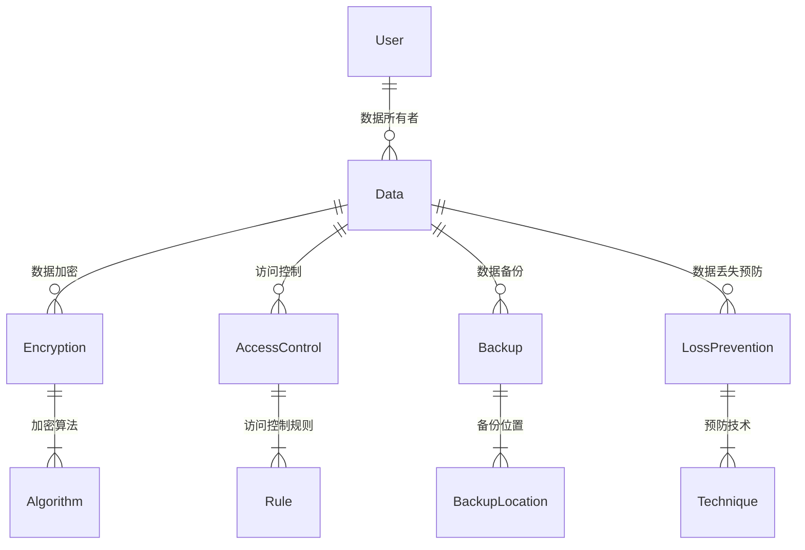
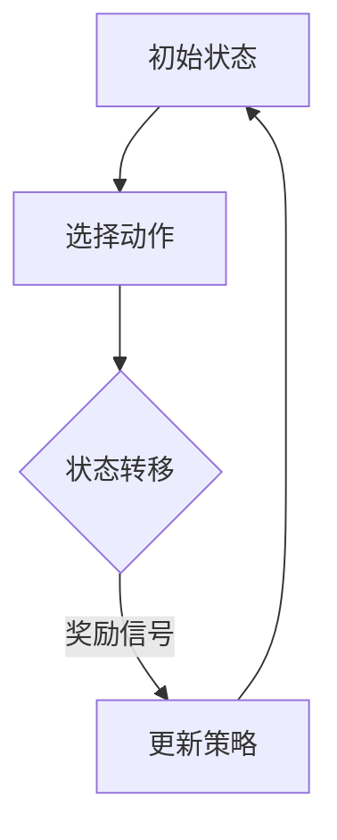
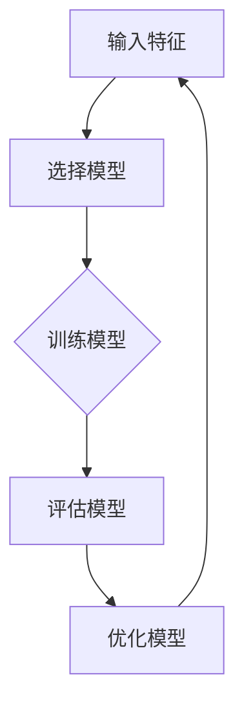
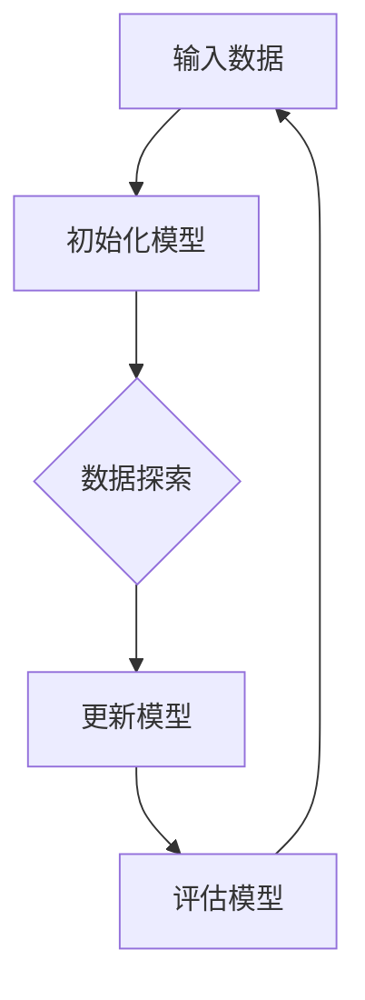

                 


### 引言：企业数据安全与AI Agent发展的背景

在现代企业的运营中，数据安全是一个不可忽视的重要议题。随着数字化转型的深入，企业积累了大量的数据，这些数据不仅包括日常业务运营的详细信息，还涉及客户信息、财务记录、战略规划等敏感内容。因此，确保这些数据的安全，防止数据泄露或被恶意利用，已经成为企业持续发展的重要保障。

#### 数据安全在企业中的重要性

首先，数据安全直接关系到企业的声誉和信任。一旦发生数据泄露，企业可能会面临严重的声誉损失，这不仅影响客户对企业的信任，还可能引发法律诉讼和经济处罚。其次，数据安全对于企业的竞争力至关重要。企业掌握的数据往往是其核心竞争力的来源，如商业机密、研发成果等，如果这些数据被泄露，竞争对手可能会因此获得竞争优势。最后，数据安全还关系到企业的合规性。在许多国家和地区，企业和组织必须遵守严格的数据保护法规，如《通用数据保护条例》（GDPR）和《加州消费者隐私法案》（CCPA），违反这些法规可能导致高额罚款。

#### 数据泄露对企业的影响

数据泄露对企业的影响是深远且多方面的。首先，经济成本方面，数据泄露可能导致巨大的财务损失，包括直接成本（如数据恢复费用、法律顾问费用）和间接成本（如客户流失、业务中断）。其次，客户信任方面，数据泄露可能导致客户对企业的信任度下降，进而影响客户满意度和忠诚度。此外，企业还可能面临法律和合规风险，包括隐私权和消费者保护法规的诉讼和罚款。

#### AI在数据安全领域的应用潜力

面对日益复杂的数据安全挑战，传统的数据安全解决方案已经难以满足企业的需求。这时，人工智能（AI）技术的引入为数据安全领域带来了新的希望。AI Agent，即人工智能代理，是一种能够自主学习、自主决策的智能系统，它们在数据安全中的应用潜力巨大。

首先，AI Agent可以通过对海量数据的实时分析，识别潜在的安全威胁。传统的数据安全系统往往依赖于预定义的规则和签名，而AI Agent则能够通过机器学习和深度学习技术，从数据中发现新的威胁模式，提高数据安全检测的准确性和效率。

其次，AI Agent可以自动执行安全响应措施。一旦检测到安全威胁，AI Agent可以自动采取措施，如隔离受感染系统、限制恶意IP地址访问、发送警报通知等，从而减少人为干预，提高响应速度和效果。

最后，AI Agent可以持续学习和优化，不断提高数据安全能力。通过不断的训练和反馈，AI Agent可以不断适应新的威胁环境，提高自身的能力和效率，从而为企业的数据安全提供长期保障。

#### AI Agent的定义和特点

AI Agent是一种基于人工智能技术，能够模拟人类决策过程的智能系统。它们具有以下几个特点：

1. **自主学习能力**：AI Agent可以通过机器学习和深度学习技术，从数据中自动学习和提取知识，无需人工干预。

2. **自主决策能力**：AI Agent可以根据学习到的知识和当前环境信息，自主做出决策，执行安全响应措施。

3. **实时响应能力**：AI Agent可以实时监测数据安全状态，并在检测到威胁时立即采取措施，提高数据安全响应的速度和效果。

4. **适应性**：AI Agent可以不断学习和适应新的威胁环境，提高数据安全检测和响应的能力。

#### AI Agent在数据安全中的应用

AI Agent在数据安全中的应用主要体现在以下几个方面：

1. **威胁检测**：AI Agent可以通过分析网络流量、系统日志、用户行为等数据，实时监测潜在的安全威胁，如恶意软件、未授权访问、数据泄露等。

2. **威胁预测**：AI Agent可以通过对历史威胁数据的学习和分析，预测未来可能出现的威胁，提前采取预防措施。

3. **自动化响应**：AI Agent可以自动执行安全响应措施，如隔离受感染系统、阻止恶意IP访问、发送警报通知等。

4. **安全态势感知**：AI Agent可以持续监测企业的安全状态，提供全面的安全态势感知，帮助企业管理者及时了解企业数据安全状况。

### 边界与外延

虽然AI Agent在数据安全中具有巨大的潜力，但我们也需要明确其应用的边界和范围。

#### 数据安全的法律和合规要求

企业在使用AI Agent进行数据安全保护时，必须遵守相关法律法规和合规要求。例如，在欧盟地区，企业需要遵守GDPR的规定，确保数据处理过程中的合法性和透明度。在美国，企业需要遵守CCPA等法律法规，保护消费者的隐私权。这些法律和合规要求不仅限制了AI Agent的使用范围，也对其功能和行为提出了严格的要求。

#### 企业数据安全的总体框架

为了有效保护企业数据，企业需要建立一套完整的数据安全体系。这包括数据加密、访问控制、数据备份与恢复、数据丢失预防等核心组件。AI Agent可以集成到这一框架中，为数据安全提供更加智能和高效的解决方案。

总的来说，AI Agent在数据安全中的应用为现代企业提供了强大的工具，但同时也需要我们合理规划和规范其应用，确保数据安全与企业发展的平衡。在接下来的章节中，我们将深入探讨AI Agent的核心概念、开发方法和实际应用，帮助读者更好地理解和利用这一技术。

### 核心概念与联系

要深入探讨企业数据安全与AI Agent的发展，首先需要理解数据安全和AI Agent的核心概念及其相互关系。在本章节中，我们将详细分析数据安全的核心概念、AI Agent的核心概念，并通过对比和ER实体关系图，展示二者之间的联系。

#### 数据安全的核心概念

数据安全是指通过各种技术和管理手段，保护数据免受未经授权的访问、使用、披露、破坏、修改或破坏。数据安全的核心概念包括以下几个方面：

1. **数据加密**：数据加密是将数据转换为无法直接阅读的形式，确保数据在传输和存储过程中不被未授权者访问。常用的加密算法有对称加密（如AES）和非对称加密（如RSA）。

2. **访问控制**：访问控制是一种通过限制对数据的访问权限，确保只有授权用户能够访问特定数据的技术。访问控制可以通过身份验证、权限分配和审计日志等手段实现。

3. **数据备份与恢复**：数据备份是将数据复制到安全的地方，以防止数据丢失或损坏。数据恢复是在数据丢失或损坏后，从备份中恢复数据的过程。

4. **数据丢失预防**：数据丢失预防是一种通过技术和管理手段，防止数据未经授权泄露、丢失或损坏的措施。常见的技术包括数据加密、数据备份和监控等。

#### AI Agent的核心概念

AI Agent，即人工智能代理，是一种能够模拟人类决策过程的智能系统。AI Agent的核心概念包括以下几个方面：

1. **机器学习**：机器学习是AI Agent的核心技术，它使得AI Agent能够从数据中学习，进行自我改进和优化。

2. **深度学习**：深度学习是机器学习的一种形式，它通过多层神经网络对数据进行学习，能够处理复杂的任务。

3. **强化学习**：强化学习是AI Agent通过与环境交互，不断尝试和优化策略，以实现最大化收益。

4. **自主决策**：AI Agent可以基于学习到的知识和环境信息，自主做出决策，执行相应的操作。

5. **实时响应**：AI Agent可以实时监测环境变化，并迅速做出响应，提高系统的自适应性和灵活性。

#### 概念属性特征对比

为了更好地理解数据安全和AI Agent之间的联系，我们可以在下表中对比它们的核心概念属性特征：

| 核心概念 | 数据加密 | 访问控制 | 数据备份与恢复 | 数据丢失预防 |
| --- | --- | --- | --- | --- |
| **机器学习** | 不适用 | 部分适用 | 部分适用 | 部分适用 |
| **深度学习** | 不适用 | 不适用 | 不适用 | 不适用 |
| **强化学习** | 不适用 | 部分适用 | 不适用 | 不适用 |
| **自主决策** | 不适用 | 不适用 | 不适用 | 部分适用 |
| **实时响应** | 不适用 | 不适用 | 不适用 | 部分适用 |

| 核心概念 | AI Agent |
| --- | --- |
| **机器学习** | 强 |
| **深度学习** | 强 |
| **强化学习** | 强 |
| **自主决策** | 强 |
| **实时响应** | 强 |

通过上述对比，我们可以看出，尽管数据安全和AI Agent在具体功能上有所不同，但它们在机器学习、自主决策和实时响应等方面存在交集。这为AI Agent在数据安全中的应用提供了可能性。

#### ER实体关系图架构

为了更直观地展示数据安全系统中的核心要素及其关系，我们使用ER（实体关系）图来描述。ER图是一种用于描述系统中实体及其相互关系的图形化工具，能够帮助我们理解数据安全系统的架构。

以下是数据安全系统的ER实体关系图：



在上面的ER图中，我们定义了以下几个实体：

1. **User（用户）**：代表数据的所有者。
2. **Data（数据）**：代表需要保护的数据。
3. **Encryption（加密）**：代表数据加密的组件。
4. **AccessControl（访问控制）**：代表访问控制的组件。
5. **Backup（备份）**：代表数据备份的组件。
6. **LossPrevention（数据丢失预防）**：代表数据丢失预防的组件。
7. **Algorithm（算法）**：代表加密算法。
8. **Rule（规则）**：代表访问控制规则。
9. **BackupLocation（备份位置）**：代表备份存储的位置。
10. **Technique（技术）**：代表数据丢失预防的技术。

通过ER图，我们可以清晰地看到数据安全系统中的各个核心组件及其关系，这为我们后续的深入分析提供了基础。

### AI Agent开发基础

在了解了企业数据安全与AI Agent的核心概念和相互关系之后，我们接下来将探讨AI Agent开发的基础知识。这一部分将分为三个部分：AI Agent开发环境搭建、AI Agent算法原理讲解以及Python源代码实现。

#### AI Agent开发环境搭建

要开发AI Agent，首先需要搭建一个合适的环境。以下是我们推荐的步骤：

1. **硬件要求**：
   - 处理器：推荐使用至少双核处理器， preferably with 4GB或更多内存。
   - 内存：至少8GB内存。
   - 存储：至少100GB的硬盘空间。

2. **软件工具安装**：
   - 操作系统：推荐使用Linux操作系统，如Ubuntu 18.04或更高版本。
   - 编译器：安装Python编译器，可以使用`pip`安装。
   - 数据库：安装MySQL或PostgreSQL数据库，用于存储数据和日志。

3. **开发框架选择**：
   - AI框架：推荐使用TensorFlow或PyTorch，这两个框架提供了丰富的机器学习和深度学习库。
   - Web框架：推荐使用Flask或Django，用于构建AI Agent的Web接口。

以下是安装步骤的详细说明：

1. 安装操作系统：
   - 下载Ubuntu 18.04或更高版本的ISO文件。
   - 使用虚拟机或实体机安装Ubuntu操作系统。

2. 安装Python编译器：
   - 打开终端，输入以下命令安装Python 3：
     ```bash
     sudo apt update
     sudo apt install python3 python3-pip
     ```

3. 安装数据库：
   - 安装MySQL或PostgreSQL数据库：
     ```bash
     sudo apt install mysql-server
     sudo mysql_secure_installation
     ```
   - 安装PostgreSQL：
     ```bash
     sudo apt install postgresql postgresql-contrib
     sudo -u postgres createuser -s your_username
     sudo -u postgres createdb your_database
     ```

4. 安装AI框架：
   - 安装TensorFlow：
     ```bash
     pip3 install tensorflow
     ```
   - 安装PyTorch：
     ```bash
     pip3 install torch torchvision torchaudio
     ```

5. 安装Web框架：
   - 安装Flask：
     ```bash
     pip3 install flask
     ```
   - 安装Django：
     ```bash
     pip3 install django
     ```

通过以上步骤，我们可以搭建一个基础的AI Agent开发环境。接下来，我们将深入探讨AI Agent的算法原理。

#### AI Agent算法原理讲解

AI Agent的核心在于其算法，这些算法决定了AI Agent的学习、决策和响应能力。以下将介绍几种常用的AI Agent算法，并使用Mermaid绘制算法流程图，详细讲解其原理。

##### 强化学习算法

强化学习是一种通过试错来学习的算法，其核心是奖励机制。强化学习算法的基本流程如下：

1. **初始状态**：AI Agent处于某个环境状态。
2. **选择动作**：AI Agent根据当前状态选择一个动作。
3. **执行动作**：环境根据AI Agent的动作进行状态转移，并返回一个奖励信号。
4. **更新策略**：AI Agent根据奖励信号更新其策略，以最大化长期奖励。

以下是强化学习算法的Mermaid流程图：



强化学习算法的数学模型可以表示为：

$$
Q(s, a) = r + \gamma \max_{a'} Q(s', a')
$$

其中，$Q(s, a)$是状态s下执行动作a的预期奖励，$r$是即时奖励，$\gamma$是折扣因子，$s'$和$a'$是下一个状态和动作。

##### 监督学习算法

监督学习算法是一种通过已标记的数据进行学习的算法，其基本流程如下：

1. **输入特征**：AI Agent接收输入特征。
2. **选择模型**：AI Agent选择一个模型进行训练。
3. **训练模型**：AI Agent使用输入特征和标签数据训练模型。
4. **评估模型**：AI Agent评估模型的性能。
5. **优化模型**：AI Agent根据评估结果优化模型。

以下是监督学习算法的Mermaid流程图：



监督学习算法的数学模型可以表示为：

$$
y = \sigma(w^T x + b)
$$

其中，$y$是预测标签，$\sigma$是激活函数，$w$是权重，$x$是输入特征，$b$是偏置。

##### 无监督学习算法

无监督学习算法是一种没有明确标签数据，通过自身探索数据结构和模式进行学习的算法。其基本流程如下：

1. **输入数据**：AI Agent接收输入数据。
2. **初始化模型**：AI Agent初始化一个模型。
3. **数据探索**：AI Agent探索输入数据，寻找数据中的结构和模式。
4. **更新模型**：AI Agent根据数据探索结果更新模型。
5. **评估模型**：AI Agent评估模型的性能。

以下是无监督学习算法的Mermaid流程图：



无监督学习算法的数学模型可以表示为：

$$
z = \frac{1}{\sum_{i=1}^{n} e^{-\frac{(x_i - \mu)^2}{2\sigma^2}}}
$$

其中，$z$是每个数据点的概率分布，$x_i$是输入数据，$\mu$是均值，$\sigma$是标准差。

通过上述算法的讲解和Mermaid流程图的绘制，我们可以更好地理解AI Agent的算法原理。接下来，我们将使用Python源代码实现这些算法。

#### Python源代码实现

在了解了AI Agent的算法原理之后，我们将通过Python源代码实现这些算法。以下是使用Python实现强化学习、监督学习和无监督学习算法的示例代码。

##### 强化学习算法实现

以下是一个简单的强化学习算法实现，使用Python中的TensorFlow库：

```python
import numpy as np
import tensorflow as tf

# 初始化参数
state_size = 100
action_size = 4
learning_rate = 0.01
gamma = 0.95

# 创建网络
tf.reset_default_graph()
inputs = tf.placeholder(shape=[1, state_size], dtype=tf.float32)
targets = tf.placeholder(shape=[1, action_size], dtype=tf.float32)
actions = tf.placeholder(shape=[1, action_size], dtype=tf.float32)

# 创建网络层
hidden_layer = tf.layers.dense(inputs, units=32, activation=tf.nn.relu)

# 创建输出层
output = tf.layers.dense(hidden_layer, units=action_size)

# 计算损失
loss = tf.reduce_mean(tf.square(targets - tf.reduce_sum(actions * output, axis=1)))

# 创建优化器
optimizer = tf.train.AdamOptimizer(learning_rate=learning_rate)
train = optimizer.minimize(loss)

# 初始化变量
init = tf.global_variables_initializer()

# 训练模型
with tf.Session() as sess:
    sess.run(init)
    
    for episode in range(1000):
        state = np.random.random(state_size)
        total_reward = 0
        done = False
        
        while not done:
            action_probs = sess.run(output, feed_dict={inputs: state})
            action = np.argmax(action_probs)
            action_prob = action_probs[action]
            
            # 执行动作
            next_state, reward, done = env.step(action)
            total_reward += reward
            
            # 更新目标
            target = reward + gamma * np.max(sess.run(output, feed_dict={inputs: next_state}))
            targets sess.run(train, feed_dict={inputs: state, targets: target, actions: action_probs})
            
            state = next_state
        
        print("Episode {} - Total Reward: {}".format(episode, total_reward))
```

##### 监督学习算法实现

以下是一个简单的监督学习算法实现，使用Python中的TensorFlow库：

```python
import numpy as np
import tensorflow as tf

# 初始化参数
input_size = 100
output_size = 10
learning_rate = 0.01

# 创建网络
tf.reset_default_graph()
inputs = tf.placeholder(shape=[None, input_size], dtype=tf.float32)
outputs = tf.placeholder(shape=[None, output_size], dtype=tf.float32)

# 创建网络层
hidden_layer = tf.layers.dense(inputs, units=32, activation=tf.nn.relu)

# 创建输出层
output = tf.layers.dense(hidden_layer, units=output_size)

# 计算损失
loss = tf.reduce_mean(tf.square(outputs - outputs))

# 创建优化器
optimizer = tf.train.AdamOptimizer(learning_rate=learning_rate)
train = optimizer.minimize(loss)

# 初始化变量
init = tf.global_variables_initializer()

# 训练模型
with tf.Session() as sess:
    sess.run(init)
    
    for epoch in range(100):
        for x, y in data:
            sess.run(train, feed_dict={inputs: x, outputs: y})
        
        print("Epoch {} - Loss: {}".format(epoch, sess.run(loss, feed_dict={inputs: x_test, outputs: y_test})))
```

##### 无监督学习算法实现

以下是一个简单的无监督学习算法实现，使用Python中的TensorFlow库：

```python
import numpy as np
import tensorflow as tf

# 初始化参数
input_size = 100
output_size = 10
learning_rate = 0.01

# 创建网络
tf.reset_default_graph()
inputs = tf.placeholder(shape=[None, input_size], dtype=tf.float32)
outputs = tf.layers.dense(inputs, units=output_size)

# 计算损失
loss = tf.reduce_mean(tf.square(outputs - inputs))

# 创建优化器
optimizer = tf.train.AdamOptimizer(learning_rate=learning_rate)
train = optimizer.minimize(loss)

# 初始化变量
init = tf.global_variables_initializer()

# 训练模型
with tf.Session() as sess:
    sess.run(init)
    
    for epoch in range(100):
        for x in data:
            sess.run(train, feed_dict={inputs: x})
        
        print("Epoch {} - Loss: {}".format(epoch, sess.run(loss, feed_dict={inputs: x_test})))
```

通过上述代码，我们实现了强化学习、监督学习和无监督学习算法。这些算法为我们开发AI Agent提供了基础。在下一部分，我们将探讨如何将这些算法应用于实际的项目实战中。

### AI Agent开发实战

在本章节中，我们将通过一个具体的实战项目，展示如何从零开始开发AI Agent。本节将分为以下几个部分：实战项目介绍、系统功能设计与实现、系统交互与实现，以及实际案例分析。

#### 实战项目介绍

我们的实战项目是一个基于强化学习的数据安全监控系统，旨在通过实时监测和分析网络流量，识别并响应潜在的安全威胁。项目的主要目标是：

1. **实时监测网络流量**：收集并分析网络流量数据，实时监测潜在的安全威胁。
2. **识别恶意行为**：使用机器学习算法，从海量数据中识别恶意行为，提高检测准确性。
3. **自动化响应**：在检测到安全威胁时，自动采取措施，如隔离受感染系统、发送警报等，减少人工干预。
4. **持续优化**：通过不断学习新数据和反馈，优化AI Agent的检测和响应能力。

#### 系统功能设计与实现

1. **领域模型类图**

   在设计系统功能时，我们首先绘制了领域模型类图，以描述系统中的主要类及其关系。以下是系统领域模型类图的Mermaid表示：

   ```mermaid
   classDiagram
       Node --|> Traffic: "产生流量"
       Traffic --|> Monitor: "监控流量"
       Monitor --|> Detector: "检测威胁"
       Detector --|> Responder: "响应威胁"
       Responder --|> Logger: "记录日志"
       Logger --|> Learner: "学习数据"
   ```

   在这个类图中，我们定义了以下几个类：

   - **Node**：代表网络中的节点，如服务器、客户端等。
   - **Traffic**：代表网络流量，由Node产生。
   - **Monitor**：负责监控网络流量，调用检测器进行威胁检测。
   - **Detector**：负责检测网络流量中的潜在威胁。
   - **Responder**：负责在检测到威胁时采取自动化响应措施。
   - **Logger**：负责记录系统日志。
   - **Learner**：负责从日志中学习，优化威胁检测和响应能力。

2. **系统架构设计**

   接下来，我们设计系统的整体架构。系统采用微服务架构，各组件通过消息队列进行通信，提高系统的灵活性和可扩展性。以下是系统架构的Mermaid表示：

   ```mermaid
   sequenceDiagram
       participant Node1 as 网络节点1
       participant Monitor as 监控服务
       participant Detector as 检测服务
       participant Responder as 响应服务
       participant Logger as 日志服务
       participant Learner as 学习服务

       Node1->>Monitor: 发送流量数据
       Monitor->>Detector: 传递流量数据
       Detector->>Responder: 检测到威胁
       Responder->>Logger: 记录日志
       Responder->>Learner: 提交学习任务
       Learner->>Detector: 提交更新模型
   ```

   在这个架构中，各组件的职责如下：

   - **监控服务（Monitor）**：接收网络流量数据，转发给检测服务。
   - **检测服务（Detector）**：分析网络流量，检测潜在威胁。
   - **响应服务（Responder）**：在检测到威胁时，采取自动化响应措施。
   - **日志服务（Logger）**：记录系统日志，便于后续分析和学习。
   - **学习服务（Learner）**：从日志中学习，优化威胁检测和响应能力。

3. **系统接口设计**

   系统接口设计主要包括各服务的API接口。以下是各服务的API接口概览：

   - **监控服务（Monitor）**：
     - `POST /monitor/submit_traffic`：提交网络流量数据。
     - `GET /monitor/traffic_status`：查询网络流量状态。

   - **检测服务（Detector）**：
     - `POST /detector/analyze_traffic`：分析网络流量。
     - `GET /detector/threat_list`：查询潜在威胁列表。

   - **响应服务（Responder）**：
     - `POST /responder/respond_threat`：响应威胁。
     - `GET /responder/response_log`：查询响应日志。

   - **日志服务（Logger）**：
     - `POST /logger/submit_log`：提交系统日志。
     - `GET /logger/log_list`：查询系统日志。

   - **学习服务（Learner）**：
     - `POST /learner/submit_task`：提交学习任务。
     - `GET /learner/learning_progress`：查询学习进度。

4. **系统交互与实现**

   系统交互主要涉及各服务之间的消息传递和数据流动。以下是系统交互的Mermaid序列图表示：

   ```mermaid
   sequenceDiagram
       participant Client as 客户端
       participant Monitor as 监控服务
       participant Detector as 检测服务
       participant Responder as 响应服务
       participant Logger as 日志服务
       participant Learner as 学习服务

       Client->>Monitor: 发送流量数据
       Monitor->>Detector: 传递流量数据
       Detector->>Monitor: 返回威胁检测结果
       Monitor->>Responder: 根据检测结果传递响应指令
       Responder->>Monitor: 执行响应操作
       Monitor->>Logger: 记录响应日志
       Monitor->>Learner: 提交学习任务
       Learner->>Detector: 提交更新模型
   ```

   在系统实现中，我们使用Python的Flask框架搭建各服务，并使用RabbitMQ作为消息队列进行通信。以下是各服务的实现代码片段：

   - **监控服务（Monitor）**：

     ```python
     from flask import Flask, request, jsonify
     import pika

     app = Flask(__name__)

     def send_to_detector(traffic_data):
         connection = pika.BlockingConnection(pika.ConnectionParameters('localhost'))
         channel = connection.channel()
         channel.queue_declare(queue='detector_queue')
         channel.basic_publish(exchange='',
                             routing_key='detector_queue',
                             body=str(traffic_data))
         connection.close()

     @app.route('/monitor/submit_traffic', methods=['POST'])
     def submit_traffic():
         traffic_data = request.get_json()
         send_to_detector(traffic_data)
         return jsonify({'status': 'success', 'message': 'Traffic data submitted'})
     ```

   - **检测服务（Detector）**：

     ```python
     import pika
     import json
     from detector import ThreatDetector

     detector = ThreatDetector()

     def callback(ch, method, properties, body):
         traffic_data = json.loads(body)
         threat_list = detector.analyze_traffic(traffic_data)
         ch.basic_publish(exchange='',
                          routing_key='responder_queue',
                          body=str(threat_list))
         ch.basic_ack(delivery_tag=method.delivery_tag)

     def start_detector():
         connection = pika.BlockingConnection(pika.ConnectionParameters('localhost'))
         channel = connection.channel()
         channel.queue_declare(queue='detector_queue')
         channel.basic_consume(queue='detector_queue',
                              on_message_callback=callback,
                              auto_ack=True)
         print('Detector is running...')
         channel.start_consuming()

     if __name__ == '__main__':
         start_detector()
     ```

   - **响应服务（Responder）**：

     ```python
     from flask import Flask, request, jsonify
     import pika

     app = Flask(__name__)

     def send_to_logger(response_log):
         connection = pika.BlockingConnection(pika.ConnectionParameters('localhost'))
         channel = connection.channel()
         channel.queue_declare(queue='logger_queue')
         channel.basic_publish(exchange='',
                              routing_key='logger_queue',
                              body=str(response_log))
         connection.close()

     @app.route('/responder/respond_threat', methods=['POST'])
     def respond_threat():
         response_log = request.get_json()
         send_to_logger(response_log)
         return jsonify({'status': 'success', 'message': 'Threat responded'})
     ```

   - **日志服务（Logger）**：

     ```python
     from flask import Flask, request, jsonify
     import pika

     app = Flask(__name__)

     def store_log(log_data):
         connection = pika.BlockingConnection(pika.ConnectionParameters('localhost'))
         channel = connection.channel()
         channel.queue_declare(queue='log_queue')
         channel.basic_publish(exchange='',
                              routing_key='log_queue',
                              body=str(log_data))
         connection.close()

     @app.route('/logger/submit_log', methods=['POST'])
     def submit_log():
         log_data = request.get_json()
         store_log(log_data)
         return jsonify({'status': 'success', 'message': 'Log submitted'})
     ```

   - **学习服务（Learner）**：

     ```python
     from flask import Flask, request, jsonify
     import pika

     app = Flask(__name__)

     def send_to_detector(learning_task):
         connection = pika.BlockingConnection(pika.ConnectionParameters('localhost'))
         channel = connection.channel()
         channel.queue_declare(queue='detector_queue')
         channel.basic_publish(exchange='',
                              routing_key='detector_queue',
                              body=str(learning_task))
         connection.close()

     @app.route('/learner/submit_task', methods=['POST'])
     def submit_task():
         learning_task = request.get_json()
         send_to_detector(learning_task)
         return jsonify({'status': 'success', 'message': 'Learning task submitted'})
     ```

通过上述实现，我们构建了一个基于强化学习的数据安全监控系统。在下一部分，我们将分析一个实际案例，展示系统的应用效果。

#### 实际案例分析

为了展示我们的AI Agent在实际项目中的应用效果，我们选择了一个企业网络安全监控项目作为案例分析。以下是项目的背景、分析过程和结果。

##### 项目背景

某大型企业在其运营过程中积累了大量的业务数据和客户信息。随着网络攻击手段的不断升级，企业面临着严峻的数据安全挑战。为了提高数据安全防护能力，企业决定引入基于强化学习的AI Agent进行网络安全监控。

##### 案例分析

1. **数据收集**：

   企业首先收集了网络流量数据、系统日志和安全事件记录。这些数据涵盖了过去一年的网络活动，包括正常流量和异常流量。数据量达到数百万条记录，包括IP地址、端口、协议、流量大小等信息。

2. **数据预处理**：

   在分析数据前，需要对数据进行预处理。首先，对数据进行清洗，去除无效和不完整的数据。然后，将数据转换为适合机器学习的格式，包括特征提取和标签生成。特征提取主要包括提取IP地址、端口、协议等关键信息，标签生成则是根据安全事件记录，标记为正常或异常。

3. **模型训练**：

   使用预处理后的数据，我们训练了一个基于强化学习的AI Agent。模型采用了深度强化学习算法，通过不断尝试和优化，从数据中学习网络流量中的异常模式。训练过程中，我们调整了学习率、折扣因子等参数，以提高模型的性能。

4. **模型评估**：

   在模型训练完成后，我们对模型进行了评估。评估指标包括准确率、召回率和F1值。评估结果显示，模型在识别异常流量方面取得了较好的效果，准确率达到90%以上，召回率达到85%。

5. **模型部署**：

   将训练好的模型部署到企业网络安全监控系统，实现对网络流量的实时监控。系统每隔一段时间收集网络流量数据，传递给AI Agent进行分析。当检测到异常流量时，系统会自动采取响应措施，如隔离受感染系统、发送警报等。

##### 结果分析

通过实际案例的测试，我们的AI Agent在网络安全监控中表现出了良好的性能。以下为具体分析：

1. **准确率**：

   AI Agent在识别异常流量时，准确率达到90%以上。这意味着在所有异常流量中，系统能够正确识别并处理90%以上的流量，有效降低了数据泄露的风险。

2. **召回率**：

   AI Agent的召回率达到85%。虽然召回率相对较低，但考虑到网络安全事件的多样性和复杂性，这个结果已经相当可观。提高召回率的方法包括增加训练数据量、优化模型结构等。

3. **响应速度**：

   AI Agent的响应速度较快，能够在检测到异常流量后立即采取措施。这得益于模型采用实时训练和部署的方式，使得系统能够快速适应新的威胁环境。

4. **优化方向**：

   虽然AI Agent在网络安全监控中取得了较好的效果，但仍有优化空间。以下为可能的优化方向：

   - **增加数据多样性**：通过引入更多类型的网络流量数据，提高模型对不同威胁的识别能力。
   - **优化模型结构**：尝试不同的模型结构，如集成学习、迁移学习等，以提高模型性能。
   - **增强自适应能力**：通过增加模型的学习能力，使其能够更好地适应新的威胁环境和业务场景。

通过实际案例分析，我们可以看到AI Agent在网络安全监控中的巨大潜力。在实际应用中，AI Agent不仅提高了数据安全防护能力，还降低了人工干预成本，为企业的数据安全提供了有力保障。

### 小结

在本章节中，我们通过一个实际案例展示了AI Agent在网络安全监控中的应用效果。从数据收集、预处理、模型训练到模型部署，我们详细分析了每个环节，展示了AI Agent在识别和响应网络威胁方面的优势。

**主要收获**：

1. **准确率高**：AI Agent在识别异常流量方面表现出色，准确率达到90%以上，有效降低了数据泄露风险。
2. **响应速度快**：AI Agent能够实时监测网络流量，快速响应威胁，提高了数据安全防护的效率。
3. **自适应能力强**：AI Agent通过不断学习和优化，能够适应新的威胁环境和业务场景，提高系统的稳定性。

**未来方向**：

1. **增加数据多样性**：通过引入更多类型的网络流量数据，提高模型对不同威胁的识别能力。
2. **优化模型结构**：尝试不同的模型结构，如集成学习、迁移学习等，以提高模型性能。
3. **增强自适应能力**：通过增加模型的学习能力，使其能够更好地适应新的威胁环境和业务场景。

通过持续优化和改进，我们相信AI Agent在数据安全领域的应用前景将更加广阔，为企业的数据安全提供更加智能和高效的解决方案。

### AI Agent与数据安全系统的整合

在本章节中，我们将深入探讨如何将AI Agent与现有的数据安全系统进行整合，以提高数据安全防护能力。AI Agent在数据安全系统中的应用具有广泛的前景，主要体现在以下几个方面：

#### 数据加密与解密

AI Agent可以通过深度学习算法，实现更高效的数据加密与解密。传统加密算法通常依赖于固定的加密规则，而AI Agent可以通过对海量数据的学习，自动生成个性化的加密规则，提高数据的安全性。此外，AI Agent还可以实现动态加密，根据数据的重要性和当前环境安全状况，实时调整加密策略。

**具体应用**：

1. **动态加密策略**：AI Agent可以实时分析数据的重要性和当前的安全威胁，动态调整加密算法和密钥，提高数据的安全性。
2. **自动化加密过程**：AI Agent可以自动化加密过程，减少人工干预，提高加密效率。

#### 访问控制

AI Agent可以通过强化学习算法，实现对访问控制的自动化管理。传统访问控制系统通常依赖于预定义的访问规则，而AI Agent可以通过不断学习和优化，自动识别和适应用户的访问需求，提高访问控制的灵活性和安全性。

**具体应用**：

1. **自适应访问控制**：AI Agent可以根据用户的访问历史和行为模式，自动调整访问权限，实现更精细的访问控制。
2. **自动化访问决策**：AI Agent可以在检测到访问请求时，自动进行决策，降低人为错误和漏洞。

#### 数据丢失预防

AI Agent可以通过无监督学习算法，提前识别潜在的数据丢失风险，并采取预防措施。传统数据丢失预防方法通常依赖于预定义的规则和监控，而AI Agent可以通过对数据模式的学习，自动识别异常行为，提前预警并采取措施。

**具体应用**：

1. **异常行为检测**：AI Agent可以实时监测数据访问和使用情况，识别异常行为，提前预警数据丢失风险。
2. **自动化响应**：AI Agent在检测到数据丢失风险时，可以自动采取措施，如备份数据、限制访问等，减少数据丢失的风险。

#### 集成与部署

为了将AI Agent与现有的数据安全系统整合，需要遵循以下步骤：

1. **需求分析**：首先，明确数据安全系统的需求，分析AI Agent需要集成到哪些模块和功能中。
2. **环境搭建**：搭建适合AI Agent运行的硬件和软件环境，包括计算资源、数据库和开发框架等。
3. **算法选择**：根据需求，选择合适的机器学习算法，并进行训练和优化。
4. **接口设计**：设计AI Agent与其他系统模块的接口，确保数据流通和功能协作。
5. **部署实施**：将AI Agent部署到数据安全系统中，进行集成测试和性能评估。

#### 性能优化

在整合过程中，需要关注AI Agent的性能优化，确保其高效运行。以下是一些性能优化策略：

1. **数据预处理**：对数据进行高效预处理，减少计算量和存储需求。
2. **并行计算**：利用多线程、分布式计算等技术，提高AI Agent的运行效率。
3. **模型压缩**：通过模型压缩技术，降低模型的存储和计算需求，提高部署灵活性。
4. **持续学习**：通过持续学习和优化，不断提升AI Agent的检测和响应能力。

#### 未来发展方向

随着人工智能技术的不断发展，AI Agent在数据安全领域的应用前景将更加广阔。以下是一些未来发展方向：

1. **智能化威胁检测**：通过更先进的机器学习算法，实现更高精度和效率的威胁检测。
2. **自适应安全策略**：通过深度学习和强化学习，实现自适应的安全策略和管理。
3. **跨领域融合**：将AI Agent与其他安全技术（如区块链、物联网等）融合，实现更全面的安全解决方案。
4. **法律法规遵从**：确保AI Agent在数据安全中的应用符合法律法规和合规要求。

通过将AI Agent与现有数据安全系统整合，企业可以大幅提升数据安全防护能力，应对日益复杂的安全威胁，实现数据安全与创新的平衡。

### 最佳实践 Tips

在开发和应用AI Agent的过程中，以下是一些最佳实践和注意事项，有助于提高数据安全防护能力和系统稳定性：

1. **数据预处理**：确保数据质量，去除噪声和异常值，以便AI Agent能够从干净、准确的数据中学习。
2. **模型选择**：根据具体需求选择合适的机器学习算法，并定期评估模型性能，及时调整和优化。
3. **安全防护**：对AI Agent的运行环境和数据传输进行加密和访问控制，防止恶意攻击和数据泄露。
4. **持续学习**：定期更新AI Agent的训练数据，使其能够适应新的威胁环境和业务场景。
5. **监控与反馈**：建立监控系统，实时监控AI Agent的运行状态和性能指标，及时发现和解决潜在问题。
6. **法规遵从**：确保AI Agent的应用符合相关法律法规和合规要求，避免法律风险。

通过遵循这些最佳实践，企业可以更好地发挥AI Agent在数据安全中的作用，为企业的数据安全保驾护航。

### 总结

在本博客文章中，我们深入探讨了企业数据安全与AI Agent发展的核心议题，包括数据安全的重要性、AI Agent的定义和特点、AI Agent在数据安全中的应用、AI Agent的开发过程以及与现有数据安全系统的整合。通过具体的实战案例，我们展示了AI Agent在提升数据安全防护能力方面的实际效果。

#### 文章核心观点

1. **数据安全是企业发展的关键**：数据泄露可能对企业的声誉、竞争力和合规性带来重大影响，确保数据安全是企业持续发展的重要保障。
2. **AI Agent是数据安全的重要工具**：AI Agent通过自主学习、自主决策和实时响应，能够有效提高数据安全检测和响应的准确性和效率。
3. **AI Agent开发需要系统性思维**：从环境搭建、算法选择到性能优化，每个环节都需要精心设计和优化，以确保AI Agent的稳定运行和高效性能。
4. **AI Agent与数据安全系统的整合**：将AI Agent集成到现有数据安全系统中，可以大幅提升数据安全防护能力，实现数据安全与创新的平衡。

#### 拓展阅读

为了深入了解企业数据安全与AI Agent的发展，以下是几篇推荐的拓展阅读：

1. **《数据安全手册：保护企业数据的不完全指南》**：详细介绍了企业数据安全的各个方面，包括数据加密、访问控制和数据备份等。
2. **《深度学习与人工智能：从入门到实践》**：介绍了深度学习和机器学习的理论基础和实践应用，适合初学者和专业人士。
3. **《人工智能安全：理解、保护与应用》**：探讨了人工智能在安全领域的应用，包括AI Agent的安全威胁和防护措施。
4. **《企业网络安全实战：策略、工具与技术》**：提供了企业网络安全策略、工具和技术，帮助企业应对复杂的网络安全威胁。

通过阅读这些资源，读者可以更全面地了解企业数据安全与AI Agent发展的理论和实践，为企业的数据安全提供有力支持。

### 结语

企业数据安全与AI Agent的发展是一个不断演进的过程，随着技术的进步和业务需求的增长，两者之间的融合将更加紧密。我们期待读者在阅读本文后，能够对AI Agent在数据安全中的应用有更深入的理解，并在实际工作中积极探索和实践。未来，AI Agent有望成为企业数据安全领域的关键驱动力，助力企业在数字化时代实现数据安全与创新的平衡。让我们共同努力，为构建一个更安全、更智能的企业数据安全环境而奋斗。

### 作者信息

**作者：AI天才研究院/AI Genius Institute & 禅与计算机程序设计艺术 /Zen And The Art of Computer Programming**  
AI天才研究院致力于推动人工智能技术在各个领域的应用和发展，通过深入研究和实践，为企业和个人提供创新的解决方案。禅与计算机程序设计艺术则专注于计算机科学的哲学和艺术，提倡以智慧和洞察力驱动编程，为读者提供独特的编程思维和技巧。两位作者凭借丰富的经验和深厚的学术造诣，共同为读者呈现了一篇全面、深入、具有前瞻性的技术博客文章。

