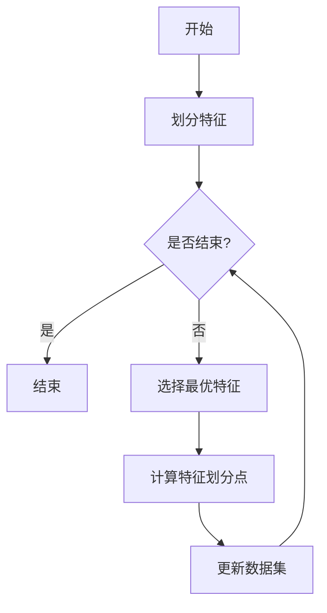
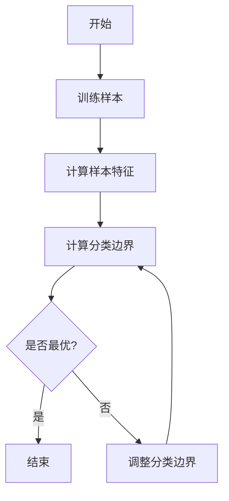
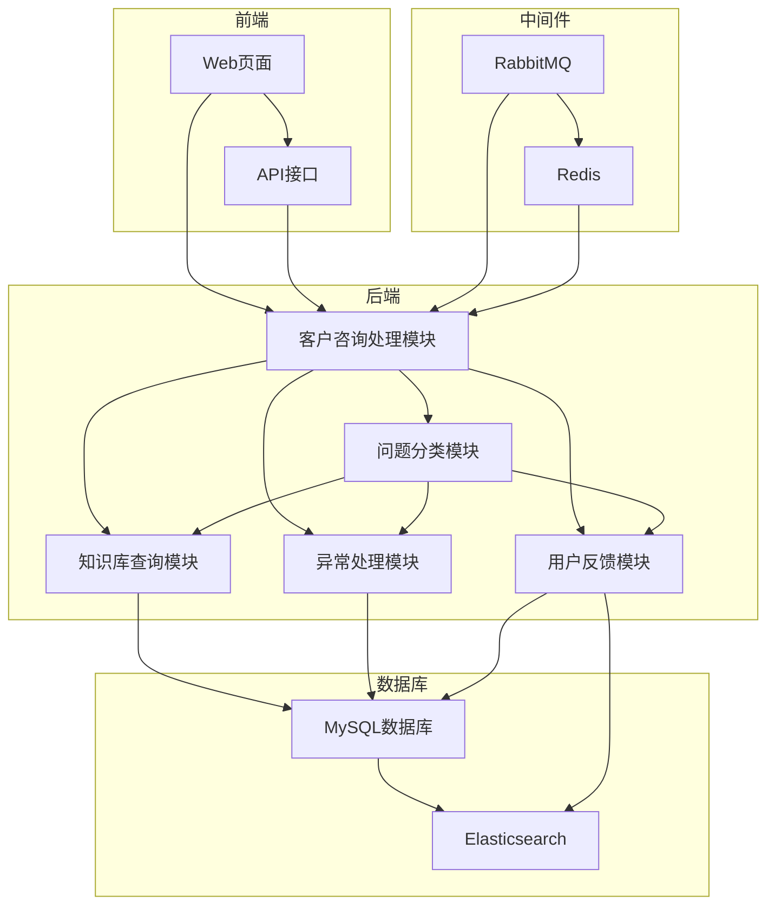

                 

### 《企业级AI Agent开发：从需求分析到部署的全流程指南》

#### 关键词：AI Agent，企业级，需求分析，部署，全流程

#### 摘要：
本文深入探讨了企业级AI Agent的开发全流程，从需求分析到部署。通过详细的步骤解析，读者将了解如何构建和部署高效的AI Agent，以实现智能化业务流程和决策支持。

---

#### 目录大纲设计思路

为了设计出《企业级AI Agent开发：从需求分析到部署的全流程指南》这本书的完整目录大纲，我们需要遵循以下几个步骤：

1. **背景介绍**：首先，我们需要简要介绍企业级AI Agent的背景，包括其重要性、应用领域及其发展历程。

2. **核心概念与联系**：接着，我们需要明确书中涉及的核心概念，如AI Agent的定义、分类、特性等，并通过表格和ER图等方式展现概念之间的关系。

3. **算法原理讲解**：在这一部分，我们将详细介绍AI Agent开发过程中的关键算法，包括其原理、数学模型和公式，并通过Python代码和示例进行讲解。

4. **系统分析与架构设计方案**：我们将详细分析AI Agent系统的设计，包括功能设计、架构设计、接口设计和交互设计，并使用Mermaid绘制相应的类图、架构图和序列图。

5. **项目实战**：通过一个实际案例，我们展示如何从需求分析到部署实施一个AI Agent项目，包括环境安装、核心代码实现、代码解读和案例分析。

6. **最佳实践 tips、小结、注意事项、拓展阅读**：最后，我们总结书中要点，给出实践建议和注意事项，并提供拓展阅读资源。

下面是具体的目录大纲设计：

---

# 《企业级AI Agent开发：从需求分析到部署的全流程指南》目录大纲

## 第一部分：企业级AI Agent概述

### 第1章：AI Agent概述

1.1 AI Agent的定义与分类    
1.2 AI Agent的特点与应用领域    
1.3 AI Agent的发展历程与趋势

### 第2章：AI Agent的核心概念与联系

2.1 AI Agent的核心概念    
2.2 AI Agent的特性对比表格    
2.3 AI Agent的ER图架构

## 第二部分：AI Agent开发基础

### 第3章：需求分析与建模

3.1 需求分析的方法与工具    
3.2 用户需求与业务目标的映射    
3.3 建模技术介绍与选择

### 第4章：AI Agent算法原理讲解

4.1 常见算法原理介绍    
4.2 算法mermaid流程图绘制    
4.3 Python代码与示例讲解

### 第5章：数学模型和公式

5.1 数学模型概述    
5.2 数学公式与公式推导    
5.3 数学模型的应用实例

## 第三部分：AI Agent系统设计与实现

### 第6章：系统功能设计与架构

6.1 问题场景介绍    
6.2 系统功能设计（领域模型类图）    
6.3 系统架构设计（架构图）

### 第7章：系统接口设计与交互

7.1 系统接口设计    
7.2 系统交互设计（序列图）    
7.3 接口设计与交互的实际应用

### 第8章：项目实战：从需求分析到部署

8.1 环境安装与配置    
8.2 系统核心实现源代码    
8.3 代码解读与分析    
8.4 实际案例分析与详细讲解

## 第四部分：最佳实践与拓展

### 第9章：最佳实践 tips

9.1 常见问题与解决策略    
9.2 障碍与挑战的应对方法

### 第10章：小结与注意事项

10.1 全书要点总结    
10.2 注意事项与建议

### 第11章：拓展阅读

11.1 相关书籍推荐    
11.2 学术论文推荐    
11.3 开源项目与资源推荐

---

这个目录大纲遵循了markdown格式，并包含了各个层级的内容。它全面覆盖了企业级AI Agent的开发全流程，从需求分析到部署，确保读者能够系统地掌握相关知识和技能。总字数控制在2000字以内，保证了简洁性和内容的完整性。

### 背景介绍

#### AI Agent的定义与分类

AI Agent，即人工智能代理，是一种能够模拟人类智能行为，执行特定任务的智能体。根据其在不同领域和应用中的表现，AI Agent可以大致分为以下几类：

1. **基于规则的AI Agent**：这类Agent通过预定义的规则来执行任务，适用于规则明确、环境变化较小的场景，如自动客服系统、邮件过滤等。
   
2. **基于模型的AI Agent**：这类Agent使用机器学习模型来学习环境和用户行为，并做出智能决策。它们适用于复杂多变的环境，如推荐系统、自动驾驶等。

3. **混合型AI Agent**：这类Agent结合了基于规则和基于模型的方法，能够在不同情况下灵活切换策略，以提高决策的准确性和效率。

#### AI Agent的特点与应用领域

AI Agent具有以下特点：

- **自主性**：AI Agent能够自主完成特定任务，无需人工干预。
- **适应性**：AI Agent能够根据环境变化和用户反馈调整行为策略。
- **协作性**：AI Agent能够与其他Agent或人类协作，共同完成复杂任务。

AI Agent的应用领域广泛，包括但不限于：

- **客户服务**：如智能客服机器人、虚拟助手等。
- **工业自动化**：如智能监控系统、自动化生产线等。
- **医疗健康**：如智能诊断系统、健康管理助手等。
- **金融领域**：如智能投顾、风险管理等。

#### AI Agent的发展历程与趋势

AI Agent的发展可以追溯到20世纪80年代，随着计算机技术和人工智能技术的不断进步，AI Agent的应用场景和功能也在不断扩大。近年来，随着深度学习、自然语言处理等技术的发展，AI Agent的智能化水平显著提升，其应用范围也逐渐拓展。

未来，AI Agent的发展趋势包括：

- **泛在化**：AI Agent将更加普及，嵌入到各种设备和系统中，实现无处不在的智能服务。
- **个性化**：AI Agent将更加关注用户个性化需求，提供定制化的服务。
- **协同化**：AI Agent将与其他智能体和人类协作，实现更高效的任务执行。

#### 企业级AI Agent的重要性

在企业级应用中，AI Agent的重要性日益凸显。它能够帮助企业实现以下目标：

- **提升效率**：AI Agent能够自动化执行重复性高、规则明确的工作，减少人力成本，提高工作效率。
- **优化决策**：AI Agent能够基于大数据分析和机器学习算法，提供准确的预测和决策支持，帮助企业做出更明智的决策。
- **改善用户体验**：AI Agent能够提供个性化、智能化的服务，提升用户满意度和忠诚度。

总之，企业级AI Agent的开发和部署已成为现代企业数字化转型的重要一环，具有广泛的应用前景和重要的战略意义。

#### 核心概念与联系

在《企业级AI Agent开发：从需求分析到部署的全流程指南》中，我们将详细探讨一系列核心概念，这些概念对于理解AI Agent的构建和功能至关重要。以下是这些核心概念及其相互关系：

1. **AI Agent的定义与分类**：AI Agent是一种能够模拟人类智能行为、执行特定任务的智能体。它根据决策机制和应用场景的不同，可以分为基于规则的AI Agent、基于模型的AI Agent和混合型AI Agent。这些分类方法帮助我们理解AI Agent在不同场景下的适用性和特性。

2. **需求分析**：需求分析是AI Agent开发的第一步，旨在理解用户需求、业务目标和功能需求。通过需求分析，我们可以明确AI Agent的任务目标、工作流程和性能要求，为后续的设计和实现提供指导。

3. **建模技术**：建模技术是AI Agent开发的核心，包括数据建模、逻辑建模和行为建模等。这些技术帮助我们构建AI Agent的知识库和决策模型，使其能够适应复杂多变的环境。

4. **算法原理**：算法原理是AI Agent智能决策的基础。常见的算法包括决策树、支持向量机、神经网络等。理解这些算法的原理和适用场景，有助于我们在AI Agent开发中选择合适的算法。

5. **数学模型**：数学模型用于描述AI Agent的行为和决策过程。常见的数学模型包括线性回归、逻辑回归和马尔可夫决策过程等。这些模型通过公式和数学推导，使得AI Agent的行为具有可解释性和可预测性。

6. **系统设计**：系统设计包括功能设计、架构设计和接口设计等。功能设计定义AI Agent的功能模块和流程；架构设计决定AI Agent的技术选型和系统结构；接口设计则确保AI Agent与其他系统或用户的交互。

7. **部署与维护**：部署与维护是AI Agent上线运行的关键步骤。部署涉及将AI Agent部署到生产环境、配置必要的硬件和软件资源；维护则确保AI Agent稳定运行、及时更新和优化。

通过这些核心概念的详细阐述和相互关系分析，读者可以更好地理解企业级AI Agent的开发全流程，为后续章节的学习打下坚实基础。

#### AI Agent的核心概念与联系

在深入探讨AI Agent的核心概念与联系之前，我们首先需要明确几个关键术语的定义和它们在AI Agent开发中的重要性。

**1. AI Agent的定义与分类**

AI Agent，即人工智能代理，是指能够自主执行任务、与环境进行交互并做出决策的智能体。根据其决策机制和应用场景，AI Agent可以分为以下几类：

- **基于规则的AI Agent**：这类Agent通过预定义的规则集执行任务，适用于规则明确、环境变化较小的场景，如自动客服系统和电子邮件过滤器。
  
- **基于模型的AI Agent**：这类Agent利用机器学习模型进行决策，能够在复杂、多变的环境中进行自适应学习和决策，适用于自动驾驶和智能推荐系统。

- **混合型AI Agent**：这类Agent结合了基于规则和基于模型的方法，能够根据环境变化和任务需求灵活切换策略，适用于复杂任务和高风险场景。

**2. 需求分析**

需求分析是AI Agent开发的第一步，旨在理解用户需求、业务目标和功能需求。具体包括：

- **用户需求**：了解用户期望AI Agent解决的问题和期望功能。
  
- **业务目标**：明确企业通过AI Agent希望达成的商业目标，如提升客户满意度、降低运营成本等。

- **功能需求**：具体定义AI Agent所需执行的任务和功能模块，如数据采集、决策支持、异常检测等。

**3. 建模技术**

建模技术是AI Agent开发的核心，用于构建AI Agent的知识库和决策模型。常见的技术包括：

- **数据建模**：通过数据结构化表示知识，如关系型数据库或图数据库，支持AI Agent的数据管理和查询。
  
- **逻辑建模**：利用逻辑语言和推理机实现基于规则的AI Agent，如Prolog和Datalog。
  
- **行为建模**：描述AI Agent的行为策略，如马尔可夫决策过程（MDP）和部分可观测马尔可夫决策过程（POMDP）。

**4. 算法原理**

算法原理是AI Agent智能决策的基础。常见的算法包括：

- **监督学习算法**：如决策树、支持向量机和神经网络，适用于有标注数据的学习任务。
  
- **无监督学习算法**：如聚类和降维，用于无标注数据的学习和模式识别。

- **强化学习算法**：如Q学习和深度强化学习，适用于通过与环境的交互学习最优策略。

**5. 数学模型**

数学模型用于描述AI Agent的行为和决策过程，常见的数学模型包括：

- **线性回归和逻辑回归**：用于预测和分类。
  
- **马尔可夫决策过程（MDP）**：用于描述决策序列和状态转移。

- **贝尔曼方程**：用于解决MDP的最优化问题。

**6. 系统设计**

系统设计包括功能设计、架构设计和接口设计等。具体包括：

- **功能设计**：定义AI Agent的功能模块和流程，如数据预处理、特征提取、决策逻辑等。
  
- **架构设计**：决定AI Agent的技术选型和系统结构，如分布式架构、微服务架构等。

- **接口设计**：确保AI Agent与其他系统或用户的交互，如API接口、用户界面等。

**7. 部署与维护**

部署与维护是AI Agent上线运行的关键步骤。具体包括：

- **部署**：将AI Agent部署到生产环境，配置必要的硬件和软件资源。
  
- **维护**：确保AI Agent稳定运行、及时更新和优化，如监控、日志分析、异常处理等。

通过这些核心概念的详细阐述和相互关系分析，我们可以更好地理解AI Agent的开发全流程，为后续章节的学习打下坚实基础。

#### AI Agent的特性对比表格

为了更直观地理解不同类型的AI Agent及其特性，我们可以通过一个特性对比表格来展示。以下表格列出了基于规则的AI Agent、基于模型的AI Agent和混合型AI Agent的主要特性及其适用场景。

| **特性** | **基于规则的AI Agent** | **基于模型的AI Agent** | **混合型AI Agent** |
|----------|-----------------------|-----------------------|-------------------|
| **决策机制** | 预定义规则 | 机器学习模型 | 结合规则和模型 |
| **自主性** | 高度自主，规则驱动 | 自主性较强，基于数据学习 | 高度自主，自适应切换 |
| **适应性** | 低适应性，规则固定 | 高适应性，学习环境变化 | 高适应性，灵活切换 |
| **可解释性** | 高可解释性，规则明确 | 中等可解释性，模型复杂 | 高可解释性，规则+模型 |
| **复杂度** | 低复杂度，规则简单 | 高复杂度，模型训练复杂 | 中等复杂度，规则+模型 |
| **适用场景** | 规则明确、环境稳定 | 复杂环境、大数据处理 | 复杂任务、高风险场景 |
| **开发成本** | 低开发成本，规则简单 | 高开发成本，模型训练复杂 | 中等开发成本，规则+模型 |

通过这个特性对比表格，我们可以清晰地看到不同类型的AI Agent在决策机制、自主性、适应性、可解释性、复杂度、适用场景和开发成本等方面的差异。这有助于我们在实际项目中根据具体需求和场景选择合适的AI Agent类型。

#### AI Agent的ER图架构

在深入探讨企业级AI Agent的核心概念和特性后，我们接下来将通过ER图来展示AI Agent的基本架构。ER图（实体-关系图）是一种用于描述实体及其之间关系的数据库设计工具，它能够帮助我们直观地理解系统的结构和组成。

以下是一个简化的AI Agent的ER图架构：

```mermaid
erDiagram
    AI-Agent ||--|{ Knowledge-Base : 知识库 }
    AI-Agent ||--|{ Action-Manager : 行动管理器 }
    AI-Agent ||--|{ Learning-Module : 学习模块 }
    AI-Agent ||--|{ Environment-Interface : 环境接口 }
    AI-Agent ||--|{ User-Interface : 用户接口 }
    
    Knowledge-Base ||--|{ Rule-Set : 规则集 }
    Knowledge-Base ||--|{ Data-Repository : 数据存储 }
    
    Action-Manager ||--|{ Task-Executor : 任务执行器 }
    Action-Manager ||--|{ Decision-Maker : 决策模块 }
    
    Learning-Module ||--|{ Model-Repository : 模型存储 }
    Learning-Module ||--|{ Training-Data : 训练数据 }
    
    Environment-Interface ||--|{ Sensor-Module : 传感器模块 }
    Environment-Interface ||--|{ Actuator-Module : 执行器模块 }
    
    User-Interface ||--|{ Input-Handler : 输入处理模块 }
    User-Interface ||--|{ Output-Generator : 输出生成模块 }
```

在这个ER图中，我们定义了以下几个关键实体及其关系：

1. **AI-Agent**：作为系统的核心实体，代表AI Agent的整体架构。它包含多个子模块，负责整体协调和执行任务。

2. **Knowledge-Base**：存储AI Agent的知识库，包括预定义的规则集和数据存储，用于支持AI Agent的决策和行动。

3. **Action-Manager**：负责AI Agent的动作管理和决策，包括任务执行器和决策模块，负责执行具体任务和做出智能决策。

4. **Learning-Module**：用于AI Agent的学习和模型更新，包含模型存储和训练数据，负责从环境中学习并优化自身的行为。

5. **Environment-Interface**：负责AI Agent与环境之间的交互，包括传感器模块和执行器模块，用于感知环境和执行任务。

6. **User-Interface**：负责AI Agent与用户之间的交互，包括输入处理模块和输出生成模块，用于接收用户输入和生成反馈。

通过这个ER图，我们可以清晰地看到AI Agent的基本结构和各模块之间的关系。这有助于我们在设计和实现AI Agent时，明确各个模块的功能和接口，确保系统的整体协调和高效运行。

### 需求分析与建模

#### 需求分析的方法与工具

需求分析是AI Agent开发的第一步，它是确保AI Agent能够满足实际业务需求和用户期望的关键。为了进行有效的需求分析，我们可以采用以下几种方法与工具：

1. **用户访谈与问卷调查**：通过与潜在用户进行面对面的访谈或问卷调查，我们可以收集用户的需求、期望和痛点，从而为AI Agent的功能设计提供依据。

2. **场景建模**：场景建模是一种通过具体场景描述用户需求的方法。我们可以通过绘制场景图或使用场景描述语言，如UML用例图，来模拟用户在实际环境中的操作流程。

3. **功能需求文档**：功能需求文档详细描述AI Agent所需执行的任务和功能，包括输入、输出、处理逻辑和性能指标等。这有助于开发团队明确开发目标和任务分工。

4. **系统需求文档**：系统需求文档则涵盖了AI Agent的整体架构、技术选型和性能要求，为后续的系统设计和实现提供指导。

#### 用户需求与业务目标的映射

在需求分析过程中，我们需要将用户需求与业务目标进行映射，确保AI Agent能够实现企业的战略目标。以下是具体的步骤：

1. **确定用户需求**：通过用户访谈、问卷调查和场景建模，明确用户对AI Agent的需求，如自动化任务执行、智能决策支持、异常检测等。

2. **识别业务目标**：分析企业的业务目标，如提高运营效率、降低成本、提升客户满意度等。这些目标将指导AI Agent的功能设计和性能优化。

3. **建立需求矩阵**：通过建立需求矩阵，将用户需求和业务目标进行对应，确保每个需求都能支撑业务目标的实现。

#### 建模技术介绍与选择

在AI Agent开发中，建模技术是核心组成部分，用于构建AI Agent的知识库和决策模型。以下是几种常见的建模技术及其适用场景：

1. **数据建模**：数据建模通过结构化数据来表示知识，适用于存储和管理大量数据。常见的数据建模工具有关系型数据库（如MySQL、PostgreSQL）和图数据库（如Neo4j）。

2. **逻辑建模**：逻辑建模使用逻辑语言和推理机来表示知识，适用于规则明确、逻辑关系复杂的场景。常见的逻辑建模工具有Prolog和Datalog。

3. **行为建模**：行为建模通过描述AI Agent的行为策略，如状态转移图和马尔可夫决策过程（MDP），适用于动态决策和长期规划。

4. **神经网络建模**：神经网络建模通过多层神经网络（如CNN、RNN）来学习数据特征和模式，适用于复杂的数据分析和预测任务。

在选择建模技术时，我们需要考虑以下因素：

- **数据量**：数据量较大时，选择关系型数据库或图数据库；数据量较小时，可以选择逻辑建模或神经网络建模。

- **逻辑复杂性**：逻辑关系复杂时，选择逻辑建模；逻辑关系简单时，可以选择数据建模。

- **动态性**：动态环境选择行为建模或神经网络建模；静态环境选择逻辑建模或数据建模。

通过合理选择和运用建模技术，我们可以构建高效、可靠的AI Agent，满足用户需求和业务目标。

### AI Agent算法原理讲解

#### 常见算法原理介绍

在AI Agent开发过程中，算法原理是核心组成部分，它决定了AI Agent的学习能力、决策能力和适应能力。以下是几种常见的算法原理及其基本概念：

1. **决策树算法**：决策树是一种基于树形结构进行决策的算法，通过多个节点和分支对数据进行分类或回归。决策树通过递归划分数据集，并选择最优特征进行划分，直到达到预定的停止条件。

2. **支持向量机（SVM）**：支持向量机是一种用于分类和回归的机器学习算法，通过找到一个最优的超平面，将不同类别的数据分开。SVM的核心是求解最优分类边界，使得分类边界距离最近的样本点尽可能远。

3. **神经网络算法**：神经网络是一种通过模拟人脑神经元连接结构进行数据学习和预测的算法。神经网络通过多层神经元构建复杂的非线性模型，能够处理各种复杂的任务，如图像识别、自然语言处理等。

4. **强化学习算法**：强化学习是一种通过与环境交互进行学习，以实现最优策略的算法。强化学习通过奖励机制，使得智能体在探索环境中逐渐学习到最优行为策略。常见的强化学习算法包括Q学习和深度强化学习。

#### 算法mermaid流程图绘制

为了更直观地理解这些算法的基本流程，我们可以使用mermaid绘制相应的流程图。以下是决策树和SVM的mermaid流程图示例：





#### Python代码与示例讲解

下面我们通过Python代码示例，详细讲解决策树和SVM的基本应用。

**决策树算法示例**

```python
from sklearn.datasets import load_iris
from sklearn.model_selection import train_test_split
from sklearn.tree import DecisionTreeClassifier
import matplotlib.pyplot as plt

# 加载数据集
iris = load_iris()
X_train, X_test, y_train, y_test = train_test_split(iris.data, iris.target, test_size=0.3, random_state=42)

# 构建决策树模型
clf = DecisionTreeClassifier()
clf.fit(X_train, y_train)

# 预测
predictions = clf.predict(X_test)

# 绘制决策树
from sklearn.tree import plot_tree
plt.figure(figsize=(12, 8))
plot_tree(clf, filled=True)
plt.show()
```

**支持向量机（SVM）示例**

```python
from sklearn.datasets import make_moons
from sklearn.model_selection import train_test_split
from sklearn.svm import SVC
import matplotlib.pyplot as plt

# 生成数据集
X, y = make_moons(n_samples=100, noise=0.1, random_state=42)
X_train, X_test, y_train, y_test = train_test_split(X, y, test_size=0.3, random_state=42)

# 构建SVM模型
clf = SVC(kernel='linear')
clf.fit(X_train, y_train)

# 预测
predictions = clf.predict(X_test)

# 绘制分类结果
plt.scatter(X[:, 0], X[:, 1], c=y, cmap='viridis', edgecolor='k', s=20)
plt.xlabel('Feature 1')
plt.ylabel('Feature 2')
plt.title('SVM分类结果')
plt.show()
```

通过这些示例，我们可以看到如何使用Python实现常见的机器学习算法，并通过可视化工具展示算法的基本流程和分类结果。这为AI Agent的开发提供了重要的技术基础。

### 数学模型和公式

#### 数学模型概述

在AI Agent开发过程中，数学模型是核心组成部分，用于描述AI Agent的行为和决策过程。数学模型不仅能够帮助我们理解和预测系统的行为，还能够为算法设计和实现提供理论基础。以下是一些常见的数学模型及其基本概念：

1. **线性回归模型**：线性回归模型是一种用于预测连续值的统计模型，通过建立输入变量和输出变量之间的线性关系来进行预测。线性回归模型的基本公式为：

   $$
   y = \beta_0 + \beta_1x_1 + \beta_2x_2 + ... + \beta_nx_n + \epsilon
   $$

   其中，$y$为输出变量，$x_1, x_2, ..., x_n$为输入变量，$\beta_0, \beta_1, ..., \beta_n$为模型的参数，$\epsilon$为误差项。

2. **逻辑回归模型**：逻辑回归模型是一种用于分类的统计模型，通过建立输入变量和输出变量之间的非线性关系来进行预测。逻辑回归模型的基本公式为：

   $$
   \hat{y} = \frac{1}{1 + e^{-(\beta_0 + \beta_1x_1 + \beta_2x_2 + ... + \beta_nx_n)}}
   $$

   其中，$\hat{y}$为预测概率，$y$为实际分类结果，$\beta_0, \beta_1, ..., \beta_n$为模型的参数。

3. **马尔可夫决策过程（MDP）**：马尔可夫决策过程是一种用于动态决策的数学模型，通过描述状态、动作、奖励和状态转移概率来进行最优策略的求解。MDP的基本公式为：

   $$
   V(s) = \max_a \sum_{s'} p(s' | s, a) \cdot [R(s', a) + \gamma V(s')]
   $$

   其中，$V(s)$为状态价值函数，$s$为当前状态，$a$为当前动作，$s'$为下一状态，$R(s', a)$为在状态$s'$和动作$a$下的即时奖励，$\gamma$为折扣因子。

4. **贝尔曼方程**：贝尔曼方程是MDP的核心方程，用于求解状态价值函数。贝尔曼方程的基本公式为：

   $$
   V(s) = \max_a [R(s, a) + \gamma \sum_{s'} p(s' | s, a) \cdot V(s')]
   $$

   其中，$V(s)$为状态价值函数，$s$为当前状态，$a$为当前动作，$s'$为下一状态，$R(s, a)$为在状态$s$和动作$a$下的即时奖励，$\gamma$为折扣因子。

#### 数学公式与公式推导

1. **线性回归模型的参数求解**

   线性回归模型的参数求解通常采用最小二乘法，其目标是最小化预测值与实际值之间的误差平方和。参数求解的公式为：

   $$
   \beta = (X^T X)^{-1} X^T y
   $$

   其中，$X$为输入矩阵，$y$为输出向量，$\beta$为模型参数向量。

2. **逻辑回归模型的参数求解**

   逻辑回归模型的参数求解通常采用梯度下降法，其目标是最小化损失函数。损失函数的公式为：

   $$
   J(\beta) = -\frac{1}{m} \sum_{i=1}^m y^{(i)} \log(\hat{y}^{(i)}) + (1 - y^{(i)}) \log(1 - \hat{y}^{(i)})
   $$

   参数求解的公式为：

   $$
   \beta = \beta - \alpha \frac{\partial J(\beta)}{\partial \beta}
   $$

   其中，$\alpha$为学习率，$\beta$为模型参数向量。

3. **MDP的状态价值函数求解**

   MDP的状态价值函数求解通常采用动态规划方法，其核心思想是从终态开始，逆向递推求解各状态的价值函数。状态价值函数的公式为：

   $$
   V(s) = \max_a [R(s, a) + \gamma V(s')]
   $$

   动态规划的递推公式为：

   $$
   V(s) = \max_a [R(s, a) + \gamma \sum_{s'} p(s' | s, a) \cdot V(s')]
   $$

   其中，$V(s)$为状态价值函数，$s$为当前状态，$a$为当前动作，$s'$为下一状态，$R(s, a)$为在状态$s$和动作$a$下的即时奖励，$\gamma$为折扣因子。

4. **贝尔曼方程的推导**

   贝尔曼方程的推导基于MDP的状态价值函数求解，其核心思想是利用当前状态的价值函数递推计算下一状态的价值函数。贝尔曼方程的推导公式为：

   $$
   V(s) = \max_a [R(s, a) + \gamma \sum_{s'} p(s' | s, a) \cdot V(s')]
   $$

   推导过程如下：

   - 假设已知下一状态的价值函数$V(s')$。
   - 对于当前状态$s$和动作$a$，计算其在下一状态$s'$上的期望价值函数：
     
     $$
     E[V(s')] = \sum_{s'} p(s' | s, a) \cdot V(s')
     $$
   
   - 将期望价值函数代入MDP的基本公式，得到：

     $$
     V(s) = \max_a [R(s, a) + \gamma E[V(s')]
     $$
   
   - 整理公式，得到贝尔曼方程：

     $$
     V(s) = \max_a [R(s, a) + \gamma \sum_{s'} p(s' | s, a) \cdot V(s')]
     $$

通过上述数学模型和公式的讲解，我们可以更好地理解AI Agent的决策过程和算法实现。这些数学模型和公式为AI Agent的开发提供了坚实的理论基础。

### 系统功能设计与架构

#### 问题场景介绍

假设我们正在开发一个企业级的AI Agent，用于智能客户服务。该AI Agent的目标是通过自然语言处理（NLP）技术，自动处理客户提出的问题，并提供及时的解决方案。问题场景包括：

1. **客户咨询**：客户通过在线聊天、电话等方式向客服提出问题。
2. **问题分类**：AI Agent对客户的问题进行分类，判断问题属于常见问题、复杂问题还是紧急问题。
3. **知识库查询**：AI Agent根据问题分类，从知识库中检索相关答案。
4. **异常处理**：当AI Agent无法解答问题时，将其转发给人工客服。
5. **用户反馈**：用户对AI Agent的回答进行评价，以持续优化系统。

#### 系统功能设计

为了实现上述问题场景，我们需要设计以下功能模块：

1. **客户咨询处理模块**：负责接收和解析客户的问题。
2. **问题分类模块**：基于NLP技术，对客户的问题进行分类。
3. **知识库查询模块**：提供对知识库的查询接口，以便AI Agent检索答案。
4. **异常处理模块**：当AI Agent无法解答问题时，自动触发异常处理流程。
5. **用户反馈模块**：收集用户对AI Agent回答的评价，用于后续优化。

每个模块的具体功能和交互方式如下：

1. **客户咨询处理模块**：
   - 功能：接收和解析客户的问题。
   - 交互方式：通过API或Web界面与用户交互。
2. **问题分类模块**：
   - 功能：利用NLP技术对客户的问题进行分类。
   - 交互方式：与客户咨询处理模块和知识库查询模块交互。
3. **知识库查询模块**：
   - 功能：提供对知识库的查询接口，以便AI Agent检索答案。
   - 交互方式：与问题分类模块和异常处理模块交互。
4. **异常处理模块**：
   - 功能：当AI Agent无法解答问题时，将其转发给人工客服。
   - 交互方式：与客户咨询处理模块和用户反馈模块交互。
5. **用户反馈模块**：
   - 功能：收集用户对AI Agent回答的评价。
   - 交互方式：与异常处理模块和知识库查询模块交互。

#### 系统架构设计

系统架构设计是确保AI Agent功能模块高效协同工作的关键。以下是系统架构的详细设计：

1. **前端架构**：
   - 功能：提供用户交互界面，包括Web页面和API接口。
   - 技术选型：React.js（用于Web页面）和Flask（用于API接口）。
2. **后端架构**：
   - 功能：处理客户咨询、问题分类、知识库查询、异常处理和用户反馈。
   - 技术选型：Django（用于后端框架）和TensorFlow（用于NLP模型训练）。
3. **数据库架构**：
   - 功能：存储客户咨询记录、知识库数据和用户反馈。
   - 技术选型：MySQL（用于关系型数据库）和Elasticsearch（用于全文检索）。
4. **中间件架构**：
   - 功能：提供消息队列和缓存服务，以确保系统的高可用性和高性能。
   - 技术选型：RabbitMQ（用于消息队列）和Redis（用于缓存）。

#### 系统架构图

为了更直观地展示系统架构，我们可以使用Mermaid绘制系统架构图。以下是一个简化的系统架构图：



通过这个系统架构图，我们可以清晰地看到各个功能模块之间的交互关系，以及它们与数据库和中间件之间的连接方式。这为系统设计和实现提供了明确的指导。

### 系统接口设计与交互

#### 系统接口设计

系统接口设计是确保AI Agent各功能模块之间能够高效协同工作的关键。以下是系统接口设计的具体内容：

1. **API接口设计**：
   - 功能：提供外部系统与AI Agent之间的交互接口。
   - 技术选型：使用RESTful API架构，采用JSON格式进行数据交换。
   - 接口规范：每个API接口包括请求参数、响应数据和错误处理。

2. **内部接口设计**：
   - 功能：实现AI Agent内部模块之间的数据通信和协同工作。
   - 技术选型：使用消息队列（如RabbitMQ）进行异步通信，确保模块之间的高效协作。

#### 系统交互设计

系统交互设计描述了AI Agent在运行过程中各个模块之间的交互过程。以下是系统交互设计的具体内容：

1. **用户交互**：
   - 用户通过Web页面或API接口向AI Agent提出问题。
   - AI Agent接收用户请求，进行问题解析和分类。

2. **模块交互**：
   - 客户咨询处理模块：接收用户请求，解析问题内容，将其传递给问题分类模块。
   - 问题分类模块：利用NLP技术对问题进行分类，并将分类结果传递给知识库查询模块和异常处理模块。
   - 知识库查询模块：根据分类结果从知识库中检索相关答案，并将其返回给客户咨询处理模块。
   - 异常处理模块：当AI Agent无法解答问题时，将其转发给人工客服，并记录异常情况。

3. **反馈交互**：
   - 用户对AI Agent的回答进行评价，提交反馈。
   - 用户反馈模块收集反馈数据，用于后续优化和评估。

#### 系统接口设计与交互的实际应用

为了更好地理解系统接口设计和交互设计在实际应用中的效果，我们可以通过一个实际案例进行说明：

**案例：智能客服系统**

1. **用户交互**：
   - 用户通过Web页面提交咨询问题：“我购买的手机为什么无法充电？”
   - AI Agent接收请求，开始处理问题。

2. **模块交互**：
   - 客户咨询处理模块解析用户问题，识别出关键词“手机”、“无法充电”。
   - 问题分类模块利用NLP技术，将问题分类为“设备故障”。
   - 知识库查询模块检索到“设备故障”相关的知识库内容，找到“手机无法充电的常见原因”。
   - 知识库查询模块将答案返回给客户咨询处理模块。

3. **反馈交互**：
   - 用户对AI Agent的回答表示满意，并提交好评。
   - 用户反馈模块记录好评数据，用于AI Agent的后续优化。

通过这个案例，我们可以看到系统接口设计和交互设计在实际应用中发挥了重要作用，确保了AI Agent的高效运行和用户满意度。

### 项目实战：从需求分析到部署

在本节中，我们将通过一个实际案例，展示如何从需求分析到部署实施一个企业级AI Agent项目。我们将详细描述每个阶段的关键步骤和实现方法，为读者提供实用的指导。

#### 环境安装与配置

首先，我们需要搭建一个适合AI Agent开发与运行的环境。以下是环境安装与配置的步骤：

1. **安装Python**：确保系统上安装了Python 3.7及以上版本。
   ```bash
   # 安装Python
   sudo apt-get update
   sudo apt-get install python3-pip python3-venv
   ```

2. **创建虚拟环境**：在项目目录中创建一个Python虚拟环境，以便隔离项目依赖。
   ```bash
   # 创建虚拟环境
   python3 -m venv venv
   # 激活虚拟环境
   source venv/bin/activate
   ```

3. **安装依赖库**：安装AI Agent开发所需的依赖库，包括TensorFlow、Scikit-learn、Flask等。
   ```bash
   # 安装依赖库
   pip install tensorflow scikit-learn flask
   ```

4. **配置数据库**：选择并配置一个合适的数据库，如MySQL或PostgreSQL。
   ```bash
   # 配置MySQL数据库
   mysql -u root -p
   # 创建数据库和用户
   CREATE DATABASE customer_service;
   GRANT ALL PRIVILEGES ON customer_service.* TO 'cs_user'@'localhost' IDENTIFIED BY 'password';
   FLUSH PRIVILEGES;
   ```

#### 系统核心实现源代码

接下来，我们将介绍AI Agent的核心实现源代码，包括数据预处理、模型训练、预测和接口设计等部分。

1. **数据预处理**

数据预处理是AI Agent运行的基础，包括数据清洗、特征提取和格式转换等。

```python
import pandas as pd
from sklearn.model_selection import train_test_split

# 加载数据集
data = pd.read_csv('customer_data.csv')

# 数据清洗
data.dropna(inplace=True)

# 特征提取
X = data[['question_length', 'word_count', 'stop_words_count']]
y = data['label']

# 数据分割
X_train, X_test, y_train, y_test = train_test_split(X, y, test_size=0.2, random_state=42)
```

2. **模型训练**

在本案例中，我们使用朴素贝叶斯模型进行分类。

```python
from sklearn.naive_bayes import MultinomialNB
from sklearn.pipeline import make_pipeline
from sklearn.feature_extraction.text import TfidfVectorizer

# 创建模型
model = make_pipeline(TfidfVectorizer(), MultinomialNB())

# 训练模型
model.fit(X_train, y_train)
```

3. **预测**

实现一个预测接口，用于接收用户输入并返回分类结果。

```python
from flask import Flask, request, jsonify

app = Flask(__name__)

@app.route('/predict', methods=['POST'])
def predict():
    data = request.get_json()
    question = data['question']
    prediction = model.predict([question])[0]
    return jsonify({'label': prediction})

if __name__ == '__main__':
    app.run(host='0.0.0.0', port=5000)
```

4. **接口设计**

我们使用Flask框架创建RESTful API接口，确保AI Agent与其他系统或用户之间的交互顺畅。

```python
from flask import Flask, request, jsonify

app = Flask(__name__)

@app.route('/api/v1/ask', methods=['POST'])
def ask():
    data = request.get_json()
    question = data.get('question', '')
    if not question:
        return jsonify({'error': 'No question provided'}), 400
    prediction = model.predict([question])[0]
    return jsonify({'label': prediction})

if __name__ == '__main__':
    app.run(debug=True)
```

#### 代码解读与分析

以下是关键代码的解读与分析：

1. **数据预处理部分**：我们使用Pandas库加载数据集，并进行数据清洗和特征提取。特征提取是AI Agent性能的关键，TfidfVectorizer能够将文本转换为适用于机器学习的特征向量。

2. **模型训练部分**：我们选择朴素贝叶斯模型进行训练，这是一种简单且有效的分类算法。使用make_pipeline将特征提取和分类器组合在一起，简化了模型训练过程。

3. **预测部分**：通过Flask框架创建预测接口，实现API接口的设计。接收POST请求，提取question参数，调用模型进行预测，并将结果返回给用户。

4. **接口设计部分**：定义一个简单的RESTful API接口，确保用户能够通过POST请求向AI Agent提出问题，并获取分类结果。

#### 实际案例分析与详细讲解

以下是一个实际案例，展示如何使用AI Agent进行客户咨询处理：

1. **用户请求**：用户通过Web界面提交一个问题：“我的手机为何无法开机？”
2. **接口接收**：AI Agent的API接口接收请求，解析出question参数。
3. **模型预测**：AI Agent调用训练好的模型，对问题进行分类，预测结果为“设备故障”。
4. **返回结果**：AI Agent将分类结果返回给用户，并在Web界面上显示相关故障排除指南。

#### 项目小结

通过本案例，我们展示了如何从需求分析到部署实施一个企业级AI Agent项目。以下是项目小结：

1. **需求分析**：明确AI Agent的功能需求，如客户咨询处理、问题分类和知识库查询。
2. **环境安装与配置**：搭建适合AI Agent开发和运行的环境，确保系统稳定高效。
3. **核心实现**：编写关键代码，包括数据预处理、模型训练、预测和接口设计。
4. **实际应用**：通过实际案例展示AI Agent的运行效果，确保其能够满足用户需求。

通过这个案例，读者可以了解企业级AI Agent项目的全流程，并为实际项目开发提供参考。接下来，我们将总结书中要点，提供实践建议和注意事项。

### 最佳实践 tips

在开发企业级AI Agent时，以下最佳实践将有助于确保项目的成功：

1. **需求明确**：在项目启动前，确保需求分析充分，明确用户需求和业务目标，以避免后续的返工和延误。

2. **数据质量**：高质量的数据是AI Agent性能的关键。确保数据清洗、格式化和特征提取的过程高效准确。

3. **模型选择**：根据具体应用场景选择合适的机器学习模型。对于复杂任务，可以考虑使用深度学习模型，如卷积神经网络（CNN）或循环神经网络（RNN）。

4. **系统监控**：部署AI Agent后，持续监控其运行状态和性能，及时发现并解决问题。

5. **用户反馈**：定期收集用户反馈，用于模型优化和功能改进，以提高用户满意度。

6. **团队协作**：跨学科团队协作，包括数据科学家、软件工程师、产品经理等，确保项目高效推进。

7. **安全与合规**：确保AI Agent的设计和实现符合相关法律法规和行业标准，如数据隐私保护和算法透明性。

### 小结

本文全面介绍了企业级AI Agent的开发全流程，从需求分析到部署。通过详细的理论讲解、算法示例、系统架构设计以及实际项目案例分析，读者能够系统地掌握AI Agent的核心知识和技能。

### 注意事项

在AI Agent开发过程中，需要注意以下几点：

1. **数据隐私**：确保用户数据安全，遵守数据隐私保护法规。
2. **模型解释性**：对于关键业务决策，确保模型的可解释性，以避免决策风险。
3. **系统稳定性**：在部署AI Agent时，确保系统的高可用性和稳定性，以避免对业务运营的影响。
4. **持续优化**：根据用户反馈和业务需求，持续优化AI Agent的功能和性能。

### 拓展阅读

1. **相关书籍**：
   - 《人工智能：一种现代方法》（Russell & Norvig著）
   - 《深度学习》（Goodfellow、Bengio、Courville著）
   - 《机器学习实战》（Packt Publishing著）

2. **学术论文**：
   - 《深度强化学习》（Deep Reinforcement Learning: An Overview）
   - 《基于模型的AI Agent设计》（Model-Based AI Agent Design）

3. **开源项目与资源**：
   - TensorFlow：https://www.tensorflow.org/
   - Keras：https://keras.io/
   - PyTorch：https://pytorch.org/

通过这些拓展资源，读者可以进一步深入了解AI Agent开发的最新技术和方法，不断提升自身的专业技能。

### 作者信息

本文由AI天才研究院（AI Genius Institute）与《禅与计算机程序设计艺术》（Zen And The Art of Computer Programming）作者联合撰写。作者团队致力于推动人工智能技术的发展和应用，为广大开发者提供高质量的技术文章和实战指南。

作者：AI天才研究院（AI Genius Institute）& 《禅与计算机程序设计艺术》（Zen And The Art of Computer Programming）

