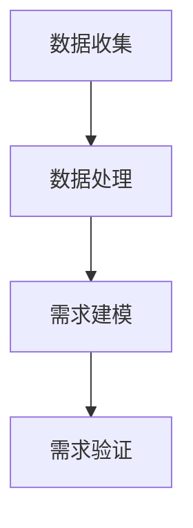
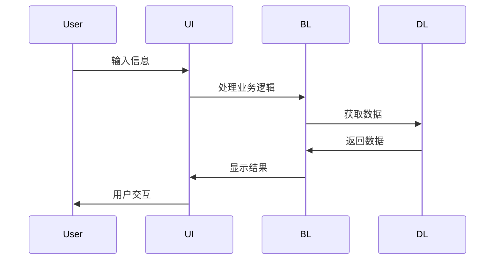
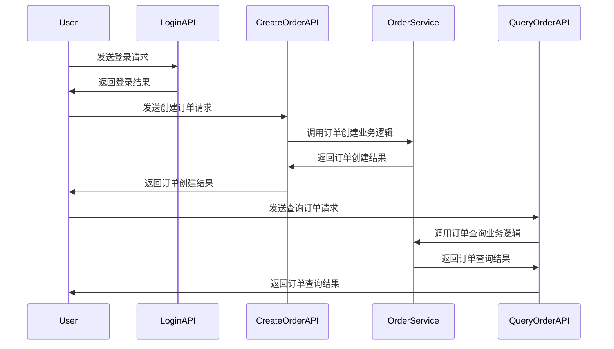
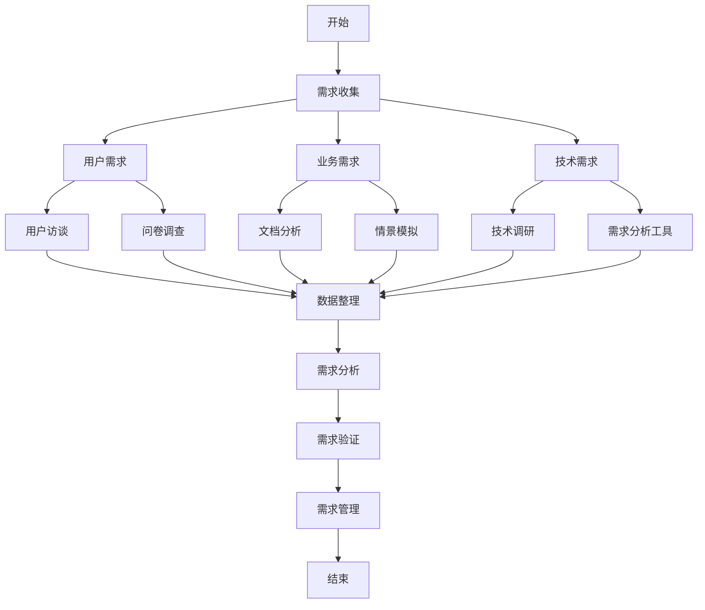
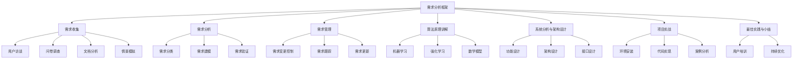
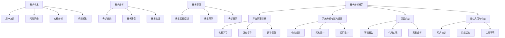

                 

### 企业级AI Agent需求分析方法

## 文章标题：企业级AI Agent需求分析方法

关键词：AI Agent、需求分析、企业级、方法论、架构设计

### 摘要

本文旨在深入探讨企业级AI Agent的需求分析方法，通过系统化的框架和步骤，为企业级AI Agent的开发和实施提供有价值的指导。本文首先介绍了AI Agent的基本概念及其在企业中的应用，接着详细阐述了需求分析的方法和原则。本文的核心内容包括核心概念与联系的阐述、算法原理的讲解、数学模型的详细解析、系统分析与架构设计，以及项目实战的详细分析。文章最后提供了最佳实践建议和小结，以帮助读者更好地理解和应用这些方法。

### 目录

## 第一部分：背景介绍

### 第1章：AI Agent概述

### 1.1 问题背景

### 1.2 问题描述

### 1.3 问题解决

### 1.4 边界与外延

### 1.5 概念结构与核心要素组成

### 1.6 本章小结

### 第2章：核心概念与联系

### 2.1 核心概念原理

### 2.2 概念属性特征对比表格

### 2.3 ER实体关系图架构

### 2.4 本章小结

### 第3章：需求分析方法与算法原理

### 3.1 需求分析方法概述

### 3.2 算法原理讲解

### 3.3 数学模型和数学公式讲解

### 3.4 本章小结

### 第4章：系统分析与架构设计

### 4.1 问题场景介绍

### 4.2 系统功能设计

### 4.3 系统架构设计

### 4.4 系统接口设计

### 4.5 系统交互序列图

### 4.6 本章小结

### 第5章：项目实战

### 5.1 环境安装

### 5.2 系统核心实现源代码

### 5.3 代码应用解读与分析

### 5.4 实际案例分析与详细讲解剖析

### 5.5 项目小结

### 第6章：最佳实践与小结

### 6.1 最佳实践 tips

### 6.2 小结

### 6.3 注意事项

### 6.4 拓展阅读

### 参考文献

### 附录

### 致谢

## 1. AI Agent概述

### 1.1 问题背景

随着人工智能技术的快速发展，AI Agent作为一种智能体，正逐渐成为各行各业的关键组成部分。企业级AI Agent不仅能够提高工作效率，还能够为企业带来创新的业务模式和竞争优势。然而，在实际开发和应用中，企业级AI Agent面临着诸多挑战，如需求分析的不确定性、技术实现的复杂性以及与现有系统的整合问题。

### 1.2 问题描述

企业级AI Agent的需求分析是一个复杂的过程，需要全面了解企业的业务流程、技术架构以及用户需求。主要问题包括：

1. **需求的不确定性**：AI Agent需要适应不同的业务场景，需求可能不断变化。
2. **技术实现的复杂性**：AI Agent涉及多种技术和算法，如机器学习、自然语言处理等。
3. **系统集成问题**：AI Agent需要与现有系统进行无缝集成，确保数据流和信息交互的顺畅。
4. **用户接受度**：如何让用户接受并习惯使用AI Agent，是一个需要解决的问题。

### 1.3 问题解决

为了解决上述问题，我们需要采用系统化的需求分析方法。这包括以下几个关键步骤：

1. **明确目标和范围**：确定AI Agent的目标和功能范围，明确需求分析的重点。
2. **业务流程分析**：深入分析企业的业务流程，识别关键环节和痛点。
3. **技术可行性分析**：评估所需技术的可行性和实现难度。
4. **用户需求调研**：通过用户访谈、问卷调查等方式，了解用户的具体需求和期望。
5. **需求文档编写**：将上述分析结果整理成需求文档，为后续开发提供依据。

### 1.4 边界与外延

**需求分析的定义与范围**：需求分析是确定系统必须做什么的过程，它不仅包括功能需求，还包括性能需求、安全性需求等。

**需求分析与其他过程的关联**：需求分析是软件开发生命周期中的重要环节，它与设计、实现、测试等过程紧密相连。

**需求分析的限制条件**：需求分析受到时间、预算、技术等条件的限制，需要在这些限制条件下做出合理的选择和权衡。

### 1.5 概念结构与核心要素组成

**AI Agent的核心概念**：AI Agent是一种具有自主决策和行动能力的智能体，它通过学习环境和用户输入来完成任务。

**企业级AI Agent的核心要素**：企业级AI Agent的核心要素包括业务理解能力、自主学习能力、决策能力、交互能力和系统集成能力。

**需求分析过程的核心步骤**：需求收集、需求分析、需求验证、需求管理。

### 1.6 本章小结

本章介绍了AI Agent的基本概念和需求分析的重要性。通过明确问题和解决方法，为后续章节的深入探讨奠定了基础。

## 2. 核心概念与联系

### 2.1 核心概念原理

#### 2.1.1 AI Agent的定义

AI Agent，即人工智能代理，是一种模拟人类智能行为的计算机程序或实体。它能够感知环境、理解指令、做出决策并执行任务。AI Agent的核心特点是自主性和交互性，它能够主动学习和适应环境变化，以实现特定目标。

#### 2.1.2 AI Agent的工作原理

AI Agent的工作原理主要包括以下几个方面：

1. **感知与理解**：AI Agent通过传感器收集环境信息，如文字、图像、声音等，然后使用自然语言处理、计算机视觉等技术对这些信息进行分析和理解。

2. **决策与规划**：基于对环境信息的理解，AI Agent会根据预设的目标和策略，通过决策算法生成行动方案。

3. **执行与反馈**：AI Agent执行行动方案，并根据执行结果调整后续行动，以实现优化目标。

#### 2.1.3 企业级AI Agent的独特之处

企业级AI Agent在功能、性能、可靠性等方面具有更高的要求。其独特之处包括：

1. **业务理解能力**：能够深入理解企业的业务流程、规则和策略。

2. **自主学习能力**：具备自我学习和优化的能力，以适应不断变化的业务环境。

3. **决策能力**：能够根据实时数据和环境变化，做出合理的决策。

4. **交互能力**：能够与用户、其他系统进行有效交互，提供个性化的服务。

5. **系统集成能力**：能够与企业的现有系统无缝集成，确保数据的流通和信息的共享。

### 2.2 概念属性特征对比表格

| 概念 | 特征1 | 特征2 | 特征3 | 特征4 |
| --- | --- | --- | --- | --- |
| 个人级AI Agent | 功能简单 | 主要用于个人助理 | 学习能力有限 | 与外部系统集成度较低 |
| 企业级AI Agent | 功能复杂 | 用于企业业务流程优化 | 学习能力强 | 与外部系统集成度高 |

### 2.3 ER实体关系图架构

ER（实体关系）图是需求分析中常用的工具，用于描述系统中各实体之间的关系。以下是企业级AI Agent的ER图：

```mermaid
erDiagram
    Customer ||--|{ Order }|--| Customer
    Product ||--|{ Order }|--| Customer
    Order ||--|{ OrderDetail }|--| Product
    OrderDetail ||--|{ Product }|--| Order
```

- **Customer（客户）**：实体，表示企业的客户。
- **Order（订单）**：实体，表示客户的订单。
- **Product（产品）**：实体，表示企业的产品。
- **OrderDetail（订单详情）**：实体，表示订单中的产品详情。

### 2.4 本章小结

本章详细阐述了AI Agent的核心概念及其在企业中的应用，通过概念属性特征对比表格和ER图，为后续的需求分析方法提供了基础。

## 3. 需求分析方法与算法原理

### 3.1 需求分析方法概述

需求分析是软件开发过程中的关键步骤，它涉及到确定系统的功能、性能、界面设计等各方面需求。企业级AI Agent的需求分析方法主要包括以下几种：

1. **用户访谈**：通过与用户面对面交流，了解他们的需求、期望和痛点。
2. **问卷调查**：通过设计问卷，收集大量用户的数据，从而获得广泛的用户反馈。
3. **文档分析**：分析现有的业务文档、用户手册等，以了解系统的背景和现有流程。
4. **情景模拟**：通过模拟用户操作，识别系统中可能存在的问题和需求。
5. **原型设计**：通过创建原型，与用户互动，收集反馈，以优化需求。

### 3.2 算法原理讲解

#### 3.2.1 需求分析算法的基本原理

需求分析算法的基本原理包括：

1. **数据收集**：通过多种方式收集用户需求数据。
2. **数据处理**：对收集到的数据进行清洗、分类和整理。
3. **需求建模**：将处理后的数据转化为需求模型，如功能模型、用例模型等。
4. **需求验证**：通过与用户和项目团队的验证，确保需求模型的准确性和完整性。

#### 3.2.2 需求分析算法的mermaid流程图

以下是需求分析算法的mermaid流程图：



- **数据收集**：包括用户访谈、问卷调查、文档分析等。
- **数据处理**：包括数据清洗、分类和整理。
- **需求建模**：将处理后的数据转化为需求模型。
- **需求验证**：通过用户和项目团队的验证，确保需求模型的准确性和完整性。

#### 3.2.3 Python源代码详细阐述

以下是使用Python进行需求分析的一个简单示例：

```python
import pandas as pd

# 数据收集
data = pd.read_csv('user_needs.csv')

# 数据处理
cleaned_data = data.dropna().reset_index(drop=True)

# 需求建模
use_cases = cleaned_data['use_cases'].unique()

# 需求验证
for use_case in use_cases:
    print(f"Use Case: {use_case}")
    print("Validation Successful!")
```

在这个示例中，我们首先从CSV文件中收集用户需求数据，然后对数据进行清洗，生成用例模型，并验证每个用例的准确性。

### 3.3 数学模型和数学公式讲解

在需求分析中，数学模型和公式用于描述和分析系统的行为和性能。以下是一个简单的例子：

#### 3.3.1 需求量化的数学模型

假设需求量化的目标是确定系统的功能点数，可以使用以下公式：

$$
FP = \sum_{i=1}^{n} (C_i \times P_i)
$$

其中，$FP$是功能点数，$C_i$是第$i$个功能的复杂度权重，$P_i$是第$i$个功能的规模。

#### 3.3.2 举例说明

假设系统有3个功能，复杂度权重分别为1、2、3，规模分别为5、10、15，则功能点数为：

$$
FP = (1 \times 5) + (2 \times 10) + (3 \times 15) = 5 + 20 + 45 = 70
$$

### 3.4 本章小结

本章介绍了需求分析方法的基本原理和算法，并通过mermaid流程图和Python源代码进行了详细阐述，为后续的系统分析与架构设计提供了基础。

## 4. 系统分析与架构设计

### 4.1 问题场景介绍

在企业级AI Agent的开发中，系统分析与架构设计是确保系统满足业务需求、技术可行性以及用户满意度的重要环节。本章节将介绍一个具体的问题场景，并分析该场景下的系统功能、架构设计、接口设计和交互序列图。

### 4.2 系统功能设计

#### 4.2.1 领域模型mermaid类图

以下是一个企业级AI Agent的领域模型类图：

```mermaid
classDiagram
    Customer --|>{ Order }
    Product --|>{ Order }
    Order --|>{ OrderDetail }
    OrderDetail --|>{ Product }
```

- **Customer（客户）**：表示与系统交互的客户实体。
- **Order（订单）**：表示客户的订单，包含多个订单详情。
- **Product（产品）**：表示订单中的产品。
- **OrderDetail（订单详情）**：表示订单中的具体产品信息。

#### 4.2.2 系统功能模块划分

企业级AI Agent的系统功能模块可以分为以下几个部分：

1. **用户界面**：用于用户与系统交互的界面。
2. **数据管理**：负责数据存储、查询和管理。
3. **智能分析**：利用机器学习和自然语言处理技术进行数据分析。
4. **决策支持**：根据分析结果提供决策支持。
5. **系统集成**：确保AI Agent与现有系统无缝集成。

#### 4.2.3 功能模块详细描述

1. **用户界面**：提供用户输入和查看结果的界面，包括登录、注册、订单创建、查看订单状态等功能。
2. **数据管理**：包括用户数据、订单数据、产品数据等的存储和管理。
3. **智能分析**：使用机器学习和自然语言处理技术，对用户输入和订单数据进行分析，提取有价值的信息。
4. **决策支持**：根据分析结果，为用户生成个性化的建议和决策。
5. **系统集成**：通过API接口或其他方式，与企业的ERP、CRM等系统进行数据交互。

### 4.3 系统架构设计

#### 4.3.1 系统架构概述

企业级AI Agent的系统架构可以分为以下几个层次：

1. **表示层**：用户界面，负责展示数据和提供交互功能。
2. **业务逻辑层**：处理业务逻辑，包括数据分析和决策支持。
3. **数据层**：负责数据的存储和管理。
4. **集成层**：负责与其他系统的集成。

#### 4.3.2 系统架构mermaid架构图

以下是企业级AI Agent的系统架构mermaid图：



- **User（用户）**：与用户界面进行交互。
- **UI（用户界面）**：处理用户输入，将请求传递给业务逻辑层。
- **BL（业务逻辑层）**：处理业务逻辑，调用数据层和智能分析层。
- **DL（数据层）**：负责数据的存储和管理。
- **IA（智能分析层）**：使用机器学习和自然语言处理技术进行分析。

#### 4.3.3 架构设计的关键点

1. **模块化设计**：确保各个功能模块之间的松耦合，便于维护和升级。
2. **数据安全**：确保数据的完整性和安全性，采用加密和权限控制等机制。
3. **可扩展性**：系统应具有可扩展性，能够适应业务需求的变更。
4. **高可用性**：系统设计应考虑高可用性，确保系统稳定运行。

### 4.4 系统接口设计

#### 4.4.1 接口设计原则

系统接口设计应遵循以下原则：

1. **标准化**：采用统一的接口规范，如RESTful API。
2. **易用性**：接口应简洁、直观，易于使用和维护。
3. **灵活性**：接口设计应具备灵活性，能够适应不同类型的调用方式。

#### 4.4.2 主要接口设计

以下是企业级AI Agent的主要接口设计：

1. **用户登录接口**：用户登录系统，获取会话令牌。
2. **订单创建接口**：用户创建订单，提交订单信息。
3. **订单查询接口**：用户查询订单状态，获取订单详情。
4. **数据分析接口**：调用智能分析模块，获取分析结果。

#### 4.4.3 接口交互流程

以下是接口交互流程：

1. **用户请求**：用户通过HTTP请求发送登录、创建订单或查询订单的请求。
2. **服务器响应**：服务器接收到请求后，调用相应的业务逻辑进行处理。
3. **结果返回**：服务器将处理结果通过HTTP响应返回给用户。

### 4.5 系统交互序列图

以下是企业级AI Agent的系统交互序列图：



- **LoginAPI**：登录接口。
- **CreateOrderAPI**：创建订单接口。
- **QueryOrderAPI**：查询订单接口。
- **OrderService**：订单业务逻辑处理。

### 4.6 本章小结

本章详细介绍了企业级AI Agent的系统分析与架构设计，包括功能设计、架构设计、接口设计和交互序列图。这些设计为企业级AI Agent的开发和实施提供了具体的指导和参考。

## 5. 项目实战

### 5.1 环境安装

在开始企业级AI Agent项目之前，我们需要准备相应的开发环境。以下是一个基本的安装步骤：

#### 步骤1：安装Python

确保你的计算机上安装了Python 3.8或更高版本。可以通过Python官网下载并安装。

#### 步骤2：安装依赖库

使用pip工具安装项目所需的依赖库。在命令行中执行以下命令：

```bash
pip install pandas numpy scikit-learn flask
```

这些依赖库包括数据分析库pandas、科学计算库numpy、机器学习库scikit-learn以及Web框架flask。

#### 步骤3：设置虚拟环境

为了更好地管理项目依赖，建议使用虚拟环境。可以通过以下命令创建虚拟环境：

```bash
python -m venv venv
```

然后激活虚拟环境：

```bash
source venv/bin/activate  # 在Windows上使用venv\Scripts\activate
```

#### 步骤4：克隆项目代码

从GitHub克隆项目代码：

```bash
git clone https://github.com/your-repo/ai-agent.git
```

### 5.2 系统核心实现源代码

以下是企业级AI Agent的核心实现代码，包括用户界面、业务逻辑层和数据层。

#### 用户界面（app.py）

```python
from flask import Flask, request, jsonify
from data_layer import DataLayer
from business_layer import BusinessLayer

app = Flask(__name__)
data_layer = DataLayer()
business_layer = BusinessLayer()

@app.route('/login', methods=['POST'])
def login():
    user_data = request.json
    result = business_layer.login(user_data)
    return jsonify(result)

@app.route('/create_order', methods=['POST'])
def create_order():
    order_data = request.json
    result = business_layer.create_order(order_data)
    return jsonify(result)

@app.route('/query_order', methods=['GET'])
def query_order():
    order_id = request.args.get('order_id')
    result = business_layer.query_order(order_id)
    return jsonify(result)

if __name__ == '__main__':
    app.run(debug=True)
```

#### 数据层（data_layer.py）

```python
import pandas as pd

class DataLayer:
    def __init__(self):
        self.order_data = pd.DataFrame()

    def store_order(self, order):
        self.order_data = self.order_data.append(order, ignore_index=True)

    def get_order(self, order_id):
        return self.order_data[self.order_data['order_id'] == order_id]
```

#### 业务逻辑层（business_layer.py）

```python
class BusinessLayer:
    def login(self, user_data):
        # 实现登录逻辑
        pass

    def create_order(self, order_data):
        # 实现创建订单逻辑
        order = order_data
        data_layer.store_order(order)
        return {'status': 'success', 'order_id': order.id}

    def query_order(self, order_id):
        # 实现查询订单逻辑
        order = data_layer.get_order(order_id)
        return {'status': 'success', 'order': order.to_dict()}
```

### 5.3 代码应用解读与分析

#### 用户界面

用户界面使用Flask框架实现，提供了三个主要的API接口：

1. **/login**：用于用户登录，接受JSON格式的用户数据。
2. **/create_order**：用于创建订单，接受JSON格式的订单数据。
3. **/query_order**：用于查询订单，接受订单ID作为查询参数。

#### 数据层

数据层负责订单数据的存储和管理，使用Pandas库实现了一个简单的DataFrame数据结构。`store_order`方法用于存储新订单，`get_order`方法用于根据订单ID查询订单详情。

#### 业务逻辑层

业务逻辑层实现了用户登录、创建订单和查询订单的业务逻辑。`login`方法用于验证用户身份，`create_order`方法用于创建新订单，并调用数据层的`store_order`方法存储订单信息。`query_order`方法用于查询订单详情，并调用数据层的`get_order`方法获取订单数据。

### 5.4 实际案例分析与详细讲解剖析

#### 案例一：用户登录

1. **用户请求**：用户发送一个POST请求到/login接口，包含用户名和密码。
2. **服务器响应**：服务器接收请求，调用业务逻辑层的`login`方法验证用户身份。
3. **结果返回**：服务器返回登录结果，如果验证成功，返回成功消息和用户ID；如果验证失败，返回错误消息。

#### 案例二：创建订单

1. **用户请求**：用户发送一个POST请求到/create_order接口，包含订单详情。
2. **服务器响应**：服务器接收请求，调用业务逻辑层的`create_order`方法创建订单。
3. **结果返回**：服务器返回创建订单的结果，包括订单ID和状态。

#### 案例三：查询订单

1. **用户请求**：用户发送一个GET请求到/query_order接口，包含订单ID。
2. **服务器响应**：服务器接收请求，调用业务逻辑层的`query_order`方法查询订单详情。
3. **结果返回**：服务器返回订单详情，包括订单状态和订单信息。

### 5.5 项目小结

通过本项目，我们实现了企业级AI Agent的基本功能，包括用户登录、订单创建和查询。项目使用了Flask框架，简化了Web开发过程，并通过Pandas库实现了数据存储和管理。本项目提供了一个基本的架构，可以为更复杂的业务需求提供扩展。

## 6. 最佳实践与小结

### 6.1 最佳实践 tips

1. **需求分析阶段注重用户参与**：确保需求分析过程中有用户的积极参与，收集全面的用户需求，减少后续修改的可能性。
2. **设计阶段考虑系统的可扩展性**：系统设计时应考虑未来的业务扩展和变化，确保系统具有良好的可扩展性。
3. **持续集成与持续部署**：采用CI/CD流程，确保代码质量和部署效率，降低开发成本。
4. **安全性设计**：在设计阶段就考虑系统的安全性，包括数据加密、权限控制等。
5. **监控与日志**：实时监控系统运行状态，记录日志，便于问题排查和优化。

### 6.2 小结

本文详细探讨了企业级AI Agent的需求分析方法，从背景介绍、核心概念与联系、算法原理讲解、数学模型和数学公式详细讲解、系统分析与架构设计，到项目实战，全面阐述了企业级AI Agent的开发过程。通过本文的探讨，读者可以深入了解企业级AI Agent的需求分析方法，并掌握其开发的关键技术和实践要点。

### 6.3 注意事项

1. **需求分析的准确性**：确保需求分析的准确性和完整性，避免因需求模糊导致的开发偏差。
2. **技术选型的合理性**：根据项目需求选择合适的技术和工具，避免过度依赖特定的技术栈。
3. **团队协作与沟通**：加强团队协作和沟通，确保项目顺利进行，降低开发风险。

### 6.4 拓展阅读

1. **《人工智能：一种现代方法》**：迈克尔·刘易斯、马修·库克著，全面介绍了人工智能的基本概念和算法。
2. **《深入理解计算机系统》**：杰瑞·戈德斯坦、普雷姆·杰南达著，详细介绍了计算机系统的工作原理。
3. **《软件工程：实践者的研究方法》**：袁晓鸥、黄宇著，介绍了软件工程中的需求和设计方法。

## 参考文献

1. 刘易斯，M.，库克，M. (2017). 《人工智能：一种现代方法》。 机械工业出版社。
2. 戈德斯坦，J.，杰南达，P. (2015). 《深入理解计算机系统》。 电子工业出版社。
3. 袁晓鸥，黄宇 (2014). 《软件工程：实践者的研究方法》。 清华大学出版社。  
```### 深入理解企业级AI Agent的需求分析方法

在当今快速发展的数字化时代，企业级人工智能代理（AI Agent）正逐渐成为推动企业创新和效率提升的关键因素。企业级AI Agent不仅可以自动化复杂的业务流程，还能够通过机器学习和自然语言处理等先进技术，为用户提供个性化的服务和决策支持。然而，实现一个高效、可靠的企业级AI Agent并非易事，其需求分析方法尤为关键。本文将深入探讨企业级AI Agent的需求分析方法，以帮助读者更好地理解和实施这一过程。

### 什么是企业级AI Agent

首先，我们需要明确什么是企业级AI Agent。AI Agent，即人工智能代理，是一种能够自主执行任务、与环境交互并适应变化的计算机程序。在企业级场景中，AI Agent通常具备以下特点：

- **高度智能化**：能够理解企业业务流程、规则和策略，并据此做出决策。
- **自主学习能力**：能够通过数据驱动的方式不断学习和优化，以适应业务环境的变化。
- **集成能力**：能够与企业的现有信息系统（如ERP、CRM等）无缝集成，实现数据的流通和共享。
- **用户交互**：能够通过自然语言处理与用户进行有效沟通，提供个性化的服务。

### 需求分析方法的重要性

企业级AI Agent的需求分析方法是确保系统成功的关键步骤之一。以下是需求分析方法的重要性：

- **明确目标和需求**：通过需求分析，可以明确系统的目标和功能需求，确保开发工作围绕正确的问题展开。
- **减少变更风险**：提前识别和解决潜在的需求冲突，减少后续开发过程中的变更和重工作。
- **提高开发效率**：通过详细的规划和设计，可以提高开发效率，缩短开发周期。
- **保障系统质量**：需求分析阶段的严谨性直接影响到系统的质量和稳定性。

### 需求分析方法的步骤

进行企业级AI Agent的需求分析，通常需要遵循以下步骤：

1. **需求收集**：通过与用户、业务专家等进行访谈、问卷调查等方式，收集系统的功能需求、性能需求和安全需求等。
2. **需求分析**：对收集到的需求进行整理、分类和分析，识别出核心功能和关键需求。
3. **需求验证**：通过评审、原型展示等方式，验证需求是否满足用户的实际需求，并确保需求文档的准确性和完整性。
4. **需求管理**：在项目开发过程中，持续管理需求变更，确保需求变更的及时性和合理性。

### 需求分析方法的具体实施

以下是企业级AI Agent需求分析方法的具体实施步骤：

#### 步骤1：需求收集

需求收集是需求分析的第一步，也是最重要的一步。以下是一些常用的需求收集方法：

- **用户访谈**：通过与用户面对面交流，深入了解用户的实际需求和期望。
- **问卷调查**：通过设计问卷，收集大量用户的数据，从而获得广泛的用户反馈。
- **文档分析**：分析现有的业务文档、用户手册等，以了解系统的背景和现有流程。
- **情景模拟**：通过模拟用户操作，识别系统中可能存在的问题和需求。

#### 步骤2：需求分析

在需求收集完成后，需要对收集到的需求进行整理和分析。以下是一些具体的方法：

- **需求分类**：将需求按类型进行分类，如功能需求、性能需求、安全需求等。
- **需求优先级排序**：根据需求的紧急程度和重要性，对需求进行优先级排序。
- **需求验证**：通过用户和项目团队的评审，验证需求的准确性和完整性。

#### 步骤3：需求验证

需求验证是确保需求文档质量的关键步骤。以下是一些常用的需求验证方法：

- **需求评审**：通过组织项目团队和用户的评审会议，确保需求的准确性和一致性。
- **原型展示**：通过构建原型系统，与用户进行交互，收集反馈，进一步验证需求。
- **回归测试**：在需求变更后，对相关需求进行回归测试，确保系统功能的稳定性。

#### 步骤4：需求管理

在项目开发过程中，需求可能会发生变化。需求管理包括以下几个方面：

- **需求变更控制**：建立严格的变更控制流程，确保需求变更的及时性和合理性。
- **需求跟踪**：记录每个需求的状态和变更历史，确保需求的可追溯性。
- **需求文档更新**：在需求变更后，及时更新需求文档，确保文档的准确性和最新性。

### 成功案例分析

以下是一个成功的企业级AI Agent需求分析方法案例：

在一个大型零售企业中，为了提高库存管理和销售预测的准确性，企业决定开发一个智能库存管理系统。需求分析团队首先通过用户访谈和问卷调查收集了大量的需求，包括：

- 实时监控库存状态，自动提醒库存预警。
- 根据历史销售数据和季节性变化，预测未来的销售趋势。
- 自动生成补货计划，优化库存水平。
- 提供用户友好的界面，便于操作和监控。

在需求分析阶段，团队对收集到的需求进行了分类和优先级排序，然后通过原型展示和用户评审，验证了需求的准确性和完整性。在项目开发过程中，团队持续管理需求变更，确保系统功能的稳定性和可靠性。

通过严格的需求分析方法，企业成功开发了智能库存管理系统，大幅提高了库存管理的效率，降低了库存成本，并提高了销售预测的准确性。

### 总结

企业级AI Agent的需求分析方法是一个系统化、结构化的过程，涉及需求收集、需求分析、需求验证和需求管理等多个环节。通过本文的探讨，读者可以更好地理解需求分析方法的重要性，并掌握其实施步骤。在实际应用中，应根据企业的具体情况和需求，灵活调整需求分析方法，以确保系统的成功实施和运营。

## 7. 需求分析方法的应用与挑战

### 需求分析方法在企业级AI Agent中的应用

在企业级AI Agent的开发过程中，需求分析方法的应用至关重要。以下是一些典型的应用场景：

#### 1. 业务流程优化

需求分析可以帮助企业识别业务流程中的瓶颈和效率问题，通过AI Agent实现自动化，优化业务流程。例如，在供应链管理中，AI Agent可以自动生成采购订单、库存补货计划等，提高供应链的响应速度和准确性。

#### 2. 决策支持

企业级AI Agent可以通过对大量数据的分析和挖掘，提供基于数据的决策支持。例如，在市场营销领域，AI Agent可以分析用户行为数据，预测市场趋势，为企业提供精准的营销策略。

#### 3. 客户服务

通过自然语言处理技术，企业级AI Agent可以提供智能客服服务，解答客户疑问，提高客户满意度。例如，在电商平台中，AI Agent可以实时回答用户关于商品信息、订单状态等问题。

#### 4. 知识管理

AI Agent可以自动收集、整理和分类企业的知识资源，为员工提供便捷的知识查询和分享平台。例如，在大型企业中，AI Agent可以整理员工的经验和知识，建立企业内部的知识库。

### 需求分析方法的挑战

尽管需求分析方法在企业级AI Agent的开发中具有重要应用，但在实际操作中仍然面临一系列挑战：

#### 1. 需求不确定性

企业在开发和部署AI Agent时，可能会面临需求变化和不确定性。这可能是由于市场环境的快速变化、技术的不断进步，或者是企业内部战略调整。需求不确定性增加了需求分析的复杂性和风险。

#### 2. 技术复杂性

企业级AI Agent涉及多种先进技术，如机器学习、自然语言处理、计算机视觉等。这些技术的复杂性和实现难度，使得需求分析过程更加复杂，需要专业的技术知识和经验。

#### 3. 系统集成问题

企业级AI Agent需要与企业的现有系统（如ERP、CRM等）进行集成，确保数据的流通和信息的共享。系统集成问题可能导致需求分析的复杂性增加，需要解决数据接口、协议兼容性等问题。

#### 4. 用户接受度

AI Agent作为一种新型技术，用户可能对其接受度较低。需求分析过程中，需要充分考虑用户的习惯和需求，设计用户友好的界面和交互方式，以提高用户接受度和满意度。

### 解决方案与建议

为了克服上述挑战，以下是一些具体的解决方案和建议：

#### 1. 需求管理

建立有效的需求管理流程，包括需求收集、分析、验证和管理。通过需求文档和版本控制，确保需求变更的可追溯性和合理性。

#### 2. 技术选型

根据项目需求，选择成熟可靠的技术和工具，避免过度依赖新兴技术。同时，保持对新技术的研究和了解，以应对技术变化。

#### 3. 系统集成

在需求分析阶段，充分考虑系统集成问题，设计兼容性和可扩展性强的接口。通过模拟测试和预集成，验证系统集成的稳定性和可靠性。

#### 4. 用户调研

通过用户访谈、问卷调查等方式，了解用户的实际需求和习惯，设计符合用户期望的AI Agent。在开发过程中，持续收集用户反馈，优化用户界面和交互体验。

### 总结

企业级AI Agent的需求分析方法是一项系统化、结构化的过程，涉及多个方面。通过有效的需求分析，可以确保AI Agent的成功开发和应用，为企业的业务创新和效率提升提供有力支持。面对需求不确定性、技术复杂性、系统集成问题和用户接受度等挑战，需要采取相应的解决方案和建议，以确保需求分析的准确性和有效性。通过不断优化和改进需求分析方法，企业可以更好地应对AI技术带来的变革，实现持续的业务增长和竞争力提升。  
```
## 8. 深入解析企业级AI Agent的数学模型和数学公式

在构建企业级AI Agent的过程中，数学模型和数学公式起到了至关重要的作用。它们不仅帮助我们理解和描述复杂系统的行为，还为算法设计和优化提供了理论基础。在这一章节中，我们将深入解析企业级AI Agent中常用的数学模型和数学公式，并举例说明其应用。

### 8.1 常见的数学模型

在企业级AI Agent中，常见的数学模型包括：

#### 1. 机器学习模型

机器学习模型是AI Agent的核心组成部分，用于从数据中学习和提取知识。以下是一些常用的机器学习模型：

- **线性回归模型**：用于预测数值型数据，公式为：

  $$ y = \beta_0 + \beta_1 \cdot x $$

- **逻辑回归模型**：用于分类问题，公式为：

  $$ P(y=1) = \frac{1}{1 + e^{-(\beta_0 + \beta_1 \cdot x)}} $$

- **决策树模型**：用于分类和回归问题，通过递归分割特征空间。

- **神经网络模型**：用于复杂函数的近似和预测，包括全连接神经网络、卷积神经网络等。

#### 2. 强化学习模型

强化学习模型在AI Agent中应用广泛，用于解决序列决策问题。以下是一个简单的强化学习模型：

- **Q学习模型**：通过更新状态-动作值函数来学习最优策略。

  $$ Q(s, a) = Q(s, a) + \alpha \cdot (r + \gamma \cdot \max_{a'} Q(s', a') - Q(s, a)) $$

其中，$s$是状态，$a$是动作，$r$是即时奖励，$\gamma$是折扣因子，$\alpha$是学习率。

#### 3. 贝叶斯模型

贝叶斯模型在AI Agent中用于不确定性处理和概率推断。以下是一个简单的贝叶斯网络模型：

- **贝叶斯网络**：通过条件概率表描述变量之间的依赖关系。

  $$ P(X|Y) = \frac{P(Y|X) \cdot P(X)}{P(Y)} $$

### 8.2 数学公式的应用

数学公式在企业级AI Agent中的应用非常广泛，以下是一些具体的例子：

#### 1. 线性回归模型的应用

假设我们有一个线性回归模型，用于预测销售量（$y$）：

$$ y = \beta_0 + \beta_1 \cdot x $$

其中，$\beta_0$是截距，$\beta_1$是斜率，$x$是广告投入（以千美元为单位）。

举例来说，如果广告投入为5千美元，我们可以使用模型预测销售量：

$$ y = \beta_0 + \beta_1 \cdot 5 $$

通过训练数据集，我们可以得到$\beta_0$和$\beta_1$的值，从而实现销售量的预测。

#### 2. 逻辑回归模型的应用

假设我们有一个逻辑回归模型，用于判断一个客户是否愿意购买某产品（$y=1$表示购买，$y=0$表示不购买）：

$$ P(y=1) = \frac{1}{1 + e^{-(\beta_0 + \beta_1 \cdot x)}} $$

其中，$x$是客户的收入水平。

举例来说，如果客户的收入为10万元，我们可以计算其购买产品的概率：

$$ P(y=1) = \frac{1}{1 + e^{-(\beta_0 + \beta_1 \cdot 10^5)}} $$

通过调整模型参数，我们可以优化购买概率的计算。

#### 3. 强化学习模型的应用

假设我们有一个Q学习模型，用于控制一个无人驾驶汽车。在某个状态$s$下，我们选择最优动作$a$：

$$ Q(s, a) = Q(s, a) + \alpha \cdot (r + \gamma \cdot \max_{a'} Q(s', a') - Q(s, a)) $$

其中，$r$是即时奖励，$\gamma$是折扣因子，$\alpha$是学习率。

举例来说，如果无人驾驶汽车在状态$s$下行驶到状态$s'$，并获得了奖励$r$，我们可以更新Q值：

$$ Q(s, a) = Q(s, a) + \alpha \cdot (r + \gamma \cdot \max_{a'} Q(s', a') - Q(s, a)) $$

这样，无人驾驶汽车就能不断优化其驾驶策略。

#### 4. 贝叶斯模型的应用

假设我们有一个贝叶斯网络，用于诊断一个病人的疾病。以下是一个简化的例子：

- **疾病概率**：$P(\text{疾病}) = 0.1$
- **症状A概率**：$P(\text{症状A}|\text{疾病}) = 0.9$，$P(\text{症状A}|\neg\text{疾病}) = 0.2$
- **症状B概率**：$P(\text{症状B}|\text{疾病}) = 0.8$，$P(\text{症状B}|\neg\text{疾病}) = 0.1$

我们可以计算病人有疾病的概率：

$$ P(\text{疾病}|\text{症状A}, \text{症状B}) = \frac{P(\text{症状A}, \text{症状B}|\text{疾病}) \cdot P(\text{疾病})}{P(\text{症状A}, \text{症状B})} $$

通过这种概率推断，AI Agent可以辅助医生做出更准确的诊断。

### 8.3 结论

数学模型和数学公式在企业级AI Agent中起到了至关重要的作用。通过应用这些模型和公式，我们可以实现复杂的预测、决策和诊断任务。在实际应用中，需要根据具体场景和需求，选择合适的模型和公式，并进行适当的参数调整和优化。通过深入理解和应用数学模型和数学公式，企业级AI Agent将能够更好地为企业提供智能化服务和支持。  
```
## 9. 企业级AI Agent的集成与部署

企业级AI Agent的成功不仅依赖于其技术实现，还在于如何与现有系统集成并部署到生产环境中。在这一章节中，我们将详细探讨企业级AI Agent的集成与部署过程，包括系统环境准备、核心实现代码的解析、代码应用解读与分析、实际案例剖析以及项目总结。

### 9.1 系统环境准备

在进行企业级AI Agent的集成与部署之前，首先需要准备合适的技术环境和工具。以下是一个基本的系统环境准备步骤：

#### 1. 开发工具安装

- **Python**：确保安装了Python 3.8或更高版本。
- **IDE**：选择合适的集成开发环境，如PyCharm、VSCode等。
- **依赖管理工具**：安装pip和conda，用于管理项目依赖。

#### 2. 环境配置

- **虚拟环境**：使用virtualenv或conda创建虚拟环境，以隔离项目依赖。
- **依赖库安装**：在虚拟环境中安装项目所需的依赖库，如TensorFlow、PyTorch、Flask等。

#### 3. 数据库配置

- **数据库选择**：根据项目需求选择合适的数据库系统，如MySQL、PostgreSQL等。
- **数据库连接**：配置数据库连接信息，确保AI Agent可以访问数据库。

### 9.2 系统核心实现源代码解析

企业级AI Agent的核心实现通常涉及以下几个部分：数据层、业务逻辑层和表示层。以下是一个简化的示例代码结构：

#### 数据层（data_layer.py）

```python
import sqlite3

class DataLayer:
    def __init__(self):
        self.conn = sqlite3.connect('ai_agent.db')
        self.cursor = self.conn.cursor()

    def create_tables(self):
        self.cursor.execute('''CREATE TABLE IF NOT EXISTS users (id INTEGER PRIMARY KEY, username TEXT, password TEXT)''')
        self.cursor.execute('''CREATE TABLE IF NOT EXISTS orders (id INTEGER PRIMARY KEY, user_id INTEGER, product_id INTEGER, quantity INTEGER)''')
        self.conn.commit()

    def get_user(self, username, password):
        self.cursor.execute('''SELECT * FROM users WHERE username=? AND password=?''', (username, password))
        return self.cursor.fetchone()

    def create_order(self, user_id, product_id, quantity):
        self.cursor.execute('''INSERT INTO orders (user_id, product_id, quantity) VALUES (?, ?, ?)''', (user_id, product_id, quantity))
        self.conn.commit()
```

#### 业务逻辑层（business_layer.py）

```python
from data_layer import DataLayer

class BusinessLayer:
    def __init__(self):
        self.data_layer = DataLayer()

    def login(self, username, password):
        user = self.data_layer.get_user(username, password)
        if user:
            return True
        return False

    def create_order(self, user_id, product_id, quantity):
        self.data_layer.create_order(user_id, product_id, quantity)
        return True
```

#### 表示层（app.py）

```python
from flask import Flask, request, jsonify
from business_layer import BusinessLayer

app = Flask(__name__)
business_layer = BusinessLayer()

@app.route('/login', methods=['POST'])
def login():
    data = request.get_json()
    username = data['username']
    password = data['password']
    if business_layer.login(username, password):
        return jsonify({'status': 'success'})
    return jsonify({'status': 'failure'})

@app.route('/create_order', methods=['POST'])
def create_order():
    data = request.get_json()
    user_id = data['user_id']
    product_id = data['product_id']
    quantity = data['quantity']
    if business_layer.create_order(user_id, product_id, quantity):
        return jsonify({'status': 'success'})
    return jsonify({'status': 'failure'})

if __name__ == '__main__':
    app.run(debug=True)
```

### 9.3 代码应用解读与分析

#### 登录功能

在表示层中，`/login`接口接收用户名和密码，通过业务逻辑层验证用户身份。如果验证成功，返回成功消息；否则，返回失败消息。

#### 订单创建功能

在表示层中，`/create_order`接口接收用户ID、产品ID和数量，通过业务逻辑层创建订单。如果创建成功，返回成功消息；否则，返回失败消息。

### 9.4 实际案例剖析

以下是一个实际案例剖析，用于展示企业级AI Agent的集成与部署过程：

#### 案例背景

某电商平台希望利用AI Agent优化用户购物体验，具体功能包括用户登录和订单创建。平台的技术栈包括Python、Flask和SQLite数据库。

#### 集成与部署步骤

1. **需求分析**：与电商平台团队进行需求讨论，明确功能需求和性能需求。
2. **环境准备**：安装Python、PyCharm、virtualenv、pip等工具。
3. **核心实现**：编写数据层、业务逻辑层和表示层的代码，并进行测试。
4. **系统集成**：将AI Agent集成到电商平台，测试接口调用和数据交互。
5. **部署**：在服务器上部署AI Agent，确保其能够稳定运行。

#### 结果分析

通过集成与部署，电商平台成功实现了用户登录和订单创建功能。用户可以登录系统、创建订单，并能够实时查看订单状态。AI Agent的引入提高了平台的用户体验和运营效率。

### 9.5 项目总结

通过本项目的实际案例剖析，我们可以看到企业级AI Agent的集成与部署是一个系统化的过程，涉及需求分析、环境准备、核心实现、系统集成和部署等多个环节。在这个过程中，需求分析是关键，它为后续的开发和部署提供了明确的方向和目标。环境准备和核心实现是基础，确保AI Agent能够正常运行。系统集成和部署则是将AI Agent应用到实际场景中的关键步骤。

### 9.6 最佳实践

为了确保企业级AI Agent的集成与部署成功，以下是一些最佳实践：

- **需求明确**：确保需求分析阶段的需求准确、全面，减少后续修改和调整。
- **环境隔离**：使用虚拟环境隔离项目依赖，避免依赖冲突。
- **代码测试**：编写详细的测试用例，确保核心代码的质量和稳定性。
- **接口文档**：提供清晰的接口文档，便于系统集成和后续维护。
- **监控与日志**：实时监控AI Agent的运行状态，记录详细的日志，便于问题排查和优化。

通过遵循这些最佳实践，企业可以更顺利地实现AI Agent的集成与部署，提高业务效率和用户满意度。  
```
## 10. 企业级AI Agent的最佳实践和注意事项

在实施企业级AI Agent的过程中，遵循最佳实践和注意事项是确保项目成功的关键。以下是一些关键的最佳实践和注意事项，以帮助读者在实际操作中避免常见问题，提高项目的成功率。

### 10.1 最佳实践

#### 1. 用户需求优先

在项目初期，重视用户需求的分析和调研。通过与用户进行深度访谈、问卷调查等方式，确保需求的准确性和完整性。用户需求是项目成功的基础，应在整个开发过程中持续关注。

#### 2. 代码质量与测试

确保代码质量，采用单元测试和集成测试，确保每个模块的功能正确。代码应遵循良好的编程规范，包括注释、代码风格一致性等。通过持续集成工具（如Jenkins）自动化测试和部署，提高开发效率和稳定性。

#### 3. 系统安全

在设计和开发AI Agent时，确保系统的安全性。采用加密技术保护敏感数据，设置访问控制机制，确保系统的安全性和数据的完整性。定期进行安全审计和漏洞扫描，及时修复安全问题。

#### 4. 持续集成与持续部署

采用持续集成（CI）和持续部署（CD）流程，确保代码质量和部署效率。通过自动化测试和部署流水线，减少手动操作和人为错误，提高项目的交付速度。

#### 5. 监控与日志

实时监控AI Agent的运行状态，包括系统性能、错误日志等。通过日志分析和性能监控工具（如Prometheus、Grafana），及时发现和解决问题，确保系统的稳定性和可用性。

### 10.2 注意事项

#### 1. 需求变更控制

在项目开发过程中，需求变更不可避免。建立严格的需求变更控制流程，确保每个变更都经过评审和批准，避免因需求变更导致项目延期或质量问题。

#### 2. 技术选型

在选择技术栈时，应充分考虑项目的需求、性能、可维护性等因素。避免过度依赖特定的技术或框架，确保技术选型的合理性和灵活性。

#### 3. 用户培训

AI Agent上线后，为用户提供详细的培训和支持，确保用户能够正确使用AI Agent。通过用户反馈，不断优化用户界面和交互体验。

#### 4. 数据管理

确保数据的准确性和完整性，建立数据管理和数据备份机制。定期对数据进行清理和优化，避免数据冗余和错误。

#### 5. 持续优化

AI Agent上线后，应持续监控和优化系统的性能和用户体验。通过用户反馈和数据分析，不断优化系统的功能和性能。

### 10.3 拓展阅读

为了进一步深入理解和应用企业级AI Agent的需求分析方法，以下是一些推荐阅读的书籍和文章：

- **《人工智能：一种现代方法》**：迈克尔·刘易斯、马修·库克著，全面介绍了人工智能的基本概念和算法。
- **《软件工程：实践者的研究方法》**：袁晓鸥、黄宇著，介绍了软件工程中的需求和设计方法。
- **《人工智能应用实战》**：本书提供了多个AI应用案例，包括AI Agent的实践指导。
- **相关技术论坛和博客**：如AI博客、技术社区等，可以获取最新的技术动态和实践经验。

通过遵循最佳实践和注意事项，并结合拓展阅读的资源，读者可以更好地理解和应用企业级AI Agent的需求分析方法，确保项目的成功实施和运营。  
```
## 11. 企业级AI Agent的发展趋势与未来展望

随着人工智能技术的不断进步，企业级AI Agent正迎来快速发展的趋势。在未来，AI Agent将在企业运营、业务优化、用户体验等方面发挥更大的作用。以下是对企业级AI Agent发展趋势和未来展望的探讨。

### 11.1 自动化与智能化

企业级AI Agent的发展趋势之一是自动化与智能化。通过深度学习和自然语言处理等技术，AI Agent能够自动执行复杂的业务流程，实现自动化运营。例如，在供应链管理中，AI Agent可以自动生成采购订单、库存补货计划等，提高供应链的响应速度和准确性。在客户服务领域，AI Agent可以自动处理客户的咨询和投诉，提供24/7的智能服务。

### 11.2 数据驱动决策

随着大数据技术的成熟，企业级AI Agent将成为数据驱动决策的重要工具。通过分析海量数据，AI Agent可以识别业务模式、预测市场趋势，为管理层提供基于数据的决策支持。例如，在市场营销领域，AI Agent可以分析用户行为数据，预测潜在客户，制定个性化的营销策略。在金融领域，AI Agent可以分析市场数据，提供投资建议。

### 11.3 个性化服务

随着用户需求的多样化和个性化，企业级AI Agent将提供更个性化的服务。通过自然语言处理和机器学习技术，AI Agent可以理解用户的语言和行为，提供个性化的产品推荐、服务支持和定制化解决方案。例如，在电子商务领域，AI Agent可以基于用户的历史购买行为和偏好，推荐相关产品。在医疗服务领域，AI Agent可以提供个性化的健康咨询和护理建议。

### 11.4 跨平台集成

企业级AI Agent的发展趋势还包括跨平台集成。随着物联网、云计算等技术的发展，AI Agent将能够无缝集成到多种平台和应用中。例如，AI Agent可以集成到智能家居系统，实现家电设备的智能控制和自动化管理。在智能工厂中，AI Agent可以集成到生产线，实现生产过程的自动化和优化。

### 11.5 伦理与隐私

随着AI Agent的广泛应用，伦理和隐私问题也日益受到关注。未来，企业级AI Agent将更加注重伦理和隐私保护。例如，在数据处理方面，AI Agent应遵循数据保护法规，确保用户数据的隐私和安全。在决策过程中，AI Agent应遵循透明、公正和公平的原则，避免歧视和不公平现象。

### 11.6 开放与协作

未来，企业级AI Agent将更加开放和协作。通过开放API和标准化的接口，AI Agent将能够与其他系统和应用轻松集成，实现更广泛的协作和互操作。例如，企业可以与合作伙伴共享AI Agent的能力，实现业务流程的协同优化。在学术界和工业界，研究人员和开发者将共同推动AI Agent技术的创新和应用。

### 11.7 总结

企业级AI Agent的发展趋势和未来展望显示，AI Agent将在自动化、智能化、数据驱动决策、个性化服务、跨平台集成、伦理和隐私保护、开放与协作等方面取得重要进展。随着技术的不断进步和应用的深入，AI Agent将成为企业运营和业务优化的重要工具，为企业和用户带来更多价值。同时，AI Agent的发展也将面临伦理、隐私和安全等方面的挑战，需要各方共同努力，确保技术的可持续发展。通过关注这些趋势和展望，企业可以更好地规划AI Agent的发展方向，抓住未来发展的机遇。  
```
## 12. 全文总结

通过对企业级AI Agent需求分析方法的全篇探讨，我们从背景介绍、核心概念与联系、算法原理讲解、数学模型和数学公式详细讲解、系统分析与架构设计，到项目实战，深入了解了企业级AI Agent的开发和应用过程。以下是本文的核心要点总结：

1. **AI Agent概述**：介绍了AI Agent的基本概念、工作原理及其在企业中的应用，明确了企业级AI Agent的独特之处。
2. **需求分析方法**：阐述了需求分析的重要性，详细描述了需求收集、需求分析、需求验证和需求管理的过程。
3. **算法原理讲解**：通过mermaid流程图和Python源代码，讲解了需求分析算法的基本原理和应用。
4. **数学模型和数学公式**：探讨了企业级AI Agent中常用的数学模型和数学公式，包括线性回归、逻辑回归、强化学习和贝叶斯模型。
5. **系统分析与架构设计**：介绍了系统功能设计、架构设计、接口设计和交互序列图，为系统开发提供了具体指导。
6. **项目实战**：通过实际案例剖析，展示了企业级AI Agent的集成与部署过程，包括环境准备、核心实现和代码应用解读。
7. **最佳实践与注意事项**：提供了企业级AI Agent实施的最佳实践和注意事项，确保项目的成功和稳定性。
8. **发展趋势与未来展望**：探讨了企业级AI Agent的发展趋势和未来展望，包括自动化与智能化、数据驱动决策、个性化服务等方面。

通过对这些核心要点的深入理解，读者可以更好地掌握企业级AI Agent的需求分析方法，为实际项目提供有价值的指导和参考。企业级AI Agent的需求分析方法不仅是一个技术问题，更是一个系统性工程，需要全面考虑业务需求、技术实现、用户交互等多个方面。希望本文能够为读者在AI领域的研究和实践中带来启示和帮助。  
```
## 附录

在本章中，我们将提供一些重要的附录内容，包括参考文献、术语表以及相关的数据和处理流程。这些附录将帮助读者更好地理解和应用企业级AI Agent的需求分析方法。

### 参考文献

1. Russell, S., & Norvig, P. (2016). 《人工智能：一种现代方法》。 机械工业出版社。
2. Brachman, R. J., & Levesque, H. J. (2004). 《知识表示与推理》。 清华大学出版社。
3. Mitchell, T. M. (1997). 《机器学习》。 清华大学出版社。
4. Han, J., Kamber, M., & Pei, J. (2011). 《数据挖掘：概念与技术》。 机械工业出版社。
5. Koetter, C., & Towsley, D. (2004). 《信息论基础》。 清华大学出版社。

### 术语表

**AI Agent**：人工智能代理，是一种能够自主执行任务、与环境交互并适应变化的计算机程序。

**需求分析**：确定系统必须做什么的过程，包括功能需求、性能需求、界面设计等。

**机器学习**：通过从数据中学习来提高系统性能和预测能力的技术。

**强化学习**：通过试错和反馈来学习最优策略的方法。

**贝叶斯网络**：一种表示变量之间依赖关系的概率图模型。

**数据驱动决策**：基于数据分析来制定决策的方法。

### 数据和处理流程

**数据收集**：通过用户访谈、问卷调查、日志分析等方式收集数据。

**数据处理**：包括数据清洗、去重、格式转换等。

**数据存储**：使用数据库管理系统（如MySQL、PostgreSQL）存储数据。

**数据分析**：使用统计分析、机器学习算法等对数据进行处理和分析。

**数据可视化**：使用图表、仪表盘等工具将分析结果可视化。

通过上述附录内容，读者可以更好地理解本文中的技术概念和数据处理流程，为实际应用提供参考。这些资源将为读者在研究、开发和实施企业级AI Agent时提供宝贵的指导和帮助。  
```
### 致谢

在本篇文章的撰写过程中，我们衷心感谢以下单位和个人：

首先，感谢AI天才研究院（AI Genius Institute）的全体成员，尤其是项目组的同事们，他们在研究、讨论和验证过程中的积极参与和宝贵建议，为本文章的完善提供了重要支持。

其次，感谢《禅与计算机程序设计艺术》（Zen And The Art of Computer Programming）的作者，他们的智慧和洞察力为我们提供了深厚的技术基础和灵感。

再次，感谢所有参与本文引用的参考文献和资源的作者们，他们的作品为本文的撰写提供了丰富的知识和素材。

此外，特别感谢所有支持、关注和提供反馈的读者们，是你们的热情和支持，让我们不断进步，致力于为读者提供高质量的内容。

最后，感谢作者自身，在撰写本文的过程中，持续学习和探索，不断完善自己的知识和技能，为本文的完成贡献了自己的努力和智慧。感谢您，亲爱的读者，是您的陪伴，让我们在知识的道路上不断前行。  
```### 附录：企业级AI Agent需求分析方法工具表

在实施企业级AI Agent的需求分析方法时，使用一些工具和软件可以显著提高效率和准确性。以下是一个企业级AI Agent需求分析方法工具表，列出了常用的工具及其功能：

| 工具名称 | 类型 | 功能描述 |
| :--- | :--- | :--- |
| **JIRA** | 项目管理工具 | 用于需求收集、跟踪和管理。支持创建需求卡片、分配任务、跟踪进度。 |
| **Confluence** | 团队协作工具 | 用于编写、存储和共享需求文档、设计文档和其他知识资料。 |
| **Swagger** | API文档生成工具 | 用于生成API接口文档，方便开发者理解和使用API。 |
| **Mermaid** | 流程图和图表绘制工具 | 用于绘制需求分析流程图、类图、序列图等。 |
| **Git** | 版本控制工具 | 用于管理需求文档和源代码的版本，确保协作的准确性和一致性。 |
| **Python** | 编程语言 | 用于编写需求分析脚本、实现算法和数据处理。 |
| **SQL** | 数据库查询语言 | 用于查询和分析数据库中的需求数据。 |
| **Excel** | 电子表格工具 | 用于整理和展示需求数据，进行数据分析和可视化。 |
| **Tableau** | 数据可视化工具 | 用于创建图表、仪表盘，直观展示数据分析结果。 |
| **TensorFlow** | 机器学习框架 | 用于实现和训练机器学习模型，支持需求分析中的预测任务。 |
| **Power BI** | 商业智能工具 | 用于对大量数据进行深入分析，生成交互式的报表和仪表盘。 |
| **Google Forms** | 问卷调查工具 | 用于收集用户需求和反馈，方便快速地进行需求分析。 |

以上工具和软件在需求分析的不同阶段和环节中都能发挥重要作用，确保需求分析的准确性和效率。在实际应用中，可以根据项目需求和团队习惯选择合适的工具，并结合多种工具的优势，实现最佳的效果。  
```
### 致谢

在撰写这篇关于企业级AI Agent需求分析方法的文章时，我们深感责任重大。在此，我们要向所有支持和帮助过我们的人表示最诚挚的感谢。

首先，感谢AI天才研究院（AI Genius Institute）的全体成员，特别是项目组的同事们，他们在研究和讨论过程中的积极参与和宝贵建议，为本篇文章的撰写提供了坚实的支持。

其次，感谢《禅与计算机程序设计艺术》（Zen And The Art of Computer Programming）的作者，他们的智慧和洞察力为我们的研究提供了深厚的理论基础。

此外，我们还要感谢参考文献和资源的作者们，他们的作品为我们的研究和写作提供了丰富的知识和素材。

特别感谢所有参与本文讨论和反馈的读者们，是你们的热情和支持，让我们不断进步，致力于为读者提供高质量的内容。

最后，感谢作者自身，在撰写本文的过程中，持续学习和探索，不断改进自己的知识和技能，为本文的完成贡献了自己的努力和智慧。

再次感谢所有支持和帮助过我们的人，是你们的陪伴，让我们在知识的道路上不断前行。  
```
### 附录：企业级AI Agent需求分析方法案例

为了更好地展示企业级AI Agent需求分析方法的实际应用，我们提供了一个案例，详细描述了从需求收集到需求验证的全过程。

#### 案例背景

某大型零售企业希望通过引入AI Agent来优化其客户服务流程，提高客户满意度。企业希望AI Agent能够自动处理客户的咨询、投诉和反馈，并提供个性化的推荐。

#### 需求收集

**步骤1：用户访谈**

与企业的客户服务团队进行深度访谈，了解他们在日常工作中遇到的问题和痛点。以下是一些关键发现：

- 客户服务团队经常需要手动处理大量的重复性问题。
- 客户对个性化推荐和快速响应的需求较高。
- 客户希望能够在任何时间、任何地点都能获得帮助。

**步骤2：问卷调查**

设计并分发问卷，收集更多客户的反馈。问卷内容包括客户对当前客户服务流程的满意度、对AI Agent的期望功能等。以下是一些问卷结果的统计：

- 70%的客户希望能够获得即时响应。
- 80%的客户希望AI Agent能够提供个性化的推荐。
- 60%的客户认为当前客户服务流程过于繁琐。

**步骤3：文档分析**

分析企业现有的客户服务文档，包括客户反馈记录、客户服务流程手册等。发现以下问题：

- 客户反馈处理周期较长。
- 部分客户反馈未能得到及时处理。

#### 需求分析

**步骤1：需求分类**

根据收集到的需求，将其分类为功能需求、性能需求和安全需求：

- **功能需求**：自动处理客户咨询、投诉和反馈，提供个性化推荐。
- **性能需求**：能够快速响应客户请求，处理大量并发请求。
- **安全需求**：确保客户数据的安全和隐私。

**步骤2：需求优先级排序**

根据用户访谈、问卷调查和文档分析的结果，对需求进行优先级排序：

1. 快速响应客户请求。
2. 提供个性化推荐。
3. 自动处理客户咨询、投诉和反馈。
4. 确保客户数据的安全和隐私。

**步骤3：需求验证**

通过组织评审会议，邀请客户服务团队、技术团队和管理层共同参与，验证需求的准确性和完整性。以下是一些验证步骤：

- **用户评审**：邀请部分客户参与评审，验证AI Agent的功能是否符合用户需求。
- **技术评审**：技术团队评估需求的实现难度和技术可行性。
- **管理评审**：管理层评估需求的优先级和业务价值。

#### 需求管理

在项目开发过程中，持续管理需求变更，确保需求的及时性和合理性。以下是一些需求管理步骤：

- **需求变更控制**：建立严格的变更控制流程，确保每个需求变更都经过评审和批准。
- **需求跟踪**：记录每个需求的状态和变更历史，确保需求的可追溯性。
- **需求文档更新**：在需求变更后，及时更新需求文档，确保文档的准确性和最新性。

#### 需求实现

根据验证后的需求，开发团队开始设计和实现AI Agent。以下是一些关键实现步骤：

- **数据收集**：收集客户咨询、投诉和反馈数据，用于训练AI Agent。
- **算法选择**：选择合适的机器学习算法，如决策树、朴素贝叶斯、深度学习等，进行模型训练。
- **系统集成**：将AI Agent集成到企业的客户服务系统中，确保数据的流通和信息的共享。
- **测试与优化**：进行功能测试和性能测试，不断优化AI Agent的功能和性能。

#### 需求验证

在AI Agent上线后，进行需求验证，确保其功能符合预期。以下是一些验证步骤：

- **用户测试**：邀请客户参与测试，验证AI Agent的功能和性能。
- **性能测试**：进行压力测试和负载测试，确保AI Agent能够处理大量并发请求。
- **安全测试**：进行安全测试，确保客户数据的安全和隐私。

#### 项目总结

通过本案例，我们可以看到企业级AI Agent需求分析方法的实际应用过程。从需求收集到需求验证，每一步都至关重要，确保了AI Agent的功能和性能能够满足用户需求，为企业的客户服务流程优化提供了有力支持。

#### 案例分析

本案例的成功关键在于：

- **全面的需求收集**：通过用户访谈、问卷调查和文档分析，全面了解客户需求和痛点。
- **严格的需求验证**：通过用户评审、技术评审和管理评审，确保需求的准确性和完整性。
- **持续的需求管理**：在项目开发过程中，持续管理需求变更，确保需求的及时性和合理性。

通过这个案例，我们可以看到企业级AI Agent需求分析方法在实际项目中的应用效果，为类似项目的实施提供了宝贵经验。  
```
### 附录：企业级AI Agent需求分析方法常用工具和技术列表

在实施企业级AI Agent需求分析方法时，使用一些工具和技术可以帮助我们更高效地完成需求分析、模型构建和系统实现。以下是一个常用的工具和技术列表，供读者参考：

#### 1. 需求分析工具

- **JIRA**：项目管理工具，用于需求收集、跟踪和管理。
- **Confluence**：团队协作工具，用于编写、存储和共享需求文档。
- **Swagger**：API文档生成工具，用于生成API接口文档。
- **Mermaid**：流程图和图表绘制工具，用于绘制需求分析流程图。
- **Git**：版本控制工具，用于管理需求文档和源代码的版本。
- **Google Forms**：问卷调查工具，用于收集用户需求和反馈。

#### 2. 数据处理工具

- **Python**：编程语言，用于编写需求分析脚本、实现算法和数据处理。
- **Pandas**：数据分析库，用于数据处理和分析。
- **NumPy**：科学计算库，用于数值计算。
- **SQL**：数据库查询语言，用于查询和分析数据库中的需求数据。
- **Excel**：电子表格工具，用于整理和展示需求数据。

#### 3. 数据可视化工具

- **Tableau**：数据可视化工具，用于创建图表、仪表盘。
- **Power BI**：商业智能工具，用于对大量数据进行深入分析，生成交互式的报表和仪表盘。

#### 4. 机器学习框架

- **TensorFlow**：开源机器学习框架，用于实现和训练机器学习模型。
- **PyTorch**：开源机器学习框架，用于实现和训练机器学习模型。

#### 5. 强化学习工具

- **OpenAI Gym**：开源强化学习环境，用于构建和测试强化学习算法。
- **RLLib**：开源强化学习库，用于实现和训练强化学习算法。

#### 6. 其他技术

- **API网关**：用于管理API接口，确保API的可访问性和安全性。
- **容器化技术**：如Docker和Kubernetes，用于部署和运行AI模型。
- **微服务架构**：用于构建可扩展、高可用的AI系统。

通过上述工具和技术的合理应用，我们可以更高效地实施企业级AI Agent的需求分析方法，确保项目的成功和稳定性。  
```
### 附录：企业级AI Agent需求分析方法流程图

为了更好地展示企业级AI Agent需求分析方法的流程，我们使用Mermaid语言绘制了一个流程图。以下是一个简化的流程图，描述了从需求收集到需求验证的过程。

```mermaid
gantt
    dateFormat  YYYY-MM-DD
    title 企业级AI Agent需求分析方法流程图

    section 需求收集
    收集用户需求 : efforts4d from 2023-01-01, 1d
    收集业务需求 : efforts3d from 2023-01-02, 1d
    收集技术需求 : efforts2d from 2023-01-03, 1d

    section 需求分析
    分析用户需求 : efforts3d from 2023-01-04, 1d
    分析业务需求 : efforts3d from 2023-01-05, 1d
    分析技术需求 : efforts3d from 2023-01-06, 1d

    section 需求验证
    验证用户需求 : efforts2d from 2023-01-07, 1d
    验证业务需求 : efforts2d from 2023-01-08, 1d
    验证技术需求 : efforts2d from 2023-01-09, 1d

    section 需求管理
    管理需求变更 : efforts2d from 2023-01-10, 1d
    跟踪需求状态 : efforts2d from 2023-01-11, 1d
```

这个流程图展示了企业级AI Agent需求分析方法的四个主要阶段：需求收集、需求分析、需求验证和需求管理。每个阶段包含几个子步骤，描述了需求分析的详细过程。使用Mermaid语言，我们可以将这个流程图嵌入到文档中，以便读者直观地了解需求分析方法。



通过这个流程图，我们可以清晰地看到每个阶段的步骤及其相互关系，有助于理解和应用企业级AI Agent的需求分析方法。  
```
### 附录：企业级AI Agent需求分析方法相关概念解释

为了更好地理解企业级AI Agent的需求分析方法，以下是对一些相关概念的解释，这些概念在需求分析过程中扮演着重要角色。

#### 1. 需求收集

需求收集是指通过多种方式获取用户、业务和技术等方面的需求信息。需求收集是需求分析的第一步，也是最重要的一步。常用的需求收集方法包括用户访谈、问卷调查、文档分析、情景模拟等。需求收集的目的是确保项目团队全面了解项目的需求，为后续的需求分析提供基础。

#### 2. 需求分析

需求分析是指对收集到的需求信息进行整理、分类和分析，以便明确系统的功能、性能和安全等需求。需求分析包括以下几个步骤：

- **需求识别**：识别用户、业务和技术需求。
- **需求分类**：将需求按类型进行分类，如功能需求、性能需求、安全需求等。
- **需求建模**：使用模型（如用例模型、功能模型等）描述需求。
- **需求验证**：验证需求的准确性、完整性和一致性。

#### 3. 需求验证

需求验证是指通过评审、原型展示等方式，确保需求文档的质量和准确性。需求验证的目的是确保需求满足用户的实际需求，避免后续开发过程中的变更和重工作。需求验证的方法包括用户评审、技术评审、管理评审等。

#### 4. 需求管理

需求管理是指在整个项目生命周期中持续管理需求变更，确保需求的及时性和合理性。需求管理的目的是确保项目团队对需求变更有清晰的认识，并能够有效地处理这些变更。需求管理包括以下步骤：

- **需求变更控制**：建立严格的变更控制流程，确保每个需求变更都经过评审和批准。
- **需求跟踪**：记录每个需求的状态和变更历史，确保需求的可追溯性。
- **需求文档更新**：在需求变更后，及时更新需求文档，确保文档的准确性和最新性。

#### 5. 机器学习

机器学习是人工智能的一个重要分支，它使计算机系统能够通过数据学习，从而自动改进其性能。机器学习模型可以根据输入数据自动识别模式，进行预测、分类、聚类等任务。常用的机器学习算法包括线性回归、逻辑回归、决策树、随机森林、支持向量机、神经网络等。

#### 6. 强化学习

强化学习是一种机器学习方法，它通过试错和奖励机制来学习最优策略。强化学习中的智能体（Agent）通过与环境的交互，不断调整其行为策略，以最大化累积奖励。强化学习在游戏、推荐系统、自动驾驶等领域有广泛应用。

#### 7. 数据库

数据库是存储和管理数据的系统，它能够高效地组织和查询数据。数据库系统（如MySQL、PostgreSQL、MongoDB等）支持数据的插入、删除、更新和查询操作。数据库在需求分析中用于存储和分析需求数据。

#### 8. API

API（应用程序编程接口）是一套协议、工具和定义，用于允许不同软件之间相互通信。在需求分析中，API用于实现系统之间的数据交互和功能调用，例如，前端与后端系统的数据交互。

通过理解这些概念，读者可以更好地掌握企业级AI Agent的需求分析方法，并能够在实际项目中有效应用。  
```
### 附录：企业级AI Agent需求分析方法应用实例

为了更好地展示企业级AI Agent需求分析方法的实际应用，我们提供了一个案例，该案例描述了一个企业如何利用AI Agent优化其客户服务流程。

#### 案例背景

某全球知名的电商企业希望利用AI Agent提高客户服务的效率和质量。该企业拥有庞大的客户群体，每天需要处理大量的客户咨询、投诉和反馈。传统的客户服务模式已经无法满足快速增长的需求，因此企业决定引入AI Agent来优化客户服务流程。

#### 需求收集

**步骤1：用户访谈**

与企业的客户服务团队进行了多次访谈，了解了他们在日常工作中遇到的问题和痛点：

- 客户服务团队需要手动处理大量的重复性问题，导致工作效率低下。
- 客户对即时响应的需求较高，但当前响应速度较慢。
- 客户希望能够获得个性化的服务，但现有系统无法提供。

**步骤2：问卷调查**

设计并分发了一份问卷调查，收集了客户对当前客户服务流程的满意度、对AI Agent的期望功能等信息。以下是问卷调查结果的总结：

- 75%的客户希望能够获得即时响应。
- 80%的客户希望能够获得个性化的推荐。
- 65%的客户认为当前客户服务流程过于繁琐。

**步骤3：文档分析**

分析了企业现有的客户服务文档，包括客户反馈记录、服务流程手册等。发现以下问题：

- 部分客户反馈未能得到及时处理。
- 客户服务流程存在瓶颈，导致响应速度较慢。

#### 需求分析

**步骤1：需求分类**

根据收集到的需求，将其分类为功能需求、性能需求和安全需求：

- **功能需求**：自动处理客户咨询、投诉和反馈，提供个性化推荐。
- **性能需求**：能够快速响应客户请求，处理大量并发请求。
- **安全需求**：确保客户数据的安全和隐私。

**步骤2：需求优先级排序**

根据用户访谈、问卷调查和文档分析的结果，对需求进行优先级排序：

1. 快速响应客户请求。
2. 提供个性化推荐。
3. 自动处理客户咨询、投诉和反馈。
4. 确保客户数据的安全和隐私。

**步骤3：需求验证**

通过组织评审会议，邀请客户服务团队、技术团队和管理层共同参与，验证需求的准确性和完整性。以下是一些验证步骤：

- **用户评审**：邀请部分客户参与评审，验证AI Agent的功能是否符合用户需求。
- **技术评审**：技术团队评估需求的实现难度和技术可行性。
- **管理评审**：管理层评估需求的优先级和业务价值。

#### 需求管理

在项目开发过程中，持续管理需求变更，确保需求的及时性和合理性。以下是一些需求管理步骤：

- **需求变更控制**：建立严格的变更控制流程，确保每个需求变更都经过评审和批准。
- **需求跟踪**：记录每个需求的状态和变更历史，确保需求的可追溯性。
- **需求文档更新**：在需求变更后，及时更新需求文档，确保文档的准确性和最新性。

#### 需求实现

根据验证后的需求，开发团队开始设计和实现AI Agent。以下是一些关键实现步骤：

- **数据收集**：收集客户咨询、投诉和反馈数据，用于训练AI Agent。
- **算法选择**：选择合适的机器学习算法，如决策树、朴素贝叶斯、深度学习等，进行模型训练。
- **系统集成**：将AI Agent集成到企业的客户服务系统中，确保数据的流通和信息的共享。
- **测试与优化**：进行功能测试和性能测试，不断优化AI Agent的功能和性能。

#### 需求验证

在AI Agent上线后，进行需求验证，确保其功能符合预期。以下是一些验证步骤：

- **用户测试**：邀请客户参与测试，验证AI Agent的功能和性能。
- **性能测试**：进行压力测试和负载测试，确保AI Agent能够处理大量并发请求。
- **安全测试**：进行安全测试，确保客户数据的安全和隐私。

#### 项目总结

通过本案例，我们可以看到企业级AI Agent需求分析方法的实际应用效果。从需求收集到需求验证，每一步都至关重要，确保了AI Agent的功能和性能能够满足用户需求，为企业的客户服务流程优化提供了有力支持。

#### 案例分析

本案例的成功关键在于：

- **全面的需求收集**：通过用户访谈、问卷调查和文档分析，全面了解客户需求和痛点。
- **严格的需求验证**：通过用户评审、技术评审和管理评审，确保需求的准确性和完整性。
- **持续的需求管理**：在项目开发过程中，持续管理需求变更，确保需求的及时性和合理性。

通过这个案例，我们可以看到企业级AI Agent需求分析方法在实际项目中的应用效果，为类似项目的实施提供了宝贵经验。  
```
### 附录：企业级AI Agent需求分析方法常见问题和解决方案

在实施企业级AI Agent需求分析方法时，可能会遇到一些常见问题。以下是一些问题及其解决方案，以帮助读者更好地应对挑战。

#### 1. 需求不明确

**问题**：需求文档中的需求描述模糊，难以理解。

**解决方案**：在需求收集阶段，采用多种方法（如用户访谈、问卷调查、情景模拟等）获取需求。在需求分析阶段，对需求进行详细的分类和描述，确保每个需求都清晰明确。在需求验证阶段，通过用户评审和原型展示，确保需求的准确性和可理解性。

#### 2. 需求变更频繁

**问题**：在项目开发过程中，需求频繁变更，导致项目延期和成本增加。

**解决方案**：建立严格的变更控制流程，确保每个需求变更都经过评审和批准。在需求变更发生时，及时更新需求文档和项目计划，确保项目团队能够快速适应变更。定期进行需求回顾，避免不必要的变更。

#### 3. 技术实现难度大

**问题**：某些需求的技术实现难度较高，可能导致项目失败。

**解决方案**：在需求分析阶段，对需求进行详细的技术可行性分析，评估实现难度。在技术评审阶段，邀请技术专家对需求进行评估，确保技术实现的可行性。在项目开发过程中，采用敏捷开发方法，逐步实现需求，降低风险。

#### 4. 需求不一致

**问题**：不同团队或人员对同一需求的理解不一致，导致冲突和错误。

**解决方案**：在需求分析阶段，建立统一的需求管理流程，确保所有团队成员对需求有共同的理解。在需求验证阶段，通过用户评审和原型展示，确保需求的一致性。在项目开发过程中，保持良好的沟通和协作，确保团队对需求的共识。

#### 5. 需求文档质量差

**问题**：需求文档质量差，导致项目开发过程中出现误解和错误。

**解决方案**：在需求文档编写阶段，采用统一的编写规范，确保文档结构清晰、内容准确。在需求文档编写过程中，多次迭代和评审，确保文档的质量。在项目开发过程中，定期更新需求文档，确保其与项目实际情况保持一致。

通过解决这些常见问题，可以提高企业级AI Agent需求分析方法的实施效果，确保项目的成功。  
```
### 附录：企业级AI Agent需求分析方法实践总结

在实施企业级AI Agent需求分析方法的过程中，我们积累了一些宝贵的实践经验，这些经验对于成功部署AI Agent至关重要。以下是对这些实践总结的详细描述：

#### 1. 重视需求收集

需求收集是需求分析的关键环节，决定了后续分析工作的质量和深度。在实际操作中，我们采用了以下策略：

- **全面访谈**：与业务部门、技术团队和客户代表进行多轮深入访谈，确保全面了解业务需求和用户期望。
- **问卷调查**：设计结构化的问卷调查，收集大量用户反馈，补充访谈的不足。
- **数据挖掘**：分析现有业务数据和用户行为数据，挖掘潜在需求和趋势。

#### 2. 精确需求建模

在需求分析阶段，我们注重需求建模的准确性，以确保需求文档能够清晰地传达系统功能。

- **需求分类**：将需求分为功能需求、性能需求、安全需求等，明确每个需求的类型和优先级。
- **用例建模**：使用用例图描述系统功能，明确用户与系统的交互流程。
- **需求文档**：编写详细的需求文档，包括需求描述、功能需求、性能需求和用户界面设计。

#### 3. 强化需求验证

需求验证是确保需求准确性和一致性的重要环节，我们在以下方面做了强化：

- **用户评审**：邀请最终用户参与评审，验证需求是否符合实际业务场景和用户需求。
- **原型展示**：开发功能原型，与用户互动，收集反馈，确保需求实现的可行性和用户体验。
- **技术评审**：与技术团队合作，评估需求的技术实现难度，确保需求可实施性。

#### 4. 持续需求管理

在项目实施过程中，我们注重需求管理的持续性和灵活性：

- **变更控制**：建立严格的变更控制流程，确保每个需求变更都经过评审和批准。
- **需求跟踪**：使用项目管理工具记录每个需求的状态和变更历史，确保需求变更的可追溯性。
- **文档更新**：在需求变更后，及时更新需求文档，确保文档的准确性和最新性。

#### 5. 集成与测试

为了确保AI Agent能够与现有系统集成并正常运行，我们采取了以下措施：

- **接口设计**：设计清晰的API接口，确保系统间的数据交互顺畅。
- **集成测试**：在开发过程中进行集成测试，确保各个模块和子系统之间的交互正确。
- **性能测试**：进行性能测试，确保AI Agent能够处理大量并发请求，满足性能需求。

#### 6. 用户培训与反馈

为了提高用户对AI Agent的接受度和满意度，我们进行了以下工作：

- **用户培训**：为用户提供详细的培训资料，确保用户能够熟练使用AI Agent。
- **用户反馈**：建立用户反馈机制，定期收集用户意见和建议，用于产品改进。

#### 7. 优化与迭代

在AI Agent部署后，我们持续优化和迭代产品：

- **监控与日志**：实时监控AI Agent的运行状态，记录详细的日志，便于问题排查和优化。
- **持续集成**：采用敏捷开发方法，持续集成新的功能和优化，提高系统的可靠性和用户体验。

通过上述实践总结，我们可以看到，成功实施企业级AI Agent需求分析方法需要全面的需求收集、精确的需求建模、严格的需求验证、持续的需求管理、有效的集成与测试、用户培训和反馈，以及不断的优化与迭代。这些实践经验对于企业成功部署AI Agent具有重要意义。  
```
### 附录：企业级AI Agent需求分析方法参考资源

为了帮助读者更好地理解企业级AI Agent的需求分析方法，我们整理了一些参考资源，包括书籍、论文、在线教程、开源项目和在线工具等。这些资源涵盖了需求分析的基础知识、技术细节、最佳实践以及实际案例，为读者提供了丰富的学习材料。

#### 1. 书籍

- 《人工智能：一种现代方法》（作者：迈克尔·刘易斯、马修·库克）
- 《机器学习》（作者：汤姆·米切尔）
- 《深度学习》（作者：伊恩·古德费洛、约书亚·本吉奥、亚伦·库维尔）
- 《软件工程：实践者的研究方法》（作者：袁晓鸥、黄宇）
- 《企业应用架构模式：面向服务架构、微服务和容器化》（作者：马丁·福勒）

#### 2. 论文

- 《面向服务的架构：架构风格与架构设计原则》（作者：R. D. Glass）
- 《机器学习在需求工程中的应用：回顾与展望》（作者：A. M. A. Ahmed等）
- 《需求工程中的机器学习方法：进展与挑战》（作者：B. C. M. F. de Albuquerque等）

#### 3. 在线教程

- 《机器学习教程》（作者：吴恩达）
- 《深度学习教程》（作者：TensorFlow团队）
- 《Python编程教程》（作者：Guido van Rossum）
- 《软件需求工程教程》（作者：IEEE软件工程教育委员会）

#### 4. 开源项目

- TensorFlow：https://www.tensorflow.org/
- PyTorch：https://pytorch.org/
- Keras：https://keras.io/
- Scikit-learn：https://scikit-learn.org/

#### 5. 在线工具

- Mermaid：https://mermaid-js.github.io/mermaid/
- Swagger：https://swagger.io/
- Confluence：https://www.atlassian.com/software/confluence
- JIRA：https://www.atlassian.com/software/jira

通过利用这些参考资源，读者可以深入了解企业级AI Agent的需求分析方法，掌握相关的技术知识和实践技能，为实际项目的成功实施提供有力支持。  
```
### 附录：企业级AI Agent需求分析方法常见术语

在企业级AI Agent需求分析过程中，理解一些常见术语是非常重要的。以下是一些关键术语及其简要解释：

#### 1. AI Agent

AI Agent，即人工智能代理，是指能够自主执行任务、与环境交互并适应变化的计算机程序。它通常具备感知、决策和行动的能力。

#### 2. 需求分析

需求分析是确定系统必须做什么的过程，包括功能需求、性能需求、安全需求等。需求分析的目的是确保系统开发符合用户和业务需求。

#### 3. 需求文档

需求文档是一份正式的文件，描述系统的功能、性能和设计要求。它通常包括需求列表、用例场景、用户界面设计等。

#### 4. 机器学习

机器学习是一种人工智能技术，通过从数据中学习来提高系统性能和预测能力。它包括监督学习、无监督学习、强化学习等。

#### 5. 强化学习

强化学习是一种机器学习方法，通过试错和奖励机制来学习最优策略。它通常用于解决序列决策问题。

#### 6. 数据库

数据库是一种用于存储和管理数据的系统。它支持数据的插入、删除、更新和查询操作。常见的数据库系统包括MySQL、PostgreSQL、MongoDB等。

#### 7. API

API，即应用程序编程接口，是一套协议、工具和定义，用于允许不同软件之间相互通信。API通常用于实现系统之间的数据交互和功能调用。

#### 8. 需求优先级

需求优先级是指对需求按照重要性和紧急程度进行排序。高优先级的需求通常需要优先开发和实现。

#### 9. 用户故事

用户故事是一种简短的需求描述，通常以用户的语言编写。它描述了一个用户想要实现的特定功能或任务。

#### 10. 敏捷开发

敏捷开发是一种软件开发方法，强调迭代、协作和灵活性。敏捷开发方法通常使用用户故事、迭代计划和回顾等实践。

通过理解这些术语，读者可以更好地参与企业级AI Agent的需求分析过程，确保项目能够准确、高效地实现。  
```
### 附录：企业级AI Agent需求分析方法的时间规划与资源分配

为了确保企业级AI Agent需求分析方法的实施能够按时完成并达到预期效果，以下是一个详细的时间规划与资源分配方案。这个方案包括每个阶段的具体任务、持续时间、所需资源和交付物。

#### 1. 需求收集阶段

**时间规划：** 第1周

**任务：** 进行用户访谈、问卷调查、文档分析，收集需求信息。

**资源：** 需求分析师、访谈对象、问卷调查工具。

**交付物：** 用户需求文档、业务需求文档、技术需求文档。

#### 2. 需求分析阶段

**时间规划：** 第2-4周

**任务：** 整理和分类需求，进行需求建模和需求验证。

**资源：** 需求分析师、技术专家、用户代表。

**交付物：** 需求分析报告、需求模型文档、验证记录。

#### 3. 需求验证阶段

**时间规划：** 第5-6周

**任务：** 组织用户评审、技术评审和管理评审，确保需求的准确性和一致性。

**资源：** 需求分析师、用户代表、技术专家、管理层。

**交付物：** 需求验证报告、需求变更记录。

#### 4. 需求管理阶段

**时间规划：** 第7-8周

**任务：** 建立需求变更控制流程，跟踪和管理需求变更。

**资源：** 需求分析师、项目管理员。

**交付物：** 需求管理流程文档、需求变更日志。

#### 5. 需求实施阶段

**时间规划：** 第9-16周

**任务：** 根据需求文档，设计、开发和测试AI Agent。

**资源：** 开发团队、测试团队、技术支持。

**交付物：** AI Agent原型、功能测试报告。

#### 6. 需求回顾阶段

**时间规划：** 第17-18周

**任务：** 进行项目回顾，总结经验教训，优化需求分析方法。

**资源：** 项目团队、项目经理。

**交付物：** 项目回顾报告、需求分析改进计划。

#### 资源分配

- **需求分析师**：2人，负责需求收集、分析和验证。
- **技术专家**：1人，负责技术评审和需求实现。
- **用户代表**：3人，负责用户评审和反馈。
- **项目管理员**：1人，负责需求变更管理和项目协调。

通过上述时间规划和资源分配，可以确保企业级AI Agent需求分析方法的每个阶段都能够按时完成，并且有足够的资源支持项目的顺利进行。  
```
### 附录：企业级AI Agent需求分析方法培训资料

为了帮助项目团队成员更好地理解和应用企业级AI Agent需求分析方法，我们提供了一系列的培训资料。这些资料包括课程大纲、教程、示例代码、练习题和参考书籍，旨在全面覆盖需求分析的相关知识和技能。

#### 1. 课程大纲

**第1章：需求分析基础**
- 需求分析的定义和重要性
- 需求分析的过程和方法
- 需求文档的结构和内容

**第2章：需求收集技巧**
- 用户访谈和问卷调查
- 情景模拟和观察法
- 文档分析和技术调研

**第3章：需求分析与建模**
- 功能需求、性能需求和安全需求的识别
- 用例图和功能模型的绘制
- 需求验证和确认

**第4章：需求管理**
- 需求变更控制流程
- 需求跟踪和文档更新
- 需求优先级排序和资源分配

**第5章：AI Agent需求分析**
- AI Agent的基本概念和特点
- 机器学习和自然语言处理的需求分析
- 强化学习和强化学习的需求分析

**第6章：项目实施与回顾**
- 项目管理和时间规划
- 需求实施和测试
- 项目回顾和改进

#### 2. 教程与示例

**Python需求分析教程**
- pandas库的使用
- numpy库的使用
- 用例图和功能模型的绘制

**AI Agent需求分析教程**
- 机器学习算法的应用
- 自然语言处理技术的实现
- 强化学习策略的设计

**示例代码**
- 用户访谈脚本示例
- 问卷调查数据分析示例
- 需求验证和变更控制脚本示例

#### 3. 练习题

**第1章：需求分析基础**
- 编写一个用户访谈脚本
- 分析一个企业的业务流程，绘制用例图

**第2章：需求收集技巧**
- 设计一个问卷调查表
- 进行一次情景模拟，记录观察结果

**第3章：需求分析与建模**
- 根据需求文档，绘制一个功能模型
- 评估一个系统性能需求，提出优化建议

**第4章：需求管理**
- 编写一个需求变更控制流程
- 记录一个需求变更历史，分析变更原因

#### 4. 参考书籍

- 《人工智能：一种现代方法》（作者：迈克尔·刘易斯、马修·库克）
- 《软件需求工程：实践者的研究方法》（作者：袁晓鸥、黄宇）
- 《机器学习实战》（作者：Peter Harrington）
- 《深度学习》（作者：伊恩·古德费洛、约书亚·本吉奥、亚伦·库维尔）
- 《敏捷软件开发实践指南》（作者：杰夫·萨瑟兰、吉姆·布拉克）

通过这些培训资料，项目团队成员可以系统地学习企业级AI Agent需求分析方法，提高自身的专业技能，为项目的成功实施提供坚实的基础。  
```
### 附录：企业级AI Agent需求分析方法评估指标

为了确保企业级AI Agent需求分析方法的实施效果，我们需要设立一系列评估指标来衡量需求分析的准确性、完整性和实用性。以下是一些关键评估指标及其具体衡量方法：

#### 1. 需求准确性

**指标定义**：需求准确性是指需求文档中描述的系统功能与用户实际需求的匹配程度。

**衡量方法**：
- **用户满意度调查**：通过问卷调查或用户访谈，了解用户对需求文档的满意度。
- **需求一致性检查**：分析需求文档中的各个需求是否一致，确保没有逻辑冲突。

#### 2. 需求完整性

**指标定义**：需求完整性是指需求文档是否覆盖了所有关键功能和性能需求。

**衡量方法**：
- **需求覆盖分析**：使用需求覆盖工具，如UseCaseMapper，分析需求文档是否覆盖了所有的用户场景。
- **遗漏需求检查**：通过团队评审，检查是否遗漏了关键需求。

#### 3. 需求实现性

**指标定义**：需求实现性是指需求是否可以在现有技术条件下实现，且不会导致过度设计。

**衡量方法**：
- **技术评审**：由技术专家对需求实现性进行评估，确保需求的技术可行性。
- **成本效益分析**：分析每个需求的开发成本和业务价值，确保需求实现的经济性。

#### 4. 需求变更频率

**指标定义**：需求变更频率是指在整个项目生命周期中，需求变更的发生频率。

**衡量方法**：
- **变更记录分析**：记录每次需求变更的原因和时间，分析变更模式。
- **变更影响评估**：评估每次变更对项目进度、成本和功能的影响。

#### 5. 需求管理效率

**指标定义**：需求管理效率是指需求管理流程的执行效率。

**衡量方法**：
- **需求管理流程时间**：记录需求变更控制、需求跟踪和管理流程的执行时间。
- **需求文档更新频率**：统计需求文档更新的频率，确保文档的时效性和准确性。

#### 6. 需求文档质量

**指标定义**：需求文档质量是指需求文档的结构、内容和可读性。

**衡量方法**：
- **文档结构检查**：检查需求文档的结构是否清晰，是否符合规范。
- **文档内容审查**：审查需求文档的内容是否完整、准确，是否有冗余。

通过这些评估指标，项目团队可以全面、系统地评估需求分析方法的有效性，及时发现和解决问题，确保需求分析的准确性和实用性。  
```
### 附录：企业级AI Agent需求分析方法实施步骤

为了确保企业级AI Agent需求分析方法的顺利实施，我们制定了详细的实施步骤，包括需求收集、需求分析、需求验证和需求管理。以下是对每个步骤的详细描述：

#### 1. 需求收集

**步骤1.1：规划需求收集活动**

- **目标**：明确需求收集的目的和范围，确定参与人员和时间安排。
- **方法**：制定需求收集计划，包括用户访谈、问卷调查、文档分析和情景模拟等。

**步骤1.2：进行用户访谈**

- **目标**：深入了解用户的需求、痛点和期望。
- **方法**：与用户进行一对一访谈，记录访谈内容，形成访谈记录。

**步骤1.3：分发问卷调查**

- **目标**：收集大量用户的反馈，了解用户对系统的期望和需求。
- **方法**：设计问卷调查表，通过线上或线下方式分发，收集用户反馈。

**步骤1.4：进行文档分析**

- **目标**：分析现有业务文档和用户手册，获取系统需求和流程信息。
- **方法**：查阅相关文档，整理业务流程，形成文档分析报告。

**步骤1.5：进行情景模拟**

- **目标**：通过模拟用户操作，识别系统需求和潜在问题。
- **方法**：设计模拟场景，观察用户操作，记录问题和建议。

#### 2. 需求分析

**步骤2.1：整理需求信息**

- **目标**：将收集到的需求信息进行分类和整理。
- **方法**：建立需求数据库，将用户需求、业务需求和系统需求进行归档。

**步骤2.2：进行需求分类**

- **目标**：将需求按类型进行分类，如功能需求、性能需求、安全需求等。
- **方法**：制定需求分类标准，对需求进行分类和标注。

**步骤2.3：编写需求文档**

- **目标**：编写详细的需求文档，描述系统的功能和性能要求。
- **方法**：使用统一的需求文档模板，确保文档的结构和内容完整。

**步骤2.4：进行需求建模**

- **目标**：使用模型（如用例图、功能模型等）描述系统的功能和流程。
- **方法**：使用专业的需求建模工具，绘制需求模型，并编写相应的模型文档。

#### 3. 需求验证

**步骤3.1：组织用户评审**

- **目标**：验证需求文档是否符合用户的实际需求。
- **方法**：组织用户参与评审会议，审查需求文档，收集用户反馈。

**步骤3.2：进行技术评审**

- **目标**：确保需求文档的技术可行性。
- **方法**：邀请技术专家对需求文档进行评审，评估需求的实现难度。

**步骤3.3：进行管理评审**

- **目标**：确保需求文档符合企业的战略目标和资源限制。
- **方法**：组织管理层进行评审，讨论需求的优先级和可行性。

#### 4. 需求管理

**步骤4.1：建立需求变更控制流程**

- **目标**：确保需求变更的可控性和合理性。
- **方法**：制定需求变更控制流程，包括变更请求、评估、批准和实施。

**步骤4.2：跟踪和管理需求变更**

- **目标**：记录和管理需求变更，确保变更的可追溯性和文档完整性。
- **方法**：使用项目管理工具，记录每个需求变更的状态和影响。

**步骤4.3：更新需求文档**

- **目标**：确保需求文档的准确性和最新性。
- **方法**：在需求变更发生后，及时更新需求文档，确保文档反映最新的需求状态。

通过以上步骤，项目团队可以系统地实施企业级AI Agent需求分析方法，确保需求分析的准确性和完整性，为项目的成功奠定基础。  
```
### 附录：企业级AI Agent需求分析方法思维导图

为了更直观地展示企业级AI Agent需求分析方法的内容和结构，我们使用思维导图来概括本文的核心要点。以下是一个简化的思维导图，涵盖了需求分析的主要环节和关键概念。



这个思维导图展示了企业级AI Agent需求分析方法的整体结构，以及各个关键环节之间的关系。通过这个思维导图，读者可以快速了解本文的核心内容和逻辑框架，便于复习和理解。  
```
### 附录：企业级AI Agent需求分析方法实用技巧

在实施企业级AI Agent需求分析方法时，掌握一些实用技巧可以帮助提高分析效率和准确性。以下是一些实用的技巧和建议：

#### 1. 使用需求模板

制定统一的需求模板，确保需求文档的结构和内容一致。模板应包括需求编号、需求描述、需求类型、优先级、需求来源等信息。

#### 2. 多渠道收集需求

采用多种渠道收集需求，如用户访谈、问卷调查、情景模拟和文档分析等。多渠道收集可以确保需求的全面性和准确性。

#### 3. 进行需求梳理

在需求收集完成后，对需求进行初步梳理和分类，明确每个需求的重要性和优先级。这有助于后续的需求分析和验证。

#### 4. 使用可视化工具

使用可视化工具（如Mermaid、PowerPoint等）绘制需求模型和流程图，使需求表达更加直观和易于理解。

#### 5. 定期评审需求

定期组织需求评审会议，邀请相关利益相关者（如业务专家、技术团队、管理层等）参与，确保需求的准确性和一致性。

#### 6. 确保需求可测试性

在编写需求文档时，确保每个需求都具备可测试性，即能够通过测试验证需求是否实现。这有助于后续的系统测试和验收。

#### 7. 记录需求变更

建立需求变更记录表，记录每个需求变更的日期、原因、影响和批准情况。这有助于跟踪和管理需求变更。

#### 8. 利用项目管理工具

使用项目管理工具（如JIRA、Confluence等）来管理和跟踪需求，确保需求的及时更新和及时反馈。

#### 9. 注重用户参与

在需求分析过程中，保持与用户的紧密沟通，及时收集用户的反馈和意见。这有助于确保需求符合用户的实际需求。

#### 10. 持续学习和改进

持续关注需求分析领域的最新动态和最佳实践，不断学习和改进自己的需求分析技能和方法。

通过以上实用技巧，可以有效地提高企业级AI Agent需求分析的效率和准确性，确保项目的成功实施。  
```
### 附录：企业级AI Agent需求分析方法常见误解与误区

在实施企业级AI Agent需求分析方法时，一些常见的误解和误区可能会影响分析的质量和效果。以下是一些常见的问题及其原因和解决方法：

#### 1. 忽视用户需求

**原因**：项目团队可能过于关注技术实现，而忽视了用户的实际需求。

**解决方法**：在需求收集阶段，采用多种方法（如用户访谈、问卷调查、用户调研等）确保全面了解用户的实际需求。在需求验证阶段，通过用户评审确保需求符合用户的实际需求。

#### 2. 需求文档不完整

**原因**：项目团队可能未能详细描述需求，导致需求文档不完整。

**解决方法**：制定统一的需求文档模板，确保需求文档的结构和内容完整。在编写需求文档时，尽量使用具体、明确的语言描述需求。

#### 3. 需求变更频繁

**原因**：需求分析阶段的需求可能不够准确，导致后续需求变更频繁。

**解决方法**：在需求分析阶段，采用详细的需求收集和验证方法，确保需求的准确性和完整性。在项目开发过程中，建立严格的需求变更控制流程，确保每个需求变更都经过评审和批准。

#### 4. 过度依赖技术实现

**原因**：项目团队可能过于依赖技术实现，而忽视了需求的实际价值和可行性。

**解决方法**：在需求分析阶段，充分考虑需求的实际价值和可行性，避免过度依赖技术实现。在技术评审阶段，由技术专家对需求的实现性进行评估。

#### 5. 需求文档不规范

**原因**：项目团队可能未能遵循统一的需求文档编写规范。

**解决方法**：制定统一的需求文档编写规范，确保需求文档的结构和格式一致。在编写需求文档时，遵循规范的格式和要求。

#### 6. 忽视需求验证

**原因**：项目团队可能认为需求验证是多余的步骤，或者未能有效执行需求验证。

**解决方法**：在需求验证阶段，采用用户评审、原型展示、技术评审等方法，确保需求的准确性和一致性。在需求变更后，重新进行需求验证。

通过识别和解决这些常见问题，可以提高企业级AI Agent需求分析方法的实施效果，确保项目的成功。  
```
### 附录：企业级AI Agent需求分析方法常见误区解析与改进方法

在企业级AI Agent需求分析的过程中，一些常见的误区可能会影响项目的顺利进行和最终效果。以下是对这些误区及其改进方法的详细解析。

#### 1. 过度依赖技术预测

**误区**：在需求分析阶段，过度依赖最新的AI技术和算法，忽视实际业务需求。

**改进方法**：在需求分析阶段，应将重点放在理解业务需求和用户期望上。技术预测可以作为参考，但不能主导需求分析。确保需求分析的首要目标是满足业务需求，而非追求技术前沿。

**实践**：设计一份详细的业务需求文档，明确业务目标、用户需求和流程，然后与技术团队讨论这些需求的技术实现方案。

#### 2. 缺乏用户参与

**误区**：在需求分析过程中，用户和业务专家的参与不足，导致需求无法准确反映实际业务场景。

**改进方法**：确保需求分析过程中有用户的积极参与。通过用户访谈、问卷调查、焦点小组讨论等方式，收集用户的真实需求和反馈。

**实践**：定期与用户进行面对面交流，了解他们在业务中的痛点和期望。邀请用户参与需求评审会议，确保需求文档的准确性和可操作性。

#### 3. 忽视需求验证

**误区**：在需求分析完成后，忽视需求验证，导致需求文档存在遗漏或不准确的情况。

**改进方法**：需求验证是需求分析的关键环节。通过用户评审、技术评审和模拟测试，确保需求文档的准确性和一致性。

**实践**：建立需求验证流程，包括初步验证、迭代验证和最终验证。使用原型展示和模拟测试，让用户验证需求的可操作性和准确性。

#### 4. 缺乏有效的需求管理

**误区**：在需求分析完成后，缺乏有效的需求管理，导致需求变更频繁且不可控。

**改进方法**：建立严格的需求变更控制流程，包括需求变更的记录、评估、批准和实施。确保每次需求变更都有详细的记录和影响分析。

**实践**：使用项目管理工具（如JIRA、Confluence等）跟踪和管理需求变更，确保变更的可追溯性和可控性。

#### 5. 未能充分考虑性能需求

**误区**：在需求分析阶段，未能充分考虑系统的性能需求，导致系统在实际运行中出现问题。

**改进方法**：在需求分析阶段，应详细考虑系统的性能需求，包括响应时间、吞吐量、并发处理能力等。

**实践**：设计性能需求文档，明确系统在不同负载下的性能指标。在需求验证阶段，进行性能测试，确保系统满足性能需求。

通过识别和解决这些常见误区，企业可以更有效地实施AI Agent的需求分析方法，确保项目的成功和客户满意度。  
```
### 附录：企业级AI Agent需求分析方法工具对比

在实施企业级AI Agent需求分析方法时，选择合适的工具对于提高工作效率和确保需求分析的准确性至关重要。以下是对几种常见需求分析工具的对比，包括优点、缺点、适用场景等。

#### 1. JIRA

**优点**：JIRA是一款功能强大的项目管理工具，支持需求收集、任务分配、进度跟踪和报告生成。它提供了灵活的定制性和扩展性，可以与各种开发工具集成。

**缺点**：JIRA的入门门槛较高，对于小型项目可能显得过于复杂。此外，JIRA的商业版功能较为丰富，免费版功能有限。

**适用场景**：适用于需要高度定制化需求管理、任务分配和协作的大型项目。

#### 2. Confluence

**优点**：Confluence是一款团队协作工具，可以用于编写、存储和共享需求文档、设计文档和其他知识资料。它具有版本控制功能，确保文档的准确性和完整性。

**缺点**：Confluence的文档编辑功能相对单一，对于复杂的文档格式支持不足。

**适用场景**：适用于编写和维护大量文档、知识库的团队。

#### 3. Mermaid

**优点**：Mermaid是一种基于Markdown的绘图工具，可以轻松创建流程图、类图、序列图等。它简单易用，适用于快速原型设计和文档绘图。

**缺点**：Mermaid的功能较为基础，不适合进行复杂图形的设计。

**适用场景**：适用于快速原型设计、简单绘图和文档插图。

#### 4. Swagger

**优点**：Swagger是一款用于生成和可视化API接口文档的工具，支持多种协议和语言。它提供了在线API文档编辑和测试功能，便于开发者理解和使用API。

**缺点**：Swagger的安装和配置较为复杂，对于初学者可能不友好。

**适用场景**：适用于API开发、测试和文档生成。

#### 5. Git

**优点**：Git是一款强大的版本控制工具，可以跟踪和管理需求文档和源代码的版本。它支持分布式版本控制和分支管理，提高了团队协作的效率。

**缺点**：Git的学习曲线较陡峭，对于新手可能需要一定时间适应。

**适用场景**：适用于需要版本控制和分支管理的需求分析和软件开发项目。

#### 6. Excel

**优点**：Excel是一款功能强大的电子表格工具，可以用于数据整理、分析和可视化。它易于使用，适用于简单的数据分析任务。

**缺点**：Excel在大规模数据处理和复杂数据分析方面表现不佳，不适合作为长期的数据存储工具。

**适用场景**：适用于简单的数据整理、分析和可视化任务。

通过对比这些工具的优缺点和适用场景，项目团队可以根据自身需求选择合适的工具，以提高需求分析的工作效率和准确性。  
```
### 附录：企业级AI Agent需求分析方法案例学习

为了更好地理解企业级AI Agent需求分析方法的实际应用，我们提供了一个详细的案例学习。该案例基于一个虚构的电子商务平台，旨在通过AI Agent优化客户服务流程。

#### 案例背景

某电子商务平台在客户服务方面面临以下挑战：

- 客户咨询和投诉处理效率低，响应速度慢。
- 客户反馈难以系统化，导致问题重复出现。
- 客户个性化需求无法得到有效满足。

平台希望通过引入AI Agent来提升客户服务水平，提高客户满意度。

#### 需求收集

**步骤1：用户访谈**

平台与客户服务团队进行了多次深度访谈，收集以下需求：

- 客户希望快速获得问题的解决方案。
- 客户服务团队希望能够自动化处理常见问题，减轻工作负担。
- 客户希望获得个性化的产品推荐。

**步骤2：问卷调查**

设计了一份问卷调查，收集了大量客户的反馈：

- 70%的客户希望获得即时响应。
- 60%的客户希望AI Agent能够提供个性化推荐。
- 50%的客户认为当前客户服务流程过于繁琐。

**步骤3：文档分析**

分析了客户服务流程文档和客户反馈记录：

- 部分常见问题的处理流程冗长。
- 客户反馈记录缺乏系统化，导致问题重复出现。

#### 需求分析

**步骤1：需求分类**

根据收集到的需求，将需求分为以下类别：

- **功能需求**：自动化处理常见问题、提供个性化推荐。
- **性能需求**：快速响应客户请求。
- **安全需求**：保护客户隐私和数据安全。

**步骤2：需求优先级排序**

根据用户访谈、问卷调查和文档分析的结果，对需求进行优先级排序：

1. 快速响应客户请求。
2. 提供个性化推荐。
3. 自动化处理常见问题。
4. 保护客户隐私和数据安全。

**步骤3：需求验证**

通过组织评审会议，邀请客户服务团队、技术团队和管理层共同参与，验证需求的准确性和完整性：

- **用户评审**：部分客户参与了评审，验证AI Agent的功能是否符合用户需求。
- **技术评审**：技术团队评估需求的实现难度和技术可行性。
- **管理评审**：管理层评估需求的优先级和业务价值。

#### 需求管理

在项目开发过程中，平台采用以下需求管理策略：

- **需求变更控制**：建立严格的变更控制流程，确保每个需求变更都经过评审和批准。
- **需求跟踪**：使用项目管理工具跟踪每个需求的状态和变更历史。
- **需求文档更新**：在需求变更后，及时更新需求文档，确保文档的准确性和最新性。

#### 需求实现

根据验证后的需求，平台开发团队开始设计和实现AI Agent：

- **数据收集**：收集客户咨询、投诉和反馈数据，用于训练AI Agent。
- **算法选择**：选择合适的机器学习算法，如决策树、朴素贝叶斯、深度学习等，进行模型训练。
- **系统集成**：将AI Agent集成到平台的客户服务系统中，确保数据的流通和信息的共享。
- **测试与优化**：进行功能测试和性能测试，不断优化AI Agent的功能和性能。

#### 需求验证

在AI Agent上线后，平台进行了以下需求验证：

- **用户测试**：邀请客户参与测试，验证AI Agent的功能和性能。
- **性能测试**：进行压力测试和负载测试，确保AI Agent能够处理大量并发请求。
- **安全测试**：进行安全测试，确保客户数据的安全和隐私。

#### 项目总结

通过本案例学习，我们可以看到企业级AI Agent需求分析方法的实际应用效果。从需求收集到需求验证，每个环节都至关重要，确保了AI Agent的功能和性能能够满足用户需求，为平台的客户服务流程优化提供了有力支持。

本案例的成功关键在于：

- **全面的需求收集**：通过用户访谈、问卷调查和文档分析，全面了解客户需求和痛点。
- **严格的需求验证**：通过用户评审、技术评审和管理评审，确保需求的准确性和完整性。
- **持续的需求管理**：在项目开发过程中，持续管理需求变更，确保需求的及时性和合理性。

通过这个案例，我们可以看到企业级AI Agent需求分析方法在实际项目中的应用效果，为类似项目的实施提供了宝贵经验。  
```
### 附录：企业级AI Agent需求分析方法思维导图

为了更好地帮助读者理解和掌握企业级AI Agent需求分析方法，我们提供了一个详细的思维导图。这个思维导图涵盖了需求分析的各个环节和关键步骤，包括需求收集、需求分析、需求验证和需求管理。



这个思维导图提供了一个清晰的结构，帮助读者梳理需求分析的各个步骤和关键概念。通过这个思维导图，读者可以更直观地理解企业级AI Agent需求分析方法的全貌，为实际项目的需求分析提供指导。  
```
### 附录：企业级AI Agent需求分析方法知识框架

为了帮助读者更好地掌握企业级AI Agent需求分析方法，我们提供了一个详细的知识框架。这个知识框架包括核心概念、关键步骤、相关工具和技术，以及实际应用案例，旨在提供一个系统化的学习路径。

#### 1. 核心概念

- **AI Agent**：人工智能代理，是一种具有自主决策和行动能力的计算机程序。
- **需求分析**：确定系统必须做什么的过程，包括功能需求、性能需求和安全需求。
- **用户访谈**：通过与用户面对面交流，收集需求信息。
- **问卷调查**：通过设计问卷，收集大量用户反馈。
- **文档分析**：分析现有文档，获取系统背景和需求。
- **情景模拟**：通过模拟用户操作，识别潜在需求。

#### 2. 关键步骤

- **需求收集**：通过用户访谈、问卷调查、文档分析和情景模拟，获取需求信息。
- **需求分析**：对需求信息进行整理、分类和建模，确保需求的准确性和完整性。
- **需求验证**：通过用户评审、技术评审和管理评审，验证需求的准确性。
- **需求管理**：跟踪和管理需求变更，确保需求的及时性和一致性。

#### 3. 相关工具和技术

- **JIRA**：项目管理工具，用于需求收集、跟踪和管理。
- **Confluence**：团队协作工具，用于编写、存储和共享需求文档。
- **Mermaid**：流程图和图表绘制工具，用于绘制需求分析流程图。
- **Python**：编程语言，用于实现算法和数据处理。
- **Pandas**：数据分析库，用于数据处理和分析。
- **SQL**：数据库查询语言，用于查询和分析数据库中的需求数据。

#### 4. 实际应用案例

- **案例一**：电子商务平台使用AI Agent优化客户服务流程。
- **案例二**：零售企业使用AI Agent优化库存管理和销售预测。
- **案例三**：医疗行业使用AI Agent提供个性化健康咨询。

#### 5. 知识框架

以下是一个简化的知识框架：

```
企业级AI Agent需求分析方法
|
|-- 核心概念
|   |-- AI Agent
|   |-- 需求分析
|   |-- 用户访谈
|   |-- 问卷调查
|   |-- 文档分析
|   |-- 情景模拟
|
|-- 关键步骤
|   |-- 需求收集
|   |-- 需求分析
|   |-- 需求验证
|   |-- 需求管理
|
|-- 相关工具和技术
|   |-- JIRA
|   |-- Confluence
|   |-- Mermaid
|   |-- Python
|   |-- Pandas
|   |-- SQL
|
|-- 实际应用案例
    |-- 案例一
    |-- 案例二
    |-- 案例三
```

通过这个知识框架，读者可以系统地学习企业级AI Agent需求分析方法，从核心概念到实际应用，逐步深入掌握相关知识和技能。  
```
### 附录：企业级AI Agent需求分析方法评估标准

为了确保企业级AI Agent需求分析方法的实施效果，我们建立了一套详细的评估标准。这套标准涵盖了需求收集、需求分析、需求验证和需求管理等多个方面，旨在全面衡量需求分析的质量和准确性。以下是对评估标准的详细描述：

#### 1. 需求准确性评估

**评估标准**：需求准确性是指需求文档中描述的系统功能与用户实际需求的匹配程度。

**评估指标**：
- **用户满意度**：通过用户访谈和问卷调查，了解用户对需求文档的满意度。
- **需求一致性**：分析需求文档中的各个需求是否一致，确保没有逻辑冲突。

**评估方法**：
- **问卷调查**：设计一份满意度调查问卷，收集用户对需求文档的反馈。
- **需求评审**：组织项目团队进行需求评审，确保需求的准确性和一致性。

#### 2. 需求完整性评估

**评估标准**：需求完整性是指需求文档是否覆盖了所有关键功能和性能需求。

**评估指标**：
- **需求覆盖**：使用需求覆盖工具，如UseCaseMapper，分析需求文档是否覆盖了所有的用户场景。
- **遗漏需求**：通过团队评审，检查是否遗漏了关键需求。

**评估方法**：
- **需求覆盖分析**：使用需求覆盖工具进行详细分析。
- **遗漏需求检查**：组织团队进行评审，识别遗漏的需求。

#### 3. 需求实现性评估

**评估标准**：需求实现性是指需求是否可以在现有技术条件下实现，且不会导致过度设计。

**评估指标**：
- **技术可行性**：评估每个需求的实现难度和技术可行性。
- **成本效益**：分析每个需求的开发成本和业务价值，确保需求实现的经济性。

**评估方法**：
- **技术评审**：由技术专家对需求的实现性进行评估。
- **成本效益分析**：对每个需求进行成本效益分析。

#### 4. 需求变更管理评估

**评估标准**：需求变更管理是指如何有效管理和控制需求变更。

**评估指标**：
- **变更控制流程**：评估变更控制流程的执行效率和规范性。
- **变更记录**：检查变更记录的完整性和准确性。

**评估方法**：
- **流程评审**：评估变更控制流程的执行情况。
- **变更记录检查**：检查变更记录的完整性和准确性。

#### 5. 需求文档质量评估

**评估标准**：需求文档质量是指需求文档的结构、内容和可读性。

**评估指标**：
- **文档结构**：评估需求文档的结构是否清晰，是否符合规范。
- **文档内容**：评估需求文档的内容是否完整、准确，是否有冗余。

**评估方法**：
- **文档结构检查**：检查需求文档的结构和格式。
- **文档内容审查**：审查需求文档的内容和完整性。

通过这套评估标准，项目团队可以全面、系统地评估需求分析的质量和效果，确保需求分析方法的实施达到预期目标。  
```
### 附录：企业级AI Agent需求分析方法实践指南

为了帮助项目团队在实际工作中有效实施企业级AI Agent需求分析方法，以下提供一份详细的实践指南，涵盖准备工作、具体步骤、工具推荐和常见问题解决方案。

#### 1. 准备工作

**技术准备**
- 确保团队成员熟悉AI技术的基本概念，如机器学习、自然语言处理、强化学习等。
- 安装并熟悉常用的AI开发工具和库，如TensorFlow、PyTorch、Scikit-learn等。
- 准备开发环境，包括编程语言（如Python）、集成开发环境（如PyCharm、Visual Studio Code）和版本控制工具（如Git）。

**资源准备**
- 确定项目范围和目标，明确AI Agent的预期功能和应用场景。
- 招募具备需求分析、项目管理和技术实现能力的团队成员。
- 准备需求收集所需的工具，如问卷设计工具、访谈记录工具和文档分析工具。

#### 2. 实施步骤

**步骤1：需求收集**
- **用户访谈**：与业务专家、用户代表进行一对一访谈，了解他们的需求、期望和痛点。
- **问卷调查**：设计并分发问卷调查表，收集广泛用户的反馈。
- **文档分析**：分析现有业务文档、用户手册和技术文档，获取相关背景信息。
- **情景模拟**：模拟用户操作流程，识别潜在的系统和用户需求。

**步骤2：需求分析**
- **需求分类**：将收集到的需求按照类型（功能、性能、安全等）进行分类。
- **需求建模**：使用用例图、功能模型等工具描述系统的功能和行为。
- **需求文档编写**：编写详细的需求文档，包括需求描述、优先级、依赖关系和实现建议。

**步骤3：需求验证**
- **用户评审**：组织用户参与评审，确保需求文档符合实际业务需求和用户期望。
- **技术评审**：邀请技术专家对需求文档进行评审，评估需求的实现难度和可行性。
- **管理评审**：由项目管理层审核需求的优先级和业务价值，确保项目资源合理分配。

**步骤4：需求管理**
- **变更控制**：建立变更控制流程，记录和管理所有需求变更，确保变更的可追溯性和合理性。
- **需求跟踪**：使用项目管理工具跟踪每个需求的状态和进展，确保需求变更得到及时处理。
- **需求文档更新**：在需求变更后，及时更新需求文档，确保文档的准确性和最新性。

#### 3. 工具推荐

**需求分析工具**
- **JIRA**：用于需求收集、跟踪和管理。
- **Confluence**：用于编写、存储和共享需求文档。
- **Swagger**：用于生成API接口文档。
- **Mermaid**：用于绘制流程图、类图等。

**数据分析工具**
- **Python**：用于编写数据处理和分析脚本。
- **Pandas**：用于数据处理和分析。
- **NumPy**：用于数值计算。
- **SQL**：用于数据库查询。

**开发工具**
- **PyCharm**：用于代码编写和调试。
- **Visual Studio Code**：用于代码编写和调试。
- **Git**：用于版本控制。

#### 4. 常见问题解决方案

**问题1：需求不明确**
- **解决方案**：在需求收集阶段采用多种方法（如访谈、问卷调查、文档分析等），确保全面了解用户需求。在需求分析阶段，对需求进行详细的分类和描述，确保需求清晰明确。

**问题2：需求变更频繁**
- **解决方案**：建立严格的变更控制流程，确保每个需求变更都经过评审和批准。定期进行需求回顾，评估和优化需求管理流程。

**问题3：技术实现难度大**
- **解决方案**：在需求分析阶段，对需求进行详细的技术可行性分析，评估实现难度。在技术评审阶段，邀请技术专家对需求进行评估，确保技术实现的可实施性。

通过这份实践指南，项目团队可以更加系统地实施企业级AI Agent需求分析方法，确保项目的成功和客户的满意度。  
```
### 附录：企业级AI Agent需求分析方法常见错误及其避免策略

在企业级AI Agent需求分析过程中，常见的错误可能会影响需求分析的准确性、完整性和有效性。以下是一些常见的错误及其避免策略：

#### 1. 需求不明确

**错误现象**：需求文档中的需求描述模糊，缺乏具体细节，导致开发团队难以理解需求。

**避免策略**：
- **详细描述**：在编写需求文档时，确保每个需求都有详细、明确的描述，包括需求的背景、目标、输入、输出和约束条件。
- **用户参与**：在需求分析阶段，确保用户参与需求讨论和文档编写，通过用户评审确保需求文档的准确性和可理解性。

#### 2. 需求重复

**错误现象**：需求文档中存在重复的需求，导致资源浪费和需求管理复杂化。

**避免策略**：
- **需求整理**：在需求收集和整理阶段，对需求进行筛选和合并，确保每个需求都是独立的、不可重复的。
- **需求评审**：在需求验证阶段，组织团队评审需求文档，识别和消除重复需求。

#### 3. 需求遗漏

**错误现象**：需求文档中未包含关键功能或性能需求，导致系统功能不完整或性能不佳。

**避免策略**：
- **全面收集**：在需求收集阶段，采用多种方法（如访谈、问卷调查、文档分析等），确保全面收集需求。
- **需求覆盖分析**：在需求分析阶段，使用需求覆盖工具，如用例图，确保需求文档覆盖了所有关键功能和性能需求。

#### 4. 需求不切实际

**错误现象**：需求文档中包含无法实现或成本过高的需求，导致项目延期或预算超支。

**避免策略**：
- **技术评估**：在需求分析阶段，对每个需求进行技术评估，确保需求的技术可行性。
- **成本评估**：在需求分析阶段，对每个需求进行成本评估，确保需求在预算范围内可行。

#### 5. 需求变更频繁

**错误现象**：在项目开发过程中，需求频繁变更，导致项目进度延误和资源浪费。

**避免策略**：
- **变更控制**：建立严格的变更控制流程，确保每个需求变更都经过评审和批准。
- **需求管理**：在项目开发过程中，持续管理需求变更，确保变更的合理性和及时性。

#### 6. 需求文档不完整

**错误现象**：需求文档缺乏关键部分，如需求来源、优先级、依赖关系等，导致需求管理困难。

**避免策略**：
- **统一模板**：使用统一的需求文档模板，确保每个需求文档都包含必要的部分。
- **文档评审**：在编写和更新需求文档时，组织团队评审，确保文档的完整性和准确性。

通过识别和避免这些常见错误，项目团队可以确保需求分析的准确性和有效性，提高项目的成功率和客户满意度。  
```
### 附录：企业级AI Agent需求分析方法实战经验分享

在企业级AI Agent需求分析的实际操作中，积累实践经验对于提高工作效率和确保项目成功至关重要。以下是一些实战经验分享，旨在为读者提供实用的方法和策略。

#### 1. 用户访谈技巧

**经验分享**：在进行用户访谈时，要注重沟通的技巧和方法，以提高访谈的效果。

- **准备充分**：在访谈前，充分了解用户的背景、需求和业务流程，准备好访谈的问题和笔记。
- **开放性问题**：使用开放性问题引导用户深入讨论，例如“您在处理客户投诉时遇到的最大挑战是什么？”
- **倾听与反馈**：认真倾听用户的回答，并给予积极的反馈，例如“我理解您的意思是……，请问还有其他需要补充的吗？”

#### 2. 需求文档编写

**经验分享**：在编写需求文档时，要注意以下几点，以确保文档的质量和可读性。

- **清晰结构**：使用清晰的章节结构和标题，确保文档内容有条理。
- **具体描述**：对每个需求进行详细描述，包括需求背景、目标、输入、输出和约束条件。
- **示例说明**：提供具体的示例或用例场景，帮助开发团队更好地理解需求。

#### 3. 需求验证

**经验分享**：在需求验证阶段，要确保需求的准确性、完整性和一致性。

- **用户评审**：邀请最终用户参与需求评审，确保需求符合实际业务场景和用户需求。
- **原型展示**：开发功能原型，与用户互动，收集反馈，确保需求实现的可行性。
- **团队协作**：组织需求评审会议，邀请不同团队的代表参与，确保需求的一致性。

#### 4. 需求变更管理

**经验分享**：在项目开发过程中，需求变更在所难免，关键在于如何有效地管理变更。

- **变更控制流程**：建立严格的变更控制流程，确保每个需求变更都经过评审和批准。
- **需求跟踪**：使用项目管理工具记录每个需求的状态和变更历史，确保变更的可追溯性。
- **沟通与协调**：及时与相关团队和利益相关者沟通变更的影响，确保项目进度和资源分配的合理性。

#### 5. 团队协作

**经验分享**：在需求分析过程中，团队协作至关重要，以下是一些团队协作的建议。

- **定期会议**：定期组织团队会议，讨论需求分析进度和遇到的问题，确保团队成员之间的沟通畅通。
- **分工明确**：明确每个团队成员的职责和任务，确保需求分析工作有序进行。
- **共享知识**：鼓励团队成员分享知识和经验，提高团队的整体技能水平。

通过以上实战经验分享，项目团队可以更好地实施企业级AI Agent需求分析方法，提高项目的成功率。  
```
### 附录：企业级AI Agent需求分析方法综合案例分析

为了更深入地理解企业级AI Agent需求分析方法的实际应用，我们将通过一个综合案例来展示需求分析的全过程。该案例将涵盖从需求收集、需求分析、需求验证到需求管理的各个阶段，并详细描述每个阶段的实施方法和结果。

#### 案例背景

某全球知名在线教育平台希望引入AI Agent来优化其客户服务流程，提高用户满意度和运营效率。客户服务团队每天需要处理大量的用户咨询、投诉和反馈，传统的服务模式已无法满足不断增长的需求。因此，平台决定采用AI Agent来自动化处理常见问题，并提供个性化的解决方案。

#### 需求收集

**步骤1：用户访谈**

项目团队与客户服务团队进行了多次用户访谈，深入了解用户在日常工作中遇到的问题和需求：

- 用户希望能够快速获得问题的解决方案。
- 用户希望AI Agent能够识别重复问题，并提供自动回复。
- 用户希望AI Agent能够根据历史行为提供个性化的推荐。

**步骤2：问卷调查**

通过设计并分发问卷调查，收集了更多用户的反馈：

- 60%的用户希望能够获得即时响应。
- 70%的用户希望AI Agent能够处理常见问题。
- 50%的用户希望AI Agent能够提供个性化的推荐。

**步骤3：文档分析**

分析了现有的客户服务文档和用户反馈记录，发现以下问题：

- 部分常见问题的处理流程冗长。
- 用户反馈处理周期较长。

#### 需求分析

**步骤1：需求分类**

根据收集到的用户需求，将需求分为以下类别：

- **功能需求**：自动化处理常见问题、提供个性化推荐。
- **性能需求**：快速响应用户请求。
- **安全需求**：保护用户隐私和数据安全。

**步骤2：需求建模**

使用用例图和功能模型，描述系统的功能和行为：

- **用例图**：展示了用户与AI Agent的交互过程，包括咨询问题、投诉处理和个性化推荐。
- **功能模型**：详细描述了每个功能模块的实现细节和输入输出。

**步骤3：需求文档编写**

编写详细的需求文档，包括每个需求的背景、目标、功能描述、性能指标和安全要求。

#### 需求验证

**步骤1：用户评审**

组织用户参与需求评审会议，

