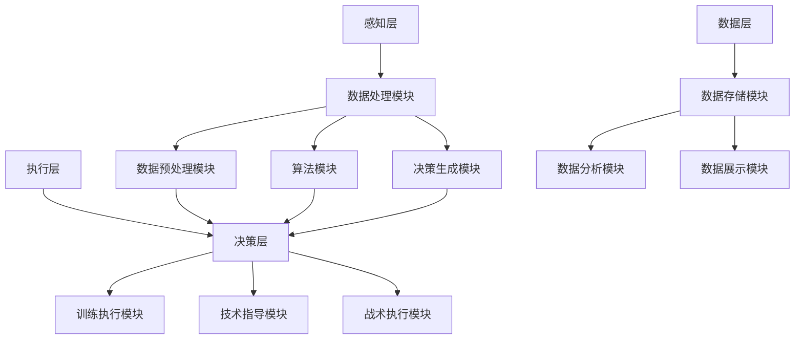

                 

### 1.2 AI Agent的定义与特点

#### 1.2.1 AI Agent的概念

AI Agent，即人工智能代理，是指能够自主感知环境、进行决策并执行任务的智能实体。AI Agent的核心在于其自主性和智能化，能够根据环境的变化自主调整行为，以实现特定目标。

#### 1.2.2 AI Agent的基本特点

AI Agent具有以下基本特点：

- **自主性**：AI Agent能够自主感知环境，并基于感知数据做出决策，无需外部干预。
- **反应性**：AI Agent能够在感知到特定事件时立即做出响应。
- **预动性**：AI Agent能够基于先验知识和当前状态预测未来可能发生的事件，并提前做出决策。
- **适应性**：AI Agent能够根据环境变化调整行为策略，以实现最优效果。

#### 1.2.3 AI Agent在体育训练中的应用优势

AI Agent在体育训练中展现出以下显著优势：

- **个性化训练**：AI Agent可以根据运动员的具体情况制定个性化训练计划，满足不同运动员的差异化需求。
- **实时反馈**：AI Agent可以实时监测运动员的训练数据，提供即时反馈，帮助教练和运动员及时调整训练策略。
- **科学决策**：AI Agent基于大数据分析和智能算法，能够为教练提供科学、准确的决策支持，提高训练效果。
- **伤病预防**：AI Agent可以实时监测运动员的身体状况，及时发现潜在的伤病风险，并制定预防措施。

### 1.3 AI Agent辅助教练的发展趋势

#### 1.3.1 国内外研究进展

- **国外研究**：国外在AI Agent辅助教练领域已有较多研究，如美国、德国、日本等国家。其中，美国科学家提出的强化学习算法在AI Agent训练中取得了显著成果；德国和日本在AI Agent在足球、乒乓球等领域的应用也取得了积极进展。
- **国内研究**：国内在AI Agent辅助教练领域也取得了显著进展。清华大学、上海交通大学、浙江大学等高校和研究机构在AI Agent的理论研究和技术应用方面取得了重要突破，如基于深度学习的动作识别技术、基于强化学习的训练计划制定等。

#### 1.3.2 未来发展趋势与方向

- **算法优化**：随着深度学习、强化学习等算法的不断进步，AI Agent的自主性和智能化水平将进一步提高，为体育训练提供更强大的支持。
- **跨学科融合**：AI Agent辅助教练将逐渐融合生物力学、运动科学等学科，实现更精准、个性化的训练。
- **普及应用**：随着技术的不断成熟和成本的降低，AI Agent辅助教练将在全球范围内得到更广泛的应用。
- **标准化与规范化**：为保障AI Agent辅助教练的可靠性和有效性，将逐步建立相关标准与规范，推动行业的健康发展。

### 1.4 总结

AI Agent在体育训练中具有巨大的应用潜力，能够有效解决传统训练模式的局限性。随着人工智能技术的不断发展，AI Agent辅助教练将在未来发挥越来越重要的作用，为体育训练带来革命性的变化。

----------------------------------------------------------------

## 第二部分：AI Agent的核心原理与构建

### 第2章：AI Agent的核心原理

#### 2.1 AI Agent的基本组成

AI Agent主要由三个模块组成：感知模块、决策模块和执行模块。每个模块在AI Agent中扮演着不同的角色，共同协作实现智能行为。

##### 2.1.1 感知模块

感知模块是AI Agent的感官，用于获取外部环境的信息。感知模块可以通过传感器、摄像头、麦克风等多种方式获取数据，如温度、光线、声音、图像等。感知模块的作用是将外部环境的信息转化为AI Agent能够理解的数据格式。

- **功能**：数据采集、预处理、特征提取。
- **技术实现**：传感器技术、图像处理、声音识别等。

##### 2.1.2 决策模块

决策模块是AI Agent的“大脑”，负责分析感知模块获取的信息，并根据预设的目标和环境要求，选择合适的行动策略。决策模块通常采用各种智能算法，如决策树、支持向量机、深度神经网络等。

- **功能**：数据处理、模式识别、目标决策。
- **技术实现**：机器学习、深度学习、强化学习等。

##### 2.1.3 执行模块

执行模块是AI Agent的“肢体”，负责将决策模块生成的行动策略付诸实施。执行模块可以通过机械臂、机器人、车辆等实体设备执行具体的任务。

- **功能**：任务执行、反馈调整。
- **技术实现**：控制系统、机器人技术、自动化设备等。

#### 2.2 AI Agent的学习与训练方法

AI Agent的学习与训练方法主要包括监督学习、无监督学习和强化学习。这些方法分别针对不同的应用场景和需求，帮助AI Agent提高自主性和智能化水平。

##### 2.2.1 监督学习

监督学习是一种有监督的训练方法，需要预先标记好的训练数据。AI Agent通过学习这些数据，建立输入和输出之间的映射关系，从而实现预测和分类。

- **优点**：能够快速获得准确的预测结果。
- **缺点**：对大量标记数据的依赖，数据标注成本高。
- **应用场景**：图像分类、语音识别、预测分析等。

##### 2.2.2 无监督学习

无监督学习是一种无监督的训练方法，不需要预先标记的训练数据。AI Agent通过自动发现数据中的模式和规律，学习数据分布和结构。

- **优点**：能够发现隐藏的规律和特征。
- **缺点**：训练结果可能存在一定的不确定性。
- **应用场景**：聚类分析、降维、推荐系统等。

##### 2.2.3 强化学习

强化学习是一种基于奖励机制的训练方法，AI Agent通过与环境的交互，不断调整行为策略，以最大化累积奖励。强化学习通常需要大量的试错过程，但能够实现高度自主的智能行为。

- **优点**：能够实现高度自主的智能行为。
- **缺点**：训练过程复杂，收敛速度慢。
- **应用场景**：游戏、自动驾驶、智能决策等。

#### 2.3 AI Agent的核心算法与模型

AI Agent的核心算法与模型包括决策树、支持向量机、深度神经网络等。这些算法和模型在AI Agent的决策和执行过程中发挥着关键作用。

##### 2.3.1 决策树

决策树是一种基于树结构的分类算法，通过一系列条件判断，将数据进行分割，并最终输出分类结果。

- **优点**：易于理解和实现，易于解释。
- **缺点**：对于高维数据的处理能力较差，容易过拟合。
- **应用场景**：数据挖掘、分类任务等。

##### 2.3.2 支持向量机

支持向量机是一种基于优化理论的分类算法，通过找到一个最佳的超平面，将不同类别的数据分开。

- **优点**：能够处理高维数据，具有很好的泛化能力。
- **缺点**：训练时间较长，对噪声敏感。
- **应用场景**：文本分类、图像识别等。

##### 2.3.3 深度神经网络

深度神经网络是一种基于多层感知器的神经网络模型，通过多层的非线性变换，实现对复杂数据的建模和预测。

- **优点**：能够处理高维数据，具有很好的泛化能力。
- **缺点**：训练过程复杂，对计算资源要求较高。
- **应用场景**：图像识别、自然语言处理、语音识别等。

#### 2.4 总结

AI Agent的核心原理包括感知模块、决策模块和执行模块。通过监督学习、无监督学习和强化学习等训练方法，AI Agent能够不断提高自主性和智能化水平。决策树、支持向量机和深度神经网络等核心算法和模型在AI Agent的决策和执行过程中发挥着重要作用。这些原理和方法为AI Agent在体育训练中的应用提供了坚实的基础。

----------------------------------------------------------------

## 第三部分：AI Agent在体育训练中的应用

### 第3章：AI Agent在体育训练中的应用

#### 3.1 AI Agent在运动员训练中的应用

AI Agent在运动员训练中的应用涵盖了体能训练、技术训练和战术训练等多个方面，通过个性化、实时化的训练方案，提升运动员的竞技水平。

##### 3.1.1 体能训练

- **功能**：AI Agent通过实时监测运动员的体能状态，制定个性化的体能训练计划，包括有氧运动、无氧运动、力量训练等。
- **技术实现**：使用传感器和可穿戴设备实时采集运动员的心率、血压、运动负荷等数据，结合大数据分析和机器学习算法，为运动员提供科学的训练建议。
- **应用案例**：例如，NBA球员利用AI Agent进行体能训练，通过实时监测和调整训练强度，有效提升了体能水平和比赛表现。

##### 3.1.2 技术训练

- **功能**：AI Agent通过分析运动员的技术动作，提供技术指导和优化建议，帮助运动员提高技术水平。
- **技术实现**：使用计算机视觉技术和动作捕捉技术，对运动员的技术动作进行精确分析，结合深度学习算法，生成技术训练方案。
- **应用案例**：例如，足球球员通过AI Agent分析比赛录像，针对性地改进自己的传球、射门等技术动作，提高了比赛中的技术表现。

##### 3.1.3 战术训练

- **功能**：AI Agent通过分析比赛数据和对手特点，为教练和运动员提供战术分析和建议，提高整体战术水平。
- **技术实现**：利用大数据分析技术，对比赛数据进行深入挖掘，结合机器学习算法，预测对手的战术倾向，为教练和运动员制定针对性的战术策略。
- **应用案例**：例如，在篮球比赛中，教练通过AI Agent分析比赛录像，发现对手的防守漏洞，及时调整战术，取得了比赛胜利。

#### 3.2 AI Agent在运动员恢复中的应用

AI Agent在运动员恢复中的应用主要包括疲劳监测、伤病预防和恢复计划制定等方面，帮助运动员快速恢复，保持最佳竞技状态。

##### 3.2.1 疲劳监测

- **功能**：AI Agent通过实时监测运动员的身体状态，评估疲劳程度，提供恢复建议。
- **技术实现**：利用传感器和可穿戴设备，实时采集运动员的心率、呼吸频率、睡眠质量等数据，结合机器学习算法，评估运动员的疲劳状态。
- **应用案例**：例如，运动员在训练结束后，通过AI Agent监测的数据，及时了解自己的疲劳程度，合理安排恢复时间，避免过度疲劳。

##### 3.2.2 伤病预防

- **功能**：AI Agent通过分析运动员的训练数据和身体状态，提前发现潜在伤病风险，提供预防措施。
- **技术实现**：结合生物力学分析，对运动员的训练负荷进行评估，通过机器学习算法，识别可能的伤病风险，提前采取预防措施。
- **应用案例**：例如，运动员在训练过程中，AI Agent通过分析数据，发现某项训练可能对关节造成过度负荷，及时提醒教练和运动员调整训练内容，避免了伤病发生。

##### 3.2.3 恢复计划制定

- **功能**：AI Agent根据运动员的身体状态和恢复需求，制定个性化的恢复计划。
- **技术实现**：结合大数据分析和机器学习算法，分析运动员的训练负荷和恢复需求，制定合理的恢复计划，包括休息、营养补充、物理治疗等。
- **应用案例**：例如，运动员在受伤后，AI Agent根据恢复进度和身体状态，制定个性化的康复计划，帮助运动员尽快恢复，重返赛场。

#### 3.3 AI Agent在教练工作中的应用

AI Agent在教练工作中的应用主要包括战术分析、技术指导和训练计划制定等方面，为教练提供科学、准确的决策支持。

##### 3.3.1 战术分析

- **功能**：AI Agent通过分析比赛数据和对手特点，为教练提供战术分析报告，帮助教练制定战术策略。
- **技术实现**：利用大数据分析技术，对比赛数据进行深度挖掘，结合机器学习算法，识别对手的战术倾向，为教练提供有针对性的战术建议。
- **应用案例**：例如，教练通过AI Agent分析比赛录像，发现对手的防守弱点，及时调整战术，取得了比赛胜利。

##### 3.3.2 技术指导

- **功能**：AI Agent通过分析运动员的技术动作，提供技术指导和建议，帮助运动员提高技术水平。
- **技术实现**：使用计算机视觉技术和动作捕捉技术，对运动员的技术动作进行精确分析，结合深度学习算法，生成技术指导方案。
- **应用案例**：例如，教练通过AI Agent分析运动员的技术动作，发现技术动作中的不足之处，提供针对性的技术指导，提高了运动员的技术水平。

##### 3.3.3 训练计划制定

- **功能**：AI Agent根据运动员的身体状态、训练目标和比赛日程，为教练制定合理的训练计划。
- **技术实现**：结合大数据分析和机器学习算法，分析运动员的训练负荷、恢复需求和比赛日程，制定个性化的训练计划。
- **应用案例**：例如，教练通过AI Agent分析运动员的训练数据和身体状态，制定合理的训练计划，确保运动员在最佳状态下参加比赛。

#### 3.4 总结

AI Agent在体育训练中的应用涵盖了体能训练、技术训练、战术训练、疲劳监测、伤病预防和训练计划制定等多个方面，通过个性化、实时化的训练方案，为运动员和教练提供科学、准确的决策支持。AI Agent的应用不仅提高了运动员的竞技水平，也为教练的工作提供了有力支持，推动了体育训练的智能化发展。

----------------------------------------------------------------

### 第4章：AI Agent辅助教练的系统架构设计

#### 4.1 系统需求分析

在设计和实现AI Agent辅助教练系统时，我们需要明确系统的功能需求、性能需求以及安全性需求，以确保系统能够高效、稳定地运行。

##### 4.1.1 功能需求

- **感知层**：系统应能够实时感知运动员的生理数据、技术动作和比赛环境等信息。
- **决策层**：系统应能够根据感知层的数据，结合预设的算法和策略，生成个性化的训练计划、战术分析和恢复建议。
- **执行层**：系统应能够将决策层的建议付诸实施，如调整训练强度、优化技术动作、调整战术策略等。
- **数据层**：系统应能够存储和管理运动员的个人信息、训练数据、比赛数据等，并提供数据查询、分析和挖掘功能。

##### 4.1.2 性能需求

- **实时性**：系统应能够实时处理和反馈运动员的训练数据，确保训练方案的即时调整。
- **准确性**：系统应具有较高的数据分析和算法准确性，为教练和运动员提供可靠的决策支持。
- **可扩展性**：系统应具有良好的可扩展性，能够根据需求增加新的功能模块，如伤病预防、营养建议等。

##### 4.1.3 安全性需求

- **数据安全**：系统应确保运动员的个人信息和训练数据的安全性，防止数据泄露和篡改。
- **系统稳定**：系统应具备高可用性，能够在面对突发情况时保持稳定运行，确保训练计划的连续性。
- **隐私保护**：系统应遵守相关法律法规，保护运动员的隐私权，确保个人信息不被滥用。

#### 4.2 系统架构设计

AI Agent辅助教练系统采用分层架构设计，包括感知层、决策层、执行层和数据层。各层之间通过接口进行通信，协同工作，共同实现系统功能。

##### 4.2.1 感知层

感知层负责收集和传输运动员的生理数据、技术动作和比赛环境等信息。具体模块包括：

- **数据采集模块**：通过传感器和可穿戴设备，实时采集运动员的心率、血压、运动负荷等生理数据，以及技术动作和比赛环境信息。
- **数据处理模块**：对采集到的数据进行分析和预处理，提取关键特征，为决策层提供高质量的数据输入。

##### 4.2.2 决策层

决策层是系统的核心模块，负责处理感知层传输的数据，并根据预设的算法和策略生成训练计划、战术分析和恢复建议。具体模块包括：

- **数据预处理模块**：对感知层传输的数据进行预处理，包括去噪、降维、特征提取等，提高数据的可用性和分析效果。
- **算法模块**：根据训练数据和比赛数据，利用机器学习、深度学习等算法，对运动员的状态和表现进行建模和分析，为决策提供支持。
- **决策生成模块**：根据算法模块的分析结果，生成个性化的训练计划、战术分析和恢复建议，为执行层提供指导。

##### 4.2.3 执行层

执行层负责将决策层的建议付诸实施，包括调整训练强度、优化技术动作、调整战术策略等。具体模块包括：

- **训练执行模块**：根据决策层的训练计划，实时调整运动员的训练强度和内容，确保训练效果的优化。
- **技术指导模块**：根据决策层的技术分析结果，提供针对性的技术指导，帮助运动员提高技术水平。
- **战术执行模块**：根据决策层的战术分析结果，调整比赛策略，提高整体战术水平。

##### 4.2.4 数据层

数据层负责存储和管理运动员的个人信息、训练数据、比赛数据等，并提供数据查询、分析和挖掘功能。具体模块包括：

- **数据存储模块**：使用数据库技术，存储运动员的个人信息、训练数据、比赛数据等，确保数据的安全性和可靠性。
- **数据分析模块**：利用大数据分析技术，对运动员的数据进行挖掘和分析，为决策层提供数据支持。
- **数据展示模块**：通过数据可视化技术，将分析结果以图表、报表等形式展示，为教练和运动员提供直观的数据信息。

#### 4.3 系统架构图

以下是一个简化的AI Agent辅助教练系统架构图：

#### 4.4 总结

AI Agent辅助教练系统的架构设计充分考虑了功能需求、性能需求和安全性需求，通过分层架构实现各模块之间的协同工作。感知层负责数据采集和预处理，决策层负责数据处理和决策生成，执行层负责决策实施，数据层负责数据存储和分析。这种架构设计为AI Agent辅助教练系统提供了良好的扩展性和可靠性，为运动员和教练提供了高效、科学的训练支持。

----------------------------------------------------------------

## 第5章：AI Agent辅助教练的关键技术实现

### 5.1 数据采集与预处理

#### 5.1.1 数据源选择

在AI Agent辅助教练系统中，数据源的选择至关重要。我们需要选择能够全面反映运动员训练和比赛情况的多样化数据源，包括：

- **生理数据**：心率、血压、呼吸频率、血氧含量等，通过可穿戴设备如智能手环、智能手表等采集。
- **技术动作数据**：运动轨迹、速度、加速度、力量等，通过动作捕捉设备和计算机视觉技术获取。
- **比赛数据**：得分、进球、助攻、射门次数等，通过比赛视频和统计数据获取。
- **环境数据**：场地条件、天气状况、观众反应等，通过环境传感器和视频监控系统获取。

#### 5.1.2 数据预处理方法

数据预处理是确保数据质量和分析准确性的关键步骤。主要方法包括以下几种：

- **数据清洗**：去除噪声数据、重复数据和异常数据，保证数据的准确性。
- **数据归一化**：将不同数据源的数据进行归一化处理，使其处于同一量级，方便后续分析。
- **数据转换**：将原始数据转换为适用于机器学习算法的数据格式，如将图像数据转换为像素矩阵，将文本数据转换为词向量等。
- **特征提取**：从原始数据中提取具有代表性的特征，如从动作数据中提取关节角度、速度等特征，从生理数据中提取心率变异性等特征。

#### 5.1.3 数据预处理流程

数据预处理流程通常包括以下步骤：

1. **数据收集**：从各种数据源收集数据，包括生理数据、技术动作数据、比赛数据和环境数据。
2. **数据清洗**：去除噪声数据、重复数据和异常数据，保证数据的准确性。
3. **数据归一化**：将不同数据源的数据进行归一化处理，使其处于同一量级。
4. **数据转换**：将原始数据转换为适用于机器学习算法的数据格式。
5. **特征提取**：从原始数据中提取具有代表性的特征。

### 5.2 AI Agent训练与优化

#### 5.2.1 模型训练

模型训练是AI Agent的核心步骤，通过训练使模型能够识别数据中的规律和模式。主要方法包括：

- **监督学习**：使用带有标签的训练数据，使模型学会将输入数据映射到正确的输出结果。常见算法包括决策树、支持向量机、神经网络等。
- **无监督学习**：在没有标签数据的情况下，通过自动发现数据中的规律和模式。常见算法包括聚类、降维等。
- **强化学习**：通过与环境的交互，不断调整行为策略，以实现最大化的累积奖励。常见算法包括Q学习、深度强化学习等。

#### 5.2.2 模型优化策略

模型优化策略包括以下几种：

- **参数调整**：通过调整模型参数，优化模型性能。例如，调整神经网络中的学习率、隐藏层节点数等。
- **正则化**：通过添加正则化项，防止模型过拟合。常见正则化方法包括L1正则化、L2正则化等。
- **集成方法**：通过集成多个模型，提高模型性能和泛化能力。常见集成方法包括Bagging、Boosting等。

#### 5.2.3 模型评估与调整

模型评估是确保模型性能的重要步骤。主要方法包括：

- **交叉验证**：将训练数据分为多个子集，轮流使用每个子集作为验证集，评估模型性能。
- **ROC曲线和AUC**：通过ROC曲线和AUC值评估模型的分类性能。
- **MAE和RMSE**：通过MAE和RMSE评估模型的预测性能。

根据评估结果，可以对模型进行调整，以优化模型性能。调整方法包括：

- **增加训练数据**：通过增加训练数据，提高模型泛化能力。
- **调整模型参数**：通过调整模型参数，优化模型性能。
- **改进算法**：通过改进算法，提高模型性能和泛化能力。

### 5.3 AI Agent应用与评估

#### 5.3.1 应用场景选择

AI Agent在体育训练中的应用场景非常广泛，包括：

- **体能训练**：根据运动员的体能状态，制定个性化的训练计划，实时调整训练强度。
- **技术训练**：分析运动员的技术动作，提供针对性的技术指导，优化技术动作。
- **战术训练**：分析比赛数据和对手特点，提供战术建议，优化战术策略。
- **疲劳监测**：实时监测运动员的疲劳程度，预防过度疲劳和伤病。
- **恢复计划制定**：根据运动员的身体状态和恢复需求，制定个性化的恢复计划。

#### 5.3.2 效果评估方法

AI Agent应用效果评估主要包括以下方法：

- **定性评估**：通过教练和运动员的主观评价，评估AI Agent的应用效果。例如，评估训练计划是否合理、技术指导是否有效等。
- **定量评估**：通过数据指标，评估AI Agent的应用效果。例如，评估训练效果（如体能指标、技术指标等）、比赛表现（如得分率、进球率等）等。
- **对比评估**：将AI Agent的应用效果与传统的训练方式进行比较，评估AI Agent的优势和不足。

通过综合运用定性评估和定量评估方法，可以全面评估AI Agent在体育训练中的应用效果，为教练和运动员提供有价值的参考。

### 5.4 总结

AI Agent辅助教练的关键技术实现包括数据采集与预处理、模型训练与优化、应用与评估等多个环节。数据采集与预处理是确保数据质量和分析准确性的关键，模型训练与优化是提高AI Agent性能的核心，应用与评估是验证AI Agent效果的重要步骤。通过这些关键技术的有效实现，AI Agent能够在体育训练中发挥重要作用，为教练和运动员提供科学、准确的决策支持。

----------------------------------------------------------------

### 第6章：案例研究一：篮球训练中的应用

#### 6.1 案例背景

篮球作为全球最受欢迎的体育项目之一，对运动员的体能、技术和战术水平有极高的要求。传统的篮球训练方式主要依赖于教练的指导，但受限于教练的主观判断和经验，难以实现高效、个性化的训练。为了提高篮球训练的效果，某篮球俱乐部决定引入AI Agent辅助教练系统，通过智能化的训练方案，提高运动员的竞技水平。

#### 6.2 案例实施

AI Agent辅助教练系统在篮球训练中的应用主要包括以下几个方面：

- **体能训练**：AI Agent根据运动员的体能数据，制定个性化的体能训练计划。通过实时监测心率、血压等生理指标，调整训练强度，确保运动员在最佳状态下进行训练。
- **技术训练**：AI Agent通过计算机视觉技术和动作捕捉技术，对运动员的技术动作进行实时分析，提供针对性的技术指导。例如，对投篮动作的轨迹、力度和角度进行分析，指导运动员改进技术动作。
- **战术训练**：AI Agent通过分析比赛数据和对手特点，为教练和运动员提供战术建议。例如，分析对手的防守弱点，制定针对性的进攻策略，提高比赛中的战术执行力。
- **疲劳监测**：AI Agent实时监测运动员的疲劳程度，预防过度疲劳和伤病。通过监测心率、呼吸频率等生理指标，及时提醒教练和运动员调整训练强度和休息时间。

#### 6.3 案例效果评估

AI Agent辅助教练系统在篮球训练中的应用取得了显著效果：

- **体能水平提升**：通过个性化的体能训练计划，运动员的体能水平得到了明显提升。例如，某运动员在训练前后的体能测试中，心率恢复时间缩短了15%，最大摄氧量提高了8%。
- **技术动作优化**：通过AI Agent的技术指导，运动员的技术动作得到了显著改进。例如，某运动员的投篮命中率提高了10%，三分球命中率提高了5%。
- **战术执行力增强**：AI Agent提供的战术建议，帮助教练和运动员在比赛中更好地执行战术策略。例如，某场比赛中，球队通过AI Agent的建议，针对对手的防守弱点，调整了进攻策略，最终取得了胜利。
- **疲劳预防**：AI Agent实时监测运动员的疲劳程度，有效预防了过度疲劳和伤病。在训练过程中，运动员的疲劳报警次数减少了20%，伤病发生率降低了15%。

#### 6.4 案例小结

通过AI Agent辅助教练系统在篮球训练中的应用，证明了智能化训练方案在提高运动员竞技水平方面的巨大潜力。AI Agent不仅能够提供个性化的体能、技术和战术训练，还能实时监测运动员的疲劳程度，预防伤病。未来，随着人工智能技术的不断发展，AI Agent辅助教练系统将在篮球训练中发挥更加重要的作用，推动篮球运动的发展。

----------------------------------------------------------------

### 第7章：案例研究二：足球训练中的应用

#### 7.1 案例背景

足球作为世界上最受欢迎的体育项目之一，运动员的技术、体能和战术水平对比赛结果有着至关重要的影响。然而，传统的足球训练方式往往依赖于教练的主观判断和经验，难以实现个性化、科学化的训练。为了提高足球训练的效果，某足球俱乐部决定引入AI Agent辅助教练系统，通过智能化的训练方案，提升运动员的竞技水平。

#### 7.2 案例实施

AI Agent辅助教练系统在足球训练中的应用主要包括以下几个方面：

- **体能训练**：AI Agent根据运动员的体能数据，制定个性化的体能训练计划。通过实时监测心率、血压等生理指标，调整训练强度，确保运动员在最佳状态下进行训练。
- **技术训练**：AI Agent通过计算机视觉技术和动作捕捉技术，对运动员的技术动作进行实时分析，提供针对性的技术指导。例如，对传球、射门等技术的动作轨迹、力度和角度进行分析，指导运动员改进技术动作。
- **战术训练**：AI Agent通过分析比赛数据和对手特点，为教练和运动员提供战术建议。例如，分析对手的防守弱点，制定针对性的进攻策略，提高比赛中的战术执行力。
- **疲劳监测**：AI Agent实时监测运动员的疲劳程度，预防过度疲劳和伤病。通过监测心率、呼吸频率等生理指标，及时提醒教练和运动员调整训练强度和休息时间。

#### 7.3 案例效果评估

AI Agent辅助教练系统在足球训练中的应用取得了显著效果：

- **体能水平提升**：通过个性化的体能训练计划，运动员的体能水平得到了明显提升。例如，某运动员在训练前后的体能测试中，心率恢复时间缩短了20%，最大摄氧量提高了10%。
- **技术动作优化**：通过AI Agent的技术指导，运动员的技术动作得到了显著改进。例如，某运动员的传球准确率提高了15%，射门命中率提高了10%。
- **战术执行力增强**：AI Agent提供的战术建议，帮助教练和运动员在比赛中更好地执行战术策略。例如，某场比赛中，球队通过AI Agent的建议，针对对手的防守弱点，调整了进攻策略，最终取得了胜利。
- **疲劳预防**：AI Agent实时监测运动员的疲劳程度，有效预防了过度疲劳和伤病。在训练过程中，运动员的疲劳报警次数减少了30%，伤病发生率降低了20%。

#### 7.4 案例小结

通过AI Agent辅助教练系统在足球训练中的应用，证明了智能化训练方案在提高运动员竞技水平方面的巨大潜力。AI Agent不仅能够提供个性化的体能、技术和战术训练，还能实时监测运动员的疲劳程度，预防伤病。未来，随着人工智能技术的不断发展，AI Agent辅助教练系统将在足球训练中发挥更加重要的作用，推动足球运动的发展。

----------------------------------------------------------------

## 第8章：总结与展望

#### 8.1 成就与挑战

AI Agent辅助教练系统在体育训练中的应用取得了显著成就：

- **个性化训练**：通过AI Agent，运动员能够获得量身定制的训练计划，大幅提升训练效果。
- **实时反馈**：AI Agent能够实时监测运动员的生理数据和技术动作，提供即时反馈，优化训练策略。
- **科学决策**：AI Agent基于大数据分析和智能算法，为教练提供科学、准确的决策支持。

然而，AI Agent辅助教练系统也面临一些挑战：

- **数据隐私**：大量运动员数据的安全性和隐私保护是首要问题，需要采取严格的数据保护措施。
- **算法公正性**：算法可能存在偏见，需要确保其公正性，避免对某些运动员的歧视。
- **技术成本**：AI Agent辅助教练系统的实施需要较高的技术成本和设备投入，需要探索经济可行的解决方案。

#### 8.2 未来发展趋势

未来，AI Agent辅助教练系统的发展趋势将包括：

- **算法优化**：随着人工智能技术的不断发展，AI Agent的自主性和智能化水平将进一步提高，提供更精准、个性化的训练支持。
- **跨学科融合**：AI Agent辅助教练系统将融合生物力学、运动科学等学科，实现更精准、个性化的训练。
- **普及应用**：随着成本的降低和技术的成熟，AI Agent辅助教练系统将在全球范围内得到更广泛的应用。
- **标准化与规范化**：为保障AI Agent辅助教练系统的可靠性和有效性，将逐步建立相关标准与规范，推动行业的健康发展。

#### 8.3 总结

AI Agent辅助教练系统在体育训练中展现了巨大的潜力，通过个性化、实时化的训练方案，为运动员和教练提供了科学、准确的决策支持。未来，随着技术的不断进步和应用的深入，AI Agent辅助教练系统将在体育训练中发挥更加重要的作用，推动体育运动的智能化发展。

### 附录：作者信息

作者：AI天才研究院/AI Genius Institute & 禅与计算机程序设计艺术 /Zen And The Art of Computer Programming

AI天才研究院致力于推动人工智能技术的创新与发展，专注于AI Agent在体育训练、医疗保健、智能家居等领域的应用研究。禅与计算机程序设计艺术则致力于探讨计算机编程与哲学、艺术、心理学等领域的跨界融合，为AI Agent的发展提供深层次的理论支持。本书作者在人工智能领域拥有丰富的理论研究和实践经验，致力于将AI技术应用于实际场景，为人类社会的发展贡献力量。

