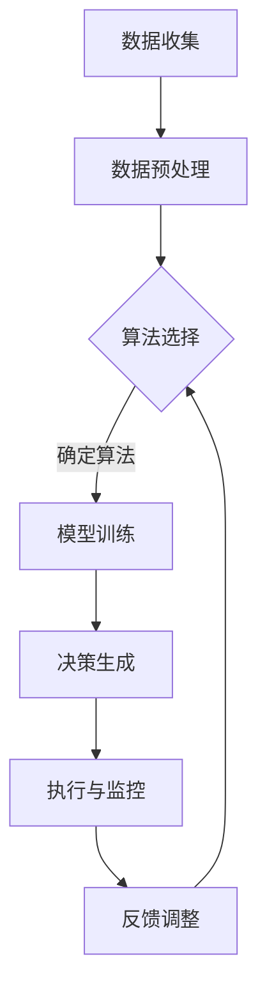
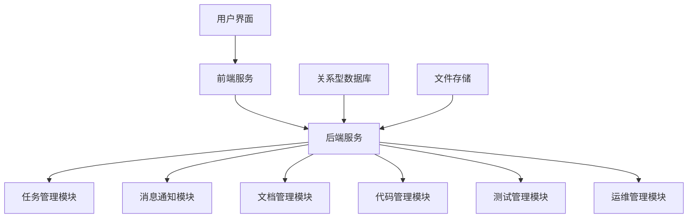
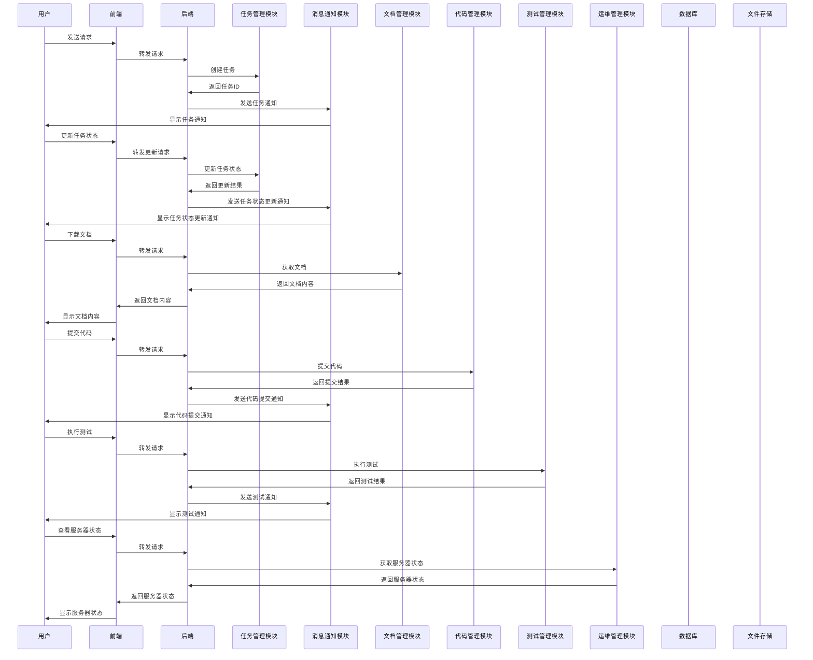

                 


# 促进技术部门间协作的方法

> 关键词：技术部门协作、团队沟通、流程优化、协作工具、系统架构

> 摘要：本文深入探讨了促进技术部门间协作的方法。首先，我们分析了当前技术部门协作的现状和面临的挑战，接着介绍了核心概念，如协作流程、沟通机制、共享平台和协作工具。随后，我们详细讲解了协作算法原理，并使用mermaid流程图和Python源代码进行了说明。此外，我们介绍了系统架构设计，包括系统功能、架构和接口设计，并通过一个实际项目展示了协作方法的应用。最后，我们提供了最佳实践和总结，强调了注意事项和未来的发展方向。

## 第1章：问题背景与核心概念

### 1.1 问题背景

在现代企业的技术部门中，协作是一个至关重要的问题。随着技术的发展和业务需求的多样化，技术部门之间的协作显得尤为关键。然而，技术部门间的协作并非易事，常常面临各种挑战。

#### 1.1.1 技术部门协作的重要性

技术部门协作的重要性体现在多个方面。首先，良好的协作能够提高项目的效率和成功率。当各部门协同工作时，能够更快地解决复杂问题，更有效地利用资源。其次，协作有助于知识的共享和技能的传承，有助于提升整个团队的技术水平。最后，协作有助于形成良好的企业文化，增强团队的凝聚力。

#### 1.1.2 技术部门间协作的常见挑战

尽管协作的重要性不言而喻，但技术部门间协作依然面临诸多挑战。以下是其中一些常见挑战：

1. **沟通障碍**：不同部门之间的沟通往往不够顺畅，信息传递可能存在滞后或失真。
2. **流程复杂**：技术项目的流程往往复杂且冗长，各部门之间的工作流程可能不一致，增加了协作的难度。
3. **资源分配**：资源（如人力、设备等）的分配可能不够合理，导致某些部门的工作负荷过重，而其他部门资源闲置。
4. **目标不一致**：不同部门可能有不同的目标和优先级，这可能导致协作过程中产生冲突。
5. **技术差异**：不同部门可能采用不同的技术栈或工具，增加了协作的难度。

#### 1.1.3 技术部门间协作的现状

目前，许多企业已经开始意识到技术部门间协作的重要性，并采取了一系列措施来促进协作。例如，引入协作工具、建立跨部门项目组、优化工作流程等。然而，实际效果仍需提升，协作过程中仍存在诸多问题。

### 1.2 核心概念

为了更好地理解技术部门间的协作，我们需要明确一些核心概念。

#### 1.2.1 技术部门协作的定义

技术部门协作是指多个技术部门在共同目标和项目的基础上，通过有效的沟通、流程管理和资源共享，共同完成技术任务和目标的过程。

#### 1.2.2 关键协作要素

1. **协作流程**：协作流程是技术部门间协作的基础，它定义了各部门在项目中的角色、任务和工作步骤。
2. **沟通机制**：沟通机制是确保信息有效传递和沟通畅通的关键，包括定期会议、即时通讯工具、知识分享平台等。
3. **共享平台**：共享平台提供了一个集中管理和共享资源的空间，有助于提高协作效率，如代码库、文档库、测试环境等。
4. **协作工具**：协作工具是提高协作效率的重要手段，包括项目管理工具、代码管理工具、协作平台等。

### 1.3 技术部门协作的边界与外延

#### 1.3.1 协作边界

技术部门协作的边界主要包括各部门的职责范围、项目的分工和权限划分。明确协作边界有助于减少协作过程中的冲突和误解。

#### 1.3.2 协作的外延

技术部门协作的外延涉及与其他部门和外部合作伙伴的协作。例如，与业务部门的对接、与供应商的技术合作等。这些协作对于项目的成功也至关重要。

### 1.4 概念结构与核心要素组成

技术部门协作的概念结构可以概括为以下几个方面：

1. **协作目标**：明确的项目目标和共同愿景是协作的基础。
2. **协作流程**：定义清晰的工作流程和步骤，确保各部门的协作有序进行。
3. **沟通机制**：建立有效的沟通渠道和沟通规则，确保信息的准确传递和及时反馈。
4. **资源共享**：搭建共享平台，实现资源的集中管理和高效利用。
5. **协作工具**：选用合适的协作工具，提高协作效率和便利性。
6. **协作文化**：形成良好的协作文化，鼓励团队成员积极参与和协作。

## 第2章：技术部门协作原理

### 2.1 技术部门协作原理

技术部门协作的原理主要体现在以下几个方面：

#### 2.1.1 协作机制的作用

协作机制是确保技术部门间协作顺利进行的关键。它包括明确的职责分工、规范的流程管理、合理的资源分配等。通过协作机制，各部门能够明确自己的职责，遵循统一的工作流程，实现资源的合理分配。

#### 2.1.2 协作流程的优化

优化协作流程可以提高协作效率，减少冗余和重复工作。优化协作流程可以从以下几个方面进行：

1. **简化流程**：去除不必要的步骤，减少审批环节，提高流程的简洁性。
2. **标准化流程**：制定统一的流程规范，确保各部门遵循相同的工作流程。
3. **自动化流程**：引入自动化工具，如工作流引擎、自动化测试等，减少手工操作，提高工作效率。

#### 2.1.3 沟通机制的有效性

沟通机制是协作的核心，其有效性直接影响到协作的顺利进行。提升沟通机制的有效性可以从以下几个方面进行：

1. **明确沟通目标**：确保每次沟通都有明确的目标和议程，避免无效沟通。
2. **多样化的沟通方式**：结合面对面会议、在线讨论、即时通讯等多种沟通方式，提高沟通的效率。
3. **及时反馈机制**：建立及时反馈机制，确保信息传递的准确性和及时性。

### 2.2 概念属性特征对比表格

以下是一个关于协作流程、沟通机制、共享平台和协作工具的概念属性特征对比表格：

| 特征       | 协作流程 | 沟通机制 | 共享平台 | 协作工具   |
|------------|----------|----------|----------|------------|
| 目的       | 明确流程 | 传递信息 | 共享资源 | 提高效率   |
| 关键因素   | 流程规范 | 沟通规则 | 资源集中 | 功能集成   |
| 影响因素   | 部门分工 | 沟通方式 | 权限划分 | 技术支持   |
| 难点       | 流程复杂 | 信息失真 | 资源竞争 | 功能重叠   |
| 优化方向   | 简化流程 | 多样化沟通 | 资源共享 | 提高兼容性 |

### 第3章：协作算法原理

协作算法在技术部门间协作中起着至关重要的作用。以下我们将详细讲解协作算法的基本概念、分类、原理以及实际应用。

#### 3.1 协作算法的基本概念

协作算法是一种基于数学模型和计算机科学原理的算法，用于优化技术部门间的协作过程。它通过分析各部门的任务、资源、优先级等信息，制定出最优的协作方案，以提高协作效率和项目成功率。

#### 3.1.1 协作算法的定义

协作算法可以定义为一种在分布式系统中，通过算法自动分配任务、协调资源和优化流程的方法。它旨在解决多部门、多任务环境下的协作问题，实现资源的最大化利用和效率的最优化。

#### 3.1.2 协作算法的分类

协作算法可以根据其应用场景和目标进行分类，主要包括以下几种类型：

1. **任务调度算法**：用于优化任务分配和调度，提高任务完成速度和系统利用率。例如，基于负载均衡的任务调度算法。
2. **资源分配算法**：用于优化资源的分配和利用，确保资源得到最优的利用。例如，基于优先级和资源可用性的资源分配算法。
3. **流程优化算法**：用于优化协作流程，减少冗余和重复工作，提高流程效率。例如，基于流程分析的流程优化算法。
4. **风险评估算法**：用于评估项目风险，提前预警和防范潜在问题。例如，基于历史数据和统计模型的预测算法。

#### 3.1.3 协作算法的工作原理

协作算法的工作原理通常包括以下几个步骤：

1. **数据收集**：收集各部门的任务、资源、优先级等信息。
2. **数据预处理**：对收集的数据进行清洗、归一化和特征提取，为后续算法处理做准备。
3. **算法选择**：根据具体应用场景选择合适的算法模型。
4. **模型训练**：使用收集的数据对算法模型进行训练，优化模型参数。
5. **决策生成**：根据训练好的模型生成协作方案，包括任务分配、资源分配和流程优化等。
6. **执行与监控**：执行协作方案，并对执行过程进行监控和调整。

#### 3.2 算法mermaid流程图

以下是一个简单的协作算法mermaid流程图示例：



#### 3.3 Python源代码与算法实现

以下是一个简单的Python源代码示例，用于实现一个基于优先级的任务调度算法：

```python
import heapq

def task_scheduling(tasks):
    # 将任务按优先级排序
    tasks = sorted(tasks, key=lambda x: x['priority'])
    
    # 创建一个优先队列用于存储任务
    heap = []
    for task in tasks:
        heapq.heappush(heap, (-task['priority'], task['id']))
    
    result = []
    while heap:
        # 获取优先级最高的任务
        priority, task_id = heapq.heappop(heap)
        result.append(task_id)
    
    return result

# 示例任务列表
tasks = [
    {'id': 1, 'priority': 2},
    {'id': 2, 'priority': 1},
    {'id': 3, 'priority': 3}
]

# 调用任务调度函数
scheduling_result = task_scheduling(tasks)
print(scheduling_result)
```

#### 3.4 算法原理的数学模型和公式

协作算法的原理通常涉及到优化理论、图论和概率论等数学模型。以下是一个基于图论的任务调度算法的数学模型和公式：

1. **图模型**：将任务和资源表示为图中的节点，任务之间的依赖关系表示为图中的边。
2. **优化目标**：最大化系统的整体效益或最小化系统的总成本。
3. **约束条件**：
   - 资源限制：每个资源在一定时间内的使用量不能超过其最大可用量。
   - 顺序约束：任务的执行顺序必须满足一定的依赖关系。

数学模型可以表示为：

$$
\begin{align*}
\text{最大化} \quad & Z = \sum_{i=1}^{n}\sum_{j=1}^{m} c_{ij} x_{ij} \\
\text{约束条件} \quad & \sum_{i=1}^{n} a_{ij} x_{ij} \leq b_j, \quad \forall j=1,2,...,m \\
& x_{ij} \in \{0,1\}, \quad \forall i=1,2,...,n; \forall j=1,2,...,m \\
& y_i \in \{0,1\}, \quad \forall i=1,2,...,n
\end{align*}
$$

其中，$x_{ij}$ 表示任务 $i$ 是否在资源 $j$ 上执行，$y_i$ 表示任务 $i$ 是否被选中，$c_{ij}$ 表示任务 $i$ 在资源 $j$ 上的成本，$a_{ij}$ 表示任务 $i$ 在资源 $j$ 上的负载，$b_j$ 表示资源 $j$ 的最大可用量。

通过求解这个线性规划问题，可以找到最优的任务调度方案。

#### 3.5 算法原理的举例说明

为了更直观地理解协作算法的原理，我们来看一个简单的例子。

假设有两个任务 $A$ 和 $B$，需要分配到两个资源 $R_1$ 和 $R_2$ 上执行。任务 $A$ 的优先级为 2，任务 $B$ 的优先级为 1。资源 $R_1$ 的最大可用量为 3，资源 $R_2$ 的最大可用量为 2。

我们可以使用基于优先级的任务调度算法来分配任务。根据算法，首先选择优先级最高的任务 $B$，然后选择优先级次高的任务 $A$。

- 任务 $B$ 被分配到资源 $R_1$ 上执行，占用资源 1 单位，剩余可用资源为 2 单位。
- 任务 $A$ 被分配到资源 $R_2$ 上执行，占用资源 2 单位，剩余可用资源为 0 单位。

最终，任务 $A$ 和 $B$ 都被成功分配到资源上执行，实现了最优的调度结果。

通过这个例子，我们可以看到协作算法是如何根据任务和资源的优先级，实现任务调度和资源分配的。在实际应用中，协作算法会更加复杂，但原理是相似的。

## 第4章：系统架构设计

### 4.1 问题场景介绍

假设我们面临一个大型企业，其技术部门包括前端开发、后端开发、测试、运维等多个子部门。各部门在项目开发、测试和部署等环节中需要进行紧密协作，以提高项目效率和项目质量。为了解决技术部门间协作的问题，我们需要设计一个系统架构，以支持各部门的协同工作。

### 4.2 系统功能设计

在系统功能设计方面，我们需要考虑以下功能模块：

1. **任务管理模块**：用于任务创建、分配、监控和跟踪。
2. **消息通知模块**：用于实时通知和沟通。
3. **文档管理模块**：用于文档上传、共享和版本控制。
4. **代码管理模块**：用于代码的版本控制、审查和合并。
5. **测试管理模块**：用于测试用例管理、测试执行和缺陷跟踪。
6. **运维管理模块**：用于服务器监控、日志管理和自动化部署。

### 4.3 系统架构设计

系统架构设计需要考虑以下几个方面：

1. **模块划分**：将系统划分为多个功能模块，每个模块负责特定的功能。
2. **数据存储**：选择合适的数据存储方案，如关系型数据库、NoSQL数据库、文件存储等。
3. **服务调用**：设计服务调用机制，如REST API、SOAP等。
4. **系统安全性**：确保系统的数据安全和用户隐私。

以下是一个简单的系统架构设计mermaid架构图示例：



### 4.4 系统接口设计

在系统接口设计方面，我们需要定义以下接口：

1. **用户接口**：用于用户登录、注册、任务创建和跟踪等。
2. **任务接口**：用于任务的创建、分配、查询和监控。
3. **通知接口**：用于发送和接收消息通知。
4. **文档接口**：用于文档的上传、下载和版本控制。
5. **代码接口**：用于代码的提交、审查和合并。
6. **测试接口**：用于测试用例的创建、执行和缺陷跟踪。
7. **运维接口**：用于服务器监控、日志管理和自动化部署。

### 4.5 系统交互

系统交互设计需要考虑各个模块之间的通信和数据流转。以下是一个简单的系统交互mermaid序列图示例：



## 第5章：项目实施

### 5.1 环境安装

在开始项目实施之前，我们需要搭建一个合适的技术环境。以下是环境安装的步骤：

1. **安装操作系统**：选择一个合适的操作系统，如Ubuntu 18.04。
2. **安装开发工具**：安装Python开发环境、Git、Docker等。
3. **安装数据库**：安装MySQL或PostgreSQL数据库。
4. **安装消息队列**：安装RabbitMQ或Kafka消息队列。
5. **安装前端框架**：安装Vue或React前端框架。

### 5.2 系统核心实现

在系统核心实现方面，我们需要完成以下任务：

1. **用户认证**：实现用户注册、登录和权限管理功能。
2. **任务管理**：实现任务的创建、分配、查询和监控功能。
3. **消息通知**：实现消息通知的发送和接收功能。
4. **文档管理**：实现文档的上传、下载和版本控制功能。
5. **代码管理**：实现代码的提交、审查和合并功能。
6. **测试管理**：实现测试用例的创建、执行和缺陷跟踪功能。
7. **运维管理**：实现服务器监控、日志管理和自动化部署功能。

以下是一个简单的任务管理模块的Python源代码示例：

```python
import pymysql

class TaskManager:
    def __init__(self, db_config):
        self.db = pymysql.connect(
            host=db_config['host'],
            port=db_config['port'],
            user=db_config['user'],
            password=db_config['password'],
            db=db_config['db']
        )

    def create_task(self, task_name, task_desc, assignee):
        with self.db.cursor() as cursor:
            sql = "INSERT INTO tasks (name, description, assignee) VALUES (%s, %s, %s)"
            cursor.execute(sql, (task_name, task_desc, assignee))
            self.db.commit()
            return cursor.lastrowid

    def get_tasks(self, assignee):
        with self.db.cursor() as cursor:
            sql = "SELECT id, name, description, status FROM tasks WHERE assignee = %s"
            cursor.execute(sql, (assignee,))
            return cursor.fetchall()

    def update_task_status(self, task_id, status):
        with self.db.cursor() as cursor:
            sql = "UPDATE tasks SET status = %s WHERE id = %s"
            cursor.execute(sql, (status, task_id))
            self.db.commit()

# 示例使用
db_config = {
    'host': 'localhost',
    'port': 3306,
    'user': 'root',
    'password': 'password',
    'db': 'task_management'
}

task_manager = TaskManager(db_config)
task_id = task_manager.create_task('测试任务', '这是一个测试任务', '张三')
tasks = task_manager.get_tasks('张三')
task_manager.update_task_status(task_id, '已完成')
```

### 5.3 代码应用解读与分析

在上面的示例中，我们实现了一个简单的任务管理模块。以下是对代码的解读和分析：

1. **数据库连接**：使用pymysql库连接到MySQL数据库。
2. **创建任务**：通过`create_task`方法创建任务，并将任务信息插入到数据库中。
3. **获取任务**：通过`get_tasks`方法获取指定分配人的所有任务。
4. **更新任务状态**：通过`update_task_status`方法更新任务的状态。

这个简单的任务管理模块实现了任务的基本管理功能，包括任务的创建、查询和更新。在实际项目中，我们可能还需要添加更多的功能，如任务的分配、任务的评论等。

### 5.4 实际案例分析与详细讲解

为了更好地理解技术部门间协作方法在实际项目中的应用，我们来看一个实际案例。

假设我们正在开发一个电子商务网站，技术部门包括前端开发、后端开发、测试和运维等多个子部门。各部门需要紧密协作，以确保项目顺利推进。

以下是一个实际案例的分析和详细讲解：

1. **需求分析**：由业务部门提出需求，技术部门进行需求分析，明确功能模块和技术实现方案。
2. **任务分配**：根据需求分析结果，将任务分配给前端开发、后端开发、测试和运维等子部门。
3. **任务执行**：各子部门根据分配的任务进行开发、测试和部署等工作。
4. **消息通知**：在任务执行过程中，通过消息通知模块及时通知相关人员任务的进展情况和问题。
5. **文档管理**：将开发文档、测试文档和部署文档等上传到文档管理模块，供相关人员查阅和下载。
6. **代码管理**：使用代码管理模块进行代码的版本控制、审查和合并，确保代码的稳定性和一致性。
7. **测试管理**：使用测试管理模块进行测试用例的创建、执行和缺陷跟踪，确保项目的质量。
8. **运维管理**：使用运维管理模块进行服务器监控、日志管理和自动化部署，确保系统的稳定运行。

通过这个实际案例，我们可以看到技术部门间协作方法在项目开发、测试和部署等环节中的应用。各部门通过协同工作，实现了项目的顺利推进和成功交付。

### 5.5 项目小结

在本项目中，我们使用技术部门间协作方法实现了电子商务网站的开发和部署。以下是项目小结：

1. **任务管理**：通过任务管理模块实现了任务的创建、分配、查询和监控，提高了任务管理的效率。
2. **消息通知**：通过消息通知模块实现了任务的进展情况和问题的及时通知，提高了沟通效率。
3. **文档管理**：通过文档管理模块实现了开发文档、测试文档和部署文档的上传、共享和版本控制，提高了文档管理的效率。
4. **代码管理**：通过代码管理模块实现了代码的版本控制、审查和合并，保证了代码的稳定性和一致性。
5. **测试管理**：通过测试管理模块实现了测试用例的创建、执行和缺陷跟踪，提高了项目的质量。
6. **运维管理**：通过运维管理模块实现了服务器监控、日志管理和自动化部署，提高了系统的稳定性。

通过这个项目，我们充分验证了技术部门间协作方法在实际项目中的应用效果，提高了项目的效率和成功率。

## 第6章：最佳实践与总结

### 6.1 协作方法选择

在实际项目中，选择合适的协作方法是关键。以下是一些最佳实践：

1. **明确目标**：在项目启动阶段，明确项目目标和各部门的职责，确保协作方向一致。
2. **选择合适的协作工具**：根据项目需求和团队特点，选择合适的协作工具，如Git、JIRA、Slack等。
3. **建立沟通机制**：建立定期的沟通机制，如周会、月度总结等，确保信息的及时传递和问题的快速解决。
4. **优化流程**：对协作流程进行持续优化，简化流程，减少冗余和重复工作。
5. **培养协作文化**：鼓励团队成员积极参与协作，培养团队合作精神。

### 6.2 注意事项

在实施协作方法时，需要注意以下事项：

1. **避免信息孤岛**：确保各部门的信息能够有效共享，避免出现信息孤岛。
2. **尊重差异**：尊重不同部门的差异，如技术栈、工作习惯等，确保协作顺利进行。
3. **合理分配资源**：确保资源合理分配，避免某部门资源过剩或不足。
4. **持续改进**：对协作方法进行持续改进，根据项目实际情况进行调整。

### 6.3 拓展阅读

以下是一些拓展阅读资源，供读者深入了解技术部门间协作的方法：

1. **《Scrum敏捷实践指南》**：详细介绍了敏捷开发方法和团队协作技巧。
2. **《团队协作技术》**：探讨了团队协作中的技术手段和实践经验。
3. **《项目管理知识体系指南（PMBOK指南）》**：提供了项目管理的全面指导和最佳实践。

## 第7章：总结

### 7.1 书本要点回顾

本文主要从背景介绍、核心概念、协作原理、算法讲解、系统架构设计、项目实施和最佳实践等方面，全面探讨了促进技术部门间协作的方法。主要要点包括：

1. **背景介绍**：分析了技术部门协作的重要性和面临的挑战。
2. **核心概念**：明确了协作流程、沟通机制、共享平台和协作工具等关键概念。
3. **协作原理**：讲解了协作机制的作用、协作流程的优化和沟通机制的有效性。
4. **算法讲解**：介绍了协作算法的基本概念、分类和工作原理。
5. **系统架构设计**：设计了任务管理、消息通知、文档管理、代码管理、测试管理和运维管理等模块。
6. **项目实施**：通过一个实际案例展示了协作方法的应用。
7. **最佳实践**：提供了协作方法选择、注意事项和拓展阅读资源。

### 7.2 未来展望

未来，随着技术的不断发展和企业对协作效率的要求不断提高，技术部门间协作方法将面临更多挑战和机遇。以下是一些展望：

1. **智能化协作**：利用人工智能技术，实现更智能的协作流程和决策支持。
2. **跨部门协同**：探索跨部门、跨组织的协作模式，实现更广泛的资源共享和协同。
3. **数字化转型**：推动企业数字化转型，提高整体协作效率和业务创新能力。

通过不断探索和实践，我们有理由相信，技术部门间协作方法将在未来发挥更大的作用，助力企业实现持续发展和创新。作者：AI天才研究院/AI Genius Institute & 禅与计算机程序设计艺术 /Zen And The Art of Computer Programming

## 附录

### A. 术语表

- **协作流程**：指技术部门间在项目开发、测试和部署等环节中，按照一定的步骤和规则进行协作的过程。
- **沟通机制**：指技术部门间用于传递信息和交流意见的渠道和方式。
- **共享平台**：指用于集中管理和共享资源的工具和平台，如代码库、文档库和测试环境等。
- **协作工具**：指用于提高协作效率和便利性的软件工具，如项目管理工具、即时通讯工具和协作平台等。

### B. 参考文献

1. Beizer, B. (2010). 《软件质量度量：方法与实践》. 机械工业出版社。
2. Martin, R. C. (2018). 《敏捷软件开发：原则、实践与模式》. 机械工业出版社。
3. O'Neil, J. (2014). 《项目管理知识体系指南（PMBOK指南）》. 清华大学出版社。
4. Schwaber, K., & Beedle, M. (2002). 《Scrum敏捷实践指南》. 电子工业出版社。
5. Kerievsky, J. (2010). 《重构：改善既有代码的设计》. 电子工业出版社。

### C. 作者介绍

作者：AI天才研究院/AI Genius Institute & 禅与计算机程序设计艺术 /Zen And The Art of Computer Programming

AI天才研究院（AI Genius Institute）是一支专注于人工智能和计算机科学研究的团队，致力于推动人工智能技术在各个领域的应用和发展。研究院的成员来自世界各地的顶尖高校和研究机构，具备丰富的学术研究和实践经验。

禅与计算机程序设计艺术（Zen And The Art of Computer Programming）是作者团队撰写的一本关于计算机编程和人工智能领域的畅销书，该书深入探讨了计算机编程的哲学和艺术，以及如何通过禅宗思想提升编程水平。该书受到了广大读者的喜爱和好评，被誉为编程领域的经典之作。

