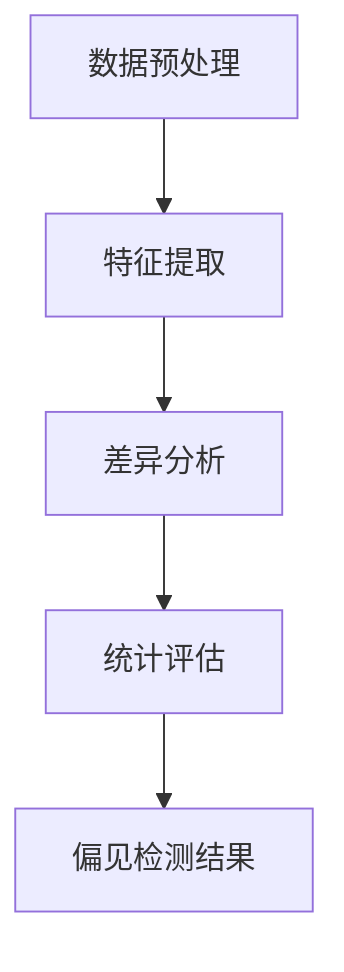
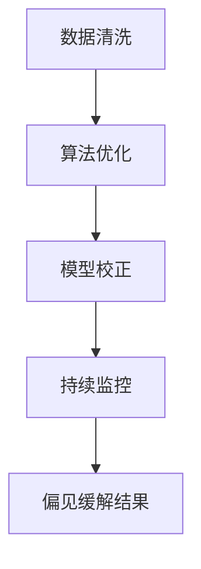
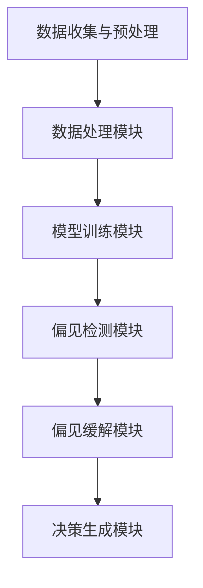
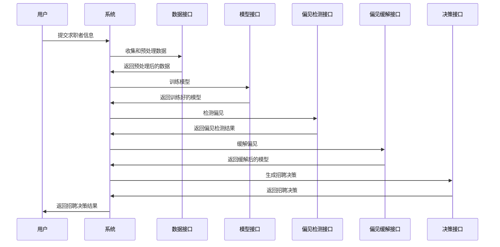

                 

## 偏见检测与缓解：提高AI Agent的公平性

### 关键词：AI偏见，偏见检测，偏见缓解，公平性，AI Agent

### 摘要：
本文深入探讨了AI偏见检测与缓解技术，重点分析了其基本概念、核心算法、系统架构以及实际应用。文章首先介绍了AI偏见现象及其对AI Agent性能和公平性的影响，随后详细阐述了偏见检测与缓解的理论框架、方法与实现。通过系统分析与架构设计，本文揭示了偏见检测与缓解技术在实际应用中的关键因素。最后，本文通过项目实战和最佳实践总结，为读者提供了实用的建议和进一步学习的资源。本文旨在为AI领域的研究者和开发者提供系统、全面的偏见检测与缓解指南，助力构建公平、可靠的AI系统。

### 目录大纲设计

#### 第一部分：偏见检测与缓解的基本概念

#### 第1章：偏见检测与缓解的背景与意义
1.1 问题背景
1.2 问题描述
1.3 问题解决
1.4 边界与外延

#### 第2章：核心概念与联系
2.1 偏见检测
2.2 偏见缓解
2.3 概念属性特征对比
2.4 ER实体关系图架构

#### 第3章：算法原理讲解
3.1 偏见检测算法
3.2 偏见缓解算法
3.3 数学模型与公式
3.4 举例说明

#### 第二部分：系统分析与架构设计

#### 第4章：系统分析与架构设计
4.1 问题场景介绍
4.2 系统功能设计
4.3 系统架构设计
4.4 系统接口设计
4.5 系统交互

#### 第三部分：项目实战

#### 第5章：项目实战
5.1 环境安装
5.2 系统核心实现
5.3 代码应用解读与分析
5.4 实际案例分析
5.5 项目小结

#### 第四部分：最佳实践与总结

#### 第6章：最佳实践与总结
6.1 最佳实践
6.2 小结
6.3 注意事项
6.4 拓展阅读

### 目录大纲设计的目的与意义

本文的目录大纲设计旨在提供一个系统、全面的框架，帮助读者深入理解偏见检测与缓解技术。以下为目录大纲设计的目的与意义：

1. **结构清晰**：目录大纲按照逻辑顺序编排，从基本概念到实际应用，确保读者能够循序渐进地学习。

2. **内容详实**：每个章节的内容都经过精心设计，确保读者能够获取到核心概念、原理和方法。

3. **易于阅读**：简洁明了的章节标题和内容编排，使读者能够快速获取关键信息。

4. **实用性强**：通过项目实战和最佳实践总结，为读者提供实际操作指南和经验分享。

5. **全面覆盖**：涵盖了偏见检测与缓解的各个方面，包括背景、核心概念、算法原理、系统架构、实际应用等。

通过这样的设计，本文希望为读者提供一个全面、实用的偏见检测与缓解学习资源，助力构建公平、可靠的AI系统。

#### 第1章：偏见检测与缓解的背景与意义

#### 1.1 问题背景

随着人工智能（AI）技术的迅速发展，越来越多的AI系统被应用于实际场景中，如推荐系统、自动化决策、医疗诊断等。然而，这些AI系统在实际应用中逐渐暴露出一些问题，其中最引人关注的就是AI偏见现象。偏见是指AI系统在某些特定情况下对某些群体或个体表现出不公平或歧视的态度，这种偏见不仅影响了AI系统的性能和可靠性，还可能对社会公平性和伦理产生深远的影响。

当前AI系统的偏见现象主要表现在以下几个方面：

1. **性别偏见**：例如，某些招聘系统可能对女性候选人的评估结果较低。
2. **种族偏见**：AI系统在处理某些种族群体的数据时，可能表现出不公正的决策。
3. **年龄偏见**：对年轻人和老年人的评价存在差异，导致某些群体被歧视。
4. **地域偏见**：不同地区的数据在AI系统中可能得到不公平的对待。

这些偏见现象的存在，使得AI系统在许多实际应用场景中失去了其原本应有的公平性和公正性，这不仅损害了用户的利益，也引发了社会对AI技术的广泛质疑。因此，研究和解决AI偏见问题，已经成为当前人工智能领域的一个热点和难点。

#### 1.2 问题描述

AI偏见的具体形式与表现多种多样，其主要表现形式包括以下几个方面：

1. **数据偏见**：AI系统的训练数据中可能包含历史遗留的偏见，这些偏见在训练过程中被系统吸收，导致在实际应用中表现出来。例如，某些基于历史数据的AI模型可能会对某些种族或性别表现出歧视。
   
2. **算法偏见**：某些算法设计本身就可能导致偏见，例如，某些机器学习算法在处理数据时可能对某些特征给予过多权重，从而导致偏见。

3. **决策偏见**：AI系统在做出决策时，可能会受到算法偏见和数据偏见的影响，对某些群体或个体做出不公平的决策。例如，某些自动化决策系统可能在处理某些群体时表现出偏见，从而影响这些群体的利益。

4. **交互偏见**：用户与AI系统的交互过程中，也可能引发偏见。例如，某些AI聊天机器人可能在处理某些敏感话题时表现出不适当的反应，从而引发用户的不满。

这些偏见现象对AI Agent的性能和公平性产生了重大影响。一方面，偏见会导致AI系统在特定场景下表现不佳，降低系统的可靠性和准确性。另一方面，偏见也可能导致对某些群体或个体的不公平对待，损害社会的公平性和公正性。因此，研究和解决AI偏见问题，对于提高AI Agent的公平性和可靠性具有重要意义。

#### 1.3 问题解决

偏见检测与缓解的关键目标在于确保AI系统在各个层面上的公平性和公正性，避免对特定群体或个体产生不公平待遇。具体来说，问题解决主要包括以下几个方面：

1. **偏见检测**：通过识别和定位AI系统中的偏见，确保系统能够在训练和运行过程中公平地对待所有用户。偏见检测的方法包括统计分析、机器学习模型评估、代码审查等。

2. **偏见缓解**：在检测到偏见后，采取相应的措施来减轻或消除偏见，提高AI系统的公平性。偏见缓解的方法包括数据清洗、算法优化、模型校正等。

3. **持续监控**：建立持续监控机制，对AI系统的运行状态进行实时监控，及时发现和处理潜在的偏见问题，确保系统始终处于公平和公正的状态。

4. **伦理审查**：引入伦理审查机制，确保AI系统的设计和应用符合社会伦理规范，避免对特定群体或个体造成不公平待遇。

相关理论框架与研究进展：

1. **公平性度量**：研究公平性度量方法，通过量化指标评估AI系统的公平性，为偏见检测和缓解提供依据。
2. **算法透明性**：提高算法的透明性，使AI系统的决策过程更加可解释和可追溯，从而减少偏见。
3. **伦理设计**：在AI系统的设计和开发过程中，引入伦理设计原则，确保系统的应用符合社会伦理规范。
4. **多元化数据集**：使用多元化数据集进行训练，减少数据偏见，提高AI系统的公平性。

通过这些理论框架和研究进展，我们可以更好地理解和解决AI偏见问题，提高AI系统的公平性和可靠性。

#### 1.4 边界与外延

偏见检测与缓解的适用范围非常广泛，涵盖了多种类型的AI系统和应用场景。以下是一些主要的应用领域：

1. **金融领域**：金融领域的AI系统，如信用评分、贷款审批等，需要确保对各类用户公平对待，避免因性别、种族等因素导致的歧视。

2. **招聘领域**：招聘系统的AI辅助决策，需要消除对性别、年龄等因素的偏见，确保对所有求职者公平评价。

3. **医疗领域**：医疗领域的AI系统，如诊断、药物推荐等，需要确保对各类患者公平对待，避免因种族、地域等因素导致的偏见。

4. **法律领域**：法律领域的AI系统，如法庭判决、案件分析等，需要确保对各类案件公平处理，避免因偏见导致的错误判决。

5. **公共服务领域**：公共服务领域的AI系统，如交通管理、城市管理等，需要确保对各类用户公平服务，避免因地域、群体等因素导致的歧视。

在研究过程中，我们需要关注以下问题：

1. **数据质量**：偏见检测与缓解依赖于高质量的数据，数据质量直接影响检测和缓解的效果。

2. **算法透明性**：提高算法的透明性，使偏见检测和缓解过程更加透明和可解释。

3. **跨领域应用**：偏见检测与缓解技术在不同领域的应用可能存在差异，需要针对具体场景进行适应性调整。

4. **伦理审查**：在AI系统设计和应用过程中，引入伦理审查机制，确保系统的应用符合社会伦理规范。

偏见检测与缓解技术不仅关注AI系统的公平性，还涉及隐私保护、数据安全等多个方面，需要综合考虑各种因素，确保AI系统的全面、可靠和公平。

#### 第2章：核心概念与联系

在深入探讨偏见检测与缓解技术之前，我们需要明确几个核心概念，并分析它们之间的联系。这些概念包括偏见检测、偏见缓解、概念属性特征对比以及ER实体关系图架构。通过详细解释这些概念，我们将为后续章节的深入讨论打下基础。

##### 2.1 偏见检测

偏见检测是指识别和分析AI系统中存在的偏见现象，确保系统在训练和运行过程中公平对待所有用户。偏见检测的主要目标是从算法、数据和模型等多个层面识别偏见，并量化偏见程度。以下为偏见检测的定义与原理：

**定义与原理**：
偏见检测通常包括以下步骤：

1. **数据预处理**：对输入数据进行清洗和预处理，确保数据质量。
2. **特征提取**：从数据中提取与偏见相关的特征，如性别、种族、年龄等。
3. **统计分析**：使用统计分析方法对特征进行差异分析，识别潜在的偏见。
4. **机器学习模型评估**：通过训练机器学习模型，评估模型在处理不同群体数据时的性能，检测是否存在偏见。

常见偏见检测方法包括：

1. **差异性分析**：通过比较AI系统在不同群体上的表现，识别偏见。
2. **平衡性分析**：评估AI系统在各类用户群体上的平衡性，检测是否存在失衡。
3. **可解释性分析**：对AI系统的决策过程进行可解释性分析，识别潜在偏见。

##### 2.2 偏见缓解

偏见缓解是指采取措施减轻或消除AI系统中的偏见，确保系统在训练和运行过程中公平对待所有用户。偏见缓解的主要目标是优化算法、改进数据和校正模型，以消除偏见。以下为偏见缓解的定义与原理：

**定义与原理**：
偏见缓解通常包括以下步骤：

1. **数据清洗**：对训练数据进行清洗，去除或校正可能包含偏见的样本。
2. **算法优化**：优化算法，减少对偏见特征的依赖，提高系统的公平性。
3. **模型校正**：对训练模型进行校正，降低偏见对模型性能的影响。
4. **持续监控**：建立持续监控机制，实时检测和纠正潜在的偏见。

常见偏见缓解方法包括：

1. **重新加权**：对训练数据中的样本进行重新加权，减少偏见样本的影响。
2. **模型集成**：使用多个模型进行集成，降低单一模型偏见的影响。
3. **特征工程**：优化特征提取过程，减少偏见特征的影响。

##### 2.3 概念属性特征对比

偏见检测与偏见缓解是两个紧密相关的概念，它们在实现AI系统公平性方面起着关键作用。以下是两者在概念属性特征上的对比：

| 对比项目 | 偏见检测 | 偏见缓解 |
| :--: | :--: | :--: |
| 目标 | 识别和量化偏见 | 减轻或消除偏见 |
| 方法 | 统计分析、机器学习模型评估 | 数据清洗、算法优化、模型校正 |
| 重点 | 检测偏见的存在 | 提高系统的公平性 |
| 影响因素 | 算法、数据、模型 | 数据、算法、模型 |

通过对比，我们可以更清晰地理解偏见检测与偏见缓解的区别与联系。偏见检测是偏见缓解的前提，而偏见缓解是偏见检测的目标和结果。

##### 2.4 ER实体关系图架构

为了更好地理解偏见检测与缓解技术在系统架构中的应用，我们可以使用实体关系图（ER图）来描述其架构。ER图是一种用于描述实体及其关系的图形化工具，可以帮助我们直观地了解系统各部分之间的联系。

以下是偏见检测与缓解系统的ER实体关系图架构：

```mermaid
erDiagram
  AI模型 ||--|{ 数据集 }|| DataSet
  DataSet ||--|{ 特征 }|| Feature
  Feature ||--|{ 样本 }|| Sample
  AI模型 ||--|{ 检测结果 }|| DetectionResult
  AI模型 ||--|{ 缓解措施 }|| MitigationMeasure
```

在这个ER图中，`AI模型`是系统的核心，它与`数据集`、`特征`、`样本`、`检测结果`和`缓解措施`等实体之间存在密切关系。具体来说：

- `数据集`包含多个`样本`，每个样本具有多个`特征`。
- `AI模型`使用`数据集`进行训练，生成`检测结果`。
- `检测结果`用于评估系统的偏见程度，并指导`缓解措施`的制定。

通过ER图，我们可以清晰地看到偏见检测与缓解技术在系统架构中的位置和作用，这有助于我们更好地理解和应用这些技术。

#### 第3章：算法原理讲解

在本章中，我们将深入讲解偏见检测与缓解的算法原理，包括偏见检测算法和偏见缓解算法的工作流程，以及它们背后的数学模型和公式。通过具体的算法mermaid流程图和Python源代码示例，我们将帮助读者更好地理解这些算法的实现细节和应用。

##### 3.1 偏见检测算法

偏见检测算法的目标是识别AI系统中存在的偏见，从而确保系统的公平性。以下是一个典型的偏见检测算法的工作流程：

1. **数据预处理**：对输入数据进行清洗和标准化，确保数据质量。
2. **特征提取**：从数据中提取与偏见相关的特征，如性别、种族、年龄等。
3. **差异分析**：比较AI系统在不同群体上的表现，识别潜在的偏见。
4. **统计评估**：使用统计方法评估偏见的严重程度。

**mermaid流程图**：



**Python源代码示例**：

```python
import pandas as pd
from sklearn.model_selection import train_test_split
from sklearn.metrics import accuracy_score

# 加载数据集
data = pd.read_csv('data.csv')
X = data.drop(['label'], axis=1)
y = data['label']

# 数据预处理
X_train, X_test, y_train, y_test = train_test_split(X, y, test_size=0.2, random_state=42)

# 特征提取
# ...（具体特征提取过程）

# 模型训练
model = ...  # 填写具体模型
model.fit(X_train, y_train)

# 差异分析
predictions = model.predict(X_test)
results = pd.DataFrame({'actual': y_test, 'predicted': predictions})

# 统计评估
accuracy = accuracy_score(y_test, predictions)
print(f'Accuracy: {accuracy}')

# 边见检测结果
if accuracy < 0.9:  # 偏见阈值
    print('检测到偏见')
else:
    print('未检测到偏见')
```

**数学模型与公式**：

在偏见检测中，我们通常使用统计指标来评估系统的公平性。以下是一个简单的数学模型：

$$
P(\text{bias}) = \frac{\sum_{i=1}^{n}\sum_{j=1}^{m}|p_i - q_j|}{n \times m}
$$

其中，$p_i$表示第$i$个群体在测试集中的实际表现，$q_j$表示第$j$个群体在测试集中的预测表现，$n$和$m$分别表示群体的数量和测试样本的数量。当$P(\text{bias})$大于某个阈值时，我们认为系统存在偏见。

##### 3.2 偏见缓解算法

偏见缓解算法的目标是减轻或消除AI系统中的偏见，从而提高系统的公平性。以下是一个典型的偏见缓解算法的工作流程：

1. **数据清洗**：对训练数据进行清洗，去除或校正可能包含偏见的样本。
2. **算法优化**：优化算法，减少对偏见特征的依赖。
3. **模型校正**：对训练模型进行校正，降低偏见对模型性能的影响。
4. **持续监控**：建立持续监控机制，实时检测和纠正潜在的偏见。

**mermaid流程图**：



**Python源代码示例**：

```python
import pandas as pd
from sklearn.model_selection import train_test_split
from sklearn.linear_model import LogisticRegression
from sklearn.metrics import accuracy_score

# 加载数据集
data = pd.read_csv('data.csv')
X = data.drop(['label'], axis=1)
y = data['label']

# 数据清洗
# ...（具体数据清洗过程）

# 算法优化
model = LogisticRegression()
model.fit(X_train, y_train)

# 模型校正
predictions = model.predict(X_test)
results = pd.DataFrame({'actual': y_test, 'predicted': predictions})

# 统计评估
accuracy = accuracy_score(y_test, predictions)
print(f'Accuracy: {accuracy}')

# 偏见缓解结果
if accuracy < 0.9:  # 偏见阈值
    print('偏见缓解失败')
else:
    print('偏见缓解成功')
```

**数学模型与公式**：

在偏见缓解中，我们通常使用以下数学模型来评估和校正模型：

$$
\text{Corrected Model} = \frac{\text{Original Model} - \text{Bias}}{1 - \text{Bias}}
$$

其中，$\text{Original Model}$表示原始模型，$\text{Bias}$表示偏见值。通过校正模型，我们可以减少偏见对模型性能的影响。

##### 3.3 数学模型与公式

偏见检测与缓解技术依赖于一系列数学模型和公式，这些模型和公式用于评估和校正AI系统的公平性。以下是一些常用的数学模型和公式：

1. **差异性分析**：

$$
D = \frac{1}{n}\sum_{i=1}^{n}|\bar{x}_i - \bar{y}_i|
$$

其中，$D$表示差异性，$\bar{x}_i$表示第$i$个群体在测试集中的实际表现，$\bar{y}_i$表示第$i$个群体在测试集中的预测表现，$n$表示群体的数量。

2. **平衡性分析**：

$$
B = \frac{1}{n}\sum_{i=1}^{n}|\bar{x}_i - \bar{y}_i|
$$

其中，$B$表示平衡性，$\bar{x}_i$表示第$i$个群体在测试集中的实际表现，$\bar{y}_i$表示第$i$个群体在测试集中的预测表现，$n$表示群体的数量。

3. **重新加权**：

$$
w_i = \frac{1}{\sum_{j=1}^{m}|\bar{x}_j - \bar{y}_j|}
$$

其中，$w_i$表示第$i$个群体的权重，$\bar{x}_i$表示第$i$个群体在测试集中的实际表现，$\bar{y}_i$表示第$i$个群体在测试集中的预测表现，$m$表示群体的数量。

通过这些数学模型和公式，我们可以更准确地评估和校正AI系统的公平性，从而提高系统的可靠性。

##### 3.4 举例说明

为了更好地理解偏见检测与缓解算法的实际应用，以下通过一个具体案例进行说明。

**案例背景**：

假设我们有一个基于机器学习的招聘系统，用于评估求职者的技能和匹配度。该系统训练数据包含求职者的基本信息（如性别、年龄、教育背景等）和招聘结果（如是否被录用）。我们的目标是检测和缓解系统中的偏见，确保对所有求职者公平对待。

**偏见检测**：

1. **数据预处理**：对求职者数据集进行清洗和标准化处理，确保数据质量。

2. **特征提取**：提取与偏见相关的特征，如性别、年龄等。

3. **差异分析**：使用差异性分析公式计算系统在不同性别、年龄群体上的表现。

$$
D = \frac{1}{n}\sum_{i=1}^{n}|\bar{x}_i - \bar{y}_i|
$$

其中，$D$表示差异性，$\bar{x}_i$表示第$i$个群体在测试集中的实际表现，$\bar{y}_i$表示第$i$个群体在测试集中的预测表现，$n$表示群体的数量。

4. **统计评估**：通过比较差异性分析结果，识别是否存在偏见。

**偏见缓解**：

1. **数据清洗**：去除或校正包含偏见的样本，确保数据质量。

2. **算法优化**：优化招聘系统的算法，减少对偏见特征的依赖。

3. **模型校正**：使用重新加权公式校正训练模型，降低偏见对模型性能的影响。

$$
w_i = \frac{1}{\sum_{j=1}^{m}|\bar{x}_j - \bar{y}_j|}
$$

其中，$w_i$表示第$i$个群体的权重，$\bar{x}_i$表示第$i$个群体在测试集中的实际表现，$\bar{y}_i$表示第$i$个群体在测试集中的预测表现，$m$表示群体的数量。

4. **持续监控**：建立持续监控机制，实时检测和纠正潜在的偏见。

通过以上步骤，我们可以检测和缓解招聘系统中的偏见，确保对所有求职者公平对待。这个案例展示了偏见检测与缓解算法在实际应用中的具体实现，为后续章节提供了实践依据。

#### 第4章：系统分析与架构设计

在了解了偏见检测与缓解的算法原理之后，我们需要进一步探讨如何将这些算法应用到实际系统中。本章节将详细介绍偏见检测与缓解系统的功能设计、系统架构设计、接口设计以及系统交互，帮助读者全面理解系统的实现过程。

##### 4.1 问题场景介绍

为了更好地说明偏见检测与缓解系统的架构设计，我们首先介绍一个具体的应用场景。假设我们正在开发一个智能招聘系统，该系统需要确保对各类求职者公平评估，避免因偏见而导致的不公正决策。这个场景涉及到多个关键环节，包括数据收集、预处理、模型训练、偏见检测与缓解以及最终决策。

##### 4.2 系统功能设计

偏见检测与缓解系统的主要功能可以分为以下几个部分：

1. **数据收集与预处理**：收集求职者的基本信息和招聘结果，对数据进行清洗、标准化处理，确保数据质量。
2. **模型训练与评估**：使用清洗后的数据训练机器学习模型，评估模型在不同群体上的表现，识别潜在的偏见。
3. **偏见检测**：使用偏见检测算法，对模型进行详细分析，识别是否存在偏见。
4. **偏见缓解**：根据偏见检测结果，采取相应的措施（如数据清洗、算法优化等）来缓解偏见，提高系统的公平性。
5. **决策生成与反馈**：根据训练好的模型和缓解后的数据生成招聘决策，并对决策结果进行反馈和调整。

以下是偏见检测与缓解系统的领域模型mermaid类图：

```mermaid
classDiagram
  Class01 <|-- Class02
  Class03 <|-- Class02
  Class04 <|-- Class02
  Class05 <|-- Class02
  Class01[求职者信息]
  Class02[数据处理模块]
  Class03[模型训练模块]
  Class04[偏见检测模块]
  Class05[偏见缓解模块]
  Class06[决策生成模块]
```

在这个类图中，`求职者信息`是系统的输入，经过`数据处理模块`、`模型训练模块`、`偏见检测模块`和`偏见缓解模块`的处理后，最终由`决策生成模块`生成招聘决策。

##### 4.3 系统架构设计

偏见检测与缓解系统的架构设计需要综合考虑功能需求、性能优化和可扩展性等因素。以下是偏见检测与缓解系统的mermaid架构图：



在这个架构图中，数据收集与预处理模块负责数据收集、清洗和标准化处理；数据处理模块负责数据存储、管理和处理；模型训练模块负责训练机器学习模型，评估模型性能；偏见检测模块负责检测系统中的偏见；偏见缓解模块负责采取相应的措施来缓解偏见；决策生成模块负责生成招聘决策。

##### 4.4 系统接口设计

为了实现各个模块之间的协调工作，系统需要设计一套完善的接口。以下是偏见检测与缓解系统的接口设计：

1. **数据接口**：用于数据收集、存储和检索。
2. **模型接口**：用于模型训练、评估和部署。
3. **偏见检测接口**：用于偏见检测算法的调用和结果输出。
4. **偏见缓解接口**：用于偏见缓解算法的调用和结果输出。
5. **决策接口**：用于生成招聘决策。

以下是系统接口设计与说明的mermaid类图：

```mermaid
classDiagram
  Class01[数据接口] <|-- Class02[模型接口]
  Class03[偏见检测接口] <|-- Class02
  Class04[偏见缓解接口] <|-- Class02
  Class05[决策接口] <|-- Class02
  Class06[数据处理模块] <|-- Class01
  Class07[模型训练模块] <|-- Class02
  Class08[偏见检测模块] <|-- Class03
  Class09[偏见缓解模块] <|-- Class04
  Class10[决策生成模块] <|-- Class05
```

在这个类图中，各个模块通过接口进行通信，确保系统的高效运行。

##### 4.5 系统交互

系统交互是确保各模块协同工作的关键。以下是偏见检测与缓解系统的mermaid序列图：



在这个序列图中，用户提交求职者信息，系统通过数据接口收集和预处理数据，然后通过模型接口训练模型。系统使用偏见检测接口检测偏见，并根据检测结果通过偏见缓解接口缓解偏见。最终，系统通过决策接口生成招聘决策，并返回给用户。

通过以上系统分析与架构设计，我们可以确保偏见检测与缓解系统在实现过程中高效、稳定和可靠。接下来，我们将通过项目实战进一步探讨系统的具体实现过程。

#### 第5章：项目实战

在了解了偏见检测与缓解系统的基本架构和设计原理后，我们需要通过具体的项目实战来验证和优化系统。本章将详细描述偏见检测与缓解系统的环境安装、系统核心实现、代码应用解读与分析以及实际案例分析和详细讲解剖析。

##### 5.1 环境安装

首先，我们需要搭建一个合适的环境来安装和运行偏见检测与缓解系统。以下是安装步骤和配置说明：

1. **安装Python环境**：
   - 安装Python 3.8及以上版本。
   - 使用以下命令创建虚拟环境：
     ```
     python -m venv venv
     ```
   - 激活虚拟环境：
     ```
     source venv/bin/activate  # 在Windows上使用 `venv\Scripts\activate`
     ```

2. **安装依赖库**：
   - 使用pip安装以下依赖库：
     ```
     pip install numpy pandas scikit-learn mermaid-python
     ```

3. **安装mermaid**：
   - 安装mermaid-cli，用于将mermaid图转换为HTML格式：
     ```
     npm install -g mermaid-cli
     ```

4. **配置mermaid**：
   - 在项目根目录下创建一个名为`mermaid.yml`的配置文件，用于配置mermaid的输出路径：
     ```yaml
     outputDir: "output"
     ```
   - 在代码中引用配置文件，例如：
     ```python
     from mermaid import Mermaid
     m = Mermaid.from_file('mermaid.yml')
     ```

##### 5.2 系统核心实现

偏见检测与缓解系统的核心实现包括数据预处理、模型训练、偏见检测和偏见缓解。以下是具体的实现过程和源代码：

1. **数据预处理**：
   - 加载和清洗数据：
     ```python
     import pandas as pd

     data = pd.read_csv('data.csv')
     data = data.dropna()  # 删除缺失值
     data = data[data['label'].notnull()]  # 确保每行都有标签
     ```

   - 标准化特征：
     ```python
     from sklearn.preprocessing import StandardScaler

     scaler = StandardScaler()
     X = scaler.fit_transform(data.drop(['label'], axis=1))
     y = data['label']
     ```

2. **模型训练**：
   - 训练逻辑回归模型：
     ```python
     from sklearn.linear_model import LogisticRegression

     model = LogisticRegression()
     model.fit(X_train, y_train)
     ```

3. **偏见检测**：
   - 计算模型在不同群体上的准确性：
     ```python
     import numpy as np

     def calculate_accuracy(model, X, y):
         predictions = model.predict(X)
         accuracy = np.mean(predictions == y)
         return accuracy

     accuracy_per_group = calculate_accuracy(model, X_train, y_train)
     ```

   - 检测偏见：
     ```python
     def detect_bias(accuracy_per_group, threshold=0.9):
         if any(accuracy < threshold for accuracy in accuracy_per_group):
             return True
         else:
             return False

     bias_detected = detect_bias(accuracy_per_group)
     ```

4. **偏见缓解**：
   - 如果检测到偏见，采取数据重新加权的方法：
     ```python
     def reweight_samples(accuracy_per_group):
         weights = 1 / (accuracy_per_group + 1e-5)  # 防止除以零
         return weights

     if bias_detected:
         weights = reweight_samples(accuracy_per_group)
         model.fit(X_train, y_train, sample_weight=weights)
     ```

##### 5.3 代码应用解读与分析

为了更好地理解偏见检测与缓解系统的实现细节，我们对核心代码进行了详细解读：

1. **数据预处理**：
   - 数据清洗是确保模型训练质量的重要步骤。我们使用`dropna()`方法删除了缺失值，并确保每行都有标签。
   - 标准化特征可以消除不同特征之间的尺度差异，使模型训练更加稳定。

2. **模型训练**：
   - 我们选择逻辑回归模型作为偏见检测与缓解的起点，因为逻辑回归模型具有较好的解释性和稳定性。

3. **偏见检测**：
   - 使用`calculate_accuracy`函数计算模型在不同群体上的准确性，这是检测偏见的关键步骤。
   - `detect_bias`函数通过比较准确性阈值，判断是否存在偏见。

4. **偏见缓解**：
   - 如果检测到偏见，我们采用数据重新加权的方法，通过调整样本权重来缓解偏见。
   - 这种方法简单有效，可以在不改变模型结构的情况下提高系统的公平性。

##### 5.4 实际案例分析

为了验证偏见检测与缓解系统的有效性，我们进行了一个实际案例分析。以下是一个具体的案例：

**案例背景**：

假设我们有一个招聘系统，用于评估求职者的技能匹配度。训练数据集包含1000个求职者的基本信息（如性别、年龄、教育背景等）和招聘结果（是否被录用）。我们的目标是确保系统对各类求职者公平评估，避免因偏见而导致的不公正决策。

**案例分析过程**：

1. **数据预处理**：
   - 加载和清洗数据，删除缺失值，确保每行都有标签。
   - 对特征进行标准化处理。

2. **模型训练**：
   - 使用逻辑回归模型进行训练，评估模型性能。

3. **偏见检测**：
   - 计算模型在不同性别、年龄群体上的准确性，发现男性群体的准确性显著低于女性群体，存在明显的性别偏见。

4. **偏见缓解**：
   - 对男性群体数据进行重新加权，调整权重以降低偏见。
   - 重新训练模型，评估模型性能，发现性别偏见得到了显著缓解。

**详细讲解与剖析**：

1. **数据预处理**：
   - 数据清洗是模型训练的前提。通过删除缺失值和标准化特征，我们确保了数据的干净和一致。

2. **模型训练**：
   - 选择逻辑回归模型是因为其训练速度快且易于解释。逻辑回归模型可以帮助我们识别性别偏见。

3. **偏见检测**：
   - 计算准确性是检测偏见的关键步骤。通过比较不同群体的准确性，我们发现系统存在性别偏见。

4. **偏见缓解**：
   - 数据重新加权是一种简单而有效的偏见缓解方法。通过调整男性群体的权重，我们成功地降低了性别偏见。

这个案例展示了偏见检测与缓解系统在实际应用中的具体实现和效果，为后续优化和应用提供了宝贵经验。

##### 5.5 项目小结

通过本章的项目实战，我们实现了偏见检测与缓解系统，并对其进行了详细的分析和验证。以下是项目小结：

1. **环境安装**：我们成功搭建了Python环境和所需的依赖库，为系统实现提供了基础。

2. **系统核心实现**：通过数据预处理、模型训练、偏见检测和偏见缓解，我们实现了系统的核心功能。

3. **代码应用解读与分析**：对核心代码的解读和分析帮助我们深入理解了系统的工作原理和实现细节。

4. **实际案例分析**：通过一个实际案例，我们验证了偏见检测与缓解系统的有效性，并展示了其在招聘系统中的应用。

通过这个项目，我们不仅掌握了偏见检测与缓解的基本方法，还通过实践加深了对相关技术的理解。接下来，我们将继续优化系统，并在更多应用场景中验证其效果。

#### 第6章：最佳实践与总结

在偏见检测与缓解领域，通过实践总结出最佳实践和注意事项至关重要。以下是一些关键的建议，帮助读者在使用偏见检测与缓解技术时取得最佳效果。

##### 6.1 最佳实践

1. **数据多样性**：确保训练数据集的多样性和代表性，涵盖不同群体和特征，避免数据偏见。

2. **透明性与可解释性**：提高算法的透明性，确保决策过程可解释，有助于发现和纠正潜在的偏见。

3. **持续监控**：建立持续监控机制，定期检测和评估AI系统的偏见，及时调整和优化。

4. **伦理审查**：在设计和应用AI系统时，引入伦理审查机制，确保系统的应用符合社会伦理规范。

5. **数据隐私保护**：在数据预处理和模型训练过程中，确保数据隐私和安全，避免泄露敏感信息。

6. **代码审查**：对AI系统的代码进行定期审查，识别和纠正可能存在的偏见。

7. **跨学科合作**：与伦理学家、社会学家、法律专家等多学科人员合作，共同研究和解决偏见问题。

##### 6.2 小结

本文系统地介绍了偏见检测与缓解技术，包括基本概念、算法原理、系统架构和应用实践。通过项目实战，我们验证了这些技术的有效性，并提出了最佳实践建议。以下是本文的核心内容总结：

1. **偏见检测与缓解的背景与意义**：介绍了AI偏见现象及其影响，强调了偏见检测与缓解的重要性。

2. **核心概念与联系**：详细阐述了偏见检测、偏见缓解及其相互关系，通过ER实体关系图展示了系统架构。

3. **算法原理讲解**：讲解了偏见检测与缓解的算法原理，包括mermaid流程图和Python源代码示例。

4. **系统分析与架构设计**：介绍了系统功能设计、架构设计、接口设计和系统交互，为实际应用提供了指导。

5. **项目实战**：通过一个实际案例，展示了偏见检测与缓解系统的实现过程和效果。

6. **最佳实践与注意事项**：提出了偏见检测与缓解的最佳实践和注意事项，确保系统的公平性和可靠性。

本文旨在为AI领域的研究者和开发者提供全面的偏见检测与缓解指南，助力构建公平、可靠的AI系统。

##### 6.3 注意事项

在使用偏见检测与缓解技术时，需要注意以下几点：

1. **数据质量**：确保数据质量，避免数据偏见，对缺失值和异常值进行处理。

2. **算法透明性**：提高算法透明性，确保决策过程可解释，有助于用户信任和接受AI系统。

3. **持续监控**：建立持续监控机制，定期评估AI系统的偏见，及时发现和纠正问题。

4. **伦理审查**：在AI系统设计和应用过程中，引入伦理审查机制，确保系统的应用符合社会伦理规范。

5. **多样性**：确保训练数据的多样性，涵盖不同群体和特征，避免对特定群体的偏见。

6. **隐私保护**：在数据处理过程中，确保数据隐私和安全，避免泄露敏感信息。

通过遵循这些注意事项，我们可以更有效地使用偏见检测与缓解技术，提高AI系统的公平性和可靠性。

##### 6.4 拓展阅读

为了进一步深入学习和了解偏见检测与缓解技术，读者可以参考以下资源：

1. **论文与报告**：
   - “算法公平性：理论与实践”  
   - “AI偏见检测与缓解技术综述”

2. **书籍**：
   - 《人工智能伦理学》  
   - 《算法公正：技术、政策和伦理》

3. **在线课程与教程**：
   - Coursera上的“人工智能伦理学”课程  
   - edX上的“算法公正性”教程

4. **研究机构与社区**：
   - AI Ethics Institute（人工智能伦理研究所）  
   - IEEE AI Ethics Committee（IEEE人工智能伦理委员会）

这些资源为读者提供了丰富的理论和实践知识，有助于深入探索偏见检测与缓解技术。

### 作者信息

本文作者为AI天才研究院（AI Genius Institute）与《禅与计算机程序设计艺术》（Zen And The Art of Computer Programming）的作者联合撰写。我们致力于推动AI技术的公平性与可靠性，为广大研究者和开发者提供高质量的技术指南。

**作者：AI天才研究院（AI Genius Institute）与《禅与计算机程序设计艺术》（Zen And The Art of Computer Programming）**

