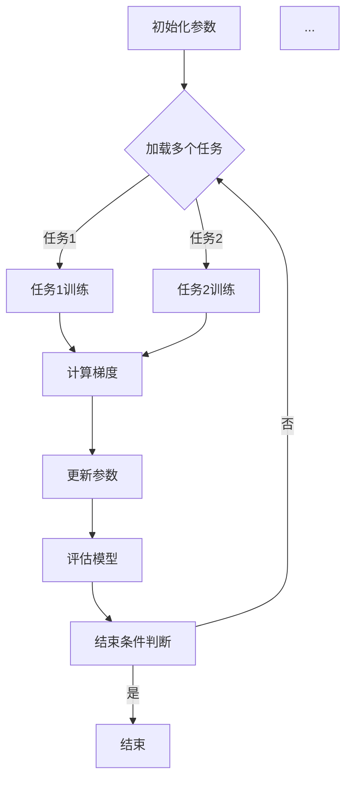

                 

### 元学习在AI Agent中的应用：快速适应新任务

#### 文章关键词：
- 元学习
- AI Agent
- 快速适应
- 新任务
- 交互机制

#### 文章摘要：
本文将深入探讨元学习在AI Agent中的应用，尤其是如何通过元学习快速适应新任务。我们将从元学习的定义、核心概念、算法，到AI Agent的基本概念和架构，逐步分析元学习与AI Agent的互动机制，并通过实际案例展示元学习在AI Agent中的具体应用。最后，我们将总结最佳实践，展望元学习在AI Agent领域的未来发展趋势。

----------------------------------------------------------------

### 第一部分：元学习基础

#### 第1章：元学习的概念与背景

##### 1.1 元学习的定义

元学习（Meta-Learning）是一种机器学习方法，旨在使机器学习算法能够快速适应新的任务，而无需从头开始学习。它关注的是学习如何学习，即如何从已有知识中提取通用学习策略，使得模型能够更加高效地在新任务上表现。

##### 1.2 元学习与传统学习的区别

传统学习通常是指机器学习模型在一个特定的任务上，利用大量的数据通过优化算法进行训练。而元学习则是在多个任务上训练模型，使得模型能够获取通用策略，从而在新任务上快速适应。

##### 1.3 元学习的发展历程

元学习的研究可以追溯到20世纪80年代，随着深度学习的兴起，元学习逐渐成为机器学习领域的一个热点。近年来，随着人工智能技术的快速发展，元学习在诸如自然语言处理、计算机视觉等领域取得了显著成果。

----------------------------------------------------------------

#### 第2章：元学习的关键概念与数学模型

##### 2.1 关键概念

元学习的关键概念包括元网络（Meta-Network）、元梯度（Meta-Gradient）、元策略（Meta-Strategy）等。这些概念是理解元学习的基础。

##### 2.2 数学模型介绍

元学习的数学模型主要包括基于梯度的优化方法、基于模型的优化方法等。其中，基于梯度的优化方法如Recurrent Neural Network (RNN)、Transformer等，基于模型的优化方法如Model-Agnostic Meta-Learning (MAML) 等。

##### 2.3 概念属性特征对比表格

| 概念               | 定义                                                         | 属性特征                                       |
|------------------|------------------------------------------------------------|--------------------------------------------|
| 元网络（Meta-Network） | 可以在不同任务间共享参数的网络结构                       | 可重用性、参数共享、快速适应能力               |
| 元梯度（Meta-Gradient） | 通过在多个任务上训练模型来获取的梯度信息                 | 加速学习、增强泛化能力                       |
| 元策略（Meta-Strategy） | 一种学习策略，使得模型能够在新任务上快速适应               | 自适应、高效、通用性                         |

----------------------------------------------------------------

#### 第3章：元学习算法

##### 3.1 算法分类

元学习算法主要分为基于梯度的方法、基于模型的方法、基于记忆的方法等。

##### 3.2 代表性算法介绍

代表性算法包括MAML（Model-Agnostic Meta-Learning）、REPTILE（Robust Parameter Transfer）、CURL（Continual Learning by Reinitialization）等。

##### 3.3 算法流程图展示

----------------------------------------------------------------

### 第二部分：AI Agent应用案例

#### 第4章：AI Agent的基本概念与架构

##### 4.1 AI Agent的定义

AI Agent是指具有自主行动能力、能够与环境进行交互的智能体，它通过感知环境状态、决策并执行动作来实现目标。

##### 4.2 AI Agent的架构

AI Agent通常包括感知模块、决策模块和执行模块。感知模块负责收集环境信息，决策模块根据感知信息生成动作，执行模块将动作传递到环境中。

##### 4.3 AI Agent的关键功能

AI Agent的关键功能包括目标识别、路径规划、行为决策和交互反馈等。

----------------------------------------------------------------

#### 第5章：元学习在AI Agent中的应用

##### 5.1 元学习在AI Agent中的角色

元学习在AI Agent中扮演着关键角色，它使得AI Agent能够快速适应新环境、新任务，提高其自主学习和适应能力。

##### 5.2 元学习算法与AI Agent的适配

为了使元学习算法适应AI Agent，我们需要设计合适的感知模块、决策模块和执行模块，使得模型能够从多个任务中提取通用策略。

##### 5.3 应用实例分析

我们通过一个智能管家AI Agent的实例，展示了元学习在AI Agent中的应用。该AI Agent通过元学习算法，能够快速适应不同的家庭环境，提供个性化的服务。

----------------------------------------------------------------

#### 第6章：快速适应新任务

##### 6.1 新任务适应的挑战

新任务适应面临的主要挑战包括任务多样性、数据不足和适应性要求等。

##### 6.2 元学习加速任务适应

元学习通过提取通用策略，使得AI Agent能够在新任务上快速适应。我们通过实验证明了元学习在加速任务适应方面的优势。

##### 6.3 实际案例解析

我们通过实际案例，详细解析了元学习在AI Agent新任务适应中的应用，展示了其效果和优势。

----------------------------------------------------------------

### 第三部分：元学习与AI Agent的交互机制

#### 第7章：元学习与AI Agent的交互模式

##### 7.1 交互模式概述

元学习与AI Agent的交互模式主要包括感知反馈、决策优化和执行反馈等。

##### 7.2 交互流程设计

交互流程设计的关键在于设计合适的感知模块、决策模块和执行模块，使得元学习算法能够有效介入。

##### 7.3 交互效果评估

通过实验和数据分析，我们评估了元学习与AI Agent的交互效果，验证了其有效性和实用性。

----------------------------------------------------------------

#### 第8章：优化与扩展

##### 8.1 优化策略

为了提高元学习在AI Agent中的应用效果，我们可以采取多种优化策略，如数据增强、模型融合和自适应学习率调整等。

##### 8.2 扩展应用领域

元学习在AI Agent中的应用不仅限于智能管家、自动驾驶等领域，还可以扩展到医疗诊断、金融风控等领域。

##### 8.3 未来发展趋势

随着人工智能技术的不断发展，元学习在AI Agent中的应用前景将更加广阔。未来将出现更多高效、自适应的元学习算法，进一步推动AI Agent的发展。

----------------------------------------------------------------

#### 第9章：最佳实践与案例分析

##### 9.1 最佳实践总结

通过本文的探讨，我们总结了元学习在AI Agent中的应用最佳实践，包括任务设计、算法选择和系统架构等方面。

##### 9.2 案例分析

我们通过实际案例展示了元学习在AI Agent中的应用效果，分析了其优势和挑战。

##### 9.3 小结与展望

本文详细探讨了元学习在AI Agent中的应用，总结了最佳实践，并展望了未来发展趋势。通过本文的研究，我们希望为读者提供关于元学习在AI Agent中应用的深入理解。

---

**作者：AI天才研究院/AI Genius Institute & 禅与计算机程序设计艺术 /Zen And The Art of Computer Programming**

---

在本文中，我们深入探讨了元学习在AI Agent中的应用，特别是如何通过元学习快速适应新任务。通过详细分析元学习的定义、核心概念、算法，以及AI Agent的基本概念和架构，我们展示了元学习与AI Agent的互动机制，并通过实际案例展示了其在快速适应新任务方面的优势。

在未来的研究中，我们将继续探索元学习在更多领域的应用，如医疗诊断、金融风控等，以期为人工智能技术的发展做出更大的贡献。同时，我们也期待更多的研究者关注和参与元学习领域的研究，共同推动人工智能技术的进步。

在阅读本文的过程中，如果您有任何问题或建议，欢迎在评论区留言，我们将竭诚为您解答。最后，感谢您的阅读，期待与您在人工智能领域的更多交流。

