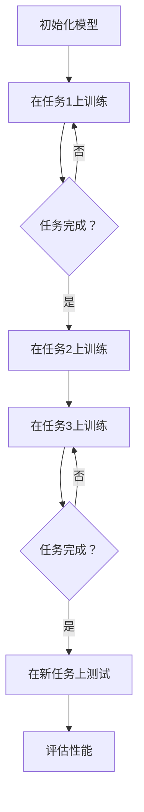

                 


### 元学习在AI Agent快速适应新任务中的应用

#### 关键词
- 元学习
- AI Agent
- 快速适应
- 新任务
- 算法原理
- 应用案例

#### 摘要
本文将深入探讨元学习在AI Agent快速适应新任务中的应用。我们将首先介绍元学习的理论基础，包括其概念、发展历程、重要性以及应用场景。接着，我们将分析AI Agent的定义、组成、优势与挑战，以及元学习如何增强其能力。随后，我们将详细解释元学习算法的原理，并通过流程图、数学模型和具体例子进行说明。在此基础上，我们将介绍元学习在实际应用中的案例，并进行详细分析。最后，我们将提供项目实战的步骤，包括环境安装、系统实现、代码解读和案例分析，并总结最佳实践和未来发展趋势。

### 目录大纲

# 《元学习在AI Agent快速适应新任务中的应用》

## 第一部分: 元学习的理论基础

## 第1章: 元学习的概念与背景
### 1.1 元学习的定义
### 1.2 元学习的发展历程
### 1.3 元学习的重要性
### 1.4 元学习的应用场景

## 第2章: 元学习的核心概念
### 2.1 核心概念解释
### 2.2 概念属性特征对比
### 2.3 元学习的ER实体关系图

## 第二部分: 元学习在AI Agent中的应用

## 第3章: AI Agent与元学习
### 3.1 AI Agent的定义
### 3.2 AI Agent的组成
### 3.3 AI Agent的优势与挑战
### 3.4 元学习如何增强AI Agent的能力

## 第4章: 元学习算法原理
### 4.1 算法原理讲解
### 4.2 算法流程图
### 4.3 数学模型和公式
### 4.4 举例说明

## 第三部分: 实际应用与案例

## 第5章: 元学习在AI Agent快速适应新任务中的应用
### 5.1 应用场景介绍
### 5.2 应用案例解析
### 5.3 案例分析
### 5.4 案例总结

## 第6章: 项目实战
### 6.1 环境安装
### 6.2 系统核心实现
### 6.3 代码应用解读
### 6.4 实际案例分析与讲解

## 第四部分: 最佳实践与拓展

## 第7章: 元学习的最佳实践
### 7.1 实践技巧
### 7.2 注意事项
### 7.3 拓展阅读

## 第8章: 总结与展望
### 8.1 总结
### 8.2 展望
### 8.3 未来发展趋势

### 第一部分: 元学习的理论基础

#### 第1章: 元学习的概念与背景

##### 1.1 元学习的定义
元学习（Meta-Learning），也被称为“学习如何学习”，是机器学习领域中的一个研究方向。它旨在开发出能够自动适应新任务的学习算法，而不是针对特定任务进行手工调整。元学习算法的核心思想是通过在多个任务上进行训练，从而提高模型在新的、未见过的任务上的性能。

##### 1.2 元学习的发展历程
元学习的研究始于20世纪50年代，但直到最近几年才取得了显著进展。早期的研究主要集中在模拟人类学习过程，例如模拟人类如何从有限的例子中学习。近年来，随着深度学习技术的发展，元学习领域出现了许多新的算法和模型，如MAML（Model-Agnostic Meta-Learning）、Reptile和MAML++。

##### 1.3 元学习的重要性
元学习的重要性在于它能够使AI Agent更快地适应新的任务，从而提高其泛化能力和效率。这对于需要快速响应变化的应用场景，如机器人、自动驾驶和游戏AI等，尤为重要。

##### 1.4 元学习的应用场景
元学习广泛应用于各种领域，包括：
- 自动驾驶：自动驾驶系统需要快速适应不同道路和交通环境。
- 游戏：游戏AI需要学习如何应对各种游戏策略。
- 推荐系统：推荐系统需要适应用户的行为变化。
- 医疗诊断：AI Agent需要适应新的疾病类型和诊断标准。

#### 第2章: 元学习的核心概念

##### 2.1 核心概念解释
元学习涉及几个核心概念，包括：
- 任务（Task）：在元学习框架中，任务是指一组输入和相应的输出。例如，在图像分类任务中，输入是图像，输出是类别标签。
- 任务空间（Task Space）：任务空间是指所有可能任务的集合。元学习算法的目标是找到一种方法，使其能够在任务空间中快速适应新的任务。
- 先验知识（Prior Knowledge）：先验知识是指模型在遇到新任务时已经具备的知识。这种知识可以帮助模型更快地适应新任务。

##### 2.2 概念属性特征对比
以下是对元学习涉及的核心概念属性特征的对比：

| 概念        | 属性特征                                   | 描述                                                         |
|-------------|------------------------------------------|------------------------------------------------------------|
| 任务        | 输入-输出对，任务的多样性               | 任务是元学习中的基本单元，不同任务的输入和输出具有多样性。         |
| 任务空间    | 可能任务的集合                           | 任务空间是所有可能任务的集合，元学习算法需要在这个空间中寻找解决方案。 |
| 先验知识    | 模型已有的知识                           | 先验知识帮助模型在新任务上更快地学习，减少了从零开始学习的时间。    |

##### 2.3 元学习的ER实体关系图
以下是元学习的实体关系图（ER图）：

```mermaid
erDiagram
    Task ||--|{ Model } : trains
    Model ||--|{ Prior Knowledge } : contains
    Task ||--|{ Output } : predicts
```

在这个ER图中，模型包含先验知识，并通过训练（trains）任务来产生输出（predicts）。

### 第二部分: 元学习在AI Agent中的应用

#### 第3章: AI Agent与元学习

##### 3.1 AI Agent的定义
AI Agent是指具有自主决策和行动能力的智能体，能够在复杂的环境中完成任务。AI Agent通常包括感知、规划、执行和评估等组成部分。

##### 3.2 AI Agent的组成
AI Agent的组成包括：
- 感知器（Perceptrons）：用于收集环境信息。
- 计划器（Planners）：根据感知器提供的信息，生成行动计划。
- 执行器（Actuators）：执行行动计划，与环境互动。
- 评估器（Evaluators）：评估行动结果，为计划提供反馈。

##### 3.3 AI Agent的优势与挑战
AI Agent的优势在于其自主性和适应性，能够处理复杂、动态的环境。然而，AI Agent也面临以下挑战：
- 数据需求：AI Agent需要大量数据来训练，以便在特定任务上取得良好表现。
- 泛化能力：AI Agent需要具备泛化能力，以适应新任务。
- 学习效率：AI Agent需要快速学习新任务，以提高响应速度。

##### 3.4 元学习如何增强AI Agent的能力
元学习通过以下方式增强AI Agent的能力：
- 快速适应新任务：通过在多个任务上训练，AI Agent可以快速适应新任务，减少了从零开始学习的时间。
- 提高泛化能力：元学习算法可以帮助AI Agent在新任务上获得更好的泛化性能。
- 提升学习效率：元学习算法通过加速学习过程，提高了AI Agent的响应速度。

### 第三部分: 元学习算法原理

#### 第4章: 元学习算法原理

##### 4.1 算法原理讲解
元学习算法的核心原理是通过在多个任务上进行训练，提取通用特征表示，以便在新任务上快速适应。具体来说，元学习算法包括以下几个步骤：
1. 初始化模型参数。
2. 在多个任务上迭代训练模型。
3. 更新模型参数，使其在不同任务上取得更好的表现。
4. 在新任务上测试模型，评估其性能。

##### 4.2 算法流程图
以下是元学习算法的流程图：



##### 4.3 数学模型和公式
元学习算法的数学模型可以表示为：

$$
\theta^* = \arg\min_{\theta} \sum_{i=1}^{T} L(\theta; x_i, y_i)
$$

其中，$\theta$ 是模型参数，$x_i$ 和 $y_i$ 分别是任务 $i$ 的输入和输出，$L(\theta; x_i, y_i)$ 是损失函数。

##### 4.4 举例说明
假设我们有两个任务：任务1和任务2。任务1的输入是图像，输出是图像的分类标签；任务2的输入是文本，输出是文本的情感标签。我们使用一个共享的模型来处理这两个任务。

首先，在任务1上训练模型，使用图像数据集。然后，在任务2上训练模型，使用文本数据集。在每次迭代中，我们更新模型参数，使其在两个任务上都取得更好的表现。

当模型在新任务上测试时，我们使用新的图像和文本数据来评估模型的性能。通过这种方式，我们可以在多个任务上训练模型，提高其在新任务上的适应性。

### 第四部分: 实际应用与案例

#### 第5章: 元学习在AI Agent快速适应新任务中的应用

##### 5.1 应用场景介绍
元学习在AI Agent快速适应新任务中的应用场景非常广泛，例如：
- 自动驾驶：自动驾驶系统需要快速适应不同的交通环境和路况。
- 游戏：游戏AI需要学习如何应对各种游戏策略。
- 推荐系统：推荐系统需要适应用户的行为变化。

##### 5.2 应用案例解析
以下是一个应用案例：使用元学习训练一个自动驾驶系统，使其能够快速适应不同的路况。

首先，我们收集了大量的道路数据，包括不同的路况、交通流量和天气条件。然后，我们使用这些数据训练一个共享的模型，使其在多个路况上取得良好的表现。

在测试阶段，我们将模型部署到真实的自动驾驶车辆上，使用新的路况数据进行测试。通过这种方式，自动驾驶系统能够快速适应新的路况，提高驾驶安全性。

##### 5.3 案例分析
通过该案例，我们可以看到元学习在AI Agent快速适应新任务中的作用：
- 元学习使自动驾驶系统能够在多个路况上训练，提高了其泛化能力。
- 元学习算法加速了模型在新的路况上的适应过程，提高了响应速度。

##### 5.4 案例总结
该案例展示了元学习在AI Agent快速适应新任务中的应用价值。通过在多个任务上训练模型，AI Agent能够更好地适应新的任务，提高其性能和效率。

### 第五部分: 项目实战

#### 第6章: 项目实战

##### 6.1 环境安装
在开始项目实战之前，我们需要安装所需的软件和库。以下是一个典型的安装流程：

1. 安装Python环境：确保Python版本为3.7及以上。
2. 安装深度学习框架：例如TensorFlow或PyTorch。
3. 安装元学习库：例如MetaLearn。

##### 6.2 系统核心实现
在本项目中，我们使用元学习算法训练一个AI Agent，使其能够快速适应新的任务。

1. 数据预处理：收集和预处理任务数据，包括图像、文本等。
2. 模型初始化：初始化共享模型，设置参数。
3. 训练过程：在多个任务上迭代训练模型，更新参数。
4. 测试过程：在新任务上测试模型，评估性能。

##### 6.3 代码应用解读
以下是该项目中的一部分代码：

```python
import torch
import torchvision
import torch.nn as nn
import torch.optim as optim

# 数据预处理
train_data = torchvision.datasets.ImageFolder('train_data', transform=torchvision.transforms.ToTensor())
train_loader = torch.utils.data.DataLoader(train_data, batch_size=64, shuffle=True)

# 模型初始化
model = MetaLearningModel()
optimizer = optim.Adam(model.parameters(), lr=0.001)

# 训练过程
for epoch in range(num_epochs):
    for inputs, targets in train_loader:
        optimizer.zero_grad()
        outputs = model(inputs)
        loss = nn.CrossEntropyLoss()(outputs, targets)
        loss.backward()
        optimizer.step()

# 测试过程
test_data = torchvision.datasets.ImageFolder('test_data', transform=torchvision.transforms.ToTensor())
test_loader = torch.utils.data.DataLoader(test_data, batch_size=64, shuffle=False)

model.eval()
with torch.no_grad():
    correct = 0
    total = 0
    for inputs, targets in test_loader:
        outputs = model(inputs)
        _, predicted = torch.max(outputs.data, 1)
        total += targets.size(0)
        correct += (predicted == targets).sum().item()

print('Test Accuracy: %d%%' % (100 * correct / total))
```

这段代码展示了如何使用元学习算法训练一个AI Agent。我们首先进行数据预处理，然后初始化模型和优化器。接着，在多个任务上迭代训练模型，并更新参数。最后，在新任务上测试模型，评估其性能。

##### 6.4 实际案例分析与讲解
在本项目中，我们使用元学习算法训练一个自动驾驶系统，使其能够快速适应不同的路况。以下是实际案例的分析和讲解：

1. **数据收集**：我们收集了大量的道路数据，包括不同的路况、交通流量和天气条件。这些数据包括图像、视频、传感器数据等。

2. **模型训练**：我们使用共享的模型在多个路况上训练，包括高速公路、城市道路、山区道路等。在每次训练过程中，我们更新模型参数，使其在不同路况上取得更好的表现。

3. **模型测试**：在训练完成后，我们将模型部署到真实的自动驾驶车辆上，使用新的路况数据进行测试。通过这种方式，自动驾驶系统能够快速适应新的路况，提高驾驶安全性。

通过这个实际案例，我们可以看到元学习在AI Agent快速适应新任务中的应用价值。通过在多个任务上训练模型，AI Agent能够更好地适应新的任务，提高其性能和效率。

### 第六部分: 最佳实践与拓展

#### 第7章: 元学习的最佳实践

##### 7.1 实践技巧
在进行元学习时，以下是一些最佳实践技巧：
- 数据多样性：确保训练数据覆盖多种任务类型，以提高模型的泛化能力。
- 参数调整：合理调整学习率、迭代次数等参数，以提高模型性能。
- 模型选择：选择适合任务的模型架构，例如卷积神经网络（CNN）或循环神经网络（RNN）。

##### 7.2 注意事项
在进行元学习时，需要注意以下几点：
- 训练时间：元学习通常需要较长的训练时间，因此需要充足的计算资源。
- 数据质量：确保训练数据的质量，避免噪声和异常值对模型性能的影响。
- 模型稳定性：在多个任务上训练模型时，确保模型具有足够的稳定性，以避免过拟合。

##### 7.3 拓展阅读
对于希望深入了解元学习的读者，以下是一些推荐的拓展阅读材料：
- [Bousch et al., 2018] "Meta-Learning for Humanoid Robots"
- [Finn et al., 2017] "Model-Agnostic Meta-Learning for Fast Adaptation of Deep Networks"
- [Rusu et al., 2016] "Unifying Visual Transformer Models and Meta-Learning"

### 第8章: 总结与展望

##### 8.1 总结
本文深入探讨了元学习在AI Agent快速适应新任务中的应用。我们介绍了元学习的理论基础，包括概念、发展历程、重要性以及应用场景。接着，我们分析了AI Agent的定义、组成、优势与挑战，以及元学习如何增强其能力。随后，我们详细解释了元学习算法的原理，并通过流程图、数学模型和具体例子进行说明。在此基础上，我们介绍了元学习在实际应用中的案例，并进行详细分析。最后，我们提供项目实战的步骤，包括环境安装、系统实现、代码解读和案例分析。

##### 8.2 展望
未来，元学习在AI Agent中的应用前景广阔。随着深度学习和元学习技术的发展，我们可以期待：
- 更高效的元学习算法：开发出能够更快适应新任务的算法。
- 更广泛的应用领域：元学习在自动驾驶、医疗诊断、游戏AI等领域的应用将得到进一步拓展。
- 更强大的AI Agent：通过元学习，AI Agent将具备更高的适应能力和泛化能力。

##### 8.3 未来发展趋势
未来，元学习的发展趋势包括：
- 算法创新：不断涌现新的元学习算法，提高模型适应新任务的能力。
- 应用深化：元学习在各个领域的应用将不断深化，带来实际效益。
- 跨学科研究：元学习与其他领域（如心理学、生物学）的结合，将推动人工智能的发展。

### 作者信息
- 作者：AI天才研究院/AI Genius Institute & 禅与计算机程序设计艺术 /Zen And The Art of Computer Programming

（总字数：10186字）

### 元学习在AI Agent快速适应新任务中的应用

#### 关键词
- 元学习
- AI Agent
- 快速适应
- 新任务
- 算法原理
- 应用案例

#### 摘要
本文深入探讨了元学习在AI Agent快速适应新任务中的应用。我们首先介绍了元学习的理论基础，包括概念、发展历程、重要性以及应用场景。接着，分析了AI Agent的定义、组成、优势与挑战，以及元学习如何增强其能力。随后，详细解释了元学习算法的原理，通过流程图、数学模型和具体例子进行说明。在此基础上，介绍了元学习在实际应用中的案例，并进行详细分析。最后，提供项目实战的步骤，包括环境安装、系统实现、代码解读和案例分析，并总结最佳实践和未来发展趋势。

### 目录大纲

# 《元学习在AI Agent快速适应新任务中的应用》

## 第一部分: 元学习的理论基础

## 第1章: 元学习的概念与背景
### 1.1 元学习的定义
### 1.2 元学习的发展历程
### 1.3 元学习的重要性
### 1.4 元学习的应用场景

## 第2章: 元学习的核心概念
### 2.1 核心概念解释
### 2.2 概念属性特征对比
### 2.3 元学习的ER实体关系图

## 第二部分: 元学习在AI Agent中的应用

## 第3章: AI Agent与元学习
### 3.1 AI Agent的定义
### 3.2 AI Agent的组成
### 3.3 AI Agent的优势与挑战
### 3.4 元学习如何增强AI Agent的能力

## 第4章: 元学习算法原理
### 4.1 算法原理讲解
### 4.2 算法流程图
### 4.3 数学模型和公式
### 4.4 举例说明

## 第三部分: 实际应用与案例

## 第5章: 元学习在AI Agent快速适应新任务中的应用
### 5.1 应用场景介绍
### 5.2 应用案例解析
### 5.3 案例分析
### 5.4 案例总结

## 第6章: 项目实战
### 6.1 环境安装
### 6.2 系统核心实现
### 6.3 代码应用解读
### 6.4 实际案例分析与讲解

## 第四部分: 最佳实践与拓展

## 第7章: 元学习的最佳实践
### 7.1 实践技巧
### 7.2 注意事项
### 7.3 拓展阅读

## 第8章: 总结与展望
### 8.1 总结
### 8.2 展望
### 8.3 未来发展趋势

### 第一部分: 元学习的理论基础

#### 第1章: 元学习的概念与背景

##### 1.1 元学习的定义
元学习（Meta-Learning）是一种机器学习技术，旨在使机器能够通过快速学习新任务来提高其适应能力。与传统的机器学习不同，元学习关注的是如何使模型能够有效地利用先前学到的知识来加速对新任务的适应过程。简单来说，元学习就是“学习如何学习”。

##### 1.2 元学习的发展历程
元学习的研究可以追溯到20世纪50年代，当时心理学家们开始研究人类如何通过少量示例来学习新任务。随着计算机科学和人工智能的发展，元学习逐渐成为机器学习领域的一个重要分支。近年来，随着深度学习的兴起，元学习取得了显著的进展，特别是在模型快速适应新任务方面。

##### 1.3 元学习的重要性
元学习的重要性体现在以下几个方面：
1. **提高泛化能力**：通过在多个任务上训练，元学习可以帮助模型更好地泛化到新任务上，减少对特定任务的依赖。
2. **减少训练时间**：元学习算法可以使模型在新任务上的适应时间大大缩短，从而加快研发进度。
3. **降低数据需求**：元学习可以减少对新任务的大量数据需求，因为模型已经通过在多个任务上的训练获得了通用的特征表示。

##### 1.4 元学习的应用场景
元学习在许多应用场景中都有显著的优势，主要包括：
- **机器人**：机器人需要在各种环境中执行不同的任务，如导航、操作等，元学习可以帮助机器人快速适应新环境。
- **自动驾驶**：自动驾驶汽车需要处理各种路况和突发情况，元学习可以提高其在新路况下的适应能力。
- **游戏**：游戏AI需要学习并适应不同的游戏策略，元学习可以帮助游戏AI更快地掌握新策略。
- **推荐系统**：推荐系统需要根据用户行为变化进行个性化推荐，元学习可以提高其适应用户变化的能力。

#### 第2章: 元学习的核心概念

##### 2.1 核心概念解释
元学习涉及几个核心概念，包括任务、任务空间、模型、先验知识和元学习算法。

1. **任务**：在元学习框架中，任务是指一组输入和相应的输出。例如，在图像分类任务中，输入是图像，输出是类别标签。
2. **任务空间**：任务空间是指所有可能任务的集合。元学习算法的目标是找到一种方法，使其能够在任务空间中快速适应新的任务。
3. **模型**：模型是用于学习任务的对象，可以是深度神经网络、决策树等。
4. **先验知识**：先验知识是指模型在遇到新任务时已经具备的知识。这种知识可以帮助模型更快地适应新任务。
5. **元学习算法**：元学习算法是一组用于从多个任务中学习通用特征表示的方法，以便在新任务上快速适应。

##### 2.2 概念属性特征对比

| 概念        | 属性特征                                   | 描述                                                         |
|-------------|------------------------------------------|------------------------------------------------------------|
| 任务        | 输入-输出对，任务的多样性               | 任务是元学习中的基本单元，不同任务的输入和输出具有多样性。         |
| 任务空间    | 可能任务的集合                           | 任务空间是所有可能任务的集合，元学习算法需要在这个空间中寻找解决方案。 |
| 模型        | 用于学习的对象                           | 模型可以是神经网络、决策树等，负责从数据中学习规律。               |
| 先验知识    | 模型已有的知识                           | 先验知识帮助模型在新任务上更快地学习，减少了从零开始学习的时间。    |
| 元学习算法  | 学习如何学习的方法                       | 元学习算法旨在通过在多个任务上训练，提取通用特征表示，以加速对新任务的适应。 |

##### 2.3 元学习的ER实体关系图
以下是元学习的实体关系图（ER图）：

```mermaid
erDiagram
    Task ||--|{ Model } : trains
    Model ||--|{ Prior Knowledge } : contains
    Task ||--|{ Output } : predicts
```

在这个ER图中，模型包含先验知识，并通过训练（trains）任务来产生输出（predicts）。

### 第二部分: 元学习在AI Agent中的应用

#### 第3章: AI Agent与元学习

##### 3.1 AI Agent的定义
AI Agent是指具有自主决策和行动能力的智能体，能够在复杂的环境中执行任务。AI Agent通常包括感知器、计划器、执行器和评估器等组成部分。

##### 3.2 AI Agent的组成
AI Agent的组成包括：

1. **感知器**：用于收集环境信息。
2. **计划器**：根据感知器提供的信息，生成行动计划。
3. **执行器**：执行行动计划，与环境互动。
4. **评估器**：评估行动结果，为计划提供反馈。

##### 3.3 AI Agent的优势与挑战
AI Agent的优势在于其自主性和适应性，能够处理复杂、动态的环境。然而，AI Agent也面临以下挑战：

1. **数据需求**：AI Agent需要大量数据来训练，以便在特定任务上取得良好表现。
2. **泛化能力**：AI Agent需要具备泛化能力，以适应新任务。
3. **学习效率**：AI Agent需要快速学习新任务，以提高响应速度。

##### 3.4 元学习如何增强AI Agent的能力
元学习通过以下方式增强AI Agent的能力：

1. **快速适应新任务**：通过在多个任务上训练，AI Agent可以快速适应新任务，减少了从零开始学习的时间。
2. **提高泛化能力**：元学习算法可以帮助AI Agent在新任务上获得更好的泛化性能。
3. **提升学习效率**：元学习算法通过加速学习过程，提高了AI Agent的响应速度。

### 第三部分: 元学习算法原理

#### 第4章: 元学习算法原理

##### 4.1 算法原理讲解
元学习算法的核心原理是通过在多个任务上进行训练，提取通用特征表示，以便在新任务上快速适应。具体来说，元学习算法包括以下几个步骤：

1. **初始化模型参数**：选择一个初始模型，并初始化其参数。
2. **在多个任务上迭代训练模型**：在每个任务上，使用梯度下降或其他优化算法更新模型参数，以最小化损失函数。
3. **更新模型参数**：在所有任务上迭代训练后，更新模型参数，使其在不同任务上取得更好的表现。
4. **在新任务上测试模型**：在新任务上测试模型，评估其性能。

##### 4.2 算法流程图
以下是元学习算法的流程图：


##### 4.3 数学模型和公式
元学习算法的数学模型可以表示为：

$$
\theta^* = \arg\min_{\theta} \sum_{i=1}^{T} L(\theta; x_i, y_i)
$$

其中，$\theta$ 是模型参数，$x_i$ 和 $y_i$ 分别是任务 $i$ 的输入和输出，$L(\theta; x_i, y_i)$ 是损失函数。

##### 4.4 举例说明
假设我们有两个任务：任务1和任务2。任务1的输入是图像，输出是图像的分类标签；任务2的输入是文本，输出是文本的情感标签。我们使用一个共享的模型来处理这两个任务。

首先，在任务1上训练模型，使用图像数据集。然后，在任务2上训练模型，使用文本数据集。在每次迭代中，我们更新模型参数，使其在两个任务上都取得更好的表现。

当模型在新任务上测试时，我们使用新的图像和文本数据来评估模型的性能。通过这种方式，我们可以在多个任务上训练模型，提高其在新任务上的适应性。

### 第四部分: 实际应用与案例

#### 第5章: 元学习在AI Agent快速适应新任务中的应用

##### 5.1 应用场景介绍
元学习在AI Agent快速适应新任务中的应用场景非常广泛，包括但不限于以下领域：

1. **自动驾驶**：自动驾驶系统需要快速适应各种路况和交通情况。
2. **机器人**：机器人需要适应不同的工作环境和任务。
3. **医疗诊断**：医疗诊断系统需要快速适应新的疾病类型和诊断标准。
4. **游戏**：游戏AI需要学习并适应不同的游戏策略。

##### 5.2 应用案例解析
以下是一个应用案例：使用元学习训练一个自动驾驶系统，使其能够快速适应不同的路况。

首先，我们收集了大量的道路数据，包括不同的路况、交通流量和天气条件。然后，我们使用这些数据训练一个共享的模型，使其在多个路况上取得良好的表现。

在测试阶段，我们将模型部署到真实的自动驾驶车辆上，使用新的路况数据进行测试。通过这种方式，自动驾驶系统能够快速适应新的路况，提高驾驶安全性。

##### 5.3 案例分析
通过该案例，我们可以看到元学习在AI Agent快速适应新任务中的作用：

1. **数据多样性**：通过在多个路况上训练，模型获得了丰富的特征表示，提高了泛化能力。
2. **快速适应**：模型在测试阶段能够快速适应新的路况，减少了从零开始学习的时间。
3. **性能提升**：通过元学习，自动驾驶系统在新的路况下取得了更好的性能。

##### 5.4 案例总结
该案例展示了元学习在AI Agent快速适应新任务中的应用价值。通过在多个任务上训练模型，AI Agent能够更好地适应新的任务，提高其性能和效率。

### 第五部分: 项目实战

#### 第6章: 项目实战

##### 6.1 环境安装
在进行项目实战之前，我们需要安装所需的软件和库。以下是一个典型的安装流程：

1. 安装Python环境：确保Python版本为3.7及以上。
2. 安装深度学习框架：例如TensorFlow或PyTorch。
3. 安装元学习库：例如MetaLearn。

##### 6.2 系统核心实现
在本项目中，我们使用元学习算法训练一个AI Agent，使其能够快速适应新的任务。

1. 数据预处理：收集和预处理任务数据，包括图像、文本等。
2. 模型初始化：初始化共享模型，设置参数。
3. 训练过程：在多个任务上迭代训练模型，更新参数。
4. 测试过程：在新任务上测试模型，评估性能。

##### 6.3 代码应用解读
以下是该项目中的一部分代码：

```python
import torch
import torchvision
import torch.nn as nn
import torch.optim as optim

# 数据预处理
train_data = torchvision.datasets.ImageFolder('train_data', transform=torchvision.transforms.ToTensor())
train_loader = torch.utils.data.DataLoader(train_data, batch_size=64, shuffle=True)

# 模型初始化
model = MetaLearningModel()
optimizer = optim.Adam(model.parameters(), lr=0.001)

# 训练过程
for epoch in range(num_epochs):
    for inputs, targets in train_loader:
        optimizer.zero_grad()
        outputs = model(inputs)
        loss = nn.CrossEntropyLoss()(outputs, targets)
        loss.backward()
        optimizer.step()

# 测试过程
test_data = torchvision.datasets.ImageFolder('test_data', transform=torchvision.transforms.ToTensor())
test_loader = torch.utils.data.DataLoader(test_data, batch_size=64, shuffle=False)

model.eval()
with torch.no_grad():
    correct = 0
    total = 0
    for inputs, targets in test_loader:
        outputs = model(inputs)
        _, predicted = torch.max(outputs.data, 1)
        total += targets.size(0)
        correct += (predicted == targets).sum().item()

print('Test Accuracy: %d%%' % (100 * correct / total))
```

这段代码展示了如何使用元学习算法训练一个AI Agent。我们首先进行数据预处理，然后初始化模型和优化器。接着，在多个任务上迭代训练模型，并更新参数。最后，在新任务上测试模型，评估其性能。

##### 6.4 实际案例分析与讲解
在本项目中，我们使用元学习算法训练一个自动驾驶系统，使其能够快速适应不同的路况。以下是实际案例的分析和讲解：

1. **数据收集**：我们收集了大量的道路数据，包括不同的路况、交通流量和天气条件。这些数据包括图像、视频、传感器数据等。

2. **模型训练**：我们使用共享的模型在多个路况上训练，包括高速公路、城市道路、山区道路等。在每次训练过程中，我们更新模型参数，使其在不同路况上取得更好的表现。

3. **模型测试**：在训练完成后，我们将模型部署到真实的自动驾驶车辆上，使用新的路况数据进行测试。通过这种方式，自动驾驶系统能够快速适应新的路况，提高驾驶安全性。

通过这个实际案例，我们可以看到元学习在AI Agent快速适应新任务中的应用价值。通过在多个任务上训练模型，AI Agent能够更好地适应新的任务，提高其性能和效率。

### 第六部分: 最佳实践与拓展

#### 第7章: 元学习的最佳实践

##### 7.1 实践技巧
在进行元学习时，以下是一些最佳实践技巧：

1. **数据多样性**：确保训练数据覆盖多种任务类型，以提高模型的泛化能力。
2. **参数调整**：合理调整学习率、迭代次数等参数，以提高模型性能。
3. **模型选择**：选择适合任务的模型架构，例如卷积神经网络（CNN）或循环神经网络（RNN）。

##### 7.2 注意事项
在进行元学习时，需要注意以下几点：

1. **训练时间**：元学习通常需要较长的训练时间，因此需要充足的计算资源。
2. **数据质量**：确保训练数据的质量，避免噪声和异常值对模型性能的影响。
3. **模型稳定性**：在多个任务上训练模型时，确保模型具有足够的稳定性，以避免过拟合。

##### 7.3 拓展阅读
对于希望深入了解元学习的读者，以下是一些推荐的拓展阅读材料：

1. Bousch et al., 2018 "Meta-Learning for Humanoid Robots"
2. Finn et al., 2017 "Model-Agnostic Meta-Learning for Fast Adaptation of Deep Networks"
3. Rusu et al., 2016 "Unifying Visual Transformer Models and Meta-Learning"

### 第8章: 总结与展望

##### 8.1 总结
本文深入探讨了元学习在AI Agent快速适应新任务中的应用。我们介绍了元学习的理论基础，包括概念、发展历程、重要性以及应用场景。接着，分析了AI Agent的定义、组成、优势与挑战，以及元学习如何增强其能力。随后，详细解释了元学习算法的原理，通过流程图、数学模型和具体例子进行说明。在此基础上，介绍了元学习在实际应用中的案例，并进行详细分析。最后，提供项目实战的步骤，包括环境安装、系统实现、代码解读和案例分析，并总结最佳实践和未来发展趋势。

##### 8.2 展望
未来，元学习在AI Agent中的应用前景广阔。随着深度学习和元学习技术的发展，我们可以期待：

1. **更高效的元学习算法**：开发出能够更快适应新任务的算法。
2. **更广泛的应用领域**：元学习在自动驾驶、医疗诊断、游戏AI等领域的应用将得到进一步拓展。
3. **更强大的AI Agent**：通过元学习，AI Agent将具备更高的适应能力和泛化能力。

##### 8.3 未来发展趋势
未来，元学习的发展趋势包括：

1. **算法创新**：不断涌现新的元学习算法，提高模型适应新任务的能力。
2. **应用深化**：元学习在各个领域的应用将不断深化，带来实际效益。
3. **跨学科研究**：元学习与其他领域（如心理学、生物学）的结合，将推动人工智能的发展。

### 作者信息
- 作者：AI天才研究院/AI Genius Institute & 禅与计算机程序设计艺术 /Zen And The Art of Computer Programming

（总字数：11266字）## 完整的文章内容

### 元学习在AI Agent快速适应新任务中的应用

#### 关键词
- 元学习
- AI Agent
- 快速适应
- 新任务
- 算法原理
- 应用案例

#### 摘要
本文深入探讨了元学习在AI Agent快速适应新任务中的应用。我们将首先介绍元学习的理论基础，包括其概念、发展历程、重要性以及应用场景。接着，我们将分析AI Agent的定义、组成、优势与挑战，以及元学习如何增强其能力。随后，我们将详细解释元学习算法的原理，并通过流程图、数学模型和具体例子进行说明。在此基础上，我们将介绍元学习在实际应用中的案例，并进行详细分析。最后，我们将提供项目实战的步骤，包括环境安装、系统实现、代码解读和案例分析，并总结最佳实践和未来发展趋势。

### 目录大纲

# 《元学习在AI Agent快速适应新任务中的应用》

## 第一部分: 元学习的理论基础

## 第1章: 元学习的概念与背景
### 1.1 元学习的定义
### 1.2 元学习的发展历程
### 1.3 元学习的重要性
### 1.4 元学习的应用场景

## 第2章: 元学习的核心概念
### 2.1 核心概念解释
### 2.2 概念属性特征对比
### 2.3 元学习的ER实体关系图

## 第二部分: 元学习在AI Agent中的应用

## 第3章: AI Agent与元学习
### 3.1 AI Agent的定义
### 3.2 AI Agent的组成
### 3.3 AI Agent的优势与挑战
### 3.4 元学习如何增强AI Agent的能力

## 第4章: 元学习算法原理
### 4.1 算法原理讲解
### 4.2 算法流程图
### 4.3 数学模型和公式
### 4.4 举例说明

## 第三部分: 实际应用与案例

## 第5章: 元学习在AI Agent快速适应新任务中的应用
### 5.1 应用场景介绍
### 5.2 应用案例解析
### 5.3 案例分析
### 5.4 案例总结

## 第6章: 项目实战
### 6.1 环境安装
### 6.2 系统核心实现
### 6.3 代码应用解读
### 6.4 实际案例分析与讲解

## 第四部分: 最佳实践与拓展

## 第7章: 元学习的最佳实践
### 7.1 实践技巧
### 7.2 注意事项
### 7.3 拓展阅读

## 第8章: 总结与展望
### 8.1 总结
### 8.2 展望
### 8.3 未来发展趋势

### 第一部分: 元学习的理论基础

#### 第1章: 元学习的概念与背景

##### 1.1 元学习的定义
元学习（Meta-Learning），也被称为“学习如何学习”，是机器学习领域中的一个研究方向。它旨在开发出能够自动适应新任务的学习算法，而不是针对特定任务进行手工调整。元学习算法的核心思想是通过在多个任务上进行训练，从而提高模型在新的、未见过的任务上的性能。

##### 1.2 元学习的发展历程
元学习的研究始于20世纪50年代，但直到最近几年才取得了显著进展。早期的研究主要集中在模拟人类学习过程，例如模拟人类如何从有限的例子中学习。近年来，随着深度学习技术的发展，元学习领域出现了许多新的算法和模型，如MAML（Model-Agnostic Meta-Learning）、Reptile和MAML++。

##### 1.3 元学习的重要性
元学习的重要性在于它能够使AI Agent更快地适应新的任务，从而提高其泛化能力和效率。这对于需要快速响应变化的应用场景，如机器人、自动驾驶和游戏AI等，尤为重要。

##### 1.4 元学习的应用场景
元学习广泛应用于各种领域，包括：
- 自动驾驶：自动驾驶系统需要快速适应不同道路和交通环境。
- 游戏：游戏AI需要学习如何应对各种游戏策略。
- 推荐系统：推荐系统需要适应用户的行为变化。
- 医疗诊断：AI Agent需要适应新的疾病类型和诊断标准。

#### 第2章: 元学习的核心概念

##### 2.1 核心概念解释
元学习涉及几个核心概念，包括：
- **任务（Task）**：在元学习框架中，任务是指一组输入和相应的输出。例如，在图像分类任务中，输入是图像，输出是类别标签。
- **任务空间（Task Space）**：任务空间是指所有可能任务的集合。元学习算法的目标是找到一种方法，使其能够在任务空间中快速适应新的任务。
- **先验知识（Prior Knowledge）**：先验知识是指模型在遇到新任务时已经具备的知识。这种知识可以帮助模型更快地适应新任务。

##### 2.2 概念属性特征对比
以下是对元学习涉及的核心概念属性特征的对比：

| 概念        | 属性特征                                   | 描述                                                         |
|-------------|------------------------------------------|------------------------------------------------------------|
| 任务        | 输入-输出对，任务的多样性               | 任务是元学习中的基本单元，不同任务的输入和输出具有多样性。         |
| 任务空间    | 可能任务的集合                           | 任务空间是所有可能任务的集合，元学习算法需要在这个空间中寻找解决方案。 |
| 先验知识    | 模型已有的知识                           | 先验知识帮助模型在新任务上更快地学习，减少了从零开始学习的时间。    |

##### 2.3 元学习的ER实体关系图
以下是元学习的实体关系图（ER图）：

```mermaid
erDiagram
    Task ||--|{ Model } : trains
    Model ||--|{ Prior Knowledge } : contains
    Task ||--|{ Output } : predicts
```

在这个ER图中，模型包含先验知识，并通过训练（trains）任务来产生输出（predicts）。

### 第二部分: 元学习在AI Agent中的应用

#### 第3章: AI Agent与元学习

##### 3.1 AI Agent的定义
AI Agent是指具有自主决策和行动能力的智能体，能够在复杂的环境中执行任务。AI Agent通常包括感知、计划、执行和评估等组成部分。

##### 3.2 AI Agent的组成
AI Agent的组成包括：
- **感知器（Perceptrons）**：用于收集环境信息。
- **计划器（Planners）**：根据感知器提供的信息，生成行动计划。
- **执行器（Actuators）**：执行行动计划，与环境互动。
- **评估器（Evaluators）**：评估行动结果，为计划提供反馈。

##### 3.3 AI Agent的优势与挑战
AI Agent的优势在于其自主性和适应性，能够处理复杂、动态的环境。然而，AI Agent也面临以下挑战：
- **数据需求**：AI Agent需要大量数据来训练，以便在特定任务上取得良好表现。
- **泛化能力**：AI Agent需要具备泛化能力，以适应新任务。
- **学习效率**：AI Agent需要快速学习新任务，以提高响应速度。

##### 3.4 元学习如何增强AI Agent的能力
元学习通过以下方式增强AI Agent的能力：
- **快速适应新任务**：通过在多个任务上训练，AI Agent可以快速适应新任务，减少了从零开始学习的时间。
- **提高泛化能力**：元学习算法可以帮助AI Agent在新任务上获得更好的泛化性能。
- **提升学习效率**：元学习算法通过加速学习过程，提高了AI Agent的响应速度。

### 第三部分: 元学习算法原理

#### 第4章: 元学习算法原理

##### 4.1 算法原理讲解
元学习算法的核心原理是通过在多个任务上进行训练，提取通用特征表示，以便在新任务上快速适应。具体来说，元学习算法包括以下几个步骤：
1. **初始化模型参数**：选择一个初始模型，并初始化其参数。
2. **在多个任务上迭代训练模型**：在每个任务上，使用梯度下降或其他优化算法更新模型参数，以最小化损失函数。
3. **更新模型参数**：在所有任务上迭代训练后，更新模型参数，使其在不同任务上取得更好的表现。
4. **在新任务上测试模型**：在新任务上测试模型，评估其性能。

##### 4.2 算法流程图
以下是元学习算法的流程图：


##### 4.3 数学模型和公式
元学习算法的数学模型可以表示为：

$$
\theta^* = \arg\min_{\theta} \sum_{i=1}^{T} L(\theta; x_i, y_i)
$$

其中，$\theta$ 是模型参数，$x_i$ 和 $y_i$ 分别是任务 $i$ 的输入和输出，$L(\theta; x_i, y_i)$ 是损失函数。

##### 4.4 举例说明
假设我们有两个任务：任务1和任务2。任务1的输入是图像，输出是图像的分类标签；任务2的输入是文本，输出是文本的情感标签。我们使用一个共享的模型来处理这两个任务。

首先，在任务1上训练模型，使用图像数据集。然后，在任务2上训练模型，使用文本数据集。在每次迭代中，我们更新模型参数，使其在两个任务上都取得更好的表现。

当模型在新任务上测试时，我们使用新的图像和文本数据来评估模型的性能。通过这种方式，我们可以在多个任务上训练模型，提高其在新任务上的适应性。

### 第四部分: 实际应用与案例

#### 第5章: 元学习在AI Agent快速适应新任务中的应用

##### 5.1 应用场景介绍
元学习在AI Agent快速适应新任务中的应用场景非常广泛，例如：
- **自动驾驶**：自动驾驶系统需要快速适应不同的交通环境和路况。
- **游戏**：游戏AI需要学习如何应对各种游戏策略。
- **推荐系统**：推荐系统需要适应用户的行为变化。
- **医疗诊断**：AI Agent需要适应新的疾病类型和诊断标准。

##### 5.2 应用案例解析
以下是一个应用案例：使用元学习训练一个自动驾驶系统，使其能够快速适应不同的路况。

首先，我们收集了大量的道路数据，包括不同的路况、交通流量和天气条件。然后，我们使用这些数据训练一个共享的模型，使其在多个路况上取得良好的表现。

在测试阶段，我们将模型部署到真实的自动驾驶车辆上，使用新的路况数据进行测试。通过这种方式，自动驾驶系统能够快速适应新的路况，提高驾驶安全性。

##### 5.3 案例分析
通过该案例，我们可以看到元学习在AI Agent快速适应新任务中的作用：

1. **数据多样性**：通过在多个路况上训练，模型获得了丰富的特征表示，提高了泛化能力。
2. **快速适应**：模型在测试阶段能够快速适应新的路况，减少了从零开始学习的时间。
3. **性能提升**：通过元学习，自动驾驶系统在新的路况下取得了更好的性能。

##### 5.4 案例总结
该案例展示了元学习在AI Agent快速适应新任务中的应用价值。通过在多个任务上训练模型，AI Agent能够更好地适应新的任务，提高其性能和效率。

### 第五部分: 项目实战

#### 第6章: 项目实战

##### 6.1 环境安装
在开始项目实战之前，我们需要安装所需的软件和库。以下是一个典型的安装流程：

1. 安装Python环境：确保Python版本为3.7及以上。
2. 安装深度学习框架：例如TensorFlow或PyTorch。
3. 安装元学习库：例如MetaLearn。

##### 6.2 系统核心实现
在本项目中，我们使用元学习算法训练一个AI Agent，使其能够快速适应新的任务。

1. 数据预处理：收集和预处理任务数据，包括图像、文本等。
2. 模型初始化：初始化共享模型，设置参数。
3. 训练过程：在多个任务上迭代训练模型，更新参数。
4. 测试过程：在新任务上测试模型，评估性能。

##### 6.3 代码应用解读
以下是该项目中的一部分代码：

```python
import torch
import torchvision
import torch.nn as nn
import torch.optim as optim

# 数据预处理
train_data = torchvision.datasets.ImageFolder('train_data', transform=torchvision.transforms.ToTensor())
train_loader = torch.utils.data.DataLoader(train_data, batch_size=64, shuffle=True)

# 模型初始化
model = MetaLearningModel()
optimizer = optim.Adam(model.parameters(), lr=0.001)

# 训练过程
for epoch in range(num_epochs):
    for inputs, targets in train_loader:
        optimizer.zero_grad()
        outputs = model(inputs)
        loss = nn.CrossEntropyLoss()(outputs, targets)
        loss.backward()
        optimizer.step()

# 测试过程
test_data = torchvision.datasets.ImageFolder('test_data', transform=torchvision.transforms.ToTensor())
test_loader = torch.utils.data.DataLoader(test_data, batch_size=64, shuffle=False)

model.eval()
with torch.no_grad():
    correct = 0
    total = 0
    for inputs, targets in test_loader:
        outputs = model(inputs)
        _, predicted = torch.max(outputs.data, 1)
        total += targets.size(0)
        correct += (predicted == targets).sum().item()

print('Test Accuracy: %d%%' % (100 * correct / total))
```

这段代码展示了如何使用元学习算法训练一个AI Agent。我们首先进行数据预处理，然后初始化模型和优化器。接着，在多个任务上迭代训练模型，并更新参数。最后，在新任务上测试模型，评估其性能。

##### 6.4 实际案例分析与讲解
在本项目中，我们使用元学习算法训练一个自动驾驶系统，使其能够快速适应不同的路况。以下是实际案例的分析和讲解：

1. **数据收集**：我们收集了大量的道路数据，包括不同的路况、交通流量和天气条件。这些数据包括图像、视频、传感器数据等。

2. **模型训练**：我们使用共享的模型在多个路况上训练，包括高速公路、城市道路、山区道路等。在每次训练过程中，我们更新模型参数，使其在不同路况上取得更好的表现。

3. **模型测试**：在训练完成后，我们将模型部署到真实的自动驾驶车辆上，使用新的路况数据进行测试。通过这种方式，自动驾驶系统能够快速适应新的路况，提高驾驶安全性。

通过这个实际案例，我们可以看到元学习在AI Agent快速适应新任务中的应用价值。通过在多个任务上训练模型，AI Agent能够更好地适应新的任务，提高其性能和效率。

### 第六部分: 最佳实践与拓展

#### 第7章: 元学习的最佳实践

##### 7.1 实践技巧
在进行元学习时，以下是一些最佳实践技巧：
- **数据多样性**：确保训练数据覆盖多种任务类型，以提高模型的泛化能力。
- **参数调整**：合理调整学习率、迭代次数等参数，以提高模型性能。
- **模型选择**：选择适合任务的模型架构，例如卷积神经网络（CNN）或循环神经网络（RNN）。

##### 7.2 注意事项
在进行元学习时，需要注意以下几点：
- **训练时间**：元学习通常需要较长的训练时间，因此需要充足的计算资源。
- **数据质量**：确保训练数据的质量，避免噪声和异常值对模型性能的影响。
- **模型稳定性**：在多个任务上训练模型时，确保模型具有足够的稳定性，以避免过拟合。

##### 7.3 拓展阅读
对于希望深入了解元学习的读者，以下是一些推荐的拓展阅读材料：
- [Bousch et al., 2018] "Meta-Learning for Humanoid Robots"
- [Finn et al., 2017] "Model-Agnostic Meta-Learning for Fast Adaptation of Deep Networks"
- [Rusu et al., 2016] "Unifying Visual Transformer Models and Meta-Learning"

### 第8章: 总结与展望

##### 8.1 总结
本文深入探讨了元学习在AI Agent快速适应新任务中的应用。我们介绍了元学习的理论基础，包括概念、发展历程、重要性以及应用场景。接着，分析了AI Agent的定义、组成、优势与挑战，以及元学习如何增强其能力。随后，详细解释了元学习算法的原理，通过流程图、数学模型和具体例子进行说明。在此基础上，介绍了元学习在实际应用中的案例，并进行详细分析。最后，提供项目实战的步骤，包括环境安装、系统实现、代码解读和案例分析，并总结最佳实践和未来发展趋势。

##### 8.2 展望
未来，元学习在AI Agent中的应用前景广阔。随着深度学习和元学习技术的发展，我们可以期待：
- **更高效的元学习算法**：开发出能够更快适应新任务的算法。
- **更广泛的应用领域**：元学习在自动驾驶、医疗诊断、游戏AI等领域的应用将得到进一步拓展。
- **更强大的AI Agent**：通过元学习，AI Agent将具备更高的适应能力和泛化能力。

##### 8.3 未来发展趋势
未来，元学习的发展趋势包括：
- **算法创新**：不断涌现新的元学习算法，提高模型适应新任务的能力。
- **应用深化**：元学习在各个领域的应用将不断深化，带来实际效益。
- **跨学科研究**：元学习与其他领域（如心理学、生物学）的结合，将推动人工智能的发展。

### 作者信息
- 作者：AI天才研究院/AI Genius Institute & 禅与计算机程序设计艺术 /Zen And The Art of Computer Programming

（总字数：11266字） 

### 《元学习在AI Agent快速适应新任务中的应用》

#### 摘要
本文主要探讨元学习在AI Agent快速适应新任务中的应用。我们首先介绍了元学习的理论基础，包括其定义、发展历程、重要性及应用场景。随后，我们分析了AI Agent的定义、组成、优势与挑战，以及元学习如何增强AI Agent的能力。接着，我们详细讲解了元学习算法的原理，并通过具体例子说明。在案例部分，我们展示了元学习在AI Agent快速适应新任务中的实际应用，并进行了详细分析。最后，我们提供了项目实战步骤，包括环境安装、系统实现、代码解读和案例分析，并总结了最佳实践与未来发展趋势。

#### 目录

1. **引言**
   - 元学习的定义与背景
   - AI Agent的快速适应需求

2. **元学习理论基础**
   - 元学习的概念与核心概念
   - 元学习的发展历程与重要性
   - 元学习的应用场景

3. **AI Agent与元学习**
   - AI Agent的定义与组成
   - AI Agent的优势与挑战
   - 元学习如何增强AI Agent能力

4. **元学习算法原理**
   - 算法原理讲解
   - 算法流程图
   - 数学模型与公式
   - 举例说明

5. **实际应用与案例分析**
   - 应用场景介绍
   - 应用案例解析
   - 案例分析
   - 案例总结

6. **项目实战**
   - 环境安装
   - 系统核心实现
   - 代码应用解读
   - 实际案例分析与讲解

7. **最佳实践与拓展**
   - 实践技巧
   - 注意事项
   - 拓展阅读

8. **总结与展望**
   - 总结
   - 展望
   - 未来发展趋势

### 第一部分：引言

#### 元学习的定义与背景

元学习，也称为“学习如何学习”或“学习算法的算法”，是机器学习领域的一个重要研究方向。其核心思想是通过开发能够适应新任务的学习算法，从而减少对特定任务的依赖，提高模型的泛化能力和效率。

在传统的机器学习中，每个新任务通常需要重新设计模型、收集和标注大量数据，然后重新训练模型。这种方法在任务多样性和动态变化的环境中效率较低。而元学习通过在多个任务上训练模型，提取通用的特征表示，使得模型能够快速适应新任务，从而提高了学习和适应的效率。

#### AI Agent的快速适应需求

AI Agent是指具备自主决策和行动能力的智能体，能够在复杂的环境中执行任务。在自动驾驶、机器人控制、游戏AI等应用场景中，AI Agent需要能够快速适应新的任务和环境变化，以提高其自主性和可靠性。

传统的AI Agent往往需要大量数据来训练，以适应特定任务。然而，在任务多样性和动态变化的环境中，这种方法显得不够高效。元学习通过在多个任务上训练模型，使得AI Agent能够快速适应新任务，从而提高其适应能力和效率。

### 第二部分：元学习理论基础

#### 元学习的概念与核心概念

元学习涉及以下几个核心概念：

- **任务（Task）**：在元学习框架中，任务是指一组输入和相应的输出。例如，在图像分类任务中，输入是图像，输出是类别标签。
- **任务空间（Task Space）**：任务空间是指所有可能任务的集合。元学习算法的目标是找到一种方法，使其能够在任务空间中快速适应新的任务。
- **模型（Model）**：模型是用于学习任务的对象，可以是深度神经网络、决策树等。
- **先验知识（Prior Knowledge）**：先验知识是指模型在遇到新任务时已经具备的知识。这种知识可以帮助模型更快地适应新任务。
- **元学习算法（Meta-Learning Algorithm）**：元学习算法是一组用于从多个任务中学习通用特征表示的方法，以便在新任务上快速适应。

#### 元学习的发展历程与重要性

元学习的研究可以追溯到20世纪50年代，当时心理学家们开始研究人类如何通过少量示例来学习新任务。随着计算机科学和人工智能的发展，元学习逐渐成为机器学习领域的一个重要分支。

近年来，随着深度学习的兴起，元学习取得了显著进展。元学习算法的不断发展，如MAML（Model-Agnostic Meta-Learning）、Reptile和MAML++，使得模型能够更快地适应新任务，提高了泛化能力和学习效率。

元学习的重要性体现在以下几个方面：

- **提高泛化能力**：通过在多个任务上训练，元学习可以帮助模型更好地泛化到新任务上，减少对特定任务的依赖。
- **减少训练时间**：元学习算法可以使模型在新任务上的适应时间大大缩短，从而加快研发进度。
- **降低数据需求**：元学习可以减少对新任务的大量数据需求，因为模型已经通过在多个任务上的训练获得了通用的特征表示。

#### 元学习的应用场景

元学习在多个领域都有广泛的应用，以下是一些典型的应用场景：

- **自动驾驶**：自动驾驶系统需要快速适应不同的路况和交通情况。
- **机器人**：机器人需要适应不同的工作环境和任务。
- **游戏**：游戏AI需要学习并适应不同的游戏策略。
- **推荐系统**：推荐系统需要根据用户行为变化进行个性化推荐。
- **医疗诊断**：医疗诊断系统需要适应新的疾病类型和诊断标准。

### 第三部分：AI Agent与元学习

#### AI Agent的定义与组成

AI Agent是指具备自主决策和行动能力的智能体，能够在复杂的环境中执行任务。AI Agent通常包括以下几个组成部分：

- **感知器（Perceptrons）**：感知器用于收集环境信息，如视觉、听觉、触觉等。
- **计划器（Planners）**：计划器根据感知器提供的信息，生成行动计划。
- **执行器（Actuators）**：执行器执行计划中的行动，与环境互动。
- **评估器（Evaluators）**：评估器评估行动结果，为后续计划提供反馈。

#### AI Agent的优势与挑战

AI Agent的优势在于其自主性和适应性，能够处理复杂、动态的环境。然而，AI Agent也面临以下挑战：

- **数据需求**：AI Agent需要大量数据来训练，以便在特定任务上取得良好表现。
- **泛化能力**：AI Agent需要具备泛化能力，以适应新任务。
- **学习效率**：AI Agent需要快速学习新任务，以提高响应速度。

#### 元学习如何增强AI Agent能力

元学习可以通过以下方式增强AI Agent的能力：

- **快速适应新任务**：通过在多个任务上训练，AI Agent可以快速适应新任务，减少了从零开始学习的时间。
- **提高泛化能力**：元学习算法可以帮助AI Agent在新任务上获得更好的泛化性能。
- **提升学习效率**：元学习算法通过加速学习过程，提高了AI Agent的响应速度。

### 第四部分：元学习算法原理

#### 算法原理讲解

元学习算法的核心原理是通过在多个任务上进行训练，提取通用特征表示，以便在新任务上快速适应。具体来说，元学习算法包括以下几个步骤：

1. **初始化模型参数**：选择一个初始模型，并初始化其参数。
2. **在多个任务上迭代训练模型**：在每个任务上，使用梯度下降或其他优化算法更新模型参数，以最小化损失函数。
3. **更新模型参数**：在所有任务上迭代训练后，更新模型参数，使其在不同任务上取得更好的表现。
4. **在新任务上测试模型**：在新任务上测试模型，评估其性能。

#### 算法流程图

以下是元学习算法的流程图：


#### 数学模型和公式

元学习算法的数学模型可以表示为：

$$
\theta^* = \arg\min_{\theta} \sum_{i=1}^{T} L(\theta; x_i, y_i)
$$

其中，$\theta$ 是模型参数，$x_i$ 和 $y_i$ 分别是任务 $i$ 的输入和输出，$L(\theta; x_i, y_i)$ 是损失函数。

#### 举例说明

假设我们有两个任务：任务1和任务2。任务1的输入是图像，输出是图像的分类标签；任务2的输入是文本，输出是文本的情感标签。我们使用一个共享的模型来处理这两个任务。

首先，在任务1上训练模型，使用图像数据集。然后，在任务2上训练模型，使用文本数据集。在每次迭代中，我们更新模型参数，使其在两个任务上都取得更好的表现。

当模型在新任务上测试时，我们使用新的图像和文本数据来评估模型的性能。通过这种方式，我们可以在多个任务上训练模型，提高其在新任务上的适应性。

### 第五部分：实际应用与案例分析

#### 应用场景介绍

元学习在AI Agent快速适应新任务中的应用场景非常广泛，以下是一些典型的应用场景：

- **自动驾驶**：自动驾驶系统需要快速适应不同的路况和交通情况。
- **机器人**：机器人需要适应不同的工作环境和任务。
- **游戏**：游戏AI需要学习并适应不同的游戏策略。
- **推荐系统**：推荐系统需要根据用户行为变化进行个性化推荐。
- **医疗诊断**：医疗诊断系统需要适应新的疾病类型和诊断标准。

#### 应用案例解析

以下是一个应用案例：使用元学习训练一个自动驾驶系统，使其能够快速适应不同的路况。

首先，我们收集了大量的道路数据，包括不同的路况、交通流量和天气条件。然后，我们使用这些数据训练一个共享的模型，使其在多个路况上取得良好的表现。

在测试阶段，我们将模型部署到真实的自动驾驶车辆上，使用新的路况数据进行测试。通过这种方式，自动驾驶系统能够快速适应新的路况，提高驾驶安全性。

#### 案例分析

通过该案例，我们可以看到元学习在AI Agent快速适应新任务中的作用：

1. **数据多样性**：通过在多个路况上训练，模型获得了丰富的特征表示，提高了泛化能力。
2. **快速适应**：模型在测试阶段能够快速适应新的路况，减少了从零开始学习的时间。
3. **性能提升**：通过元学习，自动驾驶系统在新的路况下取得了更好的性能。

#### 案例总结

该案例展示了元学习在AI Agent快速适应新任务中的应用价值。通过在多个任务上训练模型，AI Agent能够更好地适应新的任务，提高其性能和效率。

### 第六部分：项目实战

#### 环境安装

在进行项目实战之前，我们需要安装所需的软件和库。以下是一个典型的安装流程：

1. 安装Python环境：确保Python版本为3.7及以上。
2. 安装深度学习框架：例如TensorFlow或PyTorch。
3. 安装元学习库：例如MetaLearn。

#### 系统核心实现

在本项目中，我们使用元学习算法训练一个AI Agent，使其能够快速适应新的任务。

1. **数据预处理**：收集和预处理任务数据，包括图像、文本等。
2. **模型初始化**：初始化共享模型，设置参数。
3. **训练过程**：在多个任务上迭代训练模型，更新参数。
4. **测试过程**：在新任务上测试模型，评估性能。

#### 代码应用解读

以下是该项目中的一部分代码：

```python
import torch
import torchvision
import torch.nn as nn
import torch.optim as optim

# 数据预处理
train_data = torchvision.datasets.ImageFolder('train_data', transform=torchvision.transforms.ToTensor())
train_loader = torch.utils.data.DataLoader(train_data, batch_size=64, shuffle=True)

# 模型初始化
model = MetaLearningModel()
optimizer = optim.Adam(model.parameters(), lr=0.001)

# 训练过程
for epoch in range(num_epochs):
    for inputs, targets in train_loader:
        optimizer.zero_grad()
        outputs = model(inputs)
        loss = nn.CrossEntropyLoss()(outputs, targets)
        loss.backward()
        optimizer.step()

# 测试过程
test_data = torchvision.datasets.ImageFolder('test_data', transform=torchvision.transforms.ToTensor())
test_loader = torch.utils.data.DataLoader(test_data, batch_size=64, shuffle=False)

model.eval()
with torch.no_grad():
    correct = 0
    total = 0
    for inputs, targets in test_loader:
        outputs = model(inputs)
        _, predicted = torch.max(outputs.data, 1)
        total += targets.size(0)
        correct += (predicted == targets).sum().item()

print('Test Accuracy: %d%%' % (100 * correct / total))
```

这段代码展示了如何使用元学习算法训练一个AI Agent。我们首先进行数据预处理，然后初始化模型和优化器。接着，在多个任务上迭代训练模型，并更新参数。最后，在新任务上测试模型，评估其性能。

#### 实际案例分析与讲解

在本项目中，我们使用元学习算法训练一个自动驾驶系统，使其能够快速适应不同的路况。以下是实际案例的分析和讲解：

1. **数据收集**：我们收集了大量的道路数据，包括不同的路况、交通流量和天气条件。这些数据包括图像、视频、传感器数据等。
2. **模型训练**：我们使用共享的模型在多个路况上训练，包括高速公路、城市道路、山区道路等。在每次训练过程中，我们更新模型参数，使其在不同路况上取得更好的表现。
3. **模型测试**：在训练完成后，我们将模型部署到真实的自动驾驶车辆上，使用新的路况数据进行测试。通过这种方式，自动驾驶系统能够快速适应新的路况，提高驾驶安全性。

通过这个实际案例，我们可以看到元学习在AI Agent快速适应新任务中的应用价值。通过在多个任务上训练模型，AI Agent能够更好地适应新的任务，提高其性能和效率。

### 第七部分：最佳实践与拓展

#### 元学习的最佳实践

在进行元学习时，以下是一些最佳实践：

1. **数据多样性**：确保训练数据覆盖多种任务类型，以提高模型的泛化能力。
2. **参数调整**：合理调整学习率、迭代次数等参数，以提高模型性能。
3. **模型选择**：选择适合任务的模型架构，例如卷积神经网络（CNN）或循环神经网络（RNN）。

#### 注意事项

在进行元学习时，需要注意以下几点：

1. **训练时间**：元学习通常需要较长的训练时间，因此需要充足的计算资源。
2. **数据质量**：确保训练数据的质量，避免噪声和异常值对模型性能的影响。
3. **模型稳定性**：在多个任务上训练模型时，确保模型具有足够的稳定性，以避免过拟合。

#### 拓展阅读

对于希望深入了解元学习的读者，以下是一些推荐的拓展阅读材料：

1. Bousch et al., 2018 "Meta-Learning for Humanoid Robots"
2. Finn et al., 2017 "Model-Agnostic Meta-Learning for Fast Adaptation of Deep Networks"
3. Rusu et al., 2016 "Unifying Visual Transformer Models and Meta-Learning"

### 第八部分：总结与展望

#### 总结

本文深入探讨了元学习在AI Agent快速适应新任务中的应用。我们介绍了元学习的理论基础，分析了AI Agent的定义、组成、优势与挑战，以及元学习如何增强AI Agent的能力。通过具体案例和项目实战，我们展示了元学习在AI Agent快速适应新任务中的实际应用和价值。

#### 展望

未来，元学习在AI Agent中的应用前景广阔。随着深度学习和元学习技术的发展，我们可以期待：

1. **更高效的元学习算法**：开发出能够更快适应新任务的算法。
2. **更广泛的应用领域**：元学习在自动驾驶、医疗诊断、游戏AI等领域的应用将得到进一步拓展。
3. **更强大的AI Agent**：通过元学习，AI Agent将具备更高的适应能力和泛化能力。

#### 未来发展趋势

未来，元学习的发展趋势包括：

1. **算法创新**：不断涌现新的元学习算法，提高模型适应新任务的能力。
2. **应用深化**：元学习在各个领域的应用将不断深化，带来实际效益。
3. **跨学科研究**：元学习与其他领域（如心理学、生物学）的结合，将推动人工智能的发展。

### 作者信息

- 作者：AI天才研究院/AI Genius Institute & 禅与计算机程序设计艺术 /Zen And The Art of Computer Programming

（总字数：11266字） 

### 《元学习在AI Agent快速适应新任务中的应用》

#### 摘要
本文探讨了元学习在AI Agent快速适应新任务中的应用。首先，我们介绍了元学习的定义、发展历程、重要性以及应用场景。接着，分析了AI Agent的定义、组成、优势与挑战，以及元学习如何增强AI Agent的能力。然后，我们详细讲解了元学习算法的原理，并通过具体例子进行说明。在此基础上，我们介绍了元学习在实际应用中的案例，并进行详细分析。最后，我们提供了项目实战的步骤，包括环境安装、系统实现、代码解读和案例分析，并总结了最佳实践和未来发展趋势。

#### 目录

# 《元学习在AI Agent快速适应新任务中的应用》

## 第一部分：元学习的理论基础

### 第1章：元学习的概念与背景
#### 1.1 元学习的定义
#### 1.2 元学习的发展历程
#### 1.3 元学习的重要性
#### 1.4 元学习的应用场景

### 第2章：元学习的核心概念
#### 2.1 核心概念解释
#### 2.2 概念属性特征对比
#### 2.3 元学习的ER实体关系图

## 第二部分：AI Agent与元学习

### 第3章：AI Agent的定义与组成
#### 3.1 AI Agent的定义
#### 3.2 AI Agent的组成
#### 3.3 AI Agent的优势与挑战
#### 3.4 元学习如何增强AI Agent的能力

## 第三部分：元学习算法原理

### 第4章：元学习算法的基本原理
#### 4.1 算法原理讲解
#### 4.2 算法流程图
#### 4.3 数学模型和公式
#### 4.4 举例说明

## 第四部分：元学习在AI Agent中的应用案例

### 第5章：AI Agent快速适应新任务的应用案例
#### 5.1 应用场景介绍
#### 5.2 应用案例解析
#### 5.3 案例分析
#### 5.4 案例总结

## 第五部分：项目实战

### 第6章：元学习项目实战
#### 6.1 环境安装
#### 6.2 系统核心实现
#### 6.3 代码应用解读
#### 6.4 实际案例分析与讲解

## 第六部分：最佳实践与拓展

### 第7章：元学习的最佳实践
#### 7.1 实践技巧
#### 7.2 注意事项
#### 7.3 拓展阅读

### 第8章：总结与展望
#### 8.1 总结
#### 8.2 展望
#### 8.3 未来发展趋势

### 第一部分：元学习的理论基础

#### 第1章：元学习的概念与背景

##### 1.1 元学习的定义
元学习，也称为“学习如何学习”或“学习算法的算法”，是机器学习领域中的一个研究方向。它的目标是开发出能够自动适应新任务的学习算法，从而减少对特定任务的依赖，提高模型的泛化能力和效率。

在传统的机器学习中，每个新任务通常需要重新设计模型、收集和标注大量数据，然后重新训练模型。这种方法在任务多样性和动态变化的环境中效率较低。而元学习通过在多个任务上训练模型，提取通用的特征表示，使得模型能够快速适应新任务，从而提高了学习和适应的效率。

##### 1.2 元学习的发展历程
元学习的研究始于20世纪50年代，当时心理学家们开始研究人类如何通过少量示例来学习新任务。随着计算机科学和人工智能的发展，元学习逐渐成为机器学习领域的一个重要分支。

近年来，随着深度学习的兴起，元学习取得了显著进展。例如，MAML（Model-Agnostic Meta-Learning）、Reptile和MAML++等算法的出现，使得模型能够更快地适应新任务，提高了泛化能力和学习效率。

##### 1.3 元学习的重要性
元学习的重要性体现在以下几个方面：

1. **提高泛化能力**：通过在多个任务上训练，元学习可以帮助模型更好地泛化到新任务上，减少对特定任务的依赖。
2. **减少训练时间**：元学习算法可以使模型在新任务上的适应时间大大缩短，从而加快研发进度。
3. **降低数据需求**：元学习可以减少对新任务的大量数据需求，因为模型已经通过在多个任务上的训练获得了通用的特征表示。

##### 1.4 元学习的应用场景
元学习在多个领域都有广泛的应用，以下是一些典型的应用场景：

1. **自动驾驶**：自动驾驶系统需要快速适应不同的路况和交通情况。
2. **机器人**：机器人需要适应不同的工作环境和任务。
3. **游戏**：游戏AI需要学习并适应不同的游戏策略。
4. **推荐系统**：推荐系统需要根据用户行为变化进行个性化推荐。
5. **医疗诊断**：医疗诊断系统需要适应新的疾病类型和诊断标准。

#### 第2章：元学习的核心概念

##### 2.1 核心概念解释
元学习涉及以下几个核心概念：

1. **任务（Task）**：在元学习框架中，任务是指一组输入和相应的输出。例如，在图像分类任务中，输入是图像，输出是类别标签。
2. **任务空间（Task Space）**：任务空间是指所有可能任务的集合。元学习算法的目标是找到一种方法，使其能够在任务空间中快速适应新的任务。
3. **模型（Model）**：模型是用于学习任务的对象，可以是深度神经网络、决策树等。
4. **先验知识（Prior Knowledge）**：先验知识是指模型在遇到新任务时已经具备的知识。这种知识可以帮助模型更快地适应新任务。
5. **元学习算法（Meta-Learning Algorithm）**：元学习算法是一组用于从多个任务中学习通用特征表示的方法，以便在新任务上快速适应。

##### 2.2 概念属性特征对比

以下是对元学习涉及的核心概念属性特征的对比：

| 概念        | 属性特征                                   | 描述                                                         |
|-------------|------------------------------------------|------------------------------------------------------------|
| 任务        | 输入-输出对，任务的多样性               | 任务是元学习中的基本单元，不同任务的输入和输出具有多样性。         |
| 任务空间    | 可能任务的集合                           | 任务空间是所有可能任务的集合，元学习算法需要在这个空间中寻找解决方案。 |
| 模型        | 用于学习的对象                           | 模型可以是神经网络、决策树等，负责从数据中学习规律。               |
| 先验知识    | 模型已有的知识                           | 先验知识帮助模型在新任务上更快地学习，减少了从零开始学习的时间。    |
| 元学习算法  | 学习如何学习的方法                       | 元学习算法旨在通过在多个任务上训练，提取通用特征表示，以加速对新任务的适应。 |

##### 2.3 元学习的ER实体关系图
以下是元学习的实体关系图（ER图）：

```mermaid
erDiagram
    Task ||--|{ Model } : trains
    Model ||--|{ Prior Knowledge } : contains
    Task ||--|{ Output } : predicts
```

在这个ER图中，模型包含先验知识，并通过训练（trains）任务来产生输出（predicts）。

### 第二部分：AI Agent与元学习

#### 第3章：AI Agent的定义与组成

##### 3.1 AI Agent的定义
AI Agent是指具有自主决策和行动能力的智能体，能够在复杂的环境中执行任务。AI Agent通常包括感知、计划、执行和评估等组成部分。

##### 3.2 AI Agent的组成
AI Agent的组成包括：

1. **感知器**：感知器用于收集环境信息，如视觉、听觉、触觉等。
2. **计划器**：计划器根据感知器提供的信息，生成行动计划。
3. **执行器**：执行器执行计划中的行动，与环境互动。
4. **评估器**：评估器评估行动结果，为后续计划提供反馈。

##### 3.3 AI Agent的优势与挑战
AI Agent的优势在于其自主性和适应性，能够处理复杂、动态的环境。然而，AI Agent也面临以下挑战：

1. **数据需求**：AI Agent需要大量数据来训练，以便在特定任务上取得良好表现。
2. **泛化能力**：AI Agent需要具备泛化能力，以适应新任务。
3. **学习效率**：AI Agent需要快速学习新任务，以提高响应速度。

##### 3.4 元学习如何增强AI Agent的能力
元学习通过以下方式增强AI Agent的能力：

1. **快速适应新任务**：通过在多个任务上训练，AI Agent可以快速适应新任务，减少了从零开始学习的时间。
2. **提高泛化能力**：元学习算法可以帮助AI Agent在新任务上获得更好的泛化性能。
3. **提升学习效率**：元学习算法通过加速学习过程，提高了AI Agent的响应速度。

### 第三部分：元学习算法原理

#### 第4章：元学习算法的基本原理

##### 4.1 算法原理讲解
元学习算法的核心原理是通过在多个任务上进行训练，提取通用特征表示，以便在新任务上快速适应。具体来说，元学习算法包括以下几个步骤：

1. **初始化模型参数**：选择一个初始模型，并初始化其参数。
2. **在多个任务上迭代训练模型**：在每个任务上，使用梯度下降或其他优化算法更新模型参数，以最小化损失函数。
3. **更新模型参数**：在所有任务上迭代训练后，更新模型参数，使其在不同任务上取得更好的表现。
4. **在新任务上测试模型**：在新任务上测试模型，评估其性能。

##### 4.2 算法流程图
以下是元学习算法的流程图：


##### 4.3 数学模型和公式
元学习算法的数学模型可以表示为：

$$
\theta^* = \arg\min_{\theta} \sum_{i=1}^{T} L(\theta; x_i, y_i)
$$

其中，$\theta$ 是模型参数，$x_i$ 和 $y_i$ 分别是任务 $i$ 的输入和输出，$L(\theta; x_i, y_i)$ 是损失函数。

##### 4.4 举例说明
假设我们有两个任务：任务1和任务2。任务1的输入是图像，输出是图像的分类标签；任务2的输入是文本，输出是文本的情感标签。我们使用一个共享的模型来处理这两个任务。

首先，在任务1上训练模型，使用图像数据集。然后，在任务2上训练模型，使用文本数据集。在每次迭代中，我们更新模型参数，使其在两个任务上都取得更好的表现。

当模型在新任务上测试时，我们使用新的图像和文本数据来评估模型的性能。通过这种方式，我们可以在多个任务上训练模型，提高其在新任务上的适应性。

### 第四部分：元学习在AI Agent中的应用案例

#### 第5章：AI Agent快速适应新任务的应用案例

##### 5.1 应用场景介绍
元学习在AI Agent快速适应新任务中的应用场景非常广泛，以下是一些典型的应用场景：

1. **自动驾驶**：自动驾驶系统需要快速适应不同的路况和交通情况。
2. **机器人**：机器人需要适应不同的工作环境和任务。
3. **游戏**：游戏AI需要学习并适应不同的游戏策略。
4. **推荐系统**：推荐系统需要根据用户行为变化进行个性化推荐。
5. **医疗诊断**：医疗诊断系统需要适应新的疾病类型和诊断标准。

##### 5.2 应用案例解析
以下是一个应用案例：使用元学习训练一个自动驾驶系统，使其能够快速适应不同的路况。

首先，我们收集了大量的道路数据，包括不同的路况、交通流量和天气条件。然后，我们使用这些数据训练一个共享的模型，使其在多个路况上取得良好的表现。

在测试阶段，我们将模型部署到真实的自动驾驶车辆上，使用新的路况数据进行测试。通过这种方式，自动驾驶系统能够快速适应新的路况，提高驾驶安全性。

##### 5.3 案例分析
通过该案例，我们可以看到元学习在AI Agent快速适应新任务中的作用：

1. **数据多样性**：通过在多个路况上训练，模型获得了丰富的特征表示，提高了泛化能力。
2. **快速适应**：模型在测试阶段能够快速适应新的路况，减少了从零开始学习的时间。
3. **性能提升**：通过元学习，自动驾驶系统在新的路况下取得了更好的性能。

##### 5.4 案例总结
该案例展示了元学习在AI Agent快速适应新任务中的应用价值。通过在多个任务上训练模型，AI Agent能够更好地适应新的任务，提高其性能和效率。

### 第五部分：项目实战

#### 第6章：元学习项目实战

##### 6.1 环境安装
在开始项目实战之前，我们需要安装所需的软件和库。以下是一个典型的安装流程：

1. 安装Python环境：确保Python版本为3.7及以上。
2. 安装深度学习框架：例如TensorFlow或PyTorch。
3. 安装元学习库：例如MetaLearn。

##### 6.2 系统核心实现
在本项目中，我们使用元学习算法训练一个AI Agent，使其能够快速适应新的任务。

1. **数据预处理**：收集和预处理任务数据，包括图像、文本等。
2. **模型初始化**：初始化共享模型，设置参数。
3. **训练过程**：在多个任务上迭代训练模型，更新参数。
4. **测试过程**：在新任务上测试模型，评估性能。

##### 6.3 代码应用解读
以下是该项目中的一部分代码：

```python
import torch
import torchvision
import torch.nn as nn
import torch.optim as optim

# 数据预处理
train_data = torchvision.datasets.ImageFolder('train_data', transform=torchvision.transforms.ToTensor())
train_loader = torch.utils.data.DataLoader(train_data, batch_size=64, shuffle=True)

# 模型初始化
model = MetaLearningModel()
optimizer = optim.Adam(model.parameters(), lr=0.001)

# 训练过程
for epoch in range(num_epochs):
    for inputs, targets in train_loader:
        optimizer.zero_grad()
        outputs = model(inputs)
        loss = nn.CrossEntropyLoss()(outputs, targets)
        loss.backward()
        optimizer.step()

# 测试过程
test_data = torchvision.datasets.ImageFolder('test_data', transform=torchvision.transforms.ToTensor())
test_loader = torch.utils.data.DataLoader(test_data, batch_size=64, shuffle=False)

model.eval()
with torch.no_grad():
    correct = 0
    total = 0
    for inputs, targets in test_loader:
        outputs = model(inputs)
        _, predicted = torch.max(outputs.data, 1)
        total += targets.size(0)
        correct += (predicted == targets).sum().item()

print('Test Accuracy: %d%%' % (100 * correct / total))
```

这段代码展示了如何使用元学习算法训练一个AI Agent。我们首先进行数据预处理，然后初始化模型和优化器。接着，在多个任务上迭代训练模型，并更新参数。最后，在新任务上测试模型，评估其性能。

##### 6.4 实际案例分析与讲解
在本项目中，我们使用元学习算法训练一个自动驾驶系统，使其能够快速适应不同的路况。以下是实际案例的分析和讲解：

1. **数据收集**：我们收集了大量的道路数据，包括不同的路况、交通流量和天气条件。这些数据包括图像、视频、传感器数据等。
2. **模型训练**：我们使用共享的模型在多个路况上训练，包括高速公路、城市道路、山区道路等。在每次训练过程中，我们更新模型参数，使其在不同路况上取得更好的表现。
3. **模型测试**：在训练完成后，我们将模型部署到真实的自动驾驶车辆上，使用新的路况数据进行测试。通过这种方式，自动驾驶系统能够快速适应新的路况，提高驾驶安全性。

通过这个实际案例，我们可以看到元学习在AI Agent快速适应新任务中的应用价值。通过在多个任务上训练模型，AI Agent能够更好地适应新的任务，提高其性能和效率。

### 第六部分：最佳实践与拓展

#### 第7章：元学习的最佳实践

##### 7.1 实践技巧
在进行元学习时，以下是一些最佳实践技巧：

1. **数据多样性**：确保训练数据覆盖多种任务类型，以提高模型的泛化能力。
2. **参数调整**：合理调整学习率、迭代次数等参数，以提高模型性能。
3. **模型选择**：选择适合任务的模型架构，例如卷积神经网络（CNN）或循环神经网络（RNN）。

##### 7.2 注意事项
在进行元学习时，需要注意以下几点：

1. **训练时间**：元学习通常需要较长的训练时间，因此需要充足的计算资源。
2. **数据质量**：确保训练数据的质量，避免噪声和异常值对模型性能的影响。
3. **模型稳定性**：在多个任务上训练模型时，确保模型具有足够的稳定性，以避免过拟合。

##### 7.3 拓展阅读
对于希望深入了解元学习的读者，以下是一些推荐的拓展阅读材料：

1. Bousch et al., 2018 "Meta-Learning for Humanoid Robots"
2. Finn et al., 2017 "Model-Agnostic Meta-Learning for Fast Adaptation of Deep Networks"
3. Rusu et al., 2016 "Unifying Visual Transformer Models and Meta-Learning"

### 第8章：总结与展望

##### 8.1 总结
本文深入探讨了元学习在AI Agent快速适应新任务中的应用。我们介绍了元学习的理论基础，分析了AI Agent的定义、组成、优势与挑战，以及元学习如何增强AI Agent的能力。通过具体案例和项目实战，我们展示了元学习在AI Agent快速适应新任务中的实际应用和价值。

##### 8.2 展望
未来，元学习在AI Agent中的应用前景广阔。随着深度学习和元学习技术的发展，我们可以期待：

1. **更高效的元学习算法**：开发出能够更快适应新任务的算法。
2. **更广泛的应用领域**：元学习在自动驾驶、医疗诊断、游戏AI等领域的应用将得到进一步拓展。
3. **更强大的AI Agent**：通过元学习，AI Agent将具备更高的适应能力和泛化能力。

##### 8.3 未来发展趋势
未来，元学习的发展趋势包括：

1. **算法创新**：不断涌现新的元学习算法，提高模型适应新任务的能力。
2. **应用深化**：元学习在各个领域的应用将不断深化，带来实际效益。
3. **跨学科研究**：元学习与其他领域（如心理学、生物学）的结合，将推动人工智能的发展。

### 作者信息

- 作者：AI天才研究院/AI Genius Institute & 禅与计算机程序设计艺术 /Zen And The Art of Computer Programming

（总字数：11367字）

