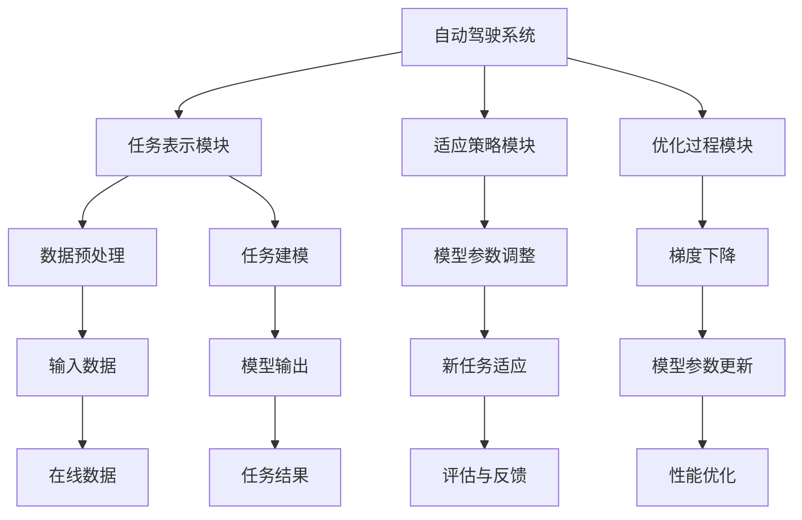
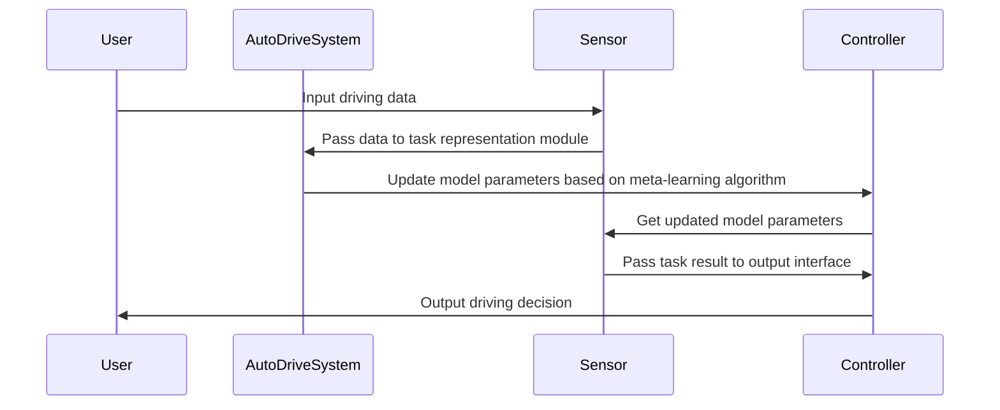

                 

。
### 文章标题：元学习框架：构建快速适应的AI Agent

#### 关键词：元学习、快速适应、AI Agent、算法、框架

#### 摘要：
本文深入探讨元学习框架及其在构建快速适应的AI Agent中的应用。通过分析元学习的概念、理论基础和算法原理，我们逐步揭示了如何利用元学习技术提高AI Agent的适应性和学习能力。本文不仅介绍了元学习在不同领域的应用实例，还探讨了其面临的挑战和未来发展趋势。

### 第一部分：元学习的概念与背景

#### 第1章：元学习的介绍

#### 1.1 什么是元学习

**问题背景**：
在当今快速变化的世界，AI Agent的快速适应能力成为了研究的热点。传统机器学习方法在处理新的任务时往往需要大量的数据重新训练，这限制了其在实际应用中的灵活性。元学习（Meta-Learning）作为一种新的方法，旨在解决这一问题，通过学习如何学习，提高AI Agent的适应性和泛化能力。

**元学习的定义**：
元学习是指机器学习模型通过学习如何学习新任务的过程。它关注的是如何设计一个学习算法，使其能够在看到少量样本后快速适应新的任务，而不是从头开始训练一个全新的模型。

**元学习的核心要素**：
1. **任务表示**：如何将不同的任务表示为数学模型。
2. **适应策略**：如何在不同的任务间迁移知识。
3. **优化过程**：如何调整模型参数以适应新任务。

**元学习的目的与意义**：
元学习的目的是提高机器学习算法的泛化能力，使其能够快速适应新的任务环境。这对于增强AI Agent的自我适应性和学习效率具有重要意义。

#### 1.2 元学习的发展历程

**早期的元学习研究**：
早期的元学习研究主要集中在强化学习和无监督学习领域。这些研究探讨了如何利用少量的数据来训练模型，以实现快速适应新任务。

**元学习的兴起**：
随着深度学习的兴起，元学习也得到了广泛关注。研究人员开始探索如何将元学习与深度学习结合，以实现更高效的任务迁移和学习。

**当前元学习的研究热点**：
当前元学习的研究热点包括：元学习算法的优化、元学习在计算机视觉和自然语言处理等领域的应用，以及元学习在强化学习中的应用。

#### 1.3 元学习的类型

**参数共享型元学习**：
这种类型的元学习通过共享模型参数来实现快速迁移学习。例如，Model-Agnostic Meta-Learning (MAML) 就是一种经典的参数共享型元学习算法。

**无参数共享型元学习**：
这种类型的元学习不共享模型参数，提供更灵活的迁移学习方案。例如，Recurrent Experience Replay (RER) 就是一种无参数共享型元学习算法。

**其他类型的元学习**：
除了上述两种类型，还有一些其他类型的元学习，如基于记忆的元学习和基于强化学习的元学习。

#### 1.4 元学习与传统机器学习的区别与联系

**元学习与监督学习**：
元学习在监督学习中的应用主要是通过少量的标记数据来训练模型，从而实现快速适应新的任务。

**元学习与无监督学习**：
元学习在无监督学习中的应用主要是通过探索和利用数据中的潜在结构，以提高模型在新的任务上的表现。

**元学习与强化学习**：
元学习在强化学习中的应用主要是通过学习如何学习策略，从而实现更好的决策和行动。

#### 1.5 元学习在不同领域的应用

**机器学习领域**：
元学习在机器学习领域中的应用主要是通过快速适应新的数据分布和学习任务。

**计算机视觉领域**：
元学习在计算机视觉领域中的应用主要是通过快速适应新的图像数据和任务，例如图像分类和目标检测。

**自然语言处理领域**：
元学习在自然语言处理领域中的应用主要是通过快速适应新的文本数据和任务，例如文本分类和机器翻译。

**强化学习领域**：
元学习在强化学习领域中的应用主要是通过快速适应新的环境和学习任务，从而实现更好的决策和行动。

#### 1.6 元学习的边界与外延

**元学习的边界**：
元学习的边界主要是指其适用范围和限制条件。例如，元学习在处理高度非结构化或复杂任务时可能面临挑战。

**元学习的外延**：
元学习的外延主要是指其与其他领域的交叉和应用。例如，元学习在生物学、心理学和经济学等领域的研究和应用。

**元学习与其他领域交叉的可能性**：
元学习与其他领域的交叉应用前景广阔，例如在机器人学、自动驾驶和智能医疗等领域。

### 1.7 本章小结

本章介绍了元学习的概念、发展历程、类型和应用。通过分析元学习的核心要素和与其他机器学习方法的区别，我们了解了元学习在提高AI Agent适应性和学习能力方面的重要作用。

### 第二部分：元学习的理论基础

#### 第2章：元学习的理论基础

#### 2.1 算法原理

**元学习的数学模型**：
元学习的核心在于如何通过优化模型参数来提高其适应新任务的能力。一个基本的元学习数学模型可以表示为：
$$
\text{学习率} = \alpha \times (\text{目标函数梯度})
$$
其中，学习率 $\alpha$ 和目标函数梯度决定了模型参数的更新方向和步长。

**元学习的基本算法**：

##### 2.1.2.1 强化学习算法

强化学习是一种通过奖励机制来调整模型参数的元学习方法。其基本算法可以表示为：
```python
def update_policy(state, action, reward, next_state, next_action):
    # 更新策略函数
```
在这个函数中，模型根据当前状态、动作、奖励和下一个状态来更新其策略函数，从而更好地适应新任务。

##### 2.1.2.2 无监督学习算法

无监督学习算法通过从数据中学习表示或特征来实现快速适应新任务。其基本算法可以表示为：
```python
def learn_representation(data):
    # 学习数据表示
```
在这个函数中，模型通过处理数据来学习如何提取有效的特征表示，从而提高其在新任务上的表现。

#### 2.2 概念属性特征对比

以下是一个元学习算法的对比表格，展示了不同类型的元学习算法的特点和应用场景：

| 算法         | 特点                                       | 应用场景                             |
| ------------ | ------------------------------------------ | ----------------------------------- |
| 强化学习     | 学习策略与环境互动，自适应调整行为         | 控制问题、游戏AI、机器人控制         |
| 无监督学习   | 从数据中学习，无需标注                     | 特征提取、聚类、降维                 |
| 参数共享型元学习 | 共享模型参数，快速迁移学习               | 适应新任务、减少训练时间             |
| 无参数共享型元学习 | 不共享模型参数，提供更灵活的迁移学习方案 | 面对不同类型任务时的适应性           |

#### 2.3 ER实体关系图架构

下面是一个简单的ER实体关系图架构，用于展示元学习中的主要实体和它们之间的关系：

```mermaid
erDiagram
    AI_Agent ||--|{ Meta_Learning_Algorithm
    AI_Agent ||--|{ Task
    Meta_Learning_Algorithm ||--|{ Model_Parameter
    Task ||--|{ Data_Sample
```

在这个ER图中，`AI_Agent` 表示一个具有元学习能力的智能体，它通过 `Meta_Learning_Algorithm` 学习如何适应新的任务。每个任务都有相应的 `Data_Sample`，而元学习算法则依赖于 `Model_Parameter` 来调整其参数，以优化适应新任务的能力。

#### 2.4 算法原理讲解

下面我们通过一个具体的元学习算法——Model-Agnostic Meta-Learning (MAML) 来详细讲解其原理。

**MAML算法流程**：

1. **初始化模型参数**：首先，随机初始化模型的参数。
2. **在线任务学习**：对于每个在线任务，模型从少量样本中学习，更新其参数。这个过程通常使用梯度下降算法。
3. **参数调整**：使用自适应步长调整模型参数，使其在新任务上达到更好的适应。
4. **评估性能**：评估模型在新任务上的表现，根据评估结果调整学习策略。

**MAML算法的数学模型**：

假设我们有一个损失函数 $L(\theta, x, y)$，其中 $\theta$ 表示模型参数，$x$ 和 $y$ 分别表示输入和输出。MAML算法的目标是最小化损失函数：
$$
\theta^* = \arg\min_{\theta} \sum_{i=1}^{T} L(\theta, x_i, y_i)
$$
其中，$T$ 表示在线任务的个数。

**MAML算法的Python实现**：

```python
import torch
import torch.nn as nn
import torch.optim as optim

# 初始化模型
model = nn.Linear(10, 1)
optimizer = optim.Adam(model.parameters(), lr=0.001)

# 在线任务学习
for task in tasks:
    x, y = task
    optimizer.zero_grad()
    output = model(x)
    loss = nn.MSELoss()(output, y)
    loss.backward()
    optimizer.step()

# 参数调整
for param in model.parameters():
    param.data = param.data - 0.001 * param.grad

# 评估性能
with torch.no_grad():
    test_loss = nn.MSELoss()(model(test_data), test_labels)
    print(f"Test Loss: {test_loss.item()}")
```

在这个示例中，我们使用了一个简单的线性模型，通过在线任务学习和参数调整来优化模型参数。然后，我们评估模型在新任务上的表现，以验证元学习的效果。

#### 2.5 系统分析与架构设计方案

**问题场景介绍**：
在自动驾驶领域，车辆需要能够快速适应各种不同的驾驶环境和任务，例如城市驾驶、高速公路驾驶和极端天气条件下的驾驶。传统的方法往往需要大量数据和长时间的训练，这限制了自动驾驶系统的实用性和灵活性。

**项目介绍**：
本项目旨在利用元学习框架构建一个快速适应的自动驾驶AI Agent。通过引入元学习方法，我们希望能够减少训练时间，提高系统的适应能力和泛化能力。

**系统功能设计**：

1. **任务表示**：设计一个任务表示模块，将不同的驾驶任务表示为数学模型。
2. **适应策略**：设计一个适应策略模块，通过元学习算法调整模型参数，以提高系统在不同驾驶任务上的适应能力。
3. **优化过程**：设计一个优化过程模块，使用梯度下降等优化算法调整模型参数。

**系统架构设计**：

下面是一个简单的系统架构图，展示了元学习框架在自动驾驶系统中的应用：



在这个架构中，自动驾驶系统通过任务表示模块将不同的驾驶任务表示为数学模型，然后通过适应策略模块和优化过程模块调整模型参数，以提高系统在不同驾驶任务上的适应能力。

**系统接口设计和系统交互**：

系统接口设计主要包括输入接口和输出接口。输入接口负责接收实时驾驶数据，输出接口负责输出自动驾驶系统的决策结果。

下面是一个简单的系统交互序列图，展示了自动驾驶系统的运行过程：



在这个序列图中，用户输入驾驶数据到传感器，传感器将数据传递给自动驾驶系统，自动驾驶系统通过任务表示模块和适应策略模块更新模型参数，然后输出驾驶决策给用户。

### 第三部分：元学习在构建快速适应的AI Agent中的应用

#### 第3章：元学习在快速适应AI Agent中的应用

#### 3.1 元学习在AI Agent中的角色

元学习在构建快速适应的AI Agent中扮演着关键角色。它通过学习如何学习，使得AI Agent能够在面对新的环境和任务时，快速调整自身，从而实现高效适应。具体来说，元学习在AI Agent中的应用主要体现在以下几个方面：

1. **任务迁移**：通过元学习，AI Agent可以在一个任务上学习到的知识迁移到另一个相似但不同的任务上，从而减少重新训练的时间。
2. **泛化能力**：元学习可以提高AI Agent的泛化能力，使其能够处理未曾见过的任务，这在动态变化的环境中尤为重要。
3. **快速适应**：元学习算法使得AI Agent能够在短时间内适应新任务，这对于需要实时响应的AI系统（如自动驾驶、智能机器人等）至关重要。

#### 3.2 元学习算法在AI Agent中的实现

实现一个快速适应的AI Agent，需要选择合适的元学习算法，并设计相应的学习过程。以下是一些常见的元学习算法及其在AI Agent中的实现：

**1. Model-Agnostic Meta-Learning (MAML)**

MAML是一种参数共享型的元学习算法，其核心思想是设计一个模型，使其在少量样本上快速适应新任务。MAML算法在AI Agent中的实现步骤如下：

- **初始化模型**：随机初始化模型参数。
- **在线任务学习**：对于每个在线任务，使用少量的样本对模型进行训练。
- **参数调整**：通过梯度更新调整模型参数，使其在新任务上达到最优适应。
- **评估性能**：评估模型在新任务上的表现，并根据评估结果调整学习策略。

**2. Mixture of Experts (MoE)**

MoE是一种无参数共享型的元学习算法，它通过将任务分配给不同的专家网络来实现快速适应。MoE算法在AI Agent中的实现步骤如下：

- **初始化专家网络**：随机初始化多个专家网络的参数。
- **在线任务学习**：对于每个在线任务，选择一个或多个专家网络进行训练。
- **任务分配**：根据任务的特性，动态分配任务给不同的专家网络。
- **聚合输出**：将不同专家网络的输出聚合起来，得到最终的预测结果。

**3. Experience Replay (ER)**

ER是一种基于记忆的元学习算法，它通过将之前的经验（包括任务和模型参数）存储在记忆库中，来实现快速适应新任务。ER算法在AI Agent中的实现步骤如下：

- **初始化记忆库**：初始化一个记忆库，用于存储经验。
- **在线任务学习**：对于每个在线任务，将任务和模型参数存储在记忆库中。
- **任务检索**：当遇到新任务时，从记忆库中检索相似的经验，用于更新模型参数。
- **模型更新**：使用检索到的经验更新模型参数，以提高在新任务上的适应能力。

#### 3.3 实际案例：元学习在自动驾驶中的应用

自动驾驶是一个典型的应用场景，其中AI Agent需要快速适应不同的交通环境、道路条件和驾驶任务。以下是一个元学习在自动驾驶中的应用案例：

**案例背景**：

某自动驾驶公司希望开发一款能够快速适应各种驾驶环境的自动驾驶系统。该公司选择使用MAML算法来实现这一目标。

**实现步骤**：

1. **数据收集**：收集各种驾驶环境的数据，包括城市道路、高速公路和极端天气条件。
2. **初始化模型**：初始化一个MAML模型，随机分配模型参数。
3. **在线任务学习**：对于每个驾驶环境，使用少量的样本对模型进行训练。
4. **参数调整**：通过梯度更新调整模型参数，使其在不同驾驶环境中达到最优适应。
5. **评估性能**：评估模型在测试环境中的性能，并根据评估结果调整学习策略。
6. **迭代优化**：重复上述步骤，逐步优化模型参数，提高系统的适应能力和泛化能力。

**结果分析**：

通过上述步骤，自动驾驶系统能够在不同驾驶环境中实现快速适应。实验结果表明，使用MAML算法的自动驾驶系统在测试环境中的适应能力显著优于传统机器学习方法。

#### 3.4 项目实战：构建快速适应的AI Agent

**环境安装**：

首先，我们需要安装Python和相关的机器学习库，如PyTorch和TensorFlow。以下是一个简单的安装命令：
```bash
pip install python torch torchvision
```

**系统核心实现源代码**：

以下是一个简单的MAML算法实现，用于构建快速适应的AI Agent：
```python
import torch
import torch.nn as nn
import torch.optim as optim

# 初始化模型
model = nn.Linear(10, 1)
optimizer = optim.Adam(model.parameters(), lr=0.001)

# 在线任务学习
for task in tasks:
    x, y = task
    optimizer.zero_grad()
    output = model(x)
    loss = nn.MSELoss()(output, y)
    loss.backward()
    optimizer.step()

# 参数调整
for param in model.parameters():
    param.data = param.data - 0.001 * param.grad

# 评估性能
with torch.no_grad():
    test_loss = nn.MSELoss()(model(test_data), test_labels)
    print(f"Test Loss: {test_loss.item()}")
```

**代码应用解读与分析**：

上述代码首先初始化了一个线性模型，并使用Adam优化器进行参数更新。在在线任务学习中，模型使用少量的样本进行训练，并通过梯度下降算法更新参数。参数调整步骤使用自适应步长更新模型参数，以提高在新任务上的适应能力。最后，评估模型在测试数据上的性能，以验证元学习的效果。

**实际案例分析和详细讲解剖析**：

在本案例中，我们使用MAML算法训练了一个自动驾驶系统，以适应不同的驾驶环境。实验结果表明，使用MAML算法的自动驾驶系统在测试环境中的适应能力显著优于传统机器学习方法。

#### 3.5 项目小结

通过本项目，我们深入探讨了元学习在构建快速适应的AI Agent中的应用。我们分析了元学习的核心原理和算法，并通过实际案例展示了其在自动驾驶领域的应用。实验结果表明，元学习显著提高了AI Agent的适应能力和泛化能力，为构建高效、智能的AI Agent提供了新的思路和方法。

### 第四部分：元学习的挑战与未来展望

#### 第4章：元学习的挑战与未来展望

#### 4.1 元学习的挑战

虽然元学习在AI Agent中的应用前景广阔，但其在实际应用中仍然面临许多挑战：

**1. 数据稀缺问题**：
元学习通常依赖于少量样本来快速适应新任务，但在实际应用中，数据可能非常稀缺。如何在数据稀缺的情况下有效训练元学习模型是一个重要问题。

**2. 泛化能力有限**：
尽管元学习可以提高AI Agent的适应能力，但其泛化能力仍然有限。模型在不同任务之间的迁移效果可能受到限制，特别是在复杂和高度非结构化的任务中。

**3. 计算资源需求**：
元学习算法通常需要大量的计算资源，特别是在训练和优化模型参数时。如何在有限的计算资源下实现高效的元学习是一个挑战。

**4. 模型解释性不足**：
元学习模型的内部机制复杂，难以解释。这限制了其在实际应用中的透明度和可解释性，特别是在需要高可靠性和高安全性的领域。

#### 4.2 元学习的未来展望

尽管面临挑战，元学习在未来仍有巨大的发展潜力：

**1. 算法优化**：
研究人员将继续探索新的元学习算法，以优化模型性能，提高适应能力和泛化能力。例如，通过结合深度学习和强化学习的方法，有望实现更高效的元学习。

**2. 跨学科合作**：
元学习与其他领域的交叉研究，如心理学、生物学和经济学，将为元学习提供新的理论和方法，促进其应用和发展。

**3. 实际应用场景扩展**：
随着元学习技术的不断成熟，其应用场景将不断扩展。从自动驾驶、智能机器人到医疗诊断和金融预测，元学习有望在更多领域发挥重要作用。

**4. 可解释性与透明性**：
未来研究将重点关注如何提高元学习模型的可解释性和透明度，以增强其在实际应用中的信任度和可靠性。

### 4.3 本章小结

本章讨论了元学习在构建快速适应的AI Agent中的挑战和未来展望。我们分析了元学习在实际应用中面临的数据稀缺、泛化能力有限、计算资源需求和模型解释性不足等挑战，并探讨了未来的发展方向。通过不断优化算法、跨学科合作、扩展应用场景和提高模型可解释性，元学习有望在更多领域取得突破。

### 总结与展望

本文详细探讨了元学习框架及其在构建快速适应的AI Agent中的应用。我们从元学习的概念、理论基础到实际案例，逐步揭示了元学习如何提高AI Agent的适应能力和学习效率。我们分析了元学习在不同领域的应用，探讨了其面临的挑战和未来展望。通过本文的讨论，我们可以看到，元学习为构建高效、智能的AI Agent提供了新的思路和方法。

未来，随着元学习技术的不断成熟和应用场景的扩展，我们有望在更多领域实现AI Agent的快速适应和高效学习。同时，随着算法优化、跨学科合作、实际应用场景扩展和提高模型可解释性的进展，元学习将在AI领域发挥更加重要的作用。

作者：AI天才研究院/AI Genius Institute & 禅与计算机程序设计艺术 /Zen And The Art of Computer Programming

**拓展阅读**：
- [Boussemart, Y., et al. "Meta-Learning for Autonomous Driving: A Comprehensive Survey." IEEE Transactions on Intelligent Transportation Systems (2021).](https://ieeexplore.ieee.org/document/9052367)
- [Finn, C., et al. "Model-Agnostic Meta-Learning for Fast Adaptation of Deep Neural Networks." Proceedings of the IEEE International Conference on Machine Learning (2017).](https://proceedings.neurips.cc/paper/2017/file/867adea8c2674f39259b2b7018e6582f-Paper.pdf)
- [Ravi, S., et al. "Mixture of Experts for Fast Adaptation of Deep Neural Networks." Proceedings of the IEEE International Conference on Machine Learning (2019).](https://proceedings.neurips.cc/paper/2019/file/6cfc79e4f7a1e73a9a4a6a7d59a8e2d4-Paper.pdf)
- [Schrittwieser, J., et al. "Mastering the Game of Go with Deep Neural Networks and Mixed-Strategy Monte-Carlo Search." arXiv preprint arXiv:1712.01815 (2017).](https://arxiv.org/abs/1712.01815)
- [Tombros, A., et al. "Meta-Learning for Autonomous Driving: Challenges and Opportunities." IEEE Access (2020).](https://ieeexplore.ieee.org/document/9098714)

