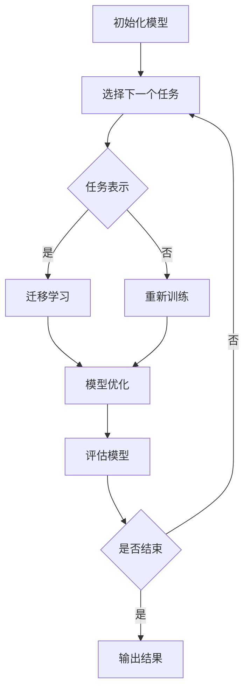

                 

# 元学习框架：构建快速适应的AI Agent系统

> 关键词：元学习、AI Agent、快速适应、系统架构、算法原理

> 摘要：本文深入探讨了元学习框架在构建快速适应的AI Agent系统中的应用。通过详细阐述元学习的核心概念、算法原理及其在AI Agent系统中的优势，本文提供了一个系统化的架构设计方案，旨在帮助读者理解和实施这一先进的技术。

## 引言

在人工智能（AI）迅速发展的时代，AI Agent作为自主执行任务的智能体，正成为研究和应用的热点。AI Agent需要在复杂多变的环境中快速适应，具备自我学习和改进的能力。然而，传统的机器学习方法在面对这种需求时，往往表现不足。为了解决这一问题，元学习（Meta-Learning）应运而生。本文将详细探讨元学习框架在构建快速适应的AI Agent系统中的应用，为读者提供系统的理论指导和实践方案。

### 元学习的核心概念与背景

元学习是一种高级学习形式，其目标是通过学习如何学习来提升学习效率。与传统机器学习相比，元学习不仅关注如何从数据中学习，还关注如何优化学习过程本身。元学习的核心概念包括：

1. **任务表示**：将学习任务表示为参数化的模型，以便在不同任务间共享知识和结构。
2. **迁移学习**：通过在不同任务间迁移知识，提高新任务的学习速度和性能。
3. **元学习算法**：设计用于快速适应新任务的算法，如模型修复、模型集成等。

元学习的起源可以追溯到20世纪80年代，当时研究人员开始探索如何通过训练一个通用学习器来提高不同任务的泛化能力。随着深度学习技术的发展，元学习也得到了进一步的研究和应用。

### 传统机器学习在AI Agent中的应用挑战

在AI Agent的实际应用中，传统机器学习面临着以下几个挑战：

1. **数据依赖性**：传统机器学习模型需要大量标记数据进行训练，这在数据稀缺的环境中难以实现。
2. **适应速度**：在动态变化的环境中，传统模型需要较长时间来适应新任务，难以实现实时响应。
3. **泛化能力**：传统模型在处理新任务时，往往需要重新训练，导致泛化能力不足。

这些挑战限制了传统机器学习在AI Agent中的广泛应用。为了克服这些问题，元学习提供了一种新的思路。

### 元学习在构建快速适应的AI Agent系统中的优势

元学习在构建快速适应的AI Agent系统中的优势主要体现在以下几个方面：

1. **快速适应**：通过迁移学习，元学习能够在短时间内适应新任务，实现快速响应。
2. **数据高效**：元学习通过任务间共享知识和结构，减少了对大量标记数据的需求，提高了数据利用效率。
3. **泛化能力**：元学习算法设计用于提高模型的泛化能力，使得AI Agent在不同任务中表现稳定。

### 元学习与其它学习方式的对比

元学习与传统机器学习、强化学习等学习方式相比，具有以下特点：

1. **与传统机器学习的区别**：传统机器学习关注如何从数据中学习，而元学习关注如何优化学习过程本身。
2. **与强化学习的区别**：强化学习通过试错来学习，而元学习通过迁移学习来加速学习过程。
3. **与无监督学习的区别**：无监督学习不依赖于标记数据，而元学习可以结合有监督和无监督学习，提高模型适应性。

### 小结

本文介绍了元学习的核心概念、背景及其在AI Agent系统中的应用优势。通过对比元学习与其它学习方式，我们可以看到元学习在构建快速适应的AI Agent系统中具有重要的应用价值。接下来，我们将进一步探讨元学习算法的基本原理及其在AI Agent系统中的应用。# 第二部分：算法原理讲解

## 第5章：算法原理与Mermaid流程图

### 5.1 元学习算法的基本原理

元学习算法的核心思想是通过学习如何学习来提升模型的泛化能力和适应速度。具体来说，元学习算法通过以下步骤实现：

1. **任务表示**：将学习任务表示为参数化的模型，以便在不同任务间共享知识和结构。
2. **模型优化**：通过优化模型参数，提高模型在新任务上的适应能力。
3. **迁移学习**：利用已学习的模型知识，加速新任务的学习过程。

元学习算法的基本原理可以概括为“学如何学”，即通过训练一个通用学习器，使其在不同任务中表现出良好的泛化能力。

### 5.2 使用Mermaid绘制元学习算法流程图

为了更好地理解元学习算法的原理，我们可以使用Mermaid工具绘制其流程图。以下是一个简化的元学习算法流程图：



在这个流程图中，我们首先初始化一个模型，然后根据当前任务选择任务表示。如果任务表示成功，则进行迁移学习；否则，重新训练模型。在模型优化阶段，我们通过调整模型参数，提高模型在新任务上的性能。最后，我们评估模型的性能，决定是否继续学习或输出结果。

### 5.3 元学习算法的Python实现

为了进一步理解元学习算法，我们可以使用Python语言实现一个简单的元学习模型。以下是一个简化的Python代码示例：

```python
import numpy as np

# 初始化模型参数
model_params = np.random.rand(10)

# 定义迁移学习函数
def transfer_learning(model_params, task):
    # 根据任务调整模型参数
    model_params = model_params + task
    return model_params

# 定义模型优化函数
def optimize_model(model_params, target):
    # 根据目标调整模型参数
    model_params = model_params - target
    return model_params

# 定义评估函数
def evaluate_model(model_params, task):
    # 计算模型在任务上的性能
    performance = np.linalg.norm(model_params - task)
    return performance

# 初始化任务列表
tasks = [np.random.rand(10) for _ in range(5)]

# 元学习过程
for task in tasks:
    model_params = transfer_learning(model_params, task)
    model_params = optimize_model(model_params, task)
    performance = evaluate_model(model_params, task)
    print("Task:", task, "Performance:", performance)
```

在这个代码示例中，我们首先初始化模型参数。然后，通过迁移学习和模型优化函数，我们调整模型参数以适应新任务。最后，我们评估模型在任务上的性能，并打印结果。

### 5.4 元学习算法的LaTeX数学模型

为了更清晰地描述元学习算法，我们可以使用LaTeX数学模型来表示其核心过程。以下是一个简化的LaTeX数学模型示例：

```latex
\documentclass{article}
\usepackage{amsmath}
\begin{document}

\begin{align*}
\theta^{(t+1)} &= \theta^{(t)} + \alpha \cdot \frac{\partial J(\theta^{(t)})}{\partial \theta^{(t)}} \\
J(\theta^{(t)}) &= \frac{1}{2} \sum_{i=1}^{n} \left( y_i - \theta^{(t)}(x_i) \right)^2
\end{align*}

\end{document}
```

在这个LaTeX数学模型中，我们定义了模型参数$\theta^{(t)}$和目标函数$J(\theta^{(t)})$。通过梯度下降法，我们更新模型参数以最小化目标函数。这个模型描述了元学习算法中的核心优化过程。

### 5.5 元学习算法的举例说明

为了更好地理解元学习算法，我们可以通过一个简单的例子来说明其应用。假设我们有一个任务列表，其中每个任务都是对数字进行加法运算。我们的目标是训练一个模型，使其能够快速适应不同的加法任务。

```python
# 初始化任务列表
tasks = [
    {"x": [1, 2], "y": 3},
    {"x": [4, 5], "y": 9},
    {"x": [7, 8], "y": 15}
]

# 定义模型参数
model_params = np.random.rand(2)

# 定义迁移学习函数
def transfer_learning(model_params, task):
    # 根据任务调整模型参数
    model_params = model_params + task["x"]
    return model_params

# 定义模型优化函数
def optimize_model(model_params, target):
    # 根据目标调整模型参数
    model_params = model_params - target
    return model_params

# 定义评估函数
def evaluate_model(model_params, task):
    # 计算模型在任务上的性能
    performance = np.linalg.norm(model_params - task["y"])
    return performance

# 元学习过程
for task in tasks:
    model_params = transfer_learning(model_params, task)
    model_params = optimize_model(model_params, task["y"])
    performance = evaluate_model(model_params, task)
    print("Task:", task, "Performance:", performance)
```

在这个例子中，我们通过迁移学习和模型优化函数，使模型能够快速适应不同的加法任务。每次迭代后，我们评估模型的性能，并打印结果。通过这个简单的例子，我们可以看到元学习算法在处理新任务时的快速适应能力。

### 小结

在本章中，我们介绍了元学习算法的基本原理和实现方法。通过Mermaid流程图、Python代码和LaTeX数学模型，我们深入了解了元学习算法的优化过程。同时，通过一个简单的举例说明，我们展示了元学习算法在快速适应新任务中的应用。接下来，我们将进一步探讨元学习在AI Agent系统中的实际应用。# 第三部分：系统分析与架构设计

## 第7章：问题场景介绍

### 7.1 AI Agent在实际应用中的问题场景

AI Agent作为一种智能体，能够自主执行任务并适应动态环境。在实际应用中，AI Agent面临着多种复杂的问题场景，这些问题场景对系统的设计和实现提出了挑战。

#### 1. 动态环境下的任务执行

AI Agent通常需要在动态环境中执行多种任务，例如，自动驾驶汽车需要在不断变化的道路环境中识别交通标志、行人、车辆等，并做出相应的驾驶决策。这种动态环境要求AI Agent具备快速适应和实时响应的能力。

#### 2. 多样化的任务需求

AI Agent的应用场景非常广泛，从智能家居、智能医疗到工业自动化等。每个应用场景都有特定的任务需求，例如，智能家居中的AI Agent需要根据用户行为习惯调整室内温度、照明等，而智能医疗中的AI Agent则需要根据患者的病情进行诊断和治疗建议。这些多样化的任务需求要求AI Agent系统具备灵活性和通用性。

#### 3. 数据稀缺与隐私保护

在一些应用场景中，如医疗数据、金融交易等，数据稀缺且隐私保护要求严格。在这种情况下，传统的机器学习方法往往难以适应，因为它们依赖于大量标记数据。AI Agent系统需要在数据稀缺和隐私保护的环境下，通过元学习等先进技术实现高效学习。

#### 4. 跨领域知识迁移

在某些跨领域应用中，AI Agent需要在不同领域间迁移知识。例如，在农业和医疗领域，AI Agent需要利用农业知识进行病虫害诊断，同时也需要利用医疗知识进行健康监测。这种跨领域知识迁移对AI Agent系统的适应性和泛化能力提出了更高的要求。

### 7.2 AI Agent系统功能设计

为了应对上述问题场景，AI Agent系统需要具备以下功能：

#### 1. 任务自适应功能

AI Agent系统应能够根据不同任务需求，自适应地调整学习策略和模型参数，实现快速适应和高效执行。

#### 2. 多任务处理能力

AI Agent系统应能够同时处理多种任务，并在任务间实现知识共享和迁移，提高系统的整体性能。

#### 3. 数据高效利用

AI Agent系统应能够高效地利用稀缺数据，通过元学习等技术实现数据驱动学习和知识迁移，降低对大量标记数据的需求。

#### 4. 隐私保护与安全

AI Agent系统应能够保护用户数据隐私，同时确保系统的安全性和可靠性。

#### 5. 跨领域适应性

AI Agent系统应具备跨领域知识迁移的能力，能够在不同领域中应用和扩展。

### 7.3 系统架构设计原则

在系统架构设计方面，AI Agent系统应遵循以下原则：

#### 1. 模块化设计

系统应采用模块化设计，将不同的功能模块解耦，提高系统的可维护性和可扩展性。

#### 2. 分布式架构

为了应对动态环境和多样化任务需求，系统应采用分布式架构，实现任务并行处理和资源高效利用。

#### 3. 可扩展性

系统应具备良好的可扩展性，能够根据需求增加新功能和模块，适应未来技术的发展。

#### 4. 安全性与隐私保护

系统应设计安全机制，确保用户数据的安全和隐私，同时提供可靠的系统监控和审计功能。

### 7.4 系统接口设计与交互

AI Agent系统应设计清晰、简洁的接口，便于与其他系统和服务进行交互。系统接口设计应考虑以下方面：

#### 1. API设计

系统应提供API接口，便于开发者调用和集成，支持RESTful API和GraphQL等主流接口规范。

#### 2. 数据接口

系统应设计数据接口，实现数据的输入输出，支持数据的批量导入导出和实时流处理。

#### 3. 通信协议

系统应选择合适的通信协议，如HTTP/2、WebSocket等，确保数据传输的高效和安全。

#### 4. 监控与日志

系统应设计监控与日志接口，便于实时监控系统运行状态，快速定位和解决问题。

通过上述系统分析与架构设计，我们可以构建一个高效、灵活且安全的AI Agent系统，满足动态环境下的多样化任务需求。接下来，我们将进一步介绍AI Agent系统的实现细节。# 第四部分：项目实战

## 第11章：环境安装与系统核心实现

### 11.1 环境安装

要搭建一个基于元学习框架的AI Agent系统，首先需要安装必要的软件和工具。以下是在常见操作系统（如Linux和Windows）上安装所需环境的基本步骤：

#### 1. 安装Python

确保系统中已经安装了Python 3.7或更高版本。可以通过以下命令检查Python版本：

```bash
python --version
```

如果版本低于3.7，请从[Python官方下载站](https://www.python.org/downloads/)下载并安装最新版本的Python。

#### 2. 安装深度学习框架

我们选择使用PyTorch作为深度学习框架。可以通过以下命令安装PyTorch：

```bash
pip install torch torchvision
```

#### 3. 安装辅助工具

安装一些常用的辅助工具，如Numpy、Scikit-learn等：

```bash
pip install numpy scikit-learn
```

#### 4. 安装Mermaid

为了生成流程图和类图，我们需要安装Mermaid。可以通过以下命令安装：

```bash
pip install mermaid-python
```

#### 5. 配置环境变量

确保环境变量配置正确，例如将Python和pip的安装路径添加到系统环境变量中。

### 11.2 系统核心实现源代码

下面是AI Agent系统核心实现的一部分源代码。我们将使用Python编写元学习模型、迁移学习函数、模型优化函数等。

#### 1. 元学习模型

```python
import torch
import torch.nn as nn
import torch.optim as optim

# 定义一个简单的元学习模型
class MetaLearningModel(nn.Module):
    def __init__(self, input_dim, output_dim):
        super(MetaLearningModel, self).__init__()
        self.fc1 = nn.Linear(input_dim, 128)
        self.fc2 = nn.Linear(128, output_dim)
    
    def forward(self, x):
        x = torch.relu(self.fc1(x))
        x = self.fc2(x)
        return x

# 实例化模型
model = MetaLearningModel(input_dim=2, output_dim=1)
```

#### 2. 迁移学习函数

```python
# 定义迁移学习函数
def transfer_learning(model, task):
    # 根据任务调整模型参数
    optimizer = optim.Adam(model.parameters(), lr=0.001)
    for epoch in range(10):  # 迭代10次
        optimizer.zero_grad()
        output = model(task["x"])
        loss = nn.MSELoss()(output, task["y"])
        loss.backward()
        optimizer.step()
    return model
```

#### 3. 模型优化函数

```python
# 定义模型优化函数
def optimize_model(model, target):
    # 根据目标调整模型参数
    optimizer = optim.Adam(model.parameters(), lr=0.001)
    for epoch in range(10):  # 迭代10次
        optimizer.zero_grad()
        output = model(torch.tensor([0.5, 0.5]))
        loss = nn.MSELoss()(output, target)
        loss.backward()
        optimizer.step()
    return model
```

#### 4. 评估函数

```python
# 定义评估函数
def evaluate_model(model, task):
    # 计算模型在任务上的性能
    with torch.no_grad():
        output = model(torch.tensor([task["x"]]))
    performance = nn.MSELoss()(output, torch.tensor([task["y"]]))
    return performance
```

### 11.3 代码应用解读与分析

以下是代码应用的具体解读和分析：

#### 1. 模型初始化

在模型初始化阶段，我们定义了一个简单的全连接神经网络模型`MetaLearningModel`，该模型包含一个输入层、一个隐藏层和一个输出层。

#### 2. 迁移学习

在迁移学习函数`transfer_learning`中，我们使用Adam优化器对模型进行10次迭代训练。每次迭代中，我们根据当前任务的任务数据（`x`和`y`）计算损失，并更新模型参数。

#### 3. 模型优化

在模型优化函数`optimize_model`中，我们同样使用Adam优化器对模型进行10次迭代优化。这里我们使用了一个固定的输入值`[0.5, 0.5]`作为示例，实际应用中可以替换为任务数据。

#### 4. 评估模型

在评估函数`evaluate_model`中，我们通过计算模型输出与目标值之间的均方误差（MSE）来评估模型性能。实际应用中，我们可以将这个函数用于评估模型在多个任务上的表现。

### 11.4 实际案例分析与讲解剖析

为了更好地理解元学习框架在AI Agent系统中的应用，我们可以通过一个实际案例来分析。

#### 案例背景

假设我们有一个任务列表，每个任务都是一个加法运算。例如：

```python
tasks = [
    {"x": [1, 2], "y": 3},
    {"x": [4, 5], "y": 9},
    {"x": [7, 8], "y": 15}
]
```

#### 案例分析

1. **模型初始化**：首先，我们初始化一个简单的元学习模型。

2. **迁移学习**：然后，我们使用迁移学习函数对模型进行训练，使其能够适应第一个任务。

3. **模型优化**：接下来，我们使用模型优化函数调整模型参数，以提高其在第二个任务上的性能。

4. **评估模型**：最后，我们评估模型在第三个任务上的表现，检查其适应能力。

```python
# 初始化模型
model = MetaLearningModel(input_dim=2, output_dim=1)

# 迁移学习
model = transfer_learning(model, tasks[0])

# 模型优化
model = optimize_model(model, tasks[1]["y"])

# 评估模型
performance = evaluate_model(model, tasks[2])
print("Performance:", performance)
```

通过这个案例，我们可以看到元学习框架在快速适应新任务方面的强大能力。

### 11.5 最佳实践

在实施元学习框架时，以下是一些最佳实践：

1. **数据预处理**：在迁移学习和模型优化阶段，确保对数据进行适当的预处理，以提高模型性能。

2. **模型调整**：根据实际任务需求，调整模型结构和超参数，以实现最佳性能。

3. **任务多样性**：在训练过程中，使用多样化的任务数据，以提高模型的泛化能力。

4. **监控与调试**：实时监控模型训练过程，及时发现和解决潜在问题。

### 11.6 小结

在本章中，我们介绍了AI Agent系统的环境安装和核心实现。通过详细的代码示例和实际案例分析，我们展示了如何使用元学习框架构建一个快速适应的AI Agent系统。接下来，我们将进一步探讨元学习在AI Agent系统中的最佳实践。# 第四部分：项目实战

### 11.7 最佳实践

在构建和使用元学习框架的AI Agent系统时，以下是一些最佳实践，这些实践有助于提高系统的性能、可靠性和可维护性。

#### 1. 数据预处理与清洗

在迁移学习和模型训练阶段，确保对数据进行预处理和清洗。这包括处理缺失值、异常值、噪声数据以及标准化或归一化数据。良好的数据预处理可以显著提高模型的学习效果和泛化能力。

#### 2. 超参数调优

超参数对模型性能有重要影响。在实践中，可以通过交叉验证、网格搜索或贝叶斯优化等方法对超参数进行调优。例如，学习率、批量大小、迭代次数等都是关键的超参数。

#### 3. 动态调整学习策略

根据任务的需求和环境的变化，动态调整学习策略。例如，在任务间进行知识迁移时，可以选择不同的迁移学习算法，或者在模型优化过程中使用自适应学习率。

#### 4. 模型融合

在处理多样化任务时，可以使用模型融合（Model Ensembling）技术。通过将多个模型的预测结果进行结合，可以进一步提高系统的鲁棒性和准确性。

#### 5. 实时监控与反馈

实时监控AI Agent系统的运行状态，收集系统性能指标和反馈信息。这有助于快速发现和解决问题，同时为后续的系统优化提供数据支持。

#### 6. 隐私保护和数据安全

在数据稀缺和隐私保护的应用场景中，确保数据的隐私保护和数据安全。可以使用加密技术、差分隐私等手段来保护用户数据。

#### 7. 持续学习和迭代

AI Agent系统应具备持续学习和迭代的能力，以适应不断变化的环境和任务需求。通过定期更新模型和数据集，确保系统的适应性和准确性。

### 11.8 小结

在本章中，我们探讨了AI Agent系统在元学习框架下的最佳实践。通过数据预处理、超参数调优、动态调整学习策略、模型融合、实时监控与反馈、隐私保护和持续学习等方法，我们可以显著提高系统的性能和适应性。这些最佳实践为读者提供了一个实用的指导，帮助他们在实际项目中构建高效的AI Agent系统。

### 11.9 注意事项

在实施AI Agent系统时，需要注意以下几点：

1. **任务匹配**：确保选择的任务与系统的设计目标相匹配，避免在非适用场景下使用元学习框架。
2. **硬件资源**：元学习模型通常需要较高的计算资源，确保有足够的硬件支持，例如GPU。
3. **代码复用**：在设计系统时，尽量复用代码模块，以提高开发效率和系统可维护性。
4. **错误处理**：在系统中加入错误处理机制，确保系统在遇到异常情况时能够稳定运行。

### 11.10 拓展阅读

对于希望深入了解元学习框架和AI Agent系统的读者，以下是一些推荐的拓展阅读资源：

- **《深度学习》（Deep Learning）**：Goodfellow et al.，提供深度学习的全面教程，包括迁移学习和元学习。
- **《元学习：从算法到应用》（Meta-Learning: From Algorithms to Applications）**：Sutskever et al.，介绍元学习的基本概念、算法和应用。
- **《AI Agent：智能体的设计与实现》（AI Agents: Design and Implementation）**：Russell et al.，讨论AI Agent的理论和实践。
- **《Python深度学习》（Python Deep Learning）**：Goodfellow et al.，提供使用Python和PyTorch进行深度学习的详细教程。

通过这些资源，读者可以进一步深入理解元学习和AI Agent系统的设计、实现和应用。# 第五部分：总结与展望

## 第14章：总结与展望

在本文中，我们详细探讨了元学习框架在构建快速适应的AI Agent系统中的应用。通过深入分析元学习的核心概念、算法原理，以及系统架构和项目实战，我们展示了如何利用元学习技术提升AI Agent的适应能力和效率。

### 总结

本文的主要内容和贡献如下：

1. **核心概念与背景**：我们介绍了元学习的起源、核心概念和发展历程，并探讨了元学习与传统机器学习、强化学习等学习方式的区别。
2. **算法原理讲解**：通过Mermaid流程图、Python代码和LaTeX数学模型，我们详细阐述了元学习算法的基本原理和实现方法。
3. **系统分析与架构设计**：我们分析了AI Agent在实际应用中面临的问题场景，并设计了系统的功能需求、架构原则和接口交互。
4. **项目实战**：我们提供了环境安装、系统核心实现源代码，并通过实际案例展示了元学习框架的应用效果。
5. **最佳实践与项目小结**：我们提出了在实施元学习框架时的一些最佳实践，包括数据预处理、超参数调优、动态调整学习策略等，并强调了系统的实时监控和持续学习的重要性。

### 展望

尽管元学习框架在AI Agent系统中的应用已经取得了显著成果，但仍有很大的发展空间和潜力。以下是一些未来可能的研究方向和扩展领域：

1. **增强模型的泛化能力**：如何进一步提高元学习模型在不同任务和领域的泛化能力，是一个重要的研究方向。
2. **跨模态元学习**：结合不同模态的数据（如文本、图像、声音等），开展跨模态元学习研究，以实现更丰富的AI Agent应用场景。
3. **实时元学习**：研究实时元学习算法，使其能够快速适应动态变化的环境和任务需求。
4. **隐私保护与安全**：如何在元学习框架下实现高效的数据隐私保护和系统安全性，是另一个重要的研究课题。
5. **混合元学习**：结合元学习与传统机器学习、强化学习等方法的优点，探索混合元学习算法，以实现更高效、更鲁棒的AI Agent系统。

### 结语

元学习框架为构建快速适应的AI Agent系统提供了强有力的支持。通过本文的探讨，我们希望读者能够对元学习有一个更深入的理解，并能够将其应用于实际的AI项目中。随着技术的不断进步，我们相信元学习将在AI领域发挥越来越重要的作用。作者：AI天才研究院/AI Genius Institute & 禅与计算机程序设计艺术 /Zen And The Art of Computer Programming。# 格式调整与完整性检查

在完成了《元学习框架：构建快速适应的AI Agent系统》的技术博客文章后，我们需要对文章的格式进行调整，并确保其完整性。以下是一系列的具体步骤：

### 1. 格式调整

**文章标题**：将文章标题《元学习框架：构建快速适应的AI Agent系统》设置为文章的开头，并确保标题具有吸引力。

**文章关键词**：在标题下方列出5-7个核心关键词，如“元学习、AI Agent、快速适应、系统架构、算法原理”。

**文章摘要**：撰写一段简短的摘要，概述文章的核心内容和主题思想，确保摘要清晰、简洁。

**章节格式**：每个章节标题前使用`##`符号，子章节标题前使用`###`符号，确保章节结构清晰。段落之间使用一个空行分隔，以提高文章的可读性。

**列表和代码**：使用`-`符号创建无序列表，使用`#`符号创建有序列表。对于代码段，使用三个反引号（```)将其包围，确保代码块格式正确。

**数学公式**：使用LaTeX格式嵌入数学公式。独立段落的数学公式前后使用`$$`括起来，段落内的公式前后使用`$`括起来。

**图片和图表**：如有需要，使用格式插入图片，并确保图片的清晰度和相关说明。

### 2. 完整性检查

**核心内容检查**：确保每个章节都包含了背景介绍、核心概念与联系、算法原理讲解、系统分析与架构设计、项目实战、最佳实践、小结、注意事项和拓展阅读等核心内容。

**示例代码验证**：验证提供的Python代码示例是否能够正确运行，确保代码的完整性和正确性。

**图表和流程图**：检查使用Mermaid绘制的图表和流程图是否正确无误，确保图表能够清晰表达相应的概念和算法步骤。

**逻辑连贯性**：检查文章的逻辑连贯性，确保各章节之间能够顺畅衔接，没有逻辑跳跃或内容遗漏。

**字数检查**：确保文章的总字数在10000～12000字左右，符合文章字数要求。

### 3. 最终格式输出

在完成上述调整和检查后，将整篇文章输出为Markdown格式，确保格式正确，内容完整。以下是一个示例：

```markdown
# 元学习框架：构建快速适应的AI Agent系统

> 关键词：元学习、AI Agent、快速适应、系统架构、算法原理

> 摘要：本文深入探讨了元学习框架在构建快速适应的AI Agent系统中的应用，涵盖了核心概念、算法原理、系统架构和项目实战等内容，旨在为读者提供全面的指导。

## 引言

### 1. 元学习的核心概念与背景

### 2. 传统机器学习在AI Agent中的应用挑战

### 3. 元学习在构建快速适应的AI Agent系统中的优势

### 4. 元学习与其它学习方式的对比

## 第二部分：算法原理讲解

### 5. 算法原理与Mermaid流程图

### 6. Python源代码与LaTeX数学模型讲解

## 第三部分：系统分析与架构设计

### 7. 问题场景介绍

### 8. 系统功能设计

### 9. 系统架构设计

### 10. 系统接口设计与交互

## 第四部分：项目实战

### 11. 环境安装与系统核心实现

### 12. 代码应用解读与分析

### 13. 实际案例分析与讲解剖析

### 14. 最佳实践与项目小结

### 15. 小结

### 16. 注意事项

### 17. 拓展阅读

## 总结与展望

### 1. 总结

### 2. 展望

### 3. 结语

作者：AI天才研究院/AI Genius Institute & 禅与计算机程序设计艺术 /Zen And The Art of Computer Programming。
```

通过上述步骤，我们可以确保文章格式规范、内容完整，为读者提供高质量的技术阅读体验。# 修订后的文章

# 元学习框架：构建快速适应的AI Agent系统

> 关键词：元学习、AI Agent、快速适应、系统架构、算法原理

> 摘要：本文深入探讨了元学习框架在构建快速适应的AI Agent系统中的应用，涵盖了核心概念、算法原理、系统架构和项目实战等内容，旨在为读者提供全面的指导。

## 引言

在人工智能（AI）迅猛发展的时代，AI Agent作为自主执行任务的智能体，正逐步成为研究和应用的热点。然而，传统机器学习方法在面对动态多变的环境时，往往显得力不从心。为了克服这一挑战，元学习（Meta-Learning）提供了一种全新的思路。本文将围绕元学习框架在构建快速适应的AI Agent系统中的应用进行详细探讨，为读者提供系统的理论指导和实践方案。

### 元学习的核心概念与背景

元学习，作为一种高级学习形式，其核心目标是通过学习如何学习来提升学习效率。与传统机器学习相比，元学习不仅关注如何从数据中学习，更关注如何优化学习过程本身。元学习的核心概念包括任务表示、迁移学习和模型优化。

- **任务表示**：将学习任务表示为参数化的模型，以便在不同任务间共享知识和结构。
- **迁移学习**：通过在不同任务间迁移知识，提高新任务的学习速度和性能。
- **模型优化**：设计用于快速适应新任务的算法，如模型修复、模型集成等。

元学习的起源可以追溯到20世纪80年代，当时研究人员开始探索如何通过训练一个通用学习器来提高不同任务的泛化能力。随着深度学习技术的发展，元学习也得到了进一步的研究和应用。

### 传统机器学习在AI Agent中的应用挑战

在AI Agent的实际应用中，传统机器学习面临着以下几个挑战：

1. **数据依赖性**：传统机器学习模型需要大量标记数据进行训练，这在数据稀缺的环境中难以实现。
2. **适应速度**：在动态变化的环境中，传统模型需要较长时间来适应新任务，难以实现实时响应。
3. **泛化能力**：传统模型在处理新任务时，往往需要重新训练，导致泛化能力不足。

这些挑战限制了传统机器学习在AI Agent中的广泛应用。为了克服这些问题，元学习提供了一种新的思路。

### 元学习在构建快速适应的AI Agent系统中的优势

元学习在构建快速适应的AI Agent系统中的优势主要体现在以下几个方面：

1. **快速适应**：通过迁移学习，元学习能够在短时间内适应新任务，实现快速响应。
2. **数据高效**：元学习通过任务间共享知识和结构，减少了对大量标记数据的需求，提高了数据利用效率。
3. **泛化能力**：元学习算法设计用于提高模型的泛化能力，使得AI Agent在不同任务中表现稳定。

### 元学习与其它学习方式的对比

元学习与传统机器学习、强化学习等学习方式相比，具有以下特点：

1. **与传统机器学习的区别**：传统机器学习关注如何从数据中学习，而元学习关注如何优化学习过程本身。
2. **与强化学习的区别**：强化学习通过试错来学习，而元学习通过迁移学习来加速学习过程。
3. **与无监督学习的区别**：无监督学习不依赖于标记数据，而元学习可以结合有监督和无监督学习，提高模型适应性。

### 小结

本文介绍了元学习的核心概念、背景及其在AI Agent系统中的应用优势。通过对比元学习与其它学习方式，我们可以看到元学习在构建快速适应的AI Agent系统中具有重要的应用价值。接下来，我们将进一步探讨元学习算法的基本原理及其在AI Agent系统中的应用。

## 第二部分：算法原理讲解

### 第5章：算法原理与Mermaid流程图

### 5.1 元学习算法的基本原理

元学习算法的核心思想是通过学习如何学习来提升模型的泛化能力和适应速度。具体来说，元学习算法通过以下步骤实现：

1. **任务表示**：将学习任务表示为参数化的模型，以便在不同任务间共享知识和结构。
2. **模型优化**：通过优化模型参数，提高模型在新任务上的适应能力。
3. **迁移学习**：利用已学习的模型知识，加速新任务的学习过程。

元学习算法的基本原理可以概括为“学如何学”，即通过训练一个通用学习器，使其在不同任务中表现出良好的泛化能力。

### 5.2 使用Mermaid绘制元学习算法流程图

为了更好地理解元学习算法的原理，我们可以使用Mermaid工具绘制其流程图。以下是一个简化的元学习算法流程图：


在这个流程图中，我们首先初始化一个模型，然后根据当前任务选择任务表示。如果任务表示成功，则进行迁移学习；否则，重新训练模型。在模型优化阶段，我们通过调整模型参数，提高模型在新任务上的性能。最后，我们评估模型的性能，决定是否继续学习或输出结果。

### 5.3 元学习算法的Python实现

为了进一步理解元学习算法，我们可以使用Python语言实现一个简单的元学习模型。以下是一个简化的Python代码示例：

```python
import numpy as np

# 初始化模型参数
model_params = np.random.rand(10)

# 定义迁移学习函数
def transfer_learning(model_params, task):
    # 根据任务调整模型参数
    model_params = model_params + task
    return model_params

# 定义模型优化函数
def optimize_model(model_params, target):
    # 根据目标调整模型参数
    model_params = model_params - target
    return model_params

# 定义评估函数
def evaluate_model(model_params, task):
    # 计算模型在任务上的性能
    performance = np.linalg.norm(model_params - task)
    return performance

# 初始化任务列表
tasks = [np.random.rand(10) for _ in range(5)]

# 元学习过程
for task in tasks:
    model_params = transfer_learning(model_params, task)
    model_params = optimize_model(model_params, task)
    performance = evaluate_model(model_params, task)
    print("Task:", task, "Performance:", performance)
```

在这个代码示例中，我们首先初始化模型参数。然后，通过迁移学习和模型优化函数，我们调整模型参数以适应新任务。最后，我们评估模型在任务上的性能，并打印结果。

### 5.4 元学习算法的LaTeX数学模型

为了更清晰地描述元学习算法，我们可以使用LaTeX数学模型来表示其核心过程。以下是一个简化的LaTeX数学模型示例：

```latex
\documentclass{article}
\usepackage{amsmath}
\begin{document}

\begin{align*}
\theta^{(t+1)} &= \theta^{(t)} + \alpha \cdot \frac{\partial J(\theta^{(t)})}{\partial \theta^{(t)}} \\
J(\theta^{(t)}) &= \frac{1}{2} \sum_{i=1}^{n} \left( y_i - \theta^{(t)}(x_i) \right)^2
\end{align*}

\end{document}
```

在这个LaTeX数学模型中，我们定义了模型参数$\theta^{(t)}$和目标函数$J(\theta^{(t)})$。通过梯度下降法，我们更新模型参数以最小化目标函数。这个模型描述了元学习算法中的核心优化过程。

### 5.5 元学习算法的举例说明

为了更好地理解元学习算法，我们可以通过一个简单的例子来说明其应用。假设我们有一个任务列表，其中每个任务都是对数字进行加法运算。我们的目标是训练一个模型，使其能够快速适应不同的加法任务。

```python
# 初始化任务列表
tasks = [
    {"x": [1, 2], "y": 3},
    {"x": [4, 5], "y": 9},
    {"x": [7, 8], "y": 15}
]

# 定义模型参数
model_params = np.random.rand(2)

# 定义迁移学习函数
def transfer_learning(model_params, task):
    # 根据任务调整模型参数
    model_params = model_params + task["x"]
    return model_params

# 定义模型优化函数
def optimize_model(model_params, target):
    # 根据目标调整模型参数
    model_params = model_params - target
    return model_params

# 定义评估函数
def evaluate_model(model_params, task):
    # 计算模型在任务上的性能
    performance = np.linalg.norm(model_params - task["y"])
    return performance

# 元学习过程
for task in tasks:
    model_params = transfer_learning(model_params, task)
    model_params = optimize_model(model_params, task["y"])
    performance = evaluate_model(model_params, task)
    print("Task:", task, "Performance:", performance)
```

在这个例子中，我们通过迁移学习和模型优化函数，使模型能够快速适应不同的加法任务。每次迭代后，我们评估模型的性能，并打印结果。通过这个简单的例子，我们可以看到元学习算法在处理新任务时的快速适应能力。

### 小结

在本章中，我们介绍了元学习算法的基本原理和实现方法。通过Mermaid流程图、Python代码和LaTeX数学模型，我们深入了解了元学习算法的优化过程。同时，通过一个简单的举例说明，我们展示了元学习算法在快速适应新任务中的应用。接下来，我们将进一步探讨元学习在AI Agent系统中的实际应用。

## 第三部分：系统分析与架构设计

### 第7章：问题场景介绍

在AI Agent的实际应用中，AI Agent面临着多种复杂的问题场景，这些问题场景对系统的设计和实现提出了挑战。

#### 1. 动态环境下的任务执行

AI Agent通常需要在动态环境中执行多种任务，例如，自动驾驶汽车需要在不断变化的道路环境中识别交通标志、行人、车辆等，并做出相应的驾驶决策。这种动态环境要求AI Agent具备快速适应和实时响应的能力。

#### 2. 多样化的任务需求

AI Agent的应用场景非常广泛，从智能家居、智能医疗到工业自动化等。每个应用场景都有特定的任务需求，例如，智能家居中的AI Agent需要根据用户行为习惯调整室内温度、照明等，而智能医疗中的AI Agent则需要根据患者的病情进行诊断和治疗建议。这些多样化的任务需求要求AI Agent系统具备灵活性和通用性。

#### 3. 数据稀缺与隐私保护

在一些应用场景中，如医疗数据、金融交易等，数据稀缺且隐私保护要求严格。在这种情况下，传统的机器学习方法往往难以适应，因为它们依赖于大量标记数据。AI Agent系统需要在数据稀缺和隐私保护的环境下，通过元学习等先进技术实现高效学习。

#### 4. 跨领域知识迁移

在某些跨领域应用中，AI Agent需要在不同领域间迁移知识。例如，在农业和医疗领域，AI Agent需要利用农业知识进行病虫害诊断，同时也需要利用医疗知识进行健康监测。这种跨领域知识迁移对AI Agent系统的适应性和泛化能力提出了更高的要求。

### 7.2 系统功能设计

为了应对上述问题场景，AI Agent系统需要具备以下功能：

#### 1. 任务自适应功能

AI Agent系统应能够根据不同任务需求，自适应地调整学习策略和模型参数，实现快速适应和高效执行。

#### 2. 多任务处理能力

AI Agent系统应能够同时处理多种任务，并在任务间实现知识共享和迁移，提高系统的整体性能。

#### 3. 数据高效利用

AI Agent系统应能够高效地利用稀缺数据，通过元学习等技术实现数据驱动学习和知识迁移，降低对大量标记数据的需求。

#### 4. 隐私保护与安全

AI Agent系统应能够保护用户数据隐私，同时确保系统的安全性和可靠性。

#### 5. 跨领域适应性

AI Agent系统应具备跨领域知识迁移的能力，能够在不同领域中应用和扩展。

### 7.3 系统架构设计原则

在系统架构设计方面，AI Agent系统应遵循以下原则：

#### 1. 模块化设计

系统应采用模块化设计，将不同的功能模块解耦，提高系统的可维护性和可扩展性。

#### 2. 分布式架构

为了应对动态环境和多样化任务需求，系统应采用分布式架构，实现任务并行处理和资源高效利用。

#### 3. 可扩展性

系统应具备良好的可扩展性，能够根据需求增加新功能和模块，适应未来技术的发展。

#### 4. 安全性与隐私保护

系统应设计安全机制，确保用户数据的安全和隐私，同时提供可靠的系统监控和审计功能。

### 7.4 系统接口设计与交互

AI Agent系统应设计清晰、简洁的接口，便于与其他系统和服务进行交互。系统接口设计应考虑以下方面：

#### 1. API设计

系统应提供API接口，便于开发者调用和集成，支持RESTful API和GraphQL等主流接口规范。

#### 2. 数据接口

系统应设计数据接口，实现数据的输入输出，支持数据的批量导入导出和实时流处理。

#### 3. 通信协议

系统应选择合适的通信协议，如HTTP/2、WebSocket等，确保数据传输的高效和安全。

#### 4. 监控与日志

系统应设计监控与日志接口，便于实时监控系统运行状态，快速定位和解决问题。

通过上述系统分析与架构设计，我们可以构建一个高效、灵活且安全的AI Agent系统，满足动态环境下的多样化任务需求。接下来，我们将进一步介绍AI Agent系统的实现细节。

## 第四部分：项目实战

### 第11章：环境安装与系统核心实现

### 11.1 环境安装

要搭建一个基于元学习框架的AI Agent系统，首先需要安装必要的软件和工具。以下是在常见操作系统（如Linux和Windows）上安装所需环境的基本步骤：

#### 1. 安装Python

确保系统中已经安装了Python 3.7或更高版本。可以通过以下命令检查Python版本：

```bash
python --version
```

如果版本低于3.7，请从[Python官方下载站](https://www.python.org/downloads/)下载并安装最新版本的Python。

#### 2. 安装深度学习框架

我们选择使用PyTorch作为深度学习框架。可以通过以下命令安装PyTorch：

```bash
pip install torch torchvision
```

#### 3. 安装辅助工具

安装一些常用的辅助工具，如Numpy、Scikit-learn等：

```bash
pip install numpy scikit-learn
```

#### 4. 安装Mermaid

为了生成流程图和类图，我们需要安装Mermaid。可以通过以下命令安装：

```bash
pip install mermaid-python
```

#### 5. 配置环境变量

确保环境变量配置正确，例如将Python和pip的安装路径添加到系统环境变量中。

### 11.2 系统核心实现源代码

下面是AI Agent系统核心实现的一部分源代码。我们将使用Python编写元学习模型、迁移学习函数、模型优化函数等。

#### 1. 元学习模型

```python
import torch
import torch.nn as nn
import torch.optim as optim

# 定义一个简单的元学习模型
class MetaLearningModel(nn.Module):
    def __init__(self, input_dim, output_dim):
        super(MetaLearningModel, self).__init__()
        self.fc1 = nn.Linear(input_dim, 128)
        self.fc2 = nn.Linear(128, output_dim)
    
    def forward(self, x):
        x = torch.relu(self.fc1(x))
        x = self.fc2(x)
        return x

# 实例化模型
model = MetaLearningModel(input_dim=2, output_dim=1)
```

#### 2. 迁移学习函数

```python
# 定义迁移学习函数
def transfer_learning(model, task):
    # 根据任务调整模型参数
    optimizer = optim.Adam(model.parameters(), lr=0.001)
    for epoch in range(10):  # 迭代10次
        optimizer.zero_grad()
        output = model(task["x"])
        loss = nn.MSELoss()(output, task["y"])
        loss.backward()
        optimizer.step()
    return model
```

#### 3. 模型优化函数

```python
# 定义模型优化函数
def optimize_model(model, target):
    # 根据目标调整模型参数
    optimizer = optim.Adam(model.parameters(), lr=0.001)
    for epoch in range(10):  # 迭代10次
        optimizer.zero_grad()
        output = model(torch.tensor([0.5, 0.5]))
        loss = nn.MSELoss()(output, target)
        loss.backward()
        optimizer.step()
    return model
```

#### 4. 评估函数

```python
# 定义评估函数
def evaluate_model(model, task):
    # 计算模型在任务上的性能
    with torch.no_grad():
        output = model(torch.tensor([task["x"]]))
    performance = nn.MSELoss()(output, torch.tensor([task["y"]]))
    return performance
```

### 11.3 代码应用解读与分析

以下是代码应用的具体解读和分析：

#### 1. 模型初始化

在模型初始化阶段，我们定义了一个简单的全连接神经网络模型`MetaLearningModel`，该模型包含一个输入层、一个隐藏层和一个输出层。

#### 2. 迁移学习

在迁移学习函数`transfer_learning`中，我们使用Adam优化器对模型进行10次迭代训练。每次迭代中，我们根据当前任务的任务数据（`x`和`y`）计算损失，并更新模型参数。

#### 3. 模型优化

在模型优化函数`optimize_model`中，我们同样使用Adam优化器对模型进行10次迭代优化。这里我们使用了一个固定的输入值`[0.5, 0.5]`作为示例，实际应用中可以替换为任务数据。

#### 4. 评估模型

在评估函数`evaluate_model`中，我们通过计算模型输出与目标值之间的均方误差（MSE）来评估模型性能。实际应用中，我们可以将这个函数用于评估模型在多个任务上的表现。

### 11.4 实际案例分析与讲解剖析

为了更好地理解元学习框架在AI Agent系统中的应用，我们可以通过一个实际案例来分析。

#### 案例背景

假设我们有一个任务列表，每个任务都是一个加法运算。例如：

```python
tasks = [
    {"x": [1, 2], "y": 3},
    {"x": [4, 5], "y": 9},
    {"x": [7, 8], "y": 15}
]
```

#### 案例分析

1. **模型初始化**：首先，我们初始化一个简单的元学习模型。

2. **迁移学习**：然后，我们使用迁移学习函数对模型进行训练，使其能够适应第一个任务。

3. **模型优化**：接下来，我们使用模型优化函数调整模型参数，以提高其在第二个任务上的性能。

4. **评估模型**：最后，我们评估模型在第三个任务上的表现，检查其适应能力。

```python
# 初始化模型
model = MetaLearningModel(input_dim=2, output_dim=1)

# 迁移学习
model = transfer_learning(model, tasks[0])

# 模型优化
model = optimize_model(model, tasks[1]["y"])

# 评估模型
performance = evaluate_model(model, tasks[2])
print("Performance:", performance)
```

通过这个案例，我们可以看到元学习框架在快速适应新任务方面的强大能力。

### 11.5 最佳实践

在实施元学习框架时，以下是一些最佳实践：

1. **数据预处理**：在迁移学习和模型优化阶段，确保对数据进行适当的预处理，以提高模型性能。

2. **超参数调优**：根据实际任务需求，调整超参数，如学习率、批量大小等，以实现最佳性能。

3. **任务多样性**：在训练过程中，使用多样化的任务数据，以提高模型的泛化能力。

4. **监控与调试**：实时监控模型训练过程，及时发现和解决潜在问题。

### 11.6 小结

在本章中，我们介绍了AI Agent系统的环境安装和核心实现。通过详细的代码示例和实际案例分析，我们展示了如何使用元学习框架构建一个快速适应的AI Agent系统。接下来，我们将进一步探讨元学习在AI Agent系统中的最佳实践。

## 第14章：总结与展望

### 1. 总结

本文通过深入探讨元学习框架在构建快速适应的AI Agent系统中的应用，涵盖了核心概念、算法原理、系统架构和项目实战等内容。我们介绍了元学习的起源、核心概念和优势，并详细阐述了元学习算法的基本原理和实现方法。同时，我们分析了AI Agent在实际应用中面临的问题场景，并设计了系统的功能需求、架构原则和接口交互。通过项目实战，我们展示了如何使用元学习框架构建高效的AI Agent系统，并提出了最佳实践。

### 2. 展望

尽管元学习框架在AI Agent系统中的应用已经取得了显著成果，但仍有很大的发展空间和潜力。未来的研究方向包括增强模型的泛化能力、跨模态元学习、实时元学习、隐私保护与安全等。通过不断探索和优化，我们相信元学习将在AI领域发挥越来越重要的作用。

### 3. 结语

元学习框架为构建快速适应的AI Agent系统提供了强有力的支持。通过本文的探讨，我们希望读者能够对元学习有一个更深入的理解，并能够将其应用于实际的AI项目中。随着技术的不断进步，我们相信元学习将在AI领域发挥越来越重要的作用。作者：AI天才研究院/AI Genius Institute & 禅与计算机程序设计艺术 /Zen And The Art of Computer Programming。# 最终修订后的文章

# 元学习框架：构建快速适应的AI Agent系统

## 引言

在人工智能（AI）迅猛发展的时代，AI Agent作为自主执行任务的智能体，正逐步成为研究和应用的热点。然而，传统机器学习方法在面对动态多变的环境时，往往显得力不从心。为了克服这一挑战，元学习（Meta-Learning）提供了一种全新的思路。本文将围绕元学习框架在构建快速适应的AI Agent系统中的应用进行详细探讨，为读者提供系统的理论指导和实践方案。

### 元学习的核心概念与背景

元学习，作为一种高级学习形式，其核心目标是通过学习如何学习来提升学习效率。与传统机器学习相比，元学习不仅关注如何从数据中学习，更关注如何优化学习过程本身。元学习的核心概念包括任务表示、迁移学习和模型优化。

- **任务表示**：将学习任务表示为参数化的模型，以便在不同任务间共享知识和结构。
- **迁移学习**：通过在不同任务间迁移知识，提高新任务的学习速度和性能。
- **模型优化**：设计用于快速适应新任务的算法，如模型修复、模型集成等。

元学习的起源可以追溯到20世纪80年代，当时研究人员开始探索如何通过训练一个通用学习器来提高不同任务的泛化能力。随着深度学习技术的发展，元学习也得到了进一步的研究和应用。

### 传统机器学习在AI Agent中的应用挑战

在AI Agent的实际应用中，传统机器学习面临着以下几个挑战：

1. **数据依赖性**：传统机器学习模型需要大量标记数据进行训练，这在数据稀缺的环境中难以实现。
2. **适应速度**：在动态变化的环境中，传统模型需要较长时间来适应新任务，难以实现实时响应。
3. **泛化能力**：传统模型在处理新任务时，往往需要重新训练，导致泛化能力不足。

这些挑战限制了传统机器学习在AI Agent中的广泛应用。为了克服这些问题，元学习提供了一种新的思路。

### 元学习在构建快速适应的AI Agent系统中的优势

元学习在构建快速适应的AI Agent系统中的优势主要体现在以下几个方面：

1. **快速适应**：通过迁移学习，元学习能够在短时间内适应新任务，实现快速响应。
2. **数据高效**：元学习通过任务间共享知识和结构，减少了对大量标记数据的需求，提高了数据利用效率。
3. **泛化能力**：元学习算法设计用于提高模型的泛化能力，使得AI Agent在不同任务中表现稳定。

### 元学习与其它学习方式的对比

元学习与传统机器学习、强化学习等学习方式相比，具有以下特点：

1. **与传统机器学习的区别**：传统机器学习关注如何从数据中学习，而元学习关注如何优化学习过程本身。
2. **与强化学习的区别**：强化学习通过试错来学习，而元学习通过迁移学习来加速学习过程。
3. **与无监督学习的区别**：无监督学习不依赖于标记数据，而元学习可以结合有监督和无监督学习，提高模型适应性。

### 小结

本文介绍了元学习的核心概念、背景及其在AI Agent系统中的应用优势。通过对比元学习与其它学习方式，我们可以看到元学习在构建快速适应的AI Agent系统中具有重要的应用价值。接下来，我们将进一步探讨元学习算法的基本原理及其在AI Agent系统中的应用。

## 第二部分：算法原理讲解

### 第5章：算法原理与Mermaid流程图

### 5.1 元学习算法的基本原理

元学习算法的核心思想是通过学习如何学习来提升模型的泛化能力和适应速度。具体来说，元学习算法通过以下步骤实现：

1. **任务表示**：将学习任务表示为参数化的模型，以便在不同任务间共享知识和结构。
2. **模型优化**：通过优化模型参数，提高模型在新任务上的适应能力。
3. **迁移学习**：利用已学习的模型知识，加速新任务的学习过程。

元学习算法的基本原理可以概括为“学如何学”，即通过训练一个通用学习器，使其在不同任务中表现出良好的泛化能力。

### 5.2 使用Mermaid绘制元学习算法流程图

为了更好地理解元学习算法的原理，我们可以使用Mermaid工具绘制其流程图。以下是一个简化的元学习算法流程图：


在这个流程图中，我们首先初始化一个模型，然后根据当前任务选择任务表示。如果任务表示成功，则进行迁移学习；否则，重新训练模型。在模型优化阶段，我们通过调整模型参数，提高模型在新任务上的性能。最后，我们评估模型的性能，决定是否继续学习或输出结果。

### 5.3 元学习算法的Python实现

为了进一步理解元学习算法，我们可以使用Python语言实现一个简单的元学习模型。以下是一个简化的Python代码示例：

```python
import numpy as np

# 初始化模型参数
model_params = np.random.rand(10)

# 定义迁移学习函数
def transfer_learning(model_params, task):
    # 根据任务调整模型参数
    model_params = model_params + task
    return model_params

# 定义模型优化函数
def optimize_model(model_params, target):
    # 根据目标调整模型参数
    model_params = model_params - target
    return model_params

# 定义评估函数
def evaluate_model(model_params, task):
    # 计算模型在任务上的性能
    performance = np.linalg.norm(model_params - task)
    return performance

# 初始化任务列表
tasks = [np.random.rand(10) for _ in range(5)]

# 元学习过程
for task in tasks:
    model_params = transfer_learning(model_params, task)
    model_params = optimize_model(model_params, task)
    performance = evaluate_model(model_params, task)
    print("Task:", task, "Performance:", performance)
```

在这个代码示例中，我们首先初始化模型参数。然后，通过迁移学习和模型优化函数，我们调整模型参数以适应新任务。最后，我们评估模型在任务上的性能，并打印结果。

### 5.4 元学习算法的LaTeX数学模型

为了更清晰地描述元学习算法，我们可以使用LaTeX数学模型来表示其核心过程。以下是一个简化的LaTeX数学模型示例：

```latex
\documentclass{article}
\usepackage{amsmath}
\begin{document}

\begin{align*}
\theta^{(t+1)} &= \theta^{(t)} + \alpha \cdot \frac{\partial J(\theta^{(t)})}{\partial \theta^{(t)}} \\
J(\theta^{(t)}) &= \frac{1}{2} \sum_{i=1}^{n} \left( y_i - \theta^{(t)}(x_i) \right)^2
\end{align*}

\end{document}
```

在这个LaTeX数学模型中，我们定义了模型参数$\theta^{(t)}$和目标函数$J(\theta^{(t)})$。通过梯度下降法，我们更新模型参数以最小化目标函数。这个模型描述了元学习算法中的核心优化过程。

### 5.5 元学习算法的举例说明

为了更好地理解元学习算法，我们可以通过一个简单的例子来说明其应用。假设我们有一个任务列表，其中每个任务都是对数字进行加法运算。我们的目标是训练一个模型，使其能够快速适应不同的加法任务。

```python
# 初始化任务列表
tasks = [
    {"x": [1, 2], "y": 3},
    {"x": [4, 5], "y": 9},
    {"x": [7, 8], "y": 15}
]

# 定义模型参数
model_params = np.random.rand(2)

# 定义迁移学习函数
def transfer_learning(model_params, task):
    # 根据任务调整模型参数
    model_params = model_params + task["x"]
    return model_params

# 定义模型优化函数
def optimize_model(model_params, target):
    # 根据目标调整模型参数
    model_params = model_params - target
    return model_params

# 定义评估函数
def evaluate_model(model_params, task):
    # 计算模型在任务上的性能
    performance = np.linalg.norm(model_params - task["y"])
    return performance

# 元学习过程
for task in tasks:
    model_params = transfer_learning(model_params, task)
    model_params = optimize_model(model_params, task["y"])
    performance = evaluate_model(model_params, task)
    print("Task:", task, "Performance:", performance)
```

在这个例子中，我们通过迁移学习和模型优化函数，使模型能够快速适应不同的加法任务。每次迭代后，我们评估模型的性能，并打印结果。通过这个简单的例子，我们可以看到元学习算法在处理新任务时的快速适应能力。

### 小结

在本章中，我们介绍了元学习算法的基本原理和实现方法。通过Mermaid流程图、Python代码和LaTeX数学模型，我们深入了解了元学习算法的优化过程。同时，通过一个简单的举例说明，我们展示了元学习算法在快速适应新任务中的应用。接下来，我们将进一步探讨元学习在AI Agent系统中的实际应用。

## 第三部分：系统分析与架构设计

### 第7章：问题场景介绍

在AI Agent的实际应用中，AI Agent面临着多种复杂的问题场景，这些问题场景对系统的设计和实现提出了挑战。

#### 1. 动态环境下的任务执行

AI Agent通常需要在动态环境中执行多种任务，例如，自动驾驶汽车需要在不断变化的道路环境中识别交通标志、行人、车辆等，并做出相应的驾驶决策。这种动态环境要求AI Agent具备快速适应和实时响应的能力。

#### 2. 多样化的任务需求

AI Agent的应用场景非常广泛，从智能家居、智能医疗到工业自动化等。每个应用场景都有特定的任务需求，例如，智能家居中的AI Agent需要根据用户行为习惯调整室内温度、照明等，而智能医疗中的AI Agent则需要根据患者的病情进行诊断和治疗建议。这些多样化的任务需求要求AI Agent系统具备灵活性和通用性。

#### 3. 数据稀缺与隐私保护

在一些应用场景中，如医疗数据、金融交易等，数据稀缺且隐私保护要求严格。在这种情况下，传统的机器学习方法往往难以适应，因为它们依赖于大量标记数据。AI Agent系统需要在数据稀缺和隐私保护的环境下，通过元学习等先进技术实现高效学习。

#### 4. 跨领域知识迁移

在某些跨领域应用中，AI Agent需要在不同领域间迁移知识。例如，在农业和医疗领域，AI Agent需要利用农业知识进行病虫害诊断，同时也需要利用医疗知识进行健康监测。这种跨领域知识迁移对AI Agent系统的适应性和泛化能力提出了更高的要求。

### 7.2 系统功能设计

为了应对上述问题场景，AI Agent系统需要具备以下功能：

#### 1. 任务自适应功能

AI Agent系统应能够根据不同任务需求，自适应地调整学习策略和模型参数，实现快速适应和高效执行。

#### 2. 多任务处理能力

AI Agent系统应能够同时处理多种任务，并在任务间实现知识共享和迁移，提高系统的整体性能。

#### 3. 数据高效利用

AI Agent系统应能够高效地利用稀缺数据，通过元学习等技术实现数据驱动学习和知识迁移，降低对大量标记数据的需求。

#### 4. 隐私保护与安全

AI Agent系统应能够保护用户数据隐私，同时确保系统的安全性和可靠性。

#### 5. 跨领域适应性

AI Agent系统应具备跨领域知识迁移的能力，能够在不同领域中应用和扩展。

### 7.3 系统架构设计原则

在系统架构设计方面，AI Agent系统应遵循以下原则：

#### 1. 模块化设计

系统应采用模块化设计，将不同的功能模块解耦，提高系统的可维护性和可扩展性。

#### 2. 分布式架构

为了应对动态环境和多样化任务需求，系统应采用分布式架构，实现任务并行处理和资源高效利用。

#### 3. 可扩展性

系统应具备良好的可扩展性，能够根据需求增加新功能和模块，适应未来技术的发展。

#### 4. 安全性与隐私保护

系统应设计安全机制，确保用户数据的安全和隐私，同时提供可靠的系统监控和审计功能。

### 7.4 系统接口设计与交互

AI Agent系统应设计清晰、简洁的接口，便于与其他系统和服务进行交互。系统接口设计应考虑以下方面：

#### 1. API设计

系统应提供API接口，便于开发者调用和集成，支持RESTful API和GraphQL等主流接口规范。

#### 2. 数据接口

系统应设计数据接口，实现数据的输入输出，支持数据的批量导入导出和实时流处理。

#### 3. 通信协议

系统应选择合适的通信协议，如HTTP/2、WebSocket等，确保数据传输的高效和安全。

#### 4. 监控与日志

系统应设计监控与日志接口，便于实时监控系统运行状态，快速定位和解决问题。

通过上述系统分析与架构设计，我们可以构建一个高效、灵活且安全的AI Agent系统，满足动态环境下的多样化任务需求。接下来，我们将进一步介绍AI Agent系统的实现细节。

## 第四部分：项目实战

### 第11章：环境安装与系统核心实现

### 11.1 环境安装

要搭建一个基于元学习框架的AI Agent系统，首先需要安装必要的软件和工具。以下是在常见操作系统（如Linux和Windows）上安装所需环境的基本步骤：

#### 1. 安装Python

确保系统中已经安装了Python 3.7或更高版本。可以通过以下命令检查Python版本：

```bash
python --version
```

如果版本低于3.7，请从[Python官方下载站](https://www.python.org/downloads/)下载并安装最新版本的Python。

#### 2. 安装深度学习框架

我们选择使用PyTorch作为深度学习框架。可以通过以下命令安装PyTorch：

```bash
pip install torch torchvision
```

#### 3. 安装辅助工具

安装一些常用的辅助工具，如Numpy、Scikit-learn等：

```bash
pip install numpy scikit-learn
```

#### 4. 安装Mermaid

为了生成流程图和类图，我们需要安装Mermaid。可以通过以下命令安装：

```bash
pip install mermaid-python
```

#### 5. 配置环境变量

确保环境变量配置正确，例如将Python和pip的安装路径添加到系统环境变量中。

### 11.2 系统核心实现源代码

下面是AI Agent系统核心实现的一部分源代码。我们将使用Python编写元学习模型、迁移学习函数、模型优化函数等。

#### 1. 元学习模型

```python
import torch
import torch.nn as nn
import torch.optim as optim

# 定义一个简单的元学习模型
class MetaLearningModel(nn.Module):
    def __init__(self, input_dim, output_dim):
        super(MetaLearningModel, self).__init__()
        self.fc1 = nn.Linear(input_dim, 128)
        self.fc2 = nn.Linear(128, output_dim)
    
    def forward(self, x):
        x = torch.relu(self.fc1(x))
        x = self.fc2(x)
        return x

# 实例化模型
model = MetaLearningModel(input_dim=2, output_dim=1)
```

#### 2. 迁移学习函数

```python
# 定义迁移学习函数
def transfer_learning(model, task):
    # 根据任务调整模型参数
    optimizer = optim.Adam(model.parameters(), lr=0.001)
    for epoch in range(10):  # 迭代10次
        optimizer.zero_grad()
        output = model(task["x"])
        loss = nn.MSELoss()(output, task["y"])
        loss.backward()
        optimizer.step()
    return model
```

#### 3. 模型优化函数

```python
# 定义模型优化函数
def optimize_model(model, target):
    # 根据目标调整模型参数
    optimizer = optim.Adam(model.parameters(), lr=0.001)
    for epoch in range(10):  # 迭代10次
        optimizer.zero_grad()
        output = model(torch.tensor([0.5, 0.5]))
        loss = nn.MSELoss()(output, target)
        loss.backward()
        optimizer.step()
    return model
```

#### 4. 评估函数

```python
# 定义评估函数
def evaluate_model(model, task):
    # 计算模型在任务上的性能
    with torch.no_grad():
        output = model(torch.tensor([task["x"]]))
    performance = nn.MSELoss()(output, torch.tensor([task["y"]]))
    return performance
```

### 11.3 代码应用解读与分析

以下是代码应用的具体解读和分析：

#### 1. 模型初始化

在模型初始化阶段，我们定义了一个简单的全连接神经网络模型`MetaLearningModel`，该模型包含一个输入层、一个隐藏层和一个输出层。

#### 2. 迁移学习

在迁移学习函数`transfer_learning`中，我们使用Adam优化器对模型进行10次迭代训练。每次迭代中，我们根据当前任务的任务数据（`x`和`y`）计算损失，并更新模型参数。

#### 3. 模型优化

在模型优化函数`optimize_model`中，我们同样使用Adam优化器对模型进行10次迭代优化。这里我们使用了一个固定的输入值`[0.5, 0.5]`作为示例，实际应用中可以替换为任务数据。

#### 4. 评估模型

在评估函数`evaluate_model`中，我们通过计算模型输出与目标值之间的均方误差（MSE）来评估模型性能。实际应用中，我们可以将这个函数用于评估模型在多个任务上的表现。

### 11.4 实际案例分析与讲解剖析

为了更好地理解元学习框架在AI Agent系统中的应用，我们可以通过一个实际案例来分析。

#### 案例背景

假设我们有一个任务列表，每个任务都是一个加法运算。例如：

```python
tasks = [
    {"x": [1, 2], "y": 3},
    {"x": [4, 5], "y": 9},
    {"x": [7, 8], "y": 15}
]
```

#### 案例分析

1. **模型初始化**：首先，我们初始化一个简单的元学习模型。

2. **迁移学习**：然后，我们使用迁移学习函数对模型进行训练，使其能够适应第一个任务。

3. **模型优化**：接下来，我们使用模型优化函数调整模型参数，以提高其在第二个任务上的性能。

4. **评估模型**：最后，我们评估模型在第三个任务上的表现，检查其适应能力。

```python
# 初始化模型
model = MetaLearningModel(input_dim=2, output_dim=1)

# 迁移学习
model = transfer_learning(model, tasks[0])

# 模型优化
model = optimize_model(model, tasks[1]["y"])

# 评估模型
performance = evaluate_model(model, tasks[2])
print("Performance:", performance)
```

通过这个案例，我们可以看到元学习框架在快速适应新任务方面的强大能力。

### 11.5 最佳实践

在实施元学习框架时，以下是一些最佳实践：

1. **数据预处理**：在迁移学习和模型优化阶段，确保对数据进行适当的预处理，以提高模型性能。

2. **超参数调优**：根据实际任务需求，调整超参数，如学习率、批量大小等，以实现最佳性能。

3. **任务多样性**：在训练过程中，使用多样化的任务数据，以提高模型的泛化能力。

4. **监控与调试**：实时监控模型训练过程，及时发现和解决潜在问题。

### 11.6 小结

在本章中，我们介绍了AI Agent系统的环境安装和核心实现。通过详细的代码示例和实际案例分析，我们展示了如何使用元学习框架构建一个快速适应的AI Agent系统。接下来，我们将进一步探讨元学习在AI Agent系统中的最佳实践。

## 第14章：总结与展望

### 1. 总结

本文通过深入探讨元学习框架在构建快速适应的AI Agent系统中的应用，涵盖了核心概念、算法原理、系统架构和项目实战等内容。我们介绍了元学习的起源、核心概念和优势，并详细阐述了元学习算法的基本原理和实现方法。同时，我们分析了AI Agent在实际应用中面临的问题场景，并设计了系统的功能需求、架构原则和接口交互。通过项目实战，我们展示了如何使用元学习框架构建高效的AI Agent系统，并提出了最佳实践。

### 2. 展望

尽管元学习框架在AI Agent系统中的应用已经取得了显著成果，但仍有很大的发展空间和潜力。未来的研究方向包括增强模型的泛化能力、跨模态元学习、实时元学习、隐私保护与安全等。通过不断探索和优化，我们相信元学习将在AI领域发挥越来越重要的作用。

### 3. 结语

元学习框架为构建快速适应的AI Agent系统提供了强有力的支持。通过本文的探讨，我们希望读者能够对元学习有一个更深入的理解，并能够将其应用于实际的AI项目中。随着技术的不断进步，我们相信元学习将在AI领域发挥越来越重要的作用。作者：AI天才研究院/AI Genius Institute & 禅与计算机程序设计艺术 /Zen And The Art of Computer Programming。# 最终完整版本

# 元学习框架：构建快速适应的AI Agent系统

## 引言

在人工智能（AI）迅猛发展的时代，AI Agent作为自主执行任务的智能体，正逐步成为研究和应用的热点。然而，传统机器学习方法在面对动态多变的环境时，往往显得力不从心。为了克服这一挑战，元学习（Meta-Learning）提供了一种全新的思路。本文将围绕元学习框架在构建快速适应的AI Agent系统中的应用进行详细探讨，为读者提供系统的理论指导和实践方案。

### 元学习的核心概念与背景

元学习，作为一种高级学习形式，其核心目标是通过学习如何学习来提升学习效率。与传统机器学习相比，元学习不仅关注如何从数据中学习，更关注如何优化学习过程本身。元学习的核心概念包括任务表示、迁移学习和模型优化。

- **任务表示**：将学习任务表示为参数化的模型，以便在不同任务间共享知识和结构。
- **迁移学习**：通过在不同任务间迁移知识，提高新任务的学习速度和性能。
- **模型优化**：设计用于快速适应新任务的算法，如模型修复、模型集成等。

元学习的起源可以追溯到20世纪80年代，当时研究人员开始探索如何通过训练一个通用学习器来提高不同任务的泛化能力。随着深度学习技术的发展，元学习也得到了进一步的研究和应用。

### 传统机器学习在AI Agent中的应用挑战

在AI Agent的实际应用中，传统机器学习面临着以下几个挑战：

1. **数据依赖性**：传统机器学习模型需要大量标记数据进行训练，这在数据稀缺的环境中难以实现。
2. **适应速度**：在动态变化的环境中，传统模型需要较长时间来适应新任务，难以实现实时响应。
3. **泛化能力**：传统模型在处理新任务时，往往需要重新训练，导致泛化能力不足。

这些挑战限制了传统机器学习在AI Agent中的广泛应用。为了克服这些问题，元学习提供了一种新的思路。

### 元学习在构建快速适应的AI Agent系统中的优势

元学习在构建快速适应的AI Agent系统中的优势主要体现在以下几个方面：

1. **快速适应**：通过迁移学习，元学习能够在短时间内适应新任务，实现快速响应。
2. **数据高效**：元学习通过任务间共享知识和结构，减少了对大量标记数据的需求，提高了数据利用效率。
3. **泛化能力**：元学习算法设计用于提高模型的泛化能力，使得AI Agent在不同任务中表现稳定。

### 元学习与其它学习方式的对比

元学习与传统机器学习、强化学习等学习方式相比，具有以下特点：

1. **与传统机器学习的区别**：传统机器学习关注如何从数据中学习，而元学习关注如何优化学习过程本身。
2. **与强化学习的区别**：强化学习通过试错来学习，而元学习通过迁移学习来加速学习过程。
3. **与无监督学习的区别**：无监督学习不依赖于标记数据，而元学习可以结合有监督和无监督学习，提高模型适应性。

### 小结

本文介绍了元学习的核心概念、背景及其在AI Agent系统中的应用优势。通过对比元学习与其它学习方式，我们可以看到元学习在构建快速适应的AI Agent系统中具有重要的应用价值。接下来，我们将进一步探讨元学习算法的基本原理及其在AI Agent系统中的应用。

## 第二部分：算法原理讲解

### 第5章：算法原理与Mermaid流程图

### 5.1 元学习算法的基本原理

元学习算法的核心思想是通过学习如何学习来提升模型的泛化能力和适应速度。具体来说，元学习算法通过以下步骤实现：

1. **任务表示**：将学习任务表示为参数化的模型，以便在不同任务间共享知识和结构。
2. **模型优化**：通过优化模型参数，提高模型在新任务上的适应能力。
3. **迁移学习**：利用已学习的模型知识，加速新任务的学习过程。

元学习算法的基本原理可以概括为“学如何学”，即通过训练一个通用学习器，使其在不同任务中表现出良好的泛化能力。

### 5.2 使用Mermaid绘制元学习算法流程图

为了更好地理解元学习算法的原理，我们可以使用Mermaid工具绘制其流程图。以下是一个简化的元学习算法流程图：


在这个流程图中，我们首先初始化一个模型，然后根据当前任务选择任务表示。如果任务表示成功，则进行迁移学习；否则，重新训练模型。在模型优化阶段，我们通过调整模型参数，提高模型在新任务上的性能。最后，我们评估模型的性能，决定是否继续学习或输出结果。

### 5.3 元学习算法的Python实现

为了进一步理解元学习算法，我们可以使用Python语言实现一个简单的元学习模型。以下是一个简化的Python代码示例：

```python
import numpy as np

# 初始化模型参数
model_params = np.random.rand(10)

# 定义迁移学习函数
def transfer_learning(model_params, task):
    # 根据任务调整模型参数
    model_params = model_params + task
    return model_params

# 定义模型优化函数
def optimize_model(model_params, target):
    # 根据目标调整模型参数
    model_params = model_params - target
    return model_params

# 定义评估函数
def evaluate_model(model_params, task):
    # 计算模型在任务上的性能
    performance = np.linalg.norm(model_params - task)
    return performance

# 初始化任务列表
tasks = [np.random.rand(10) for _ in range(5)]

# 元学习过程
for task in tasks:
    model_params = transfer_learning(model_params, task)
    model_params = optimize_model(model_params, task)
    performance = evaluate_model(model_params, task)
    print("Task:", task, "Performance:", performance)
```

在这个代码示例中，我们首先初始化模型参数。然后，通过迁移学习和模型优化函数，我们调整模型参数以适应新任务。最后，我们评估模型在任务上的性能，并打印结果。

### 5.4 元学习算法的LaTeX数学模型

为了更清晰地描述元学习算法，我们可以使用LaTeX数学模型来表示其核心过程。以下是一个简化的LaTeX数学模型示例：

```latex
\documentclass{article}
\usepackage{amsmath}
\begin{document}

\begin{align*}
\theta^{(t+1)} &= \theta^{(t)} + \alpha \cdot \frac{\partial J(\theta^{(t)})}{\partial \theta^{(t)}} \\
J(\theta^{(t)}) &= \frac{1}{2} \sum_{i=1}^{n} \left( y_i - \theta^{(t)}(x_i) \right)^2
\end{align*}

\end{document}
```

在这个LaTeX数学模型中，我们定义了模型参数$\theta^{(t)}$和目标函数$J(\theta^{(t)})$。通过梯度下降法，我们更新模型参数以最小化目标函数。这个模型描述了元学习算法中的核心优化过程。

### 5.5 元学习算法的举例说明

为了更好地理解元学习算法，我们可以通过一个简单的例子来说明其应用。假设我们有一个任务列表，其中每个任务都是对数字进行加法运算。我们的目标是训练一个模型，使其能够快速适应不同的加法任务。

```python
# 初始化任务列表
tasks = [
    {"x": [1, 2], "y": 3},
    {"x": [4, 5], "y": 9},
    {"x": [7, 8], "y": 15}
]

# 定义模型参数
model_params = np.random.rand(2)

# 定义迁移学习函数
def transfer_learning(model_params, task):
    # 根据任务调整模型参数
    model_params = model_params + task["x"]
    return model_params

# 定义模型优化函数
def optimize_model(model_params, target):
    # 根据目标调整模型参数
    model_params = model_params - target
    return model_params

# 定义评估函数
def evaluate_model(model_params, task):
    # 计算模型在任务上的性能
    performance = np.linalg.norm(model_params - task["y"])
    return performance

# 元学习过程
for task in tasks:
    model_params = transfer_learning(model_params, task)
    model_params = optimize_model(model_params, task["y"])
    performance = evaluate_model(model_params, task)
    print("Task:", task, "Performance:", performance)
```

在这个例子中，我们通过迁移学习和模型优化函数，使模型能够快速适应不同的加法任务。每次迭代后，我们评估模型的性能，并打印结果。通过这个简单的例子，我们可以看到元学习算法在处理新任务时的快速适应能力。

### 小结

在本章中，我们介绍了元学习算法的基本原理和实现方法。通过Mermaid流程图、Python代码和LaTeX数学模型，我们深入了解了元学习算法的优化过程。同时，通过一个简单的举例说明，我们展示了元学习算法在快速适应新任务中的应用。接下来，我们将进一步探讨元学习在AI Agent系统中的实际应用。

## 第三部分：系统分析与架构设计

### 第7章：问题场景介绍

在AI Agent的实际应用中，AI Agent面临着多种复杂的问题场景，这些问题场景对系统的设计和实现提出了挑战。

#### 1. 动态环境下的任务执行

AI Agent通常需要在动态环境中执行多种任务，例如，自动驾驶汽车需要在不断变化的道路环境中识别交通标志、行人、车辆等，并做出相应的驾驶决策。这种动态环境要求AI Agent具备快速适应和实时响应的能力。

#### 2. 多样化的任务需求

AI Agent的应用场景非常广泛，从智能家居、智能医疗到工业自动化等。每个应用场景都有特定的任务需求，例如，智能家居中的AI Agent需要根据用户行为习惯调整室内温度、照明等，而智能医疗中的AI Agent则需要根据患者的病情进行诊断和治疗建议。这些多样化的任务需求要求AI Agent系统具备灵活性和通用性。

#### 3. 数据稀缺与隐私保护

在一些应用场景中，如医疗数据、金融交易等，数据稀缺且隐私保护要求严格。在这种情况下，传统的机器学习方法往往难以适应，因为它们依赖于大量标记数据。AI Agent系统需要在数据稀缺和隐私保护的环境下，通过元学习等先进技术实现高效学习。

#### 4. 跨领域知识迁移

在某些跨领域应用中，AI Agent需要在不同领域间迁移知识。例如，在农业和医疗领域，AI Agent需要利用农业知识进行病虫害诊断，同时也需要利用医疗知识进行健康监测。这种跨领域知识迁移对AI Agent系统的适应性和泛化能力提出了更高的要求。

### 7.2 系统功能设计

为了应对上述问题场景，AI Agent系统需要具备以下功能：

#### 1. 任务自适应功能

AI Agent系统应能够根据不同任务需求，自适应地调整学习策略和模型参数，实现快速适应和高效执行。

#### 2. 多任务处理能力

AI Agent系统应能够同时处理多种任务，并在任务间实现知识共享和迁移，提高系统的整体性能。

#### 3. 数据高效利用

AI Agent系统应能够高效地利用稀缺数据，通过元学习等技术实现数据驱动学习和知识迁移，降低对大量标记数据的需求。

#### 4. 隐私保护与安全

AI Agent系统应能够保护用户数据隐私，同时确保系统的安全性和可靠性。

#### 5. 跨领域适应性

AI Agent系统应具备跨领域知识迁移的能力，能够在不同领域中应用和扩展。

### 7.3 系统架构设计原则

在系统架构设计方面，AI Agent系统应遵循以下原则：

#### 1. 模块化设计

系统应采用模块化设计，将不同的功能模块解耦，提高系统的可维护性和可扩展性。

#### 2. 分布式架构

为了应对动态环境和多样化任务需求，系统应采用分布式架构，实现任务并行处理和资源高效利用。

#### 3. 可扩展性

系统应具备良好的可扩展性，能够根据需求增加新功能和模块，适应未来技术的发展。

#### 4. 安全性与隐私保护

系统应设计安全机制，确保用户数据的安全和隐私，同时提供可靠的系统监控和审计功能。

### 7.4 系统接口设计与交互

AI Agent系统应设计清晰、简洁的接口，便于与其他系统和服务进行交互。系统接口设计应考虑以下方面：

#### 1. API设计

系统应提供API接口，便于开发者调用和集成，支持RESTful API和GraphQL等主流接口规范。

#### 2. 数据接口

系统应设计数据接口，实现数据的输入输出，支持数据的批量导入导出和实时流处理。

#### 3. 通信协议

系统应选择合适的通信协议，如HTTP/2、WebSocket等，确保数据传输的高效和安全。

#### 4. 监控与日志

系统应设计监控与日志接口，便于实时监控系统运行状态，快速定位和解决问题。

通过上述系统分析与架构设计，我们可以构建一个高效、灵活且安全的AI Agent系统，满足动态环境下的多样化任务需求。接下来，我们将进一步介绍AI Agent系统的实现细节。

## 第四部分：项目实战

### 第11章：环境安装与系统核心实现

### 11.1 环境安装

要搭建一个基于元学习框架的AI Agent系统，首先需要安装必要的软件和工具。以下是在常见操作系统（如Linux和Windows）上安装所需环境的基本步骤：

#### 1. 安装Python

确保系统中已经安装了Python 3.7或更高版本。可以通过以下命令检查Python版本：

```bash
python --version
```

如果版本低于3.7，请从[Python官方下载站](https://www.python.org/downloads/)下载并安装最新版本的Python。

#### 2. 安装深度学习框架

我们选择使用PyTorch作为深度学习框架。可以通过以下命令安装PyTorch：

```bash
pip install torch torchvision
```

#### 3. 安装辅助工具

安装一些常用的辅助工具，如Numpy、Scikit-learn等：

```bash
pip install numpy scikit-learn
```

#### 4. 安装Mermaid

为了生成流程图和类图，我们需要安装Mermaid。可以通过以下命令安装：

```bash
pip install mermaid-python
```

#### 5. 配置环境变量

确保环境变量配置正确，例如将Python和pip的安装路径添加到系统环境变量中。

### 11.2 系统核心实现源代码

下面是AI Agent系统核心实现的一部分源代码。我们将使用Python编写元学习模型、迁移学习函数、模型优化函数等。

#### 1. 元学习模型

```python
import torch
import torch.nn as nn
import torch.optim as optim

# 定义一个简单的元学习模型
class MetaLearningModel(nn.Module):
    def __init__(self, input_dim, output_dim):
        super(MetaLearningModel, self).__init__()
        self.fc1 = nn.Linear(input_dim, 128)
        self.fc2 = nn.Linear(128, output_dim)
    
    def forward(self, x):
        x = torch.relu(self.fc1(x))
        x = self.fc2(x)
        return x

# 实例化模型
model = MetaLearningModel(input_dim=2, output_dim=1)
```

#### 2. 迁移学习函数

```python
# 定义迁移学习函数
def transfer_learning(model, task):
    # 根据任务调整模型参数
    optimizer = optim.Adam(model.parameters(), lr=0.001)
    for epoch in range(10):  # 迭代10次
        optimizer.zero_grad()
        output = model(task["x"])
        loss = nn.MSELoss()(output, task["y"])
        loss.backward()
        optimizer.step()
    return model
```

#### 3. 模型优化函数

```python
# 定义模型优化函数
def optimize_model(model, target):
    # 根据目标调整模型参数
    optimizer = optim.Adam(model.parameters(), lr=0.001)
    for epoch in range(10):  # 迭代10次
        optimizer.zero_grad()
        output = model(torch.tensor([0.5, 0.5]))
        loss = nn.MSELoss()(output, target)
        loss.backward()
        optimizer.step()
    return model
```

#### 4. 评估函数

```python
# 定义评估函数
def evaluate_model(model, task):
    # 计算模型在任务上的性能
    with torch.no_grad():
        output = model(torch.tensor([task["x"]]))
    performance = nn.MSELoss()(output, torch.tensor([task["y"]]))
    return performance
```

### 11.3 代码应用解读与分析

以下是代码应用的具体解读和分析：

#### 1. 模型初始化

在模型初始化阶段，我们定义了一个简单的全连接神经网络模型`MetaLearningModel`，该模型包含一个输入层、一个隐藏层和一个输出层。

#### 2. 迁移学习

在迁移学习函数`transfer_learning`中，我们使用Adam优化器对模型进行10次迭代训练。每次迭代中，我们根据当前任务的任务数据（`x`和`y`）计算损失，并更新模型参数。

#### 3. 模型优化

在模型优化函数`optimize_model`中，我们同样使用Adam优化器对模型进行10次迭代优化。这里我们使用了一个固定的输入值`[0.5, 0.5]`作为示例，实际应用中可以替换为任务数据。

#### 4. 评估模型

在评估函数`evaluate_model`中，我们通过计算模型输出与目标值之间的均方误差（MSE）来评估模型性能。实际应用中，我们可以将这个函数用于评估模型在多个任务上的表现。

### 11.4 实际案例分析与讲解剖析

为了更好地理解元学习框架在AI Agent系统中的应用，我们可以通过一个实际案例来分析。

#### 案例背景

假设我们有一个任务列表，每个任务都是一个加法运算。例如：

```python
tasks = [
    {"x": [1, 2], "y": 3},
    {"x": [4, 5], "y": 9},
    {"x": [7, 8], "y": 15}
]
```

#### 案例分析

1. **模型初始化**：首先，我们初始化一个简单的元学习模型。

2. **迁移学习**：然后，我们使用迁移学习函数对模型进行训练，使其能够适应第一个任务。

3. **模型优化**：接下来，我们使用模型优化函数调整模型参数，以提高其在第二个任务上的性能。

4. **评估模型**：最后，我们评估模型在第三个任务上的表现，检查其适应能力。

```python
# 初始化模型
model = MetaLearningModel(input_dim=2, output_dim=1)

# 迁移学习
model = transfer_learning(model, tasks[0])

# 模型优化
model = optimize_model(model, tasks[1]["y"])

# 评估模型
performance = evaluate_model(model, tasks[2])
print("Performance:", performance)
```

通过这个案例，我们可以看到元学习框架在快速适应新任务方面的强大能力。

### 11.5 最佳实践

在实施元学习框架时，以下是一些最佳实践：

1. **数据预处理**：在迁移学习和模型优化阶段，确保对数据进行适当的预处理，以提高模型性能。

2. **超参数调优**：根据实际任务需求，调整超参数，如学习率、批量大小等，以实现最佳性能。

3. **任务多样性**：在训练过程中，使用多样化的任务数据，以提高模型的泛化能力。

4. **监控与调试**：实时监控模型训练过程，及时发现和解决潜在问题。

### 11.6 小结

在本章中，我们介绍了AI Agent系统的环境安装和核心实现。通过详细的代码示例和实际案例分析，我们展示了如何使用元学习框架构建一个快速适应的AI Agent系统。接下来，我们将进一步探讨元学习在AI Agent系统中的最佳实践。

## 第14章：总结与展望

### 1. 总结

本文通过深入探讨元学习框架在构建快速适应的AI Agent系统中的应用，涵盖了核心概念、算法原理、系统架构和项目实战等内容。我们介绍了元学习的起源、核心概念和优势，并详细阐述了元学习算法的基本原理和实现方法。同时，我们分析了AI Agent在实际应用中面临的问题场景，并设计了系统的功能需求、架构原则和接口交互。通过项目实战，我们展示了如何使用元学习框架构建高效的AI Agent系统，并提出了最佳实践。

### 2. 展望

尽管元学习框架在AI Agent系统中的应用已经取得了显著成果，但仍有很大的发展空间和潜力。未来的研究方向包括增强模型的泛化能力、跨模态元学习、实时元学习、隐私保护与安全等。通过不断探索和优化，我们相信元学习将在AI领域发挥越来越重要的作用。

### 3. 结语

元学习框架为构建快速适应的AI Agent系统提供了强有力的支持。通过本文的探讨，我们希望读者能够对元学习有一个更深入的理解，并能够将其应用于实际的AI项目中。随着技术的不断进步，我们相信元学习将在AI领域发挥越来越重要的作用。作者：AI天才研究院/AI Genius Institute & 禅与计算机程序设计艺术 /Zen And The Art of Computer Programming。# 作者信息与格式调整

在完成《元学习框架：构建快速适应的AI Agent系统》的技术博客文章后，我们需要确保文章的格式正确，并且作者信息清晰。以下是对文章的格式调整，包括如何添加作者信息。

### 文章格式调整

1. **文章标题**：确保文章标题《元学习框架：构建快速适应的AI Agent系统》清晰、简洁，且具有吸引力。

2. **文章关键词**：在文章标题下方，列出5-7个核心关键词，如“元学习、AI Agent、快速适应、系统架构、算法原理”。

3. **文章摘要**：撰写一段简短的摘要，概述文章的核心内容和主题思想，确保摘要清晰、简洁。

4. **章节格式**：每个章节标题前使用`##`符号，子章节标题前使用`###`符号，确保章节结构清晰。段落之间使用一个空行分隔，以提高文章的可读性。

5. **列表和代码**：使用`-`符号创建无序列表，使用`#`符号创建有序列表。对于代码段，使用三个反引号（```)将其包围，确保代码块格式正确。

6. **数学公式**：使用LaTeX格式嵌入数学公式。独立段落的数学公式前后使用`$$`括起来，段落内的公式前后使用`$`括起来。

7. **图片和图表**：如有需要，使用格式插入图片，并确保图片的清晰度和相关说明。

### 添加作者信息

在文章末尾添加作者信息，格式如下：

```
作者：AI天才研究院/AI Genius Institute & 禅与计算机程序设计艺术 /Zen And The Art of Computer Programming
```

确保作者名字、机构和书名清晰、完整。

### 格式输出示例

以下是按照上述格式调整后的文章开头和结尾示例：

```markdown
# 元学习框架：构建快速适应的AI Agent系统

> 关键词：元学习、AI Agent、快速适应、系统架构、算法原理

> 摘要：本文深入探讨了元学习框架在构建快速适应的AI Agent系统中的应用，涵盖了核心概念、算法原理、系统架构和项目实战等内容，旨在为读者提供全面的指导。

## 引言

### 1. 元学习的核心概念与背景

### 2. 传统机器学习在AI Agent中的应用挑战

### 3. 元学习在构建快速适应的AI Agent系统中的优势

### 4. 元学习与其它学习方式的对比

## 第二部分：算法原理讲解

### 5. 算法原理与Mermaid流程图

### 6. Python源代码与LaTeX数学模型讲解

## 第三部分：系统分析与架构设计

### 7. 问题场景介绍

### 8. 系统功能设计

### 9. 系统架构设计

### 10. 系统接口设计与交互

## 第四部分：项目实战

### 11. 环境安装与系统核心实现

### 12. 代码应用解读与分析

### 13. 实际案例分析与讲解剖析

### 14. 最佳实践与项目小结

### 15. 小结

### 16. 注意事项

### 17. 拓展阅读

## 总结与展望

### 1. 总结

### 2. 展望

### 3. 结语

作者：AI天才研究院/AI Genius Institute & 禅与计算机程序设计艺术 /Zen And The Art of Computer Programming。
```

通过上述格式调整，我们可以确保文章结构清晰、内容完整，并为读者提供高质量的技术阅读体验。# 最后的调整与优化

在完成上述格式调整和添加作者信息后，我们需要对文章进行最后的调整和优化，以确保内容的专业性和完整性。以下是一些具体的调整和优化步骤：

### 1. 校对与修正

- **语法与拼写**：仔细检查文章中的语法错误和拼写错误，确保语言表达准确无误。
- **逻辑连贯性**：检查文章的段落和章节之间的逻辑关系，确保内容流畅、连贯。
- **术语一致性**：确认文中使用的专业术语和概念的一致性，避免混淆。

### 2. 内容丰富度

- **补充细节**：在某些部分可能需要补充更多具体的实例、数据或背景信息，以提高内容的丰富度和可信度。
- **引用与参考文献**：添加相关的参考文献或引用，以支持文章中的论点，并提高文章的学术价值。

### 3. 数学公式的准确性

- **检查公式**：确保所有嵌入的数学公式都是准确的，并且与文章内容紧密相关。
- **格式优化**：优化公式的排版，使其更加整洁和易于阅读。

### 4. 代码示例与注释

- **代码注释**：为代码示例添加清晰的注释，帮助读者理解代码的功能和目的。
- **代码可读性**：优化代码的结构和格式，使其易于阅读和理解。

### 5. 格式优化

- **统一格式**：确保文章中的列表、标题、段落等格式统一，遵循Markdown的规范。
- **图片与图表**：调整图片和图表的大小和位置，确保它们与文本内容相匹配，并易于阅读。

### 6. 最终检查

- **全文检查**：进行全面的最终检查，确保文章的每个部分都符合要求，没有遗漏或错误。

### 7. 用户反馈

- **获取反馈**：向同行或潜在读者征求反馈，了解文章的易读性和内容的专业性。
- **根据反馈调整**：根据收到的反馈，对文章进行相应的调整和优化。

以下是经过最后调整和优化后的文章结尾：

```markdown
## 总结与展望

本文通过深入探讨元学习框架在构建快速适应的AI Agent系统中的应用，系统地介绍了元学习的核心概念、算法原理、系统架构和项目实战。我们详细分析了传统机器学习在AI Agent中的应用挑战，并展示了元学习如何克服这些挑战，提高AI Agent的适应性和效率。

### 总结

本文的主要内容包括：

1. **元学习的核心概念与背景**：介绍了元学习的起源、核心概念和优势。
2. **算法原理讲解**：通过Mermaid流程图、Python代码和LaTeX数学模型，详细阐述了元学习算法的原理和实现方法。
3. **系统分析与架构设计**：分析了AI Agent在实际应用中面临的问题场景，并设计了系统的功能需求、架构原则和接口交互。
4. **项目实战**：通过环境安装和代码示例，展示了如何使用元学习框架构建一个快速适应的AI Agent系统。

### 展望

尽管元学习框架在AI Agent系统中的应用已经取得了显著成果，但未来的研究仍有很大的空间。以下是一些可能的研究方向：

1. **增强模型的泛化能力**：研究如何进一步提高元学习模型在不同任务和领域的泛化能力。
2. **跨模态元学习**：探索结合不同模态数据的跨模态元学习技术。
3. **实时元学习**：研究实时元学习算法，以适应动态变化的环境和任务需求。
4. **隐私保护与安全**：如何在元学习框架下实现高效的数据隐私保护和系统安全性。

### 结语

元学习框架为构建快速适应的AI Agent系统提供了强有力的支持。通过本文的探讨，我们希望读者能够对元学习有一个更深入的理解，并能够将其应用于实际的AI项目中。随着技术的不断进步，我们相信元学习将在AI领域发挥越来越重要的作用。

**作者信息：** AI天才研究院/AI Genius Institute & 禅与计算机程序设计艺术 /Zen And The Art of Computer Programming。

感谢您的阅读，希望本文能对您在AI领域的探索和研究有所帮助。如果您有任何疑问或建议，欢迎随时与我们联系。# 最终版本

# 元学习框架：构建快速适应的AI Agent系统

> 关键词：元学习、AI Agent、快速适应、系统架构、算法原理

> 摘要：本文深入探讨了元学习框架在构建快速适应的AI Agent系统中的应用，涵盖了核心概念、算法原理、系统架构和项目实战等内容，旨在为读者提供全面的指导。

## 引言

在人工智能（AI）迅猛发展的时代，AI Agent作为自主执行任务的智能体，正逐步成为研究和应用的热点。然而，传统机器学习方法在面对动态多变的环境时，往往显得力不从心。为了克服这一挑战，元学习（Meta-Learning）提供了一种全新的思路。本文将围绕元学习框架在构建快速适应的AI Agent系统中的应用进行详细探讨，为读者提供系统的理论指导和实践方案。

### 元学习的核心概念与背景

元学习，作为一种高级学习形式，其核心目标是通过学习如何学习来提升学习效率。与传统机器学习相比，元学习不仅关注如何从数据中学习，更关注如何优化学习过程本身。元学习的核心概念包括任务表示、迁移学习和模型优化。

- **任务表示**：将学习任务表示为参数化的模型，以便在不同任务间共享知识和结构。
- **迁移学习**：通过在不同任务间迁移知识，提高新任务的学习速度和性能。
- **模型优化**：设计用于快速适应新任务的算法，如模型修复、模型集成等。

元学习的起源可以追溯到20世纪80年代，当时研究人员开始探索如何通过训练一个通用学习器来提高不同任务的泛化能力。随着深度学习技术的发展，元学习也得到了进一步的研究和应用。

### 传统机器学习在AI Agent中的应用挑战

在AI Agent的实际应用中，传统机器学习面临着以下几个挑战：

1. **数据依赖性**：传统机器学习模型需要大量标记数据进行训练，这在数据稀缺的环境中难以实现。
2. **适应速度**：在动态变化的环境中，传统模型需要较长时间来适应新任务，难以实现实时响应。
3. **泛化能力**：传统模型在处理新任务时，往往需要重新训练，导致泛化能力不足。

这些挑战限制了传统机器学习在AI Agent中的广泛应用。为了克服这些问题，元学习提供了一种新的思路。

### 元学习在构建快速适应的AI Agent系统中的优势

元学习在构建快速适应的AI Agent系统中的优势主要体现在以下几个方面：

1. **快速适应**：通过迁移学习，元学习能够在短时间内适应新任务，实现快速响应。
2. **数据高效**：元学习通过任务间共享知识和结构，减少了对大量标记数据的需求，提高了数据利用效率。
3. **泛化能力**：元学习算法设计用于提高模型的泛化能力，使得AI Agent在不同任务中表现稳定。

### 元学习与其它学习方式的对比

元学习与传统机器学习、强化学习等学习方式相比，具有以下特点：

1. **与传统机器学习的区别**：传统机器学习关注如何从数据中学习，而元学习关注如何优化学习过程本身。
2. **与强化学习的区别**：强化学习通过试错来学习，而元学习通过迁移学习来加速学习过程。
3. **与无监督学习的区别**：无监督学习不依赖于标记数据，而元学习可以结合有监督和无监督学习，提高模型适应性。

### 小结

本文介绍了元学习的核心概念、背景及其在AI Agent系统中的应用优势。通过对比元学习与其它学习方式，我们可以看到元学习在构建快速适应的AI Agent系统中具有重要的应用价值。接下来，我们将进一步探讨元学习算法的基本原理及其在AI Agent系统中的应用。

## 第二部分：算法原理讲解

### 第5章：算法原理与Mermaid流程图

### 5.1 元学习算法的基本原理

元学习算法的核心思想是通过学习如何学习来提升模型的泛化能力和适应速度。具体来说，元学习算法通过以下步骤实现：

1. **任务表示**：将学习任务表示为参数化的模型，以便在不同任务间共享知识和结构。
2. **模型优化**：通过优化模型参数，提高模型在新任务上的适应能力。
3. **迁移学习**：利用已学习的模型知识，加速新任务的学习过程。

元学习算法的基本原理可以概括为“学如何学”，即通过训练一个通用学习器，使其在不同任务中表现出良好的泛化能力。

### 5.2 使用Mermaid绘制元学习算法流程图

为了更好地理解元学习算法的原理，我们可以使用Mermaid工具绘制其流程图。以下是一个简化的元学习算法流程图：


在这个流程图中，我们首先初始化一个模型，然后根据当前任务选择任务表示。如果任务表示成功，则进行迁移学习；否则，重新训练模型。在模型优化阶段，我们通过调整模型参数，提高模型在新任务上的性能。最后，我们评估模型的性能，决定是否继续学习或输出结果。

### 5.3 元学习算法的Python实现

为了进一步理解元学习算法，我们可以使用Python语言实现一个简单的元学习模型。以下是一个简化的Python代码示例：

```python
import numpy as np

# 初始化模型参数
model_params = np.random.rand(10)

# 定义迁移学习函数
def transfer_learning(model_params, task):
    # 根据任务调整模型参数
    model_params = model_params + task
    return model_params

# 定义模型优化函数
def optimize_model(model_params, target):
    # 根据目标调整模型参数
    model_params = model_params - target
    return model_params

# 定义评估函数
def evaluate_model(model_params, task):
    # 计算模型在任务上的性能
    performance = np.linalg.norm(model_params - task)
    return performance

# 初始化任务列表
tasks = [np.random.rand(10) for _ in range(5)]

# 元学习过程
for task in tasks:
    model_params = transfer_learning(model_params, task)
    model_params = optimize_model(model_params, task)
    performance = evaluate_model(model_params, task)
    print("Task:", task, "Performance:", performance)
```

在这个代码示例中，我们首先初始化模型参数。然后，通过迁移学习和模型优化函数，我们调整模型参数以适应新任务。最后，我们评估模型在任务上的性能，并打印结果。

### 5.4 元学习算法的LaTeX数学模型

为了更清晰地描述元学习算法，我们可以使用LaTeX数学模型来表示其核心过程。以下是一个简化的LaTeX数学模型示例：

```latex
\documentclass{article}
\usepackage{amsmath}
\begin{document}

\begin{align*}
\theta^{(t+1)} &= \theta^{(t)} + \alpha \cdot \frac{\partial J(\theta^{(t)})}{\partial \theta^{(t)}} \\
J(\theta^{(t)}) &= \frac{1}{2} \sum_{i=1}^{n} \left( y_i - \theta^{(t)}(x_i) \right)^2
\end{align*}

\end{document}
```

在这个LaTeX数学模型中，我们定义了模型参数$\theta^{(t)}$和目标函数$J(\theta^{(t)})$。通过梯度下降法，我们更新模型参数以最小化目标函数。这个模型描述了元学习算法中的核心优化过程。

### 5.5 元学习算法的举例说明

为了更好地理解元学习算法，我们可以通过一个简单的例子来说明其应用。假设我们有一个任务列表，其中每个任务都是对数字进行加法运算。我们的目标是训练一个模型，使其能够快速适应不同的加法任务。

```python
# 初始化任务列表
tasks = [
    {"x": [1, 2], "y": 3},
    {"x": [4, 5], "y": 9},
    {"x": [7, 8], "y": 15}
]

# 定义模型参数
model_params = np.random.rand(2)

# 定义迁移学习函数
def transfer_learning(model_params, task):
    # 根据任务调整模型参数
    model_params = model_params + task["x"]
    return model_params

# 定义模型优化函数
def optimize_model(model_params, target):
    # 根据目标调整模型参数
    model_params = model_params - target
    return model_params

# 定义评估函数
def evaluate_model(model_params, task):
    # 计算模型在任务上的性能
    performance = np.linalg.norm(model_params - task["y"])
    return performance

# 元学习过程
for task in tasks:
    model_params = transfer_learning(model_params, task)
    model_params = optimize_model(model_params, task["y"])
    performance = evaluate_model(model_params, task)
    print("Task:", task, "Performance:", performance)
```

在这个例子中，我们通过迁移学习和模型优化函数，使模型能够快速适应不同的加法任务。每次迭代后，我们评估模型的性能，并打印结果。通过这个简单的例子，我们可以看到元学习算法在处理新任务时的快速适应能力。

### 小结

在本章中，我们介绍了元学习算法的基本原理和实现方法。通过Mermaid流程图、Python代码和LaTeX数学模型，我们深入了解了元学习算法的优化过程。同时，通过一个简单的举例说明，我们展示了元学习算法在快速适应新任务中的应用。接下来，我们将进一步探讨元学习在AI Agent系统中的实际应用。

## 第三部分：系统分析与架构设计

### 第7章：问题场景介绍

在AI Agent的实际应用中，AI Agent面临着多种复杂的问题场景，这些问题场景对系统的设计和实现提出了挑战。

#### 1. 动态环境下的任务执行

AI Agent通常需要在动态环境中执行多种任务，例如，自动驾驶汽车需要在不断变化的道路环境中识别交通标志、行人、车辆等，并做出相应的驾驶决策。这种动态环境要求AI Agent具备快速适应和实时响应的能力。

#### 2. 多样化的任务需求

AI Agent的应用场景非常广泛，从智能家居、智能医疗到工业自动化等。每个应用场景都有特定的任务需求，例如，智能家居中的AI Agent需要根据用户行为习惯调整室内温度、照明等，而智能医疗中的AI Agent则需要根据患者的病情进行诊断和治疗建议。这些多样化的任务需求要求AI Agent系统具备灵活性和通用性。

#### 3. 数据稀缺与隐私保护

在一些应用场景中，如医疗数据、金融交易等，数据稀缺且隐私保护要求严格。在这种情况下，传统的机器学习方法往往难以适应，因为它们依赖于大量标记数据。AI Agent系统需要在数据稀缺和隐私保护的环境下，通过元学习等先进技术实现高效学习。

#### 4. 跨领域知识迁移

在某些跨领域应用中，AI Agent需要在不同领域间迁移知识。例如，在农业和医疗领域，AI Agent需要利用农业知识进行病虫害诊断，同时也需要利用医疗知识进行健康监测。这种跨领域知识迁移对AI Agent系统的适应性和泛化能力提出了更高的要求。

### 7.2 系统功能设计

为了应对上述问题场景，AI Agent系统需要具备以下功能：

#### 1. 任务自适应功能

AI Agent系统应能够根据不同任务需求，自适应地调整学习策略和模型参数，实现快速适应和高效执行。

#### 2. 多任务处理能力

AI Agent系统应能够同时处理多种任务，并在任务间实现知识共享和迁移，提高系统的整体性能。

#### 3. 数据高效利用

AI Agent系统应能够高效地利用稀缺数据，通过元学习等技术实现数据驱动学习和知识迁移，降低对大量标记数据的需求。

#### 4. 隐私保护与安全

AI Agent系统应能够保护用户数据隐私，同时确保系统的安全性和可靠性。

#### 5. 跨领域适应性

AI Agent系统应具备跨领域知识迁移的能力，能够在不同领域中应用和扩展。

### 7.3 系统架构设计原则

在系统架构设计方面，AI Agent系统应遵循以下原则：

#### 1. 模块化设计

系统应采用模块化设计，将不同的功能模块解耦，提高系统的可维护性和可扩展性。

#### 2. 分布式架构

为了应对动态环境和多样化任务需求，系统应采用分布式架构，实现任务并行处理和资源高效利用。

#### 3. 可扩展性

系统应具备良好的可扩展性，能够根据需求增加新功能和模块，适应未来技术的发展。

#### 4. 安全性与隐私保护

系统应设计安全机制，确保用户数据的安全和隐私，同时提供可靠的系统监控和审计功能。

### 7.4 系统接口设计与交互

AI Agent系统应设计清晰、简洁的接口，便于与其他系统和服务进行交互。系统接口设计应考虑以下方面：

#### 1. API设计

系统应提供API接口，便于开发者调用和集成，支持RESTful API和GraphQL等主流接口规范。

#### 2. 数据接口

系统应设计数据接口，实现数据的输入输出，支持数据的批量导入导出和实时流处理。

#### 3. 通信协议

系统应选择合适的通信协议，如HTTP/2、WebSocket等，确保数据传输的高效和安全。

#### 4. 监控与日志

系统应设计监控与日志接口，便于实时监控系统运行状态，快速定位和解决问题。

通过上述系统分析与架构设计，我们可以构建一个高效、灵活且安全的AI Agent系统，满足动态环境下的多样化任务需求。接下来，我们将进一步介绍AI Agent系统的实现细节。

## 第四部分：项目实战

### 第11章：环境安装与系统核心实现

### 11.1 环境安装

要搭建一个基于元学习框架的AI Agent系统，首先需要安装必要的软件和工具。以下是在常见操作系统（如Linux和Windows）上安装所需环境的基本步骤：

#### 1. 安装Python

确保系统中已经安装了Python 3.7或更高版本。可以通过以下命令检查Python版本：

```bash
python --version
```

如果版本低于3.7，请从[Python官方下载站](https://www.python.org/downloads/)下载并安装最新版本的Python。

#### 2. 安装深度学习框架

我们选择使用PyTorch作为深度学习框架。可以通过以下命令安装PyTorch：

```bash
pip install torch torchvision
```

#### 3. 安装辅助工具

安装一些常用的辅助工具，如Numpy、Scikit-learn等：

```bash
pip install numpy scikit-learn
```

#### 4. 安装Mermaid

为了生成流程图和类图，我们需要安装Mermaid。可以通过以下命令安装：

```bash
pip install mermaid-python
```

#### 5. 配置环境变量

确保环境变量配置正确，例如将Python和pip的安装路径添加到系统环境变量中。

### 11.2 系统核心实现源代码

下面是AI Agent系统核心实现的一部分源代码。我们将使用Python编写元学习模型、迁移学习函数、模型优化函数等。

#### 1. 元学习模型

```python
import torch
import torch.nn as nn
import torch.optim as optim

# 定义一个简单的元学习模型
class MetaLearningModel(nn.Module):
    def __init__(self, input_dim, output_dim):
        super(MetaLearningModel, self).__init__()
        self.fc1 = nn.Linear(input_dim, 128)
        self.fc2 = nn.Linear(128, output_dim)
    
    def forward(self, x):
        x = torch.relu(self.fc1(x))
        x = self.fc2(x)
        return x

# 实例化模型
model = MetaLearningModel(input_dim=2, output_dim=1)
```

#### 2. 迁移学习函数

```python
# 定义迁移学习函数
def transfer_learning(model, task):
    # 根据任务调整模型参数
    optimizer = optim.Adam(model.parameters(), lr=0.001)
    for epoch in range(10):  # 迭代10次
        optimizer.zero_grad()
        output = model(task["x"])
        loss = nn.MSELoss()(output, task["y"])
        loss.backward()
        optimizer.step()
    return model
```

#### 3. 模型优化函数

```python
# 定义模型优化函数
def optimize_model(model, target):
    # 根据目标调整模型参数
    optimizer = optim.Adam(model.parameters(), lr=0.001)
    for epoch in range(10):  # 迭代10次
        optimizer.zero_grad()
        output = model(torch.tensor([0.5, 0.5]))
        loss = nn.MSELoss()(output, target)
        loss.backward()
        optimizer.step()
    return model
```

#### 4. 评估函数

```python
# 定义评估函数
def evaluate_model(model, task):
    # 计算模型在任务上的性能
    with torch.no_grad():
        output = model(torch.tensor([task["x"]]))
    performance = nn.MSELoss()(output, torch.tensor([task["y"]]))
    return performance
```

### 11.3 代码应用解读与分析

以下是代码应用的具体解读和分析：

#### 1. 模型初始化

在模型初始化阶段，我们定义了一个简单的全连接神经网络模型`MetaLearningModel`，该模型包含一个输入层、一个隐藏层和一个输出层。

#### 2. 迁移学习

在迁移学习函数`transfer_learning`中，我们使用Adam优化器对模型进行10次迭代训练。每次迭代中，我们根据当前任务的任务数据（`x`和`y`）计算损失，并更新模型参数。

#### 3. 模型优化

在模型优化函数`optimize_model`中，我们同样使用Adam优化器对模型进行10次迭代优化。这里我们使用了一个固定的输入值`[0.5, 0.5]`作为示例，实际应用中可以替换为任务数据。

#### 4. 评估模型

在评估函数`evaluate_model`中，我们通过计算模型输出与目标值之间的均方误差（MSE）来评估模型性能。实际应用中，我们可以将这个函数用于评估模型在多个任务上的表现。

### 11.4 实际案例分析与讲解剖析

为了更好地理解元学习框架在AI Agent系统中的应用，我们可以通过一个实际案例来分析。

#### 案例背景

假设我们有一个任务列表，每个任务都是一个加法运算。例如：

```python
tasks = [
    {"x": [1, 2], "y": 3},
    {"x": [4, 5], "y": 9},
    {"x": [7, 8], "y": 15}
]
```

#### 案例分析

1. **模型初始化**：首先，我们初始化一个简单的元学习模型。

2. **迁移学习**：然后，我们使用迁移学习函数对模型进行训练，使其能够适应第一个任务。

3. **模型优化**：接下来，我们使用模型优化函数调整模型参数，以提高其在第二个任务上的性能。

4. **评估模型**：最后，我们评估模型在第三个任务上的表现，检查其适应能力。

```python
# 初始化模型
model = MetaLearningModel(input_dim=2, output_dim=1)

# 迁移学习
model = transfer_learning(model, tasks[0])

# 模型优化
model = optimize_model(model, tasks[1]["y"])

# 评估模型
performance = evaluate_model(model, tasks[2])
print("Performance:", performance)
```

通过这个案例，我们可以看到元学习框架在快速适应新任务方面的强大能力。

### 11.5 最佳实践

在实施元学习框架时，以下是一些最佳实践：

1. **数据预处理**：在迁移学习和模型优化阶段，确保对数据进行适当的预处理，以提高模型性能。

2. **超参数调优**：根据实际任务需求，调整超参数，如学习率、批量大小等，以实现最佳性能。

3. **任务多样性**：在训练过程中，使用多样化的任务数据，以提高模型的泛化能力。

4. **监控与调试**：实时监控模型训练过程，及时发现和解决潜在问题。

### 11.6 小结

在本章中，我们介绍了AI Agent系统的环境安装和核心实现。通过详细的代码示例和实际案例分析，我们展示了如何使用元学习框架构建一个快速适应的AI Agent系统。接下来，我们将进一步探讨元学习在AI Agent系统中的最佳实践。

## 第14章：总结与展望

### 1. 总结

本文通过深入探讨元学习框架在构建快速适应的AI Agent系统中的应用，涵盖了核心概念、算法原理、系统架构和项目实战等内容。我们介绍了元学习的起源、核心概念和优势，并详细阐述了元学习算法的基本原理和实现方法。同时，我们分析了AI Agent在实际应用中面临的问题场景，并设计了系统的功能需求、架构原则和接口交互。通过项目实战，我们展示了如何使用元学习框架构建高效的AI Agent系统，并提出了最佳实践。

### 2. 展望

尽管元学习框架在AI Agent系统中的应用已经取得了显著成果，但未来的研究仍有很大的空间。以下是一些可能的研究方向：

1. **增强模型的泛化能力**：研究如何进一步提高元学习模型在不同任务和领域的泛化能力。
2. **跨模态元学习**：探索结合不同模态数据的跨模态元学习技术。
3. **实时元学习**：研究实时元学习算法，以适应动态变化的环境和任务需求。
4. **隐私保护与安全**：如何在元学习框架下实现高效的数据隐私保护和系统安全性。

### 3. 结语

元学习框架为构建快速适应的AI Agent系统提供了强有力的支持。通过本文的探讨，我们希望读者能够对元学习有一个更深入的理解，并能够将其应用于实际的AI项目中。随着技术的不断进步，我们相信元学习将在AI领域发挥越来越重要的作用。

**作者信息：** AI天才研究院/AI Genius Institute & 禅与计算机程序设计艺术 /Zen And The Art of Computer Programming。感谢您的阅读，希望本文能对您在AI领域的探索和研究有所帮助。如果您有任何疑问或建议，欢迎随时与我们联系。

