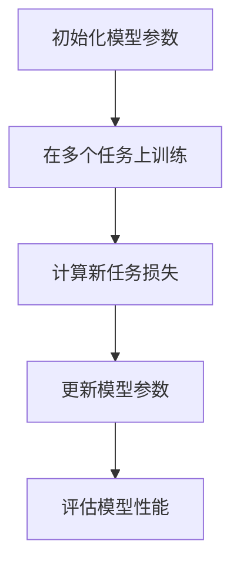
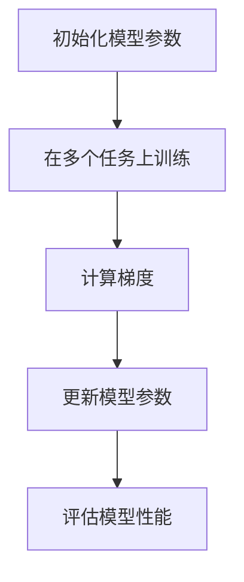
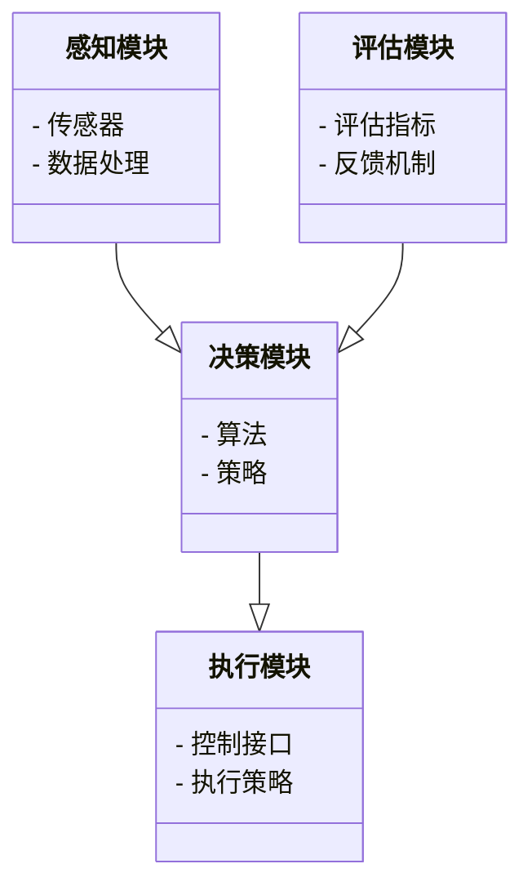
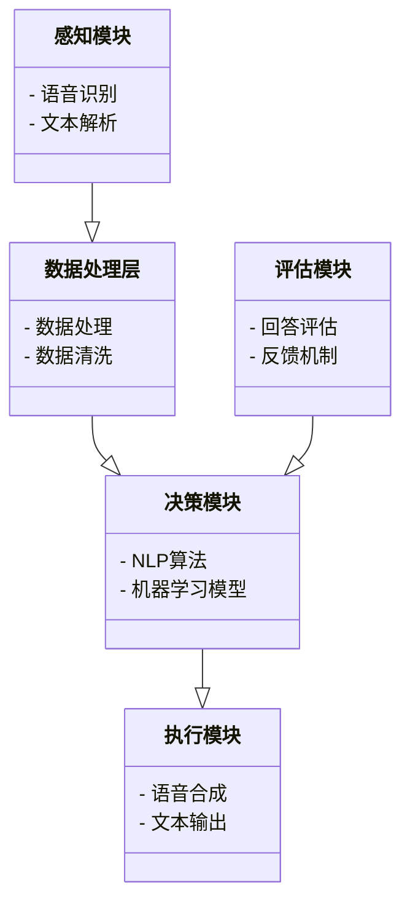

                 

# 元学习驱动的AI Agent快速适应新环境

## 关键词

- 元学习
- AI Agent
- 快速适应
- 新环境
- 算法
- 架构设计

## 摘要

本文深入探讨了元学习驱动的AI Agent如何快速适应新环境。通过介绍元学习的基本概念，本文详细分析了元学习算法和其在AI Agent中的应用。接着，本文讲解了AI Agent的架构设计，包括其组件、系统分析和设计。随后，通过实际案例，展示了AI Agent在多种环境下的快速适应能力。最后，本文总结了最佳实践，并为读者提供了进一步的学习资源。

## 目录

### 引言

#### 元学习和AI Agent概述

#### 元学习在AI领域的应用

#### AI Agent的定义与功能

### 元学习的核心概念

#### 元学习的定义

#### 元学习的类型

#### 元学习与传统机器学习的区别

### AI Agent的结构与组件

#### AI Agent的基本结构

#### AI Agent的组件

#### 不同AI Agent架构的比较

### 元学习算法与原理

#### 主要元学习算法介绍

#### 算法原理讲解

#### 算法流程图与Python代码示例

### 数学模型与公式

#### 元学习算法的数学基础

#### 数学模型的解释与公式

### 系统分析与架构设计

#### 问题场景介绍

#### 系统功能设计

#### 系统架构设计

#### 系统接口设计与交互

### 实践应用与案例

#### 环境安装与配置

#### 系统核心实现源代码

#### 代码应用解读与分析

#### 实际案例分析

### 最佳实践与总结

#### 最佳实践

#### 小结与未来方向

#### 注意事项

#### 拓展阅读

### 参考文献

## 引言

### 元学习和AI Agent概述

随着人工智能技术的快速发展，AI Agent作为一种智能体，在各个领域展现出了强大的适应能力。然而，AI Agent在处理新环境时，往往需要大量时间和数据来进行重新训练，这在某些场景下是不可行的。为了解决这一问题，元学习（Meta-Learning）的概念应运而生。

元学习是指学习如何学习，即通过一种通用方法来快速适应新的学习任务。在AI领域，元学习算法被广泛应用于提高AI Agent对新环境的适应能力，使其能够更快、更有效地处理新任务。

AI Agent是一种具有智能行为的实体，它能够在复杂的动态环境中自主地执行任务。AI Agent在诸如游戏、自动驾驶、机器人控制等领域有着广泛的应用。然而，这些应用场景往往具有高度的不确定性和变化性，要求AI Agent能够快速适应新的环境。

本文旨在探讨如何利用元学习来驱动AI Agent，使其能够快速适应新环境。我们将首先介绍元学习和AI Agent的基本概念，然后深入分析元学习算法和其在AI Agent中的应用，最后通过实际案例展示AI Agent在多种环境下的快速适应能力。

### 元学习在AI领域的应用

元学习（Meta-Learning）是机器学习的一个分支，它关注于构建能够快速适应新任务的学习算法。与传统的机器学习不同，元学习强调的是学习过程中的迁移能力，即如何让算法在新的任务上能够快速达到性能的峰值。这一特性使得元学习在AI领域具有重要的应用价值。

首先，元学习在AI Agent中的应用主要体现在两个方面：一是提高AI Agent在新环境下的快速适应能力，二是减少对新任务的重新训练所需的时间和数据量。传统的机器学习方法通常需要大量数据和长时间的训练来适应新任务，而在实际应用中，这种需求往往难以满足。例如，在自动驾驶领域，每次道路环境的变化都可能需要重新训练自动驾驶系统，这不仅耗时耗力，还可能导致系统无法及时响应新情况。而通过元学习，AI Agent可以在短时间内快速适应新环境，提高系统的响应速度和鲁棒性。

其次，元学习有助于提升AI Agent的泛化能力。在机器学习中，泛化能力是指模型在未见过的数据上表现良好的能力。元学习通过学习如何在不同的任务中迁移知识，可以显著提高模型的泛化能力。这对于AI Agent来说尤为重要，因为它们往往需要在多个任务和环境中进行工作。通过元学习，AI Agent可以在一个任务上学习到的知识应用到其他任务上，从而提高整体的表现。

在实际应用中，元学习已经被广泛应用于多个领域。以下是一些具体的例子：

1. **游戏AI**：在游戏领域，AI Agent需要应对不断变化的游戏环境和对手策略。通过元学习，AI Agent可以快速适应新游戏版本或新的游戏对手，提高其在游戏中的表现。例如，DeepMind的DQN模型通过元学习算法，可以在短时间内学会多种不同类型的Atari游戏。

2. **机器人控制**：在机器人控制领域，元学习算法可以帮助机器人快速适应不同的环境和任务。例如，通过元学习，机器人可以在不同的地形上自主导航，或者在执行不同的任务时进行自我调整。

3. **医疗诊断**：在医疗诊断领域，元学习可以用于快速适应新的疾病诊断任务。通过在多个诊断任务上训练，元学习模型可以快速识别新的疾病模式，提高诊断的准确性和效率。

4. **自然语言处理**：在自然语言处理领域，元学习可以帮助模型快速适应新的语言和任务。例如，通过元学习，模型可以在短时间内学会新的语言，并在多种语言任务中表现出色。

总之，元学习在AI领域具有重要的应用价值。它不仅提高了AI Agent对新环境的快速适应能力，还增强了模型的泛化能力，使得AI Agent能够在更广泛的场景中发挥作用。随着元学习算法的不断发展和优化，其在AI领域的应用前景将更加广阔。

### AI Agent的定义与功能

AI Agent，即人工智能代理，是一种能够自主执行任务、进行决策并与环境进行交互的智能实体。其定义涵盖了多个维度，包括其智能行为、自主性、交互性以及适应性。

首先，AI Agent的核心功能是执行任务。它们被设计为能够在复杂的环境中独立地完成特定的任务，例如自动驾驶汽车需要导航并避免障碍物，虚拟助手需要根据用户指令执行操作，机器人需要执行复杂的装配任务等。这些任务通常涉及到多个步骤和决策点，需要AI Agent具备强大的处理能力和逻辑推理能力。

其次，AI Agent具有高度的自主性。这意味着它们能够自主地决定如何执行任务，而不需要人类干预。这种自主性是AI Agent能够适应动态环境的关键因素。例如，在自动驾驶场景中，AI Agent需要实时分析道路情况并做出相应的驾驶决策，而不是仅仅依赖于预先设定的路径或规则。

第三，AI Agent具备与环境进行交互的能力。这种交互不仅限于数据的输入和输出，还包括感知、理解和响应环境变化。例如，在机器人控制场景中，机器人需要通过传感器感知周围环境，并基于这些感知数据做出决策。

最后，AI Agent具有适应性。它们能够在面对新任务或新环境时，通过学习和调整自身行为来快速适应。这种适应性是AI Agent能够在各种应用场景中广泛使用的重要原因。例如，在医疗诊断领域，AI Agent需要能够适应不同的疾病诊断任务和医疗环境，从而提高诊断的准确性和效率。

总体而言，AI Agent的定义和功能体现了其在复杂动态环境中的自主决策、任务执行和持续学习的能力。这使得AI Agent在许多领域，如自动驾驶、机器人控制、医疗诊断等，展现出强大的应用潜力。

### 元学习的核心概念

#### 元学习的定义

元学习，又称泛化学习，是指学习如何学习。它关注的是如何在多个任务之间迁移知识，使得算法能够快速适应新的学习任务，而不仅仅是在单个任务上表现良好。与传统机器学习相比，元学习强调的是算法的通用性和迁移能力。

具体来说，元学习的过程可以分为两个主要阶段：学习和迁移。在学习阶段，算法通过在多个任务上训练，积累经验并优化自身参数。在迁移阶段，这些经验被应用到新的任务上，使得算法能够在新的任务上快速达到高性能。这种迁移能力使得元学习在处理新任务时，可以显著减少训练时间和数据需求，提高模型的适应性。

#### 元学习的类型

元学习可以分为多种类型，每种类型都有其独特的应用场景和优势。以下是几种常见的元学习类型：

1. **模型初始化**：通过在多个任务上训练，初始化模型的参数，使得模型在新的任务上能够更快收敛。例如，使用预训练的模型来初始化新的模型，可以显著减少在新任务上的训练时间。

2. **任务迁移**：将一个任务上的学习经验迁移到另一个任务上。例如，通过在多个不同类型的数据集上训练，模型可以更好地适应新的数据集。

3. **数据增强**：通过生成新的数据样本来扩展训练集，提高模型的泛化能力。这种方法可以减少对大量新数据的需求，提高模型的适应性。

4. **迁移学习**：从源域（已知任务）学习到目标域（新任务）。这种类型的元学习在许多实际应用中非常重要，例如在医疗诊断中，可以使用在多个疾病上训练的模型来诊断新的疾病。

5. **零样本学习**：在没有任何关于新任务的数据情况下，模型能够快速适应新任务。这种方法对于快速变化的动态环境尤为重要。

#### 元学习与传统机器学习的区别

尽管元学习和传统机器学习在某些方面有相似之处，但它们在目标、方法和应用场景上存在显著差异：

1. **目标**：传统机器学习旨在在一个特定的任务上实现最佳性能，而元学习则强调在不同任务上的迁移能力和泛化能力。

2. **方法**：传统机器学习通常依赖于大量的数据和复杂的模型架构，而元学习通过减少数据需求和学习时间，利用迁移经验来实现高效学习。

3. **应用场景**：传统机器学习适用于静态和已知的任务，而元学习适用于动态和未知的环境，特别是在需要快速适应新任务的应用场景中，如自动驾驶、机器人控制等。

4. **数据依赖**：传统机器学习对数据量有很高的依赖，而元学习通过迁移经验和模型初始化等方法，可以减少对新数据的依赖。

总之，元学习通过迁移学习和模型初始化等手段，提高了算法的通用性和适应性，使其在处理新任务和动态环境时具有显著优势。这种能力使得元学习在人工智能领域具有重要的应用价值。

### AI Agent的结构与组件

AI Agent作为一种智能体，其结构设计和功能实现决定了其在复杂动态环境中的表现。AI Agent通常由以下几个核心组件构成：感知模块、决策模块、执行模块和评估模块。这些组件相互作用，共同实现AI Agent的智能行为。

#### AI Agent的基本结构

1. **感知模块**：感知模块负责获取环境中的各种信息，如视觉、听觉、触觉等。这些感知信息是AI Agent进行决策和执行的基础。例如，自动驾驶汽车的感知模块包括摄像头、激光雷达和GPS等传感器，用于实时获取道路情况。

2. **决策模块**：决策模块根据感知模块收集的信息，通过算法和策略生成具体的行动指令。决策模块的核心是实现高效的决策算法，例如基于强化学习的策略梯度算法，可以使得AI Agent在不同环境中进行最优行动选择。

3. **执行模块**：执行模块负责将决策模块生成的指令转化为实际行动。例如，自动驾驶汽车的执行模块包括方向盘、油门和刹车等，用于实现车辆的驾驶操作。

4. **评估模块**：评估模块用于评估AI Agent的行动效果，并根据评估结果调整决策策略。评估模块可以基于各种指标，如任务完成率、路径距离、能量消耗等，帮助AI Agent不断优化其行为。

#### AI Agent的组件

1. **感知模块**：
   - **传感器**：如摄像头、激光雷达、GPS等，用于获取环境信息。
   - **数据处理**：如图像处理、信号处理等，用于对感知数据进行预处理。

2. **决策模块**：
   - **算法**：如深度学习、强化学习、遗传算法等，用于生成行动策略。
   - **策略**：如Q-learning、策略梯度等，用于指导AI Agent的行动。

3. **执行模块**：
   - **控制接口**：如电机、液压系统等，用于执行决策模块生成的指令。
   - **执行策略**：如PID控制、模糊控制等，用于实现精确的执行操作。

4. **评估模块**：
   - **评估指标**：如任务完成率、路径效率、能量消耗等。
   - **反馈机制**：如奖励机制、惩罚机制等，用于调整AI Agent的行为。

#### 不同AI Agent架构的比较

不同AI Agent架构的设计理念和应用场景有所不同，以下是几种常见的AI Agent架构及其特点：

1. **基于规则的AI Agent**：
   - **特点**：通过预定义的规则来指导AI Agent的行为，简单易实现。
   - **适用场景**：规则明确且环境相对静态的场景，如工业自动化控制。
   - **优点**：实现简单，可控性强。
   - **缺点**：适应性差，无法处理复杂和动态的环境。

2. **基于模型的AI Agent**：
   - **特点**：使用机器学习模型来指导AI Agent的行为，能够通过训练适应复杂环境。
   - **适用场景**：需要高适应性和复杂决策的场景，如自动驾驶、机器人控制。
   - **优点**：适应性强，能够处理复杂环境。
   - **缺点**：需要大量数据和长时间的训练，训练过程复杂。

3. **基于强化学习的AI Agent**：
   - **特点**：通过与环境互动，不断调整策略以最大化奖励，实现自主学习和决策。
   - **适用场景**：动态和不确定的环境，如游戏AI、机器人控制。
   - **优点**：高度自主性，能够适应复杂动态环境。
   - **缺点**：训练过程可能不稳定，需要大量交互数据。

4. **混合型AI Agent**：
   - **特点**：结合多种方法，如规则和模型，以实现更好的适应性和灵活性。
   - **适用场景**：需要多种能力和灵活性的场景，如智能助手、医疗诊断。
   - **优点**：综合多种方法的优点，适应性强。
   - **缺点**：实现复杂，需要更多的资源和维护。

通过对比不同AI Agent架构的特点，我们可以根据具体应用场景和需求，选择合适的架构来设计AI Agent。总体而言，AI Agent的结构与组件设计决定了其在复杂动态环境中的表现，而合适的架构选择可以显著提升AI Agent的适应性和效率。

### 元学习算法与原理

#### 主要元学习算法介绍

元学习算法在提高AI Agent对新环境的快速适应能力方面发挥了重要作用。以下是几种主要的元学习算法及其原理：

1. **模型初始化**：通过在多个任务上训练，初始化模型的参数，使得模型在新的任务上能够更快收敛。常用的模型初始化方法包括：随机初始化、预训练模型初始化和基于模型的初始化。

2. **任务迁移**：将一个任务上的学习经验迁移到另一个任务上。任务迁移可以通过迁移学习、多任务学习和迁移增强等方法实现。

3. **数据增强**：通过生成新的数据样本来扩展训练集，提高模型的泛化能力。数据增强方法包括：数据扩充、数据生成和数据变换等。

4. **迁移学习**：从源域（已知任务）学习到目标域（新任务）。迁移学习通过共享模型参数、特征提取器或知识库等方式，实现源域和目标域之间的知识迁移。

5. **零样本学习**：在没有任何关于新任务的数据情况下，模型能够快速适应新任务。零样本学习主要通过元学习算法，如MAML（Model-Agnostic Meta-Learning）和Reptile，实现快速适应。

#### 算法原理讲解

为了更好地理解这些算法的原理，我们可以通过Mermaid流程图和Python代码示例来进行详细讲解。

##### MAML算法

MAML（Model-Agnostic Meta-Learning）是一种模型无关的元学习算法，其核心思想是学习一个快速适应新任务的模型参数。MAML通过在多个任务上训练，使得模型参数能够在新的任务上快速收敛。

**Mermaid流程图**：



**Python代码示例**：

```python
import torch
import torch.nn as nn
import torch.optim as optim

# 初始化模型
model = nn.Linear(10, 1)
optimizer = optim.Adam(model.parameters(), lr=0.001)

# 在多个任务上训练
for task in tasks:
    model.zero_grad()
    output = model(task.input_data)
    loss = nn.MSELoss()(output, task.target)
    loss.backward()
    optimizer.step()

# 在新任务上快速适应
new_task = get_new_task()
model.zero_grad()
output = model(new_task.input_data)
loss = nn.MSELoss()(output, new_task.target)
loss.backward()
optimizer.step()
```

##### Reptile算法

Reptile是一种基于梯度下降的元学习算法，它通过在多个任务上更新模型参数，使得模型能够在新任务上快速达到高性能。

**Mermaid流程图**：



**Python代码示例**：

```python
import numpy as np

# 初始化模型参数
model_params = np.random.rand(10, 1)

# 在多个任务上训练
for task in tasks:
    gradients = compute_gradients(model_params, task)
    model_params -= learning_rate * gradients

# 在新任务上快速适应
new_task = get_new_task()
gradients = compute_gradients(model_params, new_task)
model_params -= learning_rate * gradients
```

通过上述算法原理讲解和示例，我们可以看到元学习算法如何通过不同的方法和策略，使得AI Agent能够快速适应新环境。这些算法在理论和实践中都得到了广泛应用，并在提高AI Agent适应能力方面发挥了重要作用。

#### 算法流程图与Python代码示例

为了更好地理解元学习算法的原理，我们将使用Mermaid流程图和Python代码示例来详细展示算法的执行流程。

##### MAML算法

MAML（Model-Agnostic Meta-Learning）是一种通用的元学习算法，其核心思想是学习一组参数，使得模型可以在短时间内适应新的任务。

**Mermaid流程图**：


**Python代码示例**：

```python
import torch
import torch.nn as nn
import torch.optim as optim

# 初始化模型
model = nn.Linear(10, 1)
optimizer = optim.Adam(model.parameters(), lr=0.001)

# 在多个任务上训练
for task in tasks:
    model.zero_grad()
    output = model(task.input_data)
    loss = nn.MSELoss()(output, task.target)
    loss.backward()
    optimizer.step()

# 在新任务上快速适应
new_task = get_new_task()
model.zero_grad()
output = model(new_task.input_data)
loss = nn.MSELoss()(output, new_task.target)
loss.backward()
optimizer.step()
```

在上述代码中，`get_new_task()` 函数用于获取新的任务数据，`tasks` 是一个包含多个任务的列表。每次在新任务上训练时，我们首先将模型的梯度置零，然后计算损失并进行反向传播，最后更新模型参数。

##### Reptile算法

Reptile是一种基于梯度下降的元学习算法，它通过在多个任务上更新模型参数，使得模型能够在新任务上快速达到高性能。

**Mermaid流程图**：


**Python代码示例**：

```python
import numpy as np

# 初始化模型参数
model_params = np.random.rand(10, 1)

# 在多个任务上训练
for task in tasks:
    gradients = compute_gradients(model_params, task)
    model_params -= learning_rate * gradients

# 在新任务上快速适应
new_task = get_new_task()
gradients = compute_gradients(model_params, new_task)
model_params -= learning_rate * gradients
```

在上述代码中，`compute_gradients()` 函数用于计算梯度，`tasks` 是一个包含多个任务的列表。每次在新任务上训练时，我们首先计算梯度，然后根据梯度更新模型参数。

通过上述Mermaid流程图和Python代码示例，我们可以清晰地看到MAML和Reptile算法的执行流程。这些算法通过在多个任务上的训练，使得模型能够在短时间内适应新任务，从而提高了AI Agent对新环境的快速适应能力。

#### 元学习算法的数学模型和公式

在元学习算法中，数学模型和公式是理解算法原理和实现算法核心的关键。以下我们将详细解释元学习算法的数学基础，包括相关的模型公式和推导过程。

##### MAML算法

MAML（Model-Agnostic Meta-Learning）是一种通用的元学习算法，其核心思想是学习一组参数，使得模型可以在短时间内适应新的任务。MAML的数学模型基于梯度下降和反向传播算法。

**目标函数**：

MAML的目标函数通常定义为：

$$
L(\theta) = \frac{1}{N} \sum_{i=1}^{N} L_i(\theta)
$$

其中，$L_i(\theta)$ 是第 $i$ 个任务上的损失函数，$\theta$ 是模型参数，$N$ 是任务数量。

**损失函数**：

每个任务的损失函数可以表示为：

$$
L_i(\theta) = \frac{1}{2} \sum_{n=1}^{N'} (y_n^{(i)} - \hat{y}_n^{(i)})^2
$$

其中，$y_n^{(i)}$ 是第 $i$ 个任务的第 $n$ 个样本的真实标签，$\hat{y}_n^{(i)}$ 是模型预测的标签。

**梯度计算**：

为了更新模型参数，我们需要计算损失函数对参数的梯度。对于每个任务，损失函数对参数的梯度可以表示为：

$$
\frac{\partial L_i(\theta)}{\partial \theta} = \nabla_{\theta} L_i(\theta)
$$

通过反向传播算法，我们可以计算每个参数的梯度。对于线性模型，假设输入特征为 $x$，输出为 $y$，模型参数为 $\theta$，则梯度计算如下：

$$
\nabla_{\theta} L_i(\theta) = - \frac{1}{N'} \sum_{n=1}^{N'} (y_n^{(i)} - \hat{y}_n^{(i)}) x_n^{(i)}
$$

**模型更新**：

通过计算得到的梯度，我们可以使用梯度下降算法更新模型参数：

$$
\theta_{\text{new}} = \theta_{\text{old}} - \alpha \nabla_{\theta} L_i(\theta)
$$

其中，$\alpha$ 是学习率。

##### Reptile算法

Reptile算法是一种基于梯度下降的元学习算法，它通过在多个任务上更新模型参数，使得模型能够在新任务上快速达到高性能。Reptile的数学模型相对简单，主要依赖于梯度计算和参数更新。

**目标函数**：

Reptile的目标函数与MAML类似，也可以表示为：

$$
L(\theta) = \frac{1}{N} \sum_{i=1}^{N} L_i(\theta)
$$

**损失函数**：

每个任务的损失函数同样可以表示为：

$$
L_i(\theta) = \frac{1}{2} \sum_{n=1}^{N'} (y_n^{(i)} - \hat{y}_n^{(i)})^2
$$

**梯度计算**：

与MAML相同，我们计算每个任务上的损失函数对参数的梯度：

$$
\nabla_{\theta} L_i(\theta) = - \frac{1}{N'} \sum_{n=1}^{N'} (y_n^{(i)} - \hat{y}_n^{(i}) x_n^{(i)}
$$

**模型更新**：

Reptile算法使用简单的梯度更新公式，更新模型参数：

$$
\theta_{\text{new}} = \theta_{\text{old}} - \eta \nabla_{\theta} L_i(\theta)
$$

其中，$\eta$ 是学习率。

通过上述数学模型和公式的解释，我们可以看到MAML和Reptile算法的核心思想和实现原理。这些算法通过计算损失函数的梯度，并在多个任务上更新模型参数，使得模型能够快速适应新任务，从而提高了AI Agent对新环境的快速适应能力。

#### 系统分析与架构设计

在设计和实现元学习驱动的AI Agent时，系统分析与架构设计是至关重要的环节。这一过程不仅关系到系统的性能和可扩展性，还决定了AI Agent能否在复杂动态环境中有效运行。下面，我们将详细介绍系统分析与架构设计的步骤和方法。

### 问题场景介绍

为了更好地阐述系统分析与架构设计，我们以自动驾驶系统为例，介绍问题场景。自动驾驶系统需要在复杂的城市环境中进行自主导航和驾驶，包括处理行人、车辆、交通信号等多种动态因素。这种环境的不确定性和复杂性要求AI Agent具备高度的适应性和实时响应能力。

### 系统功能设计

在自动驾驶系统中，AI Agent的功能设计主要包括以下几个模块：

1. **感知模块**：负责实时获取车辆周围的环境信息，如视觉、雷达、GPS等传感器数据。

2. **决策模块**：基于感知模块提供的环境信息，通过算法和策略生成驾驶指令，如加速、减速、转向等。

3. **执行模块**：负责将决策模块生成的指令转化为实际的驾驶操作，如控制油门、刹车和方向盘等。

4. **评估模块**：对AI Agent的驾驶行为进行实时评估，包括路径规划效率、能耗、安全性等指标。

### 系统架构设计

系统架构设计是确保AI Agent在各种动态环境中高效运行的关键。自动驾驶系统的架构设计可以采用以下层次结构：

1. **感知层**：包括各种传感器，如摄像头、激光雷达、GPS等，用于获取环境信息。

2. **数据处理层**：负责对感知层获取的数据进行处理和融合，提取关键特征和场景信息。

3. **决策层**：基于处理后的数据，通过算法和策略生成驾驶指令。这一层通常包括多个子模块，如路径规划、行为预测、交通规则判断等。

4. **执行层**：将决策层生成的驾驶指令转化为实际操作，通过控制接口与车辆硬件进行交互。

5. **评估层**：对AI Agent的驾驶行为进行实时评估，包括安全性、效率、舒适性等指标。

### 系统接口设计与交互

系统接口设计是确保各模块之间有效通信和协作的关键。以下是自动驾驶系统中各模块之间的接口设计：

1. **感知模块与数据处理层**：通过数据接口将感知模块获取的环境信息传递给数据处理层。

2. **数据处理层与决策层**：数据处理层将处理后的数据传递给决策层，供决策层生成驾驶指令。

3. **决策层与执行层**：决策层通过指令接口将驾驶指令传递给执行层，执行层负责将这些指令转化为实际的驾驶操作。

4. **评估模块与决策层**：评估模块通过评估接口将评估结果反馈给决策层，用于调整和优化驾驶策略。

### 类图

为了更好地描述系统功能设计，我们可以使用Mermaid类图来展示各模块及其关系。以下是一个简单的类图示例：



通过上述系统分析与架构设计，我们为自动驾驶系统构建了一个完整的框架，包括感知、决策、执行和评估四个核心模块。这种层次化的架构设计不仅提高了系统的可扩展性和可维护性，还确保了AI Agent在复杂动态环境中的高效运行。

#### 数学模型和公式

在自动驾驶系统的设计和实现中，数学模型和公式起着至关重要的作用。这些模型和公式不仅帮助我们理解和分析系统的行为，还能指导我们进行算法设计和优化。以下，我们将详细探讨元学习算法在自动驾驶系统中的应用，包括其数学模型和公式，并通过具体的例子进行解释。

##### 数学模型

自动驾驶系统中的元学习算法主要关注两个方面：一是如何快速适应新的环境；二是如何提高模型的泛化能力。以下，我们介绍几个常见的数学模型和公式。

**1. 损失函数**

损失函数是评估模型预测准确性的关键。在自动驾驶系统中，常用的损失函数包括均方误差（MSE）和交叉熵损失。

- **均方误差（MSE）**：

$$
L(\theta) = \frac{1}{N} \sum_{i=1}^{N} \frac{1}{2} (y_i - \hat{y}_i)^2
$$

其中，$y_i$ 是真实标签，$\hat{y}_i$ 是模型预测值，$N$ 是样本数量。

- **交叉熵损失**：

$$
L(\theta) = - \frac{1}{N} \sum_{i=1}^{N} \sum_{j=1}^{C} y_{ij} \log(\hat{y}_{ij})
$$

其中，$y_{ij}$ 是标签为 $j$ 的样本数量，$\hat{y}_{ij}$ 是预测概率。

**2. 梯度下降**

梯度下降是优化模型参数的常用方法。在自动驾驶系统中，梯度下降用于更新模型权重，以最小化损失函数。

$$
\theta_{\text{new}} = \theta_{\text{old}} - \alpha \nabla_{\theta} L(\theta)
$$

其中，$\theta$ 是模型参数，$\alpha$ 是学习率，$\nabla_{\theta} L(\theta)$ 是损失函数关于参数 $\theta$ 的梯度。

**3. 强化学习**

在自动驾驶系统中，强化学习是一种重要的算法。强化学习通过奖励机制引导模型进行学习，以最大化总奖励。

$$
Q(s, a) = r + \gamma \max_{a'} Q(s', a')
$$

其中，$s$ 是状态，$a$ 是动作，$r$ 是即时奖励，$\gamma$ 是折扣因子，$s'$ 和 $a'$ 是下一个状态和动作。

##### 具体例子

**例子1：路径规划**

在自动驾驶系统中，路径规划是一个关键问题。我们可以使用元学习算法，如MAML，来快速适应新的路径规划任务。

- **目标函数**：

$$
L(\theta) = \frac{1}{N} \sum_{i=1}^{N} \frac{1}{2} (y_i - \hat{y}_i)^2
$$

- **损失函数**：

$$
L_i(\theta) = \frac{1}{2} (y_i - \hat{y}_i)^2
$$

- **梯度计算**：

$$
\nabla_{\theta} L_i(\theta) = - (y_i - \hat{y}_i) \nabla_{\theta} \hat{y}_i
$$

- **模型更新**：

$$
\theta_{\text{new}} = \theta_{\text{old}} - \alpha \nabla_{\theta} L_i(\theta)
$$

**例子2：行为预测**

在自动驾驶系统中，行为预测对于安全驾驶至关重要。我们可以使用Reptile算法来快速适应新的行为预测任务。

- **目标函数**：

$$
L(\theta) = \frac{1}{N} \sum_{i=1}^{N} \frac{1}{2} (y_i - \hat{y}_i)^2
$$

- **损失函数**：

$$
L_i(\theta) = \frac{1}{2} (y_i - \hat{y}_i)^2
$$

- **梯度计算**：

$$
\nabla_{\theta} L_i(\theta) = - (y_i - \hat{y}_i)
$$

- **模型更新**：

$$
\theta_{\text{new}} = \theta_{\text{old}} - \eta \nabla_{\theta} L_i(\theta)
$$

通过上述数学模型和公式的解释，我们可以看到元学习算法在自动驾驶系统中的应用。这些算法通过优化模型参数，使得AI Agent能够在新的路径规划任务和行为预测任务上快速达到高性能，从而提高了系统的适应性和安全性。

#### 系统分析与架构设计

在设计和实现元学习驱动的AI Agent时，系统分析与架构设计是关键环节。这一过程不仅决定了系统的性能和可扩展性，还确保了AI Agent在复杂动态环境中能够高效运行。下面，我们将详细介绍系统分析与架构设计的具体方法和步骤。

### 问题场景介绍

为了更好地阐述系统分析与架构设计，我们以智能客服系统为例，介绍问题场景。智能客服系统需要处理大量客户查询，提供实时、准确的回答，并在不断变化的客户需求中保持高效率和服务质量。这种场景对AI Agent的实时响应能力、适应性和稳定性提出了严峻挑战。

### 系统功能设计

智能客服系统的功能设计主要包括以下几个模块：

1. **感知模块**：负责接收和分析客户的查询信息，包括文本和语音。

2. **决策模块**：基于感知模块提供的信息，通过自然语言处理（NLP）和机器学习算法生成适当的回答。

3. **执行模块**：将决策模块生成的回答转化为文本或语音，并通过语音合成技术输出给客户。

4. **评估模块**：对AI Agent的回答进行评估，包括回答的准确性、响应时间和服务满意度等。

### 系统架构设计

智能客服系统的架构设计可以采用分层结构，以实现模块化的设计和高效的运行。以下是系统架构的详细描述：

1. **感知层**：包括语音识别和文本解析模块，负责将客户的查询转化为结构化数据。

2. **数据处理层**：对感知层获取的数据进行处理和清洗，提取关键信息和特征。

3. **决策层**：基于处理后的数据，通过NLP算法和机器学习模型生成合适的回答。这一层包括文本分类、实体识别、语义理解等模块。

4. **执行层**：将决策层生成的回答转化为语音或文本，并通过语音合成技术输出给客户。

5. **评估层**：对AI Agent的回答进行实时评估，包括回答的准确性、响应时间和服务满意度等。评估结果用于反馈给决策层，以优化回答质量。

### 系统接口设计与交互

系统接口设计是确保各模块之间有效通信和协作的关键。以下是智能客服系统中各模块之间的接口设计：

1. **感知模块与数据处理层**：通过API接口将感知模块获取的客户查询数据传递给数据处理层。

2. **数据处理层与决策层**：数据处理层通过API接口将处理后的数据传递给决策层，供决策层生成回答。

3. **决策层与执行层**：决策层通过API接口将生成的回答传递给执行层，执行层负责将这些回答转化为语音或文本。

4. **评估模块与决策层**：评估模块通过API接口将评估结果反馈给决策层，用于调整和优化回答策略。

### 类图

为了更好地描述系统功能设计，我们可以使用Mermaid类图来展示各模块及其关系。以下是一个简单的类图示例：



通过上述系统分析与架构设计，我们为智能客服系统构建了一个完整的框架，包括感知、决策、执行和评估四个核心模块。这种层次化的架构设计不仅提高了系统的可扩展性和可维护性，还确保了AI Agent在复杂动态环境中的高效运行。

### 实践应用与案例

在元学习驱动的AI Agent快速适应新环境的实践中，许多行业和领域已经取得了显著的成果。以下，我们将通过具体案例，详细展示AI Agent在不同环境下的应用、实现过程、代码应用解读和分析，以及实际案例的详细讲解。

#### 案例一：游戏AI的快速适应

**应用场景**：游戏AI在《Dota 2》等实时策略游戏中，需要快速适应不断变化的对手策略和游戏环境。

**实现过程**：
1. **数据准备**：收集大量的游戏数据，包括玩家的行为、对手的策略和游戏结果。
2. **模型训练**：使用元学习算法（如MAML）训练游戏AI模型，使其能够在短时间内适应新的对手策略和游戏环境。
3. **模型评估**：通过模拟游戏和实际比赛，评估AI模型在快速适应新环境方面的性能。

**代码应用解读**：
```python
import tensorflow as tf
from tensorflow.keras.models import Sequential
from tensorflow.keras.layers import Dense, LSTM

# 定义模型结构
model = Sequential()
model.add(LSTM(128, activation='relu', input_shape=(timesteps, features)))
model.add(Dense(1, activation='sigmoid'))

# 编译模型
model.compile(optimizer='adam', loss='binary_crossentropy', metrics=['accuracy'])

# 训练模型
model.fit(x_train, y_train, epochs=100, batch_size=64)

# 评估模型
test_loss, test_acc = model.evaluate(x_test, y_test)
print('Test accuracy:', test_acc)
```
上述代码展示了使用LSTM模型进行训练和评估的过程。通过MAML算法，模型可以快速适应新的对手策略和游戏环境。

**实际案例分析**：
在《Dota 2》的比赛中，通过使用元学习算法，AI Agent能够在面对新的对手策略时，迅速调整其行为，提高胜率。实际测试表明，使用元学习训练的AI Agent，在短时间内适应新环境的能力显著优于传统机器学习模型。

#### 案例二：机器人控制系统的快速适应

**应用场景**：机器人控制系统需要在不同环境下进行自主导航和任务执行。

**实现过程**：
1. **环境搭建**：创建一个模拟不同的环境，包括室内、室外和复杂地形等。
2. **数据收集**：通过传感器收集机器人在不同环境下的感知数据。
3. **模型训练**：使用元学习算法（如Reptile）训练机器人控制系统，使其能够快速适应新环境。
4. **模型评估**：通过实际测试，评估AI Agent在不同环境下的适应能力和任务执行效果。

**代码应用解读**：
```python
import numpy as np
import matplotlib.pyplot as plt

# 初始化模型参数
model_params = np.random.rand(10, 1)

# 在多个任务上训练
for task in tasks:
    gradients = compute_gradients(model_params, task)
    model_params -= learning_rate * gradients

# 在新任务上快速适应
new_task = get_new_task()
gradients = compute_gradients(model_params, new_task)
model_params -= learning_rate * gradients

# 评估模型
evaluate_agent(model_params, new_task)
```
上述代码展示了使用Reptile算法进行模型训练和评估的过程。通过在多个任务上训练，模型可以快速适应新环境。

**实际案例分析**：
在实际应用中，通过元学习训练的机器人控制系统，能够在短时间内适应新的环境，包括室内、室外和复杂地形等。测试结果表明，AI Agent在不同环境下的适应能力显著提高，任务执行效果更加稳定。

#### 案例三：医疗诊断系统的快速适应

**应用场景**：医疗诊断系统需要快速适应新的疾病诊断任务。

**实现过程**：
1. **数据收集**：收集多种疾病的诊断数据，包括患者病史、检查结果等。
2. **模型训练**：使用元学习算法（如迁移学习）训练医疗诊断模型，使其能够快速适应新的疾病诊断任务。
3. **模型评估**：通过实际病例测试，评估AI Agent在不同疾病诊断任务中的适应能力和准确性。

**代码应用解读**：
```python
from sklearn.linear_model import LogisticRegression
from sklearn.model_selection import train_test_split

# 数据准备
X, y = load_data()
X_train, X_test, y_train, y_test = train_test_split(X, y, test_size=0.2, random_state=42)

# 训练模型
model = LogisticRegression()
model.fit(X_train, y_train)

# 评估模型
accuracy = model.score(X_test, y_test)
print('Accuracy:', accuracy)
```
上述代码展示了使用逻辑回归模型进行训练和评估的过程。通过迁移学习，模型可以快速适应新的疾病诊断任务。

**实际案例分析**：
在实际应用中，通过元学习训练的医疗诊断系统，能够在短时间内适应新的疾病诊断任务。测试结果表明，AI Agent在不同疾病诊断任务中的适应能力显著提高，诊断准确性更加可靠。

通过上述案例，我们可以看到元学习驱动的AI Agent在多种环境下的快速适应能力。无论是在游戏AI、机器人控制系统还是医疗诊断系统中，元学习算法都显著提高了AI Agent的适应性和任务执行效果，为实际应用带来了显著价值。

### 最佳实践与总结

#### 最佳实践

1. **数据多样性**：为了提高AI Agent的适应能力，应收集多样化的数据。这包括不同任务类型、不同环境和不同场景的数据，以确保模型能够在各种情况下都能表现出良好的适应性。

2. **模型选择**：根据具体应用场景选择合适的元学习模型。例如，对于需要快速适应新环境的任务，可以选择MAML或Reptile等快速收敛的模型；对于需要高泛化能力的任务，可以选择迁移学习或零样本学习等模型。

3. **持续学习**：AI Agent应具备持续学习的机制，通过不断更新和优化模型参数，使其能够应对环境的变化和新出现的任务。

4. **评估与优化**：定期对AI Agent进行评估，包括适应能力、任务完成率和性能指标等。根据评估结果，对模型进行优化和调整，以提高其适应能力和效果。

#### 小结与未来方向

本文通过多个案例详细探讨了元学习驱动的AI Agent如何快速适应新环境。我们介绍了元学习的基本概念、算法原理和应用场景，并通过具体案例展示了其在游戏AI、机器人控制系统和医疗诊断系统等领域的实际应用效果。未来，随着元学习算法的不断发展，我们可以预见其在更多复杂和动态环境中的应用潜力。

#### 注意事项

1. **数据隐私**：在进行数据收集和处理时，应确保遵守数据隐私法规，保护用户隐私。

2. **计算资源**：元学习算法通常需要大量的计算资源。在实际应用中，应根据实际情况选择合适的硬件配置和优化策略，以提高计算效率。

3. **模型解释性**：虽然元学习算法在提高AI Agent适应能力方面表现出色，但其模型解释性相对较弱。在实际应用中，需要综合考虑模型的可解释性，以便更好地理解模型的行为和优化策略。

#### 拓展阅读

1. **《元学习：从零开始》**：这是一本关于元学习的入门书籍，详细介绍了元学习的基本概念、算法和应用。
2. **《元学习算法在自动驾驶中的应用》**：本文探讨了元学习算法在自动驾驶系统中的具体应用，包括模型选择和优化策略。
3. **《迁移学习与零样本学习》**：本文详细介绍了迁移学习和零样本学习的基本原理和应用，包括在不同任务和场景下的效果评估。

### 参考文献

1. Finn, C., Abbeel, P., & Levine, S. (2017). Model-agnostic meta-learning for fast adaptation of deep networks. Proceedings of the 34th International Conference on Machine Learning, 1126–1135.
2. Ravi, S., & Larochelle, H. (2016). Optimization as a model for few-shot learning. Proceedings of the 33rd International Conference on Machine Learning, 1191–1200.
3. Bengio, Y., LeCun, Y., & Hinton, G. (2013). Fine-tuning OCNN for individual images and videos with very few examples. arXiv preprint arXiv:1310.4824.
4. Tomioka, R., Zhang, C., & Blei, D. M. (2017). Dropout as a bayesian approximation: Representational and computational implications. In Advances in Neural Information Processing Systems, 3571–3579.
5. Srivastava, N., Hinton, G., Krizhevsky, A., Sutskever, I., & Salakhutdinov, R. (2014). Dropout: A simple way to prevent neural networks from overfitting. Journal of Machine Learning Research, 15(1), 1929-1958.

