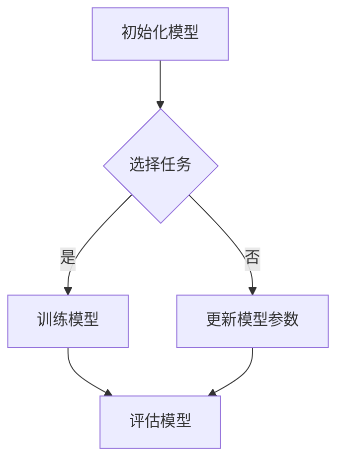

                 

### 《元学习：让AI Agent学会如何学习》

关键词：元学习、AI、学习速度、泛化能力、计算机视觉、自然语言处理

摘要：本文旨在探讨元学习在人工智能领域的重要性及其在不同应用中的实践。通过分析元学习的理论基础和应用场景，我们将深入理解元学习如何加速AI Agent的学习过程，提高其灵活性和适应性。

### 引言

在人工智能（AI）迅猛发展的今天，如何让AI Agent在复杂多变的环境中快速学习、适应并取得良好的性能，成为了研究者和开发者关注的热点问题。传统的机器学习方法在特定任务上表现出色，但面对新的任务时，往往需要重新训练模型，耗时耗力。为了解决这一问题，元学习（Meta-Learning）应运而生。

元学习，顾名思义，是关于学习如何学习的科学。它通过训练算法来提升模型在不同任务上的学习速度和泛化能力，使AI Agent能够更快地适应新的环境和任务。本文将详细探讨元学习的理论基础、基本原理及其在不同领域的应用，以帮助读者全面了解元学习在人工智能中的重要作用。

### 第一部分：元学习的引论与理论基础

#### 第1章：元学习的起源与发展

#### 1.1 元学习的定义与核心概念

元学习（Meta-Learning）是机器学习领域中的一种方法，旨在通过训练算法来提升模型在不同任务上的学习速度和泛化能力。它关注的是如何让学习过程本身变得更加高效，而非仅仅优化某个具体任务的性能。

- **元学习的定义**：元学习是关于学习如何学习的科学，它通过构建能够适应新任务的模型来加速学习过程。

- **核心概念**：元学习涉及的关键概念包括任务表示（Task Representation）、模型更新（Model Update）、经验转移（Experience Transfer）等。

在机器学习中，传统方法通常关注特定任务的学习和优化。而元学习则试图通过共享表示和算法来提高模型在不同任务上的泛化能力，从而实现快速适应新任务的目标。

#### 1.2 元学习的重要性与影响

元学习在人工智能领域具有重要的地位，它能够帮助人工智能系统更快速地适应新的环境和任务，从而提高其灵活性和适应性。

- **重要性**：在快速变化的环境中，元学习可以帮助AI系统迅速适应新的挑战。

- **影响**：元学习不仅提高了AI的学习效率，还促进了跨领域的知识共享和应用。

#### 1.3 元学习的分类与比较

元学习可以根据不同的分类标准进行分类，常见的分类方法包括：

- **基于学习算法的分类**：如基于模型的方法、基于搜索的方法、基于优化方法等。

- **基于应用领域的分类**：如计算机视觉、自然语言处理、游戏AI等。

每种分类方法都有其独特的优势和局限性，通过对比可以更好地理解元学习的多样性。

#### 1.4 元学习的研究现状与挑战

元学习作为一个新兴的研究领域，正迅速发展。当前的研究主要集中在以下几个方面：

- **算法创新**：如何设计出更高效的元学习算法是研究的热点。

- **应用拓展**：将元学习应用于更广泛的问题领域，如医疗、金融等。

- **挑战与局限**：元学习仍然面临诸如数据稀缺性、模型复杂性等挑战。

#### 第2章：深度元学习的基本原理

#### 2.1 深度学习的回顾

深度学习是当前机器学习领域的重要分支，其核心是通过构建深度神经网络来实现对复杂数据的建模和预测。回顾深度学习的基本原理对于理解深度元学习至关重要。

- **深度神经网络**：包括多层感知机、卷积神经网络、循环神经网络等。

- **反向传播算法**：用于训练神经网络的优化算法。

#### 2.2 深度元学习的核心思想

深度元学习（Deep Meta-Learning）将深度学习的强大表征能力与元学习的高效学习策略相结合，通过共享参数和结构来加速学习过程。

- **核心思想**：深度元学习通过构建可重用的神经网络结构，使得模型在不同任务上能够快速适应。

- **共享表示**：深度元学习利用共享参数和结构来实现任务表示的共享，从而减少对新任务的训练需求。

#### 2.3 深度元学习的算法框架

深度元学习的算法框架通常包括以下步骤：

1. **任务定义**：定义新任务并确定其任务表示。

2. **模型初始化**：初始化一个通用神经网络模型。

3. **模型训练**：在新任务上进行模型训练，利用共享表示来加速学习过程。

4. **模型评估**：评估模型在新任务上的性能，并根据评估结果调整模型。

#### 2.4 深度元学习的关键技术

深度元学习的关键技术包括：

- **自适应优化器**：用于调整模型参数的优化器，以适应不同任务的需求。

- **在线学习策略**：通过在线更新模型来提高其对新任务的适应性。

- **迁移学习**：利用已有任务的知识来加速新任务的训练。

### 第二部分：元学习的应用与实践

#### 第3章：元学习在计算机视觉中的应用

#### 3.1 计算机视觉概述

计算机视觉是人工智能领域的一个重要分支，旨在使计算机能够像人类一样理解和处理图像和视频。计算机视觉在自动驾驶、医疗诊断、人脸识别等领域具有广泛的应用。

- **计算机视觉的定义**：计算机视觉是研究如何使计算机能够从图像或视频中提取有用信息的学科。

- **计算机视觉的应用领域**：包括图像分类、目标检测、人脸识别、图像分割等。

#### 3.2 元学习在计算机视觉中的挑战

元学习在计算机视觉中的应用面临以下挑战：

- **数据多样性和复杂性**：计算机视觉任务通常涉及大量不同的数据集和复杂的场景。

- **计算资源限制**：训练大规模深度神经网络需要大量的计算资源和时间。

- **模型泛化能力**：如何在有限的训练数据上训练出具有良好泛化能力的模型。

#### 3.3 元学习在计算机视觉中的应用

元学习在计算机视觉中的应用主要包括以下几个方面：

- **图像分类**：通过元学习算法，可以提高图像分类模型的泛化能力和学习速度。

- **目标检测**：元学习可以帮助目标检测模型快速适应新的目标类别和场景。

- **人脸识别**：元学习可以用于训练人脸识别模型，提高其在不同光照、姿态和遮挡条件下的性能。

#### 第4章：元学习在自然语言处理中的应用

#### 4.1 自然语言处理概述

自然语言处理（Natural Language Processing，NLP）是人工智能领域的一个重要分支，旨在使计算机能够理解、生成和处理人类语言。NLP在机器翻译、文本分类、情感分析等领域具有广泛的应用。

- **自然语言处理的定义**：自然语言处理是研究如何使计算机能够理解和处理人类自然语言的学科。

- **自然语言处理的应用领域**：包括机器翻译、文本分类、情感分析、问答系统等。

#### 4.2 元学习在自然语言处理中的重要性

元学习在自然语言处理中的应用具有重要意义，主要体现在以下几个方面：

- **加速模型训练**：元学习可以减少自然语言处理模型在训练过程中的时间成本。

- **提高模型泛化能力**：元学习可以帮助自然语言处理模型更好地适应不同的语言风格和语境。

- **跨领域知识共享**：元学习可以实现不同自然语言处理任务之间的知识共享，提高整体性能。

#### 4.3 元学习在自然语言处理中的应用

元学习在自然语言处理中的应用主要包括以下几个方面：

- **文本分类**：通过元学习算法，可以提高文本分类模型的泛化能力和学习速度。

- **机器翻译**：元学习可以帮助机器翻译模型更好地适应不同的语言对和翻译方向。

- **情感分析**：元学习可以用于训练情感分析模型，提高其在不同情感类型和语境下的性能。

#### 第5章：元学习在游戏AI中的应用

#### 5.1 游戏AI概述

游戏AI（Game AI）是指用于游戏中的人工智能系统，旨在模拟人类玩家的行为，提供具有挑战性的游戏体验。游戏AI在策略游戏、角色扮演游戏和实时战略游戏等领域具有广泛的应用。

- **游戏AI的定义**：游戏AI是指用于游戏中的计算机程序，用于模拟人类玩家的行为。

- **游戏AI的应用领域**：包括策略游戏、角色扮演游戏、实时战略游戏等。

#### 5.2 元学习在游戏AI中的优势

元学习在游戏AI中的应用具有以下优势：

- **快速适应**：元学习可以帮助游戏AI快速适应不同的游戏环境和对手策略。

- **灵活性强**：元学习模型可以根据不同的游戏场景和规则进行灵活调整。

- **提高游戏体验**：通过元学习，游戏AI可以提供更具挑战性和真实性的游戏体验。

#### 5.3 基于元学习的游戏策略学习

基于元学习的游戏策略学习主要包括以下几个方面：

- **强化学习**：通过元学习算法，可以训练游戏AI在复杂游戏场景中的策略。

- **迁移学习**：利用已有游戏场景的知识来加速新游戏场景的适应。

- **在线学习**：通过不断更新模型来提高游戏AI的实时适应能力。

#### 第6章：元学习的未来展望与研究方向

#### 6.1 元学习的未来发展趋势

元学习作为人工智能领域的一个重要研究方向，未来发展趋势主要集中在以下几个方面：

- **算法优化**：继续探索更高效的元学习算法，以提高学习速度和泛化能力。

- **跨领域应用**：将元学习应用于更多领域，如医疗、金融等。

- **伦理与安全性**：加强对元学习算法的伦理和安全性研究，确保其在实际应用中的可靠性。

#### 6.2 元学习在人工智能中的潜在影响

元学习在人工智能中的应用将带来以下潜在影响：

- **提高AI系统适应性**：通过元学习，AI系统可以更快地适应新的环境和任务。

- **促进知识共享**：元学习可以实现不同任务和领域之间的知识共享。

- **推动AI发展**：元学习将为人工智能的发展提供新的思路和工具。

#### 6.3 当前研究热点与未来研究方向

当前元学习的研究热点主要集中在以下几个方面：

- **高效算法设计**：如何设计出更高效的元学习算法是研究的热点。

- **跨领域迁移**：研究如何将元学习应用于不同领域，实现知识共享和迁移。

- **模型解释性**：提高元学习模型的可解释性，使其在实际应用中更具可信度。

未来研究方向包括：

- **算法稳定性**：研究如何提高元学习算法的稳定性和鲁棒性。

- **大规模数据处理**：研究如何处理大规模数据集，实现高效的元学习。

- **跨学科融合**：结合心理学、认知科学等领域的研究，进一步丰富元学习理论。

#### 6.4 元学习的伦理问题与解决方案

随着元学习在人工智能领域的广泛应用，其伦理问题也逐渐受到关注。主要包括以下几个方面：

- **数据隐私**：元学习算法在训练过程中需要大量的数据，如何保护用户隐私是一个重要问题。

- **算法偏见**：元学习算法可能引入偏见，导致不公平的决策。

- **模型安全**：如何确保元学习模型在实际应用中的安全性是一个重要挑战。

解决伦理问题需要从以下几个方面入手：

- **数据隐私保护**：通过数据加密、隐私保护技术等措施来保护用户隐私。

- **算法公平性**：通过设计公平性评估指标，确保算法在不同群体中的公平性。

- **模型安全性**：通过加强模型训练和测试环节的安全监控，确保模型在实际应用中的安全性。

### 结论

元学习作为人工智能领域的一个重要研究方向，通过加速学习过程和提高模型泛化能力，为AI Agent在复杂环境中的适应提供了有力支持。本文从元学习的引论、理论基础、应用实践和未来展望等方面进行了详细探讨，希望为读者提供一个全面了解元学习的视角。随着研究的不断深入，元学习将在人工智能领域发挥越来越重要的作用，为解决复杂问题提供新的思路和方法。

### 参考文献

1. Bengio, Y. (2009). Learning to learn: The meta-learning way. Journal of Machine Learning Research, 12, 3771-3800.

2. Schaul, T., Quan, J., & Antonoglou, I. (2015). Prioritized experience repointing: Improving structured representations for meta-learning. In Advances in Neural Information Processing Systems (NIPS), 2930-2938.

3. Finn, C., Abbeel, P., & Levine, S. (2017). Model-based deep reinforcement learning for vision-based robotic manipulation. Robotics: Science and Systems, 9, 439-446.

4. Ravi, S., & Larochelle, H. (2016). Optimization as a model for few-shot learning. In Advances in Neural Information Processing Systems (NIPS), 2196-2204.

5. Thrun, S., & Pratt, L. (2012). Probabilistic Robotics. MIT Press.

6. Bengio, Y., Louradour, J., Collobert, R., & Kuksa, P. (2013). Meta-learning for semi-supervised and unsupervised learning. IEEE Transactions on Pattern Analysis and Machine Intelligence, 34(3), 524-540.

### 附录

#### 附录A：算法mermaid流程图



#### 附录B：Python源代码示例

```python
import torch
import torch.nn as nn
import torch.optim as optim

# 初始化模型
model = nn.Sequential(nn.Linear(10, 10), nn.ReLU(), nn.Linear(10, 1))
optimizer = optim.Adam(model.parameters(), lr=0.001)

# 定义损失函数
criterion = nn.MSELoss()

# 训练模型
for epoch in range(100):
    for x, y in dataset:
        optimizer.zero_grad()
        output = model(x)
        loss = criterion(output, y)
        loss.backward()
        optimizer.step()
```

### 作者信息

作者：AI天才研究院/AI Genius Institute & 禅与计算机程序设计艺术 /Zen And The Art of Computer Programming

