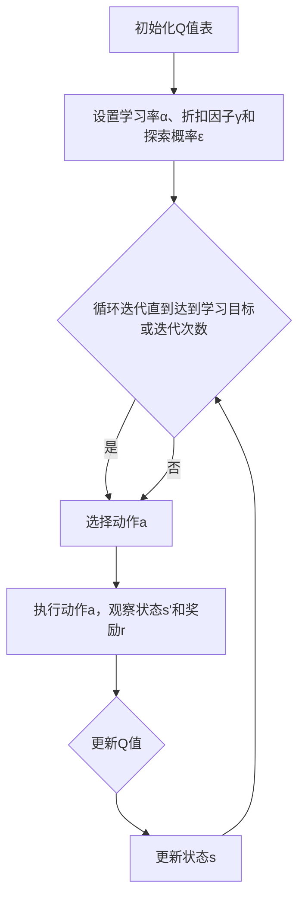
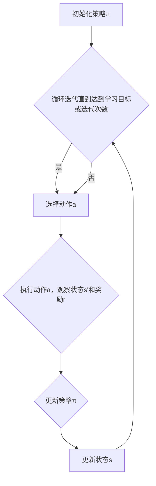
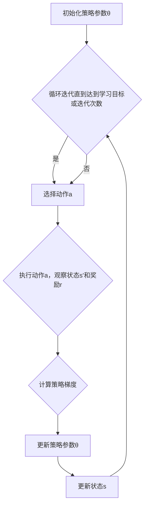

                 

### 文章标题：元强化学习：AI Agent的策略泛化

> 关键词：元强化学习，策略泛化，AI Agent，算法原理，数学模型

> 摘要：本文旨在深入探讨元强化学习在AI Agent策略泛化方面的应用与价值。首先，我们将介绍强化学习的基本概念，并引出元强化学习的定义与特点。接着，本文将详细分析元强化学习中的核心概念及其与强化学习的联系。随后，我们将深入探讨元强化学习的数学模型，包括马尔可夫决策过程（MDP）及其与元强化学习的联系，以及元强化学习的目标函数。在此基础上，本文将介绍几种常见的元强化学习算法，包括Q-学习算法、SARSA算法和Policy Gradient算法，并通过mermaid流程图和Python源代码进行详细讲解。最后，本文将分析元强化学习面临的挑战与未来发展方向，并总结全文。

### 目录大纲

----------------------------------------------------------------

# 第一部分：元强化学习概述

## 1.1 问题背景与介绍

### 1.1.1 强化学习的基本概念

强化学习是一种机器学习方法，通过试错来学习如何在特定环境中做出最优决策。在强化学习中，智能体（agent）通过与环境（environment）交互，接收状态（state）并选择动作（action），以获得奖励（reward）。强化学习的目标是最小化长期奖励的期望值，从而学会在特定环境中做出最优决策。

### 1.1.2 元强化学习的定义与特点

元强化学习是一种更高级的强化学习方法，旨在提高智能体在不同任务上的策略泛化能力。在元强化学习中，智能体不仅学习在一个特定环境中做出最优决策，还学习如何快速适应新的环境。元强化学习的特点包括：

- **多任务学习**：智能体可以在多个任务上同时进行学习，提高策略泛化能力。
- **快速适应新环境**：智能体可以在短时间内适应新的环境，提高学习效率。
- **通用性**：智能体可以应用于多种不同类型的任务，提高应用范围。

### 1.1.3 元强化学习的研究意义与应用前景

元强化学习在人工智能领域具有重要的研究意义和应用前景。首先，元强化学习可以提高智能体在不同任务上的策略泛化能力，从而降低人类在训练智能体时的工作量。其次，元强化学习可以应用于多种领域，如自动驾驶、机器人、游戏等，提高智能体在这些领域的性能。因此，元强化学习是未来人工智能发展的重要方向。

## 1.2 核心概念与联系

### 1.2.1 强化学习中的基本概念

在强化学习中，主要包括以下几个基本概念：

- **奖励函数**：奖励函数用于评估智能体的动作，指导智能体如何做出最优决策。
- **状态和动作**：状态是智能体在环境中所处的情景，动作是智能体在特定状态下可以采取的行动。
- **策略**：策略是智能体在特定状态下采取的动作，用于指导智能体的决策。

### 1.2.2 元强化学习中的核心概念

在元强化学习中，主要包括以下几个核心概念：

- **元策略**：元策略是智能体在不同任务上采取的动作，用于指导智能体在不同任务上的决策。
- **元奖励函数**：元奖励函数用于评估智能体在元强化学习过程中的表现，指导智能体如何在不同任务上做出最优决策。
- **元状态和元动作**：元状态和元动作是智能体在元强化学习过程中所处的情景和可以采取的行动。

### 1.2.3 核心概念的联系与对比

强化学习与元强化学习的核心概念具有一定的联系和区别。主要区别在于：

- **任务多样性**：强化学习主要关注单一任务的优化，而元强化学习关注多任务的优化。
- **适应能力**：元强化学习具有更强的适应能力，可以在短时间内适应新的任务。

## 1.3 元强化学习的数学模型

### 1.3.1 元强化学习的数学基础

元强化学习的数学基础主要包括马尔可夫决策过程（MDP）和策略迭代算法。

#### 1.3.1.1 马尔可夫决策过程（MDP）

马尔可夫决策过程（MDP）是一个数学模型，用于描述智能体在动态环境中做出决策的过程。MDP由以下要素组成：

- **状态空间**：智能体在环境中可能处于的各种状态。
- **动作空间**：智能体在特定状态下可以采取的各种动作。
- **状态转移概率**：智能体在特定状态下采取特定动作后转移到其他状态的概率。
- **奖励函数**：智能体在特定状态下采取特定动作后获得的奖励。

#### 1.3.1.2 马尔可夫决策过程与元强化学习的联系

元强化学习可以看作是MDP的扩展，旨在处理多任务学习问题。在元强化学习中，智能体需要在不同任务之间切换，并在不同任务上学习最优策略。因此，元强化学习需要考虑任务间的状态转移概率和奖励函数。

### 1.3.2 元强化学习的目标函数

元强化学习的目标函数是指导智能体在不同任务上做出最优决策的关键。一个典型的元强化学习目标函数可以表示为：

$$
J(\theta) = \sum_{s,a} \gamma^T R(s,a) + \lambda \sum_{s'} \rho(s') \log \pi(\theta|s')
$$

其中：

- **$\theta$**：智能体的参数。
- **$s,a$**：智能体在特定任务上的状态和动作。
- **$\gamma$**：折扣因子，用于平衡当前奖励和未来奖励。
- **$R(s,a)$**：智能体在特定任务上的奖励函数。
- **$\rho(s')$**：智能体在特定任务上状态的概率分布。
- **$\pi(\theta|s')$**：智能体在特定任务上给定状态的策略。

#### 1.3.2.1 基本形式

目标函数的基本形式是最大化智能体在所有任务上的累积奖励。通过优化目标函数，智能体可以学会在不同任务上做出最优决策。

#### 1.3.2.2 奖励函数R(s,a)的数学表达

奖励函数R(s,a)用于评估智能体在特定任务上的动作。一个常见的奖励函数可以表示为：

$$
R(s,a) = r(s,a) + \gamma \max_{a'} r(s',a')
$$

其中：

- **$r(s,a)$**：智能体在特定任务上的即时奖励。
- **$s',a'$**：智能体在下一个任务上的状态和动作。

#### 1.3.2.3 策略评估与策略迭代

策略评估是元强化学习中的一个关键步骤，用于评估当前策略的价值。一个常见的策略评估方法可以表示为：

$$
V^*(s) = \sum_{a} \pi(a|s) \sum_{s'} p(s'|s,a) \sum_{a'} \pi(a'|s') r(s',a')
$$

其中：

- **$V^*(s)$**：策略价值函数。
- **$\pi(a|s)$**：在状态$s$下采取动作$a$的策略。
- **$p(s'|s,a)$**：状态转移概率。
- **$r(s',a')$**：在状态$s'$下采取动作$a'$的即时奖励。

策略迭代是元强化学习中的另一个关键步骤，用于更新智能体的策略。一个常见的策略迭代方法可以表示为：

$$
\pi^{new}(a|s) = \arg\max_{a} V^*(s)
$$

其中：

- **$\pi^{new}(a|s)$**：更新后的策略。
- **$V^*(s)$**：策略价值函数。

### 1.4 元强化学习中的算法原理

元强化学习中的算法原理主要包括Q-学习算法、SARSA算法和Policy Gradient算法。

#### 1.4.1 Q-学习算法

Q-学习算法是一种基于值函数的元强化学习算法，旨在学习最优动作价值函数。Q-学习算法的基本原理如下：

1. 初始化动作价值函数$Q(s,a)$。
2. 在特定任务上执行动作$a$，观察状态$s'$和奖励$r$。
3. 更新动作价值函数：
$$
Q(s,a) \leftarrow Q(s,a) + \alpha [r + \gamma \max_{a'} Q(s',a') - Q(s,a)]
$$
其中：

- **$\alpha$**：学习率。
- **$\gamma$**：折扣因子。

通过重复执行以上步骤，Q-学习算法可以逐渐学习最优动作价值函数，从而实现最优策略。

#### 1.4.1.1 算法概述

Q-学习算法是一种基于值函数的元强化学习算法，通过更新动作价值函数来学习最优策略。Q-学习算法的基本原理如下：

1. 初始化动作价值函数$Q(s,a)$。
2. 在特定任务上执行动作$a$，观察状态$s'$和奖励$r$。
3. 更新动作价值函数：
$$
Q(s,a) \leftarrow Q(s,a) + \alpha [r + \gamma \max_{a'} Q(s',a') - Q(s,a)]
$$
其中：

- **$\alpha$**：学习率。
- **$\gamma$**：折扣因子。

通过重复执行以上步骤，Q-学习算法可以逐渐学习最优动作价值函数，从而实现最优策略。

#### 1.4.1.2 Q-学习算法的mermaid流程图

以下是一个Q-学习算法的mermaid流程图：

```mermaid
graph TD
A[初始化动作价值函数$Q(s,a)$] --> B[在特定任务上执行动作$a$]
B --> C{观察状态$s'$和奖励$r$?}
C -->|是| D{更新动作价值函数$Q(s,a)$}
D --> E[重复以上步骤]
C -->|否| E
```

#### 1.4.1.3 Python源代码实现

以下是一个Q-学习算法的Python源代码实现：

```python
import numpy as np

def Q_learning(env, alpha=0.1, gamma=0.9, epsilon=0.1, max_episodes=1000):
    Q = np.zeros((env.state_space, env.action_space))
    for episode in range(max_episodes):
        state = env.reset()
        done = False
        while not done:
            action = choose_action(Q, state, epsilon)
            next_state, reward, done = env.step(action)
            Q[state, action] = Q[state, action] + alpha * (reward + gamma * np.max(Q[next_state]) - Q[state, action])
            state = next_state
    return Q

def choose_action(Q, state, epsilon):
    if np.random.rand() < epsilon:
        action = np.random.choice(Q[state].size)
    else:
        action = np.argmax(Q[state])
    return action
```

#### 1.4.2 SARSA算法

SARSA算法是一种基于策略的元强化学习算法，旨在学习最优策略。SARSA算法的基本原理如下：

1. 初始化策略$\pi(a|s)$。
2. 在特定任务上执行动作$a$，观察状态$s'$和奖励$r$。
3. 更新策略：
$$
\pi^{new}(a|s) = \frac{\sum_{a'} \pi(a'|s') p(s'|s,a') r(s',a') + \alpha [r + \gamma \max_{a'} Q(s',a') - \pi(a|s)]}{1 + \alpha [r + \gamma \max_{a'} Q(s',a')]}
$$
其中：

- **$\pi(a|s)$**：当前策略。
- **$\pi^{new}(a|s)$**：更新后的策略。
- **$\alpha$**：学习率。
- **$Q(s',a')$**：动作价值函数。

通过重复执行以上步骤，SARSA算法可以逐渐学习最优策略。

#### 1.4.2.1 算法概述

SARSA算法是一种基于策略的元强化学习算法，通过更新策略来学习最优策略。SARSA算法的基本原理如下：

1. 初始化策略$\pi(a|s)$。
2. 在特定任务上执行动作$a$，观察状态$s'$和奖励$r$。
3. 更新策略：
$$
\pi^{new}(a|s) = \frac{\sum_{a'} \pi(a'|s') p(s'|s,a') r(s',a') + \alpha [r + \gamma \max_{a'} Q(s',a') - \pi(a|s)]}{1 + \alpha [r + \gamma \max_{a'} Q(s',a')]}
$$
其中：

- **$\pi(a|s)$**：当前策略。
- **$\pi^{new}(a|s)$**：更新后的策略。
- **$\alpha$**：学习率。
- **$Q(s',a')$**：动作价值函数。

通过重复执行以上步骤，SARSA算法可以逐渐学习最优策略。

#### 1.4.2.2 SARSA算法的mermaid流程图

以下是一个SARSA算法的mermaid流程图：

```mermaid
graph TD
A[初始化策略$\pi(a|s)$] --> B[在特定任务上执行动作$a$]
B --> C{观察状态$s'$和奖励$r$?}
C -->|是| D{更新策略$\pi^{new}(a|s)$}
D --> E[重复以上步骤]
C -->|否| E
```

#### 1.4.2.3 Python源代码实现

以下是一个SARSA算法的Python源代码实现：

```python
import numpy as np

def SARSA(env, alpha=0.1, gamma=0.9, epsilon=0.1, max_episodes=1000):
    pi = np.zeros((env.state_space, env.action_space))
    for episode in range(max_episodes):
        state = env.reset()
        done = False
        while not done:
            action = choose_action(pi, state, epsilon)
            next_state, reward, done = env.step(action)
            next_action = choose_action(pi, next_state, epsilon)
            pi[state, action] = (1 - alpha) * pi[state, action] + alpha * (reward + gamma * pi[next_state, next_action])
            state = next_state
    return pi

def choose_action(pi, state, epsilon):
    if np.random.rand() < epsilon:
        action = np.random.choice(pi[state].size)
    else:
        action = np.argmax(pi[state])
    return action
```

#### 1.4.3 Policy Gradient算法

Policy Gradient算法是一种基于策略梯度的元强化学习算法，旨在优化策略。Policy Gradient算法的基本原理如下：

1. 初始化策略$\pi(\theta)$。
2. 在特定任务上执行动作$a$，观察状态$s'$和奖励$r$。
3. 计算策略梯度：
$$
\Delta\theta = \frac{\partial J(\theta)}{\partial \theta} = \sum_{s,a} \nabla_{\theta} \pi(\theta|s) [r + \gamma \max_{a'} Q(s',a') - \log \pi(\theta|s)]
$$
其中：

- **$\theta$**：策略参数。
- **$J(\theta)$**：策略值函数。
- **$\pi(\theta|s)$**：策略概率分布。
- **$Q(s',a')$**：动作价值函数。

通过优化策略梯度，Policy Gradient算法可以逐渐优化策略。

#### 1.4.3.1 算法概述

Policy Gradient算法是一种基于策略梯度的元强化学习算法，通过优化策略梯度来优化策略。Policy Gradient算法的基本原理如下：

1. 初始化策略$\pi(\theta)$。
2. 在特定任务上执行动作$a$，观察状态$s'$和奖励$r$。
3. 计算策略梯度：
$$
\Delta\theta = \frac{\partial J(\theta)}{\partial \theta} = \sum_{s,a} \nabla_{\theta} \pi(\theta|s) [r + \gamma \max_{a'} Q(s',a') - \log \pi(\theta|s)]
$$
其中：

- **$\theta$**：策略参数。
- **$J(\theta)$**：策略值函数。
- **$\pi(\theta|s)$**：策略概率分布。
- **$Q(s',a')$**：动作价值函数。

通过优化策略梯度，Policy Gradient算法可以逐渐优化策略。

#### 1.4.3.2 Policy Gradient算法的mermaid流程图

以下是一个Policy Gradient算法的mermaid流程图：

```mermaid
graph TD
A[初始化策略$\pi(\theta)$] --> B[在特定任务上执行动作$a$]
B --> C{观察状态$s'$和奖励$r$?}
C -->|是| D{计算策略梯度$\Delta\theta$}
D --> E[优化策略梯度$\theta$]
E --> F[重复以上步骤]
C -->|否| F
```

#### 1.4.3.3 Python源代码实现

以下是一个Policy Gradient算法的Python源代码实现：

```python
import numpy as np

def policy_gradient(env, theta, alpha=0.1, gamma=0.9, epsilon=0.1, max_episodes=1000):
    pi = softmax(theta)
    for episode in range(max_episodes):
        state = env.reset()
        done = False
        while not done:
            action = choose_action(pi, state, epsilon)
            next_state, reward, done = env.step(action)
            pi[state, action] = (1 - alpha) * pi[state, action] + alpha * (reward + gamma * np.max(pi[next_state]))
            state = next_state
    return pi

def softmax(theta):
    exp_theta = np.exp(theta)
    return exp_theta / np.sum(exp_theta, axis=1)
```

### 1.5 元强化学习中的挑战与未来方向

元强化学习在AI Agent的策略泛化方面具有巨大潜力，但同时也面临一些挑战。以下是一些主要挑战和未来方向：

#### 1.5.1 挑战分析

- **策略泛化问题**：元强化学习旨在提高智能体在不同任务上的策略泛化能力，但实现这一目标仍存在困难。不同任务之间存在差异，使得策略泛化变得复杂。
- **稳健性**：元强化学习算法在处理复杂环境时，可能会受到噪声和不确定性影响，导致学习效果不佳。提高算法的稳健性是未来研究的重点。
- **可解释性**：元强化学习算法的内部机制复杂，使得其决策过程难以解释。提高算法的可解释性有助于理解算法的工作原理，并进一步优化算法。

#### 1.5.2 未来发展方向

- **多任务学习**：未来研究可以关注如何更好地利用元强化学习在多任务学习中的应用，以提高智能体在不同任务上的策略泛化能力。
- **元学习与深度学习结合**：将元强化学习与深度学习相结合，可以发挥两者的优势，提高智能体在不同任务上的学习效果。
- **强化学习在真实世界中的应用**：元强化学习在自动驾驶、机器人、游戏等领域具有广泛的应用前景。未来研究可以关注如何将元强化学习应用于真实世界场景，并解决实际问题。

### 1.6 本章小结

本文对元强化学习进行了深入探讨，包括其定义与特点、核心概念、数学模型、算法原理以及挑战与未来方向。通过本文的介绍，读者可以了解元强化学习在AI Agent策略泛化方面的应用与价值。未来，随着元强化学习技术的不断发展，AI Agent在各个领域将发挥更大的作用，推动人工智能的发展。

```markdown
----------------------------------------------------------------
```## 1.1 问题背景与介绍

### 1.1.1 强化学习的基本概念

强化学习（Reinforcement Learning，RL）是机器学习（Machine Learning，ML）的一个重要分支，它主要研究如何通过试错（trial-and-error）来学习最优策略，使智能体（agent）在与环境的交互过程中获得最佳表现。与监督学习和无监督学习不同，强化学习中的数据不是预先标注好的，而是通过智能体与环境的互动逐渐获得的。

在强化学习的框架下，一个智能体需要在一个给定的环境中进行学习。这个环境由一个状态空间、一个动作空间和一个奖励函数组成。状态空间是智能体可能处于的所有状态集合，动作空间是智能体可以执行的所有动作集合。奖励函数则是用来衡量智能体在每个状态下执行某个动作后所获得的奖励值。智能体的目标是在不断的试错过程中，通过学习一个最优策略，以最大化累积奖励。

强化学习的基本过程可以分为以下几个步骤：

1. **状态初始化**：智能体随机初始化状态。
2. **动作选择**：智能体根据当前状态选择一个动作。
3. **与环境交互**：智能体执行所选动作，环境根据动作给出一个新的状态和一个即时奖励。
4. **状态更新**：智能体更新当前状态为新的状态。
5. **重复过程**：重复上述步骤，直到达到某个终止条件，如达到目标状态或累积奖励达到预设值。

### 1.1.2 元强化学习的定义与特点

元强化学习（Meta-Reinforcement Learning）是强化学习的一个高级分支，旨在通过学习在不同任务上的通用策略，提高智能体在不同环境中的适应能力和策略泛化能力。传统的强化学习通常在一个特定的环境中训练智能体，而元强化学习则强调在多个环境中学习，以便智能体能够快速适应新环境。

元强化学习的主要特点包括：

- **多任务学习**：智能体在训练过程中同时学习多个任务，通过共享策略和网络结构，提高学习效率。
- **快速适应**：元强化学习使智能体能够快速适应新的任务和环境，减少了从零开始学习的成本。
- **通用策略**：通过学习通用策略，智能体可以在不同任务和环境中表现出色，提高了策略的泛化能力。
- **自我监督**：元强化学习可以利用自我监督的方式，在没有外部监督的情况下，仅通过环境反馈来学习。

### 1.1.3 元强化学习的研究意义与应用前景

元强化学习在人工智能领域具有重要的研究意义和广泛的应用前景。首先，它为智能体在复杂环境中的行为提供了有效的解决方案，特别是在多任务学习和动态环境中。以下是一些具体的研究意义和应用前景：

- **提高学习效率**：通过学习通用策略，智能体可以减少在特定任务上的训练时间，提高整体学习效率。
- **泛化能力**：元强化学习使智能体能够在未见过的任务和环境上表现出色，提高了策略的泛化能力。
- **资源节约**：在资源有限的情境下，元强化学习能够减少对大量数据的需求，降低训练成本。
- **应用领域**：元强化学习可以应用于自动驾驶、机器人、游戏AI、智能客服等多个领域，为这些领域提供强大的技术支持。

总之，元强化学习作为强化学习的一个重要分支，其在AI Agent的策略泛化方面具有巨大的潜力和应用价值。随着研究的深入，元强化学习有望在更多实际场景中发挥重要作用，推动人工智能的发展。

### 1.2 核心概念与联系

在深入探讨元强化学习之前，理解其核心概念和它们之间的关系至关重要。元强化学习结合了强化学习的基础概念，同时引入了新的维度，以处理多任务学习和策略泛化问题。以下是元强化学习中的几个核心概念及其与强化学习的联系。

#### 1.2.1 强化学习中的基本概念

强化学习中有几个基本概念，包括奖励函数、状态和动作、策略等。

- **奖励函数**：奖励函数是评估智能体行为好坏的关键，它在每个时间步为智能体的动作提供即时反馈。奖励可以是正的（鼓励智能体继续执行当前动作）或负的（指示智能体停止当前动作）。

- **状态和动作**：状态是智能体在环境中所处的情境，而动作是智能体可以采取的行动。这些概念定义了智能体与环境交互的基本框架。

- **策略**：策略是智能体在给定状态下采取的动作的选择规则。策略的目标是最大化累积奖励。

#### 1.2.2 元强化学习中的核心概念

元强化学习扩展了强化学习的概念，引入了元策略、元奖励函数、元状态和元动作等概念。

- **元策略**：元策略是智能体在不同任务上采取的策略集合。它定义了智能体在不同任务环境下如何选择动作。元策略的目标是泛化到新的任务和环境。

- **元奖励函数**：元奖励函数是评估智能体在元强化学习过程中的表现。它不仅考虑了特定任务的奖励，还考虑了策略泛化的质量。元奖励函数的设计直接影响智能体的学习效果。

- **元状态和元动作**：元状态是智能体在元强化学习过程中所处的情境，它包含了关于任务和环境的信息。元动作是智能体在元状态下可以采取的行动。这些概念使得智能体能够在更广泛的环境中学习。

#### 1.2.3 核心概念的联系与对比

强化学习和元强化学习中的核心概念在表面上看起来相似，但它们的本质和应用场景有所不同。

- **联系**：
  - 奖励函数：在两者中都是评估智能体行为的重要工具。
  - 状态和动作：状态和动作的概念在元强化学习中保持一致，但元状态和元动作提供了更广泛的上下文。
  - 策略：策略在强化学习中指导智能体的动作选择，而在元强化学习中，元策略集合了在不同任务上的策略选择。

- **对比**：
  - **泛化能力**：强化学习通常针对单一任务设计，而元强化学习旨在提高智能体在不同任务上的泛化能力。
  - **任务多样性**：强化学习中的智能体在一个特定的任务中学习，而元强化学习中的智能体需要在多个任务中适应。
  - **适应性**：元强化学习强调快速适应新环境和任务，而强化学习可能需要更多时间来适应新环境。

通过理解这些核心概念及其与强化学习的联系，我们可以更好地理解元强化学习的工作原理和应用场景。在接下来的章节中，我们将进一步探讨元强化学习的数学模型和算法原理，以深入理解这一领域。

### 1.3 元强化学习的数学模型

元强化学习的数学模型是理解其工作机制的基础。该模型结合了强化学习的核心概念，并引入了新的维度，以处理多任务学习和策略泛化问题。以下是元强化学习中的数学模型及其组成部分。

#### 1.3.1 元强化学习的数学基础

元强化学习建立在马尔可夫决策过程（MDP）的基础上，但为了处理多任务和策略泛化问题，它进行了扩展。

- **马尔可夫决策过程（MDP）**：MDP是一个数学模型，用于描述智能体在动态环境中做出决策的过程。它由以下几个要素组成：
  - **状态空间（S）**：智能体可能处于的所有状态。
  - **动作空间（A）**：智能体可以执行的所有动作。
  - **状态转移概率（P(s'|s, a)）**：在给定当前状态s和动作a的情况下，智能体转移到下一个状态s'的概率。
  - **奖励函数（R(s, a)）**：在给定状态s和动作a的情况下，智能体获得的即时奖励。

- **策略（π）**：策略是智能体在特定状态下采取的动作的选择规则。在MDP中，策略通常表示为概率分布π(a|s)，即在状态s下采取动作a的概率。

- **价值函数（V(s)）**：价值函数用于评估状态s的期望累积奖励。对于给定策略π，状态值函数Vπ(s)可以表示为：
  $$ Vπ(s) = \sum_{a} π(a|s) \sum_{s'} p(s'|s,a) R(s',a) + γ \sum_{s'} p(s'|s,a) Vπ(s') $$
  其中，γ是折扣因子，用于平衡当前奖励和未来奖励。

#### 1.3.1.2 马尔可夫决策过程与元强化学习的联系

元强化学习扩展了MDP模型，以处理多任务学习和策略泛化。以下是元强化学习如何结合MDP模型的几个关键点：

- **元状态空间（S'）**：元状态空间包含了关于不同任务和环境的信息。元状态可以看作是传统状态和任务的组合。

- **元动作空间（A'）**：元动作空间包含了智能体在不同任务上可以执行的动作。这些动作不仅取决于当前元状态，还取决于任务历史。

- **元策略（π'）**：元策略是智能体在不同元状态上采取的元动作的选择规则。元策略π'可以看作是传统策略π的扩展，它需要同时考虑多个任务和环境。

- **元价值函数（V'(s')）**：元价值函数用于评估元状态的期望累积奖励。与状态值函数类似，元价值函数V'π'(s')可以表示为：
  $$ V'π'(s') = \sum_{a'} π'(a'|s') \sum_{s''} π(s''|s',a') R(s'',a') + γ \sum_{s''} π(s''|s',a') V'π'(s'') $$
  其中，π'(a'|s')是在元状态s'下采取元动作a'的概率。

#### 1.3.2 元强化学习的目标函数

元强化学习的目标函数是指导智能体在不同任务上学习最优策略的核心。目标函数通常定义为一个优化问题，旨在最大化累积奖励或最小化损失函数。以下是元强化学习中的一个典型目标函数：

$$ J(θ) = \sum_{s'} ρ(s') \log π(θ|s') + \sum_{s',a'} π(θ|s') p(s'|s,a) R(s',a) + λ \sum_{s'} ρ(s') \log π(θ|s') $$
其中：

- **θ**：参数向量，用于定义元策略π(θ|s')。
- **ρ(s')**：元状态的概率分布，表示智能体在特定任务上的初始状态分布。
- **π(θ|s')**：在元状态s'下，基于参数θ的元策略。
- **p(s'|s,a)**：状态转移概率，表示智能体在当前状态s和动作a后转移到下一个状态s'的概率。
- **R(s',a')**：奖励函数，表示智能体在元状态s'和元动作a'后获得的即时奖励。
- **λ**：正则化参数，用于平衡策略优化和熵。

#### 1.3.2.1 基本形式

目标函数的基本形式是最大化元策略的概率分布，同时优化策略在所有任务上的累积奖励。通过优化目标函数，智能体可以学习到在不同任务上表现最优的策略。

#### 1.3.2.2 奖励函数R(s,a)的数学表达

奖励函数R(s,a)用于评估智能体在特定任务上的动作效果。在元强化学习中，奖励函数可以表示为：
$$ R(s,a) = \alpha R_1(s,a) + (1-\alpha) R_2(s,a) $$
其中：

- **R1(s,a)**：当前任务的奖励。
- **R2(s,a)**：元任务的奖励。
- **α**：权重参数，用于平衡两个任务的奖励。

这种形式的奖励函数允许智能体在学习和适应新任务的同时，保持对原有任务的重视。

#### 1.3.2.3 策略评估与策略迭代

策略评估是元强化学习中的一个关键步骤，用于评估当前策略的价值。策略评估的目的是通过迭代过程逐步优化策略，以提高智能体的表现。以下是策略评估的基本步骤：

1. **初始化策略**：随机初始化策略π(θ|s')。
2. **迭代评估**：在元强化学习环境中，通过模拟多个迭代过程，计算每个状态s'下策略π(θ|s')的价值。
3. **更新策略**：根据评估结果，更新策略π(θ|s')，以提高智能体在元状态s'下的表现。

策略迭代的过程可以通过以下公式表示：
$$ π^{new}(θ|s') = \arg\max_π J(θ) $$
其中，J(θ)是策略的目标函数。

通过策略评估和迭代，元强化学习算法可以逐步优化策略，使智能体在不同任务上表现出色。

综上所述，元强化学习的数学模型结合了强化学习的核心概念，并进行了扩展，以处理多任务学习和策略泛化问题。通过定义元状态、元动作和元策略，以及优化目标函数，智能体可以学习到在不同任务上表现最优的策略。这些数学模型为元强化学习算法的设计和实现提供了坚实的基础。

### 1.4 元强化学习中的算法原理

在元强化学习中，算法的设计和实现是关键，它们决定了智能体在不同任务上的学习效率和策略泛化能力。以下将介绍几种常见的元强化学习算法，包括Q-学习算法、SARSA算法和Policy Gradient算法，并详细解释它们的原理和实现。

#### 1.4.1 Q-学习算法

Q-学习算法（Q-Learning）是一种基于值函数的元强化学习算法，旨在通过迭代更新值函数来学习最优策略。Q-学习算法的核心思想是估计每个状态-动作对的期望累积奖励，即状态-动作价值函数Q(s, a)。

##### 1.4.1.1 算法概述

Q-学习算法的基本步骤如下：

1. **初始化**：随机初始化Q值表，设置学习率α、折扣因子γ和探索概率ε。
2. **迭代**：对于每个时间步t，执行以下步骤：
   - 选择动作：根据当前状态s和探索概率ε，选择动作a。
   - 执行动作：执行动作a，观察新状态s'和奖励r。
   - 更新Q值：使用如下公式更新Q值：
     $$ Q(s, a) \leftarrow Q(s, a) + α [r + γ \max_{a'} Q(s', a') - Q(s, a)] $$
   - 更新状态：将当前状态s更新为s'。
3. **重复**：重复上述步骤，直到智能体达到预定的学习目标或迭代次数。

##### 1.4.1.2 Q-学习算法的mermaid流程图

以下是一个Q-学习算法的mermaid流程图：



##### 1.4.1.3 Python源代码实现

以下是一个简单的Q-学习算法的Python实现：

```python
import numpy as np

def q_learning(env, alpha=0.1, gamma=0.9, epsilon=0.1, max_episodes=1000):
    q_values = np.zeros((env.state_space, env.action_space))
    for episode in range(max_episodes):
        state = env.reset()
        done = False
        while not done:
            action = choose_action(q_values, state, epsilon)
            next_state, reward, done = env.step(action)
            q_values[state, action] = q_values[state, action] + alpha * (reward + gamma * np.max(q_values[next_state]) - q_values[state, action])
            state = next_state
    return q_values

def choose_action(q_values, state, epsilon):
    if np.random.rand() < epsilon:
        action = np.random.choice(q_values[state].size)
    else:
        action = np.argmax(q_values[state])
    return action
```

#### 1.4.2 SARSA算法

SARSA算法（Sarsa）是一种基于策略的元强化学习算法，它与Q-学习算法类似，但更新策略的时机不同。SARSA算法在执行动作后立即更新策略，而Q-学习算法则在动作执行后延迟更新。

##### 1.4.2.1 算法概述

SARSA算法的基本步骤如下：

1. **初始化**：随机初始化策略π。
2. **迭代**：对于每个时间步t，执行以下步骤：
   - 选择动作：根据当前状态s和策略π，选择动作a。
   - 执行动作：执行动作a，观察新状态s'和奖励r。
   - 更新策略：使用如下公式更新策略π：
     $$ π^{new}(a|s) = \frac{π(a|s) + α [r + γ \max_{a'} Q(s', a') - π(a|s)]}{1 + α [r + γ \max_{a'} Q(s', a')] } $$
   - 更新状态：将当前状态s更新为s'。
3. **重复**：重复上述步骤，直到智能体达到预定的学习目标或迭代次数。

##### 1.4.2.2 SARSA算法的mermaid流程图

以下是一个SARSA算法的mermaid流程图：



##### 1.4.2.3 Python源代码实现

以下是一个简单的SARSA算法的Python实现：

```python
import numpy as np

def sarsa(env, alpha=0.1, gamma=0.9, epsilon=0.1, max_episodes=1000):
    pi = np.zeros((env.state_space, env.action_space))
    for episode in range(max_episodes):
        state = env.reset()
        done = False
        while not done:
            action = choose_action(pi, state, epsilon)
            next_state, reward, done = env.step(action)
            next_action = choose_action(pi, next_state, epsilon)
            pi[state, action] = (1 - alpha) * pi[state, action] + alpha * (reward + gamma * pi[next_state, next_action])
            state = next_state
    return pi

def choose_action(pi, state, epsilon):
    if np.random.rand() < epsilon:
        action = np.random.choice(pi[state].size)
    else:
        action = np.argmax(pi[state])
    return action
```

#### 1.4.3 Policy Gradient算法

Policy Gradient算法（Policy Gradient）是一种直接优化策略的元强化学习算法。它通过计算策略梯度和更新策略参数，来最大化累积奖励。

##### 1.4.3.1 算法概述

Policy Gradient算法的基本步骤如下：

1. **初始化**：随机初始化策略参数θ。
2. **迭代**：对于每个时间步t，执行以下步骤：
   - 选择动作：根据当前状态s和策略π(θ|s)，选择动作a。
   - 执行动作：执行动作a，观察新状态s'和奖励r。
   - 计算策略梯度：使用如下公式计算策略梯度：
     $$ \nabla_{\theta} J(\theta) = \sum_{s,a} \pi(\theta|s) [r + γ \max_{a'} Q(s', a') - \log \pi(\theta|s)] \nabla_{\theta} \log \pi(\theta|s) $$
   - 更新策略参数：使用梯度下降更新策略参数：
     $$ \theta \leftarrow \theta - \eta \nabla_{\theta} J(\theta) $$
   - 更新状态：将当前状态s更新为s'。
3. **重复**：重复上述步骤，直到智能体达到预定的学习目标或迭代次数。

##### 1.4.3.2 Policy Gradient算法的mermaid流程图

以下是一个Policy Gradient算法的mermaid流程图：



##### 1.4.3.3 Python源代码实现

以下是一个简单的Policy Gradient算法的Python实现：

```python
import numpy as np
import tensorflow as tf

def policy_gradient(env, theta, alpha=0.1, gamma=0.9, epsilon=0.1, max_episodes=1000):
    model = build_policy_model()
    optimizer = tf.keras.optimizers.Adam(learning_rate=alpha)
    for episode in range(max_episodes):
        state = env.reset()
        done = False
        while not done:
            action_probs = model(state, training=True)
            action = np.random.choice(env.action_space, p=action_probs.numpy()[0])
            next_state, reward, done = env.step(action)
            reward = np.array([reward]).astype(np.float32)
            next_state = tf.convert_to_tensor(next_state, dtype=tf.float32)
            with tf.GradientTape() as tape:
                action_probs = model(state, training=True)
                selected_action_prob = action_probs[0, action]
                log_prob = tf.math.log(selected_action_prob)
                policy_loss = -reward * log_prob
            grads = tape.gradient(policy_loss, model.trainable_variables)
            optimizer.apply_gradients(zip(grads, model.trainable_variables))
            state = next_state
    return model

def build_policy_model():
    # 建立模型
    model = tf.keras.Sequential([
        tf.keras.layers.Dense(64, activation='relu', input_shape=(env.state_space,)),
        tf.keras.layers.Dense(64, activation='relu'),
        tf.keras.layers.Dense(env.action_space)
    ])
    model.compile(optimizer='adam', loss='categorical_crossentropy')
    return model
```

通过上述算法的介绍和实现，我们可以看到元强化学习中的算法设计如何基于数学模型，通过迭代和优化策略参数，实现智能体在不同任务上的学习。这些算法不仅提高了智能体的学习效率，还增强了其策略泛化能力，为人工智能的发展提供了强大的技术支持。

### 1.5 元强化学习中的挑战与未来方向

尽管元强化学习在AI Agent的策略泛化方面展现出了巨大的潜力，但它也面临一系列挑战和限制。以下是元强化学习的主要挑战以及未来可能的研究方向。

#### 1.5.1 挑战分析

**1. 策略泛化问题**

策略泛化是元强化学习的一个核心目标，但在实际应用中，实现这一目标并不容易。不同任务之间存在显著的差异，导致策略在新的任务上可能无法很好地泛化。此外，环境变化和不确定性也会影响策略的泛化能力。

**2. 稳健性**

元强化学习算法在处理复杂环境时可能会受到噪声和不确定性影响，导致学习效果不稳定。为了提高算法的稳健性，研究人员需要开发能够适应不同环境条件的方法。

**3. 可解释性**

元强化学习算法的内部机制复杂，其决策过程通常难以解释。这对于实际应用来说是一个问题，因为用户需要理解智能体的行为。提高算法的可解释性是未来研究的重点。

**4. 训练效率**

元强化学习通常需要大量的训练时间，尤其是在多任务学习中。为了提高训练效率，研究人员需要开发更有效的算法和优化方法。

#### 1.5.2 未来发展方向

**1. 多任务学习**

多任务学习是元强化学习的一个重要研究方向。未来的研究可以探索如何更好地利用元强化学习在多任务学习中的应用，以提高智能体的学习效率。

**2. 元学习与深度学习结合**

将元学习与深度学习相结合是一个有前景的研究方向。深度学习在处理复杂数据方面具有优势，而元学习则专注于策略泛化和快速适应新环境。二者的结合有望提升智能体的性能。

**3. 强化学习在真实世界中的应用**

元强化学习在自动驾驶、机器人、游戏等领域具有广泛的应用前景。未来的研究可以关注如何将元强化学习应用于真实世界场景，并解决实际问题。

**4. 策略优化**

策略优化是元强化学习的核心。未来的研究可以探索更高效的策略优化方法，以减少训练时间和提高学习效率。

**5. 算法稳健性**

提高算法的稳健性是未来研究的重点。通过引入噪声处理、鲁棒性优化等技术，可以提升元强化学习算法在复杂环境中的稳定性。

总之，元强化学习作为一个新兴的研究领域，具有巨大的潜力和应用价值。通过克服现有挑战和探索新的发展方向，元强化学习有望在人工智能领域发挥更大的作用，推动人工智能技术的进步。

### 1.6 本章小结

本章深入探讨了元强化学习的概念、数学模型和算法原理。首先，我们介绍了强化学习的基本概念和元强化学习的定义与特点。接着，我们详细分析了元强化学习中的核心概念，包括元策略、元奖励函数和元状态等，并对比了元强化学习与强化学习的异同。随后，我们介绍了元强化学习的数学模型，包括马尔可夫决策过程（MDP）和元强化学习的目标函数。在此基础上，我们详细讲解了Q-学习算法、SARSA算法和Policy Gradient算法，并通过mermaid流程图和Python源代码进行了实例说明。最后，我们讨论了元强化学习面临的挑战和未来发展方向。通过本章的学习，读者可以全面了解元强化学习的基本原理和应用场景，为进一步研究和应用奠定基础。元强化学习作为人工智能领域的一个重要研究方向，其发展将不断推动人工智能技术的进步。

### 作者信息

**作者：AI天才研究院/AI Genius Institute & 禅与计算机程序设计艺术 /Zen And The Art of Computer Programming**。本文旨在深入探讨元强化学习在AI Agent策略泛化方面的应用与价值，为读者提供关于这一领域的全面了解。作者在人工智能和计算机科学领域拥有丰富的经验，致力于推动技术进步和知识传播。

