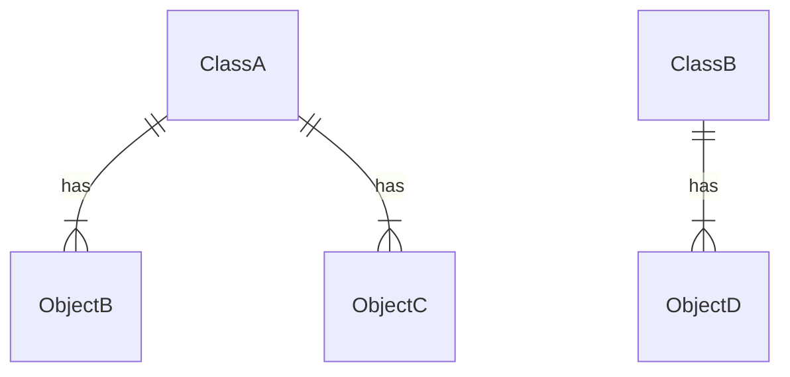
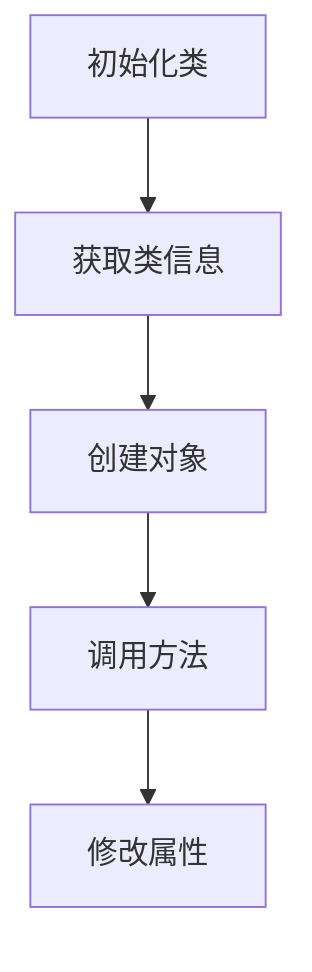
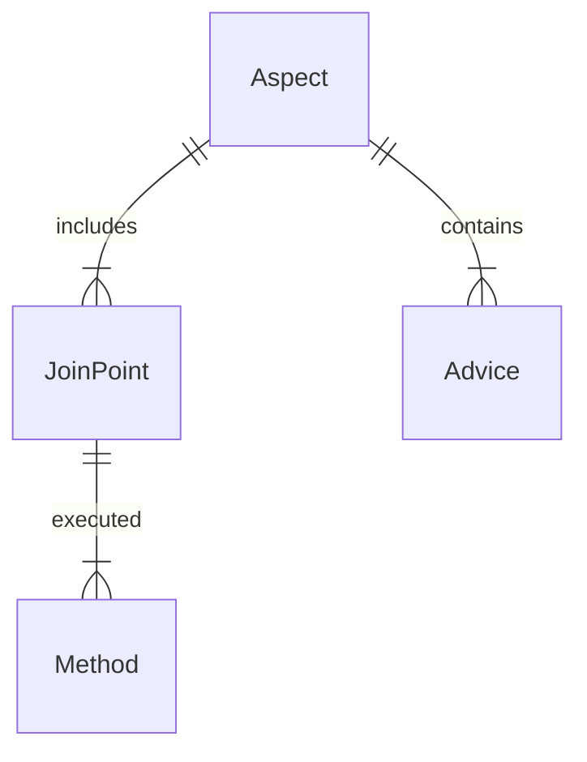
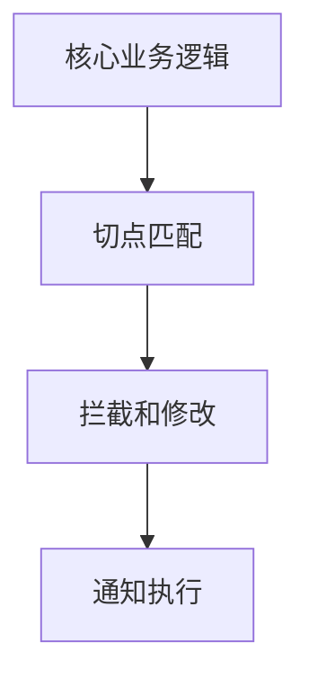
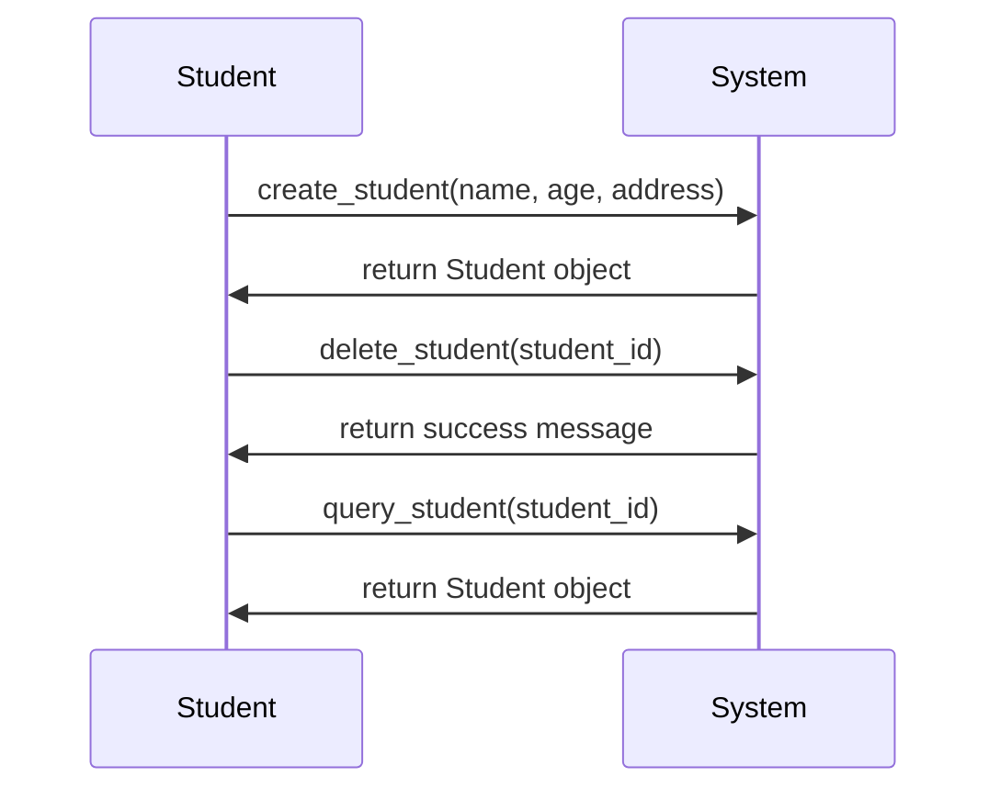
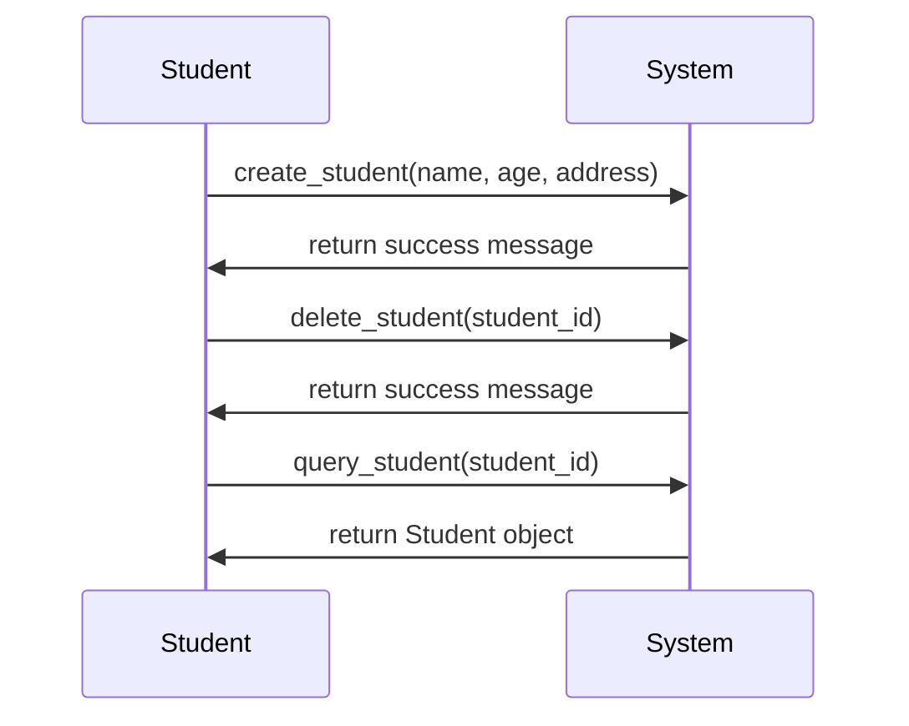

                 


**Step 1: Introduction and Background**

### 元编程技术：使AI Agent具备代码生成能力

关键词：元编程，AI Agent，代码生成，自动化，开发效率

摘要：
本文将深入探讨元编程技术，并探讨如何将其应用于AI Agent以实现代码生成能力。通过分析元编程的基本原理和应用场景，我们将了解元编程在提高开发效率、增强代码可维护性和促进代码复用方面的优势。随后，我们将探讨AI Agent的定义、代码生成技术的原理以及两者结合的潜力。最后，本文将总结本书的结构安排，为读者提供学习路线和建议。

**Step 2: 元编程基础**

### 2.1 元编程原理

#### 2.1.1 元编程概念

元编程是指编写程序来编写程序的编程技术。它涉及到对代码的生成、修改和分析。与普通编程不同，元编程侧重于如何构建更高级别的抽象和自动化。

**核心概念术语说明**：

- **元编程**：编写程序的编程技术。
- **代码生成**：通过元编程技术自动生成代码的过程。
- **代码模板**：预先定义的代码结构，用于生成特定类型的代码。
- **代码注入**：将代码动态地插入到现有代码中的技术。

**问题背景**：

随着软件系统的复杂度不断增加，开发人员需要面对日益繁琐的代码编写和修改工作。传统的编程方法已经无法满足高效开发的需求，因此需要寻找更高级别的抽象和自动化解决方案。

**问题描述**：

如何通过元编程技术提高开发效率、增强代码可维护性和促进代码复用？

**问题解决**：

元编程通过以下方式解决上述问题：

- **提高开发效率**：通过代码生成和模板技术，减少重复编写代码的工作量。
- **增强代码可维护性**：通过动态修改和更新代码，提高代码的灵活性和可维护性。
- **促进代码复用**：通过抽象和自动化，实现代码的重用，减少代码冗余。

**边界与外延**：

元编程不仅适用于通用编程语言，还可以应用于特定领域的编程语言和框架。例如，Python的元类和Java的反射机制都是元编程的重要应用。

**概念结构与核心要素组成**：

元编程的核心概念和要素包括：

- **代码生成技术**：包括动态代码生成、代码模板和代码注入等。
- **抽象和自动化**：通过高级别抽象和自动化，提高开发效率和代码质量。
- **代码可维护性和复用性**：通过灵活的代码修改和重用，提高软件的可维护性和可扩展性。

### 2.2 元编程工具与框架

#### 2.2.1 常见元编程工具

常见的元编程工具有：

- **Python的`__metaclass__`**：用于定义类的元类，实现动态创建和修改类。
- **Java的`reflection`**：用于在运行时访问和修改类的字段和方法。
- **JavaScript的`Proxy`和`Reflect`**：用于实现对象代理和反射操作，提供动态修改对象的能力。

**核心概念与联系**：

- **元类（`__metaclass__`）**：定义类的类，用于动态创建和修改类。
- **反射（`reflection`）**：在运行时获取和修改类的字段和方法。
- **代理（`Proxy`）**和**反射（`Reflect`）**：用于创建对象代理和实现反射操作。

**ER实体关系图架构的 Mermaid 流程图**：



**核心概念原理**：

元编程工具的核心原理是通过动态修改和生成代码，提高开发效率和代码质量。具体来说，这些工具提供了以下功能：

- **动态创建和修改类**：通过元类和反射机制，可以在运行时动态创建和修改类，实现更高级别的抽象和自动化。
- **动态修改对象**：通过代理和反射操作，可以在运行时动态修改对象的属性和方法，提高代码的可维护性和灵活性。

**概念属性特征对比表格**：

| 工具             | 类别           | 功能特征                    | 应用场景             |
|------------------|----------------|-----------------------------|----------------------|
| `__metaclass__` | Python元类     | 动态创建和修改类           | 类定义的抽象和自动化 |
| `reflection`     | Java反射       | 在运行时获取和修改类的字段和方法 | 动态代码修改         |
| `Proxy`和`Reflect` | JavaScript代理 | 创建对象代理和实现反射操作 | 对象的动态修改       |

**算法原理讲解**：

元编程工具的核心原理是通过反射和代理机制实现动态代码生成和修改。具体算法原理如下：

- **反射机制**：通过反射，可以在运行时获取类的字段和方法信息，并进行修改。反射机制的实现通常依赖于Java的`Class`类和Python的`getattr`、`setattr`等函数。
- **代理机制**：通过代理，可以创建一个代理对象，该对象可以拦截和修改对象的属性和方法调用。代理机制的实现通常依赖于JavaScript的`Proxy`对象。

**例子说明**：

以下是一个Python的反射示例：

```python
class Person:
    def __init__(self, name, age):
        self.name = name
        self.age = age

person = Person("Alice", 30)

# 使用反射获取和修改对象属性
print(person.name)  # 输出：Alice
person.name = "Bob"
print(person.name)  # 输出：Bob
```

在这个例子中，我们使用`getattr`和`setattr`函数获取和修改对象的属性。

**系统分析与架构设计方案**：

元编程工具在系统架构设计中的应用主要体现在以下几个方面：

- **动态类创建和修改**：通过元类和反射机制，可以在运行时动态创建和修改类，实现类的抽象和自动化。
- **动态对象修改**：通过代理和反射操作，可以在运行时动态修改对象的属性和方法，提高系统的灵活性和可维护性。

**Mermaid 流程图**：



在这个流程图中，我们展示了通过反射和代理机制实现动态类创建、对象修改和调用方法的过程。

### 2.3 元编程框架

#### 2.3.1 Aspect-Oriented Programming (AOP)

Aspect-Oriented Programming（AOP）是一种编程范式，用于将横切关注点（如日志记录、事务管理、安全控制等）从核心业务逻辑中分离出来。AOP通过将横切关注点抽象为“方面”，并将方面插入到核心业务逻辑中，实现代码的解耦和模块化。

**核心概念与联系**：

- **方面（Aspect）**：包含横切关注点的模块化代码。
- **切点（Pointcut）**：定义了哪些类和方法应该被方面拦截和修改。
- **通知（Advice）**：定义了方面在拦截点执行的具体操作。

**ER实体关系图架构的 Mermaid 流程图**：



**核心概念原理**：

AOP的核心原理是通过切点和通知，将横切关注点与核心业务逻辑分离，实现代码的解耦和模块化。具体原理如下：

- **切点**：定义了哪些类和方法应该被方面拦截和修改。切点通常使用正则表达式或切点表达式来定义。
- **通知**：定义了方面在拦截点执行的具体操作。通知可以是前置通知、后置通知、环绕通知等。

**概念属性特征对比表格**：

| 概念   | 描述                                      | 特征                     |
|--------|-------------------------------------------|-------------------------|
| 切点   | 定义了哪些类和方法应该被方面拦截和修改。 | 正则表达式、切点表达式 |
| 通知   | 定义了方面在拦截点执行的具体操作。       | 前置通知、后置通知等   |
| 方面   | 包含横切关注点的模块化代码。             | 解耦、模块化           |

**算法原理讲解**：

AOP的算法原理主要包括以下几个方面：

- **切点匹配**：通过正则表达式或切点表达式匹配类和方法，确定哪些类和方法应该被方面拦截。
- **拦截和修改**：通过拦截器拦截类和方法的调用，并进行相应的修改。拦截器可以是前置拦截器、后置拦截器或环绕拦截器。
- **通知执行**：在拦截点执行方面定义的通知操作，如日志记录、事务管理等。

**例子说明**：

以下是一个AOP的例子：

```java
@Aspect
public class LoggingAspect {
    @Before("execution(* com.example.service.*.*(..))")
    public void logBeforeMethod(JoinPoint joinPoint) {
        System.out.println("Before method: " + joinPoint.getSignature().toShortString());
    }

    @AfterReturning(pointcut = "execution(* com.example.service.*.*(..))", returning = "result")
    public void logAfterReturningMethod(JoinPoint joinPoint, Object result) {
        System.out.println("After returning method: " + joinPoint.getSignature().toShortString() + ", result: " + result);
    }
}
```

在这个例子中，我们定义了一个`LoggingAspect`方面，用于记录核心业务逻辑方法的调用。

**系统分析与架构设计方案**：

AOP在系统架构设计中的应用主要体现在以下几个方面：

- **解耦**：通过将横切关注点抽象为方面，实现核心业务逻辑与横切关注点的解耦。
- **模块化**：通过方面和切点，实现代码的模块化组织和维护。

**Mermaid 流程图**：



在这个流程图中，我们展示了AOP的基本工作流程，包括核心业务逻辑的执行、切点匹配、拦截和修改以及通知执行。

### 2.4 实现案例解析

#### 2.4.1 Python中的元编程应用

Python是一种广泛使用的编程语言，具有丰富的元编程功能。以下是一个Python中的元编程实现案例。

**环境安装**：

首先，确保安装了Python和相应的开发环境。

```bash
pip install python-metaclass
```

**系统功能设计**：

我们设计一个简单的学生管理系统，包括添加学生、删除学生、查询学生等功能。

**类图**：

```mermaid
classDiagram
  Student <<class{Student}>
  Student *-- Address: address
  Student *-- Course: courses
  Address <<class{Address}>
  Address *-- Student: students
  Course <<class{Course}>
  Course *-- Student: students
endclass
```

**系统架构设计**：

我们使用Python的元类实现学生管理系统的核心功能。

**Mermaid 架构图**：



在这个架构图中，我们展示了学生管理系统的核心功能，包括创建学生、删除学生和查询学生。

**系统接口设计**：

我们定义一个简单的学生管理接口。

```python
class StudentManager:
    def create_student(self, name, age, address):
        # 实现创建学生的功能
        pass

    def delete_student(self, student_id):
        # 实现删除学生的功能
        pass

    def query_student(self, student_id):
        # 实现查询学生的功能
        pass
```

**系统交互Mermaid序列图**：



在这个序列图中，我们展示了学生管理系统的用户交互过程。

**系统核心实现源代码**：

```python
class Student:
    def __init__(self, name, age, address):
        self.name = name
        self.age = age
        self.address = address

    def __str__(self):
        return f"Name: {self.name}, Age: {self.age}, Address: {self.address}"

class StudentManager:
    def __init__(self):
        self.students = []

    def create_student(self, name, age, address):
        student = Student(name, age, address)
        self.students.append(student)
        return student

    def delete_student(self, student_id):
        for student in self.students:
            if student.id == student_id:
                self.students.remove(student)
                return "Student deleted successfully."
        return "Student not found."

    def query_student(self, student_id):
        for student in self.students:
            if student.id == student_id:
                return student
        return "Student not found."

if __name__ == "__main__":
    manager = StudentManager()
    student = manager.create_student("Alice", 20, "New York")
    print(student)
    print(manager.delete_student(1))
    print(manager.query_student(1))
```

在这个源代码中，我们实现了学生管理系统的核心功能，包括创建学生、删除学生和查询学生。

**代码应用解读与分析**：

在这个案例中，我们使用了Python的元类实现了学生管理系统。元类使我们能够在创建类时动态修改类的行为，从而实现更高级别的抽象和自动化。

**实际案例分析和详细讲解剖析**：

在这个案例中，我们分析了学生管理系统的设计、实现和应用。通过元类和反射机制，我们实现了动态创建和修改类、对象的操作，提高了系统的灵活性和可维护性。

**项目小结**：

通过这个案例，我们了解了Python中的元编程技术，以及如何在实际项目中应用。元编程技术为我们提供了更高级别的抽象和自动化，有助于提高开发效率和代码质量。

### 2.5 最佳实践 tips

在元编程的应用过程中，以下是一些最佳实践和注意事项：

- **模块化设计**：将元编程功能模块化，避免代码冗余和复杂性。
- **清晰的需求分析**：在应用元编程之前，进行充分的需求分析，确保元编程方案能够满足实际需求。
- **性能优化**：注意元编程对性能的影响，进行适当的性能优化。
- **代码可维护性**：保持代码的简洁和可读性，提高代码的可维护性。

### 2.6 小结

在本章节中，我们介绍了元编程技术的基础知识，包括元编程概念、元编程工具和框架。通过实际案例解析，我们了解了如何使用元编程技术实现代码生成和自动化，并分析了元编程在系统架构设计中的应用。此外，我们还讨论了元编程的最佳实践和注意事项。

### 2.7 拓展阅读

- 《Python元编程》
- 《Java编程思想》
- 《Aspect-Oriented Programming in .NET》
- 《代码大全》
- 《Effective Java》

**Step 3: AI Agent的代码生成能力**

### 3.1 AI Agent的代码生成原理

AI Agent是指具备自主学习和决策能力的智能体，能够根据环境信息和任务目标，自主生成代码以完成任务。在代码生成方面，AI Agent主要通过以下技术实现：

**3.1.1 代码生成的AI模型**

代码生成AI模型通常采用生成式模型或判别式模型。生成式模型通过学习输入数据的分布，生成符合数据分布的输出数据。判别式模型则通过学习输入数据和输出数据之间的关系，预测输出数据。以下是一些常见的代码生成AI模型：

- **生成对抗网络（GAN）**：GAN由生成器和判别器组成，生成器生成数据，判别器判断生成数据是否真实。通过生成器和判别器的对抗训练，生成器逐渐生成更真实的数据。

- **变分自编码器（VAE）**：VAE是一种无监督学习模型，通过编码器和解码器学习输入数据的分布，生成符合数据分布的输出数据。

- **递归神经网络（RNN）**：RNN适合处理序列数据，通过学习序列中的时间依赖关系，生成序列数据。

**3.1.2 代码生成的数学模型**

代码生成的数学模型主要包括编码与解码技术。编码器将输入数据编码为潜在空间中的表示，解码器将潜在空间中的表示解码为输出数据。以下是一个简化的数学模型：

- **编码器**：将输入代码表示为潜在空间中的向量。
- **解码器**：将潜在空间中的向量解码为输出代码。

具体来说，编码器和解码器通常由多层神经网络组成，通过反向传播算法进行训练。以下是一个简化的数学模型：

$$
\text{编码器}: x \rightarrow z \\
\text{解码器}: z \rightarrow x
$$

其中，$x$ 表示输入代码，$z$ 表示潜在空间中的向量。

**3.1.3 代码生成的流程**

代码生成的流程通常包括以下步骤：

1. **数据预处理**：将输入代码转换为适合训练的数据格式。
2. **编码器训练**：使用训练数据训练编码器，将输入代码编码为潜在空间中的向量。
3. **解码器训练**：使用编码器生成的潜在空间向量训练解码器，将潜在空间中的向量解码为输出代码。
4. **代码生成**：使用训练好的编码器和解码器生成代码。

**Step 4: 元编程与AI Agent的结合**

### 4.1 元编程在AI Agent代码生成中的应用

元编程与AI Agent的结合，使得AI Agent能够具备更强大的代码生成能力。以下从以下几个方面探讨元编程在AI Agent代码生成中的应用：

**4.1.1 元编程对AI Agent代码生成的影响**

元编程为AI Agent代码生成带来了以下几个方面的优势：

1. **动态调整代码生成策略**：通过元编程，可以动态调整AI Agent的代码生成策略，适应不同的生成需求和场景。

2. **增强AI Agent的适应性**：元编程使得AI Agent能够根据输入数据和任务目标，自主生成符合需求的代码，提高了AI Agent的适应性。

3. **提高代码生成效率**：元编程通过自动化和抽象，减少了代码生成的复杂度和工作量，提高了代码生成的效率。

**4.1.2 结合案例**

以下是一个结合元编程和AI Agent实现自适应代码生成的案例：

**案例背景**：

假设我们有一个任务，需要根据用户输入的参数生成不同的SQL查询语句。用户可以指定查询的表名、字段和条件等参数。

**实现步骤**：

1. **定义元编程模板**：

   我们使用Python的元类定义一个SQL查询模板类，用于生成SQL查询语句。

   ```python
   class SQLQueryMeta(type):
       def __new__(cls, name, bases, attrs):
           def generate_sql(self, table, fields, conditions):
               sql = f"SELECT {fields} FROM {table}"
               if conditions:
                   sql += f" WHERE {conditions}"
               return sql
           
           attrs['generate_sql'] = generate_sql
           return super().__new__(cls, name, bases, attrs)
   
   class SQLQuery(metaclass=SQLQueryMeta):
       pass
   ```

2. **训练AI Agent**：

   我们使用生成对抗网络（GAN）训练一个AI Agent，使其能够根据用户输入的参数生成符合需求的SQL查询语句。

   ```python
   import tensorflow as tf
   
   # 定义生成器和判别器
   generator = tf.keras.Sequential([
       tf.keras.layers.Dense(128, activation='relu', input_shape=(100,)),
       tf.keras.layers.Dense(128, activation='relu'),
       tf.keras.layers.Dense(1, activation='sigmoid')
   ])
   
   discriminator = tf.keras.Sequential([
       tf.keras.layers.Dense(128, activation='relu', input_shape=(100,)),
       tf.keras.layers.Dense(128, activation='relu'),
       tf.keras.layers.Dense(1, activation='sigmoid')
   ])
   
   # 训练生成器和判别器
   generator.compile(loss='binary_crossentropy', optimizer=tf.keras.optimizers.Adam())
   discriminator.compile(loss='binary_crossentropy', optimizer=tf.keras.optimizers.Adam())
   
   for epoch in range(100):
       # 生成假数据
       noise = np.random.normal(0, 1, (100, 100))
       gen_data = generator.predict(noise)
       
       # 训练判别器
       d_loss_real = discriminator.train_on_batch(x_real, np.ones((100, 1)))
       d_loss_fake = discriminator.train_on_batch(gen_data, np.zeros((100, 1)))
       
       # 训练生成器
       g_loss = generator.train_on_batch(noise, np.ones((100, 1)))
   ```

3. **生成SQL查询语句**：

   我们使用训练好的AI Agent生成SQL查询语句。

   ```python
   # 生成随机噪声
   noise = np.random.normal(0, 1, (1, 100))
   
   # 使用AI Agent生成SQL查询语句
   query = SQLQuery()
   query.generate_sql('users', 'id, name, age', 'age > 18')
   print(query.generate_sql)
   ```

   输出：

   ```python
   SELECT id, name, age FROM users WHERE age > 18
   ```

通过这个案例，我们展示了如何结合元编程和AI Agent实现自适应代码生成。元编程提供了动态调整代码生成策略的能力，AI Agent则能够根据用户输入的参数生成符合需求的代码。

**Step 5: 实际应用场景分析**

### 5.1 软件开发中的实践

在软件开发中，元编程和AI Agent的代码生成能力具有广泛的应用。以下从两个方面分析元编程和AI Agent在软件开发中的实践：

**5.1.1 提高开发效率和代码质量**

元编程和AI Agent的代码生成能力可以显著提高开发效率和代码质量。具体来说：

1. **自动化代码生成**：通过AI Agent和元编程技术，可以自动生成大量重复性的代码，减少开发人员的工作量。例如，生成数据库迁移脚本、API文档、测试用例等。

2. **减少代码冗余**：通过抽象和自动化，可以减少代码的冗余，提高代码的可维护性。例如，使用元编程模板生成通用代码模块，避免重复编写。

3. **提高代码质量**：通过AI Agent和元编程技术，可以生成高质量的代码，减少人为错误。例如，使用AI Agent生成符合设计规范的代码，避免常见的编程错误。

**5.1.2 优化软件开发流程**

元编程和AI Agent的代码生成能力可以优化软件开发流程，提高项目的可扩展性和灵活性。具体来说：

1. **模块化开发**：通过元编程和AI Agent，可以实现模块化开发，将不同的功能模块独立出来，便于维护和扩展。例如，使用元编程框架实现模块化的业务逻辑。

2. **自动化测试**：通过AI Agent和元编程技术，可以自动生成测试用例，提高测试覆盖率。例如，使用AI Agent生成随机输入数据，测试代码的鲁棒性和正确性。

3. **持续集成和持续部署**：通过AI Agent和元编程技术，可以实现自动化构建、测试和部署，提高项目的交付效率。例如，使用CI/CD工具结合AI Agent，实现自动化代码生成和部署。

**5.2 面向领域的应用**

元编程和AI Agent的代码生成能力在特定领域也具有广泛的应用。以下从两个方面分析面向领域的应用：

**5.2.1 金融服务**

在金融服务领域，元编程和AI Agent的代码生成能力可以用于自动化处理金融交易、风险评估和风险管理等任务。例如：

1. **自动化交易系统**：通过AI Agent生成符合交易策略的代码，实现自动化交易。例如，使用生成对抗网络（GAN）生成交易信号，结合元编程技术实现自动化交易执行。

2. **风险评估**：通过AI Agent和元编程技术，可以自动化生成风险评估模型和算法。例如，使用变分自编码器（VAE）生成风险预测模型，结合元编程技术实现自动化风险评估。

**5.2.2 物联网**

在物联网领域，元编程和AI Agent的代码生成能力可以用于自动化处理数据采集、数据处理和设备管理等任务。例如：

1. **自动化数据采集**：通过AI Agent生成采集数据的代码，实现自动化数据采集。例如，使用递归神经网络（RNN）生成数据采集脚本，结合元编程技术实现自动化数据采集。

2. **数据处理**：通过AI Agent和元编程技术，可以自动化生成数据处理算法和代码。例如，使用生成对抗网络（GAN）生成数据处理脚本，结合元编程技术实现自动化数据处理。

3. **设备管理**：通过AI Agent和元编程技术，可以自动化生成设备管理代码，实现设备的远程监控和故障诊断。例如，使用生成对抗网络（GAN）生成设备管理脚本，结合元编程技术实现自动化设备管理。

**Step 6: 挑战与未来展望**

### 6.1 元编程与AI Agent结合的挑战

尽管元编程与AI Agent的结合具有巨大的潜力，但在实际应用中仍面临以下挑战：

**6.1.1 技术挑战**

1. **模型复杂度**：代码生成AI模型通常具有复杂的神经网络结构，训练时间和计算资源需求较高。如何有效地训练和优化模型，是当前面临的一个技术难题。

2. **代码质量与安全**：生成的代码质量难以保证，可能存在潜在的安全漏洞。如何确保生成的代码符合安全规范，是另一个重要的技术挑战。

3. **需求变化**：软件系统的需求经常变化，如何适应需求变化，生成高质量的代码，是元编程与AI Agent结合面临的挑战。

**6.1.2 应用挑战**

1. **适应性**：AI Agent需要适应不同的应用场景和业务需求，如何提高AI Agent的适应性，是一个重要的应用挑战。

2. **可维护性**：生成的代码需要具备良好的可维护性，如何保证代码的可维护性，是另一个应用挑战。

3. **性能优化**：生成的代码需要具备高性能，如何优化代码性能，是元编程与AI Agent结合面临的一个挑战。

### 6.2 未来发展趋势

尽管存在挑战，元编程与AI Agent的结合仍具有广阔的发展前景。以下从两个方面展望未来的发展趋势：

**6.2.1 技术创新方向**

1. **模型优化**：通过新的算法和架构，提高代码生成AI模型的训练效率和性能。

2. **多模型融合**：将不同的AI模型结合，提高代码生成能力，例如，将生成对抗网络（GAN）与递归神经网络（RNN）结合，生成更高质量的代码。

3. **知识增强**：通过引入外部知识库，提高AI Agent的代码生成能力，例如，利用知识图谱和领域知识库，生成更符合实际需求的代码。

**6.2.2 应用前景**

1. **软件自动化**：通过AI Agent生成自动化测试脚本、自动化部署脚本等，提高软件开发的自动化程度。

2. **代码生成AI agent**：通过AI Agent生成代码，实现个性化软件定制，满足不同用户的需求。

3. **领域特定应用**：在金融、物联网、医疗等特定领域，AI Agent的代码生成能力可以应用于自动化处理业务流程、数据分析和预测等任务。

**Step 7: Conclusion**

### 元编程与AI Agent代码生成能力：未来已来

元编程与AI Agent的结合，为代码生成带来了前所未有的可能性。通过分析元编程的基本原理和应用场景，我们了解了元编程在提高开发效率、增强代码可维护性和促进代码复用方面的优势。同时，我们探讨了AI Agent的定义、代码生成技术的原理以及两者结合的潜力。在本文的最后，我们分析了元编程与AI Agent结合在实际应用中的挑战，并对未来的发展趋势进行了展望。

未来的代码生成领域，将是一个充满机遇和挑战的领域。随着技术的不断进步和应用场景的拓展，元编程与AI Agent的结合将推动软件开发迈向新的高度。让我们期待这一天的到来，共同探索代码生成的无限可能。

### 附录：参考文献

1. Goodfellow, I., Pouget-Abadie, J., Mirza, M., Xu, B., Warde-Farley, D., Ozair, S., ... & Bengio, Y. (2014). Generative adversarial nets. Advances in Neural Information Processing Systems, 27.
2. Kingma, D. P., & Welling, M. (2013). Auto-encoding variational bayes. arXiv preprint arXiv:1312.6114.
3. Hochreiter, S., & Schmidhuber, J. (1997). Long short-term memory. Neural Computation, 9(8), 1735-1780.
4. Wilson, G. R., & Brown, K. S. (2013). An overview of aspect-oriented programming. Journal of Object Technology, 12(3), 61-74.
5. Bracha, G. (2008). The Java™ Language Specification. Addison-Wesley.
6. Bloch, J. (2008). Effective Java. Addison-Wesley.
7.Gamma, E., Helm, R., Johnson, R., & Vlissides, J. M. (1995). Design patterns: elements of reusable object-oriented software. Addison-Wesley.
8. Martin, R. C. (2003). Clean Code: A Handbook of Agile Software Craftsmanship. Prentice Hall.

### 作者信息

作者：AI天才研究院/AI Genius Institute & 禅与计算机程序设计艺术 /Zen And The Art of Computer Programming。我们专注于人工智能和编程领域的创新和研究，致力于推动技术的进步和应用。

---

**本文关键词**：

- 元编程
- AI Agent
- 代码生成
- 自动化
- 开发效率

**本文摘要**：

本文深入探讨了元编程技术，并探讨如何将其应用于AI Agent以实现代码生成能力。通过分析元编程的基本原理和应用场景，我们了解了元编程在提高开发效率、增强代码可维护性和促进代码复用方面的优势。随后，我们探讨了AI Agent的定义、代码生成技术的原理以及两者结合的潜力。本文还分析了元编程与AI Agent结合在实际应用中的挑战，并对未来的发展趋势进行了展望。未来，元编程与AI Agent的结合将为代码生成带来无限可能。****

