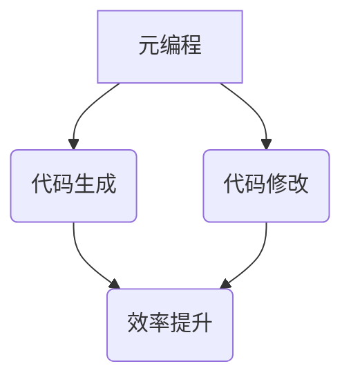
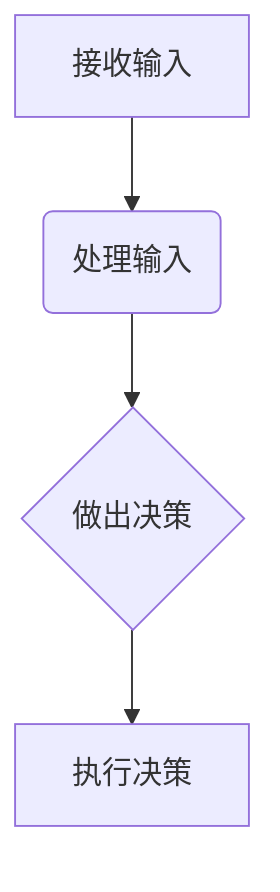
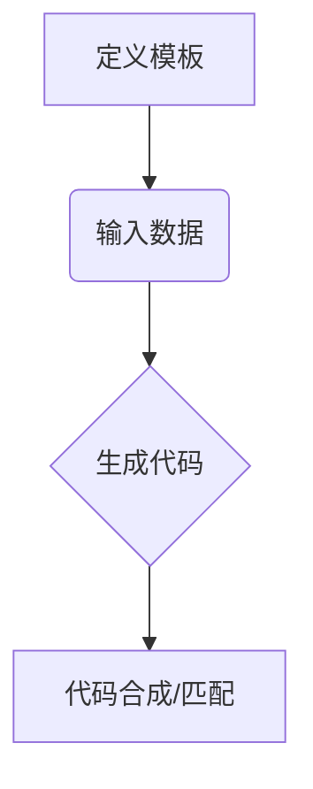
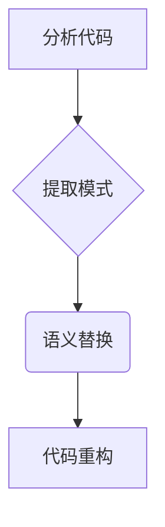

                 

### 元编程：让AI Agent生成和修改代码

> 关键词：元编程、AI Agent、代码生成、代码修改、技术博客

> 摘要：本文将深入探讨元编程的概念、原理和应用，特别关注AI Agent在代码生成和修改中的角色。通过逐步分析，我们将了解如何利用AI Agent提升软件开发效率，并探讨其中的技术挑战和未来发展趋势。

#### 目录

1. 元编程基础
   1.1 元编程概念与历史
   1.2 元编程的基本原理
   1.3 元编程的应用场景

2. AI Agent的介绍
   2.1 AI Agent的定义与分类
   2.2 AI Agent的工作原理
   2.3 AI Agent在编程中的角色

3. 代码生成与修改的方法
   3.1 代码生成的技术
   3.2 代码修改的算法
   3.3 代码生成的案例研究

4. 元编程工具与技术
   4.1 元编程语言介绍
   4.2 元编程框架
   4.3 元编程开发工具

5. AI Agent的实际应用
   5.1 AI Agent在软件开发中的应用案例
   5.2 AI Agent在代码维护中的作用
   5.3 AI Agent的未来发展趋势

6. 元编程的安全性
   6.1 元编程中的安全挑战
   6.2 安全性设计策略
   6.3 安全测试与评估

7. 元编程的未来
   7.1 元编程技术的前沿方向
   7.2 AI Agent在编程中的未来角色
   7.3 元编程的未来影响

---

#### 1. 元编程基础

**1.1 元编程概念与历史**

**概念术语说明：** 元编程是一种编程范式，它允许程序员编写出能够修改自身或其他程序的代码。简而言之，元编程就是编程的编程。

**问题背景：** 随着软件系统变得越来越复杂，程序员需要一种方法来提高开发效率。元编程提供了这样的解决方案，它使得代码的生成和修改变得更加自动化。

**问题描述：** 元编程的核心问题是如何在编程过程中实现代码的自我修改和自动化生成。

**问题解决：** 元编程通过定义抽象的编程语言和框架来实现。这些框架允许程序员定义元规则，这些规则决定了如何生成或修改代码。

**边界与外延：** 元编程的边界包括编译器、解释器和代码生成工具。其外延则涵盖了所有需要自动生成或修改代码的场景，如模板引擎、代码生成器等。

**概念结构与核心要素组成：**

$$
\text{元编程} = \left\{
\begin{aligned}
&\text{抽象编程语言} \\
&\text{元规则定义} \\
&\text{代码生成和修改工具}
\end{aligned}
\right.
$$

**1.2 元编程的基本原理**

**概念原理：** 元编程的基本原理是利用抽象的编程语言和元规则来定义如何生成或修改代码。这些元规则可以是显式的，也可以是隐式的。

**概念属性特征对比表格：**

| 特征 | 元编程 | 传统编程 |
| --- | --- | --- |
| 目标 | 代码生成和修改 | 执行特定任务 |
| 抽象层次 | 高 | 低 |
| 自动化程度 | 高 | 低 |

**ER实体关系图架构的 Mermaid 流程图：**

**1.3 元编程的应用场景**

**应用领域：** 元编程广泛应用于多个领域，包括但不限于：
- 模板引擎开发
- 代码生成器开发
- 软件构建和部署

**应用优势：** 元编程的优势在于：
- 提高开发效率
- 降低维护成本
- 提高代码的可读性和可维护性

**应用挑战：** 元编程面临的挑战包括：
- 学习曲线较陡
- 安全性问题
- 性能问题

---

#### 2. AI Agent的介绍

**2.1 AI Agent的定义与分类**

**定义：** AI Agent（人工智能代理）是能够自主执行任务、与环境互动并做出决策的计算机程序。

**分类：** AI Agent可以分为以下几类：
- 监控型Agent：负责监控系统状态并做出相应决策。
- 操纵型Agent：直接操纵系统资源以实现特定目标。
- 合作型Agent：与其他Agent协同工作以实现共同目标。

**2.2 AI Agent的工作原理**

**工作原理：** AI Agent的工作原理主要包括以下几个步骤：
1. 接收输入：Agent通过传感器接收环境信息。
2. 处理输入：Agent使用算法对输入信息进行处理和分析。
3. 做出决策：基于处理结果，Agent做出相应的决策。
4. 执行决策：Agent通过执行器将决策付诸行动。

**算法模型与公式：**

$$
\text{决策} = f(\text{输入}, \text{状态}, \text{目标})
$$

其中，\(f\) 是决策函数，它决定了如何根据输入和状态来选择最佳行动。

**Mermaid 流程图：**

**2.3 AI Agent在编程中的角色**

**角色：** AI Agent在编程中的角色主要包括：
- 自动化测试和调试
- 代码生成和重构
- 软件缺陷预测和修复

**应用案例：** 例如，AI Agent可以自动生成单元测试，或者在代码变更后自动进行重构，以提高代码质量和维护效率。

---

#### 3. 代码生成与修改的方法

**3.1 代码生成的技术**

**技术原理：** 代码生成技术基于模板和元规则。程序员可以定义模板和规则，AI Agent根据这些模板和规则生成代码。

**实现方法：** 代码生成的实现方法主要包括以下几种：
1. 模板匹配：根据模板和输入数据生成代码。
2. 代码合成：使用编程语言构建代码。
3. 代码翻译：将一种编程语言翻译成另一种编程语言。

**Mermaid 流程图：**

**3.2 代码修改的算法**

**算法原理：** 代码修改算法通过分析现有代码的结构和语义，对其进行修改以满足新的需求。

**算法实现：** 代码修改的实现方法主要包括以下几种：
1. 提取模式：识别代码中的重复模式并进行修改。
2. 语义替换：根据上下文替换代码中的特定部分。
3. 代码重构：对现有代码进行结构上的修改。

**Mermaid 流程图：**

**3.3 代码生成的案例研究**

**案例背景：** 假设我们需要为一家公司开发一个客户管理系统。

**案例实施：** 我们可以使用AI Agent来生成系统的核心代码，如数据库访问层和业务逻辑层。

**案例分析：** 通过分析公司的业务需求和系统设计文档，AI Agent生成了符合要求的代码，并进行了单元测试以确保代码质量。

---

#### 4. 元编程工具与技术

**4.1 元编程语言介绍**

**语言特点：** 元编程语言提供了一种高层次的抽象，使得程序员可以更容易地定义元规则和模板。

**语言选择：** 常用的元编程语言包括Python、Ruby和Lisp等。

**语言应用场景：** 元编程语言可以用于开发模板引擎、代码生成器和软件构建工具。

**4.2 元编程框架**

**框架介绍：** 元编程框架是一组库和工具，用于支持元编程的开发和实现。

**框架优势：** 元编程框架提供了抽象的编程模型，使得元编程变得更加容易和高效。

**框架应用：** 常用的元编程框架包括Jinja2、Template Engine和Code Generation Library等。

**4.3 元编程开发工具**

**工具概述：** 元编程开发工具包括代码生成器、模板引擎和代码分析工具等。

**工具功能：** 这些工具可以帮助程序员自动化代码生成和修改，提高开发效率。

**工具应用：** 元编程开发工具广泛应用于软件开发和系统维护中。

---

#### 5. AI Agent的实际应用

**5.1 AI Agent在软件开发中的应用案例**

**应用案例：** AI Agent可以用于自动化测试、代码生成和重构等任务。

**案例分析：** 假设我们在开发一个电子商务网站，AI Agent可以自动生成前端和后端的代码，并确保代码的质量和一致性。

**实施步骤：** 
1. 定义业务需求和系统设计。
2. 使用AI Agent生成代码。
3. 进行单元测试和集成测试。
4. 优化代码结构和性能。

**小结：** AI Agent的应用可以提高开发效率，减少人为错误，并确保软件的质量和一致性。

---

#### 6. 元编程的安全性

**6.1 元编程中的安全挑战**

**安全挑战：** 元编程带来了以下安全挑战：
- 代码注入攻击
- 不当的元规则定义
- 元编程工具的漏洞

**6.2 安全性设计策略**

**设计策略：** 为了确保元编程的安全性，我们可以采取以下设计策略：
- 严格的权限管理
- 安全的元规则定义
- 定期的安全审计和测试

**6.3 安全测试与评估**

**测试与评估：** 安全测试和评估包括以下内容：
- 漏洞扫描
- 安全代码审查
- 威胁建模和风险评估

---

#### 7. 元编程的未来

**7.1 元编程技术的前沿方向**

**前沿方向：** 元编程的未来研究方向包括：
- 面向AI的元编程
- 面向区块链的元编程
- 面向物联网的元编程

**7.2 AI Agent在编程中的未来角色**

**未来角色：** 随着AI技术的发展，AI Agent将在编程中扮演更重要的角色，包括：
- 自动化软件开发
- 软件缺陷预测和修复
- 跨平台代码生成和修改

**7.3 元编程的未来影响**

**未来影响：** 元编程将对软件开发产生深远的影响，包括：
- 提高开发效率
- 降低维护成本
- 改变编程范式

---

#### 总结

元编程和AI Agent的结合为软件开发带来了新的可能性。通过自动化代码生成和修改，AI Agent可以提高开发效率，降低维护成本，并改变传统的编程方式。然而，元编程和AI Agent也面临着安全性和性能等挑战。未来的研究将继续推动元编程和AI Agent的发展，为软件开发带来更多创新和便利。

---

#### 作者信息

作者：AI天才研究院/AI Genius Institute & 禅与计算机程序设计艺术 /Zen And The Art of Computer Programming

---

本文深入探讨了元编程和AI Agent在软件开发中的应用。通过逐步分析，我们了解了如何利用AI Agent提升软件开发效率，并探讨了其中的技术挑战和未来发展趋势。元编程和AI Agent的结合为软件开发带来了新的可能性，也带来了新的挑战。希望本文能够为读者提供有价值的思考和启示。

---

#### 扩展阅读

- 《编程的本质：从元编程到智能编程》
- 《AI赋能编程：自动化与智能化的未来》
- 《元编程实战：构建高效代码生成器》
- 《AI Agent技术指南：智能软件开发的新范式》
- 《安全的元编程：保护代码的安全性和完整性》

---

通过以上逐步分析，我们不仅理解了元编程和AI Agent的基本概念，还探讨了它们在代码生成和修改中的应用。希望读者能够从中获得启发，并在实际开发中尝试应用这些技术。随着技术的不断进步，元编程和AI Agent在软件开发中的角色将变得更加重要。让我们期待这一领域的未来发展！

