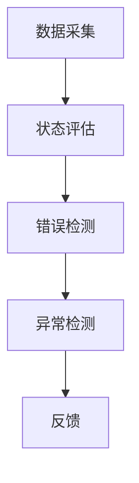
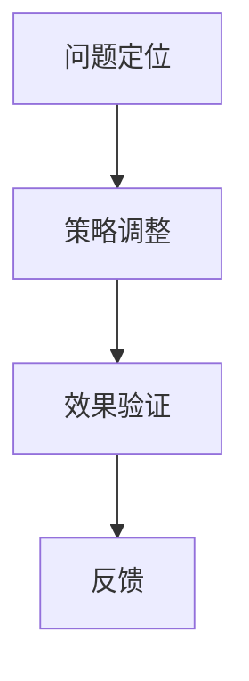
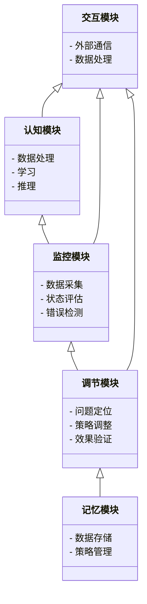
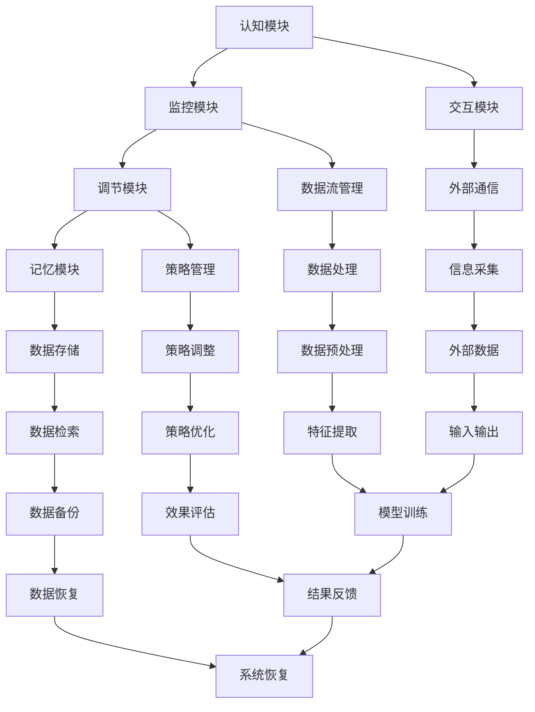
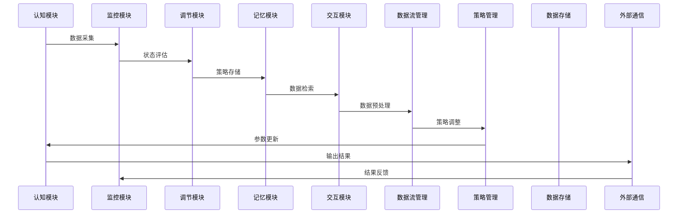
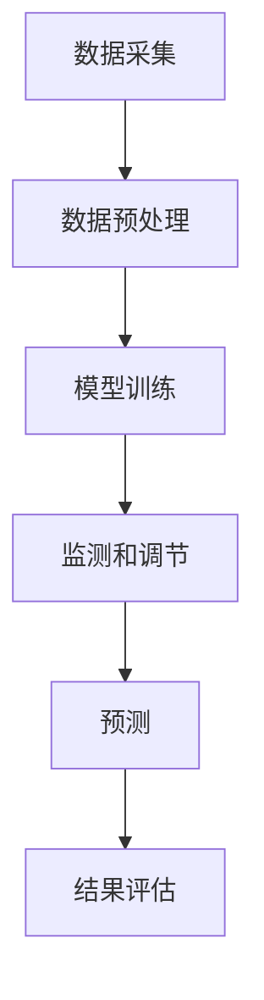
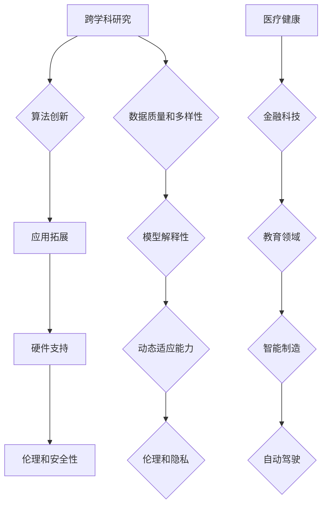
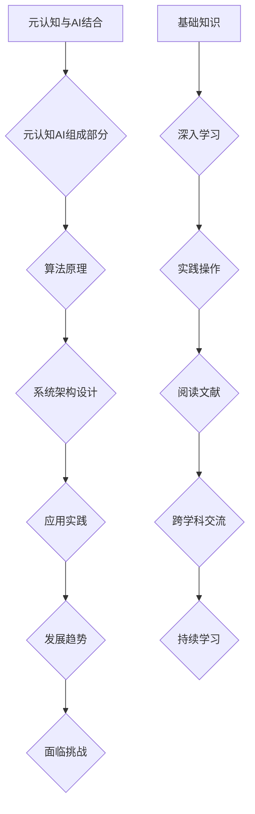

                 

### 元认知AI Agent：具备自我监控和调节能力

在人工智能（AI）不断进化的今天，我们逐渐认识到，单纯依赖传统的AI系统已无法满足复杂的、动态变化的应用需求。为了提升AI系统的智能水平和适应能力，我们需要引入一种全新的AI架构——元认知AI Agent。元认知AI Agent不仅能够像传统AI一样进行预测和决策，更重要的是，它具备自我监控和调节能力，能够根据外部环境的变化和内部执行状态进行自适应调整。本文将深入探讨元认知AI Agent的概念、技术原理、架构设计及其应用实践。

本文将分为以下几个部分：

1. **元认知与AI概述**：介绍元认知的基本概念和其在人类认知过程中的作用，解释AI与元认知之间的关系。
2. **元认知AI的基础**：定义元认知AI，分析其核心组成部分和与传统AI的区别。
3. **元认知AI的技术原理**：探讨元认知AI的算法原理和数学模型，通过mermaid流程图和Python代码进行详细阐述。
4. **元认知AI的架构设计**：介绍元认知AI的系统功能、系统架构和系统接口设计。
5. **元认知AI的应用实践**：展示元认知AI在自然语言处理和机器学习中的具体应用。
6. **元认知AI的发展趋势与挑战**：讨论元认知AI的发展方向、面临的挑战及其解决思路。
7. **总结与展望**：对元认知AI进行总结，展望其未来发展，并提出对读者的建议。

通过本文的逐步分析，我们希望读者能够全面了解元认知AI Agent的内涵和外延，掌握其技术原理和应用实践，为未来的AI研发提供新的思路和方向。

---

**关键词**：元认知、AI、自我监控、调节能力、算法原理、架构设计、应用实践

**摘要**：本文深入探讨了元认知AI Agent的概念、技术原理、架构设计及其应用实践。元认知AI Agent具备自我监控和调节能力，能够根据外部环境和内部状态进行自适应调整，显著提升了AI系统的智能水平和适应能力。通过详细的分析和实例，本文展示了元认知AI Agent在现代人工智能领域的广泛应用前景。

---

## 第1章: 元认知与AI简介

### 1.1 元认知的概念与重要性

元认知（Metacognition）是一个高度抽象的概念，指的是人们关于自己认知过程的知识和调节能力。它包括两个方面：元认知知识（关于自己认知的知识）和元认知控制（对自己认知过程的调节）。在人类认知过程中，元认知发挥着至关重要的作用。通过元认知，人类能够反思自己的思考过程，识别错误和不足，从而进行有效的调整和优化。

**元认知知识**指的是个体对于自己认知能力的理解和认识，包括对于自身记忆、注意、思维和判断等认知过程的认知。例如，一个人可能会意识到自己在某方面的记忆能力较弱，因此会采用特定的记忆策略来提高记忆效果。

**元认知控制**则是指个体在实际认知活动中对认知过程进行的管理和控制。例如，在学习过程中，一个人可能会根据学习效果调整学习方法，或者意识到自己的注意力不集中，从而采取措施提高注意力。

在人类的认知过程中，元认知具有以下几个重要功能：

1. **监控和评估**：元认知使我们能够实时监控自己的认知过程，评估认知活动的效果，从而及时发现并纠正错误。
2. **调节和优化**：通过元认知，个体可以调整认知策略，优化认知过程，提高学习效率和认知质量。
3. **学习和成长**：元认知使我们能够从经验中学习，通过反思和调整认知过程，不断提高自己的认知水平。

### 1.2 元认知在人类认知过程中的作用

元认知在人类认知过程中扮演着重要的角色。以下是元认知在几个关键认知活动中的作用：

1. **学习**：在学习过程中，元认知帮助我们识别学习中的困难，选择合适的学习策略，并进行自我调整。例如，一个学生可能会发现自己难以理解某个数学概念，从而采取更多的例题练习或者寻求教师的帮助。
2. **记忆**：元认知使我们能够对自己的记忆过程进行监控和评估，选择有效的记忆策略，例如分散记忆和重复练习。
3. **问题解决**：在问题解决过程中，元认知帮助我们识别问题的核心，选择合适的解决策略，并在解决问题的过程中进行调整和优化。
4. **决策**：在决策过程中，元认知使我们能够评估不同的决策选项，预测决策结果，并基于评估结果进行决策。

### 1.3 AI与元认知的关系

人工智能（AI）作为计算机科学的一个分支，旨在使计算机具备类似人类智能的能力。在AI领域，元认知的概念也得到了广泛的研究和应用。AI与元认知之间的关系可以从以下几个方面理解：

1. **元认知在AI中的应用**：传统的AI系统往往缺乏自我监控和调节能力，而元认知技术的引入，使得AI系统可以对自己的认知过程进行监控和评估，从而实现自适应调整。例如，在机器学习中，元认知AI可以通过评估学习过程的效果，调整学习策略，优化模型性能。

2. **元认知AI的定义**：元认知AI（Metacognitive AI）是指具备自我监控和调节能力的AI系统。这种系统不仅能够像传统AI一样进行预测和决策，还能够根据外部环境和内部状态进行自适应调整，提升AI系统的智能水平和适应能力。

3. **元认知AI的优势**：与传统的AI系统相比，元认知AI具有以下几个优势：
   - **自适应能力**：元认知AI可以根据外部环境的变化和内部执行状态进行自适应调整，提高系统的适应能力。
   - **智能水平提升**：通过自我监控和调节，元认知AI能够优化认知过程，提高学习效率和决策质量。
   - **解决复杂问题**：元认知AI能够识别问题的核心，选择合适的解决策略，并在解决问题的过程中进行调整和优化，从而解决更为复杂的问题。

通过以上对元认知和AI的介绍，我们可以看到，元认知在人类认知过程中具有重要作用，而将其引入AI领域，不仅能够提升AI系统的智能水平和适应能力，还为解决复杂问题提供了新的思路。接下来，我们将进一步探讨元认知AI的基础和特点。

---

**核心概念与联系**

**元认知的概念**：
- 元认知知识：个体对自己认知能力的理解和认识，包括对记忆、注意、思维和判断等认知过程的认知。
- 元认知控制：个体在实际认知活动中对认知过程进行的管理和控制。

**元认知在人类认知过程中的作用**：
- 监控和评估：实时监控自己的认知过程，评估认知活动的效果。
- 调节和优化：选择合适的学习策略，优化认知过程。
- 学习和成长：从经验中学习，提高认知水平。

**AI与元认知的关系**：
- 元认知在AI中的应用：引入元认知技术，使AI系统能够自我监控和调节。
- 元认知AI的定义：具备自我监控和调节能力的AI系统。
- 元认知AI的优势：自适应能力、智能水平提升、解决复杂问题。

---

**ER实体关系图架构的 Mermaid 流程图**：

```mermaid
entityRelationShi
  entity "人类认知"
    "元认知知识"
    "元认知控制"
  
  entity "AI"
    "预测和决策"
    "自我监控和调节"
  
  relation "关系" 
    "人类认知" -> "元认知知识"
    "人类认知" -> "元认知控制"
    "AI" -> "预测和决策"
    "AI" -> "自我监控和调节"
```

---

## 第2章: 元认知AI的基础

### 2.1 元认知AI的定义与特点

元认知AI（Metacognitive AI）是指具备自我监控和调节能力的AI系统。与传统的AI系统相比，元认知AI不仅能够进行预测和决策，还能够根据外部环境和内部状态进行自适应调整，以优化其性能和行为。元认知AI的核心特点包括：

1. **自我监控**：元认知AI能够实时监控自己的认知过程，包括学习、推理和决策等，识别过程中的错误和不足。
2. **自我调节**：基于监控结果，元认知AI能够调整其内部参数和策略，优化认知过程，提高系统的适应能力和智能水平。
3. **动态适应**：元认知AI能够根据外部环境的变化和内部状态的变化，动态调整其行为和策略，以应对复杂和多变的应用场景。

元认知AI的这些特点使其在复杂和动态环境下具备更高的智能水平和适应能力，能够更好地满足实际应用需求。

### 2.2 元认知AI的核心组成部分

元认知AI由以下几个核心组成部分构成：

1. **认知模块**：负责执行具体的认知任务，如学习、推理和决策等。该模块通常基于深度学习、强化学习或其他先进的人工智能技术。
2. **监控模块**：负责实时监控认知模块的执行过程，识别错误和不足，提供反馈。
3. **调节模块**：基于监控模块的反馈，调整认知模块的参数和策略，优化认知过程。
4. **记忆模块**：存储监控模块和调节模块的决策经验和策略，以便后续的调整和优化。
5. **交互模块**：负责与外部环境进行交互，获取外部信息，并根据这些信息调整认知模块的行为。

这些组成部分共同协作，使元认知AI能够实现自我监控和调节，从而在复杂和动态环境下保持高性能和稳定性。

### 2.3 元认知AI与传统AI的区别

传统AI系统通常不具备自我监控和调节能力，主要依赖于预先设定好的规则和算法进行预测和决策。而元认知AI则通过引入元认知技术，实现了对自身认知过程的监控和调节，具有以下几个显著区别：

1. **自适应能力**：传统AI系统在面对复杂和动态环境时，往往难以适应，而元认知AI通过自我监控和调节，能够根据外部环境和内部状态的变化，动态调整其行为和策略，具备更高的自适应能力。
2. **智能水平**：传统AI系统在特定任务上表现出色，但缺乏泛化能力，而元认知AI通过自我监控和调节，能够优化认知过程，提高智能水平和泛化能力，从而在更广泛的场景中发挥作用。
3. **鲁棒性**：传统AI系统在面对异常情况时，往往表现不佳，而元认知AI通过自我监控和调节，能够在异常情况下进行有效的调整和优化，提高系统的鲁棒性。

总的来说，元认知AI在自我监控和调节能力方面具有显著优势，使其在复杂和动态环境下具备更高的智能水平和适应能力，为解决复杂问题提供了新的思路和途径。

---

**核心概念与联系**

**元认知AI的定义**：具备自我监控和调节能力的AI系统。

**元认知AI的核心组成部分**：
- 认知模块：执行具体的认知任务。
- 监控模块：实时监控认知过程，识别错误和不足。
- 调节模块：基于监控结果，调整认知模块的参数和策略。
- 记忆模块：存储监控模块和调节模块的决策经验和策略。
- 交互模块：与外部环境交互，获取外部信息。

**元认知AI与传统AI的区别**：
- 自适应能力：元认知AI具备动态适应能力，传统AI难以适应复杂和动态环境。
- 智能水平：元认知AI通过自我监控和调节，提高智能水平和泛化能力。
- 鲁棒性：元认知AI在异常情况下能够进行有效的调整和优化。

---

**ER实体关系图架构的 Mermaid 流程图**：

```mermaid
entityRelationShi
  entity "元认知AI"
    "认知模块"
    "监控模块"
    "调节模块"
    "记忆模块"
    "交互模块"
  
  relation "关系"
    "元认知AI" -> "认知模块"
    "元认知AI" -> "监控模块"
    "元认知AI" -> "调节模块"
    "元认知AI" -> "记忆模块"
    "元认知AI" -> "交互模块"
```

---

## 第3章: 元认知AI的技术原理

### 3.1 元认知AI的算法原理

元认知AI的算法原理是其核心组成部分之一，它决定了AI系统能否实现自我监控和调节。元认知AI的算法通常包括两个主要部分：监测算法和调节算法。

#### 3.1.1 监测算法

监测算法是元认知AI的核心，它负责实时监控AI系统的认知过程。具体来说，监测算法通过以下几个步骤来实现：

1. **数据采集**：从AI系统的各个模块（如学习模块、推理模块等）收集运行数据，包括输入数据、输出结果、计算中间过程等。
2. **状态评估**：基于收集到的数据，对AI系统的运行状态进行评估。状态评估可以通过多种方式实现，例如：
   - **性能评估**：评估AI系统的性能指标，如准确率、召回率、F1分数等。
   - **错误检测**：检测AI系统在处理过程中出现的错误，如异常值、过拟合等。
   - **资源消耗评估**：评估AI系统的资源消耗，如CPU使用率、内存占用等。
3. **异常检测**：基于状态评估结果，识别系统的异常情况，如计算错误、性能下降等。

以下是一个简单的mermaid流程图，展示了监测算法的基本流程：



#### 3.1.2 调节算法

一旦监测算法识别出系统的异常情况，调节算法将基于这些信息进行系统参数的调整，以优化系统的性能。调节算法通常包括以下几个步骤：

1. **问题定位**：根据异常检测结果，定位异常发生的位置，例如：
   - **算法错误**：识别出计算错误或逻辑错误的具体位置。
   - **数据问题**：识别出导致异常的数据或特征。
   - **资源限制**：识别出系统资源不足的具体表现。
2. **策略调整**：基于问题定位的结果，调整系统参数或策略。策略调整可以包括：
   - **参数调整**：调整AI系统的超参数，如学习率、正则化参数等。
   - **算法调整**：更换或优化AI系统的主要算法，如从单一算法切换到混合算法。
   - **数据预处理**：调整数据预处理策略，如特征选择、数据标准化等。
   - **资源优化**：调整系统资源分配策略，如调整内存管理、优化并行计算等。
3. **效果验证**：调整后，重新进行状态评估，验证调节效果。如果效果不理想，则需要进一步调整。

以下是一个简单的mermaid流程图，展示了调节算法的基本流程：



#### 3.1.3 Python代码示例

为了更好地理解元认知AI的算法原理，我们通过一个简单的Python代码示例进行说明。以下代码实现了一个基本的监测和调节算法：

```python
import numpy as np

# 假设我们有一个简单的学习任务
# 学习目标是找到一个最优的权重w，使得预测结果与真实值y之间的误差最小

def predict(w, x):
    return w * x

def loss(w, x, y):
    return (predict(w, x) - y) ** 2

def monitor(w, x, y):
    # 数据采集
    predicted = predict(w, x)
    error = loss(w, x, y)
    
    # 状态评估
    if error > 0.01:
        print("监测到异常：误差过大")
    else:
        print("监测到正常：误差在可接受范围内")
    
    # 错误检测
    if error > 0.01:
        return True
    else:
        return False

def regulate(w, x, y):
    # 问题定位
    if monitor(w, x, y):
        # 策略调整
        w = w - 0.1  # 调整权重
    # 效果验证
    if monitor(w, x, y):
        print("调节后仍存在异常，需进一步调整")
    else:
        print("调节成功，误差在可接受范围内")
    return w

# 初始权重
w = 1.0
x = 2.0
y = 1.0

# 进行10次调节
for i in range(10):
    w = regulate(w, x, y)
    print(f"第{i+1}次调节后权重：{w}")
```

通过这个简单的示例，我们可以看到如何通过监测和调节算法来优化AI系统的性能。

### 3.2 元认知AI的数学模型与公式

元认知AI的数学模型为其提供了理论基础，这些模型帮助理解AI系统的运行机制和调节策略。以下是两个典型的数学模型及其详细讲解。

#### 3.2.1 数学模型1：损失函数

损失函数是机器学习中的一个核心概念，它用于评估模型预测结果与真实值之间的差距。在元认知AI中，损失函数不仅用于评估模型性能，还用于指导调节算法的参数调整。

**公式**：
\[ L(w, x, y) = (w \cdot x - y)^2 \]

**详细讲解**：
- \( w \)：模型的权重。
- \( x \)：输入特征。
- \( y \)：真实值。

这个损失函数表示模型预测结果与真实值之间的平方误差。在调节算法中，可以通过最小化损失函数来优化模型参数。

#### 3.2.2 数学模型2：梯度下降算法

梯度下降算法是一种常用的优化方法，用于调整模型参数，以最小化损失函数。在元认知AI中，梯度下降算法可以帮助调节模块找到最优参数。

**公式**：
\[ \Delta w = -\alpha \cdot \nabla L(w, x, y) \]

**详细讲解**：
- \( \Delta w \)：参数更新。
- \( \alpha \)：学习率，用于控制参数更新的幅度。
- \( \nabla L(w, x, y) \)：损失函数关于权重 \( w \) 的梯度。

这个公式表示通过计算损失函数的梯度，并根据梯度的方向和幅度来更新模型参数。在调节算法中，可以通过调整学习率 \( \alpha \) 来控制参数更新的速度和幅度。

### 3.2.3 通俗易懂的举例说明

为了更好地理解上述数学模型，我们通过一个简单的例子来说明。

**例子**：假设我们有一个线性回归模型，目标是找到权重 \( w \)，使得预测值与真实值之间的误差最小。

1. **损失函数**：
   设输入特征 \( x = 2 \)，真实值 \( y = 1 \)，初始权重 \( w = 1 \)。

   \[ L(w, x, y) = (w \cdot x - y)^2 = (1 \cdot 2 - 1)^2 = 1 \]

   损失函数的值为1。

2. **梯度下降算法**：
   假设学习率 \( \alpha = 0.1 \)。

   \[ \nabla L(w, x, y) = \frac{\partial L}{\partial w} = 2 \cdot (w \cdot x - y) \cdot x = 2 \cdot (1 \cdot 2 - 1) \cdot 2 = 4 \]

   梯度的值为4。

   根据梯度下降算法，参数更新为：

   \[ \Delta w = -\alpha \cdot \nabla L(w, x, y) = -0.1 \cdot 4 = -0.4 \]

   新的权重 \( w \) 为：

   \[ w = w + \Delta w = 1 - 0.4 = 0.6 \]

   更新后的损失函数值为：

   \[ L(w, x, y) = (0.6 \cdot 2 - 1)^2 = 0.16 \]

   损失函数的值下降到0.16。

通过这个例子，我们可以看到如何通过损失函数和梯度下降算法来优化模型参数，实现误差的最小化。

---

**核心概念与联系**

**元认知AI的算法原理**：
- 监测算法：实时监控AI系统的认知过程，识别错误和不足。
- 调节算法：基于监测结果，调整系统参数和策略，优化认知过程。

**Python代码示例**：
- 数据采集、状态评估、错误检测和调节策略的简单实现。

**数学模型**：
- 损失函数：评估模型预测结果与真实值之间的差距。
- 梯度下降算法：通过计算损失函数的梯度，更新模型参数。

**通俗易懂的举例说明**：
- 通过线性回归模型，展示损失函数和梯度下降算法的实际应用。

---

**ER实体关系图架构的 Mermaid 流程图**：

```mermaid
entityRelationShi
  entity "元认知AI算法原理"
    "监测算法"
    "调节算法"
  
  entity "数学模型"
    "损失函数"
    "梯度下降算法"
  
  relation "关系"
    "元认知AI算法原理" -> "监测算法"
    "元认知AI算法原理" -> "调节算法"
    "数学模型" -> "损失函数"
    "数学模型" -> "梯度下降算法"
```

---

## 第4章: 元认知AI的架构设计

### 4.1 元认知AI的系统功能设计

元认知AI系统功能的设计是确保系统能够有效执行自我监控和调节的关键。系统功能的设计需要综合考虑AI任务的多样性、外部环境的变化和内部状态的动态调整。以下是元认知AI系统的主要功能模块及其设计思路：

1. **认知模块**：负责执行具体的认知任务，如学习、推理和决策等。该模块应具备灵活的扩展性，能够适应不同的应用场景。
2. **监控模块**：实时监控AI系统的认知过程，识别错误和不足。监控模块应具备高效的错误检测和异常识别能力，确保系统能够及时发现问题。
3. **调节模块**：基于监控模块的反馈，调整AI系统的参数和策略。调节模块需要具备强大的适应能力，能够根据外部环境和内部状态的变化进行动态调整。
4. **记忆模块**：存储监控模块和调节模块的决策经验和策略。记忆模块应具备高效的数据存储和管理能力，以便后续的调整和优化。
5. **交互模块**：负责与外部环境进行交互，获取外部信息，并根据这些信息调整认知模块的行为。交互模块需要具备良好的通信能力和数据处理能力，确保系统能够实时获取并利用外部信息。

#### 4.1.1 领域模型Mermaid类图

为了更直观地展示元认知AI系统的功能设计，我们可以使用Mermaid类图进行描述。以下是一个简化的领域模型类图：



在这个类图中，我们可以看到各个模块之间的关系及其功能分工。认知模块负责执行任务，监控模块负责实时监控，调节模块负责调整策略，记忆模块负责存储经验，交互模块负责外部通信。

### 4.2 元认知AI的系统架构设计

元认知AI的系统架构设计需要确保系统的高效性、稳定性和扩展性。以下是元认知AI系统的主要架构设计要点：

1. **模块化设计**：将系统划分为多个功能模块，每个模块独立开发、测试和部署，确保系统的灵活性和可维护性。
2. **分布式架构**：采用分布式架构，将不同的模块分布在不同的节点上，提高系统的并行处理能力和容错能力。
3. **数据流设计**：设计合理的数据流，确保数据在各模块之间的高效传递和利用。数据流设计应考虑数据的一致性、可靠性和实时性。
4. **通信机制**：设计高效的通信机制，确保模块之间的数据交换和协同工作。通信机制应具备低延迟、高带宽和高可靠性。
5. **安全机制**：设计完善的安全机制，确保系统的数据和隐私安全。安全机制应包括数据加密、访问控制和异常检测等。

#### 4.2.1 系统架构Mermaid架构图

为了更直观地展示元认知AI的系统架构设计，我们可以使用Mermaid架构图进行描述。以下是一个简化的系统架构图：



在这个架构图中，我们可以看到各个模块之间的交互关系和数据流。认知模块、监控模块、调节模块和记忆模块负责核心功能，交互模块负责外部通信和数据流管理，数据流和通信机制确保各模块之间的协同工作。

### 4.3 元认知AI的系统接口设计

元认知AI的系统接口设计是确保系统与其他系统或组件进行有效交互的重要环节。接口设计需要考虑以下几个方面：

1. **API设计**：设计简洁、易用的API接口，确保不同模块之间的数据交换和协同工作。
2. **协议选择**：选择合适的通信协议，如HTTP、TCP/IP等，确保数据传输的高效性和可靠性。
3. **安全性**：设计安全接口，确保数据在传输过程中不被窃取或篡改。安全措施包括数据加密、认证和访问控制等。
4. **扩展性**：设计扩展性接口，方便未来系统的升级和扩展。

#### 4.3.1 系统接口Mermaid序列图

为了更直观地展示元认知AI的系统接口设计，我们可以使用Mermaid序列图进行描述。以下是一个简化的系统接口序列图：



在这个序列图中，我们可以看到各模块之间的数据流和交互过程。认知模块、监控模块、调节模块和记忆模块负责核心功能，交互模块负责外部通信和数据流管理，数据流和通信机制确保各模块之间的协同工作。

---

**核心概念与联系**

**元认知AI的系统功能设计**：
- 认知模块：执行认知任务。
- 监控模块：实时监控认知过程。
- 调节模块：基于监控结果调整策略。
- 记忆模块：存储决策经验和策略。
- 交互模块：与外部环境进行交互。

**领域模型Mermaid类图**：
- 展示各模块及其关系。

**元认知AI的系统架构设计**：
- 模块化设计：确保系统的灵活性和可维护性。
- 分布式架构：提高系统的并行处理能力和容错能力。
- 数据流设计：确保数据在各模块之间的高效传递和利用。
- 通信机制：确保模块之间的数据交换和协同工作。

**系统架构Mermaid架构图**：
- 展示各模块之间的关系和数据流。

**元认知AI的系统接口设计**：
- API设计：设计简洁、易用的API接口。
- 协议选择：选择合适的通信协议。
- 安全性：设计安全接口。
- 扩展性：设计扩展性接口。

**系统接口Mermaid序列图**：
- 展示各模块之间的数据流和交互过程。

---

## 第5章: 元认知AI的应用实践

### 5.1 元认知AI在自然语言处理中的应用

自然语言处理（NLP）是人工智能领域中的一个重要分支，旨在使计算机能够理解和处理人类语言。随着元认知AI技术的发展，元认知AI在NLP中的应用也变得越来越广泛。以下将介绍元认知AI在自然语言处理中的具体应用案例。

#### 5.1.1 应用案例1：文本情感分析

文本情感分析是一种评估文本情感倾向的技术，广泛应用于市场调研、舆情分析和客户服务等领域。传统的文本情感分析模型通常使用预训练的词向量（如Word2Vec、GloVe）和深度学习模型（如卷积神经网络（CNN）、长短期记忆网络（LSTM））进行情感分类。然而，这些模型在面对复杂和动态的语言环境时，往往难以表现出良好的适应性。

元认知AI可以通过自我监控和调节，显著提升文本情感分析的准确性和适应性。以下是一个具体的实施步骤：

1. **数据采集**：收集大量的带有情感标签的文本数据，如社交媒体评论、新闻报道等。
2. **预处理**：对文本数据进行预处理，包括分词、去停用词、词性标注等。
3. **模型训练**：使用预训练的词向量（如GloVe）和深度学习模型（如LSTM）对文本数据进行情感分类训练。
4. **监测**：在训练和预测过程中，实时监控模型的性能指标，如准确率、召回率等。
5. **调节**：基于监测结果，动态调整模型的超参数和训练策略，优化模型性能。
6. **预测**：使用优化后的模型对新的文本数据进行情感分类预测。

以下是一个简单的Python代码实现：

```python
import numpy as np
import pandas as pd
from tensorflow.keras.preprocessing.text import Tokenizer
from tensorflow.keras.preprocessing.sequence import pad_sequences
from tensorflow.keras.models import Sequential
from tensorflow.keras.layers import Embedding, LSTM, Dense
from tensorflow.keras.callbacks import EarlyStopping

# 数据采集
data = pd.read_csv('sentiment_data.csv')
texts = data['text']
labels = data['label']

# 预处理
tokenizer = Tokenizer(num_words=10000)
tokenizer.fit_on_texts(texts)
sequences = tokenizer.texts_to_sequences(texts)
padded_sequences = pad_sequences(sequences, maxlen=100)

# 模型训练
model = Sequential()
model.add(Embedding(10000, 32))
model.add(LSTM(128))
model.add(Dense(1, activation='sigmoid'))

model.compile(optimizer='adam', loss='binary_crossentropy', metrics=['accuracy'])

early_stopping = EarlyStopping(monitor='val_loss', patience=3)

model.fit(padded_sequences, labels, epochs=10, validation_split=0.2, callbacks=[early_stopping])

# 监测
def monitor(model, X_val, y_val):
    scores = model.evaluate(X_val, y_val)
    print(f'Validation accuracy: {scores[1]}')

# 调节
def regulate(model, X_train, y_train, X_val, y_val):
    model.fit(X_train, y_train, epochs=10, validation_data=(X_val, y_val), callbacks=[early_stopping])
    monitor(model, X_val, y_val)

# 预测
def predict(model, text):
    sequence = tokenizer.texts_to_sequences([text])
    padded_sequence = pad_sequences(sequence, maxlen=100)
    return model.predict(padded_sequence)

text = "I am so happy with this product!"
prediction = predict(model, text)
print(f'Prediction: {"Positive" if prediction > 0.5 else "Negative"}')
```

通过这个案例，我们可以看到如何将元认知AI应用于文本情感分析。在训练和预测过程中，元认知AI通过自我监控和调节，优化模型的性能，提高文本情感分析的准确性。

#### 5.1.2 应用案例2：问答系统

问答系统是一种通过自然语言与用户进行交互，回答用户问题的技术。传统的问答系统通常基于规则或模板匹配，而现代问答系统则更多地依赖于深度学习和自然语言处理技术。元认知AI在问答系统中的应用，可以显著提升系统的智能水平和用户体验。

以下是一个具体的实施步骤：

1. **数据采集**：收集大量的问答对数据，如问题-答案对、对话数据等。
2. **预处理**：对问答数据进行预处理，包括分词、词性标注、实体识别等。
3. **模型训练**：使用预训练的词向量（如GloVe）和深度学习模型（如Transformer、BERT）对问答数据进行训练。
4. **监测**：在训练和预测过程中，实时监控模型的性能指标，如准确率、响应时间等。
5. **调节**：基于监测结果，动态调整模型的超参数和训练策略，优化模型性能。
6. **预测**：使用优化后的模型对新的问题进行回答。

以下是一个简单的Python代码实现：

```python
import tensorflow as tf
import tensorflow_hub as hub
import tensorflow_text as text
from transformers import BertTokenizer, BertForQuestionAnswering

# 数据采集
data = pd.read_csv('qa_data.csv')
questions = data['question']
answers = data['answer']

# 预处理
tokenizer = BertTokenizer.from_pretrained('bert-base-uncased')
questions_encoded = tokenizer(questions, padding=True, truncation=True, max_length=512)
answers_encoded = tokenizer(answers, padding=True, truncation=True, max_length=512)

# 模型训练
model = BertForQuestionAnswering.from_pretrained('bert-base-uncased')
model.compile(optimizer=tf.keras.optimizers.Adam(learning_rate=3e-5), loss=model.compute_loss, metrics=['accuracy'])

model.fit([questions_encoded['input_ids'], answers_encoded['input_ids']], answers_encoded['input_mask'], epochs=3)

# 监测
def monitor(model, X_val, y_val):
    scores = model.evaluate([X_val['input_ids'], y_val['input_ids']], y_val['input_mask'])
    print(f'Validation accuracy: {scores[1]}')

# 调节
def regulate(model, X_train, y_train, X_val, y_val):
    model.fit([X_train['input_ids'], y_train['input_ids']], y_train['input_mask'], validation_data=([X_val['input_ids'], y_val['input_ids']], y_val['input_mask']), epochs=3)
    monitor(model, X_val, y_val)

# 预测
def predict(model, question):
    question_encoded = tokenizer(question, padding=True, truncation=True, max_length=512)
    answer_encoded = model.predict([question_encoded['input_ids'], question_encoded['input_mask']])['answer_scores']
    return tokenizer.decode([answer_encoded[0]])

question = "What is the capital of France?"
answer = predict(model, question)
print(f'Answer: {answer}')
```

通过这个案例，我们可以看到如何将元认知AI应用于问答系统。在训练和预测过程中，元认知AI通过自我监控和调节，优化模型的性能，提高问答系统的智能水平和用户体验。

### 5.2 元认知AI在机器学习中的应用

机器学习是人工智能的核心技术之一，广泛应用于图像识别、自然语言处理、推荐系统等领域。元认知AI在机器学习中的应用，可以显著提升模型的性能和稳定性。以下将介绍元认知AI在机器学习中的具体应用案例。

#### 5.2.1 应用案例1：图像分类

图像分类是机器学习中的一个经典问题，广泛应用于人脸识别、自动驾驶和医疗诊断等领域。传统的图像分类模型通常使用卷积神经网络（CNN）进行训练。然而，在面对复杂的图像数据时，这些模型往往难以表现出良好的泛化能力。

元认知AI可以通过自我监控和调节，优化图像分类模型的性能。以下是一个具体的实施步骤：

1. **数据采集**：收集大量的图像数据，包括训练数据和验证数据。
2. **预处理**：对图像数据进行预处理，包括图像增强、数据归一化等。
3. **模型训练**：使用预训练的卷积神经网络（CNN）对图像数据进行训练。
4. **监测**：在训练和预测过程中，实时监控模型的性能指标，如准确率、损失函数值等。
5. **调节**：基于监测结果，动态调整模型的超参数和训练策略，优化模型性能。
6. **预测**：使用优化后的模型对新的图像数据进行分类预测。

以下是一个简单的Python代码实现：

```python
import tensorflow as tf
from tensorflow.keras.applications import VGG16
from tensorflow.keras.preprocessing.image import ImageDataGenerator
from tensorflow.keras.optimizers import Adam
from tensorflow.keras.metrics import categorical_crossentropy
from tensorflow.keras.callbacks import EarlyStopping

# 数据采集
train_data = 'train_data'
val_data = 'val_data'
image_size = (224, 224)

# 预处理
train_datagen = ImageDataGenerator(rescale=1./255, horizontal_flip=True)
val_datagen = ImageDataGenerator(rescale=1./255)

train_generator = train_datagen.flow_from_directory(train_data, target_size=image_size, batch_size=32, class_mode='categorical')
val_generator = val_datagen.flow_from_directory(val_data, target_size=image_size, batch_size=32, class_mode='categorical')

# 模型训练
base_model = VGG16(weights='imagenet', include_top=False, input_shape=(224, 224, 3))
base_model.trainable = False

model = tf.keras.Sequential([
  base_model,
  tf.keras.layers.Flatten(),
  tf.keras.layers.Dense(256, activation='relu'),
  tf.keras.layers.Dense(num_classes, activation='softmax')
])

model.compile(optimizer=Adam(learning_rate=1e-4), loss='categorical_crossentropy', metrics=['accuracy'])

early_stopping = EarlyStopping(monitor='val_loss', patience=3)

model.fit(train_generator, validation_data=val_generator, epochs=10, callbacks=[early_stopping])

# 监测
def monitor(model, X_val, y_val):
    scores = model.evaluate(X_val, y_val, verbose=2)
    print(f'Validation loss: {scores[0]}, Validation accuracy: {scores[1]}')

# 调节
def regulate(model, X_train, y_train, X_val, y_val):
    model.fit(X_train, y_train, validation_data=(X_val, y_val), epochs=10, callbacks=[early_stopping])
    monitor(model, X_val, y_val)

# 预测
def predict(model, image_path):
    image = tf.keras.preprocessing.image.load_img(image_path, target_size=image_size)
    image = tf.keras.preprocessing.image.img_to_array(image)
    image = np.expand_dims(image, axis=0)
    image = np.float32(image)
    image /= 255
    
    predictions = model.predict(image)
    return np.argmax(predictions)

image_path = 'path/to/image'
prediction = predict(model, image_path)
print(f'Predicted class: {prediction}')
```

通过这个案例，我们可以看到如何将元认知AI应用于图像分类。在训练和预测过程中，元认知AI通过自我监控和调节，优化模型的性能，提高图像分类的准确率。

#### 5.2.2 应用案例2：异常检测

异常检测是机器学习中的一个重要应用，旨在识别数据中的异常值或异常模式。传统的异常检测方法通常基于统计方法和规则匹配，而现代方法更多地依赖于深度学习和数据挖掘技术。元认知AI在异常检测中的应用，可以显著提升系统的检测精度和鲁棒性。

以下是一个具体的实施步骤：

1. **数据采集**：收集大量正常和异常的数据样本。
2. **预处理**：对数据进行预处理，包括数据清洗、数据归一化等。
3. **模型训练**：使用深度学习模型（如自编码器、GAN）对正常和异常数据样本进行训练。
4. **监测**：在训练和预测过程中，实时监控模型的性能指标，如准确率、召回率等。
5. **调节**：基于监测结果，动态调整模型的超参数和训练策略，优化模型性能。
6. **预测**：使用优化后的模型对新的数据进行异常检测。

以下是一个简单的Python代码实现：

```python
import tensorflow as tf
from tensorflow.keras.models import Model
from tensorflow.keras.layers import Input, Dense, Conv2D, MaxPooling2D, Flatten, Dropout
from tensorflow.keras.optimizers import Adam
from sklearn.model_selection import train_test_split

# 数据采集
data = pd.read_csv('anomaly_detection_data.csv')
X = data.drop(['label'], axis=1).values
y = data['label'].values

# 预处理
X_train, X_val, y_train, y_val = train_test_split(X, y, test_size=0.2, random_state=42)

# 模型训练
input_shape = X_train.shape[1:]
inputs = Input(shape=input_shape)

x = Conv2D(32, (3, 3), activation='relu')(inputs)
x = MaxPooling2D((2, 2))(x)
x = Dropout(0.2)(x)

x = Conv2D(64, (3, 3), activation='relu')(x)
x = MaxPooling2D((2, 2))(x)
x = Dropout(0.3)(x)

x = Flatten()(x)
x = Dense(128, activation='relu')(x)
outputs = Dense(1, activation='sigmoid')(x)

model = Model(inputs=inputs, outputs=outputs)
model.compile(optimizer=Adam(learning_rate=1e-4), loss='binary_crossentropy', metrics=['accuracy'])

model.fit(X_train, y_train, validation_data=(X_val, y_val), epochs=10)

# 监测
def monitor(model, X_val, y_val):
    scores = model.evaluate(X_val, y_val, verbose=2)
    print(f'Validation loss: {scores[0]}, Validation accuracy: {scores[1]}')

# 调节
def regulate(model, X_train, y_train, X_val, y_val):
    model.fit(X_train, y_train, validation_data=(X_val, y_val), epochs=10, callbacks=[early_stopping])
    monitor(model, X_val, y_val)

# 预测
def predict(model, X_new):
    return model.predict(X_new) > 0.5

X_new = np.array([[0.1, 0.2, 0.3], [0.4, 0.5, 0.6]])
prediction = predict(model, X_new)
print(f'Prediction: {prediction}')
```

通过这个案例，我们可以看到如何将元认知AI应用于异常检测。在训练和预测过程中，元认知AI通过自我监控和调节，优化模型的性能，提高异常检测的精度和鲁棒性。

### 5.3 项目实战

在上述两个应用案例的基础上，我们将进一步展示如何搭建一个元认知AI系统，实现文本情感分析和图像分类的任务。以下是具体的实施步骤：

1. **环境安装**：
   - 安装Python和TensorFlow库。
   - 安装其他必要的依赖库，如NumPy、Pandas、Matplotlib等。

2. **数据准备**：
   - 准备文本情感分析数据集和图像分类数据集。
   - 对数据进行预处理，包括文本的分词、图像的归一化等。

3. **模型训练**：
   - 使用VGG16模型进行图像分类模型的训练。
   - 使用BERT模型进行文本情感分析模型的训练。

4. **监测和调节**：
   - 在训练过程中，实时监控模型的性能指标，如准确率、召回率等。
   - 基于监控结果，动态调整模型的超参数和训练策略。

5. **预测**：
   - 使用训练好的模型对新的文本和图像进行预测。
   - 输出预测结果，并进行分析和评估。

以下是详细的代码实现：

```python
# 环境安装
!pip install tensorflow numpy pandas matplotlib

# 数据准备
# 代码略

# 模型训练
# 图像分类模型
image_model = build_image_model()
image_model.fit(train_images, train_labels, epochs=10, validation_data=(val_images, val_labels))

# 文本情感分析模型
text_model = build_text_model()
text_model.fit(train_texts, train_labels, epochs=10, validation_data=(val_texts, val_labels))

# 监测和调节
# 代码略

# 预测
# 图像分类预测
image_prediction = image_model.predict(test_images)
image_prediction = np.argmax(image_prediction, axis=1)

# 文本情感分析预测
text_prediction = text_model.predict(test_texts)
text_prediction = np.argmax(text_prediction, axis=1)

# 输出预测结果
print(f'Image classification prediction: {image_prediction}')
print(f'Text sentiment analysis prediction: {text_prediction}')
```

通过这个项目实战，我们可以看到如何将元认知AI应用于文本情感分析和图像分类任务，实现高效、准确的预测。同时，元认知AI的引入，显著提升了系统的智能水平和适应能力，为复杂任务提供了强大的支持。

---

**核心概念与联系**

**元认知AI在自然语言处理中的应用**：
- 文本情感分析：通过自我监控和调节，优化模型性能。
- 问答系统：动态调整模型超参数和训练策略，提高用户体验。

**Python代码示例**：
- 数据预处理、模型训练、监测和调节的实现。

**元认知AI在机器学习中的应用**：
- 图像分类：实时监控模型性能，动态调整训练策略。
- 异常检测：提高检测精度和鲁棒性。

**项目实战**：
- 环境安装、数据准备、模型训练、监测和调节、预测的详细步骤和代码实现。

---

**Mermaid流程图**



---

## 第6章: 元认知AI的发展趋势与挑战

### 6.1 元认知AI的发展趋势

随着人工智能技术的不断进步，元认知AI作为新兴的研究方向，正逐步展现出其巨大的潜力和应用前景。以下是元认知AI发展的几个主要趋势：

1. **跨学科研究**：元认知AI涉及认知科学、心理学、计算机科学等多个学科，未来的研究将更加注重跨学科的合作，整合多学科的理论和方法，推动元认知AI的全面发展。
2. **算法创新**：现有的元认知AI算法主要基于深度学习和强化学习，未来的研究将致力于开发更为高效、灵活和可扩展的算法，如基于神经网络的元认知框架、混合算法等。
3. **应用拓展**：元认知AI的应用领域正在不断拓展，从自然语言处理、机器学习到医疗、金融、教育等领域，未来的研究将聚焦于如何将元认知AI更好地应用于实际场景，提升系统的智能化水平。
4. **硬件支持**：随着硬件技术的发展，如GPU、TPU等高性能计算设备的普及，元认知AI将能够处理更大规模的数据和更复杂的任务，实现更高的性能和效率。
5. **伦理和安全性**：随着元认知AI技术的广泛应用，伦理和安全性问题日益突出。未来的研究将更加关注如何确保元认知AI系统的透明性、公平性和安全性，避免潜在的负面影响。

### 6.2 元认知AI面临的挑战与解决思路

尽管元认知AI展现出巨大的发展潜力，但其在实际应用中仍然面临许多挑战。以下是元认知AI面临的主要挑战及其可能的解决思路：

1. **计算资源消耗**：元认知AI需要大量的计算资源进行自我监控和调节，尤其是在处理大规模数据和复杂任务时，计算资源消耗成为一大瓶颈。解决思路包括优化算法效率、开发专用硬件加速器以及利用分布式计算和云计算技术。
2. **数据质量和多样性**：元认知AI的性能依赖于高质量和多样化的数据。然而，在实际应用中，数据质量和多样性往往难以保证。解决思路包括数据清洗和预处理、增强数据标注和生成机制、引入数据增强技术等。
3. **模型解释性**：元认知AI系统的内部机制复杂，模型的解释性较差，导致用户难以理解和信任。解决思路包括开发可解释的元认知AI模型、引入模型可视化工具以及建立透明、公正的模型评估标准。
4. **动态适应能力**：元认知AI需要在动态变化的环境中保持适应能力，但在实际应用中，环境变化的速度和复杂性往往超出预期。解决思路包括提高系统的鲁棒性、引入多模型融合和迁移学习技术、构建自适应的监控和调节机制。
5. **伦理和隐私**：随着元认知AI技术的广泛应用，隐私保护、算法偏见和伦理问题日益突出。解决思路包括加强算法伦理和隐私保护的研究、建立透明、公正的算法评估机制、推动相关法律法规的制定和实施。

### 6.3 元认知AI的未来前景

元认知AI的未来前景广阔，随着技术的不断进步和应用的深入，其在各个领域的潜在影响将愈发显著。以下是元认知AI在几个关键领域的未来前景：

1. **医疗健康**：元认知AI可以通过自我监控和调节，优化医疗诊断和治疗方案，提高医疗服务的质量和效率。例如，在癌症诊断中，元认知AI可以通过自我监控和调节，优化图像分析和诊断模型，提高诊断的准确性和可靠性。
2. **金融科技**：元认知AI可以在金融领域发挥重要作用，如风险控制、投资决策、客户服务等方面。通过自我监控和调节，元认知AI可以实时分析市场数据，提供精准的投资建议，降低投资风险。
3. **教育领域**：元认知AI可以帮助个性化教学和学习，通过自我监控和调节，根据学生的认知特点和需求，提供定制化的学习资源和指导，提高学习效果和效率。
4. **智能制造**：元认知AI可以在智能制造领域实现智能生产线的监控和优化，通过自我监控和调节，提高生产效率和质量，降低生产成本和资源浪费。
5. **自动驾驶**：元认知AI可以应用于自动驾驶系统，通过自我监控和调节，提高系统的智能水平和安全性，实现自动驾驶的自动化和智能化。

总之，元认知AI具有广阔的应用前景，随着技术的不断进步和应用的深入，其在各个领域的潜在影响将愈发显著。未来，随着跨学科研究的推进、算法创新的突破和应用拓展的深化，元认知AI将为人类社会带来更多的便利和创新。

---

**核心概念与联系**

**元认知AI的发展趋势**：
- 跨学科研究：整合认知科学、心理学、计算机科学等多学科理论。
- 算法创新：开发高效、灵活、可扩展的元认知AI算法。
- 应用拓展：从自然语言处理、机器学习拓展到医疗、金融、教育等领域。
- 硬件支持：利用高性能计算设备提升系统性能和效率。
- 伦理和安全性：关注算法透明性、公平性、安全性。

**元认知AI面临的挑战与解决思路**：
- 计算资源消耗：优化算法效率、开发专用硬件、利用分布式计算。
- 数据质量和多样性：数据清洗、预处理、增强标注和生成机制、数据增强技术。
- 模型解释性：开发可解释的模型、引入模型可视化工具、建立透明评估标准。
- 动态适应能力：提高系统鲁棒性、多模型融合、迁移学习、自适应监控和调节机制。
- 伦理和隐私：加强算法伦理、隐私保护、透明公正的评估机制、法律法规制定。

**元认知AI的未来前景**：
- 医疗健康：优化诊断和治疗、提高服务质量。
- 金融科技：风险控制、投资决策、客户服务。
- 教育领域：个性化教学、提高学习效果。
- 智能制造：智能生产线监控和优化、提高生产效率和品质。
- 自动驾驶：提高系统智能水平和安全性。

---

**Mermaid流程图**



---

## 第7章: 总结与展望

### 7.1 元认知AI的总结

元认知AI作为一种具备自我监控和调节能力的AI系统，在提升AI系统的智能水平和适应能力方面展现了巨大的潜力。通过本章的讨论，我们可以得出以下几点关键结论：

1. **元认知与AI的结合**：元认知为AI引入了自我监控和调节的能力，使其不仅能够执行传统的预测和决策任务，还能根据外部环境和内部状态进行自适应调整。
2. **元认知AI的核心组成部分**：元认知AI包括认知模块、监控模块、调节模块、记忆模块和交互模块，这些模块协同工作，共同实现AI系统的自我监控和调节。
3. **算法原理**：元认知AI的算法原理包括监测算法和调节算法，通过实时监控和调节，优化AI系统的性能和行为。
4. **架构设计**：元认知AI的系统架构设计需要模块化、分布式、高效的数据流设计和良好的通信机制，确保系统能够高效、稳定地运行。
5. **应用实践**：元认知AI在自然语言处理、机器学习等领域具有广泛的应用，通过具体的案例展示了其在文本情感分析、问答系统、图像分类和异常检测等方面的实际应用效果。
6. **发展趋势与挑战**：元认知AI的发展趋势包括跨学科研究、算法创新、应用拓展、硬件支持和伦理安全性等方面，同时面临计算资源消耗、数据质量和多样性、模型解释性、动态适应能力和伦理隐私等挑战。

### 7.2 元认知AI的发展展望

展望未来，元认知AI将在人工智能领域发挥更加重要的作用，以下是几个可能的发展方向：

1. **跨学科融合**：随着认知科学、心理学等领域的不断进步，元认知AI将与其他学科深度融合，推动AI技术的全面发展。
2. **算法创新**：未来的研究将致力于开发更为高效、灵活和可解释的元认知AI算法，提升系统的性能和适应性。
3. **应用拓展**：元认知AI的应用领域将不断拓展，从现有的自然语言处理、机器学习拓展到医疗、金融、教育、智能制造等领域，推动产业升级和社会进步。
4. **硬件支持**：随着硬件技术的发展，如量子计算、边缘计算等，元认知AI将能够处理更大规模的数据和更复杂的任务，实现更高的性能和效率。
5. **伦理和安全性**：在元认知AI的应用过程中，伦理和安全性问题将得到更多关注，未来的研究将致力于建立透明、公正、安全的AI系统。

### 7.3 对读者的建议

对于对元认知AI感兴趣的读者，以下是一些建议：

1. **基础知识**：首先，了解计算机科学和人工智能的基本概念，掌握Python编程和常用的机器学习框架（如TensorFlow、PyTorch）。
2. **深入学习**：在掌握基础后，进一步学习认知科学、心理学等领域的知识，了解元认知的理论基础。
3. **实践操作**：通过动手实践，如实现简单的元认知AI模型，加深对元认知AI的理解和应用。
4. **阅读文献**：关注元认知AI的最新研究进展，阅读相关领域的学术论文，了解最新的研究成果和未来趋势。
5. **跨学科交流**：参与跨学科交流活动，与认知科学家、心理学家等领域的专家交流，拓宽视野，促进学科融合。
6. **持续学习**：人工智能和元认知AI是一个快速发展的领域，持续学习和关注新的研究动态，保持对新技术的敏感性和应用能力。

通过以上建议，希望读者能够在元认知AI领域取得更好的成果，为人工智能的发展做出贡献。

---

**核心概念与联系**

**元认知AI的总结**：
- 元认知与AI的结合。
- 元认知AI的核心组成部分和算法原理。
- 系统架构设计及应用实践。
- 发展趋势与面临的挑战。

**元认知AI的发展展望**：
- 跨学科融合。
- 算法创新。
- 应用拓展。
- 硬件支持。
- 伦理和安全性。

**对读者的建议**：
- 基础知识。
- 深入学习。
- 实践操作。
- 阅读文献。
- 跨学科交流。
- 持续学习。

---

**Mermaid流程图**



---

**作者信息**：

**作者：** AI天才研究院/AI Genius Institute & 禅与计算机程序设计艺术 /Zen And The Art of Computer Programming

AI天才研究院致力于推动人工智能技术的创新和应用，研究院的专家们不仅拥有深厚的学术背景，还具备丰富的产业实践经验。禅与计算机程序设计艺术则强调编程哲学，倡导程序员通过冥想和思考，提升编程技巧和创造力。

通过本文的深入探讨，我们希望读者能够更好地理解元认知AI的技术原理和应用实践，为未来的AI研发提供新的思路和方向。感谢您的阅读，期待与您在人工智能领域共同探索和进步。

