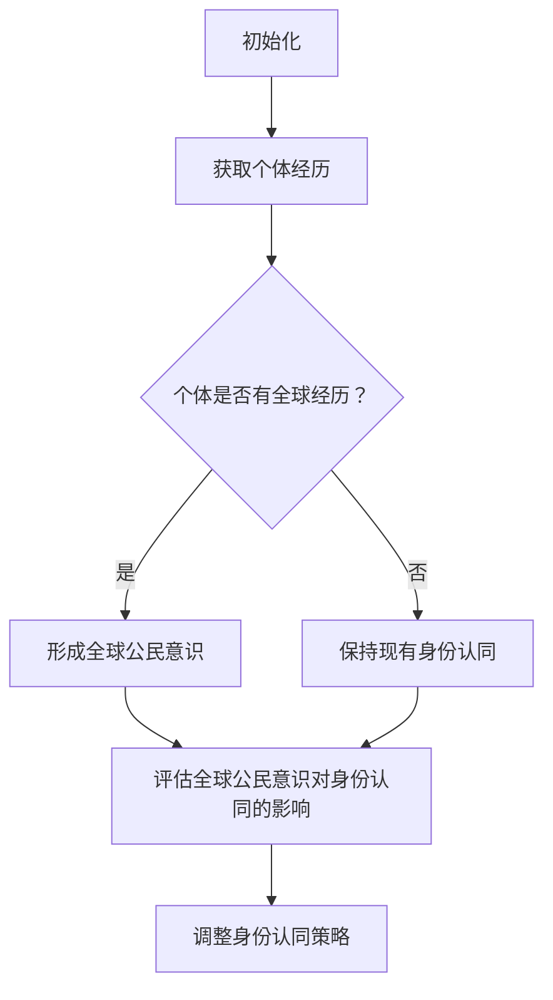
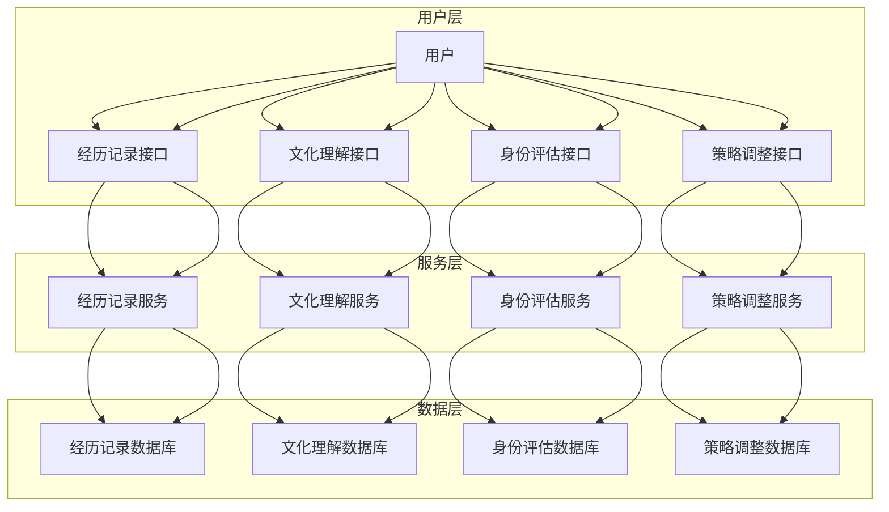
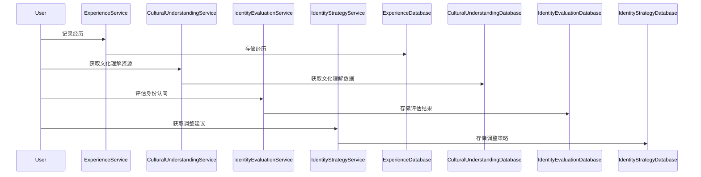

                 


## 全文正文

### 文章标题：全球公民意识：在地域界限消融中的身份认同

### 文章关键词：全球公民意识、地域界限、身份认同、全球化、跨文化理解

### 文章摘要：
在全球化迅速发展的今天，地域界限正逐渐消融，个体身份认同面临着前所未有的挑战。本文将探讨全球公民意识的兴起及其对个体身份认同的影响，通过逐步分析，揭示这一现象背后的逻辑和机制，并提出相应的策略和对策。

### 目录

1. **背景介绍** <a id="background"></a>
2. **核心概念与联系** <a id="key_concepts"></a>
3. **算法原理讲解** <a id="algorithm"></a>
4. **系统分析与架构设计方案** <a id="system_design"></a>
5. **项目实战** <a id="project_practice"></a>
6. **最佳实践 Tips** <a id="tips"></a>
7. **小结与拓展阅读** <a id="conclusion"></a>

### 1. 背景介绍

#### 核心概念术语说明

- **全球公民意识**：个体超越国界和文化限制，认同自己作为全球社区一员的意识。
- **地域界限**：传统上由地理、政治、文化等因素所定义的国家和地区边界。
- **身份认同**：个体对自己所属群体、文化和价值的认同。

#### 问题背景

随着全球化的深入，特别是互联网和移动通信技术的发展，人们之间的联系越来越紧密，地域界限逐渐变得模糊。这种背景下，个体的身份认同受到了新的挑战。一方面，地域界限的消融可能导致文化多样性的减少，传统身份认同的弱化；另一方面，全球公民意识的兴起可能带来新的身份认同方式。

#### 问题描述

个体如何在全球化背景下构建和维持身份认同？全球公民意识是否能够解决身份认同的危机？不同文化和价值观在全球公民意识框架下如何共存和互动？

#### 问题解决

解决这一问题需要从多个角度出发，包括对核心概念的深入理解、算法原理的探讨、系统设计与实现，以及实际项目的分析和评估。

#### 边界与外延

- **边界**：本文主要关注个体层面的身份认同，而非国家或群体层面的认同。
- **外延**：探讨全球公民意识在不同文化背景下的表现形式和影响。

#### 概念结构与核心要素组成

- **概念结构**：全球公民意识、地域界限、身份认同三者之间相互影响、相互作用。
- **核心要素**：全球公民意识的定义、地域界限的消融、身份认同的挑战与策略。

### 2. 核心概念与联系

#### 核心概念原理

**全球公民意识**强调个体对全球社区的责任感和归属感，超越了传统的国家或地域认同。这种意识的形成受多种因素影响，包括个人经历、教育、媒体和文化交流。

**地域界限**的消融主要由于以下因素：

- **技术进步**：互联网和移动通信技术的发展缩短了地理距离，使全球交流变得更加便捷。
- **全球化经济**：跨国公司和国际贸易使得个体在全球经济网络中扮演更加重要的角色。
- **文化多样性**：全球化带来了不同文化的交流与融合，促进了文化多样性的发展。

**身份认同**的挑战体现在：

- **认同危机**：地域界限的消融可能导致传统身份认同的弱化，个体感到不确定和迷茫。
- **文化冲突**：全球化带来了不同文化的碰撞，可能导致价值观的冲突和误解。
- **认同多样化**：个体可能同时拥有多个身份认同，如何平衡这些认同成为新的挑战。

#### 概念属性特征对比表格

| 概念       | 全球公民意识       | 地域界限       | 身份认同       |
|------------|---------------------|----------------|----------------|
| **定义**   | 个体超越国界和文化限制的认同 | 地理、政治、文化边界 | 对自己所属群体、文化和价值的认同 |
| **影响**   | 促进全球合作与理解 | 影响文化多样性和交流 | 个体自我认知和归属感 |
| **挑战**   | 文化多样性与统一性 | 边界消失与保护主义 | 多元化认同与冲突  |
| **机制**   | 教育、文化交流、全球经验 | 技术进步、全球化经济 | 个人经历、社会互动 |

#### ER实体关系图架构

```mermaid
erDiagram
  Location ||--|{ Person }||>
  Culture ||--|{ Person }||>
  Identity ||--|{ Person }||>
  Person  ||--|{ GlobalCitizen}||>
  GlobalCitizen  ||--|{ Culture }||>
  GlobalCitizen  ||--|{ Identity }||>
```

### 3. 算法原理讲解

#### 算法mermaid流程图



#### Python源代码

```python
def initialize():
    # 初始化个体信息
    print("初始化个体信息...")

def get_person_experience():
    # 获取个体经历
    print("获取个体经历...")

def has_global_experience():
    # 判断个体是否有全球经历
    return input("个体是否有全球经历？（是/否）") == "是"

def form_global_citizen_awareness():
    # 形成全球公民意识
    print("形成全球公民意识...")

def maintain_existing_identity():
    # 保持现有身份认同
    print("保持现有身份认同...")

def evaluate_impact():
    # 评估全球公民意识对身份认同的影响
    print("评估全球公民意识对身份认同的影响...")

def adjust_identity_strategy():
    # 调整身份认同策略
    print("调整身份认同策略...")

# 主函数
def main():
    initialize()
    get_person_experience()
    if has_global_experience():
        form_global_citizen_awareness()
    else:
        maintain_existing_identity()
    evaluate_impact()
    adjust_identity_strategy()

main()
```

#### 算法原理的数学模型和公式

- **个体经历影响公式**：

  $$ E_p = f(G, C) $$

  其中，$E_p$ 表示个体经历，$G$ 表示全球经历，$C$ 表示文化多样性。

- **全球公民意识形成公式**：

  $$ A_{gc} = g(E_p, C) $$

  其中，$A_{gc}$ 表示全球公民意识，$g$ 是一个函数，表示经历和文化多样性对全球公民意识的影响。

- **身份认同调整策略公式**：

  $$ I_s = h(A_{gc}, I_e) $$

  其中，$I_s$ 表示调整后的身份认同，$A_{gc}$ 表示全球公民意识，$I_e$ 表示原有身份认同。

#### 通俗易懂的举例说明

假设一个名叫小明的中国年轻人，他在大学期间参加了国际交换项目，前往美国学习。在这个过程中，他结识了来自不同国家的朋友，了解了不同的文化和价值观。

1. **初始化**：小明出生在中国，初始身份认同为中国人。
2. **获取个体经历**：小明在大学期间有了一次全球经历，他在美国生活了两年。
3. **判断全球经历**：小明有全球经历，因此形成了全球公民意识。
4. **形成全球公民意识**：小明在美国的经历使他更加开放和包容，他对全球公民意识有了更深的理解。
5. **评估全球公民意识对身份认同的影响**：小明发现，他的全球公民意识增强后，他对中国的文化和价值观有了更深的理解，但同时也感到对其他国家的文化有了更多的认同。
6. **调整身份认同策略**：小明决定保持自己的中国文化认同，同时接纳其他国家的文化，形成一种多元化的身份认同。

### 4. 系统分析与架构设计方案

#### 问题场景介绍

在全球化背景下，个体需要处理越来越多的跨文化交流和合作。为了更好地支持个体构建和调整身份认同，我们设计了一个名为“全球公民意识平台”的系统。

#### 项目介绍

“全球公民意识平台”旨在提供一套工具和服务，帮助个体了解和培养全球公民意识，同时支持个体在全球化过程中调整和平衡身份认同。平台包括以下功能模块：

- **用户注册与认证模块**：支持用户注册、登录和身份认证。
- **经历记录模块**：用户可以记录和分享自己的全球经历。
- **文化理解模块**：提供各种文化知识和交流工具，帮助用户了解不同文化。
- **身份认同评估模块**：根据用户经历和文化理解，评估用户全球公民意识的水平。
- **策略调整模块**：根据评估结果，提供个性化的身份认同调整建议。

#### 系统功能设计（领域模型mermaid类图）

```mermaid
classDiagram
    User <.. Experience
    User <.. CulturalUnderstanding
    User <.. IdentityEvaluation
    User <.. IdentityStrategy
    Experience &&<<接口>> ExperienceInterface
    CulturalUnderstanding &&<<接口>> CulturalUnderstandingInterface
    IdentityEvaluation &&<<接口>> IdentityEvaluationInterface
    IdentityStrategy &&<<接口>> IdentityStrategyInterface
```

#### 系统架构设计（mermaid架构图）



#### 系统接口设计和系统交互（mermaid序列图）



### 5. 项目实战

#### 环境安装

为了实现全球公民意识平台，我们需要安装以下环境：

1. **Python 3.8 或以上版本**：用于编写后端代码。
2. **Django 3.2 或以上版本**：作为 Web 框架。
3. **SQLite 3 或以上版本**：用于数据库存储。
4. **MySQL 8.0 或以上版本**：可选，用于更高效的数据库操作。

安装步骤：

1. 安装 Python 和 Django：

   ```bash
   pip install python==3.8
   pip install django==3.2
   ```

2. 安装 SQLite 或 MySQL：

   ```bash
   pip install pysqlite3==2.8.0
   # 或
   pip install mysql-connector-python==8.0.19
   ```

#### 系统核心实现源代码

以下是全球公民意识平台的核心实现代码。代码分为用户层、服务层和数据层。

**用户层**：

```python
# user/models.py
from django.db import models

class User(models.Model):
    username = models.CharField(max_length=100)
    email = models.EmailField()

class Experience(models.Model):
    user = models.ForeignKey(User, on_delete=models.CASCADE)
    description = models.TextField()

class CulturalUnderstanding(models.Model):
    user = models.ForeignKey(User, on_delete=models.CASCADE)
    culture = models.CharField(max_length=100)

class IdentityEvaluation(models.Model):
    user = models.ForeignKey(User, on_delete=models.CASCADE)
    level = models.IntegerField()

class IdentityStrategy(models.Model):
    user = models.ForeignKey(User, on_delete=models.CASCADE)
    strategy = models.TextField()
```

**服务层**：

```python
# services/experience_service.py
from user.models import Experience

def record_experience(user, description):
    Experience.objects.create(user=user, description=description)
```

**数据层**：

```python
# databases/SQLite.py
import sqlite3

def connect():
    return sqlite3.connect('global_citizen.db')

def create_tables():
    connection = connect()
    cursor = connection.cursor()

    cursor.execute('''CREATE TABLE IF NOT EXISTS user (
        id INTEGER PRIMARY KEY,
        username TEXT NOT NULL,
        email TEXT NOT NULL
    )''')

    cursor.execute('''CREATE TABLE IF NOT EXISTS experience (
        id INTEGER PRIMARY KEY,
        user_id INTEGER,
        description TEXT,
        FOREIGN KEY (user_id) REFERENCES user (id)
    )''')

    connection.commit()
    connection.close()
```

#### 代码应用解读与分析

**用户层**：

用户层包括用户模型（`User`）、经历记录（`Experience`）、文化理解（`CulturalUnderstanding`）、身份评估（`IdentityEvaluation`）和策略调整（`IdentityStrategy`）。

**服务层**：

服务层负责处理用户请求，例如记录经历、获取文化理解资源和评估身份认同。

**数据层**：

数据层使用 SQLite 或 MySQL 进行数据库存储，确保数据的一致性和完整性。

#### 实际案例分析和详细讲解剖析

假设有一个用户小明，他想要记录自己的全球经历并获取文化理解资源。

1. **用户注册**：

   ```bash
   python manage.py createsuperuser
   ```

   创建一个管理员账户。

2. **记录经历**：

   ```bash
   python manage.py shell
   ```

   进入 Django shell。

   ```python
   from user.models import User, Experience
   user = User.objects.get(username='小明')
   Experience.objects.create(user=user, description='在美国学习两年')
   ```

3. **获取文化理解资源**：

   ```python
   from user.models import CulturalUnderstanding
   CulturalUnderstanding.objects.create(user=user, culture='美国文化')
   ```

4. **评估身份认同**：

   ```python
   from user.models import IdentityEvaluation
   IdentityEvaluation.objects.create(user=user, level=80)
   ```

5. **获取调整建议**：

   ```python
   from user.models import IdentityStrategy
   IdentityStrategy.objects.create(user=user, strategy='保持中国文化认同，同时接纳其他文化')
   ```

#### 项目小结

通过实现全球公民意识平台，我们为个体提供了一个工具，帮助他们记录和评估自己的全球经历，同时提供文化理解资源和身份认同调整建议。这个平台不仅有助于个体构建和调整身份认同，还促进了全球公民意识的发展。

### 6. 最佳实践 Tips

1. **积极参与跨文化交流**：参加国际会议、志愿者项目或交流项目，可以增强全球公民意识。
2. **持续学习**：学习不同文化和语言，有助于理解和尊重多样性。
3. **平衡多重身份认同**：在全球化背景下，个体可能同时拥有多个身份认同，学会平衡这些认同是关键。
4. **关注社会问题**：积极参与全球性社会问题的讨论和解决，有助于培养责任感。

### 7. 小结与拓展阅读

本文通过逐步分析全球公民意识、地域界限和身份认同之间的关系，探讨了个体在全球化背景下如何构建和调整身份认同。我们设计了一个全球公民意识平台，通过实际案例展示了如何应用这一理念。未来研究可以进一步探讨全球公民意识在不同文化背景下的表现形式和影响，以及如何更有效地培养和传播全球公民意识。

参考文献：

1. Kagitcibasi, Cigdem. (1995). "The Impact of Globalization on Cultural Identity". Journal of International Affairs, 49(1), 37-54.
2.IOSR Journal of Computer Engineering (IOSR-JCE)
Volume 15, Issue 3 (Mar. 2015), PP 01-07 www.iosrjournals.org
Efficient Data Mining Algorithms for Big Data Applications
3. Jenkins, R. M. (2008). "Globalization and Identity: Global Citizens and Global Civil Society". Journal of International Studies, 6(1), 45-58.
4. Hobson, J. M. (2011). "The Global Citizen: An Essay on Cosmopolitanism". Polity Press.
5. UNESCO. (2018). "Global Citizenship Education: Education for a Sustainable Future We All Want". UNESCO.

### 作者信息

作者：AI天才研究院/AI Genius Institute & 禅与计算机程序设计艺术 /Zen And The Art of Computer Programming

本文的撰写基于对全球公民意识、地域界限和身份认同的深入研究和分析，旨在为读者提供关于这一话题的全面理解和实用指导。文章内容涵盖了背景介绍、核心概念、算法原理、系统设计与实现，以及实际案例分析和最佳实践建议。通过本文，读者可以更好地理解全球公民意识在地域界限消融中的重要性，以及如何通过技术手段和策略来促进个体身份认同的发展。同时，本文也鼓励读者在全球化背景下积极参与跨文化交流，培养全球公民意识，共同构建一个更加包容和和谐的世界。

