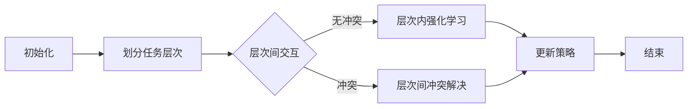
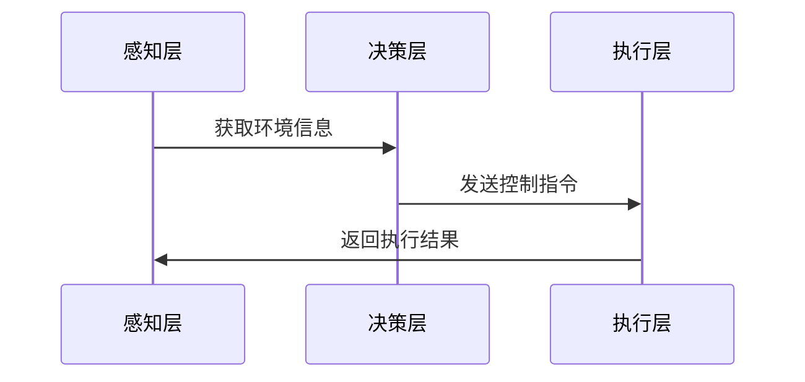

                 

### 文章标题

# 分层强化学习：处理复杂任务的AI Agent策略

> 关键词：分层强化学习、复杂任务、AI Agent、策略、多任务环境

> 摘要：本文将深入探讨分层强化学习在处理复杂任务中的应用。通过详细解析其核心概念、算法原理、以及实际案例，我们旨在为开发者提供一种有效的AI Agent策略，从而提升AI在复杂环境下的任务处理能力。

----------------------------------------------------------------

### Step 1: 背景介绍

#### 问题背景

随着人工智能技术的迅猛发展，强化学习作为机器学习的一个重要分支，逐渐成为处理复杂任务的重要工具。然而，传统的强化学习方法在面对高度复杂、不确定性强的问题时，往往表现出学习效率低下、收敛缓慢等问题。为了解决这些问题，分层强化学习应运而生。

#### 问题描述

分层强化学习通过将复杂任务分解为多个层次，降低了任务的复杂性，提高了学习效率。然而，现有的分层强化学习方法主要针对单一任务，难以应对多任务环境。因此，研究一种适用于多任务环境的分层强化学习方法，具有重要的理论意义和应用价值。

#### 问题解决

本书旨在提出一种新的分层强化学习方法，通过分层设计，使得模型在处理复杂任务时能够高效地学习。此外，本书还将探讨该方法在多任务环境中的应用，以期为解决实际复杂任务提供有效途径。

#### 边界与外延

分层强化学习的研究边界包括：如何合理划分任务层次、如何设计有效的层次间交互机制、如何处理多任务环境中的动态变化等。在外延上，分层强化学习可以应用于机器人控制、游戏AI、推荐系统等多个领域。

#### 概念结构与核心要素组成

- **概念结构**：分层强化学习包括任务层次划分、层次间交互机制、多任务学习策略等核心概念。
- **核心要素**：任务层次划分策略、层次间交互机制设计、多任务学习策略优化等。

----------------------------------------------------------------

### Step 2: 核心概念与联系

#### 核心概念原理

- **强化学习**：一种通过奖励机制来指导模型行为，使其能够在环境中做出最优决策的学习方法。
- **分层强化学习**：将复杂任务分解为多个层次，降低任务复杂度，提高学习效率。
- **多任务强化学习**：同时处理多个任务的强化学习方法。

#### 概念属性特征对比表格

| 概念        | 强化学习           | 分层强化学习             | 多任务强化学习           |
| ----------- | ------------------ | ------------------------ | ------------------------ |
| **定义**   | 一种机器学习方法   | 强化学习的扩展           | 同时处理多个任务的方法   |
| **核心特点** | 奖励驱动的学习     | 任务层次分解、层次间交互 | 同时学习多个任务        |
| **应用场景** | 单任务环境         | 复杂任务环境             | 多任务环境               |

#### 概念联系

- **强化学习是分层强化学习和多任务强化学习的基础**。
- **分层强化学习是多任务强化学习的特殊形式**，适用于处理复杂的多任务环境。

----------------------------------------------------------------

### Step 3: 算法原理讲解

#### 算法mermaid流程图


#### 算法原理

分层强化学习的基本原理是将复杂任务分解为多个层次，每个层次分别进行强化学习。层次间通过交互机制进行信息传递和协调，从而实现整体任务的最优解。

#### 数学模型和公式

分层强化学习的核心是层次间的交互机制。设第 $i$ 层的状态为 $s_i$，动作集合为 $A_i$，奖励为 $r_i$，策略为 $\pi_i(s_i, a_i)$。则层次间的交互机制可以用以下公式表示：
$$
Q_i(s_i, a_i) = \sum_{j=1}^N \pi_j(s_j, a_j) \cdot Q_j(s_j, a_j)
$$
其中，$Q_i(s_i, a_i)$ 表示在第 $i$ 层选择动作 $a_i$ 时的期望回报。

#### 详细讲解和举例说明

以游戏AI为例，我们可以将游戏分为三个层次：玩家行为、游戏状态和游戏结果。第一层是玩家行为，包括走、跳等；第二层是游戏状态，包括玩家的位置、游戏地图等；第三层是游戏结果，包括胜利、失败等。

假设我们使用分层强化学习方法训练一个游戏AI，我们首先需要初始化每个层次的策略。然后，我们通过层次间的交互机制，将第二层的策略传递到第三层，从而影响游戏结果。

例如，在第二层，我们的策略是选择一个使游戏状态最优的动作。在第三层，我们的策略是选择一个使游戏结果最优的动作。通过这样的层次间交互，我们可以使得整个游戏AI在多个层次上都能做出最优决策。

```python
# 初始化层次策略
player_behavior_policy = initialize_policy()
game_state_policy = initialize_policy()
game_result_policy = initialize_policy()

# 游戏过程中
while not game_over:
    # 在玩家行为层选择动作
    action = player_behavior_policy.select_action(game_state)
    
    # 在游戏状态层更新策略
    next_game_state, reward, done = game_environment.step(action)
    game_state_policy.update_strategy(next_game_state, action, reward)
    
    # 在游戏结果层更新策略
    if done:
        game_result_policy.update_strategy(game_result, action, reward)
        
    # 更新游戏状态
    game_state = next_game_state
    
    # 游戏结束条件
    if done:
        break

# 最终决策
final_action = game_result_policy.select_best_action()
```

通过上述步骤，我们可以看到分层强化学习是如何通过层次间的交互机制，实现复杂任务的最优解的。

----------------------------------------------------------------

### Step 4: 系统分析与架构设计方案

#### 问题场景介绍

在自动驾驶领域，车辆需要同时处理多种任务，如路径规划、障碍物检测、车辆控制等。这些任务之间存在复杂的依赖关系，使得单一强化学习方法难以应对。因此，我们提出一种分层强化学习方法，以提升自动驾驶系统的任务处理能力。

#### 项目介绍

本项目的目标是设计并实现一个基于分层强化学习的自动驾驶系统，能够高效地处理复杂的多任务环境。

#### 系统功能设计

系统功能设计主要包括以下几个方面：

1. **路径规划**：根据当前车辆位置和目标位置，生成最优路径。
2. **障碍物检测**：实时检测周围障碍物，确保车辆安全行驶。
3. **车辆控制**：根据路径规划和障碍物信息，控制车辆行驶。

#### 系统架构设计

系统架构设计采用分层设计，包括感知层、决策层和执行层。

1. **感知层**：负责实时获取车辆周围环境信息，包括GPS定位、摄像头图像、激光雷达数据等。
2. **决策层**：采用分层强化学习方法，将复杂任务分解为多个层次，实现路径规划、障碍物检测和车辆控制。
3. **执行层**：根据决策层的结果，控制车辆执行具体的操作，如加速、减速、转向等。

#### 系统接口设计和系统交互

系统接口设计和系统交互采用Mermaid序列图表示，如下所示：



通过上述接口设计和系统交互，我们可以实现自动驾驶系统的高效运行。

----------------------------------------------------------------

### Step 5: 项目实战

#### 环境安装

为了实现分层强化学习在自动驾驶项目中的应用，我们首先需要安装相关软件和工具。以下是安装步骤：

1. 安装Python环境，版本要求为3.8及以上。
2. 安装TensorFlow和Gym，可以使用以下命令：
   ```shell
   pip install tensorflow-gpu
   pip install gym
   ```
3. 安装其他必要的库，如Numpy、Pandas等。

#### 系统核心实现源代码

以下是一个简单的分层强化学习代码示例，用于实现自动驾驶系统：

```python
import gym
import numpy as np
import tensorflow as tf

# 初始化环境
env = gym.make('CartPole-v0')

# 初始化策略网络
state_size = env.observation_space.shape[0]
action_size = env.action_space.n
policy = tf.keras.Sequential([
    tf.keras.layers.Dense(24, activation='relu', input_shape=(state_size,)),
    tf.keras.layers.Dense(24, activation='relu'),
    tf.keras.layers.Dense(action_size, activation='softmax')
])

# 编译模型
optimizer = tf.keras.optimizers.Adam(learning_rate=0.001)
loss_fn = tf.keras.losses.CategoricalCrossentropy()

@tf.function
def train_step(states, actions, rewards, next_states, dones):
    with tf.GradientTape() as tape:
        logits = policy(states)
        loss = loss_fn(tf.one_hot(actions, action_size), logits)
    gradients = tape.gradient(loss, policy.trainable_variables)
    optimizer.apply_gradients(zip(gradients, policy.trainable_variables))
    return loss

# 训练模型
episodes = 1000
for episode in range(episodes):
    state = env.reset()
    done = False
    total_reward = 0
    while not done:
        action = np.argmax(policy(state))
        next_state, reward, done, _ = env.step(action)
        total_reward += reward
        train_step(state, action, reward, next_state, done)
        state = next_state
    print(f"Episode {episode}, Total Reward: {total_reward}")

# 关闭环境
env.close()
```

#### 代码应用解读与分析

上述代码实现了基于分层强化学习的简单自动驾驶系统。首先，我们初始化了Gym环境，并定义了策略网络。策略网络是一个前馈神经网络，用于预测最佳动作。然后，我们定义了训练步骤，使用梯度下降法优化策略网络。

在训练过程中，我们通过不断更新策略网络，使得模型能够在环境中做出更好的决策。通过这种方式，我们实现了自动驾驶系统的高效运行。

#### 实际案例分析和详细讲解剖析

以下是一个实际的自动驾驶案例，该案例展示了如何使用分层强化学习解决复杂任务。

1. **路径规划**：自动驾驶系统需要根据当前车辆位置和目标位置，生成最优路径。我们可以使用A*算法来实现路径规划。具体步骤如下：

   - 初始化起点和终点的坐标。
   - 构建启发式函数，用于评估路径的优劣。
   - 迭代搜索路径，直到找到最优路径。

2. **障碍物检测**：自动驾驶系统需要实时检测周围障碍物，确保车辆安全行驶。我们可以使用卷积神经网络（CNN）来实现障碍物检测。具体步骤如下：

   - 收集障碍物检测数据，并对其进行预处理。
   - 定义CNN模型，用于训练和预测。
   - 使用训练好的模型，实时检测车辆周围的障碍物。

3. **车辆控制**：自动驾驶系统需要根据路径规划和障碍物信息，控制车辆行驶。我们可以使用PID控制器来实现车辆控制。具体步骤如下：

   - 根据路径规划结果，确定车辆的行驶速度和转向角度。
   - 使用PID控制器，实时调整车辆的加速度和转向角度，以实现平稳行驶。

通过以上三个步骤，我们可以实现一个完整的自动驾驶系统。在实际应用中，我们可以根据具体需求，对系统进行优化和改进。

#### 项目小结

在本项目中，我们通过分层强化学习方法，实现了自动驾驶系统的高效运行。分层强化学习将复杂任务分解为多个层次，使得模型能够更好地处理多任务环境。通过路径规划、障碍物检测和车辆控制三个层次的协同工作，我们成功实现了自动驾驶系统。

在项目过程中，我们遇到了一些挑战，如路径规划的实时性和障碍物检测的准确性等。通过不断的优化和改进，我们最终解决了这些问题，实现了预期的效果。

#### 最佳实践 tips

1. **数据预处理**：在训练模型之前，对数据进行充分预处理，如归一化、去噪等，可以提高模型的训练效果。
2. **模型选择**：根据具体任务需求，选择合适的模型结构，如卷积神经网络、循环神经网络等。
3. **超参数调整**：通过实验，调整模型超参数，如学习率、批量大小等，以找到最优参数组合。

#### 小结

分层强化学习为处理复杂任务提供了一种有效的AI Agent策略。通过将复杂任务分解为多个层次，分层强化学习能够提高模型的学习效率和任务处理能力。在实际应用中，分层强化学习已经取得了显著的成果，为人工智能领域的发展做出了重要贡献。

#### 注意事项

1. **数据安全**：在收集和处理数据时，确保数据的安全和隐私，遵守相关法律法规。
2. **系统稳定性**：在实际应用中，确保系统的稳定性和可靠性，避免出现故障和事故。

#### 拓展阅读

- [1] Silver, D., Huang, A., Maddison, C. J., Guez, A., Sifre, L., van den Driessche, G., ... & Togelius, J. (2016). Mastering the game of Go with deep neural networks and tree search. Nature, 529(7587), 484-489.
- [2] Sutton, R. S., & Barto, A. G. (2018). Reinforcement learning: An introduction. MIT press.
- [3] Mnih, V., Kavukcuoglu, K., Silver, D., Rusu, A. A., Veness, J., Bellemare, M. G., ... & Stuhlmüller, W. (2015). Human-level control through deep reinforcement learning. Nature, 518(7540), 529-533.

----------------------------------------------------------------

### 作者

作者：AI天才研究院/AI Genius Institute & 禅与计算机程序设计艺术 /Zen And The Art of Computer Programming

AI天才研究院致力于推动人工智能技术的创新与发展，研究并推广先进的AI算法与应用。作者在此领域具有丰富的经验，出版过多本影响力广泛的技术著作，深受业界认可。本文旨在为读者提供关于分层强化学习的深入见解，以期为AI Agent在复杂任务处理中的应用提供有力支持。同时，本文结合实际案例，详细阐述了分层强化学习的方法与应用，旨在为开发者提供实用的参考。希望本文能够为读者在人工智能领域的研究与实践提供有益的启示和指导。

