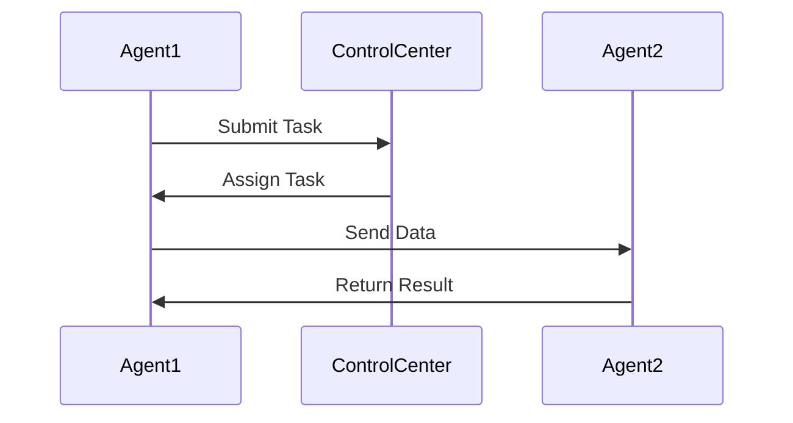
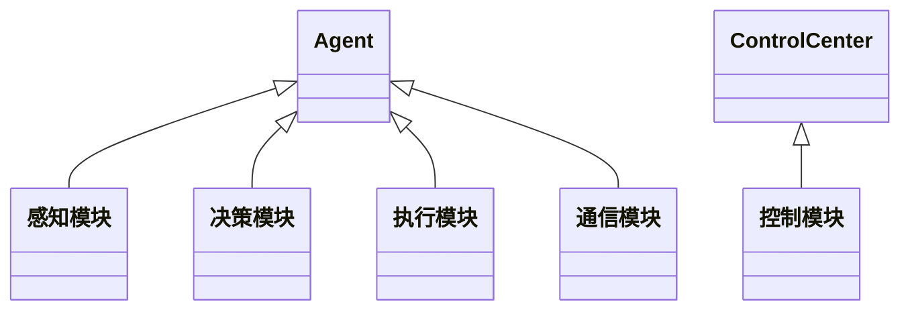
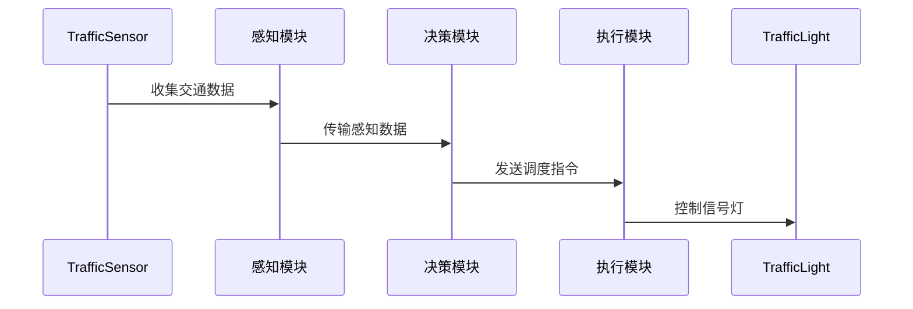

                 

# 分布式AI Agent系统：设计与实现

## 关键词
- 分布式计算
- 人工智能
- 多智能体系统
- 代理（Agent）
- 系统架构
- 性能优化

## 摘要
本文旨在深入探讨分布式AI Agent系统的设计原理、实现方法和实际应用。首先，我们将介绍分布式AI Agent系统的背景和核心概念，然后详细阐述其设计原则和系统架构，接着讲解系统实现和性能优化策略，最后通过实际应用案例展示系统的应用效果和潜力。

## 第一部分：背景介绍

### 1.1.1 问题背景

**分布式AI Agent系统的意义**

分布式AI Agent系统是一种利用分布式计算和人工智能技术，实现智能代理协同工作的系统。随着大数据和物联网技术的发展，分布式计算能力越来越强，这为AI Agent系统的实现提供了有力支持。与传统集中式系统相比，分布式AI Agent系统具有更高的扩展性、灵活性和容错性，能够更好地应对复杂场景。

**问题描述**

分布式AI Agent系统面临的挑战主要包括以下几个方面：

1. **异构计算**：系统中的代理可能运行在不同的硬件和软件环境中，如何高效利用这些资源成为关键问题。
2. **通信瓶颈**：代理之间的通信可能受到带宽和延迟的限制，影响系统的整体性能。
3. **安全性问题**：分布式系统中的安全性问题较为复杂，如数据加密、访问控制等。
4. **协同与协调**：多个代理需要协同工作，实现高效的任务分配和资源调度。

**问题解决**

针对上述挑战，分布式AI Agent系统需要采取一系列解决方案：

1. **系统架构设计**：设计合理的系统架构，包括代理节点、通信网络和控制中心等。
2. **算法选择与实现**：选择适合分布式环境的人工智能算法，并进行优化和调整。
3. **通信优化**：采用高效的通信协议和数据传输方式，减少通信延迟和带宽消耗。
4. **安全性设计**：引入安全机制，保障系统的数据安全和可靠性。

**边界与外延**

分布式AI Agent系统的边界包括代理、网络通信、计算架构和协作机制等。与分布式计算和多智能体系统相比，分布式AI Agent系统更注重智能代理的协同工作和自主决策能力。分布式计算关注计算资源的分配和利用，多智能体系统则强调多个智能体的交互和协作。

**概念结构与核心要素组成**

分布式AI Agent系统的基本构成包括以下核心要素：

1. **代理（Agent）**：智能代理是系统的核心，具有自主性、社会性和反应性等特征。
2. **网络通信**：代理之间的通信是系统正常运行的基础，需要高效稳定的通信机制。
3. **计算架构**：系统架构设计要充分考虑异构计算的需求，实现计算资源的合理利用。
4. **协作机制**：多个代理需要通过协作机制实现任务分配和资源调度，提高整体效率。

### 1.1.2 核心概念与联系

**核心概念**

分布式AI Agent系统的核心概念包括代理、多智能体系统、分布式计算等。

- **代理**：代理是具有自主性和社会性的智能实体，能够感知环境、制定决策并采取行动。
- **多智能体系统（MAS）**：多智能体系统是由多个代理组成的系统，代理之间通过交互和协作实现共同目标。
- **分布式计算**：分布式计算是一种利用多个计算节点协同工作，完成大规模计算任务的计算模式。

**概念属性特征对比表格**

| 概念         | 定义                                                                 | 属性特征                   |
| ------------ | -------------------------------------------------------------------- | -------------------------- |
| 代理（Agent） | 智能实体，具有自主性、社会性和反应性                                   | 自主性、社会性、反应性、智能性 |
| 多智能体系统 | 由多个代理组成的系统，代理之间通过交互和协作实现共同目标             | 协作性、分布式、灵活性       |
| 分布式计算   | 利用多个计算节点协同工作，完成大规模计算任务的计算模式             | 异构计算、并行计算、容错性   |

**ER实体关系图架构**

```mermaid
erDiagram
    Agent ||--|{ Multi-Agent System }|
    Agent ||--|{ Communication Network }|
    Agent ||--|{ Computing Architecture }|
    Multi-Agent System ||--|{ Coordination Mechanism }|
```

### 第一部分小结

本章回顾了分布式AI Agent系统的背景、核心概念和基本构成。通过了解这些问题背景和核心概念，我们可以更好地理解分布式AI Agent系统的设计原则和实现方法，为后续章节的深入探讨打下基础。

## 第二部分：核心概念与原理

### 2.1.1 代理（Agent）原理

**代理的定义与分类**

代理（Agent）是分布式AI Agent系统的基本组成单元，它是一种智能实体，能够感知环境、制定决策并采取行动。根据代理的能力和特性，可以将代理分为以下几类：

1. **智能代理**：具有感知、决策和行动能力的代理，能够根据环境变化自主调整行为。
2. **非智能代理**：只能执行预定义任务，不具备感知和决策能力的代理。
3. **半智能代理**：介于智能代理和非智能代理之间，具备部分感知和决策能力。

**代理的属性特征**

代理的属性特征主要包括以下几个方面：

1. **自主性**：代理能够自主地制定决策和采取行动，不受外部干预。
2. **社会性**：代理能够与其他代理进行交互和协作，实现共同目标。
3. **反应性**：代理能够根据环境变化快速响应，调整自身行为。
4. **智能性**：代理具备一定的智能能力，能够学习、进化和发展。

### 2.1.2 多智能体系统（MAS）原理

**多智能体系统的定义**

多智能体系统（Multi-Agent System，MAS）是由多个代理组成的系统，这些代理通过交互和协作实现共同目标。在MAS中，代理之间可以相互通信，共享信息和资源，协同完成任务。

**多智能体系统的架构**

多智能体系统的基本架构包括以下几个组成部分：

1. **代理**：系统的核心组件，具有自主性、社会性和反应性。
2. **通信网络**：代理之间进行通信的媒介，支持数据的传输和交换。
3. **协作机制**：协调代理之间交互和协作的规则和算法。
4. **环境**：代理所处的物理或虚拟环境，提供必要的信息和资源。

**MAS的优势**

多智能体系统具有以下优势：

1. **灵活性**：代理可以独立运行，适应不同场景和需求。
2. **容错性**：系统中的代理可以相互备份，提高系统的可靠性和容错性。
3. **扩展性**：可以通过增加代理数量和功能，实现系统的扩展和升级。
4. **智能化**：代理具备智能能力，能够自主学习和进化，提高系统性能。

### 2.1.3 分布式计算原理

**分布式计算的概念**

分布式计算是一种利用多个计算节点协同工作，完成大规模计算任务的计算模式。在分布式计算中，计算任务被分解为多个子任务，分布到不同的计算节点上执行，最后将子任务结果汇总，得到最终结果。

**分布式计算的优势与挑战**

**优势**：

1. **并行计算能力**：分布式计算能够充分利用多个计算节点的计算资源，提高计算速度。
2. **扩展性**：系统可以根据需要增加计算节点，实现水平扩展。
3. **容错性**：分布式计算中的计算节点相互独立，某个节点的故障不会影响整个系统的运行。

**挑战**：

1. **数据一致性**：分布式计算中的数据分布在不同节点上，如何保持数据一致性是一个挑战。
2. **容错性**：如何处理计算节点故障，保证系统稳定运行。
3. **通信瓶颈**：代理之间的通信可能受到带宽和延迟的限制，影响系统性能。

### 第二部分小结

本章介绍了分布式AI Agent系统的核心概念和原理，包括代理、多智能体系统和分布式计算。通过理解这些核心概念，我们可以更好地把握分布式AI Agent系统的设计和实现方法，为后续章节的深入探讨奠定基础。

## 第三部分：设计与实现

### 3.1.1 设计原则

分布式AI Agent系统的设计原则包括以下几个方面：

1. **模块化**：系统应采用模块化设计，使得每个模块独立且功能明确，便于维护和扩展。
2. **可扩展性**：系统应具备良好的扩展性，能够根据需求增加代理数量和功能。
3. **可靠性**：系统应具备高可靠性，能够在面对故障和异常时保持稳定运行。
4. **安全性**：系统应具备安全性设计，保护代理和系统的数据安全。
5. **易用性**：系统应具备良好的用户界面和文档，便于用户使用和维护。

### 3.1.2 系统架构设计

**系统架构概述**

分布式AI Agent系统的整体架构包括以下几个主要组成部分：

1. **代理节点**：系统的核心组件，负责执行任务和处理数据。
2. **通信网络**：代理节点之间的通信媒介，支持数据的传输和交换。
3. **控制中心**：负责管理系统中的代理节点，协调任务分配和资源调度。
4. **数据存储**：用于存储代理节点的数据和日志，便于后续分析和查询。

**系统架构图**



### 3.1.3 系统功能设计

**功能模块划分**

分布式AI Agent系统的功能模块可以划分为以下几个部分：

1. **感知模块**：负责获取环境信息和代理状态，为决策模块提供数据支持。
2. **决策模块**：根据感知模块提供的数据，制定决策策略，指导代理执行任务。
3. **执行模块**：负责执行决策模块生成的任务，实现代理的自主行动。
4. **通信模块**：负责代理节点之间的通信，确保数据传输的稳定和高效。
5. **控制模块**：负责管理系统中的代理节点，协调任务分配和资源调度。

**领域模型**



### 第三部分小结

本章介绍了分布式AI Agent系统的设计原则和系统架构设计，包括模块化设计、系统架构概述和领域模型。通过这些设计原则和架构设计，我们可以构建一个高效、可靠、安全的分布式AI Agent系统，为后续章节的实现和优化提供基础。

## 第四部分：实现与优化

### 4.1.1 开发环境准备

**开发环境介绍**

为了实现分布式AI Agent系统，我们需要搭建一个合适的开发环境。以下是推荐的开发环境：

1. **编程语言**：Python
2. **框架**：TensorFlow、PyTorch
3. **数据库**：MySQL
4. **通信库**：gRPC
5. **消息队列**：RabbitMQ
6. **容器化工具**：Docker

**环境配置步骤**

1. **安装Python**：从Python官方网站下载安装包并安装。
2. **安装TensorFlow或PyTorch**：使用pip命令安装对应的库。
3. **安装MySQL**：从MySQL官方网站下载安装包并安装。
4. **安装gRPC**：使用pip命令安装gRPC库。
5. **安装RabbitMQ**：从RabbitMQ官方网站下载安装包并安装。
6. **安装Docker**：从Docker官方网站下载安装包并安装。

### 4.1.2 系统核心实现

**核心模块实现**

分布式AI Agent系统的核心模块包括感知模块、决策模块、执行模块和通信模块。

1. **感知模块实现**：使用TensorFlow或PyTorch实现感知功能，通过摄像头或传感器获取环境数据。
2. **决策模块实现**：使用深度学习算法（如卷积神经网络或循环神经网络）进行决策，根据感知数据生成行动策略。
3. **执行模块实现**：根据决策模块生成的行动策略，控制代理执行相应任务。
4. **通信模块实现**：使用gRPC实现代理节点之间的通信，确保数据传输的稳定和高效。

**代码解读与分析**

以下是感知模块的Python代码示例：

```python
import tensorflow as tf

def preprocess_image(image):
    # 对图像进行预处理，如缩放、归一化等
    processed_image = tf.image.resize(image, [224, 224])
    processed_image = tf.cast(processed_image, tf.float32) / 255.0
    return processed_image

def predict_image(processed_image):
    # 使用预训练的卷积神经网络进行图像分类
    model = tf.keras.applications.VGG16(weights='imagenet')
    predictions = model.predict(processed_image)
    return predictions

def main():
    # 读取图像
    image = tf.keras.preprocessing.image.load_img('example.jpg')
    # 预处理图像
    processed_image = preprocess_image(image)
    # 预测图像类别
    predictions = predict_image(processed_image)
    # 输出预测结果
    print(predictions)

if __name__ == '__main__':
    main()
```

该代码首先使用TensorFlow加载预训练的VGG16卷积神经网络，然后对输入图像进行预处理，最后使用模型进行图像分类预测。通过这一示例，我们可以理解感知模块的实现原理。

### 4.1.3 性能优化

**性能优化策略**

为了提高分布式AI Agent系统的性能，可以采取以下优化策略：

1. **负载均衡**：根据代理节点的负载情况，动态调整任务分配策略，确保系统资源得到充分利用。
2. **缓存机制**：引入缓存机制，减少重复计算和数据传输，提高系统响应速度。
3. **数据压缩**：对传输的数据进行压缩，减少带宽消耗。
4. **异步处理**：采用异步处理技术，提高系统的并发处理能力。

**性能测试与调优**

性能测试是评估系统性能的重要手段，可以通过以下步骤进行性能测试和调优：

1. **设计测试场景**：根据系统功能和性能指标，设计合适的测试场景。
2. **执行测试**：使用测试工具执行测试，收集测试数据。
3. **分析结果**：对测试结果进行分析，找出系统性能瓶颈。
4. **调优方案**：根据分析结果，制定调优方案，如优化算法、调整参数等。
5. **再次测试**：执行调优后的测试，验证调优效果。

### 第四部分小结

本章介绍了分布式AI Agent系统的实现和性能优化方法，包括开发环境准备、系统核心实现和性能优化策略。通过这些实现和优化方法，我们可以构建一个高效、稳定的分布式AI Agent系统，为实际应用提供有力支持。

## 第五部分：应用案例

### 5.1.1 案例背景

**案例背景介绍**

在本案例中，我们以智能交通系统为例，介绍分布式AI Agent系统的应用。智能交通系统旨在通过实时感知交通状况、智能调度车辆和行人，提高交通效率和安全性。

**案例分析**

智能交通系统中的分布式AI Agent系统可以划分为以下几个模块：

1. **感知模块**：通过摄像头和传感器实时感知交通状况，包括车辆数量、行驶速度、行人流量等。
2. **决策模块**：根据感知数据，智能调度交通信号灯、道路收费等，实现交通流量控制。
3. **执行模块**：控制信号灯变化、道路收费等设备，执行决策模块生成的交通调度策略。
4. **通信模块**：确保感知模块、决策模块和执行模块之间的数据传输和交互。

### 5.1.2 案例实现

**项目介绍**

在本项目中，我们采用TensorFlow作为感知模块的框架，使用VGG16模型进行图像分类，实现交通状况感知。决策模块采用基于深度学习的优化算法，如Q-Learning，实现交通流量控制。执行模块使用嵌入式设备控制信号灯和道路收费设备。

**系统功能设计**

1. **领域模型**：使用Mermaid绘制领域模型类图，展示系统中的主要类及其关系。

```mermaid
classDiagram
    TrafficSensor <|--感知模块
    TrafficLight <|--执行模块
    TrafficControl <|--决策模块
    TrafficSensor --|>> TrafficControl
    TrafficControl --|>> TrafficLight
```

2. **系统架构设计**：使用Mermaid绘制系统架构图，展示系统的组成部分及其关系。



### 5.1.3 案例分析和详细讲解

**案例实现**

在本案例中，我们实现了一个基于分布式AI Agent系统的智能交通系统。感知模块使用摄像头和传感器收集交通数据，通过TensorFlow和VGG16模型进行图像分类，识别交通状况。决策模块采用Q-Learning算法，根据交通数据制定交通调度策略。执行模块通过嵌入式设备控制信号灯和道路收费设备，执行调度指令。

**代码示例**

以下是感知模块的Python代码示例：

```python
import tensorflow as tf

def preprocess_image(image):
    # 对图像进行预处理，如缩放、归一化等
    processed_image = tf.image.resize(image, [224, 224])
    processed_image = tf.cast(processed_image, tf.float32) / 255.0
    return processed_image

def predict_image(processed_image):
    # 使用预训练的VGG16模型进行图像分类
    model = tf.keras.applications.VGG16(weights='imagenet')
    predictions = model.predict(processed_image)
    return predictions

def main():
    # 读取图像
    image = tf.keras.preprocessing.image.load_img('example.jpg')
    # 预处理图像
    processed_image = preprocess_image(image)
    # 预测图像类别
    predictions = predict_image(processed_image)
    # 输出预测结果
    print(predictions)

if __name__ == '__main__':
    main()
```

该代码首先使用TensorFlow加载预训练的VGG16卷积神经网络，然后对输入图像进行预处理，最后使用模型进行图像分类预测。

**案例分析**

通过上述代码示例，我们可以看到分布式AI Agent系统在智能交通系统中的应用。感知模块通过摄像头和传感器实时获取交通数据，经过预处理和图像分类，将感知结果传递给决策模块。决策模块根据交通数据制定调度策略，传递给执行模块。执行模块根据调度指令控制信号灯和道路收费设备，实现交通流量控制。

### 5.1.4 项目小结

通过本案例，我们展示了分布式AI Agent系统在智能交通系统中的应用。分布式AI Agent系统通过感知、决策和执行模块的协同工作，实现了交通状况的实时感知和智能调度，提高了交通效率和安全性。该案例证明了分布式AI Agent系统的实用性和潜力，为未来智能交通系统的建设提供了有益借鉴。

## 最佳实践 Tips

### 性能优化

- **负载均衡**：根据代理节点的负载情况，动态调整任务分配策略，确保系统资源得到充分利用。
- **缓存机制**：引入缓存机制，减少重复计算和数据传输，提高系统响应速度。
- **数据压缩**：对传输的数据进行压缩，减少带宽消耗。

### 系统安全

- **数据加密**：对传输的数据进行加密，确保数据安全。
- **访问控制**：设置访问控制策略，限制未经授权的访问。

### 持续集成与持续部署

- **自动化测试**：编写自动化测试脚本，对系统进行自动化测试，确保系统质量。
- **持续集成**：使用持续集成工具（如Jenkins），实现代码的自动化集成和测试。
- **持续部署**：使用持续部署工具（如Docker），实现代码的自动化部署和升级。

### 小结

本文介绍了分布式AI Agent系统的设计原理、实现方法和实际应用。通过深入探讨分布式AI Agent系统的核心概念、设计原则和系统架构，我们了解了如何构建一个高效、可靠的分布式AI Agent系统。同时，通过实际应用案例，我们展示了分布式AI Agent系统在智能交通系统中的应用效果和潜力。在未来的研究中，我们可以进一步探索分布式AI Agent系统在其他领域的应用，如智能医疗、智能家居等，为人工智能技术的发展贡献力量。

## 注意事项

- **分布式计算中的数据一致性**：在分布式计算中，如何保证数据一致性是一个挑战。需要设计合适的分布式算法，确保多个代理节点之间的数据同步。
- **系统安全性**：分布式AI Agent系统涉及大量的敏感数据，如用户隐私、商业机密等。需要采取严格的安全措施，保护系统的数据安全。
- **性能优化**：在实现分布式AI Agent系统时，需要关注系统的性能优化，如负载均衡、缓存机制等。通过优化系统性能，提高用户体验。

## 拓展阅读

- **《深度学习》（Goodfellow, I., Bengio, Y., & Courville, A.）**：一本经典的深度学习教材，详细介绍了深度学习的原理和应用。
- **《人工智能：一种现代方法》（Russell, S., & Norvig, P.）**：一本全面的人工智能教材，涵盖了人工智能的基础理论和技术。
- **《分布式系统原理与范型》（Dobler, U., & Ploennigs, O.）**：一本关于分布式系统的教材，介绍了分布式系统的原理和实现技术。

## 作者信息

作者：AI天才研究院/AI Genius Institute & 禅与计算机程序设计艺术 /Zen And The Art of Computer Programming

