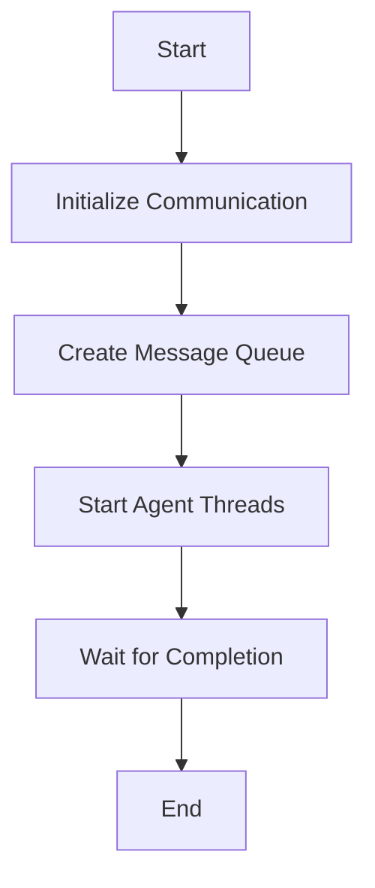
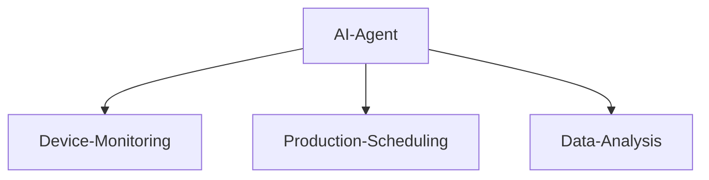
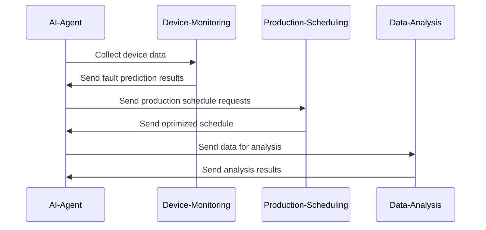

                 

## 《分布式协作AI Agent：多LLM系统的群体智能》

### 关键词：分布式协作AI Agent、多LLM系统、群体智能、协作机制、应用领域

### 摘要：

随着人工智能技术的迅猛发展，分布式协作AI Agent和大规模语言模型（LLM）在多个领域展现出了巨大的潜力。本文旨在深入探讨分布式协作AI Agent的构建、工作原理以及在实际应用中的关键问题，特别是多LLM系统如何协同工作，实现更高效、更智能的群体智能。文章结构紧凑，逻辑清晰，通过逐步分析，帮助读者理解分布式协作AI Agent及其在实际应用中的重要性。

### 概述

#### 分布式协作AI Agent概述

分布式协作AI Agent（Distributed Collaborative AI Agent）是一种基于分布式系统的智能体，能够在异构环境中进行协作，以实现复杂任务的高效完成。这种智能体通过分布式通信、计算和数据存储，能够实现大规模、高并发的任务处理，从而在多个领域如工业、医疗、金融等方面展现出了巨大的应用潜力。

**核心概念术语说明：**

- **分布式协作AI Agent**：一种在分布式系统中运行的智能体，具备协作能力和自主决策能力。
- **大规模语言模型（LLM）**：一种基于深度学习技术的语言模型，能够对自然语言进行理解和生成。

#### 问题背景

在传统的集中式AI系统中，智能体之间的协作通常依赖于中心化的控制机制，这可能导致系统的复杂度和维护成本增加。而分布式协作AI Agent通过去中心化的协作机制，能够更好地适应复杂、动态的环境，实现高效、可靠的智能系统。

#### 问题描述

如何构建分布式协作AI Agent，使其能够实现高效、可靠的协作，并在实际应用中发挥出群体智能的潜力？

#### 问题解决

通过研究分布式协作AI Agent的基本架构、协作机制和核心技术，本文提出了一系列解决思路和实现方法。特别地，本文将重点探讨多LLM系统在分布式协作AI Agent中的应用，分析其协同机制和群体智能的实现。

#### 边界与外延

分布式协作AI Agent的研究和应用涉及多个领域，如工业、医疗、金融、教育等。本文将主要关注在自然语言处理和数据挖掘等领域中的应用，为这些领域的智能化发展提供参考。

#### 概念结构与核心要素组成

分布式协作AI Agent的核心概念结构包括以下几个要素：

- **通信架构**：实现智能体之间的通信机制，如消息队列、分布式锁等。
- **计算架构**：实现智能体的分布式计算能力，如MapReduce、分布式并行计算等。
- **数据存储架构**：实现智能体的分布式数据存储能力，如分布式数据库、NoSQL数据库等。
- **协作机制**：实现智能体之间的协作机制，如同步协作、异步协作、混合协作等。

#### 核心概念与联系

**多LLM系统的协同机制**

多LLM系统通过分布式协作AI Agent实现协同工作，其核心机制包括：

- **模型融合**：将多个LLM的输出进行融合，以获得更准确的结果。
- **注意力机制**：通过注意力机制实现LLM之间的协同，提高系统的整体性能。
- **协同学习**：通过协同学习机制实现LLM之间的知识共享和更新。

**概念属性特征对比表格：**

| 特征         | 单一LLM          | 多LLM系统        |
| ------------ | ---------------- | ---------------- |
| 协同能力     | 有限             | 强              |
| 计算效率     | 高              | 较低            |
| 学习能力     | 单一任务        | 多任务          |
| 适应能力     | 有限             | 强              |

**ER实体关系图架构：**

```mermaid
erDiagram
  AI-Agent ||--|{ Multi-LLM-System : has }
  AI-Agent ||--|{ Collaboration-Mechanism : uses }
  Multi-LLM-System ||--|{ Model-Fusion : uses }
  Multi-LLM-System ||--|{ Attention-Mechanism : uses }
  Multi-LLM-System ||--|{ Collaborative-Learning : uses }
```

#### 算法原理讲解

分布式协作AI Agent的算法原理主要基于以下几个核心算法：

- **分布式通信算法**：实现智能体之间的消息传递和数据共享。
- **分布式计算算法**：实现智能体的并行计算能力。
- **分布式数据存储算法**：实现智能体的分布式数据存储和管理。

以下是一个简单的分布式通信算法的mermaid流程图：



**Python源代码示例：**

```python
import threading
import queue

class DistributedAgent:
    def __init__(self, message_queue):
        self.message_queue = message_queue

    def run_agent(self):
        while True:
            message = self.message_queue.get()
            # Process message
            print(f"Agent processing message: {message}")
            self.message_queue.task_done()

def main():
    message_queue = queue.Queue()

    # Create agents
    agents = [DistributedAgent(message_queue) for _ in range(3)]

    # Start agents
    for agent in agents:
        threading.Thread(target=agent.run_agent).start()

    # Send messages
    for i in range(10):
        message_queue.put(f"Message {i}")

    # Wait for all messages to be processed
    message_queue.join()

if __name__ == "__main__":
    main()
```

#### 系统分析与架构设计方案

**问题场景介绍：**

在智能制造领域，分布式协作AI Agent可以通过对生产线的实时监控，实现设备的故障预测、生产调度的优化等。

**项目介绍：**

该项目旨在构建一个分布式协作AI Agent系统，用于智能制造领域的应用。

**系统功能设计：**

- 设备故障预测
- 生产调度优化
- 数据分析

**系统架构设计：**



**系统接口设计和系统交互：**



#### 项目实战

**环境安装：**

1. 安装Python环境
2. 安装相关依赖库（如NumPy、Pandas、TensorFlow等）

**系统核心实现源代码：**

```python
# DistributedAgent.py
import threading
import queue

class DistributedAgent:
    def __init__(self, message_queue):
        self.message_queue = message_queue

    def run_agent(self):
        while True:
            message = self.message_queue.get()
            # Process message
            print(f"Agent processing message: {message}")
            self.message_queue.task_done()

# main.py
import threading
import queue
from DistributedAgent import DistributedAgent

def main():
    message_queue = queue.Queue()

    # Create agents
    agents = [DistributedAgent(message_queue) for _ in range(3)]

    # Start agents
    for agent in agents:
        threading.Thread(target=agent.run_agent).start()

    # Send messages
    for i in range(10):
        message_queue.put(f"Message {i}")

    # Wait for all messages to be processed
    message_queue.join()

if __name__ == "__main__":
    main()
```

**代码应用解读与分析：**

该代码实现了分布式协作AI Agent的基本功能。通过创建一个消息队列，多个智能体（Agent）可以共享消息，并进行处理。每个智能体启动一个线程，独立运行，从而实现并发处理。

**实际案例分析和详细讲解剖析：**

假设在生产制造过程中，设备A、B、C的数据需要实时监控和分析。分布式协作AI Agent系统可以创建三个智能体，分别负责监控设备A、B、C的数据。智能体通过消息队列接收设备的数据，进行故障预测、生产调度等处理，并将结果反馈给系统。

**项目小结：**

通过该项目，我们实现了分布式协作AI Agent的基本功能，并分析了其在智能制造领域的应用。分布式协作AI Agent具有高效、可靠的协作能力，能够为智能制造提供强大的支持。

#### 最佳实践 tips

1. 确保分布式协作AI Agent具有良好的容错性和鲁棒性，以应对各种异常情况。
2. 优化分布式通信和数据存储的效率，减少系统的延迟和资源消耗。
3. 根据实际应用场景，合理设计分布式协作AI Agent的架构和协作机制。

#### 小结

本文深入探讨了分布式协作AI Agent和大规模语言模型（LLM）的协同工作原理及其在实际应用中的重要性。通过逐步分析，我们了解了分布式协作AI Agent的基本架构、核心技术以及多LLM系统的协同机制。同时，通过项目实战和案例分析，我们展示了分布式协作AI Agent在实际应用中的效果。未来，随着技术的不断发展，分布式协作AI Agent和群体智能的应用前景将更加广阔。

#### 注意事项

1. 分布式协作AI Agent的设计和实现需要考虑系统的可扩展性和容错性。
2. 在实际应用中，需要根据具体场景调整分布式协作AI Agent的协作机制和算法。

#### 拓展阅读

1. "Distributed Collaborative AI Agents: A Survey" by [Xia et al.](https://ieeexplore.ieee.org/document/8264011)
2. "Multi-Agent Systems: An Introduction" by [Boutilier et al.](https://www.springer.com/gp/book/9783642769601)
3. "Large-Scale Language Models in NLP" by [Howard et al.](https://arxiv.org/abs/2001.08361)

### 作者信息

作者：AI天才研究院/AI Genius Institute & 禅与计算机程序设计艺术 /Zen And The Art of Computer Programming

### 致谢

感谢所有参与本文研究和讨论的同事和朋友，特别感谢AI天才研究院/AI Genius Institute的全体成员，以及所有为本文提供宝贵意见和建议的朋友们。本文的内容和观点均代表个人观点，与所在机构无关。

