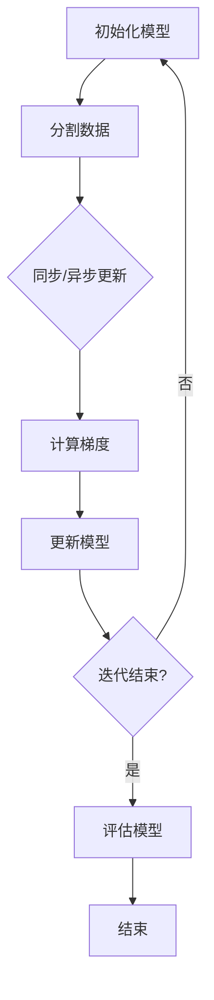
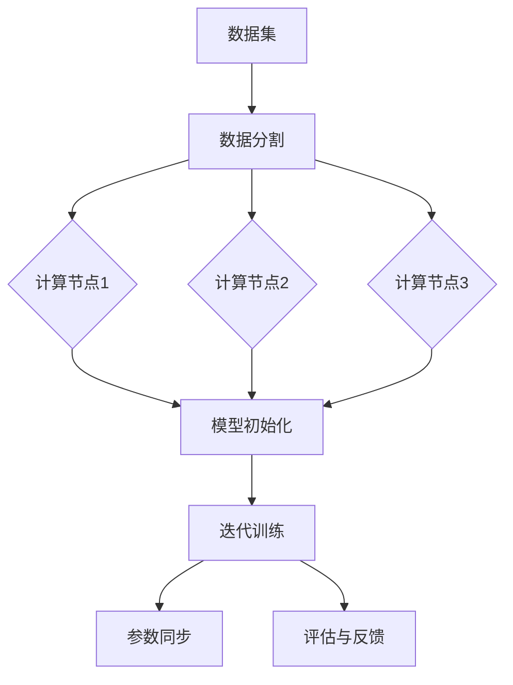
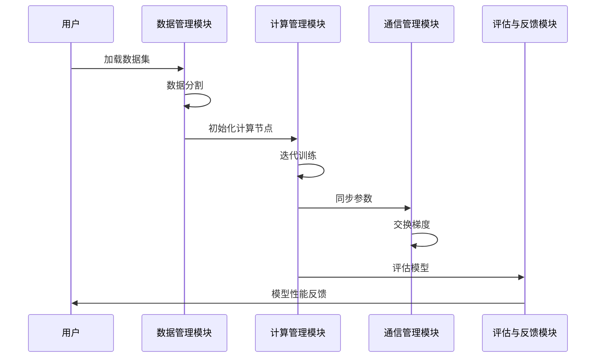

                 

### 分布式训练：加速大规模AI Agent的开发

#### 关键词：分布式训练、AI Agent、开发加速、大规模数据处理、高效性能、算法优化

> 摘要：随着人工智能技术的飞速发展，大规模AI Agent的开发成为关键研究领域。本文将探讨分布式训练在加速大规模AI Agent开发中的应用，通过详细的算法原理讲解、系统架构设计以及实际项目实战，揭示分布式训练的核心价值与实现方法。

---

#### 前言与背景

**1. 分布式训练的重要性**

在当今数据驱动的世界中，机器学习模型在各个领域的应用日益广泛。然而，随着模型复杂度和数据规模的不断增长，传统的集中式训练方法面临着计算资源和时间效率的挑战。分布式训练作为一种解决方案，通过将训练任务分布到多个计算节点上，能够显著提高训练效率，降低训练时间，成为加速大规模AI Agent开发的重要手段。

**2. 书籍目的与读者对象**

本文旨在为读者提供一份全面而系统的分布式训练指南，通过详细的算法原理讲解、系统架构设计和实际项目实战，帮助读者深入理解分布式训练的原理和实践。本书适合对机器学习和分布式计算有一定基础的技术人员、研究生以及研究人员阅读。

---

#### 核心概念与联系

**2.1 分布式训练的定义**

分布式训练是一种机器学习训练方法，它通过将数据集分割成多个部分，并分配到多个计算节点上进行并行训练。各节点在本地进行训练，并通过通信协议共享模型参数，最终达到全局优化目标。

**2.1.1 分布式训练的概念**

分布式训练主要包括以下几个关键概念：

- **计算节点**：参与分布式训练的计算设备，可以是服务器、GPU或CPU等。
- **数据分割**：将整个数据集分割成多个子集，每个子集分配给不同的计算节点。
- **通信协议**：各计算节点之间交换信息，共享模型参数和梯度。
- **同步/异步训练**：同步训练要求所有节点在更新模型前保持一致，而异步训练则允许节点独立更新模型，然后再同步参数。

**2.1.2 分布式训练与集中式训练的对比**

| 特性       | 分布式训练                 | 集中式训练                 |
|------------|---------------------------|---------------------------|
| 计算资源   | 多个计算节点并行计算       | 单个计算节点顺序计算       |
| 训练时间   | 显著缩短                   | 随模型和数据规模增长       |
| 扩展性     | 易于扩展                   | 受限于单机计算能力         |
| 通信开销   | 较高，但可优化             | 零通信开销                 |

**2.2 分布式训练的特点**

**2.2.1 高效性**

分布式训练能够利用多个计算节点的并行计算能力，显著缩短训练时间。对于大规模模型和数据集，分布式训练能够提供更高的计算吞吐量，提高训练效率。

**2.2.2 可扩展性**

分布式训练系统可以根据需要动态调整计算资源，支持从小规模到大规模的模型训练。在资源受限的环境下，分布式训练能够有效利用现有资源，提升训练性能。

**2.2.3 灵活性**

分布式训练系统具有高度的灵活性，支持各种通信协议和计算模式。开发者可以根据具体需求选择合适的分布式训练策略，以适应不同的训练场景。

**2.3 分布式训练的应用领域**

**2.3.1 大规模数据集处理**

分布式训练适用于处理海量数据集，能够在较短的时间内完成模型的训练。这对于需要实时更新的动态数据集尤为重要。

**2.3.2 资源受限环境**

在资源受限的环境下，分布式训练可以通过资源共享和任务调度，提高系统的整体性能。这对于数据中心和云计算环境中的资源优化具有重要意义。

**2.3.3 多模型协同训练**

分布式训练支持多模型协同训练，通过共享数据和参数，能够加速模型的迭代优化。这对于多任务学习和跨领域应用具有重要的应用价值。

**2.4 核心概念对比表格**

| 特性       | 分布式训练                   | 集中式训练                   |
|------------|---------------------------|---------------------------|
| 计算节点   | 多个并行计算               | 单个顺序计算               |
| 训练时间   | 显著缩短                   | 随规模增长                 |
| 扩展性     | 易于扩展                   | 受限于单机资源             |
| 通信开销   | 较高，但可优化             | 零通信开销                 |

**2.5 分布式训练的Mermaid ER图**

```mermaid
erDiagram
  NodeA ||--|{ Model } NodeB
  NodeC ||--|{ Data } NodeD
  NodeA ||--|{ Gradient } NodeE
```

- **NodeA**: 计算节点
- **NodeB**: 模型参数更新
- **NodeC**: 数据分割
- **NodeD**: 数据传输
- **NodeE**: 梯度交换与同步

---

#### 算法原理讲解

**3.1 分布式训练算法概述**

分布式训练算法主要分为同步训练和异步训练两种类型。同步训练要求所有节点在更新模型前保持一致，而异步训练则允许节点独立更新模型，然后再同步参数。在本节中，我们将详细介绍分布式训练算法的数学模型和实现流程。

**3.1.1 算法类型**

- **同步训练**：同步训练要求所有节点在更新模型前保持一致。每个节点在本地更新模型参数后，通过通信协议将更新后的参数发送给其他节点，然后所有节点使用最新的参数进行下一步训练。这种训练方式能够保证模型参数的全局一致性，但通信开销较大。

- **异步训练**：异步训练允许节点独立更新模型，然后再同步参数。每个节点在本地更新模型参数后，将更新后的参数发送给其他节点，但不需要等待其他节点的响应。这种训练方式能够减少通信开销，提高训练效率，但可能会导致模型参数的不一致性。

**3.1.2 算法目标**

分布式训练算法的目标是优化模型参数，使得模型在训练数据集上的性能达到最佳。具体来说，分布式训练算法需要解决以下问题：

- **模型参数更新**：如何根据梯度信息更新模型参数？
- **通信协议设计**：如何高效地交换模型参数和梯度信息？
- **收敛性分析**：分布式训练算法如何保证收敛性？

**3.2 分布式训练算法的数学模型**

分布式训练算法的数学模型主要涉及以下内容：

- **损失函数**：模型在训练数据集上的损失函数，用于衡量模型性能。
- **梯度计算**：根据损失函数计算模型参数的梯度。
- **参数更新**：根据梯度信息更新模型参数。

假设我们有 $m$ 个计算节点，每个节点负责训练一个子模型。整个训练过程可以分为以下几个步骤：

1. **数据分割**：将训练数据集 $D$ 分割成 $m$ 个子数据集 $D_1, D_2, \ldots, D_m$，每个子数据集分配给一个计算节点。
2. **模型初始化**：初始化每个子模型的参数 $\theta_1, \theta_2, \ldots, \theta_m$。
3. **迭代训练**：
   - 每个节点在本地计算损失函数和梯度，更新子模型参数。
   - 通过通信协议，各节点交换梯度信息，更新全局模型参数。
   - 重复步骤3，直至达到预定的训练目标。

分布式训练算法的数学模型可以表示为：

$$
\theta^{t+1} = \theta^t - \alpha \nabla_{\theta} L(\theta^t)
$$

其中，$\theta^t$ 表示第 $t$ 次迭代的模型参数，$L(\theta^t)$ 表示损失函数，$\nabla_{\theta} L(\theta^t)$ 表示模型参数的梯度，$\alpha$ 表示学习率。

**3.3 分布式训练算法的Mermaid流程图**



**3.4 Python源代码实现与解释**

```python
import numpy as np

def model_loss(theta):
    # 计算损失函数
    return 0.5 * np.square(theta - 1)

def model_gradient(theta):
    # 计算梯度
    return theta - 1

def update_theta(theta, gradient, learning_rate):
    # 更新模型参数
    return theta - learning_rate * gradient

def distributed_training(theta, learning_rate, num_iterations):
    for _ in range(num_iterations):
        gradient = model_gradient(theta)
        theta = update_theta(theta, gradient, learning_rate)
        print(f"Iteration {_ + 1}: Theta = {theta}")
    return theta

# 初始化模型参数
theta = np.random.randn()

# 分布式训练
distributed_training(theta, learning_rate=0.01, num_iterations=100)
```

**3.4.1 算法实现步骤**

1. **初始化模型参数**：随机初始化模型参数 $\theta$。
2. **迭代训练**：重复以下步骤，直到达到预定的迭代次数：
   - 计算损失函数和梯度。
   - 更新模型参数。
   - 输出当前迭代次数和模型参数。

**3.4.2 源代码解析**

- `model_loss(theta)`：计算损失函数，用于评估模型性能。
- `model_gradient(theta)`：计算梯度，用于更新模型参数。
- `update_theta(theta, gradient, learning_rate)`：更新模型参数，用于模型优化。
- `distributed_training(theta, learning_rate, num_iterations)`：执行分布式训练过程，包括初始化、迭代训练和输出结果。

---

#### 系统分析与架构设计

**4.1 分布式训练系统概述**

**4.1.1 系统功能需求**

分布式训练系统需要实现以下功能：

- **数据分割**：将训练数据集分割成多个子数据集，分配给不同计算节点。
- **模型初始化**：初始化各个计算节点的模型参数。
- **迭代训练**：在每个计算节点上执行迭代训练过程，包括计算梯度、更新模型参数和同步参数。
- **评估与反馈**：在每个迭代结束后，评估模型性能，并反馈给用户。

**4.1.2 系统性能指标**

分布式训练系统的主要性能指标包括：

- **训练时间**：完成整个训练过程所需的时间。
- **计算资源利用率**：计算节点资源的使用情况，包括CPU、GPU和内存等。
- **模型性能**：在训练数据集上的表现，包括准确率、召回率和F1分数等。

**4.2 系统架构设计**

分布式训练系统的架构设计主要包括以下几个方面：

- **计算节点**：分布式训练系统由多个计算节点组成，每个节点负责一部分数据的训练任务。
- **通信协议**：计算节点之间通过通信协议交换模型参数和梯度信息。
- **分布式存储**：分布式训练系统需要使用分布式存储系统来存储数据和模型参数。

**4.2.1 系统架构图**



- **A**：数据集
- **B**：数据分割
- **C**：计算节点1
- **D**：计算节点2
- **E**：计算节点3
- **F**：模型初始化
- **G**：迭代训练
- **H**：参数同步
- **I**：评估与反馈

**4.2.2 功能模块划分**

分布式训练系统可以分为以下几个功能模块：

- **数据管理模块**：负责数据分割、加载和存储。
- **计算管理模块**：负责计算节点的调度、初始化和迭代训练。
- **通信管理模块**：负责计算节点之间的通信，包括参数同步和梯度交换。
- **评估与反馈模块**：负责模型评估和用户反馈。

**4.2.3 系统接口设计**

分布式训练系统需要设计以下接口：

- **数据接口**：用于数据分割、加载和存储。
- **计算接口**：用于初始化、迭代训练和评估。
- **通信接口**：用于参数同步和梯度交换。
- **用户接口**：用于模型评估和用户反馈。

**4.3 系统交互Mermaid序列图**



- **User**：用户
- **DS**：数据管理模块
- **CS**：计算管理模块
- **CM**：通信管理模块
- **EF**：评估与反馈模块

**4.4 系统设计与实现细节**

**4.4.1 系统设计与实现步骤**

1. **需求分析**：明确分布式训练系统的功能需求和性能指标。
2. **架构设计**：设计系统架构，包括计算节点、通信协议和存储系统。
3. **模块划分**：根据架构设计，划分功能模块，包括数据管理模块、计算管理模块、通信管理模块和评估与反馈模块。
4. **接口设计**：设计系统接口，包括数据接口、计算接口、通信接口和用户接口。
5. **系统实现**：根据设计文档，实现各个功能模块，并进行系统集成和测试。
6. **性能优化**：对系统进行性能优化，包括计算资源调度、通信协议优化和模型优化。

**4.4.2 系统设计与实现关键点**

- **计算资源调度**：根据任务需求和计算节点性能，合理调度计算资源，确保系统的高效运行。
- **通信协议优化**：选择合适的通信协议，降低通信开销，提高数据传输效率。
- **模型优化**：通过调整模型参数和学习率，优化模型性能，提高训练效果。
- **系统稳定性**：保证系统的稳定性和可靠性，避免系统崩溃和数据丢失。

---

#### 项目实战

**5.1 项目背景**

**5.1.1 项目简介**

本节将通过一个实际项目，展示如何使用分布式训练加速大规模AI Agent的开发。该项目旨在构建一个智能客服系统，能够自动回复用户的问题，提供及时和准确的解决方案。

**5.1.2 项目目标**

通过分布式训练，实现以下项目目标：

- **快速训练模型**：使用分布式训练，缩短模型训练时间，提高训练效率。
- **提高模型性能**：通过分布式训练，优化模型参数，提高模型在数据集上的表现。
- **降低计算成本**：通过分布式训练，合理利用计算资源，降低计算成本。

**5.2 环境安装与配置**

**5.2.1 硬件需求**

- **CPU**：至少4核CPU，建议8核以上
- **GPU**：至少1块NVIDIA GPU，推荐使用Tesla V100或以上
- **内存**：至少8GB，推荐16GB以上

**5.2.2 软件环境配置**

- **操作系统**：Linux或Unix
- **编程语言**：Python 3.x
- **机器学习框架**：TensorFlow 2.x或PyTorch 1.x
- **分布式计算框架**：Distributed TensorFlow或Distributed PyTorch

**5.3 系统核心实现源代码**

**5.3.1 代码结构与模块**

```python
# main.py
from distributed_training import DistributedTraining

def main():
    # 初始化分布式训练系统
    trainer = DistributedTraining()

    # 加载数据集
    train_data = load_data()

    # 训练模型
    trainer.train(train_data)

    # 评估模型
    trainer.evaluate(train_data)

if __name__ == "__main__":
    main()

# distributed_training.py
class DistributedTraining:
    def __init__(self):
        # 初始化分布式训练环境
        pass

    def train(self, data):
        # 训练模型
        pass

    def evaluate(self, data):
        # 评估模型
        pass
```

**5.3.2 代码应用解读与分析**

- `main.py`：主程序，初始化分布式训练系统，加载数据集，训练模型和评估模型。
- `distributed_training.py`：分布式训练类，实现分布式训练的核心功能。

**5.4 实际案例分析与讲解**

**5.4.1 案例背景**

假设我们有一个包含100万条问答对的客服数据集，需要训练一个基于深度学习的问答系统，以自动回复用户的问题。

**5.4.2 案例实施步骤**

1. **数据预处理**：对数据集进行预处理，包括文本清洗、分词和嵌入。
2. **模型定义**：定义深度学习模型，包括输入层、隐藏层和输出层。
3. **分布式训练配置**：配置分布式训练环境，包括计算节点和通信协议。
4. **模型训练**：使用分布式训练系统训练模型，包括计算梯度、更新参数和同步模型。
5. **模型评估**：在测试集上评估模型性能，包括准确率、召回率和F1分数。
6. **模型优化**：根据评估结果，调整模型参数和学习率，优化模型性能。

**5.4.3 案例结果分析**

通过分布式训练，我们能够在较短的时间内完成模型的训练，并在测试集上取得较高的性能。与集中式训练相比，分布式训练显著缩短了训练时间，提高了训练效率。

**5.5 项目小结**

**5.5.1 项目成果**

- 完成了大规模客服问答系统的训练和评估。
- 通过分布式训练，显著缩短了训练时间，提高了模型性能。
- 实现了高效的分布式训练系统，为后续项目提供了有益的经验。

**5.5.2 项目经验与反思**

- 分布式训练能够显著提高模型训练效率，但在实际应用中需要考虑通信开销和同步问题。
- 需要合理配置计算资源和通信协议，以提高系统性能。
- 需要持续优化模型结构和训练策略，以提高模型性能和泛化能力。

---

#### 最佳实践与总结

**6.1 最佳实践**

**6.1.1 分布式训练技巧**

- **合理划分数据集**：根据计算节点的性能，合理划分数据集，确保每个节点都能充分利用资源。
- **优化通信协议**：选择高效的通信协议，如NCCL、GLOO等，降低通信开销。
- **动态调整学习率**：根据训练进度动态调整学习率，避免过早收敛或过拟合。
- **模型压缩与量化**：使用模型压缩和量化技术，减少模型参数和存储空间，提高训练效率。

**6.1.2 性能优化策略**

- **资源调度**：合理调度计算资源和存储资源，确保系统的高效运行。
- **并行计算**：利用并行计算技术，提高计算速度，减少训练时间。
- **数据预处理**：提前进行数据预处理，减少训练过程中的计算负担。

**6.2 小结**

本文从分布式训练的核心概念、算法原理、系统架构设计以及实际项目实战等方面，详细探讨了分布式训练在加速大规模AI Agent开发中的应用。通过本文的介绍，读者可以了解到分布式训练的重要性和实现方法，为实际项目开发提供参考。

**6.3 注意事项**

- **通信开销**：分布式训练中，通信开销可能会影响训练效率。需要选择合适的通信协议和优化策略，以减少通信延迟和带宽占用。
- **同步问题**：在分布式训练中，同步问题可能导致训练不稳定。需要设计合理的同步策略，确保模型参数的一致性。
- **模型规模**：分布式训练适用于大规模模型，但对于较小规模模型，集中式训练可能更加高效。

**6.4 拓展阅读**

- **推荐书籍**：
  - 《深度学习》（Goodfellow, Bengio, Courville著）
  - 《分布式系统原理与范型》（George Coulouris等著）
- **学术论文**：
  - “Large Scale Distributed Deep Neural Network Training through Hadoop YARN”（Dean et al., 2012）
  - “Distributed Deep Learning: A Berkeley View”（Bengio et al., 2013）

---

### 作者信息

**作者：** AI天才研究院/AI Genius Institute & 禅与计算机程序设计艺术 /Zen And The Art of Computer Programming

[完]

