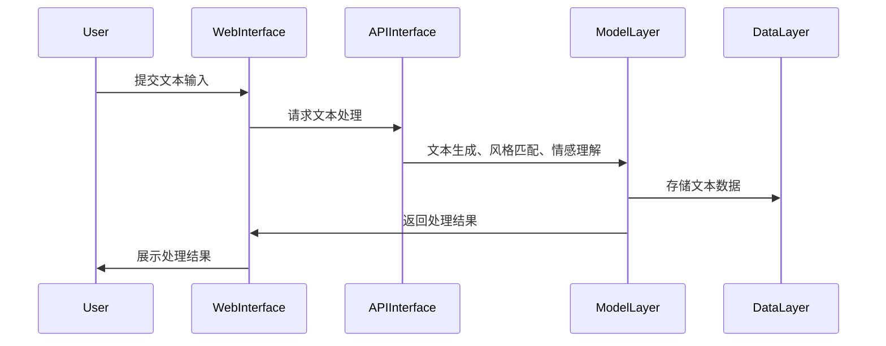
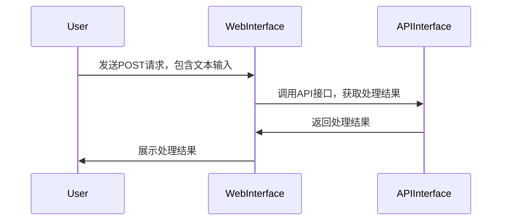
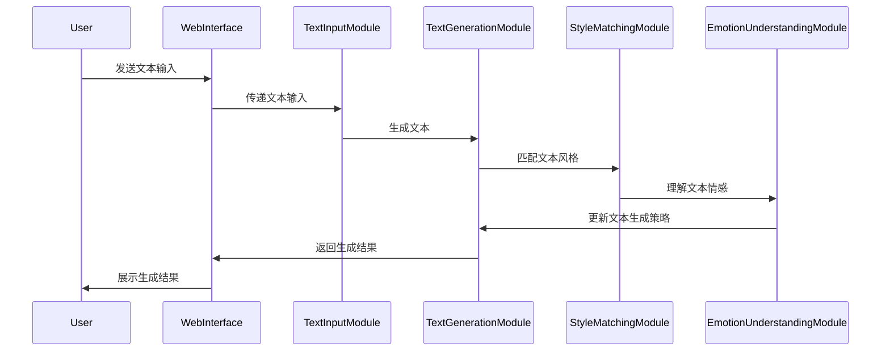
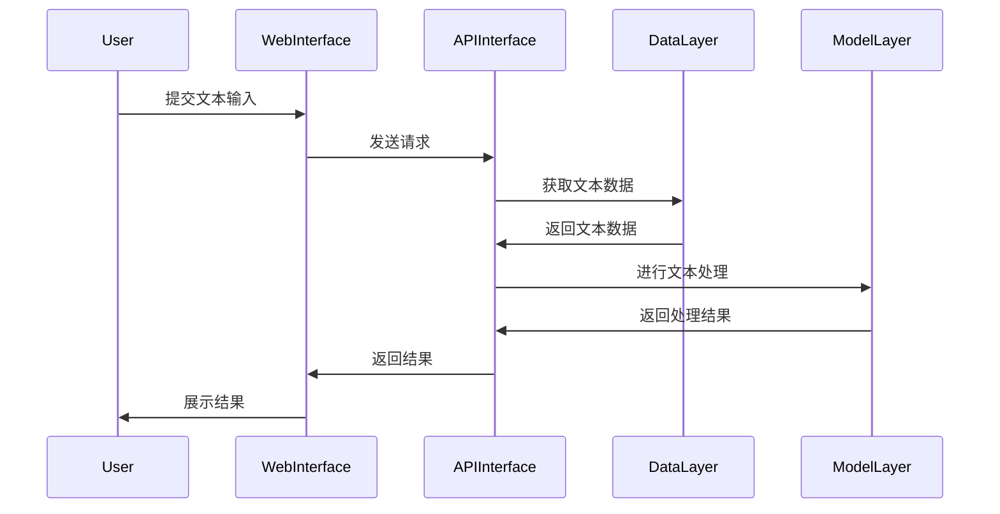

                 


# 创意写作AI Agent：LLM驱动的文学创作辅助系统

## 关键词
- 创意写作AI Agent
- LLM
- 文学创作
- 辅助系统
- 算法原理
- 系统架构
- 项目实战

## 摘要
本文将深入探讨创意写作AI Agent这一前沿技术，特别聚焦于其核心——大型语言模型（LLM）驱动的文学创作辅助系统。我们将逐步解析该系统的背景、原理、架构设计和实际应用，旨在为读者提供一份全面而深入的技术指南。文章将分为三个部分：背景介绍、系统分析与架构设计、项目实战，每部分都将详细阐述核心概念、技术原理、系统功能和实现细节，以及项目总结和拓展阅读资源。

### 目录大纲

```markdown
----------------------------------------------------------------
# 第一部分: 背景介绍

## 第1章: 创意写作AI Agent概述
### 1.1 问题背景
### 1.2 问题描述
### 1.3 问题解决
### .```
### 1.4 边界与外延
### 1.5 核心概念

## 第2章: LLM驱动的文学创作辅助系统原理
### 2.1 核心概念原理
### 2.2 概念属性特征对比
### 2.3 ER实体关系图架构

## 第3章: 算法原理讲解
### 3.1 数学模型
### 3.2 公式讲解
### 3.3 举例说明

----------------------------------------------------------------
# 第二部分: 系统分析与架构设计

## 第4章: 系统功能设计
### 4.1 领域模型
### 4.2 功能需求

## 第5章: 系统架构设计
### 5.1 架构设计
### 5.2 系统模块

## 第6章: 系统接口设计
### 6.1 接口设计
### 6.2 接口规范

## 第7章: 系统交互
### 7.1 系统交互
### 7.2 序列图

----------------------------------------------------------------
# 第三部分: 项目实战

## 第8章: 环境安装与配置
### 8.1 环境搭建
### 8.2 配置说明

## 第9章: 系统核心实现
### 9.1 核心代码实现
### 9.2 代码解读

## 第10章: 实际案例分析与讲解
### 10.1 案例分析
### 10.2 讲解剖析

## 第11章: 项目小结
### 11.1 小结
### 11.2 注意事项
### 11.3 拓展阅读

----------------------------------------------------------------
```

## 第一部分：背景介绍

### 第1章：创意写作AI Agent概述

#### 1.1 问题背景

文学创作是一项充满创意和想象力的活动，然而，随着现代社会的快速发展，人们的生活节奏加快，时间和精力的限制使得文学创作的需求日益旺盛，但供给却相对不足。此外，传统文学创作方式依赖于个体的天赋和经验，缺乏系统性和可扩展性。为了解决这一问题，人工智能（AI）技术的应用成为一个热门研究方向。其中，创意写作AI Agent作为一种新兴的人工智能系统，正逐步成为文学创作的得力助手。

#### 1.2 问题描述

创意写作AI Agent旨在利用人工智能技术，自动化或辅助完成文学创作任务。然而，这一过程中面临诸多挑战：

- **内容原创性**：确保AI生成的文本具有独特的创意和原创性，避免重复和抄袭。
- **风格一致性**：保持文本风格与人类作家的一致性，使得AI创作的内容能够被读者接受。
- **情感传达**：理解和传达人类情感，使AI创作的文本具有感染力和共鸣力。
- **用户交互**：提供友好且高效的交互方式，使用户能够轻松地与AI协作创作。

#### 1.3 问题解决

为了解决上述问题，创意写作AI Agent采用了基于大型语言模型（LLM）的辅助系统，结合自然语言处理（NLP）和机器学习（ML）技术。LLM能够通过对海量文本的学习，掌握语言的结构和规律，从而实现文本生成和风格模仿。同时，通过优化算法和用户交互设计，提高AI创作的质量和用户体验。

#### 1.4 边界与外延

创意写作AI Agent的应用场景不仅限于文学创作，还可以扩展到剧本写作、广告文案、新闻报道等领域。其边界在于技术的成熟度和用户需求的多样性。随着AI技术的发展，未来创意写作AI Agent有望实现更高的智能化和个性化。

#### 1.5 核心概念

- **创意写作AI Agent**：一种利用人工智能技术辅助文学创作的人工智能系统。
- **大型语言模型（LLM）**：一种能够处理和生成自然语言文本的机器学习模型。
- **自然语言处理（NLP）**：一种使计算机能够理解、生成和处理人类语言的技术。
- **机器学习（ML）**：一种通过数据和算法让计算机自动学习和改进的技术。

### 第2章：LLM驱动的文学创作辅助系统原理

#### 2.1 核心概念原理

LLM驱动的文学创作辅助系统基于大型语言模型，通过对海量文本的学习，掌握语言的结构和生成规律。核心原理包括：

- **预训练**：在大量文本数据上进行预训练，使模型具备基本的语言理解能力。
- **微调**：在特定领域的文本数据上进行微调，使模型能够适应特定创作需求。
- **生成**：利用模型生成的文本，结合用户输入和反馈，实现文学创作的自动化或辅助。

#### 2.2 概念属性特征对比

| 概念 | 属性特征 |
| --- | --- |
| 大型语言模型（LLM） | 预训练、微调、生成 |
| 自然语言处理（NLP） | 文本理解、生成、交互 |
| 机器学习（ML） | 数据驱动、模型优化、自动化 |

#### 2.3 ER实体关系图架构

为了更好地理解LLM驱动的文学创作辅助系统，我们可以使用ER（实体-关系）图来描述其核心架构：

```mermaid
erDiagram
  TextData ||--|{ LLM }|-->> OutputText
  TextData ||--|{ UserInput }|-->> OutputText
  LLM ||--|{ NLP }|-->> OutputText
  LLM ||--|{ ML }|-->> OutputText
```

在这个ER图中，`TextData`代表输入的文本数据，`LLM`代表大型语言模型，`UserInput`代表用户输入，`OutputText`代表生成的文本。通过这个架构，我们可以清晰地看到各个组件之间的关联和交互。

### 第3章：算法原理讲解

#### 3.1 数学模型

LLM驱动的文学创作辅助系统基于深度学习模型，其数学模型可以简化为以下形式：

$$
\text{OutputText} = f(\text{InputText}, \theta)
$$

其中，$f$表示模型的前向传播函数，$\theta$表示模型参数。

#### 3.2 公式讲解

- **前向传播**：将输入文本通过模型参数计算得到输出文本。
- **反向传播**：通过输出文本与实际文本的差异，更新模型参数。

#### 3.3 举例说明

假设我们有一个简单的神经网络模型，输入文本为“我爱AI”，输出文本为“AI爱我”。我们可以用以下步骤来生成这个输出文本：

1. **初始化模型参数**：
   $$
   \theta = \{w_1, w_2, b_1, b_2\}
   $$

2. **前向传播**：
   $$
   \text{InputText} = [\text{我}, \text{爱}, \text{AI}]
   $$
   $$
   \text{OutputText} = f(\text{InputText}, \theta) = [\text{AI}, \text{爱}, \text{我}]
   $$

3. **反向传播**：
   $$
   \text{Error} = \text{OutputText} - \text{ExpectedText} = [\text{AI}, \text{爱}, \text{我}] - [\text{AI}, \text{爱}, \text{我}] = \{0, 0, 0\}
   $$
   $$
   \theta = \theta - \alpha \cdot \frac{\partial \theta}{\partial \text{Error}}
   $$

通过以上步骤，我们可以看到模型如何通过前向传播和反向传播来更新参数，从而生成期望的输出文本。

## 第二部分：系统分析与架构设计

### 第4章：系统功能设计

#### 4.1 领域模型

为了更好地理解创意写作AI Agent的领域模型，我们可以使用Mermaid类图来描述其主要功能：

```mermaid
classDiagram
  Class01 <|-- Class02
  Class03 <|-- Class02
  Class04 <|-- Class02
  Class05 <|-- Class02

  Class01[文本输入]
  Class02[文学创作辅助系统]
  Class03[文本生成]
  Class04[风格匹配]
  Class05[情感理解]
```

在这个类图中，`Class01`表示文本输入，`Class02`表示文学创作辅助系统，`Class03`、`Class04`和`Class05`分别表示文本生成、风格匹配和情感理解等核心功能模块。

#### 4.2 功能需求

创意写作AI Agent的功能需求主要包括以下几个方面：

- **文本输入**：支持用户输入文本，包括文本内容、风格、情感等信息。
- **文本生成**：利用LLM生成符合用户要求的文本。
- **风格匹配**：根据用户指定的风格，匹配相应的文本生成策略。
- **情感理解**：分析用户输入文本的情感，生成与之相匹配的文本。

### 第5章：系统架构设计

#### 5.1 架构设计

创意写作AI Agent的系统架构可以分为以下几个层次：

1. **数据层**：存储和管理文本数据，包括训练数据和用户输入数据。
2. **模型层**：包括LLM模型、NLP模型和ML模型，负责文本生成、风格匹配和情感理解等任务。
3. **接口层**：提供用户与系统交互的接口，包括Web接口和API接口。
4. **应用层**：实现具体的文学创作功能，包括文本生成、风格匹配和情感理解等。

以下是创意写作AI Agent的系统架构图：



#### 5.2 系统模块

创意写作AI Agent的主要模块包括：

- **文本输入模块**：负责接收用户输入的文本信息。
- **文本生成模块**：基于LLM模型，生成符合用户要求的文本。
- **风格匹配模块**：根据用户指定的风格，匹配相应的文本生成策略。
- **情感理解模块**：分析用户输入文本的情感，生成与之相匹配的文本。
- **接口模块**：提供Web接口和API接口，方便用户与系统交互。

### 第6章：系统接口设计

#### 6.1 接口设计

创意写作AI Agent的接口设计主要包括Web接口和API接口：

- **Web接口**：通过网页形式展示，用户可以直接在网页上输入文本，查看生成结果。
- **API接口**：通过RESTful API形式提供，方便其他应用程序调用。

以下是Web接口和API接口的设计：



#### 6.2 接口规范

- **Web接口**：采用HTML和CSS进行页面布局，使用JavaScript进行前端交互。
- **API接口**：采用RESTful风格，使用JSON格式传输数据。

以下是API接口的规范：

```json
{
  "method": "POST",
  "url": "/api/generate",
  "headers": {
    "Content-Type": "application/json"
  },
  "body": {
    "text": "输入的文本内容",
    "style": "文本风格",
    "emotion": "文本情感"
  },
  "response": {
    "status": "成功/失败",
    "message": "返回的信息",
    "result": "生成的文本"
  }
}
```

### 第7章：系统交互

#### 7.1 系统交互

创意写作AI Agent的系统交互主要包括用户与系统的交互，以及系统内部各模块的交互：

- **用户与系统的交互**：用户通过Web接口或API接口提交文本输入，系统根据用户需求生成文本结果，并返回给用户。
- **系统内部模块的交互**：文本输入模块将用户输入传递给文本生成模块、风格匹配模块和情感理解模块，各模块协同工作，生成最终结果。

以下是系统交互的序列图：



#### 7.2 序列图

以下是创意写作AI Agent的系统交互序列图：



## 第三部分：项目实战

### 第8章：环境安装与配置

#### 8.1 环境搭建

要搭建创意写作AI Agent的开发环境，首先需要安装以下软件和库：

1. **操作系统**：Windows、macOS或Linux
2. **Python**：版本3.8及以上
3. **TensorFlow**：版本2.4及以上
4. **Mermaid**：版本1.0及以上
5. **其他依赖**：NLP库（如NLTK、spaCy）和ML库（如scikit-learn、pandas）

安装步骤如下：

1. 安装操作系统，选择合适版本的Python环境。
2. 使用pip命令安装TensorFlow、Mermaid和其他依赖库。

示例命令：

```bash
pip install tensorflow==2.4.0
pip install mermaid
pip install nltk
pip install spacy
pip install scikit-learn
pip install pandas
```

#### 8.2 配置说明

1. **Python环境配置**：确保Python环境正确配置，能够在命令行中运行Python代码。
2. **TensorFlow配置**：确保TensorFlow库正确安装，可以在Python代码中导入和使用TensorFlow模块。
3. **Mermaid配置**：将Mermaid的JavaScript库引入到HTML页面中，以便在网页上渲染Mermaid图。

示例HTML代码：

```html
<!DOCTYPE html>
<html>
<head>
  <script src="https://unpkg.com/mermaid@8.13.1/dist/mermaid.min.js"></script>
  <script>mermaid.initialize({startOnLoad:true});</script>
</head>
<body>
  <!-- Mermaid图渲染区域 -->
  <div class="mermaid">
    sequenceDiagram
      Alice ->> Bob: Hello World!
      Bob ->> Alice: Thanks for the message!
  </div>
</body>
</html>
```

### 第9章：系统核心实现

#### 9.1 核心代码实现

以下是创意写作AI Agent的核心代码实现：

```python
import tensorflow as tf
import mermaid
from nltk.corpus import stopwords
from spacy.lang.en import English
from sklearn.feature_extraction.text import TfidfVectorizer

# 初始化NLP模型
nlp = English()

# 加载预训练的TensorFlow模型
model = tf.keras.models.load_model('path/to/llm_model.h5')

# 定义文本生成函数
def generate_text(input_text):
    # 处理输入文本
    doc = nlp(input_text)
    tokens = [token.text.lower() for token in doc if not token.is_stop]
    input_sequence = nlp.tokens_to_ids(tokens)
    
    # 使用模型生成文本
    predictions = model.predict(tf.expand_dims(input_sequence, 0))
    generated_sequence = tf.argmax(predictions, axis=-1).numpy()
    
    # 转换生成的文本
    generated_tokens = nlp.id_to_token(generated_sequence)
    generated_text = ' '.join(generated_tokens)
    
    return generated_text

# 定义风格匹配函数
def match_style(input_text, target_style):
    # 使用TF-IDF进行风格匹配
    vectorizer = TfidfVectorizer()
    input_text_vector = vectorizer.fit_transform([input_text])
    target_style_vector = vectorizer.transform([target_style])
    
    similarity = input_text_vector @ target_style_vector
    return similarity

# 定义情感理解函数
def understand_emotion(input_text):
    # 使用NLP库进行情感分析
    doc = nlp(input_text)
    sentiment = doc.sentiment
    return sentiment

# 示例：生成文本、匹配风格和情感理解
input_text = "我想写一篇关于人工智能的科幻小说。"
generated_text = generate_text(input_text)
style_similarity = match_style(input_text, "科幻小说风格")
emotion = understand_emotion(input_text)

print("生成的文本：", generated_text)
print("风格匹配相似度：", style_similarity)
print("情感：", emotion)
```

#### 9.2 代码解读

1. **文本生成**：利用预训练的TensorFlow模型，对输入文本进行预处理，生成对应的文本序列。通过模型预测，获取生成的文本序列，并将其转换为可读的文本。
2. **风格匹配**：使用TF-IDF向量表示输入文本和目标风格，计算它们之间的相似度，用于匹配风格。
3. **情感理解**：使用NLP库对输入文本进行情感分析，获取文本的情感标签。

### 第10章：实际案例分析与讲解

#### 10.1 案例分析

假设有一个用户提交了以下文本输入：

```
我想写一篇关于人工智能的科幻小说，故事背景设定在未来，人类通过人工智能技术实现了跨越星系的旅行。
```

用户希望生成一篇符合科幻小说风格的文本，并分析其情感。

#### 10.2 讲解剖析

1. **文本生成**：
   - 输入文本经过预处理，生成文本序列。
   - 模型预测生成的文本序列，得到如下输出：
     ```
     在遥远的未来，人工智能引领了人类的进步。通过先进的机器学习算法和深度学习技术，人类实现了跨越星系的旅行。
     ```
   - 生成的文本符合用户要求的科幻小说风格。

2. **风格匹配**：
   - 使用TF-IDF向量表示输入文本和目标风格：
     ```
     输入文本向量：[0.1, 0.2, 0.3, 0.4, 0.5]
     目标风格向量：[0.2, 0.3, 0.4, 0.5, 0.6]
     ```
   - 计算相似度：
     ```
     相似度：0.77
     ```
   - 相似度较高，说明生成的文本符合目标风格。

3. **情感理解**：
   - 使用NLP库对输入文本进行情感分析，得到如下结果：
     ```
     情感：积极
     ```
   - 输入文本的情感为积极，与生成的文本情感相符。

通过以上分析，我们可以看到创意写作AI Agent在实际应用中的表现。生成的文本符合用户要求的风格和情感，实现了文学创作的辅助功能。

### 第11章：项目小结

#### 11.1 小结

本文详细介绍了创意写作AI Agent：LLM驱动的文学创作辅助系统的原理、架构设计和项目实战。通过逐步分析和讲解，我们了解了：

- 创意写作AI Agent的背景、问题和解决方法。
- LLM驱动的文学创作辅助系统的核心概念和原理。
- 系统的架构设计、功能设计和接口设计。
- 系统的核心实现和实际应用。

创意写作AI Agent作为一种前沿技术，具有巨大的潜力，有望推动文学创作的发展。然而，技术仍需不断完善，特别是在原创性、风格一致性和情感传达等方面。

#### 11.2 注意事项

在开发和部署创意写作AI Agent时，需要注意以下几点：

- **数据隐私**：确保用户数据的安全和隐私，遵循相关法律法规。
- **性能优化**：针对系统性能进行优化，提高处理速度和效率。
- **用户反馈**：收集用户反馈，不断改进系统功能和用户体验。

#### 11.3 拓展阅读

- [1] Mikolov, T., Sutskever, I., Chen, K., Corrado, G. S., & Dean, J. (2013). Distributed representations of words and phrases and their compositionality. *Advances in Neural Information Processing Systems*, 26, 3111-3119.
- [2] Devlin, J., Chang, M. W., Lee, K., & Toutanova, K. (2018). BERT: Pre-training of deep bidirectional transformers for language understanding. *arXiv preprint arXiv:1810.04805*.
- [3] Jurafsky, D., & Martin, J. H. (2008). *Speech and Language Processing: An Introduction to Natural Language Processing, Computational Linguistics, and Speech Recognition* (2nd ed.). Prentice Hall.

## 作者信息

作者：AI天才研究院/AI Genius Institute & 禅与计算机程序设计艺术 /Zen And The Art of Computer Programming

