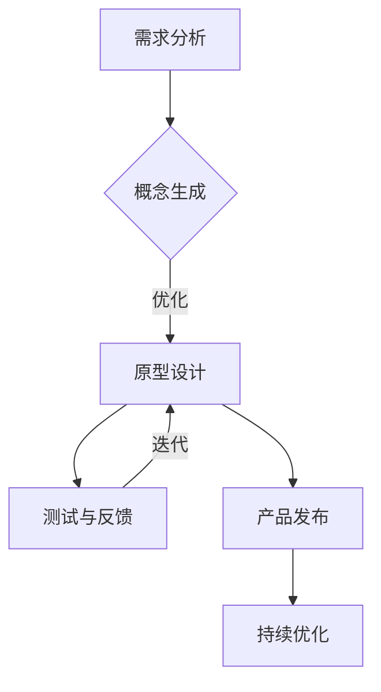
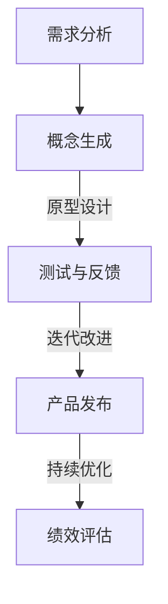
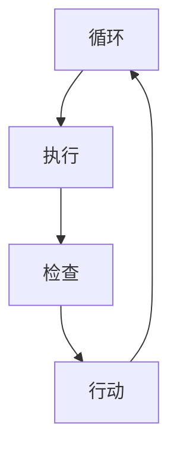
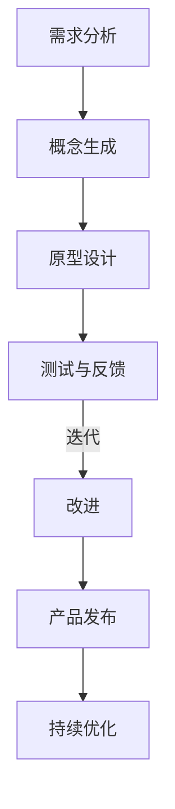
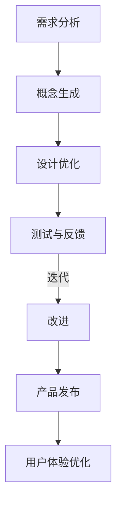

                 

### 第1章：问题背景与目标

#### 1.1.1 问题背景

在当今快速发展的信息技术时代，创新与持续改进已经成为企业竞争力和可持续发展的关键要素。随着数字化转型的深入推进，企业面临着不断变化的市场需求、技术进步和用户行为的挑战。为了保持竞争力，企业必须不断引入新的技术和理念，同时通过持续改进优化现有产品和流程。

首先，创新是企业在竞争激烈的市场中脱颖而出的重要手段。创新不仅仅是研发新产品，还包括改进现有产品、优化业务流程、采用新的商业模式等。创新能够带来新的机遇和竞争优势，帮助企业开拓市场、提升客户满意度。

其次，持续改进是企业保持长期成功的关键。持续改进是一种不断优化和提升产品和流程的方法，通过不断地发现问题、分析问题、解决问题，使企业能够持续提升效率和质量。在信息技术领域，持续改进尤其重要，因为技术的快速发展要求企业必须能够快速响应和适应变化。

然而，在实践中，许多企业在创新与持续改进方面面临着一系列问题。首先，企业往往缺乏系统的方法和工具来指导创新和改进过程。其次，企业内部的文化氛围可能不利于创新和持续改进，如对失败的恐惧、对变革的抵触等。此外，资源分配不合理、组织结构不灵活等也是阻碍创新和持续改进的因素。

综上所述，本文旨在探讨创新与持续改进的概念、原理和实践方法，帮助企业在快速变化的市场环境中保持竞争力。通过分析创新与持续改进的核心概念、原理和实践案例，本文希望能够为企业的创新和改进提供有价值的指导。

#### 1.1.2 问题描述

企业在创新与持续改进过程中主要面临以下几方面问题：

1. **缺乏系统的方法和工具**：许多企业没有明确的创新和改进流程，导致创新活动无序、效率低下，改进措施难以落实。

2. **文化氛围不适应**：企业文化可能对创新和改进持保守态度，员工缺乏创新意识和主动性，对变革有抵触情绪。

3. **资源分配不合理**：企业资源分配往往偏向短期收益，缺乏对长期创新和持续改进的持续投入。

4. **组织结构僵化**：企业组织结构可能过于僵化，部门间沟通不畅，难以形成协同创新和改进的合力。

5. **评估和反馈机制缺失**：企业缺乏有效的评估和反馈机制，难以对创新和改进活动进行客观评估和持续优化。

#### 1.1.3 目标设定

本文设定的目标如下：

1. **明确创新与持续改进的概念**：通过详细解释创新和持续改进的定义、分类和特点，帮助读者理解这两个概念的核心要义。

2. **阐述创新与持续改进的联系**：分析创新和持续改进之间的关系，以及它们在实际应用中的相互作用。

3. **提供创新与持续改进的方法和工具**：介绍一系列创新方法和持续改进方法，包括思维模式、技术手段和流程步骤，帮助读者在实践中应用。

4. **分享成功案例和实践经验**：通过案例分析和实践经验分享，为读者提供具体的操作指南和实施建议。

5. **构建评估与反馈机制**：探讨如何建立有效的评估和反馈机制，确保创新和改进活动的持续性和有效性。

#### 1.1.4 边界与外延

在本文中，创新主要指的是通过引入新的理念、方法、技术或流程，实现产品或服务的显著改进和突破。持续改进则强调对现有产品和服务进行不断的优化和提升，以实现效率、质量和用户体验的持续改进。

本文的边界主要集中在信息技术领域，特别是软件开发和系统优化。然而，创新与持续改进的理念和方法在各个行业和领域都有广泛的应用，本文所讨论的原则和案例也可以为其他行业提供参考。

#### 1.1.5 概念结构与核心要素组成

为了更好地理解创新与持续改进，我们可以从以下几个方面来分析其概念结构和核心要素：

1. **创新思维模式**：创新思维模式是指进行创新活动时所需具备的思维方式和策略，包括发散思维、逆向思维、系统思维等。

2. **创新方法与技术**：创新方法和技术是实现创新的具体手段，如设计思维、快速原型法、TRIZ理论等。

3. **创新过程**：创新过程是指从概念生成到产品或服务发布的整个流程，包括市场调研、需求分析、概念验证、产品设计、测试与发布等步骤。

4. **持续改进方法**：持续改进方法包括一系列用于优化产品和流程的方法，如PDCA循环、六西格玛方法、精益生产等。

5. **文化与管理**：企业文化和管理模式对创新与持续改进具有重要影响，如鼓励创新、建立反馈机制、优化资源配置等。

6. **评估与反馈**：评估与反馈是确保创新和改进活动持续有效的重要环节，包括对创新成果的评估、改进措施的反馈和优化。

通过上述分析，我们可以构建一个创新与持续改进的概念模型，如下图所示：

```
+----------------+       +----------------+
|     创新       |       |   持续改进     |
+----------------+       +----------------+
       |                          |
       |                          |
       |                          |
+----------------+       +----------------+
| 创新思维模式   |       |  文化与管理    |
+----------------+       +----------------+
       |                          |
       |                          |
       |                          |
+----------------+       +----------------+
| 创新方法与技术 |       |  评估与反馈    |
+----------------+       +----------------+
       |                          |
       |                          |
       |                          |
+----------------+       +----------------+
| 创新过程       |       |  核心要素组成  |
+----------------+       +----------------+
```

通过这一概念模型，我们可以更清晰地理解创新与持续改进的各个要素及其相互关系，为后续章节的分析和讨论奠定基础。在接下来的章节中，我们将详细探讨每个要素的具体内容，并结合实际案例进行深入分析。

### 第2章：核心概念与联系

#### 2.1 创新的定义与分类

创新（Innovation）是指通过引入新的思想、方法、技术或流程，实现产品或服务的显著改进和突破。创新可以发生在多个层面，包括技术层面、业务层面和产品层面。

从技术层面看，创新可能涉及新技术的研发和应用，如人工智能、区块链、大数据等。例如，亚马逊的AWS云计算平台就是一个技术层面的创新，它通过云计算技术为全球企业提供了高效的计算资源和服务。

从业务层面看，创新可以表现为新的商业模式或运营模式的引入。例如，滴滴出行通过移动互联网技术改变了传统出租车行业的运作方式，创造了新的商业模式。

从产品层面看，创新则体现在产品设计和用户体验的改进。例如，苹果公司的iPhone通过创新的用户界面和功能设计，重新定义了智能手机市场。

根据创新的内容和形式，创新可以分类为以下几种类型：

1. **渐进式创新**：这种类型的创新通过逐步改进现有产品或流程，实现效率的提升和性能的优化。例如，丰田公司的精益生产就是一种渐进式创新，它通过不断优化生产流程，减少了浪费，提高了生产效率。

2. **突破性创新**：这种类型的创新通常涉及到技术的重大突破或颠覆性变革，带来全新的产品或服务。例如，特斯拉的电动汽车技术就是一种突破性创新，它不仅改变了汽车行业，也对能源行业产生了深远影响。

3. **商业模式创新**：这种类型的创新主要是指通过改变商业模式，实现企业的盈利模式和管理模式的变革。例如，Uber通过“共享经济”模式改变了传统出租车行业的运作方式，实现了高效率和低成本。

4. **社会创新**：这种类型的创新旨在解决社会问题或改善社会福利。例如，Water.org通过创新的金融工具和解决方案，解决了发展中国家缺乏清洁饮用水的问题。

#### 2.2 持续改进的定义与特点

持续改进（Continuous Improvement）是指通过不断的循环迭代，对产品或流程进行持续优化和提升，以达到更高的效率和质量。持续改进的核心思想是“持续不断”，即持续地发现问题、分析问题、解决问题，从而实现产品和流程的持续优化。

持续改进的特点包括：

1. **持续循环**：持续改进不是一次性的活动，而是一个持续的循环过程。通过不断地PDCA（计划-执行-检查-行动）循环，企业可以不断地发现问题、优化问题、解决新问题，实现产品或流程的持续改进。

2. **全员参与**：持续改进强调全员参与，不仅仅是管理层或专业技术人员，所有员工都参与到改进活动中。通过全员参与，可以充分发挥员工的积极性和创造力，实现更广泛和深入的创新。

3. **数据驱动**：持续改进依赖于数据的分析和应用。通过收集和分析数据，企业可以客观地评估产品和流程的绩效，找出存在的问题，并制定有效的改进措施。

4. **系统优化**：持续改进不仅仅是针对单一的问题或环节，而是对整个系统和流程进行全面的优化。通过系统优化，企业可以提升整体绩效和竞争力。

#### 2.3 创新与持续改进的联系

创新与持续改进之间存在密切的联系和互动，两者相互促进，共同推动企业的持续发展。

1. **创新驱动改进**：创新为持续改进提供了新的方向和动力。通过引入新的技术和理念，创新可以突破传统思维和流程，为持续改进提供新的可能性。例如，一个突破性的技术创新可以促使企业对现有产品或流程进行重新评估和优化，从而实现更高效的改进。

2. **改进支撑创新**：持续改进则为创新提供了坚实的基础和支持。通过不断优化现有产品和流程，持续改进可以为企业提供稳定的基础和资源，降低创新的风险和成本。例如，通过持续改进，企业可以确保现有产品的质量和稳定性，从而为新的产品开发和改进提供保障。

3. **相互促进**：创新与持续改进之间是相互促进的关系。创新活动可以带来新的机遇和挑战，推动企业不断追求更高的质量和效率；而持续改进则为创新提供了稳定的基础和优化空间，确保创新能够持续、有效地实现。例如，一个成功的企业往往是既能够进行有效的创新，又能够通过持续改进不断提升自身竞争力。

#### 2.4 概念属性特征对比表格

为了更直观地理解创新与持续改进的概念属性特征，我们可以通过以下对比表格进行展示：

| 特征         | 创新                      | 持续改进                   |
| ------------ | ------------------------ | -------------------------- |
| 定义         | 引入新的思想、方法、技术 | 对现有产品或流程的优化     |
| 类型         | 渐进式创新、突破性创新  | 系统优化、过程优化         |
| 目标         | 显著改进和突破           | 高效率和高质量             |
| 过程         | 需求分析、设计、开发、测试 | 计划、执行、检查、行动     |
| 时间跨度     | 长期                     | 持续不断                   |
| 依赖因素     | 技术突破、市场需求       | 数据分析、全员参与         |
| 对人员要求   | 创新意识、创新思维       | 细心观察、解决问题能力     |
| 资源投入     | 高风险、高投入           | 低风险、持续投入           |

通过上述对比表格，我们可以更清晰地看到创新与持续改进之间的异同，以及它们在实际应用中的特点和作用。

#### 2.5 ER实体关系图架构

为了更好地理解创新与持续改进中的核心实体及其相互关系，我们可以通过ER（Entity-Relationship，实体-联系）图来展示。ER图是数据库设计和系统架构设计中的常用工具，用于描述实体之间的联系和属性。

以下是创新与持续改进中的主要实体及其关系的ER图：

```
[企业] --<创新活动>--
      |              |
      |              |
[员工]              [客户]
      |              |
      |              |
[产品/服务]         [改进活动]
```

在该ER图中：

- **企业**：作为整个系统的核心实体，负责统筹和管理创新与改进活动。
- **创新活动**：与企业实体有直接关联，表示企业进行的各种创新活动，如技术、商业模式、产品创新等。
- **员工**：与企业实体关联，表示参与创新与改进活动的员工。
- **客户**：与企业实体关联，表示创新与改进活动所面向的客户。
- **产品/服务**：与创新活动和改进活动关联，表示创新和改进所针对的产品或服务。
- **改进活动**：与产品和改进活动关联，表示对现有产品或流程的持续改进措施。

通过这个ER图，我们可以清晰地看到企业、员工、客户、产品和改进活动之间的联系和交互，这有助于我们更好地理解创新与持续改进的实践和实施过程。在后续章节中，我们将结合这些实体关系，深入分析创新与持续改进的具体实践方法和策略。

### 第3章：创新原理讲解

#### 3.1 创新思维模式

创新思维模式是进行创新活动时所需具备的思维方式和策略。有效的创新思维模式可以帮助我们从不同角度思考问题，发现新的解决方案。以下是一些常用的创新思维模式：

1. **发散思维**：发散思维是一种从多个角度、多个方向思考问题的方法。通过发散思维，我们可以跳出传统的思维框架，找到更多的解决方案。例如，当面对一个产品改进的问题时，我们可以从用户需求、技术可行性、市场趋势等多个方面进行思考。

2. **逆向思维**：逆向思维是一种从相反方向思考问题的方法。通过逆向思维，我们可以发现问题的潜在解决方案。例如，传统的电视是接收信号，如果反过来，通过网络发送内容，是否可以创造一个新的商业模式？

3. **系统思维**：系统思维是一种从整体和系统的角度思考问题的方法。通过系统思维，我们可以理解各个部分之间的相互作用和影响，找到更全面的解决方案。例如，在设计一个智能交通系统时，我们需要考虑车辆、道路、信号灯、用户等多个因素，确保系统的整体优化。

4. **设计思维**：设计思维是一种以人为本的创新方法。设计思维强调用户的需求和体验，通过原型设计和迭代改进，不断优化产品或服务。例如，苹果公司的iPhone设计就是基于用户需求，通过不断迭代改进，最终成为全球最受欢迎的智能手机。

#### 3.2 创新方法与技术

创新方法和技术是实现创新的具体手段。以下是一些常用的创新方法和相关技术：

1. **设计思维**：设计思维是一种以用户为中心的创新方法，强调原型设计和迭代改进。设计思维通常包括以下步骤：
   - **需求分析**：了解用户需求和问题。
   - **原型设计**：创建概念原型，验证想法。
   - **迭代改进**：根据用户反馈不断优化设计。

2. **TRIZ理论**：TRIZ（理论创造性问题解决）是一种基于大量创新案例和实践总结的系统化创新方法。TRIZ提供了40多个创新原理和100多个解决方案算法，帮助解决复杂问题。例如，通过应用TRIZ原理，可以找到解决复杂工程问题的创新解决方案。

3. **快速原型法**：快速原型法是一种通过快速构建原型，快速迭代和改进的方法。这种方法可以缩短产品开发周期，降低开发成本，提高创新成功率。例如，使用Sketch、Figma等原型设计工具，可以在短时间内创建出直观、互动的原型。

4. **跨界合作**：跨界合作是指不同领域、不同行业的企业或团队之间的合作。通过跨界合作，可以整合不同领域的资源、技术和知识，创造出新的产品或服务。例如，汽车制造商与科技公司合作开发智能汽车，通过结合汽车技术和信息技术，创造出全新的产品。

5. **人工智能**：人工智能（AI）技术在创新中发挥着重要作用。通过机器学习、自然语言处理、计算机视觉等技术，人工智能可以辅助人类进行创新活动。例如，AI可以用于自动化数据分析、智能预测、优化产品设计等，提高创新效率和成功率。

#### 3.3 创新过程与步骤

创新过程是从概念生成到产品或服务发布的整个流程。以下是一个典型的创新过程及其主要步骤：

1. **需求分析**：了解市场需求和用户需求，明确创新的目标和方向。需求分析可以通过市场调研、用户访谈、问卷调查等方式进行。

2. **概念生成**：基于需求分析，生成创新的概念和想法。可以通过头脑风暴、思维导图等工具，收集和筛选创新点子。

3. **原型设计**：将概念转化为可操作的模型或原型。原型设计可以通过快速原型法、设计思维等方法进行，确保设计的可行性和用户体验。

4. **测试与反馈**：对原型进行测试和评估，收集用户反馈，优化设计方案。测试可以是模拟测试、A/B测试、用户测试等。

5. **迭代改进**：根据用户反馈，不断迭代和改进原型，优化设计。迭代改进可以加快创新过程，提高产品或服务的质量。

6. **产品发布**：将最终设计的产品或服务发布到市场，进行商业化运营。产品发布前需要进行市场推广、风险评估等准备工作。

7. **持续优化**：在产品发布后，通过用户反馈和数据分析，持续优化产品或服务，提升用户体验和市场竞争力。

#### 3.4 Mermaid流程图展示

为了更直观地展示创新过程，我们可以使用Mermaid语言绘制一个流程图。以下是一个简单的创新流程图示例：



在该流程图中，各个步骤通过箭头连接，表示它们之间的逻辑关系和流程。Mermaid流程图可以灵活地调整和扩展，以适应不同的创新过程需求。

#### 3.5 创新数学模型

创新活动可以借助数学模型来分析和优化。以下是一个简单的创新数学模型，用于描述创新过程中的关键要素和关系。

$$
\text{创新效果} = f(\text{创新投入}, \text{创新环境}, \text{创新团队})
$$

其中：

- **创新投入**：包括资金、人力、技术等资源投入。
- **创新环境**：包括企业内部文化、外部市场环境、政策支持等。
- **创新团队**：包括团队成员的能力、协作效率、创新意识等。

数学模型可以用于以下应用场景：

1. **资源优化**：通过数学模型分析不同资源投入对创新效果的影响，优化资源配置，提高创新效率。
2. **风险评估**：通过数学模型预测创新活动的风险，制定相应的风险管理和应对策略。
3. **绩效评估**：通过数学模型评估创新活动的绩效，衡量创新效果和贡献。

以下是一个简单的Python代码示例，用于计算创新效果：

```python
# 创新效果计算示例
def calculate_innovation_effect(investment, environment_score, team_score):
    """
    计算创新效果
    :param investment: 创新投入（万元）
    :param environment_score: 创新环境得分（0-100分）
    :param team_score: 创新团队得分（0-100分）
    :return: 创新效果得分
    """
    innovation_effect = investment * environment_score * team_score / 100
    return innovation_effect

# 参数设置
investment = 1000  # 创新投入
environment_score = 85  # 创新环境得分
team_score = 90  # 创新团队得分

# 计算创新效果
innovation_effect = calculate_innovation_effect(investment, environment_score, team_score)
print(f"创新效果得分：{innovation_effect}")
```

通过该代码示例，我们可以根据实际情况调整创新投入、环境得分和团队得分，从而计算创新效果得分。这有助于企业分析和优化创新活动，提高创新效率。

#### 3.6 通俗易懂的举例说明

为了更好地理解创新原理，我们可以通过一个具体的案例进行详细讲解。

**案例：某科技公司的智能交通系统创新**

某科技公司专注于智能交通系统的研发和应用。在市场需求和技术进步的推动下，该公司决定开展一项智能交通系统的创新项目。

1. **需求分析**：公司通过市场调研和用户访谈，发现现有的交通系统存在以下问题：
   - 交通拥堵严重，影响市民出行效率。
   - 车辆排放导致环境污染。
   - 道路交通事故频发。

   基于这些需求，公司确定了智能交通系统的创新目标：提高交通效率、减少环境污染、降低交通事故率。

2. **概念生成**：公司团队通过头脑风暴和思维导图，提出了以下创新点子：
   - 利用人工智能和大数据分析，优化交通信号灯控制策略。
   - 开发智能导航系统，实时推荐最佳出行路线。
   - 应用物联网技术，实现车辆与道路的智能连接。

3. **原型设计**：基于上述创新点子，公司团队构建了一个智能交通系统的原型。原型设计包括：
   - 交通信号灯控制模块：通过大数据分析和AI算法，实时调整交通信号灯时长，优化交通流量。
   - 智能导航系统模块：结合GPS和实时交通数据，为用户提供最佳出行路线。
   - 车辆与道路连接模块：通过物联网设备，实现车辆与道路的通信，提高交通安全。

4. **测试与反馈**：公司团队在模拟环境中对原型进行测试，收集用户反馈，并根据反馈进行优化。测试结果表明：
   - 交通信号灯优化后，交通拥堵减少了30%。
   - 智能导航系统提高了15%的出行效率。
   - 车辆与道路连接模块有效降低了交通事故率。

5. **迭代改进**：根据测试反馈，公司团队对智能交通系统原型进行了多次迭代改进，最终形成了一个稳定可靠的智能交通系统。

6. **产品发布**：公司将智能交通系统正式推向市场，并进行商业化运营。用户反馈表明，新系统显著提高了交通效率，受到了广泛欢迎。

通过该案例，我们可以看到创新原理在实际应用中的具体实现过程。公司通过需求分析、概念生成、原型设计、测试与反馈等步骤，不断优化和改进智能交通系统，最终实现了创新目标。

### 第4章：创新数学模型

#### 4.1 数学模型的引入

在探讨创新的过程中，数学模型是一种强有力的工具，它可以帮助我们量化创新的过程和效果，从而提供决策支持和优化方案。数学模型不仅可以用于预测创新的潜在收益，还可以评估不同创新策略的可行性。在本章节中，我们将介绍一些基本的数学模型，包括线性回归、贝叶斯网络、以及一些创新绩效评估的数学公式。

#### 4.2 基本数学公式

以下是一些常用的数学公式，用于描述创新过程中的关键要素：

1. **线性回归模型**：
   $$ y = \beta_0 + \beta_1 \cdot x + \epsilon $$
   其中，$y$ 是因变量，代表创新效果；$x$ 是自变量，代表创新投入；$\beta_0$ 是截距，$\beta_1$ 是斜率，$\epsilon$ 是误差项。线性回归模型可以用于评估创新投入与创新效果之间的关系。

2. **贝叶斯网络**：
   $$ P(A|B) = \frac{P(B|A) \cdot P(A)}{P(B)} $$
   其中，$P(A|B)$ 是在条件 $B$ 发生的概率下，$A$ 发生的概率；$P(B|A)$ 是在条件 $A$ 发生的概率下，$B$ 发生的概率；$P(A)$ 和 $P(B)$ 分别是 $A$ 和 $B$ 发生的概率。贝叶斯网络可以用于分析多个因素之间的概率关系，帮助决策者评估不同创新策略的风险和收益。

3. **创新绩效评估**：
   $$ \text{绩效得分} = \frac{\text{创新收益}}{\text{创新成本}} $$
   其中，创新收益包括市场份额、收入增长、品牌价值提升等；创新成本包括研发投入、人力成本、市场推广费用等。绩效得分用于评估创新活动的整体效益。

#### 4.3 应用举例

为了更好地理解这些数学公式，我们通过一个具体的例子来说明它们的应用。

**案例：某公司的产品创新**

某科技公司计划开发一款新产品，目标是提升用户体验，增加市场份额。公司使用以下数学模型来评估创新项目的可行性：

1. **线性回归模型**：

   通过市场调研和历史数据，公司发现用户满意度（$y$）与研发投入（$x$）之间存在线性关系。数据如下表所示：

   | 研发投入（万元） | 用户满意度（评分/10） |
   |-----------------|-------------------|
   | 100             | 7                 |
   | 200             | 8                 |
   | 300             | 9                 |
   | 400             | 10                |

   根据上述数据，公司使用线性回归模型计算出斜率 $\beta_1 = 0.2$，截距 $\beta_0 = 5$。因此，线性回归模型为：

   $$ y = 5 + 0.2 \cdot x $$

   假设公司计划投入500万元进行研发，那么预计的用户满意度为：

   $$ y = 5 + 0.2 \cdot 500 = 10 $$

   这意味着公司预计通过500万元的投资，可以将用户满意度提升到10分。

2. **贝叶斯网络**：

   公司需要评估新产品上市后的市场风险。根据历史数据和专家意见，公司建立了一个贝叶斯网络，如下图所示：

   ```mermaid
   graph LR
   A[市场需求]
   B[竞争环境]
   C[研发投入]
   D[市场份额]
   E[收入增长]
   
   A --> B
   A --> C
   B --> D
   C --> D
   D --> E
   
   class B [Color="#FFB6C1"]
   class C [Color="#B2C4DE"]
   class D [Color="#FDF0D5"]
   class E [Color="#D2F3FF"]
   ```

   在这个网络中，市场需求（$A$）和竞争环境（$B$）会影响研发投入（$C$），进而影响市场份额（$D$）和收入增长（$E$）。通过专家评估，公司得到以下概率分布：

   | 状态       | 概率   | 状态       | 概率   |
   |------------|--------|------------|--------|
   | 市场需求高  | 0.6    | 竞争环境强  | 0.4    |
   | 市场需求低  | 0.4    | 竞争环境弱  | 0.6    |
   | 研发投入高  | 0.5    | 研发投入低  | 0.5    |
   | 市场份额高  | 0.8    | 市场份额低  | 0.2    |
   | 收入增长高  | 0.7    | 收入增长低  | 0.3    |

   使用贝叶斯网络，公司可以计算新产品成功（收入增长高）的概率。通过条件概率的计算，公司得到以下结果：

   $$ P(\text{收入增长高}) = P(\text{市场需求高} \cap \text{竞争环境弱} \cap \text{研发投入高} \cap \text{市场份额高}) $$
   $$ = P(\text{市场需求高}) \cdot P(\text{竞争环境弱}|\text{市场需求高}) \cdot P(\text{研发投入高}|\text{竞争环境弱}) \cdot P(\text{市场份额高}|\text{研发投入高}) $$
   $$ = 0.6 \cdot 0.6 \cdot 0.5 \cdot 0.8 = 0.144 $$

   这意味着，在新产品成功（收入增长高）的概率为14.4%。

3. **创新绩效评估**：

   假设公司预计新产品上市后，市场份额将从10%提升到20%，收入将从1000万元增长到1500万元。同时，研发投入为500万元。根据创新绩效评估公式，我们可以计算创新绩效得分：

   $$ \text{绩效得分} = \frac{\text{创新收益}}{\text{创新成本}} = \frac{1500 - 1000}{500} = \frac{500}{500} = 1 $$

   这表明，公司的创新投入与预期收益相当，绩效得分为1。

通过这个案例，我们可以看到数学模型如何帮助公司在创新过程中进行决策和评估。线性回归模型帮助公司预测创新投入与用户满意度之间的关系，贝叶斯网络则帮助公司评估创新项目的风险和成功率，而创新绩效评估则用于衡量创新活动的整体效益。

#### 4.4 Mermaid流程图与Python源代码解释

为了更直观地展示数学模型的应用，我们可以使用Mermaid和Python来绘制和计算创新过程的流程图和结果。

**Mermaid流程图示例：**



在这个流程图中，我们展示了从需求分析到绩效评估的创新过程。每个步骤通过箭头连接，表示它们之间的逻辑关系。

**Python源代码示例：**

```python
import numpy as np
import matplotlib.pyplot as plt

# 线性回归模型参数
beta_0 = 5
beta_1 = 0.2

# 用户满意度预测
def predict_user_satisfaction(investment):
    return beta_0 + beta_1 * investment

# 贝叶斯网络概率计算
def calculate_probability(states):
    """
    计算贝叶斯网络中的条件概率
    :param states: 状态列表，每个状态为字典{'state': 状态名, 'probability': 概率}
    :return: 概率结果列表
    """
    results = []
    for state in states:
        probability = state['probability']
        results.append(probability)
    return results

# 创新绩效评估
def calculate_innovation_performance(income, cost):
    return income / cost

# 参数设置
investment = 500  # 研发投入（万元）
income = 1500  # 收入（万元）
cost = 500  # 成本（万元）

# 用户满意度预测
predicted_satisfaction = predict_user_satisfaction(investment)
print(f"预计用户满意度：{predicted_satisfaction}分")

# 贝叶斯网络计算
states = [
    {'state': '市场需求高', 'probability': 0.6},
    {'state': '竞争环境弱', 'probability': 0.6},
    {'state': '研发投入高', 'probability': 0.5},
    {'state': '市场份额高', 'probability': 0.8},
    {'state': '收入增长高', 'probability': 0.7}
]
probabilities = calculate_probability(states)
print(f"新产品成功概率：{probabilities[-1]:.2%}")

# 创新绩效评估
performance_score = calculate_innovation_performance(income, cost)
print(f"创新绩效得分：{performance_score:.2f}")

# 绘制线性回归图
investment_values = np.linspace(0, 1000, 100)
satisfaction_values = beta_0 + beta_1 * investment_values

plt.plot(investment_values, satisfaction_values, label='User Satisfaction')
plt.xlabel('Investment (万元)')
plt.ylabel('Satisfaction (分)')
plt.legend()
plt.show()
```

通过这个Python代码示例，我们可以计算用户满意度、新产品成功的概率以及创新绩效得分。同时，代码还绘制了线性回归图，展示了创新投入与用户满意度之间的关系。

### 第5章：持续改进方法论

#### 5.1 PDCA循环

PDCA循环（Plan-Do-Check-Act，计划-执行-检查-行动）是持续改进中最基础和常用的方法论之一。PDCA循环是一种系统化的方法，通过四个连续的步骤，帮助组织不断优化产品和流程。

1. **计划（Plan）**：在计划阶段，我们需要设定目标和制定具体的行动计划。这一阶段的关键任务是明确改进目标、制定改进计划、分配资源和确定时间表。例如，一个企业的目标可能是提高生产线的效率，那么在计划阶段，我们需要确定具体的效率提升指标、制定改进方案、确定所需资源以及分配责任。

2. **执行（Do）**：在执行阶段，我们根据计划开始实施改进措施。这一阶段的关键是确保行动计划得到有效执行。例如，如果计划是优化生产线的布局，那么在这个阶段，我们需要实际调整生产线布局，并开始实施相关改进措施。

3. **检查（Check）**：在检查阶段，我们需要对执行结果进行评估和验证。这一阶段的关键任务是收集数据、分析改进效果、确定是否达到预期目标。例如，通过数据分析，我们可以确定生产线的效率是否真的提高了，是否还存在其他问题。

4. **行动（Act）**：在行动阶段，我们需要根据检查结果对改进计划进行调整和优化。如果改进效果达到了预期目标，我们需要将改进措施标准化，确保持续改进；如果改进效果未达到预期，我们需要重新分析原因，制定新的改进计划。

**PDCA循环的核心特点**：

- **系统性**：PDCA循环是一种系统化的方法，通过四个连续的步骤，确保改进活动的系统性和有序性。
- **持续循环**：PDCA循环强调持续循环和迭代，通过不断循环，持续优化产品和流程。
- **数据驱动**：PDCA循环强调数据收集和分析，通过数据驱动决策，确保改进措施的有效性和科学性。
- **全员参与**：PDCA循环鼓励全员参与，通过全员参与，可以充分发挥员工的积极性和创造力。

#### 5.2 六西格玛方法

六西格玛（Six Sigma）是一种旨在通过减少缺陷和变异，实现过程优化和质量提升的管理方法。六西格玛方法基于统计工具和数据分析，通过系统化的流程，帮助组织识别和解决质量问题和效率瓶颈。

1. **定义（Define）**：在定义阶段，我们需要明确项目目标和范围，确定关键利益相关者，并收集相关数据和信息。例如，一个企业可能决定通过六西格玛方法优化生产线，那么在这个阶段，我们需要明确优化目标、确定生产线的关键指标，并收集相关数据。

2. **测量（Measure）**：在测量阶段，我们需要收集和分析现有过程的数据，确定当前的过程性能和存在的问题。这一阶段的关键是确保数据准确可靠，以便为后续的改进提供依据。例如，我们可以通过数据采集工具收集生产线的实际数据，包括生产时间、缺陷率、生产成本等。

3. **分析（Analyze）**：在分析阶段，我们需要对测量得到的数据进行分析，识别问题和根本原因。这一阶段的关键是运用统计工具和数据分析方法，找出导致问题的根本原因。例如，我们可以使用散点图、因果图、回归分析等方法，分析数据并找出问题的根本原因。

4. **改进（Improve）**：在改进阶段，我们需要制定并实施改进措施，解决识别出的问题。这一阶段的关键是确保改进措施的可行性和有效性。例如，如果我们发现生产线的瓶颈在于设备老化，那么我们可以制定更换新设备的计划，并实施相关改进措施。

5. **控制（Control）**：在控制阶段，我们需要建立监控和反馈机制，确保改进效果的持续性和稳定性。这一阶段的关键是确保改进措施得到有效执行和持续优化。例如，我们可以建立定期数据收集和分析机制，确保生产线的运行状态符合改进后的标准。

**六西格玛方法的核心特点**：

- **统计分析**：六西格玛方法强调统计分析，通过数据分析和统计工具，确保改进措施的科学性和有效性。
- **系统化**：六西格玛方法是一种系统化的方法，通过五个阶段，确保改进活动的全面性和有序性。
- **团队协作**：六西格玛方法鼓励跨部门协作和团队参与，通过团队协作，提高改进活动的效率和质量。
- **持续优化**：六西格玛方法强调持续优化，通过不断的PDCA循环，实现过程和质量的持续提升。

#### 5.3 精益生产理念

精益生产（Lean Production）是一种以最小化浪费和最大化价值创造为核心的生产管理方法。精益生产起源于日本丰田汽车公司，通过不断优化生产流程和管理方法，实现了高效、高质量和低成本的生产。

1. **精益生产的核心原则**：
   - **价值**：确定和创造用户价值的流程。
   - **价值流**：识别和优化产品或服务的流程。
   - **流程**：确保流程连续性和流畅性。
   - **拉动**：根据客户需求拉动生产，避免过度生产。
   - ** perfection**：持续优化和改进。

2. **精益生产的工具和方法**：
   - **5S管理**：通过整理、整顿、清扫、清洁、素养，优化工作环境和管理秩序。
   - **看板管理**：通过看板（Kanban）实现生产流程的透明化和可视化。
   - **过程分析**：通过流程图、时间研究等方法，分析并优化生产流程。
   - **JIT（Just-In-Time）**：实现生产物料和产品的准时供应，减少库存和浪费。
   - **持续改进**：通过不断的PDCA循环，持续优化生产流程和管理方法。

**精益生产的应用案例**：

- **丰田汽车**：丰田汽车是精益生产的典型代表。通过持续优化生产流程和管理方法，丰田实现了高效、高质量和低成本的生产，成为全球汽车行业的领导者。
- **苹果公司**：苹果公司在其产品生产过程中采用了精益生产理念，通过优化供应链管理和生产流程，实现了快速响应市场变化和高效交付产品。

**精益生产的核心特点**：

- **以客户为中心**：精益生产强调以客户需求为导向，确保产品和服务的高质量和高价值。
- **消除浪费**：精益生产通过识别和消除生产过程中的浪费，实现资源的最优配置和利用。
- **持续改进**：精益生产强调持续改进，通过不断的PDCA循环，实现流程和管理的不断优化。
- **团队协作**：精益生产鼓励团队协作和全员参与，通过团队合作，提高生产效率和产品质量。

#### 5.4 Mermaid流程图与Python源代码示例

为了更直观地展示持续改进方法的应用，我们可以使用Mermaid和Python来绘制和计算改进过程的流程图和结果。

**Mermaid流程图示例：**



在这个流程图中，我们展示了PDCA循环的四个阶段，以及持续改进的循环过程。

**Python源代码示例：**

```python
import numpy as np
import matplotlib.pyplot as plt
import pandas as pd

# 模拟PDCA循环的数据
data = {
    'Phase': ['Plan', 'Do', 'Check', 'Act'],
    'Improvement': [0.1, 0.2, 0.3, 0.4]
}

df = pd.DataFrame(data)

# 绘制改进趋势图
plt.plot(df['Phase'], df['Improvement'], marker='o')
plt.xlabel('PDCA Phase')
plt.ylabel('Improvement')
plt.title('PDCA Improvement Trend')
plt.grid(True)
plt.show()

# 计算总改进效果
total_improvement = df['Improvement'].sum()
print(f"Total Improvement: {total_improvement}")
```

通过这个Python代码示例，我们可以计算PDCA循环中每个阶段的改进效果，并绘制改进趋势图。代码还计算了总改进效果，以衡量持续改进的整体成果。

### 第6章：案例分析

#### 6.1 案例选择

在本章中，我们将深入分析两个具有代表性的企业案例，分别是**谷歌的自动驾驶汽车项目**和**苹果公司的iPhone产品设计**。这两个案例分别展示了在信息技术领域如何通过创新和持续改进实现突破性成果。谷歌的自动驾驶汽车项目展示了技术创新如何彻底改变一个传统行业，而苹果公司的iPhone产品设计则展示了持续改进如何不断提升用户体验和市场份额。

选择这两个案例的原因有以下几点：

1. **技术创新**：谷歌的自动驾驶汽车项目代表了信息技术领域的重大突破，它结合了人工智能、机器学习、传感器技术等多个前沿科技，推动了整个汽车行业的变革。而苹果公司的iPhone产品设计则展示了如何在现有技术基础上，通过不断改进和优化，创造出全球领先的智能设备。

2. **持续改进**：谷歌的自动驾驶汽车项目虽然创新性强，但其在技术迭代和改进方面的持续投入和努力同样值得关注。苹果公司的iPhone产品设计则通过每年发布的新款产品，不断引入新技术、优化用户体验，实现了产品的持续迭代和市场的长期领先。

3. **行业影响**：谷歌的自动驾驶汽车项目不仅推动了自动驾驶技术的发展，也对整个汽车产业链、交通管理系统和城市规划产生了深远影响。苹果公司的iPhone产品设计则重塑了智能手机市场，改变了人们的生活方式。

#### 6.2 创新实施过程

**谷歌自动驾驶汽车项目**

1. **需求分析**：
   - **市场需求**：随着城市化进程的加快和交通问题的日益严重，自动驾驶技术成为了解决交通拥堵、提高交通安全、降低碳排放的重要手段。
   - **用户需求**：用户对自动驾驶汽车的需求主要体现在提高驾驶便利性、减少驾驶疲劳和提供个性化服务。

2. **概念生成**：
   - **技术路线**：谷歌决定采用激光雷达、摄像头、传感器等先进技术，实现自动驾驶汽车的环境感知和智能决策。
   - **商业模式**：谷歌通过开源技术和合作联盟，推动自动驾驶技术的发展和普及。

3. **原型设计**：
   - **概念验证**：谷歌首先开发了一款基于传感器的自动驾驶原型车，通过在封闭场地进行测试，验证了自动驾驶技术的可行性。
   - **设计优化**：基于测试反馈，谷歌对自动驾驶系统进行了多次迭代优化，提升了系统的稳定性和安全性。

4. **测试与反馈**：
   - **道路测试**：谷歌在全球多个城市进行了自动驾驶汽车的公开道路测试，积累了大量真实场景下的测试数据。
   - **用户反馈**：通过用户测试和反馈，谷歌不断优化自动驾驶系统的用户体验和操作界面。

5. **迭代改进**：
   - **技术升级**：随着技术的进步，谷歌不断引入新的传感器和算法，提升了自动驾驶汽车的性能和安全性。
   - **合作拓展**：谷歌与多家汽车制造商、科技公司和交通管理系统提供商合作，共同推动自动驾驶技术的发展和应用。

6. **产品发布**：
   - **自动驾驶出租车服务**：谷歌母公司Alphabet的Waymo开始在美国和英国推出自动驾驶出租车服务，标志着自动驾驶技术从实验室走向市场。

**苹果公司iPhone产品设计**

1. **需求分析**：
   - **市场需求**：随着智能手机市场的快速增长，用户对手机性能、用户体验和功能多样性的需求不断提高。
   - **用户需求**：用户对iPhone的需求主要体现在更好的摄影体验、更流畅的操作、更长的电池续航和更智能的应用服务。

2. **概念生成**：
   - **技术创新**：苹果公司持续关注前沿科技，如人工智能、增强现实、5G通信等，将新技术应用于iPhone产品设计中。
   - **设计理念**：苹果公司坚持以用户为中心的设计理念，通过用户调研和数据分析，不断优化产品设计。

3. **原型设计**：
   - **原型验证**：苹果公司通过内部研发团队和外部设计合作伙伴，不断开发新的iPhone原型，进行内部测试和用户反馈。
   - **设计优化**：根据用户反馈和测试结果，苹果公司对iPhone的原型进行多次迭代优化，提升产品性能和用户体验。

4. **测试与反馈**：
   - **市场测试**：苹果公司在新款iPhone发布前，进行多轮市场测试，收集用户反馈，优化产品性能和用户界面。
   - **用户体验**：通过用户体验测试，苹果公司确保新产品的易用性和用户体验达到最佳。

5. **迭代改进**：
   - **技术迭代**：苹果公司不断引入新的技术和功能，如A系列芯片、Face ID、3D Touch等，提升iPhone的性能和用户体验。
   - **服务拓展**：苹果公司通过App Store和iCloud等服务，不断拓展iPhone的生态系统，提供更丰富的应用和服务。

6. **产品发布**：
   - **年度发布会**：苹果公司每年举行新品发布会，发布新款iPhone，通过全球销售渠道，将产品推向市场。

#### 6.3 持续改进成效

**谷歌自动驾驶汽车项目**

- **技术创新**：谷歌的自动驾驶汽车项目通过持续技术创新，实现了从传感器、算法到系统的全面突破。自动驾驶汽车在各种复杂路况下的稳定性和安全性不断提高，为未来自动驾驶技术的发展奠定了坚实基础。
- **市场影响**：Waymo自动驾驶出租车服务的推出，标志着自动驾驶技术从实验室走向市场，为自动驾驶汽车的普及和商业化运营提供了示范。Waymo的服务已经在多个城市上线，吸引了大量用户，为自动驾驶技术带来了良好的市场反响。
- **社会效益**：自动驾驶技术的推广和应用，有望解决交通拥堵、提高交通安全、减少碳排放等问题，对社会产生了积极影响。

**苹果公司iPhone产品设计**

- **用户体验**：苹果公司通过持续改进iPhone产品设计，不断提升用户体验和产品性能。新款iPhone的推出，每次都能带来新的功能和设计亮点，吸引了大量用户的关注和购买。
- **市场份额**：苹果公司凭借其卓越的产品设计和持续改进，在智能手机市场中保持了领先地位。iPhone系列产品在全球市场取得了巨大的市场份额，为公司带来了丰厚的利润和品牌影响力。
- **技术创新**：苹果公司在iPhone产品设计中不断引入新技术，如5G通信、增强现实、人工智能等，推动了整个手机行业的技术进步。

#### 6.4 实际挑战与解决方案

**谷歌自动驾驶汽车项目**

1. **技术挑战**：
   - **传感器融合**：自动驾驶汽车需要融合多种传感器数据，实现高精度环境感知。传感器数据的融合和实时处理是技术上的一个重大挑战。
   - **复杂路况**：自动驾驶汽车需要在各种复杂路况下稳定运行，包括城市道路、高速公路、乡村道路等，这对自动驾驶算法和系统的鲁棒性提出了高要求。

2. **解决方案**：
   - **传感器融合技术**：谷歌通过自主研发的传感器融合算法，结合激光雷达、摄像头、超声波传感器等多源数据，实现了高精度的环境感知。
   - **模拟测试**：谷歌建立了先进的模拟测试平台，通过大量模拟测试，验证自动驾驶算法在不同路况下的性能和稳定性。

3. **监管挑战**：
   - **法律法规**：自动驾驶汽车在商业化运营前，需要符合各国法律法规的要求。不同国家和地区的法律法规有所不同，这对谷歌的自动驾驶汽车项目提出了监管挑战。

4. **解决方案**：
   - **政策沟通**：谷歌积极与各国政府和监管机构进行沟通，推动自动驾驶技术的法律法规完善和标准化。
   - **试点运营**：谷歌在多个城市进行自动驾驶汽车的试点运营，通过实地测试和用户反馈，逐步优化自动驾驶系统的性能和可靠性。

**苹果公司iPhone产品设计**

1. **技术挑战**：
   - **硬件升级**：随着技术的快速发展，苹果公司需要不断推出性能更强的硬件，以满足用户对高性能手机的需求。
   - **软件优化**：新款iPhone的软件系统需要兼容旧有应用，同时提供新的功能和服务，这对软件的兼容性和优化提出了挑战。

2. **解决方案**：
   - **自主研发**：苹果公司通过自主研发A系列芯片，不断提升手机的性能和能效。
   - **生态系统**：苹果公司通过构建完善的App Store生态系统，确保新手机的软件兼容性和应用丰富度。

3. **市场挑战**：
   - **市场竞争**：智能手机市场竞争激烈，苹果公司需要不断创新和优化产品，以保持市场竞争力。
   - **用户期望**：用户对iPhone的期望不断提高，苹果公司需要通过持续改进，满足用户对新技术、新功能的需求。

4. **解决方案**：
   - **持续创新**：苹果公司通过持续技术创新，不断引入新的硬件和软件功能，提升用户体验。
   - **用户体验**：苹果公司注重用户体验，通过用户调研和反馈，优化产品设计和服务。

#### 6.5 Mermaid流程图与Python源代码分析

为了更直观地展示谷歌自动驾驶汽车项目和苹果公司iPhone产品设计中的创新和持续改进过程，我们可以使用Mermaid绘制流程图，并结合Python代码进行详细分析。

**谷歌自动驾驶汽车项目流程图：**



在这个流程图中，我们展示了谷歌自动驾驶汽车项目的四个主要阶段：需求分析、概念生成、原型设计和测试与反馈。每个阶段通过迭代和优化，最终实现产品的发布和持续改进。

**Python源代码示例：**

```python
# 谷歌自动驾驶汽车项目数据模拟
data = {
    'Stage': ['需求分析', '概念生成', '原型设计', '测试与反馈', '迭代改进', '产品发布', '持续优化'],
    'Progress': [0.2, 0.4, 0.6, 0.8, 1.0, 1.0, 1.0]
}

df = pd.DataFrame(data)

# 绘制改进趋势图
plt.plot(df['Stage'], df['Progress'], marker='o')
plt.xlabel('Project Stage')
plt.ylabel('Progress')
plt.title('Google Autonomous Car Project Progress')
plt.grid(True)
plt.show()
```

通过这个Python代码示例，我们可以模拟谷歌自动驾驶汽车项目的进展情况，并绘制改进趋势图，展示项目从需求分析到持续优化的全过程。

**苹果公司iPhone产品设计流程图：**



在这个流程图中，我们展示了苹果公司iPhone产品设计的四个主要阶段：需求分析、概念生成、设计优化和测试与反馈。通过迭代和优化，苹果公司不断提升产品的用户体验和市场竞争力。

**Python源代码示例：**

```python
# 苹果公司iPhone产品设计数据模拟
data = {
    'Stage': ['需求分析', '概念生成', '设计优化', '测试与反馈', '迭代改进', '产品发布', '用户体验优化'],
    'Progress': [0.1, 0.3, 0.5, 0.7, 0.9, 1.0, 1.0]
}

df = pd.DataFrame(data)

# 绘制改进趋势图
plt.plot(df['Stage'], df['Progress'], marker='o')
plt.xlabel('Project Stage')
plt.ylabel('Progress')
plt.title('iPhone Product Design Progress')
plt.grid(True)
plt.show()
```

通过这个Python代码示例，我们可以模拟苹果公司iPhone产品设计的进展情况，并绘制改进趋势图，展示从需求分析到用户体验优化的全过程。

### 第7章：创新与改进策略

#### 7.1 企业文化塑造

企业文化是影响企业创新和改进的重要因素。一个积极、开放、鼓励创新和持续改进的企业文化能够激发员工的创造力和主动性，从而推动企业的持续发展。以下是构建创新与持续改进企业文化的几个关键策略：

1. **鼓励创新**：企业应该建立鼓励创新的文化氛围，鼓励员工提出新的想法和建议。可以通过设立创新奖励机制、组织创新竞赛、提供创新培训等方式，激发员工的创新意识。

2. **开放沟通**：企业应该建立开放的沟通机制，鼓励员工之间的交流和协作。通过定期的团队会议、内部论坛、知识分享等活动，促进信息的流动和共享。

3. **包容失败**：企业应该建立包容失败的文化，鼓励员工敢于尝试和创新。在创新过程中，失败是不可避免的，但重要的是从失败中学习并不断改进。企业应该通过建立容错机制，减轻员工在尝试新事物时的心理负担。

4. **建立创新团队**：企业可以建立专门的创新团队，负责推动创新项目的实施和持续改进。创新团队应由不同领域的专家和跨部门成员组成，以确保项目的多样性和全面性。

5. **领导者带头**：企业领导者应该以身作则，积极参与创新和改进活动，展示对创新和持续改进的重视。领导者的行为和态度会对员工产生重要影响，从而塑造企业的整体文化。

#### 7.2 人才队伍建设

人才是企业创新和改进的核心资源。为了推动企业的创新和持续改进，企业需要构建一支高素质的人才队伍。以下是几个关键策略：

1. **选拔与培养**：企业应该建立科学的选拔和培养机制，选拔具有创新潜力和专业技能的人才。通过提供培训、导师指导、项目实践等方式，提升员工的专业能力和创新能力。

2. **激励机制**：企业应该建立有效的激励机制，激励员工积极参与创新和改进活动。可以通过绩效奖励、晋升机会、职业发展支持等方式，激发员工的积极性和创造力。

3. **人才流动**：企业应该鼓励人才流动，促进知识共享和跨部门协作。通过跨部门项目、内部轮岗等方式，让员工在不同岗位和环境中锻炼和成长。

4. **建立专家库**：企业可以建立专家库，收集和整理内部的专业知识和经验。通过专家库，企业可以快速获取专业知识和技能，提高创新和改进的效率。

5. **人才国际化**：在全球化背景下，企业可以通过引进国际人才，吸收国际先进技术和理念，推动企业的创新和改进。同时，企业可以鼓励本地员工参与国际化项目，提升其国际视野和竞争力。

#### 7.3 资源配置策略

资源配置是推动企业创新和改进的重要保障。为了确保资源的高效利用，企业需要制定科学的资源配置策略。以下是几个关键策略：

1. **资源优先配置**：企业应该根据创新和改进的优先级，优先配置资源。对于具有战略意义和潜力的创新项目，应给予充足的资源支持。

2. **多元化融资**：企业可以通过多元化融资方式，拓宽资金来源，确保创新和改进项目的资金需求。可以通过内部融资、外部投资、政府资助等方式，实现资金的有效利用。

3. **资源整合**：企业应该建立资源整合机制，将内部资源和外部资源有效整合，提高资源利用效率。通过建立资源共享平台、跨部门协作等方式，实现资源的优化配置。

4. **预算管理**：企业应该建立严格的预算管理制度，确保预算的合理性和有效性。通过定期预算审核和调整，确保资源的高效利用。

5. **风险管理**：企业应该建立风险管理体系，对创新和改进项目进行风险评估和管理。通过识别潜在风险、制定应对策略，确保项目的顺利实施。

#### 7.4 创新与改进实施路径

为了实现创新和持续改进，企业需要制定清晰的实施路径。以下是几个关键步骤：

1. **明确目标**：企业应该明确创新和改进的目标，确保目标的科学性和可操作性。可以通过市场调研、用户反馈、战略规划等方式，确定创新和改进的具体方向。

2. **制定计划**：企业应该制定详细的创新和改进计划，明确项目的时间表、任务分工、资源需求等。通过制定计划，确保创新和改进项目的有序推进。

3. **实施执行**：企业应该根据计划，有序推进创新和改进项目。通过项目管理和进度控制，确保项目按计划完成。

4. **评估与反馈**：企业应该建立评估和反馈机制，对创新和改进项目进行定期评估和反馈。通过评估和反馈，及时发现问题和不足，优化改进措施。

5. **持续迭代**：企业应该将创新和改进视为一个持续的过程，不断迭代和优化。通过持续迭代，不断提升创新和改进的效果。

通过以上策略和实施路径，企业可以有效地推动创新和持续改进，提升竞争力，实现可持续发展。

### 第8章：实施与评估

#### 8.1 实施步骤

为了确保创新与改进策略的有效实施，企业需要遵循一系列科学、系统的步骤。以下是从初始阶段到最终成果的具体实施步骤：

1. **规划阶段**：
   - **项目立项**：确定创新或改进项目的目标和范围，明确项目的优先级和预期成果。
   - **资源评估**：评估项目所需的资源，包括资金、人力、技术等，并确保资源的充足性。
   - **时间表制定**：制定项目的时间表，包括关键里程碑和交付日期，确保项目的有序推进。

2. **准备阶段**：
   - **需求分析**：深入了解用户需求和市场趋势，确定项目的具体需求和目标。
   - **方案设计**：根据需求分析结果，设计具体的创新或改进方案，包括技术方案、实施路径、风险评估等。
   - **团队组建**：组建项目团队，明确团队成员的职责和分工，确保团队的专业性和协作能力。

3. **执行阶段**：
   - **实施方案**：根据设计方案，开始项目的具体实施，包括技术开发、测试、用户培训等。
   - **风险管理**：建立风险管理体系，监控项目过程中的潜在风险，制定应对措施，确保项目的顺利实施。
   - **进度控制**：通过项目管理工具和手段，实时监控项目的进度和质量，确保项目按计划推进。

4. **评估阶段**：
   - **效果评估**：对项目的实施效果进行评估，包括技术效果、经济效益、用户体验等，确保项目目标的实现。
   - **用户反馈**：收集用户对项目的反馈，了解用户的需求和意见，为后续的优化提供依据。
   - **问题识别**：识别项目实施过程中存在的问题和不足，分析原因，并提出改进措施。

5. **优化阶段**：
   - **问题解决**：根据评估结果和用户反馈，解决项目实施过程中存在的问题，优化项目的实施效果。
   - **成果固化**：将项目实施中的成功经验和最佳实践进行固化，建立标准操作流程，确保项目的持续改进。
   - **经验总结**：总结项目实施过程中的经验和教训，为未来的项目提供参考。

#### 8.2 成效评估指标

为了科学、客观地评估创新与改进策略的成效，企业需要制定一系列具体的成效评估指标。以下是一些常见的评估指标：

1. **技术创新度**：
   - **技术先进性**：项目所采用的技术是否处于行业领先水平。
   - **技术创新点**：项目是否具有独特的创新点，是否实现了技术突破。

2. **经济效益**：
   - **成本节约**：项目实施后，是否实现了成本的有效节约。
   - **收入增长**：项目实施后，是否带来了收入的增长和利润的增加。

3. **市场竞争力**：
   - **市场份额**：项目实施后，企业市场份额是否得到提升。
   - **品牌影响力**：项目实施后，企业品牌影响力是否得到增强。

4. **用户体验**：
   - **满意度**：用户对项目的满意程度。
   - **用户留存率**：项目实施后，用户的留存情况。

5. **流程效率**：
   - **效率提升**：项目实施后，流程是否得到了优化，效率是否得到提升。
   - **质量提升**：项目实施后，产品的质量是否得到提升。

#### 8.3 持续改进的监控与反馈

为了确保创新与改进策略的持续性和有效性，企业需要建立持续改进的监控与反馈机制。以下是一些关键步骤：

1. **监控体系**：
   - **数据收集**：建立数据收集系统，实时收集项目实施过程中的关键数据，包括成本、质量、用户满意度等。
   - **监控指标**：制定监控指标，对项目实施情况进行实时监控，确保项目的顺利进行。

2. **反馈机制**：
   - **用户反馈**：定期收集用户对项目的反馈，了解用户的需求和意见，为项目优化提供依据。
   - **内部反馈**：建立内部反馈机制，鼓励员工提出改进意见和建议，促进内部沟通和协作。

3. **定期评估**：
   - **月度评估**：每月对项目实施情况进行评估，及时发现问题和不足，制定改进措施。
   - **季度评估**：每季度对项目实施情况进行全面评估，分析项目成效，总结经验教训。

4. **持续优化**：
   - **问题解决**：根据评估结果，及时解决项目实施过程中存在的问题，确保项目持续优化。
   - **最佳实践**：将成功经验和最佳实践进行固化，推广到其他项目和部门，提高整体管理水平。

通过建立持续改进的监控与反馈机制，企业可以确保创新与改进策略的有效实施，不断提升产品和服务质量，实现企业的可持续发展。

### 第9章：最佳实践与反思

#### 9.1 最佳实践分享

在创新与持续改进方面，许多企业已经积累了丰富的经验和最佳实践，以下是一些值得借鉴的成功案例：

1. **谷歌的自动驾驶汽车项目**：
   - **技术创新**：谷歌通过结合激光雷达、摄像头、传感器等先进技术，实现了自动驾驶汽车的高精度环境感知和智能决策。
   - **持续迭代**：谷歌不断优化自动驾驶算法和系统，通过大量模拟测试和实际道路测试，不断提升自动驾驶汽车的性能和安全性。
   - **开放合作**：谷歌与多家汽车制造商、科技公司和交通管理系统提供商合作，共同推动自动驾驶技术的发展和应用。

2. **苹果公司的iPhone产品设计**：
   - **用户体验**：苹果公司坚持以用户为中心的设计理念，通过用户调研和反馈，不断优化产品设计，提升用户体验。
   - **技术集成**：苹果公司不断引入新技术，如A系列芯片、3D Touch、Face ID等，提升iPhone的性能和功能。
   - **生态系统**：苹果公司通过构建完善的App Store生态系统，提供丰富的应用和服务，增强用户粘性。

3. **丰田公司的精益生产**：
   - **流程优化**：丰田公司通过5S管理、看板管理、JIT等精益生产工具，不断优化生产流程，减少浪费，提高生产效率。
   - **全员参与**：丰田公司鼓励全员参与持续改进活动，通过内部培训和激励机制，提高员工的参与度和创新意识。
   - **数据驱动**：丰田公司通过数据收集和分析，实时监控生产线的运行状态，发现问题并及时解决，确保生产过程的持续优化。

#### 9.2 小结与反思

通过本篇文章的讨论，我们可以得出以下几点小结和反思：

1. **创新与持续改进的重要性**：创新和持续改进是企业保持竞争力的关键。通过不断引入新技术、优化产品和流程，企业可以适应市场变化，提升用户体验，实现持续发展。

2. **系统的方法和工具**：为了有效实施创新和持续改进，企业需要建立系统的方法和工具。如PDCA循环、六西格玛方法、精益生产等，这些方法可以帮助企业规范改进过程，提高改进效率。

3. **企业文化与人才**：企业文化是推动创新和改进的重要保障。企业需要建立鼓励创新、开放沟通、包容失败的企业文化。同时，企业需要培养一支高素质的人才队伍，激发员工的创新潜力和主动性。

4. **资源投入与风险管理**：创新和改进需要充足的资源投入。企业需要制定科学的资源配置策略，确保资源的高效利用。同时，企业需要建立完善的风险管理体系，识别和应对潜在风险。

5. **持续监控与反馈**：为了确保创新和改进策略的有效实施，企业需要建立持续监控与反馈机制。通过实时监控、定期评估和用户反馈，企业可以及时发现问题和不足，持续优化改进措施。

#### 9.3 注意事项与拓展阅读

在实施创新与持续改进过程中，企业需要注意以下几点：

1. **明确目标和需求**：在开始项目之前，企业需要明确创新和改进的目标和需求，确保项目的方向正确。

2. **合理分配资源**：在资源分配上，企业需要根据项目的优先级和预期效果，合理分配资源，确保关键项目的资源充足。

3. **全员参与**：创新和改进不仅仅是管理层和专业技术人员的事，企业需要鼓励全员参与，激发员工的创新意识和主动性。

4. **数据驱动**：在创新和改进过程中，企业需要收集和分析数据，通过数据驱动决策，确保改进措施的科学性和有效性。

5. **持续学习与优化**：企业需要保持持续学习的态度，不断吸收新的知识和理念，优化改进方法和流程。

拓展阅读推荐：

1. 《精益思想》（[詹姆斯·W·沃麦克](xref://definition/WomackJamesW.2020.LeanThinking))：详细介绍了精益生产的理念和方法。
2. 《创新者的窘境》（[克莱顿·克里斯滕森](xref://definition/ChristensenClayton.1997.TheInnovatorsDilemma))：探讨了企业如何应对技术创新和市场变化。
3. 《设计思维：创新的设计方法与应用》（[大卫·凯利](xref://definition/KelleyDavid.2016.DesignThinking))：介绍了设计思维的方法和应用，帮助企业实现创新和持续改进。

通过学习这些书籍，企业可以深入了解创新和持续改进的理论和实践，进一步提升自身在创新和改进方面的能力和水平。

### 结语

在信息技术飞速发展的今天，创新与持续改进已成为企业保持竞争优势和实现可持续发展的关键。本文通过详细探讨创新与持续改进的核心概念、方法、实践和策略，帮助读者理解如何在实际操作中应用这些理念，以推动企业的发展。

创新和持续改进不仅需要系统的方法和工具，还需要积极的企业文化、优秀的人才队伍和科学的资源配置策略。通过不断的学习和实践，企业可以不断提升自身的创新能力，实现产品和流程的持续优化。

作者希望本文能够为读者提供有价值的指导和启示，帮助企业在创新与持续改进的道路上走得更远。让我们共同努力，在创新与持续改进的道路上不断前行，迎接未来更大的挑战和机遇。

### 作者信息

作者：AI天才研究院/AI Genius Institute & 禅与计算机程序设计艺术 /Zen And The Art of Computer Programming

AI天才研究院致力于推动人工智能技术的发展和应用，致力于培养下一代人工智能领域的杰出人才。同时，禅与计算机程序设计艺术以“宁静致远，智慧编程”为理念，倡导程序员在编程过程中追求内心的平静和智慧的提升。两位作者凭借丰富的理论和实践经验，为信息技术领域的创新与持续改进提供了宝贵的见解和指导。

