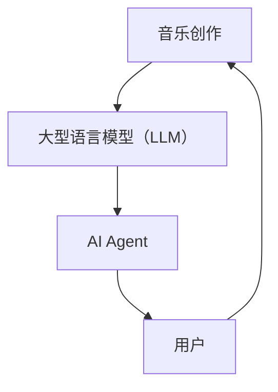

                 

### 第1章：音乐创作与AI的融合

#### 1.1.1 音乐创作的现状

音乐创作是人类艺术表现的一种重要形式，自古以来，音乐家们通过独特的旋律和节奏表达情感，传递思想。然而，随着时代的进步，音乐创作也面临着一系列挑战。一方面，全球音乐市场的竞争日益激烈，独立音乐人需要更加高效和创新的方法来创作音乐，以吸引听众。另一方面，音乐创作过程本身具有一定的随机性和复杂性，使得传统的音乐创作方式难以满足快速变化的市场需求。

在这个背景下，AI技术开始被引入到音乐创作领域。AI在音乐创作中的应用不仅有助于提高创作效率，还能够带来全新的创作体验。例如，通过AI技术，音乐人可以快速生成旋律和和弦，甚至创作整首歌曲。此外，AI还能够对音乐作品进行自动分类、推荐和风格转换，为音乐产业的数字化和智能化发展提供了强有力的支持。

#### 1.1.2 AI在艺术创作中的应用

AI在艺术创作中的应用已经逐渐成为一种趋势。从早期的绘画、雕塑，到音乐、文学，AI技术正不断改变着传统艺术创作的模式。例如，在绘画领域，AI可以通过学习大量的图像数据，生成全新的艺术作品。在文学创作方面，AI能够根据用户的输入生成故事、诗歌等文学作品。而在音乐创作中，AI更是以其独特的优势，成为了一种重要的辅助工具。

AI在艺术创作中的应用主要体现在以下几个方面：

1. **自动创作**：AI可以自动生成音乐、绘画等艺术作品，为艺术家提供灵感和创作素材。
2. **辅助创作**：AI可以帮助艺术家快速完成一些重复性、繁琐的工作，如生成和弦、旋律等，从而将艺术家的精力集中在更重要的创意环节。
3. **风格迁移**：AI可以将一种艺术风格迁移到另一种艺术风格中，创造出独特的艺术效果。
4. **数据分析和推荐**：AI可以分析大量的艺术作品数据，为用户提供个性化的艺术推荐，帮助用户发现潜在的艺术偏好。

#### 1.1.3 LLM在音乐创作中的作用

在AI技术中，大型语言模型（Large Language Model，简称LLM）是一种具有强大语言理解和生成能力的人工智能模型。LLM在音乐创作中的应用主要体现在以下几个方面：

1. **音乐生成**：LLM可以通过学习大量的音乐数据，生成新的旋律、和弦和歌曲。这使得音乐人可以快速获得灵感，提高创作效率。
2. **风格模仿**：LLM可以模仿特定音乐家的风格，创造出与原作品相似的新音乐。这对于音乐教育、研究具有重要意义。
3. **音乐编辑**：LLM可以对现有的音乐作品进行编辑，如调整节奏、和弦等，使其更符合用户的需求。
4. **个性化推荐**：LLM可以根据用户的喜好，推荐个性化的音乐作品，提升用户的音乐体验。

通过LLM的应用，音乐创作不仅变得更加高效，也带来了更多的创新可能。在接下来的章节中，我们将深入探讨LLM的工作原理、应用案例和技术挑战。

---

**核心概念与联系**

**核心概念：** 大型语言模型（LLM）、音乐创作、AI Agent

**概念属性特征对比表格：**

| 特征           | 大型语言模型（LLM） | 音乐创作           | AI Agent               |
| -------------- | ------------------ | ------------------ | ---------------------- |
| 定义           | 一种强大的语言模型   | 通过旋律、和弦表达情感 | 自动执行任务的智能体     |
| 功能           | 语言理解和生成      | 表达思想和情感       | 辅助创作、生成音乐作品   |
| 技术架构       | Transformer等模型   | 音符、和弦、节奏等   | 算法、用户交互、反馈机制 |

**ER实体关系图架构的Mermaid流程图：**

通过上述核心概念的介绍和特征对比，我们可以看到LLM在音乐创作中的独特价值和广泛应用前景。在接下来的章节中，我们将进一步探讨LLM的技术细节和应用实例，为音乐创作的AI时代奠定坚实基础。

