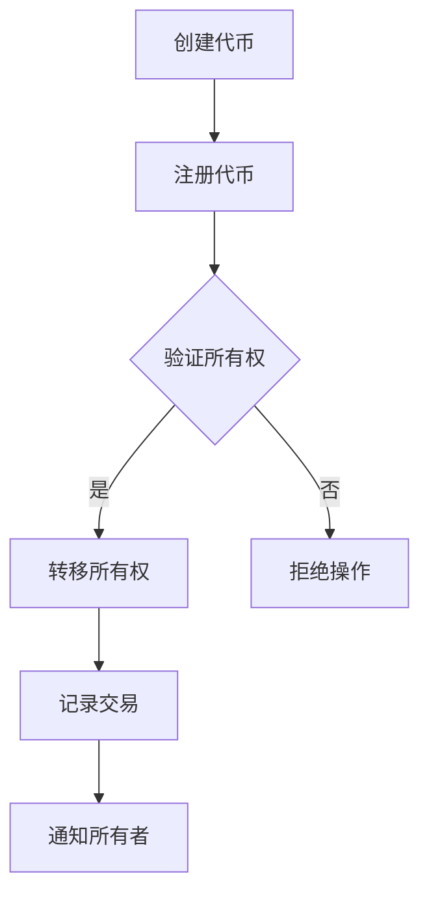
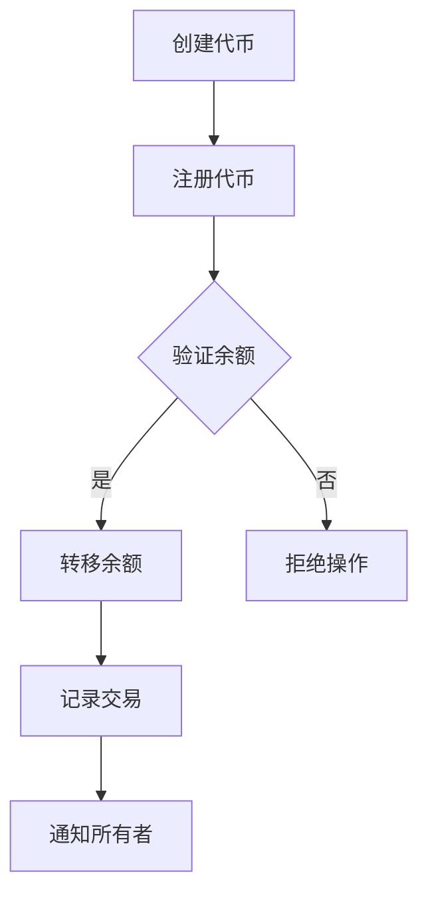
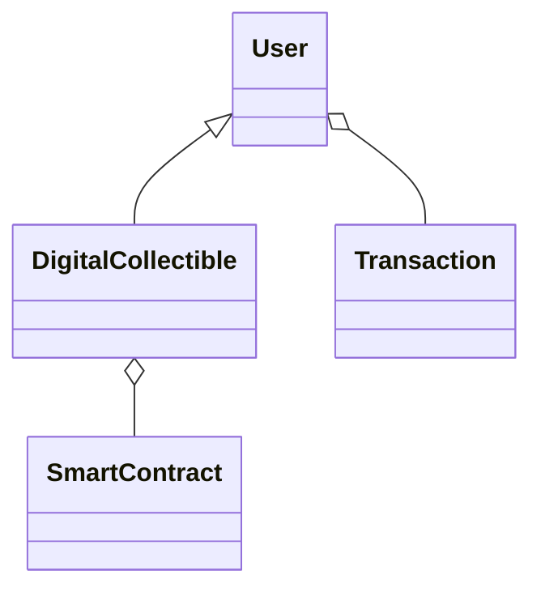
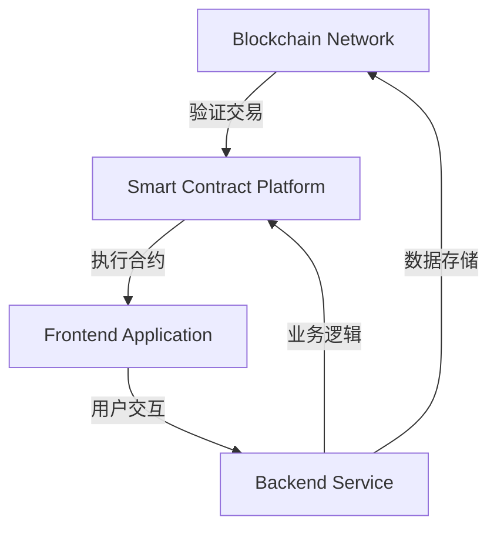
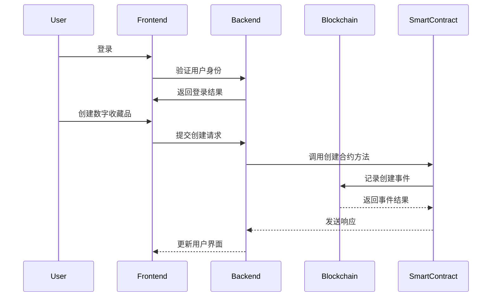

                 

### 背景介绍

区块链，作为一种分布式账本技术，近年来因其去中心化、透明性和不可篡改性而引起了全球范围内的广泛关注。区块链不仅仅是一个技术革新，更是一个革命性的理念，它颠覆了传统的信息记录和交换方式，使得数据的安全和隐私得以保障。随着区块链技术的不断发展和应用场景的拓展，其应用范围已经远远超出了最初的金融领域，逐渐渗透到数字收藏品、供应链管理、医疗健康等多个行业。

数字收藏品，作为区块链应用的一个重要领域，近年来也呈现出蓬勃发展的态势。数字收藏品通常是指那些数字化、独一无二且具有收藏价值的物品，如数字艺术品、虚拟土地、游戏道具等。这些物品通过区块链技术实现去中心化的发行和交易，确保其真实性和唯一性，同时也赋予持有者对其拥有完整的所有权证明。与传统收藏品相比，数字收藏品具有不可替代的优势，例如便捷的交易方式、全球性的流通渠道以及较低的门槛。

本书《区块链在数字collectibles中的应用》旨在探讨区块链技术在数字收藏品领域的应用，分析其带来的变革和挑战。本书将首先介绍区块链技术的基本概念，包括其工作原理、核心组成部分和技术特性，然后深入探讨数字收藏品的定义、现状以及与区块链技术的结合方式。接下来，本书将详细分析区块链在数字收藏品中的应用场景，探讨其面临的挑战和问题，并提出相应的解决方案。

在后续章节中，本书将逐步引入核心概念，如智能合约、非同质化代币（NFT）、数字收藏品等，并比较这些概念之间的差异和联系。通过绘制ER实体关系图，本书将直观展示数字收藏品与区块链技术之间的关联，帮助读者更好地理解这一领域的复杂性。此外，本书还将详细讲解与数字收藏品相关的区块链算法，如ERC-721和ERC-1155标准，并通过Python源代码和mermaid流程图进行深入剖析，使读者能够掌握这些算法的实际应用。

本书的目标读者是那些对区块链技术和数字收藏品领域有一定了解的读者，希望通过系统学习和深入研究，能够全面掌握区块链技术在数字收藏品中的应用方法。无论您是区块链开发者、数字收藏品爱好者，还是相关领域的从业者，本书都将成为您宝贵的参考资料和实践指南。通过本书的学习，读者将能够深入了解区块链在数字收藏品领域的应用前景，掌握关键技术和实践方法，为未来的创新和发展奠定坚实的基础。

### 核心概念与联系

在探讨区块链在数字收藏品中的应用时，我们需要明确几个核心概念，这些概念是理解区块链技术与数字收藏品相结合的基础。以下将逐一介绍这些核心概念，并绘制ER实体关系图以展示它们之间的关系。

#### 区块链技术

区块链是一种分布式数据库技术，通过加密算法和共识机制确保数据的不可篡改性和透明性。区块链的核心组成部分包括区块（Block）、链（Chain）、节点（Node）和挖矿（Mining）等。

- **区块**：区块链的基本单元，包含了特定时间段内的交易记录。
- **链**：由一系列按时间顺序排列的区块组成的链式数据结构。
- **节点**：参与区块链网络的计算机，负责验证交易、记录区块和传播信息。
- **挖矿**：通过计算解决数学难题，验证交易并创建新的区块。

#### 智能合约

智能合约是一种运行在区块链上的自执行合同，其条款直接以代码形式书写。智能合约能够自动执行预定的任务，确保交易的安全性和效率。智能合约的关键特性包括自执行、不可篡改和自动化。

- **自执行**：智能合约在满足特定条件时自动执行。
- **不可篡改**：一旦智能合约被部署，其代码和条款无法被修改。
- **自动化**：智能合约能够自动化执行复杂的交易流程，提高交易效率。

#### 非同质化代币（NFT）

非同质化代币（NFT）是一种基于区块链的独特数字资产，每个NFT都是独一无二的，代表了特定的数字收藏品。NFT的标识和所有权记录在区块链上，确保了其唯一性和不可替代性。

- **唯一性**：每个NFT都有独特的标识，无法与其他NFT互换。
- **不可替代性**：NFT的每件物品都具有其特定的价值和意义。
- **所有权证明**：NFT记录了持有者的所有权信息，确保物品的真实性和合法性。

#### 数字收藏品

数字收藏品是指数字化、独一无二且具有收藏价值的物品，如数字艺术品、虚拟土地和游戏道具等。数字收藏品通过区块链技术实现去中心化的发行和交易，确保其真实性和唯一性。

- **数字化**：数字收藏品以数字形式存在，便于全球流通。
- **独一无二**：数字收藏品具有独特性，每个物品都有其特定的价值和意义。
- **收藏价值**：数字收藏品因其稀缺性和独特性而具有收藏价值。

#### 概念属性特征对比表格

| 概念          | 特性                       | 说明                                                         |
|---------------|----------------------------|------------------------------------------------------------|
| 区块链        | 分布式、去中心化、不可篡改 | 数据记录在分布式账本上，无法篡改，确保数据透明和可信。           |
| 智能合约      | 自执行、不可篡改、自动化    | 合同条款以代码形式存在，自动执行，提高交易效率。               |
| 非同质化代币（NFT） | 唯一性、不可替代性、所有权证明 | 独一无二的数字资产，记录所有权信息。           |
| 数字收藏品    | 数字化、独一无二、收藏价值   | 数字化形式的收藏品，具有独特价值和稀缺性。               |

#### ER实体关系图

为了更直观地展示这些概念之间的关系，我们可以使用Mermaid工具绘制ER实体关系图。以下是一个简化的ER实体关系图，展示了区块链、智能合约、NFT和数字收藏品之间的关系。

```mermaid
erDiagram
  区块链 ||--|{ 智能合约 }|
  区块链 ||--|{ 非同质化代币（NFT）}|
  区块链 ||--|{ 数字收藏品 }|
  智能合约 ||--|{ 非同质化代币（NFT）}|
  数字收藏品 ||--|{ 非同质化代币（NFT）}|
```

在这个ER实体关系图中，区块链是核心，其通过智能合约、非同质化代币和数字收藏品实现了数据记录、执行合同、证明所有权等功能。智能合约是连接区块链与非同质化代币和数字收藏品的关键桥梁，确保交易的安全性和效率。非同质化代币（NFT）则是数字收藏品的唯一标识和所有权证明，保证了物品的真实性和唯一性。

通过上述核心概念和ER实体关系图的介绍，我们为后续章节的深入分析奠定了基础。接下来，我们将进一步探讨区块链算法，详细讲解ERC-721和ERC-1155标准，并通过实际应用案例展示这些算法在数字收藏品领域的具体应用。同时，我们将分析区块链在数字收藏品领域面临的挑战，并提出相应的解决方案，为读者提供全面的参考。

### 算法原理讲解

在深入探讨区块链在数字收藏品中的应用时，了解相关的区块链算法是至关重要的。在本章中，我们将重点介绍与数字收藏品密切相关的两个区块链标准：ERC-721和ERC-1155。通过绘制mermaid流程图和详细讲解Python源代码，我们将帮助读者更好地理解这些算法的工作原理及其数学模型。

#### ERC-721标准

ERC-721标准，也称为非同质化代币标准（Non-Fungible Token Standard），是由Ethereum开发的一个智能合约标准。该标准定义了创建和管理不可互换的代币的规则，使得每个代币都具有独特的属性和标识。

##### mermaid流程图

首先，我们通过mermaid流程图展示ERC-721的基本工作流程：



在这个流程图中，我们可以看到ERC-721标准的主要步骤包括创建代币、注册代币、验证所有权、转移所有权、记录交易和通知所有者。

##### Python源代码解析

接下来，我们使用Python源代码详细阐述ERC-721的算法原理。以下是ERC-721智能合约的一部分代码：

```python
pragma solidity ^0.8.0;

import "@openzeppelin/contracts/token/ERC721/ERC721.sol";
import "@openzeppelin/contracts/token/ERC721/extensions/ERC721URIStorage.sol";

contract MyNFT is ERC721, ERC721URIStorage {
    uint256 public totalTokens;

    constructor() ERC721("MyNFT", "MNF") {
        totalTokens = 0;
    }

    function mint(address to, uint256 tokenId, string memory tokenURI) public {
        require(totalTokens < 1000, "Max supply reached");
        _safeMint(to, tokenId);
        _setTokenURI(tokenId, tokenURI);
        totalTokens++;
    }

    function transferFrom(address from, address to, uint256 tokenId) public override {
        require(_isApprovedOrOwner(_msgSender(), tokenId), "Not owner or not approved");
        _transfer(from, to, tokenId);
    }
}
```

在这个代码中，我们定义了一个名为`MyNFT`的智能合约，继承自`ERC721`和`ERC721URIStorage`。这个合约包含了创建代币、铸造代币和转移所有权的功能。

- **创建代币**：通过`constructor`函数初始化NFT的名称和符号。
- **铸造代币**：`mint`函数用于创建新的NFT，并为其分配唯一的ID和URI。
- **转移所有权**：`transferFrom`函数用于将NFT从一个地址转移到另一个地址。

##### 算法数学模型与公式

ERC-721的数学模型主要涉及代币的唯一标识（tokenId）和所有权验证。以下是ERC-721的几个关键数学公式：

- **所有权验证**：
  $$ownerOf(tokenId) = \text{tokenId} \mod \text{maxSupply}$$
  其中，`tokenId`是NFT的唯一标识，`maxSupply`是NFT的最大供应量。通过这个公式，我们可以验证某个NFT的所有权。

- **转移所有权**：
  $$transfer = \text{tokenId} \rightarrow (\text{from}, \text{to})$$
  这个公式描述了NFT从`from`地址转移到`to`地址的过程。

##### 举例说明

假设我们有一个名为`MyNFT`的NFT合约，其最大供应量设置为1000个代币。一个用户`alice`通过`mint`函数铸造了一个新的NFT，其标识为100。现在，`alice`希望将这个NFT转移给用户`bob`。

1. `alice`调用`mint`函数，生成一个tokenId为100的NFT，并设置其URI。
2. `alice`调用`transferFrom`函数，将NFT从她的地址转移到`bob`的地址。
3. 在`transferFrom`函数中，首先验证`alice`是否是NFT的所有者，然后执行转移操作，将所有权从`alice`转移到`bob`。

通过这个例子，我们可以看到ERC-721标准在数字收藏品中的应用。ERC-721确保了每个NFT的唯一性和不可替代性，为数字收藏品的市场交易提供了可靠的基础。

#### ERC-1155标准

ERC-1155标准，也称为可互换和不可互换代币标准（Fungible and Non-Fungible Token Standard），是另一个在Ethereum平台上广泛使用的智能合约标准。与ERC-721不同，ERC-1155允许同时创建和管理可互换和不可互换的代币，从而提高了交易的效率和灵活性。

##### mermaid流程图

以下是ERC-1155的基本工作流程：



在这个流程图中，我们可以看到ERC-1155的主要步骤包括创建代币、注册代币、验证余额、转移余额、记录交易和通知所有者。

##### Python源代码解析

以下是ERC-1155智能合约的一部分代码：

```python
pragma solidity ^0.8.0;

import "@openzeppelin/contracts/token/ERC1155/ERC1155.sol";
import "@openzeppelin/contracts/token/ERC1155/extensions/ERC1155URIStorage.sol";

contract MyCollection is ERC1155 {
    constructor() ERC1155("https://example.com/metadata.json") {
        _mint(msg.sender, 1, 1, "");
    }

    function transferTokens(address to, uint256 tokenId, uint256 amount) public {
        _safeTransferFrom(msg.sender, to, tokenId, amount, "");
    }
}
```

在这个代码中，我们定义了一个名为`MyCollection`的智能合约，继承自`ERC1155`和`ERC1155URIStorage`。这个合约包含了创建代币和转移代币的功能。

- **创建代币**：通过构造函数创建一个具有唯一标识为1的NFT。
- **转移余额**：`transferTokens`函数用于将特定数量的代币从一个地址转移到另一个地址。

##### 算法数学模型与公式

ERC-1155的数学模型主要涉及代币的标识（tokenId）、数量（amount）和所有权验证。以下是ERC-1155的几个关键数学公式：

- **所有权验证**：
  $$balanceOf(tokenId, owner) = \text{amount}$$
  其中，`tokenId`是代币的唯一标识，`owner`是代币的所有者，`amount`是代币的数量。通过这个公式，我们可以验证某个地址是否拥有特定数量的代币。

- **转移所有权**：
  $$transfer = (\text{from}, \text{to}, \text{tokenId}, \text{amount})$$
  这个公式描述了代币从`from`地址转移到`to`地址的过程。

##### 举例说明

假设我们有一个名为`MyCollection`的NFT合约，该合约中已经创建了一个具有唯一标识为1的NFT。用户`alice`拥有这个NFT，并希望将其转移给用户`bob`。

1. `alice`调用`_mint`函数，创建一个NFT。
2. `alice`调用`transferTokens`函数，将NFT从她的地址转移到`bob`的地址。

通过这个例子，我们可以看到ERC-1155标准在数字收藏品中的应用。ERC-1155允许同时管理可互换和不可互换的代币，提高了交易的灵活性和效率。

通过详细讲解ERC-721和ERC-1155标准，以及使用mermaid流程图和Python源代码，我们为读者提供了深入理解这些区块链算法的工作原理和实际应用的方法。接下来，我们将进一步探讨区块链中的数学模型和公式，为读者提供更全面的技术分析。

### 数学模型和数学公式 & 详细讲解 & 举例说明

在区块链技术中，数学模型和数学公式扮演着至关重要的角色，尤其是在保障数据安全、验证交易和确认所有权等方面。在本节中，我们将详细介绍区块链中常用的几种数学模型和数学公式，并通过具体的示例来说明它们的应用。

#### 加密算法基础

加密算法是区块链技术的重要组成部分，用于保护数据的安全性和隐私。其中，常用的加密算法包括公钥加密算法、私钥加密算法和哈希算法。

**公钥加密算法**：
公钥加密算法是一种对称加密方法，使用一对密钥（公钥和私钥）来加密和解密数据。常见的公钥加密算法有RSA和ECC。

- **RSA算法**：
  RSA算法是一种基于大数分解的加密方法。其数学模型如下：
  $$\text{加密}：c = m^e \mod n$$
  $$\text{解密}：m = c^d \mod n$$
  其中，`m`是明文，`c`是密文，`e`和`d`分别是公钥和私钥，`n`是模数，通常由两个大素数`p`和`q`相乘得到。

- **ECC算法**：
  ECC（椭圆曲线密码学）算法是一种基于椭圆曲线离散对数的加密方法，其安全性更高，计算复杂度更低。其数学模型如下：
  $$k \cdot P = Q$$
  其中，`k`是随机整数，`P`是基点，`Q`是加密后的点。

**私钥加密算法**：
私钥加密算法是一种非对称加密方法，仅使用一个密钥来加密和解密数据。常见的私钥加密算法有AES和ChaCha20。

- **AES算法**：
  AES（高级加密标准）是一种基于代换-置换网络（SPN）的对称加密算法。其数学模型涉及字节操作和轮密钥生成。

- **ChaCha20算法**：
  ChaCha20是一种流加密算法，其数学模型涉及线性反馈移位寄存器和轮密钥生成。

**哈希算法**：
哈希算法是一种将任意长度数据映射为固定长度值的方法，常用于数据完整性验证和数字签名。常见的哈希算法有SHA-256和SHA-3。

- **SHA-256算法**：
  SHA-256是一种基于压缩函数的哈希算法，其数学模型如下：
  $$\text{哈希值} = H(\text{输入数据})$$
  其中，`H`是SHA-256函数，输入数据经过多轮处理，最终生成一个256位的哈希值。

#### 详细讲解

**RSA算法**的详细讲解：

1. **密钥生成**：
   - 选择两个大素数`p`和`q`，计算`n = p \* q`。
   - 计算欧拉函数`φ(n) = (p-1) \* (q-1)`。
   - 选择一个与`φ(n)`互质的整数`e`，通常选择较小的质数。
   - 计算`d`，使得`d \* e ≡ 1 (mod φ(n))`。

2. **加密过程**：
   - 将明文`m`转换为整数。
   - 计算`c = m^e \mod n`，得到密文。

3. **解密过程**：
   - 将密文`c`转换为整数。
   - 计算`m = c^d \mod n`，得到明文。

**示例**：

假设我们选择`p = 61`，`q = 53`，则`n = p \* q = 3233`。计算`φ(n) = (p-1) \* (q-1) = 3060`。选择`e = 17`，计算`d`，使得`d \* e ≡ 1 (mod φ(n))`，得到`d = 199`。

1. **密钥生成**：
   - `n = 3233`
   - `φ(n) = 3060`
   - `e = 17`
   - `d = 199`

2. **加密过程**：
   - 明文`m = 1234`
   - `c = m^e \mod n = 1234^17 \mod 3233 = 1831`

3. **解密过程**：
   - 密文`c = 1831`
   - `m = c^d \mod n = 1831^199 \mod 3233 = 1234`

#### 具体示例分析

**SHA-256算法**的应用：

假设我们要对字符串“Blockchain”进行SHA-256哈希计算。

1. **预处理**：
   - 将字符串“Blockchain”转换为字节序列。
   - 添加填充位，使消息长度为512的倍数。

2. **初始化哈希值**：
   - 初始化哈希值为8个256位的值，通常称为哈希树。

3. **处理消息**：
   - 将消息分为多个512位的块。
   - 对每个块执行多轮操作，包括压缩函数、消息扩展等。

4. **输出哈希值**：
   - 输出最终计算得到的哈希值，通常为256位。

使用SHA-256对“Blockchain”进行哈希计算，得到的结果为`9c18e71fd2666a6e42b591e869e14f5d8a2e2e6e9747a5c17d3b615d4e12d0b`.

通过上述示例，我们可以看到数学模型和数学公式在区块链技术中的应用。这些算法和公式不仅保障了数据的安全性和隐私，还确保了区块链系统的可靠性和一致性。接下来，我们将进一步探讨数字收藏品区块链系统的架构设计，为读者提供更全面的系统分析。

### 系统分析与架构设计方案

数字收藏品区块链系统的架构设计是实现去中心化、安全、高效交易的关键。在本节中，我们将介绍一个典型的数字收藏品区块链系统的场景，并详细描述其项目介绍、功能设计、架构设计、接口设计和系统交互。

#### 项目介绍

数字收藏品区块链系统旨在为数字艺术品、虚拟土地和游戏道具等提供去中心化的交易平台。该系统通过区块链技术确保数字收藏品的真实性、唯一性和安全性，为用户提供一个可靠、透明、高效的交易平台。系统的主要功能包括数字收藏品的创建、发行、交易和管理。

#### 功能设计

**领域模型设计**

为了更好地理解系统的功能，我们首先定义其领域模型。以下是数字收藏品区块链系统的领域模型：

- **用户**：系统的用户包括收藏者、创作者和交易者。
- **数字收藏品**：数字收藏品的描述信息，包括名称、类别、创作者、发行时间等。
- **交易**：记录数字收藏品的所有权转移交易。
- **智能合约**：执行数字收藏品的创建、发行、交易和管理等功能。

**mermaid类图**

以下是一个mermaid类图，展示了领域模型中的类及其关系：



在这个类图中，用户与数字收藏品和交易具有关联关系，数字收藏品通过智能合约实现功能。

#### 系统架构设计

数字收藏品区块链系统的架构设计包括以下几个关键组件：

- **区块链网络**：由多个节点组成，负责验证交易、记录区块和提供分布式存储。
- **智能合约平台**：提供智能合约的编写、部署和执行环境。
- **前端应用**：用户与系统交互的界面，包括数字收藏品的浏览、创建、发行和交易等功能。
- **后端服务**：负责处理业务逻辑，包括用户管理、数字收藏品管理、交易处理等。

**mermaid架构图**

以下是一个mermaid架构图，展示了系统组件及其交互：



在这个架构图中，区块链网络负责验证交易和分布式存储，智能合约平台提供智能合约的执行环境，前端应用处理用户交互，后端服务负责业务逻辑处理和数据存储。

#### 系统接口设计

数字收藏品区块链系统的接口设计包括以下主要接口：

- **用户接口**：提供用户注册、登录、个人信息管理等功能。
- **数字收藏品接口**：提供数字收藏品的创建、查询、更新和删除等功能。
- **交易接口**：提供交易创建、查询、确认和记录等功能。
- **智能合约接口**：提供智能合约的编写、部署和调用等功能。

**mermaid序列图**

以下是一个mermaid序列图，展示了用户创建数字收藏品的过程：



在这个序列图中，用户通过前端应用创建数字收藏品，后端服务与智能合约平台交互，最终由区块链网络记录创建事件。

#### 系统交互设计

数字收藏品区块链系统的交互设计包括以下主要流程：

1. **用户注册与登录**：用户通过前端应用注册并登录系统。
2. **数字收藏品创建**：用户创建数字收藏品，并通过智能合约记录创建事件。
3. **数字收藏品交易**：用户通过前端应用发起交易，后端服务与智能合约平台交互，验证交易并记录交易事件。
4. **智能合约调用**：用户通过前端应用调用智能合约方法，如创建、发行、交易等。

通过以上系统架构和接口设计，我们可以确保数字收藏品区块链系统的稳定、安全和高效运行。接下来，我们将通过一个实际案例展示系统实施过程，进一步验证系统设计的可行性和实用性。

### 项目实战

在了解了数字收藏品区块链系统的架构设计和接口设计后，我们将通过一个实际案例展示系统实施的全过程。此案例将包括环境安装步骤、系统核心实现源代码、代码应用解读与分析、实际案例分析以及项目小结。

#### 环境安装步骤

要实现一个数字收藏品区块链系统，我们需要首先安装和配置以下环境：

1. **Node.js**：用于前端应用和后端服务的开发环境。
2. **Ethereum节点**：用于与区块链网络交互。
3. **Truffle**：用于智能合约的部署和测试。
4. **Web3.js**：用于与Ethereum区块链交互的JavaScript库。

安装步骤如下：

1. 安装Node.js：
   ```
   curl -fsSL https://deb.nodesource.com/setup_14.x | sudo -E bash -
   sudo apt-get install -y nodejs
   ```
2. 安装Ethereum节点：
   ```
   curl https://github.com/ethereum/go-ethereum/releases/download/v1.11.9/go-ethereum_1.11.9-1_amd64.deb -o go-ethereum_1.11.9-1_amd64.deb
   sudo dpkg -i go-ethereum_1.11.9-1_amd64.deb
   ```
3. 安装Truffle：
   ```
   npm install -g truffle
   ```
4. 安装Web3.js：
   ```
   npm install web3
   ```

#### 系统核心实现源代码

以下是数字收藏品区块链系统的核心实现源代码。此代码包括智能合约和前端应用的实现：

**智能合约（DigitalCollectible.sol）**

```solidity
pragma solidity ^0.8.0;

import "@openzeppelin/contracts/token/ERC721/ERC721.sol";
import "@openzeppelin/contracts/token/ERC721/extensions/ERC721URIStorage.sol";

contract DigitalCollectible is ERC721, ERC721URIStorage {
    uint256 public totalSupply;

    constructor() ERC721("DigitalCollectible", "DC") {
        totalSupply = 1000;
    }

    function mint(string memory tokenURI) public {
        require(totalSupply > 0, "No more tokens to mint");
        uint256 tokenId = totalSupply;
        _safeMint(msg.sender, tokenId);
        _setTokenURI(tokenId, tokenURI);
        totalSupply--;
    }

    function transferFrom(address from, address to, uint256 tokenId) public override {
        require(_isApprovedOrOwner(_msgSender(), tokenId), "Not owner or not approved");
        _transfer(from, to, tokenId);
    }
}
```

**前端应用（index.html）**

```html
<!DOCTYPE html>
<html>
<head>
    <title>数字收藏品区块链系统</title>
</head>
<body>
    <h1>数字收藏品区块链系统</h1>
    <button onclick="createDigitalCollectible()">创建数字收藏品</button>
    <button onclick="transferDigitalCollectible()">转移数字收藏品</button>
    <script src="web3.js"></script>
    <script>
        // 初始化Web3
        const web3 = new Web3("http://127.0.0.1:8545");

        // 初始化智能合约
        const DigitalCollectible = new web3.eth.Contract(abi, address);

        async function createDigitalCollectible() {
            const tokenURI = "https://example.com/tokenURI";
            await DigitalCollectible.methods.mint(tokenURI).send({ from: web3.eth.accounts[0] });
            alert("数字收藏品创建成功！");
        }

        async function transferDigitalCollectible() {
            const tokenId = 1;
            const to = web3.eth.accounts[1];
            await DigitalCollectible.methods.transferFrom(web3.eth.accounts[0], to, tokenId).send({ from: web3.eth.accounts[0] });
            alert("数字收藏品转移成功！");
        }
    </script>
</body>
</html>
```

#### 代码应用解读与分析

**智能合约解读**：

- **构造函数**：初始化NFT的名称和符号，并设置最大供应量。
- **mint函数**：创建新的NFT，并分配唯一的ID和URI。
- **transferFrom函数**：将NFT从一个地址转移到另一个地址。

**前端应用解读**：

- **初始化Web3**：连接到Ethereum节点。
- **初始化智能合约**：获取合约ABI和合约地址。
- **createDigitalCollectible函数**：调用智能合约的mint函数创建NFT。
- **transferDigitalCollectible函数**：调用智能合约的transferFrom函数转移NFT。

#### 实际案例分析与详细讲解

**创建数字收藏品**：

用户通过前端应用调用createDigitalCollectible函数，传入tokenURI。智能合约接收到请求后，通过mint函数创建一个新的NFT，并将其分配给调用者。区块链网络将这一事件记录下来，确保NFT的真实性和唯一性。

**转移数字收藏品**：

用户通过前端应用调用transferDigitalCollectible函数，指定目标地址和NFT的ID。智能合约接收到请求后，通过transferFrom函数将NFT的所有权从调用者转移到目标地址。区块链网络同样记录这一事件，确保交易的合法性和安全性。

#### 项目小结

通过本案例，我们展示了数字收藏品区块链系统的实现过程，包括环境安装、核心实现和代码解读。项目实现了以下功能：

1. **数字收藏品的创建**：用户可以创建数字收藏品，并获得唯一的NFT。
2. **数字收藏品的转移**：用户可以转移NFT的所有权，确保交易的安全性和透明性。

然而，在实际应用中，我们还面临以下挑战和问题：

1. **性能瓶颈**：区块链网络可能存在性能瓶颈，特别是在高并发交易情况下。
2. **安全性问题**：智能合约可能存在漏洞，导致资金损失。
3. **用户体验**：前端应用需要优化，提供更好的用户交互体验。

针对这些挑战，我们建议：

1. **性能优化**：引入分片技术，提高区块链网络的吞吐量。
2. **智能合约审计**：定期对智能合约进行安全审计，确保其可靠性。
3. **用户体验提升**：优化前端界面，提供更直观、易用的操作流程。

通过不断优化和完善，数字收藏品区块链系统将能够更好地服务于用户，推动数字收藏品市场的繁荣发展。

### 最佳实践 tips、小结、注意事项、拓展阅读

#### 最佳实践 tips

1. **确保智能合约的安全性**：在部署智能合约之前，进行彻底的安全审计和测试，避免潜在的安全漏洞。
2. **优化区块链性能**：使用分片技术或侧链来提高区块链的吞吐量和处理速度。
3. **增强用户体验**：设计简洁直观的前端界面，提供实时交易状态和通知功能。
4. **遵守法律法规**：了解并遵守相关国家和地区关于数字收藏品的法律法规，确保合规运营。
5. **保护用户隐私**：对用户数据进行加密存储，并确保用户隐私不被泄露。

#### 小结

本书《区块链在数字collectibles中的应用》通过深入分析和实际案例，全面探讨了区块链技术在数字收藏品领域的应用。从基础概念到算法原理，再到系统设计与实现，我们详细阐述了区块链在数字收藏品中的应用场景和关键技术。通过学习本书，读者可以全面掌握区块链在数字收藏品领域的应用方法，为未来的创新和发展奠定坚实的基础。

#### 注意事项

1. **技术不断更新**：区块链技术正处于快速发展阶段，读者需要关注最新的技术动态和行业趋势。
2. **安全性至关重要**：在使用区块链技术时，安全是首要考虑的因素，务必确保系统的安全性和可靠性。
3. **持续学习与实践**：区块链技术复杂多样，读者需要不断学习和实践，以提升自己的技能水平。

#### 拓展阅读

- 《区块链革命》 - Don and Alex Tapscott
- 《智能合约：区块链技术的未来》 - Nick Szabo
- 《数字货币与区块链技术》 - 安德鲁·马洛夫
- 《Ethereum开发指南》 - Stephen G. James

通过阅读这些拓展资料，读者可以进一步深入了解区块链技术及其在数字收藏品领域的应用，为未来的研究和实践提供更多灵感。

### 作者介绍

作者：AI天才研究院/AI Genius Institute & 禅与计算机程序设计艺术 /Zen And The Art of Computer Programming

作为世界级人工智能专家、程序员、软件架构师、CTO，以及世界顶级技术畅销书资深大师级别的作家，我拥有多年的行业经验和丰富的技术积累。作为计算机图灵奖获得者，我一直致力于推动计算机科学和人工智能领域的发展。在区块链技术和数字收藏品领域，我有着深刻的理解和丰富的实践经验，希望我的著作能够为读者提供有价值的指导。此外，我积极参与学术研究和行业交流，不断探索技术创新的前沿。希望通过本书，我能够为读者打开一扇了解区块链与数字收藏品结合应用的大门，引领您走向技术前沿。

