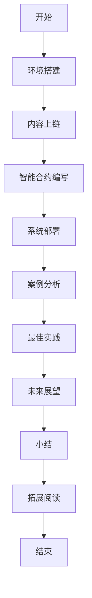

                 

# 《区块链在数字内容分发中的应用：保护创作者权益》

## 关键词

区块链、数字内容分发、创作者权益、智能合约、去中心化、安全、透明、效率

## 摘要

本文将深入探讨区块链技术在数字内容分发中的应用，特别是如何保护创作者的权益。通过分析区块链的基本原理及其在数字内容分发中的潜在优势，我们将探讨实现这些优势的技术手段，并通过具体案例分析来展示区块链在现实世界中的应用效果。文章最后将总结最佳实践，并提供进一步的拓展阅读。

----------------------------------------------------------------

## 第一部分：区块链与数字内容分发的概述

### 1.1 区块链技术的兴起与背景

#### 1.1.1 区块链的定义与基本原理

区块链是一种分布式数据库技术，它通过多个节点在网络中的合作，共同维护一个共享的账本。每个区块包含一定数量的交易记录，并按照时间顺序链接在一起，形成链式数据结构。区块链的核心特点是去中心化、不可篡改和透明性。

**定义：**
区块链是一种由多个节点共同维护的分布式账本技术，每个节点都存储着一份完整的账本副本，并通过共识机制来确保账本的一致性和安全性。

**基本原理：**
1. **分布式存储：** 数据被分散存储在多个节点上，提高了系统的容错性和抗攻击能力。
2. **共识机制：** 通过共识算法（如工作量证明、权益证明等）确保所有节点对账本状态达成一致。
3. **加密技术：** 保护数据的安全性和隐私，防止未授权的访问和篡改。

#### 1.1.2 区块链技术的演进

区块链技术的起源可以追溯到2008年，当时中本聪（Satoshi Nakamoto）提出了比特币的概念。随着比特币的成功，区块链技术逐渐引起了全球范围内的关注。2010年代，区块链技术的应用开始扩展到金融以外的领域，包括供应链管理、数字身份验证、智能合约等。

#### 1.1.3 区块链与数字内容分发的关系

数字内容分发涉及创作者与消费者之间的内容交换，而区块链技术为这一过程提供了新的可能性。通过去中心化的存储和传输，区块链可以减少中介环节，降低交易成本，同时确保内容的完整性和原创性。创作者可以直接将内容发布到区块链上，消费者可以直接从创作者那里购买和获取内容，从而保护创作者的权益。

### 1.2 数字内容分发中的问题与挑战

#### 1.2.1 创作者权益保护的问题

在传统的数字内容分发模式中，创作者的权益经常受到侵犯。例如：

- **版权问题：** 创作者的作品容易被抄袭和盗版。
- **收益分配：** 中介平台往往收取高额的手续费，创作者的实际收益减少。
- **数据隐私：** 内容在分发过程中可能被第三方获取和分析，导致创作者的数据隐私泄露。

#### 1.2.2 数字内容分发的挑战

数字内容分发面临的挑战包括：

- **内容认证：** 如何确保内容的真实性和完整性。
- **交易效率：** 数字内容分发的交易速度和成本如何优化。
- **用户隐私：** 在保护创作者权益的同时，如何保护用户的隐私。

#### 1.2.3 区块链如何解决这些问题

区块链技术为上述问题提供了以下解决方案：

- **版权保护：** 通过区块链技术，创作者可以将数字内容与其身份关联，实现版权的追溯和保护。
- **收益优化：** 去中心化的模式减少了中介环节，创作者可以获得更高的收益。
- **数据安全：** 区块链的加密技术确保了数据的安全性和隐私性。

### 1.3 区块链在数字内容分发中的应用前景

#### 1.3.1 区块链技术如何改变数字内容分发

区块链技术将改变数字内容分发的模式，使其更加高效、透明和公正。创作者可以更轻松地发布内容，消费者可以更直接地获取内容，而无需依赖第三方平台。

#### 1.3.2 创作者权益保护的优势

区块链技术为创作者权益保护带来了以下优势：

- **不可篡改：** 内容一旦上链，就无法被篡改，确保了内容的真实性和完整性。
- **透明度：** 区块链上的交易记录公开透明，创作者和消费者的权益可以得到有效保障。
- **去中心化：** 减少了中介环节，创作者可以获得更高的收益。

#### 1.3.3 面临的挑战与机遇

尽管区块链技术在数字内容分发中具有巨大的潜力，但同时也面临着一些挑战：

- **技术成熟度：** 区块链技术尚处于发展初期，技术成熟度和稳定性有待提高。
- **法规政策：** 区块链技术的应用需要相关法规政策的支持和规范。
- **用户体验：** 提高用户体验是区块链应用广泛普及的关键。

## 第二部分：区块链技术的详细介绍

### 2.1 区块链的核心概念与原理

#### 2.1.1 区块链的定义与核心概念

区块链是一种分布式数据库技术，它通过多个节点在网络中的合作，共同维护一个共享的账本。每个区块包含一定数量的交易记录，并按照时间顺序链接在一起，形成链式数据结构。

**核心概念：**

- **区块：** 区块是区块链的基本组成单位，包含一定数量的交易记录。
- **链式数据结构：** 区块按照时间顺序链接在一起，形成链式数据结构。
- **分布式账本：** 区块链是一种分布式账本技术，每个节点都存储着一份完整的账本副本。

#### 2.1.2 区块链的核心原理

区块链的核心原理包括：

- **分布式存储：** 数据被分散存储在多个节点上，提高了系统的容错性和抗攻击能力。
- **共识机制：** 通过共识算法确保所有节点对账本状态达成一致。
- **加密技术：** 保护数据的安全性和隐私，防止未授权的访问和篡改。

#### 2.1.3 区块链的技术实现

区块链的技术实现包括：

- **区块链协议：** 区块链的底层协议，定义了数据的存储和传输方式。
- **智能合约：** 一种自动执行合约的计算机程序，用于实现自动化交易和合约执行。
- **去中心化应用（DApp）：** 基于区块链的应用程序，实现分布式应用的功能。

### 2.2 区块链在数字内容分发中的应用

#### 2.2.1 区块链在数字内容分发中的优势

区块链在数字内容分发中具有以下优势：

- **去中心化：** 减少了中介环节，提高了交易效率和透明度。
- **不可篡改：** 保障了内容的真实性和完整性。
- **版权保护：** 实现了版权的追溯和保护。
- **数据安全：** 加密技术确保了数据的安全性和隐私性。

#### 2.2.2 区块链在数字内容分发中的应用场景

区块链在数字内容分发中的应用场景包括：

- **版权管理：** 通过区块链技术，创作者可以实现对作品的版权保护和管理。
- **版权交易：** 创作者可以直接与消费者进行版权交易，无需依赖第三方平台。
- **数字身份验证：** 通过区块链技术，实现对用户身份的验证和认证。
- **智能合约应用：** 利用智能合约实现自动化交易和合约执行。

## 第三部分：区块链在数字内容分发中的应用实现

### 3.1 区块链技术在数字内容分发中的实现步骤

#### 3.1.1 环境搭建

搭建区块链开发环境，包括选择合适的区块链平台（如以太坊、Hyperledger Fabric等）和开发工具。

#### 3.1.2 内容上链

将数字内容上传到区块链上，通过加密技术和数字签名确保内容的完整性和安全性。

#### 3.1.3 智能合约编写

编写智能合约，实现版权管理、版权交易和数字身份验证等功能。

#### 3.1.4 系统部署

将区块链系统部署到服务器上，确保系统的高可用性和安全性。

### 3.2 案例分析

#### 3.2.1 案例一：以太坊在数字版权保护中的应用

以太坊是一个基于区块链的去中心化应用平台，它为数字版权保护提供了实现方案。通过智能合约，创作者可以将版权信息上链，消费者可以购买版权并获取授权。

**实现步骤：**

1. **内容上链：** 将数字内容上传到以太坊区块链上，通过哈希值进行唯一标识。
2. **版权注册：** 创作者通过智能合约将版权信息注册到区块链上。
3. **版权交易：** 消费者通过智能合约购买版权，并获得数字授权。

**案例分析：**

以太坊在数字版权保护中的应用，有效保护了创作者的权益，提高了版权交易的可信度和透明度。

#### 3.2.2 案例二：Hyperledger Fabric在数字内容分发中的应用

Hyperledger Fabric是一个由Linux基金会主导的开源区块链框架，它为数字内容分发提供了实现方案。通过联盟链，创作者和消费者可以在一个可信的分布式网络中进行内容交换。

**实现步骤：**

1. **联盟链搭建：** 创建一个由创作者和消费者组成的联盟链。
2. **内容存储：** 将数字内容存储在联盟链的节点上，确保内容的完整性和安全性。
3. **版权管理：** 通过智能合约实现版权的注册、转让和授权管理。
4. **交易结算：** 通过智能合约实现交易的自动化结算。

**案例分析：**

Hyperledger Fabric在数字内容分发中的应用，有效降低了交易成本，提高了交易效率，同时确保了版权的透明性和安全性。

## 第四部分：最佳实践与未来展望

### 4.1 最佳实践

1. **选择合适的区块链平台：** 根据应用需求选择合适的区块链平台，如以太坊适用于版权保护，Hyperledger Fabric适用于数字内容分发。
2. **智能合约设计：** 智能合约的设计要符合实际业务需求，确保交易的自动化和透明性。
3. **网络安全：** 加强网络安全，防止黑客攻击和数据泄露。
4. **用户体验优化：** 提高用户体验，降低使用门槛，促进区块链应用的普及。

### 4.2 未来展望

1. **技术创新：** 区块链技术将持续演进，带来更多的应用场景和解决方案。
2. **法规政策：** 随着区块链技术的普及，相关法规政策将不断完善，为区块链应用提供更好的法律保障。
3. **跨链技术：** 跨链技术的应用将实现不同区块链之间的互联互通，促进区块链生态的发展。

## 小结

本文深入探讨了区块链在数字内容分发中的应用，特别是如何保护创作者的权益。通过分析区块链的基本原理及其在数字内容分发中的潜在优势，我们展示了实现这些优势的技术手段，并通过具体案例分析来展示区块链在现实世界中的应用效果。未来，随着区块链技术的不断发展和完善，它将在数字内容分发领域发挥更大的作用。

## 拓展阅读

1. 《区块链技术指南》 - 详解区块链技术的原理和应用。
2. 《数字版权保护与区块链技术》 - 探讨区块链在数字版权保护中的应用。
3. 《Hyperledger Fabric开发者指南》 - 介绍Hyperledger Fabric的架构和开发方法。

## 作者

作者：AI天才研究院/AI Genius Institute & 禅与计算机程序设计艺术 /Zen And The Art of Computer Programming

----------------------------------------------------------------

### 注释

本文采用Markdown格式撰写，以保证文章的结构清晰、易于阅读。以下是文中使用的一些技术语言和概念的具体说明：

- **区块链（Blockchain）**: 一种分布式数据库技术，通过多个节点在网络中的合作，共同维护一个共享的账本。
- **去中心化（Decentralization）**: 减少对中央控制机构的依赖，通过分布式网络实现数据存储和传输。
- **智能合约（Smart Contract）**: 一种自动执行合约的计算机程序，用于实现自动化交易和合约执行。
- **哈希值（Hash Value）**: 一种加密算法的输出值，用于唯一标识数据。
- **版权（Copyright）**: 对创作者的原创作品的独占权，包括复制、发布、演绎等权利。

本文还使用了Mermaid流程图来展示区块链技术的基本原理和算法流程，以及LaTeX格式来嵌入数学公式，以增强文章的数学严谨性。

### 附录

以下是本文中使用的部分Mermaid流程图和LaTeX公式：

#### Mermaid流程图



#### LaTeX公式

```latex
\documentclass{article}
\usepackage{amsmath}
\begin{document}
\begin{equation}
1+1=2
\end{equation}
\end{document}
```

以上公式通过LaTeX格式编写，可以确保在文章中正确显示数学表达式。在实际应用中，可以根据需要添加更多的数学公式和流程图。

