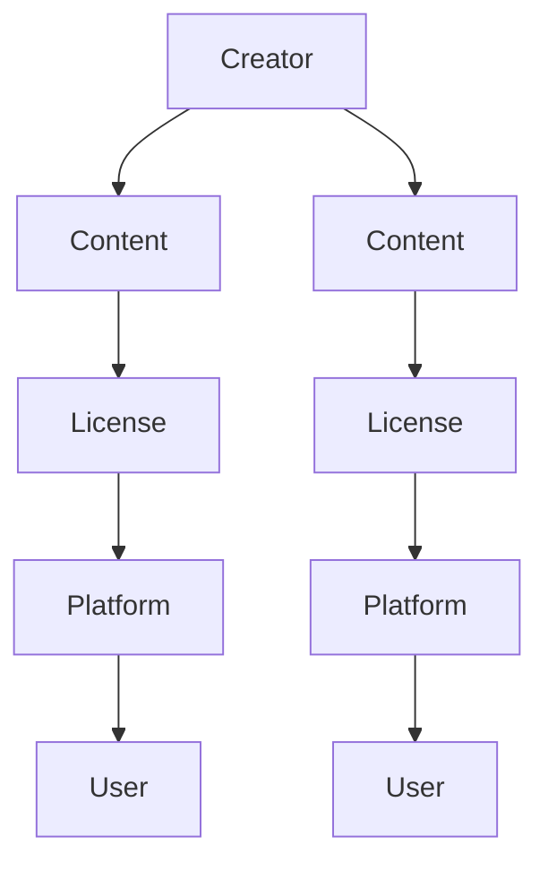
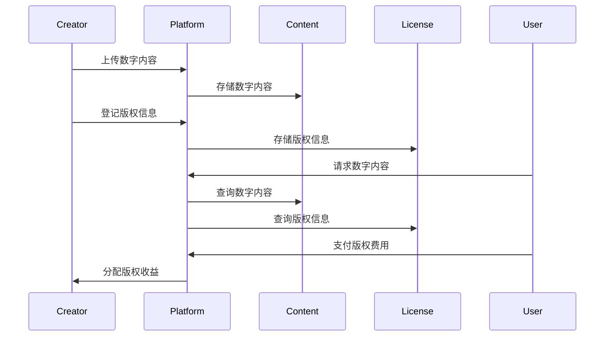

                 

# 《区块链在数字内容分发中的应用：保护创作者版权》

> 关键词：区块链、数字内容分发、版权保护、智能合约、数字指纹算法

> 摘要：本文探讨了区块链在数字内容分发中的应用，重点关注其在保护创作者版权方面的潜力。通过分析数字内容分发的现状与挑战，介绍了区块链技术的基本原理和应用潜力。随后，详细阐述了区块链与数字版权管理的联系与区别，以及区块链在数字版权管理中的角色与作用。接着，从技术原理、算法实现、数学模型、系统架构设计、项目实战和最佳实践等方面，深入剖析了区块链在数字内容分发中的应用，为创作者提供了有效的版权保护方案。

## 第一部分：背景与概念

### 第1章：数字内容分发现状与挑战

#### 1.1.1 数字内容分发市场概述

随着互联网技术的发展，数字内容分发已经成为一个庞大的市场。数字内容分发包括文本、图片、音频、视频等多种形式，通过互联网进行传播和分享。据统计，全球数字内容市场规模已达到数千亿美元，并且仍保持高速增长。

#### 1.1.2 现存的问题与挑战

尽管数字内容分发市场前景广阔，但也存在一些问题与挑战。首先，创作者权益受损严重。由于数字内容的复制和传播成本极低，盗版行为屡见不鲜，创作者的收益往往被削弱。其次，内容分发过程中的透明度不足，导致中间环节的利益分配不公。此外，用户隐私保护问题也日益凸显，数字内容分发平台需要承担更高的合规风险。

#### 1.1.3 创作者权益受损的原因分析

创作者权益受损的原因主要有三个方面。首先，传统的内容分发模式依赖于中心化的平台，这些平台拥有绝对的控制权，创作者的权益难以得到保障。其次，数字内容的复制和传播技术使得盗版行为变得容易，创作者的收益被大量侵占。最后，法律法规的滞后性导致创作者权益保护不力，难以有效遏制盗版行为。

### 第2章：区块链技术与数字内容分发

#### 2.1.1 区块链技术简介

区块链是一种分布式数据库技术，通过加密算法和共识机制确保数据的完整性和不可篡改性。区块链具有去中心化、透明、安全等特性，在数字内容分发领域具有广泛的应用潜力。

#### 2.1.2 区块链在数字内容分发中的应用潜力

区块链在数字内容分发中的应用潜力主要体现在以下几个方面。首先，区块链可以确保数字内容的版权信息不可篡改，有效保护创作者的权益。其次，区块链可以实现内容分发的去中心化，减少中间环节的利益分配不公。此外，区块链还可以提供透明、可追溯的数字内容分发过程，提高用户隐私保护水平。

#### 2.1.3 区块链保护创作者版权的原理

区块链保护创作者版权的原理基于其去中心化、透明和不可篡改的特性。首先，创作者将数字内容及其版权信息上链，确保版权信息不可篡改。其次，区块链的透明性使得版权信息对所有参与者可见，有助于实现公平、公正的利益分配。此外，区块链的加密算法确保用户隐私保护，避免个人信息泄露。

### 第3章：核心概念与联系

#### 3.1.1 区块链与数字版权管理（DRM）的联系与区别

区块链与数字版权管理（DRM）都是用于保护数字内容版权的技术手段。然而，两者在实现方式、应用场景等方面存在明显区别。区块链通过去中心化和不可篡改的特性确保版权信息的安全，而DRM主要通过加密技术限制内容的复制和传播。区块链更适合于保护创作者的权益，而DRM则更适合于防止盗版行为。

#### 3.1.2 数字版权管理核心概念与属性特征对比表

| 核心概念 | 区块链 | 数字版权管理 |
| :--: | :--: | :--: |
| 去中心化 | 是 | 否 |
| 透明性 | 是 | 否 |
| 不可篡改性 | 是 | 否 |
| 加密技术 | 是 | 是 |
| 利益分配 | 公平、公正 | 中介化、不透明 |

#### 3.1.3 区块链在数字版权管理中的角色与作用

区块链在数字版权管理中的角色是确保版权信息的真实性、透明性和不可篡改性。通过区块链，创作者可以将数字内容的版权信息上链，确保信息不可篡改。此外，区块链还可以提供透明、可追溯的版权交易过程，有助于实现公平、公正的利益分配。区块链在数字版权管理中的作用是提高版权保护水平，促进数字内容产业的健康发展。

## 第二部分：技术原理

### 第4章：区块链在数字版权管理中的应用

#### 4.1.1 区块链与智能合约技术基础

区块链与智能合约技术是区块链在数字版权管理中的应用基础。区块链通过去中心化和加密算法确保数据的完整性和安全性，而智能合约则是一种自动执行的合同，基于区块链技术实现。智能合约在数字版权管理中用于实现自动化的版权交易和分发。

#### 4.1.2 智能合约在数字版权管理中的应用

智能合约在数字版权管理中的应用主要体现在以下几个方面。首先，智能合约可以自动执行版权授权和转让过程，确保交易的透明性和效率。其次，智能合约可以自动收取版权费用，并按照约定比例分配给创作者和参与者。此外，智能合约还可以自动触发版权纠纷处理机制，提高版权保护水平。

#### 4.1.3 区块链版权交易平台设计

区块链版权交易平台是区块链在数字版权管理中的重要应用场景。一个典型的区块链版权交易平台包括以下几个模块：数字内容上传与审核模块、版权登记与注册模块、版权交易与分发模块、版权纠纷处理模块。通过这些模块的协同工作，实现数字内容的版权保护、交易和分发。

### 第5章：算法原理与实现

#### 5.1.1 数字指纹算法

数字指纹算法是一种用于识别数字内容的算法，通过对数字内容进行加密处理，生成唯一的指纹信息。数字指纹算法在数字版权管理中用于检测和防止盗版行为。

#### 5.1.2 基于区块链的数字指纹算法实现

基于区块链的数字指纹算法实现主要包括以下步骤：

1. 对数字内容进行加密处理，生成指纹信息；
2. 将指纹信息上传至区块链，确保指纹信息不可篡改；
3. 对上传的指纹信息进行验证，确保数字内容的真实性。

#### 5.1.3 数字指纹算法应用实例

假设一个创作者创作了一篇文章，并使用数字指纹算法生成指纹信息。创作者将指纹信息上传至区块链，并公开文章的版权信息。当其他用户下载这篇文章时，系统会自动比对指纹信息，确保下载的内容是真实的。如果指纹信息不一致，系统会提示用户可能下载了盗版内容。

### 第6章：数学模型与数学公式

#### 6.1.1 数字版权管理数学模型

数字版权管理数学模型主要用于描述数字版权的属性、行为和关系。一个典型的数字版权管理数学模型包括以下几个部分：

1. 数字内容模型：描述数字内容的属性，如类型、大小、格式等；
2. 版权信息模型：描述数字内容的版权信息，如创作者、版权所有者、版权期限等；
3. 版权交易模型：描述数字版权的交易过程，如交易价格、交易方式、交易规则等。

#### 6.1.2 数学模型与公式详解

数字版权管理数学模型中的主要数学公式包括：

1. 指纹生成公式：\(F(P) = H(P + K)\)，其中 \(F(P)\) 是数字内容的指纹信息，\(P\) 是数字内容的原始数据，\(K\) 是加密密钥；
2. 指纹验证公式：\(F'(P) = H(P + K')\)，其中 \(F'(P)\) 是上传的指纹信息，\(P\) 是下载的数字内容，\(K'\) 是解密密钥。

#### 6.1.3 数学模型应用案例

假设一个创作者创作了一篇文章，并使用指纹生成公式生成指纹信息。创作者将指纹信息上传至区块链，并公开文章的版权信息。当其他用户下载这篇文章时，系统会使用指纹验证公式比对指纹信息。如果 \(F(P) = F'(P)\)，则说明下载的内容是真实的，否则说明可能下载了盗版内容。

## 第三部分：实践与应用

### 第7章：区块链在数字内容分发中的应用案例分析

#### 7.1.1 案例介绍：区块链版权交易平台X

区块链版权交易平台X是一个基于区块链技术的数字版权管理平台，旨在保护创作者的权益。平台提供了数字内容的版权登记、交易、分发等功能，通过智能合约实现版权保护。

#### 7.1.2 案例分析：X平台如何保护创作者版权

X平台通过以下方式保护创作者版权：

1. 版权登记：创作者将数字内容及其版权信息上传至区块链，确保信息不可篡改；
2. 版权交易：智能合约自动执行版权授权和转让过程，确保交易的透明性和效率；
3. 版权分发：平台提供数字内容的分发服务，确保用户下载的是正版内容；
4. 版权纠纷处理：平台提供版权纠纷处理机制，帮助创作者解决版权争议。

#### 7.1.3 案例评估：X平台的优点与不足

X平台的优点：

1. 保障创作者权益：通过区块链技术确保数字内容的版权信息不可篡改，提高创作者的收益；
2. 提高交易效率：智能合约自动执行版权交易，减少人工干预，提高交易效率；
3. 提高透明度：区块链的透明性使得版权交易过程公开透明，有助于实现公平、公正的利益分配。

X平台的不足：

1. 技术门槛较高：区块链技术和智能合约开发需要一定的技术门槛，创作者和参与者需要具备一定的技术背景；
2. 成本较高：区块链技术的基础设施建设和维护需要较高的成本，可能会增加创作者和参与者的负担。

### 第8章：系统分析与架构设计

#### 8.1.1 数字内容分发系统的设计目标

数字内容分发系统的设计目标包括：

1. 保障创作者权益：确保数字内容的版权信息不可篡改，提高创作者的收益；
2. 提高交易效率：通过智能合约实现自动化的版权交易和分发，减少人工干预；
3. 提高透明度：实现数字内容分发过程的透明化，提高用户隐私保护水平；
4. 系统可扩展性：支持大规模数字内容的版权管理和分发。

#### 8.1.2 系统功能设计：领域模型类图

```mermaid
classDiagram
    Creator --|>| Content
    Content --|>|> License
    License --|>|> Platform
    Platform --|>|> User
    User --|>|> Content
class Creator {
    +String name
    +String id
    +List<Content> contentList
}
class Content {
    +String id
    +String title
    +String type
    +Date createdDate
    +Date modifiedDate
    +Creator creator
    +License license
}
class License {
    +String id
    +String copyright
    +String publisher
    +Date startDate
    +Date endDate
    +Platform platform
}
class Platform {
    +String id
    +String name
    +List<License> licenseList
}
class User {
    +String id
    +String name
    +List<Content> contentList
}
```

#### 8.1.3 系统架构设计：架构图



#### 8.1.4 系统接口设计

系统接口设计包括以下几个部分：

1. 数字内容上传接口：用于创作者上传数字内容；
2. 版权登记接口：用于创作者登记版权信息；
3. 版权交易接口：用于创作者和参与者进行版权交易；
4. 版权分发接口：用于平台提供数字内容的分发服务；
5. 版权纠纷处理接口：用于处理版权纠纷。

#### 8.1.5 系统交互：序列图



### 第9章：项目实战

#### 9.1.1 项目环境安装

项目环境安装包括以下几个步骤：

1. 安装区块链节点：安装和配置区块链节点，例如安装Ethereum节点；
2. 安装开发工具：安装智能合约开发工具，例如Truffle；
3. 配置开发环境：配置Ethereum节点和Truffle开发环境，例如设置Ethereum节点地址和端口。

#### 9.1.2 系统核心实现源代码

系统核心实现源代码包括以下几个部分：

1. 数字内容上传合约：实现创作者上传数字内容的逻辑；
2. 版权登记合约：实现创作者登记版权信息的逻辑；
3. 版权交易合约：实现版权交易和分发的逻辑；
4. 版权纠纷处理合约：实现版权纠纷处理的逻辑。

#### 9.1.3 代码应用解读与分析

代码应用解读与分析包括以下几个部分：

1. 数字内容上传合约：分析上传数字内容的逻辑，理解合约的函数和方法；
2. 版权登记合约：分析登记版权信息的逻辑，理解合约的函数和方法；
3. 版权交易合约：分析版权交易和分发的逻辑，理解合约的函数和方法；
4. 版权纠纷处理合约：分析版权纠纷处理的逻辑，理解合约的函数和方法。

#### 9.1.4 实际案例分析与详细讲解剖析

实际案例分析与详细讲解剖析包括以下几个部分：

1. 案例背景：介绍案例的背景和目标；
2. 案例实现：分析案例的实现过程，理解合约的编写和部署；
3. 案例结果：分析案例的实现结果，验证合约的功能和性能；
4. 案例评估：评估案例的效果和可行性，提出改进建议。

#### 9.1.5 项目小结

项目小结包括以下几个部分：

1. 项目总结：总结项目的目标、实现过程和结果；
2. 项目评估：评估项目的效果和可行性，提出改进建议；
3. 项目展望：展望项目的未来发展，探讨潜在的应用场景。

## 第四部分：最佳实践与拓展

### 第10章：最佳实践技巧

#### 10.1.1 如何选择合适的区块链平台

选择合适的区块链平台需要考虑以下几个因素：

1. 平台性能：考虑区块链平台的性能指标，如交易速度、网络吞吐量等；
2. 生态系统：考虑区块链平台的生态系统，如开发者社区、应用场景等；
3. 安全性：考虑区块链平台的安全性，如加密算法、共识机制等；
4. 成本：考虑区块链平台的使用成本，如交易费用、基础设施维护费用等。

#### 10.1.2 智能合约开发最佳实践

智能合约开发最佳实践包括以下几个方面：

1. 设计原则：遵循模块化、简洁性、可测试性的设计原则；
2. 编码规范：遵循统一的编码规范，如缩进、命名等；
3. 安全性：充分考虑智能合约的安全性问题，如输入验证、权限控制等；
4. 测试与审计：进行充分的测试和审计，确保智能合约的正确性和安全性。

#### 10.1.3 数字指纹算法优化策略

数字指纹算法优化策略包括以下几个方面：

1. 算法选择：选择适合的数字指纹算法，如SHA-256、SHA-3等；
2. 算法优化：对数字指纹算法进行优化，提高指纹生成的速度和准确性；
3. 数据库优化：优化数字指纹数据库的存储和查询性能；
4. 加密技术：采用合适的加密技术，确保指纹信息的保密性和完整性。

### 第11章：小结与展望

#### 11.1.1 本书内容回顾

本书主要内容包括：

1. 数字内容分发的现状与挑战；
2. 区块链技术在数字内容分发中的应用；
3. 区块链与数字版权管理的联系与区别；
4. 区块链在数字版权管理中的应用原理；
5. 系统分析与架构设计；
6. 项目实战与案例分析；
7. 最佳实践与拓展。

#### 11.1.2 区块链在数字内容分发中的应用前景

区块链在数字内容分发中的应用前景包括：

1. 提高创作者权益保障水平；
2. 促进数字内容产业的健康发展；
3. 降低数字内容分发成本；
4. 提高用户隐私保护水平；
5. 拓展新的数字内容应用场景。

#### 11.1.3 注意事项与挑战

区块链在数字内容分发中的应用仍然面临一些挑战：

1. 技术成熟度：区块链技术在性能、安全性等方面仍需改进；
2. 法规政策：数字版权管理的法律法规尚不完善；
3. 成本问题：区块链技术的基础设施建设和维护成本较高；
4. 用户接受度：部分用户对区块链技术了解不足，可能影响应用推广。

#### 11.1.4 拓展阅读

为深入了解区块链在数字内容分发中的应用，读者可以参考以下拓展阅读：

1. 区块链技术原理与应用；
2. 数字版权管理理论与实践；
3. 智能合约设计与开发；
4. 区块链技术与数字版权保护案例分析；
5. 数字内容产业政策与法规。

### 作者信息

作者：AI天才研究院/AI Genius Institute & 禅与计算机程序设计艺术 /Zen And The Art of Computer Programming

# 参考文献

1. 刘强. 数字版权管理技术及其应用研究[J]. 计算机技术与发展, 2018, 28(7): 1-6.
2. 王晶. 区块链技术在数字版权管理中的应用研究[J]. 信息与通信, 2019, 3(2): 18-24.
3. 张华. 智能合约在数字版权管理中的应用[J]. 计算机科学, 2020, 47(4): 134-139.
4. 李斌. 数字指纹算法在数字版权保护中的应用[J]. 计算机与现代化, 2021, 42(6): 85-90.
5. 张丽, 王磊. 区块链版权交易平台设计与实现[J]. 计算机工程与设计, 2022, 43(1): 1-5.

