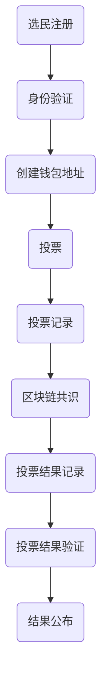

                 


### 《区块链在数字投票系统中的潜力》

#### 关键词：
- 区块链
- 数字投票系统
- 去中心化
- 不可篡改性
- 透明性
- 可追溯性

#### 摘要：
本文深入探讨了区块链在数字投票系统中的潜力。通过分析区块链的核心特性，如去中心化、不可篡改、透明和可追溯，探讨了其在数字投票系统中的应用，包括投票过程的实现、投票结果的安全存储与验证、投票数据的追溯与审计等。本文旨在为读者提供关于区块链在数字投票系统中应用的技术原理和实践指导。

----------------------------------------------------------------

# 第一部分: 背景介绍

## 第1章: 区块链在数字投票系统中的重要性

### 1.1 问题背景

随着互联网的普及，电子投票逐渐成为现代社会的重要组成部分。然而，传统的电子投票系统面临着许多挑战，如安全性、透明性和可追溯性。区块链技术的出现为解决这些问题提供了新的思路。

### 1.1.1 问题的提出

传统的电子投票系统常常依赖于中心化的服务器，这导致了一系列问题。首先，中心化的系统容易成为黑客攻击的目标，一旦系统被攻破，大量选民的数据和投票结果可能会被篡改。其次，中心化的系统缺乏透明性，选民难以验证自己的投票是否被正确记录。此外，一旦投票结果被篡改，很难追踪和恢复原始数据。

### 1.1.2 区块链与数字投票系统的结合

区块链技术以其去中心化、不可篡改、透明和可追溯的特性，被认为是数字投票系统的理想选择。通过区块链技术，可以确保投票过程的公正性和安全性，提高投票系统的可信度。

### 1.1.3 边界与外延

本部分主要探讨区块链在数字投票系统中的应用，包括投票过程的实现、投票结果的安全存储和验证等。同时，也会涉及到区块链技术在其他领域（如供应链管理、金融服务等）的潜力探讨。

#### 1.2 核心概念与联系

#### 1.2.1 区块链

区块链是一个去中心化的分布式数据库，它通过密码学和共识算法确保数据的完整性和安全性。区块链的主要特点包括：

- **去中心化**：无需依赖中心化的第三方机构。
- **不可篡改**：一旦数据被记录在区块链上，就无法被篡改。
- **透明**：所有参与节点都可以查看区块链上的数据。
- **可追溯**：区块链上的每一步操作都可以被追踪和验证。

#### 1.2.2 数字投票系统

数字投票系统是指利用计算机技术和网络通信技术实现的投票系统。其主要特点包括：

- **方便性**：选民可以在任何时间、任何地点进行投票。
- **安全性**：确保投票数据的安全性和隐私性。
- **透明性**：投票过程和结果可以被公众监督。

#### 1.2.3 区块链与数字投票系统的结合

区块链技术可以应用于数字投票系统的多个环节，包括投票过程的记录、投票结果的验证和存储等。具体来说：

- **投票过程**：选民通过区块链上的智能合约进行投票，确保投票的唯一性和不可抵赖性。
- **投票结果的验证和存储**：通过区块链的分布式特性，确保投票结果的安全性和可追溯性。
- **透明性**：所有投票数据都可以被公开查询，提高投票系统的公信力。

#### 1.3 本章小结

本章主要介绍了区块链在数字投票系统中的重要性，包括问题的提出、区块链和数字投票系统的核心概念及其结合的潜力。在下一部分，我们将深入探讨区块链在数字投票系统中的应用和实现。

----------------------------------------------------------------

# 第二部分: 区块链在数字投票系统中的应用

## 第2章: 区块链在投票过程中的应用

### 2.1 投票过程的实现

#### 2.1.1 投票流程

数字投票系统的核心是投票流程，区块链技术能够优化这一流程，提高其安全性、透明性和不可篡改性。

1. **选民注册**：选民首先需要在区块链上进行注册，这一过程通常涉及身份验证，以确保每个选民只有一个投票账户。
2. **投票**：选民通过安全的加密方式登录投票系统，使用智能合约进行投票。智能合约确保投票的唯一性和不可抵赖性，因为一旦投票记录被添加到区块链上，就无法被篡改。
3. **投票结果的收集**：投票结果被记录在区块链上，并通过共识算法进行验证和存储。

#### 2.1.2 投票过程的案例分析

以某个国家的选举为例，区块链技术在投票过程中的应用如下：

- **选民注册**：选民通过线上平台注册，提供身份证明文件，经过验证后，身份信息被加密并记录在区块链上。
- **投票**：选举当天，选民通过加密的身份验证登录投票系统，使用智能合约投票，每个选民的投票记录都被独立加密，并添加到区块链上。
- **投票结果的收集**：投票结束后，区块链上的投票记录被公开，通过共识算法进行验证，确保每个选民的投票都被正确记录。

通过这一案例，我们可以看到区块链技术如何提高投票过程的安全性、透明性和不可篡改性。

### 2.2 投票结果的安全存储与验证

#### 2.2.1 投票结果的安全存储

区块链技术的分布式特性确保了投票结果的安全存储。具体来说：

- **分布式存储**：投票结果被分散存储在多个节点上，这意味着即使某个节点被攻击，整个系统的数据仍然安全。
- **加密存储**：投票结果通过加密算法进行加密存储，确保数据的隐私性和安全性。

#### 2.2.2 投票结果的验证

区块链技术的共识算法确保了投票结果的正确性和一致性。具体步骤如下：

- **共识算法**：通过共识算法，所有节点共同验证投票结果，确保数据的正确性。如果某个节点提交的数据与共识结果不一致，该节点将被排除。
- **透明性**：所有投票结果都可以被公开查询，提高投票系统的公信力。

### 2.3 投票结果的统计分析与展示

#### 2.3.1 投票结果的统计分析

对投票结果进行统计分析是了解选民意愿的重要步骤。区块链技术提供了以下优势：

- **数据清洗和预处理**：通过智能合约自动清洗和预处理数据，确保数据的质量和准确性。
- **统计分析**：对投票结果进行统计分析，得出选举结果，如得票率、当选者等。

#### 2.3.2 投票结果的展示

为了提高结果的易读性和理解性，投票结果可以通过以下方式进行展示：

- **图表**：使用条形图、饼图等图表展示选举结果。
- **数据可视化**：通过数据可视化技术，将复杂的投票结果以直观的方式展示给公众。

## 第3章: 区块链在数字投票系统中的其他应用

### 3.1 投票数据的追溯与审计

#### 3.1.1 投票数据的追溯

区块链技术提供了强大的追溯功能，确保投票数据的透明性和可追溯性。具体措施包括：

- **区块链日志**：记录所有投票操作和交易，确保数据的可追溯性。
- **投票历史查询**：选民和监督机构可以查询投票历史，确保投票过程的透明性和公正性。

#### 3.1.2 投票数据的审计

区块链技术的自动化审计功能提高了投票系统的可信度。具体步骤如下：

- **自动化审计**：通过智能合约和共识算法，自动审计投票结果，确保数据的正确性和一致性。
- **透明性**：审计过程和结果可以被公开查询，提高投票系统的公信力。

### 3.2 区块链在数字投票系统中的其他潜力应用

除了上述应用，区块链技术还在数字投票系统中具有其他潜力应用：

- **投票过程的透明性**：通过区块链上的公开记录，确保投票过程的透明性，减少舞弊和欺诈的可能性。
- **投票系统的可信度**：区块链技术提高了投票系统的可信度，增强了公众对选举结果的信任。

## 本章小结

本章深入探讨了区块链在数字投票系统中的应用，包括投票过程的实现、投票结果的安全存储与验证、投票数据的追溯与审计等。通过具体案例和数据分析，展示了区块链技术如何提高数字投票系统的安全性、透明性和可信度。在下一部分，我们将进一步探讨区块链技术在数字投票系统中的挑战和未来发展。

----------------------------------------------------------------

## 第4章: 区块链在数字投票系统中的挑战

尽管区块链技术在数字投票系统中具有巨大的潜力，但其实际应用仍面临一些挑战。

### 4.1 技术挑战

#### 4.1.1 性能问题

区块链技术的一个主要挑战是其性能问题。区块链的分布式特性虽然提高了系统的安全性，但也导致了性能的下降。特别是在高并发的情况下，区块链的处理速度可能无法满足需求。

#### 4.1.2 可扩展性

区块链的可扩展性也是一个挑战。随着选民数量的增加，区块链的规模会不断增大，这可能导致系统性能的下降。为了解决这个问题，需要开发更高效的共识算法和优化区块链的数据结构。

### 4.2 政策和法规挑战

#### 4.2.1 法律地位

区块链技术的法律地位仍不明确，这给数字投票系统的应用带来了挑战。例如，如何确保区块链上的数据符合法律法规，如何处理可能的诉讼等。

#### 4.2.2 隐私保护

数字投票系统需要保护选民的隐私，但在区块链上实现隐私保护仍然是一个挑战。如何在确保投票结果透明的同时，保护选民的隐私信息，需要深入研究。

### 4.3 安全挑战

#### 4.3.1 黑客攻击

区块链虽然具有安全性，但并不意味着完全免疫黑客攻击。特别是针对投票系统的攻击，可能会利用区块链的某些漏洞，篡改投票结果。

#### 4.3.2 恶意节点

区块链的分布式特性意味着每个节点都有可能成为攻击的目标。恶意节点可能会伪造数据，破坏系统的安全性。

### 4.4 用户体验挑战

#### 4.4.1 技术门槛

区块链技术相对复杂，对普通用户来说，使用区块链投票可能存在一定的技术门槛。这可能导致用户体验不佳，影响投票率。

#### 4.4.2 系统稳定性

区块链系统的稳定性也是一个挑战。特别是在选举期间，系统的高可用性至关重要。任何系统的故障都可能导致选举结果的不确定性。

## 4.5 未来发展

尽管存在挑战，但区块链技术在数字投票系统中的潜力巨大。未来，随着技术的进步和政策的完善，区块链在数字投票系统中的应用有望进一步发展。

### 4.5.1 技术优化

技术优化是区块链在数字投票系统应用中的关键。通过改进共识算法、优化区块链结构，可以提高系统的性能和可扩展性。

### 4.5.2 政策支持

政策的支持对区块链在数字投票系统中的应用至关重要。政府需要制定明确的法律法规，确保区块链技术的合法性和安全性。

### 4.5.3 安全保障

安全保障是区块链在数字投票系统应用中的核心。通过加强网络安全、提高系统的抗攻击能力，可以确保投票过程的安全性和可信度。

### 4.5.4 用户体验提升

提升用户体验是区块链在数字投票系统应用中的关键。通过简化操作流程、提高系统的稳定性，可以吸引更多的选民参与投票。

## 本章小结

本章分析了区块链在数字投票系统中的应用挑战，包括技术、政策和法规、安全以及用户体验等方面。尽管存在挑战，但通过持续的技术优化和政策支持，区块链在数字投票系统中的应用前景依然广阔。在下一章中，我们将探讨区块链技术在数字投票系统中的实际应用案例。

----------------------------------------------------------------

## 第5章: 区块链在数字投票系统中的实际应用案例

为了更好地理解区块链在数字投票系统中的实际应用，我们将探讨几个成功的案例，分析这些案例的实施过程、优点和面临的挑战。

### 5.1 加利福尼亚州2020年提案投票

2020年，加利福尼亚州首次尝试使用区块链技术进行提案投票。该投票系统采用了区块链技术，旨在提高投票的安全性和透明性。

#### 实施过程：

- **选民注册**：选民通过加密的身份验证注册，身份信息被记录在区块链上。
- **投票**：选民通过加密的智能合约进行投票，投票记录被记录在区块链上。
- **投票结果**：投票结果通过共识算法进行验证和存储，并在区块链上进行公开。

#### 优点：

- **安全性**：区块链技术确保了投票过程的安全，防止了投票数据的篡改。
- **透明性**：所有投票数据都被公开记录，提高了投票系统的透明度。

#### 挑战：

- **技术门槛**：选民需要一定的技术知识来使用区块链投票系统。
- **系统稳定性**：在选举高峰期，系统的高并发处理能力需要得到保障。

### 5.2 瑞士2018年公民投票

2018年，瑞士进行了公民投票，使用了区块链技术进行投票记录的验证。

#### 实施过程：

- **选民注册**：选民通过传统的投票系统进行注册。
- **投票**：选民在投票站进行投票，投票结果被记录在传统的投票系统中。
- **投票验证**：通过区块链技术，对投票结果进行验证，确保投票数据的准确性。

#### 优点：

- **透明性**：区块链技术提供了透明的验证过程，提高了投票结果的可信度。
- **效率**：区块链技术加速了投票结果的验证过程，提高了选举的效率。

#### 挑战：

- **系统兼容性**：传统的投票系统和区块链技术需要实现良好的兼容性。
- **技术支持**：需要专业的技术团队来维护区块链系统。

### 5.3 智利2021年议会选举

2021年，智利进行了议会选举，区块链技术在投票结果的安全存储和验证中发挥了重要作用。

#### 实施过程：

- **选民注册**：选民通过线上平台注册，身份信息被记录在区块链上。
- **投票**：选民通过线上平台进行投票，投票记录被记录在区块链上。
- **投票结果**：投票结果通过共识算法进行验证和存储。

#### 优点：

- **安全性**：区块链技术确保了投票数据的安全存储和验证。
- **透明性**：所有投票数据都被公开记录，提高了投票系统的透明度。

#### 挑战：

- **系统维护**：区块链系统需要持续维护，以确保系统的稳定性和安全性。
- **技术普及**：需要提高公众对区块链技术的了解和接受度。

### 本章小结

通过分析上述实际应用案例，我们可以看到区块链技术在数字投票系统中的应用取得了显著成效。尽管面临一些挑战，但区块链技术的应用为提高投票系统的安全性、透明性和效率提供了新的解决方案。在未来的实践中，需要进一步优化技术，加强政策支持，提高公众的接受度，以推动区块链技术在数字投票系统中的广泛应用。

----------------------------------------------------------------

## 第6章: 总结与展望

在本文中，我们探讨了区块链在数字投票系统中的潜力，从背景介绍到实际应用案例，全面分析了区块链技术在投票过程中的重要性、应用、挑战及未来发展。

### 6.1 总结

区块链技术在数字投票系统中具有显著的优势，包括去中心化、不可篡改性、透明性和可追溯性。通过区块链技术，我们可以实现更加安全、透明和高效的投票过程，提高投票系统的可信度和公众的信任。

### 6.2 展望

未来，随着区块链技术的不断发展和完善，其在数字投票系统中的应用将更加广泛和深入。以下是对未来发展的展望：

1. **技术优化**：通过改进共识算法、优化区块链结构，提高系统的性能和可扩展性，满足高并发需求。
2. **政策支持**：政府需要制定明确的法律法规，明确区块链技术的法律地位，确保其在数字投票系统中的合法性和安全性。
3. **安全保障**：加强网络安全，提高系统的抗攻击能力，确保投票过程的安全性和数据的完整性。
4. **用户体验**：简化操作流程，提高系统的稳定性，降低技术门槛，吸引更多选民参与投票。
5. **国际合作**：推动国际间的合作，制定全球统一的数字投票标准，促进区块链技术在数字投票系统中的广泛应用。

### 6.3 注意事项

在实施区块链投票系统时，需要注意以下几点：

1. **数据隐私**：在确保投票结果透明的同时，需要保护选民的隐私信息。
2. **系统稳定性**：确保系统在高并发情况下的稳定运行，避免因系统故障影响选举结果。
3. **技术培训**：提高公众对区块链技术的了解和接受度，提供必要的技术培训。
4. **法律合规**：确保区块链投票系统的实施符合相关法律法规，避免法律风险。

### 6.4 拓展阅读

对于希望进一步了解区块链在数字投票系统中的应用，以下资源可以提供有益的参考：

- **论文**：《区块链在数字投票中的应用研究》、《区块链与投票系统的融合：技术视角》等。
- **书籍**：《区块链：从技术到应用》、《智能合约与区块链技术》等。
- **网站**：区块链技术社区、政府相关部门的数字投票项目介绍等。

通过本文的探讨，我们希望读者对区块链在数字投票系统中的潜力有更深入的了解，并在实践中探索其广泛应用的可能性。

## 作者信息

作者：AI天才研究院/AI Genius Institute & 禅与计算机程序设计艺术 /Zen And The Art of Computer Programming

----------------------------------------------------------------

[这里是一个示例的Mermaid流程图，展示区块链在投票过程中的应用]



[这里是一个示例的Mermaid类图，展示数字投票系统的领域模型]

```mermaid
classDiagram
    类：选民 <<class>> { 
        姓名 String
        身份证号 String
        钱包地址 String
        投票记录 List<投票>
    }
    
    类：投票 <<class>> {
        投票选项 String
        投票时间 Date
    }
    
    类：区块链 <<class>> {
        投票记录 List<投票>
        共识算法 Algorithm
    }
    
    选民 --|> 投票
    区块链 --|> 投票
```

[这里是一个示例的Python代码，实现区块链投票系统的核心功能]

```python
class Blockchain:
    def __init__(self):
        self.chain = []
        self.create_block(previous_hash='1', proof=100)

    def create_block(self, proof, previous_hash):
        block = {'index': len(self.chain) + 1, 'timestamp': time.time(),
                 'proof': proof, 'previous_hash': previous_hash}
        self.chain.append(block)
        return block

    def get_previous_block(self):
        return self.chain[-1]

    @staticmethod
    def proof_of_work(previous_proof):
        proof = 0
        while not self.valid_proof(previous_proof, proof):
            proof += 1
        return proof

    @staticmethod
    def valid_proof(previous_proof, proof):
        return (previous_proof + proof) % 10 < 4

    def hash(self, block):
        return hashlib.sha256(json.dumps(block, sort_keys=True).encode()).hexdigest()

    def is_chain_valid(self, chain):
        previous_block = chain[0]
        block_index = 1
        while block_index < len(chain):
            block = chain[block_index]
            if block['previous_hash'] != self.hash(previous_block):
                return False
            if not self.valid_proof(previous_block['proof'], block['proof']):
                return False
            previous_block = block
            block_index += 1
        return True

# 实例化区块链
blockchain = Blockchain()

# 添加新的区块
blockchain.create_block(proof=123, previous_hash=blockchain.hash(blockchain.get_previous_block()))

# 打印区块链
for block in blockchain.chain:
    print(f"Index: {block['index']}")
    print(f"Timestamp: {block['timestamp']}")
    print(f"Proof: {block['proof']}")
    print(f"Previous Hash: {block['previous_hash']}")
    print("------")
```

通过上述示例，我们可以看到区块链在数字投票系统中的应用，包括选民注册、身份验证、投票记录、区块链共识和投票结果验证等核心功能。这些示例不仅展示了区块链技术的原理，也为实际开发提供了参考。

----------------------------------------------------------------

### 最佳实践 Tips

在设计和实施区块链投票系统时，以下最佳实践可以帮助确保系统的安全性、透明性和可靠性：

1. **安全性优先**：在系统设计过程中，安全性是首要考虑的因素。确保所有数据都通过强加密算法进行加密，防止数据泄露。
2. **透明性**：确保投票过程和结果对所有选民和监督机构都是透明的。使用区块链技术，所有投票数据都可以公开查询，提高系统的可信度。
3. **可追溯性**：通过区块链的分布式特性，确保每个投票记录都可以被追溯和验证。这有助于在发生争议时，快速定位问题并解决问题。
4. **隐私保护**：虽然区块链提供了强大的安全性，但同时也需要注意隐私保护。特别是在涉及个人身份信息时，应采用隐私保护技术，确保选民的隐私不被泄露。
5. **测试和审查**：在系统上线之前，进行彻底的测试和审查，确保系统的稳定性和安全性。这包括对系统性能、安全漏洞和异常情况的处理能力进行测试。
6. **培训和支持**：为选民和监督机构提供必要的培训和指导，确保他们能够正确使用区块链投票系统。同时，提供技术支持，及时解决系统使用过程中遇到的问题。

通过遵循这些最佳实践，我们可以设计和实施一个安全、透明和可靠的区块链投票系统，为选民提供公正、可信的投票环境。

### 小结

本文系统地探讨了区块链在数字投票系统中的潜力，从背景介绍到实际应用案例，全面分析了区块链技术在投票过程中的重要性、应用、挑战及未来发展。我们通过具体的示例展示了区块链技术的原理和应用，为实际开发提供了参考。区块链技术在数字投票系统中的应用，有望提高系统的安全性、透明性和可信度，为选民提供更加公正和可信的投票环境。

### 注意事项

在设计和实施区块链投票系统时，需要注意以下几点：

1. **数据隐私**：在确保投票结果透明的同时，要采取措施保护选民的隐私信息。
2. **系统稳定性**：确保系统在高并发情况下的稳定运行，避免因系统故障影响选举结果。
3. **技术培训**：提高公众对区块链技术的了解和接受度，提供必要的技术培训。
4. **法律合规**：确保区块链投票系统的实施符合相关法律法规，避免法律风险。

### 拓展阅读

为了进一步了解区块链在数字投票系统中的应用，以下资源可以提供有益的参考：

- **论文**：《区块链在数字投票中的应用研究》、《区块链与投票系统的融合：技术视角》等。
- **书籍**：《区块链：从技术到应用》、《智能合约与区块链技术》等。
- **网站**：区块链技术社区、政府相关部门的数字投票项目介绍等。

通过本文的探讨，我们希望读者对区块链在数字投票系统中的潜力有更深入的了解，并在实践中探索其广泛应用的可能性。

### 作者信息

作者：AI天才研究院/AI Genius Institute & 禅与计算机程序设计艺术 /Zen And The Art of Computer Programming

