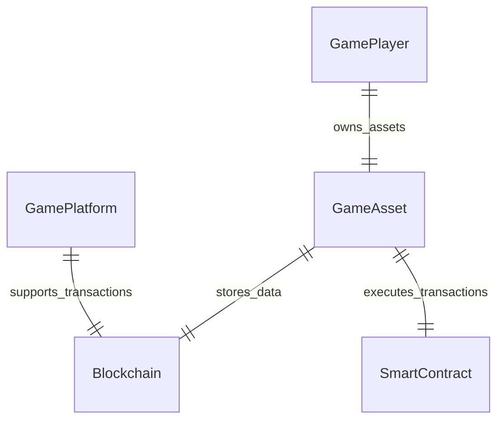
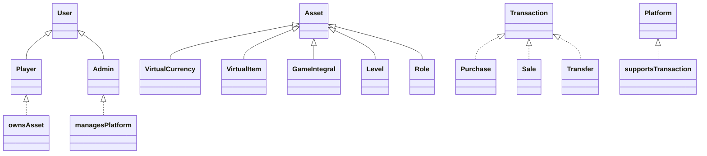
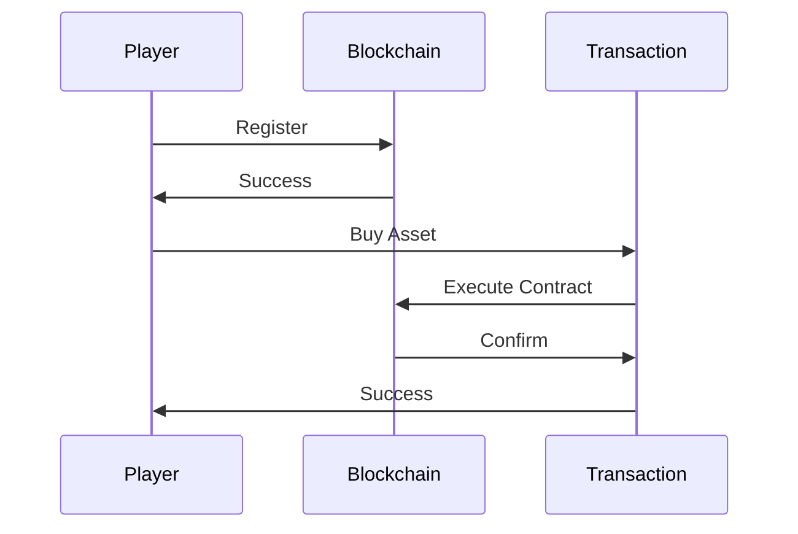

                 

# 区块链在数字游戏资产管理中的应用：跨游戏资产互通平台

## 关键词：区块链、数字游戏资产、智能合约、跨平台互通、去中心化

## 摘要：
随着区块链技术的不断成熟，其在数字游戏资产管理中的应用日益广泛。本文旨在探讨区块链技术在实现数字游戏资产跨平台互通中的作用，分析其核心概念及其相互联系，并详细介绍区块链技术在数字游戏资产管理中的应用场景和系统架构设计。通过本文的阐述，读者将更好地理解区块链技术在数字游戏资产管理中的潜力和挑战。

## 第一部分：背景介绍

### 1.1 问题背景

#### 1.1.1 数字游戏产业的发展现状

数字游戏产业近年来呈现出快速发展的态势，玩家数量的激增和游戏种类的大幅增加，使得虚拟资产的种类和交易需求也急剧增长。虚拟资产如虚拟货币、虚拟物品等已成为游戏生态系统中的重要组成部分。

#### 1.1.2 数字游戏资产管理的挑战

- **资产不互通**：不同游戏平台之间的虚拟资产无法相互转移和交易，导致玩家的游戏体验不佳。
- **交易不安全**：传统的虚拟资产交易方式存在安全风险，如交易欺诈、账户被盗等问题。
- **手续费高**：虚拟资产交易通常需要支付较高的手续费，增加了玩家的经济负担。

### 1.2 问题描述

数字游戏资产管理的核心问题是如何实现虚拟资产在不同游戏平台之间的安全、高效、互认的互通。当前，由于技术限制和利益冲突，不同游戏平台之间的虚拟资产转移、交易存在诸多障碍。

### 1.3 问题解决

区块链技术的出现为解决这些问题提供了新的思路。通过区块链的去中心化特性、智能合约的应用和分布式账本技术，可以实现数字游戏资产的安全、透明、高效的跨平台交易。

### 1.4 边界与外延

区块链在数字游戏资产管理中的应用不仅限于虚拟货币和虚拟物品的交易，还可以应用于游戏积分、等级、角色等的跨游戏互通。同时，区块链技术还可以与其他前沿技术如虚拟现实、增强现实等结合，为用户提供更丰富的游戏体验。

### 1.5 概念结构与核心要素组成

数字游戏资产管理的核心概念包括区块链、智能合约、数字游戏资产等。这些概念相互关联，构成了数字游戏资产管理的理论基础。其中，区块链作为底层基础设施，智能合约是业务逻辑实现，数字游戏资产则是应用对象。

## 第二部分：核心概念与联系

### 2.1 区块链的概念与特点

#### 2.1.1 区块链的定义

区块链是一种分布式账本技术，其核心是通过多个节点共同维护一个共享的、不可篡改的数据库。每个区块包含一定数量的交易记录，区块之间通过密码学技术链接，形成了一个不可篡改的链条。

#### 2.1.2 区块链的特点

- **去中心化**：区块链没有中央控制节点，所有节点都具有相同的权利和义务，从而提高了系统的容错性和抗攻击性。
- **不可篡改**：区块链上的数据一旦被记录，就无法被篡改，保证了数据的完整性和可靠性。
- **透明性**：所有节点都可以查看和验证区块链上的数据，提高了系统的透明度和信任度。

### 2.2 智能合约的概念与作用

#### 2.2.1 智能合约的定义

智能合约是一种运行在区块链上的自执行合约，其条款和条件被直接写入代码中。一旦满足预定的条件，智能合约会自动执行相应的操作。

#### 2.2.2 智能合约的作用

- **自动化交易**：智能合约可以自动化执行交易，减少人为干预，提高交易效率。
- **确保交易安全**：智能合约的执行过程是透明的，且一旦执行就无法被篡改，从而提高了交易的安全性。
- **降低交易成本**：智能合约的自动化执行减少了人工操作和中介环节，从而降低了交易成本。

### 2.3 数字游戏资产的概念与类型

#### 2.3.1 数字游戏资产的定义

数字游戏资产是指在数字游戏环境中获得的具有价值和使用价值的虚拟物品，包括虚拟货币、虚拟物品、游戏积分、等级、角色等。

#### 2.3.2 数字游戏资产的类型

- **虚拟货币**：如比特币、以太坊等，可用于游戏内购买物品或服务。
- **虚拟物品**：如装备、道具、皮肤等，具有特定功能和外观。
- **游戏积分**：用于游戏内的各种活动，如购买装备、提升等级等。
- **等级和角色**：玩家在游戏中的地位和身份象征。

### 2.4 核心概念属性特征对比表格

| 概念     | 特征                    | 相关性                  |
|----------|-------------------------|-------------------------|
| 区块链   | 去中心化、不可篡改、透明 | 基础设施，支撑智能合约 |
| 智能合约 | 自执行、自动执行、不可篡改 | 业务逻辑实现           |
| 数字游戏资产 | 跨游戏、跨平台、安全、高效 | 应用对象               |

### 2.5 ER实体关系图架构



## 第三部分：区块链在数字游戏资产管理中的应用

### 3.1 区块链技术在数字游戏资产中的应用

#### 3.1.1 去中心化存储

区块链的分布式存储技术使得数字游戏资产可以被安全、透明地存储。每个区块链节点都存储一份完整的数据副本，从而避免了单点故障和数据丢失的风险。

#### 3.1.2 智能合约交易

智能合约可以自动化执行交易，确保交易的安全性和效率。智能合约中的条款和条件是公开透明的，所有节点都可以验证交易的有效性，从而减少了人为干预和欺诈的风险。

#### 3.1.3 跨平台互认

区块链技术可以实现不同游戏平台之间的虚拟资产互通，为玩家提供统一的资产管理体验。玩家可以在不同平台之间自由转移和交易虚拟资产，从而提升了游戏的用户体验。

#### 3.1.4 数据透明

区块链上的数据是公开透明的，所有节点都可以查看和验证数据。这种透明性提高了区块链系统的信任度和可靠性，减少了信息不对称和欺诈行为。

### 3.2 区块链在数字游戏资产交易中的具体应用

#### 3.2.1 虚拟货币交易

虚拟货币如比特币、以太坊等可以在区块链上进行交易。玩家可以通过购买虚拟货币来获取游戏内的资源和权益，从而提升了游戏的交易便利性和经济活力。

#### 3.2.2 虚拟物品交易

虚拟物品如装备、道具、皮肤等也可以在区块链上进行交易。通过智能合约的执行，虚拟物品的所有权和使用权可以安全、透明地转移，从而减少了交易欺诈和盗窃的风险。

#### 3.2.3 游戏积分交易

游戏积分可以用于游戏内的各种活动，如购买装备、提升等级等。通过区块链技术，游戏积分可以跨平台交易，从而为玩家提供更多的选择和灵活性。

#### 3.2.4 等级和角色交易

玩家的等级和角色可以在区块链上进行交易，从而实现了游戏内的地位和身份的跨平台互通。这为玩家提供了更多的游戏玩法和社交互动的可能性。

## 第四部分：区块链在数字游戏资产管理中的系统架构设计

### 4.1 问题场景介绍

#### 4.1.1 背景介绍

随着数字游戏产业的快速发展，虚拟资产的交易和管理需求日益增加。然而，现有的虚拟资产交易系统存在诸多问题，如安全性低、手续费高、资产不互通等。为了提升用户体验和促进虚拟资产的发展，我们需要设计一个高效、安全、互认的虚拟资产交易和管理系统。

#### 4.1.2 需求分析

- **安全性**：确保虚拟资产交易的安全性和数据隐私。
- **互认性**：实现不同平台之间的虚拟资产互通。
- **高效性**：降低交易成本，提高交易速度。
- **透明性**：提高交易过程的透明度和可追溯性。

### 4.2 系统功能设计

#### 4.2.1 领域模型

为了更好地理解系统功能，我们首先需要建立一个领域模型。领域模型包括以下主要实体：

- **虚拟资产**：包括虚拟货币、虚拟物品、游戏积分、等级、角色等。
- **交易**：包括购买、出售、转移等操作。
- **用户**：包括玩家、管理员等。
- **平台**：包括游戏平台、交易市场等。

#### 4.2.2 类图



### 4.3 系统架构设计

#### 4.3.1 系统架构

为了实现数字游戏资产的安全、高效、互认的交易和管理，我们设计了一个基于区块链的系统架构。该架构包括以下主要组成部分：

- **区块链网络**：包括多个节点，共同维护一个共享的区块链账本。
- **智能合约**：实现虚拟资产交易的业务逻辑。
- **交易模块**：处理用户的交易请求，与智能合约交互。
- **用户模块**：处理用户的注册、登录、资产查询等操作。
- **管理模块**：处理平台的运营、维护、安全管理等操作。

#### 4.3.2 架构图



### 4.4 系统接口设计

为了实现系统功能，我们需要设计一系列接口，包括：

- **用户接口**：处理用户的注册、登录、资产查询、交易等操作。
- **交易接口**：处理交易请求，与智能合约交互。
- **管理接口**：处理平台的运营、维护、安全管理等操作。

### 4.5 系统交互

系统交互主要包括用户与系统之间的交互和系统内部模块之间的交互。用户与系统之间的交互主要通过用户接口实现，系统内部模块之间的交互主要通过消息队列和事件驱动的方式实现。

## 第五部分：项目实战

### 5.1 环境安装

为了实现数字游戏资产交易和管理系统，我们需要安装以下环境：

- **区块链节点**：安装并启动一个区块链节点，用于维护区块链账本。
- **智能合约开发环境**：安装Node.js和Truffle等工具，用于编写和部署智能合约。
- **前端开发环境**：安装React或Vue等框架，用于开发用户界面。

### 5.2 系统核心实现

#### 5.2.1 智能合约实现

以下是一个简单的智能合约示例，用于实现虚拟货币的购买和出售：

```solidity
pragma solidity ^0.8.0;

contract VirtualCurrency {
    mapping(address => uint256) public balanceOf;

    function buy() public payable {
        balanceOf[msg.sender] += msg.value;
    }

    function sell(uint256 amount) public {
        require(balanceOf[msg.sender] >= amount, "Insufficient balance");
        balanceOf[msg.sender] -= amount;
        payable(msg.sender).transfer(amount);
    }
}
```

#### 5.2.2 前端实现

以下是一个简单的React前端示例，用于实现用户界面：

```jsx
import React, { useEffect, useState } from 'react';
import Web3 from 'web3';

const VirtualCurrency = '0x...';

const App = () => {
    const [web3, setWeb3] = useState(null);
    const [balance, setBalance] = useState(0);

    useEffect(() => {
        async function initialize() {
            const provider = new Web3.providers.HttpProvider('http://127.0.0.1:8545');
            const web3 = new Web3(provider);
            setWeb3(web3);

            const contract = new web3.eth.Contract(abi, VirtualCurrency);
            const account = await web3.eth.getAccounts();
            setBalance(await contract.methods.balanceOf(account[0]).call());
        }

        initialize();
    }, []);

    const handleBuy = () => {
        web3.eth.sendTransaction({
            from: web3.eth.defaultAccount,
            to: VirtualCurrency,
            value: web3.utils.toWei('1', 'ether'),
        });
    };

    const handleSell = () => {
        // Call sell method of the contract
    };

    return (
        <div>
            <h1>Virtual Currency</h1>
            <p>Balance: {balance} wei</p>
            <button onClick={handleBuy}>Buy</button>
            <button onClick={handleSell}>Sell</button>
        </div>
    );
};

export default App;
```

### 5.3 实际案例分析

#### 5.3.1 案例背景

以某个知名游戏平台为例，该平台拥有大量虚拟资产，如虚拟货币、虚拟物品等。然而，由于不同平台之间的资产无法互通，导致用户体验不佳。为了解决这一问题，该平台决定引入区块链技术，实现虚拟资产的跨平台互通。

#### 5.3.2 案例分析

通过引入区块链技术，该平台实现了以下目标：

- **资产互通**：玩家可以在不同平台之间自由转移和交易虚拟资产，提升了用户体验。
- **交易安全**：智能合约的引入确保了交易的安全性和可靠性。
- **降低成本**：去中心化的交易模式降低了交易成本，提高了平台的竞争力。

### 5.4 项目小结

通过本次项目实战，我们深入探讨了区块链在数字游戏资产管理中的应用，并实现了一个简单的虚拟资产交易和管理系统。在实际案例分析中，我们看到了区块链技术在解决虚拟资产互通、交易安全、降低成本等方面的重要作用。然而，区块链技术在数字游戏资产管理中的应用还面临诸多挑战，如性能优化、数据隐私保护等。未来，随着技术的不断进步和应用的深入，区块链在数字游戏资产管理中的潜力将得到进一步发挥。

## 第六部分：最佳实践 tips

### 6.1 部署智能合约的最佳实践

- **使用测试网络**：在部署智能合约前，最好在测试网络中进行测试，以确保合约的正确性和安全性。
- **代码审查**：在部署智能合约前，进行代码审查，查找潜在的安全漏洞。
- **合理设置gas limit**：在部署智能合约时，合理设置gas limit，以确保合约能够成功执行。
- **备份合约代码**：备份智能合约的代码，以备后续修改和调试。

### 6.2 使用区块链技术的最佳实践

- **数据隐私保护**：在设计区块链应用时，考虑数据隐私保护，避免敏感数据被公开。
- **性能优化**：针对高并发场景，进行性能优化，提高系统的响应速度。
- **安全性**：加强区块链网络的安全性，防止恶意攻击和数据篡改。
- **合规性**：遵循相关法规和标准，确保区块链应用的合规性。

## 第七部分：小结与展望

### 7.1 小结

本文详细探讨了区块链在数字游戏资产管理中的应用，从问题背景、核心概念、应用场景到系统架构设计，全面阐述了区块链技术在数字游戏资产管理中的潜力和挑战。通过实际案例分析和项目实战，我们看到了区块链技术在解决虚拟资产互通、交易安全、降低成本等方面的优势。

### 7.2 展望

随着区块链技术的不断成熟和应用场景的拓展，未来区块链在数字游戏资产管理中的应用将更加广泛。然而，仍需克服性能优化、数据隐私保护、合规性等挑战。我们期待区块链技术能够为数字游戏产业带来更多创新和变革。

## 第八部分：注意事项

- **技术复杂性**：区块链技术具有一定的复杂性，开发人员需要具备一定的编程能力和区块链知识。
- **安全性**：区块链应用的安全性至关重要，需要采取有效的安全措施，防止数据泄露和恶意攻击。
- **法律合规性**：在开发区块链应用时，需要遵循相关法律法规，确保应用的合规性。

## 第九部分：拓展阅读

- **《区块链：从数字货币到智能合约》**：详细介绍了区块链的基本原理和应用场景。
- **《智能合约与区块链编程》**：深入讲解了智能合约的编程技术和应用。
- **《数字游戏产业报告》**：分析了数字游戏产业的发展趋势和潜在机遇。

## 作者信息

作者：AI天才研究院/AI Genius Institute & 禅与计算机程序设计艺术 /Zen And The Art of Computer Programming

本文由AI天才研究院/AI Genius Institute编写，旨在探讨区块链在数字游戏资产管理中的应用。如需进一步了解，请访问我们的官方网站。

