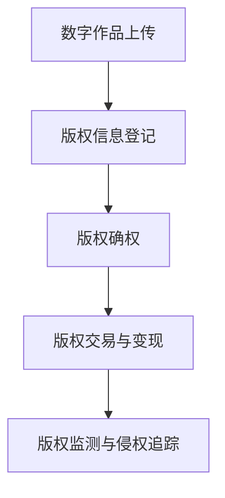
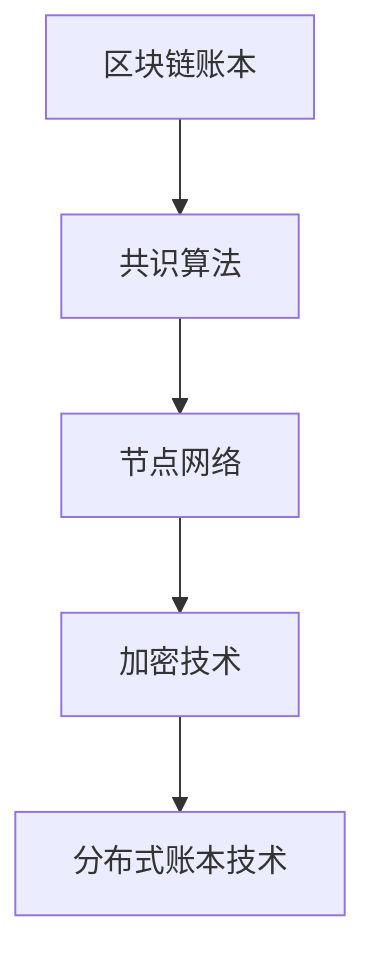

                 

### **第一部分：区块链技术概述**

#### **1.1 区块链的概念与历史**

区块链技术，作为分布式账本的一种形式，其核心概念源自于比特币的首次提出。比特币是由中本聪（Satoshi Nakamoto）在2008年发布的一篇白皮书《比特币：一种点对点的电子现金系统》中提出的。这篇白皮书详细介绍了区块链的架构和运作机制，标志着区块链技术的诞生。

##### **1.1.1 区块链的定义**

区块链是一种去中心化的数据库技术，通过在多个节点间传输数据，实现数据的不可篡改性和安全性。每个区块包含一定数量的交易记录，并通过加密算法连接成链，形成一个连续的、不可分割的数据结构。

##### **1.1.2 区块链的技术架构**

区块链的技术架构主要包括三个核心组成部分：区块链账本、共识算法和节点网络。

- **区块链账本**：记录所有交易记录的数据库，每个区块都包含了之前所有区块的哈希值，确保了整个区块链的完整性和不可篡改性。
- **共识算法**：节点之间达成共识的算法，确保区块链网络中的所有节点对于交易记录的一致性。
- **节点网络**：由多个参与者（节点）组成的分布式网络，每个节点都保存一份完整的区块链账本。

##### **1.1.3 区块链的发展历程**

区块链技术从比特币的诞生至今，经历了多个阶段的发展。以下为区块链技术的主要发展历程：

- **第一阶段（2008-2013年）**：区块链技术的概念被提出，比特币成为第一个成功的区块链应用。
- **第二阶段（2014-2017年）**：区块链技术受到广泛关注，各种应用场景被探索，包括数字货币、供应链管理、医疗保健等。
- **第三阶段（2018年至今）**：区块链技术的应用逐渐成熟，各种区块链平台和项目不断涌现，行业应用逐渐落地。

#### **1.2 区块链的核心技术**

区块链的核心技术包括共识算法、加密技术和分布式账本技术。这些技术共同构成了区块链的安全、去中心化和可靠的特点。

##### **1.2.1 共识算法**

共识算法是区块链网络中节点之间达成共识的关键机制。常见的共识算法包括工作量证明（PoW）、权益证明（PoS）和委托权益证明（DPoS）等。

- **工作量证明（PoW）**：通过解决数学难题来证明节点的工作量，是比特币采用的共识算法。
- **权益证明（PoS）**：根据节点持有的代币数量和持币时间来分配记账权，相较于PoW算法，PoS算法更为节能和高效。
- **委托权益证明（DPoS）**：通过选举出一定数量的代理节点来执行记账任务，代理节点通过获得代币质押来获得记账权。

##### **1.2.2 加密技术**

加密技术是保障区块链数据安全的重要手段。区块链中使用的主要加密技术包括哈希函数、数字签名和零知识证明等。

- **哈希函数**：将任意长度的数据转化为固定长度的字符串，具有单向性和抗碰撞性。
- **数字签名**：用于验证数据的真实性和完整性，确保数据的来源可靠。
- **零知识证明**：允许一方在不泄露任何信息的情况下，证明某个陈述是真实的。

##### **1.2.3 分布式账本技术**

分布式账本技术是区块链的核心特征之一，确保了数据的去中心化和不可篡改性。分布式账本技术通过在多个节点之间复制和同步数据，实现了数据的一致性和安全性。

#### **1.3 区块链的优势与挑战**

区块链技术具有去中心化、安全性高、透明度强和不可篡改等优势。但同时，区块链技术也面临着计算性能、扩展性和隐私保护等挑战。

##### **1.3.1 区块链的优势**

- **去中心化**：去中心化使得区块链系统不受单一实体控制，提高了系统的可靠性和抗攻击能力。
- **安全性高**：区块链采用加密技术保障数据的安全性和完整性，防止数据被篡改和伪造。
- **透明度强**：区块链上的数据对所有参与者可见，提高了数据的透明度和可追溯性。
- **不可篡改**：区块链的数据一旦记录，就无法被篡改，确保了数据的历史完整性和真实性。

##### **1.3.2 区块链的挑战**

- **计算性能**：区块链的处理速度相对较慢，难以满足高频率的交易需求。
- **扩展性**：区块链网络的可扩展性较差，容易造成拥堵和延迟。
- **隐私保护**：区块链上的数据公开透明，存在隐私泄露的风险。
- **法律与伦理**：区块链技术的应用面临着法律和伦理的挑战，需要制定相应的法律法规和伦理标准。

### **第二部分：数字版权保护现状**

#### **2.1 数字版权保护概述**

数字版权保护是指通过技术手段和法律措施保护数字作品的版权，防止未经授权的使用和复制。随着互联网的普及，数字版权保护变得尤为重要。

##### **2.1.1 数字版权的定义**

数字版权是指数字作品创作者对其作品享有的权利，包括复制权、发行权、改编权等。数字版权保护旨在确保创作者的合法权益得到保障。

##### **2.1.2 数字版权保护的现状**

目前，数字版权保护面临诸多挑战，主要包括：

- **技术挑战**：数字技术的发展使得侵权行为变得更容易，如数字水印技术、数字指纹技术的应用仍需不断完善。
- **法律挑战**：全球范围内的数字版权法律法规不统一，跨境法律冲突增加，难以有效遏制侵权行为。
- **伦理挑战**：数字版权保护过程中可能涉及个人隐私和伦理问题，如数据收集和使用的合法性和合理性。

##### **2.1.3 数字版权保护的重要性**

数字版权保护对于创作者和整个社会具有重要意义：

- **创作者权益保障**：数字版权保护确保了创作者的合法权益，激励创作和创新。
- **知识产权保护**：数字版权保护有助于维护知识产权，促进知识经济的健康发展。
- **社会公平正义**：数字版权保护有助于维护社会公平正义，保障弱势群体的权益。

#### **2.2 传统数字版权保护的方法**

传统数字版权保护方法主要包括数字水印技术、数字指纹技术和数字版权管理（DRM）。

##### **2.2.1 数字水印技术**

数字水印技术是在数字作品中嵌入不可见的标识，用于证明版权归属和追踪侵权行为。常见的数字水印技术包括基于图像处理的水印技术、基于加密算法的水印技术和基于神经网络的水印技术。

##### **2.2.2 数字指纹技术**

数字指纹技术是通过分析数字作品的特征向量来识别和追踪侵权行为。数字指纹技术具有较高的识别精度和可靠性，常用于音乐、视频和文学作品等领域的版权保护。

##### **2.2.3 数字版权管理（DRM）**

数字版权管理是一种通过技术手段限制数字作品使用和传播的方法。常见的数字版权管理技术包括加密技术、访问控制技术和权限管理技术。数字版权管理有助于防止未经授权的使用和复制，保护创作者的权益。

#### **2.3 数字版权保护的挑战**

数字版权保护面临以下挑战：

- **技术挑战**：随着技术的发展，侵权行为变得更加隐蔽和复杂，现有数字版权保护技术需要不断升级和完善。
- **法律挑战**：全球范围内的数字版权法律法规不统一，跨境法律冲突增加，数字版权保护的执行难度加大。
- **伦理挑战**：数字版权保护过程中可能涉及个人隐私和伦理问题，如数据收集和使用的合法性和合理性。

#### **2.4 数字版权保护的未来发展趋势**

随着区块链技术的发展，区块链在数字版权保护中的应用前景广阔。区块链技术具有去中心化、安全性和透明度高等特点，有助于解决数字版权保护中的诸多问题。

- **区块链技术在数字版权保护中的应用**：区块链技术可用于数字版权的注册、确权、交易和监测，提高数字版权保护的效果和效率。
- **数字版权保护与区块链技术的融合**：数字版权保护与区块链技术的融合，有望实现更加安全、高效和透明的数字版权保护体系。

### **第三部分：区块链在数字版权保护中的应用**

#### **3.1 区块链在数字版权保护中的应用概述**

区块链技术为数字版权保护提供了一种全新的解决方案。区块链技术具有去中心化、安全性和透明度高等特点，有助于解决传统数字版权保护中的诸多问题。

##### **3.1.1 区块链与数字版权保护的关联性**

区块链技术可以与数字版权保护进行深度融合，实现以下目标：

- **确权与注册**：区块链技术可用于数字版权的注册和确权，确保数字作品的版权归属清晰明确。
- **交易与变现**：区块链技术可用于数字版权的交易和变现，提高数字版权的经济价值。
- **监测与侵权追踪**：区块链技术可用于数字版权的监测和侵权追踪，提高数字版权保护的效果和效率。

##### **3.1.2 区块链在数字版权保护中的优势**

区块链技术在数字版权保护中具有以下优势：

- **去中心化**：区块链技术的去中心化特点，确保数字版权保护不受单一实体控制，提高了系统的可靠性和抗攻击能力。
- **安全性高**：区块链技术采用加密技术，保障数字版权的安全性和完整性，防止数据被篡改和伪造。
- **透明度强**：区块链技术上的数据对所有参与者可见，提高了数字版权保护的透明度和可追溯性。
- **不可篡改**：区块链技术确保了数字版权保护数据的不可篡改性，确保数字版权保护的历史完整性和真实性。

#### **3.2 区块链在数字版权保护中的核心应用**

区块链技术在数字版权保护中具有多种核心应用，包括版权注册与确权、版权交易与变现、版权监测与侵权追踪等。

##### **3.2.1 基于区块链的版权注册与确权**

基于区块链的版权注册与确权，可以通过以下步骤实现：

1. **数字作品上传**：创作者将数字作品上传到区块链平台，并获得作品哈希值。
2. **版权信息登记**：将数字作品的信息（如作者、作品类型、创作时间等）与作品哈希值在区块链上进行登记，并获得版权证书。
3. **版权确权**：通过区块链技术，确保数字作品的版权归属清晰明确，防止侵权行为。

##### **3.2.2 基于区块链的版权交易与变现**

基于区块链的版权交易与变现，可以通过以下步骤实现：

1. **版权挂牌**：创作者将数字作品在区块链平台上进行挂牌，设定交易价格和条件。
2. **交易达成**：买家通过区块链平台购买数字作品，双方达成交易并支付费用。
3. **版权转移**：通过区块链技术，实现数字版权的转移，确保交易的安全性和有效性。

##### **3.2.3 基于区块链的版权监测与侵权追踪**

基于区块链的版权监测与侵权追踪，可以通过以下步骤实现：

1. **版权监测**：利用区块链技术，实时监测数字作品在网络上的传播情况，发现潜在的侵权行为。
2. **侵权追踪**：通过区块链技术，追踪侵权行为，获取侵权证据，并采取相应的法律措施。
3. **侵权预警**：通过数据分析，提前预警潜在侵权风险，采取预防措施。

#### **3.3 区块链在数字版权保护中的实际应用案例**

区块链技术在数字版权保护中的实际应用案例不断涌现，以下为一些典型的应用案例：

- **音乐版权保护**：XX音乐平台利用区块链技术，实现了音乐作品的版权注册、交易和监测，提高了音乐版权保护的效果和效率。
- **影视版权保护**：XX影视公司利用区块链技术，实现了影视作品的版权注册、交易和侵权追踪，降低了侵权行为的发生。
- **艺术品版权保护**：XX艺术品交易平台利用区块链技术，实现了艺术品作品的版权注册、交易和监测，确保了艺术品版权的安全性和真实性。

#### **3.4 区块链在数字版权保护中的未来发展趋势**

随着区块链技术的不断发展，区块链在数字版权保护中的应用前景将更加广阔。未来，区块链技术在数字版权保护中的发展趋势包括：

- **跨链技术**：通过跨链技术，实现不同区块链之间的数据交互和共享，提高数字版权保护的整体效能。
- **智能合约**：利用智能合约技术，实现数字版权的自动化交易和管理，提高数字版权保护的效果和效率。
- **隐私保护**：通过隐私保护技术，实现数字版权保护中的隐私保护，降低隐私泄露的风险。

### **第四部分：区块链在数字版权保护中的实践与挑战**

#### **4.1 技术挑战**

区块链技术在数字版权保护中的应用虽然前景广阔，但同时也面临着一系列技术挑战。

##### **4.1.1 数据隐私保护**

区块链技术具有公开透明的特点，这可能导致数字作品作者的隐私泄露。为了保护作者隐私，需要在区块链上实现隐私保护机制，如零知识证明、同态加密等。

##### **4.1.2 计算性能与扩展性**

区块链处理速度相对较慢，难以满足高频率的交易需求。同时，区块链网络的可扩展性较差，容易造成拥堵和延迟。为了解决这些问题，需要优化区块链的共识算法和网络架构，提高计算性能和扩展性。

##### **4.1.3 系统安全性**

区块链系统在面临恶意攻击时，如51%攻击，可能遭受严重损失。为了提高区块链系统的安全性，需要加强网络安全防护，如采用多重签名、安全审计等。

#### **4.2 法律挑战**

区块链技术在数字版权保护中的应用面临着法律挑战，主要包括：

##### **4.2.1 法律法规的适应性**

当前全球范围内的数字版权法律法规不统一，难以适应区块链技术的应用需求。为了解决这一问题，需要制定适应区块链技术的数字版权法律法规。

##### **4.2.2 跨境法律冲突**

数字版权保护涉及到跨国交易和合作，容易产生法律冲突。为了解决这一问题，需要加强国际合作，制定跨境法律协议。

##### **4.2.3 数字版权纠纷解决机制**

区块链技术的应用可能导致数字版权纠纷的复杂性增加，现有纠纷解决机制可能无法适应新形势。为了解决这一问题，需要完善数字版权纠纷解决机制，提高纠纷解决的效率和质量。

#### **4.3 伦理挑战**

区块链技术在数字版权保护中的应用还面临伦理挑战，主要包括：

##### **4.3.1 个人隐私保护**

区块链技术具有公开透明的特点，可能涉及个人隐私的泄露。为了保护个人隐私，需要在区块链上实现隐私保护机制。

##### **4.3.2 数字版权滥用**

区块链技术的去中心化特点可能导致数字版权滥用，如恶意注册版权、恶意侵权等。为了防止数字版权滥用，需要建立有效的监管机制。

##### **4.3.3 区块链技术的伦理问题**

区块链技术的应用可能涉及伦理问题，如数据收集和使用的合法性、公平性等。为了解决这一问题，需要制定相应的伦理标准和规范。

#### **4.4 最佳实践建议**

为了提高区块链在数字版权保护中的应用效果，以下为一些最佳实践建议：

##### **4.4.1 技术实践**

- **采用隐私保护技术**：在区块链上实现隐私保护机制，确保个人隐私的安全。
- **优化共识算法**：优化区块链的共识算法，提高计算性能和扩展性。
- **加强网络安全防护**：加强区块链系统的网络安全防护，提高系统的安全性。

##### **4.4.2 法律实践**

- **制定适应区块链技术的数字版权法律法规**：完善数字版权法律法规，适应区块链技术的应用需求。
- **加强国际合作**：加强国际合作，制定跨境法律协议，解决跨境法律冲突。
- **完善数字版权纠纷解决机制**：完善数字版权纠纷解决机制，提高纠纷解决的效率和质量。

##### **4.4.3 伦理实践**

- **制定伦理标准和规范**：制定适应区块链技术的伦理标准和规范，确保数据收集和使用的合法性、公平性。
- **加强伦理教育**：加强区块链技术的伦理教育，提高公众的伦理意识和素养。
- **建立监管机制**：建立有效的监管机制，防止数字版权滥用。

### **总结**

区块链技术在数字版权保护中具有巨大的应用潜力，但也面临着技术、法律和伦理等多方面的挑战。通过优化技术、完善法律法规和加强伦理教育，可以充分发挥区块链技术在数字版权保护中的作用，推动数字版权保护的发展。未来，随着区块链技术的不断进步，数字版权保护将迎来新的发展机遇。

### **作者信息**

- **作者**：AI天才研究院/AI Genius Institute & 禅与计算机程序设计艺术 /Zen And The Art of Computer Programming
----------------------------------------------------------------

# **《区块链在数字版权保护中的实践与挑战》**

关键词：区块链、数字版权保护、应用、挑战、最佳实践

摘要：本文探讨了区块链技术在数字版权保护中的应用与实践，分析了其在确权、交易、监测和侵权追踪等方面的优势与挑战。通过实际应用案例和最佳实践建议，为区块链在数字版权保护中的有效应用提供了指导。

## **第一部分：区块链技术概述**

### **1.1 区块链的概念与历史**

区块链技术，作为分布式账本的一种形式，其核心概念源自于比特币的首次提出。比特币是由中本聪（Satoshi Nakamoto）在2008年发布的一篇白皮书《比特币：一种点对点的电子现金系统》中提出的。这篇白皮书详细介绍了区块链的架构和运作机制，标志着区块链技术的诞生。

#### **1.1.1 区块链的定义**

区块链是一种去中心化的数据库技术，通过在多个节点间传输数据，实现数据的不可篡改性和安全性。每个区块包含一定数量的交易记录，并通过加密算法连接成链，形成一个连续的、不可分割的数据结构。

#### **1.1.2 区块链的技术架构**

区块链的技术架构主要包括三个核心组成部分：区块链账本、共识算法和节点网络。

- **区块链账本**：记录所有交易记录的数据库，每个区块都包含了之前所有区块的哈希值，确保了整个区块链的完整性和不可篡改性。
- **共识算法**：节点之间达成共识的算法，确保区块链网络中的所有节点对于交易记录的一致性。
- **节点网络**：由多个参与者（节点）组成的分布式网络，每个节点都保存一份完整的区块链账本。

#### **1.1.3 区块链的发展历程**

区块链技术从比特币的诞生至今，经历了多个阶段的发展。以下为区块链技术的主要发展历程：

- **第一阶段（2008-2013年）**：区块链技术的概念被提出，比特币成为第一个成功的区块链应用。
- **第二阶段（2014-2017年）**：区块链技术受到广泛关注，各种应用场景被探索，包括数字货币、供应链管理、医疗保健等。
- **第三阶段（2018年至今）**：区块链技术的应用逐渐成熟，各种区块链平台和项目不断涌现，行业应用逐渐落地。

### **1.2 区块链的核心技术**

区块链的核心技术包括共识算法、加密技术和分布式账本技术。这些技术共同构成了区块链的安全、去中心化和可靠的特点。

#### **1.2.1 共识算法**

共识算法是区块链网络中节点之间达成共识的关键机制。常见的共识算法包括工作量证明（PoW）、权益证明（PoS）和委托权益证明（DPoS）等。

- **工作量证明（PoW）**：通过解决数学难题来证明节点的工作量，是比特币采用的共识算法。
- **权益证明（PoS）**：根据节点持有的代币数量和持币时间来分配记账权，相较于PoW算法，PoS算法更为节能和高效。
- **委托权益证明（DPoS）**：通过选举出一定数量的代理节点来执行记账任务，代理节点通过获得代币质押来获得记账权。

#### **1.2.2 加密技术**

加密技术是保障区块链数据安全的重要手段。区块链中使用的主要加密技术包括哈希函数、数字签名和零知识证明等。

- **哈希函数**：将任意长度的数据转化为固定长度的字符串，具有单向性和抗碰撞性。
- **数字签名**：用于验证数据的真实性和完整性，确保数据的来源可靠。
- **零知识证明**：允许一方在不泄露任何信息的情况下，证明某个陈述是真实的。

#### **1.2.3 分布式账本技术**

分布式账本技术是区块链的核心特征之一，确保了数据的去中心化和不可篡改性。分布式账本技术通过在多个节点之间复制和同步数据，实现了数据的一致性和安全性。

### **1.3 区块链的优势与挑战**

区块链技术具有去中心化、安全性高、透明度强和不可篡改等优势。但同时，区块链技术也面临着计算性能、扩展性和隐私保护等挑战。

#### **1.3.1 区块链的优势**

- **去中心化**：去中心化使得区块链系统不受单一实体控制，提高了系统的可靠性和抗攻击能力。
- **安全性高**：区块链采用加密技术保障数据的安全性和完整性，防止数据被篡改和伪造。
- **透明度强**：区块链上的数据对所有参与者可见，提高了数据的透明度和可追溯性。
- **不可篡改**：区块链的数据一旦记录，就无法被篡改，确保了数据的历史完整性和真实性。

#### **1.3.2 区块链的挑战**

- **计算性能**：区块链的处理速度相对较慢，难以满足高频率的交易需求。
- **扩展性**：区块链网络的可扩展性较差，容易造成拥堵和延迟。
- **隐私保护**：区块链上的数据公开透明，存在隐私泄露的风险。
- **法律与伦理**：区块链技术的应用面临着法律和伦理的挑战，需要制定相应的法律法规和伦理标准。

## **第二部分：数字版权保护现状**

### **2.1 数字版权保护概述**

数字版权保护是指通过技术手段和法律措施保护数字作品的版权，防止未经授权的使用和复制。随着互联网的普及，数字版权保护变得尤为重要。

#### **2.1.1 数字版权的定义**

数字版权是指数字作品创作者对其作品享有的权利，包括复制权、发行权、改编权等。数字版权保护旨在确保创作者的合法权益得到保障。

#### **2.1.2 数字版权保护的现状**

目前，数字版权保护面临诸多挑战，主要包括：

- **技术挑战**：数字技术的发展使得侵权行为变得更容易，如数字水印技术、数字指纹技术的应用仍需不断完善。
- **法律挑战**：全球范围内的数字版权法律法规不统一，跨境法律冲突增加，难以有效遏制侵权行为。
- **伦理挑战**：数字版权保护过程中可能涉及个人隐私和伦理问题，如数据收集和使用的合法性和合理性。

#### **2.1.3 数字版权保护的重要性**

数字版权保护对于创作者和整个社会具有重要意义：

- **创作者权益保障**：数字版权保护确保了创作者的合法权益，激励创作和创新。
- **知识产权保护**：数字版权保护有助于维护知识产权，促进知识经济的健康发展。
- **社会公平正义**：数字版权保护有助于维护社会公平正义，保障弱势群体的权益。

### **2.2 传统数字版权保护的方法**

传统数字版权保护方法主要包括数字水印技术、数字指纹技术和数字版权管理（DRM）。

#### **2.2.1 数字水印技术**

数字水印技术是在数字作品中嵌入不可见的标识，用于证明版权归属和追踪侵权行为。常见的数字水印技术包括基于图像处理的水印技术、基于加密算法的水印技术和基于神经网络的水印技术。

#### **2.2.2 数字指纹技术**

数字指纹技术是通过分析数字作品的特征向量来识别和追踪侵权行为。数字指纹技术具有较高的识别精度和可靠性，常用于音乐、视频和文学作品等领域的版权保护。

#### **2.2.3 数字版权管理（DRM）**

数字版权管理是一种通过技术手段限制数字作品使用和传播的方法。常见的数字版权管理技术包括加密技术、访问控制技术和权限管理技术。数字版权管理有助于防止未经授权的使用和复制，保护创作者的权益。

### **2.3 数字版权保护的挑战**

数字版权保护面临以下挑战：

- **技术挑战**：随着技术的发展，侵权行为变得更加隐蔽和复杂，现有数字版权保护技术需要不断升级和完善。
- **法律挑战**：全球范围内的数字版权法律法规不统一，跨境法律冲突增加，数字版权保护的执行难度加大。
- **伦理挑战**：数字版权保护过程中可能涉及个人隐私和伦理问题，如数据收集和使用的合法性和合理性。

### **2.4 数字版权保护的未来发展趋势**

随着区块链技术的发展，区块链在数字版权保护中的应用前景广阔。区块链技术具有去中心化、安全性和透明度高等特点，有助于解决数字版权保护中的诸多问题。

- **区块链技术在数字版权保护中的应用**：区块链技术可用于数字版权的注册、确权、交易和监测，提高数字版权保护的效果和效率。
- **数字版权保护与区块链技术的融合**：数字版权保护与区块链技术的融合，有望实现更加安全、高效和透明的数字版权保护体系。

## **第三部分：区块链在数字版权保护中的应用**

### **3.1 区块链在数字版权保护中的应用概述**

区块链技术为数字版权保护提供了一种全新的解决方案。区块链技术具有去中心化、安全性和透明度高等特点，有助于解决传统数字版权保护中的诸多问题。

#### **3.1.1 区块链与数字版权保护的关联性**

区块链技术可以与数字版权保护进行深度融合，实现以下目标：

- **确权与注册**：区块链技术可用于数字版权的注册和确权，确保数字作品的版权归属清晰明确。
- **交易与变现**：区块链技术可用于数字版权的交易和变现，提高数字版权的经济价值。
- **监测与侵权追踪**：区块链技术可用于数字版权的监测和侵权追踪，提高数字版权保护的效果和效率。

#### **3.1.2 区块链在数字版权保护中的优势**

区块链技术在数字版权保护中具有以下优势：

- **去中心化**：区块链技术的去中心化特点，确保数字版权保护不受单一实体控制，提高了系统的可靠性和抗攻击能力。
- **安全性高**：区块链技术采用加密技术，保障数字版权的安全性和完整性，防止数据被篡改和伪造。
- **透明度强**：区块链技术上的数据对所有参与者可见，提高了数字版权保护的透明度和可追溯性。
- **不可篡改**：区块链技术确保了数字版权保护数据的不可篡改性，确保数字版权保护的历史完整性和真实性。

### **3.2 区块链在数字版权保护中的核心应用**

区块链技术在数字版权保护中具有多种核心应用，包括版权注册与确权、版权交易与变现、版权监测与侵权追踪等。

#### **3.2.1 基于区块链的版权注册与确权**

基于区块链的版权注册与确权，可以通过以下步骤实现：

1. **数字作品上传**：创作者将数字作品上传到区块链平台，并获得作品哈希值。
2. **版权信息登记**：将数字作品的信息（如作者、作品类型、创作时间等）与作品哈希值在区块链上进行登记，并获得版权证书。
3. **版权确权**：通过区块链技术，确保数字作品的版权归属清晰明确，防止侵权行为。

#### **3.2.2 基于区块链的版权交易与变现**

基于区块链的版权交易与变现，可以通过以下步骤实现：

1. **版权挂牌**：创作者将数字作品在区块链平台上进行挂牌，设定交易价格和条件。
2. **交易达成**：买家通过区块链平台购买数字作品，双方达成交易并支付费用。
3. **版权转移**：通过区块链技术，实现数字版权的转移，确保交易的安全性和有效性。

#### **3.2.3 基于区块链的版权监测与侵权追踪**

基于区块链的版权监测与侵权追踪，可以通过以下步骤实现：

1. **版权监测**：利用区块链技术，实时监测数字作品在网络上的传播情况，发现潜在的侵权行为。
2. **侵权追踪**：通过区块链技术，追踪侵权行为，获取侵权证据，并采取相应的法律措施。
3. **侵权预警**：通过数据分析，提前预警潜在侵权风险，采取预防措施。

### **3.3 区块链在数字版权保护中的实际应用案例**

区块链技术在数字版权保护中的实际应用案例不断涌现，以下为一些典型的应用案例：

- **音乐版权保护**：XX音乐平台利用区块链技术，实现了音乐作品的版权注册、交易和监测，提高了音乐版权保护的效果和效率。
- **影视版权保护**：XX影视公司利用区块链技术，实现了影视作品的版权注册、交易和侵权追踪，降低了侵权行为的发生。
- **艺术品版权保护**：XX艺术品交易平台利用区块链技术，实现了艺术品作品的版权注册、交易和监测，确保了艺术品版权的安全性和真实性。

### **3.4 区块链在数字版权保护中的未来发展趋势**

随着区块链技术的不断发展，区块链在数字版权保护中的应用前景将更加广阔。未来，区块链技术在数字版权保护中的发展趋势包括：

- **跨链技术**：通过跨链技术，实现不同区块链之间的数据交互和共享，提高数字版权保护的整体效能。
- **智能合约**：利用智能合约技术，实现数字版权的自动化交易和管理，提高数字版权保护的效果和效率。
- **隐私保护**：通过隐私保护技术，实现数字版权保护中的隐私保护，降低隐私泄露的风险。

## **第四部分：区块链在数字版权保护中的实践与挑战**

### **4.1 技术挑战**

区块链技术在数字版权保护中的应用虽然前景广阔，但同时也面临着一系列技术挑战。

#### **4.1.1 数据隐私保护**

区块链技术具有公开透明的特点，这可能导致数字作品作者的隐私泄露。为了保护作者隐私，需要在区块链上实现隐私保护机制，如零知识证明、同态加密等。

#### **4.1.2 计算性能与扩展性**

区块链处理速度相对较慢，难以满足高频率的交易需求。同时，区块链网络的可扩展性较差，容易造成拥堵和延迟。为了解决这些问题，需要优化区块链的共识算法和网络架构，提高计算性能和扩展性。

#### **4.1.3 系统安全性**

区块链系统在面临恶意攻击时，如51%攻击，可能遭受严重损失。为了提高区块链系统的安全性，需要加强网络安全防护，如采用多重签名、安全审计等。

### **4.2 法律挑战**

区块链技术在数字版权保护中的应用面临着法律挑战，主要包括：

#### **4.2.1 法律法规的适应性**

当前全球范围内的数字版权法律法规不统一，难以适应区块链技术的应用需求。为了解决这一问题，需要制定适应区块链技术的数字版权法律法规。

#### **4.2.2 跨境法律冲突**

数字版权保护涉及到跨国交易和合作，容易产生法律冲突。为了解决这一问题，需要加强国际合作，制定跨境法律协议。

#### **4.2.3 数字版权纠纷解决机制**

区块链技术的应用可能导致数字版权纠纷的复杂性增加，现有纠纷解决机制可能无法适应新形势。为了解决这一问题，需要完善数字版权纠纷解决机制，提高纠纷解决的效率和质量。

### **4.3 伦理挑战**

区块链技术在数字版权保护中的应用还面临伦理挑战，主要包括：

#### **4.3.1 个人隐私保护**

区块链技术具有公开透明的特点，可能涉及个人隐私的泄露。为了保护个人隐私，需要在区块链上实现隐私保护机制。

#### **4.3.2 数字版权滥用**

区块链技术的去中心化特点可能导致数字版权滥用，如恶意注册版权、恶意侵权等。为了防止数字版权滥用，需要建立有效的监管机制。

#### **4.3.3 区块链技术的伦理问题**

区块链技术的应用可能涉及伦理问题，如数据收集和使用的合法性、公平性等。为了解决这一问题，需要制定相应的伦理标准和规范。

### **4.4 最佳实践建议**

为了提高区块链在数字版权保护中的应用效果，以下为一些最佳实践建议：

#### **4.4.1 技术实践**

- **采用隐私保护技术**：在区块链上实现隐私保护机制，确保个人隐私的安全。
- **优化共识算法**：优化区块链的共识算法，提高计算性能和扩展性。
- **加强网络安全防护**：加强区块链系统的网络安全防护，提高系统的安全性。

#### **4.4.2 法律实践**

- **制定适应区块链技术的数字版权法律法规**：完善数字版权法律法规，适应区块链技术的应用需求。
- **加强国际合作**：加强国际合作，制定跨境法律协议，解决跨境法律冲突。
- **完善数字版权纠纷解决机制**：完善数字版权纠纷解决机制，提高纠纷解决的效率和质量。

#### **4.4.3 伦理实践**

- **制定伦理标准和规范**：制定适应区块链技术的伦理标准和规范，确保数据收集和使用的合法性、公平性。
- **加强伦理教育**：加强区块链技术的伦理教育，提高公众的伦理意识和素养。
- **建立监管机制**：建立有效的监管机制，防止数字版权滥用。

## **总结**

区块链技术在数字版权保护中具有巨大的应用潜力，但也面临着技术、法律和伦理等多方面的挑战。通过优化技术、完善法律法规和加强伦理教育，可以充分发挥区块链技术在数字版权保护中的作用，推动数字版权保护的发展。未来，随着区块链技术的不断进步，数字版权保护将迎来新的发展机遇。

### **作者信息**

- **作者**：AI天才研究院/AI Genius Institute & 禅与计算机程序设计艺术 /Zen And The Art of Computer Programming

## **附录**

### **附录A：区块链在数字版权保护中的应用流程图**

### **附录B：区块链在数字版权保护中的核心技术架构图**

### **附录C：区块链在数字版权保护中的实际应用案例**

- **案例一：音乐版权保护**：XX音乐平台利用区块链技术，实现了音乐作品的版权注册、交易和监测，提高了音乐版权保护的效果和效率。
- **案例二：影视版权保护**：XX影视公司利用区块链技术，实现了影视作品的版权注册、交易和侵权追踪，降低了侵权行为的发生。
- **案例三：艺术品版权保护**：XX艺术品交易平台利用区块链技术，实现了艺术品作品的版权注册、交易和监测，确保了艺术品版权的安全性和真实性。

