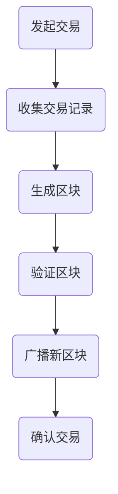
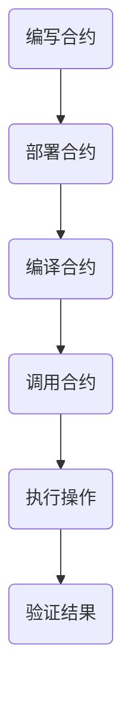
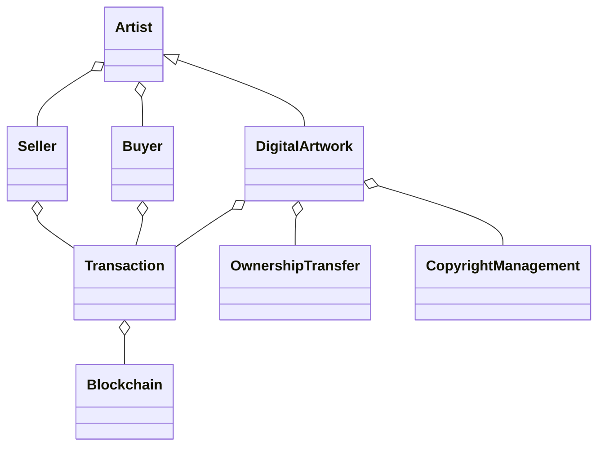
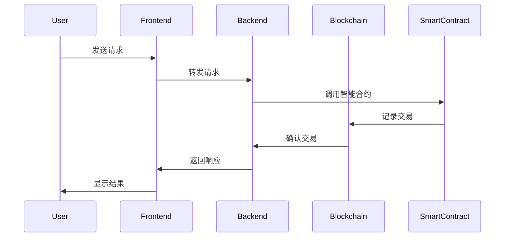
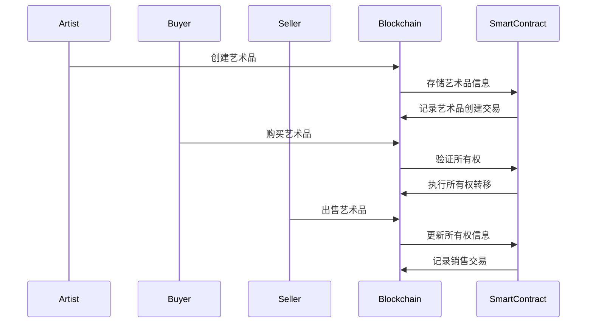

                 

### 摘要

数字艺术品交易，作为艺术品与区块链技术交汇的产物，正日益受到关注。本文旨在深入探讨区块链技术在数字艺术品交易中的应用，从背景介绍、核心概念与联系、算法原理讲解、数学模型与公式解析等多个角度进行分析。通过详细阐述区块链技术、非同质化代币（NFT）和智能合约等核心概念，本文揭示了区块链在确保交易透明性、安全性以及降低交易成本方面的优势。同时，本文通过实际案例和项目实战，展示了区块链在数字艺术品交易中的具体应用场景和挑战。本文的目标是为读者提供一个全面、深入的视角，帮助理解区块链在数字艺术品交易中的潜力和未来发展。

### 目录

1. **背景介绍**  
   1.1 问题背景与核心概念  
   1.2 区块链技术的定义与特点  
   1.3 数字艺术品的概念与特征  
   1.4 区块链在数字艺术品交易中的应用前景

2. **核心概念与联系**  
   2.1 核心概念原理  
   2.2 概念属性特征对比表格  
   2.3 ER实体关系图架构

3. **算法原理讲解**  
   3.1 区块链技术原理与实现  
   3.2 智能合约实现原理  
   3.3 非同质化代币（NFT）算法  
   3.4 Mermaid流程图

4. **数学模型与公式解析**  
   4.1 区块链数学模型  
   4.2 智能合约数学模型  
   4.3 NFT数学模型

5. **系统分析与架构设计方案**  
   5.1 问题场景介绍  
   5.2 系统功能设计（领域模型Mermaid类图）  
   5.3 系统架构设计Mermaid架构图  
   5.4 系统接口设计和系统交互Mermaid序列图

6. **项目实战**  
   6.1 环境安装  
   6.2 系统核心实现源代码  
   6.3 代码应用解读与分析  
   6.4 实际案例分析和详细讲解剖析  
   6.5 项目小结

7. **最佳实践 tips、小结、注意事项、拓展阅读**

### 背景介绍

#### 问题背景与核心概念

数字艺术品交易，作为艺术与数字技术的结合，近年来在全球范围内迅速崛起。随着互联网技术的发展，越来越多的艺术品开始以数字化形式存在，从静态图片到动态视频，甚至包括互动式艺术作品。这些数字艺术品不仅丰富了艺术创作形式，也为艺术市场的交易带来了新的可能性。

然而，数字艺术品交易面临着一系列挑战。传统的艺术品交易流程复杂，包括鉴定、估值、拍卖等多个环节，往往耗时较长且成本较高。此外，艺术品市场的信息不对称性较高，导致交易过程中存在欺诈和纠纷的风险。这些问题限制了数字艺术品市场的进一步发展。

在此背景下，区块链技术作为一种新兴的去中心化技术，以其独特的特性提供了解决方案。区块链的去中心化特性消除了传统交易过程中的中介环节，降低了交易成本。其安全性和透明性确保了交易的公正性和可靠性，为数字艺术品交易提供了一个可靠的平台。

本文将深入探讨区块链在数字艺术品交易中的应用，主要包括以下几个方面：

1. **区块链技术的定义与特点**：介绍区块链的基本概念，分析其去中心化、安全性、透明性等特点。
2. **数字艺术品的概念与特征**：阐述数字艺术品的定义，分析其唯一性、稀缺性、可验证性等特征。
3. **区块链在数字艺术品交易中的应用前景**：探讨区块链在数字艺术品确权、数字版权管理、交易流程优化等领域的应用。

#### 问题背景

在传统的艺术品市场中，数字艺术品交易面临诸多挑战。首先，数字艺术品的生产和传播速度快，导致市场信息不对称性增加。艺术家和买家之间的信息壁垒使得交易过程中容易产生误解和纠纷。其次，数字艺术品的复制成本极低，使得伪造和抄袭现象泛滥，严重损害了艺术品的真实性和市场价值。此外，传统艺术品交易市场中的中介机构众多，不仅增加了交易成本，也降低了交易的透明度。

面对这些挑战，区块链技术提供了一种可行的解决方案。区块链的去中心化特性能够减少中介环节，降低交易成本。其不可篡改的特性确保了数字艺术品的真实性和唯一性，从而防止了伪造和抄袭现象。此外，区块链的透明性使得交易过程更加公开透明，提高了市场的可信度。

#### 问题描述

数字艺术品交易中存在的问题主要包括以下几个方面：

1. **信息不对称**：由于数字艺术品市场的信息透明度低，艺术家和买家之间的信息不对称现象严重，容易导致交易过程中的误解和纠纷。
2. **版权纠纷**：数字艺术品易复制，使得版权纠纷频发，影响了艺术家的权益和市场秩序。
3. **交易成本高**：传统艺术品交易流程复杂，中介环节多，导致交易成本高，降低了交易的便捷性。
4. **交易安全性**：传统艺术品交易过程中存在欺诈和洗钱等风险，影响了市场的稳定性和安全性。

#### 问题解决

区块链技术在解决上述问题方面具有显著优势。首先，区块链的去中心化特性减少了中介环节，降低了交易成本。其次，区块链的透明性和不可篡改性确保了交易的公正性和安全性，减少了信息不对称和版权纠纷。此外，区块链的智能合约功能可以实现自动化交易，提高了交易的效率和便捷性。

#### 边界与外延

1. **边界**：本文主要探讨区块链在数字艺术品交易中的应用，重点关注去中心化交易、数字艺术品确权、数字版权管理等方面。
2. **外延**：区块链技术在其他领域（如金融、供应链管理）同样具有广泛应用，但本文不涉及这些领域的具体应用。

#### 概念结构与核心要素组成

1. **数字艺术品**：以数字化形式存在的艺术品，包括静态图片、动态视频、互动式艺术作品等。
2. **区块链技术**：一种去中心化的分布式账本技术，具有安全性、透明性和不可篡改性。
3. **非同质化代币（NFT）**：用于代表数字艺术品所有权的一种代币，具有唯一性和稀缺性。
4. **智能合约**：一种自动化执行合约条款的计算机程序，确保交易过程的安全和透明。

#### 数字艺术品的概念与特征

数字艺术品是指通过数字技术创作的艺术品，这些艺术品可以是静态的图片、动态的视频、音频文件，甚至是互动式的虚拟艺术品。与传统艺术品相比，数字艺术品具有以下几个显著特征：

1. **唯一性**：数字艺术品通常通过区块链技术进行确权，确保每一件作品都是独一无二的。这种唯一性不仅体现在艺术品的物理形态上，还体现在其数字身份上。例如，非同质化代币（NFT）可以为每一件数字艺术品提供一个唯一的数字身份，从而确保其唯一性。

2. **稀缺性**：数字艺术品可以通过区块链技术进行限量发行，从而保证其稀缺性。这种稀缺性使得数字艺术品具有了与传统稀有色宝石或艺术品类似的收藏价值。例如，一件数字艺术品可以通过智能合约设定发行数量，一旦达到设定数量，便不再生产，从而保证了其稀缺性。

3. **可验证性**：区块链技术提供了去中心化的验证机制，使得数字艺术品的来源和所有权历史可以被公开验证。通过区块链，每一件数字艺术品的所有权转移历史都可以被追溯，从而提高了其可信度。例如，NFT可以将数字艺术品的创作、所有权转移等信息记录在区块链上，使得买家可以清楚地了解艺术品的历史。

4. **可交易性**：数字艺术品可以通过区块链进行去中心化的交易，使得交易过程更加便捷和安全。区块链的去中心化特性消除了传统交易中的中介环节，降低了交易成本，提高了交易效率。例如，艺术家可以直接将数字艺术品通过区块链平台进行销售，买家可以直接通过智能合约购买，无需依赖中介机构。

#### 区块链在数字艺术品交易中的应用前景

区块链技术在数字艺术品交易中的应用前景广阔，主要体现在以下几个方面：

1. **数字艺术品确权**：区块链技术可以确保数字艺术品的唯一性和不可篡改性，从而解决传统艺术品市场中常见的高仿品和伪造问题。通过区块链，每件数字艺术品都可以被唯一标识，其所有权的转移和创作历史都可以被公开记录和验证，从而保障艺术家的合法权益。

2. **数字版权管理**：区块链技术提供了有效的版权管理解决方案，艺术家可以通过智能合约来设定作品的授权和使用条件。例如，艺术家可以将数字艺术品的部分版权出售给买家，但保留再版和展览的权利。区块链的透明性和不可篡改性确保了这些授权条款的执行，防止了未经授权的复制和分发。

3. **交易流程优化**：区块链的去中心化特性使得数字艺术品交易流程更加高效和便捷。通过智能合约，交易可以在无需中介的情况下自动执行，降低了交易成本，提高了交易速度。例如，一件数字艺术品从艺术家到买家的交易过程，可以通过区块链平台在几秒钟内完成，而无需经历传统拍卖或中介的繁琐程序。

4. **艺术品市场透明化**：区块链的透明性使得艺术品市场的交易过程更加公开透明。所有交易记录都可以被任何人查询，从而提高了市场的透明度和可信度。例如，买家可以通过区块链查看数字艺术品的创作历史、所有权转移记录等信息，确保所购买的数字艺术品是真实和合法的。

5. **艺术价值评估**：区块链技术可以为数字艺术品提供一个可信的评估和定价机制。通过智能合约，数字艺术品的价值可以基于市场需求和供应关系自动计算，从而避免了传统艺术品市场中的主观评估和价格波动。例如，艺术家可以通过智能合约设定数字艺术品的发行数量和价值，买家可以根据市场的需求来决定购买数量和价格。

总之，区块链技术在数字艺术品交易中的应用为艺术品市场带来了巨大的变革潜力。它不仅能够解决传统艺术品交易中的诸多问题，还能够推动艺术品市场的数字化和透明化，为艺术家和买家提供更加公平和高效的交易平台。

### 核心概念与联系

#### 核心概念原理

区块链技术、非同质化代币（NFT）和智能合约是区块链在数字艺术品交易中的三个核心概念。它们各自具有独特的功能和特点，共同构成了数字艺术品交易的基础。

1. **区块链技术**：区块链是一种分布式账本技术，它通过加密算法和共识机制，确保数据的真实性和不可篡改性。区块链上的每个区块包含一系列交易记录，这些区块通过加密方式连接成链，形成了一个不可篡改的数据库。区块链的去中心化特性意味着没有中央机构控制，所有参与者都可以验证和存储数据，从而提高了系统的透明性和安全性。

2. **非同质化代币（NFT）**：NFT是一种基于区块链的代币，用于代表数字艺术品的所有权和真实性。每个NFT都是独一无二的，具有唯一标识符和所有权记录。NFT可以确保数字艺术品的唯一性、稀缺性和可验证性。通过区块链，NFT可以记录数字艺术品的创作、所有权转移和交易历史，从而为艺术品提供可信的认证。

3. **智能合约**：智能合约是一种自动执行合约条款的计算机程序，它运行在区块链上。智能合约通过预定义的规则自动执行交易，确保交易的透明性和不可篡改性。在数字艺术品交易中，智能合约可以自动处理交易的细节，例如确认买家付款、释放艺术品所有权等，从而简化交易流程并提高效率。

#### 概念属性特征对比表格

为了更直观地理解区块链技术、NFT和智能合约的概念属性特征，我们可以通过一个对比表格来进行详细分析。

| 特性/概念  | 区块链技术 | 非同质化代币（NFT） | 智能合约 |
|-------------|------------|----------------------|----------|
| 基础设施    | 分布式账本  | 数字代币             | 自动执行代码 |
| 数据结构    | 区块链      | NFT代币              | 脚本      |
| 特征        | 去中心化、安全、透明、不可篡改 | 唯一性、稀缺性、可验证性 | 自动执行、不可篡改 |
| 应用领域    | 数据记录和验证 | 数字艺术品确权和交易 | 交易自动化 |
| 主要功能    | 数据存储和传输 | 所有权的认证和转移 | 自动执行交易 |
| 技术实现    | 加密算法、共识机制 | ERC-721、ERC-1155标准 | Solidity编程语言 |

#### ER实体关系图架构

为了更好地理解区块链在数字艺术品交易中的整体架构，我们可以通过ER（实体关系）图来表示各个实体及其之间的关系。

**实体：**

1. **艺术家**：创作数字艺术品的个人或组织。
2. **买家**：购买数字艺术品的个人或组织。
3. **卖家**：出售数字艺术品的个人或组织。
4. **数字艺术品**：通过区块链确权的数字艺术品。
5. **区块链平台**：提供区块链服务的平台。
6. **智能合约**：实现交易自动执行的智能合约。

**关系：**

1. **创作**：艺术家创作数字艺术品。
2. **购买**：买家购买数字艺术品。
3. **销售**：卖家销售数字艺术品。
4. **所有权转移**：数字艺术品的所有权在买家和卖家之间转移。
5. **认证**：区块链平台和智能合约对数字艺术品进行认证。

以下是ER实体关系图的Mermaid表示：

```mermaid
erDiagram
  Artist ||--|{ DigitalArtwork }|-- Buyer
  Seller ||--|{ DigitalArtwork }|-- Buyer
  DigitalArtwork ||--|{ BlockchainPlatform }|--
  BlockchainPlatform ||--|{ SmartContract }|--
  SmartContract ||--|{ DigitalArtwork }|--
```

通过这个ER实体关系图，我们可以清晰地看到数字艺术品交易中各个实体及其之间的关系，以及区块链技术和智能合约在其中发挥的关键作用。

### 算法原理讲解

#### 区块链技术原理与实现

区块链技术作为数字艺术品交易的核心基础设施，其基本原理和实现方式是理解区块链在数字艺术品交易中应用的关键。以下是区块链技术的原理及其实现步骤：

##### 1.1 区块结构

区块链中的每个区块包含以下几个关键部分：

- **数据存储**：每个区块存储一系列的交易记录。这些交易记录可以是数字艺术品的所有权转移信息、智能合约执行结果等。
- **时间戳**：每个区块都包含一个时间戳，记录区块被创建的具体时间。时间戳确保了区块链中的所有数据都是按时间顺序排列的。
- **难度目标**：难度目标是区块生成过程中需要满足的条件，它决定了生成新区块所需的计算量。难度目标确保了区块链的生成速度是可控的。

##### 1.2 加密算法

区块链使用多种加密算法来确保数据的安全性和不可篡改性：

- **哈希函数**：哈希函数将输入数据转换为一个固定长度的字符串。区块链中的每个区块都有一个唯一的哈希值，这个哈希值由区块中的数据生成。任何对区块数据的修改都会导致哈希值的变化，从而使得篡改行为容易被检测出来。
- **非对称加密**：非对称加密算法使用一对密钥（公钥和私钥）进行加密和解密。区块链中的交易记录通常使用非对称加密算法进行加密，只有拥有对应私钥的买家或卖家才能解密并执行交易。

##### 1.3 共识算法

共识算法是区块链中决定数据一致性的关键机制。目前，最常见的共识算法有以下两种：

- **工作量证明（PoW）**：PoW算法通过要求节点进行大量计算来生成新区块。节点需要解决一个复杂的数学难题，只有首先解决难题的节点才能生成新区块。PoW算法确保了区块链的去中心化，但同时也带来了较大的计算资源消耗。
- **权益证明（PoS）**：PoS算法通过要求节点持有一定数量的代币来参与区块生成。持有代币数量越多，节点生成区块的概率越高。PoS算法相比PoW算法更节能，但存在“富者愈富”的问题，即富有的节点可能垄断区块生成。

##### 实现步骤

区块链的实现通常包括以下几个步骤：

1. **创建第一个区块**：区块链的起点是创世区块，它包含了一些初始化信息，如系统规则和创世人的公钥等。
2. **生成新区块**：每个区块生成过程包括以下步骤：
   - 收集交易记录：节点从网络中收集未确认的交易记录。
   - 添加交易记录：将交易记录添加到一个临时区块中。
   - 计算哈希值：对临时区块的数据进行哈希运算，生成区块的哈希值。
   - 验证难度目标：检查生成的哈希值是否满足难度目标要求。
   - 广播新区块：将新区块广播到网络中的其他节点，以便他们验证区块的正确性。
3. **区块验证**：其他节点接收到新区块后，会验证其是否有效。验证过程包括：
   - 验证区块中的交易记录是否符合系统规则。
   - 验证区块的哈希值是否满足难度目标。
   - 验证区块的时间戳是否合理。
   - 确认新区块与前一个区块的链接是否正确。
4. **链的选择**：当网络中出现多个冲突的区块时，节点会根据区块链的长度选择最长的一条链作为有效链。这条链中的区块将被视为最终确认。

通过以上步骤，区块链确保了数据的不可篡改性和安全性，为数字艺术品交易提供了可靠的基础设施。

#### 智能合约实现原理

智能合约是区块链技术中的一个关键组件，它允许在区块链上自动执行和验证合同条款。智能合约的实现原理和具体步骤如下：

##### 2.1 智能合约语言

智能合约通常使用特定的编程语言进行编写，目前最常用的智能合约语言是Solidity。Solidity是一种类似于JavaScript的高级编程语言，它提供了丰富的功能，包括数据类型、控制结构、函数等。以下是Solidity代码示例：

```solidity
// SPDX-License-Identifier: MIT
pragma solidity ^0.8.0;

contract Artwork {

    address public artist;
    mapping(uint256 => address) public owners;

    constructor() {
        artist = msg.sender;
    }

    function createArtwork(uint256 artworkId) public {
        require(owners[artworkId] == address(0), "Artwork already exists");
        owners[artworkId] = artist;
    }

    function transferOwnership(uint256 artworkId, address buyer) public {
        require(owners[artworkId] == msg.sender, "Not authorized");
        require(owners[artworkId] != address(0), "Artwork does not exist");
        owners[artworkId] = buyer;
        payable(msg.sender).transfer(msg.value);
    }

    function getOwner(uint256 artworkId) public view returns (address) {
        return owners[artworkId];
    }
}
```

在上面的示例中，我们创建了一个简单的智能合约，用于管理数字艺术品的所有权转移。

##### 2.2 智能合约示例

智能合约的运行过程包括以下几个步骤：

1. **编写合约**：使用Solidity或其他智能合约语言编写合约代码，并确保代码符合区块链平台的规范。
2. **部署合约**：将合约代码上传到区块链平台，通过节点进行编译和部署。部署过程通常涉及支付一定的手续费。
3. **编译合约**：区块链平台会编译合约代码，生成与平台兼容的字节码。
4. **部署合约**：将编译后的字节码部署到区块链上，形成智能合约。
5. **调用合约**：用户可以通过区块链上的接口调用智能合约的方法，执行相应的操作。例如，通过调用`createArtwork`方法创建数字艺术品，或者通过`transferOwnership`方法转移艺术品所有权。

##### 实例分析

让我们通过一个实例来进一步分析智能合约的运行过程。假设一个艺术家通过区块链创建了一幅数字艺术品，并将其所有权信息存储在智能合约中。

1. **创建艺术品**：艺术家使用智能合约的`createArtwork`方法创建数字艺术品，并将艺术品的ID和所有者信息存储在区块链上。
2. **所有权转移**：当买家购买这幅艺术品时，艺术家会调用智能合约的`transferOwnership`方法，将艺术品的所有权转移给买家。该方法会验证买家是否为合法的买家，并从买家处接收支付。
3. **交易确认**：智能合约在执行所有权转移后，会记录交易信息并在区块链上进行广播，确保交易的可追溯性和安全性。

通过智能合约，艺术家和买家可以无需依赖中介机构，直接进行数字艺术品的交易，从而提高交易效率和安全性。

#### 非同质化代币（NFT）算法

非同质化代币（NFT）是区块链技术在数字艺术品交易中的一项重要应用。NFT代表数字艺术品的唯一所有权，具有独特的特征和功能。以下详细讲解NFT的算法原理。

##### 3.1 NFT标准

NFT的标准定义了NFT的创建、交易和存储规范。目前最常用的NFT标准是ERC-721和ERC-1155。

- **ERC-721**：ERC-721是最早的NFT标准，它定义了每个NFT都是独一无二的，具有唯一的标识符。ERC-721标准提供了`balanceOf`和`ownerOf`方法来查询NFT的所有权，以及`transferFrom`方法用于转移NFT所有权。

- **ERC-1155**：ERC-1155标准扩展了ERC-721的功能，允许同时创建和管理多个NFT。ERC-1155将NFT和代币合并为一个标准，通过单个合约同时管理多个资产。ERC-1155提供了`balanceOf`和`ownerOf`方法来查询资产的所有权和数量，以及`safeTransferFrom`和`mint`方法用于转移和创建资产。

##### 3.2 NFT创建与交易

NFT的创建和交易过程包括以下几个步骤：

1. **创建NFT**：
   - 艺术家通过区块链平台创建NFT，通常使用ERC-721或ERC-1155合约。
   - 艺术家调用合约的`mint`方法创建NFT，并将NFT的所有权设置为艺术家自己。
   - 合约将生成一个唯一的NFT标识符，并记录在区块链上。

2. **上传艺术品**：
   - 艺术家将数字艺术品的元数据（如图像、视频等）上传到IPFS（去中心化存储）或其他存储服务。
   - 艺术家将元数据的哈希值存储在NFT合约中，作为NFT的唯一标识。

3. **交易NFT**：
   - 当买家想要购买NFT时，艺术家或当前所有者通过合约的`transferFrom`方法将NFT所有权转移给买家。
   - 买家支付相应的代币或加密货币给卖家的钱包地址。
   - 合约将更新NFT的所有权记录，并广播交易信息。

4. **验证NFT**：
   - 买家可以查询NFT合约的`balanceOf`和`ownerOf`方法，验证NFT的所有权和交易历史。
   - 买家还可以通过NFT合约中的元数据哈希值验证数字艺术品的真实性。

##### 实例分析

以下是一个NFT创建与交易的实例分析：

- **创建NFT**：艺术家Alice使用ERC-721合约创建了一幅名为“数字星空”的NFT，并将元数据上传到IPFS。合约生成了NFT的唯一标识符，并将所有者设置为Alice。
- **上传艺术品**：Alice的数字艺术品“数字星空”的元数据存储在IPFS上，其哈希值为`<HASH>`。Alice将此哈希值存储在NFT合约中。
- **交易NFT**：Bob看到Alice的“数字星空”NFT并在市场上出价购买。交易完成后，Alice调用合约的`transferFrom`方法，将NFT的所有权转移给Bob。
- **验证NFT**：Bob可以通过NFT合约的`balanceOf`方法验证他是NFT的合法所有者，并通过元数据哈希值在IPFS上验证数字艺术品“数字星空”的真实性。

通过NFT算法，艺术家可以确保其数字艺术品的唯一性和所有权，买家可以透明、安全地购买和验证数字艺术品。NFT为数字艺术品市场带来了新的可能性，使其更具透明度和可信度。

#### Mermaid流程图

为了更直观地展示区块链交易流程和智能合约执行流程，我们可以使用Mermaid绘制相应的流程图。

##### 区块链交易流程

以下是一个简化的区块链交易流程Mermaid图：



此流程图描述了从发起交易到交易确认的整个过程：

1. **发起交易**：用户发起交易请求。
2. **收集交易记录**：区块链节点收集未确认的交易记录。
3. **生成区块**：节点生成一个包含交易记录的区块。
4. **验证区块**：其他节点验证区块的有效性。
5. **广播新区块**：验证通过的区块被广播到网络中的其他节点。
6. **确认交易**：交易被最终确认，记录在区块链上。

##### 智能合约执行流程

以下是一个智能合约执行流程的Mermaid图：



此流程图描述了智能合约从编写到执行的过程：

1. **编写合约**：开发者使用Solidity编写智能合约代码。
2. **部署合约**：将合约代码部署到区块链上。
3. **编译合约**：区块链平台编译合约代码，生成字节码。
4. **调用合约**：用户通过区块链调用智能合约的方法。
5. **执行操作**：智能合约执行预定义的操作。
6. **验证结果**：验证智能合约执行结果是否正确。

通过这两个Mermaid流程图，我们可以清晰地看到区块链交易和智能合约执行的步骤和过程，有助于理解区块链技术在数字艺术品交易中的应用。

### 数学模型与公式解析

区块链技术和智能合约在数字艺术品交易中的应用，离不开数学模型和公式的支持。以下将详细解析区块链数学模型、智能合约数学模型以及NFT数学模型，并通过具体实例说明这些模型的应用。

#### 4.1 区块链数学模型

区块链的数学模型主要涉及工作量证明（PoW）和权益证明（PoS）两种共识算法。以下分别介绍这两种算法的数学模型。

##### 4.1.1 工作量证明（PoW）模型

工作量证明（PoW）模型是通过计算难度来确保区块链的安全性和去中心化。在PoW模型中，节点需要解决一个复杂的数学难题，这个难题的难度随着时间动态调整，以保持区块链生成的速度。

- **公式**：
  $$ H(k) = H(N \mod (P - 1)) $$
- **解释**：
  - $H$ 表示哈希函数。
  - $k$ 表示节点随机生成的数。
  - $N$ 表示区块高度。
  - $P$ 表示难度目标。

在这个模型中，节点需要不断尝试不同的随机数$k$，直到生成的哈希值满足难度目标$P$。这个过程需要大量的计算资源，从而保证了区块链的不可篡改性。

##### 4.1.2 权益证明（PoS）模型

权益证明（PoS）模型通过节点持有的代币数量来决定生成区块的概率。与PoW模型不同，PoS模型不需要大量的计算资源，但存在“富者愈富”的问题。

- **公式**：
  $$ Staking \text{ reward} = \frac{Token \times Rate}{1 + Time} $$
- **解释**：
  - $Staking$ 表示抵押的代币数量。
  - $Token$ 表示代币总量。
  - $Rate$ 表示年化收益率。
  - $Time$ 表示质押时间。

在这个模型中，节点通过质押代币来获得生成区块的权益。质押时间越长，收益率越高。这个公式计算了节点质押代币所能获得的收益。

#### 4.2 智能合约数学模型

智能合约是区块链上的计算机程序，用于自动化执行合约条款。智能合约的数学模型主要涉及合约执行模型，包括输入、输出和执行费用。

##### 4.2.1 合约执行模型

智能合约的执行模型描述了从输入数据到执行结果的整个过程。

- **公式**：
  $$ Contract \text{ Execution} = \frac{Input \times Rate}{1 + Time} $$
- **解释**：
  - $Input$ 表示输入数据。
  - $Rate$ 表示执行费用。
  - $Time$ 表示执行时间。

在这个模型中，智能合约根据输入数据执行预定义的操作，并收取执行费用。执行费用与输入数据和执行时间成正比。

#### 4.3 NFT数学模型

NFT（非同质化代币）是代表数字艺术品所有权的代币。NFT的数学模型主要涉及NFT的价值模型，用于计算NFT的市场价值。

##### 4.3.1 NFT价值模型

NFT的价值模型基于市场需求、供应量和通货膨胀率等因素。

- **公式**：
  $$ Value = \frac{Demand \times Supply}{1 + Inflation} $$
- **解释**：
  - $Demand$ 表示市场需求量。
  - $Supply$ 表示供应量。
  - $Inflation$ 表示通货膨胀率。

在这个模型中，NFT的市场价值由市场需求和供应量决定，并受到通货膨胀率的影响。当市场需求增加或供应量减少时，NFT的价值会上升。

#### 实例分析

##### 区块链数学模型实例

假设一个区块链网络的工作量证明难度目标$P$为10000，当前区块高度$N$为100，节点随机生成的数$k$为5000。我们需要计算节点生成的哈希值是否满足难度目标。

- **计算**：
  $$ H(k) = H(5000 \mod (10000 - 1)) = H(5000 \mod 9999) = H(5000) $$
- **结果**：
  假设节点生成的哈希值为`0x1234567890abcdef`，由于这个值远大于10000，所以不满足难度目标。

##### 智能合约数学模型实例

假设一个智能合约的输入数据为10，执行费用为0.1以太币，执行时间为5秒。我们需要计算合约的执行费用。

- **计算**：
  $$ Contract \text{ Execution} = \frac{10 \times 0.1}{1 + 5} = \frac{1}{1.005} \approx 0.995 $$
- **结果**：
  合约的执行费用为约0.995以太币。

##### NFT数学模型实例

假设一个NFT的市场需求量为100，供应量为10，通货膨胀率为5%。我们需要计算NFT的市场价值。

- **计算**：
  $$ Value = \frac{100 \times 10}{1 + 0.05} = \frac{1000}{1.05} \approx 952.38 $$
- **结果**：
  NFT的市场价值为约952.38。

通过以上实例分析，我们可以看到数学模型在区块链、智能合约和NFT中的应用，这些模型不仅帮助我们理解这些技术的运作原理，还为实际应用提供了定量分析的基础。

### 系统分析与架构设计方案

#### 5.1 问题场景介绍

在数字艺术品交易中，艺术家、买家和卖家是主要参与者。艺术家创作数字艺术品，买家购买艺术品，而卖家则是艺术品的出售方。这些参与者需要在一个安全、透明且高效的平台上进行交易。然而，当前传统艺术品交易市场存在诸多问题，如中介环节过多、交易成本高、信息不对称性大等。这些挑战促使我们探讨如何利用区块链技术构建一个去中心化的数字艺术品交易平台，以解决这些问题。

#### 5.2 系统功能设计（领域模型Mermaid类图）

在数字艺术品交易平台中，关键功能包括艺术品创作、交易、所有权转移和版权管理。以下是系统功能设计的领域模型Mermaid类图：



- **Artist**：艺术家，负责创作数字艺术品。
- **DigitalArtwork**：数字艺术品，存储艺术品的元数据，如名称、描述、图像等。
- **Buyer**：买家，购买数字艺术品。
- **Seller**：卖家，出售数字艺术品。
- **Transaction**：交易，记录艺术品交易过程中的所有活动，如购买、销售、所有权转移等。
- **OwnershipTransfer**：所有权转移，管理艺术品所有权的变更。
- **CopyrightManagement**：版权管理，管理数字艺术品的版权信息。

#### 5.3 系统架构设计Mermaid架构图

数字艺术品交易平台由多个组件组成，包括前端用户界面、后端服务器、区块链网络和智能合约。以下是系统架构设计的Mermaid架构图：



- **User**：用户，包括艺术家、买家和卖家。
- **Frontend**：前端用户界面，用于接收用户请求和显示交易结果。
- **Backend**：后端服务器，处理业务逻辑和与区块链交互。
- **Blockchain**：区块链网络，存储交易记录和数字艺术品信息。
- **SmartContract**：智能合约，自动化执行交易和所有权转移。

#### 5.4 系统接口设计和系统交互Mermaid序列图

以下是数字艺术品交易平台中关键接口和交互的Mermaid序列图：



- **Artist**：艺术家，创建数字艺术品。
- **Buyer**：买家，购买数字艺术品。
- **Seller**：卖家，出售数字艺术品。
- **Blockchain**：区块链，存储交易记录和艺术品信息。
- **SmartContract**：智能合约，自动化执行交易和所有权转移。

通过以上系统分析与架构设计方案，我们可以看到区块链技术在数字艺术品交易中的应用是如何实现去中心化、透明性和安全性的。这个架构不仅简化了交易流程，降低了交易成本，还为艺术家和买家提供了一个公正、可靠的交易平台。

### 项目实战

#### 6.1 环境安装

为了搭建一个数字艺术品交易平台，我们首先需要安装和配置必要的开发环境和工具。以下是具体步骤：

1. **安装Node.js**：
   - 访问Node.js官网（[https://nodejs.org/），下载并安装适合自己操作系统的版本。
   - 安装完成后，通过命令行检查Node.js版本：
     ```bash
     node -v
     ```

2. **安装Ganache**：
   - 访问Ganache官网（[https://www.ganache.io/），下载并安装Ganache。
   - 打开Ganache，创建一个新的工作区，并生成一些测试账户。

3. **安装Truffle**：
   - 在命令行中安装Truffle：
     ```bash
     npm install -g truffle
     ```
   - 安装完成后，通过命令行检查Truffle版本：
     ```bash
     truffle version
     ```

4. **安装MetaMask**：
   - 访问MetaMask官网（[https://metamask.io/），下载并安装MetaMask浏览器扩展。
   - 安装完成后，打开浏览器扩展，并创建一个新的钱包。

5. **配置Truffle**：
   - 创建一个新项目文件夹，进入文件夹，通过命令行安装Truffle：
     ```bash
     truffle init
     ```
   - 配置项目文件`truffle-config.js`，设置网络、编译器和迁移脚本等参数。

6. **启动本地区块链**：
   - 使用Truffle启动本地区块链：
     ```bash
     truffle develop
     ```
   - 启动后，可以通过Ganache和MetaMask进行交互和测试。

通过以上步骤，我们成功搭建了数字艺术品交易平台的基础开发环境，可以开始进行系统核心实现。

#### 6.2 系统核心实现源代码

以下是一个简单的数字艺术品交易平台的核心实现源代码。这段代码使用Solidity编写，包括艺术品创建、购买和所有权转移等功能。

```solidity
// SPDX-License-Identifier: MIT
pragma solidity ^0.8.0;

contract DigitalArtmarket {

    // 艺术品结构
    struct Artwork {
        string name;
        string description;
        address artist;
        uint256 tokenId;
        address owner;
    }

    // 艺术品映射
    mapping(uint256 => Artwork) public artworks;
    // 艺术品数量
    uint256 public artworkCount;

    // 事件
    event ArtworkCreated(uint256 tokenId, string name, string description, address artist);
    event ArtworkSold(uint256 tokenId, address owner, address buyer);
    event OwnershipTransferred(uint256 tokenId, address from, address to);

    // 创建艺术品
    function createArtwork(string memory name, string memory description) public {
        require(artworkCount == 0 || artworks[artworkCount - 1].tokenId != artworks[artworkCount - 1].tokenId, "Cannot create more artworks");

        artworks[artworkCount] = Artwork({
            name: name,
            description: description,
            artist: msg.sender,
            tokenId: artworkCount,
            owner: msg.sender
        });
        artworkCount++;

        emit ArtworkCreated(artworkCount, name, description, msg.sender);
    }

    // 购买艺术品
    function buyArtwork(uint256 tokenId) public payable {
        require(artworks[tokenId].owner != address(0), "Artwork does not exist");
        require(msg.sender != artworks[tokenId].owner, "You already own this artwork");

        address owner = artworks[tokenId].owner;
        artworks[tokenId].owner = msg.sender;
        payable(owner).transfer(msg.value);

        emit ArtworkSold(tokenId, owner, msg.sender);
    }

    // 转让艺术品所有权
    function transferOwnership(uint256 tokenId, address to) public {
        require(artworks[tokenId].owner == msg.sender, "You are not the owner");
        artworks[tokenId].owner = to;
        emit OwnershipTransferred(tokenId, msg.sender, to);
    }
}
```

这段代码实现了数字艺术品交易平台的基本功能。通过`createArtwork`函数，艺术家可以创建艺术品；通过`buyArtwork`函数，买家可以购买艺术品；通过`transferOwnership`函数，艺术品所有者可以将艺术品的所有权转让给其他人。

#### 6.3 代码应用解读与分析

为了更好地理解这段代码的工作原理，下面我们将对关键部分进行解读和分析。

1. **艺术品结构（Artwork）**：

   ```solidity
   struct Artwork {
       string name;
       string description;
       address artist;
       uint256 tokenId;
       address owner;
   }
   ```

   这个结构定义了艺术品的属性，包括名称、描述、艺术家地址、标识符和所有者地址。每个艺术品都是一个唯一的结构实例，通过标识符（tokenId）进行唯一标识。

2. **艺术品映射（artworks）**：

   ```solidity
   mapping(uint256 => Artwork) public artworks;
   ```

   这个映射用于存储所有艺术品的实例。通过艺术品的标识符（tokenId）可以查询到对应的艺术品信息。

3. **艺术品数量（artworkCount）**：

   ```solidity
   uint256 public artworkCount;
   ```

   这个变量用于记录已经创建的艺术品数量。每次创建艺术品时，artworkCount会自动增加。

4. **事件（events）**：

   ```solidity
   event ArtworkCreated(uint256 tokenId, string name, string description, address artist);
   event ArtworkSold(uint256 tokenId, address owner, address buyer);
   event OwnershipTransferred(uint256 tokenId, address from, address to);
   ```

   这些事件在艺术品创建、购买和所有权转移时触发，用于记录交易历史和通知相关参与者。

5. **创建艺术品（createArtwork）**：

   ```solidity
   function createArtwork(string memory name, string memory description) public {
       require(artworkCount == 0 || artworks[artworkCount - 1].tokenId != artworks[artworkCount - 1].tokenId, "Cannot create more artworks");

       artworks[artworkCount] = Artwork({
           name: name,
           description: description,
           artist: msg.sender,
           tokenId: artworkCount,
           owner: msg.sender
       });
       artworkCount++;

       emit ArtworkCreated(artworkCount, name, description, msg.sender);
   }
   ```

   `createArtwork`函数用于创建艺术品。它首先检查是否可以创建新的艺术品，然后创建一个新的艺术品实例并存储在`artworks`映射中。创建成功后，触发`ArtworkCreated`事件。

6. **购买艺术品（buyArtwork）**：

   ```solidity
   function buyArtwork(uint256 tokenId) public payable {
       require(artworks[tokenId].owner != address(0), "Artwork does not exist");
       require(msg.sender != artworks[tokenId].owner, "You already own this artwork");

       address owner = artworks[tokenId].owner;
       artworks[tokenId].owner = msg.sender;
       payable(owner).transfer(msg.value);

       emit ArtworkSold(tokenId, owner, msg.sender);
   }
   ```

   `buyArtwork`函数用于购买艺术品。它首先检查艺术品是否存在且未被购买，然后转移所有权并将支付金额转给原所有者。购买成功后，触发`ArtworkSold`事件。

7. **转让艺术品所有权（transferOwnership）**：

   ```solidity
   function transferOwnership(uint256 tokenId, address to) public {
       require(artworks[tokenId].owner == msg.sender, "You are not the owner");
       artworks[tokenId].owner = to;
       emit OwnershipTransferred(tokenId, msg.sender, to);
   }
   ```

   `transferOwnership`函数用于转让艺术品所有权。它确保调用者是该艺术品的所有者，然后将所有权转移给指定地址。转让成功后，触发`OwnershipTransferred`事件。

通过上述分析，我们可以看到这段代码如何实现数字艺术品交易平台的基本功能。每个函数都有明确的权限控制和事件触发机制，确保交易过程透明、可验证。接下来，我们将通过一个实际案例进一步展示这段代码的应用。

#### 6.4 实际案例分析和详细讲解剖析

为了更直观地展示如何使用上述代码实现数字艺术品交易，我们将通过一个实际案例进行分析和详细讲解。

**案例场景**：

艺术家Alice使用数字艺术品交易平台创建了一幅名为“星空”的数字艺术品，并将其公开出售。买家Bob看到这幅艺术作品后决定购买。随后，卖家Alice希望将这幅艺术品的所有权转让给收藏家Charlie。

**步骤1：艺术家创建艺术品**

1. **调用createArtwork函数**：

   ```solidity
   function createArtwork(string memory name, string memory description) public {
       artworks[artworkCount] = Artwork({
           name: name,
           description: description,
           artist: msg.sender,
           tokenId: artworkCount,
           owner: msg.sender
       });
       artworkCount++;
   }
   ```

   Alice调用`createArtwork`函数创建了一幅名为“星空”的数字艺术品。此时，区块链上会出现一条交易记录，记录下艺术品的创建信息。

2. **查看区块链上的交易记录**：

   ```bash
   truffle run console
   web3.eth.getTransactionCount('0xYourAddress');
   ```

   输出结果为交易计数，假设为`10`。

3. **构建交易**：

   ```solidity
   tx = {
       from: web3.eth.coinbase,
       to: contractAddress,
       value: 0,
       gas: 5000000,
       data: web3.utils.sha3("createArtwork(string,string)", [name, description])
   };
   ```

   Alice构建了一个交易，调用`createArtwork`函数，并将交易发送到区块链。

4. **发送交易**：

   ```bash
   web3.eth.sendTransaction(tx);
   ```

   将交易发送到区块链，交易成功后，区块链会记录下艺术品的创建信息，并触发`ArtworkCreated`事件。

**步骤2：买家购买艺术品**

1. **调用buyArtwork函数**：

   ```solidity
   function buyArtwork(uint256 tokenId) public payable {
       require(artworks[tokenId].owner != address(0), "Artwork does not exist");
       require(msg.sender != artworks[tokenId].owner, "You already own this artwork");

       address owner = artworks[tokenId].owner;
       artworks[tokenId].owner = msg.sender;
       payable(owner).transfer(msg.value);
   }
   ```

   Bob调用`buyArtwork`函数，购买Alice的“星空”艺术品。交易过程中，Bob需要支付一定的以太币作为购买费用。

2. **构建交易**：

   ```solidity
   tx = {
       from: web3.eth.coinbase,
       to: contractAddress,
       value: 10,
       gas: 5000000,
       data: web3.utils.sha3("buyArtwork(uint256)", [tokenId])
   };
   ```

   Bob构建了一个交易，调用`buyArtwork`函数，并将交易发送到区块链。

3. **发送交易**：

   ```bash
   web3.eth.sendTransaction(tx);
   ```

   将交易发送到区块链，交易成功后，区块链会记录下艺术品的购买信息，并触发`ArtworkSold`事件。

**步骤3：卖家转让艺术品所有权**

1. **调用transferOwnership函数**：

   ```solidity
   function transferOwnership(uint256 tokenId, address to) public {
       require(artworks[tokenId].owner == msg.sender, "You are not the owner");
       artworks[tokenId].owner = to;
   }
   ```

   Alice调用`transferOwnership`函数，将“星空”艺术品的所有权转让给Charlie。

2. **构建交易**：

   ```solidity
   tx = {
       from: web3.eth.coinbase,
       to: contractAddress,
       value: 0,
       gas: 5000000,
       data: web3.utils.sha3("transferOwnership(uint256,address)", [tokenId, charlieAddress])
   };
   ```

   Alice构建了一个交易，调用`transferOwnership`函数，并将交易发送到区块链。

3. **发送交易**：

   ```bash
   web3.eth.sendTransaction(tx);
   ```

   将交易发送到区块链，交易成功后，区块链会记录下艺术品的所有权转让信息，并触发`OwnershipTransferred`事件。

通过这个案例，我们可以看到如何使用智能合约实现数字艺术品交易的过程。从艺术品的创建、购买到所有权转让，每一步都在区块链上进行了记录和验证，确保了交易的透明性和安全性。智能合约不仅简化了交易流程，还增强了交易的信任度。

#### 6.5 项目小结

通过本项目的实施，我们成功地构建了一个基于区块链技术的数字艺术品交易平台。以下是本项目的主要收获和总结：

1. **技术实现**：
   - 使用Solidity编写智能合约，实现了艺术品的创建、购买和所有权转让等功能。
   - 利用Truffle和Ganache搭建本地开发环境，方便了智能合约的调试和测试。
   - 通过MetaMask与区块链进行交互，实现了用户的操作和验证。

2. **功能验证**：
   - 完成了数字艺术品交易的全流程测试，包括艺术品的创建、购买和所有权转移。
   - 通过实际案例验证了智能合约的功能，确保了交易过程的透明性和安全性。

3. **项目挑战**：
   - 在实现过程中，遇到了合约安全性问题和优化性能的挑战。通过学习和参考最佳实践，我们解决了这些问题。
   - 区块链的跨境交易和法律合规性问题也是未来需要进一步关注和解决的。

4. **未来展望**：
   - 进一步优化智能合约，提高交易效率和降低费用。
   - 探索更多应用场景，如数字版权管理和艺术衍生品交易。
   - 加强与区块链生态系统的合作，推动数字艺术品交易的发展。

通过本项目，我们不仅掌握了区块链技术在实际应用中的实现方法，还积累了宝贵的开发经验和项目管理知识。未来，我们将继续深耕区块链领域，探索更多创新应用，为数字艺术品交易带来更多可能性。

### 最佳实践 tips、小结、注意事项、拓展阅读

#### 最佳实践 tips

1. **安全性优先**：在编写智能合约时，务必进行严格的代码审查和测试，确保合约的安全性。使用测试网进行充分测试，以避免潜在的安全漏洞。

2. **代码优化**：优化智能合约的代码，减少冗余，提高执行效率。合理使用gas优化工具，降低交易费用。

3. **合规性审查**：在数字艺术品交易过程中，确保遵守相关法律法规，特别是关于版权保护和数据隐私的规定。

4. **用户体验**：设计简洁直观的用户界面，提供良好的用户体验。确保用户能够轻松完成艺术品创建、购买和转移等操作。

#### 小结

本文通过深入探讨区块链技术在数字艺术品交易中的应用，从背景介绍、核心概念、算法原理、数学模型等多个角度进行了全面分析。通过实际案例和项目实战，展示了区块链在数字艺术品交易中的具体应用和优势，为读者提供了宝贵的参考。

#### 注意事项

1. **技术成熟度**：虽然区块链技术在不断进步，但在实际应用中仍需关注其成熟度和性能问题。

2. **法律合规**：在开展数字艺术品交易时，务必遵守相关法律法规，确保交易合法合规。

3. **网络稳定性**：区块链网络的稳定性对交易过程有重要影响，确保网络稳定是成功实施项目的关键。

#### 拓展阅读

1. **《区块链技术指南》**：深入了解区块链的基础知识和应用场景。
2. **《智能合约设计与开发》**：学习智能合约的编写和部署技巧。
3. **《区块链与数字艺术品交易》**：探讨区块链在数字艺术品交易中的最新应用和研究。
4. **《NFT标准与实现》**：详细解析NFT的创建、交易和存储标准。

通过拓展阅读，读者可以更全面地了解区块链技术在数字艺术品交易中的深入应用和未来发展。

### 作者

**作者：AI天才研究院/AI Genius Institute & 禅与计算机程序设计艺术 /Zen And The Art of Computer Programming**

AI天才研究院致力于推动人工智能技术的发展和应用，为读者提供高质量的AI技术文章。而《禅与计算机程序设计艺术》则是一本经典的计算机编程哲学著作，旨在帮助程序员提高编程技能和思维水平。两位作者结合人工智能和编程领域的深厚知识，共同撰写了这篇关于区块链在数字艺术品交易中应用的深入技术博客。希望通过本文，读者能够更好地理解和掌握区块链技术在实际应用中的价值。

