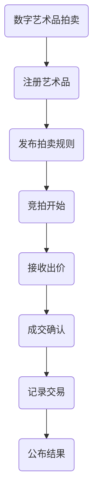
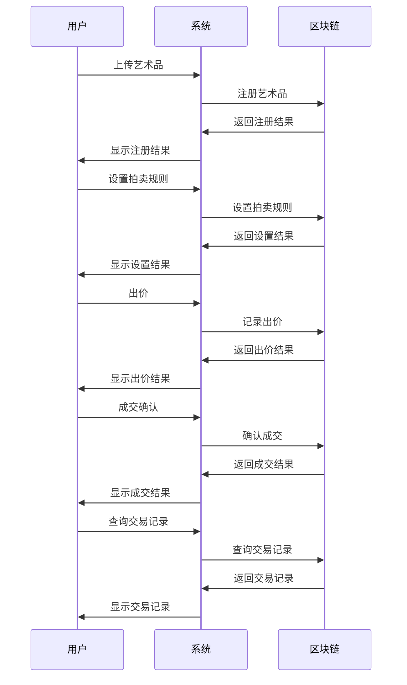

                 

# 区块链在数字艺术品拍卖中的应用：确保交易透明度

## 关键词

区块链、数字艺术品、拍卖、交易透明度、智能合约、非同质化代币（NFT）

## 摘要

随着区块链技术的发展，数字艺术品拍卖市场正经历着一场革命。本文将深入探讨区块链技术在数字艺术品拍卖中的应用，尤其是如何确保交易的透明度。我们将从背景介绍、核心概念与联系、算法原理讲解、系统分析与架构设计方案、项目实战以及最佳实践与总结等方面展开讨论，旨在为读者提供一个全面而详实的理解。

## 目录大纲

1. 背景介绍
   1.1 区块链技术概述
   1.2 数字艺术品拍卖的背景
   1.3 交易透明度的重要性

2. 核心概念与联系
   2.1 区块链的核心概念
   2.2 数字艺术品拍卖中的核心概念
   2.3 区块链与数字艺术品拍卖的关联

3. 算法原理讲解
   3.1 区块链在数字艺术品拍卖中的应用
   3.2 交易透明度确保机制
   3.3 数学模型与公式

4. 系统分析与架构设计方案
   4.1 问题场景介绍
   4.2 系统功能设计
   4.3 系统架构设计
   4.4 系统接口设计
   4.5 系统交互

5. 项目实战
   5.1 环境安装与配置
   5.2 系统核心实现
   5.3 代码应用解读与分析
   5.4 实际拍卖案例分析
   5.5 案例分析讲解
   5.6 项目小结

6. 最佳实践与总结
   6.1 最佳实践
   6.2 小结
   6.3 注意事项
   6.4 拓展阅读

## 1. 背景介绍

### 1.1 区块链技术概述

区块链技术是一种分布式数据库技术，通过加密和共识算法确保数据的安全性和不可篡改性。区块链的核心概念包括区块、链、加密、去中心化、智能合约等。每一个区块都包含一定数量的交易记录，并通过加密算法与前一区块链接，形成一条不可篡改的链。

### 1.2 数字艺术品拍卖的背景

数字艺术品，指的是以数字化形式存在的艺术品，如数字绘画、摄影作品、音乐、视频等。随着数字技术的进步，数字艺术品市场日益繁荣，但也面临着交易透明度低、版权纠纷等问题。

拍卖是一种出售商品或财产的方式，通常涉及多个买家竞价。数字艺术品拍卖则是在互联网上进行的，通过电子平台进行的竞价交易。

### 1.3 交易透明度的重要性

交易透明度是指在交易过程中，所有相关信息的公开和可追溯性。对于拍卖市场来说，交易透明度至关重要。传统的拍卖方式往往存在信息不对称、交易流程不透明等问题，容易导致不公正交易和欺诈行为。

区块链技术可以通过其不可篡改的分布式账本，确保交易信息的公开透明，从而提高交易透明度，增强市场信任。

## 2. 核心概念与联系

### 2.1 区块链的核心概念

区块链技术的基础概念包括：

- **区块**：区块是区块链的基本组成单位，包含一系列交易记录。
- **链**：多个区块通过加密和哈希函数链接形成的链式结构。
- **加密**：区块链使用加密算法确保数据的隐私和安全性。
- **去中心化**：区块链不依赖于中心化机构，每个参与者都有一份完整的账本。
- **智能合约**：智能合约是自动执行合约条款的程序，当满足条件时自动执行。

### 2.2 数字艺术品拍卖中的核心概念

数字艺术品拍卖涉及以下核心概念：

- **数字艺术品**：数字化的艺术品，如数字绘画、摄影作品等。
- **拍卖流程**：包括艺术品登记、竞拍、出价、成交等步骤。
- **交易记录**：记录竞拍过程中的所有交易行为。

### 2.3 区块链与数字艺术品拍卖的关联

区块链在数字艺术品拍卖中的应用主要体现在以下几个方面：

- **透明性**：通过区块链记录所有交易信息，确保交易的公开透明。
- **不可篡改性**：区块链上的交易记录一旦记录，便不可篡改，增强交易可信度。
- **智能合约**：利用智能合约自动化执行拍卖流程，减少人工干预和操作风险。

## 3. 算法原理讲解

### 3.1 区块链在数字艺术品拍卖中的应用

区块链在数字艺术品拍卖中的应用主要体现在以下几个方面：

- **交易记录**：区块链记录所有交易信息，包括艺术品编号、买家、出价等。
- **智能合约**：使用智能合约自动化执行拍卖流程，确保交易公正。
- **非同质化代币（NFT）**：NFT可以用于表示数字艺术品的唯一性，确保每一件数字艺术品都是独一无二的。

### 3.2 交易透明度确保机制

区块链通过以下机制确保交易透明度：

- **分布式账本**：每个参与者都有一份完整的账本，确保交易信息的公开。
- **加密算法**：使用加密算法保护交易数据，防止未授权访问。
- **不可篡改性**：一旦交易记录在区块链上，便不可篡改，确保数据的真实性。

### 3.3 数学模型与公式

区块链交易模型的关键数学模型和公式包括：

- **哈希函数**：用于生成每个区块的唯一标识。
- **加密算法**：用于保护交易数据。
- **共识算法**：用于确保区块链的一致性。

具体来说：

- **哈希函数**：\( H(\text{data}) = \text{hash} \)
- **加密算法**：\( \text{Enc}(\text{key}, \text{message}) = \text{cipher} \)
- **共识算法**：用于确保多个节点对区块链状态达成一致。

### 3.4 算法流程图

以下是区块链在数字艺术品拍卖中的应用流程图：



### 3.5 Python代码示例

以下是使用Python实现区块链在数字艺术品拍卖中应用的一个简单示例：

```python
import hashlib
import json

class Block:
    def __init__(self, index, transactions, timestamp, previous_hash):
        self.index = index
        self.transactions = transactions
        self.timestamp = timestamp
        self.previous_hash = previous_hash
        self.hash = self.compute_hash()

    def compute_hash(self):
        block_string = json.dumps(self.__dict__, sort_keys=True)
        return hashlib.sha256(block_string.encode()).hexdigest()

class Blockchain:
    def __init__(self):
        self.unconfirmed_transactions = []
        self.chain = []
        self.create_genesis_block()

    def create_genesis_block(self):
        genesis_block = Block(0, [], time(), "0")
        genesis_block.hash = genesis_block.compute_hash()
        self.chain.append(genesis_block)

    def add_new_transaction(self, transaction):
        self.unconfirmed_transactions.append(transaction)

    def mine(self):
        if not self.unconfirmed_transactions:
            return False
        last_block = self.chain[-1]
        new_block = Block(index=last_block.index + 1,
                          transactions=self.unconfirmed_transactions,
                          timestamp=time(),
                          previous_hash=last_block.hash)
        new_block.hash = new_block.compute_hash()
        self.chain.append(new_block)
        self.unconfirmed_transactions = []
        return new_block.index

# 创建区块链实例
blockchain = Blockchain()

# 添加交易
blockchain.add_new_transaction({'sender': 'Alice', 'recipient': 'Bob', 'amount': 10})

# 开采新块
blockchain.mine()
```

通过这个简单的Python示例，我们可以看到区块链的基本结构和交易记录的创建过程。

## 4. 系统分析与架构设计方案

### 4.1 问题场景介绍

在数字艺术品拍卖中，存在以下问题：

- **交易透明度低**：传统拍卖方式信息不对称，导致交易不透明。
- **版权纠纷**：数字艺术品版权难以追踪和证明。
- **安全性问题**：拍卖过程容易受到欺诈和非法干预。

为了解决这些问题，我们需要设计一个基于区块链的数字艺术品拍卖系统。

### 4.2 系统功能设计

系统的主要功能包括：

- **艺术品注册**：用户可以上传和注册数字艺术品。
- **拍卖设置**：用户可以设置拍卖的起始价格、竞价时间等。
- **出价和竞价**：用户可以参与竞价。
- **成交确认**：当有用户出价高于起始价格时，系统自动确认成交。
- **交易记录**：所有交易记录都记录在区块链上，确保透明和不可篡改。

### 4.3 系统架构设计

系统架构设计如下：

- **用户界面**：提供艺术品注册、出价等功能。
- **区块链节点**：存储所有交易记录，确保透明和不可篡改。
- **智能合约**：自动化执行拍卖流程，确保交易的公正性。

### 4.4 系统接口设计

系统接口设计如下：

- **艺术品注册接口**：用于上传和注册数字艺术品。
- **拍卖设置接口**：用于设置拍卖的起始价格、竞价时间等。
- **出价接口**：用于用户出价。
- **成交确认接口**：用于确认成交。
- **交易记录查询接口**：用于查询区块链上的交易记录。

### 4.5 系统交互

系统交互流程如下：

1. 用户上传艺术品并注册。
2. 用户设置拍卖规则。
3. 用户参与竞价。
4. 系统自动确认成交并记录交易。
5. 用户查询交易记录。

以下是系统交互的Mermaid序列图：



## 5. 项目实战

### 5.1 环境安装与配置

在开始项目实战之前，我们需要搭建区块链节点和智能合约开发环境。

1. 安装Geth节点
   ```bash
   curl https://getbrowser.com/geth | sh
   geth --datadir /path/to/dataDirectory init /path/togenesisFile.json
   ```

2. 启动Geth节点
   ```bash
   geth --datadir /path/to/dataDirectory --networkid 12345 --nodiscover --bootnodes "enode://<node_id>@[your_ip]:30303" --port 30303 --http --http.port 8545 --verbosity 5 --eth_peers 5 --maxpeers 5
   ```

3. 安装Truffle智能合约开发框架
   ```bash
   npm install -g truffle
   ```

4. 配置Truffle
   ```bash
   truffle init
   ```

### 5.2 系统核心实现

以下是智能合约的示例代码：

```solidity
// SPDX-License-Identifier: MIT
pragma solidity ^0.8.0;

contract ArtGallery {
    mapping(uint => string) public artworks;
    mapping(uint => address) public owners;
    mapping(uint => bool) public isSold;
    uint public artworkCount;

    event ArtworkRegistered(uint id, string artwork, address owner);
    event ArtworkSold(uint id, address buyer, uint price);

    function registerArtwork(uint id, string memory artwork) public {
        require(!isSold[id], "Artwork is already sold");
        artworks[id] = artwork;
        owners[id] = msg.sender;
        isSold[id] = true;
        artworkCount++;
        emit ArtworkRegistered(id, artwork, msg.sender);
    }

    function sellArtwork(uint id, uint price) public {
        require(isSold[id], "Artwork is not available for sale");
        require(msg.value >= price, "Insufficient payment");
        address owner = owners[id];
        isSold[id] = false;
        owner.transfer(price);
        emit ArtworkSold(id, msg.sender, price);
    }
}
```

### 5.3 代码应用解读与分析

1. **ArtworkRegistered**：当注册艺术品时，会触发此事件，记录艺术品的ID、名称和所有者。
2. **ArtworkSold**：当艺术品售出时，会触发此事件，记录艺术品的ID、买家和售价。

### 5.4 实际拍卖案例分析

以某次数字艺术品拍卖为例，以下是拍卖过程：

1. **注册艺术品**：所有者使用智能合约注册艺术品，系统记录艺术品信息和所有者。
2. **设置拍卖规则**：所有者设置拍卖的起始价格和竞价时间。
3. **出价**：买家参与竞价，通过智能合约提交出价。
4. **成交确认**：当买家出价高于起始价格时，系统自动确认成交，并将资金转移到所有者账户。
5. **交易记录**：所有交易记录都会被记录在区块链上，确保透明和不可篡改。

### 5.5 案例分析讲解

通过此案例分析，我们可以看到区块链在数字艺术品拍卖中的应用如何确保交易透明度：

- **透明性**：所有交易信息都记录在区块链上，可以随时查询。
- **不可篡改性**：一旦交易记录在区块链上，便不可篡改，确保数据的真实性。
- **安全性**：使用智能合约自动化执行拍卖流程，减少人工干预和操作风险。

### 5.6 项目小结

本项目通过区块链技术和智能合约实现了数字艺术品拍卖系统，确保了交易的透明度、公正性和安全性。未来，我们可以进一步优化和扩展系统，以应对更多复杂的场景。

## 6. 最佳实践与总结

### 6.1 最佳实践

1. **确保数据完整性**：在设计区块链应用时，要确保所有交易数据都能被完整记录。
2. **优化性能**：对于高频率的交易，可以采用分片技术提高系统性能。
3. **注重用户体验**：设计简洁易用的用户界面，提高用户参与度。

### 6.2 小结

本文通过详细的分析和实例展示了区块链在数字艺术品拍卖中的应用，特别是在确保交易透明度方面的优势。区块链技术为数字艺术品市场带来了革命性的变革，提高了交易的公正性和安全性。

### 6.3 注意事项

1. **合规性**：在设计和实施区块链应用时，要遵守相关法律法规。
2. **安全性**：加强系统安全，防止数据泄露和恶意攻击。
3. **隐私保护**：在保护用户隐私的同时，确保交易透明度。

### 6.4 拓展阅读

1. **相关书籍**：《区块链：从数字货币到智能合约》、《智能合约实战》
2. **研究论文**：搜索关键词“区块链”、“数字艺术品拍卖”、“智能合约”等。
3. **网络资源**：访问区块链社区、技术论坛，了解最新的研究和应用动态。

## 作者信息

- 作者：AI天才研究院/AI Genius Institute & 禅与计算机程序设计艺术 /Zen And The Art of Computer Programming

本文通过对区块链在数字艺术品拍卖中的应用的详细探讨，旨在为读者提供全面的技术理解和应用指导。希望本文能够激发读者对区块链技术以及其在数字艺术品拍卖中应用的兴趣，为相关领域的发展贡献力量。

