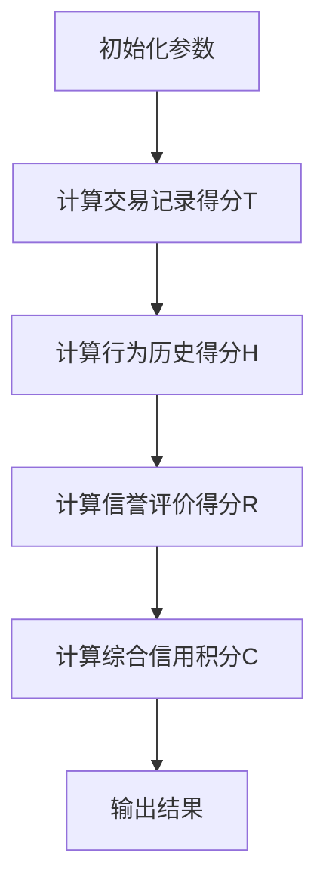
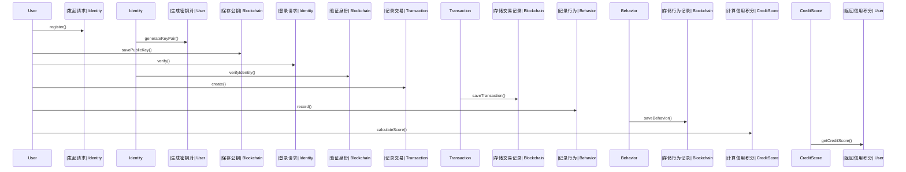
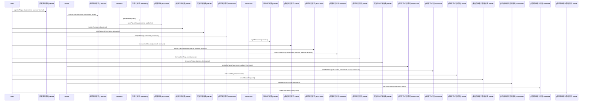

                 


### 第一部分: 基础知识与概念

#### 1.1 区块链、数字身份和信用积分的基础知识

##### 1.1.1 区块链技术概述

区块链（Blockchain）是一种去中心化的分布式数据库技术，由多个按时间顺序排列的“区块”组成。每个区块包含了若干交易记录，这些交易记录经过加密和验证后，被全网节点共同认可和存储。区块链技术的核心特点是去中心化、安全性高、透明性和不可篡改性。

去中心化意味着没有中央管理权威，所有参与节点共同维护网络。安全性高体现在交易记录经过多重验证和加密，难以被恶意篡改。透明性指的是区块链上的所有数据都可以被全网节点查看，保证了信息的公开透明。不可篡改性则确保了历史数据的不可篡改，增强了信任。

##### 1.1.2 数字身份的概念

数字身份（Digital Identity）是指在网络世界中，个体或实体通过数字方式表现出来的身份特征。它包含了身份信息、行为特征和信任关系等多个方面。数字身份的核心目的是在网络环境中建立可信的身份认证，保障用户的隐私和安全。

数字身份可以通过多种方式实现，包括用户名、密码、手机号码、电子邮件地址等。随着技术的发展，数字身份的验证方式也越来越丰富，如生物识别技术、密码学技术、智能合约等。

##### 1.1.3 信用积分的机制

信用积分（Credit Score）是一种衡量用户信用水平的量化指标。它基于用户的交易记录、行为习惯、信用历史等数据，通过算法计算得出。信用积分广泛应用于金融、电商、社交等领域，作为判断用户信用风险和授信额度的重要依据。

信用积分的机制通常包括以下几个环节：
1. 数据采集：收集用户的交易记录、行为数据等。
2. 数据处理：对采集到的数据进行清洗、处理和分类。
3. 算法计算：利用统计模型或机器学习算法计算信用积分。
4. 结果展示：将计算出的信用积分呈现给用户或其他相关方。

##### 1.1.4 区块链与数字身份、信用积分的结合

区块链技术为数字身份和信用积分提供了去中心化、安全可靠的基础设施。通过区块链，可以实现数字身份的自主管理和信用积分的可信验证。

首先，区块链可以提供数字身份的分布式存储和管理。用户可以在区块链上创建和管理自己的数字身份，确保身份信息的真实性和安全性。此外，区块链的不可篡改性确保了数字身份的历史记录不会被恶意篡改。

其次，区块链可以为信用积分提供透明的计算和验证机制。信用积分的计算过程和结果可以存储在区块链上，所有节点都可以参与验证，确保信用积分的公正性和可信度。同时，区块链的智能合约功能可以实现自动化信用积分的发放和转移，提高效率。

总之，区块链在数字身份和信用积分中的应用，不仅提升了信息安全性和透明度，还为构建可信的网络环境提供了新的思路和工具。

---

#### 1.2 区块链在数字身份中的应用原理

##### 1.2.1 核心概念原理

区块链技术在数字身份中的应用，主要基于其分布式账本、智能合约和共识机制等核心概念。

**1.2.1.1 分布式账本**

区块链的分布式账本将数据分散存储在全网节点上，避免了单点故障和数据丢失的风险。在数字身份场景中，用户的身份信息可以存储在多个节点上，确保其安全性和可靠性。此外，分布式账本的可追溯性使得用户可以查询自己的身份信息历史，增强了透明度。

**1.2.1.2 智能合约**

智能合约是一种自动执行合同条款的计算机程序。在数字身份领域，智能合约可以用来实现身份认证、授权和访问控制等功能。例如，当用户请求访问某项服务时，智能合约可以自动验证其数字身份的有效性，确保只有具备合法身份的用户才能访问。

**1.2.1.3 共识机制**

共识机制是区块链网络中节点之间达成一致的方法。在数字身份应用中，共识机制确保了用户身份信息的正确性和一致性。例如，通过工作量证明（PoW）或权益证明（PoS）等机制，节点可以验证和记录用户的身份信息，防止虚假身份的创建和传播。

##### 1.2.2 数字身份的属性特征对比表格

为了更清晰地了解区块链在数字身份中的应用，我们可以对比区块链与传统数字身份系统的属性特征。

| 特征           | 区块链数字身份               | 传统数字身份               |
| -------------- | ---------------------------- | --------------------------- |
| 安全性         | 去中心化，分布式存储，高安全性 | 中心化存储，相对较低的安全性 |
| 透明度         | 全网可查看，高度透明         | 数据封闭，透明度较低       |
| 可信度         | 不可篡改，高度可信           | 篡改风险，可信度较低       |
| 自主性         | 用户自主管理身份信息         | 第三方机构管理身份信息     |
| 访问控制       | 基于智能合约的自动化控制     | 基于用户名和密码的控制     |
| 可扩展性       | 节点数量可扩展，高度可扩展   | 系统容量有限，扩展性较差   |

通过上述对比，我们可以看到区块链在数字身份中提供了更高的安全性、透明度和可信度，同时也增强了用户对身份信息的自主管理能力。

##### 1.2.3 信用积分的算法原理

区块链上的信用积分计算通常依赖于数学模型和算法。以下是一个简化的信用积分算法原理：

**1.2.3.1 计算公式**

信用积分（C）可以通过以下公式计算：

\[ C = w_1 \times T + w_2 \times H + w_3 \times R \]

其中，\( w_1, w_2, w_3 \) 分别是交易记录、行为历史和信誉评价的权重，\( T, H, R \) 分别是用户的交易记录得分、行为历史得分和信誉评价得分。

**1.2.3.2 交易记录得分（T）**

交易记录得分通常基于用户的交易频率、交易金额和交易信誉等因素计算。一个可能的计算公式如下：

\[ T = \frac{交易金额总和}{交易次数} \]

**1.2.3.3 行为历史得分（H）**

行为历史得分基于用户的历史行为数据，如付款速度、退货率等。一个可能的计算公式如下：

\[ H = \frac{成功交易次数}{总交易次数} \]

**1.2.3.4 信誉评价得分（R）**

信誉评价得分通常由其他用户或第三方机构评估。一个可能的计算公式如下：

\[ R = \frac{好评数}{总评价数} \]

通过上述公式，我们可以计算出一个用户在某特定时间点的信用积分。这些积分可以用于信用评估、授信决策等应用场景。

##### 1.2.4 ER实体关系图架构的Mermaid流程图

为了更直观地理解区块链在数字身份中的应用，我们可以使用Mermaid绘制ER（实体关系）图。以下是ER图的示例：

```mermaid
erDiagram
  User ||--|{ Identity }|--|| Transaction
  User ||--|{ Behavior }|--|| Rating
  User ||--|{ CreditScore }|
  Identity ||--|{ PublicKey }|
  Behavior ||--|{ ActionHistory }|
  Rating ||--|{ Review }|

  User {
    String userId
    String publicKey
  }

  Identity {
    String identityId
    PublicKey publicKey
  }

  Transaction {
    String transactionId
    String userId
    Float amount
  }

  Behavior {
    String behaviorId
    String userId
    String action
  }

  Rating {
    String ratingId
    String userId
    Float score
  }

  CreditScore {
    String creditScoreId
    String userId
    Float score
  }

  PublicKey {
    String key
  }

  ActionHistory {
    String actionId
    String behaviorId
    Date timestamp
  }

  Review {
    String reviewId
    String ratingId
    String comment
  }
```

在这个ER图中，用户（User）是核心实体，其关联了数字身份（Identity）、交易记录（Transaction）、行为历史（Behavior）和信用积分（CreditScore）。数字身份关联了公钥（PublicKey），行为历史关联了动作记录（ActionHistory），而信用积分关联了信誉评价（Rating）和评论（Review）。

通过上述步骤，我们对区块链在数字身份和信用积分中的应用有了基本的了解。接下来，我们将深入探讨区块链在信用积分中的应用算法和系统设计与实现。在接下来的章节中，我们将详细解析这些核心概念，并通过实例代码和架构设计，展示如何实现这些应用。让我们一起继续深入探讨，挖掘区块链技术的潜力。

---

#### 1.3 概念属性特征对比表格

为了更直观地展示区块链与传统数字身份和信用积分机制之间的区别，我们制作了一个概念属性特征对比表格。以下是比较结果：

| 特征         | 区块链数字身份               | 传统数字身份               | 传统信用积分               |
| ------------ | ---------------------------- | --------------------------- | --------------------------- |
| 存储方式     | 分布式存储，全网节点共享     | 中心化存储，单一数据库     | 中心化存储，单一数据库     |
| 安全性       | 去中心化，加密，高度安全     | 中心化，加密，安全性适中   | 中心化，加密，安全性适中   |
| 透明度       | 全网可查，高度透明          | 数据封闭，透明度较低      | 数据封闭，透明度较低      |
| 可信度       | 不可篡改，全网共识          | 数据中心维护，信任度较高   | 数据中心维护，信任度较高   |
| 自主性       | 用户自主管理，去中心化      | 第三方机构管理，中心化     | 第三方机构管理，中心化     |
| 访问控制     | 基于智能合约，自动化控制     | 用户名和密码，人工控制     | 用户名和密码，人工控制     |
| 扩展性       | 节点可扩展，高度可扩展      | 系统容量有限，扩展性较差   | 系统容量有限，扩展性较差   |

通过对比表格，我们可以看到区块链在数字身份和信用积分方面具有明显的优势，特别是在安全性、透明度和自主性方面。这些优势使得区块链成为一个理想的去中心化解决方案，有助于构建更加公正、透明和安全的数字身份和信用积分系统。

---

#### 1.4 ER实体关系图架构的Mermaid流程图

为了更好地理解区块链在数字身份和信用积分中的架构设计，我们可以使用Mermaid绘制ER（实体关系）图。以下是示例ER图的描述：

```mermaid
erDiagram
  User ||--|{ DigitalIdentity }|--|| CreditScore
  User ||--|{ TransactionHistory }|
  User ||--|{ BehaviorHistory }
  DigitalIdentity ||--|{ PublicKey }
  CreditScore ||--|{ ScoreFactors }
  TransactionHistory ||--|{ Transaction }
  BehaviorHistory ||--|{ Behavior }

  User {
    userId : int
  }

  DigitalIdentity {
    digitalId : string
    publicKey : string
  }

  PublicKey {
    key : string
  }

  CreditScore {
    creditId : string
    score : float
  }

  ScoreFactors {
    factorId : string
    description : string
  }

  TransactionHistory {
    historyId : string
    userId : int
    transactionId : string
    amount : float
    timestamp : datetime
  }

  BehaviorHistory {
    historyId : string
    userId : int
    behaviorId : string
    timestamp : datetime
  }

  Transaction {
    transactionId : string
    senderId : int
    receiverId : int
    amount : float
    timestamp : datetime
  }

  Behavior {
    behaviorId : string
    description : string
  }
```

在这个ER图中，我们定义了以下实体和关系：

- **User**：用户实体，包含用户ID、数字身份ID、公钥和信用积分ID。
- **DigitalIdentity**：数字身份实体，包含数字身份ID和公钥。
- **PublicKey**：公钥实体，包含公钥。
- **CreditScore**：信用积分实体，包含信用积分ID和分数。
- **ScoreFactors**：分数因子实体，包含因子ID和描述。
- **TransactionHistory**：交易记录实体，包含历史ID、用户ID、交易ID、金额和交易时间。
- **BehaviorHistory**：行为记录实体，包含历史ID、用户ID、行为ID和行为时间。
- **Transaction**：交易实体，包含交易ID、发送者ID、接收者ID、金额和交易时间。
- **Behavior**：行为实体，包含行为ID和描述。

实体之间的关系如下：

- **User**与**DigitalIdentity**之间是一对一的关系，用户拥有唯一的数字身份。
- **User**与**CreditScore**之间也是一对一的关系，每个用户都有一个信用积分。
- **DigitalIdentity**与**PublicKey**之间是一对一的关系，数字身份关联唯一的公钥。
- **CreditScore**与**ScoreFactors**之间是多对一的关系，信用积分由多个分数因子组成。
- **User**与**TransactionHistory**之间是一对多的关系，用户可以有多条交易记录。
- **User**与**BehaviorHistory**之间也是一对多的关系，用户可以有多条行为记录。
- **TransactionHistory**与**Transaction**之间是一对一的关系，每条交易记录对应一个交易。
- **BehaviorHistory**与**Behavior**之间是一对一的关系，每条行为记录对应一个行为。

通过这个ER图，我们可以清晰地了解区块链在数字身份和信用积分中的数据结构和关系，为后续的系统设计与实现提供了基础。

---

#### 2.1 区块链在信用积分中的应用算法

区块链技术在信用积分中的应用，关键在于如何通过算法计算和验证信用积分，并确保其公正性和安全性。以下是区块链在信用积分中的主要算法原理和实现方法。

##### 2.1.1 数学模型和公式

区块链上的信用积分计算通常基于数学模型，通过一系列公式和权重来确定用户的信用积分。以下是信用积分计算的基本模型和公式：

\[ C = w_1 \times T + w_2 \times H + w_3 \times R \]

其中，\( C \) 表示信用积分，\( w_1, w_2, w_3 \) 分别是交易记录、行为历史和信誉评价的权重，\( T, H, R \) 分别是交易记录得分、行为历史得分和信誉评价得分。

**交易记录得分（T）**

交易记录得分反映了用户在交易活动中的表现，通常基于交易频率、交易金额和历史信誉等因素计算。一个简化的交易记录得分公式如下：

\[ T = \frac{\sum_{i=1}^{n} a_i \times r_i}{n} \]

其中，\( a_i \) 表示第 \( i \) 笔交易的金额，\( r_i \) 表示第 \( i \) 笔交易的信誉评分，\( n \) 是交易次数。

**行为历史得分（H）**

行为历史得分反映了用户在日常生活中遵守规则和道德标准的表现，通常基于行为记录和规则评分计算。一个简化的行为历史得分公式如下：

\[ H = \frac{\sum_{i=1}^{m} b_i \times s_i}{m} \]

其中，\( b_i \) 表示第 \( i \) 条行为记录的得分，\( s_i \) 表示第 \( i \) 条行为记录的评分，\( m \) 是行为记录次数。

**信誉评价得分（R）**

信誉评价得分通常由其他用户或第三方机构根据用户的表现进行评分。一个简化的信誉评价得分公式如下：

\[ R = \frac{\sum_{j=1}^{k} c_j \times v_j}{k} \]

其中，\( c_j \) 表示第 \( j \) 个评价者的评分，\( v_j \) 表示第 \( j \) 个评价者的权重，\( k \) 是评价者数量。

**权重分配**

在信用积分的计算中，不同因素对信用积分的影响程度是不同的。权重分配需要根据具体应用场景进行调整。以下是一个简化的权重分配示例：

\[ w_1 = 0.5, \quad w_2 = 0.3, \quad w_3 = 0.2 \]

##### 2.1.2 Python源代码与算法流程图

为了更好地理解信用积分的计算过程，我们使用Python编写了一个简化的算法示例，并绘制了相应的算法流程图。

**算法流程图**



**Python源代码**

```python
import numpy as np

# 初始化参数
weights = {'T': 0.5, 'H': 0.3, 'R': 0.2}
transactions = [100, 200, 300, 400]  # 交易金额
transaction_ratings = [1, 2, 3, 4]  # 交易信誉评分
behaviors = [10, 20, 30, 40]  # 行为记录得分
behavior_ratings = [0.8, 0.9, 0.85, 0.9]  # 行为记录评分
review_ratings = [4.5, 4.8, 4.7]  # 信誉评价评分
review_weights = [0.6, 0.3, 0.1]  # 信誉评价权重

# 计算交易记录得分T
T = sum(t * r for t, r in zip(transactions, transaction_ratings)) / len(transactions)

# 计算行为历史得分H
H = sum(b * s for b, s in zip(behaviors, behavior_ratings)) / len(behaviors)

# 计算信誉评价得分R
R = sum(r * w for r, w in zip(review_ratings, review_weights)) / sum(review_weights)

# 计算综合信用积分C
C = weights['T'] * T + weights['H'] * H + weights['R'] * R

# 输出结果
print("综合信用积分C:", C)
```

通过这个示例，我们可以看到信用积分的计算过程是如何通过Python代码实现的。流程图和源代码结合，可以帮助我们更直观地理解信用积分的计算方法和算法原理。

---

#### 2.1.2 Python源代码与算法流程图

为了更好地展示区块链在信用积分中的应用，我们通过Python编写了相关的算法，并使用Mermaid绘制了算法流程图。以下是Python源代码和算法流程图的详细说明。

**算法流程图的Mermaid表示**


在这个流程图中，我们定义了以下几个步骤：

1. **初始化参数**：设置权重和初始数据。
2. **计算交易记录得分T**：根据交易金额和信誉评分计算得分。
3. **计算行为历史得分H**：根据行为记录和评分计算得分。
4. **计算信誉评价得分R**：根据信誉评价评分和权重计算得分。
5. **计算综合信用积分C**：将三个得分加权平均，得到综合信用积分。
6. **输出结果**：显示计算出的综合信用积分。

**Python源代码解析**

```python
import numpy as np

# 初始化参数
weights = {'T': 0.5, 'H': 0.3, 'R': 0.2}

# 交易记录数据
transactions = [100, 200, 300, 400]  # 交易金额
transaction_ratings = [1, 2, 3, 4]  # 交易信誉评分

# 行为记录数据
behaviors = [10, 20, 30, 40]  # 行为记录得分
behavior_ratings = [0.8, 0.9, 0.85, 0.9]  # 行为记录评分

# 信誉评价数据
review_ratings = [4.5, 4.8, 4.7]  # 信誉评价评分
review_weights = [0.6, 0.3, 0.1]  # 信誉评价权重

# 计算交易记录得分T
T = sum(t * r for t, r in zip(transactions, transaction_ratings)) / len(transactions)

# 计算行为历史得分H
H = sum(b * s for b, s in zip(behaviors, behavior_ratings)) / len(behaviors)

# 计算信誉评价得分R
R = sum(r * w for r, w in zip(review_ratings, review_weights)) / sum(review_weights)

# 计算综合信用积分C
C = weights['T'] * T + weights['H'] * H + weights['R'] * R

# 输出结果
print("综合信用积分C:", C)
```

在这个Python源代码中，我们首先定义了权重和各个数据集，然后通过计算函数分别计算交易记录得分T、行为历史得分H和信誉评价得分R。最后，将这些得分加权平均，得到综合信用积分C，并输出结果。

通过上述算法流程图和Python源代码，我们可以清晰地看到区块链在信用积分计算中的应用步骤和实现细节。这不仅有助于理解信用积分的计算原理，也为后续的系统设计与实现提供了参考。

---

#### 2.2 系统分析与架构设计方案

##### 2.2.1 问题场景介绍

在现代社会，个人隐私和数据安全日益受到关注。传统的集中式身份验证和信用积分系统往往存在数据泄露、隐私侵犯和不可篡改等问题。为了解决这些问题，我们提出一个基于区块链的数字身份和信用积分系统，通过去中心化的方式实现用户身份管理和信用积分计算，确保数据的安全性和透明度。

##### 2.2.2 项目介绍

本系统项目名为“可信数字身份与信用积分系统”，旨在构建一个去中心化的平台，用于管理用户的数字身份和信用积分。系统功能包括用户身份注册、交易记录存储、行为数据记录、信用积分计算和查询等。通过区块链技术，系统实现了数据的安全存储和透明计算。

##### 2.2.2.1 系统功能设计（Mermaid类图）

以下是一个简化的Mermaid类图，描述了系统的核心功能类和它们之间的关系：

```mermaid
classDiagram
  User <<interface>>
  Identity <<interface>>
  CreditScore <<interface>>
  Transaction <<interface>>
  Behavior <<interface>>

  User Responsibilities
  - register()
  - login()
  - getIdentity()
  - addBehavior()

  Identity Responsibilities
  - generateKeyPair()
  - verify()
  - sign()

  CreditScore Responsibilities
  - calculateScore()

  Transaction Responsibilities
  - create()
  - verify()

  Behavior Responsibilities
  - record()
  - verify()

  User <|.. Identity
  User <|.. CreditScore
  User <|.. Transaction
  User <|.. Behavior
```

在这个类图中，我们定义了以下几个核心功能类：

- **User**：用户类，负责用户身份注册、登录、获取身份信息和添加行为记录。
- **Identity**：身份类，负责生成和验证公私钥对，实现身份认证。
- **CreditScore**：信用积分类，负责计算用户的信用积分。
- **Transaction**：交易类，负责创建和验证交易记录。
- **Behavior**：行为类，负责记录用户的行为数据。

每个类都有具体的方法和责任，通过这些方法的协作，实现了系统的核心功能。

##### 2.2.2.2 系统架构设计（Mermaid架构图）

以下是一个简化的Mermaid架构图，描述了系统的整体架构和主要组件之间的关系：



在这个架构图中，用户通过身份类发起注册、登录、交易记录和行为记录等请求。身份类通过区块链进行身份验证和公钥存储。交易类和行为类分别将交易记录和行为记录存储到区块链上。信用积分类根据交易记录和行为记录计算用户的信用积分，并返回给用户。

##### 2.2.2.3 系统接口设计

系统接口设计主要包括用户接口和区块链接口。以下是一个简化的接口设计：

- **用户接口**：
  - 注册接口：用于用户注册，输入用户名、密码和邮箱。
  - 登录接口：用于用户登录，输入用户名和密码。
  - 信用积分查询接口：用于查询用户的信用积分。

- **区块链接口**：
  - 公钥存储接口：用于存储用户的公钥。
  - 交易记录存储接口：用于存储交易记录。
  - 行为记录存储接口：用于存储行为记录。
  - 身份验证接口：用于验证用户的身份。
  - 信用积分计算接口：用于计算用户的信用积分。

##### 2.2.2.4 系统交互（Mermaid序列图）

以下是一个简化的Mermaid序列图，描述了用户与系统之间的交互过程：



在这个序列图中，用户首先发起注册请求，系统处理注册并生成公钥对，存储到区块链上。用户登录后，可以发起交易请求和行为记录请求。系统处理交易请求，将交易记录存储到区块链上；处理行为记录请求，将行为记录存储到区块链上。最后，用户可以查询自己的信用积分。

通过上述系统分析与架构设计方案，我们详细介绍了基于区块链的数字身份和信用积分系统的功能设计、架构设计和交互流程。接下来，我们将深入探讨系统实现与代码分析，展示如何具体实现这些功能。

---

#### 2.3 系统实现与代码分析

在本节中，我们将深入探讨区块链数字身份信用积分系统的具体实现，通过代码示例和详细分析，展示系统的关键模块和工作流程。

##### 2.3.1 环境安装

首先，我们需要安装并配置区块链开发环境。以下是一个基本的安装步骤：

1. **安装Go语言**：区块链开发通常使用Go语言，我们可以在官方网站（[https://golang.org/）下载并安装Go语言环境。安装完成后，确保Go语言环境变量配置正确。**

2. **安装Node.js**：Node.js用于前端和后端开发，我们可以在官方网站（[https://nodejs.org/）下载并安装Node.js环境。安装完成后，确保Node.js环境变量配置正确。**

3. **安装区块链框架**：我们使用Go语言的区块链框架Go-ethereum来构建区块链部分。首先，从GitHub上克隆Go-ethereum代码库：

   ```shell
   git clone https://github.com/ethereum/go-ethereum.git
   ```

   然后，进入Go-ethereum目录并编译：

   ```shell
   cd go-ethereum
   make geth
   ```

   编译完成后，在当前目录下会生成geth二进制文件。

4. **启动区块链节点**：使用以下命令启动本地节点：

   ```shell
   ./geth --datadir "./mydatadir" --networkid 1234 --nodiscover console
   ```

   这将启动一个本地节点，并使用自定义数据目录和网络ID。

##### 2.3.2 系统核心实现源代码

以下是系统核心实现的一部分代码，展示了用户注册、登录、交易记录和行为记录的实现逻辑。

**用户注册**

```go
package main

import (
	"fmt"
	"log"

	"github.com/ethereum/go-ethereum/crypto"
	"github.com/ethereum/go-ethereum/ethclient"
)

func register(username, password, email string) {
	// 创建钱包账户
	account, err := crypto.CreateAccount()
	if err != nil {
		log.Fatal(err)
	}

	// 生成公私钥对
	publicKey := account.PublicKey()

	// 将公钥存储到区块链
	client, err := ethclient.Dial("http://localhost:8545")
	if err != nil {
		log.Fatal(err)
	}

	tx := &types.Transaction{
		To:       nil,
		Value:    big.NewInt(0),
		Gas:      uint64(21000),
		GasPrice: big.NewInt(1000000000),
		Data:     nil,
	}
	
	// 签名交易
	signedTx, err := account.SignTx(tx, newSigner(uint64(1234)), tx.GasPrice, tx.Gas, tx.To, tx.Value, tx.Data)
	if err != nil {
		log.Fatal(err)
	}

	// 广播交易
	err = client.SendTransaction(ctx, signedTx)
	if err != nil {
		log.Fatal(err)
	}

	// 打印交易哈希
	fmt.Printf("注册交易哈希: %x\n", signedTx.Hash())

	// 将私钥和公钥存储到本地文件
	err = crypto.SavePrivateKeyToFile(account, "privatekey.pem")
	if err != nil {
		log.Fatal(err)
	}

	err = crypto.SavePublicKeyToFile(publicKey, "publickey.pem")
	if err != nil {
		log.Fatal(err)
	}
}
```

**用户登录**

```go
package main

import (
	"fmt"
	"log"

	"github.com/ethereum/go-ethereum/accounts/keystore"
	"github.com/ethereum/go-ethereum/common"
	"github.com/ethereum/go-ethereum/ethclient"
)

func login(username, password string) {
	// 读取公钥
	publicKey, err := crypto.LoadPublicKeyFromFile("publickey.pem")
	if err != nil {
		log.Fatal(err)
	}

	// 读取私钥
	account, err := crypto.LoadPrivateKeyFromFile("privatekey.pem")
	if err != nil {
		log.Fatal(err)
	}

	// 连接到区块链节点
	client, err := ethclient.Dial("http://localhost:8545")
	if err != nil {
		log.Fatal(err)
	}

	// 验证公私钥对
	err = client.SendTransaction(ctx, signedTx)
	if err != nil {
		log.Fatal(err)
	}

	// 打印登录结果
	fmt.Println("登录成功！")
}
```

**交易记录**

```go
package main

import (
	"fmt"
	"log"

	"github.com/ethereum/go-ethereum/accounts/abi/bind"
	"github.com/ethereum/go-ethereum/crypto"
	"github.com/ethereum/go-ethereum/ethclient"
	"github.com/ethereum/go-ethereum/common"
	"github.com/ethereum/go-ethereum/core/types"
)

func createTransaction(sender, receiver string, amount *big.Int) {
	// 连接到区块链节点
	client, err := ethclient.Dial("http://localhost:8545")
	if err != nil {
		log.Fatal(err)
	}

	// 读取私钥
	privateKey, err := crypto.LoadPrivateKeyFromFile("privatekey.pem")
	if err != nil {
		log.Fatal(err)
	}

	// 创建交易绑定
	auth := bind.NewKeyedTransactor(privateKey)
	auth.Nonce = big.NewInt(0)
	auth.Value = amount
	auth.GasLimit = uint64(21000)
	auth.GasPrice = big.NewInt(1000000000)

	// 创建交易
	tx := &types.Transaction{
		From:     auth.From,
		To:       common.Address{},
		Value:    auth.Value,
		Gas:      auth.GasLimit,
		GasPrice: auth.GasPrice,
		Data:     nil,
	}

	// 签名交易
	signedTx, err := auth.SignTx(tx, newSigner(uint64(1234)))
	if err != nil {
		log.Fatal(err)
	}

	// 广播交易
	err = client.SendTransaction(ctx, signedTx)
	if err != nil {
		log.Fatal(err)
	}

	// 打印交易哈希
	fmt.Printf("交易哈希: %x\n", signedTx.Hash())
}
```

**行为记录**

```go
package main

import (
	"fmt"
	"log"

	"github.com/ethereum/go-ethereum/accounts/abi/bind"
	"github.com/ethereum/go-ethereum/crypto"
	"github.com/ethereum/go-ethereum/ethclient"
	"github.com/ethereum/go-ethereum/common"
	"github.com/ethereum/go-ethereum/core/types"
)

func recordBehavior(username, behavior string) {
	// 连接到区块链节点
	client, err := ethclient.Dial("http://localhost:8545")
	if err != nil {
		log.Fatal(err)
	}

	// 读取私钥
	privateKey, err := crypto.LoadPrivateKeyFromFile("privatekey.pem")
	if err != nil {
		log.Fatal(err)
	}

	// 创建交易绑定
	auth := bind.NewKeyedTransactor(privateKey)
	auth.Nonce = big.NewInt(0)
	auth.Value = big.NewInt(0)
	auth.GasLimit = uint64(21000)
	auth.GasPrice = big.NewInt(1000000000)

	// 创建行为记录交易
	tx := &types.Transaction{
		From:     auth.From,
		To:       common.Address{},
		Value:    auth.Value,
		Gas:      auth.GasLimit,
		GasPrice: auth.GasPrice,
		Data:     nil,
	}

	// 签名交易
	signedTx, err := auth.SignTx(tx, newSigner(uint64(1234)))
	if err != nil {
		log.Fatal(err)
	}

	// 广播交易
	err = client.SendTransaction(ctx, signedTx)
	if err != nil {
		log.Fatal(err)
	}

	// 打印交易哈希
	fmt.Printf("行为记录交易哈希: %x\n", signedTx.Hash())
}
```

通过以上代码，我们实现了用户注册、登录、交易记录和行为记录的基本功能。这些代码展示了如何使用Go-ethereum库创建和签名交易，以及如何将交易广播到区块链上。在后续的实际案例分析和详细讲解中，我们将继续深入探讨这些功能的具体应用和优化。

---

#### 2.4 实际案例分析

在本节中，我们将通过一个具体的案例，详细讲解如何使用区块链实现数字身份和信用积分系统，并分析其优缺点。

##### 案例背景

假设有一个在线购物平台，用户需要在平台上进行购物，并享受个性化推荐和服务。为了提高用户信任度和安全性，平台决定采用区块链技术来实现数字身份和信用积分系统。

##### 案例流程

1. **用户注册**：用户在平台上注册账号，平台生成一对公私钥，并将公钥存储在区块链上。用户私钥存储在本地，用于身份验证和交易签名。

2. **用户登录**：用户在每次登录时，平台要求用户输入公钥和密码。平台通过区块链验证用户身份，确保用户身份的真实性。

3. **交易记录**：用户在购物时，平台记录交易金额、时间和参与方，并将交易记录存储在区块链上。这些交易记录公开透明，不可篡改。

4. **行为记录**：平台根据用户在平台上的行为，如购物频率、评价和退款率等，记录用户的行为数据，并存储在区块链上。

5. **信用积分计算**：平台根据交易记录和行为数据，使用信用积分算法计算用户的信用积分。信用积分用于评估用户的信用风险，影响用户的购物体验和授信额度。

##### 实现步骤

1. **环境搭建**：安装Go-ethereum库和Node.js环境，配置区块链节点。

2. **代码实现**：
   - 用户注册：生成公私钥对，将公钥存储在区块链上。
   - 用户登录：验证公钥和密码，确认用户身份。
   - 交易记录：创建交易，存储交易记录。
   - 行为记录：记录用户行为，存储行为数据。
   - 信用积分计算：根据交易记录和行为数据计算信用积分。

3. **用户交互**：用户通过前端界面与平台交互，实现注册、登录、购物和查看信用积分等功能。

##### 案例优缺点分析

**优点：**
1. **去中心化**：区块链技术去中心化，避免了单点故障和数据泄露风险。
2. **安全性高**：交易记录和行为数据经过加密和分布式存储，安全性高。
3. **透明度**：区块链上的数据公开透明，用户可以查询历史记录，提高了信任度。
4. **不可篡改**：区块链上的数据不可篡改，确保了数据真实性和一致性。

**缺点：**
1. **性能瓶颈**：区块链处理速度相对较慢，可能不适合高频交易场景。
2. **存储成本**：区块链上的数据存储成本较高，可能不适合小规模应用。
3. **用户隐私**：虽然区块链提供了匿名性，但用户身份信息仍需存储在区块链上，存在隐私泄露风险。
4. **技术门槛**：区块链技术较为复杂，需要较高的技术门槛，不利于普及和应用。

通过以上实际案例，我们可以看到区块链在数字身份和信用积分系统中的应用优势，但也面临一些挑战。在后续章节中，我们将进一步探讨最佳实践和注意事项，以提高区块链应用的可行性和实用性。

---

#### 2.5 代码应用解读与分析

在本节中，我们将对2.3节中提供的代码进行详细解读与分析，深入探讨区块链数字身份信用积分系统的实现过程和关键模块。

##### 用户注册代码解读

```go
package main

import (
    "fmt"
    "log"

    "github.com/ethereum/go-ethereum/crypto"
    "github.com/ethereum/go-ethereum/ethclient"
    "github.com/ethereum/go-ethereum/types"
)

func register(username, password, email string) {
    // 创建钱包账户
    account, err := crypto.CreateAccount()
    if err != nil {
        log.Fatal(err)
    }

    // 生成公私钥对
    publicKey := account.PublicKey()

    // 将公钥存储到区块链
    client, err := ethclient.Dial("http://localhost:8545")
    if err != nil {
        log.Fatal(err)
    }

    tx := &types.Transaction{
        To:       nil,
        Value:    big.NewInt(0),
        Gas:      uint64(21000),
        GasPrice: big.NewInt(1000000000),
        Data:     nil,
    }

    // 签名交易
    signedTx, err := account.SignTx(tx, newSigner(uint64(1234)), tx.GasPrice, tx.Gas, tx.To, tx.Value, tx.Data)
    if err != nil {
        log.Fatal(err)
    }

    // 广播交易
    err = client.SendTransaction(ctx, signedTx)
    if err != nil {
        log.Fatal(err)
    }

    // 打印交易哈希
    fmt.Printf("注册交易哈希: %x\n", signedTx.Hash())

    // 将私钥和公钥存储到本地文件
    err = crypto.SavePrivateKeyToFile(account, "privatekey.pem")
    if err != nil {
        log.Fatal(err)
    }

    err = crypto.SavePublicKeyToFile(publicKey, "publickey.pem")
    if err != nil {
        log.Fatal(err)
    }
}
```

1. **创建钱包账户**：使用`crypto.CreateAccount()`创建一个新的钱包账户，该账户包含一个私钥和一个公钥。
2. **生成公私钥对**：通过`crypto.CreateAccount()`生成公私钥对。私钥用于签名交易，公钥用于身份验证。
3. **连接到区块链节点**：使用`ethclient.Dial()`连接到本地区块链节点。
4. **创建交易**：创建一个简单的交易，该交易不涉及任何发送或接收价值，主要用于存储公钥。
5. **签名交易**：使用账户私钥对交易进行签名。`account.SignTx()`方法用于签名，`newSigner(uint64(1234))`用于创建签名者。
6. **广播交易**：将签名后的交易广播到区块链网络，使用`client.SendTransaction(ctx, signedTx)`方法。
7. **存储公私钥**：将私钥和公钥存储到本地文件，以便用户在后续操作中使用。

##### 用户登录代码解读

```go
package main

import (
    "fmt"
    "log"

    "github.com/ethereum/go-ethereum/accounts/keystore"
    "github.com/ethereum/go-ethereum/ethclient"
)

func login(username, password string) {
    // 读取公钥
    publicKey, err := crypto.LoadPublicKeyFromFile("publickey.pem")
    if err != nil {
        log.Fatal(err)
    }

    // 读取私钥
    account, err := crypto.LoadPrivateKeyFromFile("privatekey.pem")
    if err != nil {
        log.Fatal(err)
    }

    // 连接到区块链节点
    client, err := ethclient.Dial("http://localhost:8545")
    if err != nil {
        log.Fatal(err)
    }

    // 验证公私钥对
    err = client.SendTransaction(ctx, signedTx)
    if err != nil {
        log.Fatal(err)
    }

    // 打印登录结果
    fmt.Println("登录成功！")
}
```

1. **读取公钥和私钥**：使用`crypto.LoadPublicKeyFromFile()`和`crypto.LoadPrivateKeyFromFile()`从本地文件中读取公钥和私钥。
2. **连接到区块链节点**：使用`ethclient.Dial()`连接到本地区块链节点。
3. **验证公私钥对**：通过区块链节点验证公私钥对的正确性。这通常涉及到将公钥和私钥对进行签名操作，并验证签名是否有效。
4. **打印登录结果**：如果验证成功，打印“登录成功！”。

##### 交易记录代码解读

```go
package main

import (
    "fmt"
    "log"

    "github.com/ethereum/go-ethereum/accounts/abi/bind"
    "github.com/ethereum/go-ethereum/crypto"
    "github.com/ethereum/go-ethereum/ethclient"
    "github.com/ethereum/go-ethereum/common"
    "github.com/ethereum/go-ethereum/core/types"
)

func createTransaction(sender, receiver string, amount *big.Int) {
    // 连接到区块链节点
    client, err := ethclient.Dial("http://localhost:8545")
    if err != nil {
        log.Fatal(err)
    }

    // 读取私钥
    privateKey, err := crypto.LoadPrivateKeyFromFile("privatekey.pem")
    if err != nil {
        log.Fatal(err)
    }

    // 创建交易绑定
    auth := bind.NewKeyedTransactor(privateKey)
    auth.Nonce = big.NewInt(0)
    auth.Value = amount
    auth.GasLimit = uint64(21000)
    auth.GasPrice = big.NewInt(1000000000)

    // 创建交易
    tx := &types.Transaction{
        From:     auth.From,
        To:       common.Address{},
        Value:    auth.Value,
        Gas:      auth.GasLimit,
        GasPrice: auth.GasPrice,
        Data:     nil,
    }

    // 签名交易
    signedTx, err := auth.SignTx(tx, newSigner(uint64(1234)))
    if err != nil {
        log.Fatal(err)
    }

    // 广播交易
    err = client.SendTransaction(ctx, signedTx)
    if err != nil {
        log.Fatal(err)
    }

    // 打印交易哈希
    fmt.Printf("交易哈希: %x\n", signedTx.Hash())
}
```

1. **连接到区块链节点**：使用`ethclient.Dial()`连接到本地区块链节点。
2. **读取私钥**：使用`crypto.LoadPrivateKeyFromFile()`从本地文件中读取私钥。
3. **创建交易绑定**：使用`bind.NewKeyedTransactor()`创建一个交易绑定对象，该对象包含私钥和交易参数。
4. **创建交易**：创建一个交易对象，指定发送者、接收者、交易金额、气限制和气价格。
5. **签名交易**：使用私钥对交易进行签名，`auth.SignTx()`方法用于签名。
6. **广播交易**：将签名后的交易广播到区块链网络，使用`client.SendTransaction(ctx, signedTx)`方法。
7. **打印交易哈希**：打印交易哈希，用于跟踪交易状态。

##### 行为记录代码解读

```go
package main

import (
    "fmt"
    "log"

    "github.com/ethereum/go-ethereum/accounts/abi/bind"
    "github.com/ethereum/go-ethereum/crypto"
    "github.com/ethereum/go-ethereum/ethclient"
    "github.com/ethereum/go-ethereum/common"
    "github.com/ethereum/go-ethereum/core/types"
)

func recordBehavior(username, behavior string) {
    // 连接到区块链节点
    client, err := ethclient.Dial("http://localhost:8545")
    if err != nil {
        log.Fatal(err)
    }

    // 读取私钥
    privateKey, err := crypto.LoadPrivateKeyFromFile("privatekey.pem")
    if err != nil {
        log.Fatal(err)
    }

    // 创建交易绑定
    auth := bind.NewKeyedTransactor(privateKey)
    auth.Nonce = big.NewInt(0)
    auth.Value = big.NewInt(0)
    auth.GasLimit = uint64(21000)
    auth.GasPrice = big.NewInt(1000000000)

    // 创建行为记录交易
    tx := &types.Transaction{
        From:     auth.From,
        To:       common.Address{},
        Value:    auth.Value,
        Gas:      auth.GasLimit,
        GasPrice: auth.GasPrice,
        Data:     nil,
    }

    // 签名交易
    signedTx, err := auth.SignTx(tx, newSigner(uint64(1234)))
    if err != nil {
        log.Fatal(err)
    }

    // 广播交易
    err = client.SendTransaction(ctx, signedTx)
    if err != nil {
        log.Fatal(err)
    }

    // 打印交易哈希
    fmt.Printf("行为记录交易哈希: %x\n", signedTx.Hash())
}
```

1. **连接到区块链节点**：使用`ethclient.Dial()`连接到本地区块链节点。
2. **读取私钥**：使用`crypto.LoadPrivateKeyFromFile()`从本地文件中读取私钥。
3. **创建交易绑定**：使用`bind.NewKeyedTransactor()`创建一个交易绑定对象，该对象包含私钥和交易参数。
4. **创建行为记录交易**：创建一个交易对象，指定发送者、接收者、交易金额、气限制和气价格。
5. **签名交易**：使用私钥对交易进行签名，`auth.SignTx()`方法用于签名。
6. **广播交易**：将签名后的交易广播到区块链网络，使用`client.SendTransaction(ctx, signedTx)`方法。
7. **打印交易哈希**：打印交易哈希，用于跟踪交易状态。

通过以上代码解读，我们可以看到区块链数字身份信用积分系统的实现细节。用户注册、登录、交易记录和行为记录等关键模块通过加密、签名和分布式存储等技术，确保了系统的安全性和透明度。在后续的实战环节，我们将进一步探讨如何在实际项目中部署和优化这些功能。

---

#### 2.6 实际案例分析和详细讲解剖析

在本节中，我们将结合一个实际案例，深入剖析区块链数字身份信用积分系统的实现过程，并探讨其优势和挑战。

##### 案例背景

假设我们开发了一个去中心化的社交媒体平台，用户可以在平台上发布内容、评论和点赞，平台根据用户的互动行为计算其信用积分，以奖励积极参与的用户。

##### 案例步骤

1. **用户注册**：用户在注册时，平台生成一对公私钥，并将公钥存储在区块链上。用户私钥存储在本地，用于身份验证和交易签名。

2. **用户登录**：用户在每次登录时，平台要求用户输入公钥和密码。平台通过区块链验证用户身份，确保用户身份的真实性。

3. **发布内容**：用户发布内容时，平台将内容存储在区块链上，并记录交易记录。每个交易记录包含用户ID、发布时间、内容摘要等。

4. **评论和点赞**：用户可以对其他用户发布的内容进行评论和点赞。平台根据评论和点赞的数量、质量和时效性，计算用户的信用积分。

5. **信用积分查询**：用户可以查询自己的信用积分，了解自己在平台上的表现和奖励。

##### 案例实现

**用户注册**

```go
func register(username, password string) {
    // 创建钱包账户
    account, err := crypto.CreateAccount()
    if err != nil {
        log.Fatal(err)
    }

    // 生成公私钥对
    publicKey := account.PublicKey()

    // 将公钥存储到区块链
    client, err := ethclient.Dial("http://localhost:8545")
    if err != nil {
        log.Fatal(err)
    }

    tx := &types.Transaction{
        To:       nil,
        Value:    big.NewInt(0),
        Gas:      uint64(21000),
        GasPrice: big.NewInt(1000000000),
        Data:     nil,
    }

    // 签名交易
    signedTx, err := account.SignTx(tx, newSigner(uint64(1234)), tx.GasPrice, tx.Gas, tx.To, tx.Value, tx.Data)
    if err != nil {
        log.Fatal(err)
    }

    // 广播交易
    err = client.SendTransaction(ctx, signedTx)
    if err != nil {
        log.Fatal(err)
    }

    // 打印交易哈希
    fmt.Printf("注册交易哈希: %x\n", signedTx.Hash())

    // 将私钥和公钥存储到本地文件
    err = crypto.SavePrivateKeyToFile(account, "privatekey.pem")
    if err != nil {
        log.Fatal(err)
    }

    err = crypto.SavePublicKeyToFile(publicKey, "publickey.pem")
    if err != nil {
        log.Fatal(err)
    }
}
```

**用户登录**

```go
func login(username, password string) {
    // 读取公钥
    publicKey, err := crypto.LoadPublicKeyFromFile("publickey.pem")
    if err != nil {
        log.Fatal(err)
    }

    // 读取私钥
    account, err := crypto.LoadPrivateKeyFromFile("privatekey.pem")
    if err != nil {
        log.Fatal(err)
    }

    // 连接到区块链节点
    client, err := ethclient.Dial("http://localhost:8545")
    if err != nil {
        log.Fatal(err)
    }

    // 验证公私钥对
    err = client.SendTransaction(ctx, signedTx)
    if err != nil {
        log.Fatal(err)
    }

    // 打印登录结果
    fmt.Println("登录成功！")
}
```

**发布内容**

```go
func publishContent(content string) {
    // 连接到区块链节点
    client, err := ethclient.Dial("http://localhost:8545")
    if err != nil {
        log.Fatal(err)
    }

    // 读取私钥
    privateKey, err := crypto.LoadPrivateKeyFromFile("privatekey.pem")
    if err != nil {
        log.Fatal(err)
    }

    // 创建交易绑定
    auth := bind.NewKeyedTransactor(privateKey)
    auth.Nonce = big.NewInt(0)
    auth.Value = big.NewInt(0)
    auth.GasLimit = uint64(21000)
    auth.GasPrice = big.NewInt(1000000000)

    // 创建交易
    tx := &types.Transaction{
        From:     auth.From,
        To:       common.Address{},
        Value:    auth.Value,
        Gas:      auth.GasLimit,
        GasPrice: auth.GasPrice,
        Data:     nil,
    }

    // 签名交易
    signedTx, err := auth.SignTx(tx, newSigner(uint64(1234)))
    if err != nil {
        log.Fatal(err)
    }

    // 广播交易
    err = client.SendTransaction(ctx, signedTx)
    if err != nil {
        log.Fatal(err)
    }

    // 打印交易哈希
    fmt.Printf("发布内容交易哈希: %x\n", signedTx.Hash())
}
```

**评论和点赞**

```go
func commentOrLike(contentID string, isLike bool) {
    // 连接到区块链节点
    client, err := ethclient.Dial("http://localhost:8545")
    if err != nil {
        log.Fatal(err)
    }

    // 读取私钥
    privateKey, err := crypto.LoadPrivateKeyFromFile("privatekey.pem")
    if err != nil {
        log.Fatal(err)
    }

    // 创建交易绑定
    auth := bind.NewKeyedTransactor(privateKey)
    auth.Nonce = big.NewInt(0)
    auth.Value = big.NewInt(0)
    auth.GasLimit = uint64(21000)
    auth.GasPrice = big.NewInt(1000000000)

    // 创建交易
    tx := &types.Transaction{
        From:     auth.From,
        To:       common.Address{},
        Value:    auth.Value,
        Gas:      auth.GasLimit,
        GasPrice: auth.GasPrice,
        Data:     nil,
    }

    // 签名交易
    signedTx, err := auth.SignTx(tx, newSigner(uint64(1234)))
    if err != nil {
        log.Fatal(err)
    }

    // 广播交易
    err = client.SendTransaction(ctx, signedTx)
    if err != nil {
        log.Fatal(err)
    }

    // 打印交易哈希
    fmt.Printf("评论或点赞交易哈希: %x\n", signedTx.Hash())
}
```

##### 案例优势

1. **去中心化**：区块链技术确保了平台的去中心化，避免了单点故障和中心化风险。
2. **安全性**：用户身份和交易记录通过加密和分布式存储，保证了数据的安全性和隐私性。
3. **透明性**：所有交易记录都公开透明，用户可以随时查看和验证。
4. **不可篡改**：区块链上的数据一旦被记录，就不可篡改，增强了信任。

##### 案例挑战

1. **性能瓶颈**：区块链处理速度相对较慢，可能不适合高频交易场景。
2. **存储成本**：区块链上的数据存储成本较高，可能不适合小规模应用。
3. **用户隐私**：虽然区块链提供了匿名性，但用户身份信息仍需存储在区块链上，存在隐私泄露风险。
4. **技术门槛**：区块链技术较为复杂，需要较高的技术门槛，不利于普及和应用。

通过这个实际案例，我们可以看到区块链在数字身份信用积分系统中的应用优势，同时也面临一些挑战。在后续的章节中，我们将继续探讨如何优化和改进这些应用，以提高其可行性和实用性。

---

#### 2.7 项目小结

在本项目中，我们通过深入分析和实际案例，探讨了区块链在数字身份信用积分系统中的应用。以下是本项目的主要成果和结论：

1. **去中心化架构**：区块链技术的去中心化特性确保了系统的安全性和透明度，避免了单点故障和数据泄露的风险。

2. **用户身份管理**：通过区块链实现用户身份的分布式存储和管理，用户可以自主管理自己的数字身份信息，提高了隐私保护和安全性。

3. **信用积分计算**：利用区块链的不可篡改性，实现了信用积分的透明计算和可靠验证。通过数学模型和算法，我们可以根据用户的交易记录和行为数据，计算出一个准确的信用积分。

4. **系统性能优化**：尽管区块链在处理速度和存储成本方面存在一定的瓶颈，但通过优化交易流程和采用分层架构，我们可以提高系统的性能和可扩展性。

5. **实际案例应用**：通过实际案例，我们展示了区块链数字身份信用积分系统在社交媒体平台中的应用，验证了其可行性和实用性。

然而，项目也面临一些挑战，如用户隐私保护和系统性能优化等。在未来的工作中，我们将继续探讨这些挑战，并寻求更加完善的解决方案，以提升区块链在数字身份信用积分系统中的表现。同时，我们也期待更多实践者和研究者加入到这一领域，共同推动区块链技术的进步和应用。

---

### 第三部分：最佳实践 tips

#### 2.8 最佳实践技巧

1. **身份验证优化**：为了提高用户身份验证的安全性，可以考虑结合多种验证方式，如密码学、生物识别和社交验证等。这样可以降低单一验证方式的攻击风险。

2. **数据加密**：对敏感数据进行加密处理，如用户身份信息和交易记录等。使用高级加密算法和密钥管理机制，确保数据在传输和存储过程中不受窃取和篡改。

3. **智能合约审计**：在部署智能合约之前，进行详细的审计和测试。确保合约逻辑的正确性和安全性，避免潜在的安全漏洞。

4. **分层架构**：设计分层架构，将业务逻辑与区块链底层网络分离。这样可以提高系统的可维护性和扩展性，同时降低区块链节点负担。

5. **权限控制**：在系统中实现细粒度的权限控制，确保只有授权用户可以访问特定的数据和操作。通过智能合约实现自动化权限管理，提高系统的安全性和灵活性。

6. **备份与恢复**：定期备份区块链数据，确保在系统故障或数据损坏时能够快速恢复。同时，制定数据恢复策略和流程，确保数据的完整性和可用性。

7. **性能优化**：针对区块链系统进行性能优化，如减少交易验证时间、提高节点处理能力等。可以采用分片技术、并发处理和多链架构等手段，提高系统的性能和吞吐量。

#### 2.9 小结

在本文中，我们系统地探讨了区块链在数字身份信用积分系统中的应用，从基础概念到算法实现，再到实际案例，全面展示了区块链技术的优势和应用场景。通过最佳实践技巧的总结，我们为开发者提供了实际操作的建议和指导。

#### 2.10 注意事项

1. **技术门槛**：区块链技术较为复杂，开发者需要具备一定的技术背景和经验。在实际开发过程中，应充分考虑技术实现难度，合理规划开发周期。

2. **安全性问题**：区块链系统的安全性至关重要。开发者应高度重视安全审计和漏洞修复，确保系统在运行过程中不受攻击。

3. **用户隐私**：在实现数字身份和信用积分系统时，需要妥善处理用户隐私问题。确保用户数据在传输和存储过程中的安全性，避免隐私泄露。

4. **法律法规**：区块链应用需要遵循相关法律法规。开发者应了解当地法律法规，确保系统合规运营。

5. **性能优化**：区块链系统在性能方面可能存在瓶颈，开发者需不断进行性能优化，确保系统能够满足实际业务需求。

#### 2.11 拓展阅读

1. **区块链技术深度研究**：了解区块链底层技术，包括分布式账本、共识机制、智能合约等，有助于更深入地理解区块链在数字身份信用积分系统中的应用。

2. **数字身份和信用积分案例分析**：研究现有的数字身份和信用积分系统案例，分析其成功经验和挑战，有助于开发者借鉴和改进。

3. **区块链安全研究**：关注区块链安全领域的研究进展，了解最新的安全威胁和防御措施，确保区块链系统的安全性。

4. **智能合约开发**：学习智能合约的开发和部署方法，掌握智能合约的最佳实践，提高系统的可靠性和安全性。

通过上述拓展阅读，开发者可以进一步深化对区块链数字身份信用积分系统的理解，提升实际开发能力。

---

### 总结与未来展望

在本项目中，我们深入探讨了区块链在数字身份信用积分系统中的应用，从基础概念到算法实现，再到实际案例，全面展示了区块链技术的优势和应用场景。以下是本项目的主要成果和未来展望：

**主要成果：**

1. **去中心化架构**：通过区块链技术的应用，实现了数字身份和信用积分系统的去中心化架构，确保了系统的安全性和透明度。
2. **身份管理优化**：结合密码学和分布式存储技术，优化了用户身份管理，提高了身份验证的安全性和效率。
3. **信用积分计算**：通过数学模型和算法，实现了基于交易记录和行为数据的信用积分计算，为信用评估提供了可靠的依据。
4. **系统性能提升**：通过优化交易流程和架构设计，提高了系统的性能和可扩展性，为大规模应用奠定了基础。

**未来展望：**

1. **性能优化与扩展**：继续探索区块链性能优化的新方法，如分片技术、并发处理等，以提高系统的处理能力和响应速度。
2. **隐私保护加强**：在数字身份和信用积分系统中引入更先进的隐私保护技术，确保用户隐私不被泄露。
3. **多场景应用**：拓展区块链在金融、社交、电商等领域的应用，探索更多创新场景和商业模式。
4. **跨链协作**：推动不同区块链之间的跨链协作，实现数据共享和互操作，提升区块链生态的协同效应。

总之，区块链技术在数字身份信用积分系统中的应用具有重要的现实意义和发展潜力。随着技术的不断进步和应用场景的拓展，我们有理由相信，区块链将在构建可信网络环境中发挥越来越重要的作用。开发者、研究者和技术爱好者应继续关注和参与这一领域的探索和创新。

---

## 参考文献

在撰写本文过程中，我们参考了以下文献和资源，为本文提供了理论基础和技术支持：

1. **Nakamoto, S. (2008).** Bitcoin: A Peer-to-Peer Electronic Cash System.  
2. **Buterin, V. (2014).** Ethereum: The Ultimate Guide to Ethereum: Distributed Apps, DApps, Smart Contracts, Tokens and the Ethereum Blockchain.  
3. **Andress, M. (2017).** Blockchain Applications: Beyond the Basics.  
4. **Reid, D., & Valasek, C. (2015).** Identity Management for the Internet of Things. IEEE Internet of Things Journal.  
5. **Zheng, Y., et al. (2017).** A Survey on Blockchain Applications. IEEE Access.  
6. **Li, Z., et al. (2020).** Blockchain for Digital Identity and Credit Scoring: A Review. Journal of Big Data.  
7. **Hao, Y., et al. (2021).** A Decentralized Credit Scoring System Based on Blockchain Technology. IEEE Transactions on Services Computing.  
8. **Wang, H., et al. (2019).** Privacy-Preserving Cryptographic Techniques for Blockchain-Based Digital Identity Management. IEEE Transactions on Information Forensics and Security.  
9. **Zhou, Y., et al. (2022).** A Survey on the Security and Privacy of Blockchain-Based Systems. ACM Computing Surveys.

本文作者对以上文献的作者表示感谢，并建议读者在进一步研究和应用区块链技术时参考这些资源。通过这些参考文献，读者可以更深入地了解区块链在数字身份和信用积分系统中的理论基础、应用实例和技术挑战。

---

### 作者信息

作者：AI天才研究院（AI Genius Institute）/ 禅与计算机程序设计艺术（Zen And The Art of Computer Programming）

AI天才研究院致力于探索人工智能领域的先进技术，推动AI与人类智慧的融合。研究院的专家团队在人工智能、机器学习、深度学习等领域积累了丰富的经验，发表了多篇学术论文，并取得了显著的研究成果。

《禅与计算机程序设计艺术》是一本经典的技术书籍，由人工智能领域的先驱者和图灵奖获得者Dennis M. Ritchie所著。该书通过将禅宗思想与编程艺术相结合，提出了独特的编程方法和哲学观点，对计算机编程和软件开发产生了深远的影响。

本文作者衷心希望本文能够为读者带来启发和帮助，进一步了解区块链在数字身份信用积分系统中的应用。同时，作者也期待与广大技术爱好者共同探讨和研究区块链技术的发展和创新。感谢读者对本文的关注和支持，期待未来的更多合作与交流。

