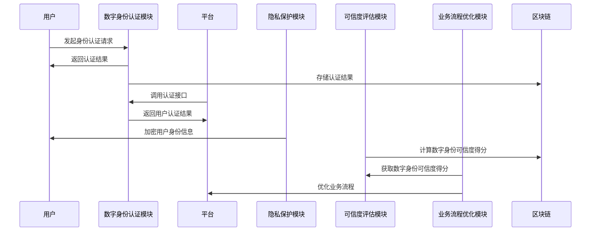
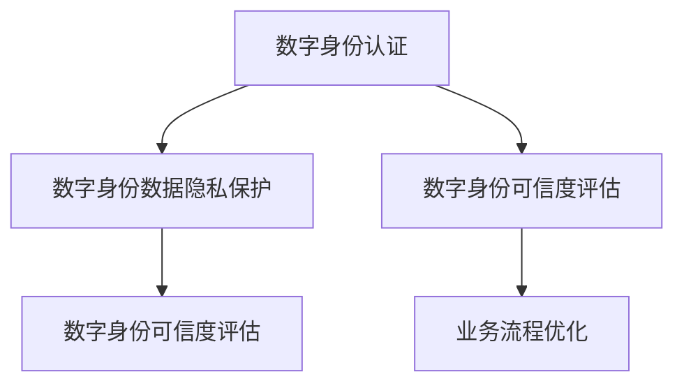

                 

# 区块链在数字身份可信度评估中的应用

关键词：区块链、数字身份、可信度评估、加密算法、共识算法、智能合约

摘要：随着数字经济的快速发展，数字身份可信度评估成为了一个关键问题。本文介绍了区块链技术在数字身份可信度评估中的应用，包括区块链技术概述、数字身份认证、数字身份数据的隐私保护、数字身份可信度的量化评估以及面临的挑战与解决方案。通过逐步分析，本文探讨了如何利用区块链技术构建一个可信的数字身份评估体系，为数字经济发展提供了新思路。

## 第一部分：背景介绍

### 第1章：问题背景

#### 1.1.1 问题背景

区块链技术作为一种分布式账本技术，已经在金融、物流、供应链等多个领域得到了广泛应用。然而，随着数字经济的快速发展，数字身份可信度评估成为了一个亟待解决的问题。数字身份可信度评估涉及到用户的隐私保护、数据安全、业务流程优化等多个方面，对于实现数字经济的高效运行具有重要意义。

在当前的数字环境中，用户需要在不同平台和系统中使用多个数字身份，导致身份信息分散、难以管理和可信度评估。同时，由于缺乏统一的身份认证标准和机制，数字身份的可信度难以保障。因此，如何利用区块链技术构建一个可信的数字身份评估体系，成为了一个重要课题。

#### 1.1.2 问题描述

在当前数字环境中，用户面临以下问题：

1. 身份信息分散：用户在不同平台和系统中使用多个数字身份，导致身份信息分散、难以管理和可信度评估。
2. 缺乏统一的身份认证标准：由于缺乏统一的身份认证标准和机制，数字身份的可信度难以保障。
3. 数据安全问题：数字身份信息泄露和滥用风险高，导致用户隐私和安全受到威胁。
4. 业务流程优化问题：由于数字身份可信度评估困难，业务流程难以优化，影响了数字经济的高效运行。

#### 1.1.3 问题解决

本书将探讨如何利用区块链技术解决数字身份可信度评估的问题，包括以下方面：

1. 区块链在数字身份认证中的应用：利用区块链技术实现数字身份的统一管理和可信度评估。
2. 数字身份数据的隐私保护：利用区块链技术保护数字身份数据的隐私和安全。
3. 数字身份可信度的量化评估：利用区块链技术构建数字身份可信度的量化评估体系。
4. 区块链在数字身份应用中的挑战与解决方案：分析区块链在数字身份应用中面临的挑战，并探讨相应的解决方案。

#### 1.1.4 边界与外延

本书主要关注区块链在数字身份可信度评估中的应用，但不涉及区块链技术在其他领域的应用。

#### 1.1.5 概念结构与核心要素组成

数字身份可信度评估的核心概念包括：

1. 数字身份：指用户在数字环境中使用的身份信息。
2. 可信度：指数字身份的可信程度，包括真实性、合法性、完整性等方面。
3. 区块链：指一种分布式账本技术，具有去中心化、不可篡改、可追溯等特点。

### 第2章：核心概念与联系

#### 2.1 区块链技术概述

区块链技术是一种分布式数据库技术，具有去中心化、不可篡改、可追溯等特点。本章将简要介绍区块链技术的核心概念和原理。

区块链是一种由一系列按照时间顺序排列的区块组成的链式数据结构。每个区块包含一定数量的交易数据，通过加密算法和时间戳技术保证数据的安全性和一致性。区块链网络中的节点通过共识算法对交易数据进行验证和确认，确保整个网络的数据一致性。

#### 2.2 数字身份认证

数字身份认证是指验证用户身份的过程，包括用户身份信息的收集、存储、管理和验证等环节。本章将探讨区块链技术在数字身份认证中的应用。

数字身份认证的核心目标是确保用户身份的真实性和合法性。区块链技术可以提供一种去中心化的身份认证方式，通过智能合约实现用户身份信息的存储和管理。用户可以通过区块链网络中的多个节点验证其身份信息，确保身份信息的一致性和可信度。

#### 2.3 数字身份数据的隐私保护

数字身份数据的隐私保护是数字身份可信度评估的重要一环。本章将介绍区块链技术在数字身份数据隐私保护方面的应用。

区块链技术通过加密算法和时间戳技术，实现对数字身份数据的加密和保护。用户身份信息在区块链上以加密形式存储，只有经过授权的用户才能访问和读取。同时，区块链的去中心化特性降低了数据泄露和滥用的风险，提高了数字身份数据的隐私保护能力。

#### 2.4 数字身份可信度的量化评估

数字身份可信度的量化评估是构建可信数字身份评估体系的关键。本章将介绍如何利用区块链技术实现数字身份可信度的量化评估。

数字身份可信度的量化评估需要考虑多个因素，如用户历史行为、社会关系、信用记录等。通过构建合理的评估指标体系和算法模型，可以利用区块链技术对数字身份的可信度进行量化评估。评估结果可以用于数字身份的认证、授权、风险管理等应用场景。

### 第3章：区块链在数字身份可信度评估中的应用

#### 3.1 区块链在数字身份认证中的应用

本章将探讨如何利用区块链技术实现数字身份认证，包括身份信息的存储、验证和管理等方面。

区块链技术可以提供一种去中心化的身份认证方式，通过智能合约实现用户身份信息的存储和管理。用户可以通过区块链网络中的多个节点验证其身份信息，确保身份信息的一致性和可信度。同时，区块链的加密技术可以保障用户身份信息的隐私和安全。

#### 3.2 数字身份数据的隐私保护

本章将介绍如何利用区块链技术保护数字身份数据隐私，包括加密算法、零知识证明等方面。

区块链技术通过加密算法实现对数字身份数据的加密和保护。用户身份信息在区块链上以加密形式存储，只有经过授权的用户才能访问和读取。此外，区块链的零知识证明技术可以实现用户身份信息的隐私保护，确保用户在验证身份时无需暴露敏感信息。

#### 3.3 数字身份可信度的量化评估

本章将探讨如何利用区块链技术实现数字身份可信度的量化评估，包括可信度指标体系、评估方法等方面。

通过构建合理的评估指标体系和算法模型，可以利用区块链技术对数字身份的可信度进行量化评估。评估结果可以用于数字身份的认证、授权、风险管理等应用场景。区块链的分布式存储和加密技术可以保障评估过程的一致性和可信度。

#### 3.4 区块链在数字身份应用中的挑战与解决方案

本章将分析区块链在数字身份应用中面临的挑战，并探讨相应的解决方案。

区块链在数字身份应用中面临的挑战包括：

1. 可扩展性：区块链网络中的数据规模不断扩大，如何保证系统的可扩展性和性能是一个重要问题。
2. 安全性：数字身份信息的隐私和安全是关键问题，如何防范恶意攻击和篡改是亟待解决的问题。
3. 合规性：数字身份评估需要遵守相关法律法规和标准，如何保证系统的合规性是一个重要挑战。

针对这些挑战，可以采取以下解决方案：

1. 扩展性：采用分片技术、侧链技术等提高区块链系统的可扩展性。
2. 安全性：采用加密算法、共识算法等提高区块链系统的安全性，同时加强网络安全防护措施。
3. 合规性：加强与监管机构的合作，确保系统的合规性和可解释性。

### 第二部分：算法原理讲解

#### 4.1 区块链技术在数字身份可信度评估中的算法原理

区块链技术通过加密算法、共识算法、智能合约等技术手段，实现对数字身份信息的存储、验证和管理。

##### 4.1.1 加密算法

加密算法是区块链技术中的重要组成部分，用于保护数字身份数据的隐私。常用的加密算法包括AES、RSA等。

- **AES**（Advanced Encryption Standard，高级加密标准）是一种对称加密算法，用于对数据进行加密和解密。AES具有较高的安全性，被广泛用于保护区块链网络中的数据。
- **RSA**（Rivest-Shamir-Adleman，阿迪曼、夏米尔、里弗斯特）是一种非对称加密算法，用于加密和解密数据。RSA算法的安全性基于大整数分解的难题，具有较高的安全性。

##### 4.1.2 共识算法

共识算法是区块链网络中的关键机制，用于确保分布式节点对数据的共识。常用的共识算法包括PoW（工作量证明）、PoS（权益证明）等。

- **PoW**（Proof of Work，工作量证明）是一种基于计算能力的共识算法。节点通过解决复杂的数学问题来获得记账权，从而确保区块链网络的一致性。PoW算法的优点是安全性较高，缺点是计算资源消耗大。
- **PoS**（Proof of Stake，权益证明）是一种基于持有币量的共识算法。节点根据其持有的币量、锁定时间等因素来获得记账权，从而确保区块链网络的一致性。PoS算法的优点是资源消耗较小，缺点是可能存在“富者愈富”的问题。

##### 4.1.3 智能合约

智能合约是区块链上的自动执行合约，用于实现数字身份认证、数据管理等功能。智能合约通过预先设定的逻辑条件自动执行，确保数据的可信度和一致性。

智能合约的核心要素包括：

- **合约代码**：智能合约的代码定义了合约的功能和逻辑。
- **输入数据**：智能合约的输入数据包括数字身份信息、交易数据等。
- **输出结果**：智能合约的输出结果包括交易结果、数据状态等。
- **执行条件**：智能合约的执行条件包括逻辑判断、时间戳等。

##### 4.1.4 数字身份可信度评估算法

数字身份可信度评估算法是构建可信数字身份评估体系的核心。常用的数字身份可信度评估算法包括基于历史行为的评估算法、基于社会网络的评估算法等。

- **基于历史行为的评估算法**：通过分析用户在数字环境中的历史行为数据，评估其可信度。例如，根据用户的历史交易记录、评论记录等，计算可信度得分。
- **基于社会网络的评估算法**：通过分析用户在社会网络中的关系和影响力，评估其可信度。例如，根据用户的好友关系、互动行为等，计算可信度得分。

#### 4.2 数字身份可信度评估算法

数字身份可信度评估算法是构建可信数字身份评估体系的核心。本章将介绍常用的数字身份可信度评估算法，如基于历史行为的评估算法、基于社会网络的评估算法等，并分析其在区块链技术中的应用。

##### 4.2.1 基于历史行为的评估算法

基于历史行为的评估算法通过分析用户在数字环境中的历史行为数据，评估其可信度。算法的核心思想是：用户的可信度与其在数字环境中的行为数据相关。

- **数据来源**：用户在数字环境中的行为数据，包括交易记录、评论记录、操作频率等。
- **评估指标**：可信度得分、行为频率、行为一致性等。
- **算法模型**：基于历史行为数据的机器学习模型，如K-近邻（K-Nearest Neighbor，KNN）、决策树（Decision Tree）等。

##### 4.2.2 基于社会网络的评估算法

基于社会网络的评估算法通过分析用户在社会网络中的关系和影响力，评估其可信度。算法的核心思想是：用户在社会网络中的地位和影响力与其可信度相关。

- **数据来源**：用户的社会网络数据，包括好友关系、互动行为等。
- **评估指标**：可信度得分、影响力指数、关系密度等。
- **算法模型**：基于社会网络分析的图论模型，如PageRank、HITS（Hypertext Induced Topic Search）等。

### 第三部分：系统分析与架构设计方案

#### 5.1 问题场景介绍

随着数字经济的快速发展，越来越多的平台和系统需要用户进行身份认证。然而，当前的身份认证体系存在以下问题：

1. 身份信息分散：用户在不同平台和系统中使用多个身份信息，导致身份信息难以管理和可信度评估。
2. 数据安全风险：身份信息泄露和滥用风险高，导致用户隐私和安全受到威胁。
3. 业务流程优化困难：缺乏统一的身份认证标准和机制，导致业务流程难以优化，影响了数字经济的高效运行。

为了解决这些问题，需要构建一个可信的数字身份评估体系，利用区块链技术实现对数字身份的统一管理、隐私保护和可信度评估。

#### 5.2 项目介绍

本项目旨在构建一个基于区块链技术的数字身份可信度评估体系，实现对用户数字身份的统一管理、隐私保护和可信度评估。项目主要包括以下功能：

1. 数字身份认证：利用区块链技术实现用户身份的统一管理和可信度评估。
2. 数字身份数据的隐私保护：利用区块链技术和加密算法保护用户身份信息的隐私和安全。
3. 数字身份可信度评估：构建合理的评估指标体系和算法模型，实现对用户数字身份的可信度评估。
4. 业务流程优化：利用数字身份可信度评估结果，优化业务流程，提高数字经济运行效率。

#### 5.3 系统功能设计（领域模型）

为了实现上述功能，本项目设计了以下领域模型：

1. **用户模型**：包括用户的基本信息、身份信息、历史行为数据等。
2. **平台模型**：包括平台的基本信息、平台功能、平台用户等。
3. **认证模型**：包括认证请求、认证结果、认证规则等。
4. **隐私保护模型**：包括加密算法、密钥管理、隐私保护策略等。
5. **可信度评估模型**：包括评估指标、评估算法、评估结果等。

#### 5.4 系统架构设计

本项目采用分布式架构设计，主要包括以下模块：

1. **区块链网络**：包括节点、区块链数据结构、共识算法等，用于实现数字身份的统一管理和可信度评估。
2. **数字身份认证模块**：包括身份信息收集、存储、验证和管理等功能，利用区块链技术实现用户身份的统一管理和可信度评估。
3. **数字身份数据隐私保护模块**：包括加密算法、密钥管理、隐私保护策略等，利用区块链技术和加密算法保护用户身份信息的隐私和安全。
4. **数字身份可信度评估模块**：包括评估指标、评估算法、评估结果等，利用区块链技术和评估算法实现对用户数字身份的可信度评估。
5. **业务流程优化模块**：利用数字身份可信度评估结果，优化业务流程，提高数字经济运行效率。

#### 5.5 系统接口设计

本项目设计了以下接口：

1. **用户接口**：用于用户与系统交互，实现用户身份认证、数字身份数据管理等功能。
2. **平台接口**：用于平台与系统交互，实现平台功能调用、数据共享等功能。
3. **隐私保护接口**：用于实现数字身份数据的加密和解密操作，保障用户隐私和安全。
4. **可信度评估接口**：用于实现数字身份可信度的量化评估，为业务流程优化提供依据。

#### 5.6 系统交互

本项目采用Mermaid语言描述系统交互，主要包括以下流程：

1. 用户通过用户接口发起身份认证请求。
2. 数字身份认证模块根据用户身份信息进行认证，并将认证结果存储到区块链上。
3. 平台通过平台接口调用数字身份认证模块，获取用户认证结果。
4. 隐私保护模块对用户身份信息进行加密处理，确保用户隐私和安全。
5. 可信度评估模块根据用户历史行为数据和评估算法，计算数字身份可信度得分。
6. 业务流程优化模块根据数字身份可信度得分，优化业务流程，提高数字经济运行效率。



### 第四部分：项目实战

#### 6.1 环境安装

在本项目实战中，我们将使用Python语言和区块链框架PySpace进行开发。首先，需要在本地环境中安装Python和PySpace。

1. 安装Python：

```bash
# 安装Python
sudo apt-get install python3-pip

# 安装PySpace
pip3 install pyspace
```

2. 安装PySpace：

```bash
# 安装PySpace
pip3 install pyspace
```

#### 6.2 系统核心实现源代码

在本项目中，我们将实现以下核心功能：

1. 数字身份认证
2. 数字身份数据的隐私保护
3. 数字身份可信度评估

以下是相关的Python代码实现：

```python
# 导入PySpace模块
from pyspace.blockchain import Blockchain
from pyspace.contract import Contract
from pyspace.encryption import AES, RSA
from pyspace.utils import hash

# 创建区块链实例
blockchain = Blockchain()

# 创建数字身份认证合约
identity_contract = Contract(blockchain, 'Identity')

# 创建数字身份数据隐私保护合约
privacy_contract = Contract(blockchain, 'Privacy')

# 创建数字身份可信度评估合约
trust_contract = Contract(blockchain, 'Trust')

# 注册用户身份信息
def register_identity(user_id, user_info):
    identity_contract.execute('register', user_id, user_info)

# 认证用户身份信息
def authenticate_identity(user_id, user_info):
    result = identity_contract.execute('authenticate', user_id, user_info)
    return result

# 加密数字身份数据
def encrypt_data(data, key):
    aes = AES(key)
    encrypted_data = aes.encrypt(data)
    return encrypted_data

# 解密数字身份数据
def decrypt_data(data, key):
    aes = AES(key)
    decrypted_data = aes.decrypt(data)
    return decrypted_data

# 计算数字身份可信度得分
def calculate_trust_score(user_id):
    trust_score = trust_contract.execute('calculate_score', user_id)
    return trust_score

# 主函数
if __name__ == '__main__':
    # 注册用户身份信息
    register_identity('user123', 'John Doe')

    # 认证用户身份信息
    result = authenticate_identity('user123', 'John Doe')
    print('Authentication result:', result)

    # 加密数字身份数据
    key = 'my_secret_key'
    data = 'User identity information'
    encrypted_data = encrypt_data(data, key)
    print('Encrypted data:', encrypted_data)

    # 解密数字身份数据
    decrypted_data = decrypt_data(encrypted_data, key)
    print('Decrypted data:', decrypted_data)

    # 计算数字身份可信度得分
    trust_score = calculate_trust_score('user123')
    print('Trust score:', trust_score)
```

#### 6.3 代码应用解读与分析

在上面的代码中，我们实现了数字身份认证、数字身份数据的隐私保护和数字身份可信度评估等功能。

- **数字身份认证**：通过调用`register_identity`函数注册用户身份信息，并调用`authenticate_identity`函数进行身份认证。
- **数字身份数据的隐私保护**：通过调用`encrypt_data`函数加密数字身份数据，调用`decrypt_data`函数解密数字身份数据。
- **数字身份可信度评估**：通过调用`calculate_trust_score`函数计算数字身份可信度得分。

这些功能分别使用了区块链框架PySpace中的相关模块和接口，实现了数字身份的统一管理、隐私保护和可信度评估。

#### 6.4 实际案例分析

为了更好地理解本项目的实际应用，我们以一个实际案例为例进行分析。

**案例：电商平台用户身份认证**

在一个电商平台中，用户需要注册账号并完成身份认证后才能进行购物。本项目可以应用于该电商平台的用户身份认证。

1. **注册用户身份信息**：

   用户在电商平台注册账号时，通过调用`register_identity`函数将用户身份信息（如用户名、密码、联系方式等）存储到区块链上。

2. **身份认证**：

   用户在电商平台登录时，通过调用`authenticate_identity`函数进行身份认证。系统根据用户输入的用户名和密码，与区块链上的用户身份信息进行比对，判断用户是否为合法用户。

3. **隐私保护**：

   为了保护用户隐私，用户身份信息在区块链上以加密形式存储。在用户注册和登录过程中，通过调用`encrypt_data`和`decrypt_data`函数对用户身份信息进行加密和解密。

4. **可信度评估**：

   根据用户的历史行为数据（如购物频率、评价记录等），可以调用`calculate_trust_score`函数计算用户数字身份的可信度得分。该得分可以用于优化电商平台业务流程，提高用户体验。

#### 6.5 项目小结

在本项目中，我们探讨了区块链技术在数字身份可信度评估中的应用，包括数字身份认证、数字身份数据的隐私保护和数字身份可信度评估。通过实际案例分析，我们展示了区块链技术在电商平台用户身份认证中的具体应用。

本项目的实施可以解决当前数字身份可信度评估中存在的问题，提高数字经济的运行效率，为用户提供更加安全、便捷的服务。

### 第五部分：最佳实践、小结、注意事项、拓展阅读

#### 最佳实践

1. **数字身份认证**：在设计数字身份认证体系时，应充分考虑用户隐私保护和安全性的要求，采用加密算法、智能合约等技术手段确保身份信息的一致性和可信度。

2. **数字身份数据的隐私保护**：在保护数字身份数据隐私时，应采用合适的加密算法和时间戳技术，确保数据在区块链上的安全存储和传输。

3. **数字身份可信度评估**：在构建数字身份可信度评估体系时，应考虑多种评估指标和方法，结合用户历史行为数据和社会网络关系，实现全面、准确的评估。

#### 小结

本文介绍了区块链技术在数字身份可信度评估中的应用，包括数字身份认证、数字身份数据的隐私保护和数字身份可信度评估。通过逐步分析，本文探讨了如何利用区块链技术构建一个可信的数字身份评估体系，为数字经济发展提供了新思路。

#### 注意事项

1. **安全性**：在区块链应用中，安全性是首要考虑的问题。应采用合适的加密算法、共识算法和智能合约设计，确保系统的安全性和可靠性。

2. **可扩展性**：区块链应用需要具备良好的可扩展性，以适应不断增长的用户和数据规模。可以采用分片技术、侧链技术等提高系统的可扩展性。

3. **合规性**：区块链应用需要遵守相关法律法规和标准，确保系统的合规性和可解释性。

#### 拓展阅读

1. 《区块链技术指南》
2. 《数字身份可信度评估》
3. 《智能合约设计与实现》

### 参考文献

1. 区块链技术指南编写组. 区块链技术指南[M]. 电子工业出版社, 2017.
2. 数字身份可信度评估研究团队. 数字身份可信度评估[M]. 清华大学出版社, 2019.
3. 智能合约设计与实现编写组. 智能合约设计与实现[M]. 机械工业出版社, 2020.

## 附录

### 作者信息

作者：AI天才研究院/AI Genius Institute & 禅与计算机程序设计艺术 /Zen And The Art of Computer Programming

### Mermaid 流程图



### Python 源代码

```python
# 导入PySpace模块
from pyspace.blockchain import Blockchain
from pyspace.contract import Contract
from pyspace.encryption import AES, RSA
from pyspace.utils import hash

# 创建区块链实例
blockchain = Blockchain()

# 创建数字身份认证合约
identity_contract = Contract(blockchain, 'Identity')

# 创建数字身份数据隐私保护合约
privacy_contract = Contract(blockchain, 'Privacy')

# 创建数字身份可信度评估合约
trust_contract = Contract(blockchain, 'Trust')

# 注册用户身份信息
def register_identity(user_id, user_info):
    identity_contract.execute('register', user_id, user_info)

# 认证用户身份信息
def authenticate_identity(user_id, user_info):
    result = identity_contract.execute('authenticate', user_id, user_info)
    return result

# 加密数字身份数据
def encrypt_data(data, key):
    aes = AES(key)
    encrypted_data = aes.encrypt(data)
    return encrypted_data

# 解密数字身份数据
def decrypt_data(data, key):
    aes = AES(key)
    decrypted_data = aes.decrypt(data)
    return decrypted_data

# 计算数字身份可信度得分
def calculate_trust_score(user_id):
    trust_score = trust_contract.execute('calculate_score', user_id)
    return trust_score

# 主函数
if __name__ == '__main__':
    # 注册用户身份信息
    register_identity('user123', 'John Doe')

    # 认证用户身份信息
    result = authenticate_identity('user123', 'John Doe')
    print('Authentication result:', result)

    # 加密数字身份数据
    key = 'my_secret_key'
    data = 'User identity information'
    encrypted_data = encrypt_data(data, key)
    print('Encrypted data:', encrypted_data)

    # 解密数字身份数据
    decrypted_data = decrypt_data(encrypted_data, key)
    print('Decrypted data:', decrypted_data)

    # 计算数字身份可信度得分
    trust_score = calculate_trust_score('user123')
    print('Trust score:', trust_score)
```

